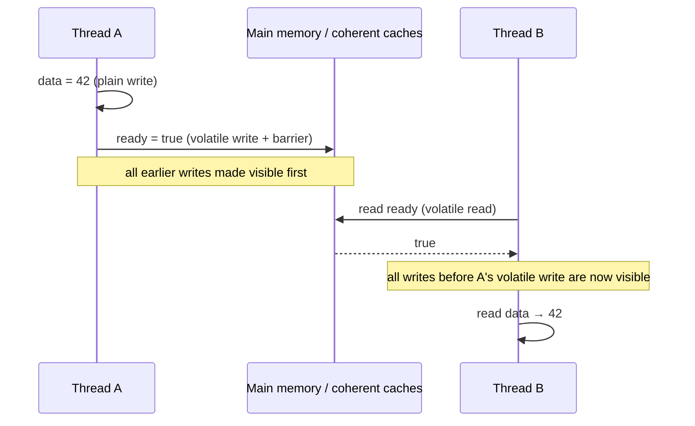

# Java `volatile`: in depth

## 1. The problem it solves

Two things break multi-threaded code even when the logic looks right:

| Problem | Cause | Example |
|---|---|---|
| **Visibility** | Each core has registers, store buffers and caches. A write by thread A may not reach thread B for a while. The JIT may also keep a variable in a register. | B spins forever on a flag that A already set. |
| **Reordering** | The compiler, JIT and CPU may reorder instructions as long as a *single thread* can't tell. | Another thread sees `ready = true` before `data = 42`. |

```java
class Worker {
    boolean running = true;               // not volatile

    void loop() { while (running) { /* work */ } }
    void stop() { running = false; }
}
```

Without `volatile`, the JIT can legally hoist the read of `running` out of the loop:

```java
if (running) { while (true) { /* work */ } }
```

`stop()` then never takes effect. Making the field `volatile` forbids that.

## 2. What `volatile` guarantees

| Guarantee | Yes/No |
|---|---|
| **Visibility**: a read sees the latest write by any thread | Yes |
| **Ordering**: writes before a volatile write can't be reordered after it, and reads after a volatile read can't be reordered before it | Yes |
| **Atomicity of single read/write**, including `long` and `double` (no word tearing) | Yes |
| **Atomicity of compound actions** (`count++`, check-then-act) | **No** |
| **Mutual exclusion** (no locking, no blocking) | **No** |

## 3. The formal rule: happens-before

The Java Memory Model (JMM) says:

> A write to a volatile variable *happens-before* every subsequent read of that same variable.

Two consequences matter in interviews:

1. **Total order.** All volatile reads and writes (to all volatile variables) behave as if they occur in one global order that every thread agrees on. They are sequentially consistent.
2. **Piggybacking.** Happens-before is transitive, so everything thread A did *before* the volatile write is visible to thread B *after* it reads that volatile.

```java
int data = 0;                  // plain
volatile boolean ready = false;

// Thread A                    // Thread B
data = 42;          // (1)     while (!ready) { }   // (3)
ready = true;       // (2)     print(data);         // (4) always 42
```

(1) happens-before (2) by program order. (2) happens-before (3) by the volatile rule. (3) happens-before (4) by program order. By transitivity, (1) happens-before (4). `data` is plain, but it is safely published through `ready`.



## 4. How it is implemented

Implementation happens at two levels, and the JMM defines *what* must hold, not *how*.

### a) Compiler / JIT level
- A volatile field is never cached in a register across accesses, and reads are never hoisted out of loops.
- The JIT won't reorder other memory operations across volatile accesses in the forbidden directions.
- In bytecode, the field gets the `ACC_VOLATILE` flag. There are no special instructions, just `getfield` and `putfield` on a flagged field.

### b) CPU level: memory barriers (fences)
HotSpot inserts barriers following the JSR-133 model:

| Barrier | Where | Purpose |
|---|---|---|
| `StoreStore` | before a volatile store | earlier writes become visible before the volatile write |
| `StoreLoad` | after a volatile store | the volatile write is globally visible before any later read (**the expensive one**) |
| `LoadLoad` | after a volatile load | later reads can't move before the volatile load |
| `LoadStore` | after a volatile load | later writes can't move before the volatile load |

In effect, a volatile **write** has *release* semantics plus a full fence after it. A volatile **read** has *acquire* semantics.

### c) Actual machine code

| Architecture | Volatile read | Volatile write |
|---|---|---|
| **x86 / x64** | plain `mov` (x86 is already strong: loads aren't reordered with loads, stores aren't reordered with stores) | `mov` followed by `lock addl $0, (%rsp)`, which acts as a `StoreLoad` fence |
| **ARM64** | `ldar` (load-acquire) | `stlr` (store-release) |
| **older ARM / POWER** | load + `dmb` / `sync` barriers | `dmb` + store + `dmb` |

On x86, the only barrier you really pay for is `StoreLoad` after a volatile store. The reason is that x86 uses **store buffers**: a core can read its own buffered store before it reaches the cache, so a later load could appear to execute before the earlier store became visible. That is the one reordering x86 allows, and the `lock`-prefixed instruction drains the store buffer to stop it.

### d) Cache coherence
Modern CPUs keep caches coherent with a protocol such as MESI. Once a write leaves the store buffer, other cores see it by invalidating their cached copy. Volatile does **not** "flush to main memory" literally, a common oversimplification. It makes sure the write leaves the store buffer and orders it correctly. Coherence then handles propagation.

## 5. Classic use cases

**1. Stop flag / status flag**
```java
private volatile boolean shutdown;
void shutdown() { shutdown = true; }
void run() { while (!shutdown) { doWork(); } }
```

**2. Safe publication of an immutable or effectively immutable object**
```java
private volatile Config config;           // writer builds a new Config, then assigns
void reload() { config = loadNewConfig(); }
```

**3. Double-checked locking (needs volatile)**
```java
class Singleton {
    private static volatile Singleton instance;

    static Singleton get() {
        if (instance == null) {
            synchronized (Singleton.class) {
                if (instance == null) instance = new Singleton();
            }
        }
        return instance;
    }
}
```
`new Singleton()` is really three steps: allocate memory, run the constructor, assign the reference. Without `volatile`, steps 2 and 3 can be reordered, so another thread could see a non-null reference to a **half-constructed object**. Volatile forbids that reordering.

**4. One writer, many readers** (for example a counter or timestamp only one thread updates).

## 6. What `volatile` does NOT do

### Compound operations are not atomic
```java
volatile int count;
count++;      // read, add, write: three steps, so updates can be lost
```

Two threads can both read 5 and both write 6. Fix it with `AtomicInteger.incrementAndGet()`, which uses CAS (`lock cmpxchg` on x86), or with `synchronized`.

### Volatile applies to the reference, not the object
```java
volatile List<String> list = new ArrayList<>();
list.add("x");        // the add is NOT protected. Only reads/writes of 'list' are volatile.
```

The same applies to arrays: `volatile int[] arr` makes the **reference** volatile, not the elements. Use `AtomicIntegerArray` or `VarHandle` for element-level semantics.

### Check-then-act
```java
if (!initialized) { initialize(); initialized = true; }   // race condition
```

## 7. `volatile` vs `synchronized` vs `Atomic*`

| | `volatile` | `synchronized` | `AtomicXxx` |
|---|---|---|---|
| Visibility | Yes | Yes | Yes |
| Ordering | Yes | Yes | Yes |
| Atomic compound ops | No | Yes | Yes, for supported ops (CAS) |
| Mutual exclusion | No | Yes | No |
| Blocking | Never | Yes (contended) | Never (lock-free) |
| Scope | One variable | Block or method, many variables | One variable (or array) |
| Cost | Low (a fence on writes) | Higher when contended | Low to medium (CAS retries) |

**Rule of thumb:** use `volatile` when writes don't depend on the current value, or when only one thread writes, and the variable is independent of other state (no invariants spanning multiple variables).

## 8. `long` and `double`

Without `volatile`, the JLS allows a 64-bit read or write to be split into two 32-bit halves (**word tearing**). A reader can see half of one write and half of another. Declaring the field `volatile` makes reads and writes atomic. In practice 64-bit JVMs on modern hardware don't tear, but the spec only guarantees it with `volatile`.

## 9. Performance notes

- Volatile **reads** are cheap, nearly free on x86.
- Volatile **writes** cost a `StoreLoad` fence, roughly tens of cycles. That is still much cheaper than a contended lock.
- Volatile blocks some JIT optimizations such as hoisting, reordering and register allocation. Don't mark everything volatile "just in case".
- **False sharing:** a hot volatile field sharing a cache line with other hot fields causes cache-line ping-pong between cores. This is why `@Contended` and padding exist.

## 10. Modern alternatives (Java 9+)

`VarHandle` gives finer-grained modes than all-or-nothing volatile:

| Mode | Meaning |
|---|---|
| plain | no ordering guarantees |
| opaque | atomic, coherent per variable, no ordering across variables |
| acquire/release | one-way barriers (cheaper than full volatile) |
| volatile | full sequential consistency |

## 11. Common interview questions

1. **Does `volatile` make `i++` thread-safe?** No. It is a read-modify-write of three steps. Use `AtomicInteger` or `synchronized`.
2. **Why does double-checked locking need `volatile`?** To prevent reordering of the reference assignment before constructor completion, which would expose a partially constructed object.
3. **Does `volatile` flush to main memory?** Not literally. It ensures the write leaves the store buffer and is ordered via fences, and cache coherence does the rest.
4. **Can `volatile` replace `synchronized`?** Only when there is no compound action or multi-variable invariant.
5. **Are writes before a volatile write visible after a volatile read?** Yes, through happens-before and transitivity. This is piggybacking.
6. **Can a `volatile` variable be `null`/an object?** Yes. Only the reference is volatile.
7. **Can a field be both `final` and `volatile`?** No, that is a compile error. They are contradictory.
8. **What is the difference between visibility and atomicity?** Visibility means other threads see the write. Atomicity means the operation can't be interleaved. Volatile gives the first, not the second (except single reads and writes).

## 12. One-line summary

> `volatile` = **visibility + ordering** for one variable, enforced by compiler restrictions and memory barriers, with **no** atomicity for compound operations and **no** locking.

If you want, the next step could be `volatile` vs `synchronized` at the happens-before and monitor level, or CAS and `Atomic*` internals.


---------------------------------------------------
---------------------------------------------------
---------------------------------------------------
---------------------------------------------------
---------------------------------------------------


# Java `volatile`: corrected interview answer

Same layered structure as before, with the wrong parts fixed and simpler words.

## Step 1: The hook (30 seconds)

> "`volatile` is a field modifier in Java for multithreading. It gives two guarantees for that variable: **visibility** and **ordering**. If one thread writes to a volatile variable, any thread that reads it afterwards will see that write. It does **not** give atomicity or locking."

**Fixed:** I removed "immediately" and "bypassing CPU caches". The Java rules guarantee visibility and ordering, not timing, and the CPU still uses its caches.

## Step 2: How it works

> "Without `volatile`, two things can go wrong.
>
> **1. Visibility problem.** The JIT compiler may keep the variable in a CPU register, or move a read out of a loop. The CPU may also hold a write in its store buffer for a while. So a reader thread may never see the new value.
>
> **2. Reordering problem.** The compiler and the CPU can change the order of instructions to run faster. One thread can then see writes in a different order than they were written.
>
> `volatile` fixes both through the **happens-before rule** in the Java Memory Model: *a write to a volatile variable happens-before every later read of the same variable.* That means everything the writer did *before* the volatile write is visible to the reader *after* the volatile read.
>
> The JVM does this in two ways. It stops the compiler from caching or reordering around the variable. It also adds **memory barriers** (fences) in the machine code. On x86, a volatile read is a normal load, and a volatile write gets a `StoreLoad` fence after it. The CPU's cache coherence protocol then spreads the update to other cores."

**Fixed:**

| Old (wrong) | New (correct) |
|---|---|
| Writes go straight to main memory | The write leaves the store buffer, and cache coherence does the rest |
| Readers invalidate their cache | Hardware coherence does that for all variables already |
| Stale data sits in L1/L2 | Stale data comes from registers (JIT) and store buffers |

## Step 3: What it does NOT do

> "`volatile` does not give **atomicity** and does not give **mutual exclusion**.
>
> `count++` is three steps: read, add, write. If two threads do it at the same time, both may read 5 and both write 6, so one update is lost. Volatile can't prevent that. For this we use `AtomicInteger` (which uses CAS) or `synchronized`.
>
> Also, `volatile` protects only the **reference**. If I have `volatile int[] arr`, then `arr = newArray` is visible to everyone, but `arr[0] = 5` is not protected."

```java
volatile int count;
count++;                 // NOT thread-safe

AtomicInteger count = new AtomicInteger();
count.incrementAndGet(); // thread-safe
```

## Step 4: Real use cases

> "**1. Stop flag.** One thread sets a flag to `false`, and a worker thread checks it in a loop.
> **2. Safe publication.** A thread builds an object and assigns it to a volatile reference, and other threads then see a fully built object.
> **3. Double-checked locking** for singletons."

```java
private volatile boolean running = true;

void stop() { running = false; }
void run()  { while (running) { doWork(); } }
```

**The rule for when volatile is enough:** use it when there is one variable, no compound actions, and no rule that connects it to other variables.

## Step 5: Double-checked locking (interviewers love this)

```java
class Singleton {
    private static volatile Singleton instance;

    static Singleton getInstance() {
        if (instance == null) {                       // 1st check (no lock, fast)
            synchronized (Singleton.class) {
                if (instance == null) {               // 2nd check (with lock)
                    instance = new Singleton();
                }
            }
        }
        return instance;
    }
}
```

> "`new Singleton()` has three steps: allocate memory, run the constructor, assign the reference. Without `volatile`, the last two can be reordered. Another thread could see `instance != null` and use an object that is not fully built. `volatile` stops that reordering, so any thread that sees the reference also sees a fully built object."

**Follow-up answers:**
- *Why the first check without a lock?* To avoid locking cost after the object is created.
- *Why the second check?* Two threads may both pass the first check. The second check stops the second one from creating another instance.
- *A simpler option?* Use the **holder class idiom** or an **`enum` singleton**. They are thread-safe through class loading, with no `volatile`.

## Step 6: Follow-up Q&A

| Question | Short answer |
|---|---|
| `volatile` vs `synchronized`? | `volatile` gives visibility and ordering only, with no lock and no blocking. `synchronized` gives visibility, ordering, atomicity and mutual exclusion, and it can block. |
| Is `volatile` faster? | Yes. A read is almost free on x86, and a write costs one fence. No thread blocks and there is no OS context switch. |
| Does `volatile` flush to main memory? | Not literally. It makes the write visible in the right order. Hardware cache coherence handles the rest. |
| Is `i++` safe on a volatile `int`? | No. Use `AtomicInteger` or `synchronized`. |
| Can a field be `final` and `volatile`? | No, it is a compile error. |
| Why is `long`/`double` special? | Without `volatile`, a 64-bit read or write may be split into two 32-bit halves (word tearing). `volatile` makes it atomic. |
| Does volatile protect array elements? | No. Only the array reference. Use `AtomicIntegerArray` or `VarHandle`. |
| Cost of overusing volatile? | It blocks some JIT optimizations. Hot volatile fields can also cause false sharing between cores. |

## The 20-second version (when time is short)

> "`volatile` guarantees visibility and ordering of a variable across threads, using the happens-before rule. The JVM implements it with compiler restrictions and memory barriers. It does not make compound operations like `i++` atomic, so for that I'd use `AtomicInteger` or `synchronized`. I use it for flags and for safe publication, like in double-checked locking."

Want to practice? I can ask you the follow-up questions one by one and give feedback on your answers.


To ace this question in a Java interview, you want to structure your answer using a "layered" approach. Start with a high-level summary, immediately pivot to the technical mechanics, and finish with practical usage and limitations. This demonstrates both theoretical depth and real-world coding experience.
Here is a blueprint of how to deliver this answer naturally.
------------------------------
## Step 1: The Hook (The 30-Second Summary)
Start with a concise, punchy definition that establishes the core purpose.

"In Java, the volatile keyword is a field modifier used in multithreading. Its primary purpose is to guarantee variable visibility across threads. When a field is marked as volatile, it ensures that any write to that variable is immediately visible to all reading threads, bypassing the thread's local CPU caches."

## Step 2: The Core Mechanics (How It Works)
Explain the "why" and "how" by mentioning memory architecture and instruction reordering.

"Under the hood, volatile solves two major problems:

   1. Visibility (Cache Coherency): Without volatile, a thread might cache a variable's value in its CPU core's L1/L2 cache. If another thread updates that variable, the first thread might keep reading its stale cached copy. volatile injects Memory Barriers at the hardware level, forcing the CPU to write updates straight to Main Memory, and forcing readers to invalidate their local caches and read directly from Main Memory.
   2. Instruction Reordering: The JVM and CPU often reorder code for performance. volatile enforces a Happens-Before relationship. It acts as a structural wall, preventing instructions written before a volatile write from leaking past it, ensuring proper sequence across threads."

## Step 3: The Critical Distinction (What it does NOT do)
Interviewers love to catch candidates here. Proactively clear up the confusion between volatile and synchronized.

"It’s equally important to note what volatile does not do. It does not provide atomicity or mutual exclusion.
For example, a simple compound operation like count++ is not thread-safe even if count is volatile. That's because count++ involves a read, a modify, and a write. If multiple threads write concurrently, you will still get race conditions. For atomicity, we still need synchronized blocks or classes from the java.util.concurrent.atomic package, like AtomicInteger."

## Step 4: Real-World Use Case
Provide a practical example of when you would actually use it.

"A classic, safe use case for volatile is a simple status or shutdown flag (like a boolean keepRunning). One thread modifies the flag to false, and a background thread constantly reads it to determine when to exit its loop safely.
It's also critical in the Double-Checked Locking pattern for Singletons to prevent a thread from reading a partially constructed object reference."

------------------------------
## 💡 Pro-Tips for Follow-Up Questions
Be prepared for the interviewer to dig deeper based on your response. If they do, remember these quick reference points:

* If they ask about Objects/Arrays: Remind them that volatile only protects the reference itself. If you make an array volatile, you can safely swap the entire array, but changing array[0] = 5 does not trigger volatile visibility for that specific element.
* If they ask about Performance: Mention that volatile is much lighter weight than synchronized because it doesn't block threads, context-switch the OS, or wait for locks. However, because it forces main memory access, it is slightly slower than reading standard local CPU registers.

Would you like to practice a specific follow-up question, such as how it specifically fixes the Double-Checked Locking Singleton issue?


---------------------------------------------------
---------------------------------------------------
---------------------------------------------------
---------------------------------------------------
---------------------------------------------------


# Java `volatile` — In-Depth Interview Guide

`volatile` is one of those Java keywords that looks simple but sits directly at the intersection of **Java Memory Model (JMM), CPU caches, compiler optimizations, CPU memory ordering, and multithreading**.

We’ll build it from first principles:

1. What problem does `volatile` solve?
2. Why normal variables can be problematic between threads
3. What `volatile` actually guarantees
4. **Visibility**
5. **Ordering / happens-before**
6. What `volatile` does **not** guarantee: atomicity
7. How `volatile` is implemented
8. JVM → CPU → cache/memory level
9. `volatile` vs `synchronized`
10. `volatile` with read/write operations
11. Common examples
12. Interview traps and questions

---

# 1. The Problem: Multiple Threads and Shared Memory

Consider:

```java
class Worker {

    private boolean running = true;

    void stop() {
        running = false;
    }

    void work() {
        while (running) {
            // do work
        }
    }
}
```

Two threads:

```text
Thread A                         Thread B
--------                         --------
work()                           stop()

while (running)                  running = false
    ↓
    ↓
    ↓
```

You might expect:

```text
Thread B:
running = false

        ↓

Thread A:
sees false
        ↓
loop terminates
```

But Java does **not** guarantee that this happens when `running` is an ordinary field.

This is where `volatile` comes in:

```java
private volatile boolean running = true;
```

Now Java establishes specific memory-ordering and visibility guarantees between threads.

---

# 2. What Does `volatile` Actually Mean?

A good interview definition is:

> **`volatile` is a Java field modifier that guarantees visibility of writes to other threads and establishes ordering constraints through the Java Memory Model, but it does not provide general-purpose atomicity for compound operations.**

There are three important concepts:

```text
volatile
   │
   ├── Visibility
   │
   ├── Ordering
   │
   └── NOT general atomicity
```

The first two are the important guarantees.

---

# 3. First Understand "Visibility"

Suppose:

```java
class Example {

    boolean flag = false;

    void writer() {
        flag = true;
    }

    void reader() {
        if (flag) {
            System.out.println("true");
        }
    }
}
```

We have:

```text
Thread 1                       Thread 2
--------                       --------
flag = true                   read flag
```

You might think there is only one value:

```text
             flag
              │
             true
```

But modern hardware is more complicated.

Conceptually:

```text
                Main Memory
                    │
              flag = false
                    │
          ┌─────────┴─────────┐
          ↓                   ↓
      CPU Core 1          CPU Core 2
      Cache / buffers     Cache / buffers
          │                   │
      Thread 1             Thread 2
```

The Java Memory Model allows various optimizations and does not require every ordinary read/write to immediately become observable by another thread.

So Thread 2 cannot simply assume:

> "Thread 1 wrote `true`, therefore I'll definitely see `true`."

Without an appropriate synchronization mechanism, there is no required cross-thread visibility relationship.

---

# 4. What `volatile` Changes

```java
private volatile boolean flag;
```

Now:

```text
Thread 1                         Thread 2

flag = true
   │
   │ volatile write
   ↓
 synchronization/order
   │
   └──────────────────────────────→
                                  volatile read
                                      │
                                      ↓
                                  sees true
```

The Java Memory Model provides a **happens-before relationship**:

```text
volatile write
      │
      │ happens-before
      ↓
subsequent volatile read
```

More precisely:

> A write to a volatile variable happens-before every subsequent read of that same variable.

This is one of the most important statements to remember for interviews.

---

# 5. The `happens-before` Relationship

Consider:

```java
class Example {

    private volatile boolean ready = false;

    private int data;

    void writer() {
        data = 42;
        ready = true;
    }

    void reader() {
        if (ready) {
            System.out.println(data);
        }
    }
}
```

This is interesting.

Thread 1:

```java
data = 42;
ready = true;
```

Thread 2:

```java
if (ready) {
    System.out.println(data);
}
```

Because `ready` is volatile:

```text
Thread 1                         Thread 2

data = 42
    │
    ↓
ready = true
    │
    │ volatile write
    │
    │ happens-before
    ↓
                              read ready
                                  │
                                  │ volatile read
                                  ↓
                              ready == true
                                  │
                                  ↓
                              read data
                                  │
                                  ↓
                                 42
```

This is extremely important.

The guarantee isn't only:

> "Thread 2 sees the latest value of `ready`."

It also establishes ordering/visibility for **ordinary writes that happened before the volatile write**.

Therefore:

```java
data = 42;
ready = true;
```

followed by:

```java
if (ready) {
    System.out.println(data);
}
```

is safely ordered.

---

# 6. Why Does This Work?

The Java Memory Model defines:

```text
volatile write
        ↓
happens-before
        ↓
volatile read
```

And happens-before has an important property:

> If A happens-before B, the effects of A are visible to B.

So:

```java
data = 42;       // A
ready = true;    // B
```

and:

```java
if (ready) {     // C
    print(data); // D
}
```

We have:

```text
A
↓
B
↓
C
↓
D
```

because:

```text
program order:
A → B

volatile synchronization:
B → C

program order:
C → D
```

Therefore:

```text
A → B → C → D
```

This is called the **transitivity of happens-before**.

---

# 7. But `volatile` Does NOT Make Operations Atomic

This is probably the most common interview trap.

Consider:

```java
volatile int counter = 0;
```

Then:

```java
counter++;
```

Is this thread-safe?

**No.**

Why?

Because:

```java
counter++;
```

is actually approximately:

```text
read counter
     ↓
add 1
     ↓
write counter
```

It is a compound operation.

Suppose:

```text
counter = 10
```

Two threads execute:

```java
counter++;
```

### Thread A

```text
read → 10
```

### Thread B

```text
read → 10
```

Then:

```text
Thread A: 10 + 1 = 11
Thread B: 10 + 1 = 11
```

Writes:

```text
Thread A → 11
Thread B → 11
```

Expected:

```text
12
```

Actual:

```text
11
```

So:

```java
volatile int counter;
```

does **not** make:

```java
counter++;
```

atomic.

---

# 8. Three Different Concepts

This distinction is extremely important.

| Property   | Meaning                                                                  |
| ---------- | ------------------------------------------------------------------------ |
| Visibility | Other threads can observe changes                                        |
| Atomicity  | Operation happens indivisibly                                            |
| Ordering   | Operations aren't improperly reordered across synchronization boundaries |

`volatile` gives you:

```text
✓ Visibility
✓ Ordering guarantees
✗ General atomicity
```

`synchronized` gives you:

```text
✓ Visibility
✓ Ordering
✓ Mutual exclusion / atomicity of protected critical section
```

---

# 9. How `volatile` Is Implemented

Now let's go deeper.

A common misconception is:

> "volatile means the variable is always stored directly in RAM."

That's **not the correct model**.

You should not explain volatile as:

```text
volatile variable → RAM
non-volatile variable → CPU cache
```

That's an oversimplification.

Modern CPUs have:

```text
CPU
 │
 ├── registers
 │
 ├── L1 cache
 │
 ├── L2 cache
 │
 └── L3 cache
       │
       ↓
   Main memory
```

But Java `volatile` is fundamentally specified by the **Java Memory Model**, not by "always read RAM."

The JVM implements those semantics using the facilities provided by the target CPU.

---

# 10. Java → JVM → CPU

Think about the implementation stack:

```text
Java source
     │
     ↓
Java Memory Model
     │
     ↓
JVM bytecode
     │
     ↓
JIT compiler
     │
     ↓
CPU instructions + memory-ordering mechanisms
     │
     ↓
CPU/cache-coherence system
```

The important part is:

> The JMM specifies the required behavior; the JVM/JIT chooses appropriate machine-level mechanisms to achieve it.

---

# 11. Bytecode Level

Suppose:

```java
private volatile int value;
```

The Java compiler records the field as volatile in the class metadata.

You can see this conceptually with:

```bash
javap -v MyClass
```

The field will have a:

```text
ACC_VOLATILE
```

flag.

So the JVM knows:

```text
value
 ↓
volatile
```

The JVM must preserve the required memory semantics.

---

# 12. JIT Compilation

The JIT compiler is allowed to optimize ordinary code.

For example:

```java
while (!running) {
}
```

For a normal field, the compiler may potentially reason about whether repeated reads are necessary based on the Java Memory Model.

But if:

```java
volatile boolean running;
```

then the compiler **cannot treat accesses like ordinary accesses**.

It must preserve the required volatile semantics.

Conceptually:

```text
normal read:

load value
   ↓
compiler may optimize/reorder where legal


volatile read:

load value
   +
required memory-ordering semantics
```

---

# 13. CPU Level

Now let's look at actual hardware.

Different CPU architectures have different memory-ordering models.

For example:

```text
x86 / x86-64
ARM / ARM64
RISC-V
```

do not necessarily have identical memory-ordering behavior.

The JVM therefore generates appropriate instructions/barriers for the target architecture.

Conceptually:

```text
volatile write
      ↓
store + required release/order semantics

volatile read
      ↓
load + required acquire/order semantics
```

The exact machine instructions depend on:

```text
JVM
+
CPU architecture
+
JIT compiler
+
JVM version
```

So don't say:

> "`volatile` always translates to instruction X."

That is not generally correct.

---

# 14. Acquire and Release

A very useful modern way of understanding volatile is:

```text
volatile write ≈ release
volatile read  ≈ acquire
```

This is a conceptual model rather than a literal Java syntax transformation.

Suppose:

```java
data = 42;
ready = true;       // volatile write
```

The volatile write acts like a **release**:

```text
ordinary writes
      │
      ↓
volatile write
      │
      ↓
release
```

And:

```java
if (ready) {         // volatile read
    use(data);
}
```

The volatile read acts like an **acquire**:

```text
volatile read
      │
      ↓
acquire
      │
      ↓
subsequent reads
```

Therefore:

```text
Thread A

data = 42
    ↓
volatile ready = true
    ↓
       synchronization
             ↓
Thread B
             ↓
volatile read ready
    ↓
read data
```

---

# 15. Why Memory Barriers Are Needed

Compilers and CPUs can reorder operations when the observable behavior remains valid according to the memory model.

For example:

```java
data = 42;
ready = true;
```

The compiler/CPU might otherwise have freedom to reorder operations internally.

But the synchronization contract requires:

```text
data write
    ↓
ready volatile write
```

to have the appropriate ordering.

So the JVM uses **memory barriers / fences** and/or architecture-specific instructions.

Conceptually:

```text
data = 42;

        ↓
   RELEASE BARRIER

ready = true;
```

And on the reader:

```text
read ready;

        ↓
   ACQUIRE BARRIER

read data;
```

Again, don't interpret this as necessarily meaning the CPU executes a literal standalone instruction called `RELEASE BARRIER`. Modern implementations can use different mechanisms.

---

# 16. CPU Cache Coherence

Another common interview misconception:

> "volatile flushes the variable to RAM."

Not quite.

Modern processors generally maintain **cache coherence**.

Conceptually:

```text
Core 1                  Core 2
  │                       │
 L1                      L1
  │                       │
  └──────── L3 ───────────┘
             │
           RAM
```

Protocols such as variants of **MESI/MOESI** help maintain cache coherence.

The JVM doesn't need to bypass caches entirely.

Instead, it needs to ensure the required **visibility and ordering semantics**.

So think:

```text
volatile
   ↓
JMM guarantees
   ↓
JVM/JIT implementation
   ↓
CPU memory ordering + cache coherence
```

not:

```text
volatile → RAM
```

---

# 17. Example: Stop Flag

This is the classic legitimate use.

```java
class Worker {

    private volatile boolean running = true;

    void run() {
        while (running) {
            doWork();
        }
    }

    void stop() {
        running = false;
    }

    private void doWork() {
        // ...
    }
}
```

Thread A:

```java
worker.run();
```

Thread B:

```java
worker.stop();
```

Because `running` is volatile:

```text
Thread B
   │
   │ running = false
   ↓
volatile write
   │
   │ happens-before
   ↓
Thread A
   │
   │ volatile read
   ↓
running == false
   │
   ↓
loop terminates
```

This is exactly the kind of problem `volatile` is designed for.

---

# 18. Example: Publishing Configuration

Another useful example:

```java
class ConfigHolder {

    private Config config;

    private volatile boolean initialized;

    void initialize() {
        config = loadConfig();
        initialized = true;
    }

    Config getConfig() {
        if (initialized) {
            return config;
        }

        return null;
    }
}
```

The important ordering is:

```text
config = loadConfig();
        ↓
initialized = true;    // volatile
```

Reader:

```text
read initialized       // volatile
        ↓
if true
        ↓
read config
```

The volatile publication establishes the required visibility/order relationship.

---

# 19. `volatile` Reference vs Object

Important subtlety:

```java
private volatile Config config;
```

does **not** mean the entire `Config` object becomes magically thread-safe.

For example:

```java
config.setName("abc");
```

is not automatically synchronized just because:

```java
config
```

is a volatile reference.

`volatile` applies to the **reference variable**:

```text
config
  │
  └── volatile reference
       │
       ↓
     object
```

It doesn't automatically make every field inside the object volatile.

---

# 20. Very Important Example

```java
class Config {
    int timeout;
}

private volatile Config config;
```

This:

```java
config = new Config();
```

has volatile-reference semantics.

But this:

```java
config.timeout = 100;
```

is an ordinary field write.

If multiple threads mutate:

```java
config.timeout
```

you need appropriate synchronization for that mutable state.

---

# 21. `volatile` and Singleton

You may have seen:

```java
public class Singleton {

    private static volatile Singleton instance;

    public static Singleton getInstance() {

        if (instance == null) {

            synchronized (Singleton.class) {

                if (instance == null) {
                    instance = new Singleton();
                }
            }
        }

        return instance;
    }
}
```

This is the famous **double-checked locking** pattern.

Why is `volatile` required?

Because:

```java
instance = new Singleton();
```

is conceptually not just one simple conceptual action.

Object construction involves:

```text
allocate memory
      ↓
initialize object
      ↓
publish reference
```

Without the required memory-ordering guarantees, another thread could potentially observe an improperly ordered publication.

`volatile` establishes the required publication semantics.

---

# 22. `volatile` Does Not Mean "Thread Safe"

This is another interview trap.

Consider:

```java
class Counter {

    private volatile int count;

    void increment() {
        count++;
    }
}
```

This is **not thread-safe**.

Why?

```text
volatile
   ↓
visibility + ordering

but

count++
   ↓
read + modify + write
   ↓
not atomic
```

Use:

```java
AtomicInteger
```

or:

```java
synchronized
```

depending on the problem.

---

# 23. `volatile` vs `AtomicInteger`

Compare:

```java
volatile int count;
```

with:

```java
AtomicInteger count;
```

### `volatile`

```java
count++;
```

❌ not atomic.

### AtomicInteger

```java
count.incrementAndGet();
```

✅ atomic.

Conceptually:

```text
volatile
    ↓
visibility/order

AtomicInteger
    ↓
visibility/order
+
atomic read-modify-write operations
```

Atomic classes generally use **CAS (Compare-And-Set)** or related hardware/JVM primitives for their atomic operations.

---

# 24. `volatile` vs `synchronized`

Very important interview comparison.

| Feature                        | `volatile` | `synchronized`      |
| ------------------------------ | ---------- | ------------------- |
| Visibility                     | ✅          | ✅                   |
| Ordering                       | ✅          | ✅                   |
| Mutual exclusion               | ❌          | ✅                   |
| Compound operation atomicity   | ❌          | ✅                   |
| Lock acquisition               | ❌          | ✅                   |
| Lock release                   | ❌          | ✅                   |
| Suitable for simple state flag | ✅          | Usually unnecessary |
| Suitable for critical section  | ❌          | ✅                   |

Example:

```java
volatile boolean stopped;
```

Good.

But:

```java
volatile int balance;

balance -= amount;
```

Not sufficient.

Use synchronization/atomic operations.

---

# 25. What Exactly Does a Volatile Read Guarantee?

Suppose:

```java
volatile boolean ready;
int data;
```

Writer:

```java
data = 100;
ready = true;
```

Reader:

```java
if (ready) {
    System.out.println(data);
}
```

If the reader sees the volatile write:

```text
ready == true
```

then the preceding write:

```java
data = 100;
```

is ordered/visible to that reader through the happens-before relationship.

That's why volatile can be used as a **publication mechanism**.

---

# 26. What About Writes After the Volatile Write?

Consider:

```java
data1 = 10;
ready = true;
data2 = 20;
```

The volatile write only establishes the relevant ordering for operations before it.

Conceptually:

```text
data1 = 10
    ↓
volatile ready = true
    ↓
synchronization
    ↓
reader
```

But:

```text
data2 = 20
```

comes after the volatile publication and should **not** be treated as being published by that particular volatile write.

This is another useful interview distinction.

---

# 27. Volatile Ordering Is Stronger Than Just "Latest Value"

A common weak explanation is:

> "volatile tells the CPU to always get the latest value."

That's incomplete.

The more accurate explanation is:

```text
volatile
   │
   ├── visibility
   │
   ├── prevents certain compiler/JIT/CPU reorderings
   │
   └── creates happens-before relationship
```

This is why the following works:

```java
data = 42;
ready = true;
```

and:

```java
if (ready) {
    System.out.println(data);
}
```

The key mechanism is **happens-before**, not simply "read RAM."

---

# 28. Does Volatile Prevent All Reordering?

No.

This is another interview trap.

Don't say:

> "`volatile` prevents all instruction reordering."

Instead:

> `volatile` imposes the memory-ordering constraints required by the Java Memory Model around volatile accesses.

The compiler and CPU can still optimize operations where doing so doesn't violate the JMM.

So:

```text
volatile ≠ disable optimization
```

and:

```text
volatile ≠ global memory barrier around every instruction
```

---

# 29. Why Is `volatile` Usually Cheaper Than `synchronized`?

Conceptually:

```text
volatile
   ↓
memory-ordering / visibility
```

whereas:

```text
synchronized
   ↓
lock acquisition
   ↓
critical section
   ↓
lock release
```

Modern JVMs have highly optimized locking, so you shouldn't make simplistic claims like "`synchronized` is always slow."

But if all you need is:

```java
volatile boolean running;
```

using a lock would provide more machinery than necessary.

---

# 30. A Great Mental Model

Remember this:

```text
                    Java Memory Model
                           │
                           ↓
                      volatile
                           │
              ┌────────────┴────────────┐
              ↓                         ↓
         volatile write            volatile read
              │                         │
          RELEASE-like              ACQUIRE-like
              │                         │
              └──────────┬──────────────┘
                         ↓
                  happens-before
                         ↓
                  Visibility + Order
```

But:

```text
volatile
   │
   └────── NOT a general atomicity mechanism
```

---

# 31. The Classic Interview Question

### Q: What is `volatile` in Java?

Strong answer:

> `volatile` is a field modifier that tells the Java Memory Model that accesses to that field participate in volatile synchronization. A volatile write happens-before subsequent volatile reads of the same field, providing visibility and ordering guarantees between threads. It prevents the compiler/JIT and CPU from reordering operations in ways that would violate those guarantees. However, volatile does not provide mutual exclusion or make compound operations such as `count++` atomic.

That is a much better answer than:

> "`volatile` makes the variable visible to all threads."

---

# 32. Another Classic Question

### Q: Does volatile guarantee atomicity?

Answer:

> No, not for compound operations. A volatile read or write itself has the required atomicity for the variable access, but operations such as `count++`, `check-then-act`, or `read-modify-write` consist of multiple operations and are not made atomic by volatile.

Example:

```java
volatile int count;

count++;
```

Still unsafe for concurrent increments.

---

# 33. Another Interview Question

### Q: Why is `volatile` needed in double-checked locking?

Answer:

> Because publishing the constructed object requires correct visibility and ordering. Without volatile, another thread could observe the reference without the required guarantees about the object's initialization being visible in the correct order. Volatile provides the necessary happens-before relationship for safe publication.

---

# 34. Another Interview Question

### Q: Does volatile store the value directly in main memory?

Best answer:

> No. That's an oversimplification. Volatile is a Java Memory Model guarantee. The JVM/JIT implements those guarantees using appropriate compiler constraints, CPU memory-ordering instructions/fences, and the processor's cache-coherence mechanisms. It does not simply mean "always read and write RAM."

That's an **excellent senior-level interview distinction**.

---

# 35. The Full Picture

When you write:

```java
volatile boolean ready;
```

don't imagine:

```text
Java
 │
 ↓
RAM
```

Instead imagine:

```text
                 Java source
                     │
                     ↓
              Java Memory Model
                     │
              volatile semantics
                     │
                     ↓
                 JVM/JIT
                     │
          ┌──────────┴──────────┐
          ↓                     ↓
   compiler constraints    memory barriers /
                           architecture-specific
                           instructions
          │                     │
          └──────────┬──────────┘
                     ↓
                    CPU
                     │
              cache coherence
                     │
                     ↓
               shared memory
```

And the programmer-visible guarantee is:

```text
volatile write
      │
      │ happens-before
      ↓
volatile read
```

with:

```text
Visibility     ✅
Ordering       ✅
Atomicity      ❌ general compound operations
Mutual lock    ❌
```

---

# 36. When Should You Use `volatile`?

Good candidates:

### 1. Stop/shutdown flag

```java
private volatile boolean running;
```

### 2. State publication

```java
private volatile State state;
```

### 3. Configuration/reference publication

```java
private volatile Config config;
```

### 4. Simple state machines / flags

```java
private volatile boolean initialized;
```

But if you need:

```text
increment
decrement
check + update
multiple related fields
critical section
invariant across multiple variables
```

then `volatile` alone is usually insufficient.

Use:

```text
synchronized
AtomicInteger / AtomicReference
Lock
ConcurrentHashMap
other concurrency primitives
```

depending on the problem.

---

## The 5 things I'd memorize for interviews

```text
1. volatile provides visibility.

2. A volatile write happens-before a subsequent volatile
   read of the same variable.

3. volatile provides ordering guarantees.

4. volatile does NOT make compound operations atomic.

5. volatile is a JMM semantic; it does NOT simply mean
   "store/read directly from RAM."
```

The **most important conceptual distinction** is:

```text
                Thread Safety
                    │
        ┌───────────┼────────────┐
        ↓           ↓            ↓
    Visibility   Ordering     Atomicity
        │           │            │
        └────── volatile ────────┘
              only first 2
                   ↑
              NOT atomicity
```

If you understand that diagram, you understand the core of `volatile`.


---
---
---


Absolutely. In production systems, `volatile` is usually used for **small pieces of shared state where one thread publishes a new state and many threads need to observe it**, rather than for counters or business data.

Here are the most realistic examples.

---

# 1. Graceful Service Shutdown

This is probably the most classic production use case.

Imagine a Spring/Java service has worker threads processing jobs:

```java
public class Worker implements Runnable {

    private volatile boolean running = true;

    @Override
    public void run() {
        while (running) {
            processNextJob();
        }

        cleanup();
    }

    public void stop() {
        running = false;
    }

    private void processNextJob() {
        // process job
    }

    private void cleanup() {
        // release resources
    }
}
```

The application has:

```text
Main/Application Thread
          |
          | stop()
          ↓
   running = false
          |
          | volatile write
          ↓
     Worker Thread
          |
          | volatile read
          ↓
     while (running)
          |
          ↓
       exits
```

### Why `volatile`?

The worker may be running for hours:

```java
while (running) {
    processNextJob();
}
```

Another thread needs to tell it:

> "Stop processing."

`volatile` provides the visibility guarantee.

Without it, the Java Memory Model doesn't guarantee that the worker will observe the update in the required way.

### Production examples

You'll see this pattern in:

* background workers
* polling threads
* scheduled workers
* message consumers
* custom executors
* connection managers
* application shutdown logic

---

# 2. Enable/Disable a Feature Dynamically

Imagine a production service has a feature flag:

```java
public class FeatureManager {

    private volatile boolean newAlgorithmEnabled;

    public boolean isNewAlgorithmEnabled() {
        return newAlgorithmEnabled;
    }

    public void setNewAlgorithmEnabled(boolean enabled) {
        newAlgorithmEnabled = enabled;
    }
}
```

Requests are coming from hundreds of threads:

```text
             FeatureManager
                   |
          volatile boolean
                   |
        ┌──────────┼──────────┐
        ↓          ↓          ↓
     Request     Request    Request
     Thread 1    Thread 2   Thread 3
```

An admin/configuration thread changes:

```java
featureManager.setNewAlgorithmEnabled(true);
```

All request threads can subsequently observe the new value.

### Why not `synchronized`?

Because we're only interested in:

```text
read current state
```

and:

```text
publish new state
```

There's no complicated critical section.

`volatile` is a very natural fit.

---

# 3. Dynamic Configuration Reload

This is another very practical example.

Suppose a service periodically reloads configuration:

```java
public class ConfigurationManager {

    private volatile AppConfig config;

    public ConfigurationManager() {
        this.config = loadConfig();
    }

    public AppConfig getConfig() {
        return config;
    }

    public void reload() {
        AppConfig newConfig = loadConfig();

        config = newConfig;
    }

    private AppConfig loadConfig() {
        // read configuration
        return new AppConfig();
    }
}
```

Imagine:

```text
                Config Manager
                     |
                reload()
                     |
                     ↓
              new AppConfig
                     |
                     ↓
             volatile config
                     |
        ┌────────────┼────────────┐
        ↓            ↓            ↓
    Request 1    Request 2    Request 3
```

The important trick is:

> **Build the new immutable configuration completely, then atomically publish the reference.**

For example:

```java
AppConfig newConfig = loadConfig();

config = newConfig;
```

The assignment of the reference is the publication point.

---

# 4. Why This Is Better Than Mutating Configuration

Suppose you instead did:

```java
config.setTimeout(5000);
config.setRetryCount(3);
config.setEndpoint("...");
```

while request threads are simultaneously reading:

```java
config.getTimeout();
config.getRetryCount();
config.getEndpoint();
```

Now you can have partially updated configuration.

For example:

```text
Request Thread:

timeout = 5000
retryCount = OLD
endpoint = OLD
```

That's undesirable.

Instead:

```java
AppConfig newConfig = new AppConfig(
    5000,
    3,
    "https://..."
);

config = newConfig;
```

Now you effectively have:

```text
OLD CONFIG
     |
     | build completely
     ↓
NEW CONFIG
     |
     | volatile publication
     ↓
NEW CONFIG visible to readers
```

This is a very useful production pattern.

It becomes especially good if `AppConfig` is **immutable**.

---

# 5. Circuit Breaker State

Imagine implementing a simple circuit breaker.

States:

```text
CLOSED
   ↓
failures
   ↓
OPEN
   ↓
timeout
   ↓
HALF_OPEN
```

You might have:

```java
public class CircuitBreaker {

    private volatile State state = State.CLOSED;

    public boolean allowRequest() {
        return state != State.OPEN;
    }

    public void open() {
        state = State.OPEN;
    }

    public void close() {
        state = State.CLOSED;
    }

    enum State {
        CLOSED,
        OPEN,
        HALF_OPEN
    }
}
```

Many request threads read:

```java
if (state == State.OPEN) {
    rejectRequest();
}
```

while another thread changes:

```java
state = State.OPEN;
```

`volatile` ensures the state transition is visible.

### But there's an important catch

A real circuit breaker usually needs more than a simple state variable.

For example:

```text
failure count
last failure timestamp
state
half-open trial request
```

Those operations may need atomicity.

So you might combine:

```text
volatile
+
AtomicInteger
+
synchronized/Lock
```

depending on the implementation.

This is an excellent interview example because it demonstrates that:

> `volatile` can be one component of a concurrent design; it doesn't automatically make the whole object thread-safe.

---

# 6. Cache Refresh / Reference Swapping

Imagine a service maintains an in-memory lookup table:

```java
public class ProductCache {

    private volatile Map<Long, Product> products =
            Map.of();

    public Product get(long id) {
        return products.get(id);
    }

    public void refresh() {
        Map<Long, Product> newProducts = loadProducts();

        products = Map.copyOf(newProducts);
    }

    private Map<Long, Product> loadProducts() {
        // load from DB
        return ...;
    }
}
```

This is a **very useful production pattern**.

Readers:

```text
Request 1 ──┐
Request 2 ──┤
Request 3 ──┼──→ volatile Map reference
Request 4 ──┤
Request 5 ──┘
```

Refresh:

```text
Database
   ↓
load everything
   ↓
construct new Map
   ↓
publish new Map reference
```

Instead of locking every request:

```java
synchronized Map get(...)
```

you can have extremely cheap reads.

### Important requirement

The map should be immutable or otherwise safely published and not concurrently mutated.

For example:

```java
products = Map.copyOf(newProducts);
```

is a nice pattern.

---

# 7. Database Connection Pool / Health State

Imagine a component maintaining whether some dependency is currently available:

```java
public class DependencyHealth {

    private volatile boolean healthy = true;

    public boolean isHealthy() {
        return healthy;
    }

    public void markHealthy() {
        healthy = true;
    }

    public void markUnhealthy() {
        healthy = false;
    }
}
```

Request processing:

```java
if (!health.isHealthy()) {
    return fallback();
}
```

A monitoring thread might execute:

```java
health.markUnhealthy();
```

This is again:

```text
Monitoring thread
       |
       ↓
healthy = false
       |
       | volatile write
       ↓
request threads
       |
       ↓
isHealthy()
       |
       ↓
false
```

Typical examples:

* dependency health
* feature availability
* connection availability
* readiness state
* maintenance mode

---

# 8. Maintenance Mode

Imagine an API service has a production maintenance switch:

```java
public class MaintenanceManager {

    private volatile boolean maintenanceMode;

    public boolean isMaintenanceMode() {
        return maintenanceMode;
    }

    public void enable() {
        maintenanceMode = true;
    }

    public void disable() {
        maintenanceMode = false;
    }
}
```

Request handler:

```java
public Response handle(Request request) {

    if (maintenanceManager.isMaintenanceMode()) {
        return Response.serviceUnavailable();
    }

    return process(request);
}
```

Admin/control thread:

```java
maintenanceManager.enable();
```

This is a textbook volatile use case:

```text
control plane
     |
     ↓
change state
     |
     ↓
volatile
     |
     ↓
data plane
     |
     ↓
observe state
```

---

# 9. Leader / Primary State

Suppose a distributed application has a local representation of whether this instance is currently the leader:

```java
public class NodeState {

    private volatile boolean leader;

    public boolean isLeader() {
        return leader;
    }

    public void becomeLeader() {
        leader = true;
    }

    public void stepDown() {
        leader = false;
    }
}
```

Multiple request/worker threads might do:

```java
if (nodeState.isLeader()) {
    performLeaderOnlyTask();
}
```

while a coordination thread updates the state.

### But be careful

This alone is **not enough to implement distributed leader election**.

You still need something like:

```text
ZooKeeper
etcd
Consul
database lease
Kubernetes coordination
etc.
```

`volatile` only solves the **local JVM visibility problem**.

This distinction is important:

```text
volatile
   ↓
threads inside ONE JVM
```

It does not synchronize:

```text
JVM A  ←→  JVM B
```

---

# 10. Request-Level State / Snapshot Publishing

A sophisticated but common pattern is **immutable snapshot publishing**.

Imagine:

```java
public record RoutingConfig(
        String primary,
        List<String> replicas
) {}
```

Then:

```java
public class RoutingManager {

    private volatile RoutingConfig config;

    public RoutingConfig getConfig() {
        return config;
    }

    public void update(RoutingConfig newConfig) {
        config = newConfig;
    }
}
```

Requests:

```java
RoutingConfig config = routingManager.getConfig();

String primary = config.primary();
```

Another thread:

```java
routingManager.update(new RoutingConfig(...));
```

The entire snapshot changes at once.

This pattern is often called something like:

> **immutable snapshot + volatile publication**

It's a very powerful concurrency pattern.

---

# 11. What About Spring Applications?

Suppose you have:

```java
@Service
public class FeatureService {

    private volatile boolean enabled;

    public boolean isEnabled() {
        return enabled;
    }

    public void setEnabled(boolean enabled) {
        this.enabled = enabled;
    }
}
```

Spring itself does not magically make arbitrary mutable fields thread-safe.

A singleton Spring bean is generally shared by multiple request threads:

```text
                    Spring Singleton
                          |
                FeatureService
                          |
                    volatile enabled
                          |
       ┌──────────────────┼──────────────────┐
       ↓                  ↓                  ↓
 Request Thread 1   Request Thread 2   Request Thread 3
```

So if the bean contains mutable shared state, you need to reason about concurrency yourself.

`volatile` can be appropriate for simple state.

---

# 12. A Realistic Production Example

Let's combine several ideas.

Imagine an application has dynamic routing configuration:

```java
public record RoutingConfig(
        String primaryHost,
        int timeoutMs,
        boolean enabled
) {}
```

Manager:

```java
public class RoutingConfigManager {

    private volatile RoutingConfig config;

    public RoutingConfigManager() {
        this.config = new RoutingConfig(
                "primary.example.com",
                3000,
                true
        );
    }

    public RoutingConfig getConfig() {
        return config;
    }

    public void reload() {
        RoutingConfig newConfig = loadFromDatabase();

        // Fully constructed immutable snapshot
        config = newConfig;
    }

    private RoutingConfig loadFromDatabase() {
        // ...
        return new RoutingConfig(
                "new-primary.example.com",
                5000,
                true
        );
    }
}
```

Request:

```java
public Response handle(Request request) {

    RoutingConfig config = configManager.getConfig();

    if (!config.enabled()) {
        return Response.serviceUnavailable();
    }

    return callBackend(
            config.primaryHost(),
            config.timeoutMs()
    );
}
```

Why this design is good:

```text
                 Database
                    |
                    ↓
              reload thread
                    |
                    ↓
         build immutable object
                    |
                    ↓
          volatile reference
                    |
                    ↓
       ┌────────────┼────────────┐
       ↓            ↓            ↓
   Request 1    Request 2    Request 3
```

No lock is needed for normal reads.

---

# 13. Where You Should NOT Use `volatile`

This is just as important.

### ❌ Counter

```java
private volatile int count;

count++;
```

Use:

```java
AtomicInteger
```

or:

```java
synchronized
```

---

### ❌ Bank balance

```java
private volatile BigDecimal balance;

balance = balance.subtract(amount);
```

Not sufficient.

You have:

```text
read balance
      ↓
calculate
      ↓
write balance
```

You need an atomic transaction/update strategy.

---

### ❌ Multiple related fields

```java
volatile int min;
volatile int max;
```

Suppose another thread needs:

```text
min <= max
```

Updating them independently can expose inconsistent combinations.

You may instead publish:

```java
record Range(int min, int max) {}
```

and:

```java
private volatile Range range;
```

Then replace the entire immutable snapshot.

This is often a much better design.

---

# 14. The Production Design Pattern to Remember

One of the most useful patterns is:

```text
             Build privately
                   |
                   ↓
          Immutable object
                   |
                   ↓
        volatile reference
                   |
                   ↓
             Publish
                   |
        ┌──────────┼──────────┐
        ↓          ↓          ↓
      Thread     Thread     Thread
```

For example:

```java
private volatile AppConfig config;

public void reload() {
    AppConfig newConfig = loadConfig();

    config = newConfig;
}
```

This gives you:

* cheap concurrent reads
* no reader lock
* atomic reference replacement
* safe publication semantics
* consistent snapshot

provided the published object is properly constructed and immutable (or otherwise safely confined).

---

# 15. One Important Production Caveat

Don't use `volatile` merely because:

> "Multiple threads access this variable."

Instead ask:

### Question 1

Is it shared between threads?

```text
       ↓
      yes
```

### Question 2

Do I need only visibility/order?

```text
       ↓
      yes
```

### Question 3

Is there no compound read-modify-write operation?

```text
       ↓
      yes
```

Then `volatile` may be appropriate.

If you need:

```text
read → modify → write
```

or:

```text
multiple fields → invariant
```

or:

```text
critical section
```

then you probably need something stronger.

---

# 16. Production Examples at a Glance

| Production problem            | `volatile` suitable? | Typical design                 |
| ----------------------------- | -------------------: | ------------------------------ |
| Worker shutdown flag          |                    ✅ | `volatile boolean`             |
| Maintenance mode              |                    ✅ | `volatile boolean`             |
| Feature toggle                |                    ✅ | `volatile boolean`             |
| Dynamic config reference      |                    ✅ | `volatile Config`              |
| Immutable cache snapshot      |                    ✅ | `volatile Map`                 |
| Current routing configuration |                    ✅ | `volatile RoutingConfig`       |
| Circuit breaker state         |                   ⚠️ | volatile + atomic/lock         |
| Request counter               |                    ❌ | `AtomicLong`                   |
| Bank balance                  |                    ❌ | transactional/locking approach |
| Inventory decrement           |                    ❌ | DB transaction/atomic update   |
| Multiple related fields       |                   ⚠️ | immutable snapshot / lock      |
| JVM-to-JVM communication      |                    ❌ | distributed coordination       |
| `count++`                     |                    ❌ | `AtomicInteger` / lock         |

---

## The key production insight

In real systems, **the best use of `volatile` is often not "a volatile primitive."**

It's frequently:

```java
private volatile SomeImmutableSnapshot snapshot;
```

Then:

```java
SomeImmutableSnapshot newSnapshot = buildSnapshot();

snapshot = newSnapshot;
```

This gives you a very clean concurrency architecture:

> **Construct privately → publish once → many threads read safely.**

And the other major use is:

> **One thread changes a simple state flag → many threads observe that state.**

Those two patterns—**state flags** and **immutable snapshot publication**—are the ones I'd be especially prepared to explain in a senior Java interview.


---
---
---


To understand the volatile keyword in depth, you have to look under the hood at how modern computers handle memory and how the Java Virtual Machine (JVM) optimizes code.
Here is the deep-dive explanation of why volatile exists, how it works at the hardware level, and its exact behavioral rules.
------------------------------
## 1. The Core Problem: Hardware Architecture & Caching
Modern computers have multiple CPU cores. Each core has its own ultra-fast L1 and L2 local caches, and they share a larger, slightly slower L3 cache and Main Memory (RAM).
When a Java thread runs, it frequently copies data from Main Memory into its core's local cache to speed up performance.

[ Thread 1 ]                 [ Thread 2 ]
     │                            │
[ Core 1 Cache ]             [ Core 2 Cache ]
 (Stale Value: 0)             (New Value: 1)
     │                            │
 ────┴───────────────┬────────────┴────
                     │
             [ Main Memory ]  <-- Shared Data

The Problem: If Thread 2 updates a normal variable, that change might sit inside Core 2 Cache for a short while before being flushed to Main Memory. Meanwhile, Thread 1 reads the variable out of Core 1 Cache, completely unaware that the data is stale. This is known as the Visibility Problem.
------------------------------
## 2. The Solution: Memory Barriers & Cache Coherency
When you declare a variable as volatile, the JVM injects special CPU instructions called Memory Barriers (or Memory Fences).
These barriers force two actions at the hardware level:

   1. Flushing on Write: The moment a thread writes to a volatile variable, the value is instantly pushed out of the CPU's local cache and committed directly to the shared Main Memory.
   2. Invalidation on Read: The moment a thread attempts to read a volatile variable, the CPU invalidates its local cache copy and is forced to fetch the freshest value straight from Main Memory.

This ensures that all threads always see the absolute latest state of the variable.
------------------------------
## 3. The Instruction Reordering Problem (Happens-Before)
To make your code run faster, the compiler (JIT) and the CPU often reorder instructions as long as it doesn't change the output of a single thread.
Consider this example with normal variables:

// Thread 1
configReady = true;  // Line 1
startEngine = true;   // Line 2

A CPU might decide to execute Line 2 before Line 1 because it's technically faster in its execution pipeline. In a single-threaded world, this is fine.
But if Thread 2 is concurrently running this loop:

// Thread 2while (!startEngine) { 
    // wait 
}
runConfiguration(); // Throws NullPointerException! (Because configReady is still false)

If instruction reordering occurs, Thread 2 might see startEngine == true before configReady is actually updated, crashing the application.
## How volatile Fixes This:
By making startEngine a volatile variable, Java establishes a Happens-Before Guarantee.

* The compiler is strictly forbidden from reordering any writes that happen before a volatile write to a position after it.
* Visually, the volatile variable acts as a structural wall. Everything written before the volatile variable is guaranteed to be visible to any thread that reads that volatile variable.

------------------------------
## 4. The Atomicity Trap (Why volatile != synchronized)
The single biggest mistake developers make is assuming volatile makes an operation safe when multiple threads write to it simultaneously.
volatile only guarantees that a read or write of a single reference/primitive is atomic. It does not protect compound operations.
Take a classic counter:

public volatile int counter = 0;
public void increment() {
    counter++; 
}

Even though counter is volatile, counter++ is dangerous. Under the hood, counter++ is actually three separate operations:

   1. Read the current value of counter from memory.
   2. Modify the value (add 1).
   3. Write the new value back to memory.

If Thread A and Thread B execute increment() at the exact same time:

* Thread A reads 0.
* Thread B reads 0.
* Thread A adds 1 and writes 1.
* Thread B adds 1 and writes 1.

One update is permanently lost. Because volatile does not block threads or lock code blocks, it cannot prevent this race condition. For atomic compound actions, you must use synchronized blocks or atomic variables from the java.util.concurrent.atomic package (like AtomicInteger).
------------------------------
## Summary Checklist: When should you use it?
Use volatile only when:

* One thread writes to the variable, and many threads read it.
* You are using it as a basic state flag (e.g., boolean stopRequested).
* The value of the variable does not depend on its previous value (no count++).

If you want to continue exploring, tell me if you'd like to look at:

* The Double-Checked Locking problem in Singletons (and how volatile fixes it).
* How volatile works under the hood with Arrays and Objects (hint: it only protects the reference, not the internal fields!).


---

Absolutely. Your original explanation had the right overall direction, but I would replace the **“cache → RAM → flush”** model with the **Java Memory Model → happens-before → acquire/release → JVM/CPU implementation** model.

Below is the version I would recommend for **deep learning + senior Java interviews**.

# Java `volatile` — Deep Dive

`volatile` is one of Java's most important concurrency keywords.

To understand it properly, we need to separate **three different problems**:

```text
             Multithreading problems
                     │
        ┌────────────┼─────────────┐
        ↓            ↓             ↓
    Visibility     Ordering     Atomicity
        │            │             │
        │            │             │
     volatile     volatile       ❌ volatile
                                  │
                              synchronized
                              AtomicInteger
                              Lock, etc.
```

The most important thing to remember is:

> **`volatile` provides visibility and ordering guarantees between threads. It does not provide general-purpose atomicity or mutual exclusion.**

---

# 1. Why Do We Need `volatile`?

Consider:

```java
class Worker {

    private boolean running = true;

    public void run() {
        while (running) {
            doWork();
        }
    }

    public void stop() {
        running = false;
    }

    private void doWork() {
        // expensive work
    }
}
```

Suppose:

```text
Thread 1                    Thread 2
--------                    --------
run()                       stop()

while (running)             running = false
    │
    │
    │
```

Thread 2 changes:

```java
running = false;
```

We expect Thread 1 eventually to see:

```java
running == false
```

and terminate.

But `running` is an ordinary variable.

Java does **not** provide a cross-thread visibility guarantee merely because one thread wrote the variable and another thread subsequently reads it.

This is the problem `volatile` can solve:

```java
private volatile boolean running = true;
```

---

# 2. First: Understand the Java Memory Model

Before talking about CPU caches, understand this:

> Java does not define multithreading behavior simply in terms of "what is currently in RAM."

Java has the **Java Memory Model (JMM)**.

The JMM defines rules for:

* when one thread's writes become visible to another thread
* what instruction reorderings are allowed
* what synchronization mechanisms establish ordering
* what a thread is allowed to observe

Conceptually:

```text
Java program
     │
     ↓
Java Memory Model
     │
     ↓
Defines legal concurrent behavior
```

This is the foundation of `volatile`.

---

# 3. The Hardware Complicates Things

Modern CPUs have multiple cores:

```text
                 CPU
      ┌──────────┴──────────┐
      │                     │
   Core 1                 Core 2
      │                     │
   L1/L2                  L1/L2
      │                     │
      └──────────┬──────────┘
                 │
                L3
                 │
                RAM
```

There are caches, store buffers, CPU pipelines, compiler optimizations, speculative execution, and different CPU memory-ordering models.

So this simple mental model:

```text
Thread
   ↓
RAM
```

is not sufficient.

But there's an important correction:

## Don't think of `volatile` as:

```text
volatile write
     ↓
flush to RAM
```

or:

```text
volatile read
     ↓
read directly from RAM
```

That's an oversimplification.

Modern CPUs use **cache-coherence protocols** and sophisticated memory-ordering mechanisms.

The JVM uses those mechanisms to implement the guarantees required by the Java Memory Model.

---

# 4. The Correct Layered Model

Think about `volatile` like this:

```text
Java source
    │
    ↓
Java Memory Model
    │
    ↓
volatile semantics
    │
    ↓
JVM / JIT compiler
    │
    ↓
CPU-specific instructions / memory ordering
    │
    ↓
CPU cache coherence + memory system
```

The important point:

> **The JMM specifies the behavior. The JVM is responsible for implementing that behavior on the target hardware.**

Therefore, don't memorize:

> "volatile uses CPU instruction X."

The actual instructions depend on:

* CPU architecture
* JVM implementation
* JVM version
* JIT compiler
* optimization context

---

# 5. The First Guarantee: Visibility

Consider:

```java
class Example {

    private boolean ready = false;

    void writer() {
        ready = true;
    }

    void reader() {
        if (ready) {
            System.out.println("Ready!");
        }
    }
}
```

Two threads:

```text
Thread 1                  Thread 2
--------                  --------

ready = true              read ready
```

There is no synchronization between them.

Therefore, the Java Memory Model does not give us the required cross-thread visibility guarantee.

Now:

```java
private volatile boolean ready = false;
```

We have:

```text
Thread 1                         Thread 2

ready = true
     │
     │ volatile write
     │
     │
     └───────────────→ volatile read
                              │
                              ↓
                         sees the write
```

This is the first major guarantee:

> **A write to a volatile variable is visible to a subsequent read of that same volatile variable.**

---

# 6. The More Important Guarantee: Happens-Before

This is where `volatile` becomes much more interesting.

Java defines:

> **A write to a volatile variable happens-before every subsequent read of that same variable.**

For example:

```java
private volatile boolean ready;
```

Writer:

```java
data = 42;
ready = true;
```

Reader:

```java
if (ready) {
    System.out.println(data);
}
```

Now look at the ordering.

```text
Thread 1

data = 42
    │
    ↓
ready = true
    │
    │ volatile write
    │
    │ happens-before
    ↓
Thread 2

read ready
    │
    ↓
read data
```

If Thread 2 observes `ready == true`, the write to `data` that happened before the volatile write is also properly ordered/visible to Thread 2.

So it isn't just:

```text
volatile → latest value
```

It's:

```text
volatile write
      │
      ↓
happens-before
      │
      ↓
volatile read
```

This is the key rule.

---

# 7. Why Does This Work?

Consider:

```java
// Thread 1

data = 42;
ready = true;       // volatile
```

and:

```java
// Thread 2

if (ready) {        // volatile
    System.out.println(data);
}
```

There are several ordering relationships.

### Within Thread 1

Java program order gives:

```text
data = 42
     ↓
ready = true
```

### Between threads

The volatile rule gives:

```text
ready = true
     ↓
read ready
```

### Within Thread 2

Program order gives:

```text
read ready
     ↓
read data
```

Combine them:

```text
data = 42
    ↓
volatile write ready
    ↓
volatile read ready
    ↓
read data
```

This is why the reader can safely observe the published `data`.

---

# 8. Release and Acquire

A very useful advanced mental model is:

```text
volatile write ≈ release
volatile read  ≈ acquire
```

This is not saying Java literally defines `volatile` using those keywords. Rather, it is a useful way to understand the memory-ordering behavior.

### Writer

```java
data = 42;
ready = true;
```

The volatile write acts as a **release point**.

Conceptually:

```text
ordinary writes
      │
      ↓
   RELEASE
      │
      ↓
volatile write
```

### Reader

```java
if (ready) {
    use(data);
}
```

The volatile read acts as an **acquire point**.

```text
volatile read
      │
      ↓
   ACQUIRE
      │
      ↓
subsequent reads
```

Together:

```text
Thread 1                         Thread 2

data = 42
    │
    ↓
volatile write
    │
    │ release
    │
    ├───────────────┐
                    │
                synchronization
                    │
                    ↓
              volatile read
                    │
                 acquire
                    │
                    ↓
                 read data
```

This is a very useful senior-level mental model.

---

# 9. Instruction Reordering

Why does ordering matter?

Compilers and CPUs are allowed to reorder operations when doing so doesn't violate the applicable memory model guarantees.

For example:

```java
a = 10;
b = 20;
```

A compiler/CPU may internally execute operations differently from the source order if the observable behavior remains legal.

But concurrent programs introduce another observer:

```text
Thread 1                    Thread 2
--------                    --------

write A                     read B
write B                     read A
```

Now ordering can become observable.

That's why Java needs explicit synchronization rules.

---

# 10. Volatile Creates an Ordering Boundary

Consider:

```java
data = 42;
ready = true;      // volatile
```

The JVM cannot optimize this in a way that violates the required volatile semantics.

Conceptually:

```text
data = 42
    │
    │
    │  RELEASE / ordering boundary
    ↓
ready = true
```

Similarly:

```java
if (ready) {       // volatile read
    use(data);
}
```

has an acquire-like ordering boundary:

```text
read ready
    │
    │ ACQUIRE
    ↓
read data
```

Therefore, volatile is not merely about visibility.

It also establishes **memory ordering**.

---

# 11. Does `volatile` Prevent All Reordering?

No.

This is an important interview point.

Do **not** say:

> "`volatile` disables instruction reordering."

Instead say:

> "`volatile` imposes the ordering constraints required by the Java Memory Model around volatile accesses."

The compiler and CPU can still optimize wherever the JMM allows them to.

So:

```text
volatile ≠ disable optimization
```

and:

```text
volatile ≠ global memory barrier around every instruction
```

---

# 12. What Happens at the CPU Level?

Now let's go one level deeper.

The JVM/JIT sees:

```java
volatile int value;
```

and must generate machine code that satisfies Java's volatile semantics.

Depending on the CPU architecture, it might use:

* memory fences
* ordered load/store instructions
* atomic instructions
* other architecture-specific mechanisms

The exact implementation varies.

Conceptually:

```text
Java volatile write
        ↓
JVM/JIT
        ↓
release-style machine ordering
        ↓
CPU memory system
```

and:

```text
Java volatile read
        ↓
JVM/JIT
        ↓
acquire-style machine ordering
        ↓
CPU memory system
```

---

# 13. What About CPU Caches?

This is where the common explanation becomes misleading.

Suppose:

```text
Core 1                         Core 2
------                         ------

L1 cache                      L1 cache
   │                              │
   │                              │
```

It is tempting to say:

```text
Core 1 has old value
Core 2 has new value
```

and then:

> "`volatile` flushes Core 2's value to RAM."

That's not the correct abstraction.

Modern CPUs have **cache coherence**.

Very roughly:

```text
Core 1 cache
      │
      │
      ├──── cache coherence ────┐
      │                         │
Core 2 cache                Core 3 cache
```

The hardware maintains rules about which cached copies are valid and how writes become observable.

The JVM leverages these hardware capabilities.

So the better statement is:

> `volatile` causes the JVM to emit the necessary memory-ordering operations so that the CPU's memory system provides the visibility and ordering required by the Java Memory Model.

Not:

> `volatile` writes directly to RAM.

---

# 14. The Atomicity Trap

Now the third major concept.

Consider:

```java
private volatile int counter = 0;
```

Does this make:

```java
counter++;
```

thread-safe?

**No.**

Because:

```java
counter++;
```

is conceptually:

```text
1. read counter
2. add 1
3. write counter
```

Suppose:

```text
counter = 0
```

Two threads execute concurrently.

```text
Thread A                 Thread B
--------                 --------

read 0                   read 0

0 + 1                    0 + 1

write 1                  write 1
```

Final result:

```text
1
```

instead of:

```text
2
```

The volatile variable itself has volatile semantics, but the **whole read-modify-write sequence is not atomic**.

---

# 15. This Is the Key Difference

Think:

```text
volatile
   │
   ├── Visibility      ✅
   ├── Ordering        ✅
   ├── Safe publication ✅
   └── Mutual exclusion ❌
```

Whereas:

```text
synchronized
   │
   ├── Visibility      ✅
   ├── Ordering        ✅
   ├── Mutual exclusion ✅
   └── Critical-section atomicity ✅
```

And:

```text
AtomicInteger
   │
   ├── Visibility      ✅
   ├── Ordering        ✅
   └── Atomic RMW      ✅
```

---

# 16. `volatile` vs `AtomicInteger`

This:

```java
volatile int counter;
```

doesn't make this safe:

```java
counter++;
```

But:

```java
AtomicInteger counter = new AtomicInteger();

counter.incrementAndGet();
```

does.

Why?

Because `AtomicInteger` provides atomic read-modify-write operations, typically implemented using JVM/hardware atomic primitives such as **CAS (Compare-And-Set)**.

Conceptually:

```text
volatile
    ↓
"Make my reads/writes visible and properly ordered."


AtomicInteger
    ↓
"Make this specific state transition atomic too."
```

---

# 17. `volatile` Is Not a Lock

Consider:

```java
volatile boolean available;
```

Two threads can simultaneously execute:

```java
if (available) {
    // use resource
}
```

`volatile` doesn't make one thread wait for another.

There is:

```text
No lock
No ownership
No blocking
No mutual exclusion
```

It simply establishes visibility and ordering.

---

# 18. Classic Production Example: Shutdown Flag

This is one of the cleanest real-world uses.

```java
public class Worker implements Runnable {

    private volatile boolean running = true;

    @Override
    public void run() {
        while (running) {
            processNextJob();
        }
    }

    public void stop() {
        running = false;
    }

    private void processNextJob() {
        // ...
    }
}
```

Imagine:

```text
Worker Thread                    Shutdown Thread
-------------                    --------------

while (running)                  stop()
    │                               │
    │                               ↓
    │                           running = false
    │                               │
    │                         volatile write
    │                               │
    │       happens-before          │
    │ ←─────────────────────────────┘
    │
volatile read
    │
    ↓
false
    │
    ↓
exit
```

This is an ideal `volatile` use case.

---

# 19. Dynamic Configuration

Suppose we have:

```java
public record AppConfig(
        int timeout,
        int retries,
        String endpoint
) {}
```

We can publish configuration like:

```java
public class ConfigManager {

    private volatile AppConfig config;

    public AppConfig getConfig() {
        return config;
    }

    public void reload() {
        AppConfig newConfig = loadConfig();

        config = newConfig;
    }

    private AppConfig loadConfig() {
        return new AppConfig(
                3000,
                3,
                "https://api.example.com"
        );
    }
}
```

Notice something important:

We don't mutate the existing configuration.

We create:

```text
NEW CONFIG
    │
    ├── timeout
    ├── retries
    └── endpoint
```

completely.

Then:

```java
config = newConfig;
```

publishes the entire snapshot.

---

# 20. Why Immutable Objects + `volatile` Are Powerful

Suppose 500 request threads are reading:

```java
Config config = configManager.getConfig();
```

Meanwhile one background thread reloads configuration.

Instead of locking every reader:

```text
Request ──┐
Request ──┤
Request ──┤── LOCK ──→ Config
Request ──┤
Request ──┘
```

we can do:

```text
                 volatile reference
                       │
       ┌───────────────┼───────────────┐
       ↓               ↓               ↓
   Request 1       Request 2       Request 3
```

Reload:

```text
Build complete immutable Config
             │
             ↓
      volatile assignment
             │
             ↓
      publish new snapshot
```

This is a very useful production pattern.

---

# 21. Important: `volatile` Reference ≠ Thread-Safe Object

Suppose:

```java
private volatile Config config;
```

This does **not** mean every field inside `Config` is volatile.

For example:

```java
class Config {
    int timeout;
}
```

This:

```java
config = new Config();
```

is a volatile reference publication.

But this:

```java
config.timeout = 5000;
```

is an ordinary field mutation.

That's why immutable objects work so well with volatile publication.

---

# 22. Another Production Example: Feature Flag

```java
public class FeatureManager {

    private volatile boolean newAlgorithmEnabled;

    public boolean isNewAlgorithmEnabled() {
        return newAlgorithmEnabled;
    }

    public void enable() {
        newAlgorithmEnabled = true;
    }

    public void disable() {
        newAlgorithmEnabled = false;
    }
}
```

Request threads:

```java
if (featureManager.isNewAlgorithmEnabled()) {
    useNewAlgorithm();
} else {
    useOldAlgorithm();
}
```

Admin/configuration thread:

```java
featureManager.enable();
```

This is a simple state publication problem.

`volatile` is a good fit.

---

# 23. Multiple Volatile Variables Can Still Be Problematic

Suppose:

```java
private volatile int min;
private volatile int max;
```

You require:

```text
min <= max
```

One thread does:

```java
min = 100;
max = 50;
```

Another thread might observe an intermediate state.

Even though both variables are individually volatile, they don't form one atomic transaction.

A better approach might be:

```java
public record Range(int min, int max) {}
```

and:

```java
private volatile Range range;
```

Then:

```java
range = new Range(100, 200);
```

publishes the complete state as one reference.

This is a powerful concurrency design technique.

---

# 24. What Exactly Does a Volatile Write Publish?

Consider:

```java
data1 = 10;
data2 = 20;
data3 = 30;

ready = true; // volatile
```

The volatile write to `ready` acts as the publication point.

A thread that subsequently observes that volatile write through a volatile read gets the appropriate visibility/order guarantees for the preceding writes:

```text
data1 = 10
    ↓
data2 = 20
    ↓
data3 = 30
    ↓
volatile ready = true
    ↓
────────────── synchronization ──────────────
    ↓
volatile read ready
    ↓
read data1/data2/data3
```

This is why volatile is useful for **safe publication**.

---

# 25. What About Writes After the Volatile Write?

Consider:

```java
data1 = 10;

ready = true; // volatile

data2 = 20;
```

The `ready` volatile write doesn't magically publish everything that happens afterward.

The important relationship is:

```text
operations before volatile write
             ↓
      volatile write
             ↓
      volatile read
             ↓
operations after volatile read
```

So you should think of the volatile access as an **ordering/publication boundary**.

---

# 26. What `volatile` Does Not Guarantee

This is worth memorizing.

### It does NOT guarantee:

```text
❌ Mutual exclusion
❌ Locking
❌ Atomicity of count++
❌ Atomicity of check-then-act
❌ Atomicity across multiple variables
❌ JVM-to-JVM synchronization
❌ Direct reads/writes to RAM
```

### It DOES guarantee:

```text
✅ Visibility
✅ Ordering
✅ Happens-before relationship
✅ Safe publication when used correctly
```

---

# 27. `volatile` vs `synchronized`

A good interview table:

| Property                     | `volatile` |      `synchronized` |
| ---------------------------- | ---------: | ------------------: |
| Visibility                   |          ✅ |                   ✅ |
| Happens-before               |          ✅ |                   ✅ |
| Ordering                     |          ✅ |                   ✅ |
| Mutual exclusion             |          ❌ |                   ✅ |
| Lock                         |          ❌ |                   ✅ |
| Blocking                     |          ❌ |         potentially |
| Compound operation atomicity |          ❌ |                   ✅ |
| Simple state flag            |  Excellent | Usually unnecessary |
| Critical section             |          ❌ |           Excellent |

For example:

```java
volatile boolean shutdown;
```

Good.

But:

```java
balance -= amount;
```

needs something stronger.

---

# 28. `volatile` vs `AtomicInteger`

|                             | `volatile int` | `AtomicInteger` |
| --------------------------- | -------------: | --------------: |
| Visibility                  |              ✅ |               ✅ |
| Ordering                    |              ✅ |               ✅ |
| Read                        |              ✅ |               ✅ |
| Write                       |              ✅ |               ✅ |
| Increment atomically        |              ❌ |               ✅ |
| CAS                         |     ❌ directly |               ✅ |
| Lock-free atomic operations |              ❌ |               ✅ |

So:

```java
volatile int count;
```

for a counter is usually a smell.

Use:

```java
AtomicInteger count;
```

if the requirement is atomic increments.

---

# 29. Does `volatile` Work Between Different JVMs?

No.

Suppose:

```text
JVM A
  |
  | volatile
  |
  ↓
JVM A threads
```

`volatile` synchronizes threads **within the same JVM memory model**.

It does not synchronize:

```text
JVM A  ←──────→  JVM B
```

For distributed systems, you need mechanisms such as:

* database transactions
* messaging
* distributed locks
* Redis
* ZooKeeper
* etcd
* service coordination mechanisms

depending on the problem.

---

# 30. One Writer, Many Readers

A very common use pattern is:

```text
             Writer
                │
                ↓
        volatile variable
                │
       ┌────────┼────────┐
       ↓        ↓        ↓
    Reader    Reader    Reader
```

For example:

```java
private volatile boolean maintenanceMode;
```

One control/configuration thread updates it:

```java
maintenanceMode = true;
```

many request threads read it:

```java
if (maintenanceMode) {
    rejectRequest();
}
```

This is a good fit.

But remember:

> **"One writer, many readers" is a practical rule of thumb, not a formal requirement of `volatile`.**

Multiple threads can write volatile variables. The question is whether your operation requires atomic coordination.

---

# 31. The Most Useful Production Pattern

If you remember only one advanced pattern, remember:

```text
Build
  ↓
Immutable object
  ↓
Publish through volatile reference
  ↓
Many threads read
```

Example:

```java
public record RoutingConfig(
        String primaryHost,
        int timeoutMs,
        int retryCount
) {}
```

Then:

```java
public class RoutingManager {

    private volatile RoutingConfig config;

    public RoutingConfig getConfig() {
        return config;
    }

    public void update(RoutingConfig newConfig) {
        config = newConfig;
    }
}
```

This gives us:

```text
                  RoutingConfig
                       │
                immutable snapshot
                       │
                       ↓
              volatile reference
                       │
        ┌──────────────┼──────────────┐
        ↓              ↓              ↓
     Request 1      Request 2      Request 3
```

No lock is required merely to read the current snapshot.

---

# 32. The Complete Mental Model

This is the model I recommend keeping in your head:

```text
                         Java Program
                              │
                              ↓
                    Java Memory Model
                              │
                              ↓
                         `volatile`
                              │
               ┌──────────────┴──────────────┐
               │                             │
        Volatile Write                Volatile Read
               │                             │
            RELEASE                       ACQUIRE
               │                             │
               └──────────────┬──────────────┘
                              ↓
                       happens-before
                              ↓
                   Visibility + Ordering
                              │
                              ↓
                         JVM / JIT
                              │
                              ↓
                 CPU-specific mechanisms
                              │
                 ┌────────────┴────────────┐
                 ↓                         ↓
          Memory ordering            Cache coherence
                 │                         │
                 └────────────┬────────────┘
                              ↓
                        Hardware memory
```

And separately:

```text
                     `volatile`
                         │
             ┌───────────┼───────────┐
             ↓           ↓           ↓
        Visibility    Ordering    Atomicity
             ✅          ✅           ❌
```

---

# 33. Interview-Ready Definition

If an interviewer asks:

### "What is `volatile` in Java?"

I'd answer:

> **`volatile` is a Java concurrency modifier that gives a field special visibility and ordering semantics under the Java Memory Model. A write to a volatile variable happens-before a subsequent read of that same variable. This means changes made by one thread can be safely observed by another thread, and operations before the volatile write are properly ordered with operations after the corresponding volatile read.**
>
> **At the implementation level, the JVM/JIT uses architecture-specific memory-ordering mechanisms and instructions to provide these guarantees. It does not simply mean that the variable is always read from or written directly to RAM.**
>
> **`volatile` does not provide mutual exclusion and does not make compound operations such as `counter++` atomic. For those cases, we need mechanisms such as `synchronized`, locks, or atomic classes.**

That's a strong **senior-level answer**.

---

# 34. The 6 Rules to Memorize

If you want the shortest possible interview memory aid:

```text
1. volatile is defined by the Java Memory Model.

2. Volatile write → happens-before → subsequent volatile read.

3. volatile provides visibility.

4. volatile provides ordering.

5. volatile does NOT provide general atomicity.

6. volatile does NOT mean "directly read/write RAM".
```

And for production:

```text
Simple shared state
       ↓
volatile

Atomic counter/state transition
       ↓
AtomicInteger / AtomicReference / etc.

Multiple operations forming a critical section
       ↓
synchronized / Lock

Cross-process/distributed coordination
       ↓
Database / messaging / distributed coordination
```

That distinction is the real key to understanding **where `volatile` belongs in production Java systems**.
