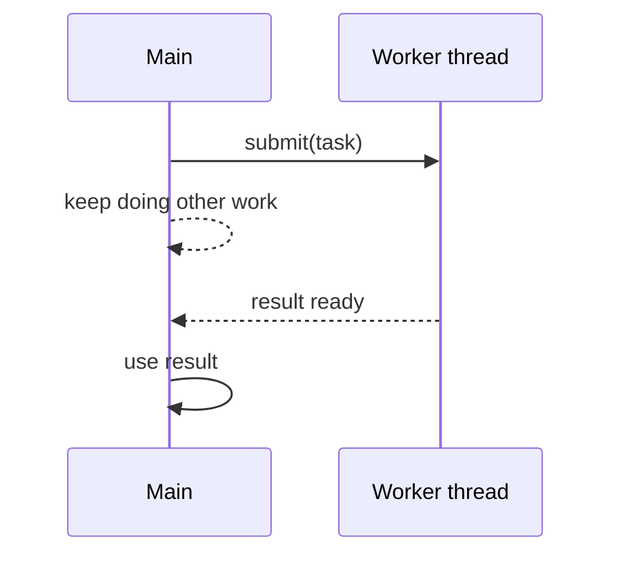
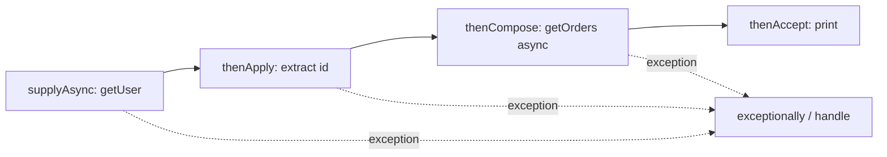

# Java `Future` vs `CompletableFuture`: Basics to Advanced

## Outline

1. The problem both try to solve
2. `Future` (Java 5): what it gives you
3. Where `Future` falls short
4. `CompletableFuture` (Java 8): the model
5. Creating, transforming, composing, combining
6. Error handling
7. Executors and threads (the part most people get wrong)
8. Timeouts, cancellation, and gotchas
9. Side-by-side summary and interview answers

---

## 1. The problem

You want to run something slow (a DB call, an HTTP call) without blocking the calling thread, and then use the result later.



---

## 2. `Future`: the basics

`Future<T>` is a **handle to a result that will exist later**.

```java
ExecutorService pool = Executors.newFixedThreadPool(4);

Future<String> f = pool.submit(() -> {
    Thread.sleep(1000);
    return "hello";
});

doOtherWork();

String result = f.get();          // blocks until done
pool.shutdown();
```

| Method | What it does |
|---|---|
| `get()` | Blocks until done; returns the result or throws `ExecutionException` |
| `get(timeout, unit)` | Same, but throws `TimeoutException` if too slow |
| `isDone()` | True if finished (success, failure, or cancelled) |
| `cancel(mayInterrupt)` | Tries to cancel; returns false if it already finished |
| `isCancelled()` | True if cancelled before completing |

`ExecutionException` wraps the real exception thrown inside the task. You must call `getCause()`.

---

## 3. Where `Future` falls short

| Limitation | Why it hurts |
|---|---|
| `get()` blocks | You burn a thread waiting, which defeats the purpose of async |
| No callbacks | You can't say "when done, do X" |
| No chaining | You can't say "take the result, then call another async op" |
| No combining | "Wait for A and B, merge results" needs manual blocking |
| Can't complete manually | Only the executor can set the result |
| Weak error handling | Only via `ExecutionException` on `get()` |
| No "first of many" | You have to poll `isDone()` in a loop |

Example of the pain, where each step blocks:

```java
Future<User> uf = pool.submit(() -> getUser(id));
User u = uf.get();                              // blocked
Future<List<Order>> of = pool.submit(() -> getOrders(u));
List<Order> orders = of.get();                  // blocked again
```

---

## 4. `CompletableFuture`: the model

`CompletableFuture<T>` implements both `Future<T>` and `CompletionStage<T>`.

- **`Future`** gives you `get()`, `cancel()`, `isDone()`.
- **`CompletionStage`** gives you the chaining API (`thenApply`, `thenCompose`, ...).

Mental model: **a promise you can complete yourself, plus a pipeline of steps that fire automatically when it completes.**



No thread sits blocked waiting. Each stage runs when the previous one finishes.

---

## 5. Creating, transforming, composing, combining

### 5.1 Creating

```java
CompletableFuture<String> a = CompletableFuture.supplyAsync(() -> "data");     // returns value
CompletableFuture<Void>   b = CompletableFuture.runAsync(() -> log("hi"));     // no value
CompletableFuture<String> c = CompletableFuture.completedFuture("ready");      // already done

CompletableFuture<String> manual = new CompletableFuture<>();                  // you complete it
manual.complete("done");               // or manual.completeExceptionally(ex)
```

Manual completion is how you wrap callback-style APIs:

```java
CompletableFuture<String> wrap() {
    CompletableFuture<String> cf = new CompletableFuture<>();
    legacyClient.call(new Callback() {
        public void onSuccess(String s) { cf.complete(s); }
        public void onError(Exception e) { cf.completeExceptionally(e); }
    });
    return cf;
}
```

### 5.2 Transforming (same stage, new value)

| Method | Input | Output | Analogy |
|---|---|---|---|
| `thenApply(fn)` | result | new value | `Stream.map` |
| `thenAccept(consumer)` | result | `Void` | `forEach` |
| `thenRun(runnable)` | nothing | `Void` | run after |

```java
CompletableFuture.supplyAsync(() -> "42")
    .thenApply(Integer::parseInt)
    .thenApply(n -> n * 2)
    .thenAccept(System.out::println);   // 84
```

### 5.3 Composing (dependent async calls): `thenCompose`

If your function itself returns a `CompletableFuture`, use `thenCompose`, not `thenApply`. Otherwise you get a nested future.

```java
CompletableFuture<CompletableFuture<List<Order>>> bad =
    getUserAsync(id).thenApply(u -> getOrdersAsync(u));      // nested, ugly

CompletableFuture<List<Order>> good =
    getUserAsync(id).thenCompose(u -> getOrdersAsync(u));    // flat
```

`thenApply` is to `map` as `thenCompose` is to `flatMap`.

### 5.4 Combining independent futures

```java
CompletableFuture<User>  uf = getUserAsync(id);
CompletableFuture<Price> pf = getPriceAsync(id);

// two futures -> one result
CompletableFuture<Report> r = uf.thenCombine(pf, (u, p) -> new Report(u, p));
```

For many futures:

```java
CompletableFuture<Void> all = CompletableFuture.allOf(f1, f2, f3);
all.join();                                   // wait for all
String a = f1.join();                         // safe now, already done

CompletableFuture<Object> first = CompletableFuture.anyOf(f1, f2, f3); // first to finish
```

Common pattern, collecting a list of results:

```java
List<CompletableFuture<Product>> futures = ids.stream()
    .map(this::fetchProductAsync)
    .toList();

CompletableFuture<List<Product>> all =
    CompletableFuture.allOf(futures.toArray(new CompletableFuture[0]))
        .thenApply(v -> futures.stream().map(CompletableFuture::join).toList());
```

Note: `allOf` returns `Void`, which is why you re-read each future with `join()`.

---

## 6. Error handling

In a pipeline, an exception **skips** all normal stages until it hits a handler.

| Method | Called when | Can recover? | Returns |
|---|---|---|---|
| `exceptionally(fn)` | Only on failure | Yes, supplies a fallback | same type |
| `handle((res, ex) -> ...)` | Always | Yes | any new value |
| `whenComplete((res, ex) -> ...)` | Always | No (side effect only, passes result/exception through) | same result |

```java
getUserAsync(id)
    .thenApply(User::name)
    .exceptionally(ex -> "anonymous")                 // fallback
    .thenAccept(System.out::println);

getUserAsync(id)
    .handle((user, ex) -> ex != null ? User.guest() : user);

getUserAsync(id)
    .whenComplete((user, ex) -> {                     // logging only
        if (ex != null) log.error("failed", ex);
    });
```

### Exception wrapping

| Call | Exception thrown on failure |
|---|---|
| `Future.get()` / `cf.get()` | `ExecutionException` (checked), cause is the real error |
| `cf.join()` | `CompletionException` (unchecked) |
| Inside `exceptionally` / `handle` | May receive the real exception or a `CompletionException` wrapping it, depending on which stage failed. Unwrap with `ex.getCause()` when needed. |

---

## 7. Executors and threads (the key advanced topic)

### 7.1 Default behaviour

`supplyAsync(supplier)` with no executor uses `ForkJoinPool.commonPool()`. That pool:

- is sized roughly to CPU cores minus 1
- is shared by the whole JVM (parallel streams use it too)
- is designed for **CPU-bound** work

If you do blocking I/O in it, a handful of slow calls can starve everything else. In interviews, say: **"always pass your own executor for blocking I/O."**

```java
ExecutorService io = Executors.newFixedThreadPool(50);
CompletableFuture.supplyAsync(() -> httpCall(), io);
```

### 7.2 Which thread runs each stage?

Every method has three variants:

| Variant | Which thread runs the step |
|---|---|
| `thenApply(fn)` | The thread that completed the previous stage, **or** the caller thread if the future was already complete |
| `thenApplyAsync(fn)` | A task submitted to the common pool |
| `thenApplyAsync(fn, executor)` | A task submitted to your executor |

```java
CompletableFuture.supplyAsync(() -> slowDb(), dbPool)
    .thenApply(r -> heavyCpuWork(r))               // runs on a dbPool thread, which may be a problem
    .thenApplyAsync(r -> render(r), cpuPool);      // explicitly moved off the I/O pool
```

Rule of thumb: keep non-async variants for tiny, fast, non-blocking transforms. Use `*Async` with an explicit executor when the step is heavy or blocking.

### 7.3 Typical sizing intuition

| Work type | Pool size guideline |
|---|---|
| CPU-bound | about number of cores |
| Blocking I/O | larger, based on wait/compute ratio |

(Java 21 virtual threads also change this: `Executors.newVirtualThreadPerTaskExecutor()` makes blocking-in-async far less costly.)

---

## 8. Timeouts, cancellation, gotchas

### 8.1 Timeouts (Java 9+)

```java
cf.orTimeout(2, TimeUnit.SECONDS);                   // fails with TimeoutException
cf.completeOnTimeout("default", 2, TimeUnit.SECONDS); // completes with fallback value
```

On Java 8 there's no built-in. You'd use a `ScheduledExecutorService` and `completeExceptionally`.

### 8.2 Cancellation is weaker than you think

`Future.cancel(true)` interrupts the worker thread. `CompletableFuture.cancel()` just completes the future with a `CancellationException`. **It does not interrupt the running task**, because the future doesn't know which thread is running it. Also, cancelling a downstream stage doesn't cancel upstream ones.

### 8.3 Gotchas checklist

| Gotcha | Fix |
|---|---|
| `get()` / `join()` inside a pipeline | Defeats async. Use `thenCompose` / `thenCombine`. |
| Blocking I/O on common pool | Pass a dedicated executor |
| `thenApply` returning a future | Use `thenCompose` |
| Exception silently lost (no `get`/`join`/handler) | Always end a chain with a handler or a `join` |
| `allOf` returns `Void` | Re-read each future with `join()` |
| Same pool for parent and child waiting on each other | Thread starvation deadlock |
| Expecting `cancel(true)` to interrupt | It doesn't |
| Calling `join()` on the common pool from a pool thread | `ForkJoinPool` may compensate, but don't rely on it |

---

## 9. Side-by-side summary

| Aspect | `Future` | `CompletableFuture` |
|---|---|---|
| Since | Java 5 | Java 8 |
| Get result | `get()` (blocking) | `get()`, `join()`, or callbacks |
| Callbacks | No | Yes (`thenApply`, `thenAccept`, ...) |
| Chaining | No | Yes |
| Combine multiple | Manual | `thenCombine`, `allOf`, `anyOf` |
| Manual completion | No | `complete`, `completeExceptionally` |
| Error handling | `ExecutionException` on `get` | `exceptionally`, `handle`, `whenComplete` |
| Timeouts | `get(timeout)` only | `orTimeout`, `completeOnTimeout` (9+) |
| Cancellation | Interrupts thread | Only completes exceptionally |
| Executor control | At submit time | Per stage |
| Use for | Simple "run and wait" | Async pipelines |

### Interview-ready answers

**"Why was `Future` not enough?"**
It only lets you block and wait. There's no way to attach a callback, chain dependent steps, combine futures, or handle errors in a pipeline, so any real async workflow ended up blocking threads anyway.

**"`thenApply` vs `thenCompose`?"**
`thenApply` maps a value to another value. `thenCompose` is for when the function returns another `CompletableFuture`, and it flattens the result, like `map` vs `flatMap`.

**"`handle` vs `exceptionally` vs `whenComplete`?"**
`exceptionally` runs only on failure and provides a fallback. `handle` runs always and can transform either outcome. `whenComplete` runs always but is side-effect only and passes the original outcome through.

**"What's the risk with the default executor?"**
It's the shared common `ForkJoinPool`, sized for CPU work. Blocking I/O there can starve the whole JVM's async and parallel-stream work, so pass a dedicated executor.

**"Does `CompletableFuture.cancel(true)` stop the task?"**
No. It just completes the future with `CancellationException`. The underlying computation keeps running.

---

If you want, I can go deeper next on one of these: thread-pool starvation deadlock examples, `CompletableFuture` vs Reactor/RxJava, or a set of interview-style practice problems (e.g. "fetch from 3 services with timeout and fallback").

---
---
---


# Java `Future` vs `CompletableFuture`

## From Basics → Internals → Advanced → Interview Focused

We’ll treat this as a **chapter-by-chapter course**, so you can say **`next`** to continue.

### Course roadmap

1. **Why asynchronous computation exists**
2. **`Future` from basics**
3. **Problems and limitations of `Future`**
4. **`CompletableFuture` fundamentals**
5. **`thenApply`, `thenAccept`, `thenRun`**
6. **`thenCompose` vs `thenCombine`**
7. **Exception handling**
8. **Threading and executors**
9. **`join()` vs `get()`**
10. **Combining multiple asynchronous operations**
11. **Timeouts, cancellation, retries**
12. **`CompletableFuture` internals**
13. **Common production patterns and mistakes**
14. **`Future` vs `CompletableFuture` interview questions**

---

# Chapter 1 — Why do we need `Future` and `CompletableFuture`?

Before learning either API, we need to understand the problem they solve.

Suppose we have:

```java
String result = callExternalService();
```

For example:

```java
String result = fetchUserFromDatabase();
```

The normal execution is:

```text
Thread
  |
  v
fetchUserFromDatabase()
  |
  |---- waiting for DB
  |
  |---- waiting
  |
  v
result
```

The calling thread is **blocked** while the operation is running.

---

# 1. Synchronous execution

Consider:

```java
public String getUser() {
    return fetchUserFromDatabase();
}
```

If:

```text
fetchUserFromDatabase() = 2 seconds
```

then the calling thread spends roughly:

```text
0s -------------------- 2s
       DB operation
```

doing nothing useful while waiting.

This is perfectly valid.

But now imagine:

```java
getUser();
getOrders();
getRecommendations();
```

Each takes 2 seconds.

If executed sequentially:

```text
getUser()
   2 sec
     ↓
getOrders()
   2 sec
     ↓
getRecommendations()
   2 sec
```

Total:

```text
≈ 6 seconds
```

But these operations might be independent.

We could potentially execute them concurrently:

```text
Thread 1 → getUser()            2 sec
Thread 2 → getOrders()          2 sec
Thread 3 → getRecommendations() 2 sec
```

Then:

```text
≈ 2 seconds
```

This is where asynchronous computation becomes useful.

---

# 2. What does "asynchronous" actually mean?

Very simply:

> Start some work without making the current thread wait for that work to finish immediately.

For example:

```java
startTask();

doSomethingElse();
```

Instead of:

```java
result = startTask();

doSomethingElseWith(result);
```

The second version requires the result immediately.

The first version allows the work to continue independently.

---

# 3. The role of another thread

Java can use an `ExecutorService` to execute work on another thread.

Example:

```java
ExecutorService executor = Executors.newFixedThreadPool(2);

executor.submit(() -> {
    System.out.println("Running asynchronously");
});
```

Conceptually:

```text
Main Thread
    |
    | submit task
    v
ExecutorService
    |
    v
Worker Thread
    |
    v
execute task
```

The main thread doesn't execute the task itself.

---

# 4. But there is an important problem

Suppose:

```java
Future<String> future = executor.submit(() -> {
    return "Hello";
});
```

The task is running somewhere else.

But eventually we need:

```java
String result = ...
```

How do we get the result?

That's where `Future` comes in.

---

# 5. What is a `Future`?

A `Future` represents:

> The result of an asynchronous computation that may complete sometime in the future.

Think of it as a **promise/placeholder for a result**.

```java
Future<String> future = executor.submit(() -> {
    return "Hello";
});
```

At this point:

```text
Future<String>
      |
      | represents
      v
"Hello" (available later)
```

The actual `"Hello"` may not exist yet.

---

# 6. Important distinction

This:

```java
Future<String>
```

does **not** mean:

```text
String
```

It means:

```text
"I will eventually have a String."
```

For example:

```java
Future<String> future =
        executor.submit(() -> {
            Thread.sleep(3000);
            return "Hello";
        });
```

Immediately after `submit()`:

```text
future
  |
  +---- computation running
  |
  +---- result not available yet
```

After 3 seconds:

```text
future
  |
  +---- computation completed
  |
  +---- "Hello"
```

---

# 7. Getting the result from `Future`

The primary method is:

```java
future.get();
```

Example:

```java
ExecutorService executor =
        Executors.newFixedThreadPool(2);

Future<String> future = executor.submit(() -> {
    Thread.sleep(2000);
    return "Hello";
});

String result = future.get();

System.out.println(result);
```

Output:

```text
Hello
```

But something extremely important happens here.

## `get()` is blocking

Suppose the task takes 2 seconds.

```java
String result = future.get();
```

If the result isn't ready:

```text
Current Thread
     |
     | future.get()
     |
     | BLOCKED
     |
     | <---- waits ---->
     |
     v
   result
```

So although the computation was submitted asynchronously, calling `get()` immediately can make your code effectively synchronous again.

This is one of the most important concepts in understanding `Future`.

---

# 8. `Future` gives you asynchronous execution, not asynchronous composition

This distinction is critical.

`Future` allows:

```java
Future<Result> future = executor.submit(task);
```

The task runs asynchronously.

But obtaining the result generally looks like:

```java
Result result = future.get();
```

which blocks.

So:

```text
                  Future
                    |
       +------------+------------+
       |                         |
   async task                 get()
       |                         |
       v                         v
   worker thread            blocks caller
```

---

# 9. Basic `Future` lifecycle

Conceptually:

```text
                 submit()
                    |
                    v
              +-----------+
              |  Future   |
              +-----------+
                    |
             task executing
                    |
          +---------+---------+
          |                   |
          v                   v
      completed            cancelled
          |
          v
       result
```

A `Future` can represent different states:

```text
NOT STARTED / QUEUED
        ↓
   RUNNING
        ↓
   COMPLETED
```

Or:

```text
RUNNING
   |
   v
CANCELLED
```

---

# 10. Important `Future` methods

The classic `Future` API contains:

```java
public interface Future<V> {

    boolean cancel(boolean mayInterruptIfRunning);

    boolean isCancelled();

    boolean isDone();

    V get()
        throws InterruptedException, ExecutionException;

    V get(long timeout, TimeUnit unit)
        throws InterruptedException,
               ExecutionException,
               TimeoutException;
}
```

Let's understand each.

---

## `isDone()`

```java
future.isDone();
```

Checks whether computation has completed.

Example:

```java
if (future.isDone()) {
    System.out.println("Finished");
}
```

Important:

```text
isDone() == true
```

doesn't necessarily mean the computation succeeded.

It could have:

```text
completed successfully
        OR
failed with exception
        OR
been cancelled
```

---

# 11. `isCancelled()`

```java
future.isCancelled();
```

Checks whether the computation was cancelled.

Example:

```java
if (future.isCancelled()) {
    System.out.println("Task was cancelled");
}
```

---

# 12. `cancel()`

```java
future.cancel(true);
```

Attempts to cancel the computation.

The argument:

```java
true
```

means:

> If the task is already running, the executor may attempt to interrupt its executing thread.

For example:

```java
Future<String> future = executor.submit(() -> {
    Thread.sleep(10_000);
    return "Hello";
});

future.cancel(true);
```

Conceptually:

```text
Worker Thread
     |
     | running task
     |
     X ← interruption requested
```

But there's an important interview point:

> `cancel(true)` does not magically kill a thread.

It generally results in an **interrupt request**.

Whether the task actually stops depends on how the task responds to interruption.

---

# 13. `get(timeout)`

Instead of:

```java
future.get();
```

you can use:

```java
future.get(2, TimeUnit.SECONDS);
```

Meaning:

> Wait at most 2 seconds for the result.

If the result isn't available:

```java
TimeoutException
```

is thrown.

Example:

```java
try {
    String result = future.get(2, TimeUnit.SECONDS);
} catch (TimeoutException e) {
    System.out.println("Task took too long");
}
```

This is much safer than waiting indefinitely.

---

# 14. The first major limitation of `Future`

Imagine:

```java
Future<User> userFuture =
        executor.submit(() -> getUser());
```

Then:

```java
User user = userFuture.get();

Future<List<Order>> ordersFuture =
        executor.submit(() -> getOrders(user));
```

Notice what happened.

We had to manually:

```text
submit
   ↓
get()
   ↓
submit next task
   ↓
get()
   ↓
...
```

The asynchronous computation becomes difficult to compose.

---

# 15. The bigger problem

Suppose we need:

```text
User
  |
  v
Orders
  |
  v
Recommendations
```

With `Future`:

```java
Future<User> userFuture =
        executor.submit(() -> getUser());

User user = userFuture.get();

Future<List<Order>> ordersFuture =
        executor.submit(() -> getOrders(user));

List<Order> orders = ordersFuture.get();

Future<List<Product>> recommendationsFuture =
        executor.submit(() -> getRecommendations(orders));

List<Product> recommendations =
        recommendationsFuture.get();
```

There is a lot of:

```java
get()
```

And every `get()` can block.

---

# 16. Another major problem: combining independent tasks

Suppose:

```text
getUser()          → 2 sec
getOrders()        → 2 sec
getRecommendations() → 2 sec
```

With `Future` we might write:

```java
Future<User> userFuture =
        executor.submit(this::getUser);

Future<List<Order>> ordersFuture =
        executor.submit(this::getOrders);

Future<List<Product>> recommendationsFuture =
        executor.submit(this::getRecommendations);

User user = userFuture.get();
List<Order> orders = ordersFuture.get();
List<Product> recommendations =
        recommendationsFuture.get();
```

The tasks can run concurrently, which is good.

But there is no elegant built-in mechanism in classic `Future` for saying:

```text
when all three finish,
combine their results
and continue with another asynchronous operation
```

We have to orchestrate it ourselves.

---

# 17. Exception handling is also awkward

With:

```java
String result = future.get();
```

the task's exception is wrapped in:

```java
ExecutionException
```

For example:

```java
Future<String> future = executor.submit(() -> {
    throw new IllegalStateException("Something failed");
});
```

Then:

```java
future.get();
```

results conceptually in:

```text
ExecutionException
       |
       v
IllegalStateException
```

You need:

```java
try {
    String result = future.get();
} catch (ExecutionException e) {
    Throwable cause = e.getCause();
}
```

Again, this works, but composition is cumbersome.

---

# 18. Enter `CompletableFuture`

Java 8 introduced:

```java
CompletableFuture
```

It extends the idea of `Future`.

Conceptually:

```text
Future
  |
  | asynchronous result
  |
  v
CompletableFuture
  |
  +-- asynchronous result
  +-- callbacks
  +-- composition
  +-- combination
  +-- exception handling
  +-- chaining
```

The key difference is:

> `Future` primarily represents an eventual result; `CompletableFuture` also provides a framework for building asynchronous pipelines around that result.

---

# 19. The mental model

Don't think of:

```java
CompletableFuture<String>
```

simply as:

```text
Future<String>
```

Think:

```text
CompletableFuture<String>
        |
        +---- computation
        |
        +---- eventual String
        |
        +---- what to do when complete
        |
        +---- what to do if failed
        |
        +---- what computation comes next
```

This is the fundamental shift.

---

# 20. Basic `CompletableFuture`

You can create one directly:

```java
CompletableFuture<String> future =
        CompletableFuture.supplyAsync(() -> {
            return "Hello";
        });
```

The task executes asynchronously.

Then:

```java
String result = future.join();
```

gives:

```text
Hello
```

---

# 21. `runAsync()` vs `supplyAsync()`

There are two fundamental methods.

## `runAsync()`

Use when there is **no return value**.

```java
CompletableFuture<Void> future =
        CompletableFuture.runAsync(() -> {
            System.out.println("Doing work");
        });
```

Equivalent conceptual idea:

```text
Runnable
   ↓
no result
```

---

## `supplyAsync()`

Use when there **is a return value**.

```java
CompletableFuture<String> future =
        CompletableFuture.supplyAsync(() -> {
            return "Hello";
        });
```

Conceptually:

```text
Supplier<String>
       ↓
    String
```

So:

```text
runAsync()
    → CompletableFuture<Void>

supplyAsync()
    → CompletableFuture<T>
```

---

# 22. The killer feature: chaining

Suppose:

```java
CompletableFuture<String> future =
        CompletableFuture.supplyAsync(() -> "hello");
```

We can say:

```java
CompletableFuture<String> upper =
        future.thenApply(String::toUpperCase);
```

Now:

```text
supplyAsync()
    |
    v
"hello"
    |
    | thenApply(toUpperCase)
    v
"HELLO"
```

No explicit:

```java
get()
```

between the operations.

---

# 23. This is asynchronous composition

Consider:

```java
CompletableFuture<String> future =
        CompletableFuture
                .supplyAsync(() -> "hello")
                .thenApply(String::toUpperCase)
                .thenApply(result -> result + " WORLD");
```

Conceptually:

```text
                    ┌───────────────────┐
                    │ supplyAsync       │
                    │ return "hello"    │
                    └─────────┬─────────┘
                              |
                              v
                    ┌───────────────────┐
                    │ thenApply         │
                    │ toUpperCase       │
                    └─────────┬─────────┘
                              |
                              v
                    ┌───────────────────┐
                    │ thenApply         │
                    │ append " WORLD"   │
                    └─────────┬─────────┘
                              |
                              v
                         "HELLO WORLD"
```

This is the foundation of `CompletableFuture`.

---

# 24. `Future` vs `CompletableFuture`

The core difference:

| Feature                  | `Future`         | `CompletableFuture` |
| ------------------------ | ---------------- | ------------------- |
| Represents future result | ✅                | ✅                   |
| Async execution          | ✅                | ✅                   |
| `get()`                  | ✅                | ✅                   |
| Timeout                  | ✅                | ✅                   |
| Cancellation             | ✅                | ✅                   |
| Chain operations         | ❌                | ✅                   |
| Combine futures          | ❌/manual         | ✅                   |
| Async callbacks          | ❌                | ✅                   |
| Exception pipeline       | Limited          | ✅                   |
| Compose dependent tasks  | Awkward          | ✅                   |
| Functional style         | Limited          | Strong              |
| Manual orchestration     | Usually required | Much less           |

---

# 25. The most important conceptual distinction

Remember this for interviews:

### `Future`

```text
"I have a result that will be available later."
```

### `CompletableFuture`

```text
"I have a result that will be available later,
and I can define what should happen next."
```

That's the essence.

---

# 26. One subtle but important point

`CompletableFuture` does **not automatically make blocking operations non-blocking**.

For example:

```java
CompletableFuture.supplyAsync(() -> {
    return databaseCall();
});
```

The `databaseCall()` itself may be blocking.

What happens is:

```text
Caller Thread
     |
     | supplyAsync()
     v
CompletableFuture
     |
     v
Executor Thread
     |
     | BLOCKED waiting for DB
     |
     v
DB result
```

So `CompletableFuture` provides **asynchronous task orchestration**, but it does not magically turn blocking I/O into non-blocking I/O.

This distinction becomes very important in production systems.

---

# 27. Another important distinction: concurrency vs parallelism

Suppose:

```java
CompletableFuture.supplyAsync(task1);
CompletableFuture.supplyAsync(task2);
```

They may execute concurrently.

But whether they execute **simultaneously on different CPU cores** depends on:

* executor
* number of threads
* CPU availability
* task type
* scheduling

So don't equate:

```text
CompletableFuture
```

with:

```text
parallel execution
```

`CompletableFuture` is primarily an **asynchronous computation/composition abstraction**.

---

# 28. The mental model to retain

Think of the progression like this:

### Traditional synchronous code

```text
A → wait → B → wait → C
```

### `Future`

```text
submit A
    ↓
Future<A>
    ↓
get()
    ↓
B
```

### `CompletableFuture`

```text
A
↓
thenApply(B)
↓
thenCompose(C)
↓
thenApply(D)
↓
result
```

And for independent tasks:

```text
        ┌── A ──┐
        │       │
start ──┼── B ──┼── combine ──→ C
        │       │
        └── D ──┘
```

That last model is where `CompletableFuture` becomes particularly powerful.

---

## Interview takeaway from Chapter 1

If an interviewer asks:

> **Why was `CompletableFuture` introduced when `Future` already existed?**

A strong answer is:

> `Future` provides a handle to an asynchronously executing computation and allows us to retrieve its result, but its API is largely blocking and does not provide a convenient way to compose, chain, combine, or handle asynchronous operations. `CompletableFuture` builds on the `Future` abstraction and provides non-blocking completion stages, asynchronous chaining, composition, combination, and exception-handling mechanisms.

And if they ask:

> **Does `CompletableFuture` mean non-blocking?**

Answer:

> No. `CompletableFuture` supports asynchronous composition, but the underlying operation can still be blocking. For example, a blocking JDBC call executed through `supplyAsync()` still blocks the executor thread executing it.

**Next chapter:** we'll go deep into **`Future` itself — `ExecutorService.submit()`, how the task/result is stored, `get()`, cancellation, interruption, memory visibility, exceptions, and what actually happens inside the executor.**


---
---
---


# Chapter 2 — `Future` in Depth

Now let's go deeper into the classic `Future` API.

The goal of this chapter is to understand not just **how to use `Future`**, but what is actually happening between:

```java
executor.submit(...)
```

and:

```java
future.get()
```

---

# 1. Where does `Future` come from?

Usually, you encounter `Future` through an `ExecutorService`.

```java
ExecutorService executor =
        Executors.newFixedThreadPool(4);

Future<String> future =
        executor.submit(() -> {
            return "Hello";
        });
```

There are three important components here:

```text
                    ExecutorService
                         |
                    submit(task)
                         |
                         v
              +----------------------+
              | Executor / ThreadPool|
              +----------------------+
                         |
                         v
                  Worker Thread
                         |
                         v
                       Task
                         |
                         v
                      Result
                         |
                         v
                      Future
```

The `Future` is the object through which the caller can interact with the eventual result.

---

# 2. What does `submit()` actually do?

Consider:

```java
Future<Integer> future =
        executor.submit(() -> {
            return 10 + 20;
        });
```

A simplified conceptual flow is:

```text
Caller Thread
     |
     | submit(task)
     v
ExecutorService
     |
     | creates/enqueues task
     v
Work Queue
     |
     v
Worker Thread
     |
     | executes task
     v
30
```

Meanwhile, the caller immediately receives a `Future`:

```text
Caller Thread
     |
     +----------------------+
     |                      |
     v                      v
Future<Integer>        Worker Thread
                           |
                           v
                         task
                           |
                           v
                          30
```

The caller doesn't need to execute the task itself.

---

# 3. `FutureTask` — an important implementation detail

For interview purposes, you should know about:

```java
FutureTask<V>
```

`FutureTask` is a concrete implementation that implements both:

```java
Runnable
Future<V>
```

Conceptually:

```text
              Future
                ↑
                |
          FutureTask<V>
                |
                ↓
             Runnable
```

This is important because an executor needs something it can execute, while the caller needs something through which it can retrieve the result.

`FutureTask` bridges these two roles.

Conceptually:

```text
                    FutureTask
                  /            \
                 /              \
                v                v
          Runnable role       Future role
               |                   |
               v                   v
          execute task         get result
```

When you do:

```java
executor.submit(callable);
```

the executor can internally use a `FutureTask`-like mechanism to associate the task with its eventual result.

---

# 4. `Callable` vs `Runnable`

This distinction is also important.

### `Runnable`

```java
Runnable task = () -> {
    System.out.println("Hello");
};
```

It doesn't return a result.

Conceptually:

```java
void run()
```

---

### `Callable`

```java
Callable<Integer> task = () -> {
    return 42;
};
```

It returns a value.

Conceptually:

```java
V call()
```

and it can throw checked exceptions.

Therefore:

```java
executor.submit(Callable)
```

is commonly used when you need:

```text
Future<T>
```

---

# 5. Three common `submit()` forms

`ExecutorService` provides overloaded `submit()` methods.

Conceptually:

```java
Future<?> submit(Runnable task);
```

```java
<T> Future<T> submit(
        Runnable task,
        T result
);
```

```java
<T> Future<T> submit(
        Callable<T> task
);
```

The most interesting one is:

```java
<T> Future<T> submit(Callable<T> task)
```

Example:

```java
Future<Integer> future =
        executor.submit(() -> 100);
```

---

# 6. What is stored inside the future?

Consider:

```java
Future<Integer> future =
        executor.submit(() -> {
            Thread.sleep(2000);
            return 100;
        });
```

Immediately after submission, conceptually:

```text
Future
 |
 +-- state: RUNNING / QUEUED
 |
 +-- result: not available
 |
 +-- exception: none
```

After successful completion:

```text
Future
 |
 +-- state: COMPLETED
 |
 +-- result: 100
```

If the task fails:

```text
Future
 |
 +-- state: COMPLETED
 |
 +-- result: unavailable
 |
 +-- exception: IllegalStateException
```

If cancelled:

```text
Future
 |
 +-- state: CANCELLED
```

---

# 7. `get()` — the most important method

Consider:

```java
Future<Integer> future =
        executor.submit(() -> {
            Thread.sleep(3000);
            return 42;
        });

Integer result = future.get();
```

If the task hasn't completed:

```text
Caller Thread
     |
     | get()
     v
   WAITING
     |
     | 3 seconds
     |
     v
    42
```

The caller thread blocks until one of these happens:

```text
Task completes successfully
       OR
Task fails
       OR
Task is cancelled
```

---

# 8. Why does `get()` block?

Because the result doesn't exist yet.

Imagine:

```java
Future<User> future = ...
```

Internally, the future needs to answer:

> "Has the worker produced the `User` yet?"

If not, the calling thread cannot return a `User`.

So it waits.

Conceptually:

```text
                 Future
                   |
              result ready?
              /          \
            NO            YES
            |              |
         WAIT            return
            |
            |
       worker completes
            |
            v
           YES
```

---

# 9. Does `get()` continuously spin?

A good implementation should not simply do:

```java
while (!completed) {
    // keep checking
}
```

That would waste CPU.

Instead, Java concurrency mechanisms use synchronization/parking mechanisms so that a waiting thread can be suspended and later awakened when the result becomes available.

Conceptually:

```text
Caller
  |
  | get()
  v
WAIT / PARK
  |
  | CPU can do other work
  |
  v
Task completes
  |
  v
Caller awakened
  |
  v
return result
```

This is an important distinction:

> A blocked thread generally isn't burning a CPU core continuously while waiting.

---

# 10. `get()` and memory visibility

Another important concurrency concept:

When a task completes and publishes its result through the concurrency machinery, the appropriate **happens-before / memory visibility guarantees** provided by the executor/future mechanisms ensure that the thread retrieving the result sees the completed result consistently.

You don't normally need to manually add:

```java
volatile
```

to the result just to make `Future.get()` work correctly.

The concurrency abstraction handles the necessary synchronization.

---

# 11. `get()` can throw three important exceptions

Consider:

```java
String result = future.get();
```

You may have to handle:

```java
InterruptedException
ExecutionException
```

And the timed version additionally has:

```java
TimeoutException
```

Let's understand each.

---

# 12. `InterruptedException`

Suppose:

```java
future.get();
```

is waiting.

Another thread interrupts the waiting thread.

Conceptually:

```text
Thread A
   |
   | future.get()
   |
 WAITING
   ^
   |
Thread B
   |
   | interrupt()
   |
   +---------------->
```

Then:

```java
InterruptedException
```

can be thrown.

This is about the **waiting thread being interrupted**, not necessarily the task itself failing.

That's an important distinction.

---

# 13. `ExecutionException`

Suppose the task itself fails:

```java
Future<String> future =
        executor.submit(() -> {
            throw new IllegalStateException("Database failed");
        });
```

Then:

```java
future.get();
```

doesn't simply throw the original exception directly.

Conceptually:

```text
Worker Thread
     |
     v
IllegalStateException
     |
     v
Future
     |
     v
ExecutionException
     |
     v
Caller
```

So:

```java
try {
    String result = future.get();
} catch (ExecutionException e) {

    Throwable cause = e.getCause();

    System.out.println(cause);
}
```

The original exception is typically available through:

```java
e.getCause()
```

---

# 14. Why wrap the exception?

Because the caller is interacting with a future computation.

The caller's `get()` operation needs to communicate:

> "The asynchronous computation did not successfully produce a result."

`ExecutionException` provides that boundary.

So conceptually:

```text
Task exception
      ↓
ExecutionException
      ↓
Future.get()
      ↓
Caller
```

---

# 15. `TimeoutException`

You can avoid waiting forever:

```java
String result =
        future.get(2, TimeUnit.SECONDS);
```

If the computation hasn't completed within 2 seconds:

```java
TimeoutException
```

is thrown.

Important:

> A timeout from `get(timeout, unit)` does NOT automatically cancel the underlying task.

This is a common interview trap.

For example:

```java
try {
    future.get(2, TimeUnit.SECONDS);
} catch (TimeoutException e) {
    System.out.println("Timed out");
}
```

The task may still be running.

```text
Caller
  |
  | get(2 sec)
  |
  |---- timeout ----> continues
                       |
                       v
                    Worker
                       |
                       v
                  task still running
```

If you want cancellation, you need to explicitly consider:

```java
future.cancel(true);
```

---

# 16. `cancel()` in depth

Consider:

```java
boolean cancelled = future.cancel(true);
```

The parameter:

```java
true
```

means:

> If the task is already running, an attempt may be made to interrupt it.

It does **not** mean:

> Forcefully terminate the thread.

That's a critical distinction.

---

# 17. What does interruption actually mean?

Java interruption is cooperative.

Suppose:

```java
executor.submit(() -> {
    while (true) {
        // work
    }
});
```

Calling:

```java
future.cancel(true);
```

requests interruption.

But if the code completely ignores interruption:

```java
while (true) {
    // ignore interrupt
}
```

the task may continue running.

So:

```text
cancel(true)
      |
      v
interrupt requested
      |
      v
Does task respond?
    /       \
  YES        NO
   |          |
 stop       may continue
```

---

# 18. Tasks should respect interruption

A cooperative task might do:

```java
while (!Thread.currentThread().isInterrupted()) {
    doWork();
}
```

Or handle:

```java
try {
    Thread.sleep(1000);
} catch (InterruptedException e) {
    Thread.currentThread().interrupt();
    return;
}
```

Notice this important pattern:

```java
Thread.currentThread().interrupt();
```

Why?

Because catching `InterruptedException` clears the thread's interrupted status.

Restoring it allows higher-level code to know that interruption occurred.

---

# 19. What happens if the task hasn't started?

Suppose:

```text
Thread Pool
   |
   +-- Worker 1 → Task A
   |
   +-- Worker 2 → Task B
   |
   +-- Queue → Task C
```

If you cancel Task C before a worker picks it up:

```java
futureC.cancel(false);
```

the task may simply never execute.

This is easier to cancel than an already-running task.

---

# 20. `cancel(false)` vs `cancel(true)`

### `cancel(false)`

Don't attempt to interrupt if already running.

```text
queued task
   ↓
cancel
   ↓
won't execute
```

If already running:

```text
running task
   ↓
cancel(false)
   ↓
no interruption request
```

---

### `cancel(true)`

Attempt interruption if already running:

```text
running task
   ↓
cancel(true)
   ↓
interrupt request
```

Again:

> `true` means "may interrupt", not "guaranteed termination".

---

# 21. `isDone()` has broader meaning

Consider:

```java
future.isDone();
```

`true` means the future has reached a terminal state.

That could mean:

```text
             isDone()
                |
       +--------+--------+
       |        |        |
       v        v        v
   success   failure  cancelled
```

Therefore:

```java
if (future.isDone()) {
    // Don't assume success.
}
```

You still need to retrieve the result or inspect cancellation/failure appropriately.

---

# 22. A complete `Future` example

```java
ExecutorService executor =
        Executors.newFixedThreadPool(2);

Future<String> future =
        executor.submit(() -> {

            Thread.sleep(2000);

            return "Hello";
        });

try {

    String result =
            future.get(3, TimeUnit.SECONDS);

    System.out.println(result);

} catch (InterruptedException e) {

    Thread.currentThread().interrupt();

} catch (ExecutionException e) {

    System.out.println(
            "Task failed: " + e.getCause()
    );

} catch (TimeoutException e) {

    future.cancel(true);

    System.out.println("Task timed out");
}
```

This is a fairly traditional production-style `Future` pattern.

---

# 23. The fundamental limitation becomes obvious

Suppose you need:

```text
fetch user
   ↓
fetch orders using user
   ↓
calculate recommendation
   ↓
send notification
```

Using `Future`, you typically end up with:

```java
Future<User> userFuture =
        executor.submit(this::getUser);

User user = userFuture.get();

Future<List<Order>> ordersFuture =
        executor.submit(() -> getOrders(user));

List<Order> orders = ordersFuture.get();

Future<Recommendation> recommendationFuture =
        executor.submit(() -> recommend(orders));

Recommendation recommendation =
        recommendationFuture.get();
```

Notice the pattern:

```text
submit
get
submit
get
submit
get
```

The API doesn't naturally express:

```text
when A completes,
automatically start B,
then when B completes,
start C.
```

That's the problem `CompletableFuture` addresses.

---

# 24. Another limitation — callbacks

Suppose you want:

> "When this task finishes, call another function."

Classic `Future` doesn't provide a convenient:

```java
future.thenApply(...)
```

mechanism.

You have to manually orchestrate it.

You might end up with:

```java
executor.submit(() -> {
    Result result = doWork();

    process(result);
});
```

But now you are manually managing the asynchronous control flow inside the task.

`CompletableFuture` turns this into an explicit composition model.

---

# 25. Another limitation — combining futures

Imagine:

```text
Future<User>
Future<Orders>
Future<Recommendations>
```

You want:

```text
wait for all
     ↓
create Dashboard
```

Classic `Future` has no elegant equivalent of:

```java
CompletableFuture.allOf(...)
```

You have to manually call:

```java
userFuture.get();
ordersFuture.get();
recommendationsFuture.get();
```

and deal with blocking/error handling yourself.

---

# 26. Important interview comparison

If asked:

### "Is `Future` asynchronous?"

Say:

> `Future` allows a task to be submitted for asynchronous execution and provides a handle to its eventual result. However, retrieving that result with `get()` is blocking.

### "Is `CompletableFuture` non-blocking?"

Better answer:

> `CompletableFuture` supports non-blocking continuation and asynchronous composition, but it doesn't guarantee that the underlying operations are non-blocking. A blocking operation executed inside a `CompletableFuture` still blocks the thread executing that operation.

### "Why is `Future` less composable?"

Because classic `Future` primarily gives you:

```text
submit → wait → get
```

whereas `CompletableFuture` gives you:

```text
start → transform → compose → combine → recover → continue
```

---

# 27. The evolution

The API evolution can be viewed conceptually as:

```text
                    ExecutorService
                          |
                          v
                       Future
                          |
        +-----------------+----------------+
        |                 |                |
       get()           cancel()       isDone()
        |
        |
   blocking result
```

Then:

```text
                  CompletableFuture
                         |
          +--------------+--------------+
          |              |              |
      thenApply()   thenCompose()   thenCombine()
          |              |              |
          +--------------+--------------+
                         |
                  async pipeline
```

That is the conceptual bridge into the next chapter.

---

# Interview Questions From This Chapter

### Q1. Does `Future.get()` block?

**Yes.** If the result isn't available, the calling thread waits until completion, failure, cancellation, or interruption.

### Q2. Does `get(timeout)` cancel the task?

**No.** It only limits how long the caller waits.

### Q3. Does `cancel(true)` forcibly kill a thread?

**No.** It requests interruption. Java interruption is cooperative.

### Q4. What happens if a `Callable` throws an exception?

The exception is captured by the asynchronous computation, and `Future.get()` reports it through an `ExecutionException`, whose cause is typically the original exception.

### Q5. Does `isDone()` mean success?

**No.** It means the computation reached a terminal state. It can have succeeded, failed, or been cancelled.

### Q6. Why isn't `Future` good for complex asynchronous workflows?

Because it doesn't provide convenient asynchronous chaining, composition, combination, or declarative exception handling.

---

## The key mental model

Remember this:

```text
Future
  |
  +-- represents eventual result
  |
  +-- get() → blocking
  |
  +-- cancel()
  |
  +-- isDone()
  |
  +-- isCancelled()
```

Whereas:

```text
CompletableFuture
  |
  +-- represents eventual result
  |
  +-- can be completed manually
  |
  +-- can chain computations
  |
  +-- can combine computations
  |
  +-- can compose dependent computations
  |
  +-- can handle failures
  |
  +-- can continue asynchronously
```

**Next:** `CompletableFuture` fundamentals — `completedFuture`, `runAsync`, `supplyAsync`, `join`, `get`, the default `ForkJoinPool`, and what actually happens to the threads executing each stage.


---
---
---


# Chapter 3 — `CompletableFuture` Fundamentals

Now we move from the limitations of `Future` to the core mental model of `CompletableFuture`.

The most important thing to understand in this chapter is:

> A `CompletableFuture` represents a computation that can be completed now or later, and it allows other computations to be attached to that completion.

---

# 1. What exactly is `CompletableFuture`?

`CompletableFuture<T>` implements both:

```java
Future<T>
CompletionStage<T>
```

Conceptually:

```text
                    CompletableFuture<T>
                           |
             +-------------+-------------+
             |                           |
             v                           v
          Future                  CompletionStage
             |                           |
       retrieve result             compose stages
       cancel                      transform result
       check state                 handle errors
```

This is why `CompletableFuture` has much more functionality than traditional `Future`.

---

# 2. Two important capabilities

The name itself gives us a clue:

```text
Completable + Future
```

It is a **Future**:

```java
CompletableFuture<String>
```

represents a future `String`.

But it is also **Completable**:

```java
future.complete("Hello");
```

You can explicitly complete it.

This second capability is extremely important.

---

# 3. Creating an already-completed future

You can create:

```java
CompletableFuture<String> future =
        CompletableFuture.completedFuture("Hello");
```

The future is already complete.

Conceptually:

```text
CompletableFuture<String>
        |
        v
     COMPLETED
        |
        v
     "Hello"
```

Then:

```java
String result = future.join();
```

returns immediately:

```text
Hello
```

---

# 4. Manually completing a `CompletableFuture`

You can also create an incomplete future:

```java
CompletableFuture<String> future =
        new CompletableFuture<>();
```

At this point:

```text
CompletableFuture<String>
        |
        v
    NOT COMPLETE
```

Then somewhere later:

```java
future.complete("Hello");
```

Now:

```text
CompletableFuture<String>
        |
        v
     COMPLETE
        |
        v
     "Hello"
```

This is one of the fundamental differences from traditional `Future`.

---

# 5. Why would we manually complete one?

This becomes useful when adapting callback-based APIs.

For example, imagine some external library does:

```java
api.fetchUser(new Callback() {
    @Override
    public void onSuccess(User user) {
        // ...
    }

    @Override
    public void onFailure(Throwable error) {
        // ...
    }
});
```

You can adapt it:

```java
CompletableFuture<User> future =
        new CompletableFuture<>();

api.fetchUser(new Callback() {

    @Override
    public void onSuccess(User user) {
        future.complete(user);
    }

    @Override
    public void onFailure(Throwable error) {
        future.completeExceptionally(error);
    }
});
```

Now callers can use the modern `CompletableFuture` API.

This is a very useful real-world pattern.

---

# 6. `completeExceptionally()`

Instead of:

```java
future.complete(result);
```

you can complete it with failure:

```java
future.completeExceptionally(
        new RuntimeException("Something failed")
);
```

Conceptually:

```text
                  CompletableFuture
                         |
              +----------+----------+
              |                     |
           success                failure
              |                     |
        complete(value)    completeExceptionally(error)
```

---

# 7. `complete()` only completes once

Consider:

```java
CompletableFuture<String> future =
        new CompletableFuture<>();

future.complete("A");
future.complete("B");
```

The result remains:

```text
A
```

The second completion doesn't replace it.

The method returns whether it successfully completed the future:

```java
boolean completed =
        future.complete("A");
```

So only the first successful completion wins.

---

# 8. `completeExceptionally()` follows the same rule

```java
CompletableFuture<String> future =
        new CompletableFuture<>();

future.completeExceptionally(
        new RuntimeException("Error")
);

future.complete("Hello");
```

The future remains exceptionally completed.

Conceptually:

```text
First completion wins
        |
        +---- success
        |
        +---- exception
        |
        +---- cancellation
```

This is important when multiple asynchronous paths could race to complete the same future.

---

# 9. `runAsync()`

Now let's get into the most commonly used factory methods.

```java
CompletableFuture.runAsync(() -> {
    System.out.println("Running asynchronously");
});
```

The lambda is a `Runnable`.

Therefore it doesn't produce a result.

The return type is:

```java
CompletableFuture<Void>
```

Example:

```java
CompletableFuture<Void> future =
        CompletableFuture.runAsync(() -> {
            System.out.println("Sending email");
        });
```

Conceptually:

```text
Runnable
   |
   v
asynchronous execution
   |
   v
no result
   |
   v
CompletableFuture<Void>
```

---

# 10. `supplyAsync()`

If you need a result:

```java
CompletableFuture<String> future =
        CompletableFuture.supplyAsync(() -> {
            return "Hello";
        });
```

The lambda is effectively a:

```java
Supplier<String>
```

So:

```text
runAsync()
    ↓
Runnable
    ↓
no result

supplyAsync()
    ↓
Supplier<T>
    ↓
result T
```

This distinction is fundamental.

---

# 11. Simple example

```java
CompletableFuture<String> future =
        CompletableFuture.supplyAsync(() -> {
            return "Hello";
        });

System.out.println(future.join());
```

Output:

```text
Hello
```

But something interesting happened.

The caller thread called:

```java
supplyAsync(...)
```

and the computation can execute on another executor thread.

---

# 12. Which thread executes `supplyAsync()`?

If you don't provide an executor:

```java
CompletableFuture.supplyAsync(task);
```

the default asynchronous execution facility is used.

For the standard JDK implementation, this is generally based on:

```text
ForkJoinPool.commonPool()
```

Conceptually:

```text
Caller Thread
      |
      | supplyAsync()
      v
ForkJoinPool.commonPool()
      |
      +---- Worker Thread
      |
      +---- Worker Thread
      |
      +---- Worker Thread
```

This is extremely important for production systems.

---

# 13. The common pool

You can inspect it:

```java
ForkJoinPool.commonPool()
```

For example:

```java
System.out.println(
        ForkJoinPool.commonPool()
);
```

The common pool is shared by various asynchronous operations in the JVM.

Therefore, you should think carefully before putting **long-running blocking operations** into it.

---

# 14. Blocking inside the common pool

Consider:

```java
CompletableFuture.supplyAsync(() -> {
    return jdbcQuery();
});
```

If:

```text
jdbcQuery()
```

takes 5 seconds because it is waiting on the database, the worker thread is blocked.

Conceptually:

```text
Common Pool
----------------------------------
Worker 1 → blocked on DB
Worker 2 → blocked on DB
Worker 3 → blocked on DB
...
```

If enough tasks do this, you can exhaust the available worker capacity.

This is one reason production applications often provide an appropriate custom executor for blocking workloads.

---

# 15. Providing your own executor

You can do:

```java
ExecutorService executor =
        Executors.newFixedThreadPool(10);

CompletableFuture<String> future =
        CompletableFuture.supplyAsync(
                () -> callDatabase(),
                executor
        );
```

Now:

```text
Caller
   |
   v
CompletableFuture
   |
   v
Your Executor
   |
   v
Worker Thread
   |
   v
Database
```

rather than relying on the common pool.

---

# 16. Why custom executors matter

Imagine an application has:

```text
HTTP requests
     |
     +---- database calls
     +---- external API calls
     +---- CPU calculations
     +---- file operations
```

If everything is dumped into one shared executor, one workload can interfere with another.

For example:

```text
Database calls
     |
     v
executor saturated
     |
     v
CPU tasks delayed
     |
     v
application latency increases
```

Separating workloads can provide better control.

For example:

```text
                    Application
                         |
             +-----------+-----------+
             |                       |
             v                       v
       I/O Executor            CPU Executor
             |                       |
       DB/API calls             CPU work
```

The exact executor design depends on the application and workload.

---

# 17. `CompletableFuture` doesn't automatically create a thread

This is another common misconception.

Consider:

```java
CompletableFuture<String> future =
        CompletableFuture.completedFuture("Hello");
```

No asynchronous worker thread is needed to produce `"Hello"`.

Similarly:

```java
CompletableFuture<String> future =
        new CompletableFuture<>();
```

doesn't start a thread.

A `CompletableFuture` is primarily a **completion abstraction**.

The thread execution comes from whatever mechanism performs the underlying work.

---

# 18. `thenApply()` — the first major building block

Suppose:

```java
CompletableFuture<String> future =
        CompletableFuture.supplyAsync(() -> "hello");
```

Now we want:

```text
hello
 ↓
HELLO
```

We can write:

```java
CompletableFuture<String> upper =
        future.thenApply(String::toUpperCase);
```

This creates another completion stage.

Conceptually:

```text
Future<String>
     |
     | "hello"
     v
thenApply(...)
     |
     | "HELLO"
     v
Future<String>
```

---

# 19. Why is it called `thenApply`?

Read it literally:

> "When the previous stage completes, apply this function to its result."

For example:

```java
future.thenApply(user -> user.getName());
```

means:

```text
when user is available
        ↓
extract name
        ↓
produce String
```

---

# 20. `thenApply()` is synchronous continuation semantics

There are actually three related APIs:

```java
thenApply(...)
thenApplyAsync(...)
thenApplyAsync(..., executor)
```

We'll study them deeply later, but for now understand the conceptual difference.

### `thenApply`

```java
future.thenApply(function);
```

The continuation may execute using the thread that completes the previous stage, subject to the implementation's execution/completion mechanics.

### `thenApplyAsync`

```java
future.thenApplyAsync(function);
```

The continuation is scheduled asynchronously, typically using the default async executor.

### `thenApplyAsync(..., executor)`

```java
future.thenApplyAsync(function, executor);
```

You explicitly control the executor.

This distinction becomes extremely important when discussing thread usage.

---

# 21. A complete chain

```java
CompletableFuture<String> future =
        CompletableFuture
                .supplyAsync(() -> "hello")
                .thenApply(String::toUpperCase)
                .thenApply(value -> value + " WORLD");
```

Flow:

```text
supplyAsync()
      |
      v
   "hello"
      |
      v
toUpperCase()
      |
      v
   "HELLO"
      |
      v
append " WORLD"
      |
      v
"HELLO WORLD"
```

Notice something important:

There is no:

```java
get()
```

between the stages.

That's the key power of `CompletionStage`.

---

# 22. The type changes through the pipeline

This is particularly important.

Suppose:

```java
CompletableFuture<User> userFuture =
        CompletableFuture.supplyAsync(this::getUser);
```

Then:

```java
CompletableFuture<String> nameFuture =
        userFuture.thenApply(User::getName);
```

The transformation is:

```text
CompletableFuture<User>
          |
          | User → String
          v
CompletableFuture<String>
```

So `thenApply` transforms:

```text
T → R
```

into:

```text
CompletableFuture<T>
        ↓
CompletableFuture<R>
```

This is analogous to `map` in functional programming.

---

# 23. `thenAccept()`

What if you don't want to produce another result?

Suppose:

```java
CompletableFuture<User> userFuture =
        CompletableFuture.supplyAsync(this::getUser);
```

You want to print the user:

```java
userFuture.thenAccept(user -> {
    System.out.println(user);
});
```

The function consumes the result but returns nothing.

Therefore:

```java
CompletableFuture<Void>
```

is returned.

Conceptually:

```text
CompletableFuture<User>
          |
          | consume User
          v
CompletableFuture<Void>
```

---

# 24. `thenRun()`

What if you don't even care about the previous result?

```java
userFuture.thenRun(() -> {
    System.out.println("User processing completed");
});
```

Here the continuation doesn't receive the `User`.

So:

```text
thenAccept
    → receives previous result

thenRun
    → ignores previous result
```

Compare:

```java
thenAccept(user -> process(user));
```

with:

```java
thenRun(() -> logCompleted());
```

---

# 25. The three basic transformations

Remember this table:

| Method       | Receives previous result? | Produces result? |
| ------------ | ------------------------: | ---------------: |
| `thenApply`  |                       Yes |              Yes |
| `thenAccept` |                       Yes |               No |
| `thenRun`    |                        No |               No |

Think:

```text
thenApply
T → R

thenAccept
T → void

thenRun
() → void
```

This is one of the most common interview questions.

---

# 26. `join()` vs `get()`

Eventually, you may want the final result:

```java
String result = future.join();
```

or:

```java
String result = future.get();
```

Both wait for completion if necessary.

But their exception behavior differs.

### `get()`

```java
future.get();
```

can throw checked exceptions:

```text
InterruptedException
ExecutionException
TimeoutException (timed version)
```

### `join()`

```java
future.join();
```

doesn't require checked exception handling.

If the computation fails, it throws:

```text
CompletionException
```

with the underlying cause.

---

# 27. Example

```java
CompletableFuture<String> future =
        CompletableFuture.supplyAsync(() -> {
            throw new IllegalStateException("Failed");
        });
```

Using:

```java
future.get();
```

you conceptually get:

```text
ExecutionException
      |
      v
IllegalStateException
```

Using:

```java
future.join();
```

you conceptually get:

```text
CompletionException
      |
      v
IllegalStateException
```

---

# 28. Why does `join()` exist?

Because `CompletableFuture` is designed heavily around fluent asynchronous pipelines.

Imagine:

```java
String result =
        future
            .thenApply(...)
            .thenApply(...)
            .join();
```

At the boundary where you absolutely need the final value, `join()` provides a convenient unchecked-exception form.

But:

> `join()` is still blocking if the future isn't complete.

This is critical.

`join()` does **not** mean non-blocking.

---

# 29. `CompletableFuture` can be completely synchronous

Consider:

```java
CompletableFuture<String> future =
        CompletableFuture.completedFuture("Hello");

String result = future.join();
```

No asynchronous computation occurred.

Similarly, a chain can execute immediately if the stages are already complete.

Therefore:

> `CompletableFuture` is not synonymous with "background thread."

It is a completion-stage abstraction.

---

# 30. The most important mental model

Think of a `CompletableFuture` pipeline as:

```text
                Completion Stage
                       |
                       v
              +----------------+
              |   incomplete   |
              +----------------+
                       |
                 completes with
                       |
             +---------+---------+
             |                   |
          success              failure
             |                   |
             v                   v
       next stage          exception stage
             |
             v
       next computation
```

This is much closer to how you should think about it than:

> "It's just another thread."

It isn't.

---

# 31. Example: real application flow

Suppose:

```java
CompletableFuture<User> userFuture =
        CompletableFuture.supplyAsync(
                () -> userService.getUser(userId)
        );
```

Then:

```java
CompletableFuture<String> result =
        userFuture
                .thenApply(User::getName)
                .thenApply(String::toUpperCase);
```

Pipeline:

```text
getUser()
   |
   v
User
   |
   | getName()
   v
String
   |
   | toUpperCase()
   v
String
```

The important part is that each stage depends on the previous stage.

---

# 32. Dependent vs independent operations

This distinction will become very important in the next chapters.

### Dependent

```text
A
 ↓
B
 ↓
C
```

Example:

```text
getUser()
   ↓
getOrders(user)
   ↓
calculateTotal(orders)
```

Use composition/chaining.

---

### Independent

```text
     ┌── A ──┐
     │       │
start├── B ──┼── combine
     │       │
     └── C ──┘
```

Example:

```text
getUser()
getOrders()
getRecommendations()
```

These can potentially run concurrently.

Later we'll use:

```java
thenCombine()
allOf()
anyOf()
```

to model these relationships.

---

# 33. A production-oriented example

Suppose we need to create a dashboard.

```java
CompletableFuture<User> userFuture =
        CompletableFuture.supplyAsync(
                () -> userService.getUser(userId),
                ioExecutor
        );

CompletableFuture<List<Order>> ordersFuture =
        CompletableFuture.supplyAsync(
                () -> orderService.getOrders(userId),
                ioExecutor
        );
```

These are independent:

```text
              ┌── getUser() ──────┐
request ──────┤                   ├── dashboard
              └── getOrders() ────┘
```

They can run concurrently.

The next chapter will show how to combine these cleanly.

---

# 34. Common misconception: "Every stage creates a new thread"

This is **false**.

For example:

```java
future
    .thenApply(...)
    .thenApply(...)
    .thenApply(...);
```

doesn't mean:

```text
Thread 1
   ↓
Thread 2
   ↓
Thread 3
   ↓
Thread 4
```

A completion stage is not synonymous with a new thread.

Execution depends on:

* whether the method is synchronous or async
* which thread completes the previous stage
* executor configuration
* whether the stage was already completed
* scheduling behavior

We'll go deeply into this later.

---

# 35. Core API to remember

At this stage, you should know these:

### Creation

```java
CompletableFuture.completedFuture(value);
```

```java
CompletableFuture.runAsync(task);
```

```java
CompletableFuture.supplyAsync(task);
```

### Manual completion

```java
future.complete(value);
```

```java
future.completeExceptionally(error);
```

### Transformation

```java
thenApply(...)
```

### Consume result

```java
thenAccept(...)
```

### Run after completion

```java
thenRun(...)
```

### Retrieve result

```java
join()
```

```java
get()
```

---

# Interview Focus

### Q: Is `CompletableFuture` a thread?

**No.**

It is an abstraction representing an eventual completion/result and a pipeline of dependent actions.

---

### Q: Does `supplyAsync()` always create a new thread?

**No.**

By default it uses the `ForkJoinPool.commonPool()` asynchronous execution facility rather than creating a brand-new thread for every invocation.

---

### Q: Does `thenApply()` create a new thread?

**Not necessarily.**

`thenApply()` is a non-async continuation. Its action may execute in the thread that completes the previous stage.

---

### Q: Does `thenApplyAsync()` create a new thread?

Not necessarily a brand-new thread. It schedules the continuation for asynchronous execution, normally using the default async executor unless you provide one.

---

### Q: Is `join()` non-blocking?

**No.**

If the future isn't complete, `join()` waits.

---

### Q: Difference between `runAsync()` and `supplyAsync()`?

```text
runAsync()
    Runnable
    ↓
CompletableFuture<Void>

supplyAsync()
    Supplier<T>
    ↓
CompletableFuture<T>
```

---

# The mental model you should now have

```text
                         CompletableFuture<T>
                                |
              +-----------------+-----------------+
              |                 |                 |
              v                 v                 v
          Future API       CompletionStage    Manual completion
              |                 |                 |
           get()          thenApply()        complete()
           join()         thenAccept()       completeExceptionally()
           cancel()       thenRun()
                          thenCompose()
                          thenCombine()
```

The really powerful part starts when we stop thinking about one future and start thinking about **graphs of futures**:

```text
                    ┌── Future A ──┐
                    │              │
Start ──────────────┤              ├── Combine ──→ Future D
                    │              │
                    └── Future B ──┘
```

That brings us to the most important `CompletableFuture` concepts: **`thenApply` vs `thenCompose`, dependent vs independent async work, and how to avoid accidentally creating nested futures.**


---
---
---


# Chapter 4 — `thenApply` vs `thenCompose` vs `thenCombine`

This is one of the **most important `CompletableFuture` topics for interviews and real-world code**.

If you understand these three methods properly, a large part of `CompletableFuture` becomes much easier.

The key question is:

> **What is the relationship between the next operation and the previous operation?**

There are three common cases:

```text
1. Transform one result
   A → B
   → thenApply

2. Start another async operation that depends on A
   A → async(B)
   → thenCompose

3. Combine two independent async operations
   A ─┐
      ├→ C
   B ─┘
   → thenCombine
```

---

# 1. `thenApply()` — transform a result

Let's start with the simplest case.

Suppose:

```java
CompletableFuture<User> userFuture =
        CompletableFuture.supplyAsync(() -> getUser());
```

We want the user's name.

```java
CompletableFuture<String> nameFuture =
        userFuture.thenApply(user -> user.getName());
```

The relationship is:

```text
CompletableFuture<User>
        |
        | User → String
        v
CompletableFuture<String>
```

So `thenApply()` means:

> **When the previous stage completes, synchronously transform its result into another value.**

---

# 2. Think of `thenApply()` as `map`

A useful mental model is:

```text
thenApply ≈ map
```

If:

```text
T → R
```

then:

```text
CompletableFuture<T>
        ↓
CompletableFuture<R>
```

For example:

```java
CompletableFuture<String> nameFuture =
        userFuture.thenApply(User::getName);
```

Type transformation:

```text
User → String

CompletableFuture<User>
        ↓
CompletableFuture<String>
```

---

# 3. Multiple `thenApply()` stages

You can chain them:

```java
CompletableFuture<String> result =
        CompletableFuture
                .supplyAsync(() -> getUser())
                .thenApply(User::getName)
                .thenApply(String::toUpperCase)
                .thenApply(name -> "Hello " + name);
```

Conceptually:

```text
getUser()
   |
   v
User
   |
   | getName()
   v
String
   |
   | toUpperCase()
   v
String
   |
   | prepend "Hello "
   v
String
```

Every stage produces an ordinary value.

---

# 4. When `thenApply()` is NOT enough

Now suppose:

```java
getUser()
```

returns:

```java
CompletableFuture<User>
```

And then we want:

```java
getOrders(user)
```

which also returns:

```java
CompletableFuture<List<Order>>
```

We might initially try:

```java
CompletableFuture<CompletableFuture<List<Order>>> result =
        userFuture.thenApply(user -> getOrders(user));
```

Look carefully at the type:

```text
CompletableFuture<
    CompletableFuture<List<Order>>
>
```

We have created a **nested future**.

That's usually not what we want.

---

# 5. Why did nesting happen?

Because `thenApply()` takes:

```text
T → R
```

If your function itself returns:

```text
CompletableFuture<R>
```

then the result becomes:

```text
CompletableFuture<
    CompletableFuture<R>
>
```

Formally:

```text
thenApply:
CompletableFuture<T>
        +
T → R
        ↓
CompletableFuture<R>
```

But if:

```text
T → CompletableFuture<R>
```

then:

```text
CompletableFuture<T>
        ↓
CompletableFuture<CompletableFuture<R>>
```

That's the problem.

---

# 6. Enter `thenCompose()`

`thenCompose()` exists specifically for this case.

```java
CompletableFuture<List<Order>> ordersFuture =
        userFuture.thenCompose(user ->
                getOrders(user)
        );
```

Now the type is:

```text
CompletableFuture<User>
        |
        | user → CompletableFuture<List<Order>>
        v
CompletableFuture<List<Order>>
```

The nested future gets **flattened**.

---

# 7. The mental model

Think:

```text
thenApply
    = transform

thenCompose
    = transform + flatten
```

Or:

```text
thenApply:
A → B

thenCompose:
A → Future<B>
```

The difference is tiny syntactically but huge conceptually.

---

# 8. Visual comparison

### `thenApply`

```text
Future<A>
    |
    v
   A
    |
    | A → B
    v
   B
    |
    v
Future<B>
```

### `thenCompose`

```text
Future<A>
    |
    v
   A
    |
    | A → Future<B>
    v
 Future<B>
    |
    | flatten
    v
Future<B>
```

---

# 9. Real example

Suppose:

```java
CompletableFuture<User> userFuture =
        CompletableFuture.supplyAsync(
                () -> userService.getUser(userId)
        );
```

Then:

```java
CompletableFuture<List<Order>> ordersFuture =
        userFuture.thenCompose(
                user -> orderService.getOrders(user)
        );
```

Here:

```java
orderService.getOrders(user)
```

returns:

```java
CompletableFuture<List<Order>>
```

Therefore `thenCompose()` is appropriate.

---

# 10. Why can't we just use `thenApply()`?

Because:

```java
userFuture.thenApply(
    user -> orderService.getOrders(user)
);
```

would give:

```java
CompletableFuture<
    CompletableFuture<List<Order>>
>
```

You'd have to deal with:

```text
Future
   ↓
Future
   ↓
List<Order>
```

That's awkward.

`thenCompose()` turns:

```text
Future<Future<T>>
```

into:

```text
Future<T>
```

---

# 11. A very useful rule

When looking at the lambda, ask:

> **Does my lambda return an ordinary value or another `CompletableFuture`?**

### Ordinary value

```java
user -> user.getName()
```

Use:

```java
thenApply()
```

### Another future

```java
user -> getOrdersAsync(user)
```

Use:

```java
thenCompose()
```

This single rule solves most `thenApply` vs `thenCompose` questions.

---

# 12. Example side-by-side

### `thenApply`

```java
CompletableFuture<String> nameFuture =
        userFuture.thenApply(
                user -> user.getName()
        );
```

Lambda returns:

```text
String
```

Therefore:

```text
thenApply
```

---

### `thenCompose`

```java
CompletableFuture<List<Order>> ordersFuture =
        userFuture.thenCompose(
                user -> getOrdersAsync(user)
        );
```

Lambda returns:

```text
CompletableFuture<List<Order>>
```

Therefore:

```text
thenCompose
```

---

# 13. `thenCompose()` is for dependent asynchronous operations

This is a crucial concept.

Suppose:

```text
userId
  |
  v
getUser()
  |
  v
User
  |
  v
getOrders(user)
```

The second operation cannot start until the first result is available.

That's a **dependency**.

So:

```java
userFuture.thenCompose(
        user -> getOrdersAsync(user)
);
```

models:

```text
A → B
```

where B depends on A.

---

# 14. Now consider a different situation

Suppose we need:

```text
getUser()
getRecommendations()
```

Neither depends on the other.

```text
              ┌── getUser() ────────┐
request ──────┤                     ├── Dashboard
              └── getRecommendations┘
```

These are **independent** operations.

We don't want:

```java
userFuture.thenCompose(...)
```

because the recommendation operation doesn't depend on the user result.

We want them to execute independently and then combine their results.

That's where:

```java
thenCombine()
```

comes in.

---

# 15. `thenCombine()`

Suppose:

```java
CompletableFuture<User> userFuture =
        CompletableFuture.supplyAsync(() -> getUser());

CompletableFuture<List<Product>> recommendationsFuture =
        CompletableFuture.supplyAsync(() -> getRecommendations());
```

Now combine them:

```java
CompletableFuture<Dashboard> dashboardFuture =
        userFuture.thenCombine(
                recommendationsFuture,
                (user, recommendations) ->
                        new Dashboard(user, recommendations)
        );
```

Conceptually:

```text
             ┌── User ───────────┐
             │                   │
             │                   v
             │              combine()
             │                   |
             │                   v
             │               Dashboard
             │
             └── Recommendations
```

---

# 16. The type signature

Conceptually:

```text
CompletableFuture<A>
        +
CompletableFuture<B>
        +
(A, B) → C
        ↓
CompletableFuture<C>
```

For example:

```text
Future<User>
+
Future<List<Product>>
+
(User, List<Product>) → Dashboard
```

produces:

```text
Future<Dashboard>
```

---

# 17. `thenCombine()` waits for both

Suppose:

```text
getUser()             → 2 seconds
getRecommendations()  → 4 seconds
```

Then:

```text
0s
│
├── getUser() ────────────── 2s
│
└── getRecommendations() ────────────── 4s
                                           │
                                           v
                                        combine
                                           │
                                           v
```

The combined stage can't complete until **both** inputs are complete.

Therefore total time is roughly:

```text
max(2s, 4s) = 4s
```

rather than:

```text
2s + 4s = 6s
```

assuming they actually run concurrently and there is sufficient executor capacity.

---

# 18. Compare sequential vs concurrent

### Sequential

```java
User user = getUser();
List<Product> products = getRecommendations();
```

Timeline:

```text
getUser()
  2 sec
    ↓
getRecommendations()
  4 sec
    ↓
≈ 6 sec
```

### Concurrent

```java
CompletableFuture<User> user =
        supplyAsync(this::getUser);

CompletableFuture<List<Product>> products =
        supplyAsync(this::getRecommendations);

CompletableFuture<Dashboard> dashboard =
        user.thenCombine(
                products,
                Dashboard::new
        );
```

Timeline:

```text
getUser()             ───── 2 sec
getRecommendations()  ───────────── 4 sec
                                  ↓
                              combine
                                  ↓
                              dashboard

≈ 4 sec
```

This is one of the major practical benefits of `CompletableFuture`.

---

# 19. Three methods — the simplest possible mental model

Memorize this:

```text
thenApply
    A → B

thenCompose
    A → Future<B>

thenCombine
    Future<A> + Future<B> → Future<C>
```

Or visually:

```text
thenApply

A ─────→ B


thenCompose

A ─────→ Future<B>
              ↓
          flattened


thenCombine

Future<A> ──┐
            ├──→ Future<C>
Future<B> ──┘
```

---

# 20. Real-world example

Imagine an e-commerce API:

```text
GET /dashboard
```

We need:

1. User profile
2. Orders
3. Recommendations

Suppose:

```java
CompletableFuture<User> userFuture =
        getUserAsync(userId);

CompletableFuture<List<Order>> ordersFuture =
        getOrdersAsync(userId);

CompletableFuture<List<Product>> recommendationsFuture =
        getRecommendationsAsync(userId);
```

These three are independent.

So:

```text
             ┌── User ───────────────┐
             │                       │
             ├── Orders ─────────────┼── Dashboard
             │                       │
             └── Recommendations ───┘
```

We can combine them.

For two at a time:

```java
CompletableFuture<UserOrders> userOrders =
        userFuture.thenCombine(
                ordersFuture,
                UserOrders::new
        );
```

Then:

```java
CompletableFuture<Dashboard> dashboard =
        userOrders.thenCombine(
                recommendationsFuture,
                Dashboard::new
        );
```

---

# 21. But is there a better way for many futures?

Yes.

For multiple independent futures, you'll eventually use:

```java
CompletableFuture.allOf(...)
```

and:

```java
CompletableFuture.anyOf(...)
```

We'll cover those separately.

---

# 22. `thenApply` vs `thenCompose` interview trap

Consider:

```java
CompletableFuture<User> userFuture = getUserAsync();

CompletableFuture<String> result =
        userFuture.thenApply(
                user -> getNameAsync(user)
        );
```

Suppose:

```java
getNameAsync(user)
```

returns:

```java
CompletableFuture<String>
```

What is the type of `result`?

It is:

```java
CompletableFuture<CompletableFuture<String>>
```

Not:

```java
CompletableFuture<String>
```

This is a very common interview question.

The correct solution is:

```java
CompletableFuture<String> result =
        userFuture.thenCompose(
                user -> getNameAsync(user)
        );
```

---

# 23. Why is `thenCompose` similar to `flatMap`?

Functional programming often has:

```text
map
flatMap
```

The analogy is:

```text
thenApply   ≈ map
thenCompose ≈ flatMap
```

Because:

```text
map:
A → B

flatMap:
A → Container<B>
      ↓
flatten
```

Here the container is:

```text
CompletableFuture
```

So:

```text
CompletableFuture<A>
        |
        | thenCompose
        v
CompletableFuture<B>
```

instead of:

```text
CompletableFuture<CompletableFuture<B>>
```

---

# 24. Important distinction: `thenCompose` does not mean parallel

This is another common misconception.

Consider:

```java
userFuture.thenCompose(
        user -> getOrdersAsync(user)
);
```

The second operation depends on the first.

Therefore:

```text
getUser()
    |
    | completes
    v
getOrders()
```

It is **sequential in dependency**, although each individual operation may itself execute asynchronously.

`thenCompose()` is about **composition**, not parallelism.

---

# 25. `thenCombine` is about parallel independent work

Compare:

### Dependent

```text
A
↓
B
↓
C
```

Use:

```text
thenCompose / thenApply
```

### Independent

```text
A ─┐
   ├→ C
B ─┘
```

Use:

```text
thenCombine
```

This distinction is extremely important.

---

# 26. What if you need only one result?

Suppose:

```java
CompletableFuture<User> userFuture =
        getUserAsync();

CompletableFuture<String> nameFuture =
        userFuture.thenApply(User::getName);
```

There is no need for `thenCombine`.

Because there's only one input.

---

# 27. What if the second operation is synchronous?

Suppose:

```java
User user
    ↓
user.getName()
```

Use:

```java
thenApply()
```

But:

```java
User user
    ↓
database.getOrdersAsync(user)
```

Use:

```java
thenCompose()
```

The fact that the second operation is asynchronous is the key difference.

---

# 28. What if both operations are independent but one starts later?

You might sometimes see:

```java
CompletableFuture<User> userFuture =
        getUserAsync();

CompletableFuture<Orders> ordersFuture =
        getOrdersAsync();
```

They start independently.

Then:

```java
userFuture.thenCombine(
        ordersFuture,
        (user, orders) -> ...
);
```

This expresses the actual dependency graph clearly:

```text
getUser ────────┐
                ├── combine
getOrders ──────┘
```

---

# 29. One subtle point about starting work

Consider:

```java
CompletableFuture<User> userFuture =
        getUserAsync();

CompletableFuture<List<Order>> ordersFuture =
        getOrdersAsync();
```

If these methods themselves call:

```java
CompletableFuture.supplyAsync(...)
```

then both asynchronous operations are initiated independently.

But if you instead write:

```java
CompletableFuture<User> userFuture =
        CompletableFuture.supplyAsync(this::getUser);

CompletableFuture<List<Order>> ordersFuture =
        userFuture.thenCompose(
                user -> getOrdersAsync(user)
        );
```

the order operation cannot begin until the user operation completes.

So your API structure determines your concurrency graph.

---

# 30. Dependency graph is the real way to think

Don't start by asking:

> "Which CompletableFuture method should I use?"

First ask:

> **What is the dependency relationship between my operations?**

### Transformation

```text
A → B
```

```java
thenApply()
```

### Dependent asynchronous operation

```text
A → async(B)
```

```java
thenCompose()
```

### Independent operations

```text
A ─┐
   ├→ C
B ─┘
```

```java
thenCombine()
```

This mental model scales much better than memorizing APIs.

---

# 31. Interview summary

### `thenApply`

> Used to transform the successful result of a completion stage.

```java
CompletableFuture<R> result =
        future.thenApply(T -> R);
```

---

### `thenCompose`

> Used when the transformation itself returns another `CompletionStage`, allowing dependent asynchronous operations to be flattened.

```java
CompletableFuture<R> result =
        future.thenCompose(T -> CompletableFuture<R>);
```

---

### `thenCombine`

> Used to combine the results of two independent completion stages.

```java
CompletableFuture<C> result =
        futureA.thenCombine(
                futureB,
                (A, B) -> C
        );
```

---

# 32. The cheat sheet

```text
                    What are you doing?
                           |
          +----------------+----------------+
          |                |                |
          v                v                v
      Transform       Async dependency   Combine
          |                |                |
          v                v                v
    thenApply()       thenCompose()    thenCombine()
          |                |                |
       A → B          A → Future<B>    A + B → C
```

And the most important interview rule:

```text
Lambda returns:
----------------

R
↓
thenApply()

CompletableFuture<R>
↓
thenCompose()
```

---

## One final example combining everything

```java
CompletableFuture<User> userFuture =
        getUserAsync(userId);

CompletableFuture<List<Order>> ordersFuture =
        userFuture.thenCompose(
                user -> getOrdersAsync(user)
        );

CompletableFuture<String> summaryFuture =
        ordersFuture.thenApply(
                orders -> createSummary(orders)
        );

CompletableFuture<Dashboard> dashboardFuture =
        userFuture.thenCombine(
                summaryFuture,
                Dashboard::new
        );
```

The dependency graph is:

```text
                    getUser
                       |
                       v
                     User
                    /    \
                   /      \
                  v        v
            getOrders    combine
                  |          ^
                  v          |
                Orders       |
                  |          |
                  v          |
               Summary -----+
```

Notice how the graph—not the syntax—tells you which operator to use.

**Next chapter:** we'll cover **exception handling in `CompletableFuture` in depth** — `exceptionally`, `handle`, `whenComplete`, exception propagation through chains, recovery vs observation, cancellation, and the tricky differences interviewers commonly ask about.


