Here's the roadmap, then Chapter 1.

## Roadmap

| # | Chapter |
|---|---------|
| 1 | What EntityManager is and why it exists |
| 2 | EntityManagerFactory vs EntityManager, setup, lifecycle |
| 3 | Entity states: new, managed, detached, removed |
| 4 | Core operations: persist, find, getReference, merge, remove, refresh, detach |
| 5 | Persistence context deep dive: first-level cache, dirty checking, flush |
| 6 | Transactions: resource-local vs JTA, Spring `@Transactional` |
| 7 | Querying: JPQL, Criteria API, native queries, pagination |
| 8 | Relationships, lazy vs eager loading, N+1, `LazyInitializationException` |
| 9 | Cascade types and `orphanRemoval` |
| 10 | Locking: optimistic (`@Version`) and pessimistic |
| 11 | Advanced: batching, bulk operations, entity graphs, extended contexts, 2nd-level cache, thread safety |
| 12 | Interview Q&A recap and common pitfalls |

---

## Chapter 1: What EntityManager Is and Why It Exists

### The problem it solves

Your Java code works with objects (`User`, `Order`). Your database works with rows and tables. Without a middle layer, you write JDBC by hand:

```java
PreparedStatement ps = conn.prepareStatement("SELECT id, name, email FROM users WHERE id = ?");
ps.setLong(1, 42);
ResultSet rs = ps.executeQuery();
User u = new User();
u.setId(rs.getLong("id"));
u.setName(rs.getString("name"));
// ...repeat for every column, every table, every query
```

This is tedious and error-prone, and it leaks SQL everywhere. This gap is called the **object-relational impedance mismatch**.

### The answer: JPA and EntityManager

- **JPA (Jakarta Persistence API)** is a *specification*, a set of interfaces and annotations. It contains no real implementation.
- **Hibernate, EclipseLink, OpenJPA** are *providers* that implement the spec.
- **`EntityManager`** is the central interface of JPA. It is your single gateway for talking to the database in terms of objects.

Using it, the code above becomes:

```java
User u = em.find(User.class, 42L);
u.setName("Riyaz");   // no explicit UPDATE needed, more on this in Chapter 5
```

### What EntityManager actually does

| Responsibility | Meaning |
|---|---|
| **CRUD on entities** | `persist`, `find`, `merge`, `remove` |
| **Manages a persistence context** | An in-memory set of entities it is currently tracking |
| **Tracks changes** | Detects modified entities and generates SQL for them |
| **Runs queries** | JPQL, Criteria, and native SQL |
| **Coordinates transactions** | Flushes changes to the DB at the right moment |

The key mental model: **an EntityManager is a session-like workspace sitting between your code and the database.** It holds a first-level cache of the entities it has loaded or saved, and it decides when to turn your object changes into SQL.

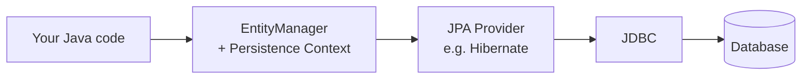

### Key facts to remember

1. `EntityManager` is an **interface** in `jakarta.persistence` (older code uses `javax.persistence`).
2. It is **not thread-safe**. One EntityManager per unit of work or per request.
3. It is **lightweight and short-lived**, unlike its factory (`EntityManagerFactory`), which is heavy and long-lived. That is Chapter 2.
4. Hibernate's native equivalent is `Session`. In Hibernate, `EntityManager` is a wrapper over `Session`, and you can get it via `em.unwrap(Session.class)`.

### A first complete example

```java
@Entity
public class User {
    @Id @GeneratedValue
    private Long id;
    private String name;
    // getters/setters
}

EntityManagerFactory emf = Persistence.createEntityManagerFactory("my-unit");
EntityManager em = emf.createEntityManager();

em.getTransaction().begin();
User u = new User();
u.setName("Riyaz");
em.persist(u);                 // INSERT scheduled
em.getTransaction().commit();  // INSERT actually executes here

em.close();
emf.close();
```

Notice that `persist` didn't hit the database immediately. The SQL runs at flush/commit. This delayed behavior is one of the most important ideas in JPA.

### Interview one-liners

- **What is EntityManager?** The primary JPA interface for managing entity lifecycle and querying, operating over a persistence context.
- **JPA vs Hibernate?** JPA is the spec; Hibernate is an implementation.
- **Is EntityManager thread-safe?** No.

---

Say **next** for Chapter 2: EntityManagerFactory vs EntityManager, `persistence.xml`, and container-managed vs application-managed lifecycles.

---
---
---
---

## Chapter 2: EntityManagerFactory vs EntityManager, Setup, Lifecycle

### The two objects

| | `EntityManagerFactory` (EMF) | `EntityManager` (EM) |
|---|---|---|
| **Weight** | Heavy | Lightweight |
| **Lifetime** | Whole application | One unit of work / request |
| **Thread-safe** | Yes | No |
| **Created from** | `Persistence.createEntityManagerFactory(...)` | `emf.createEntityManager()` |
| **Owns** | Entity metadata, connection pool, SQL cache, 2nd-level cache | Persistence context (1st-level cache), current transaction |
| **How many** | Usually one per database (per persistence unit) | Many, one per operation |

**Why this split?** Building the factory is expensive. It parses annotations, builds mappings, sets up the connection pool, and validates the schema. You do that once at startup. An EntityManager is cheap to create, so you make one per unit of work and throw it away.

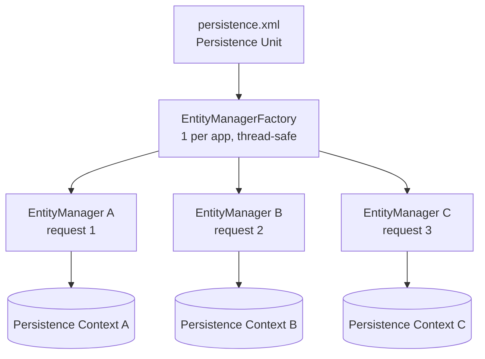

Each EM has its own isolated persistence context. Entity `User#42` loaded in EM A is a different Java object from `User#42` loaded in EM B.

### Persistence unit and `persistence.xml`

A **persistence unit** is a named configuration: which entities, which database, which provider. It lives in `META-INF/persistence.xml`.

```xml
<persistence xmlns="https://jakarta.ee/xml/ns/persistence" version="3.0">
  <persistence-unit name="my-unit" transaction-type="RESOURCE_LOCAL">
    <provider>org.hibernate.jpa.HibernatePersistenceProvider</provider>
    <class>com.example.User</class>
    <class>com.example.Order</class>

    <properties>
      <property name="jakarta.persistence.jdbc.url"    value="jdbc:postgresql://localhost/mydb"/>
      <property name="jakarta.persistence.jdbc.user"   value="app"/>
      <property name="jakarta.persistence.jdbc.password" value="secret"/>
      <property name="hibernate.hbm2ddl.auto" value="validate"/>
      <property name="hibernate.show_sql" value="true"/>
    </properties>
  </persistence-unit>
</persistence>
```

Key attributes:

| Setting | Meaning |
|---|---|
| `name` | The string you pass to `createEntityManagerFactory` |
| `transaction-type` | `RESOURCE_LOCAL` (you manage transactions) or `JTA` (container manages them) |
| `<class>` | Entities to include (often auto-detected in Java EE/Spring) |
| `hbm2ddl.auto` | `none`, `validate`, `update`, `create`, `create-drop`. Use `validate` or `none` in production. |

### Two management models

This distinction is a very common interview question.

| | **Application-managed** | **Container-managed** |
|---|---|---|
| **Who creates the EM** | You, via the factory | The container (Jakarta EE server or Spring) injects it |
| **Who closes it** | You (`em.close()`) | The container |
| **Typical environment** | Java SE, tests, plain apps | Jakarta EE, Spring, Quarkus |
| **Transactions** | Usually `RESOURCE_LOCAL`: `em.getTransaction()` | Usually JTA / `@Transactional` |
| **Annotation** | none | `@PersistenceContext` |

**Application-managed (Java SE):**

```java
EntityManagerFactory emf = Persistence.createEntityManagerFactory("my-unit"); // once, at startup

EntityManager em = emf.createEntityManager();
try {
    em.getTransaction().begin();
    // work...
    em.getTransaction().commit();
} catch (RuntimeException e) {
    if (em.getTransaction().isActive()) em.getTransaction().rollback();
    throw e;
} finally {
    em.close();   // always close, or you leak connections
}
```

**Container-managed (Jakarta EE / Spring):**

```java
@Repository
public class UserRepository {

    @PersistenceContext
    private EntityManager em;      // a thread-safe proxy, not a real EM

    @Transactional
    public void save(User u) {
        em.persist(u);
    }
}
```

The injected `em` looks like a singleton field, yet it is safe in multi-threaded code. It is a **shared proxy** that delegates to a real, transaction-bound EntityManager for the current thread and transaction. This is exactly why the "EM is not thread-safe" rule doesn't bite you in Spring.

### Lifecycle of an EntityManager

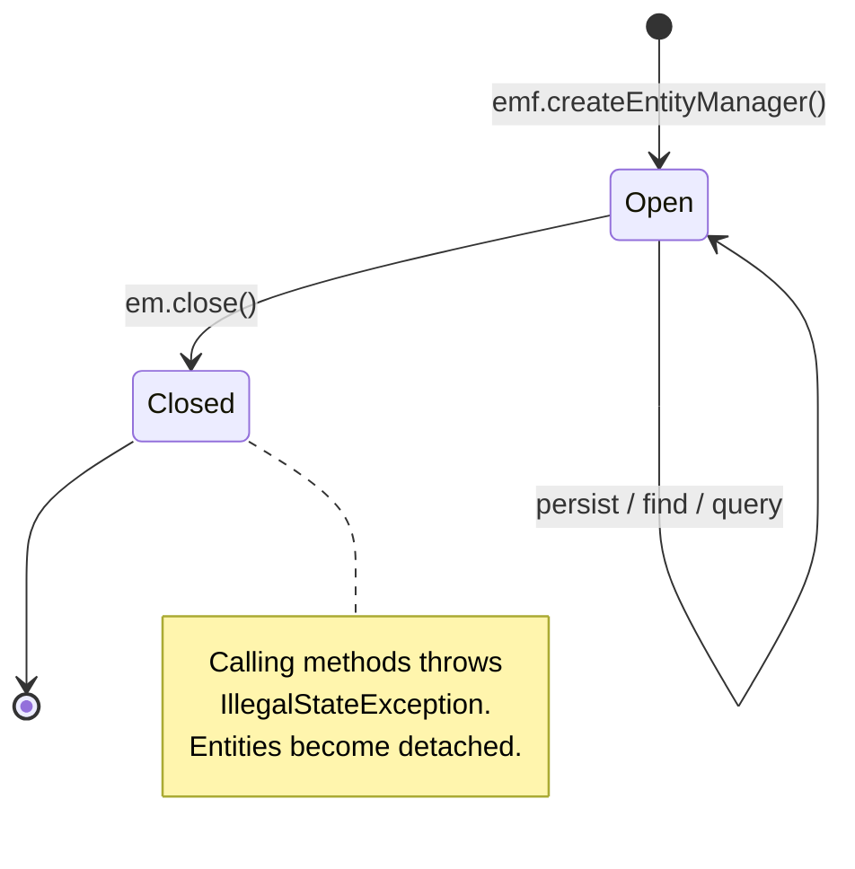

- `em.isOpen()` tells you if it is still usable.
- After `em.close()`, every entity it managed becomes **detached** (Chapter 3).
- Closing the **factory** (`emf.close()`) closes the pool and invalidates every EM created from it. Do this only at application shutdown.

### Common mistakes

1. **Creating an EMF per request.** Very slow, and it exhausts connections.
2. **Sharing one EM across threads.** Corrupts state, since it is not thread-safe.
3. **Forgetting `em.close()`** in application-managed code, which leaks connections.
4. **Using one long-lived EM for the whole app.** Its persistence context grows forever and goes stale.

### Interview one-liners

- **EMF vs EM?** The factory is heavyweight and thread-safe, one per app. The EM is lightweight and not thread-safe, one per unit of work.
- **What does `@PersistenceContext` inject?** A thread-safe proxy that resolves to the transaction-scoped EM.
- **Application- vs container-managed?** Who controls creation, closing, and transactions.

---

Say **next** for Chapter 3: Entity states (new, managed, detached, removed) and how entities move between them.

---
---
---
---


## Chapter 3: Entity States (Lifecycle)

Every entity instance in JPA is in exactly one of four states. Almost every JPA bug you'll meet (silent updates, missing updates, duplicate rows, `LazyInitializationException`) comes down to not knowing which state an object is in.

### The four states

| State | In persistence context? | Has DB row? | Tracked for changes? |
|---|---|---|---|
| **New (Transient)** | No | No | No |
| **Managed (Persistent)** | Yes | Yes (or will after flush) | **Yes** |
| **Detached** | No (was once) | Yes | No |
| **Removed** | Yes | Row will be deleted at flush | Yes (scheduled for delete) |

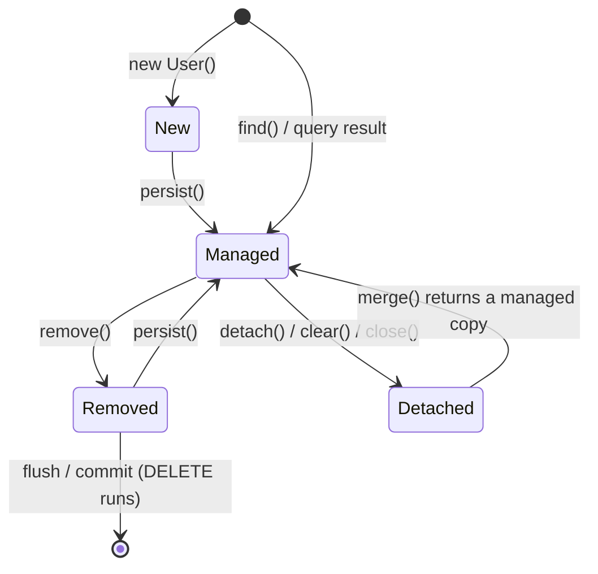

### Each state in code

```java
// 1. NEW: plain Java object, EM knows nothing about it
User u = new User();
u.setName("Riyaz");

// 2. MANAGED: EM now tracks it
em.persist(u);
u.setName("Riyaz S");      // tracked: UPDATE will be generated at flush

// Entities returned by find() or a query are also managed
User found = em.find(User.class, 1L);

// 3. DETACHED: still a valid object with an id, but EM no longer tracks it
em.detach(found);
found.setName("Ignored"); // NOT saved

// 4. REMOVED: scheduled for deletion
User toDelete = em.find(User.class, 2L);
em.remove(toDelete);       // DELETE runs at flush/commit
```

### How an entity becomes detached

1. `em.detach(entity)`: detaches one entity.
2. `em.clear()`: detaches **all** entities in the context.
3. `em.close()`: ends the context, so everything becomes detached.
4. Transaction ends in a **transaction-scoped** persistence context (the Spring default): after the `@Transactional` method returns, the entities you loaded are detached.
5. Serialization or passing across a layer boundary, such as returning an entity from a REST controller after the service transaction has ended.

Point 4 is the most common source of detached entities in real Spring apps.

### Managed means "automatically synchronized"

This is the single most important property:

```java
em.getTransaction().begin();
User u = em.find(User.class, 1L);   // managed
u.setEmail("new@x.com");            // no save() call anywhere
em.getTransaction().commit();       // UPDATE users SET email=... generated automatically
```

Changing a managed entity is enough. Chapter 5 explains how this works (dirty checking). Conversely, changing a **detached** or **new** entity does nothing to the database unless you bring it back.

### What the state of an entity looks like to the EM

```java
em.contains(entity);   // true only if MANAGED (and not removed)
```

| Call | New | Managed | Detached | Removed |
|---|---|---|---|---|
| `persist` | → Managed | ignored (cascades) | **`PersistenceException`** | → Managed |
| `merge` | copy → Managed | returns same | copy → Managed | **`IllegalArgumentException`** |
| `remove` | ignored | → Removed | **`IllegalArgumentException`** | ignored |
| `refresh` | **`IllegalArgumentException`** | reloads from DB | **`IllegalArgumentException`** | **`IllegalArgumentException`** |
| `detach` | ignored | → Detached | ignored | → Detached |

Some of these exception rules vary slightly between providers. Hibernate throws `PersistentObjectException: detached entity passed to persist` in the persist-on-detached case, which is the classic error message.

### A classic trap: detached edit that "doesn't save"

```java
@Transactional
public User load(Long id) {
    return em.find(User.class, id);      // managed inside, detached on return
}

// later, outside any transaction:
User u = service.load(1L);
u.setName("changed");                    // plain Java change, EM isn't watching
// nothing is saved
```

**Fix:** reload inside a transaction, or call `merge` on the detached object:

```java
@Transactional
public User update(User detached) {
    return em.merge(detached);           // returns a NEW managed copy
}
```

### Another trap: `merge` returns a different object

```java
User detached = ...;
User managed = em.merge(detached);

detached.setName("x");   // still detached, NOT tracked
managed.setName("x");    // tracked
```

`merge` **does not** make the object you pass in managed. It copies its state onto a managed instance and returns that. Always use the return value. Chapter 4 covers this in depth.

### Why `persist` on an ID-generated entity matters

With `@GeneratedValue(strategy = IDENTITY)`, the ID only exists after the INSERT, so Hibernate runs the INSERT **immediately** at `persist()`, not at commit. That breaks the usual "delayed SQL" behavior and also disables JDBC batching for inserts. With `SEQUENCE`, the ID comes from the sequence and the INSERT stays delayed. We'll revisit this under batching in Chapter 11.

### Interview one-liners

- **Name the entity states.** New/transient, managed/persistent, detached, removed.
- **What does managed mean?** The EM tracks the entity, and changes are flushed automatically without an explicit save.
- **How does an entity become detached?** `detach`, `clear`, `close`, or the end of a transaction-scoped context.
- **Does `merge(x)` make `x` managed?** No. It returns a new managed copy.
- **`persist` vs `merge`?** `persist` is for new entities; `merge` is for copying a detached entity's state into the context.

---

Say **next** for Chapter 4: the core operations in detail (`persist`, `find`, `getReference`, `merge`, `remove`, `refresh`, `detach`).

---
---
---
---


## Chapter 4: Core Operations

Chapter 3 covered states. Now the operations that move entities between them.

### Quick map

| Operation | Moves entity | SQL when? | Returns |
|---|---|---|---|
| `persist(e)` | New → Managed | INSERT at flush (immediately for `IDENTITY`) | `void` |
| `find(C, id)` | DB → Managed | SELECT now (unless already in context) | Entity or `null` |
| `getReference(C, id)` | DB → Managed *proxy* | **None** until a field is accessed | Proxy |
| `merge(e)` | Detached/New → copy Managed | SELECT now, then INSERT/UPDATE at flush | **Managed copy** |
| `remove(e)` | Managed → Removed | DELETE at flush | `void` |
| `refresh(e)` | Managed (reloaded) | SELECT now | `void` |
| `detach(e)` | Managed → Detached | None | `void` |

### 1. `persist`

```java
User u = new User();
u.setName("Riyaz");
em.persist(u);          // u itself becomes managed
```

- Makes **your instance** managed (unlike `merge`).
- Cascades to associations marked `CascadeType.PERSIST` (Chapter 9).
- With `SEQUENCE`, the ID is assigned at `persist` but the INSERT is delayed. With `IDENTITY`, the INSERT runs immediately.
- Throws on a detached entity (an entity that already has an ID and a row).

### 2. `find`

```java
User u = em.find(User.class, 42L);   // null if not found, no exception
```

`find` checks the persistence context first. This is the first-level cache in action:

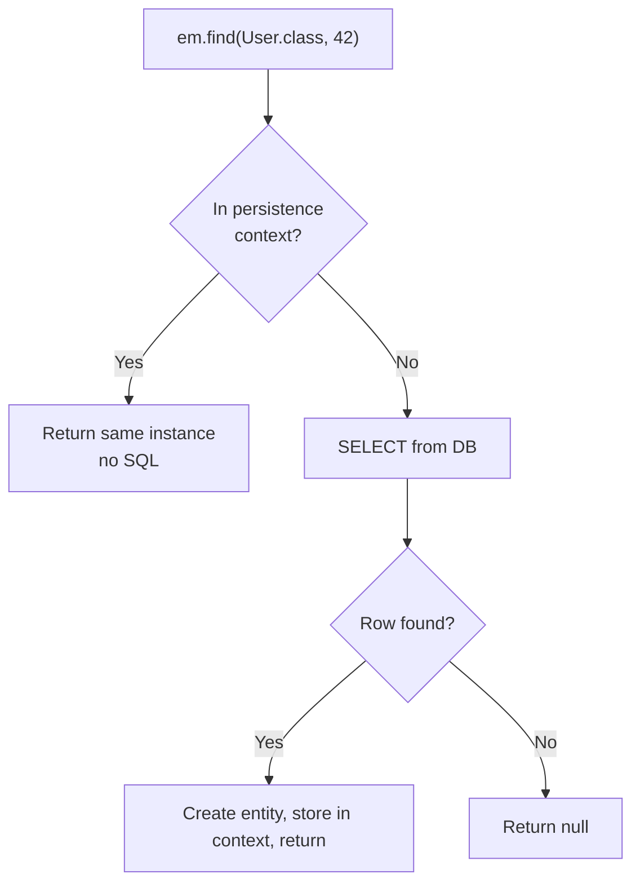

```java
User a = em.find(User.class, 42L);   // SELECT runs
User b = em.find(User.class, 42L);   // no SQL
System.out.println(a == b);          // true (identity guarantee)
```

Overloads let you pass a lock mode or hints: `em.find(User.class, 42L, LockModeType.PESSIMISTIC_WRITE)`.

### 3. `getReference`

Returns a **lazy proxy** and fires no SQL until you touch a non-ID field.

```java
User ref = em.getReference(User.class, 42L);  // no SELECT
ref.getId();                                   // still no SELECT (id is known)
ref.getName();                                 // SELECT happens now
```

If the row doesn't exist, you get `EntityNotFoundException` on first access, not at the call.

**When it's useful:** setting a foreign key without loading the parent.

```java
Order o = new Order();
o.setUser(em.getReference(User.class, 42L));   // only the FK is needed
em.persist(o);                                  // INSERT orders (user_id=42), no SELECT on users
```

| | `find` | `getReference` |
|---|---|---|
| SQL on call | Yes (unless cached) | No |
| Missing row | Returns `null` | Exception on first access |
| Returns | Real entity | Proxy |
| After detach | Fully usable | Uninitialized proxy throws `LazyInitializationException` |

### 4. `merge`

Used mainly for **detached** entities.

```java
User detached = /* came from a REST request or an older transaction */;
User managed = em.merge(detached);   // always use the return value
```

What happens internally:

1. Look up the entity by ID in the persistence context. If absent, SELECT it.
2. **Copy all state** from `detached` onto that managed instance.
3. Return the managed instance. `detached` stays detached.
4. If no row exists for that ID, a new managed entity is created and INSERTed at flush.

**The big pitfall: overwriting with nulls.**

```java
User partial = new User();
partial.setId(42L);
partial.setName("New Name");     // email left null
em.merge(partial);               // email column becomes NULL
```

`merge` copies *every* field, including nulls. For partial updates, load the entity and set only the fields you want:

```java
User u = em.find(User.class, dto.getId());
u.setName(dto.getName());        // dirty checking does the rest
```

If the entity has `@Version` and the detached copy is stale, merge fails with `OptimisticLockException` (Chapter 10).

### 5. `remove`

```java
User u = em.find(User.class, 42L);
em.remove(u);                    // DELETE at flush
```

- Needs a **managed** instance. Passing a detached one throws `IllegalArgumentException`.
- Cascades to `CascadeType.REMOVE` associations.
- Removal by ID without loading everything: `em.remove(em.getReference(User.class, 42L))`.

### 6. `refresh`

Re-reads the row and **overwrites in-memory changes**.

```java
User u = em.find(User.class, 42L);
u.setName("local edit");
em.refresh(u);                   // name reverts to DB value
```

Useful when the DB changes a row behind your back, such as triggers or default values after insert. Only works on managed entities.

### 7. `detach`, `contains`, plus a preview of `flush` and `clear`

```java
em.detach(u);          // stop tracking u
em.contains(u);        // false
em.flush();            // push pending SQL to the DB now (no commit)
em.clear();            // detach everything
```

`flush` and `clear` get their full treatment in Chapter 5.

### How Spring Data's `save()` maps to this

```java
// SimpleJpaRepository.save(entity), simplified
if (entityInformation.isNew(entity)) {
    em.persist(entity);
    return entity;
} else {
    return em.merge(entity);
}
```

`isNew` is typically true when the ID is `null` (or when the `@Version` field is null). This is why `save()` on an existing entity can issue a **SELECT before UPDATE**, and why a manually assigned ID can cause surprising merge behavior.

### Putting it together: update patterns

| Scenario | Best approach |
|---|---|
| Update inside a transaction | `find`, then modify fields. No `save` or `merge` needed. |
| Partial update from a DTO | `find`, then copy only the DTO fields |
| Full replace of a detached object | `merge`, using the return value |
| Link by FK without loading | `getReference` |
| Delete by ID cheaply | `remove(getReference(...))` |

### Interview one-liners

- **`persist` vs `merge`?** `persist` makes the passed instance managed (new entities only). `merge` copies state onto a managed instance and returns it.
- **`find` vs `getReference`?** `find` hits the DB eagerly and returns `null` if missing. `getReference` returns a lazy proxy and throws on access if missing.
- **Does `merge` ever INSERT?** Yes, when no row exists for that ID.
- **What does `refresh` do?** Discards in-memory changes and reloads from the DB.
- **Why can `save()` do a SELECT?** For non-new entities it calls `merge`, which loads the current state first.

---

Say **next** for Chapter 5: the persistence context in depth (first-level cache, dirty checking, flush modes, and when SQL actually runs).


---
---
---
---


## Chapter 5: The Persistence Context in Depth

The persistence context (PC) is the engine behind everything in Chapters 3 and 4. Understand it and most JPA behavior stops being surprising.

### What it is

A persistence context is a **per-EntityManager, in-memory map of managed entities**, keyed by `(entity class, id)`. It does three jobs:

| Job | What it means |
|---|---|
| **Identity map** | One Java object per DB row per context |
| **First-level cache** | Repeated `find` for the same id costs no SQL |
| **Change tracker** | Detects modified entities and writes them back |

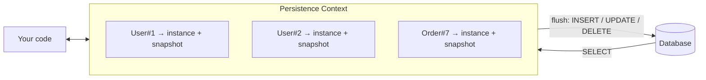

### 1. Identity guarantee

Within one PC, the same row always maps to the same Java instance:

```java
User a = em.find(User.class, 1L);
User b = em.createQuery("select u from User u where u.id = 1", User.class).getSingleResult();
System.out.println(a == b);   // true
```

The query still hits the DB, but Hibernate sees that `User#1` is already in the context and returns the existing instance rather than building a new one. The two contexts' objects, by contrast, are different: `==` is false across EMs.

### 2. Dirty checking: how "no save() needed" works

When an entity is loaded, Hibernate stores a **snapshot** of its field values (the "loaded state") next to the instance. At flush time it compares the current state to the snapshot:

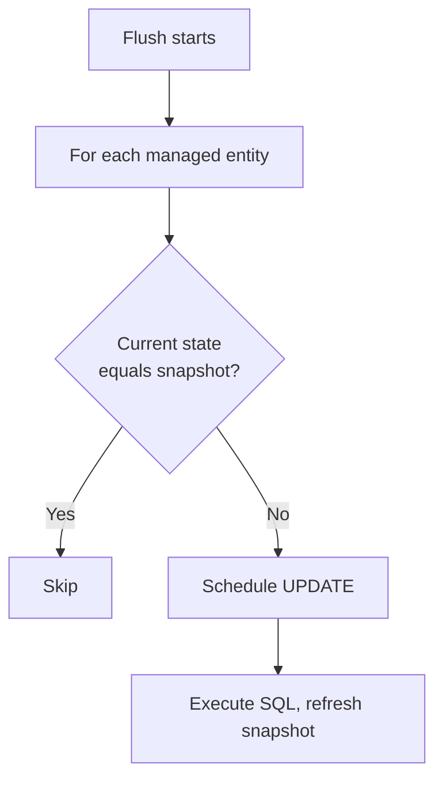

```java
@Transactional
public void rename(Long id) {
    User u = em.find(User.class, id);   // snapshot: name="Riyaz"
    u.setName("Riyaz S");               // current differs from snapshot
}                                        // commit → flush → UPDATE users SET name=?, email=?, ... WHERE id=?
```

Notes:

- By default Hibernate updates **all columns**, not only changed ones. Add `@DynamicUpdate` on the entity to generate UPDATEs with only the changed columns, at some cost per statement.
- Dirty checking is O(number of managed entities) per flush. With thousands of loaded entities, flushes get slow. This is a real performance concern.
- Setting a field to the same value is not a change, so no UPDATE is issued.
- Hibernate can use **bytecode enhancement** to track dirtiness without snapshot comparison, but it's opt-in.

### 3. Flush: when SQL actually runs

**Flush** means synchronizing the PC to the DB by executing pending SQL. It is **not** a commit. The DB transaction stays open and can still roll back.

| Trigger | When |
|---|---|
| Transaction commit | Always |
| `em.flush()` | Explicit |
| Before a query executes | In `FlushModeType.AUTO` (default), if pending changes could affect the result |

The third trigger is why this works:

```java
em.persist(new User("Riyaz"));          // INSERT only scheduled
List<User> all = em.createQuery("select u from User u", User.class)
                   .getResultList();    // AUTO flush first → INSERT runs → result includes Riyaz
```

Without auto-flush before queries, you would not see your own pending changes ("read-your-writes").

### 4. Flush modes

| Mode | Behavior |
|---|---|
| `AUTO` (default) | Flush at commit, and before queries that may be affected |
| `COMMIT` | Flush only at commit. Queries may miss pending changes. |

```java
em.setFlushMode(FlushModeType.COMMIT);
query.setFlushMode(FlushModeType.COMMIT);   // per query
```

In Spring, `@Transactional(readOnly = true)` makes Hibernate skip dirty checking and flushing for that transaction (it sets the session to a manual flush mode), which is a cheap and effective optimization for read paths.

### 5. Order of SQL at flush

Hibernate does **not** run SQL in the order you called methods. Its action queue executes roughly in this order:

1. Entity INSERTs
2. Entity UPDATEs
3. Collection removals/updates/inserts
4. Entity DELETEs

This matters in a classic situation: delete a row and insert another with the same unique value.

```java
em.remove(oldUser);                 // DELETE queued
em.persist(new User("same@x.com")); // INSERT queued
em.getTransaction().commit();       // INSERT runs BEFORE DELETE → unique constraint violation
```

Fix: call `em.flush()` after `remove` so the DELETE is executed first.

### 6. Controlling the context size: `flush`, `clear`, `detach`

The PC holds a strong reference to every managed entity until it ends. In a batch job this causes memory growth and slower dirty checking.

```java
for (int i = 0; i < 100_000; i++) {
    em.persist(new Record(i));
    if (i % 50 == 0) {
        em.flush();   // send pending INSERTs
        em.clear();   // drop all entities from memory
    }
}
```

Always `flush` before `clear`. Clearing without flushing **discards pending changes** silently.

### 7. Persistence context scope

| Type | Lifetime | Typical use |
|---|---|---|
| **Transaction-scoped** (default) | Begins and ends with the transaction | Spring `@PersistenceContext` / `@Transactional`, Jakarta EE |
| **Extended** | Spans multiple transactions, lives with the EM | Stateful session beans, long conversations |

In a transaction-scoped context, once the `@Transactional` method returns, entities become detached. That is the origin of the `LazyInitializationException` story in Chapter 8.

### 8. Spring detail: Open EntityManager in View (OEMIV)

Spring Boot enables `spring.jpa.open-in-view=true` by default. It keeps an EM open for the whole web request so lazy loading works in controllers and views. Convenient, but it holds a DB connection longer than needed and hides N+1 problems. Many teams turn it off and fetch what they need explicitly. We'll tie this to lazy loading in Chapter 8.

### Common pitfalls

1. **Expecting an immediate INSERT or UPDATE** after `persist` or a setter. It happens at flush.
2. **`clear()` without `flush()`**, which loses changes.
3. **Huge contexts in batch jobs**, giving slow flushes and OOM.
4. **Delete-then-insert unique conflicts** from flush ordering.
5. **Surprise UPDATEs** because you modified a managed entity (for example, mutating a field for display purposes) inside a transaction.

### Interview one-liners

- **What is the first-level cache?** The persistence context itself, scoped to one EM and always on.
- **How does Hibernate detect changes?** It compares the current entity state to a snapshot taken at load time, at flush.
- **Flush vs commit?** Flush sends SQL to the DB. Commit ends the transaction and makes it permanent.
- **When does AUTO flush happen?** At commit and before queries that might be affected by pending changes.
- **Why `flush()` then `clear()` in batch loops?** To send the SQL and release memory, so dirty checking stays cheap.
- **What does `readOnly = true` do in Spring?** Skips flushing and dirty checking in Hibernate and lets the DB or driver optimize.

---

Say **next** for Chapter 6: Transactions (resource-local vs JTA, `@Transactional` propagation and rollback rules, and how they tie to the EntityManager).


---
---
---
---


## Chapter 6: Transactions and the EntityManager

### Why transactions matter to EM

| Operation type | Needs an active transaction? |
|---|---|
| `find`, queries (reads) | No, but you usually still want one for consistency |
| `persist`, `merge`, `remove`, `flush`, `refresh`, lock requests | **Yes**. Otherwise `TransactionRequiredException`. |

A transaction gives you atomicity and isolation. For JPA it also defines **when the persistence context flushes** (commit) and, in a transaction-scoped setup, **how long the context lives** (Chapter 5).

### Two transaction types

| | **RESOURCE_LOCAL** | **JTA** |
|---|---|---|
| **Managed by** | You, via `EntityTransaction` (or Spring's `JpaTransactionManager`) | The container's transaction manager |
| **Scope** | One database connection | Can span multiple resources (DBs, JMS) via XA / 2PC |
| **API** | `em.getTransaction()` | `UserTransaction`, `@Transactional`, `@TransactionAttribute` |
| **`em.getTransaction()`** | Works | **Throws `IllegalStateException`** |
| **Typical environment** | Java SE, Spring Boot with a single DB | Jakarta EE servers, Spring + `JtaTransactionManager` |

### Resource-local: the `EntityTransaction` API

```java
EntityTransaction tx = em.getTransaction();
try {
    tx.begin();
    em.persist(order);
    tx.commit();                    // flush, then DB commit
} catch (RuntimeException e) {
    if (tx.isActive()) tx.rollback();
    throw e;
} finally {
    em.close();
}
```

| Method | Meaning |
|---|---|
| `begin()` / `commit()` / `rollback()` | Standard lifecycle |
| `isActive()` | Is a transaction in progress? |
| `setRollbackOnly()` / `getRollbackOnly()` | Force the outcome to be rollback |

On `commit()`, the order is: **flush the PC, then commit the DB transaction.** If the flush fails (constraint violation, for example), the commit fails and the transaction rolls back.

### What happens to the persistence context on rollback

After a rollback, all managed entities become **detached**, and their in-memory state may no longer match the DB. Treat the EM as unusable after any `PersistenceException`. Close it and start fresh. In Spring this is handled for you, because the EM is bound to the transaction and discarded at its end.

### Spring: how `@Transactional` ties to EM

```java
@Service
public class OrderService {

    @PersistenceContext
    private EntityManager em;           // shared proxy

    @Transactional
    public void place(Order o) {
        em.persist(o);
    }
}
```

What actually happens:

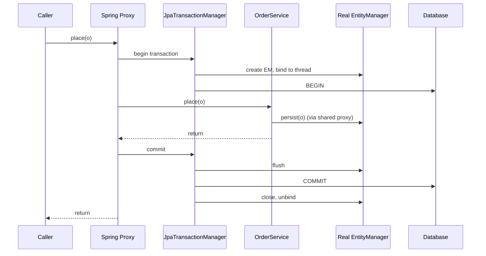

Key points:

- `@Transactional` works through a **proxy** around your bean.
- `JpaTransactionManager` creates the real EM, binds it to the **current thread**, and the injected shared `em` delegates to it. That is why one injected field is safe across threads.
- Any code called inside the transaction on the same thread sees the same EM, and therefore the same persistence context.

### Propagation

Propagation answers: "what if a transactional method is called while a transaction already exists?"

| Propagation | Behavior |
|---|---|
| **REQUIRED** (default) | Join the existing transaction, or start one if none |
| **REQUIRES_NEW** | Suspend the current one, start a brand-new one |
| **SUPPORTS** | Join if one exists, else run without |
| **MANDATORY** | Must have one, else throws |
| **NOT_SUPPORTED** | Suspend the current one, run without |
| **NEVER** | Throws if one exists |
| **NESTED** | Savepoint inside the current transaction (needs JDBC savepoint support) |

**REQUIRES_NEW and the persistence context.** A new transaction means a **new EM and a new persistence context**:

```java
@Transactional
public void outer() {
    User u = em.find(User.class, 1L);      // managed in context A
    audit.log("x");                         // REQUIRES_NEW → context B
}

@Transactional(propagation = Propagation.REQUIRES_NEW)
public void log(String msg) {
    // context B knows nothing about context A's pending changes
    // uncommitted changes from outer are NOT visible here (read-committed or stricter)
    em.persist(new AuditLog(msg));
}
```

The audit record commits independently, so it survives even if `outer` later rolls back. That is the usual reason to use it. The risk is a **self-deadlock**: the inner transaction may wait on a row lock held by the outer one.

### Rollback rules

By default Spring rolls back on **unchecked** exceptions only:

| Exception | Default rollback? |
|---|---|
| `RuntimeException` and subclasses | Yes |
| `Error` | Yes |
| Checked exceptions (`IOException`, custom `Exception`) | **No**. The transaction commits. |

```java
@Transactional(rollbackFor = Exception.class)          // include checked exceptions
@Transactional(noRollbackFor = BusinessWarning.class)  // exclude specific ones
```

JPA adds its own rule: most `PersistenceException`s thrown by the EM **mark the transaction rollback-only**, even if you catch them. Exceptions that do **not** do this include `NoResultException`, `NonUniqueResultException`, `LockTimeoutException`, and `QueryTimeoutException`.

```java
@Transactional
public void a() {
    try {
        b();                       // @Transactional(REQUIRED), throws RuntimeException
    } catch (RuntimeException e) {
        // swallowed, but the shared transaction is already marked rollback-only
    }
}                                   // commit attempt → UnexpectedRollbackException
```

When the inner method joined the outer transaction, its exception poisons the whole thing, and swallowing it doesn't help. Use `REQUIRES_NEW` for the inner method if you need independent failure.

### Proxy pitfalls (very common in interviews)

| Pitfall | Why |
|---|---|
| **Self-invocation** (`this.save()` inside the same class) | The call bypasses the proxy, so no transaction starts |
| **`private` or `final` methods** | Proxies can't intercept them (and only `public` methods are reliably advised) |
| **Calling from a non-Spring-managed object** | No proxy exists |
| **Wrong `@Transactional` import** | `jakarta.transaction.Transactional` and Spring's version differ slightly in rollback defaults and attributes |

```java
@Service
public class A {
    public void outer() { inner(); }        // direct call, no proxy, no transaction
    @Transactional
    public void inner() { ... }
}
```

Fixes: move `inner` to another bean, inject a self-reference, or make `outer` itself transactional.

### `readOnly` and isolation

```java
@Transactional(readOnly = true, isolation = Isolation.READ_COMMITTED)
```

- `readOnly = true`: Hibernate skips flush and dirty checking (Chapter 5), and the driver or DB may optimize. It is a hint, not a guarantee that writes are blocked.
- Isolation levels (`READ_COMMITTED`, `REPEATABLE_READ`, `SERIALIZABLE`) are DB-level and control which anomalies (dirty read, non-repeatable read, phantom read) are possible. Most databases default to `READ_COMMITTED` (PostgreSQL, Oracle) or `REPEATABLE_READ` (MySQL InnoDB).

### JTA in brief

In a Jakarta EE container, you typically write no begin/commit at all:

```java
@Stateless
public class OrderBean {
    @PersistenceContext
    private EntityManager em;           // JTA-aware, container-managed

    public void place(Order o) {        // default TransactionAttribute: REQUIRED
        em.persist(o);
    }
}
```

The EM automatically **joins** the active JTA transaction. For application-managed EMs in a JTA environment, you call `em.joinTransaction()` explicitly.

### Common pitfalls

1. **Writes outside a transaction**, giving `TransactionRequiredException` (or silently nothing happening in some setups).
2. **Checked exceptions not rolling back** by default.
3. **Swallowing exceptions** in an inner joined transaction, then hitting `UnexpectedRollbackException`.
4. **Self-invocation** bypassing `@Transactional`.
5. **Long transactions** holding locks and connections (for example, remote calls inside a transaction).
6. **Reusing an EM after rollback** in application-managed code.

### Interview one-liners

- **RESOURCE_LOCAL vs JTA?** Application-controlled single-resource transactions versus container-controlled, potentially distributed ones.
- **What does `@Transactional` do under the hood?** A proxy starts a transaction via the transaction manager, binds an EM to the thread, and commits or rolls back on exit.
- **Default rollback behavior?** Unchecked exceptions and errors only. Use `rollbackFor` for checked ones.
- **REQUIRED vs REQUIRES_NEW?** Join the existing transaction versus suspend it and use a separate one, with a separate persistence context.
- **Why does `@Transactional` sometimes not work?** Self-invocation, non-public methods, or a bean not managed by Spring.
- **Does flush equal commit?** No. Commit does a flush first, then ends the transaction.

---

Say **next** for Chapter 7: Querying (JPQL, Criteria API, native queries, named queries, pagination, and projections).


----
----
----
----


## Chapter 7: Querying

`find` only fetches by primary key. For anything else, you need queries. JPA gives you four ways to write them, and all are created through the EntityManager.

### The four query styles

| Style | Written in | Type-safe? | Best for |
|---|---|---|---|
| **JPQL** | Strings over *entities and fields* | Partly (with `TypedQuery`) | Most static queries |
| **Criteria API** | Java builder objects | Yes (especially with the Metamodel) | Dynamic queries with optional filters |
| **Native SQL** | Raw SQL | No | DB-specific features, complex reporting |
| **Named queries** | JPQL or SQL, declared once | Validated at startup | Reused, static queries |

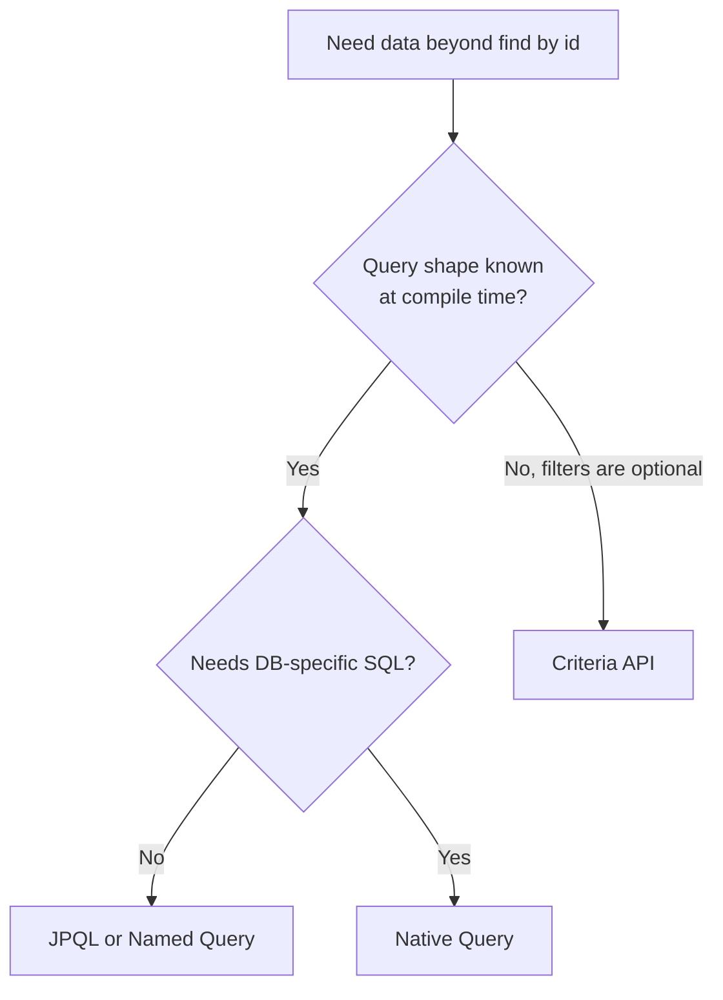

### 1. JPQL

JPQL looks like SQL but speaks in **entity names and field names**, not tables and columns.

```java
TypedQuery<User> q = em.createQuery(
    "select u from User u where u.age >= :minAge order by u.name", User.class);
q.setParameter("minAge", 18);
List<User> users = q.getResultList();
```

**Always use parameters, never string concatenation.** Concatenation opens you to injection and defeats statement caching.

| Parameter style | Example |
|---|---|
| Named (preferred) | `where u.name = :name` + `setParameter("name", x)` |
| Positional | `where u.name = ?1` + `setParameter(1, x)` |

**Result methods:**

| Method | Behavior |
|---|---|
| `getResultList()` | `List`, empty if none |
| `getSingleResult()` | Exactly one, else `NoResultException` or `NonUniqueResultException` |
| `getResultStream()` | `Stream` (close it; useful for large results) |
| `executeUpdate()` | For bulk `UPDATE` / `DELETE` |

`NoResultException` and `NonUniqueResultException` do **not** mark the transaction rollback-only (Chapter 6), so you can catch them safely.

### 2. Joins and fetch joins

```java
// Plain join: filters, but does NOT populate the association
"select o from Order o join o.user u where u.country = :c"

// Fetch join: loads the association in the same SQL
"select o from Order o join fetch o.user where o.status = :s"
```

A plain `join` is for filtering and a `join fetch` is for loading. Fetch joins are the standard fix for the N+1 problem (Chapter 8).

Two fetch-join rules to remember:

- In Hibernate 5, fetching a collection duplicated parent rows and you needed `select distinct`. **Hibernate 6+ deduplicates entity results automatically.**
- **Don't paginate a fetch-joined collection.** Hibernate can't apply `LIMIT` to the joined rows correctly, so it loads everything and paginates **in memory** (warning `HHH90003004` in Hibernate 6, `HHH000104` in 5). Paginate the parent IDs first, then fetch the children with a second query.

### 3. Projections: don't always load full entities

Entity results become **managed** (tracked, snapshotted). For read-only screens, projections are lighter.

```java
// Scalar columns → Object[] (clumsy)
List<Object[]> rows = em.createQuery("select u.id, u.name from User u", Object[].class).getResultList();

// DTO constructor expression: preferred
record UserSummary(Long id, String name) {}

List<UserSummary> list = em.createQuery(
    "select new com.example.UserSummary(u.id, u.name) from User u", UserSummary.class)
    .getResultList();

// Tuple: access by alias
List<Tuple> tuples = em.createQuery("select u.id as id, u.name as name from User u", Tuple.class).getResultList();
tuples.get(0).get("name", String.class);
```

| Projection | Managed? | Dirty checking cost | Use when |
|---|---|---|---|
| Entity | Yes | Yes | You will modify it |
| DTO / scalar / Tuple | **No** | None | Read-only display, reports |

### 4. Pagination

```java
List<User> page = em.createQuery("select u from User u order by u.id", User.class)
    .setFirstResult(page * size)    // offset
    .setMaxResults(size)            // limit
    .getResultList();
```

- **Always include an `order by`**, or pages are not deterministic.
- Offset pagination gets slower as the offset grows, since the DB still scans the skipped rows. For deep or infinite-scroll pagination, use **keyset pagination**: `where u.id > :lastSeenId order by u.id` with `setMaxResults(size)`.
- For a total count, run a separate `select count(u) ...` query.

### 5. Criteria API

Build queries as objects. Its strength is **dynamic filters**, where you add predicates only when a parameter is present.

```java
CriteriaBuilder cb = em.getCriteriaBuilder();
CriteriaQuery<User> cq = cb.createQuery(User.class);
Root<User> u = cq.from(User.class);

List<Predicate> preds = new ArrayList<>();
if (name != null)   preds.add(cb.like(cb.lower(u.get("name")), "%" + name.toLowerCase() + "%"));
if (minAge != null) preds.add(cb.ge(u.get("age"), minAge));

cq.select(u)
  .where(preds.toArray(new Predicate[0]))
  .orderBy(cb.asc(u.get("name")));

List<User> result = em.createQuery(cq).getResultList();
```

| Piece | Role |
|---|---|
| `CriteriaBuilder` | Factory for queries, predicates, expressions |
| `CriteriaQuery<T>` | The query being built |
| `Root<T>` | The `FROM` entity |
| `Predicate` | A condition in the `WHERE` |

`u.get("name")` uses a string, so a typo fails at runtime. The **JPA Static Metamodel** (`User_.name`, generated by the annotation processor) makes it compile-time safe: `u.get(User_.name)`.

Criteria is verbose. Many teams use **Spring Data Specifications** or **Querydsl** for the same purpose.

### 6. Native queries

```java
// Returns entities (columns must match the mapping)
List<User> users = em.createNativeQuery(
    "select * from users where created_at > now() - interval '7 days'", User.class)
    .getResultList();

// Scalars
List<Object[]> stats = em.createNativeQuery(
    "select country, count(*) from users group by country").getResultList();
```

- Use them for DB-specific features (window functions, CTEs, JSON operators, hints) that JPQL can't express.
- You lose portability and the entity-name abstraction.
- Hibernate can't always tell which tables a native query touches, so **pending changes may not be flushed before it runs**. If you rely on seeing your own writes, call `em.flush()` first.
- Native `UPDATE`/`DELETE` bypasses the persistence context (see bulk operations below).

### 7. Named queries

```java
@Entity
@NamedQuery(name = "User.findByCountry",
            query = "select u from User u where u.country = :country")
public class User { ... }

List<User> r = em.createNamedQuery("User.findByCountry", User.class)
                 .setParameter("country", "IN")
                 .getResultList();
```

Named queries are parsed and **validated at startup**, so a syntax error fails fast instead of at the first call. They can also be cached by the provider. Spring Data's `@Query` and derived methods (`findByCountry`) are built on the same machinery.

### 8. Bulk update and delete (important side effect)

```java
int n = em.createQuery("update User u set u.active = false where u.lastLogin < :d")
          .setParameter("d", cutoff)
          .executeUpdate();
```

Bulk operations go **straight to the DB and skip the persistence context**:

- Entities already loaded in the PC are now **stale**.
- No `@PreUpdate` lifecycle callbacks run, and `@Version` is not incremented unless you do it manually.
- Cascades do not apply.

After a bulk operation, call `em.clear()`, or `em.refresh(entity)` for specific ones. Spring Data's `@Modifying(clearAutomatically = true)` does this for you. More in Chapter 11.

### 9. How queries interact with the persistence context

| Behavior | Detail |
|---|---|
| **Auto flush** | In `FlushModeType.AUTO`, pending changes that affect the query are flushed first (Chapter 5) |
| **Identity** | Entities returned are resolved against the PC. If `User#1` is already managed, you get that existing instance, with its in-memory changes, not fresh DB state. |
| **Always hits the DB** | Unlike `find`, JPQL does not short-circuit on the first-level cache. It runs SQL and then reconciles rows with the PC. |

The second point surprises people: if you modified a managed entity and then re-query it, you see **your modified object**, not the DB row. Use `refresh` if you need the DB truth.

### 10. Useful hints

```java
query.setHint("jakarta.persistence.query.timeout", 3000);       // ms
query.setHint("org.hibernate.readOnly", true);                  // skip dirty checking for results
query.setHint("org.hibernate.fetchSize", 500);                  // JDBC fetch size
query.setLockMode(LockModeType.PESSIMISTIC_WRITE);              // lock matched rows (Chapter 10)
```

Hints are provider-specific beyond the standard `jakarta.persistence.*` ones, and unknown hints are silently ignored.

### Common pitfalls

1. **String-concatenated JPQL**, leading to injection risk.
2. **Fetch join plus pagination**, causing in-memory paging and potential OOM.
3. **Loading entities for read-only screens**, when a DTO projection is cheaper.
4. **Pagination without `order by`.**
5. **Stale entities after bulk updates.**
6. **Cartesian product** from fetch-joining multiple collections at once (`MultipleBagFetchException` in Hibernate for multiple `List` bags).
7. **Assuming a query returns fresh DB state** for entities already in the context.

### Interview one-liners

- **JPQL vs SQL?** JPQL queries the entity model (class and field names), and the provider translates it to SQL for the target DB.
- **When Criteria over JPQL?** When the query shape is built dynamically from optional conditions.
- **`join` vs `join fetch`?** Join filters; join fetch also initializes the association in the same query.
- **How do you paginate?** `setFirstResult` and `setMaxResults` with a stable `order by`. Use keyset pagination for large offsets.
- **Why are bulk updates dangerous with a persistence context?** They bypass it, leaving managed entities stale, so you must clear or refresh.
- **`getSingleResult` failure modes?** `NoResultException` and `NonUniqueResultException`.
- **Entity vs DTO projection?** Entities are managed and tracked. DTOs are plain, cheaper, and read-only.

---

Say **next** for Chapter 8: Relationships, lazy vs eager loading, the N+1 problem, and `LazyInitializationException`.


----
----
----
----


## Chapter 8: Relationships, Fetching, N+1, and `LazyInitializationException`

Entities rarely live alone. `Order` has a `User`, `User` has many `Order`s. This chapter covers how those links are mapped and, more importantly, **when the linked data is actually loaded**. That second part causes most real-world JPA performance and runtime problems.

### 1. The four relationship types

| Annotation | Example | Typical DB shape |
|---|---|---|
| `@ManyToOne` | many `Order` → one `User` | FK column on the "many" table |
| `@OneToMany` | one `User` → many `Order` | Inverse of `@ManyToOne` (or a join table) |
| `@OneToOne` | `User` ↔ `Profile` | FK (or shared PK) on one side |
| `@ManyToMany` | `Student` ↔ `Course` | Join table |

### 2. Owning side vs inverse side

In a bidirectional relationship, only **one side owns the foreign key**. The owner is the side **without** `mappedBy`. Only changes on the owning side are written to the DB.

```java
@Entity
public class Order {
    @Id @GeneratedValue Long id;

    @ManyToOne(fetch = FetchType.LAZY)       // OWNING side: has the FK column user_id
    @JoinColumn(name = "user_id")
    private User user;
}

@Entity
public class User {
    @Id @GeneratedValue Long id;

    @OneToMany(mappedBy = "user")            // INVERSE side: mirrors Order.user
    private List<Order> orders = new ArrayList<>();

    // Keep both sides in sync with helper methods
    public void addOrder(Order o) {
        orders.add(o);
        o.setUser(this);
    }
    public void removeOrder(Order o) {
        orders.remove(o);
        o.setUser(null);
    }
}
```

If you only do `user.getOrders().add(order)` and never set `order.setUser(user)`, **no FK is written**, because the owning side was never changed. Always update both sides via helper methods.

### 3. Fetch types and their defaults

| Association | Default | Meaning |
|---|---|---|
| `@ManyToOne` | **EAGER** | Loaded with the owner |
| `@OneToOne` | **EAGER** | Loaded with the owner |
| `@OneToMany` | **LAZY** | Loaded on first access |
| `@ManyToMany` | **LAZY** | Loaded on first access |

- **EAGER**: "always load it with me."
- **LAZY**: "load it only when someone touches it."

**Practical rule: declare every association `LAZY`** and decide per query what to fetch. EAGER is a fixed global decision you can't undo on a per-query basis. LAZY can always be overridden with a fetch join or entity graph.

### 4. How lazy loading works

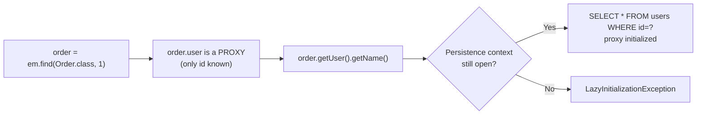

- **Single-valued** associations (`@ManyToOne`, `@OneToOne`) become **proxies**, which are generated subclasses of your entity.
- **Collections** become Hibernate wrappers (`PersistentBag`, `PersistentSet`) that fill themselves on first access.
- The load requires an **open persistence context** (Chapter 5).

### 5. `LazyInitializationException`

Thrown when you touch an uninitialized proxy or collection **after the persistence context closed** (the entity is detached, Chapter 3).

```java
@Transactional
public Order load(Long id) {
    return em.find(Order.class, id);
}

Order o = service.load(1L);          // transaction ended, entity detached
o.getUser().getName();               // 💥 LazyInitializationException
```

**Correct fixes, best first:**

| Fix | How |
|---|---|
| **Fetch what you need in the query** | `join fetch`, or an entity graph |
| **Return a DTO** | Map to a DTO inside the transaction |
| **Initialize inside the transaction** | `Hibernate.initialize(order.getUser())` |
| **Widen the transaction boundary** | Do the access within the `@Transactional` method |

**Bad "fixes":**

- Switching to `EAGER` everywhere, which causes N+1 and over-fetching.
- `hibernate.enable_lazy_load_no_trans=true`, which opens a new session and connection per lazy access. It is an anti-pattern.
- Leaning on Open-Session-in-View (Chapter 5). It hides the problem and holds connections for the whole request.

### 6. The N+1 problem

You run **1** query for the parent list, then **N** more queries, one per parent, to load a lazy association.

```java
List<Order> orders = em.createQuery("select o from Order o", Order.class).getResultList();  // 1 query
for (Order o : orders) {
    System.out.println(o.getUser().getName());   // 1 query PER order → N queries
}
```

With 100 orders, that's **101 queries**. It works in dev with 5 rows and falls over in production.

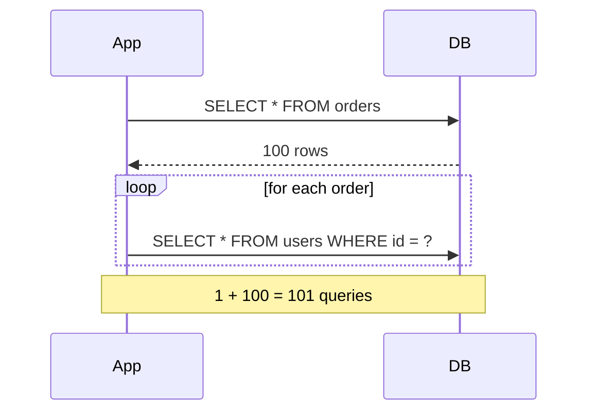

**It also happens with EAGER.** `em.find` joins eager associations, but a **JPQL query ignores the EAGER hint for joining** and then fires secondary SELECTs for each row. So EAGER does not protect you from N+1.

### 7. Fixing N+1

**a) Fetch join** (most common):

```java
em.createQuery("select o from Order o join fetch o.user", Order.class).getResultList();
// 1 query with a JOIN
```

**b) Entity graph** (declarative, reusable, keeps the query itself clean):

```java
@NamedEntityGraph(name = "Order.withUser",
    attributeNodes = @NamedAttributeNode("user"))
@Entity
public class Order { ... }

EntityGraph<?> g = em.getEntityGraph("Order.withUser");
em.createQuery("select o from Order o", Order.class)
  .setHint("jakarta.persistence.fetchgraph", g)
  .getResultList();

// Also works with find:
em.find(Order.class, 1L, Map.of("jakarta.persistence.fetchgraph", g));
```

Spring Data: `@EntityGraph(attributePaths = "user")` on a repository method.

**c) Batch fetching** (Hibernate-specific): load lazy associations in groups instead of one by one.

```java
@BatchSize(size = 50)                          // on the association or entity
// or globally:
// hibernate.default_batch_fetch_size=50
```

100 orders then trigger about 2 queries (`where id in (?, ?, ... 50 ids)`) instead of 100. This is a good global default.

**d) DTO projection**: select only the columns you need (Chapter 7), so there are no lazy associations at all.

| Fix | Best for | Watch out for |
|---|---|---|
| Fetch join | Known, specific query | Pagination with collection joins |
| Entity graph | Reusable fetch plans | Same collection-paging issue |
| Batch size | Broad safety net | Still more than one query |
| DTO projection | Read-only screens | You write the mapping |

### 8. Fetch joins and collections: the traps

1. **Pagination + collection fetch join** makes Hibernate paginate **in memory** (Chapter 7). Fix: query parent IDs with pagination first, then fetch children with `where id in (:ids)`.
2. **Multiple `List` collections in one fetch join** throws `MultipleBagFetchException`, and even with `Set` it creates a **Cartesian product** (rows multiply). Fix: fetch one collection per query, or use batch fetching.
3. **Use `Set` instead of `List`** for `@ManyToMany`. On a `List` (bag) without an order column, Hibernate deletes and re-inserts all join rows on any change.

### 9. Mapping gotchas

**`@OneToOne` lazy on the inverse side.** The side with `mappedBy` can't be a lazy proxy, because Hibernate must query to know whether it is `null` or an object. It loads eagerly regardless of `fetch = LAZY`. Fixes: put the FK on the side you load from, or use a shared primary key with `@MapsId`.

**Unidirectional `@OneToMany` without `@JoinColumn`** creates an unwanted **join table**. Use `@JoinColumn(name="user_id")`, or better, make it bidirectional with `@ManyToOne` as the owner.

**`@ManyToMany`** hides the join table, so you can't add columns to it later (for example `enrolled_at`). Prefer modeling the join as its own entity with two `@ManyToOne`s.

**Bidirectional infinite recursion** (not a JPA error, but a classic one):

- `toString()`, `equals()`, `hashCode()` that include both sides call each other forever → `StackOverflowError`. Exclude the collection side.
- JSON serialization loops (Jackson). Return DTOs instead of entities, or use `@JsonIgnore` / `@JsonManagedReference` as a stopgap.

### 10. Working with proxies

```java
Order o = em.find(Order.class, 1L);
User u = o.getUser();                  // proxy, not a real User yet

u.getClass() == User.class;            // false (it's User$HibernateProxy$...)
u instanceof User;                      // true
```

- Use `instanceof`, not `getClass()`, in `equals`.
- Entity classes and their methods shouldn't be `final`, since proxies subclass them.
- Get the real object with `Hibernate.unproxy(u)` if you need it.
- `getId()` on a proxy does **not** trigger a load when the id is accessed via property or field access consistently (the id is already known).

### 11. Choosing fetch strategy: a decision guide

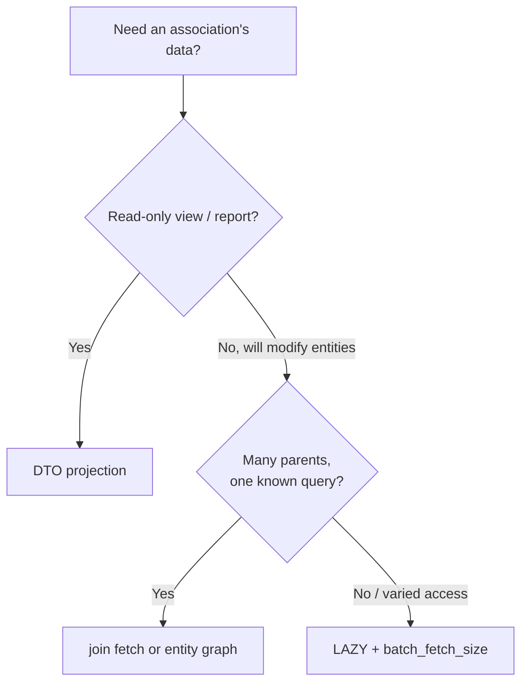

### Common pitfalls

1. **EAGER everywhere**, producing hidden N+1 and giant joins.
2. **Updating only the inverse side**, so the FK never changes.
3. **`LazyInitializationException`** from returning entities across transaction boundaries.
4. **Pagination with collection fetch join**, causing silent in-memory paging.
5. **`toString` / JSON recursion** on bidirectional links.
6. **`List` in `@ManyToMany`**, giving delete-all-then-reinsert behavior.
7. **Assuming `@OneToOne(mappedBy)` is lazy.**

### Interview one-liners

- **EAGER vs LAZY?** EAGER loads the association with the owner. LAZY loads it on first access, through a proxy or collection wrapper.
- **Defaults?** `@ManyToOne` and `@OneToOne` are EAGER. `@OneToMany` and `@ManyToMany` are LAZY.
- **What is the owning side?** The side holding the FK, meaning the one *without* `mappedBy`. Only it drives SQL.
- **What causes `LazyInitializationException`?** Accessing an uninitialized lazy association after the persistence context is closed.
- **What is N+1 and how do you fix it?** One parent query plus N child queries. Fix with `join fetch`, entity graphs, batch fetching, or DTOs.
- **Does EAGER prevent N+1?** No. JPQL queries ignore it for joining and still fire extra SELECTs.
- **Why avoid `enable_lazy_load_no_trans`?** It opens a new connection per lazy access and hides design problems.

---

Say **next** for Chapter 9: Cascade types and `orphanRemoval`, including how they interact with `persist`, `merge`, and `remove`.


-----
-----
-----
-----


## Chapter 9: Cascade Types and `orphanRemoval`

In Chapter 3 you saw that `persist`, `remove`, and the other operations act on **one entity**. If an `Order` has 10 `OrderItem`s, you'd have to persist and remove each item yourself. **Cascading** tells the EntityManager: "when I do X to the parent, do X to its associated children too."

### 1. The default: nothing cascades

```java
@Entity
public class Order {
    @OneToMany(mappedBy = "order")       // no cascade
    private List<OrderItem> items = new ArrayList<>();
}

Order o = new Order();
OrderItem i = new OrderItem();
o.addItem(i);
em.persist(o);
em.flush();   // 💥 TransientObjectException: object references an unsaved transient instance
```

The order is managed, but its item is still **new** (Chapter 3) and nothing told the EM to persist it. Hibernate notices at flush time and refuses.

### 2. Cascade types

```java
@OneToMany(mappedBy = "order", cascade = CascadeType.ALL)
private List<OrderItem> items = new ArrayList<>();
```

| Type | When you call this on the parent... | ...it is applied to the children |
|---|---|---|
| `PERSIST` | `persist(parent)` | `persist(child)` |
| `MERGE` | `merge(parent)` | `merge(child)` |
| `REMOVE` | `remove(parent)` | `remove(child)` |
| `REFRESH` | `refresh(parent)` | `refresh(child)` |
| `DETACH` | `detach(parent)` | `detach(child)` |
| `ALL` | Any of the above | All of the above |

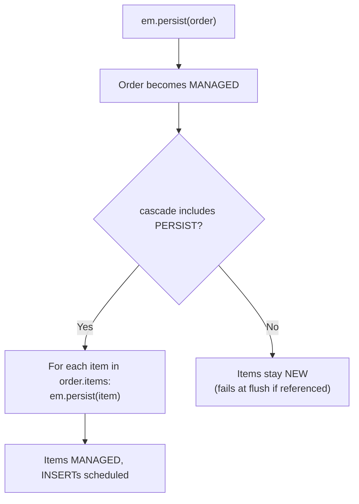

Cascading is **recursive**: if `OrderItem` cascades to something else, that propagates too.

Hibernate also has its own `org.hibernate.annotations.CascadeType` (`SAVE_UPDATE`, `REPLICATE`, `LOCK`). Stick to the JPA ones unless you need those.

### 3. Cascade `PERSIST` and flush time

Cascade `PERSIST` is evaluated **again at flush**. If you add a new child to a managed parent's collection *after* `persist(parent)`, the flush still discovers it through the association and persists it:

```java
em.persist(order);                 // order managed
order.addItem(new OrderItem());    // added afterward
em.flush();                        // cascade PERSIST finds the new item → INSERT
```

This is why cascade works naturally with dirty checking (Chapter 5).

### 4. Cascade `MERGE`

Recall from Chapter 4 that `merge` copies state from a detached graph onto managed instances.

```java
Order detached = /* from a REST request: order with items */;
Order managed = em.merge(detached);
```

With `CascadeType.MERGE` (or `ALL`), each item in the graph is merged too. Without it, items are not merged. Depending on their state this leads to stale references or `TransientObjectException`.

### 5. Cascade `REMOVE`

```java
Order o = em.find(Order.class, 1L);
em.remove(o);   // items are loaded, then removed first, then the order
```

Two practical consequences:

- Hibernate must **load the whole child collection** to remove each child. Deleting a parent with 10,000 children means 10,000 individual `DELETE`s.
- For large sets use a bulk delete (`delete from OrderItem i where i.order.id = :id`), or a DB-level `ON DELETE CASCADE` (Hibernate: `@OnDelete(action = OnDeleteAction.CASCADE)`). Both skip the entity-by-entity work, so remember Chapter 7's warning about stale entities after bulk operations.

### 6. `orphanRemoval`

Cascade `REMOVE` is triggered when the **parent is removed**. `orphanRemoval` is triggered when a **child is disconnected from its parent**.

```java
@OneToMany(mappedBy = "order", cascade = CascadeType.ALL, orphanRemoval = true)
private List<OrderItem> items = new ArrayList<>();

@Transactional
public void dropFirstItem(Long orderId) {
    Order o = em.find(Order.class, orderId);
    OrderItem first = o.getItems().get(0);
    o.removeItem(first);     // removes from collection (and sets item.order = null)
}                             // flush: DELETE FROM order_item WHERE id = ?
```

Without `orphanRemoval`, removing the item from the list would just null its FK (or fail on a NOT NULL column) and leave an orphaned row behind.

| | `CascadeType.REMOVE` | `orphanRemoval = true` |
|---|---|---|
| **Triggered by** | `remove(parent)` | Child removed from the parent's collection, or reference set to `null` |
| **Deletes on parent removal?** | Yes | Yes (it implies it) |
| **Deletes on de-association?** | No | **Yes** |
| **Allowed on** | Any association | Only `@OneToOne` and `@OneToMany` |

### 7. The "composition" rule: when to cascade

Cascade fits **parent-owns-child** relationships (UML composition), where the child cannot exist without the parent and is not shared.

| Relationship | Cascade? |
|---|---|
| `Order` → `OrderItem` | Yes (`ALL` + `orphanRemoval`) |
| `User` → `Profile` (one-to-one, owned) | Yes |
| `Post` → `Comment` | Yes |
| `Order` → `User` (`@ManyToOne`) | **No**. Deleting an order must not delete the customer. |
| `Student` ↔ `Course` (`@ManyToMany`) | **No** `REMOVE`/`ALL`. Courses are shared. |
| `Product` → `Category` | **No** |

`CascadeType.REMOVE` or `ALL` on `@ManyToOne` or `@ManyToMany` is a classic bug. Removing one entity silently deletes shared rows or fails with constraint violations.

### 8. Pitfalls

**Replacing the collection instance with `orphanRemoval`:**

```java
order.setItems(new ArrayList<>(newItems));   // 💥
// HibernateException: A collection with cascade="all-delete-orphan"
// was no longer referenced by the owning entity instance
```

Hibernate is tracking the original collection wrapper. Mutate it in place instead:

```java
order.getItems().clear();
order.getItems().addAll(newItems);
```

**Moving a child between parents with `orphanRemoval`:** if the child is removed from parent A's collection and added to parent B in the same transaction, it can be deleted as an orphan. Avoid this pattern, or make sure the child's new owner is set before flush.

**`orphanRemoval` plus `merge` of a detached graph:** a client sends back a list missing item 3. After `merge`, item 3 is no longer in the collection and is deleted. That is often what you want, but be aware that **a missing item in the payload means deletion**.

**Bidirectional helpers are still required** (Chapter 8). Cascade only moves operations along the association. It doesn't keep both sides in sync for you.

**Cascade is a convenience, not a substitute for the DB constraint.** Keep the FK constraints in the schema so bad data can't slip in through other paths.

**Cascading across a lazy association** initializes it. `remove` and `refresh` cascades load lazy collections to operate on them. Be aware of this in performance-sensitive paths.

### 9. Putting it together

```java
@Entity
public class Order {
    @Id @GeneratedValue Long id;

    @OneToMany(mappedBy = "order", cascade = CascadeType.ALL, orphanRemoval = true)
    private List<OrderItem> items = new ArrayList<>();

    public void addItem(OrderItem i)    { items.add(i);    i.setOrder(this); }
    public void removeItem(OrderItem i) { items.remove(i); i.setOrder(null); }
}

@Entity
public class OrderItem {
    @Id @GeneratedValue Long id;

    @ManyToOne(fetch = FetchType.LAZY)   // no cascade: items must not delete or create orders
    @JoinColumn(name = "order_id", nullable = false)
    private Order order;
}
```

| Action | Result |
|---|---|
| `persist(order)` with new items | Order and all items INSERTed |
| `order.removeItem(i)` | Item row DELETEd at flush |
| `remove(order)` | All items DELETEd, then the order |
| `remove(item)` directly | Item deleted, order untouched (but remove it from `order.items` too, or it can be re-persisted by cascade at flush) |

The last row is subtle: if a removed child is still in a parent's collection with `PERSIST` cascading, the flush can **resurrect** it, or Hibernate throws "deleted instance passed to merge/persist". Always remove from the collection via the helper.

### Interview one-liners

- **What does cascade do?** It propagates an EntityManager operation (`persist`, `merge`, `remove`, `refresh`, `detach`) from an entity to its associated entities.
- **Default cascade?** None.
- **`CascadeType.REMOVE` vs `orphanRemoval`?** `REMOVE` acts when the parent is deleted. `orphanRemoval` also deletes a child when it is removed from the parent's collection.
- **Where should cascade be used?** On parent-owns-child relationships. Not on `@ManyToOne`, and not `REMOVE`/`ALL` on `@ManyToMany`.
- **Why does cascade-delete of many children perform badly?** Hibernate loads and deletes each child individually. Use a bulk delete or DB-level `ON DELETE CASCADE`.
- **What error do you get replacing an `orphanRemoval` collection?** "A collection with cascade=all-delete-orphan was no longer referenced by the owning entity instance". Mutate the existing collection instead.
- **Cause of `TransientObjectException` at flush?** A managed entity references a new entity, and no cascade `PERSIST` (or explicit persist) covers it.

---

Say **next** for Chapter 10: Locking and concurrency (optimistic locking with `@Version`, pessimistic locks, and lock modes).


------
------
------
------


## Chapter 10: Locking and Concurrency

So far we've assumed one user at a time. In real systems, two transactions touch the same row at the same time. This chapter covers how JPA keeps them from silently overwriting each other.

### 1. The problem: the lost update

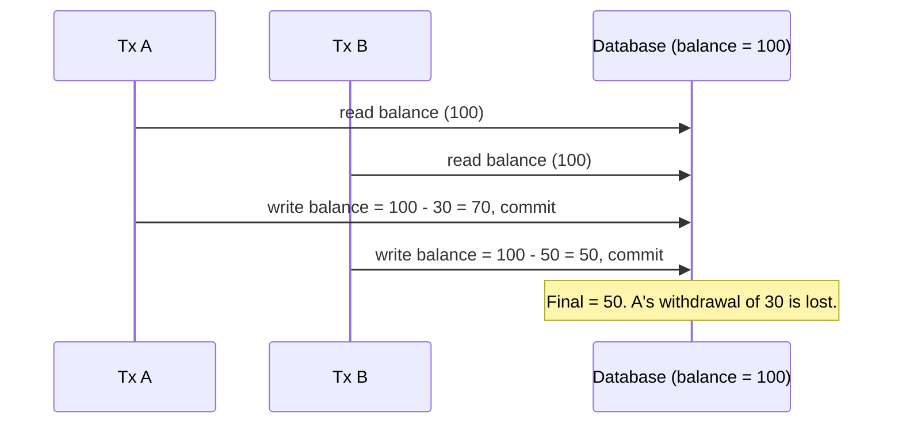

Neither transaction did anything wrong in isolation. At `READ_COMMITTED` (the default on most databases, Chapter 6), the DB happily allows this. JPA offers two strategies to prevent it.

| Strategy | Idea | Cost |
|---|---|---|
| **Optimistic** | Assume conflicts are rare. Detect them at write time and fail one transaction. | No DB locks held. Occasional retries. |
| **Pessimistic** | Assume conflicts are likely. Lock the row up front so others wait. | Locks held, risk of waiting and deadlocks. |

### 2. Optimistic locking with `@Version`

Add a version attribute to the entity:

```java
@Entity
public class Account {
    @Id @GeneratedValue Long id;
    BigDecimal balance;

    @Version
    private Long version;        // managed by the provider, never set it yourself
}
```

On every UPDATE, Hibernate adds the version to the `WHERE` clause and increments it:

```sql
update account
set balance = ?, version = 6
where id = ? and version = 5
```

If another transaction already changed the row, the version is no longer 5, **0 rows are updated**, and the provider throws `OptimisticLockException`.

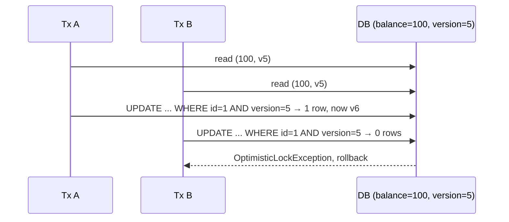

**Details to know:**

| Point | Detail |
|---|---|
| Allowed types | `int`, `Integer`, `short`, `Short`, `long`, `Long`, and timestamp types. Prefer numeric. Timestamps can collide at low resolution. |
| When it increments | Only when the entity is actually **dirty** (Chapter 5) |
| When the exception fires | At **flush/commit**, not at the setter. In Spring the exception can surface at the proxy boundary when `@Transactional` commits. |
| Spring translation | `ObjectOptimisticLockingFailureException` (a subclass of `OptimisticLockingFailureException`) |
| Collections | Changes to **owned** collections bump the version. Changes to the inverse (`mappedBy`) side do not. Use `@OptimisticLock(excluded = true)` to opt a field out. |

### 3. Versioning across requests (the web case)

Within one transaction, the persistence context already protects you. The real value of `@Version` is across **separate requests**, where the entity is detached in between:

1. `GET /accounts/1` returns the DTO with `version = 5`.
2. User edits the form for a minute.
3. `PUT /accounts/1` sends `version = 5` back.
4. Server loads the entity and checks the version before applying changes.

```java
@Transactional
public void update(AccountDto dto) {
    Account a = em.find(Account.class, dto.id());
    if (!a.getVersion().equals(dto.version())) {
        throw new ConflictException("Someone else modified this account");
    }
    a.setBalance(dto.balance());      // flush adds "AND version = ?" as well
}
```

With `merge(detached)` (Chapter 4), Hibernate compares the incoming version to the current one and fails if they differ. In both cases, **the DTO must carry the version**. If you drop it, you lose protection. Map it to HTTP as `409 Conflict` or an `ETag` / `If-Match` header.

### 4. Handling an optimistic failure

The transaction is already rolled back and its EM is unusable (Chapter 6). The correct response is to **retry the whole unit of work in a new transaction**, reloading fresh state:

```java
@Service
public class TransferService {
    private final AccountOps ops;   // separate bean holding @Transactional methods

    public void transfer(Long from, Long to, BigDecimal amt) {
        for (int attempt = 1; ; attempt++) {
            try {
                ops.doTransfer(from, to, amt);   // @Transactional inside, so a fresh tx per attempt
                return;
            } catch (OptimisticLockingFailureException e) {
                if (attempt == 3) throw e;
            }
        }
    }
}
```

The retry must happen **outside** the transactional boundary (hence the separate bean, due to the self-invocation issue from Chapter 6). Spring Retry's `@Retryable` does the same thing declaratively. Retrying blindly with stale data would just fail again.

### 5. Explicit lock modes

`LockModeType` lets you request a lock for a specific read.

| Mode | Kind | What it does |
|---|---|---|
| `NONE` | n/a | No locking |
| `OPTIMISTIC` | Optimistic | At commit, re-check that the version is unchanged (even if you only **read** the entity) |
| `OPTIMISTIC_FORCE_INCREMENT` | Optimistic | Always bump the version at commit, even if the entity is unchanged |
| `PESSIMISTIC_READ` | Pessimistic | Shared DB lock: others can read, none can write |
| `PESSIMISTIC_WRITE` | Pessimistic | Exclusive DB lock (`SELECT ... FOR UPDATE`) |
| `PESSIMISTIC_FORCE_INCREMENT` | Pessimistic | Exclusive lock plus version bump |

Older names `READ` and `WRITE` are synonyms for `OPTIMISTIC` and `OPTIMISTIC_FORCE_INCREMENT`.

Three ways to request one:

```java
Account a = em.find(Account.class, 1L, LockModeType.PESSIMISTIC_WRITE);   // at load time

em.lock(a, LockModeType.OPTIMISTIC);                                       // on an already-managed entity

em.createQuery("select a from Account a where a.id in :ids", Account.class)
  .setParameter("ids", ids)
  .setLockMode(LockModeType.PESSIMISTIC_WRITE)                             // on a query
  .getResultList();
```

In Spring Data: `@Lock(LockModeType.PESSIMISTIC_WRITE)` on a repository method.

**When `OPTIMISTIC` and `FORCE_INCREMENT` help:**

- `OPTIMISTIC`: you **read** entity X and base a decision on it, while changing entity Y. Without it, nobody notices if X changed in between (write skew). Locking X guards the decision.
- `OPTIMISTIC_FORCE_INCREMENT`: a child changes (an `OrderItem` added), but you want the **aggregate root** (`Order`) to count as modified, so concurrent edits to the same aggregate conflict. Child changes on an inverse collection do not bump the parent's version by themselves.

### 6. Pessimistic locking in practice

`PESSIMISTIC_WRITE` translates to `SELECT ... FOR UPDATE`:

```java
@Transactional
public void withdraw(Long id, BigDecimal amt) {
    Account a = em.find(Account.class, id, LockModeType.PESSIMISTIC_WRITE);
    // any other transaction asking for this row's lock now WAITS
    if (a.getBalance().compareTo(amt) < 0) throw new InsufficientFunds();
    a.setBalance(a.getBalance().subtract(amt));
}   // commit releases the lock
```

Locks are held until the **transaction ends**, so keep the transaction short and never call remote services while holding one.

**Timeouts and skipping** (via hints, supported in Hibernate on most databases):

```java
Map<String, Object> hints = Map.of("jakarta.persistence.lock.timeout", 3000);  // wait up to 3s
em.find(Account.class, id, LockModeType.PESSIMISTIC_WRITE, hints);
```

| Value of `jakarta.persistence.lock.timeout` | Meaning |
|---|---|
| `> 0` (ms) | Wait that long, then fail |
| `0` | `NOWAIT`: fail immediately if locked |
| `-2` (Hibernate) | `SKIP LOCKED`: skip rows others have locked |

`SKIP LOCKED` is the standard building block for **job queues** in SQL: many workers each claim different rows without blocking one another.

```java
em.createQuery("select j from Job j where j.status = 'NEW' order by j.id", Job.class)
  .setLockMode(LockModeType.PESSIMISTIC_WRITE)
  .setHint("jakarta.persistence.lock.timeout", -2)
  .setMaxResults(10)
  .getResultList();
```

**Exceptions:**

| Exception | Meaning | Marks tx rollback-only? |
|---|---|---|
| `PessimisticLockException` | Lock could not be obtained or the statement failed | Yes |
| `LockTimeoutException` | Timed out waiting, and only the statement failed | **No** |
| `OptimisticLockException` | Version check failed | Yes |

### 7. Deadlocks

Two transactions each hold a lock the other wants:

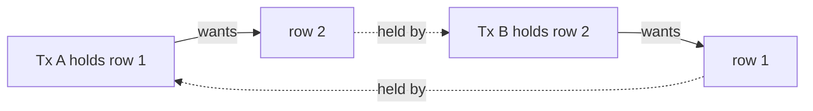

The DB detects it and kills one transaction, which you see as a deadlock-related `PessimisticLockException` or a Spring `CannotAcquireLockException`. Prevention:

1. **Lock rows in a consistent order** (for example, always the lower account id first in a transfer).
2. Keep transactions short.
3. Lock only what you need.

### 8. Choosing between them

| Situation | Choice |
|---|---|
| Edits from forms or APIs with long "think time" | **Optimistic** (you can't hold a DB lock across user think time) |
| Rarely-contended rows | **Optimistic** |
| Hot rows (counters, inventory for a flash sale) with frequent conflicts | **Pessimistic**, or better, an atomic update (below) |
| Job queue or work distribution | **Pessimistic + SKIP LOCKED** |
| Must never fail with a retry | **Pessimistic** |

**An alternative worth knowing: atomic updates in the DB.** For counters and balances, a single statement avoids reading at all:

```java
int rows = em.createQuery(
    "update Account a set a.balance = a.balance - :amt where a.id = :id and a.balance >= :amt")
    .setParameter("amt", amt).setParameter("id", id)
    .executeUpdate();
if (rows == 0) throw new InsufficientFunds();
```

The DB serializes the row update itself, so no lost update is possible. The cost is the bulk-update caveats from Chapter 7: the persistence context is stale and `@Version` is not incremented unless you do it yourself (HQL's `update versioned Account ...`, or `set a.version = a.version + 1`).

### 9. Pitfalls

1. **No `@Version` anywhere**, so lost updates happen silently at `READ_COMMITTED`.
2. **DTO drops the version**, which removes protection on detached updates.
3. **Retrying inside the failed transaction**, or retrying without reloading.
4. **Pessimistic locks held during slow work**, causing pile-ups and timeouts.
5. **Bulk updates ignoring the version**, leaving concurrent entity updates unaware.
6. **Pessimistic lock without a transaction**, so the lock is released immediately or an exception is thrown.
7. **Locking queries with joins or paging**: `FOR UPDATE` may lock more rows than expected, and some databases reject it with `DISTINCT`, `GROUP BY`, or outer joins. Hibernate can use `FOR UPDATE OF alias` to limit it, with varying DB support.
8. **Treating `READ_COMMITTED` as safe** for read-modify-write logic.
9. **Setting the `@Version` field manually**, which breaks the mechanism.

### Interview one-liners

- **What is a lost update?** Two transactions read the same data and one overwrites the other's change without seeing it.
- **How does `@Version` work?** Hibernate adds `WHERE version = ?` to updates and increments it. Zero rows updated means a conflict and `OptimisticLockException`.
- **Optimistic vs pessimistic?** Optimistic detects conflicts at write time without DB locks. Pessimistic locks rows up front (`SELECT ... FOR UPDATE`).
- **When is the optimistic check performed?** At flush/commit, not when you call the setter.
- **How do you handle `OptimisticLockException`?** Roll back, reload, and retry the whole unit of work in a new transaction, or return `409` to the client.
- **What does `OPTIMISTIC_FORCE_INCREMENT` do?** Bumps the version at commit even if the entity is unchanged, useful for protecting an aggregate root.
- **What is `SKIP LOCKED` for?** Letting concurrent workers claim different rows from a queue table without blocking each other.
- **How do you prevent deadlocks?** Acquire locks in a consistent order, keep transactions short, and lock minimally.
- **Why do bulk updates interact badly with `@Version`?** They bypass the persistence context and don't bump the version automatically.

---

Say **next** for Chapter 11: Advanced topics (JDBC batching, `IDENTITY` vs `SEQUENCE`, bulk operations, extended persistence contexts, the second-level cache, `StatelessSession`, thread safety, and lifecycle callbacks).


-------
-------
-------
-------


## Chapter 11: Advanced Topics

This chapter collects the features that separate "I can use JPA" from "I can run JPA in production": batching, ID generation, caching, lifecycle callbacks, and escape hatches.

### 1. JDBC batching

By default, every INSERT/UPDATE/DELETE is its own JDBC round trip. Batching sends many statements in one trip.

```properties
hibernate.jdbc.batch_size=50
hibernate.order_inserts=true       # group inserts by entity type so batches stay full
hibernate.order_updates=true       # same for updates
```

Rules for it to actually work:

| Requirement | Why |
|---|---|
| ID strategy is **not** `IDENTITY` | `IDENTITY` forces an immediate INSERT to get the ID, so Hibernate can't batch inserts (Chapter 3) |
| `flush` + `clear` every N entities | Otherwise the persistence context grows and dirty checking slows down (Chapter 5) |
| Driver flag, where relevant | MySQL: `rewriteBatchedStatements=true`. PostgreSQL: `reWriteBatchedInserts=true`. |

```java
@Transactional
public void importAll(List<Record> records) {
    int i = 0;
    for (Record r : records) {
        em.persist(r);
        if (++i % 50 == 0) {      // match batch_size
            em.flush();
            em.clear();
        }
    }
}
```

Spring Data's `saveAll` calls `persist` (or `merge`) per entity and is batched only if the settings above are in place. Entities with **assigned IDs** make `save()` call `merge`, which issues a SELECT per entity first. Implement `Persistable<ID>` and `isNew()` to avoid that.

### 2. ID generation strategies

| Strategy | How the ID is obtained | Batching inserts? | Notes |
|---|---|---|---|
| `IDENTITY` | DB auto-increment, available only after INSERT | **No** | Simple, common on MySQL |
| `SEQUENCE` | DB sequence, fetched before INSERT | **Yes** | Best choice where supported (PostgreSQL, Oracle, SQL Server, MariaDB) |
| `TABLE` | A table simulating a sequence | Yes, but slow | Portable fallback, rarely recommended |
| `AUTO` | Provider picks one | Depends | In Hibernate 6, prefers `SEQUENCE` where available |
| UUID (`@GeneratedValue` on `UUID` or `@UuidGenerator`) | Generated in the app | Yes | No DB round trip. Random UUIDs scatter B-tree index inserts, so consider time-ordered UUIDs. |

**The pooled optimizer.** `SEQUENCE` normally does not hit the DB per entity:

```java
@Id
@GeneratedValue(strategy = GenerationType.SEQUENCE, generator = "order_seq")
@SequenceGenerator(name = "order_seq", sequenceName = "order_seq", allocationSize = 50)
private Long id;
```

With `allocationSize = 50`, Hibernate reads one sequence value and hands out the next 50 IDs from memory. **The DB sequence's `INCREMENT BY` must equal `allocationSize`** (50). If they differ, you get duplicate-key errors or wasted ID ranges. This mismatch is a frequent production bug when someone creates the sequence by hand.

### 3. Bulk operations, revisited

From Chapter 7: bulk `UPDATE`/`DELETE` skip the persistence context. Here is the safe pattern:

```java
@Transactional
public int deactivateOld(LocalDate cutoff) {
    em.flush();                                   // push pending changes first
    int n = em.createQuery("update User u set u.active = false where u.lastLogin < :d")
              .setParameter("d", cutoff)
              .executeUpdate();
    em.clear();                                   // drop stale entities
    return n;
}
```

Flush before (so pending changes aren't lost or ordered wrongly), clear after (so no stale entities remain). Spring Data equivalent: `@Modifying(flushAutomatically = true, clearAutomatically = true)`.

### 4. Lifecycle callbacks and entity listeners

Methods on the entity (or a separate listener class) that run at specific points:

| Annotation | Fires |
|---|---|
| `@PrePersist` | Before `persist` takes effect |
| `@PostPersist` | After the INSERT executes |
| `@PreUpdate` | Before an UPDATE (only if the entity is dirty at flush) |
| `@PostUpdate` | After the UPDATE |
| `@PreRemove` / `@PostRemove` | Around DELETE |
| `@PostLoad` | After the entity is loaded or refreshed |

```java
@Entity
@EntityListeners(AuditListener.class)
public class Order {
    @PrePersist void onCreate() { this.createdAt = Instant.now(); }
    @PreUpdate  void onUpdate() { this.updatedAt = Instant.now(); }
}
```

Restrictions and gotchas:

- **Don't call EntityManager operations or touch other entities' associations** inside callbacks. Behavior is undefined and can corrupt the flush.
- `@PreUpdate` does **not** fire for bulk updates, since entities aren't loaded (Chapter 7).
- Callbacks run inside the flush. Exceptions there roll back the transaction.
- For auditing, Spring Data's `@CreatedDate`, `@LastModifiedBy` (via `AuditingEntityListener`) or Hibernate Envers are usually better than hand-rolled callbacks.

### 5. The second-level (L2) cache

The first-level cache is per EntityManager (Chapter 5). The **second-level cache is shared across all EMs of one `EntityManagerFactory`**, so data loaded by one request can serve another.

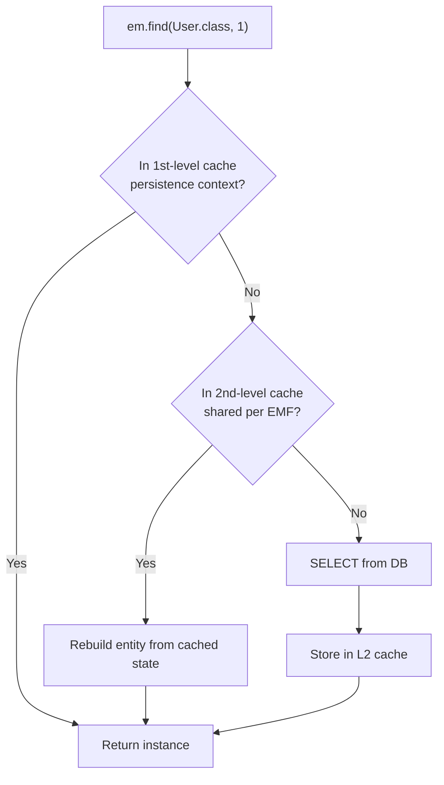

Setup (provider-specific, commonly via JCache with Ehcache, Caffeine, or Infinispan):

```properties
hibernate.cache.use_second_level_cache=true
hibernate.cache.region.factory_class=jcache
```

```java
@Entity
@Cacheable                                                       // JPA: opt this entity in
@org.hibernate.annotations.Cache(usage = CacheConcurrencyStrategy.READ_WRITE)
public class Country { ... }
```

| Concurrency strategy | Use for |
|---|---|
| `READ_ONLY` | Never-changing reference data. Fastest. |
| `NONSTRICT_READ_WRITE` | Rarely updated data where brief staleness is acceptable |
| `READ_WRITE` | Updated data that needs strong consistency, using soft locks |
| `TRANSACTIONAL` | Full JTA transactional cache (needs a supporting provider) |

Important facts:

- L2 stores the **hydrated state** (column values), not live objects. A hit builds a new instance for the requesting persistence context.
- It is used by `find`, by lazy-loading an association by id, and by `getReference`. **JPQL queries do not use it for the query itself**, though entities they load may be resolved from it. A separate **query cache** exists (`hibernate.cache.use_query_cache` + `setHint("org.hibernate.cacheable", true)`) which caches result **ids** and is invalidated whenever any related table changes. It rarely pays off for write-heavy tables.
- **Collections** are cached separately and only as lists of ids. Annotate the collection with `@Cache` too, and ensure the target entity is also cached, or you pay a SELECT per element.
- Bulk and native updates invalidate affected regions (native ones may flush everything for that entity region unless you specify query spaces).
- Entries are per EMF/JVM. In a cluster you need a distributed or invalidating provider, or a different strategy, to avoid stale reads.

Per-call control:

```java
em.find(Country.class, 1L, Map.of(
    "jakarta.persistence.cache.retrieveMode", CacheRetrieveMode.BYPASS));  // skip reading L2
emf.getCache().evict(Country.class);                                       // programmatic eviction
```

**When to use it:** read-mostly reference data (countries, currencies, config) where staleness is tolerable. **When to avoid it:** frequently updated entities, or when you can't guarantee that all writes go through Hibernate (other services or raw SQL changing the same tables).

### 6. `StatelessSession` (Hibernate-specific)

A session with **no persistence context**: no first-level cache, no dirty checking, no cascades, no lazy loading, no lifecycle events. Each call goes straight to SQL.

```java
SessionFactory sf = emf.unwrap(SessionFactory.class);
try (StatelessSession ss = sf.openStatelessSession()) {
    Transaction tx = ss.beginTransaction();
    for (Record r : records) ss.insert(r);    // immediate SQL, nothing retained in memory
    tx.commit();
}
```

| | EntityManager | StatelessSession |
|---|---|---|
| Persistence context | Yes | No |
| Dirty checking | Yes | No (you call `update` explicitly) |
| Memory growth in loops | Yes | No |
| Cascades / lazy loading | Yes | No |
| Use for | Business logic | Bulk import, ETL, large read-only scans |

### 7. Streaming large results

Loading 1M entities with `getResultList()` fills memory. Stream instead:

```java
try (Stream<User> s = em.createQuery("select u from User u", User.class)
                        .setHint("org.hibernate.fetchSize", 500)
                        .getResultStream()) {
    s.forEach(u -> {
        process(u);
        em.detach(u);                // keep the persistence context small
    });
}
```

Always close the stream (try-with-resources), because it holds a JDBC cursor open. Some drivers need extra settings to truly stream (PostgreSQL requires autocommit off inside a transaction and a fetch size; MySQL needs `useCursorFetch=true` or a streaming fetch size). For read-only passes, `StatelessSession` or DTO projections are lighter still.

### 8. Extended persistence context

In Chapter 5 we saw the default **transaction-scoped** context. The **extended** type survives multiple transactions and lives as long as the EM.

```java
@PersistenceContext(type = PersistenceContextType.EXTENDED)
private EntityManager em;           // typically on a stateful session bean
```

- Entities **stay managed** between transactions, so no re-fetching or detached-merge dance in a multi-step conversation (wizard flows).
- `persist` called **outside** a transaction is queued and executed when a transaction later begins and commits.
- Costs: long-lived memory, stale data, not thread-safe, and you must manage its lifecycle carefully. In Spring web apps it is rarely used. Stateless services and DTOs are the norm.
- **Application-managed** EMs (Chapter 2) are *always* extended by nature, since you control the lifecycle, and that is why one long-lived EM per app is a mistake.

### 9. Thread safety summary

| Object | Thread-safe? | Rule |
|---|---|---|
| `EntityManagerFactory` | **Yes** | Share one per persistence unit |
| `EntityManager` | **No** | One per unit of work or thread. In Spring, the injected shared proxy handles this. |
| Managed entity instances | **No** | They belong to one persistence context. Never share them across threads. |
| `Query` / `TypedQuery` objects | **No** | Create per use |

A common production bug is handing a managed entity to an `@Async` method or a parallel stream. The other thread has no EM bound, so lazy loads fail, and concurrent access to the entity is unsafe. Pass IDs or DTOs instead and load inside the target thread's own transaction.

### 10. `equals` and `hashCode` for entities

This is easy to get wrong and comes up in interviews.

- The ID is `null` until persist (and until flush with `IDENTITY`), so an ID-based `hashCode` **changes** after persist. An entity placed in a `HashSet` before persist then becomes unreachable in that set.
- Proxies (Chapter 8) are subclasses, so use `instanceof`, and access state through getters, since the proxy's fields are not populated.

Two common safe patterns:

```java
// 1. Business key (natural identifier), stable and unique
@Override public boolean equals(Object o) {
    return o instanceof User u && Objects.equals(email, u.getEmail());
}
@Override public int hashCode() { return Objects.hash(email); }

// 2. Generated ID: equals by id (when non-null), constant hashCode
@Override public boolean equals(Object o) {
    return o instanceof User u && id != null && id.equals(u.getId());
}
@Override public int hashCode() { return getClass().hashCode(); }
```

Pattern 2 keeps the hash stable across the entity's lifetime. The cost is that big hash sets degrade to one bucket, which is fine for typical association sizes. Never include lazy associations in either method.

### 11. Handy mapping features worth knowing

| Feature | Purpose |
|---|---|
| `@DynamicUpdate` | UPDATE only changed columns (Chapter 5) |
| `@Immutable` | Entity is never updated, so Hibernate skips dirty checking for it |
| `@NaturalId` | Declares a business key and enables efficient lookup by it (`session.bySimpleNaturalId`) with cache support |
| `@Formula` | Read-only derived column computed by a SQL expression |
| `@BatchSize` | Batch lazy loading (Chapter 8) |
| `@Version` | Optimistic locking (Chapter 10) |
| `@Convert` / `AttributeConverter` | Custom Java ↔ column type conversion |
| `@Embeddable` / `@Embedded` | Value objects mapped into the owner's table |
| `@Inheritance` | `SINGLE_TABLE` (default, fast, nullable columns), `JOINED` (normalized, more joins), `TABLE_PER_CLASS` (rarely recommended) |

### 12. Unwrapping to the provider

```java
Session session = em.unwrap(Session.class);        // Hibernate API from a JPA EM
session.setJdbcBatchSize(100);                      // per-session batch size override
session.doWork(connection -> { /* raw JDBC */ });   // escape hatch for JDBC-level work
```

Use this sparingly. It ties code to Hibernate, though most real projects use Hibernate anyway.

### Common pitfalls

1. **`IDENTITY` + large inserts** with no batching.
2. **Sequence `allocationSize` ≠ DB increment**, causing duplicate keys or gaps.
3. **Batch loops without `flush` + `clear`**, causing OOM and slow dirty checking.
4. **L2 cache on volatile data** or in a cluster without invalidation, giving stale reads.
5. **Query cache on frequently written tables**, which constantly invalidates and adds overhead.
6. **Doing EM work inside lifecycle callbacks.**
7. **ID-based `hashCode`** breaking `HashSet`s across persist.
8. **Sharing entities or the EM across threads** (`@Async`, parallel streams).
9. **Unclosed result streams**, leaking cursors and connections.
10. **Assigned IDs with `save()`**, causing a hidden SELECT per entity.

### Interview one-liners

- **How do you speed up bulk inserts?** Use a `SEQUENCE` generator (not `IDENTITY`), enable `hibernate.jdbc.batch_size` and `order_inserts`, and `flush` + `clear` every batch.
- **Why does `IDENTITY` hurt batching?** Hibernate needs the generated ID immediately, so it must execute each INSERT right away.
- **First-level vs second-level cache?** L1 is per EM, always on. L2 is shared across EMs in one EMF, opt-in per entity, and stores hydrated state.
- **Does JPQL use the L2 cache?** Not for the query result itself (the query cache is separate), but loaded entities may be resolved from L2 by id.
- **What is `StatelessSession`?** A Hibernate session without a persistence context, used for bulk work with no memory growth, at the cost of dirty checking, cascades, and lazy loading.
- **What does the extended persistence context do?** It keeps entities managed across multiple transactions, until the EM closes.
- **Is an entity thread-safe?** No. It belongs to one persistence context, so pass IDs or DTOs across threads.
- **Why is `equals`/`hashCode` tricky for entities?** Generated IDs are `null` before persist, so ID-based hashing changes mid-life. Use a business key or a stable hash.
- **Do `@PreUpdate` callbacks run on bulk updates?** No, because the entities aren't loaded.

---

Say **next** for Chapter 12: the final recap, with the top interview Q&A, a mental-model summary, and a checklist of common pitfalls to review.


--------
--------
--------
--------
--------


## Chapter 12: Recap, Interview Q&A, and Pitfall Checklist

### 1. The whole thing in one mental model

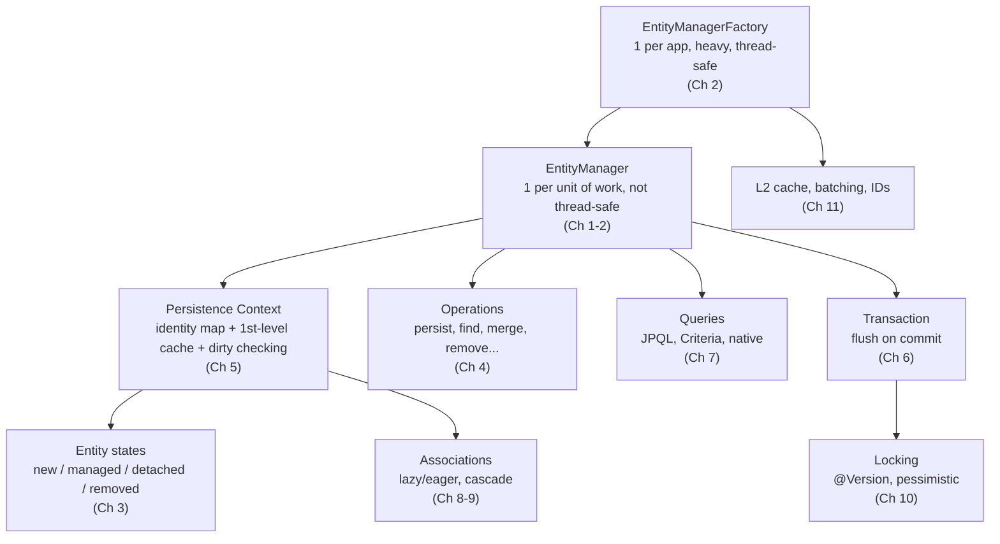

**Five ideas that explain 90% of JPA behavior:**

1. **Managed entities are tracked.** Change a managed entity and it is saved at flush. No `save()` needed.
2. **SQL is deferred.** Nothing hits the DB until flush (commit, explicit `flush()`, or before a query).
3. **One persistence context, one instance per row.** Identity is guaranteed inside it, and lost once it closes.
4. **Detached means untracked.** After the transaction ends, changes are ignored unless you `merge`.
5. **Lazy loading needs an open context.** Fetch what you need inside the transaction.

### 2. Cheat sheet

| Task | Do this |
|---|---|
| Insert a new entity | `persist(e)` |
| Load by id | `find(C, id)` |
| Set an FK without loading the parent | `getReference(C, id)` |
| Update inside a transaction | `find`, modify fields, done |
| Update from a detached object | `merge(e)` and use the **returned** instance |
| Delete | `remove(managedEntity)` |
| Discard in-memory changes | `refresh(e)` |
| Stop tracking | `detach(e)` or `clear()` (flush first) |
| Fix N+1 | `join fetch`, entity graph, `@BatchSize`, or DTO |
| Paginate | `setFirstResult` + `setMaxResults` + stable `order by` (keyset for deep pages) |
| Prevent lost updates | `@Version` (+ retry) or `PESSIMISTIC_WRITE` |
| Fast bulk inserts | `SEQUENCE` + `batch_size` + `flush`/`clear` loop |
| Read-only screens | DTO projection, or `@Transactional(readOnly = true)` |

### 3. Top interview questions, with short answers

**Basics**

1. **What is an EntityManager?**
   The main JPA interface for managing entity lifecycle and running queries, working over a persistence context.
2. **EMF vs EM?**
   The factory is heavy, thread-safe, and one per app. The EM is light, not thread-safe, and one per unit of work.
3. **JPA vs Hibernate?**
   JPA is the specification. Hibernate is an implementation, and its `Session` is what an `EntityManager` wraps.
4. **What are the entity states?**
   New, managed, detached, removed.
5. **What does `@PersistenceContext` inject in Spring?**
   A thread-safe shared proxy that delegates to the EM bound to the current transaction.

**Operations**

6. **`persist` vs `merge`?**
   `persist` makes the passed instance managed (new entities). `merge` copies state onto a managed instance and returns it, and the argument stays detached.
7. **`find` vs `getReference`?**
   `find` hits the DB and returns `null` if missing. `getReference` returns a lazy proxy with no SQL until accessed and throws `EntityNotFoundException` if missing.
8. **Why can Spring Data `save()` issue a SELECT?**
   For non-new entities it calls `merge`, which loads the current state first.
9. **What's wrong with `merge` for partial updates?**
   It copies every field, including nulls, over the managed state. Load the entity and set only the intended fields.

**Persistence context and flushing**

10. **How does Hibernate know what to UPDATE?**
    Dirty checking: it compares each managed entity to a snapshot taken at load time, at flush.
11. **Flush vs commit?**
    Flush sends SQL to the DB. Commit ends the transaction. Commit performs a flush first.
12. **When does auto flush happen?**
    At commit and before queries that might be affected by pending changes.
13. **Why `flush()` before `clear()`?**
    `clear()` detaches everything and drops pending changes.
14. **What does `readOnly = true` do?**
    Skips dirty checking and flushing in Hibernate, and allows DB or driver optimizations.

**Transactions**

15. **Why might `@Transactional` not work?**
    Self-invocation, non-public methods, or a bean not managed by Spring.
16. **Default rollback rules?**
    Unchecked exceptions and errors. Checked ones commit unless `rollbackFor` is set.
17. **`REQUIRED` vs `REQUIRES_NEW`?**
    Join the existing transaction versus suspend it and start a separate one with its own persistence context.
18. **Why `UnexpectedRollbackException` after catching an exception?**
    A joined inner transaction already marked the shared transaction rollback-only.

**Querying and fetching**

19. **JPQL vs native?**
    JPQL queries entities and is portable. Native is raw SQL for DB-specific features.
20. **`join` vs `join fetch`?**
    A plain join filters. A fetch join also initializes the association in the same query.
21. **What is N+1 and how do you fix it?**
    One query for parents plus one per parent for a lazy association. Fix with fetch join, entity graph, batch size, or DTOs.
22. **Why not paginate with a collection fetch join?**
    Hibernate paginates in memory after loading all rows. Page the parent ids first, then fetch the children.
23. **What causes `LazyInitializationException`?**
    Touching an uninitialized lazy association after the persistence context closed.
24. **What is the owning side?**
    The side holding the FK, meaning the one without `mappedBy`. Only it drives SQL.

**Cascade and locking**

25. **Cascade `REMOVE` vs `orphanRemoval`?**
    `REMOVE` acts when the parent is deleted. `orphanRemoval` also deletes a child removed from the parent's collection.
26. **How does `@Version` work?**
    Updates include `WHERE version = ?` and increment it. Zero rows updated means `OptimisticLockException`.
27. **Optimistic vs pessimistic?**
    Detect conflicts at write time without DB locks, versus lock rows up front with `SELECT ... FOR UPDATE`.
28. **What do you do on an optimistic failure?**
    Roll back, reload, and retry the whole unit of work in a new transaction, or return `409`.

**Advanced**

29. **Why does `IDENTITY` hurt batching?**
    The ID is only known after the INSERT, so each insert must run immediately.
30. **L1 vs L2 cache?**
    L1 is per EM and always on. L2 is shared per EMF, opt-in, and stores hydrated state.
31. **Why is `equals`/`hashCode` tricky?**
    Generated ids are `null` before persist, so an id-based hash changes mid-life. Use a business key or a stable hash.
32. **Is an entity thread-safe?**
    No. Pass ids or DTOs across threads.

### 4. Scenario questions (where interviews separate levels)

**"An endpoint is slow and logs show hundreds of SELECTs. What do you check?"**
N+1 on a lazy association. Turn on SQL logging, confirm the pattern, then fix with a fetch join, entity graph, `default_batch_fetch_size`, or a DTO projection. Check whether Open-Session-in-View is hiding lazy loads in the controller or serializer.

**"Two users edit the same record and one's changes vanish."**
Lost update. Add `@Version`, make sure the DTO carries it back, and map `OptimisticLockException` to a `409` or a retry.

**"I changed a field on an entity but nothing was saved."**
Probably detached: the transaction already ended, or the method wasn't transactional (self-invocation, wrong proxy). Reload inside a transaction or `merge`.

**"A batch import of 500k rows runs out of memory."**
The persistence context is growing. `flush` + `clear` every batch, use `SEQUENCE` with batching, or use `StatelessSession`.

**"After a bulk update, my entities show old values."**
Bulk operations bypass the persistence context. `flush` before, `clear` after (or `refresh`).

**"Inventory goes negative under load."**
Read-modify-write race. Use an atomic conditional `UPDATE ... WHERE stock >= :qty`, or `PESSIMISTIC_WRITE`, or `@Version` with retry.

**"Deleting a parent takes forever."**
Cascade `REMOVE` deletes children one by one. Use a bulk delete or DB-level `ON DELETE CASCADE`.

**"Why did Hibernate throw `detached entity passed to persist`?"**
You called `persist` on an entity that already has an id and a row. Use `merge`, or `find` and modify.

### 5. Pitfall checklist (review before shipping JPA code)

**Mapping**
- [ ] All associations `LAZY`, fetched explicitly per use case
- [ ] Bidirectional links updated through helper methods
- [ ] `@ManyToMany` uses `Set`, or better, an explicit join entity
- [ ] No `CascadeType.REMOVE`/`ALL` on `@ManyToOne` or `@ManyToMany`
- [ ] `@Version` on entities edited concurrently
- [ ] Sequence `allocationSize` matches the DB increment
- [ ] `equals`/`hashCode` don't use lazy associations or a mutable generated id carelessly
- [ ] `toString` doesn't traverse bidirectional links

**Transactions and context**
- [ ] Write operations occur inside a transaction
- [ ] No self-invocation of `@Transactional` methods
- [ ] `rollbackFor` set where checked exceptions should roll back
- [ ] No remote calls inside long transactions
- [ ] Entities don't leak across layers or threads (use DTOs)
- [ ] Open-Session-in-View decision is deliberate, not accidental

**Queries and performance**
- [ ] Parameters bound, never concatenated
- [ ] DTO projections for read-only views
- [ ] No pagination on collection fetch joins
- [ ] `order by` on every paginated query
- [ ] Bulk operations followed by `clear()` or `refresh`
- [ ] Batch size configured; `flush` + `clear` in batch loops
- [ ] SQL logging reviewed for N+1 in tests

**Concurrency**
- [ ] Retry logic sits outside the transaction boundary
- [ ] Locks acquired in a consistent order
- [ ] `SKIP LOCKED` used for queue-style tables

### 6. How to practice this

1. **Turn on SQL logging** (`hibernate.show_sql` or `org.hibernate.SQL=DEBUG`, plus `org.hibernate.orm.jdbc.bind=TRACE` for parameters) and watch what each operation emits. This is the fastest way to internalize flush timing, N+1, and dirty checking.
2. **Write small experiments** for each chapter: a detached update that doesn't save, an N+1 you then fix with a fetch join, a two-thread lost update caught by `@Version`.
3. **Use a statistics tool**: Hibernate's `generate_statistics` or a datasource proxy such as datasource-proxy to assert query counts in tests.
4. **Rehearse the scenario questions aloud.** Interviewers look for the cause, the symptom, and the fix, in that order.

You've now covered EntityManager from the first `persist` through locking, caching, and production concerns. If you'd like to go further, I can build a drill set on any chapter (mock interview rounds, "spot the bug" snippets, or a hands-on exercise project), or move on to the next topic on your list.


