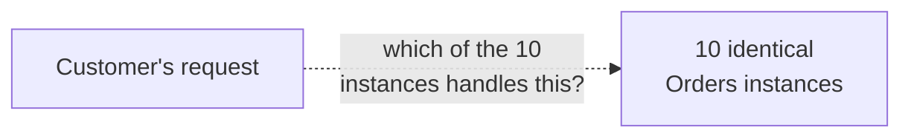
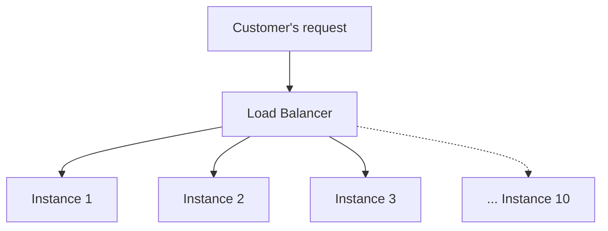
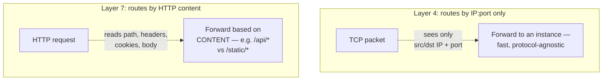
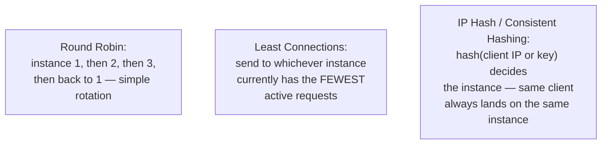
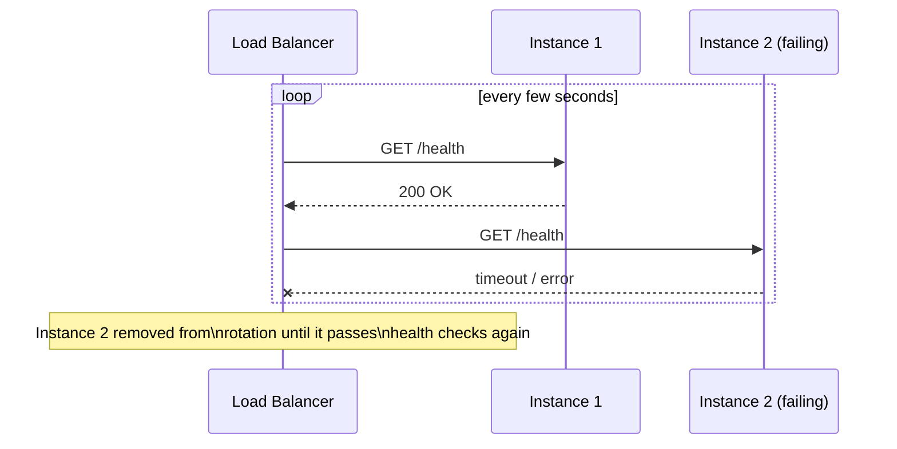
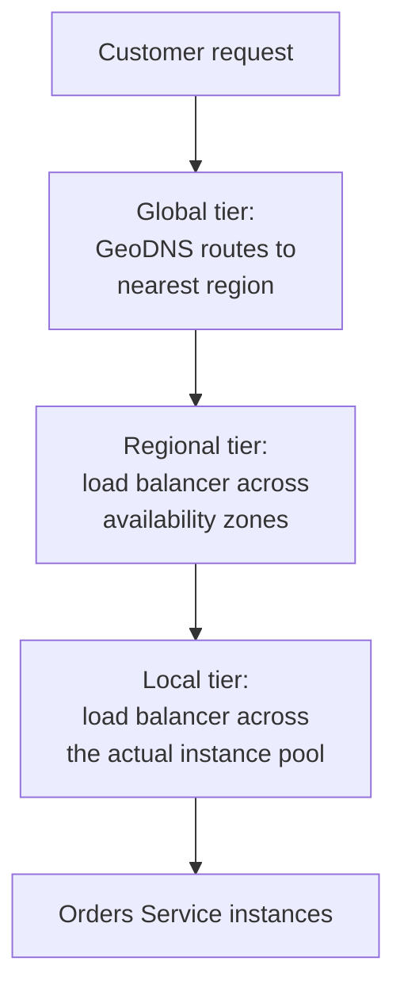
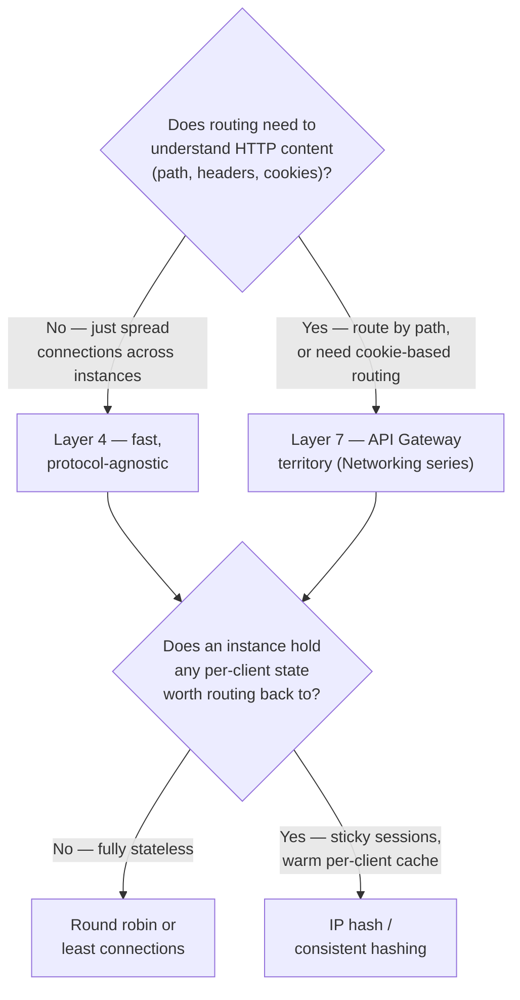
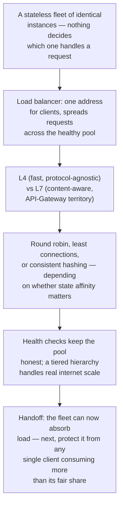

## The Story of Load Balancing

The Distributed Systems series closed with a fleet of stateless service instances — identical, disposable, and safe to scale by simply adding more copies. That guide quietly skipped over one detail: when a request actually arrives, something has to decide *which* of those identical instances answers it. Without that piece, "add more instances" is just idle capacity sitting unused.

---

## Interview Cheat Sheet

**A load balancer** sits in front of a pool of interchangeable service instances and decides, for every incoming request, which instance actually handles it — turning a pile of individual machines into one thing that behaves like a single, larger, more resilient service.

**Key facts:**
- **Layer 4** load balancing routes by IP and port alone — fast, protocol-agnostic, can't see inside the request; **Layer 7** load balancing reads the actual HTTP request (path, headers, cookies) before deciding — slower per-request, but able to route intelligently
- Common algorithms: **round robin** (simple rotation, ignores current load), **least connections** (send to whichever instance has the fewest active requests, adapts to load), **consistent hashing / IP hash** (the same client or key reliably lands on the same instance — needed for anything with per-instance state)
- A load balancer only routes to instances it believes are healthy — **health checks** (active probing, or passive failure detection from real traffic) are what let it actually know that
- Real, internet-scale traffic rarely hits just one load balancer — it typically passes through a **tiered hierarchy**: global DNS-based routing to a region, then a regional load balancer, then a local one in front of the actual instance pool

**Common interview gotchas:**
- "Load balancer" and "API Gateway" overlap in practice but answer different questions — a load balancer distributes traffic across *identical* backend copies; a gateway (the Networking series' API Gateway guide) additionally routes *different* paths to *different* services, does auth, and aggregates responses
- Round robin looks fair but isn't "smart" — it sends equal traffic to instances regardless of how loaded each one actually is, which is exactly why least-connections exists
- A load balancer that routes based on something client-specific (IP hash, a cookie) is trading load-spreading precision for the ability to keep a client "sticky" to one instance — necessary for some workloads, actively harmful for purely stateless ones
- The load balancer itself needs to not be a single point of failure — which is why real deployments run it in an active-active or active-passive pair, not as one box

**The core trade-off:** the smarter and more content-aware a load balancer's routing decision is, the more work it has to do per request (and the more it needs to actually understand about the traffic) — versus a dumb, fast, protocol-agnostic router that can't make use of any information beyond where the packet is headed.

---

## Chapter 1: A Fleet With Nobody Directing Traffic

Picture the bookstore's Orders service, now running as ten identical, stateless instances (exactly the fleet the Distributed Systems series closed on). A customer's request to place an order arrives — at which one of the ten instances does it actually land?

Without something answering that question deliberately, you're left with bad options: always send traffic to the same one instance (defeats the entire purpose of having ten), or have the client pick randomly on its own (no way to know which instances are actually healthy right now, or how loaded each one is). Something needs to sit in front of the pool, make that decision on every request, and adapt as instances come and go.

---

## Chapter 2: The Load Balancer as Traffic Cop

A **load balancer** is exactly that: a component sitting between clients and a pool of backend instances, receiving every request and forwarding it to one specific instance, chosen according to some policy.

From the client's perspective, there's just one address to talk to — the load balancer's. From the fleet's perspective, load gets spread across every healthy instance, and any single instance can be added, removed, or replaced without the client ever noticing. This is the exact mechanism that makes "just add more instances" (the Distributed Systems series' closing promise) actually deliver more real capacity, rather than more idle machines nobody's routing to.

---

## Chapter 3: Two Very Different Ways to Route — Layer 4 vs. Layer 7

**Layer 4 (transport layer)** load balancing looks only at IP addresses and port numbers — the information already present in a TCP/UDP packet header, before any HTTP has even been parsed. It's extremely fast and works for any protocol, precisely because it never looks deeper than the network layer.

**Layer 7 (application layer)** load balancing actually reads the HTTP request — the path, the headers, cookies, even the body — before deciding where to send it.

This is precisely the distinction that separates a plain load balancer from the Networking series' API Gateway: an L7 load balancer routing `/catalog/*` to the Catalog pool and `/orders/*` to the Orders pool is doing exactly what that guide's API gateway did — the two ideas sit on a continuum, and a modern L7 load balancer and a lightweight API gateway overlap substantially in practice. The trade-off is direct: L4 is faster and simpler because it looks at less; L7 can make far smarter decisions because it actually understands what's being asked for, at the cost of more processing per request.

---

## Chapter 4: How the Load Balancer Actually Picks an Instance

Given a pool of healthy instances, several genuinely different policies decide which one gets the next request:

**Round robin** is the simplest possible policy — rotate through the pool in order — and it works fine when every instance is equally capable and every request costs about the same to handle. It starts to show its weakness the moment that's not true: if one request happens to be expensive (a large report, a slow query) and lands on an instance that's still busy from the last one, round robin will still send it more traffic on schedule, unaware that instance is already under more load than its neighbors.

**Least connections** fixes exactly that blind spot — it actively tracks how many requests each instance currently has in flight, and routes new ones to whichever instance is least busy right now, adapting to real, uneven load rather than assuming every instance and every request are equal.

**IP hash / consistent hashing** (the exact same hashing idea the Distributed Caching guide used to spread keys across cache nodes) deliberately routes based on some property of the request — the client's IP, a session ID, a specific key — so that the *same* client or key reliably lands on the *same* instance every time. This is essential the moment an instance holds any request-specific state worth reusing (a warm in-memory cache for one customer's session, a WebSocket connection from the Networking series' guide) — and actively counterproductive for genuinely stateless services, where spreading load as evenly as possible matters more than routing consistency.

---

## Chapter 5: Knowing Who's Actually Healthy

None of the algorithms in Chapter 4 mean anything if the load balancer keeps sending traffic to an instance that's actually down. **Health checks** are how it knows: **active** checks periodically probe each instance directly (a lightweight `GET /health` request, expecting a fast 200 OK) and pull an instance out of rotation the moment it stops responding correctly; **passive** checks instead watch real traffic for failures (a spike in errors or timeouts from one instance) and react to that, without needing a separate, dedicated probe.

This is the same crash-versus-unreachable ambiguity the Distributed Systems series' Leader Election guide spent a full chapter on — a health check timeout doesn't always mean the instance is truly dead, sometimes it's just slow or briefly unreachable, and overly aggressive health-check tuning can pull a perfectly healthy instance out of rotation over a single slow response.

---

## Chapter 6: The Real Deployment Is a Hierarchy, Not One Box

Genuine internet-scale traffic almost never passes through a single load balancer. It typically flows through a **tiered hierarchy**: a **global** layer (often DNS-based — exactly the GeoDNS mechanism the Networking series' DNS guide covered, routing a customer to their nearest region), then a **regional** load balancer distributing across that region's data centers or availability zones, then a **local** load balancer in front of the actual pool of service instances.

Each tier solves a different-scale version of the exact same problem this guide opened with — routing traffic to the right, healthy destination — just operating over progressively smaller and more specific pools as the request gets closer to an actual instance.

---

## Chapter 7: The Cost — The Load Balancer Can't Become the New Bottleneck

**A load balancer is itself a potential single point of failure**, exactly the risk the Networking series' API Gateway guide raised about a shared front door — if it goes down, every instance behind it becomes unreachable regardless of how healthy they are. Real deployments run load balancers in redundant pairs (active-passive, with automatic failover, or active-active, sharing load between two or more balancer instances) rather than as one irreplaceable box.

**Smarter routing costs real processing time.** An L7 load balancer inspecting headers and cookies on every request is doing meaningfully more work per request than an L4 balancer glancing at a packet header — at high enough request volume, that difference in per-request cost is the whole ballgame.

**Sticky routing (IP hash) trades even load distribution for consistency.** If one client happens to send a disproportionate amount of traffic, hashing them to a fixed instance means that instance carries a disproportionate share of the load too — the opposite problem least-connections was built to solve.

---

## Chapter 8: Which Approach Do You Actually Reach For?

For most genuinely stateless fleets — the destination the Distributed Systems series was building toward — least connections is the sensible default: it adapts to real load without needing anything client-specific. Reach for consistent hashing only when something real depends on a client consistently landing on the same instance, and be honest that doing so reintroduces a form of the very state-affinity problem statelessness was meant to eliminate.

---

## The Full Story, End to End

| | Layer 4 | Layer 7 |
|---|---|---|
| Sees | IP + port only | Full HTTP request |
| Speed | Very fast | Slower — more to inspect |
| Can route by path/header | No | Yes |
| Overlaps with | Plain network routing | API Gateway (Networking series) |
| Best for | Raw throughput, protocol-agnostic traffic | Content-aware routing, per-service dispatch |

For the exhaustive algorithm-by-algorithm breakdown, capacity math, and interview-drilling depth on this topic, see `HLD/0-course/8-Load Balancers-FAANG-Guide.md` in this repository.

**Where would you like to go next?** Natural threads from here:

- **API Rate Limiting & Throttling** — now that load is spread evenly, what stops one client from consuming more than its fair share of it
- **Database Optimization** — the load balancer gets requests to a healthy instance; this guide covers what happens once that instance actually queries the database
