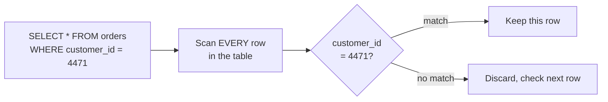
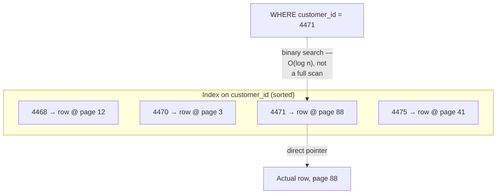
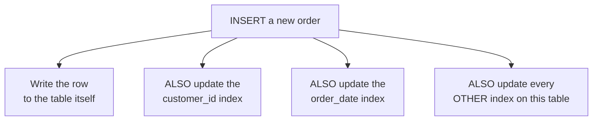
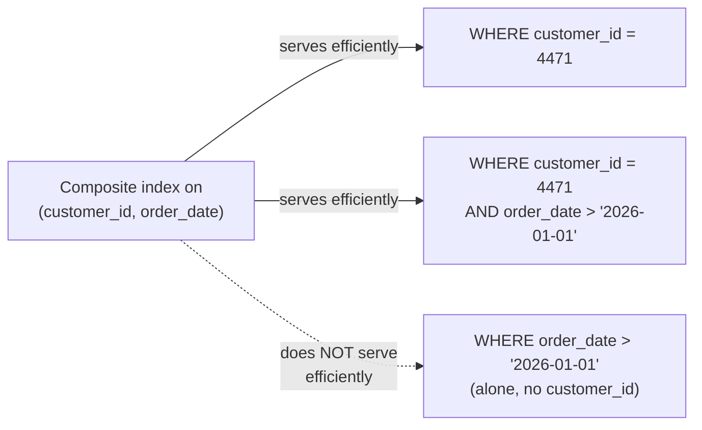
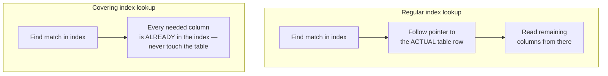
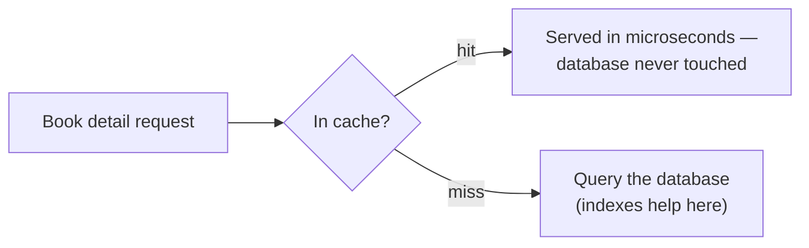
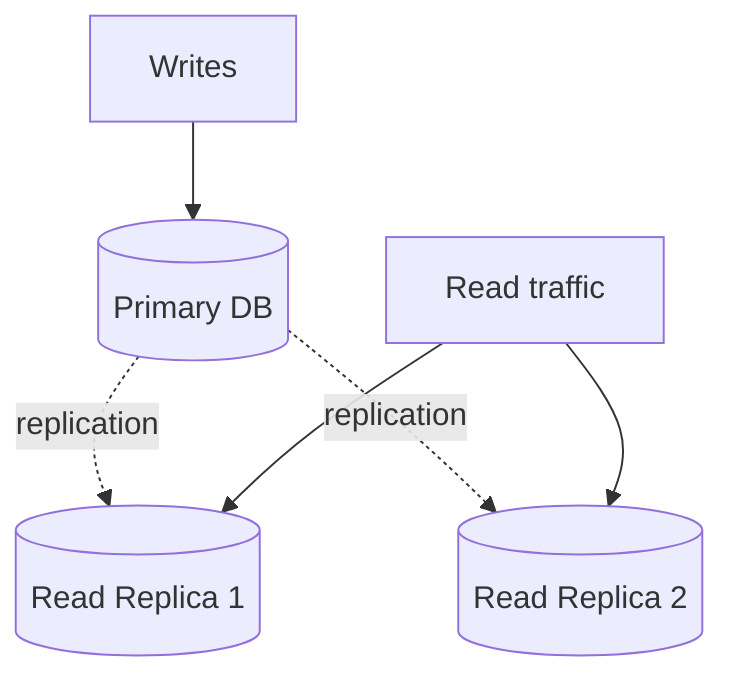
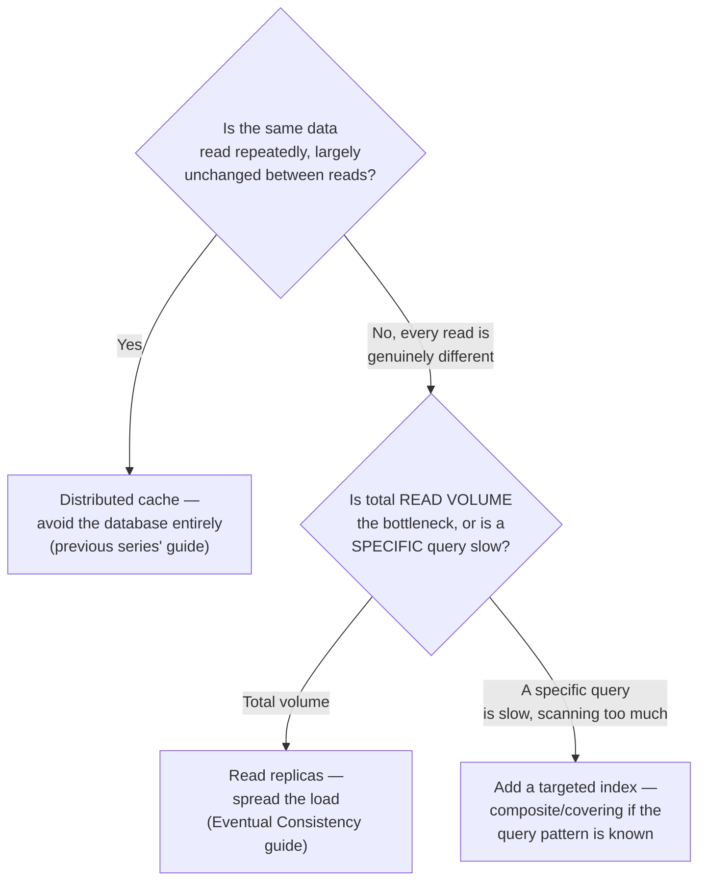
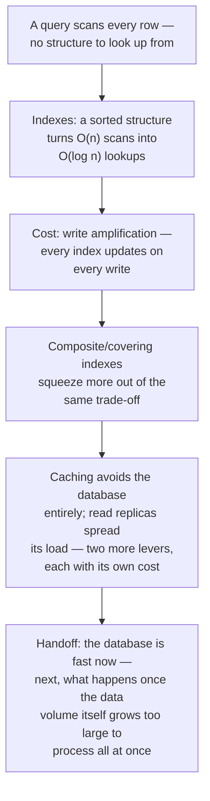

## The Story of Database Optimization

Traffic is now spread evenly (Load Balancing) and capped fairly (Rate Limiting). A request that survives both still has to actually do its job — and for the bookstore, almost every job eventually means asking the database a question. This guide is about the two levers that decide whether that question comes back in a millisecond or a full second: how the data is *organized* for reading, and how much of the asking can be avoided entirely.

---

## Interview Cheat Sheet

**Database optimization**, for reads and writes, comes down to two complementary levers: **indexes** (organize data so the database doesn't have to scan everything to answer a query) and **caching** (avoid asking the database at all, for data you've already fetched recently).

**Key facts:**
- An **index** is a separate, sorted structure pointing back to the real rows — it turns "scan every row" into "look up directly," at the cost of extra storage and extra write work to keep the index itself up to date
- **B-Trees** are the default index structure for decades — balanced, sorted, efficient for both reads and moderate write loads; **LSM-Trees** trade some read simplicity for dramatically better write throughput, by buffering writes in memory and flushing them in sorted batches
- Every index added speeds up the reads it serves and slows down every write to that table, because the index has to be updated too — this is **write amplification**, and it's the central trade-off of indexing
- **Caching** (the Distributed Caching guide, in full) and **read replicas** (the Eventual Consistency & Quorum guide, in full) are the other two major read-optimization levers, and neither of them touches indexing at all — they avoid the database, or spread its read load, rather than making any single query faster

**Common interview gotchas:**
- "Just add an index" is not a free win — every index is a second data structure that every write must also update, and a table with too many indexes can have write latency dominated by index maintenance, not the actual row write
- A **composite index**'s column order matters — an index on `(customer_id, order_date)` serves queries filtering by `customer_id` alone or by both columns together, but does *not* efficiently serve a query filtering by `order_date` alone
- A **covering index** (one that includes every column a query needs) lets the database answer straight from the index, never touching the actual table row at all — a meaningfully different, faster path than an index that only narrows down which rows to then go fetch
- Indexing, caching, and read replicas are three genuinely different tools solving genuinely different shapes of the same "reads are slow" problem — reaching for the wrong one doesn't help, and sometimes actively hurts (adding a cache in front of data that changes every request, for instance)

**The core trade-off:** every optimization in this guide makes reads faster by either doing more work ahead of time (an index, updated on every write) or by serving slightly stale data instead of asking the source of truth directly (a cache, a read replica) — there is no version of "fast reads" that doesn't pay for it somewhere else.

---

## Chapter 1: The Query That Reads Every Row

A customer searches the bookstore's order history for `WHERE customer_id = 4471`. Without any help, the database has exactly one way to answer that: read every single row in the Orders table, check each one's `customer_id`, and keep the matches — a **full table scan**.

On a table with a few hundred rows, this is instant. On a table with 500 million orders, it means reading 500 million rows to find perhaps a few dozen — real disk I/O, real time, for almost entirely wasted work.

---

## Chapter 2: Indexes — Stop Scanning, Start Looking Up

An **index** is a separate structure, built and maintained alongside the table, that keeps a sorted (or otherwise organized) view of one or more columns, each entry pointing back to where the actual row lives.

Because the index is sorted, finding `4471` is a binary search — a handful of comparisons, regardless of whether the table has a thousand rows or a billion — instead of reading every row in order. This is the entire value proposition of an index in one sentence: **trade a small amount of extra storage and write overhead for turning an O(n) scan into an O(log n) lookup.**

The most common index structure, and the default in almost every mainstream relational database, is the **B-Tree** — a balanced, sorted tree structure where every leaf is the same distance from the root, keeping lookups, insertions, and range scans all efficient and predictable, even as the table grows into the billions of rows.

---

## Chapter 3: The Part Nobody Mentions First — Write Amplification

Here's the cost side of Chapter 2's trade, and it's easy to underestimate: **every index on a table has to be updated on every write to that table**, not just the ones that touch the indexed column's typical query pattern.

A table with five indexes doesn't pay the cost of one write per insert — it pays the cost of one table write plus five index updates, every single time. This is **write amplification**: the real, physical write work multiplies with every index you add, which is precisely why "just add an index for every query pattern" is not a free strategy — at some point, a heavily-indexed, write-heavy table spends more time maintaining its indexes than doing the actual work a write represents.

This exact tension — reads want more indexes, writes want fewer — is the deeper reason **LSM-Trees** (Log-Structured Merge Trees) exist as an alternative to B-Trees: instead of updating a sorted structure in place on every write, an LSM-Tree buffers writes in memory and flushes them to disk in large, sorted batches, trading some read complexity (a lookup may need to check several of these batches) for dramatically higher write throughput — the standard choice for write-heavy workloads (Cassandra, RocksDB, and many modern key-value stores use this design). The full mechanics of B-Trees versus LSM-Trees — memtables, SSTables, compaction, and the exact read/write/space trade-off triangle — are covered in complete depth in this repository's `HLD/0-course/9.5 Storage Engines - B-Tree vs LSM-Tree.md`; the takeaway worth carrying forward here is simply that the read/write optimization tension in this chapter is *the* reason two fundamentally different storage engine designs exist at all.

---

## Chapter 4: Making an Index Work Even Harder — Composite and Covering Indexes

A **composite index** covers more than one column at once, and its column order is not a cosmetic detail — it determines which query patterns the index can actually serve efficiently.

Because the index is sorted first by `customer_id` and only *then* by `order_date` within each customer, a query filtering by `order_date` alone has no way to use the sorted order efficiently — it's back to something close to a full scan. The rule of thumb: put the column most queries filter on (often the most selective one) first.

A **covering index** takes this further: if the index includes *every* column a query needs — not just the filter column, but the columns being selected too — the database can answer entirely from the index, never touching the actual table row at all.

This is a meaningfully faster path — one structure read instead of two — and it's a common, deliberate optimization once a specific query pattern is known to matter enough to design an index around it precisely.

---

## Chapter 5: The Other Lever — Avoid the Database Entirely

Everything so far makes the database itself faster to query. The Distributed Systems series' Distributed Caching guide covers an entirely different, complementary lever in full: don't ask the database at all for data you've already fetched recently. A cache-aside layer in front of the Catalog service, holding a trending book's detail page in memory, serves that page in microseconds — no index lookup, no query planner, no disk I/O, because the database was never touched for that request at all.

Indexing and caching aren't competing solutions to the same problem — they solve different shapes of it. Indexing makes a query that *does* have to hit the database faster. Caching avoids hitting the database at all for repeated, unchanged reads. A well-optimized system uses both, for exactly the reasons each guide already covered: caching for read-heavy, repeat-request data; indexing for the queries that do need to reach the actual source of truth.

---

## Chapter 6: A Third Lever — Read Replicas

The Distributed Systems series' Eventual Consistency & Quorum guide covers the third major lever, from a different angle again: instead of avoiding the database (caching) or making individual queries faster (indexing), **spread read traffic across multiple copies of the database** — a primary handles writes, and one or more read replicas, kept in sync via replication, handle the read load.

This is exactly the CQRS guide's territory from the ArchitecturePatterns series, applied at the database-replica level rather than a fully separate read model — and it inherits the exact same trade-off the Eventual Consistency guide covered: a replica can lag slightly behind the primary, so a read immediately following a write on a *different* replica can briefly see stale data, the same "read-your-own-write" concern that guide's CQRS discussion raised.

---

## Chapter 7: The Cost — Three Levers, Three Different Bills

**Indexing costs write throughput and storage**, growing with every index added, as Chapter 3 covered — the fix is deliberate: index the columns real queries actually filter or sort by, not every column that might someday be useful.

**Caching costs freshness**, exactly as the Distributed Caching guide's whole "the cache can lie" chapter covered — a cached value can silently drift from the database's real value until it's invalidated or expires.

**Read replicas cost consistency**, exactly as the Eventual Consistency guide covered — a replica's read can lag behind the primary's most recent write by a real, measurable amount.

None of these costs disappears by choosing a different lever — each lever just relocates the cost to a different place: more write latency (indexing), staler reads (caching, replicas), or more operational complexity (all three, at once, in a mature system).

---

## Chapter 8: Which Lever Do You Actually Reach For?

These three levers compose rather than compete: a mature system typically indexes the queries that must reach the database, caches the reads that are repeated and can tolerate slight staleness, and spreads whatever's left across read replicas — each lever picking up exactly the shape of "reads are slow" that the other two don't address.

---

## The Full Story, End to End

| | Indexing | Caching | Read Replicas |
|---|---|---|---|
| What it does | Makes a database query faster | Avoids the database entirely | Spreads read load across copies |
| Cost | Slower writes (write amplification) | Staleness (the cache can lie) | Staleness (replication lag) |
| Best for | Specific, known, slow query patterns | Repeated reads of largely unchanged data | High total read volume |
| Covered in full | `HLD/0-course/9.5 Storage Engines - B-Tree vs LSM-Tree.md` | Distributed Systems series, Guide 1 | Distributed Systems series, Guide 2 |

**Where would you like to go next?** Natural threads from here:

- **Batch vs. Stream Processing** — once data volume grows past what a single optimized database can comfortably hold, how do you actually process all of it
- **Distributed Caching** (Distributed Systems series) — the full mechanics of cache-aside, consistent hashing, and Redis Cluster referenced in Chapter 5
