# Key-Value Store — FAANG System Design Interview Guide

> This chapter is, almost verbatim, a walkthrough of **Amazon's Dynamo paper** (2007) — one of the single most-referenced systems in FAANG system design interviews. If you understand this guide cold, you can answer "design a distributed key-value store," "design DynamoDB," and large chunks of "design Cassandra" / "design a distributed cache" from first principles — and you'll recognize the same building blocks (consistent hashing, quorums, vector clocks, gossip, Merkle trees, hinted handoff) reappearing across almost every other distributed-systems interview question.

---

## Interview Playbook — routing "what's actually being asked"

Before reaching for a mechanism, figure out which axis of the problem the interviewer is actually probing — a vague prompt like "design a distributed key-value store" or "how would Dynamo handle X" almost always reduces to one of these questions underneath.

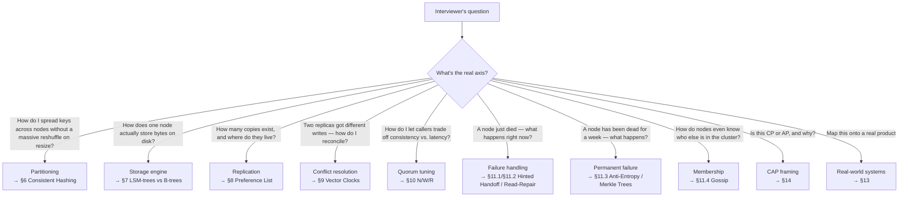

---

## 1. What a key-value store is, and why it exists

**Mental model**: a key-value store is a **distributed hash table (DHT)** — the same `dict`/`HashMap` you use in-process, except the table is sharded and replicated across thousands of machines, and it has to keep working correctly when machines and networks fail.

- A **key** uniquely identifies a value (often a hash of something meaningful — a user ID, a session ID, a product SKU).
- A **value** is an opaque blob — the store makes no assumptions about its structure (unlike a relational database's rows/columns). Values are kept relatively small (KB–MB); large blobs (images, videos) are stored in a dedicated blob store, with only a *reference/link* kept in the value field.

### Why not just use a relational database?
Traditional RDBMSs are built for a **rich query model** (joins, secondary indexes, ACID transactions) — which most large-scale, high-traffic applications don't actually need for their hottest access paths, and which becomes expensive to scale horizontally while preserving strong consistency and high availability (this is precisely the CAP-theorem tension — see §14). Amazon's original motivation: many of their internal services (shopping cart, session store, best-seller lists, product catalog) only ever need **primary-key access** — get a value by key, put a value by key — and paying the cost/complexity of a full RDBMS for that access pattern is wasteful.

### Canonical real-world use cases
- Session storage for web applications (a session ID → session data blob)
- Shopping carts (Amazon's original Dynamo use case)
- User preferences / settings
- Product catalogs
- Best-seller / sales-rank lists
- Real-time recommendation/ad serving (fast reads of frequently-changing small values)

**Interview soundbite**: *"Whenever a requirement is 'look this up by a single key, at massive scale, with very low and predictable latency, and I don't need joins,' that's the signal to reach for a key-value store instead of a relational database."*

---

## 2. Requirements — the ones an interviewer expects you to state explicitly

### Functional requirements
| Requirement | What it means |
|---|---|
| **Configurable service** | Different applications trade off consistency vs. availability differently — the store must let each caller tune this, not enforce one global policy |
| **Always writable** | Writes should (almost) never be rejected — even during failures/partitions, favoring **availability** for writes (this is a direct, deliberate CAP choice — see §14) |
| **Hardware heterogeneity** | No node should be structurally "special" — every node should be capable of doing any role, even though some physical machines may have more capacity than others |

### Non-functional requirements
| Requirement | What it means |
|---|---|
| **Scalable** | Runs on tens of thousands of commodity servers, globally distributed; must support **incremental scalability** — add/remove nodes with minimal disruption |
| **Available** | Continuous service — configurable per the functional requirement above (trade against consistency) |
| **Fault tolerant** | Keeps operating through individual server/component failures — failure is the normal case at this scale, not an edge case |

### Working assumptions (state these out loud to bound scope)
- Data centers are trusted (non-hostile) — no need to design for a malicious node.
- AuthN/AuthZ are handled by a layer above this system.
- Requests/responses travel over HTTPS.

---

## 3. Capacity estimation — the numbers to reason through out loud

Interviewers want to see the back-of-envelope process, not memorized figures. A representative walkthrough:

```
Assume: 500 million active keys, average value size 1 KB, replication factor N = 3

Raw data size            = 500M keys × 1 KB              = 500 GB
Replicated storage need  = 500 GB × N (=3)                = 1.5 TB
Per-node capacity        = 500 GB per node (SSD, conservative)
Nodes needed for storage = 1.5 TB / 500 GB                ≈ 3 nodes (storage-bound minimum)

Assume: 100K requests/sec peak, 90% reads / 10% writes
Read QPS   = 90,000/sec
Write QPS  = 10,000/sec
With N=3, R=2, W=2 (quorum):
  Each logical read fans out to R=2 physical reads  → 180,000 physical read ops/sec
  Each logical write fans out to W=2 (of N=3) physical writes synchronously → 20,000 physical write ops/sec,
     plus 1 more async replica write per logical write

If a single node can handle ~10,000 ops/sec:
  Nodes needed for read throughput  = 180,000 / 10,000 = 18 nodes
  Nodes needed for write throughput = 20,000  / 10,000 = 2 nodes
  → read throughput dominates the sizing decision here, not raw storage
```

**The lesson to state explicitly**: with quorum-based replication, your **effective QPS per logical operation is multiplied by R (reads) or W (writes)**, not by 1 — this is a frequently-missed detail in capacity estimation for replicated systems, and naming it is a strong signal.

---

## 4. API design

Start simple, then evolve it once versioning enters the picture (§9).

**Initial (naive) API** — a plain hash table:
```
get(key)              → value
put(key, value)       → success/failure
```

**Evolved API** — once we need to support conflict detection/resolution via versioning:
```
get(key)                    → (value | list of conflicting values, context)
put(key, context, value)    → success/failure
```

| Parameter | Meaning |
|---|---|
| `key` | The identifier the value is stored/retrieved against |
| `value` | Opaque blob (may be a list, if the store is returning multiple unreconciled versions) |
| `context` | Opaque metadata (encodes the object's **vector clock** — see §9) that the client must pass back on the next `put` so the system can determine causality |

Dynamo specifically uses **MD5 hashing on the key** to produce a 128-bit identifier, which is what actually gets placed on the consistent-hash ring (§6).

---

## 5. High-level architecture

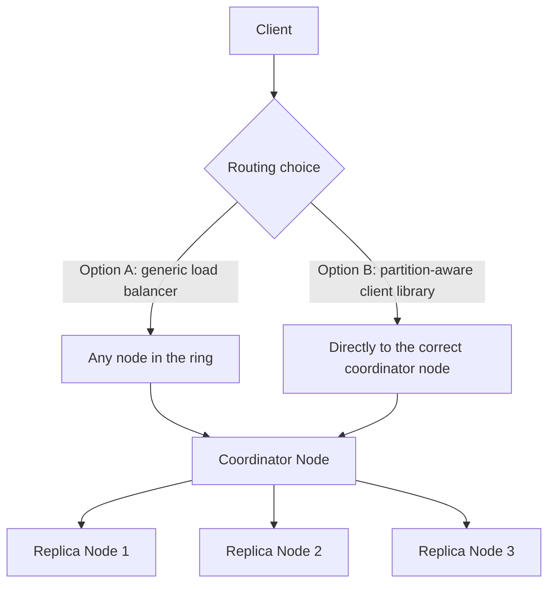

Every node is functionally identical (no special "master" node — satisfying the hardware-heterogeneity requirement). The **coordinator** for a given key is simply the first node reached going clockwise on the consistent-hash ring (§6) — any node can act as coordinator for the keys it's responsible for.

**Routing trade-off**: a generic load balancer decouples the client from ring topology but adds a network hop; a partition-aware client library (knows the ring layout, computes the right node directly) cuts latency by skipping that hop, at the cost of the client needing to track ring membership changes. **Real systems use both**: DynamoDB clients call a stateless HTTP endpoint (load-balancer style); Cassandra's official drivers are partition-aware (token-aware routing) for lower latency.

---

## 6. Deep dive: partitioning via consistent hashing

### The naive approach and why it fails
`node = hash(key) mod N` seems obvious — but when `N` (node count) changes (a node is added/removed), **almost every key's assigned node changes**, forcing a massive, expensive data reshuffle. This is the exact `hash mod n` pitfall — see the companion [Databases chapter, §4](../9.%20Databases/9.7%20Partitioning%20and%20Sharding%20-%20Deep%20Dive.md) for the general form of this problem (in one sentence: any sharding scheme whose node assignment is a direct function of the *current* node count will reshuffle almost everything whenever that count changes — this is why every sharded system, not just KV stores, needs something like consistent hashing).

### Consistent hashing vs. simple modulo hashing

| | `hash(key) mod N` | Consistent hashing |
|---|---|---|
| Node assignment depends on | The *current* total node count `N` | Fixed ring position, independent of node count |
| Keys remapped on node add/remove | Almost all of them (`O(all keys)`) | Only the keys owned by the affected ring neighbor (`O(1/N)`) |
| Implementation complexity | Trivial (one division) | Needs a ring structure + virtual nodes for even load |
| Use when | Node count is fixed/rarely changes (e.g. a small, static shard count) | Node count changes routinely (elastic, cloud-scale clusters) — the norm for this chapter |

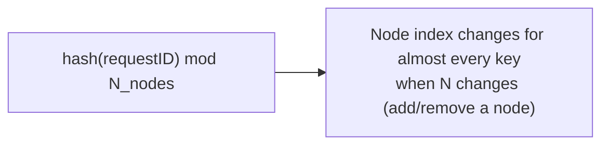

### Consistent hashing — the fix
Picture a **ring** of hash values from `0` to `n-1`. Both **nodes** and **keys** are hashed onto this same ring. A key is owned by the **next node found moving clockwise**.

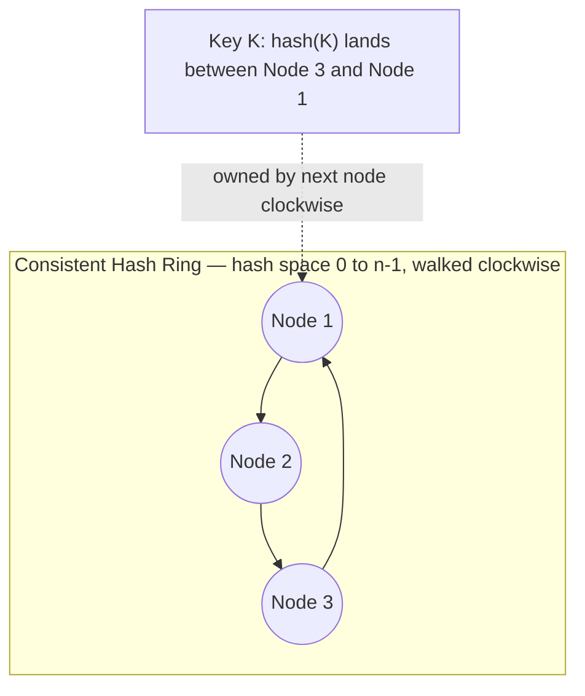

When a node is **added**, only the immediate next node on the ring needs to hand off a portion of its keys to the newcomer — every other node is unaffected. This is the entire value proposition: **adding/removing a node moves `O(1/N)` of the keys, not `O(all keys)`.**

### The hotspot problem consistent hashing alone doesn't solve
Hash placement is random, so ring "gaps" between adjacent nodes are uneven — a node covering an unusually large gap becomes a **hotspot**, receiving disproportionate traffic and becoming a bottleneck.

### The fix: virtual nodes

Instead of hashing each physical node **once** onto the ring, hash it with **multiple independent hash functions**, giving each physical node many positions ("virtual nodes") scattered around the ring.

**Before — 3 physical nodes, 2 vnodes each:**
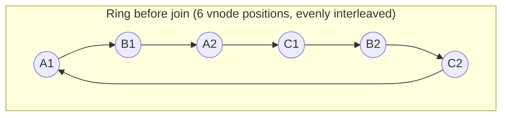

**After — Node D joins, contributing 2 new vnodes (D1, D2):**
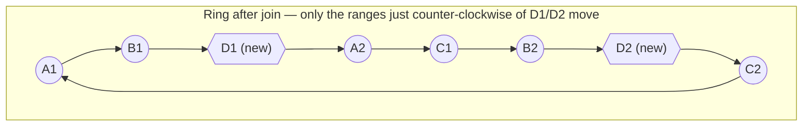
Only `A2`'s and `C2`'s immediate predecessor ranges (now owned by `D1`/`D2`) move — `B1`, `C1`, `B2` are completely untouched. A node **leaving** is the mirror image: its vnode positions are removed and each range falls back to whichever vnode is now next clockwise, spreading the departed node's load across several survivors instead of dumping it all on one neighbor.

**Mnemonic for the vnode advantages ("F-H-S" — vnodes make the ring Fair, Hardware-aware, Smooth):**
1. **Fair on failure** — when a physical node fails or recovers, its load is spread across *many* other nodes (via its many virtual positions) rather than dumped entirely onto one neighbor.
2. **Hardware-aware**: a more powerful physical machine can simply own **more virtual nodes**, taking a proportionally larger share of load — directly satisfies the "hardware heterogeneity" functional requirement from §2.
3. **Smoother** statistical load distribution overall — more points on the ring per node averages out the randomness of hash placement.

**Real-world virtual node counts**: Cassandra defaults to **256 vnodes per physical node** (historically; newer versions default lower, e.g. 16, favoring faster streaming/repair over perfect smoothness) — a good concrete number to have ready if asked.

### Section cheat-sheet (self-quiz)
- `hash(key) mod N` fails because node assignment depends on the *current* `N` — changing `N` reshuffles almost everything.
- Consistent hashing fixes this by hashing both nodes and keys onto a fixed ring; a key belongs to the next node clockwise.
- Adding/removing one node only moves the keys owned by its immediate ring neighbor — `O(1/N)` of the keyspace, not `O(all keys)`.
- Plain consistent hashing still has a hotspot problem: random placement creates uneven gaps between nodes.
- Virtual nodes fix the hotspot problem by giving each physical node many scattered ring positions instead of one.
- Vnodes buy you three things: fair failure impact, hardware-heterogeneity-aware capacity, and smoother overall load distribution ("F-H-S").
- Cassandra's classic default is 256 vnodes/node (newer versions often default lower, e.g. 16).

---

## 7. Deep dive: storage engines — how a single node stores its data

Partitioning (§6) decides *which* node owns a key. This section is about what that node does **locally** on disk once it owns it — a topic interviewers use to separate "read the Dynamo paper" candidates from candidates who understand storage engines.

### Two families

**B-tree engines** (the classic RDBMS approach): data lives in-place, sorted, in a tree of fixed-size on-disk pages. A write finds the right page and mutates it in place.
- Reads are fast — one `O(log n)` descent through the tree, no merging needed.
- Writes are comparatively expensive — random disk I/O, and a page that overflows must **split**, which is costly under very high write throughput.

**LSM-tree engines** (Log-Structured Merge-tree — what most Dynamo-descendants actually use): writes are never done in place.
1. A write lands in an in-memory sorted structure, the **memtable**, plus an append-only on-disk **write-ahead log (WAL)** for durability.
2. When the memtable fills up, it's flushed to disk as an immutable, sorted **SSTable** (Sorted String Table).
3. A read may need to check the memtable and then several SSTables (newest first) — a **Bloom filter** per SSTable lets a read cheaply skip files that definitely don't contain the key.
4. A background **compaction** process periodically merges multiple SSTables into fewer, larger ones, discarding overwritten/tombstoned keys and bounding how many files a read has to check.

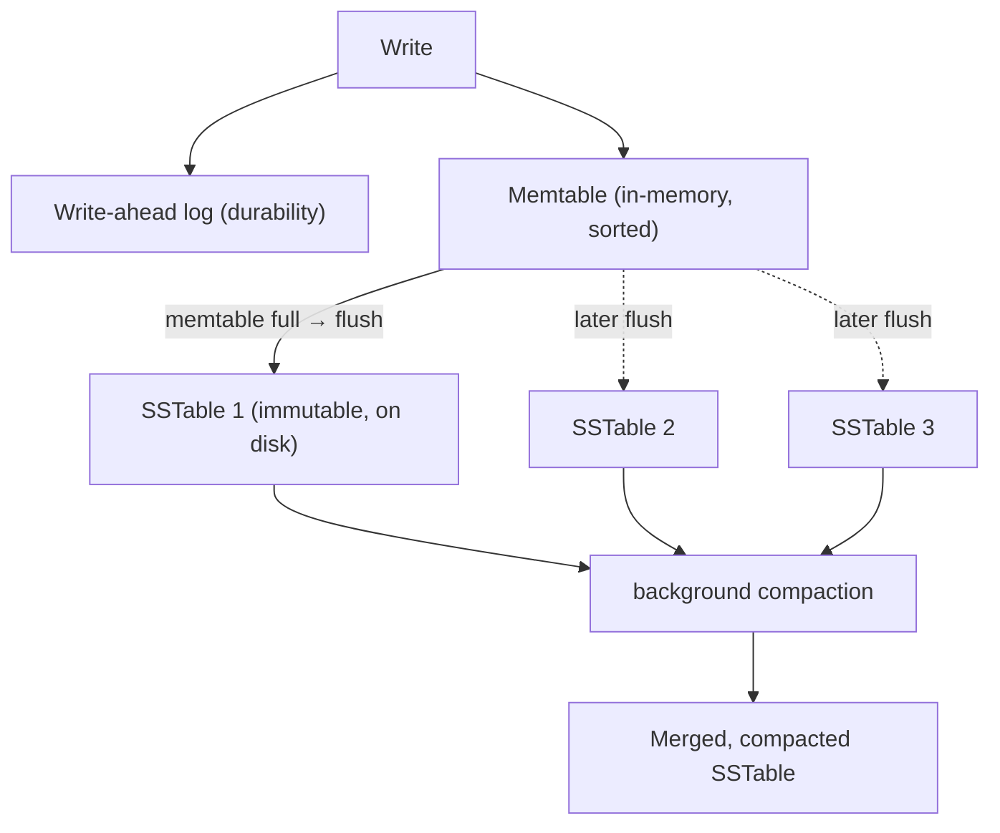

### Write-amplification vs. read-amplification

| | B-tree | LSM-tree |
|---|---|---|
| Write path | In-place random write | Sequential append (memtable + WAL) — no random I/O on the write path |
| Write amplification | Lower per write, but page splits add overhead | Higher — the same logical key is rewritten repeatedly across compaction passes |
| Read amplification | Lower — one direct tree descent | Higher — may need to check the memtable plus several SSTables (mitigated by Bloom filters) |
| Space amplification | Lower — no stale duplicate copies of a key | Higher until compaction runs — overwritten keys can linger across multiple SSTables |
| Best suited for | Read-heavy, in-place-update workloads | Write-heavy, append-friendly, high-throughput workloads |

**The trade-off to state out loud**: LSM-trees accept higher *read* and *space* amplification in exchange for dramatically lower *write* amplification and sequential (not random) writes — exactly the profile a high-write-throughput distributed KV store wants, at the cost of needing background compaction to keep read amplification bounded.

### Who uses what
- **Cassandra, RocksDB, LevelDB, HBase** — all LSM-tree based; this is the dominant engine for Dynamo-style and Bigtable-style systems.
- **DynamoDB** — its underlying storage engine is closer to a **B-tree-like structure**, not a classic LSM-tree — a common misconception worth correcting explicitly if asked "does DynamoDB use LSM trees like Cassandra?" (it doesn't).
- **MySQL/InnoDB, PostgreSQL** — B-tree based, useful as the classic RDBMS contrast case.

### Section cheat-sheet (self-quiz)
- B-trees write in place (fast reads, costlier random writes + page splits); LSM-trees never write in place (fast sequential writes, costlier reads until compaction runs).
- LSM write path: write-ahead log + memtable → flush to immutable SSTable → background compaction merges SSTables.
- Bloom filters are what keep LSM read amplification bounded by skipping SSTables that can't contain the key.
- Write amplification vs. read amplification is a direct trade-off, not a free win either way.
- Cassandra/RocksDB/LevelDB/HBase = LSM-tree; DynamoDB ≈ B-tree-like; MySQL/PostgreSQL = B-tree.

---

## 8. Deep dive: replication

Once data is partitioned, each partition needs to be **replicated** for durability and availability (partitioning and replication "go together," per the companion Databases chapter — in short, that chapter's point is that a partitioning scheme and its replication strategy have to be co-designed, since replicas need to be placed on genuinely independent failure domains, not just "the next machine").

### Two topology choices

| | Primary-secondary | Peer-to-peer |
|---|---|---|
| Who accepts writes | Only the primary | Any of the `N` replicas |
| Who accepts reads | Primary or secondaries | Any of the `N` replicas |
| Consistency | Simpler to reason about, but primary is a single point of failure for writes, and there's replication lag | All nodes are equal; no single point of failure, but conflict resolution (§9) becomes necessary |
| Fit for this system's requirements | **Fails** the "always writable" functional requirement — if the primary is down, writes stop | **Satisfies** "always writable" — any reachable replica can accept a write |

**Dynamo (and this chapter) chooses peer-to-peer** specifically because primary-secondary violates the "always writable" requirement from §2 — this is the exact reasoning to state if asked "why not just use a primary-replica setup."

### The preference list

Each key `K` is owned by a **coordinator** node (the first node clockwise from `hash(K)` on the ring). The coordinator additionally replicates `K` to the next `N-1` **distinct physical** nodes clockwise — this ordered list of nodes is the **preference list**. "Distinct physical" matters: the preference list skips virtual nodes that map back to a physical machine already in the list, so replicas actually land on different hardware, not just different virtual positions of the same box.

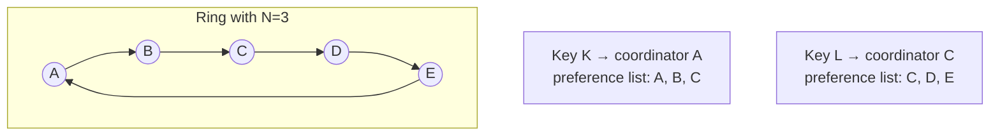

**Interview soundbite**: *"The preference list is what turns 'one key, one owner' into 'one key, N durable copies,' and it's computed purely from ring position — no separate metadata service is needed to know where a key's replicas live."*

### Section cheat-sheet (self-quiz)
- Two topologies exist: primary-secondary (simple, but fails "always writable") and peer-to-peer (any replica accepts writes, but needs conflict resolution).
- Dynamo picks peer-to-peer specifically to satisfy the "always writable" functional requirement.
- The **preference list** is the ordered list of `N` nodes a key replicates to, starting from its coordinator and walking clockwise.
- "Distinct physical" matters — the preference list skips vnodes that map back to a physical machine already in the list, so replicas land on genuinely different hardware.
- The preference list is derived purely from ring position — no separate metadata/lookup service is needed to know where a key's replicas live.
- Replication and partitioning are co-designed: the ring gives you both "which node owns this key" and "which N nodes replicate it" from the same structure.

---

## 9. Deep dive: data versioning and conflict resolution

### Why this is needed
Because the system favors availability (§2, §14), a network partition can let **two different coordinators** independently accept writes for the same key — producing **divergent histories** that must be reconciled once the partition heals.

### Why timestamps alone don't work
Using wall-clock timestamps and "last write wins" seems simple, but clocks across distributed nodes are never perfectly synchronized — clock skew can cause a genuinely later write to be discarded because its clock read slightly behind another node's. (This is the same LWW risk flagged for general async replication in the companion Databases chapter — in short, that chapter's point is that any cross-node ordering scheme built on wall-clock time inherits whatever clock skew exists between those nodes, so it can never be fully trusted for causality.)

### Vector clocks vs. last-write-wins (LWW)

| | Vector clocks | Last-write-wins (LWW) |
|---|---|---|
| What it detects | True causality — dominance vs. genuine concurrency | Nothing — just picks the write with the highest timestamp |
| Data safety | Conflicting writes are preserved and surfaced for reconciliation | The "losing" write is **silently discarded**, even if it was actually the causally later one (clock skew) |
| Storage/transmission cost | Higher — a growing list of `(node, counter)` pairs per object | Lower — a single timestamp per object |
| Application burden | Higher — app must know how to merge conflicting versions | None — the system resolves it for you, silently |
| Who uses it | Dynamo, Riak, Voldemort | DynamoDB (default), Cassandra (classic default) |

### The fix: vector clocks

A **vector clock** is a list of `(node, counter)` pairs, one entry per node that has ever written a given object's value. Comparing two vector clocks tells you:
- One **dominates** the other (every counter ≥, at least one >) → no real conflict, the dominant version is simply newer.
- **Neither dominates** → the writes are truly **concurrent** → a conflict exists that must be reconciled.

### Worked example (straight from the source material — memorize this shape)

```
1. Node A handles write E1 → vector clock [A:1]
2. Node A handles write E2 (based on E1) → vector clock [A:2]   (E1 is now superseded, safe to discard)
3. Network partition occurs.
4. Node B handles a write, unaware of any partition-side update → clock ([A:2], [B:1])
5. Node C handles a *different* concurrent write → clock ([A:2], [C:1])
6. Partition heals. Client does a read → gets BOTH versions back, with context ([A:2],[B:1],[C:1])
7. Client reconciles (merges) the two versions and writes back.
8. Node A coordinates this reconciled write → new clock [A:4]  (single, resolved history again)
```

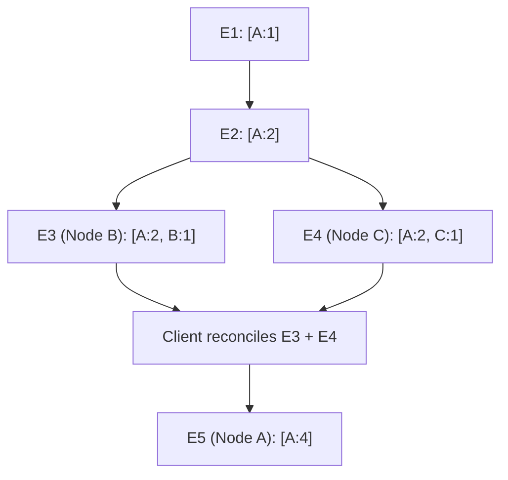

**This is exactly analogous to a Git merge**: two branches (E3, E4) diverged from a common ancestor (E2); if they touch unrelated parts of the object, an automatic merge may be possible; if they conflict, a human (or here, the calling application) resolves it manually. Stating this Git analogy explicitly is a great way to make the concept land quickly with an interviewer.

### Version-state lifecycle

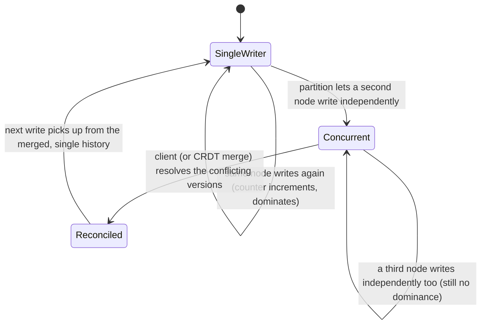

### The limitation: vector clock growth, and the fix
If many different nodes end up writing the same object (common during extended partitions or when writes aren't consistently routed through the same top-`N` preference-list nodes), the vector clock can grow to include many `(node, counter)` pairs — expensive to store/transmit. **Fix: clock truncation** — attach a timestamp to each `(node, counter)` pair and drop the oldest entries once the pair count exceeds a threshold (e.g., 10). Trade-off: truncation can make it impossible to precisely determine descendant relationships for the dropped entries, occasionally causing an unnecessary "conflict" to surface that a fuller history would have resolved automatically.

**Real-world alternative worth naming**: modern Dynamo-style systems increasingly favor **CRDTs** (Conflict-free Replicated Data Types) over exposing raw vector-clock conflicts to the application — CRDTs are specifically designed so *any* merge order converges correctly without ever surfacing a conflict to the client. (See the companion [Databases chapter, Consistency Models](../9.%20Databases/9.3%20Consistency%20Models.md) §6 for the deep dive on this — in short: a CRDT's merge operation is commutative, associative, and idempotent, so no matter what order or how many times replicas exchange updates, they mathematically converge to the same final state without ever needing a human or app-level tiebreaker.)

### Section cheat-sheet (self-quiz)
- Availability-favoring systems let two coordinators accept writes for the same key during a partition — that's the root cause conflicts have to be handled at all.
- Wall-clock "last write wins" silently discards data under clock skew — it doesn't detect conflicts, it just picks one and throws the other away.
- A **vector clock** is a `(node, counter)` list; one version **dominates** another (no conflict) or neither dominates (**true concurrency**, a real conflict).
- The worked example shape: single writer → partition → two independent concurrent writes → client reads both + merges → single history resumes.
- The Git-merge analogy is the fastest way to make this land: divergent branches from a common ancestor, auto-merge if possible, human/app resolves if not.
- Vector clocks grow unbounded with enough distinct writers — **clock truncation** bounds size at the cost of occasionally-unnecessary conflicts.
- **CRDTs** are the modern alternative: merges are mathematically guaranteed to converge, so conflicts never need to surface to the client at all.

---

## 10. Deep dive: quorum consistency — the configurability knob

This is where the "configurable service" functional requirement (§2) actually gets implemented.

### The three parameters

| Parameter | Meaning |
|---|---|
| **N** | Number of nodes a key's value is replicated to (the preference list length) |
| **W** | Minimum number of nodes that must acknowledge a **write** before it's considered successful |
| **R** | Minimum number of nodes that must respond to a **read** before returning a result to the client |

**Mnemonic**: read top-to-bottom as *"Number of copies, Writers who must confirm, Readers who must agree"* — N/W/R, in that order, is literally the order each word appears in that sentence.

### The correctness rule
```
R + W > N   →  every read is guaranteed to overlap with the most recent successful write on
               at least one node, so a client can never read a value older than its last
               acknowledged write (through this API, from this quorum's perspective)
```

This is the identical quorum-overlap logic covered in the companion [Databases chapter](../9.%20Databases/9.6%20Replication%20-%20Deep%20Dive.md) — in short, any two sets of nodes sized `R` and `W` out of `N` total are mathematically guaranteed to share at least one common node whenever `R + W > N`, which is the entire proof behind the rule. Dynamo is, in fact, one of the two or three systems that popularized this pattern industry-wide.

### The trade-off table (know this cold — a very common direct question)

| N | R | W | Valid? | Effect |
|---|---|---|---|---|
| 3 | 2 | 1 | **No** — `2+1=3`, not `>3` | Violates the correctness rule |
| 3 | 2 | 2 | Yes | Balanced — moderate read and write latency, reasonable consistency |
| 3 | 3 | 1 | Yes | **Fast writes, slow reads** — writes only need 1 ack; reads must contact all 3 replicas |
| 3 | 1 | 3 | Yes | **Fast reads, slow writes** — reads only need 1 replica; writes must reach all 3 synchronously |

**The general rule to state out loud**: *"Latency of an operation is bound by the **slowest** of the `R` (or `W`) replicas it has to wait for — so pushing `R` or `W` down toward 1 buys you speed on that operation type at the cost of consistency guarantees on the other, and pushing either up toward `N` buys consistency at the cost of that operation's latency and availability (since more replicas must be reachable)."*

### What happens under the hood on a write
1. The coordinator computes a new vector clock and writes the new version **locally first**.
2. It sends the new version + vector clock to the `N-1` other nodes in the preference list.
3. The write is considered successful once **`W-1` additional** nodes acknowledge (the coordinator's own local write counts as the first of the `W`).

### What happens under the hood on a read
1. The coordinator requests the value from the top-`N` reachable nodes in the preference list.
2. It waits for **`R`** responses.
3. If the responses disagree (divergent, unreconciled histories), **all conflicting versions plus their merged context** are returned to the client for reconciliation (§9) — this is exactly why the API returns a *list* of values, not just one.

### Sloppy quorum — the availability escape hatch
A **strict quorum** requires exactly the top-`N` nodes on the preference list to respond — if one of them is temporarily down, the operation fails, which violates "always writable." Dynamo instead uses a **sloppy quorum**: the first `N` **healthy** nodes encountered (not necessarily the literal top `N` on the list) handle the operation. This directly motivates **hinted handoff** (§11.1) — if a node outside the "true" top-`N` temporarily stands in, it needs a way to hand the data back to the rightful owner once it recovers.

### Sloppy/eventual quorum vs. strict/linearizable consistency

| | Sloppy (eventual) quorum | Strict (linearizable) quorum |
|---|---|---|
| Who must respond | First `N` *healthy* nodes reached, wherever they sit | Exactly the top-`N` nodes on the preference list |
| Behavior when a preferred node is down | Falls through to the next healthy node (via hinted handoff) — operation still succeeds | Operation fails/blocks until the preferred node is reachable again |
| Availability | Higher — this is the "always writable" choice | Lower — a single unreachable replica can halt the operation |
| Consistency guarantee | Read-your-writes-style, eventual — `R+W>N` overlap is probabilistic once hints are involved | Linearizable — every read reflects the latest acknowledged write, by construction |
| Who chooses this | Dynamo, Cassandra (default) | etcd/ZooKeeper-style consensus systems (§13 contrast case) |

### Section cheat-sheet (self-quiz)
- `N`/`W`/`R` = replica count / write-ack threshold / read-response threshold — mnemonic: "Number, Writers, Readers."
- The correctness rule is `R + W > N`: it guarantees the read set and write set share at least one node.
- Pushing `R` or `W` toward 1 buys speed on that operation at the cost of consistency; pushing toward `N` buys consistency at the cost of latency/availability.
- A write succeeds once the coordinator's local write plus `W-1` more acks land; the remaining replicas are updated asynchronously.
- A read fans out to the top-`N` reachable nodes and waits for `R` responses; divergent responses are returned as a list for client-side reconciliation.
- **Sloppy quorum** (first `N` healthy nodes) trades strict membership for availability — it's what makes hinted handoff necessary in the first place.
- Always say "R+W>N" out loud when discussing quorum tuning — it's the single fact interviewers check for.

---

## 11. Deep dive: fault tolerance

This section covers three distinct repair mechanisms that are easy to blur together in an interview — keep them straight by *when* they act: hinted handoff acts **at write time** (a healthy stand-in accepts a misdirected write), read-repair acts **at read time** (a quorum read notices a stale replica and fixes it inline), and anti-entropy acts **in the background** (a periodic sweep that doesn't depend on any client request happening at all).

### Replica health lifecycle

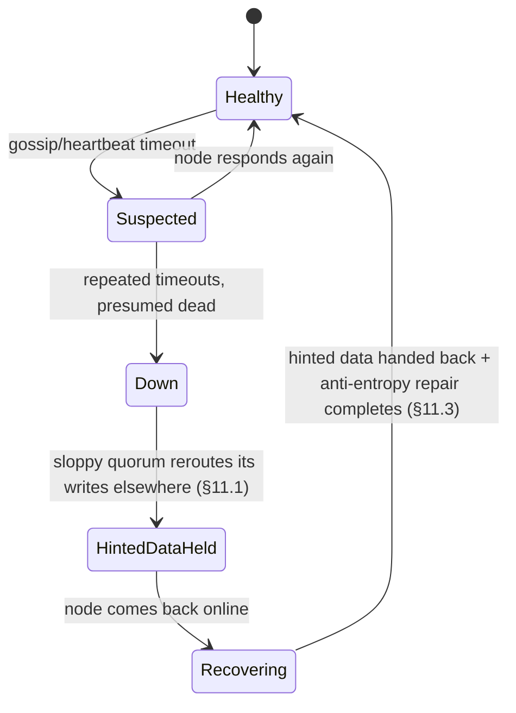

### 11.1 Temporary failures — hinted handoff

If node `A` (the rightful preference-list member for key `K`) is briefly unreachable, the request falls through to the next healthy node in the preference list — say node `D` — under the sloppy-quorum rule above. Node `D` accepts the write **and stores a hint**: "this data actually belongs to node A; forward it once A recovers."

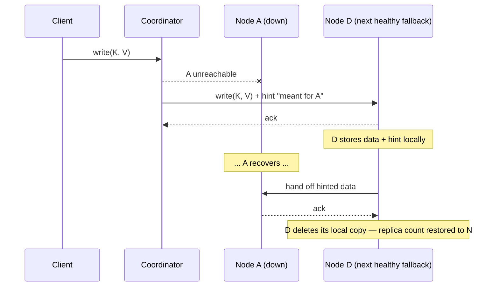

This preserves the desired replica count (`N`) and availability without blocking on `A`'s recovery. **Limitation worth naming if pushed**: hinted handoff only helps with *temporary* unavailability — if `A` never comes back (permanent failure), the hint sits on `D` indefinitely (or expires, depending on implementation) and doesn't by itself restore proper replication; that's what anti-entropy (§11.3) is for.

### 11.2 Read-repair — fixing staleness discovered during a quorum read

Hinted handoff and anti-entropy both repair replicas *without* a client necessarily being involved. **Read-repair is different**: it's triggered by the normal quorum-read path itself (§10) — the coordinator already has to contact `R` replicas and compare their versions to decide what to return, so once it notices one of them is stale, it might as well fix it on the spot instead of waiting for the next background anti-entropy pass.

1. The coordinator sends a read request to the top-`N` reachable nodes and waits for `R` responses (exactly as in §10).
2. It compares the vector clocks of the responses it received.
3. If one replica's version is strictly dominated by another's (i.e., genuinely stale, not concurrent), the coordinator pushes the newer version back to that replica.
4. This push can happen **synchronously** (before replying to the client — slightly higher read latency, but the client is guaranteed every replica it touched is now consistent) or **asynchronously** (reply to the client immediately, repair in the background — lower latency, but a brief window remains where that replica is still stale).

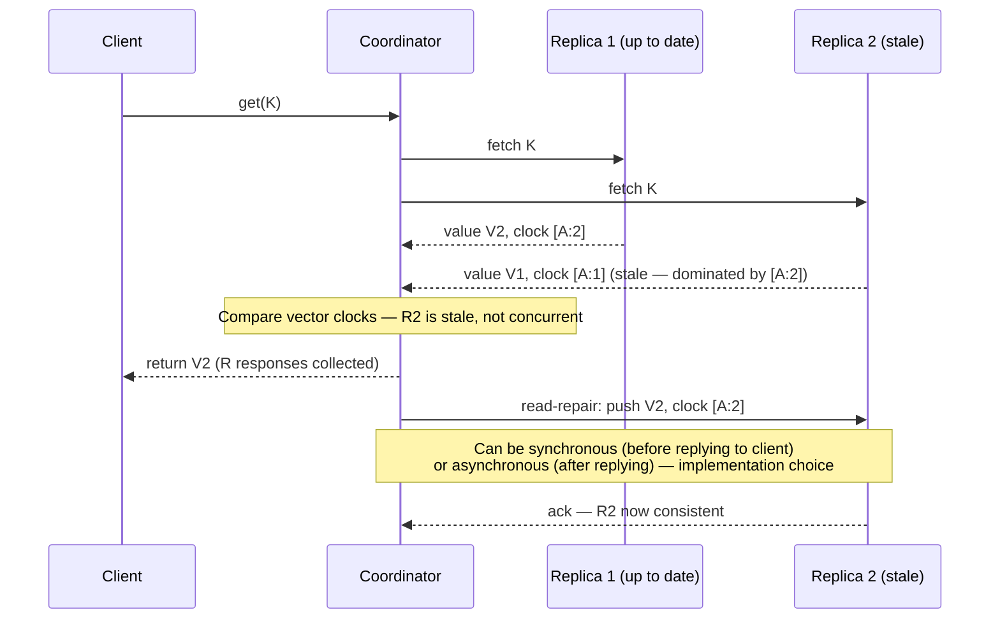

**Why this isn't the same as hinted handoff or anti-entropy**: hinted handoff deals with a replica that was never reachable to accept the write in the first place (temporary outage at *write* time); anti-entropy is a background, request-independent Merkle-tree sweep that catches drift *nobody happened to read*; read-repair only fixes what a *live read* happens to expose, as a side effect of the quorum read the system was doing anyway.

### Read-repair vs. hinted handoff — the disambiguation table

| | Hinted handoff (§11.1) | Read-repair (§11.2) |
|---|---|---|
| Triggered by | A **write** hitting an unreachable rightful replica | A **read** finding disagreement among the replicas it queried |
| When it acts | At write time, immediately, on a stand-in node | At read time, on the actual stale replica itself |
| What it fixes | Gets the write recorded somewhere durable until the rightful node returns | Pushes the correct, already-known-good version directly to the stale replica |
| Depends on | The sloppy-quorum fallback mechanism (§10) | The quorum-read comparison the coordinator was already doing (§10) |
| Runs in the background independent of any request? | No — happens as part of handling one specific write | No — happens as part of handling one specific read |

### 11.3 Permanent failures — anti-entropy via Merkle trees

Hinted handoff doesn't help once a node is **permanently** gone (disk failure, decommissioned hardware) — replicas can silently drift out of sync, and you need to detect + repair this efficiently, without comparing every key one by one (prohibitively expensive at scale).

**Merkle tree structure**: hash each individual key's value → these hashes are the **leaves**; each parent node is the hash of its children's hashes, all the way up to a single **root hash** summarizing an entire key range.

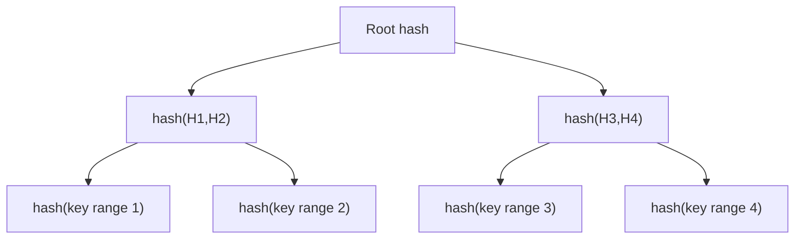

**Comparison algorithm between two replicas holding the same key range**:
1. Compare root hashes. **Equal → done**, the two replicas are identical for this range, no data needs to move.
2. **Different → recurse** into children, comparing hashes level by level, only descending into subtrees that actually differ — until the specific divergent keys are isolated and only *those* are exchanged/repaired.

Each virtual node maintains its **own** Merkle tree for the key range it owns. **Advantage**: independently verifiable branches mean you never need to transfer or hash the *entire* dataset to find a discrepancy — `O(log n)` comparisons isolate the divergent range. **Disadvantage**: whenever a node **joins or leaves**, key ranges shift, and the affected trees must be **recalculated** — a real, nontrivial cost during topology changes, worth naming if asked about the downsides of this mechanism.

*(This is the identical anti-entropy mechanism detailed in the companion [Databases chapter, Replication Deep Dive](../9.%20Databases/9.6%20Replication%20-%20Deep%20Dive.md) §6 — Cassandra's `nodetool repair` is the canonical real-world implementation.)*

### 11.4 Membership and failure detection — the gossip protocol

The system needs a way for nodes to learn about the ring's membership (which nodes exist, which virtual nodes they own) **without** a centralized coordination service (which would reintroduce a single point of failure/bottleneck the whole design is trying to avoid).

**Gossip protocol mechanics**:
1. Each node maintains a persistent, locally-stored history of membership changes it knows about (its **token set** — which virtual nodes map to which physical nodes).
2. Periodically, each node picks another node **at random** and exchanges/merges membership histories with it.
3. Over enough rounds, membership information **eventually** propagates to every node — an **epidemic-style, eventually-consistent** view of cluster membership, achieved with low, bounded bandwidth per node (each node only talks to a small, random subset of peers, never broadcasts to everyone at once).

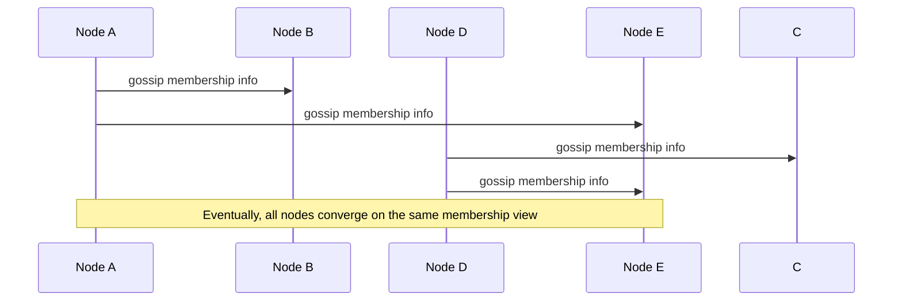

**Explicit vs. implicit membership changes**:
- **Explicit** (planned): an administrator issues a `join`/`leave` command — deliberate commissioning/decommissioning, propagated via gossip like any other membership fact.
- **Implicit** (failure detection): if a node repeatedly fails to reach another node in its token set within a timeout, it locally concludes that node is likely dead and can alert operators — but this is a **local, per-node suspicion**, not an authoritative global decision, which is a deliberate design choice to avoid needing a consensus protocol just to detect failures.

**Interview soundbite**: *"Gossip is what lets this system have no single 'membership service' to fail — the trade-off is that membership knowledge is only eventually consistent, so right after a node joins or leaves, different nodes in the cluster can briefly disagree about the ring's exact shape."*

### Section cheat-sheet (self-quiz)
- Three distinct repair mechanisms, distinguished by *when* they act: hinted handoff (write time, stand-in node), read-repair (read time, stale replica), anti-entropy (background, no request needed).
- Merkle trees let two replicas find divergent keys in `O(log n)` comparisons instead of scanning every key.
- Each virtual node keeps its own Merkle tree; node join/leave forces recalculation — a real, nontrivial cost.
- Gossip propagates membership **without** a central coordination service — nodes randomly exchange membership histories until the whole cluster converges.
- Failure detection via gossip is **local suspicion**, not a global, authoritative decision — deliberately avoids needing a consensus protocol just to notice a dead node.
- Explicit membership changes (`join`/`leave` commands) and implicit ones (timeout-based suspicion) both propagate the same way: via gossip.
- Never confuse "eventually consistent membership" with "eventually consistent data" — gossip's staleness window is about who's in the cluster, not what a key's value is.

---

## 12. Putting it together — the full write and read paths

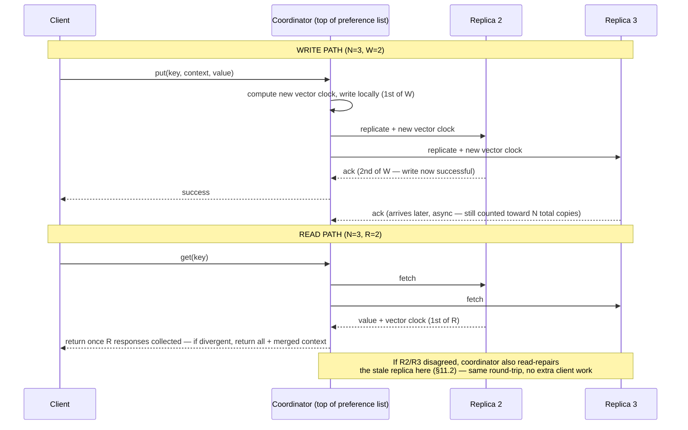

---

## 13. Real-world systems — how the actual industry implements these ideas

This is the single highest-leverage section to have ready — interviewers love hearing you map textbook concepts onto shipped products.

| System | Partitioning | Replication topology | Conflict resolution | Membership/gossip | Notes |
|---|---|---|---|---|---|
| **Amazon Dynamo** (2007 paper — the direct source of this whole chapter) | Consistent hashing + virtual nodes | Peer-to-peer, preference list | Vector clocks, app-level reconciliation | Gossip-based | The original; internal to Amazon, never released as a public product directly |
| **Amazon DynamoDB** (public AWS product) | Consistent hashing internally | Peer-to-peer internally, but exposed as a managed service | Mostly **last-writer-wins** by default now, with optional conditional writes/transactions layered on top | Managed, opaque to the user | DynamoDB deliberately simplified Dynamo's model — most users never see vector clocks; AWS trades some of Dynamo's raw flexibility for operational simplicity |
| **Apache Cassandra** | Consistent hashing + virtual nodes (configurable count) | Peer-to-peer, tunable per-query consistency level (`ONE`, `QUORUM`, `ALL`, etc. — directly the `R`/`W`/`N` idea, renamed) | Historically last-writer-wins by timestamp (not vector clocks) | Gossip-based (very close to Dynamo's design) | The most direct "Dynamo, but open source and with a wide-column data model" — Facebook originally built it citing Dynamo and Bigtable as its two ancestors |
| **Riak** | Consistent hashing + virtual nodes | Peer-to-peer | **Vector clocks** (closest public system to Dynamo's original conflict-resolution design) | Gossip-based | The most academically "faithful" open-source Dynamo descendant |
| **Voldemort** (LinkedIn) | Consistent hashing | Peer-to-peer | Vector clocks | Gossip-based | Built at LinkedIn, directly citing Dynamo; less actively developed today but a good historical namedrop |
| **etcd / ZooKeeper** (contrast case) | N/A — small, strongly consistent coordination data, not a general key-value store at this scale | Raft/ZAB consensus (not gossip, not sloppy quorums) | N/A — linearizable, no conflicts by design | Consensus-based membership, not gossip | Worth contrasting: these deliberately choose **CP** (strict consensus) because they store small amounts of critical coordination data where availability-over-consistency (Dynamo's choice) would be actively dangerous (e.g., you never want two nodes to both think they're the leader) |
| **Redis (Cluster mode)** (contrast case) | **Hash-slot partitioning** — the keyspace is divided into a fixed **16,384 slots**, each assigned to a shard (not a consistent-hash ring) | **Primary-replica per shard**, not peer-to-peer — each slot's primary accepts writes, replicas are read-only failover targets promoted via Sentinel/Cluster failover | **None needed** — no vector clocks; each slot has a single primary, so there's no multi-writer conflict to reconcile in normal operation | Gossip protocol between cluster nodes for slot-ownership/failure info (structurally similar to Dynamo's gossip, but layered on a primary-replica model, not a peer-to-peer one) | **CP-leaning per shard**: a slot with no reachable primary simply stops serving writes rather than accepting them on a stand-in — the opposite trade-off from Dynamo's "always writable." A great single example to contrast against the whole rest of this chapter. |

**Interview soundbite tying it together**: *"Cassandra is essentially Dynamo's replication/partitioning model (consistent hashing, gossip, tunable quorum) fused with Bigtable's wide-column data model. DynamoDB is AWS's productionized, simplified descendant of the original Dynamo paper — it keeps the scalability story but hides vector clocks from most users in favor of last-writer-wins by default. Redis is the sharpest contrast case: fixed hash-slot partitioning instead of a ring, primary-replica instead of peer-to-peer, and no vector clocks at all — it's CP-leaning per shard where Dynamo-family systems are AP by design."*

---

## 14. CAP theorem framing — why this system is fundamentally AP

Every design decision in this chapter — peer-to-peer replication over primary-secondary, sloppy quorums over strict quorums, vector clocks instead of blocking on conflict — traces back to one deliberate choice: **this system prioritizes Availability over Consistency when a network partition occurs.**

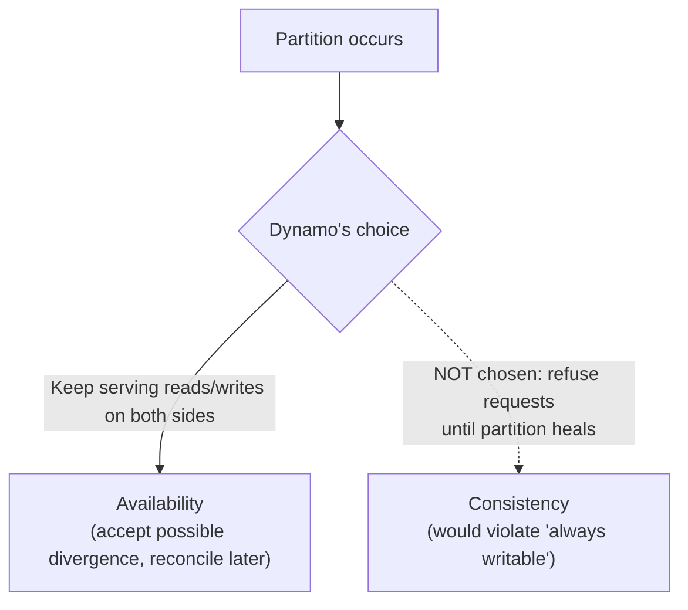

This is exactly the **AP** side of the CAP theorem (see the companion [Databases chapter, CAP Theorem and PACELC](../9.%20Databases/9.8%20CAP%20Theorem%20and%20PACELC.md) for the full rigorous treatment — in one sentence: CAP says that during a network partition you must choose between Consistency and Availability, you cannot have both, and PACELC extends this to say that *even without* a partition, you still trade latency against consistency) — and the `R`/`W`/`N` quorum knobs are how the system lets an individual application **dial toward more CP-like behavior** (e.g., `R=N, W=N` behaves close to strongly consistent, at the cost of availability whenever any replica is unreachable) without changing the underlying architecture.

**Interview soundbite**: *"This whole design is a concrete, mechanical answer to 'how do you build an AP system that's still usable' — sloppy quorums and hinted handoff give you availability, vector clocks give you a principled way to detect and resolve the consistency cost of that availability, and the R/W/N knobs let individual callers choose how much of that cost they're willing to pay."*

---

## 15. Trade-offs, bottlenecks, and when this design breaks down

| Concern | Why it happens | Mitigation |
|---|---|---|
| **Hot partitions** | Skewed key popularity (a viral product, a celebrity's session) concentrates load on a few virtual nodes despite consistent hashing | More virtual nodes, key salting (see companion [Partitioning Deep Dive](../9.%20Databases/9.7%20Partitioning%20and%20Sharding%20-%20Deep%20Dive.md) — in short, "salting" means appending a random/rotating suffix to a hot key so its writes spread across several physical keys instead of one), or a cache layer in front of hot keys |
| **Vector clock growth** | Writes routed through many different nodes over time (common during extended partitions) | Clock truncation (with the accuracy trade-off noted in §9), or move to CRDTs to avoid surfacing conflicts at all |
| **Merkle tree recompute cost** | Every node join/leave forces recalculating affected trees | Bound how often topology changes in practice (avoid excessive node churn); accept this as one of the real costs of horizontal elasticity |
| **Gossip convergence time at very large cluster sizes** | Gossip is `O(log N)` rounds to converge, but at tens of thousands of nodes this can still be seconds, during which membership views can disagree | Usually acceptable given this is about *membership*, not data correctness — but worth naming as a real limitation if pushed on "how does this behave at Amazon-internal scale" |
| **No secondary indexes / no joins** | Fundamental to the key-value model — only primary-key access is efficient | If the access pattern needs rich queries, this is a signal to reconsider the database family entirely (see the companion [Database Selection Guide](../9.%20Databases/9.10%20Database%20Selection%20Guide%20-%20Types%2C%20Real%20Systems%2C%20and%20When%20to%20Use%20What.md) — in short, that guide's job is to map an access-pattern description straight onto the right database family: KV, document, wide-column, relational, graph, etc.) rather than bolt queries onto a KV store |
| **Application-level conflict resolution burden** | Vector-clock conflicts are pushed to the calling application, which must know how to merge (e.g., union two shopping carts) | Only acceptable when the domain has an obvious, safe merge semantic; if it doesn't, this design is a poor fit — flag this explicitly as a real cost, not a free lunch |

---

## How to identify this topic in an interview

- "Design a distributed cache / session store / shopping cart backend" → this entire chapter, directly.
- "Design DynamoDB" or "Design Cassandra" → this chapter plus §13's specific real-system mapping.
- "How do you scale a hash table across machines without a massive reshuffle on every resize?" → consistent hashing + virtual nodes.
- "Two replicas got different writes during a network split — how do you reconcile them?" → vector clocks (or CRDTs as the modern alternative).
- "How do you let different callers choose their own consistency/latency trade-off?" → the `N`/`R`/`W` quorum knobs, `R+W>N`.
- "What happens when a node is briefly unreachable? Permanently gone?" → hinted handoff (temporary) vs. Merkle-tree anti-entropy (permanent) — a very common two-part follow-up, always answer both halves.
- "A quorum read got back two different versions — what now?" → read-repair (§11.2), and be ready to distinguish it from hinted handoff and anti-entropy.
- "How do nodes learn about cluster membership without a central coordinator?" → gossip protocol, and be ready to note it's only eventually consistent.
- "How is data actually stored on a single node's disk?" → storage engines (§7) — LSM-trees (Cassandra/RocksDB) vs. B-trees (DynamoDB, classic RDBMS).
- "Compare this to Redis" → §13 — hash-slot partitioning, primary-replica (not peer-to-peer), no vector clocks, CP-leaning per shard.

---

## Golden Rules

Non-negotiables — violate any of these in an interview and it reads as a gap, not a simplification:

1. **Always say `R + W > N` out loud** when discussing quorum tuning — naming the formula, not just the trade-off, is what signals real understanding.
2. **Never call this system CP when it's actually AP** — Dynamo-family systems (and this whole chapter) choose availability over consistency during a partition; only the etcd/ZooKeeper/Redis-style contrast cases are CP.
3. **Vnodes exist to fix uneven load on ring join/leave**, not to add complexity for its own sake — if you can't explain the hotspot problem they solve, don't reach for the term.
4. **Hinted handoff, read-repair, and anti-entropy are three different mechanisms** — distinguish them by *when* they act (write time / read time / background), never use them interchangeably.
5. **Vector clocks detect conflicts; they don't resolve them** — resolution is either the calling application's job or a CRDT's job, never the vector clock's own.
6. **A preference list is derived from ring position, not stored in a separate metadata service** — if your design adds a lookup service for "where are this key's replicas," you've missed the point of consistent hashing.
7. **LSM-trees and B-trees are a genuine trade-off, not a strict upgrade** — LSM buys write throughput at the cost of read/space amplification; say which one your system needs and why.
8. **Gossip's staleness window is about membership, not data** — don't conflate "the ring view is eventually consistent" with "the data is eventually consistent"; they're separate mechanisms with separate guarantees.
9. **Sloppy quorum is what makes "always writable" actually true** — a strict quorum alone would violate that requirement the moment any one preferred replica is down.

---

## Master Cheat Sheet

### One-liners you should have ready
- A key-value store is a distributed hash table (DHT) — scaled and made fault-tolerant across many machines.
- Functional requirements: configurable consistency/availability trade-off, always-writable, no special/heterogeneous-role nodes.
- `hash(key) mod N` breaks on resize (near-total reshuffle) → **consistent hashing** fixes it (only `O(1/N)` of keys move per topology change).
- **Virtual nodes** fix consistent hashing's residual hotspot problem, and let more powerful physical machines take proportionally more load ("F-H-S": fair on failure, hardware-aware, smoother).
- **LSM-trees** (Cassandra, RocksDB, LevelDB) trade higher read/space amplification for much lower write amplification; **B-trees** (DynamoDB, MySQL/PostgreSQL) are the opposite trade — fast in-place reads, costlier random writes.
- Peer-to-peer replication (not primary-secondary) is chosen specifically to satisfy "always writable."
- The ordered list of `N` nodes replicating a key is the **preference list** — purely derived from ring position, no extra metadata service needed.
- **Vector clocks** (`(node, counter)` pairs) detect true write-write conflicts across partitioned replicas without relying on unreliable wall-clock timestamps; unresolved conflicts are surfaced to the client (like a Git merge conflict) for reconciliation.
- **Quorum formula**: `R + W > N` guarantees read-after-write consistency; tune `R`/`W` toward `1` for speed on that operation or toward `N` for consistency at the cost of that operation's latency/availability. Mnemonic: N/W/R = "Number, Writers, Readers."
- **Sloppy quorum** (first `N` *healthy* nodes, not strictly the top `N`) + **hinted handoff** (temporarily misdirected writes get forwarded back once the rightful node recovers) = availability during transient failures.
- **Read-repair** fixes staleness a quorum read happens to expose (inline, at read time) — distinct from hinted handoff (write time) and anti-entropy (background, request-independent).
- **Merkle trees** detect and repair divergence between replicas after permanent failures, using `O(log n)` hash comparisons instead of a full dataset scan.
- **Gossip protocol**: random peer-to-peer membership exchange, no central coordinator, eventually-consistent view of the cluster — the price is a convergence delay, not incorrect data.
- This entire design is a concrete instance of the **AP** choice in CAP — every mechanism here (peer-to-peer writes, sloppy quorums, vector clocks) exists to keep the system available and reconcile consistency after the fact, rather than block for consistency up front.
- Real systems: Cassandra ≈ Dynamo's replication model + Bigtable's data model; DynamoDB ≈ productionized/simplified Dynamo (mostly LWW, vector clocks hidden); Riak/Voldemort ≈ closest faithful open-source Dynamo descendants; ZooKeeper/etcd are the deliberate **CP** contrast case for small, critical coordination data; **Redis Cluster** ≈ fixed 16,384 hash-slot partitioning + primary-replica (not peer-to-peer) + no vector clocks — CP-leaning per shard, the sharpest AP-vs-CP contrast in the table.

### Formulas to have cold
```
Consistency guarantee:        R + W > N
Effective read ops/sec:       logical_read_QPS  × R
Effective write ops/sec:      logical_write_QPS × W   (+ async replication to the remaining N-W nodes)
Replicated storage need:      raw_data_size × N
```

### The 30-second version if asked "walk me through how you'd design this"
1. Start from the requirement that drives everything: **must always accept writes**, even during a partition → rules out primary-secondary, mandates peer-to-peer.
2. Partition the keyspace with **consistent hashing + virtual nodes** so scaling in/out moves minimal data and load stays balanced.
3. Replicate each key to the next `N-1` distinct physical nodes on the ring (the **preference list**).
4. Make consistency **configurable per caller** via quorum parameters `R`/`W`/`N`, enforcing `R+W>N` when strong-ish guarantees are wanted.
5. Handle **temporary** node failures with sloppy quorums + hinted handoff, **read-time** staleness with read-repair, and **permanent** divergence with Merkle-tree anti-entropy.
6. Detect and disseminate cluster membership changes via **gossip**, avoiding any single coordination bottleneck.
7. Resolve the resulting write-write conflicts (an inherent cost of choosing availability) via **vector clocks**, surfaced to the application when automatic reconciliation isn't possible.
8. Pick each node's local **storage engine** to match the workload: an LSM-tree for write-heavy throughput, a B-tree if reads dominate and updates are mostly in-place.
