# CDN (Content Delivery Network) — FAANG Interview Guide

> **Enhancement notes:** this pass targeted the gaps a FAANG interviewer would probe that the original draft covered only thinly — everything else (requirements, capacity math, push/pull, DNS-vs-anycast, TTL/lease, buy-vs-build, the recall/cheat-sheet layers) was already strong and left untouched.
> - Added **§6.2 Architecture evolution v1 → v2 → v3** — a naive-single-origin → DNS-routed-regional-caches → anycast+shield+pub/sub-purge diagram sequence, for narrating the design as a build-up instead of presenting it finished.
> - Added **§9.3 Preventing thundering herd on a cold cache** (request-coalescing/single-flight flowchart + an "if X then Y" splitting it from origin-shield's job) and **§9.4** dedicated cache-hit and cache-miss-with-origin-shield sequence diagrams — the combined §6.1 diagram existed, but the two paths weren't isolated anywhere.
> - Added an **anycast-vs-DNS-geo-routing visual** in §10 (side-by-side graph) — the trade-off table and flowchart existed, but not a picture of the two routing paths themselves.
> - Added **§11.5 How purge propagation reaches thousands of edges** — a pub/sub fan-out sequence diagram and illustrative propagation-time numbers; the guide named "purge APIs" and cited Fastly's sub-second purge before, but never showed the fan-out mechanism.
> - Added Active Recall questions 13–14 and Golden Rule 9 covering request-coalescing-vs-origin-shield and purge fan-out, and extended the Master Cheat Sheet with three new lines summarizing the additions above.
> - No existing section was rewritten or reordered — this is additive; all new headings are marked with 🆕.

## 1. What it is, in one mental model

A CDN is a **geographically distributed cache layer sitting between users and your origin**. Think of it as franchising: instead of every customer flying to your one factory (origin data center), you open small stores (PoPs — Points of Presence) close to where customers live, stock them with your most popular products (cached content), and only ship from the factory when a store doesn't have what's needed (cache miss → origin fetch).

The core insight interviewers want to hear: **a CDN doesn't just cache — it also does traffic routing (send the user to the *right* store) and traffic shielding (protect the factory from being overwhelmed or attacked)**. Caching, routing, and security are the three pillars — miss any one and you haven't described a real CDN.

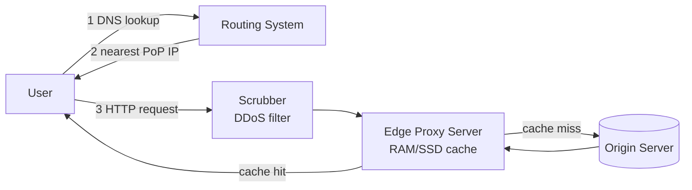
```mermaid
graph LR
    U[User] -->|1 DNS lookup| R[Routing System]
    R -->|2 nearest PoP IP| U
    U -->|3 HTTP request| S[Scrubber<br/>DDoS filter]
    S --> P[Edge Proxy Server<br/>RAM/SSD cache]
    P -->|cache hit| U
    P -->|cache miss| O[(Origin Server)]
    O --> P
```

> **Memory hook — the one idea that repeats three times in this chapter:** **Push = someone proactively ships you something before you ask. Pull = you ask, then someone fetches it.** Watch for it in (1) how content reaches the edge (§7), and (2) how the edge learns content went stale (§11). It's also the exact same trade-off as *fan-out-on-write vs. fan-out-on-read* in feed systems (Twitter/Instagram). Learn the duality once here and you can reuse it in half the other system design chapters.

### 1.1 Disambiguation: CDN vs. reverse proxy

Interviewers will sometimes ask "isn't a CDN just a reverse proxy?" — the honest answer is "yes, scaled out geographically, with routing and security bolted on."

| | CDN | Reverse Proxy |
|---|---|---|
| **Scope** | Many geographically distributed edge locations (PoPs) | Typically one site / one data center in front of one set of origin servers |
| **Primary goal** | Cut latency for a globally distributed user base + absorb load/attacks at internet scale | Load balancing, SSL termination, hiding origin topology for a single deployment |
| **Routing** | Global routing to the nearest PoP (DNS redirection / anycast) | Local routing/load-balancing within one location |
| **Caching** | Core feature, tuned for global fan-out and long-tail popularity | Often does caching too (Nginx, Varnish), but scoped to one location, not globally replicated |
| **Relationship** | An edge proxy inside a CDN *is* essentially a reverse proxy | A reverse proxy is one of the CDN's building blocks, not the whole CDN |

**Cheat-sheet:**
- CDN = geographically distributed cache + routing + security — not "a cache," and not "a reverse proxy," though it's built from both ideas.
- Three pillars: caching, routing, security. Always name all three, every time.
- Mental model: franchising — PoPs are stores, origin is the factory, cache miss = a shipment from the factory.
- A CDN edge proxy is a reverse proxy; a CDN is many reverse proxies deployed globally with routing on top.
- The push/pull duality introduced here reappears in push-vs-pull CDNs (§7) and TTL-vs-lease consistency (§11) — learn it once.

## 2. Why it exists — the problem, quantified

Without a CDN, a single origin data center serving a global user base hits three walls:

| Problem | Root cause | Concrete cost |
|---|---|---|
| **High latency** | Propagation delay ∝ distance; transmission delay ∝ bandwidth; queuing delay ∝ congestion; + nodal processing delay | US-East ↔ US-West RTT ≈ 63ms; US-East ↔ Africa RTT ≈ 226ms. VoIP needs <150ms one-way; interactive apps <200ms; video streaming tolerates a few seconds (buffered) |
| **Data-intensive traffic** | Origin must send a full copy to *every* requester individually; small-MTU links along the path throttle throughput | Streaming is both data-heavy *and* dynamic — worst of both worlds |
| **Resource scarcity / SPOF** | Compute + bandwidth at one DC don't scale infinitely; one DC = one blast radius | A regional outage or fiber cut takes down 100% of users |

**Numbers worth quoting in an interview:**
- Real-time/interactive apps: latency budget **< 200ms**; VoIP **< 150ms**.
- Netflix + YouTube + Amazon Prime Video = **~80% of internet traffic** (2020).
- Akamai historically served **15–30% of all web traffic** (~30 Tbps), and was **one network hop away for 90% of internet users**.
- Netflix's own CDN (Open Connect) achieves a **~95% cache hit ratio**.

**Making the trade-off concrete — CDN vs. no CDN:**

| Dimension | Without a CDN | With a CDN |
|---|---|---|
| **Latency** | Full WAN RTT to one origin region, for every user, globally (e.g., 226ms US↔Africa) | Sub-few-ms to tens-of-ms to the nearest PoP for cached content; only misses pay the WAN RTT |
| **Origin load** | 100% of requests hit origin — must be provisioned for peak *global* traffic | Only cache misses (often <5-10%) reach origin — origin sized far smaller |
| **Bandwidth cost** | Origin pays full egress bandwidth for every byte, to every user | CDN absorbs the bulk of egress; origin egress shrinks roughly by the cache hit ratio |
| **Availability** | Single region/DC = single blast radius; one fiber cut or regional outage takes everyone down | Cached content survives origin outages entirely; many PoPs = no single blast radius |
| **DDoS resilience** | Attack traffic hits origin directly — origin capacity is the only defense | Anycast + scrubber servers absorb/disperse attack traffic before it nears origin |
| **Cost profile** | Lower fixed cost, poor scaling under global/spiky load | Ongoing CDN spend (or capex if built), but far cheaper than over-provisioning origin for global peak |

## 3. Capacity estimation — a worked example

Interviewers expect you to turn the "why it exists" numbers into an actual back-of-envelope sizing exercise. Walk through it out loud — the exact numbers matter far less than showing which lever moves which output.

**Given:**
- 500M daily active users (DAU)
- ~20 content requests/user/day (images, API fragments, page assets — state this assumption explicitly, it's the one the interviewer will push on)
- Average object size: 2KB
- Edge cache hit ratio: 95% (matches Netflix Open Connect's real-world number from §2)

**Step 1 — total request volume:**
- Requests/day = 500M × 20 = **10B requests/day**
- Average QPS = 10B / 86,400s ≈ **116K QPS**
- Peak QPS (assume 3× average for a typical diurnal curve) ≈ **350K QPS**

**Step 2 — origin QPS after CDN offload:**
- Only cache misses reach origin: 5% of traffic
- Origin avg QPS = 116K × 0.05 ≈ **5.8K QPS**
- Origin peak QPS = 350K × 0.05 ≈ **17.5K QPS**
- **Say this number out loud:** the CDN turns a 116K–350K QPS problem into a ~6K–17.5K QPS problem for the origin — a **>20x reduction**, which is the entire economic argument for a CDN.

**Step 3 — bandwidth:**
- Total daily bytes = 10B requests × 2KB ≈ **20TB/day**
- Without a CDN: origin serves all 20TB/day ⇒ ≈1.85 Gbps sustained average egress (≈5.6 Gbps at peak)
- With CDN (95% hit ratio): origin only serves 5% = 1TB/day ⇒ ≈93 Mbps average egress — cheap enough for modest origin infrastructure
- Bandwidth **saved** from the origin's bill ≈ 19TB/day, now absorbed by the CDN's edge network instead

**Step 4 — rough PoP count and storage sizing:**
- To keep RTT low for 500M globally distributed users, aim for wide coverage: **100–300 PoPs** is a reasonable target (real-world anchors: Fastly runs ~100 larger PoPs, Cloudflare ~300 cities, Akamai thousands of smaller ones — a philosophy trade-off discussed later in this guide)
- Per-PoP average load ≈ 116K QPS / 150 PoPs ≈ **~770 QPS/PoP** (uneven in practice — weight toward population-dense regions)
- Storage: content popularity typically follows a power-law/long-tail distribution, so the "hot set" responsible for most hits is a small fraction of the total catalog. A hot working set of, say, 10M objects × 2KB ≈ **20GB** — trivially fits in RAM on a modern edge box; a much larger long-tail catalog (100M+ objects, hundreds of GB) lives on SSD at a parent/shield tier instead of being replicated to every edge PoP.

**Takeaway to say in the room:** *"A CDN doesn't just make things faster — at a 95% hit ratio it cuts origin QPS and bandwidth by roughly 20x, which is the number that actually justifies the infrastructure spend."*

## 4. Requirements (how to open the interview)

### Functional
- **Retrieve** — proxy pulls content from origin.
- **Deliver** — origin pushes content to proxies (push model).
- **Request** — client asks a proxy for content.
- **Search** — a proxy checks peer proxies in the same PoP for content it doesn't have locally.
- **Update** — propagate changes to peer proxies (relevant when edge scripts/serverless functions mutate content).
- **Delete/evict** — expire stale or cold content (standard cache eviction: LRU/LFU + TTL).

### Non-functional
- **Performance** — minimize latency (the #1 KPI).
- **Availability** — must survive origin failure, proxy failure, and active attacks (DDoS).
- **Scalability** — horizontal scale-out as request volume grows.
- **Reliability & security** — no single point of failure; protect hosted content from abuse.

**Interview framing tip:** when asked "design a CDN," restate the goal as *"minimize the distance (and hops) between bytes and eyeballs, without serving stale or unsafe data, and without the origin ever being a single point of failure."* That one sentence anchors every design decision that follows.

## 5. Building blocks it's built from

A CDN is a composite of building blocks you've likely already covered:
- **DNS** — maps a hostname to the IP of an appropriate proxy server (this is *how* routing is implemented).
- **Load balancers** — spread requests across the proxies within a chosen location.
- **Caching (LRU/LFU/TTL eviction)** — same theory as an application cache, applied at the edge.
- **Consistent hashing** — often used to shard *which* content lives on *which* proxy within a PoP.

Name-dropping "this reuses the DNS and Load Balancer building blocks, plus cache eviction theory" signals systems thinking to the interviewer.

## 6. Components — the anatomy of a CDN

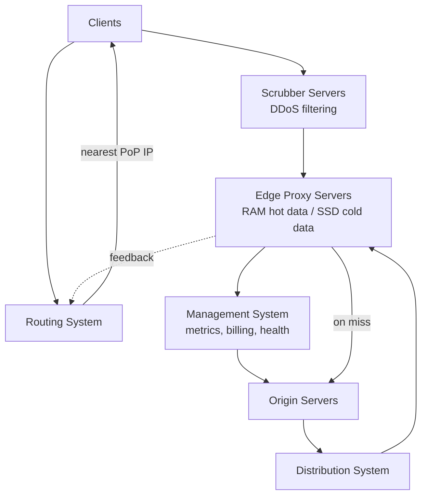
```mermaid
graph TB
    Client[Clients] --> RS[Routing System]
    RS -->|nearest PoP IP| Client
    Client --> Scrub[Scrubber Servers<br/>DDoS filtering]
    Scrub --> Proxy[Edge Proxy Servers<br/>RAM hot data / SSD cold data]
    Dist[Distribution System] --> Proxy
    Proxy -.feedback.-> RS
    Proxy --> Mgmt[Management System<br/>metrics, billing, health]
    Mgmt --> Origin[Origin Servers]
    Origin --> Dist
    Proxy -->|on miss| Origin
```

| Component | Job | Notes |
|---|---|---|
| **Routing system** | Decides *which* PoP/proxy a client should hit | Inputs: content placement, request volume, server load, URI namespace |
| **Scrubber servers** | Separate malicious traffic from legitimate traffic | Only activated when an attack is detected — traffic is "scrubbed" then forwarded |
| **Proxy (edge) servers** | Serve content, mostly from RAM; SSD/HDD for cold/long-tail content | This is where cache hit/miss happens |
| **Distribution system** | Pushes content from origin out to all edge proxies | Uses tree/broadcast-like fan-out, not naive 1:1 |
| **Origin servers** | Source of truth; serve on cache miss | Out of scope to design internally, but must be shielded |
| **Management system** | Observability + billing | Tracks latency, downtime, packet loss, server load; feeds routing decisions back |

**End-to-end workflow** (say this out loud in an interview to show you understand data *and* control planes):
1. Origin registers its URI namespace with the routing system.
2. Origin publishes content to the distribution system.
3. Distribution system fans content out to edge proxies and reports back to the routing system (which proxy has which content).
4. Client asks the routing system for a proxy → gets back an IP.
5. Client's request passes through scrubber servers → forwarded to the edge proxy.
6. Proxy serves the content (or forwards up the hierarchy / to origin on a miss) and reports accounting data to the management system.

### 6.1 One diagram to remember it all by

This sequence diagram fuses routing, security, tiered caching, and the management feedback loop into a single walkthrough. If you can redraw this from memory, you can redraw the whole chapter.

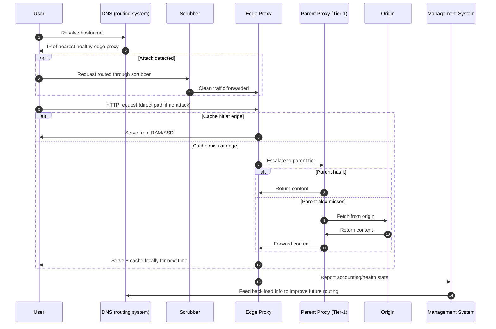
```mermaid
sequenceDiagram
    autonumber
    participant U as User
    participant D as DNS (routing system)
    participant Sc as Scrubber
    participant E as Edge Proxy
    participant Pa as Parent Proxy (Tier-1)
    participant O as Origin
    participant M as Management System

    U->>D: Resolve hostname
    D->>U: IP of nearest healthy edge proxy
    opt Attack detected
        U->>Sc: Request routed through scrubber
        Sc->>E: Clean traffic forwarded
    end
    U->>E: HTTP request (direct path if no attack)
    alt Cache hit at edge
        E->>U: Serve from RAM/SSD
    else Cache miss at edge
        E->>Pa: Escalate to parent tier
        alt Parent has it
            Pa->>E: Return content
        else Parent also misses
            Pa->>O: Fetch from origin
            O->>Pa: Return content
            Pa->>E: Forward content
        end
        E->>U: Serve + cache locally for next time
    end
    E->>M: Report accounting/health stats
    M->>D: Feed back load info to improve future routing
```

**Cheat-sheet:**
- Six components to name in order: routing system → scrubber servers → edge proxies → distribution system → origin servers → management system.
- Routing system decides *which* PoP; distribution system decides *what* content gets there — don't conflate the two.
- Scrubber servers only sit in the hot path during an attack — not overhead on every normal request.
- Proxy servers serve RAM-first, SSD/HDD for cold/long-tail — mirrors any LRU-based cache design.
- Management system is the feedback loop — it's what lets routing get smarter over time (load-aware, not just distance-aware).
- The distribution system fans out tree-style (§9), never origin-to-every-edge-directly — that would defeat the point of having a CDN.
- Redraw §6.1's sequence diagram from memory — it's the single diagram that ties every component together.

#### 🆕 6.2 Architecture evolution: v1 → v2 → v3

Interviewers often want you to *build up* the design rather than present the finished architecture cold. Narrating it as three versions — each one only adding complexity the previous version couldn't handle — is more convincing than jumping straight to the final picture.

**v1 — naive: one origin, no CDN at all.**
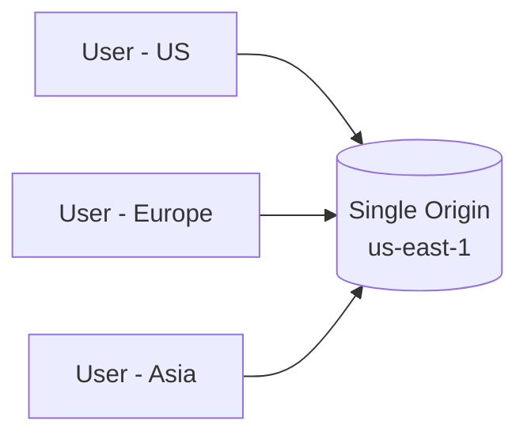
```mermaid
graph LR
    U1[User - US] --> O[(Single Origin<br/>us-east-1)]
    U2[User - Europe] --> O
    U3[User - Asia] --> O
```
Every user, everywhere, pays the full WAN RTT to one data center (§2's "without a CDN" row). Works for a small user base, falls over at global scale.

**v2 — a handful of regional edge caches + DNS routing.**
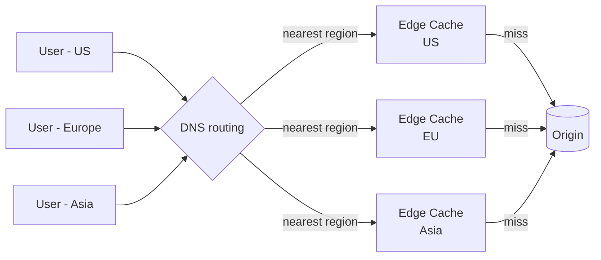
```mermaid
graph LR
    U1[User - US] --> D{DNS routing}
    U2[User - Europe] --> D
    U3[User - Asia] --> D
    D -->|nearest region| E1[Edge Cache<br/>US]
    D -->|nearest region| E2[Edge Cache<br/>EU]
    D -->|nearest region| E3[Edge Cache<br/>Asia]
    E1 -->|miss| O[(Origin)]
    E2 -->|miss| O
    E3 -->|miss| O
```
Most requests now get answered close to the user, and DNS decides which region to send them to. But each of these 3 edge caches independently hits origin on a miss — fine at 3 PoPs, but this doesn't survive a jump to hundreds of PoPs (§3, §12): origin would see hundreds of independent "first miss" spikes instead of one.

**v3 — production shape: anycast + origin shield + pub/sub purge.**
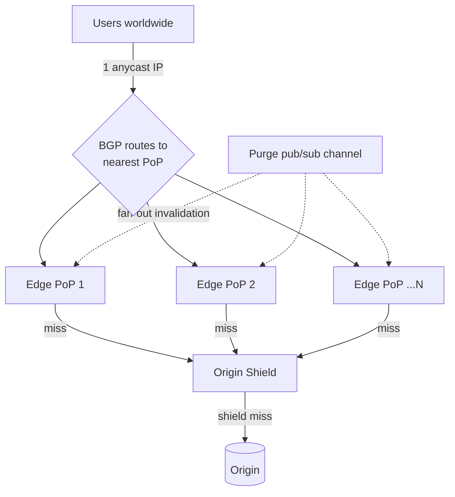
```mermaid
graph TB
    U1[Users worldwide] -->|1 anycast IP| BGP{BGP routes to<br/>nearest PoP}
    BGP --> E1[Edge PoP 1]
    BGP --> E2[Edge PoP 2]
    BGP --> E3[Edge PoP ...N]
    E1 -->|miss| SH[Origin Shield]
    E2 -->|miss| SH
    E3 -->|miss| SH
    SH -->|shield miss| O[(Origin)]
    Pub[Purge pub/sub channel] -.fan-out invalidation.-> E1
    Pub -.-> E2
    Pub -.-> E3
```
At hundreds-to-thousands of PoPs, three things become necessary that v2 didn't need: **(1) anycast**, so clients skip the two-step DNS resolution and BGP does the nearest-PoP math for free; **(2) an origin shield** (§9.2), so N edges missing on the same object collapses into one origin fetch instead of N; **(3) a pub/sub invalidation channel** (§11.5), so a purge reaches every PoP in roughly the same few seconds whether there are 3 PoPs or 3,000.

**Cheat-sheet:**
- v1 → v2 → v3 = "single origin" → "DNS to a few regions" → "anycast + shield + pub/sub purge at global scale."
- Say the progression out loud in an interview — it demonstrates you know *why* each piece exists, not just that it exists.

## 7. Push vs. Pull CDN — the central design decision

This is the single most-asked CDN design question. Know it cold.

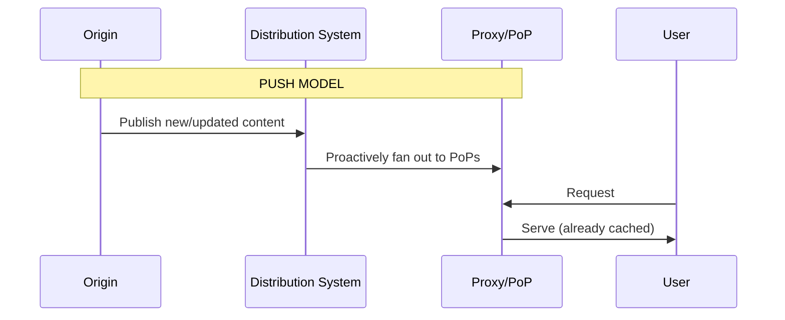
```mermaid
sequenceDiagram
    participant O as Origin
    participant D as Distribution System
    participant P as Proxy/PoP
    participant U as User
    Note over O,P: PUSH MODEL
    O->>D: Publish new/updated content
    D->>P: Proactively fan out to PoPs
    U->>P: Request
    P->>U: Serve (already cached)
```

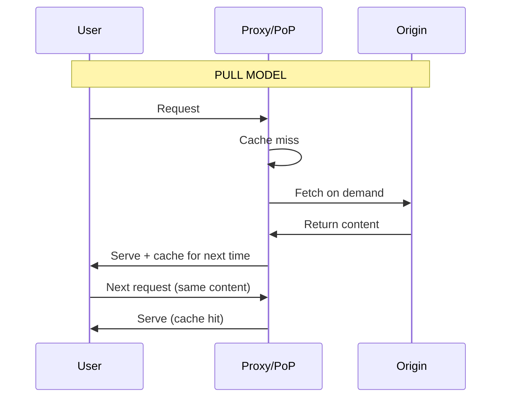
```mermaid
sequenceDiagram
    participant U as User
    participant P as Proxy/PoP
    participant O as Origin
    Note over U,O: PULL MODEL
    U->>P: Request
    P->>P: Cache miss
    P->>O: Fetch on demand
    O->>P: Return content
    P->>U: Serve + cache for next time
    U->>P: Next request (same content)
    P->>U: Serve (cache hit)
```

> **Duality callback:** push is the origin acting in the *future tense* ("I'll ship you what I think you'll need"); pull is the edge acting in the *present tense* ("I'll fetch exactly what was just asked for"). Same shape you'll see again in §11.

| | Push CDN | Pull CDN |
|---|---|---|
| **Who decides what's cached** | Origin (proactively ships it) | CDN (lazily fetches on first request) |
| **Best for** | Static content, predictable popularity | Dynamic / rapidly-changing / long-tail content |
| **Replica count** | Higher (content pushed broadly) → better availability | Lower — pulled only where/when requested → lower storage cost |
| **Failure mode** | Redundant pushes if content changes fast; wasted bandwidth | Origin gets hit on every unique first-access + on expiry |
| **Storage cost** | Higher | Lower |
| **Real-world default** | Software downloads, images, video segments known in advance | API responses, personalized fragments, breaking content |

**Interview line:** *"Most real systems use both — push for known-popular static assets, pull with TTL-based expiry for everything else."* This is literally what Netflix, Akamai, and most CDNs do in practice.

## 8. Dynamic content caching (the "gotcha" most candidates miss)

Naively, candidates think "CDN = static content only." Strong answers cover **dynamic content acceleration**:

- **Edge compute / edge scripting** — run small scripts *at the proxy* instead of round-tripping to origin (e.g., generate content based on user geo, time-of-day, or a third-party weather API). This is the ancestor of modern **Cloudflare Workers / Lambda@Edge**.
- **Compression** — reduce origin↔proxy chatter and storage footprint (e.g., Cloudflare's **Railgun**).
- **ESI (Edge Side Includes)** — a markup language letting you cache 95% of a page and only re-fetch the 5% that changed, instead of invalidating the whole page. Not W3C-standardized but widely implemented.
- **DASH (Dynamic Adaptive Streaming over HTTP)** — a manifest file lists the same video at multiple bitrates/resolutions; the client picks based on current network conditions. Netflix runs a proprietary DASH variant using **byte-range requests** within a single URL for finer-grained optimization.

**Decision flow — how much of a page/response can actually be cached?**

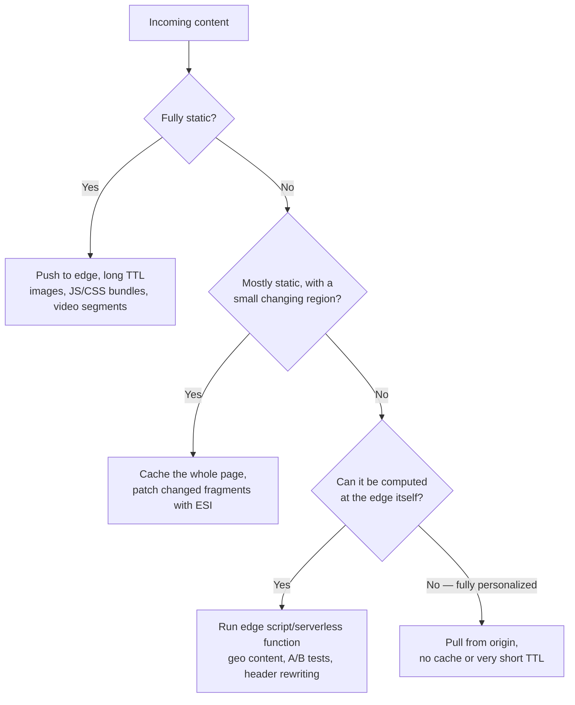
```mermaid
flowchart TD
    A[Incoming content] --> B{Fully static?}
    B -->|Yes| C[Push to edge, long TTL<br/>images, JS/CSS bundles, video segments]
    B -->|No| D{Mostly static, with a<br/>small changing region?}
    D -->|Yes| E[Cache the whole page,<br/>patch changed fragments with ESI]
    D -->|No| F{Can it be computed<br/>at the edge itself?}
    F -->|Yes| G[Run edge script/serverless function<br/>geo content, A/B tests, header rewriting]
    F -->|No — fully personalized| H[Pull from origin,<br/>no cache or very short TTL]
```

**Cheat-sheet:**
- Static → push, long TTL, high replication.
- Dynamic/personalized → pull, edge scripting, short TTL or event-driven invalidation.
- Video → DASH/HLS manifests + byte-range + adaptive bitrate, not "cache the whole file."

## 9. Multi-tier (layered) CDN architecture

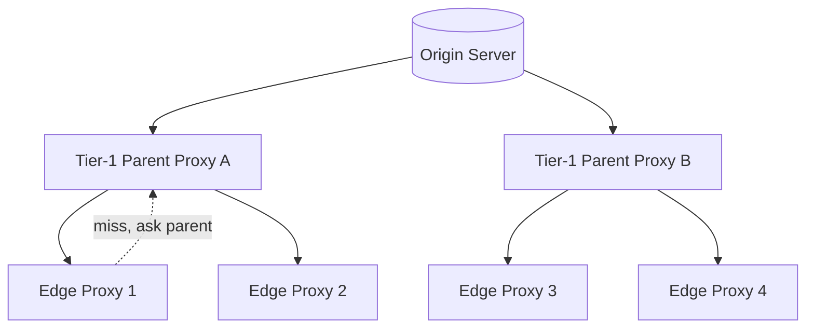
```mermaid
graph TD
    Origin[(Origin Server)] --> T1a[Tier-1 Parent Proxy A]
    Origin --> T1b[Tier-1 Parent Proxy B]
    T1a --> E1[Edge Proxy 1]
    T1a --> E2[Edge Proxy 2]
    T1b --> E3[Edge Proxy 3]
    T1b --> E4[Edge Proxy 4]
    E1 -.miss, ask parent.-> T1a
```

### 9.1 The tree structure

- Content fans out **tree-style**: origin → parent/tier-1 proxies → edge proxies. This avoids the origin having to push to thousands of edges directly (fan-out burden), and lets you scale by adding tree nodes, not by scaling the origin.
- Typically **1–2 tiers** of proxies (caches) in practice.
- A new proxy joining the tree registers with the **control core**, which hands it configuration + seed content.
- **Long-tail justification**: content popularity follows a power law (long-tail distribution) — a small set of objects gets most requests, and a huge long tail gets occasional requests. Multi-tier lets edge proxies hold only the hot set in RAM while a parent tier (or SSD at the edge) absorbs the long tail, instead of every edge proxy needing to hold everything.
- **Failure handling**: if an edge proxy misses, escalate to its parent; if the parent misses too, fall back to origin. If a parent or origin fails outright, that's where redundancy (multiple parents, cached data outliving a dead origin) keeps things available — this is exactly the kind of failure-mode question ("what if a child/parent/origin fails?") interviewers probe on.

### 9.2 Origin shield — the origin's bodyguard

An **origin shield** is a single, designated caching tier — often just one specific PoP or region — that sits between *every* edge PoP and the origin. Every edge PoP's cache miss is routed to the shield first, and only the shield is allowed to talk to origin directly.

What it buys you:
- **Request coalescing at scale** — if 200 edge PoPs all miss on the same viral object at once, only the shield fetches origin once and serves the other 199 waiting edges, turning an N-way thundering herd into a single origin request.
- **A second, higher-hit-ratio cache tier** — the shield sees the aggregate traffic of every edge PoP behind it, so an object that's cold at any one edge is often already warm at the shield.
- **A simpler, smaller "known clients" list at origin** — origin only ever needs to trust/scale for requests from the shield, not from every edge PoP in the world.

This is the same tree/multi-tier idea from §9.1, just given a product name: **AWS CloudFront calls this "Origin Shield," Fastly calls it "shielding,"** and Akamai's tiered-distribution parent layer serves the same purpose. Mentioning the concept *and* one real product name is what separates a strong answer from a generic one here.

#### 🆕 9.3 Preventing thundering herd on a cold cache

"Cold cache" shows up two ways: (a) one specific object suddenly goes viral and every edge misses on it at once, or (b) a whole PoP is cold — just spun up, empty cache, first wave of traffic. Both produce the same failure mode if unhandled: hundreds of concurrent requests for the same key each fire their own origin fetch.

The fix at a single proxy is **request coalescing** (a.k.a. "single-flight" or a cache-fill lock): the first request for a missing key becomes the *leader* and actually fetches; every other concurrent request for that same key *waits* on the leader's in-flight fetch instead of starting its own.

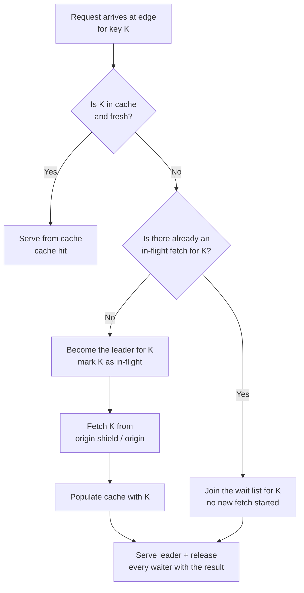
```mermaid
flowchart TD
    A[Request arrives at edge<br/>for key K] --> B{Is K in cache<br/>and fresh?}
    B -->|Yes| C[Serve from cache<br/>cache hit]
    B -->|No| D{Is there already an<br/>in-flight fetch for K?}
    D -->|Yes| E[Join the wait list for K<br/>no new fetch started]
    D -->|No| F[Become the leader for K<br/>mark K as in-flight]
    F --> G[Fetch K from<br/>origin shield / origin]
    G --> H[Populate cache with K]
    H --> I[Serve leader + release<br/>every waiter with the result]
    E --> I
```

**Illustrative example** (numbers are for intuition, not measured): a promo image goes viral and 200 edge PoPs each get 50 concurrent requests for it in the same second — 10,000 requests total. Without coalescing, that's up to 10,000 origin fetches. With per-PoP request coalescing, each PoP fetches at most once, so origin sees at most 200 requests — and with an origin shield in front of those 200 PoPs (§9.2), the shield coalesces *those* down to a single origin fetch. The two mechanisms stack: coalescing kills the herd *within* a PoP, the shield kills the herd *across* PoPs.

**If X then Y:**
- Many concurrent requests miss on the *same key* at the *same edge* → request coalescing — one fetch, everyone else waits.
- Many *different edges* miss on the *same key* around the *same time* → origin shield — collapses their fetches into one.
- A whole PoP is cold (freshly deployed, empty cache) → let it warm from a neighboring PoP or the shield tier first, rather than hammering origin directly.

#### 🆕 9.4 Cache-hit vs. cache-miss (with origin shield) — sequence diagrams

§6.1's combined diagram is the one to know cold, but interviewers often ask for the hit and miss paths in isolation — here they are, split out.

**Cache hit:**
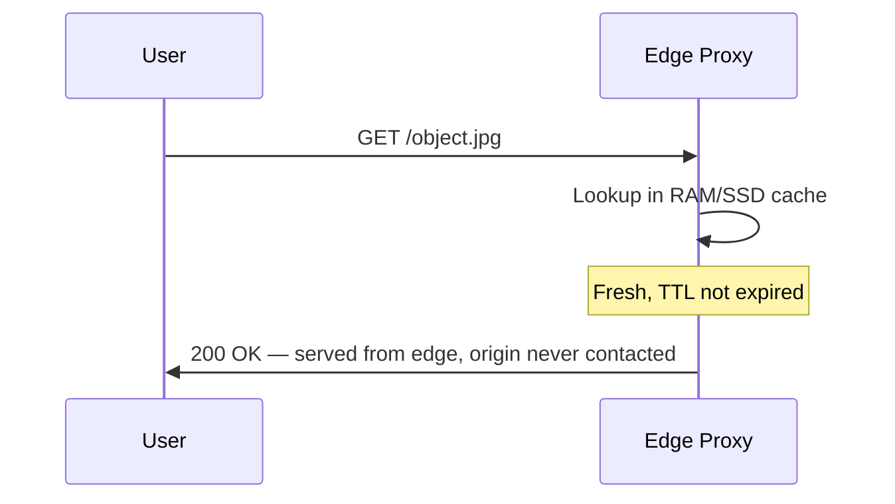
```mermaid
sequenceDiagram
    participant U as User
    participant E as Edge Proxy
    U->>E: GET /object.jpg
    E->>E: Lookup in RAM/SSD cache
    Note over E: Fresh, TTL not expired
    E->>U: 200 OK — served from edge, origin never contacted
```

**Cache miss, with origin shield:**
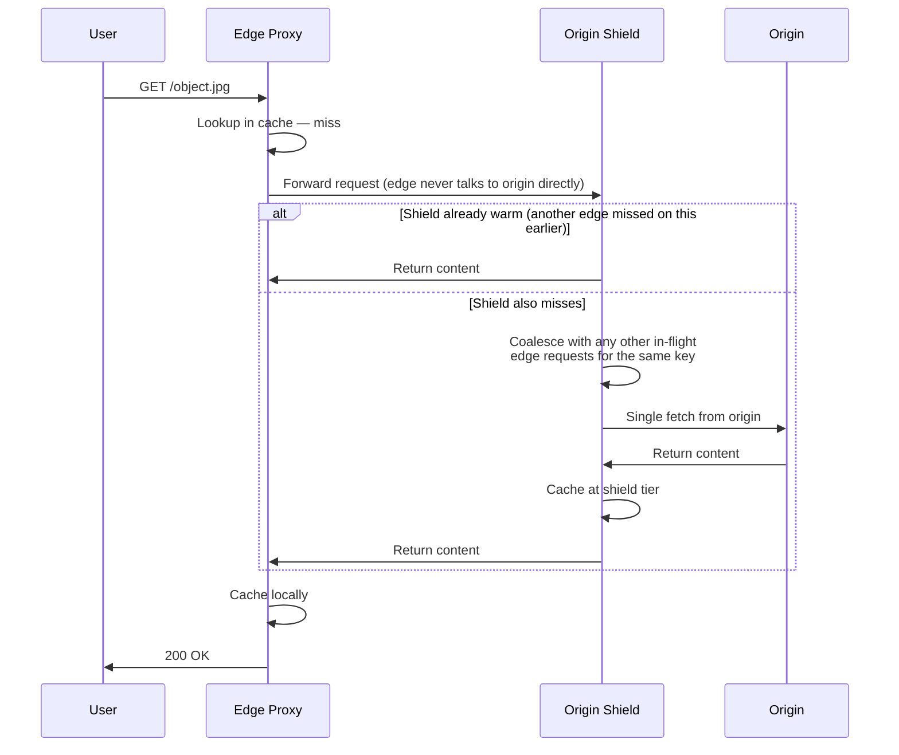
```mermaid
sequenceDiagram
    participant U as User
    participant E as Edge Proxy
    participant Sh as Origin Shield
    participant O as Origin
    U->>E: GET /object.jpg
    E->>E: Lookup in cache — miss
    E->>Sh: Forward request (edge never talks to origin directly)
    alt Shield already warm (another edge missed on this earlier)
        Sh->>E: Return content
    else Shield also misses
        Sh->>Sh: Coalesce with any other in-flight<br/>edge requests for the same key
        Sh->>O: Single fetch from origin
        O->>Sh: Return content
        Sh->>Sh: Cache at shield tier
        Sh->>E: Return content
    end
    E->>E: Cache locally
    E->>U: 200 OK
```

## 10. Finding the nearest proxy server (routing mechanisms)

Two factors define "nearest":
1. **Network distance** = path length × available bandwidth (NOT geographic distance — a nearby proxy over a congested link can be "farther" than a distant one over a fat pipe).
2. **Request load** — route away from an overloaded proxy even if it's otherwise closest.

| Mechanism | How it works | Pros | Cons |
|---|---|---|---|
| **DNS redirection** | Client resolves a hostname → CDN's authoritative DNS resolves again → returns IP of nearest proxy, using **short TTLs** so it can re-balance quickly | Considers both network distance and load; industry standard (Akamai) | Two-step resolution adds latency; granularity limited to the *resolver's* location, not the actual client (can misroute if client uses a distant public resolver) |
| **Anycast** | Many edge servers share **one IP address**; BGP naturally routes the client to the topologically nearest one | Simple client-side (no redirect logic); leverages internet routing infrastructure | Coarser control over load-balancing; BGP convergence can be slow on failure; harder to do fine-grained content-aware routing |
| **Client multiplexing** | Server returns a list of candidate proxies; client picks one | No server-side computation | Client lacks visibility into load/distance → poor choices, possible pile-on to one server |
| **HTTP redirection** | Origin responds with a redirect URL pointing at the CDN (classic ``) | Dead simple, works everywhere | Extra round trip; redirect logic still needs to pick *a* CDN endpoint |

**DNS redirection two-step model** (a favorite whiteboard sequence):
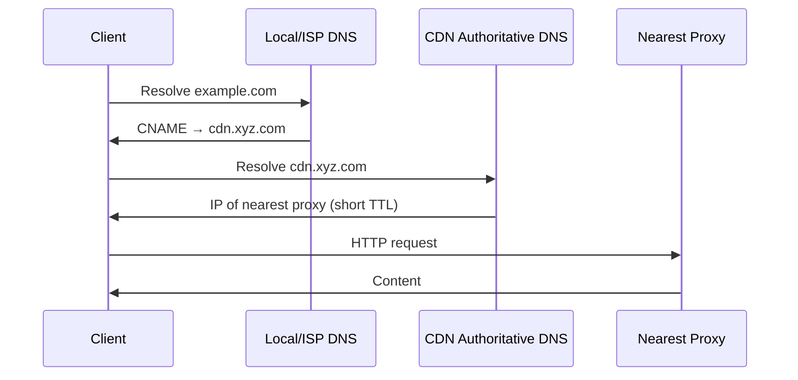
```mermaid
sequenceDiagram
    participant C as Client
    participant LDNS as Local/ISP DNS
    participant ADNS as CDN Authoritative DNS
    participant P as Nearest Proxy
    C->>LDNS: Resolve example.com
    LDNS->>C: CNAME → cdn.xyz.com
    C->>ADNS: Resolve cdn.xyz.com
    ADNS->>C: IP of nearest proxy (short TTL)
    C->>P: HTTP request
    P->>C: Content
```

#### 🆕 Anycast vs. DNS geo-routing, visualized

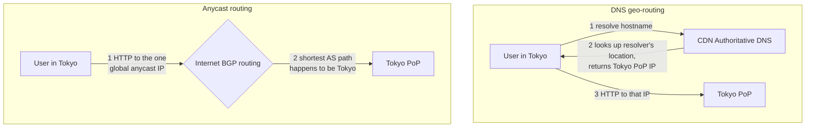
```mermaid
graph TB
    subgraph DNS["DNS geo-routing"]
        direction LR
        U1[User in Tokyo] -->|"1 resolve hostname"| DNS1[CDN Authoritative DNS]
        DNS1 -->|"2 looks up resolver's location,<br/>returns Tokyo PoP IP"| U1
        U1 -->|"3 HTTP to that IP"| P1[Tokyo PoP]
    end
    subgraph ANY["Anycast routing"]
        direction LR
        U2[User in Tokyo] -->|"1 HTTP to the one<br/>global anycast IP"| BGP2{Internet BGP routing}
        BGP2 -->|"2 shortest AS path<br/>happens to be Tokyo"| P2[Tokyo PoP]
    end
```

With DNS geo-routing, the *DNS layer* makes the decision — one extra lookup, but the CDN can factor in real-time load per request. With anycast, every PoP announces the *same IP*, and ordinary internet routing (BGP) picks the topologically nearest one — no extra lookup, but the CDN gives up per-request control once BGP has converged.

**Which one would you actually pick?**

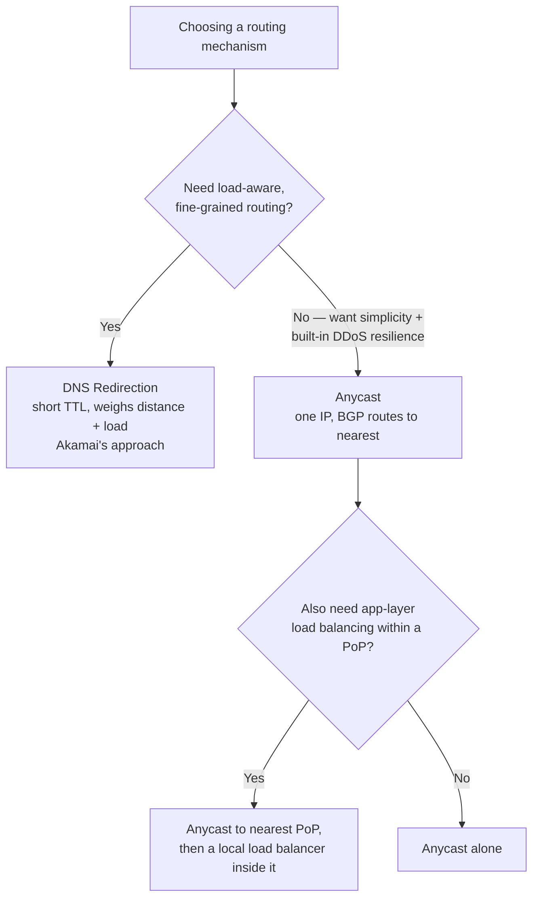
```mermaid
flowchart TD
    A[Choosing a routing mechanism] --> B{Need load-aware,<br/>fine-grained routing?}
    B -->|Yes| C[DNS Redirection<br/>short TTL, weighs distance + load<br/>Akamai's approach]
    B -->|No — want simplicity +<br/>built-in DDoS resilience| D[Anycast<br/>one IP, BGP routes to nearest]
    D --> E{Also need app-layer<br/>load balancing within a PoP?}
    E -->|Yes| F[Anycast to nearest PoP,<br/>then a local load balancer inside it]
    E -->|No| G[Anycast alone]
```

**Interview cheat-sheet:**
- DNS redirection = most common, used by Akamai; short TTL lets it re-route as load shifts; the cost is two DNS round trips before the first byte.
- Anycast = one IP globally, BGP-routed, simplifies client config, and doubles as free DDoS resilience (attack traffic disperses across every server advertising that IP) — Cloudflare's default.
- "Nearest" = network distance (path × bandwidth) + current load — never plain geographic distance.
- DNS redirection can misroute when a client uses a distant public resolver (e.g., 8.8.8.8) instead of its ISP's — "nearest to the resolver" isn't always "nearest to the client."
- Anycast trades fine-grained load control for simplicity — BGP knows network topology, not proxy CPU/queue depth.
- Client multiplexing and HTTP redirect are simpler but strictly worse — mention them for breadth, then explain why real systems avoid them (no server-side visibility into load/distance).
- If asked "how would you pick," lead with DNS redirection when load-aware routing matters most, anycast when DDoS resilience and client-side simplicity matter most.

## 11. Content consistency (cache invalidation is still the hard problem)

| Technique | Mechanism | Trade-off |
|---|---|---|
| **Periodic polling (TTR)** | Proxy asks origin "anything new?" on a fixed time-to-refresh interval | Simple; wastes bandwidth if content rarely changes; can serve stale data between polls |
| **TTL (time-to-live)** | Origin stamps each object with an expiry; proxy serves it as-is until expiry, then re-validates | Reduces refresh chatter vs. polling; still a window of staleness up to TTL |
| **Leases** | Origin promises to *actively notify* the proxy of changes for a lease duration; proxy renews before expiry; duration can adapt to observed load (**adaptive lease**) | Fewest messages exchanged; more complex (origin must track lease state per proxy); best when writes are rare but must propagate fast when they happen |

> **Duality callback #2:** TTL is the proxy *pulling* for freshness ("has this expired? let me go check"). A lease is the origin *pushing* freshness ("I'll tell you the moment something changes"). It's the same push/pull shape from §7, just applied to invalidation instead of delivery — once you see it, the two topics reinforce each other instead of being two things to memorize separately.

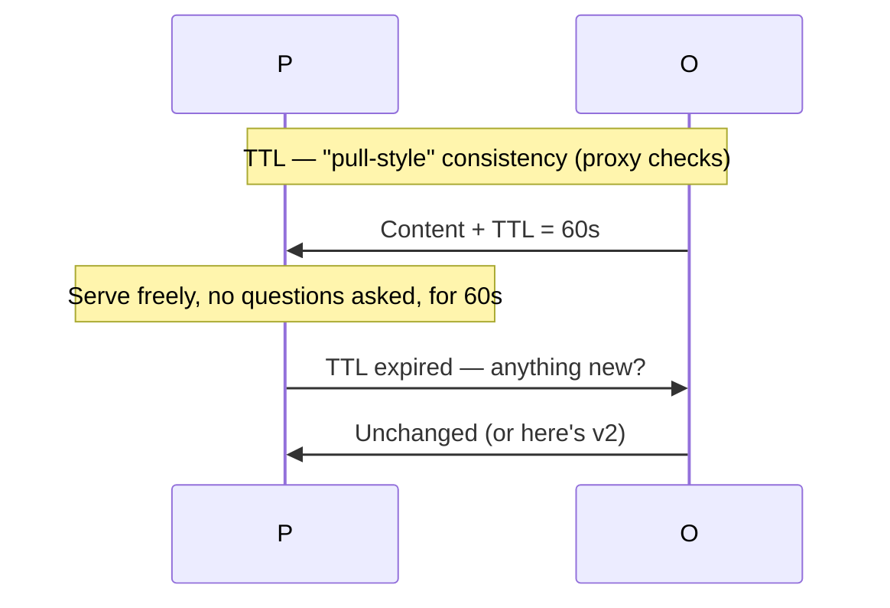
```mermaid
sequenceDiagram
    Note over P,O: TTL — "pull-style" consistency (proxy checks)
    O->>P: Content + TTL = 60s
    Note over P: Serve freely, no questions asked, for 60s
    P->>O: TTL expired — anything new?
    O->>P: Unchanged (or here's v2)
```

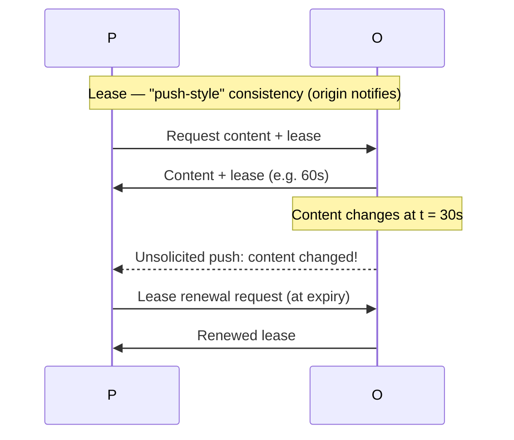
```mermaid
sequenceDiagram
    Note over P,O: Lease — "push-style" consistency (origin notifies)
    P->>O: Request content + lease
    O->>P: Content + lease (e.g. 60s)
    Note over O: Content changes at t = 30s
    O-->>P: Unsolicited push: content changed!
    P->>O: Lease renewal request (at expiry)
    O->>P: Renewed lease
```

**This maps directly to classic cache-invalidation theory** — TTL is the CDN analogue of a Redis `EXPIRE`, and leases are the analogue of a **write-through invalidation / pub-sub cache invalidation** pattern. If you know one, you know the other.

**Interview line:** *"Pick TTL when staleness tolerance is well understood and writes are infrequent; pick leases when you need near-real-time propagation and can afford the bookkeeping; pick polling only when the origin can't push notifications at all."*

### 11.1 Stale-while-revalidate

Plain TTL forces a binary choice at expiry: serve stale, or make the user wait on a synchronous origin round trip. **Stale-while-revalidate (SWR)** avoids both: once an object expires, the proxy immediately serves the stale copy to the requesting user (zero added latency), while it *asynchronously* refetches the fresh version from origin in the background for the *next* request. This is standard, production behavior in **CloudFront, Fastly, and Cloudflare** (all support a `stale-while-revalidate` Cache-Control directive), and it's a strong answer to "how do you avoid every user paying the cost of an origin round trip right at expiry."

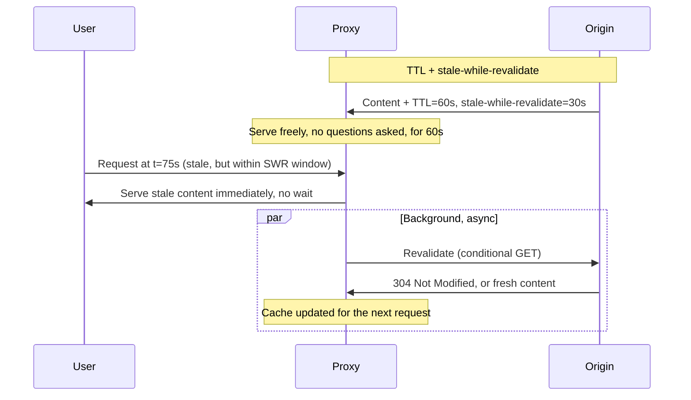
```mermaid
sequenceDiagram
    participant U as User
    participant P as Proxy
    participant O as Origin
    Note over P,O: TTL + stale-while-revalidate
    O->>P: Content + TTL=60s, stale-while-revalidate=30s
    Note over P: Serve freely, no questions asked, for 60s
    U->>P: Request at t=75s (stale, but within SWR window)
    P->>U: Serve stale content immediately, no wait
    par Background, async
        P->>O: Revalidate (conditional GET)
        O->>P: 304 Not Modified, or fresh content
        Note over P: Cache updated for the next request
    end
```

### 11.2 Cache entry lifecycle

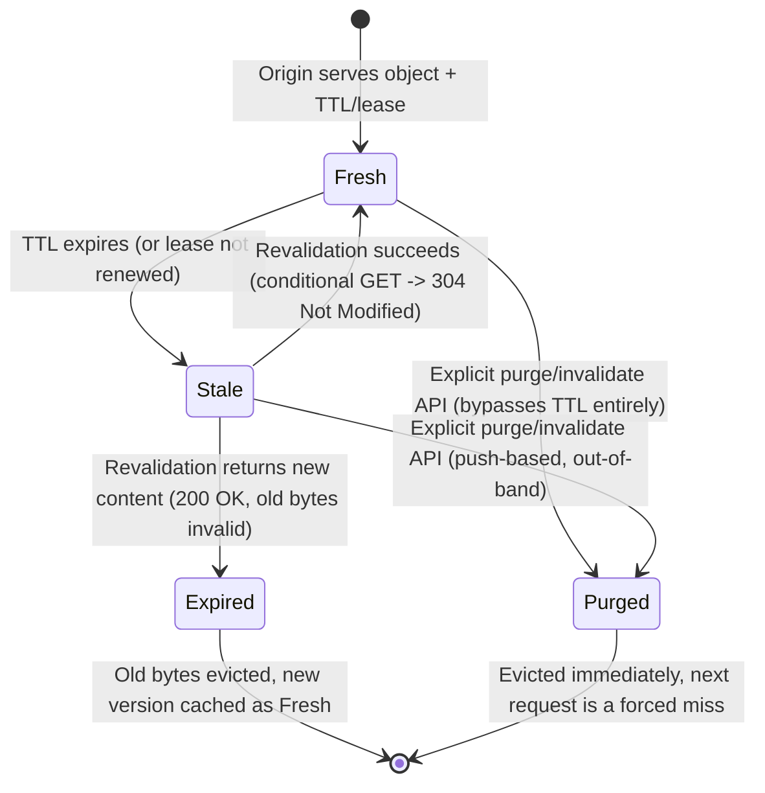
```mermaid
stateDiagram-v2
    [*] --> Fresh: Origin serves object + TTL/lease
    Fresh --> Stale: TTL expires (or lease not renewed)
    Stale --> Fresh: Revalidation succeeds (conditional GET -> 304 Not Modified)
    Stale --> Expired: Revalidation returns new content (200 OK, old bytes invalid)
    Fresh --> Purged: Explicit purge/invalidate API (bypasses TTL entirely)
    Stale --> Purged: Explicit purge/invalidate API (push-based, out-of-band)
    Expired --> [*]: Old bytes evicted, new version cached as Fresh
    Purged --> [*]: Evicted immediately, next request is a forced miss
```

### 11.3 Cache invalidation vs. TTL expiry

Candidates often use these two terms interchangeably. They're not the same mechanism:

| | Cache invalidation (purge) | TTL expiry |
|---|---|---|
| **Trigger** | Active, operator/origin-initiated push ("purge this now") | Passive, time-based — the proxy just checks the clock |
| **Speed** | Near-instant (propagation-dependent, e.g. Fastly's ~150ms) | Bounded by however long the TTL was set to |
| **Use case** | Emergency fix, legal takedown, urgent content correction | Routine, expected content refresh cycle |
| **Cost** | Requires a fan-out purge API/infrastructure reaching every edge | Free — built into normal cache bookkeeping |
| **Failure mode** | Purge message lost/delayed → some edges keep serving old content | Content silently stale until the next expiry check — no urgency signal |

### 11.4 How long should the TTL be?

| TTL length | Freshness | Origin load / cost | Best for |
|---|---|---|---|
| **Short** (seconds–minutes) | High — near real-time | Higher — frequent revalidation/refetch hits origin | Rapidly changing data: prices, news, near-live content |
| **Long** (hours–days–weeks) | Lower — tolerates staleness | Lower — origin rarely bothered | Static/immutable assets: versioned JS/CSS bundles, images, video segments |
| **Best practice** | — | — | Pair a long TTL with versioned/cache-busted URLs — you get the cost savings of a long TTL *without* the staleness risk, by bumping the URL on change instead of shortening the TTL |

#### 🆕 11.5 How does a purge actually reach thousands of edges?

§11.3 says purge is "near-instant, propagation-dependent" — here's the mechanism that makes that true. A naive implementation (control plane opens a connection to each edge one at a time and tells it to evict) doesn't scale past a few dozen PoPs — that's O(number of PoPs) sequential round trips. Production CDNs instead fan a purge out through a **pub/sub invalidation channel**: publish once, and a tree of subscribers (regional aggregators, then edge PoPs) receive and apply it in parallel.

```mermaid
sequenceDiagram
    participant Op as Operator / API
    participant Ctrl as Control plane
    participant Pub as Pub/sub channel
    participant R1 as Regional aggregator A
    participant R2 as Regional aggregator B
    participant E1 as Edge PoP (under A)
    participant E2 as Edge PoP (under B)
    Op->>Ctrl: Purge /object.jpg (or surrogate key "campaign-42")
    Ctrl->>Pub: Publish invalidation event once
    par Fan-out, parallel
        Pub->>R1: Deliver event
        Pub->>R2: Deliver event
    end
    par Parallel evict
        R1->>E1: Forward event
        R2->>E2: Forward event
    end
    E1->>E1: Evict / mark stale locally
    E2->>E2: Evict / mark stale locally
```

**Illustrative numbers** (label as illustrative — real figures vary by vendor): publishing once and fanning out through 2 tiers to 1,000 edge PoPs, with each hop adding tens of milliseconds, gets full propagation in the low single-digit seconds. That's roughly the ballpark real CDNs target (Fastly advertises sub-second for its instant-purge path; other vendors run tens-of-seconds). The number matters less than the **shape**: one publish, fan-out tree, parallel delivery — never "loop over every edge one at a time," which is O(PoPs) sequential calls instead of O(log PoPs) parallel hops.

**If X then Y:**
- Need to purge one specific known URL → purge-by-URL through the pub/sub channel.
- Need to purge a whole category (e.g., every image in a campaign) without knowing every URL → tag/surrogate-key purge, so one publish evicts every object sharing that tag.
- Propagation can't wait even a few seconds → don't rely on purge at all — use versioned URLs (§11.4) so there's nothing to invalidate in the first place.

**Cheat-sheet:**
- TTL = pull-style consistency (proxy checks); lease = push-style (origin notifies). Same push/pull duality as §7.
- Cache invalidation (purge) ≠ TTL expiry: purge is active and urgent, TTL is passive and routine.
- Short TTL = fresher but hammers the origin; long TTL = cheap but stale — versioned URLs get you both.
- Stale-while-revalidate serves stale content instantly while refreshing in the background — never make the user wait on a near-fresh object.
- A cached object's lifecycle: fresh → stale → revalidated (back to fresh), or expired/purged (evicted).
- Versioned/cache-busted URLs are the most scalable invalidation strategy — the old URL's TTL becomes irrelevant once nothing links to it.
- Bring up cache invalidation unprompted — it's the "hard problem" callback interviewers listen for.

## 12. Deployment: where do you physically put proxy servers?

| Placement | Description | Trade-off |
|---|---|---|
| **On-premises** | Small CDN-owned data centers near major **IXPs** (Internet Exchange Points) | Full control, but not literally inside the ISP — one more hop than off-premises |
| **Off-premises** | Proxy servers embedded **inside ISP networks** | Content is genuinely "one hop away" from the user (Akamai's model); requires ISP partnerships |

- **Google's split-TCP trick**: terminate the client's TCP connection at IXP-level infrastructure (avoiding a fresh 3-way handshake + slow-start all the way to a distant primary data center), then forward over an already-warm, high-bandwidth persistent connection to the real data center. This is a very "senior engineer" detail to drop — it shows you understand that latency isn't just about *content* placement, it's about *connection* placement.
- **Placement algorithms**: tools like **ProxyTeller** optimize for hit ratio, bandwidth, and response time; greedy/random/hotspot heuristics are alternatives.
- Predictive push (deciding *what* to pre-position where, before it's even requested) is an active research/ML area — mention it if the interviewer pushes on "how do you decide what to cache where."

## 13. CDN as a service vs. specialized (build) CDN — the classic buy-vs-build

| | Public CDN (buy) | Specialized/Private CDN (build) |
|---|---|---|
| **Examples** | Akamai, Cloudflare, Fastly, CloudFront | Netflix Open Connect (OCA), Google's private CDN, Facebook's |
| **Cost profile** | Lower upfront, scales with usage (can get very expensive at massive scale) | High upfront capex, cost decreases over time / at scale |
| **Control** | Limited — can't fix an outage you don't own; regional gaps if provider lacks PoPs there; some countries block specific CDN IP ranges/domains | Full control over routing, protocol, hardware, security posture |
| **Content risk** | Content sits on third-party infrastructure | Provider fully owns data-leakage risk |
| **When it makes sense** | Content delivery isn't your core differentiator; traffic is moderate | Content delivery IS the business (streaming video); traffic is massive and predictable enough to justify capex |

```mermaid
flowchart TD
    A[Buy vs. build a CDN?] --> B{Is content delivery<br/>your core product?}
    B -->|No| Buy[Buy: Akamai / Cloudflare /<br/>Fastly / CloudFront]
    B -->|Yes| C{Is traffic massive<br/>AND predictable?}
    C -->|No| Buy
    C -->|Yes| D{Need control over licensing,<br/>leak-prevention, custom protocol?}
    D -->|No| Buy
    D -->|Yes| Build[Build: Netflix Open Connect style<br/>high capex, full control]
```

### 13.1 Vendor deep-dive: CloudFront and Fastly

Naming a CDN vendor is table stakes; knowing one real, specific feature per vendor is what separates a strong answer.

**Amazon CloudFront:**
- **Lambda@Edge / CloudFront Functions** — run custom logic (auth checks, header rewriting, A/B-test routing, redirects) at the edge without a round trip to origin. Lambda@Edge runs full Node.js/Python Lambdas at a subset of edge locations; CloudFront Functions run a lighter, faster JS-only runtime at every edge location for simple, high-volume logic. This is AWS's answer to "dynamic content at the edge" from §8.
- **Regional edge caches** — an intermediate tier (fewer, larger locations than CloudFront's 400+ edge PoPs) sitting between edge and origin — functionally the same origin-shield/multi-tier-parent idea from §9.2: it holds a bigger, longer-tail cache so a miss at a small edge PoP often still resolves without touching origin.
- Deep AWS integration (S3, ALB, WAF, Shield) — the natural choice when the origin already lives in AWS.

**Fastly:**
- **Instant purge** — Fastly's signature feature: a purge (by single URL or by "surrogate key"/tag) propagates globally in well under a second, versus the tens-of-seconds-to-minutes typical of other CDNs. This is a real product name to cite when answering "how do you invalidate instantly across thousands of edges" (§17).
- **VCL (Varnish Configuration Language)** — Fastly exposes VCL so customers write real caching/routing logic (custom cache-key construction, request/response manipulation) instead of picking from a fixed set of dashboard toggles — more "programmable Varnish at global scale" than a black-box CDN.
- **Compute@Edge** — a WebAssembly-based edge compute platform (the successor to VCL-based edge logic) that runs Rust/JS/Go-compiled-to-Wasm at the edge for full application logic, not just caching rules — Fastly's answer to Cloudflare Workers/Lambda@Edge.
- Fastly deliberately runs **fewer, larger PoPs** than Akamai/Cloudflare — a philosophy trade-off (bigger caches, more compute per node, at the cost of being physically farther from some users) worth naming if asked "how many PoPs should a CDN have."

### Case study: why Netflix built Open Connect (a favorite interview deep-dive)
1. Commercial CDNs struggled to expand fast enough for Netflix's growth.
2. Cost of buying CDN capacity at Netflix's scale became larger than building it.
3. Video is Netflix's core product — protecting it and controlling delivery quality is existential, not incidental.
4. Netflix wanted end-to-end control: the player, the network path, and the server — impossible when renting from a third party.
5. Custom HTTP + TCP stack on OCA lets Netflix detect and troubleshoot network issues directly.
6. Netflix wanted to cache popular titles for a long time — cost-prohibitive on a public CDN at their retention/volume needs.

**How Open Connect actually works:** OCAs are placed inside ISPs / at IXPs. They **do not store user data** — they (a) report health, learned routes, and cached-content info to a control plane hosted in AWS, and (b) serve cached video to users. Netflix achieves a **~95% cache hit ratio** this way. Public CDNs remain a fallback when OCA capacity is insufficient or during failures — this is a hybrid architecture, not all-or-nothing.

**Interview cheat-sheet:** buy when delivery isn't your differentiator; build when (a) delivery IS the product, (b) traffic is astronomically large and predictable, (c) you need control over data protection/licensing (Netflix's content contracts require strict leak prevention), or (d) commercial CDN costs at your scale exceed the capex+opex of building.

## 14. API design (how to talk through the interfaces)

If asked to sketch APIs for a CDN, six core operations map cleanly onto components:

```
retrieveContent(proxyserver_id, content_type, content_version, description)   // proxy → origin
deliverContent(origin_id, server_list, content_type, content_version, description)  // origin → proxies (push)
requestContent(user_id, content_type, description)                            // client → proxy
searchContent(proxyserver_id, content_type, description)                      // proxy → peer proxies in same PoP
updateContent(proxyserver_id, content_type, description)                      // proxy → peer proxies (e.g., after edge script mutation)
// deleteContent — reuses standard cache eviction policy (LRU/LFU/TTL), not a bespoke API
```

Note the **searchContent** design trade-off: flooding the query to every peer proxy in a PoP is simple but wasteful; maintaining a shared PoP-local index (a small distributed metadata store of "what's cached where") avoids the flood at the cost of extra consistency bookkeeping. This is a nice micro system-design-within-a-design-question to discuss if pushed.

## 15. Security: scrubber servers and DDoS

- Scrubber servers sit in the request path and are activated specifically **when an attack is detected** — traffic gets scrubbed/cleaned, then forwarded to the real edge proxy. This is exactly the pattern behind **Cloudflare's DDoS mitigation** and **AWS Shield**.
- **Anycast is itself a DDoS defense**: attack traffic naturally disperses across every edge server advertising the same IP (BGP spreads the load), instead of concentrating on one target.
- Heartbeat/health-checks let the routing system silently route around a proxy that's unhealthy or under attack.
- Because a CDN masks the origin's real IP, it also reduces the attack surface directly exposed to the internet — origin-shielding is a security feature, not just a performance one.

## 16. Evaluating the design against non-functional requirements

| Requirement | How the design satisfies it |
|---|---|
| **Performance** | RAM-first serving at proxies; proxies placed physically near users/inside ISPs; long-tail content on SSD/HDD (still far faster than a WAN round trip to origin); layered proxy hierarchy avoids one giant fan-out |
| **Availability** | Cached content survives origin outages; unhealthy proxies are routed around; redundant replicas across proxies remove single points of failure; load balancers spread load among healthy proxies |
| **Scalability** | Horizontal scale-out by adding edge proxies (read replicas, essentially); multi-tier hierarchy absorbs storage/fan-out limits of any single proxy |
| **Reliability & security** | No SPOF via redundancy + maintenance rotation; scrubber servers + heartbeat health checks; specialized/private CDNs for content-leakage-sensitive businesses |

## 17. How this shows up in a FAANG interview

### 17.1 Interview playbook — how to open and structure the discussion

```mermaid
flowchart TD
    A[Interviewer describes the system] --> B{Any signal phrase?<br/>global users / static+video assets /<br/>protect origin from load / traffic spike}
    B -->|No| Z[CDN probably isn't the focus —<br/>mention briefly if relevant, move on]
    B -->|Yes| C[Open with the 3-pillar definition:<br/>caching + routing + security]
    C --> D[State push vs. pull per content type<br/>not CDN-wide]
    D --> E[Explain routing:<br/>DNS redirection vs. anycast]
    E --> F{Content includes<br/>dynamic/personalized data?}
    F -->|Yes| G[Cover edge compute / ESI / DASH —<br/>the 'not just static' differentiator]
    F -->|No| H[Stick to push + long TTL,<br/>say so explicitly]
    G --> I[Bring up cache invalidation<br/>unprompted: TTL vs. lease]
    H --> I
    I --> J{Interviewer probes buy vs. build,<br/>or scale is extreme?}
    J -->|Yes| K[Discuss buy vs. build trade-off<br/>Netflix Open Connect as reference]
    J -->|No| L[Skip — assume public CDN]
    K --> M[Close with security:<br/>scrubbers, anycast's DDoS side-benefit]
    L --> M
    M --> N[Validate against non-functional reqs:<br/>performance, availability, scalability, security]
```

**Signal phrases that mean "the interviewer wants CDN knowledge":**
- "Users are global / worldwide" + "minimize latency"
- "Serve static assets / images / video" at scale
- "Protect the origin from being overwhelmed"
- Any **video streaming** system (YouTube, Netflix, Twitch) — always triggers a CDN + adaptive bitrate discussion
- Any **social feed with images** system (Instagram, Facebook, Twitter) — triggers CDN for media, not for the feed itself
- "How would you reduce load on your database/origin during a traffic spike" — CDN + cache is a valid partial answer even outside a "design a CDN" question

**What a strong candidate does that a mediocre one doesn't:**
1. Distinguishes **push vs. pull** and picks per content type, not CDN-wide.
2. Explains routing (**DNS redirection vs anycast**) instead of hand-waving "it finds the nearest server."
3. Brings up **cache invalidation** (TTL vs. lease) unprompted — this is the classic hard-caching-problem callback.
4. Knows CDNs help with **dynamic** content too (edge scripting, ESI), not just static files — this is the biggest differentiator.
5. Can articulate the **buy vs. build** trade-off with a real example (Netflix Open Connect) instead of assuming everyone just uses Cloudflare/Akamai.
6. Mentions **security** (scrubber servers, DDoS, anycast's side-benefit) without being asked.

**Common follow-up traps:**
- *"What if the nearest proxy doesn't have the content?"* → escalate to parent proxy in the tier, then to origin; discuss cold-start / cache-miss storm risk on a brand-new popular object (thundering herd — mention **request coalescing** at the proxy, or an **origin shield** (§9.2), so N simultaneous misses for the same key become 1 origin fetch).
- *"How do you invalidate a cached object across thousands of edge proxies instantly?"* → there's no free lunch: either short TTL (accept some staleness), a purge API that fans out invalidation messages (used by real CDNs for "purge by URL/tag," e.g. Fastly's sub-second purge), or versioned URLs (cache-bust by changing the URL itself — most scalable, since the old URL's TTL is irrelevant once nobody links to it).
- *"How would you handle a viral/hot object overwhelming one proxy?"* → replicate that specific object to more proxies dynamically (popularity-aware replication), or route requests for it across a wider anycast/load-balanced set.

## 18. Active Recall — Test Yourself

Reading a diagram and being able to redraw it from a blank page are different skills. Cover the guide and answer these; expand each to check. This is what actually makes the material stick.

<details>
<summary>1. What are the three pillars of a CDN? (Not "caching" alone.)</summary>
Caching, routing, and security/traffic-shielding. Miss one and it's just "a cache," not a CDN.
</details>

<details>
<summary>2. Name the one idea that shows up in both §7 (push/pull CDN) and §11 (TTL/lease). Where else does it show up outside this chapter?</summary>
Push = proactive, someone ships before being asked. Pull = reactive, fetch on demand. Outside this chapter: fan-out-on-write vs. fan-out-on-read in feed systems (Twitter/Instagram).
</details>

<details>
<summary>3. A proxy misses on a request. Trace the fallback path, in order.</summary>
Edge proxy → (origin shield, if present) → parent (tier-1) proxy → origin server. Each hop only happens if the previous one also misses.
</details>

<details>
<summary>4. Why is "nearest" not the same as "geographically closest"?</summary>
Nearest = shortest network path × available bandwidth, plus current request load. A geographically close proxy on a congested link can be "farther" than a distant one on a fat, unloaded pipe.
</details>

<details>
<summary>5. Why does anycast double as a DDoS defense, without anyone designing it that way on purpose?</summary>
BGP naturally spreads traffic to the topologically nearest of many servers sharing one IP — so attack traffic gets dispersed across all of them instead of concentrating on a single target.
</details>

<details>
<summary>6. Give one concrete reason Netflix built Open Connect instead of buying CDN capacity, and name the one thing Netflix's OCA servers explicitly do NOT store.</summary>
Reason: e.g. video is Netflix's core revenue source, so protecting it and controlling delivery quality end-to-end was worth the capex (any one of the six listed reasons works). OCAs do not store user data — only cached content + health/route reporting.
</details>

<details>
<summary>7. Why would you choose a lease over a plain TTL, and what's the cost of that choice?</summary>
Choose a lease when you need near-real-time propagation of changes and writes are infrequent — it minimizes wasted messages versus polling. Cost: more bookkeeping, since the origin must track per-proxy lease state.
</details>

<details>
<summary>8. What's the fastest way to invalidate one specific object across thousands of edge proxies "instantly," and why is it the most scalable option?</summary>
Versioned/cache-busted URLs (change the URL, not the cached object). It's the most scalable because you never have to touch the old cached copies at all — their TTL becomes irrelevant the moment nothing links to that URL anymore.
</details>

<details>
<summary>9. A single object suddenly goes viral and is overwhelming one proxy. What do you do — and is this the same fix as a normal load-balancing problem?</summary>
Dynamically re-replicate that specific hot object to more proxies (popularity-aware replication), or spread requests for it across a wider anycast/load-balanced set. Not quite the same as generic load balancing — it's content-aware, targeting one key, not just spreading connections evenly.
</details>

<details>
<summary>10. Redraw the full request lifecycle diagram (§6.1) from memory: which 7 components does a request pass through, in order, on a cache miss?</summary>
User → DNS/routing system → (scrubber, only if under attack) → edge proxy (miss) → parent/tier-1 proxy (miss) → origin → back down through parent → edge proxy → user, with accounting reported to the management system, which feeds back into routing.
</details>

<details>
<summary>11. What's the difference between cache invalidation and TTL expiry, and which one is "the hard problem"?</summary>
TTL expiry is passive and time-based — the proxy just checks the clock. Cache invalidation (purge) is active and operator-initiated — "purge this now," regardless of remaining TTL. Invalidation is "the hard problem" because it requires reliably reaching every edge that might hold a stale copy, fast, without a free/automatic clock to fall back on.
</details>

<details>
<summary>12. A cached object is "stale." What are its two possible next states, and what causes each?</summary>
Revalidated (back to Fresh) if a conditional GET returns 304 Not Modified; Expired/Purged if revalidation returns new content, or an explicit purge is issued. Stale-while-revalidate lets the proxy serve the stale copy immediately while this check happens in the background.
</details>

<details>
<summary>13. Request coalescing and an origin shield both stop origin overload on a cold cache — don't they solve the same problem?</summary>
No. Request coalescing handles many concurrent misses for the *same key at the same edge* — the first request becomes the leader and fetches, the rest wait, one fetch total per PoP. An origin shield handles many concurrent misses for the *same key across many different edges* — it collapses all of their fetches into one. They stack: coalescing kills the herd within a PoP, the shield kills the herd across PoPs.
</details>

<details>
<summary>14. How does a purge reach thousands of edge PoPs without the control plane looping over them one at a time?</summary>
Publish the invalidation once to a pub/sub channel; a fan-out tree (regional aggregators → edge PoPs) delivers and applies it in parallel. That's roughly O(log PoPs) parallel hops instead of O(PoPs) sequential round trips — the same shape as the distribution system's tree fan-out for content (§9.1), just applied to invalidation.
</details>

## 19. Golden Rules

Non-negotiables — if any of these is missing from your answer, the interviewer will probe until it surfaces.

1. Always name all three CDN pillars — caching, routing, security — never just "cache."
2. Never say "CDN = static content only" — dynamic acceleration (edge compute, ESI, DASH) is a first-class use case, not an edge case.
3. Cache invalidation is the hard problem, not caching itself — bring it up unprompted.
4. "Nearest" means lowest network distance + load, never plain geographic distance.
5. Push and pull are picked per content type, not CDN-wide — and the same duality reappears as TTL vs. lease.
6. Anycast isn't just routing — it's also a free DDoS defense; mention both when it comes up.
7. Buy vs. build is a real trade-off, not a foregone conclusion — cite Netflix Open Connect, not just "everyone uses Cloudflare."
8. A CDN shields the origin, it doesn't replace it — the origin still exists, still gets hit on misses, and still needs its own resilience story.
9. Thundering herd has two distinct fixes at two distinct scopes — request coalescing (same key, same edge) and an origin shield (same key, many edges) — know both, and know they stack rather than substitute for each other.

## Master Cheat Sheet

**Definition:** CDN = distributed proxy/cache layer at the network edge + intelligent request routing + traffic shielding, sitting between clients and an origin. It is not "just a reverse proxy" — it's the reverse-proxy pattern applied at global, geographically-distributed scale.

**Three pillars:** caching, routing, security. Say all three.

**Numbers to know:**
- Latency budgets: VoIP < 150ms, interactive < 200ms, video streaming = seconds (buffered) OK.
- US East↔West RTT ≈ 63ms; US↔Africa RTT ≈ 226ms.
- Netflix + YouTube + Prime Video ≈ 80% of internet traffic.
- Akamai historically: 15–30% of web traffic, ~30 Tbps, one hop from 90% of users.
- Netflix Open Connect: ~95% cache hit ratio.
- Capacity math (500M DAU, 20 req/user/day, 2KB objects, 95% hit ratio): ~116K avg / ~350K peak QPS at the edge → only ~5.8K–17.5K QPS reaches origin (>20x reduction); ~20TB/day total, but only ~1TB/day actually hits origin egress.

**Push vs Pull:** push = static, proactive, higher replicas/availability, higher storage cost. Pull = dynamic, reactive, lower storage cost, origin hit on miss/expiry. Real systems use both.

**Routing:** DNS redirection (two-step, short TTL, considers distance+load — Akamai's approach) > Anycast (one IP, BGP-routed, also a DDoS defense) > client multiplexing / HTTP redirect (simple but naive).

**Consistency:** polling (TTR, wasteful) → TTL (expiry-based, standard) → leases (origin pushes notifications, fewest messages, adaptive). Stale-while-revalidate serves stale instantly while refreshing async in the background. Invalidation (active purge) ≠ TTL expiry (passive clock). Short TTL = fresh but costly; long TTL = cheap but stale — versioned URLs get both.

**Placement:** on-premises (near IXPs) vs off-premises (inside ISP, Akamai/Netflix style, "one hop away"). Google uses split-TCP at IXP-level infra to avoid slow-start/handshake to distant origin. Origin shield = single consolidated tier between edge and origin that coalesces thundering-herd misses into one origin fetch (CloudFront: Origin Shield; Fastly: shielding).

**Thundering herd, two scopes:** request coalescing = one edge, one key, first request leads, rest wait (single-flight). Origin shield = many edges, one key, shield collapses all their fetches into one. They stack, they don't substitute.

**Purge propagation:** never loop over edges one at a time (O(PoPs) sequential) — publish once to a pub/sub channel, fan out through a tree of regional aggregators to every edge in parallel (O(log PoPs)). Same tree-fan-out shape as content distribution (§9.1), applied to invalidation instead.

**Architecture evolution (how to narrate a build-up):** v1 single origin → v2 a few regional edge caches + DNS routing → v3 anycast + origin shield + pub/sub purge, once PoP count grows from a handful to hundreds/thousands.

**Buy vs build:** buy (Akamai/Cloudflare/Fastly/CloudFront) unless delivery is your core product at massive, predictable scale and you need full control (Netflix Open Connect). CloudFront = Lambda@Edge/CloudFront Functions + regional edge caches. Fastly = instant (sub-second) purge via VCL + Compute@Edge (Wasm-based edge compute).

**Dynamic content:** edge scripting/serverless at the proxy, compression (Railgun), ESI (partial page caching), DASH/HLS + byte-range for adaptive video.

**Components to name in order:** clients → routing system → scrubber servers → edge proxies → distribution system → origin servers → management system.

**Failure/edge-case answers:** hierarchical fallback (edge → parent/shield → origin) for misses; request coalescing for thundering herd; versioned URLs or purge APIs for instant invalidation; popularity-aware re-replication for hot-object overload; anycast + scrubbers for DDoS.
