# Sequencer / Unique ID Generator — FAANG Interview Guide

> **Enhancement notes:** this pass added the pieces a FAANG interviewer expects that were thin or missing, marked `🆕`, without touching sections that already worked.
> - New **§3 API design** (call shapes: in-process vs sidecar vs range-lease vs per-ID network call, plus a worked ID-decode example) and new **§4 High-level architecture** (v1 centralized counter → v2 decentralized Snowflake-per-node → v3 + coordination service, with a centralized-vs-decentralized trade-off table) — both were absent before.
> - New **§5.6 Worker ID assignment & coordination** — the "how do two workers avoid claiming the same worker ID" gap: static config vs MAC-hash vs ZooKeeper/etcd ephemeral znodes vs DB lease, plus a claim/crash-release sequence diagram.
> - New diagrams: a `packet-beta` bit-layout diagram for Snowflake, dedicated sequence-overflow and clock-skew decision flowcharts, a clock-moved-backward sequence diagram with a Client/Worker/Clock cast, and the three architecture-evolution flowcharts above.
> - New memorability aids: a Snowflake-variants table (Twitter/Discord/Instagram/Sonyflake, numbers flagged as illustrative), the `1+41+10+12=64` mnemonic, and "if X then Y" recall pairs for overflow and clock skew, folded into the existing cheat-sheet.
> - Light clarity edits: split two dense, multi-clause sentences (UUID cons, Snowflake clock-drift cons) into shorter bullets/sentences; everything else — the escalation narrative, causality section, Spanner numbers, decision-guide flowchart, cheat-sheet structure — was already strong and left as written.

## 0. The whole chapter in one picture

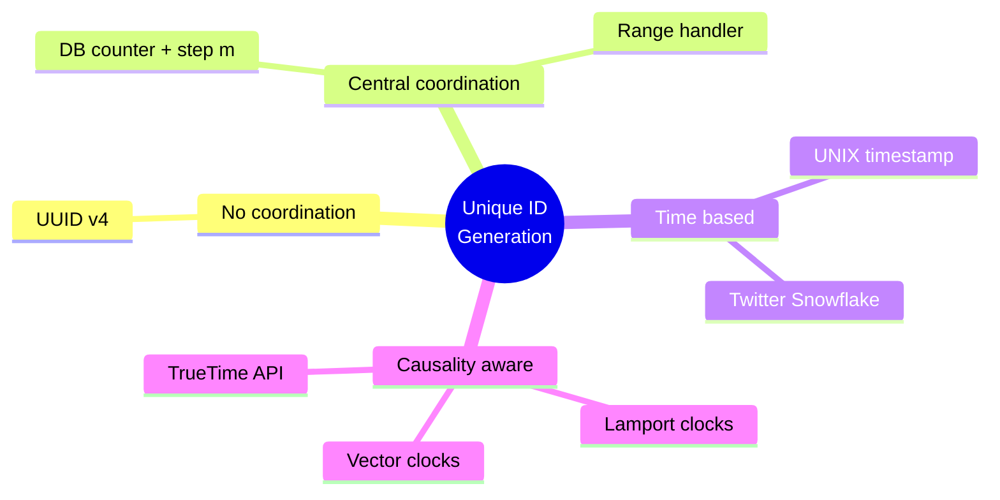
```mermaid
mindmap
  root((Unique ID<br/>Generation))
    No coordination
      UUID v4
    Central coordination
      DB counter + step m
      Range handler
    Time based
      UNIX timestamp
      Twitter Snowflake
    Causality aware
      Lamport clocks
      Vector clocks
      TrueTime API
```

Read this tree left-to-right as **"how much do nodes need to talk to each other, and what do they get for it."** No coordination is cheapest and weakest; causality-aware is most expensive and strongest. Every design below sits somewhere on that line — locate it there first, then recall the details.

## 1. What it is & why it exists

A **sequencer** is a building block that hands out **globally unique identifiers** (and sometimes **ordering/causality information**) for events, rows, or objects in a distributed system. Think of it as the distributed-systems replacement for a single database's `AUTO_INCREMENT` column — except there is no longer one server that can simply count upward, because there are *many* independent writers (application servers, database shards, data centers) that must agree on non-colliding values without talking to each other on every request.

**Mental model:** in a single-node system, uniqueness and ordering are free — one counter, one lock, done. In a distributed system, uniqueness and ordering become a **coordination problem**, and coordination is expensive (network round trips, consensus, single points of failure). Every design in this chapter is a different trade-off between:

- **Coordination cost** (how often nodes must talk to agree on values)
- **ID size** (64-bit vs 128-bit vs variable)
- **Causality/ordering guarantees** (none → weak/time-based → strict/logical → global-total-order)

**Why interviewers care:** almost every "design X" interview (Twitter, Instagram, WhatsApp, Uber, YouTube) needs unique IDs for posts/messages/trips/videos. If you just say "use a UUID" without being asked to justify it, you're leaving depth on the table. This is a favorite **follow-up/deep-dive** topic precisely because it looks simple but has 6+ layers of subtlety.

**Canonical real-world uses:**
- Primary keys in horizontally-sharded databases (no central auto-increment).
- Distributed tracing IDs (Facebook's **Canopy** uses a `TraceID` to stitch together hundreds of microservice calls for one request; Google's **Dapper**/OpenTelemetry `trace_id`/`span_id` do the same).
- Twitter Tweet IDs, Instagram media IDs, Discord message IDs (all use Snowflake-style IDs).
- Idempotency keys for payments (duplicate order IDs → double charges — a very real production incident category).
- Last-write-wins conflict resolution in key-value stores (Dynamo/Cassandra use timestamps/vector clocks for exactly this).

---

## 2. Requirements to state up front

Always open a sequencer deep-dive by enumerating requirements — interviewers reward this because it shows you know the design space has more than one right answer depending on which requirement dominates.

| Requirement | What it means |
|---|---|
| **Uniqueness** | No two events ever get the same ID (or, for probabilistic schemes, collision probability is negligible) |
| **Scalability** | Must sustain the required throughput — course baseline is **≥ 1 billion IDs/day** (~11,574 IDs/sec average, plan for higher peak) |
| **High availability** | ID generation can't have a single point of failure (SPOF) — it's on the critical path of almost every write |
| **64-bit numeric** | Fits a `long`/`bigint` column, indexes fast, sortable as a number — this is a size/performance constraint, not just aesthetics |
| **(Optional) Causality / time-sortability** | Do consumers need to infer "did A happen before B?" from the ID alone? This is the requirement that turns a "unique ID generator" into a "sequencer with causality" |
| **(Optional) Unguessability** | Should IDs leak business metrics (order volume, growth rate) to competitors if sequential? |

**Capacity math worth memorizing:**
```
2^64 ≈ 1.8447 × 10^19 total values
At 1B IDs/day → 365B/year → 2^64 / 365×10^9 ≈ 50.5 million years to exhaust
```
This is why 64 bits is "enough forever" — say this number cold, it signals you actually did the math instead of parroting "64 bits is standard."

---

## 3. 🆕 API design

A sequencer is infrastructure, not a product feature — but stating its API contract out loud is still worth 60 seconds in an interview. It shows you're thinking about *how callers actually get an ID*, not just how the ID is shaped internally.

**Two call shapes cover almost every real system:**

| Call shape | What the caller does | Network cost | Matches which approach |
|---|---|---|---|
| In-process function call | `generator.nextId() -> uint64`, a library linked into the app | None — pure CPU | Snowflake embedded per app process (§5.5) |
| Local sidecar / daemon call | `GET http://localhost:PORT/next-id` over loopback | Sub-millisecond, no real network hop | Snowflake as a shared local service for polyglot apps that can't embed the library |
| Remote range lease | `POST /range/lease` once, then burn through it locally | One round trip amortized over an entire range (e.g. 100,000 IDs) | Range handler (§5.3) |
| Remote per-ID call | `GET /next-id` over the network, once per ID | One round trip *per ID* | Central DB counter — the anti-pattern, don't propose this at scale |

The pattern to notice: **the closer coordination gets to "once per ID," the worse it scales.** Good designs push the network call to "once per range" (range handler) or "zero, ever, per ID" (embedded Snowflake).

**Worked example — decoding a Snowflake response.** Say `GET /next-id` returns:

```json
{ "id": 419430402093063 }
```

That single 64-bit integer decodes back into its three fields by shifting and masking (illustrative numbers, not a real production ID):

```
id            = 419,430,402,093,063
timestamp     = id >> 22               = 100,000,000   (ms since custom epoch ≈ 27.8 hours)
worker_id     = (id >> 12) & 0x3FF     = 511
sequence      = id & 0xFFF             = 7
```

Any client that needs the creation time back out of an ID (e.g. "show me all posts from the last hour" without a separate `created_at` index) just re-derives it with this same shift-and-mask — no extra lookup needed. That's the payoff of packing the timestamp into the ID itself.

**Non-functional API notes worth stating:**
- **Latency budget:** embedded/in-process generation should be low single-digit *microseconds*; a sidecar call should stay under ~1ms; anything that does a real network round trip per ID (the anti-pattern) is already in double-digit milliseconds and won't hit the throughput target.
- **Error modes are different from a normal CRUD API:** there's no "404" — the two real failure responses are "sequence exhausted this millisecond, retry after a spin" (see §5.5) and "clock skew detected, this worker is halted" (503-style, pull the node from rotation).
- **Idempotency doesn't apply the usual way:** unlike a payment API, callers aren't retrying with the *same* idempotency key — every successful call should mint a *new* ID. If a caller times out and retries, they simply get (and should use) a different ID; don't try to make ID generation itself idempotent.

---

## 4. 🆕 High-level architecture

Walk the architecture as three versions, each fixing the previous version's biggest operational problem. This is a different axis than §5's UUID→TrueTime escalation (that one is about *which algorithm*; this one is about *how the generation service is deployed and coordinated*).

#### 🆕 v1 — Centralized counter service (naive)

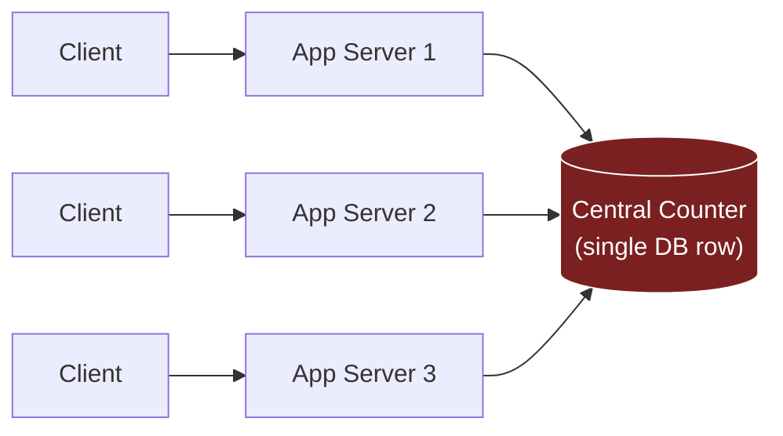
```mermaid
flowchart LR
    C1[Client] --> AS1[App Server 1]
    C2[Client] --> AS2[App Server 2]
    C3[Client] --> AS3[App Server 3]
    AS1 --> CTR[("Central Counter\n(single DB row)")]
    AS2 --> CTR
    AS3 --> CTR
    style CTR fill:#7a2020,color:#fff,stroke:#fff
```

Every app server calls out to one counter for every single ID. It's simple and trivially consistent — and it's a bottleneck and a SPOF, per §5.2. This is where most people's first instinct lands; naming its failure mode out loud is the first sign of seniority.

#### 🆕 v2 — Decentralized generation on each node

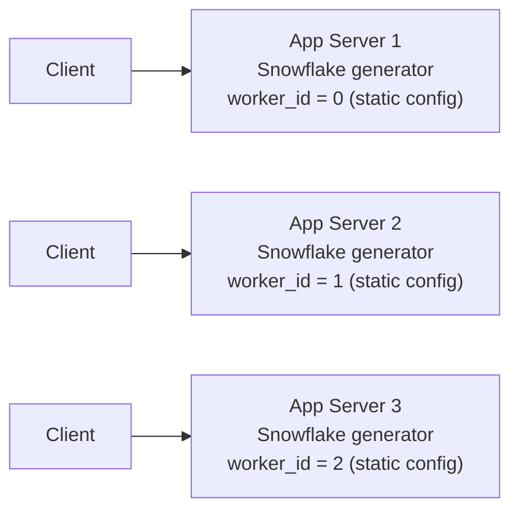
```mermaid
flowchart LR
    C1[Client] --> AS1["App Server 1\nSnowflake generator\nworker_id = 0 (static config)"]
    C2[Client] --> AS2["App Server 2\nSnowflake generator\nworker_id = 1 (static config)"]
    C3[Client] --> AS3["App Server 3\nSnowflake generator\nworker_id = 2 (static config)"]
```

No shared service, no network call per ID, no SPOF for generation itself — throughput now scales linearly with the number of app servers. The new risk: `worker_id` is just a number in a config file. Copy a config, forget to bump it, and two servers silently emit colliding IDs. This version also has zero protection against a server's clock jumping backward.

#### 🆕 v3 — Coordination service for worker-ID assignment + clock-skew handling

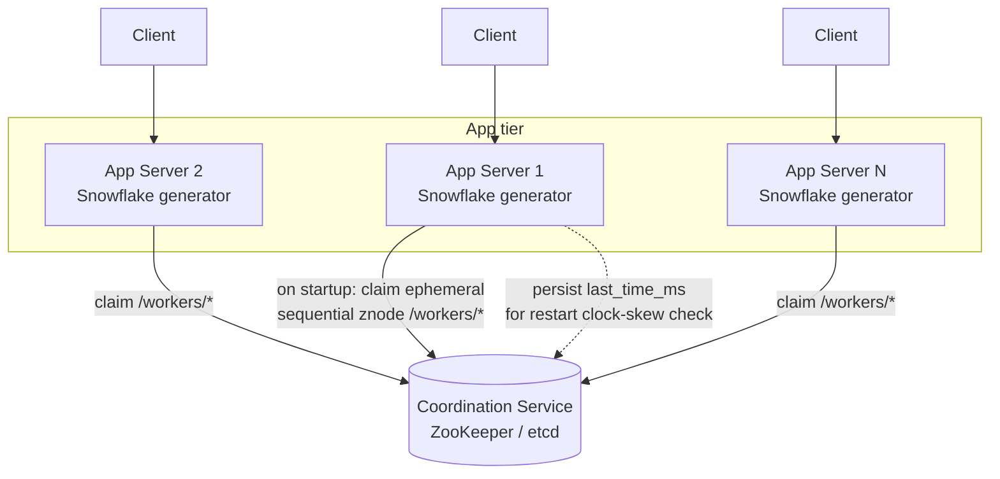
```mermaid
flowchart TB
    subgraph fleet["App tier"]
        AS1["App Server 1\nSnowflake generator"]
        AS2["App Server 2\nSnowflake generator"]
        AS3["App Server N\nSnowflake generator"]
    end
    ZK[("Coordination Service\nZooKeeper / etcd")]
    AS1 -- "on startup: claim ephemeral\nsequential znode /workers/*" --> ZK
    AS2 -- "claim /workers/*" --> ZK
    AS3 -- "claim /workers/*" --> ZK
    AS1 -. "persist last_time_ms\nfor restart clock-skew check" .-> ZK
    C1[Client] --> AS1
    C2[Client] --> AS2
    C3[Client] --> AS3
```

Worker IDs are now assigned dynamically and released automatically on crash (details in §5.6), and each node independently detects and reacts to its own clock moving backward (§5.5's flowchart). This is the version worth describing as your target end state — it keeps v2's "no network call per ID" property while removing v2's two silent-failure modes.

**The centralized-vs-decentralized trade-off, made explicit:**

| | Centralized (v1) | Decentralized (v2/v3) |
|---|---|---|
| Coordination | Every ID request talks to one authority | Coordination happens once, at worker startup (and never again per ID) |
| Throughput ceiling | Bounded by one node/row (see §7's ~100/sec Spanner number for the extreme case) | Scales linearly — add workers, add capacity |
| SPOF | Yes, unless the counter itself has HA failover | No single point for generation; the coordination service is only a dependency at startup |
| Global ordering | Strict, if the counter is single-threaded | Time-sortable, not strictly totally ordered across workers |
| Blast radius of a failure | All ID generation halts | Only the affected worker's IDs are affected |

---

## 5. The five approaches — progressively solving each other's weaknesses

Structure your answer as a **narrative of escalating fixes**, not a static list — that's what separates a senior answer from a junior one. Each approach fixes the prior one's biggest flaw and introduces a new one.

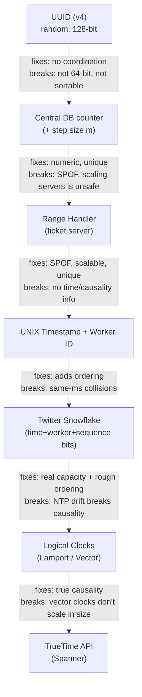
```mermaid
flowchart TD
    A["UUID (v4)\nrandom, 128-bit"] -->|"fixes: no coordination\nbreaks: not 64-bit, not sortable"| B["Central DB counter\n(+ step size m)"]
    B -->|"fixes: numeric, unique\nbreaks: SPOF, scaling servers is unsafe"| C["Range Handler\n(ticket server)"]
    C -->|"fixes: SPOF, scalable, unique\nbreaks: no time/causality info"| D["UNIX Timestamp + Worker ID"]
    D -->|"fixes: adds ordering\nbreaks: same-ms collisions"| E["Twitter Snowflake\n(time+worker+sequence bits)"]
    E -->|"fixes: real capacity + rough ordering\nbreaks: NTP drift breaks causality"| F["Logical Clocks\n(Lamport / Vector)"]
    F -->|"fixes: true causality\nbreaks: vector clocks don't scale in size"| G["TrueTime API\n(Spanner)"]
```

**Same seven designs plotted as a trade-off space** — this is the single image to reconstruct from memory when you're deciding what to propose live in an interview:

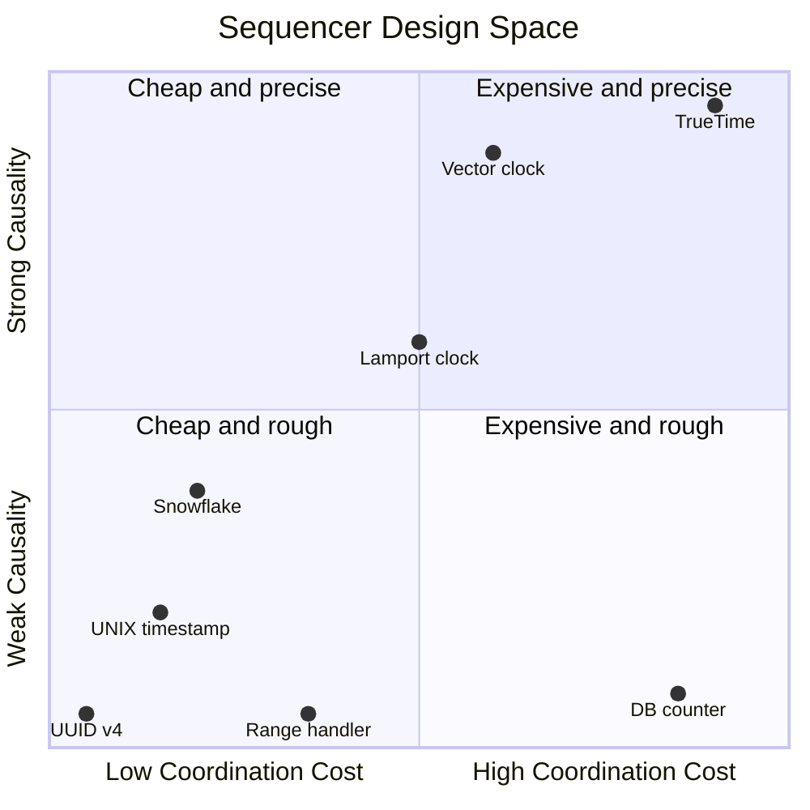
```mermaid
quadrantChart
    title Sequencer Design Space
    x-axis Low Coordination Cost --> High Coordination Cost
    y-axis Weak Causality --> Strong Causality
    quadrant-1 Expensive and precise
    quadrant-2 Cheap and precise
    quadrant-3 Cheap and rough
    quadrant-4 Expensive and rough
    UUID v4: [0.05, 0.05]
    DB counter: [0.85, 0.08]
    Range handler: [0.35, 0.05]
    UNIX timestamp: [0.15, 0.2]
    Snowflake: [0.2, 0.38]
    Lamport clock: [0.5, 0.6]
    Vector clock: [0.6, 0.88]
    TrueTime: [0.9, 0.95]
```

Everything in the bottom-right quadrant (DB counter) is a trap: high coordination cost for almost no causality benefit — it's only there because it's the naive "just mimic auto-increment" instinct. The interesting frontier runs diagonally from UUID up to TrueTime; whichever point on that diagonal you pick should be justified by the requirement that's actually driving it (throughput vs. ordering vs. concurrency-detection).

### 5.1 UUID (v4, random)

- 128-bit, e.g. `123e4567-e89b-12d3-a456-426614174000`. ~10^38 space.
- **No coordination needed** — each server generates its own, independently. Trivially scalable and available.
- **Cons:**
  - Not 64-bit — breaks the size requirement outright.
  - String/hex form hurts B-tree primary-key indexing: random inserts have poor locality and fragment the index, hurting write throughput (the same reason you avoid random UUIDs as clustered/primary keys in MySQL InnoDB).
  - Only *probabilistically* unique — birthday-paradox collision risk exists, just vanishingly small.
  - Not monotonically increasing over time.
- **When to actually propose it in an interview:** distributed tracing span IDs, idempotency keys, client-generated correlation IDs — anywhere pure uniqueness matters more than size/order.

### 5.2 Central database counter

- Mimic `AUTO_INCREMENT`: one DB hands out the next value and increments.
- **Fix for scaling:** instead of `+1`, increment by `m` = number of DB servers, each server owns a residue class mod `m` (server 1 → 1,4,7,...; server 2 → 2,5,8,...).
- **Cons — the classic interview gotcha:** this is a SPOF, and worse, **adding/removing a server is unsafe**. Concrete failure case to narrate: `m=3`, server A owns {1,4,7,...}, B owns {2,5,8,...}, C owns {3,6,9,...}. B goes down, you reconfigure to `m=2`. Server A's next ID becomes 9 — but C already issued 9. **Collision.** This example is worth memorizing verbatim; it's exactly the kind of "walk me through a concrete failure" narrative interviewers want.

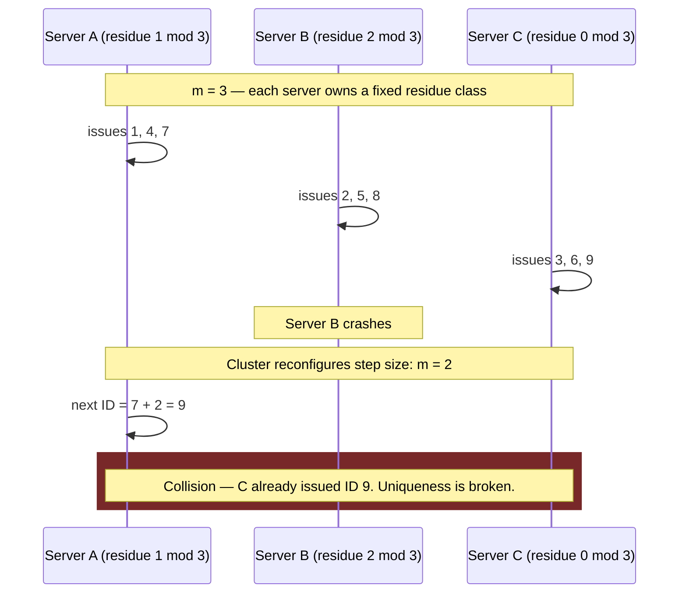
```mermaid
sequenceDiagram
    participant A as Server A (residue 1 mod 3)
    participant B as Server B (residue 2 mod 3)
    participant C as Server C (residue 0 mod 3)
    Note over A,C: m = 3 — each server owns a fixed residue class
    A->>A: issues 1, 4, 7
    B->>B: issues 2, 5, 8
    C->>C: issues 3, 6, 9
    Note over B: Server B crashes
    Note over A,C: Cluster reconfigures step size: m = 2
    A->>A: next ID = 7 + 2 = 9
    rect rgb(120,40,40)
    Note over A,C: Collision — C already issued ID 9. Uniqueness is broken.
    end
```

- Also doesn't scale across multiple data centers (cross-DC coordination on every write is too slow).

### 5.3 Range handler ("ticket server" pattern)

- A central **range handler microservice** partitions the ID space into large contiguous ranges (e.g., 1–1,000,000 / 1,000,001–2,000,000 / ...) and leases a whole range to an application server on request.
- The app server keeps the range's current position in a **local variable**, hands out IDs by incrementing it in-memory (no network call per ID!) — only re-contacts the range handler when the range is exhausted.
- Range handler tracks range state (taken/available) in **replicated storage**, and has a **failover replica** to eliminate its own SPOF — it recovers state from the latest checkpoint.
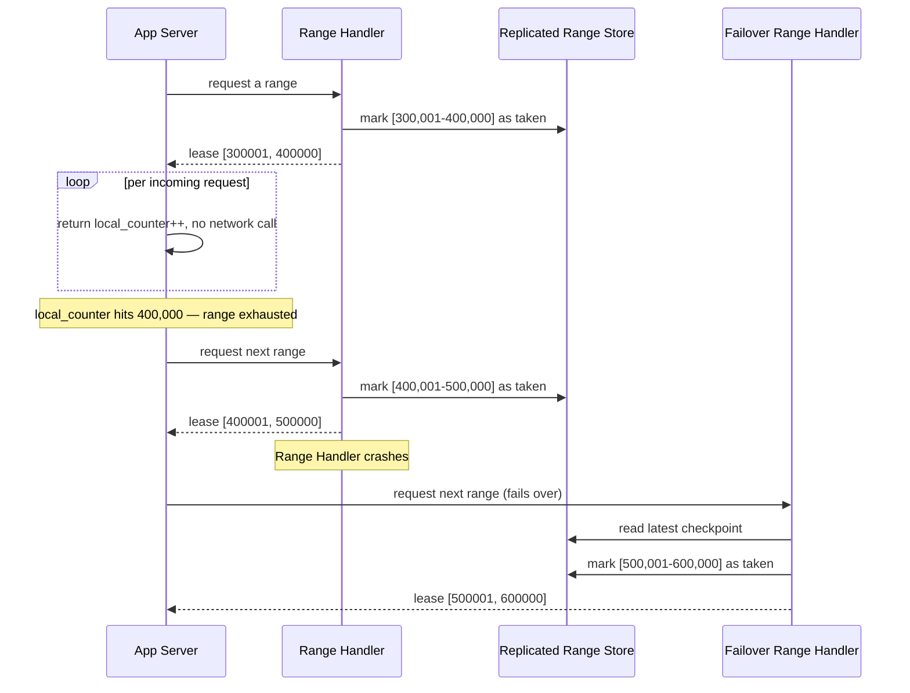
```mermaid
sequenceDiagram
    participant AS as App Server
    participant RH as Range Handler
    participant DB as Replicated Range Store
    participant FO as Failover Range Handler

    AS->>RH: request a range
    RH->>DB: mark [300,001-400,000] as taken
    RH-->>AS: lease [300001, 400000]
    loop per incoming request
        AS->>AS: return local_counter++, no network call
    end
    Note over AS: local_counter hits 400,000 — range exhausted
    AS->>RH: request next range
    RH->>DB: mark [400,001-500,000] as taken
    RH-->>AS: lease [400001, 500000]

    Note over RH: Range Handler crashes
    AS->>FO: request next range (fails over)
    FO->>DB: read latest checkpoint
    FO->>DB: mark [500,001-600,000] as taken
    FO-->>AS: lease [500001, 600000]
```

Notice the ID-issuing loop never leaves the app server — the network round trip only happens at range boundaries, which is *why* this scales: the expensive coordination step is amortized over an entire range instead of paid per ID.

- **This is the first design that satisfies all four base requirements** (unique, scalable, available, 64-bit numeric).
- **Cons:** a crashed app server "loses" the unused remainder of its range — wasted ID space (mitigate with **smaller ranges**, trading off more range-handler round trips vs less waste). No causality/time information at all.
- **Real-world analogue:** this is essentially how Flickr's ticket servers and many `hi/lo` allocation strategies (Hibernate's `hilo` ID generator, Instagram's early ID scheme before Snowflake) work.

### 5.4 UNIX timestamp-based IDs

- Attach a millisecond UNIX timestamp + worker/server ID to distinguish concurrent servers.
- **Cons:** millisecond granularity → only ~1,000 IDs/sec per server (86.4M/day per worker) — undersized versus the 1B/day target unless you fan out across many workers; and **two events in the same millisecond on the same server collide**.
- This motivates bit-packing time with a **sub-millisecond sequence counter** → Snowflake.

### 5.5 Twitter Snowflake — the interview default answer

This is the design you should be able to draw from memory. **64 bits total:**

| Field | Bits | Purpose |
|---|---|---|
| Sign bit | 1 | Always 0 — keeps the ID a positive integer across all languages (Java `long`, JS number, etc.) |
| Timestamp | 41 | Milliseconds since a custom epoch (Twitter's default epoch: `1288834974657` = Nov 4, 2010) |
| Worker/machine ID | 10 | Up to 1,024 distinct workers |
| Sequence number | 12 | Per-millisecond, per-worker counter, resets to 0 each ms; 4,096 IDs/ms/worker |

```
[0][----------- 41 bits: timestamp -----------][-- 10 bits: worker --][-- 12 bits: seq --]
```

#### 🆕 Bit layout, drawn as a packet diagram

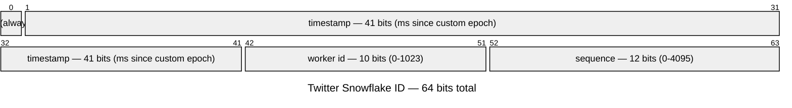
```mermaid
packet-beta
title Twitter Snowflake ID — 64 bits total
0-0: "sign (always 0)"
1-41: "timestamp — 41 bits (ms since custom epoch)"
42-51: "worker id — 10 bits (0-1023)"
52-63: "sequence — 12 bits (0-4095)"
```

**Memory hook:** the numbers themselves are the mnemonic — `1 + 41 + 10 + 12 = 64`. Say it as "one sign, forty-one time, ten who, twelve which-one-this-millisecond" and you've recited the entire ID format from memory.

- **Capacity math:** `2^41 ms ≈ 69.7 years` before timestamp bits wrap (pick your own epoch to push this out). Per worker: 4,096 IDs/ms × 1,000 ms/sec = **4.096M IDs/sec/worker** — comfortably past 1B/day with even a single worker, and it now scales horizontally with more workers too.
- **Time-sortable** (mostly) because the timestamp is the most significant field — sort by ID ≈ sort by creation time. This monotonicity is *why* Twitter/Instagram/Discord chose it: it lets you paginate/range-query by ID instead of needing a separate index on `created_at`.

**Per-request generation logic** — this is the algorithm running on each worker for every ID request; the branch that matters most for interviews is the bottom one (clock moved backward):

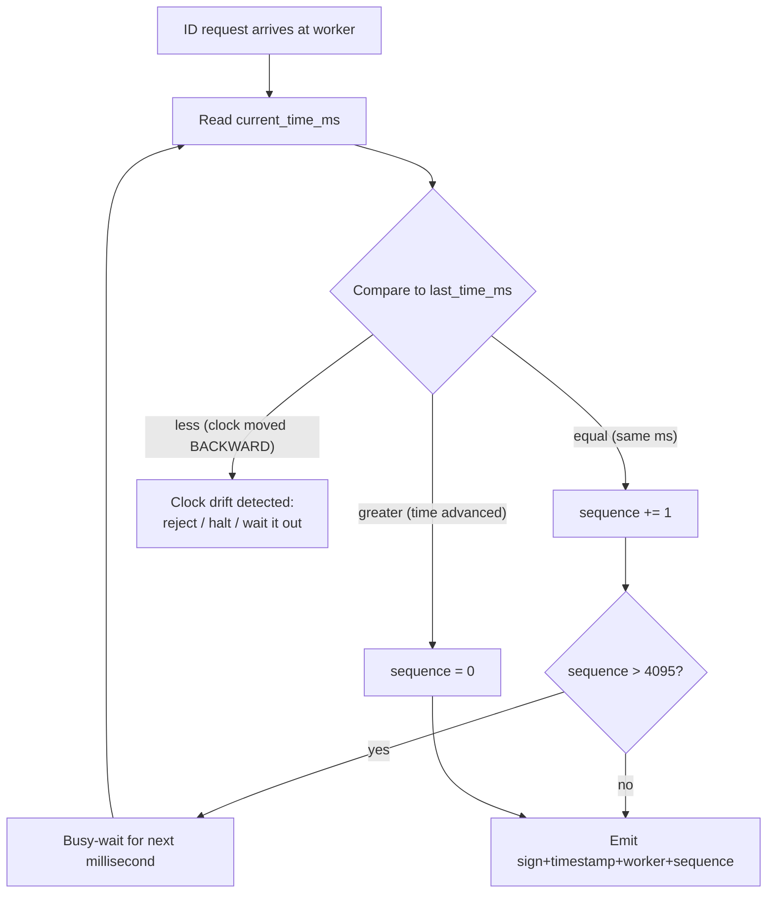
```mermaid
flowchart TD
    Req[ID request arrives at worker] --> Now[Read current_time_ms]
    Now --> Cmp{Compare to last_time_ms}
    Cmp -- "equal (same ms)" --> Inc[sequence += 1]
    Inc --> Ovf{sequence > 4095?}
    Ovf -- yes --> Wait[Busy-wait for next millisecond]
    Wait --> Now
    Ovf -- no --> Emit[Emit sign+timestamp+worker+sequence]
    Cmp -- "greater (time advanced)" --> Reset[sequence = 0]
    Reset --> Emit
    Cmp -- "less (clock moved BACKWARD)" --> Halt["Clock drift detected:\nreject / halt / wait it out"]
```

And the operating states this puts the worker into over time — most Snowflake production incidents are a transition into `ClockBackward` that wasn't handled:

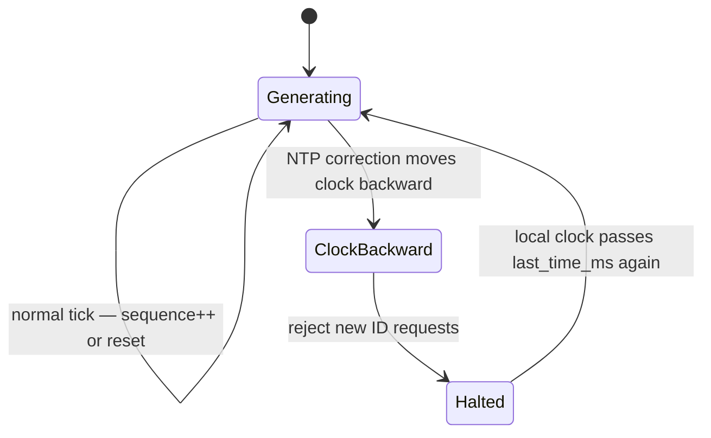
```mermaid
stateDiagram-v2
    [*] --> Generating
    Generating --> Generating: normal tick — sequence++ or reset
    Generating --> ClockBackward: NTP correction moves clock backward
    ClockBackward --> Halted: reject new ID requests
    Halted --> Generating: local clock passes last_time_ms again
```

- **Cons:**
  1. Wasted ID space during idle periods ("dead period") — sequence resets but time keeps advancing, so unused sequence values in low-traffic ms are simply lost (not a correctness bug, just capacity waste).
  2. **Clock drift / NTP is the real production risk.** If NTP corrects a worker's clock backward, the worker can reuse a timestamp it already used — that's a duplicate or non-monotonic ID. If the clock had drifted forward first, the correction pulls it back into a range another node may already be using — that's a collision risk across nodes. Either way, both uniqueness and causality break. Production Snowflake implementations must detect "clock moved backwards" and either halt or wait it out (see the flowchart below) rather than silently emit a dubious ID.
  3. Causality is only a **weak/best-effort** guarantee — good enough for "sort by recency," not good enough to prove "A happened-before B" under clock skew.

**Interview tip:** if the interviewer asks for "IDs sortable by time" — Snowflake is almost always the expected answer. Draw the bit layout, state the capacity math, and immediately flag the NTP/clock-drift weakness before they ask — that's the signal of seniority.

#### 🆕 Sequence overflow, zoomed in

"Overflow" just means one worker tried to hand out more than 4,096 IDs inside the same millisecond. It's rare — that's already 4.096M IDs/sec/worker — but bursty batch jobs can hit it. The standard fix is to **spin, not reject**:

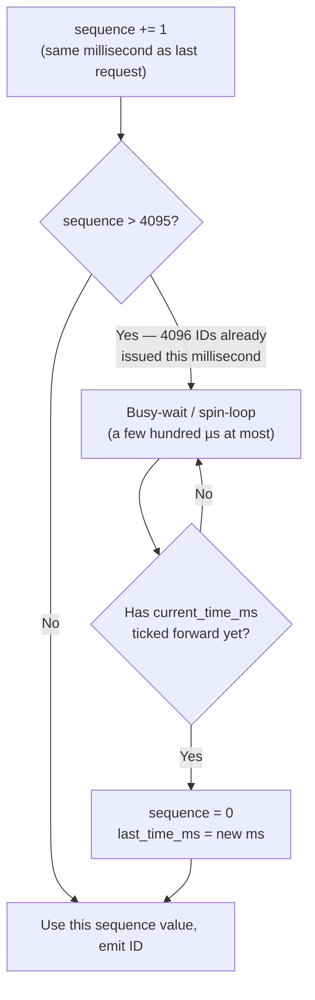
```mermaid
flowchart TD
    Seq["sequence += 1\n(same millisecond as last request)"] --> Chk{sequence > 4095?}
    Chk -- No --> Use[Use this sequence value, emit ID]
    Chk -- "Yes — 4096 IDs already\nissued this millisecond" --> Spin["Busy-wait / spin-loop\n(a few hundred µs at most)"]
    Spin --> Tick{Has current_time_ms\nticked forward yet?}
    Tick -- No --> Spin
    Tick -- Yes --> ResetSeq["sequence = 0\nlast_time_ms = new ms"]
    ResetSeq --> Use
```

Why spin instead of rejecting the request or sleeping? A reject pushes retry logic onto every caller; a `sleep()` risks oversleeping past the next tick due to OS scheduling granularity. A tight spin costs a bit of CPU but is bounded — a millisecond boundary is guaranteed to arrive within, at most, 1ms.

#### 🆕 Clock-skew detection & reaction, zoomed in

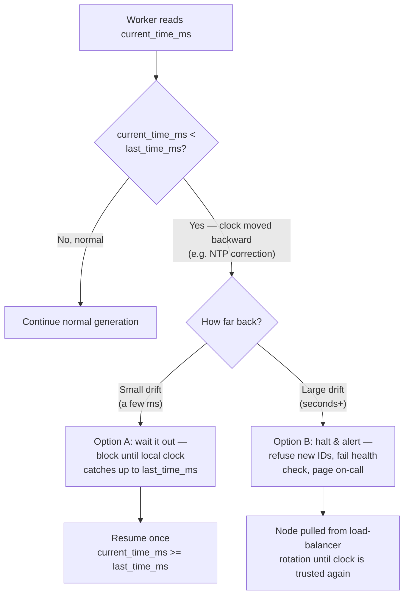
```mermaid
flowchart TD
    Tick[Worker reads current_time_ms] --> Cmp{current_time_ms <\nlast_time_ms?}
    Cmp -- No, normal --> Proceed[Continue normal generation]
    Cmp -- "Yes — clock moved backward\n(e.g. NTP correction)" --> Sev{How far back?}
    Sev -- "Small drift\n(a few ms)" --> WaitOpt["Option A: wait it out —\nblock until local clock\ncatches up to last_time_ms"]
    Sev -- "Large drift\n(seconds+)" --> HaltOpt["Option B: halt & alert —\nrefuse new IDs, fail health\ncheck, page on-call"]
    WaitOpt --> Resume[Resume once\ncurrent_time_ms >= last_time_ms]
    HaltOpt --> Manual["Node pulled from load-balancer\nrotation until clock is trusted again"]
```

Two strategies dominate production systems: **wait-it-out** for the small corrections NTP normally applies (a few milliseconds, slewed gradually), and **halt-and-alert** for a large jump (which usually means something more serious than routine clock sync — a VM migration, a hypervisor pause, a manually-reset clock). Halting is usually paired with pulling the node out of the load-balancer pool, so traffic quietly stops routing there instead of callers seeing errors.

**Sequence diagram — the same decision, played out with two workers:**

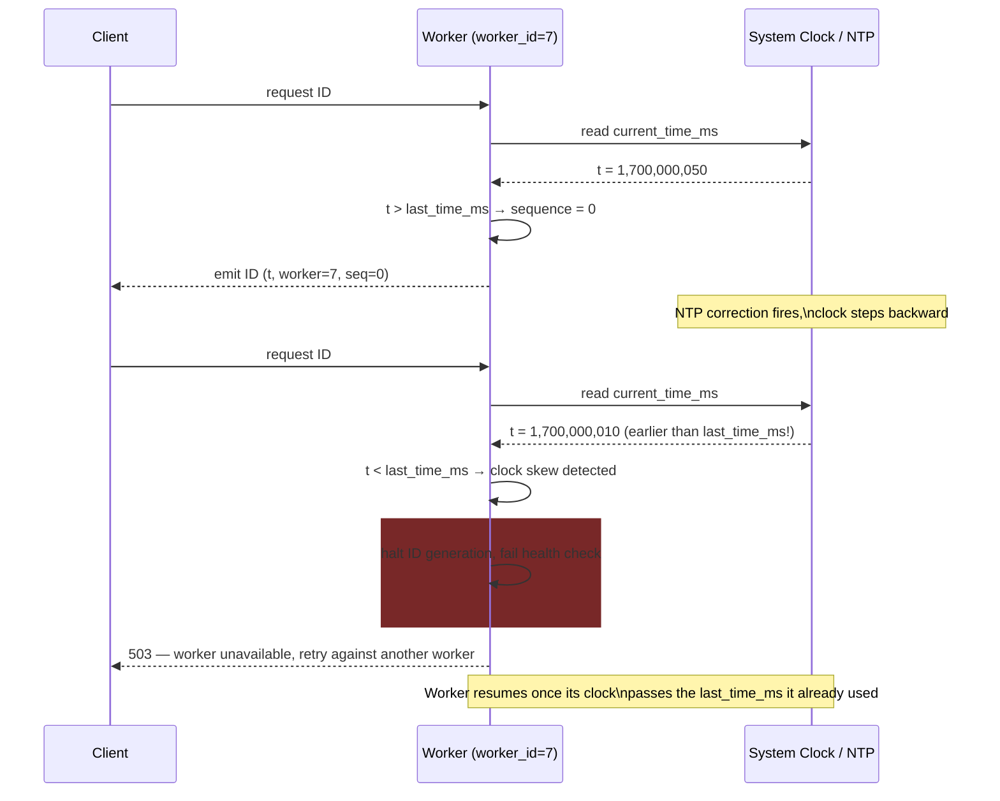
```mermaid
sequenceDiagram
    participant Client
    participant W as Worker (worker_id=7)
    participant Clock as System Clock / NTP

    Client->>W: request ID
    W->>Clock: read current_time_ms
    Clock-->>W: t = 1,700,000,050
    W->>W: t > last_time_ms → sequence = 0
    W-->>Client: emit ID (t, worker=7, seq=0)

    Note over Clock: NTP correction fires,\nclock steps backward

    Client->>W: request ID
    W->>Clock: read current_time_ms
    Clock-->>W: t = 1,700,000,010 (earlier than last_time_ms!)
    W->>W: t < last_time_ms → clock skew detected
    rect rgb(120,40,40)
    W->>W: halt ID generation, fail health check
    end
    W-->>Client: 503 — worker unavailable, retry against another worker
    Note over W,Clock: Worker resumes once its clock\npasses the last_time_ms it already used
```

**"If X then Y" recall pair for interview pressure:**
- If sequence overflows within a millisecond → **spin until the next tick**, then reset sequence to 0.
- If the clock moves backward a little → **wait it out**. If it moves backward a lot → **halt, alert, and remove the node from rotation.**

### 🆕 5.6 Worker ID assignment & coordination

Every design in §5.5 assumes each worker already has a unique `worker_id`. That assumption is itself a coordination problem, and it's one of the most common deep-dive follow-ups: **"how do two Snowflake generators avoid ever getting the same worker ID?"**

Four strategies, roughly in order of how much they scale:

| Strategy | Coordination needed? | Crash safety | Failure mode if it goes wrong |
|---|---|---|---|
| Static config file (hardcode `worker_id` per host) | None | Manual — a human edits config | Copy-paste a config, forget to bump the ID → two workers silently collide |
| Hash of MAC address / IP / hostname mod 1024 | None | Automatic | Hash collision as the fleet grows (same birthday-paradox risk as UUIDs) |
| **Coordination service (ZooKeeper/etcd) ephemeral sequential znode** | Yes, at startup only | Automatic — ephemeral node disappears on crash, freeing the ID | The coordination service becomes a dependency (mitigate by clustering it — that's what ZK/etcd are built for) |
| DB row lease + heartbeat | Yes (a DB) | Automatic via lease expiry | A slow heartbeat renewal can open a brief double-claim window |

The **ZooKeeper/etcd ephemeral-znode pattern** is the answer most interviewers are fishing for, because it's crash-safe without any manual bookkeeping:

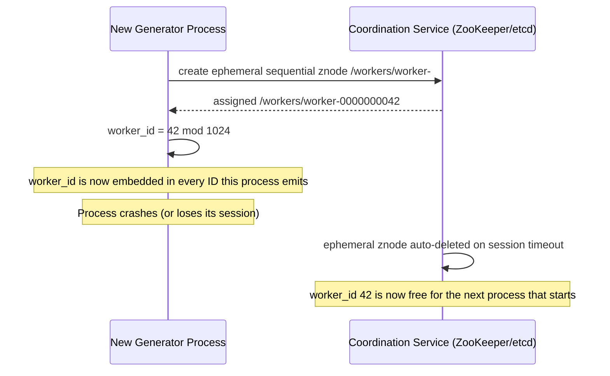
```mermaid
sequenceDiagram
    participant N as New Generator Process
    participant ZK as Coordination Service (ZooKeeper/etcd)

    N->>ZK: create ephemeral sequential znode /workers/worker-
    ZK-->>N: assigned /workers/worker-0000000042
    N->>N: worker_id = 42 mod 1024
    Note over N: worker_id is now embedded in every ID this process emits

    Note over N: Process crashes (or loses its session)
    ZK->>ZK: ephemeral znode auto-deleted on session timeout
    Note over ZK: worker_id 42 is now free for the next process that starts
```

Why **ephemeral** matters: a plain (non-ephemeral) znode would leak worker IDs forever every time a process crashes without a graceful shutdown — eventually exhausting the 1,024-worker budget. Ephemeral nodes tie the claim to the process's live session, so a crash releases it automatically.

**Datacenter-aware variant:** some Snowflake forks split the 10 worker bits into 5 datacenter bits + 5 worker bits (1,024 total workers becomes 32 datacenters × 32 workers each). The coordination service then namespaces claims per datacenter — e.g. `/datacenters/{dc}/workers/` — so a worker ID only has to be unique *within* its datacenter, not globally.

**Interview soundbite:** "Static config works fine at 5 servers you manage by hand. Past that, you want a coordination service handing out worker IDs dynamically and reclaiming them automatically on crash — the same pattern ZooKeeper/etcd use everywhere else (leader election, service discovery), applied to ID-space partitioning."

#### 🆕 Snowflake variants in the wild

Numbers below are approximate, from public engineering write-ups — treat them as illustrative of *how teams re-slice the same 64 bits*, not as values to quote to the bit in an interview without caveating that you're recalling them from memory.

| System | Rough bit split (sign / time / datacenter / worker / sequence) | Epoch | What's different |
|---|---|---|---|
| Twitter Snowflake (original) | 1 / 41 / 5 / 5 / 12 | 2010-11-04 | The "10 worker bits" in §5.5 are actually 5 datacenter + 5 machine in the original design |
| Discord | 1 / 42 / — / 5+5 / 12 | 2015-01-01 | Slightly wider timestamp field (42 bits) than Twitter's, using its own epoch |
| Instagram | 41 / 13 (shard id) / — / 10 | 2011-01-01 | Replaces "worker id" with **shard id** — ties the ID directly to which DB shard owns the row |
| Sony Sonyflake | 1 / 39 (10ms units) / — / 16 / 8 | custom | Timestamp ticks every **10ms** (not 1ms) to afford more machine-id bits; trades sequence range for machine-count range |

The mnemonic here isn't the exact numbers — it's the **trade-off**: every variant is still spending the same 64-bit budget, just deciding differently whether it needs more machines, more per-ms throughput, or more years before wraparound. Name the trade-off, not the bit count, if you're not sure of the exact split.

---

## 6. Causality — when "roughly ordered" isn't good enough

**Causality vs. plain ordering — get this distinction crisp:**
- Two events are **causally related** ("happened-before", Lamport's `→` relation) if one could have influenced the other (e.g., John comments, Peter replies to John's comment).
- Two events are **concurrent** if neither influenced the other (John and Peter comment on two unrelated posts) — there is no meaningful "before/after," and forcing an arbitrary order (e.g., by wall-clock time) can be actively wrong for conflict resolution.
- **Why this matters concretely:** last-write-wins (LWW) conflict resolution in a key-value store (Dynamo-style) needs to know if two concurrent writes to the same key are *actually* concurrent (need app-level or vector-clock resolution) vs. one causally depends on the other (safe to just take the later one).

### 6.1 Lamport clocks

- Every node keeps an integer counter, starting at 0.
- **On each event:** increment local counter.
- **On sending a message:** attach current counter value.
- **On receiving a message:** `local = max(local, received) + 1`.
- Gives a valid **happened-before partial order**: if `A → B` then `LamportClock(A) < LamportClock(B)`. But the converse is false — you cannot look at two Lamport timestamps and conclude causality, only a candidate total order (break ties with node ID, but that ordering is arbitrary and not unique).

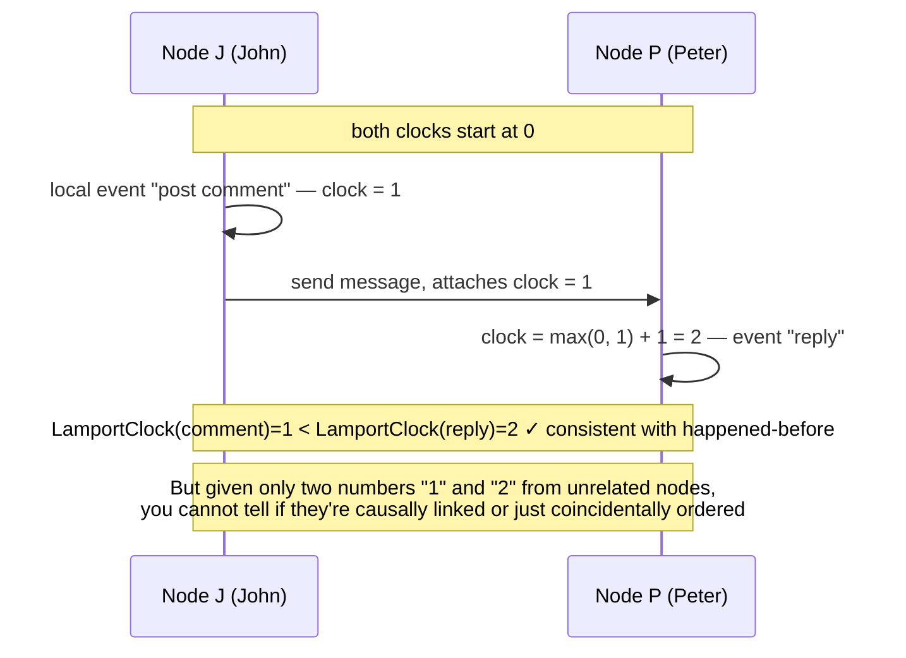
```mermaid
sequenceDiagram
    participant J as Node J (John)
    participant P as Node P (Peter)
    Note over J,P: both clocks start at 0
    J->>J: local event "post comment" — clock = 1
    J->>P: send message, attaches clock = 1
    P->>P: clock = max(0, 1) + 1 = 2 — event "reply"
    Note over J,P: LamportClock(comment)=1 < LamportClock(reply)=2 ✓ consistent with happened-before
    Note over J,P: But given only two numbers "1" and "2" from unrelated nodes,<br/>you cannot tell if they're causally linked or just coincidentally ordered
```

- **Interview soundbite:** "Lamport clocks tell you a valid ordering consistent with causality, but they can't tell you *whether* two events were actually causally related — for that you need vector clocks."

### 6.2 Vector clocks

- Each node maintains a **vector of counters, one per node** in the system (size `n`).
- On a local event, the node increments its own slot.
- On send, attach the full vector; on receive, take the element-wise max, then increment own slot.
- **Comparison rule** gives true causality: `V1 < V2` (causally before) iff every element of V1 ≤ corresponding element of V2, and at least one is strictly less. If neither vector dominates the other, the events are **concurrent** — this is the one design that can *correctly detect concurrency*, which is exactly what Dynamo/Riak use vector clocks for.

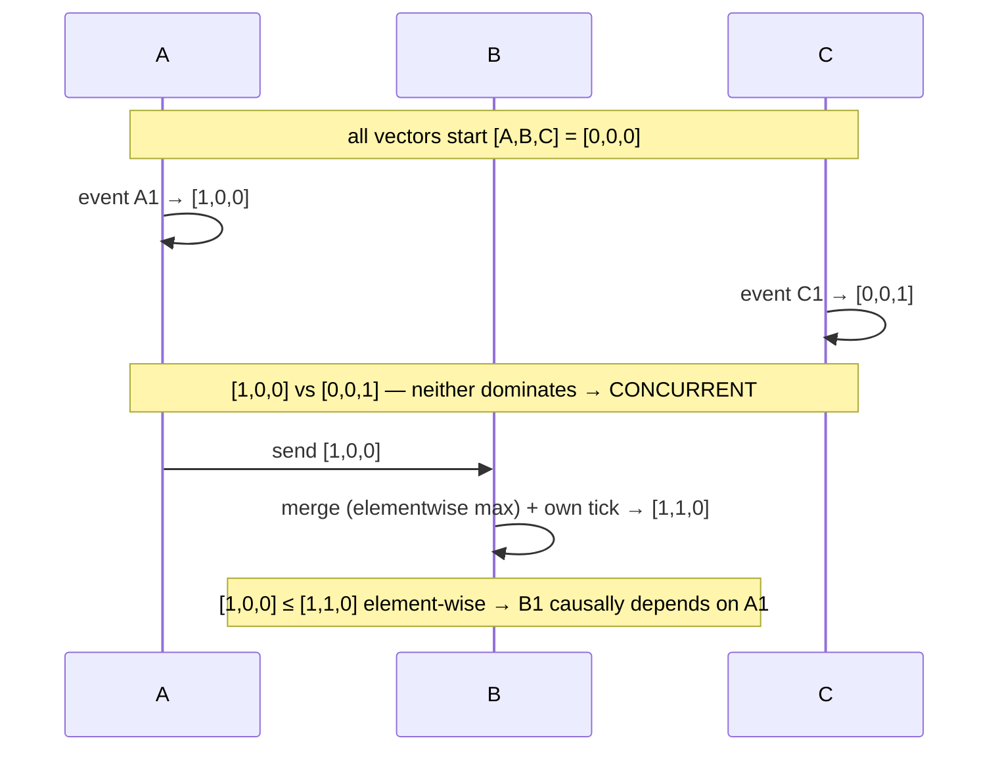
```mermaid
sequenceDiagram
    participant A
    participant B
    participant C
    Note over A,C: all vectors start [A,B,C] = [0,0,0]
    A->>A: event A1 → [1,0,0]
    C->>C: event C1 → [0,0,1]
    Note over A,C: [1,0,0] vs [0,0,1] — neither dominates → CONCURRENT
    A->>B: send [1,0,0]
    B->>B: merge (elementwise max) + own tick → [1,1,0]
    Note over B: [1,0,0] ≤ [1,1,0] element-wise → B1 causally depends on A1
```

The middle `Note` is the entire point of vector clocks: Lamport clocks could never tell you A1 and C1 were unrelated — vector clocks can, because comparison is element-wise instead of a single scalar.

- ID scheme from the course: `[vector-clock (53 bits)][worker-id (10 bits)]`.
- **Cons — the big one:** vector clock size grows **O(n)** with the number of participating nodes. If every browser/client is a "node" (common in web/mobile apps), the vector becomes huge — blows way past a 64-bit budget. This is *the* trade-off to name: vector clocks give perfect causality at the cost of unbounded ID size, which is why they're rarely used as the primary key/ID itself in large-scale consumer systems (more common internally in databases like Dynamo/Riak/Voldemort, scoped to a small, bounded number of replicas rather than all clients).

### 6.3 TrueTime API (Google Spanner) — the "gold standard" answer

- Instead of returning a single timestamp, `TT.now()` returns an **interval** `[earliest, latest]` — an explicit uncertainty bound (`ε`), because no clock is perfectly synchronized.
- Backed by **GPS receivers and atomic clocks** in every data center; Google reports clock uncertainty kept to ~7ms via Marzullo's algorithm intersecting multiple time references.
- **Spanner's core guarantee ("external consistency"):** if `A_latest < B_earliest`, then A definitely happened before B. If intervals overlap, order is ambiguous (Spanner's **commit-wait**: it waits out `ε` before acknowledging a commit so that later transactions are guaranteed to see a later timestamp — this is the mechanism, worth naming).

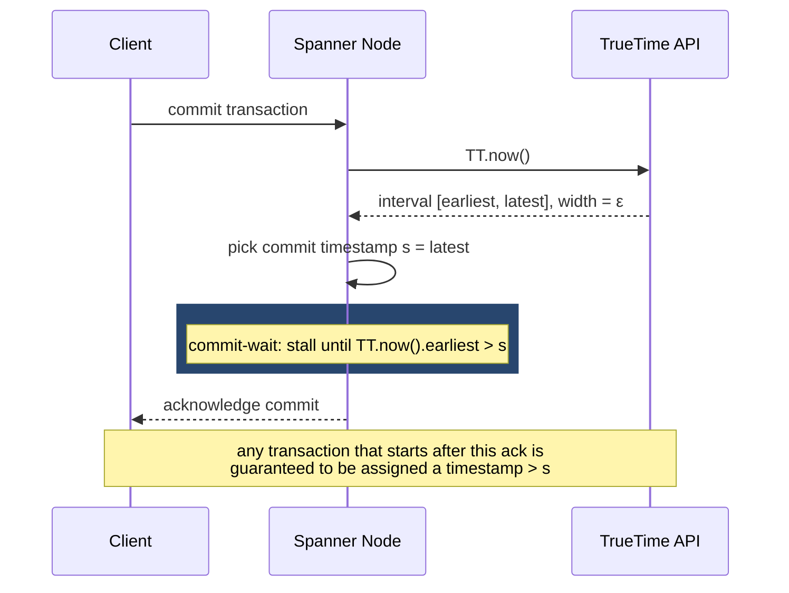
```mermaid
sequenceDiagram
    participant Cl as Client
    participant Sp as Spanner Node
    participant TT as TrueTime API

    Cl->>Sp: commit transaction
    Sp->>TT: TT.now()
    TT-->>Sp: interval [earliest, latest], width = ε
    Sp->>Sp: pick commit timestamp s = latest
    rect rgb(40,70,110)
    Note over Sp: commit-wait: stall until TT.now().earliest > s
    end
    Sp-->>Cl: acknowledge commit
    Note over Cl,TT: any transaction that starts after this ack is<br/>guaranteed to be assigned a timestamp > s
```

The stall inside commit-wait is the whole trick: Spanner doesn't achieve certainty by making clocks perfect, it achieves certainty by **waiting out its own admitted uncertainty** before telling anyone the commit happened.

- **ID layout used here:** `[sign:1][timestamp T_E:41][uncertainty ε:4][worker:10][sequence:8]`.
- **Pros:** satisfies *all five* requirements including causality — this is the only design in the chapter that gets a full checkmark row.
- **Cons:** if intervals overlap you still can't order two events with certainty (just bounded uncertainty, not zero). Extremely expensive — dedicated atomic-clock/GPS hardware per data center, elaborate monitoring — not something you build unless you're Google-scale.
- **Interview soundbite:** "TrueTime doesn't eliminate clock uncertainty, it makes it *explicit and bounded*, then engineers around it with commit-wait." That one line signals you understand Spanner beyond the buzzword.

### Full requirements comparison table (memorize the shape, not every cell)

| Approach | Unique | Scalable | Available | 64-bit numeric | Causality |
|---|---|---|---|---|---|
| UUID (v4) | ✖ (probabilistic) | ✔ | ✔ | ✖ (128-bit) | ✖ |
| Central DB counter | ✖ (unsafe rescale) | ✖ | ✔ | ✔ | ✖ |
| Range handler | ✔ | ✔ | ✔ | ✔ | ✖ |
| UNIX timestamp | ✖ (same-ms collide) | weak | ✔ | ✔ | weak |
| Twitter Snowflake | ✔ | ✔ | ✔ | ✔ | weak |
| Vector clocks | ✔ | weak (size grows) | ✔ | can exceed 64-bit | ✔ |
| TrueTime | ✔ | ✔ | ✔ | ✔ | ✔ |

### 6.4 The decision guide — reconstruct this live in an interview

This is the one diagram to actually rebuild on a whiteboard when asked "design a unique ID generator" cold. Walk it top-to-bottom out loud — each diamond is a clarifying question you should be asking the interviewer anyway.

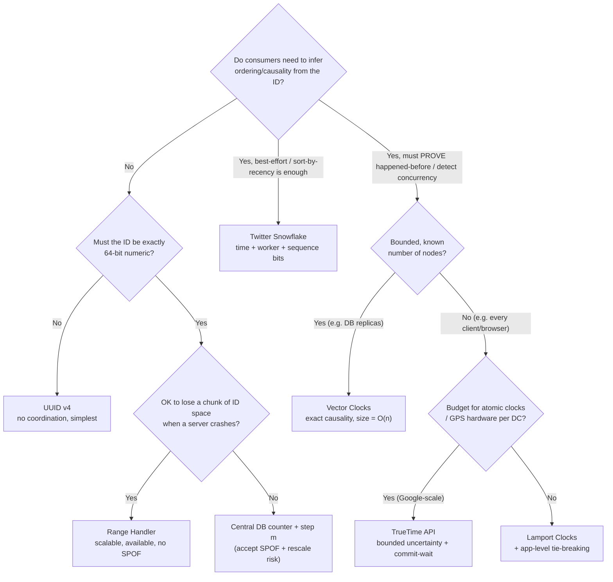
```mermaid
flowchart TD
    Start{Do consumers need to infer\nordering/causality from the ID?}
    Start -- No --> Q1{Must the ID be exactly\n64-bit numeric?}
    Q1 -- No --> UUID[UUID v4\nno coordination, simplest]
    Q1 -- Yes --> Q2{OK to lose a chunk of ID space\nwhen a server crashes?}
    Q2 -- Yes --> RH[Range Handler\nscalable, available, no SPOF]
    Q2 -- No --> DB["Central DB counter + step m\n(accept SPOF + rescale risk)"]

    Start -- "Yes, best-effort / sort-by-recency is enough" --> SF[Twitter Snowflake\ntime + worker + sequence bits]
    Start -- "Yes, must PROVE happened-before / detect concurrency" --> Q3{Bounded, known\nnumber of nodes?}
    Q3 -- "Yes (e.g. DB replicas)" --> VC["Vector Clocks\nexact causality, size = O(n)"]
    Q3 -- "No (e.g. every client/browser)" --> Q4{Budget for atomic clocks\n/ GPS hardware per DC?}
    Q4 -- "Yes (Google-scale)" --> TT[TrueTime API\nbounded uncertainty + commit-wait]
    Q4 -- No --> LC[Lamport Clocks\n+ app-level tie-breaking]
```

Say the requirement out loud before you pick the leaf — "the interviewer didn't ask for causality, so I'll stop at range handler" is a *complete, senior-level answer*. Don't reflexively walk all the way to TrueTime if nothing asked for it.

---

## 7. Design decisions & trade-offs to narrate explicitly

- **ID length vs. index performance:** longer keys (128-bit UUID, unbounded vector clocks) slow down B-tree primary-key inserts/updates due to worse locality and larger index pages. This is a real, measurable cost, not a theoretical one — always mention it when someone proposes "just use UUIDs everywhere."
- **Random vs. sequential vs. time-ordered IDs — the security/business trade-off:** sequential IDs (DB counter, range handler without shuffling) leak business metrics — e.g., competitors can infer daily order volume from two consecutive order IDs. Fix: add a random component (like Snowflake's sequence bits, or hash/obfuscate before exposing externally) at a small performance/complexity cost. This is a good "requirement I'd clarify" moment in an interview: *"do the IDs get exposed to end users/URLs, or are they purely internal?"*
- **Counters vs. timestamps:** simple counters are cheaper to generate than fetching a timestamp (a syscall/library call), but need durable, persisted storage (which reintroduces the DB-SPOF and write-amplification problem) if you want them gapless/recoverable across restarts.
- **Monotonic IDs can create database hotspots.** Direct Spanner quote worth repeating verbatim in an interview: *"using monotonically increasing (or decreasing) values as row keys does not follow best practices in Spanner because it creates hotspots in the database, leading to a reduction in performance."* This is because a strictly increasing key concentrates all recent writes on the same shard/node/hot range (the "last" leaf of the B-tree). **Mitigation:** shuffle/hash the ID or reverse the bit order of the timestamp before using it as a row key, or shard by a separate hash key while keeping the sortable ID as a secondary attribute.
- **Global total ordering is expensive — know the exact Spanner numbers.** Spanner: a single-row read-update transaction cell has ~10ms latency → max theoretical throughput of **100 sequence values/sec system-wide**, regardless of how many client instances or nodes you add — because a single row is always managed by a single node. This is the single best "why don't we just use a database counter at scale" answer available — cite the number.
- **Worker-ID coordination is a design decision, not an afterthought.** Snowflake-style designs push all the hard coordination into a one-time step at worker startup instead of paying it on every ID request — that's the whole trick that makes them fast. Static config is fine for a handful of servers; a coordination service (ZooKeeper/etcd) with ephemeral znodes is the answer once the fleet is large or elastic (see §5.6).
- **Relaxing requirements buys performance.** If you can tolerate gaps (non-contiguous IDs) or give up strict global ordering, you get dramatically better throughput (range handler, Snowflake). This is the meta-lesson of the whole chapter: **uniqueness, strict ordering, and gaplessness cannot all be cheap simultaneously in a distributed system** — pick which one to relax based on the actual product requirement.

---

## 8. How to identify this topic in an interview

Watch for these phrases/scenarios — they signal the interviewer wants a sequencer deep-dive, not a one-liner:

- "How would you generate a **primary key** for a **horizontally sharded** table?"
- "How do you assign **IDs to Tweets/posts/messages** such that they're **roughly sortable by time**?"
- "We need to **trace a request across microservices** — how do you tag it?" (→ TraceID / Canopy / Dapper analogy)
- "Two clients write to the same key concurrently — how do you decide which write wins?" (→ vector clocks / LWW)
- "Your ID generator server died — what happens to in-flight ID requests?" (→ SPOF discussion, range handler failover)
- "Can two services running in different data centers ever generate the same ID?" (→ worker ID / data-center bits, clock drift)
- "How do you make sure two servers never get assigned the same worker ID?" (→ §5.6: coordination service with ephemeral znodes, not a hardcoded config file)
- "What happens if this worker generates more than 4,096 IDs in one millisecond?" (→ sequence overflow: spin until the next tick, §5.5)
- Any mention of **payment/order idempotency** — hints at needing deterministic (not probabilistic) uniqueness, because duplicate order IDs = double charges.
- **A trap to avoid:** if asked "design a unique ID generator" cold, don't jump straight to "Snowflake." State requirements first (uniqueness, scale, availability, size, causality-or-not), *then* walk the escalation UUID → DB → range handler → Snowflake → logical clocks → TrueTime, picking the right stopping point based on which requirements the interviewer actually cares about. Stopping at "range handler" is a perfectly good answer if causality was never asked for.

---

## 9. Interview cheat-sheet (recall under pressure)

- 64 bits lasts **~50.5 million years** at 1B IDs/day — say this number to show you did the math.
- **UUID v4**: no coordination, 128-bit, probabilistic uniqueness, bad as a DB primary key (index locality).
- **DB counter + step `m`**: SPOF; rescaling `m` on server add/remove **causes real collisions** — know the A/B/C example cold.
- **Range handler**: central microservice leases contiguous ranges; app servers burn through them locally (no per-ID network call); replicated state + failover replica removes the SPOF; wasted range on crash is the cost.
- **Snowflake** = `[sign:1][timestamp:41][worker:10][sequence:12]`; ~69 years of timestamp headroom; 4,096 IDs/ms/worker; NTP clock drift is the real weakness — production systems must detect backward clock jumps.
- **Sequence overflow (same ms, >4096 IDs)** → spin/busy-wait for the next millisecond tick, then reset sequence to 0. Don't reject, don't sleep-and-hope — spin, because a tick is guaranteed within 1ms.
- **Clock moved backward** → small drift: wait it out. Large drift: halt generation, fail the health check, pull the node from the load-balancer rotation.
- **Worker-ID assignment**: static config only scales to a handful of hand-managed hosts. Past that, use a coordination service (ZooKeeper/etcd) handing out **ephemeral sequential znodes** — ephemeral means a crash auto-frees the worker ID for reuse, no manual bookkeeping.
- **Architecture evolution**: v1 centralized counter (SPOF/bottleneck) → v2 Snowflake embedded per node with a static `worker_id` (no SPOF, but silent-collision risk) → v3 add a coordination service for dynamic worker-ID assignment + per-node clock-skew detection (removes both v2 risks, still zero network calls per ID).
- **API shape**: the closer coordination gets to "once per ID," the worse it scales — embedded library call (no network) and range-lease (one call per range) are good; a network round trip per ID is the anti-pattern.
- **Lamport clock**: gives *a* valid happened-before-consistent order, cannot detect concurrency.
- **Vector clock**: `O(n)` size in number of nodes — the only mechanism that can *prove* two events are concurrent; too big for client-scale systems.
- **TrueTime**: returns `[earliest, latest]` interval, not a point; GPS + atomic clocks, ~7ms uncertainty; Spanner uses **commit-wait** to turn bounded uncertainty into external consistency; expensive infrastructure.
- **Monotonic IDs as row keys create hotspots** — Spanner explicitly warns against this; shuffle/hash before using as a shard key.
- **Global sequence throughput is fundamentally capped** — Spanner: ~100 values/sec system-wide for a single monotonic sequence, no matter how many nodes you add, because one row = one node.
- The meta-trade-off of the whole chapter: **uniqueness + strict ordering + gaplessness** can't all be cheap in a distributed system — relax one on purpose, and say which one and why.
