# Sequencer / Unique ID Generator — FAANG Interview Guide

## 0. The whole chapter in one picture

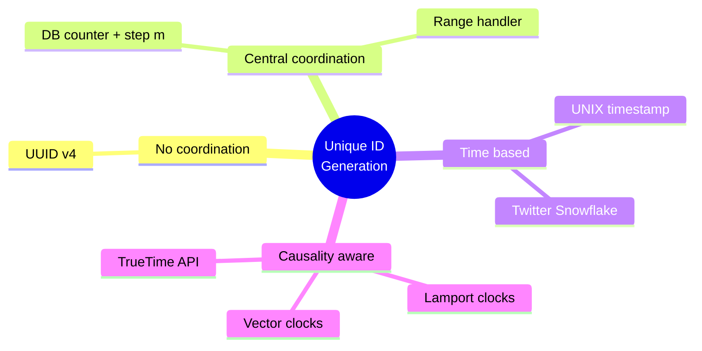

Read this tree left-to-right as **"how much do nodes need to talk to each other, and what do they get for it."** No coordination is cheapest and weakest; causality-aware is most expensive and strongest. Every design below sits somewhere on that line — locate it there first, then recall the details.

## 1. What it is & why it exists

A **sequencer** is a building block that hands out **globally unique identifiers** (and sometimes **ordering/causality information**) for events, rows, or objects in a distributed system. Think of it as the distributed-systems replacement for a single database's `AUTO_INCREMENT` column — except there is no longer one server that can simply count upward, because there are *many* independent writers (application servers, database shards, data centers) that must agree on non-colliding values without talking to each other on every request.

**Mental model:** in a single-node system, uniqueness and ordering are free — one counter, one lock, done. In a distributed system, uniqueness and ordering become a **coordination problem**, and coordination is expensive (network round trips, consensus, single points of failure). Every design in this chapter is a different trade-off between:

- **Coordination cost** (how often nodes must talk to agree on values)
- **ID size** (64-bit vs 128-bit vs variable)
- **Causality/ordering guarantees** (none → weak/time-based → strict/logical → global-total-order)

**Why interviewers care:** almost every "design X" interview (Twitter, Instagram, WhatsApp, Uber, YouTube) needs unique IDs for posts/messages/trips/videos. If you just say "use a UUID" without being asked to justify it, you're leaving depth on the table. This is a favorite **follow-up/deep-dive** topic precisely because it looks simple but has 6+ layers of subtlety.

**Canonical real-world uses:**
- Primary keys in horizontally-sharded databases (no central auto-increment).
- Distributed tracing IDs (Facebook's **Canopy** uses a `TraceID` to stitch together hundreds of microservice calls for one request; Google's **Dapper**/OpenTelemetry `trace_id`/`span_id` do the same).
- Twitter Tweet IDs, Instagram media IDs, Discord message IDs (all use Snowflake-style IDs).
- Idempotency keys for payments (duplicate order IDs → double charges — a very real production incident category).
- Last-write-wins conflict resolution in key-value stores (Dynamo/Cassandra use timestamps/vector clocks for exactly this).

---

## 2. Requirements to state up front

Always open a sequencer deep-dive by enumerating requirements — interviewers reward this because it shows you know the design space has more than one right answer depending on which requirement dominates.

| Requirement | What it means |
|---|---|
| **Uniqueness** | No two events ever get the same ID (or, for probabilistic schemes, collision probability is negligible) |
| **Scalability** | Must sustain the required throughput — course baseline is **≥ 1 billion IDs/day** (~11,574 IDs/sec average, plan for higher peak) |
| **High availability** | ID generation can't have a single point of failure (SPOF) — it's on the critical path of almost every write |
| **64-bit numeric** | Fits a `long`/`bigint` column, indexes fast, sortable as a number — this is a size/performance constraint, not just aesthetics |
| **(Optional) Causality / time-sortability** | Do consumers need to infer "did A happen before B?" from the ID alone? This is the requirement that turns a "unique ID generator" into a "sequencer with causality" |
| **(Optional) Unguessability** | Should IDs leak business metrics (order volume, growth rate) to competitors if sequential? |

**Capacity math worth memorizing:**
```
2^64 ≈ 1.8447 × 10^19 total values
At 1B IDs/day → 365B/year → 2^64 / 365×10^9 ≈ 50.5 million years to exhaust
```
This is why 64 bits is "enough forever" — say this number cold, it signals you actually did the math instead of parroting "64 bits is standard."

---

## 3. The five approaches — progressively solving each other's weaknesses

Structure your answer as a **narrative of escalating fixes**, not a static list — that's what separates a senior answer from a junior one. Each approach fixes the prior one's biggest flaw and introduces a new one.

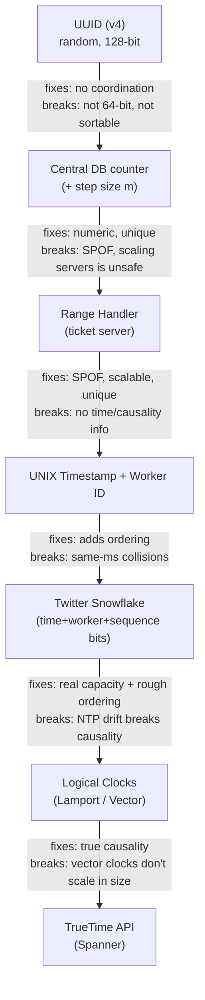

**Same seven designs plotted as a trade-off space** — this is the single image to reconstruct from memory when you're deciding what to propose live in an interview:

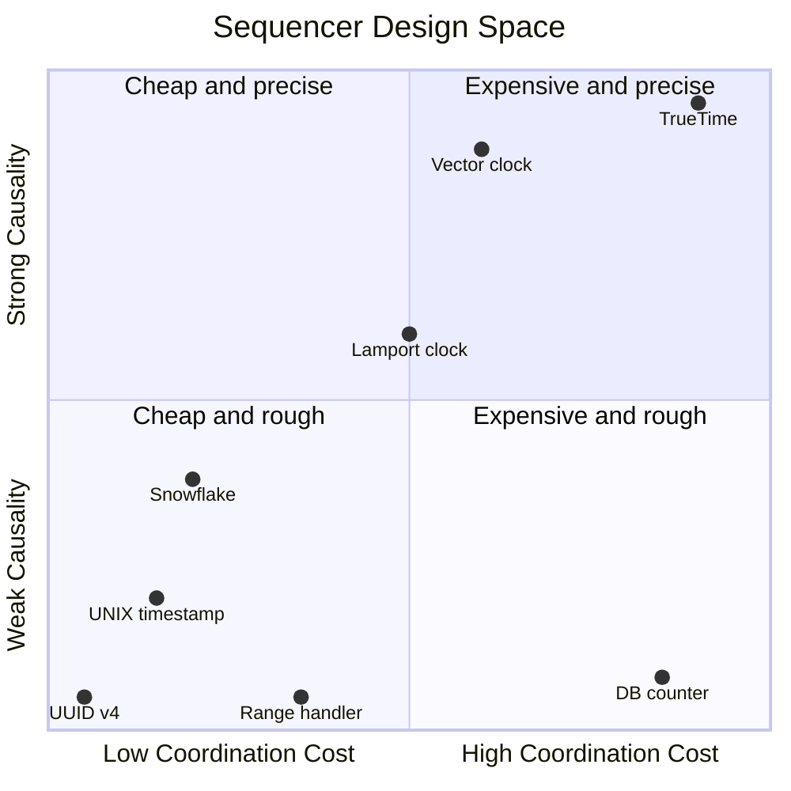

Everything in the bottom-right quadrant (DB counter) is a trap: high coordination cost for almost no causality benefit — it's only there because it's the naive "just mimic auto-increment" instinct. The interesting frontier runs diagonally from UUID up to TrueTime; whichever point on that diagonal you pick should be justified by the requirement that's actually driving it (throughput vs. ordering vs. concurrency-detection).

### 3.1 UUID (v4, random)

- 128-bit, e.g. `123e4567-e89b-12d3-a456-426614174000`. ~10^38 space.
- **No coordination needed** — each server generates its own, independently. Trivially scalable and available.
- **Cons:** not 64-bit (breaks the size requirement), string/hex form makes B-tree primary-key indexing slower (poor locality → random inserts fragment the index, hurting write throughput — this is the same reason you avoid random UUIDs as clustered/primary keys in MySQL InnoDB), *not deterministically unique* (only probabilistically — birthday-paradox collision risk exists, just vanishingly small), and not monotonically increasing over time.
- **When to actually propose it in an interview:** distributed tracing span IDs, idempotency keys, client-generated correlation IDs — anywhere pure uniqueness matters more than size/order.

### 3.2 Central database counter

- Mimic `AUTO_INCREMENT`: one DB hands out the next value and increments.
- **Fix for scaling:** instead of `+1`, increment by `m` = number of DB servers, each server owns a residue class mod `m` (server 1 → 1,4,7,...; server 2 → 2,5,8,...).
- **Cons — the classic interview gotcha:** this is a SPOF, and worse, **adding/removing a server is unsafe**. Concrete failure case to narrate: `m=3`, server A owns {1,4,7,...}, B owns {2,5,8,...}, C owns {3,6,9,...}. B goes down, you reconfigure to `m=2`. Server A's next ID becomes 9 — but C already issued 9. **Collision.** This example is worth memorizing verbatim; it's exactly the kind of "walk me through a concrete failure" narrative interviewers want.

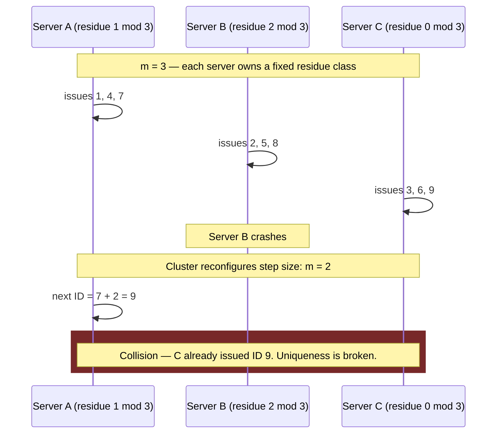

- Also doesn't scale across multiple data centers (cross-DC coordination on every write is too slow).

### 3.3 Range handler ("ticket server" pattern)

- A central **range handler microservice** partitions the ID space into large contiguous ranges (e.g., 1–1,000,000 / 1,000,001–2,000,000 / ...) and leases a whole range to an application server on request.
- The app server keeps the range's current position in a **local variable**, hands out IDs by incrementing it in-memory (no network call per ID!) — only re-contacts the range handler when the range is exhausted.
- Range handler tracks range state (taken/available) in **replicated storage**, and has a **failover replica** to eliminate its own SPOF — it recovers state from the latest checkpoint.
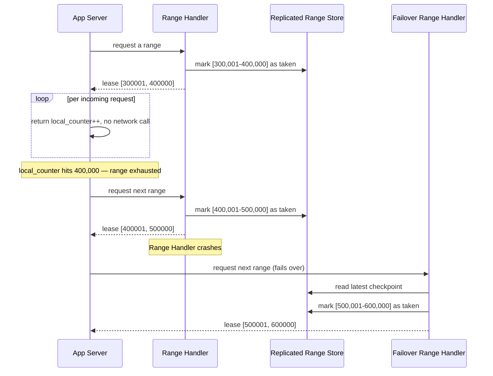

Notice the ID-issuing loop never leaves the app server — the network round trip only happens at range boundaries, which is *why* this scales: the expensive coordination step is amortized over an entire range instead of paid per ID.

- **This is the first design that satisfies all four base requirements** (unique, scalable, available, 64-bit numeric).
- **Cons:** a crashed app server "loses" the unused remainder of its range — wasted ID space (mitigate with **smaller ranges**, trading off more range-handler round trips vs less waste). No causality/time information at all.
- **Real-world analogue:** this is essentially how Flickr's ticket servers and many `hi/lo` allocation strategies (Hibernate's `hilo` ID generator, Instagram's early ID scheme before Snowflake) work.

### 3.4 UNIX timestamp-based IDs

- Attach a millisecond UNIX timestamp + worker/server ID to distinguish concurrent servers.
- **Cons:** millisecond granularity → only ~1,000 IDs/sec per server (86.4M/day per worker) — undersized versus the 1B/day target unless you fan out across many workers; and **two events in the same millisecond on the same server collide**.
- This motivates bit-packing time with a **sub-millisecond sequence counter** → Snowflake.

### 3.5 Twitter Snowflake — the interview default answer

This is the design you should be able to draw from memory. **64 bits total:**

| Field | Bits | Purpose |
|---|---|---|
| Sign bit | 1 | Always 0 — keeps the ID a positive integer across all languages (Java `long`, JS number, etc.) |
| Timestamp | 41 | Milliseconds since a custom epoch (Twitter's default epoch: `1288834974657` = Nov 4, 2010) |
| Worker/machine ID | 10 | Up to 1,024 distinct workers |
| Sequence number | 12 | Per-millisecond, per-worker counter, resets to 0 each ms; 4,096 IDs/ms/worker |

```
[0][----------- 41 bits: timestamp -----------][-- 10 bits: worker --][-- 12 bits: seq --]
```

- **Capacity math:** `2^41 ms ≈ 69.7 years` before timestamp bits wrap (pick your own epoch to push this out). Per worker: 4,096 IDs/ms × 1,000 ms/sec = **4.096M IDs/sec/worker** — comfortably past 1B/day with even a single worker, and it now scales horizontally with more workers too.
- **Time-sortable** (mostly) because the timestamp is the most significant field — sort by ID ≈ sort by creation time. This monotonicity is *why* Twitter/Instagram/Discord chose it: it lets you paginate/range-query by ID instead of needing a separate index on `created_at`.

**Per-request generation logic** — this is the algorithm running on each worker for every ID request; the branch that matters most for interviews is the bottom one (clock moved backward):

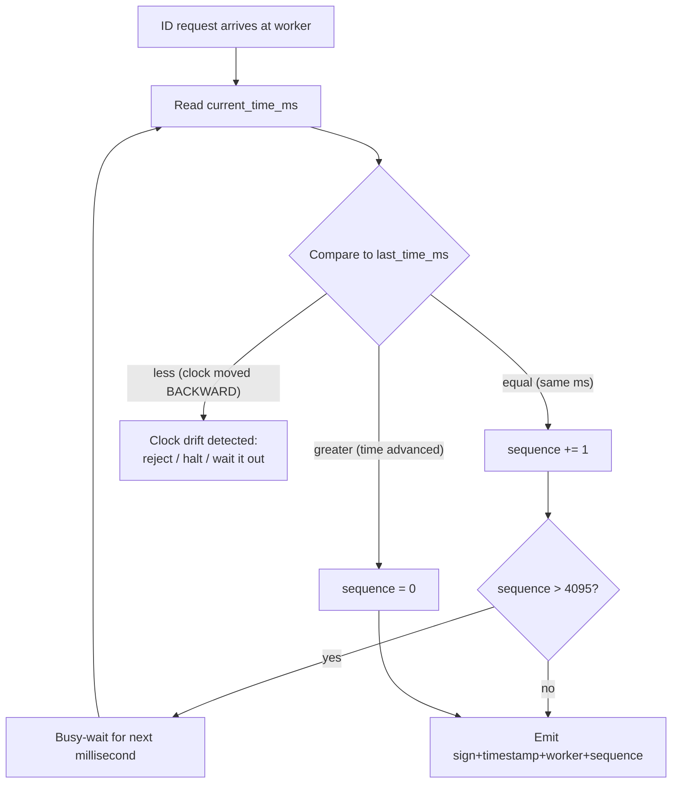

And the operating states this puts the worker into over time — most Snowflake production incidents are a transition into `ClockBackward` that wasn't handled:

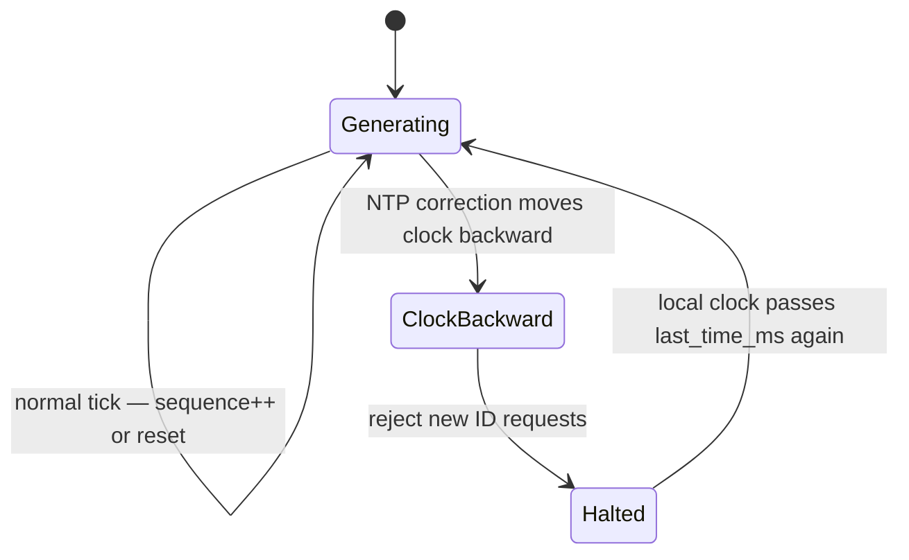

- **Cons:**
  1. Wasted ID space during idle periods ("dead period") — sequence resets but time keeps advancing, so unused sequence values in low-traffic ms are simply lost (not a correctness bug, just capacity waste).
  2. **Clock drift / NTP is the real production risk.** If a worker's clock is corrected backward by NTP, it can *generate duplicate or non-monotonic timestamps*, or (if clock moves forward first) IDs can be issued for a "future" time, then the correction creates overlap risk with another node — breaking both uniqueness guarantees and causality. Production Snowflake implementations must detect "clock moved backwards" and either **halt ID generation** or wait it out rather than silently emit dubious IDs.
  3. Causality is only a **weak/best-effort** guarantee — good enough for "sort by recency," not good enough to prove "A happened-before B" under clock skew.

**Interview tip:** if the interviewer asks for "IDs sortable by time" — Snowflake is almost always the expected answer. Draw the bit layout, state the capacity math, and immediately flag the NTP/clock-drift weakness before they ask — that's the signal of seniority.

---

## 4. Causality — when "roughly ordered" isn't good enough

**Causality vs. plain ordering — get this distinction crisp:**
- Two events are **causally related** ("happened-before", Lamport's `→` relation) if one could have influenced the other (e.g., John comments, Peter replies to John's comment).
- Two events are **concurrent** if neither influenced the other (John and Peter comment on two unrelated posts) — there is no meaningful "before/after," and forcing an arbitrary order (e.g., by wall-clock time) can be actively wrong for conflict resolution.
- **Why this matters concretely:** last-write-wins (LWW) conflict resolution in a key-value store (Dynamo-style) needs to know if two concurrent writes to the same key are *actually* concurrent (need app-level or vector-clock resolution) vs. one causally depends on the other (safe to just take the later one).

### 4.1 Lamport clocks

- Every node keeps an integer counter, starting at 0.
- **On each event:** increment local counter.
- **On sending a message:** attach current counter value.
- **On receiving a message:** `local = max(local, received) + 1`.
- Gives a valid **happened-before partial order**: if `A → B` then `LamportClock(A) < LamportClock(B)`. But the converse is false — you cannot look at two Lamport timestamps and conclude causality, only a candidate total order (break ties with node ID, but that ordering is arbitrary and not unique).

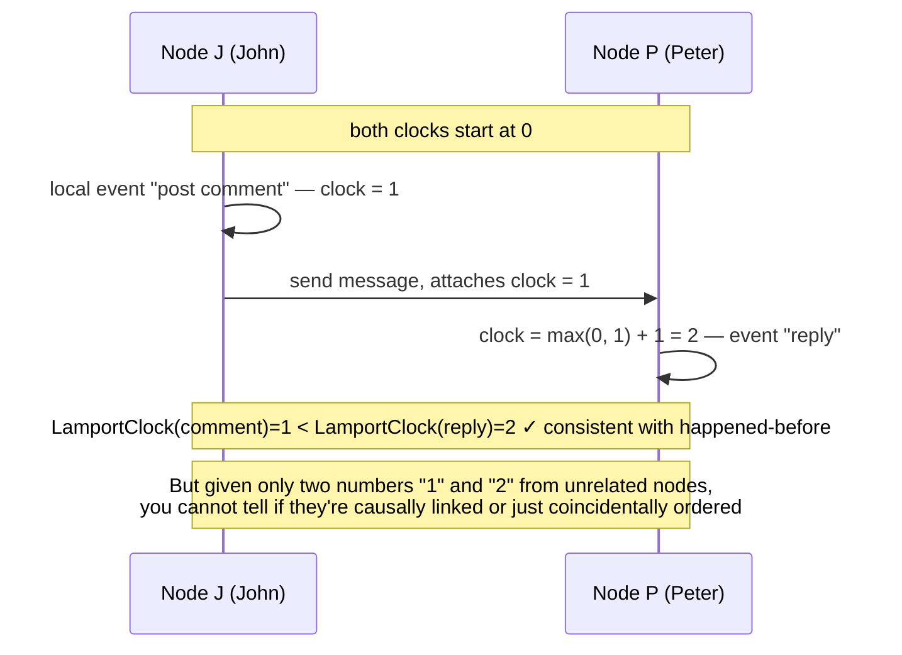

- **Interview soundbite:** "Lamport clocks tell you a valid ordering consistent with causality, but they can't tell you *whether* two events were actually causally related — for that you need vector clocks."

### 4.2 Vector clocks

- Each node maintains a **vector of counters, one per node** in the system (size `n`).
- On a local event, the node increments its own slot.
- On send, attach the full vector; on receive, take the element-wise max, then increment own slot.
- **Comparison rule** gives true causality: `V1 < V2` (causally before) iff every element of V1 ≤ corresponding element of V2, and at least one is strictly less. If neither vector dominates the other, the events are **concurrent** — this is the one design that can *correctly detect concurrency*, which is exactly what Dynamo/Riak use vector clocks for.

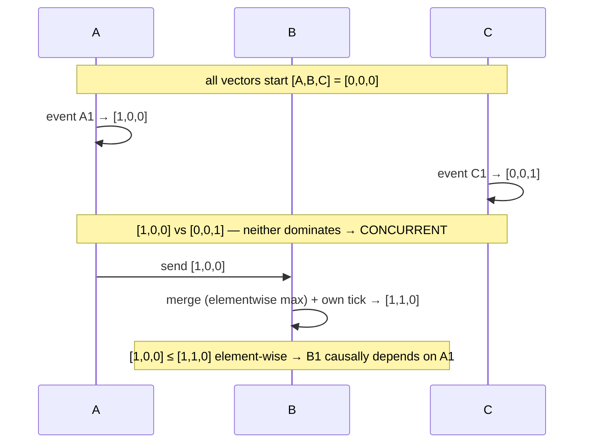

The middle `Note` is the entire point of vector clocks: Lamport clocks could never tell you A1 and C1 were unrelated — vector clocks can, because comparison is element-wise instead of a single scalar.

- ID scheme from the course: `[vector-clock (53 bits)][worker-id (10 bits)]`.
- **Cons — the big one:** vector clock size grows **O(n)** with the number of participating nodes. If every browser/client is a "node" (common in web/mobile apps), the vector becomes huge — blows way past a 64-bit budget. This is *the* trade-off to name: vector clocks give perfect causality at the cost of unbounded ID size, which is why they're rarely used as the primary key/ID itself in large-scale consumer systems (more common internally in databases like Dynamo/Riak/Voldemort, scoped to a small, bounded number of replicas rather than all clients).

### 4.3 TrueTime API (Google Spanner) — the "gold standard" answer

- Instead of returning a single timestamp, `TT.now()` returns an **interval** `[earliest, latest]` — an explicit uncertainty bound (`ε`), because no clock is perfectly synchronized.
- Backed by **GPS receivers and atomic clocks** in every data center; Google reports clock uncertainty kept to ~7ms via Marzullo's algorithm intersecting multiple time references.
- **Spanner's core guarantee ("external consistency"):** if `A_latest < B_earliest`, then A definitely happened before B. If intervals overlap, order is ambiguous (Spanner's **commit-wait**: it waits out `ε` before acknowledging a commit so that later transactions are guaranteed to see a later timestamp — this is the mechanism, worth naming).

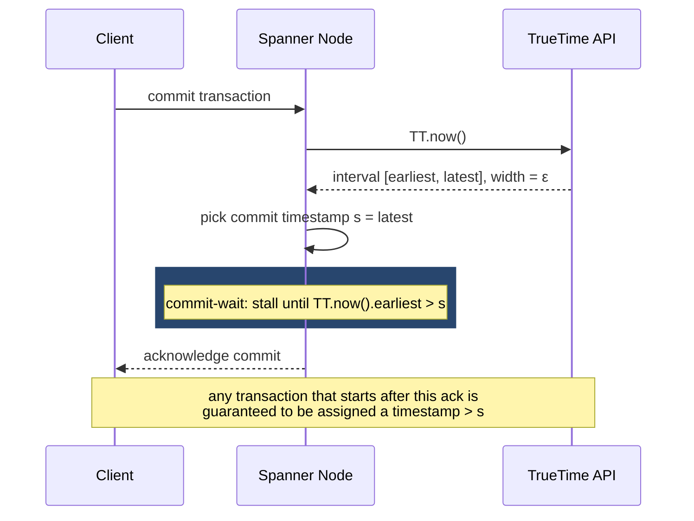

The stall inside commit-wait is the whole trick: Spanner doesn't achieve certainty by making clocks perfect, it achieves certainty by **waiting out its own admitted uncertainty** before telling anyone the commit happened.

- **ID layout used here:** `[sign:1][timestamp T_E:41][uncertainty ε:4][worker:10][sequence:8]`.
- **Pros:** satisfies *all five* requirements including causality — this is the only design in the chapter that gets a full checkmark row.
- **Cons:** if intervals overlap you still can't order two events with certainty (just bounded uncertainty, not zero). Extremely expensive — dedicated atomic-clock/GPS hardware per data center, elaborate monitoring — not something you build unless you're Google-scale.
- **Interview soundbite:** "TrueTime doesn't eliminate clock uncertainty, it makes it *explicit and bounded*, then engineers around it with commit-wait." That one line signals you understand Spanner beyond the buzzword.

### Full requirements comparison table (memorize the shape, not every cell)

| Approach | Unique | Scalable | Available | 64-bit numeric | Causality |
|---|---|---|---|---|---|
| UUID (v4) | ✖ (probabilistic) | ✔ | ✔ | ✖ (128-bit) | ✖ |
| Central DB counter | ✖ (unsafe rescale) | ✖ | ✔ | ✔ | ✖ |
| Range handler | ✔ | ✔ | ✔ | ✔ | ✖ |
| UNIX timestamp | ✖ (same-ms collide) | weak | ✔ | ✔ | weak |
| Twitter Snowflake | ✔ | ✔ | ✔ | ✔ | weak |
| Vector clocks | ✔ | weak (size grows) | ✔ | can exceed 64-bit | ✔ |
| TrueTime | ✔ | ✔ | ✔ | ✔ | ✔ |

### 4.4 The decision guide — reconstruct this live in an interview

This is the one diagram to actually rebuild on a whiteboard when asked "design a unique ID generator" cold. Walk it top-to-bottom out loud — each diamond is a clarifying question you should be asking the interviewer anyway.

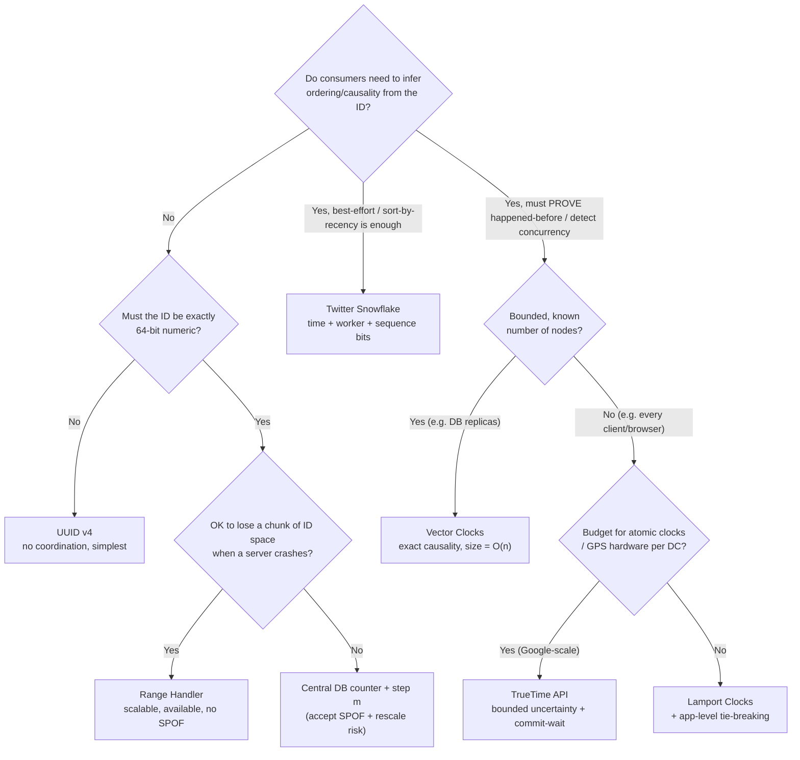

Say the requirement out loud before you pick the leaf — "the interviewer didn't ask for causality, so I'll stop at range handler" is a *complete, senior-level answer*. Don't reflexively walk all the way to TrueTime if nothing asked for it.

---

## 5. Design decisions & trade-offs to narrate explicitly

- **ID length vs. index performance:** longer keys (128-bit UUID, unbounded vector clocks) slow down B-tree primary-key inserts/updates due to worse locality and larger index pages. This is a real, measurable cost, not a theoretical one — always mention it when someone proposes "just use UUIDs everywhere."
- **Random vs. sequential vs. time-ordered IDs — the security/business trade-off:** sequential IDs (DB counter, range handler without shuffling) leak business metrics — e.g., competitors can infer daily order volume from two consecutive order IDs. Fix: add a random component (like Snowflake's sequence bits, or hash/obfuscate before exposing externally) at a small performance/complexity cost. This is a good "requirement I'd clarify" moment in an interview: *"do the IDs get exposed to end users/URLs, or are they purely internal?"*
- **Counters vs. timestamps:** simple counters are cheaper to generate than fetching a timestamp (a syscall/library call), but need durable, persisted storage (which reintroduces the DB-SPOF and write-amplification problem) if you want them gapless/recoverable across restarts.
- **Monotonic IDs can create database hotspots.** Direct Spanner quote worth repeating verbatim in an interview: *"using monotonically increasing (or decreasing) values as row keys does not follow best practices in Spanner because it creates hotspots in the database, leading to a reduction in performance."* This is because a strictly increasing key concentrates all recent writes on the same shard/node/hot range (the "last" leaf of the B-tree). **Mitigation:** shuffle/hash the ID or reverse the bit order of the timestamp before using it as a row key, or shard by a separate hash key while keeping the sortable ID as a secondary attribute.
- **Global total ordering is expensive — know the exact Spanner numbers.** Spanner: a single-row read-update transaction cell has ~10ms latency → max theoretical throughput of **100 sequence values/sec system-wide**, regardless of how many client instances or nodes you add — because a single row is always managed by a single node. This is the single best "why don't we just use a database counter at scale" answer available — cite the number.
- **Relaxing requirements buys performance.** If you can tolerate gaps (non-contiguous IDs) or give up strict global ordering, you get dramatically better throughput (range handler, Snowflake). This is the meta-lesson of the whole chapter: **uniqueness, strict ordering, and gaplessness cannot all be cheap simultaneously in a distributed system** — pick which one to relax based on the actual product requirement.

---

## 6. How to identify this topic in an interview

Watch for these phrases/scenarios — they signal the interviewer wants a sequencer deep-dive, not a one-liner:

- "How would you generate a **primary key** for a **horizontally sharded** table?"
- "How do you assign **IDs to Tweets/posts/messages** such that they're **roughly sortable by time**?"
- "We need to **trace a request across microservices** — how do you tag it?" (→ TraceID / Canopy / Dapper analogy)
- "Two clients write to the same key concurrently — how do you decide which write wins?" (→ vector clocks / LWW)
- "Your ID generator server died — what happens to in-flight ID requests?" (→ SPOF discussion, range handler failover)
- "Can two services running in different data centers ever generate the same ID?" (→ worker ID / data-center bits, clock drift)
- Any mention of **payment/order idempotency** — hints at needing deterministic (not probabilistic) uniqueness, because duplicate order IDs = double charges.
- **A trap to avoid:** if asked "design a unique ID generator" cold, don't jump straight to "Snowflake." State requirements first (uniqueness, scale, availability, size, causality-or-not), *then* walk the escalation UUID → DB → range handler → Snowflake → logical clocks → TrueTime, picking the right stopping point based on which requirements the interviewer actually cares about. Stopping at "range handler" is a perfectly good answer if causality was never asked for.

---

## 7. Interview cheat-sheet (recall under pressure)

- 64 bits lasts **~50.5 million years** at 1B IDs/day — say this number to show you did the math.
- **UUID v4**: no coordination, 128-bit, probabilistic uniqueness, bad as a DB primary key (index locality).
- **DB counter + step `m`**: SPOF; rescaling `m` on server add/remove **causes real collisions** — know the A/B/C example cold.
- **Range handler**: central microservice leases contiguous ranges; app servers burn through them locally (no per-ID network call); replicated state + failover replica removes the SPOF; wasted range on crash is the cost.
- **Snowflake** = `[sign:1][timestamp:41][worker:10][sequence:12]`; ~69 years of timestamp headroom; 4,096 IDs/ms/worker; NTP clock drift is the real weakness — production systems must detect backward clock jumps.
- **Lamport clock**: gives *a* valid happened-before-consistent order, cannot detect concurrency.
- **Vector clock**: `O(n)` size in number of nodes — the only mechanism that can *prove* two events are concurrent; too big for client-scale systems.
- **TrueTime**: returns `[earliest, latest]` interval, not a point; GPS + atomic clocks, ~7ms uncertainty; Spanner uses **commit-wait** to turn bounded uncertainty into external consistency; expensive infrastructure.
- **Monotonic IDs as row keys create hotspots** — Spanner explicitly warns against this; shuffle/hash before using as a shard key.
- **Global sequence throughput is fundamentally capped** — Spanner: ~100 values/sec system-wide for a single monotonic sequence, no matter how many nodes you add, because one row = one node.
- The meta-trade-off of the whole chapter: **uniqueness + strict ordering + gaplessness** can't all be cheap in a distributed system — relax one on purpose, and say which one and why.
