# Distributed Monitoring — FAANG Interview Guide

## The whole chapter in one picture

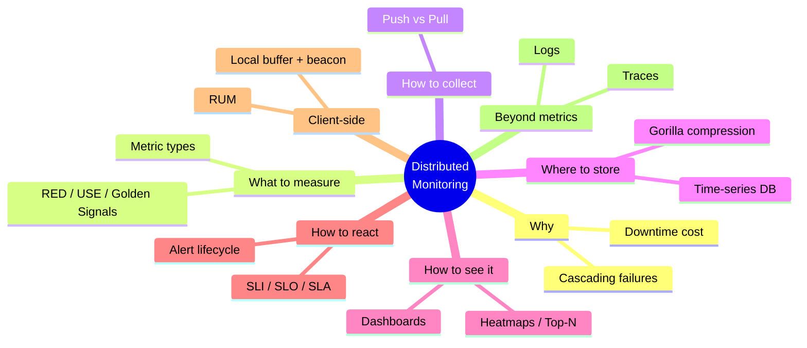

Come back to this picture after reading the guide once — if you can regenerate every branch from memory, you're interview-ready.

---

## 1. Mental model

A distributed system is a black box made of thousands of moving parts across
hundreds of servers and dozens of data centers. Monitoring is the
**nervous system** — it converts silent internal state (CPU load, error
rates, queue depth) into signals a human or an automated system can act on.

Three questions a monitoring system must answer, in order of urgency:

1. **Is something on fire right now?** → alerting
2. **What does "normal" look like, and are we drifting?** → metrics + dashboards
3. **Why did it break, after the fact?** → logs + traces (root cause)

Without monitoring, the only failure signal is a user complaint or a
support ticket — by which point the damage is already done. The goal is to
detect failures **before** they cascade, not after.

The whole discipline collapses into one pipeline — every section below is
one box in this picture:

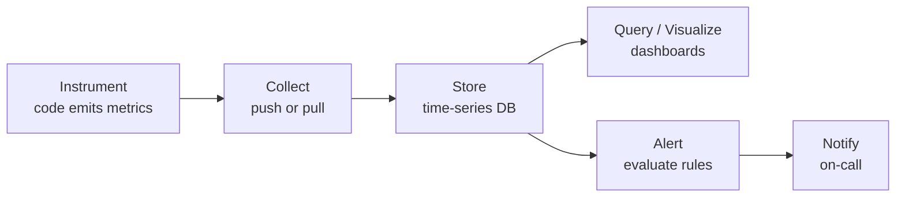

### Why cascading failures matter (from the course example)

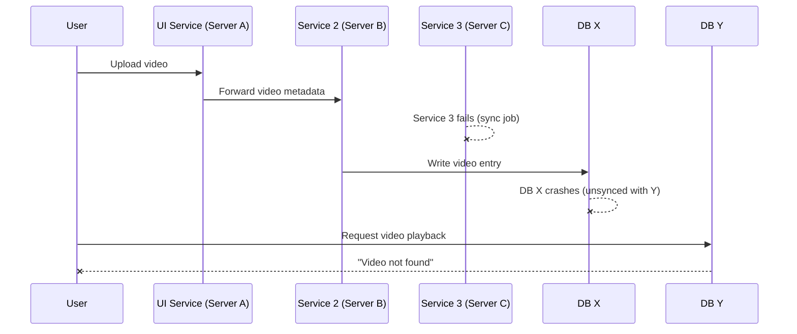

One silent failure (service 3) turns into a **customer-visible** error
several hops downstream. Nobody paged on service 3 failing — the first
signal anyone got was a user-facing 404. That gap is exactly what
monitoring closes.

**Interview cheat-sheet:**
- Frame monitoring as "convert unknowns into knowns, early."
- Always mention **early warning** and **root-causing** as the two jobs — interviewers listen for this split.
- Cascading-failure example is a great 30-second opener to justify *why* the interviewer should care about this building block.

---

## 2. The cost of not monitoring (memorize these numbers)

| Incident | Date | Cost |
|---|---|---|
| Meta (FB/IG/WhatsApp/Oculus) outage | Oct 2021 | ~$13M / hour |
| AWS us-east-1 network congestion outage | Dec 7, 2021 | ~$66,240 / minute |
| General rule of thumb interviewers expect | — | "Every minute of downtime for a top-tier consumer app costs tens of thousands of dollars, plus reputational/SLA damage" |

Use these numbers to justify **why** you're spending interview time on
observability instead of jumping straight to a data model — monitoring is a
first-class non-functional requirement, not an afterthought.

**Cheat-sheet:**
- Downtime cost scales with (revenue/sec + SLA penalties + churn), not just infra cost.
- Root cause of the AWS Dec 2021 outage: an automated capacity-scaling job triggered a connection storm that congested internal network devices — a **feedback loop**, not a hardware failure. Good example of "monitoring must watch for retry storms," not just raw errors.

---

## 3. Two failure domains: server-side vs. client-side

| | Server-side errors | Client-side errors |
|---|---|---|
| **HTTP class** | 5xx | 4xx (visible) / nothing at all (invisible) |
| **Visibility** | Always visible to the backend — it generated the error | Sometimes invisible — request never reached the server |
| **Detected via** | APM agents, server logs, exception tracking | RUM (real user monitoring), client-side SDKs, beacon pings |
| **Example** | DB connection pool exhausted → 503 | User's WiFi drops before request is sent → server sees *nothing* |
| **Tooling** | Prometheus, Datadog APM, New Relic | Sentry, Bugsnag, Google Analytics RUM, Firebase Crashlytics |

The invisible case (request never arrives) is the hard one — you cannot
instrument a server for a request it never received. This is why
client-side monitoring needs its **own** pipeline (client SDK batches
events locally, sends them opportunistically) rather than piggybacking on
server logs.

**Cheat-sheet:**
- If the interviewer says "how would you know a user's request never made it to your service" — that's the client-side/invisible-error signal. Answer: client SDK + periodic beacon/heartbeat + local buffering with retry-on-reconnect.

---

## 4. Metrics: the atomic unit of monitoring

A **metric** = what to measure + the unit + a timestamped value.
Good metrics have low collection overhead — measuring must not itself
degrade the system (avoid death-by-observability).

### Metric types (the source glosses over this — know it cold)

| Type | Semantics | Example | Aggregation |
|---|---|---|---|
| **Counter** | Monotonically increasing, resets on restart | `requests_total`, `errors_total` | `rate()` / `increase()` over time window |
| **Gauge** | Point-in-time value, goes up or down | `queue_depth`, `memory_used_bytes` | last value, avg, min/max |
| **Histogram** | Distribution of values bucketed by range | `request_latency_ms` buckets: `<10, <50, <100, <500, +Inf` | compute p50/p90/p99 from buckets |
| **Summary** | Pre-computed quantiles client-side | `request_latency_ms{quantile="0.99"}` | can't re-aggregate across instances (major limitation) |

**Trade-off interviewers love to probe:** histogram vs. summary. Histograms
are aggregatable across servers (bucket counts sum), summaries are not
(you cannot average two p99s and get a correct global p99). Always prefer
histograms for anything you'll aggregate across a fleet.

**Pick-the-metric-type flowchart** — run through this in your head any time
you instrument something new:

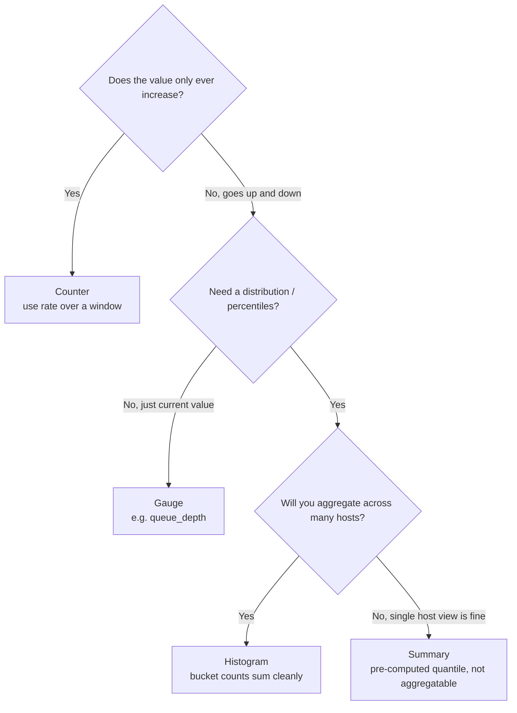

### What to actually collect
- OS-level: CPU (user/sys/iowait), memory (RSS, page faults, swap), disk (IOPS, latency, free space), network (throughput, retransmits).
- App-level (via code instrumentation): request rate, error rate, latency percentiles, queue depths, cache hit ratio, thread-pool saturation.
- The **RED method** (for request-driven services): **R**ate, **E**rrors, **D**uration.
- The **USE method** (for resources): **U**tilization, **S**aturation, **E**rrors.

**Cheat-sheet:**
- RED = "how are my services doing" (front-end for user traffic).
- USE = "how are my resources doing" (back-end, hardware/infra).
- Always tie a metric to an **action** — a metric nobody alerts on or dashboards is dead weight and adds collection overhead for nothing.

---

## 5. Push vs. pull — the central design decision

The course frames this correctly: **always describe push/pull from the
monitoring system's point of view**, not the server's, or you'll confuse
your interviewer mid-explanation.

A sequence diagram makes the key asymmetry obvious — **who initiates, and
on whose schedule**:

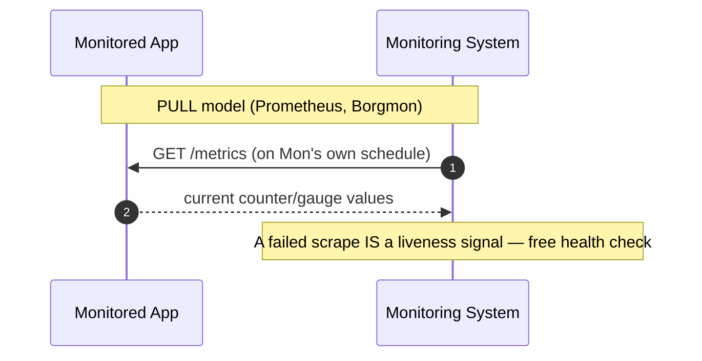

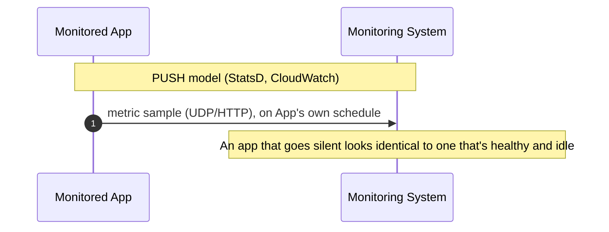

| | Pull (Prometheus-style) | Push (StatsD/Graphite-style) |
|---|---|---|
| **Who controls cadence** | Monitoring system (scrape interval) | Each server (can flood or under-report) |
| **Overload risk** | Low — monitoring system paces itself | High — many servers can push simultaneously and overwhelm the collector |
| **Firewall/NAT friendly** | No — monitoring system needs network access to every target | Yes — servers only need outbound access |
| **Short-lived jobs (batch/cron)** | Bad fit — job may finish before next scrape | Good fit — push-and-die, or push via a gateway (Prometheus Pushgateway) |
| **Service discovery need** | Yes — monitoring system must know all targets (via Consul/K8s API/DNS) | No — servers self-register by pushing |
| **Real examples** | Prometheus, Google Borgmon/Monarch | StatsD, Graphite, AWS CloudWatch (custom metrics), Facebook ODS |

**Interview answer skeleton:** "I'd default to pull for long-running
services — it's simpler to reason about load on the monitoring system and
plays well with service discovery in Kubernetes. I'd add a push path (via a
gateway) for short-lived batch/cron jobs that die before a scrape would
catch them."

**Cheat-sheet:**
- Pull = monitoring system in control, self-throttling, needs service discovery.
- Push = server in control, better through firewalls, needs a push-gateway for ephemeral jobs, risk of thundering herd.
- Real systems often run **both**: Prometheus pulls app instances directly but pulls a Pushgateway that batch jobs push into.

---

## 6. Persisting the data: time-series databases

A centralized in-memory store works at small scale. At FAANG scale (millions
of time series, thousands of samples/sec), you need a **time-series
database (TSDB)** purpose-built for:
- Append-only, timestamp-ordered writes (never random-access updates)
- Massive compression (timestamps and values are highly predictable)
- Efficient range queries ("give me this metric for the last 6 hours")
- Downsampling / rollups for long retention without unbounded storage

### Key compression trick (bring this up for depth)
Facebook's **Gorilla** (paper: "Gorilla: A Fast, Scalable, In-Memory Time
Series Database") compresses timestamp+value pairs ~12x using:
- **Delta-of-delta encoding** for timestamps (samples arrive at near-fixed intervals, so the *second* delta is usually 0)
- **XOR encoding** for floating-point values (consecutive values are usually close, so XOR-ing them yields mostly leading/trailing zero bits)

This is the single most "I've done my homework" fact you can drop in a
monitoring deep-dive.

### Real-world TSDBs
| System | Origin | Notes |
|---|---|---|
| Prometheus TSDB | CNCF/Kubernetes ecosystem | Local disk, 2-hour blocks, pull-based scraping |
| InfluxDB | Open source | Push-based, SQL-like query language |
| OpenTSDB | Built on HBase | Horizontally scalable, older-generation |
| Gorilla / Beringei | Facebook | In-memory, ~12x compression, feeds Grafana-like dashboards |
| M3DB | Uber | Built for horizontal scale + long retention, powers Uber's M3 stack |
| Amazon CloudWatch | AWS managed | Push-based, integrates natively with AWS services |
| Monarch | Google | Multi-tenant, hierarchical, backs Google's internal monitoring |

Retention is a straight-line pipeline — picture it as a conveyor belt that
gets coarser as data ages:

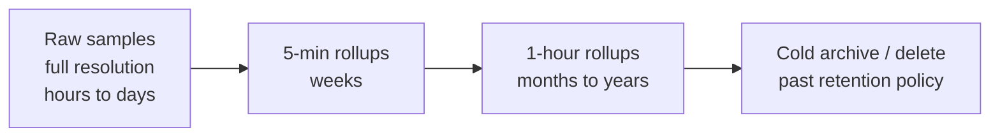

**Cheat-sheet:**
- Retention strategy: keep raw samples for hours/days, downsample (avg/max per 5-min bucket) for weeks, further downsample for years. This bounds storage growth (a classic system design trade-off: **precision vs. storage cost**).
- Cardinality explosion is the #1 operational risk in a TSDB — a label like `user_id` on a metric creates millions of unique time series and can take down the whole system. Always mention label-cardinality limits when discussing metric design.

---

## 7. High-level architecture of a monitoring system

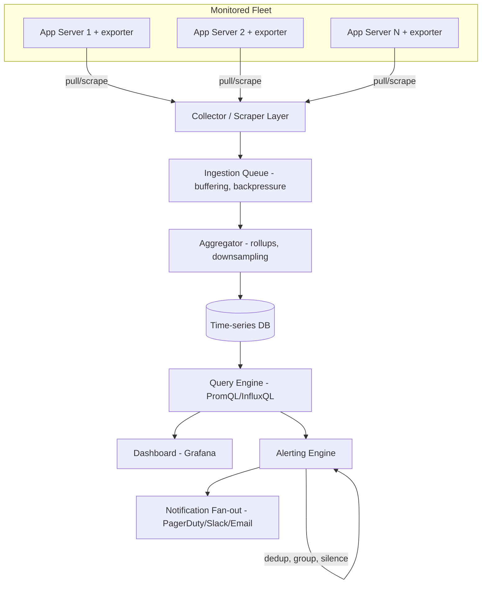

**Components to name in an interview, in this order:**
1. **Agents/exporters** on every host — expose or push metrics (node_exporter, StatsD client, custom app instrumentation).
2. **Collector/scraper layer** — horizontally sharded, does service discovery to know what to scrape.
3. **Ingestion buffer/queue** — absorbs bursts, gives backpressure protection (a Kafka-like buffer is common at scale).
4. **Aggregator** — computes rollups, downsamples for long-term storage.
5. **Time-series storage** — the durable store discussed above.
6. **Query engine** — PromQL-style query layer for both dashboards and alert rules.
7. **Dashboarding** — Grafana-style visualization.
8. **Alerting engine** — evaluates rules against the query engine, handles **deduplication, grouping, silencing, and escalation** (Prometheus Alertmanager is the canonical example).

**Cheat-sheet:**
- Always mention that the monitoring system itself must be **more available and more decoupled** than the systems it monitors — if the primary DB and the monitoring system share infra, an outage can blind you exactly when you need visibility most (monitor the monitor / use a separate failure domain).
- Sharding the collector layer by service or by data center avoids one scraper trying to pull from every host globally.

---

## 8. Visualizing enormous volumes of data

Dashboards at scale can't render millions of raw points — a few techniques
worth naming:
- **Downsampling for display**: querying a week-long range returns 5-min averages, not raw per-second samples.
- **Heatmaps** for latency distributions over time (better than overlaying hundreds of percentile lines).
- **Top-N / anomaly-highlighting views**: instead of showing every host, surface the outliers (e.g., "these 3 of 10,000 hosts have p99 > 3x fleet median").
- **Golden signals dashboards**: one screen per service showing rate, errors, duration, saturation — the first thing an on-call engineer opens.

**Cheat-sheet:**
- If asked "how do you show a human millions of data points without melting their brain," answer: aggregate before you render, and surface outliers, don't dump raw series.

---

## 9. Alerting

An alert = **condition/threshold** + **action**. Two components, but the
hard part in practice is avoiding **alert fatigue**.

Alerts aren't just on/off — they move through a real state machine
(this mirrors Prometheus Alertmanager's actual states, worth reciting
verbatim in an interview):

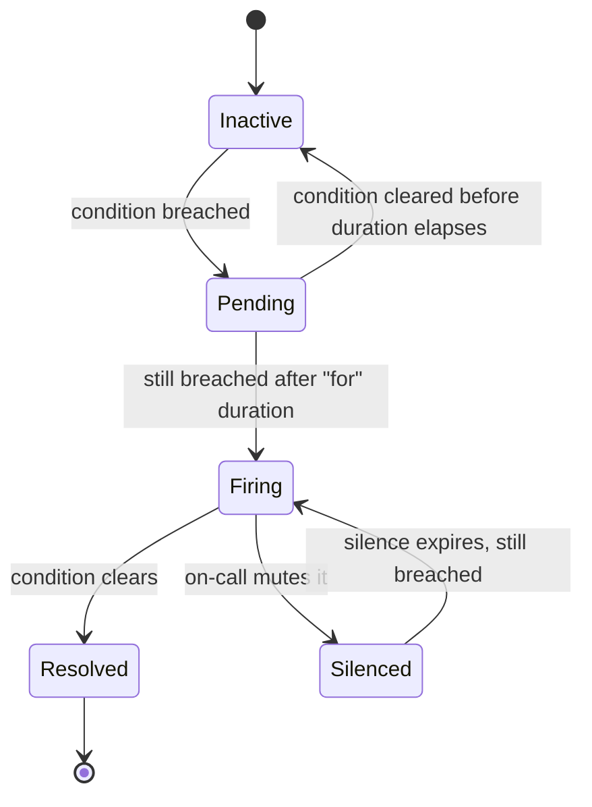

The `Pending` state is the quiet hero here — it's what stops a single
5-second blip from paging someone; only a breach that survives the `for`
window becomes `Firing`.

| Technique | Purpose |
|---|---|
| **Deduplication** | Same root cause firing 500 alerts across 500 hosts → collapse to 1 |
| **Grouping** | Alerts for the same service/incident bundled into a single notification |
| **Silencing/muting** | Suppress known, expected alerts (e.g., during planned maintenance) |
| **Escalation policies** | Page on-call → escalate to secondary → escalate to manager, on a timer |
| **Multi-window, multi-burn-rate alerts** | Alert only if an SLO error budget is burning fast (Google SRE technique) — avoids paging for tiny blips |

### SLI / SLO / SLA — bring these up, interviewers expect it
- **SLI** (indicator): the actual measured metric, e.g., "% of requests under 300ms."
- **SLO** (objective): the internal target, e.g., "99.9% of requests under 300ms over 30 days."
- **SLA** (agreement): the external, often contractual, commitment with financial penalties for breach — usually looser than the SLO to leave margin.
- **Error budget**: `1 - SLO`. If SLO is 99.9%, you have a 0.1% error budget per period — alerting logic should be built around **burn rate** against this budget, not raw thresholds.

**Cheat-sheet:**
- Alert on **symptoms** (user-facing latency/error rate), not causes (CPU is at 80%) — causes should feed dashboards, not pages, or you get paged for things that don't actually hurt users.
- Alerting engine should be a distinct component from the query/storage engine — Alertmanager pattern (rule evaluation is stateless and can run independently of storage).

---

## 10. Client-side monitoring deep-dive

Server-side pain is always visible somewhere; client-side pain can be
**totally invisible** to the backend (the request never arrived). Real
systems solve this with:

- **RUM (Real User Monitoring)** SDKs embedded in the client (web/mobile) that record page-load time, JS exceptions, API call failures, and crash reports.
- **Local buffering + batch upload**: client buffers events and flushes them opportunistically (on a timer, on app foreground, or via `navigator.sendBeacon` on page unload) so flaky connectivity doesn't lose data.
- **Sampling**: at billions of events/day, sample (e.g., 1% of successful requests, 100% of errors) to control cost while still catching every failure.
- **Session replay / breadcrumbs** (Sentry-style): capture the sequence of user actions leading up to a crash for debugging without full video capture.
- **Beaconing/heartbeat**: a lightweight periodic "I'm still alive and my last N requests looked like X" ping lets you detect the case where the client can't reach the primary service at all, distinguishing "client crashed" from "client can't reach us."

The resilience trick is the local buffer sitting *between* the event and
the network call — draw this whenever asked "how does client-side
monitoring survive a flaky connection":

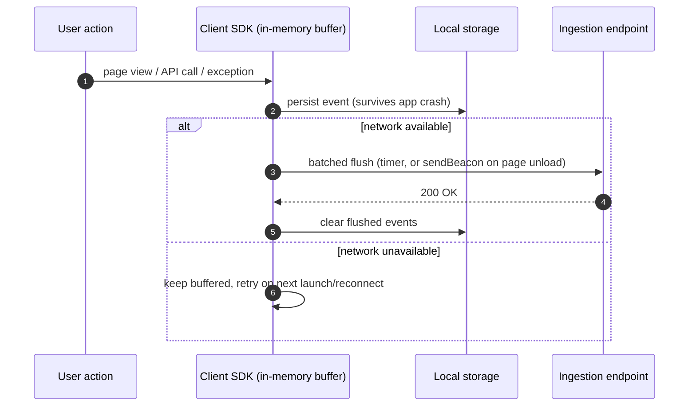

**Real-world examples:** Sentry, Bugsnag, Firebase Crashlytics, Google
Analytics/Search Console Core Web Vitals, New Relic Browser, Datadog RUM.

**Cheat-sheet:**
- Client-side pipeline is architecturally separate from server-side: client SDK → batched HTTP POST to an ingestion endpoint → same pipeline (queue → aggregator → TSDB) from there on.
- The invisible-failure case (packet never leaves the device) can only be caught by watching for **drop-offs in expected client heartbeats**, not by anything server logs can show.

---

## 11. Logs vs. Metrics vs. Traces (the three pillars)

| | Metrics | Logs | Traces |
|---|---|---|---|
| **Shape** | Numeric time series | Unstructured/structured text events | Causally-linked spans across services |
| **Cardinality** | Low (aggregatable) | High (every event) | High (per-request) |
| **Cost** | Cheap to store long-term | Expensive at scale, needs retention limits | Expensive, usually sampled |
| **Answers** | "Is something wrong, and how bad?" | "What exactly happened at 3:02:17am?" | "Which of these 12 microservices added the latency?" |
| **Tools** | Prometheus, CloudWatch, Datadog | ELK/OpenSearch, Splunk, Loki | Jaeger, Zipkin, OpenTelemetry, AWS X-Ray |

Pick the right pillar for the question actually being asked — this is the
#1 place candidates lose points by forcing metrics to answer a tracing
question:

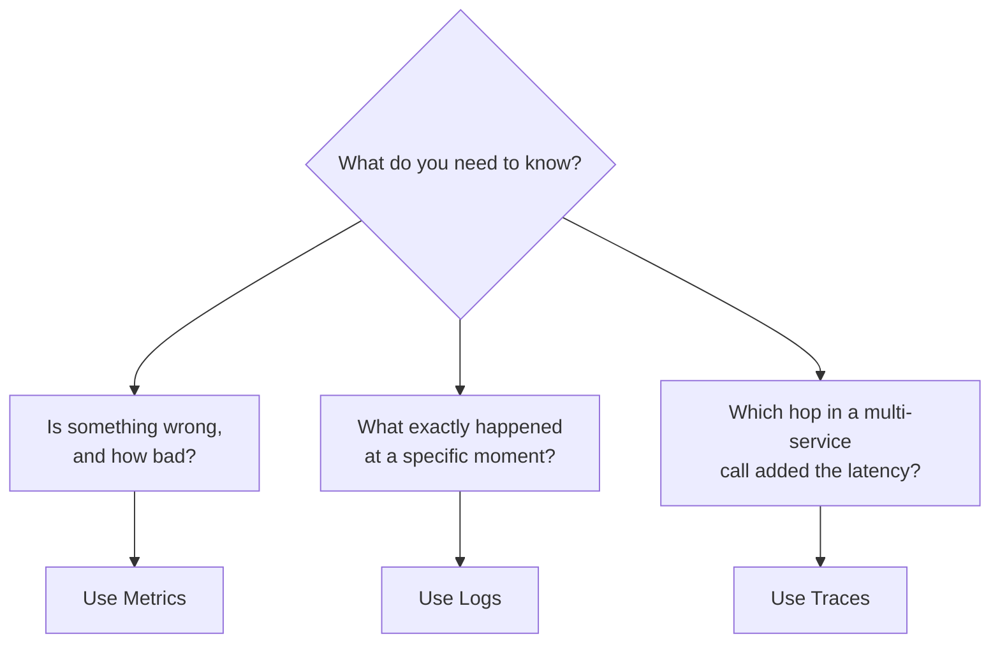

**Cheat-sheet:**
- If the interviewer pushes into "how do you find *why* a specific slow request was slow across 10 microservices" — that's distributed tracing, not metrics. Know the difference and pivot correctly instead of forcing metrics to answer a tracing question.
- OpenTelemetry is the current industry-standard instrumentation layer that emits all three (metrics, logs, traces) — worth name-dropping as the modern unification point.

---

## 12. Real-world systems to cite

| Company | System | Notable design choice |
|---|---|---|
| Google | Borgmon → Monarch | Hierarchical, multi-tenant time-series monitoring; Monarch trades some query flexibility for massive scale |
| Facebook/Meta | ODS + Gorilla + Scuba | Gorilla TSDB for in-memory time series; Scuba for ad-hoc real-time analytics on structured events |
| Amazon | CloudWatch | Push-based, deeply integrated with every AWS service, per-account/region isolation |
| Uber | M3 (M3DB + M3 Aggregator) | Built for horizontal scalability of Prometheus-compatible metrics at Uber's scale |
| CNCF/Kubernetes ecosystem | Prometheus + Grafana + Alertmanager | De facto open-source standard; pull-based scraping, PromQL, became the template most interviewers expect |
| Netflix | Atlas | In-memory dimensional time-series DB, built for very high cardinality |

---

## 13. How to identify this topic in an interview

Signals that the interviewer wants a monitoring-system design (not just a
mention):
- "How would you know if your service is degrading before customers complain?"
- "Design a system to track metrics/logs/alerts across thousands of servers."
- "How do you detect and alert on failures in a distributed system?"
- Follow-ups on any other system design ("Design YouTube") asking "how would you monitor this in production?"

Common trap: candidates jump straight to "I'd use Prometheus and Grafana"
without explaining **why** those tools embody the right trade-offs (pull
model, PromQL for aggregation, Alertmanager for dedup). Naming tools is
fine, but always justify with the underlying design decision.

---

## Master Cheat Sheet

**Two failure domains:** server-side (5xx, always visible) vs. client-side (4xx or fully invisible — request never arrived).

**Metric types:** counter (monotonic, use `rate()`), gauge (point-in-time), histogram (aggregatable buckets — prefer this), summary (client-side quantiles, NOT aggregatable across hosts).

**RED method** (services): Rate, Errors, Duration. **USE method** (resources): Utilization, Saturation, Errors.

**Push vs pull:**
- Pull (Prometheus): monitoring system controls cadence, self-throttling, needs service discovery, bad for ephemeral jobs (use a Pushgateway).
- Push (StatsD/CloudWatch): server controls cadence, firewall-friendly, risk of thundering herd on the collector.

**TSDB compression trick:** Facebook Gorilla — delta-of-delta timestamps + XOR'd float values, ~12x compression.

**Architecture pipeline:** exporters/agents → collector/scraper (sharded, service discovery) → ingestion buffer → aggregator/downsampler → TSDB → query engine → {dashboard, alerting engine} → notification fan-out (dedup/group/escalate).

**Cardinality explosion** is the #1 way to accidentally kill a monitoring system — never put unbounded-cardinality fields (user_id, request_id) directly into metric labels.

**SLI/SLO/SLA:** SLI = measured value, SLO = internal target, SLA = external contractual commitment (looser than SLO). Error budget = `1 - SLO`; alert on burn rate, not raw threshold.

**Alert on symptoms (user-facing), not causes (CPU%)** — causes belong on dashboards, not pages.

**Three pillars:** metrics (is it broken + how bad), logs (what exactly happened), traces (which hop in the call chain added the latency). OpenTelemetry unifies instrumentation for all three.

**Downtime costs to quote:** Meta Oct 2021 ≈ $13M/hour; AWS Dec 2021 ≈ $66,240/minute (root cause: automated capacity-scaling job → connection storm → network congestion, a feedback-loop failure, not hardware).

**Client-side monitoring:** RUM SDK, local buffer + batch/beacon upload, sampling (100% errors, 1% success), heartbeats to catch "never reached us" failures that server logs can never show.

**Real systems to namedrop:** Prometheus + Grafana + Alertmanager (open source standard), Google Monarch/Borgmon, Facebook Gorilla/ODS/Scuba, AWS CloudWatch, Uber M3, Netflix Atlas, Sentry/Datadog RUM (client-side).
