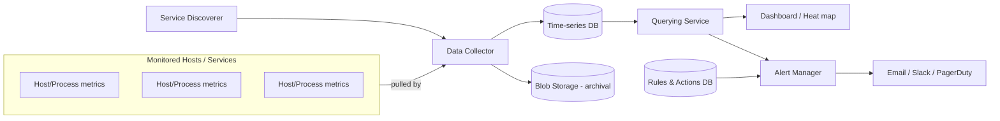
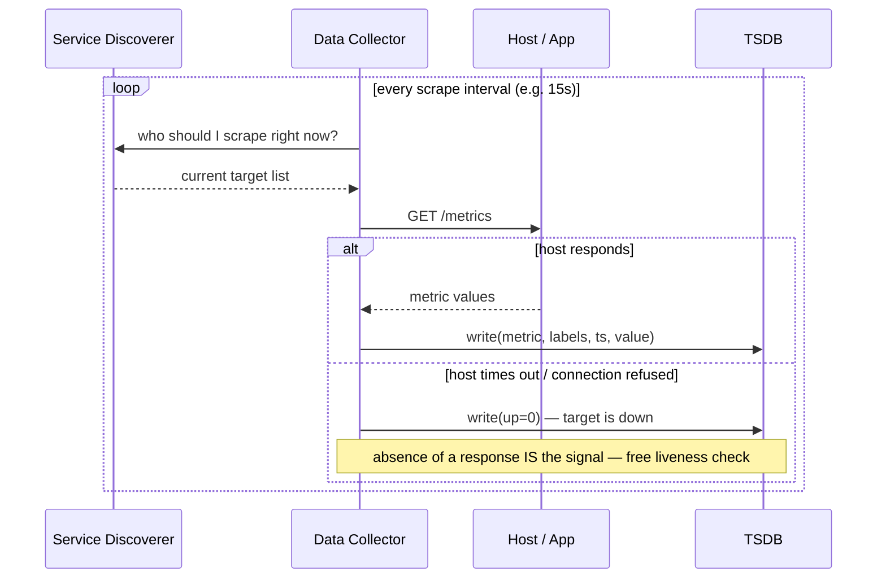
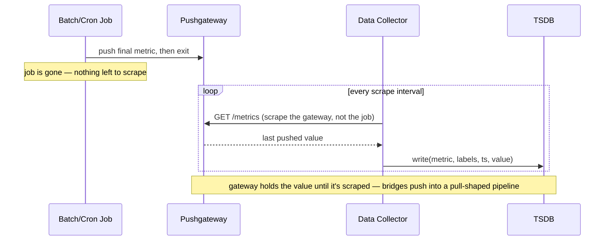
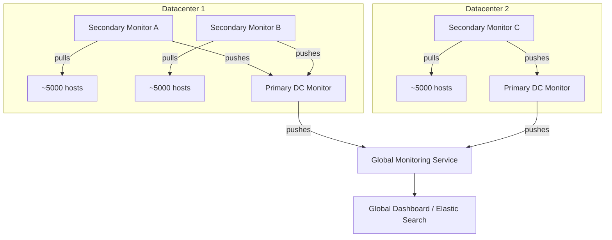
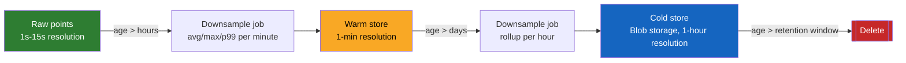
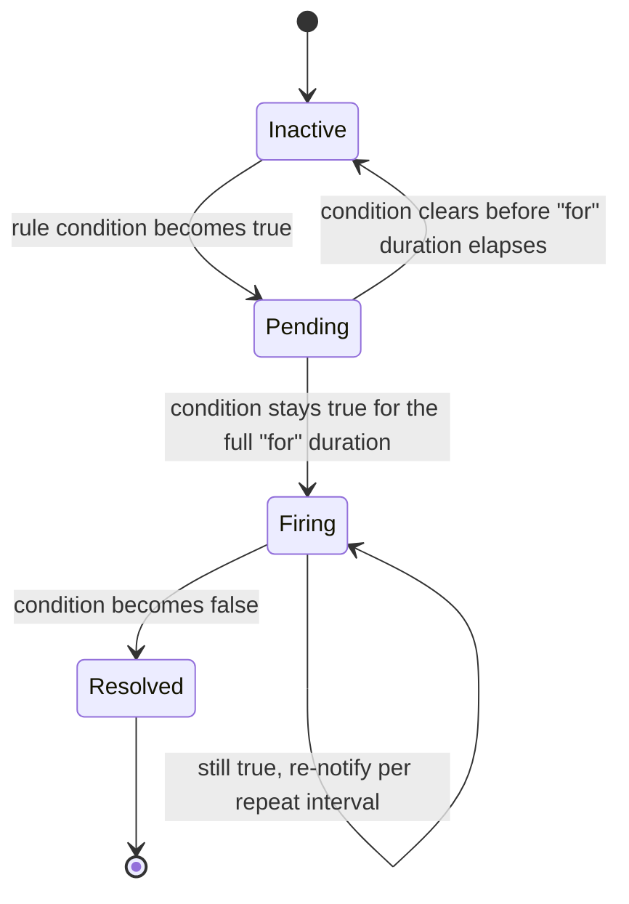
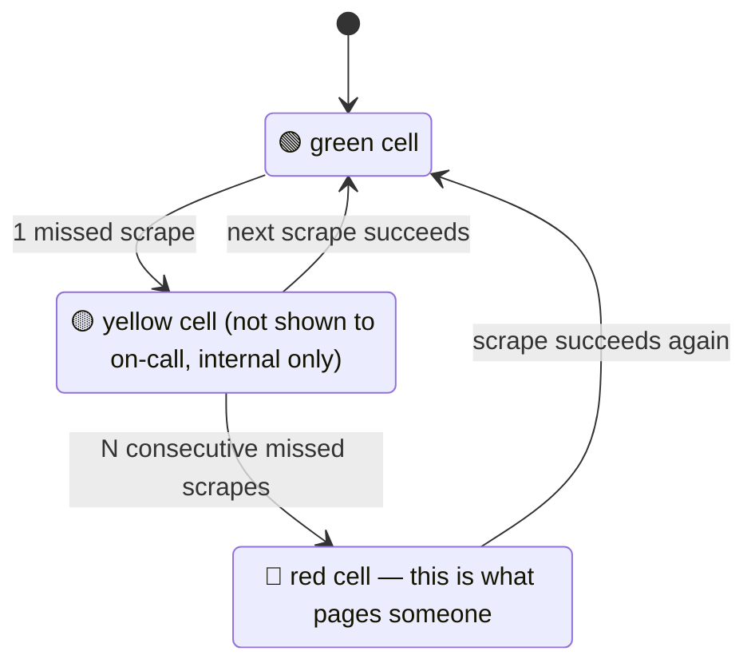
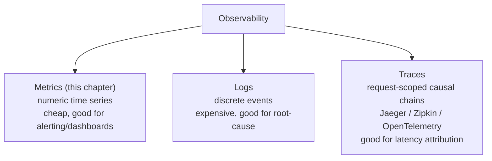
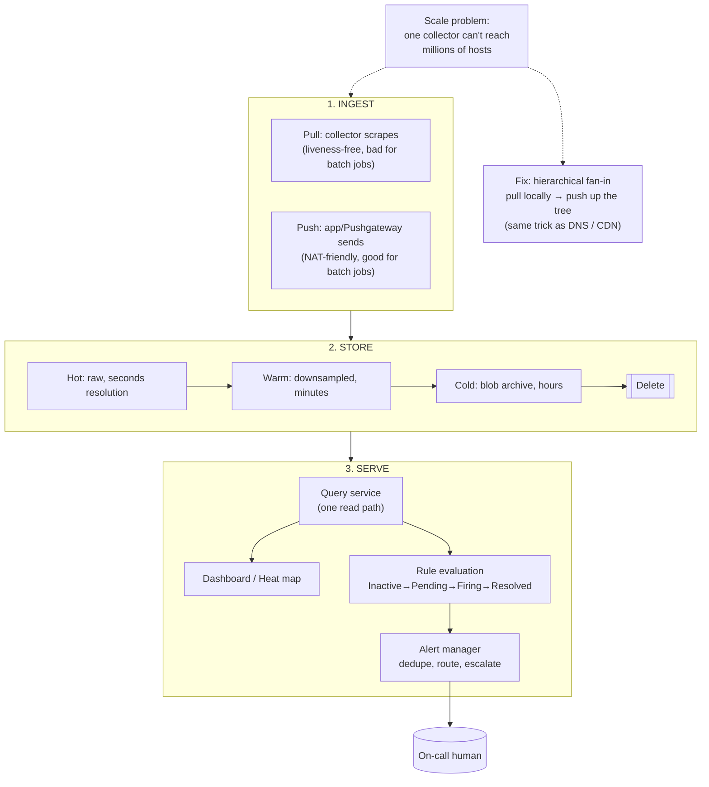

# Monitoring Systems (Server-side) — FAANG Interview Guide

## Mental model

A monitoring system is a **time-series database with an opinion**: it ingests numbers-over-time from thousands of sources, lets you query trends, and fires alerts when a rule is violated. Everything else (dashboards, heat maps, service discovery) is scaffolding around that one core loop:

```
collect metric → store as time series → query/aggregate → alert or visualize
```

Think of it as a funnel: **millions of raw data points/sec → downsampled and aggregated → thousands of dashboard queries/sec, dozens of alert evaluations/sec**. The entire design is shaped by that funnel — write-heavy, high-cardinality ingestion at the front; read-light, low-latency queries at the back.

## Why it exists

In a distributed system with thousands of servers, you can't SSH in and `top` your way to understanding. Failures are silent by default — a leaking process, a disk approaching full, a slow network link don't announce themselves. Monitoring is the nervous system: without it you find out about outages from customers (or Twitter) instead of from an alert.

---

## Requirements (how the interviewer expects you to frame scope)

**Functional**
- Monitor process crashes, resource anomalies (CPU/memory/disk/network) per server.
- Monitor overall server/host health and hardware faults (failing disks, memory ECC errors).
- Monitor reachability of out-of-server dependencies (NFS, other services).
- Monitor network infra: switches, load balancers, routing/DNS, peering points, link latency.
- Monitor power at server/rack/datacenter level.
- Monitor cross-datacenter service health (e.g., a CDN's global performance).
- Automatically detect anomalies → notify an alert manager or render on a dashboard.

**Non-functional**
- **Scalable**: millions of servers, many metrics per server, continuous ingestion.
- **Available**: the monitoring system itself must not be a bigger SPOF than what it watches — "who monitors the monitor?"
- **Low collection overhead**: monitoring must not meaningfully perturb the systems it watches (avoid the observer effect).
- **Timely**: alerts within seconds-to-low-minutes of a real incident, not hours.
- **Storage-efficient**: metrics are generated 24/7 forever — need retention/downsampling policy, not "keep everything."

**Cheat-sheet**
- State requirements as: collect → store → query → alert → visualize. That's the whole rubric.
- Always call out that the monitoring system must be *more* available than the systems it watches — interviewers listen for this line.
- Mention retention/downsampling explicitly — it signals you understand storage costs at scale.

---

## High-level design

| Component | Responsibility |
|---|---|
| **Data collector** | Pulls (or receives pushed) metrics from each service/host |
| **Service discoverer** | Tells the collector *what* to monitor (dynamic host/service list) |
| **Time-series storage (TSDB)** | Stores metric points keyed by (name, labels, timestamp) |
| **Rules & actions DB** | Stores alerting rules ("CPU > 90% for 5 min → alert") |
| **Blob storage** | Archival tier for high-volume/older metric data |
| **Querying service** | API to query/aggregate the TSDB (powers dashboards + alert evaluation) |
| **Alert manager** | Evaluates rules, dedupes/routes, sends email/Slack/PagerDuty |
| **Dashboard/visualizer** | Human-facing graphs, heat maps |



**Mnemonic (say it as a sentence, not a list):** *"Scouts find hosts, Collectors fetch data, a Warehouse stores it, Analysts query it, Judges alert on it, Screens show it."* → Discoverer → Collector → TSDB → Query service → Alert manager → Dashboard.

**Cheat-sheet**
- Six components, memorize them in this order: collector → discoverer → storage → query → rules/alert → dashboard.
- The **querying service** is the one component that serves *both* dashboards and the alert manager — don't build two separate read paths.
- A **rules & actions DB is separate from the TSDB** — rules are low-volume config data, metrics are high-volume time-series data. Don't conflate the two stores.

---

## Deep dive: pull vs. push (the central trade-off in this chapter)

This is the single most-tested design decision in a monitoring-system interview.

| | **Pull** (collector scrapes targets) | **Push** (targets send to collector) |
|---|---|---|
| Who initiates | Monitoring system | The monitored application |
| Example systems | Prometheus, Nagios, DigitalOcean's monitor | StatsD, Amazon CloudWatch (agent-pushed), Graphite (classic) |
| Network impact | Predictable — collector controls rate, one connection pattern | Can create thundering-herd traffic spikes if many apps push at once |
| Failure signal | **Free liveness check** — if a scrape fails, target is down (absence = alertable signal) | Silence is ambiguous — is the app dead, or did the push just not fire? |
| Firewall/NAT | Collector needs network path *to* every target (hard across clusters/regions/firewalls) | Target just needs an outbound path to the collector — easier through NAT/firewalls |
| Ephemeral jobs (batch/cron) | Bad fit — job may finish before a scrape happens | Good fit — job pushes its result once and exits (Prometheus solves this with a **Pushgateway**) |
| Cardinality/service discovery | Collector must maintain a live list of targets (needs service discovery) | Targets self-register by pushing; less central bookkeeping |
| Scale bottleneck | Collector fan-out to N targets — bounded by collector's scrape capacity | Ingestion endpoint must absorb bursts from N uncoordinated senders |

**What one pull cycle looks like, end-to-end** (this is the diagram to draw if asked "walk me through how a metric gets collected"):



**What a push cycle looks like** (batch job via Pushgateway — the case pull can't handle):



**The interview answer:** neither is "correct" — production systems are **hybrid**.
- Prometheus is pull-first but ships a Pushgateway for short-lived batch jobs.
- This course's design converges on a **hierarchical hybrid**: pull within a datacenter (secondary monitoring servers pull from ~5,000 hosts each), then **push up** the hierarchy — secondary → primary datacenter server → global monitoring service.



**Why hierarchy scales:** each level only fans out/in to a bounded number of children — add capacity by adding nodes at a level or adding a new level, the same pattern used in DNS, CDN edge hierarchies, and log aggregation. Name this explicitly in an interview: **"hierarchical fan-in is a repeating pattern across distributed systems design."**

**Cheat-sheet**
- Pull gives you liveness-for-free (absence of a scrape = down). Push doesn't, unless you add a heartbeat/last-seen timestamp check.
- Batch/cron jobs are the classic pull weakness — solved by a pushgateway/sidecar pattern.
- Real answer to "push vs pull": **pull within a trust domain, push across trust/network domains** (this is exactly what cross-DC hierarchies do).

---

## Deep dive: storage (time-series database)

A metric point is essentially `(metric_name, labels/tags, timestamp, value)` — e.g. `cpu_usage{host="web-42", region="us-east"} @ t=1699999999 → 87.3`.

**Why not a regular relational DB?**
- Write pattern is append-only, extremely high volume, mostly-increasing timestamps — TSDBs (InfluxDB, Prometheus's own TSDB, OpenTSDB, M3DB, Gorilla/Facebook) exploit this for compression (delta-of-delta timestamp encoding, XOR-based float compression — Facebook's Gorilla paper gets ~1.37 bytes/point).
- Query pattern is range scans over time + aggregation (avg/sum/percentile over a window), not point lookups by primary key.

**Cardinality is the #1 real-world failure mode.** Each unique combination of label values is a new time series. `host` × `region` × `endpoint` × `status_code` can multiply into millions of series — this is what takes down real Prometheus/Datadog deployments ("cardinality explosion"). Mention this proactively; it's a strong signal of hands-on experience.

**Retention strategy — this course explicitly flags it as a "con" to fix:**
- Keep raw high-resolution data for a short window (hours-days).
- **Downsample** (roll up to 1-min → 5-min → 1-hour averages) for older data.
- Move old/rolled-up data to **blob storage** (cheap, durable, infrequent access) — this is exactly what the course design does.
- This is a lossy-compaction trade-off: recent data supports precise alerting, old data supports trend dashboards only.


Precision decays as data ages — that's the trade you're explicitly making, not an accident.

**Cheat-sheet**
- TSDBs win on: append-heavy writes, timestamp-ordered compression, range+aggregate queries.
- Cardinality explosion = the real production nightmare. Bound label dimensions; never put unbounded values (user IDs, raw URLs) in a label.
- Retention tiering: hot (raw) → warm (downsampled) → cold (blob archive) → delete.

---

## Deep dive: alerting

Rules & actions are config, evaluated continuously against fresh query results (e.g. `avg(cpu) over 5m > 90% → page`).

Real-world alerting principles (go beyond the source material — interviewers expect these):

- **The Four Golden Signals** (Google SRE book): latency, traffic, errors, saturation. Alert on these at the service boundary, not on every internal metric.
- **The RED method** (for request-driven services): Rate, Errors, Duration.
- **The USE method** (for resources): Utilization, Saturation, Errors.
- **Alert on symptoms, not causes.** Page on "user-facing error rate > X%", not "one specific disk is at 80%" — causes are for dashboards/runbooks, symptoms are for pages, or you get alert fatigue.
- **Deduplication/grouping**: one flapping host shouldn't fire 500 separate pages — the alert manager groups/silences (this is literally what Prometheus's **Alertmanager** does: grouping, inhibition, silencing, routing trees).
- **Escalation policies**: unacknowledged alert escalates to next on-call tier (PagerDuty, Opsgenie pattern).

**Alert lifecycle** — this is exactly how Prometheus's Alertmanager models it, and it's the state machine to draw whenever someone asks "how does an alert actually fire":


The `Pending` state is what prevents a 2-second CPU blip from paging someone — it's the debounce built into the rule engine, not an afterthought.

**Cheat-sheet**
- Golden Signals / RED / USE are the vocabulary that signals SRE fluency — drop these terms.
- Alert on symptoms (SLO burn, user-facing errors), not every internal cause metric — prevents alert fatigue.
- The alert manager needs dedup + routing + escalation, not just "send email."

---

## Visualization: heat maps

For fleet-wide "is anything on fire" views, per-server dashboards don't scale (you can't stare at a million graphs). The course's answer: **heat maps**.

- Arrange racks/servers in a grid, sorted by **datacenter → cluster → row → rack**, so spatial failure patterns (a whole rack or row going red) are immediately visible — this also surfaces *correlated* physical failures (one PDU, one top-of-rack switch) that a flat list would hide.
- Each cell colored by health: green = healthy, red = unresponsive after retries.
- Extremely compact encoding: **1 bit per server** (alive/dead) → 1,000,000 servers fit in ~125 KB. This is the kind of back-of-envelope number an interviewer loves to see you produce unprompted.
- Generalizes beyond host up/down: apply the same grid+color technique to disks, NICs, switches, links — anything with a scalar health value.

Each cell's color isn't a raw ping result — it's the output of a small per-host state machine, so a single dropped packet doesn't flash a rack red:



Grid layout key: sort cells by **datacenter → cluster → row → rack**, so a correlated failure (a whole rack or row going red) reads as a visual block instead of scattered dots — this is what surfaces a shared PDU or top-of-rack switch failure at a glance.

**Cheat-sheet**
- Heat map ordering key: datacenter → cluster → row → rack — this ordering is what makes correlated failures visually obvious.
- The Suspect state (not a raw single-miss → red) is what keeps the map from crying wolf on one dropped packet.
- 1 bit/server liveness = trivially cheap at any scale (1M servers ≈ 125 KB) — use this number to show you can do capacity math on the fly.
- Heat maps generalize to any single scalar health signal, not just "server up/down."

---

## Pros and cons of the base design (explicitly called out in the source — good interview talking points)

**Pros**
- Smooth, centralized operational visibility; catches problems before they cascade.
- Pull-based collection avoids overwhelming the network with unsolicited pushes.
- Higher availability than ad-hoc/manual checking.

**Cons → and the fix**
| Con | Fix |
|---|---|
| Single monitoring server = SPOF | Add a failover server — but now you must keep it consistent with the primary, and a single failover pair still hits a scalability ceiling as fleet size grows |
| Can't scale a single pull-based collector to millions of hosts | Move to the hierarchical push/pull hybrid (secondary → primary → global) |
| Unbounded metric growth, can't store forever | Retention policy: downsample + archive to blob storage + delete old raw data |

**Cheat-sheet**
- Naming the SPOF and immediately naming its own follow-on problem (failover consistency, then scaling ceiling) shows iterative depth — this is exactly the "evaluate, then improve" rhythm interviewers reward.
- Every "add a failover" answer should be paired with "but that introduces a consistency problem between primary and failover" — don't stop one level too early.

---

## Real-world systems (cite these by name)

| System | Model | Notable design choice |
|---|---|---|
| **Prometheus** | Pull-based, pull + Pushgateway for batch jobs | Own TSDB, PromQL query language, label-based multi-dimensional data model, Alertmanager for routing/dedup |
| **Google Borgmon / Monarch** | Pull-based | Predecessor/successor to Prometheus's design; hierarchical federation across clusters, described in the Google SRE book |
| **Facebook ODS (Operational Data Store) / Gorilla** | Push-based, in-memory TSDB | Gorilla paper: 26x compression via delta-of-delta timestamps + XOR float encoding, optimized for "last 26 hours in RAM" queries |
| **Netflix Atlas** | In-memory dimensional TSDB | Optimized for very high cardinality, tolerates lossy/approximate rollups over long retention |
| **Uber M3 / M3DB** | Push-based ingestion, custom TSDB | Built to handle Uber's massive metric cardinality (per-trip, per-driver dimensions) |
| **DigitalOcean monitoring** | Pull-based | Explicitly cited in the course as a real pull-based example monitoring millions of machines |
| **AWS CloudWatch / Azure Monitor / GCP Cloud Monitoring** | Agent push | Cloud-native equivalents; also expose public **status dashboards** (health.aws.amazon.com, status.azure.com, status.cloud.google.com) — the "external, coarse-grained" tier of monitoring |
| **Grafana** | Visualization only (pairs with Prometheus/InfluxDB/Elasticsearch as data sources) | Dashboards, not storage — decouples viz from TSDB |
| **PagerDuty / Opsgenie** | Alert routing & escalation | On-call scheduling, escalation policies, alert dedup — sits downstream of the alert manager |

**Cheat-sheet**
- If asked "what's a real system that does this," Prometheus (pull) and Facebook Gorilla/ODS (push, compression) are the two strongest name-drops.
- Cloud provider status pages are the "meta" example: even hyperscalers publish a simplified, human-facing health dashboard — the same green/red heat-map idea at the service level.

---

## How to identify this topic in an interview

Signals that the interviewer wants a monitoring-system design (not just "add metrics" as an aside):
- "How would you know if this service is down before your customers tell you?"
- "Design a system to monitor CPU/memory/disk across a fleet of 100,000 servers."
- "How do you detect and alert on anomalies at scale?"
- Any full system design (YouTube, Uber, WhatsApp) where you say "we'd add monitoring" — be ready to go one level deeper if pushed: "what would that monitoring system actually look like?"
- Questions about **observability** (a superset term covering metrics + logs + traces) — bring in the three pillars but keep the focus on metrics/monitoring unless asked to expand.

**If pushed to go broader — the three pillars of observability**



1. **Metrics** (this chapter) — aggregated numeric time series, cheap, good for alerting/dashboards.
2. **Logs** — discrete structured/unstructured events, expensive to store/query at scale, good for root-cause.
3. **Traces** — request-scoped causal chains across services (Jaeger, Zipkin, OpenTelemetry) — good for latency attribution in microservices.

Mentioning this taxonomy when asked "what else would you monitor" shows breadth without derailing into a different design.

---

## One-page visual recap

If you remember only one diagram from this chapter, make it this one — every other section is a zoom-in on one box here.



Read it left to right, and every deep dive in this guide is just an explanation of one arrow.

---

## Master Cheat Sheet

**Requirements**: process crashes, resource anomalies, hardware faults, reachability, network/power infra, cross-DC service health → collect, store, query, alert, visualize.

**Six components**: data collector, service discoverer, TSDB, rules & actions DB, querying service, alert manager, dashboard (7 if you count blob archival separately).

**Pull vs push**:
- Pull = liveness-for-free, network-friendly, bad for ephemeral jobs, needs service discovery.
- Push = NAT/firewall-friendly, good for batch jobs, no free liveness signal, risk of ingestion bursts.
- Production answer = hybrid, hierarchical: pull within a DC (1 collector : ~5,000 hosts), push up the hierarchy (secondary → primary → global).

**Storage**: TSDB compression (delta-of-delta + XOR encoding, à la Gorilla) ~1.37 bytes/point; watch for **cardinality explosion**; retention = hot (raw) → warm (downsampled) → cold (blob archive) → delete.

**Alerting**: Four Golden Signals (latency, traffic, errors, saturation), RED (rate/errors/duration), USE (utilization/saturation/errors); alert on symptoms not causes; dedupe/group/escalate.

**Heat maps**: grid sorted DC → cluster → row → rack; green/red per cell; 1 bit/server → 1M servers ≈ 125 KB.

**SPOF handling**: failover server → introduces consistency problem → still hits scaling ceiling → hierarchical push/pull is the real fix, not just "add a replica."

**Real systems to name**: Prometheus (pull, Pushgateway, PromQL, Alertmanager), Google Borgmon/Monarch, Facebook Gorilla/ODS (push, compression), Netflix Atlas, Uber M3, cloud provider status dashboards.

**One-liner if asked "how does this scale to millions of servers?"**: "Hierarchical fan-in — pull locally, push up the tree, same pattern as DNS/CDN — each level only handles a bounded fan-out, so you scale by adding nodes or levels, not by making one collector bigger."
