# Monitoring Systems (Server-side) — FAANG Interview Guide

> **Enhancement notes:** the original file covered the *infra/metrics* monitoring problem (CPU/memory/disk, TSDB, Prometheus-style pull/push, alerting, heat maps) in depth but was thin on the *exception-tracking* problem the title actually names — capturing individual errors with stack traces, deduplicating them across a fleet, correlating them to distributed traces, and alerting on new/spiking error types. Changes made:
> - Added a large new **🆕 Deep dive: Server-side error/exception tracking** section (before "Real-world systems") covering: requirements + illustrative capacity math (errors/sec, payload size, trace-id overhead), data model/SDK integration (the `STAMPS` field mnemonic), a v1→v2→v3 architecture evolution (direct-DB write → async ingestion + dedup service → trace-correlated, SLO-integrated, self-isolated pipeline), and dedicated deep dives on structured capture, fingerprinting/dedup, trace correlation, spike-detection alerting, error-budget/SLO burn-rate integration, and isolating the tracking system from the fleet's cascading failures.
> - Added 10 new Mermaid diagrams: 3 architecture-evolution flowcharts, a capture-to-alert sequence diagram, a fingerprinting flowchart, an error-to-trace correlation diagram, a spike-detection decision flowchart, a self-isolation flowchart, and a top-to-bottom one-page recap for the error-tracking pipeline.
> - Added a comparison table (metrics vs logging vs error tracking vs tracing) and an "if X then Y" alerting recall summary for memorability.
> - Extended "How to identify this topic," the Master Cheat Sheet, and the real-world-systems list with error-tracking-specific interviewer signals and named tools (Sentry, Rollbar, Bugsnag, Google Cloud Error Reporting, Datadog Error Tracking).
> - Left the existing infra/metrics content (mental model, requirements, high-level design, pull vs push, TSDB storage, alerting fundamentals, heat maps, pros/cons) untouched — it was already clear and well-structured; only a one-line navigation note was added to point readers to the right section.

## Mental model

A monitoring system is a **time-series database with an opinion**: it ingests numbers-over-time from thousands of sources, lets you query trends, and fires alerts when a rule is violated. Everything else (dashboards, heat maps, service discovery) is scaffolding around that one core loop:

```
collect metric → store as time series → query/aggregate → alert or visualize
```

Think of it as a funnel: **millions of raw data points/sec → downsampled and aggregated → thousands of dashboard queries/sec, dozens of alert evaluations/sec**. The entire design is shaped by that funnel — write-heavy, high-cardinality ingestion at the front; read-light, low-latency queries at the back.

## Why it exists

In a distributed system with thousands of servers, you can't SSH in and `top` your way to understanding. Failures are silent by default — a leaking process, a disk approaching full, a slow network link don't announce themselves. Monitoring is the nervous system: without it you find out about outages from customers (or Twitter) instead of from an alert.

> **🆕 Navigation note:** "monitoring" actually covers two related-but-different interview problems, and this file covers both. Sections **Requirements → Heat maps** below are the classic *infra/metrics monitoring* system (CPU/memory/disk, TSDB, Prometheus-style) — numbers over time. The new **[🆕 Deep dive: Server-side error/exception tracking](#-deep-dive-server-side-error-exception-tracking-the-sentryrollbar-style-problem)** section (right before "Real-world systems") is the *exception-tracking* problem — a Sentry/Rollbar-style system that captures individual crashes with stack traces, groups duplicates, correlates them to a distributed trace, and alerts on new/spiking error types. If the interviewer says "design a system to monitor server-side errors," that second section is the one they mean — skip straight to it.

---

## Requirements (how the interviewer expects you to frame scope)

**Functional**
- Monitor process crashes, resource anomalies (CPU/memory/disk/network) per server.
- Monitor overall server/host health and hardware faults (failing disks, memory ECC errors).
- Monitor reachability of out-of-server dependencies (NFS, other services).
- Monitor network infra: switches, load balancers, routing/DNS, peering points, link latency.
- Monitor power at server/rack/datacenter level.
- Monitor cross-datacenter service health (e.g., a CDN's global performance).
- Automatically detect anomalies → notify an alert manager or render on a dashboard.

**Non-functional**
- **Scalable**: millions of servers, many metrics per server, continuous ingestion.
- **Available**: the monitoring system itself must not be a bigger SPOF than what it watches — "who monitors the monitor?"
- **Low collection overhead**: monitoring must not meaningfully perturb the systems it watches (avoid the observer effect).
- **Timely**: alerts within seconds-to-low-minutes of a real incident, not hours.
- **Storage-efficient**: metrics are generated 24/7 forever — need retention/downsampling policy, not "keep everything."

**Cheat-sheet**
- State requirements as: collect → store → query → alert → visualize. That's the whole rubric.
- Always call out that the monitoring system must be *more* available than the systems it watches — interviewers listen for this line.
- Mention retention/downsampling explicitly — it signals you understand storage costs at scale.

---

## High-level design

| Component | Responsibility |
|---|---|
| **Data collector** | Pulls (or receives pushed) metrics from each service/host |
| **Service discoverer** | Tells the collector *what* to monitor (dynamic host/service list) |
| **Time-series storage (TSDB)** | Stores metric points keyed by (name, labels, timestamp) |
| **Rules & actions DB** | Stores alerting rules ("CPU > 90% for 5 min → alert") |
| **Blob storage** | Archival tier for high-volume/older metric data |
| **Querying service** | API to query/aggregate the TSDB (powers dashboards + alert evaluation) |
| **Alert manager** | Evaluates rules, dedupes/routes, sends email/Slack/PagerDuty |
| **Dashboard/visualizer** | Human-facing graphs, heat maps |

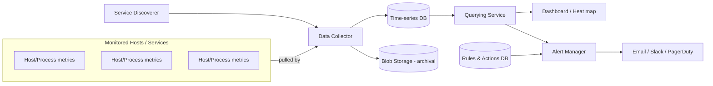

**Mnemonic (say it as a sentence, not a list):** *"Scouts find hosts, Collectors fetch data, a Warehouse stores it, Analysts query it, Judges alert on it, Screens show it."* → Discoverer → Collector → TSDB → Query service → Alert manager → Dashboard.

**Cheat-sheet**
- Six components, memorize them in this order: collector → discoverer → storage → query → rules/alert → dashboard.
- The **querying service** is the one component that serves *both* dashboards and the alert manager — don't build two separate read paths.
- A **rules & actions DB is separate from the TSDB** — rules are low-volume config data, metrics are high-volume time-series data. Don't conflate the two stores.

---

## Deep dive: pull vs. push (the central trade-off in this chapter)

This is the single most-tested design decision in a monitoring-system interview.

| | **Pull** (collector scrapes targets) | **Push** (targets send to collector) |
|---|---|---|
| Who initiates | Monitoring system | The monitored application |
| Example systems | Prometheus, Nagios, DigitalOcean's monitor | StatsD, Amazon CloudWatch (agent-pushed), Graphite (classic) |
| Network impact | Predictable — collector controls rate, one connection pattern | Can create thundering-herd traffic spikes if many apps push at once |
| Failure signal | **Free liveness check** — if a scrape fails, target is down (absence = alertable signal) | Silence is ambiguous — is the app dead, or did the push just not fire? |
| Firewall/NAT | Collector needs network path *to* every target (hard across clusters/regions/firewalls) | Target just needs an outbound path to the collector — easier through NAT/firewalls |
| Ephemeral jobs (batch/cron) | Bad fit — job may finish before a scrape happens | Good fit — job pushes its result once and exits (Prometheus solves this with a **Pushgateway**) |
| Cardinality/service discovery | Collector must maintain a live list of targets (needs service discovery) | Targets self-register by pushing; less central bookkeeping |
| Scale bottleneck | Collector fan-out to N targets — bounded by collector's scrape capacity | Ingestion endpoint must absorb bursts from N uncoordinated senders |

**What one pull cycle looks like, end-to-end** (this is the diagram to draw if asked "walk me through how a metric gets collected"):

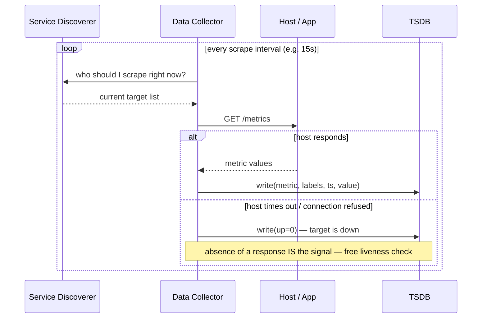

**What a push cycle looks like** (batch job via Pushgateway — the case pull can't handle):

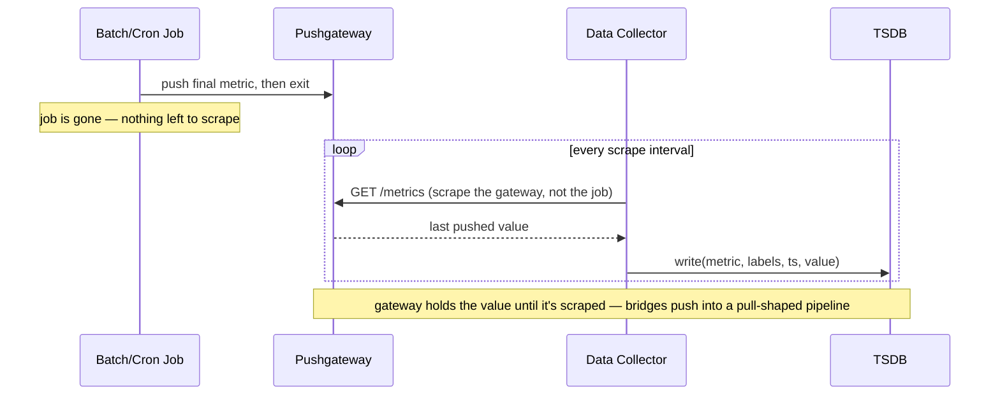

**The interview answer:** neither is "correct" — production systems are **hybrid**.
- Prometheus is pull-first but ships a Pushgateway for short-lived batch jobs.
- This course's design converges on a **hierarchical hybrid**: pull within a datacenter (secondary monitoring servers pull from ~5,000 hosts each), then **push up** the hierarchy — secondary → primary datacenter server → global monitoring service.

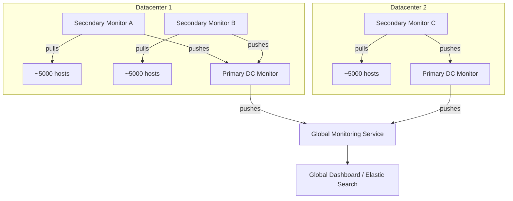

**Why hierarchy scales:** each level only fans out/in to a bounded number of children — add capacity by adding nodes at a level or adding a new level, the same pattern used in DNS, CDN edge hierarchies, and log aggregation. Name this explicitly in an interview: **"hierarchical fan-in is a repeating pattern across distributed systems design."**

**Cheat-sheet**
- Pull gives you liveness-for-free (absence of a scrape = down). Push doesn't, unless you add a heartbeat/last-seen timestamp check.
- Batch/cron jobs are the classic pull weakness — solved by a pushgateway/sidecar pattern.
- Real answer to "push vs pull": **pull within a trust domain, push across trust/network domains** (this is exactly what cross-DC hierarchies do).

---

## Deep dive: storage (time-series database)

A metric point is essentially `(metric_name, labels/tags, timestamp, value)` — e.g. `cpu_usage{host="web-42", region="us-east"} @ t=1699999999 → 87.3`.

**Why not a regular relational DB?**
- Write pattern is append-only, extremely high volume, mostly-increasing timestamps — TSDBs (InfluxDB, Prometheus's own TSDB, OpenTSDB, M3DB, Gorilla/Facebook) exploit this for compression (delta-of-delta timestamp encoding, XOR-based float compression — Facebook's Gorilla paper gets ~1.37 bytes/point).
- Query pattern is range scans over time + aggregation (avg/sum/percentile over a window), not point lookups by primary key.

**Cardinality is the #1 real-world failure mode.** Each unique combination of label values is a new time series. `host` × `region` × `endpoint` × `status_code` can multiply into millions of series — this is what takes down real Prometheus/Datadog deployments ("cardinality explosion"). Mention this proactively; it's a strong signal of hands-on experience.

**Retention strategy — this course explicitly flags it as a "con" to fix:**
- Keep raw high-resolution data for a short window (hours-days).
- **Downsample** (roll up to 1-min → 5-min → 1-hour averages) for older data.
- Move old/rolled-up data to **blob storage** (cheap, durable, infrequent access) — this is exactly what the course design does.
- This is a lossy-compaction trade-off: recent data supports precise alerting, old data supports trend dashboards only.

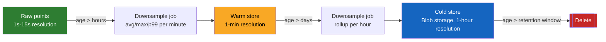
Precision decays as data ages — that's the trade you're explicitly making, not an accident.

**Cheat-sheet**
- TSDBs win on: append-heavy writes, timestamp-ordered compression, range+aggregate queries.
- Cardinality explosion = the real production nightmare. Bound label dimensions; never put unbounded values (user IDs, raw URLs) in a label.
- Retention tiering: hot (raw) → warm (downsampled) → cold (blob archive) → delete.

---

## Deep dive: alerting

Rules & actions are config, evaluated continuously against fresh query results (e.g. `avg(cpu) over 5m > 90% → page`).

Real-world alerting principles (go beyond the source material — interviewers expect these):

- **The Four Golden Signals** (Google SRE book): latency, traffic, errors, saturation. Alert on these at the service boundary, not on every internal metric.
- **The RED method** (for request-driven services): Rate, Errors, Duration.
- **The USE method** (for resources): Utilization, Saturation, Errors.
- **Alert on symptoms, not causes.** Page on "user-facing error rate > X%", not "one specific disk is at 80%" — causes are for dashboards/runbooks, symptoms are for pages, or you get alert fatigue.
- **Deduplication/grouping**: one flapping host shouldn't fire 500 separate pages — the alert manager groups/silences (this is literally what Prometheus's **Alertmanager** does: grouping, inhibition, silencing, routing trees).
- **Escalation policies**: unacknowledged alert escalates to next on-call tier (PagerDuty, Opsgenie pattern).

**Alert lifecycle** — this is exactly how Prometheus's Alertmanager models it, and it's the state machine to draw whenever someone asks "how does an alert actually fire":

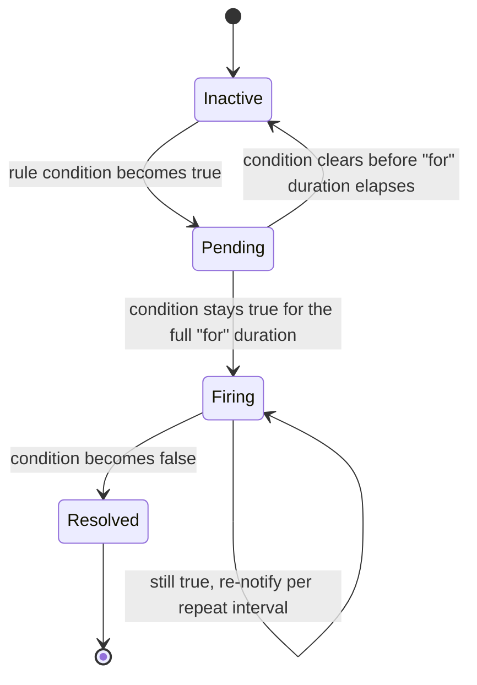
The `Pending` state is what prevents a 2-second CPU blip from paging someone — it's the debounce built into the rule engine, not an afterthought.

**Cheat-sheet**
- Golden Signals / RED / USE are the vocabulary that signals SRE fluency — drop these terms.
- Alert on symptoms (SLO burn, user-facing errors), not every internal cause metric — prevents alert fatigue.
- The alert manager needs dedup + routing + escalation, not just "send email."

---

## Visualization: heat maps

For fleet-wide "is anything on fire" views, per-server dashboards don't scale (you can't stare at a million graphs). The course's answer: **heat maps**.

- Arrange racks/servers in a grid, sorted by **datacenter → cluster → row → rack**, so spatial failure patterns (a whole rack or row going red) are immediately visible — this also surfaces *correlated* physical failures (one PDU, one top-of-rack switch) that a flat list would hide.
- Each cell colored by health: green = healthy, red = unresponsive after retries.
- Extremely compact encoding: **1 bit per server** (alive/dead) → 1,000,000 servers fit in ~125 KB. This is the kind of back-of-envelope number an interviewer loves to see you produce unprompted.
- Generalizes beyond host up/down: apply the same grid+color technique to disks, NICs, switches, links — anything with a scalar health value.

Each cell's color isn't a raw ping result — it's the output of a small per-host state machine, so a single dropped packet doesn't flash a rack red:

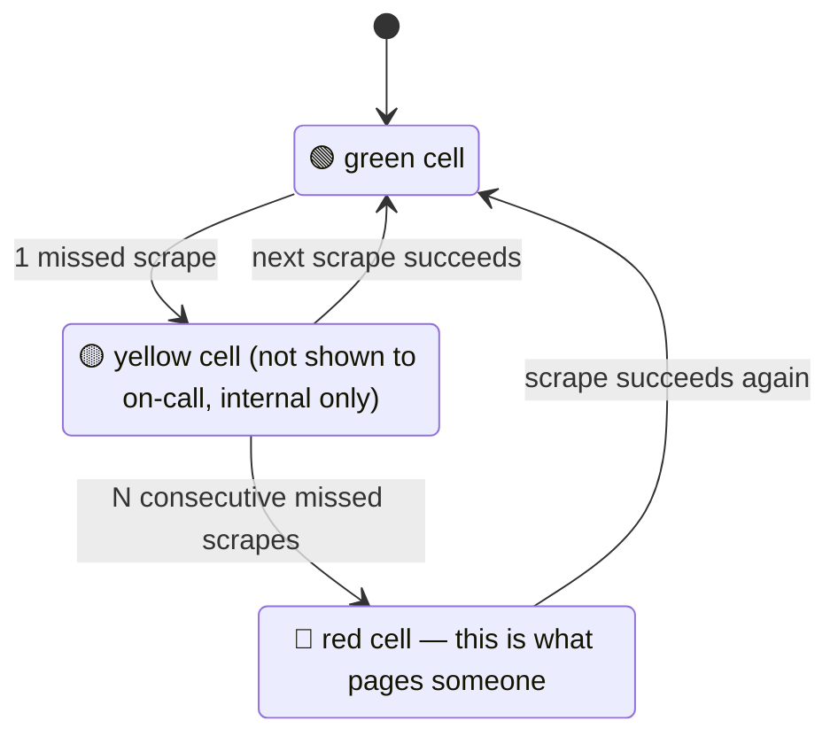

Grid layout key: sort cells by **datacenter → cluster → row → rack**, so a correlated failure (a whole rack or row going red) reads as a visual block instead of scattered dots — this is what surfaces a shared PDU or top-of-rack switch failure at a glance.

**Cheat-sheet**
- Heat map ordering key: datacenter → cluster → row → rack — this ordering is what makes correlated failures visually obvious.
- The Suspect state (not a raw single-miss → red) is what keeps the map from crying wolf on one dropped packet.
- 1 bit/server liveness = trivially cheap at any scale (1M servers ≈ 125 KB) — use this number to show you can do capacity math on the fly.
- Heat maps generalize to any single scalar health signal, not just "server up/down."

---

## Pros and cons of the base design (explicitly called out in the source — good interview talking points)

**Pros**
- Smooth, centralized operational visibility; catches problems before they cascade.
- Pull-based collection avoids overwhelming the network with unsolicited pushes.
- Higher availability than ad-hoc/manual checking.

**Cons → and the fix**
| Con | Fix |
|---|---|
| Single monitoring server = SPOF | Add a failover server — but now you must keep it consistent with the primary, and a single failover pair still hits a scalability ceiling as fleet size grows |
| Can't scale a single pull-based collector to millions of hosts | Move to the hierarchical push/pull hybrid (secondary → primary → global) |
| Unbounded metric growth, can't store forever | Retention policy: downsample + archive to blob storage + delete old raw data |

**Cheat-sheet**
- Naming the SPOF and immediately naming its own follow-on problem (failover consistency, then scaling ceiling) shows iterative depth — this is exactly the "evaluate, then improve" rhythm interviewers reward.
- Every "add a failover" answer should be paired with "but that introduces a consistency problem between primary and failover" — don't stop one level too early.

---

## 🆕 Deep dive: Server-side error/exception tracking (the Sentry/Rollbar-style problem)

Everything above this line answers "is the fleet healthy" with **numbers over time** (CPU%, error rate as a percentage). This section answers a different question: **"a specific line of code just threw — which one, how often, and is it new?"** That's a Sentry / Rollbar / Bugsnag / Google Cloud Error Reporting problem, and it needs its own data model, pipeline, and failure-handling story.

### 🆕 Error tracking vs logging vs tracing vs metrics — one table, memorize it

| | **Metrics monitoring** (above) | **Logging** | **Error tracking** (this section) | **Distributed tracing** |
|---|---|---|---|---|
| Unit of data | Numeric time series point | Discrete text/structured line | Discrete exception event, grouped into an **error group** | Request-scoped span tree |
| Question it answers | "Is latency/CPU/error-rate normal right now?" | "What exactly happened at time T on host X?" | "What's broken, how often, and did we just introduce it?" | "Where did this one request spend its time, and who caused it to fail?" |
| Typical store | TSDB (Prometheus, M3, Gorilla) | Log store (Elasticsearch, Loki, Splunk) | Error-group store (grouped) + raw sample store | Trace store (Jaeger, Zipkin, Tempo) |
| Retention shape | Downsample, keep long | Days, then delete (expensive to keep) | Groups kept long (months); raw samples short (days) | Hours-to-days, heavily sampled |
| Who looks at it, when | On-call, dashboards, alert rules | Engineer doing root-cause after being paged | On-call triage: "which bug should we fix first" | Engineer chasing one slow/failed request across services |

**Mnemonic — "a metric tells you *that* it hurts, a log tells you *everything* that happened, an error tells you *which bug* it is, a trace tells you *where* in the request it happened."**

### 🆕 Requirements specific to error tracking

**Functional**
- Capture every unhandled exception/crash from every service instance, with enough context to debug it without reproducing it.
- Group (deduplicate) occurrences of the "same" error — one bug thrown 50,000 times across 10,000 instances should show up as **one** error group with a count of 50,000, not 50,000 tickets.
- Correlate an error back to the distributed trace of the request that caused it, across service boundaries.
- Alert when a **brand-new** error type appears, or an existing one's rate spikes.
- Feed error rate into service-level error budgets / SLO burn-rate alerting.

**Non-functional**
- **Never slow down or crash the app it's instrumenting.** The error-tracking SDK sits on the exception path of the very code that's already failing — it must fail open (drop and move on) rather than throw or block.
- **Survive the fleet's worst day.** If a bad deploy makes error volume spike 100x, the tracking system must degrade gracefully (sample harder, keep counts exact), not fall over — see "monitoring the monitor" below.
- Low duplication cost: storing a full stack trace for every one of 50,000 occurrences of the same bug is wasteful; store one representative sample per group plus an exact count.

**🆕 Capacity estimation (illustrative — plug in real numbers in an interview, don't recite these)**
- Fleet: **10,000 service instances**, **1,000,000 requests/sec** in aggregate.
- Steady-state error rate: **0.01%** → **~100 errors/sec** baseline ingestion.
- A bad deploy pushes the error rate to 0.1% (10x) → **~1,000 errors/sec** — this is the kind of jump spike-detection exists to catch (worked out below).
- Raw error payload (stack trace + request context + tags): **~1–2 KB** per event → baseline raw ingestion ≈ 100–200 KB/sec ≈ **9–17 GB/day** before any deduplication.
- After grouping (1 full sample stored per fingerprint per time bucket, everything else just increments a counter), storage drops by 1–2 orders of magnitude — the counter is nearly free; the expensive part is the samples, so sample those, don't sample the counts.
- Trace-id + span-id attached to every error/log line: a W3C-Trace-Context id is a 128-bit trace id + 64-bit span id ≈ **16–24 bytes packed** (longer, ~50+ bytes, if stored as a hex string) — cheap enough to attach to every single log line and error event without a second thought.

### 🆕 Data model & SDK/API integration

An error event, at minimum:

```
error_event {
  fingerprint      // hash used for grouping — see dedup below
  service_name, host_id, instance_id
  exception_type, message
  stack_trace[]     // frames: file, line, function
  trace_id, span_id  // links to the distributed trace
  request_context   // method, path, user_id (hashed/scrubbed), status_code
  environment, release_version
  severity
  timestamp
}
```

**Mnemonic for the fields that matter most — "STAMPS":** **S**tack trace, **T**race-id, **A**pp/service + release version, **M**essage, **P**roperties/request context, **S**everity. If an error event is missing one of these, triage gets slower.

**SDK integration pattern** (how a service reports an error without slowing itself down):
- The SDK wraps the top-level request handler / middleware layer (e.g., an Express/Django/Spring interceptor) so every unhandled exception is captured automatically — engineers shouldn't have to remember to call anything.
- `capture(exception, context)` is **fire-and-forget**: it hands the event to an in-process buffer and returns immediately. A background thread batches (e.g., every 1s or every 100 events, whichever comes first) and ships asynchronously.
- If the ingestion endpoint is unreachable, the SDK buffers briefly (bounded queue) then **drops** — it never blocks the request thread and never lets its own queue grow unbounded and OOM the app it's supposed to be protecting.
- Ingestion API is a simple `POST /api/errors` accepting a batch; the server side validates, strips anything that looks like a secret/PII in `request_context`, and enqueues for processing.

### 🆕 Architecture evolution: v1 → v2 → v3

**v1 — naive: services write directly to a shared error DB.** This is where every team starts, and where the interview should *not* stop.

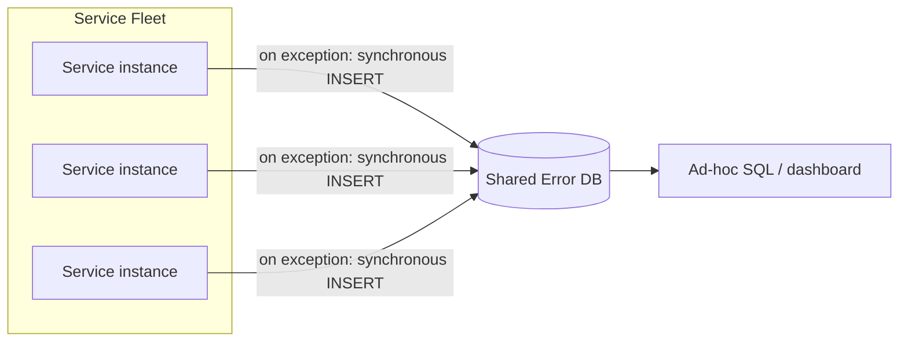
Problems: (1) no dedup — 50,000 occurrences = 50,000 rows; (2) a slow/down error DB now blocks the app's exception-handling path — the very thing you added to help availability can hurt it; (3) no trace correlation, no alerting.

**v2 — async ingestion + dedup/fingerprinting service.** Decouple the app from storage; group duplicates before they hit an expensive store.

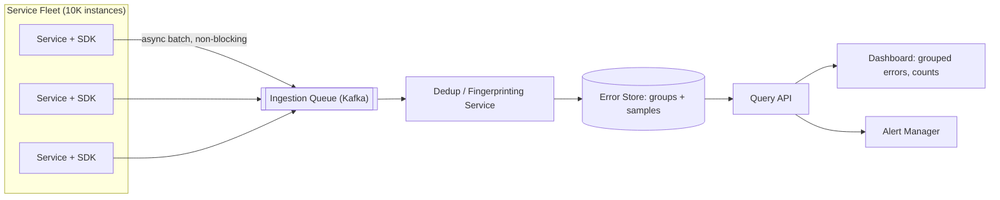
Now the app never blocks on storage, and the store holds error **groups** (one row + counter) instead of raw duplicates.

**v3 — add trace correlation, SLO/error-budget integration, and self-isolation from the fleet it watches.**

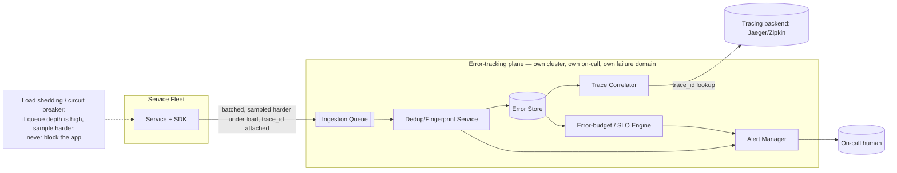
This is the version worth drawing when asked "walk me through the full design" — every deep dive below is a zoom-in on one box here.

### 🆕 Deep dive: structured error capture, end to end (with trace correlation)

This is the diagram to draw if asked "walk me through what happens when a service throws":

```mermaid
sequenceDiagram
    participant Req as Incoming Request
    participant Svc as Service A (trace_id=T1)
    participant SDK as Error SDK (in-process)
    participant Q as Ingestion Queue
    participant DD as Dedup Service
    participant ES as Error Store
    participant TB as Tracing Backend
    participant AM as Alert Manager

    Req->>Svc: request carries trace_id=T1 (propagated from upstream)
    Svc->>Svc: unhandled exception thrown
    Svc->>SDK: capture(exception, request context, trace_id=T1)
    Note over SDK: fire-and-forget — never blocks the request thread;\ndrops the event if the local buffer is full
    SDK->>Q: async enqueue error event
    Q->>DD: consume batch
    DD->>DD: fingerprint = hash(exception type + normalized top-N stack frames)
    alt fingerprint seen before
        DD->>ES: increment count on existing group; keep 1-in-N as a full sample
    else brand-new fingerprint
        DD->>ES: create new error group
        DD->>AM: new error type — page immediately
    end
    ES-->>TB: correlate via trace_id=T1
    TB-->>ES: full distributed trace (Service A → B → C spans)
    AM->>AM: compare current rate vs rolling baseline
    AM-->>OnCall: page if new-type OR rate > threshold
```

**Why non-blocking matters here specifically:** this is the one part of the whole guide where the "collector" and the thing being monitored are running in the *same process*. If `capture()` ever blocks or throws, the error-tracking code becomes the second bug in the same incident. Every design choice above (async queue, bounded buffer, drop-don't-block) exists to prevent that.

### 🆕 Deep dive: deduplication & fingerprinting (grouping the same bug across 10,000 instances)

The same `NullPointerException` thrown by the same line of code on 10,000 different instances must collapse into **one** error group with `count=10,000` — not 10,000 separate tickets. That's the whole job of the dedup/fingerprinting service.

**How the fingerprint is computed:**
- Take the exception type + the top N stack frames (e.g., top 5–10), **from the application's own code, not library/framework frames** (those are usually shared noise across many different bugs).
- Normalize each frame: strip memory addresses, line-specific loop variables, request-specific values — keep `(file, function)`, drop things that differ occurrence-to-occurrence but not bug-to-bug.
- Hash the normalized frame list → the fingerprint. Same fingerprint = same error group.

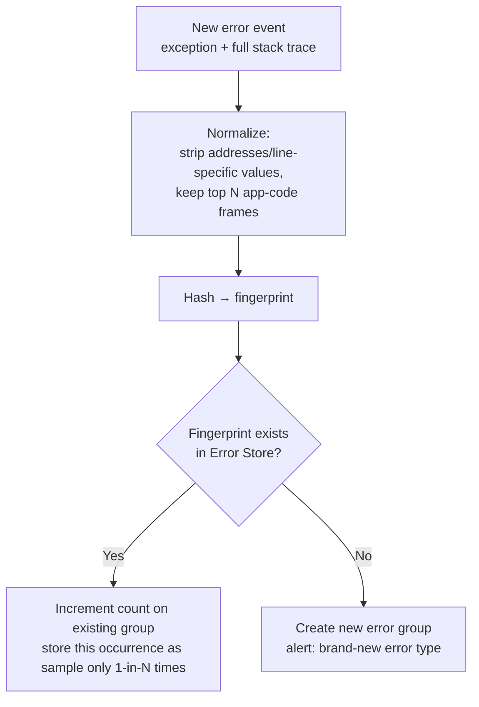

**Worked example:** a bad deploy introduces one bug. Within 10 minutes it fires on 8,000 of the fleet's 10,000 instances, each instance hitting it a few times a second — that's tens of thousands of raw events, but the dedup service collapses it to **one error group** whose count climbs in real time. That single group, and its climbing count, is the alert-worthy signal — not the raw event volume.

**Cheat-sheet**
- Fingerprint on normalized top-of-stack app frames, not the whole trace and not raw text — raw text (with request-specific values baked in) never matches itself twice.
- Store one full sample per fingerprint per time bucket; everything else is just `count++`. Counts are nearly free; stack-trace samples are the expensive part, so that's what gets sampled.
- "10,000 instances, same bug, one error group" is the sentence that shows you understand why this system exists at all.

### 🆕 Deep dive: correlating an error with its distributed trace

An error group tells you *what* broke and *how often*. It doesn't tell you *why this particular request* hit it. That's what the trace is for — and the only thing connecting them is the `trace_id` propagated on the request.

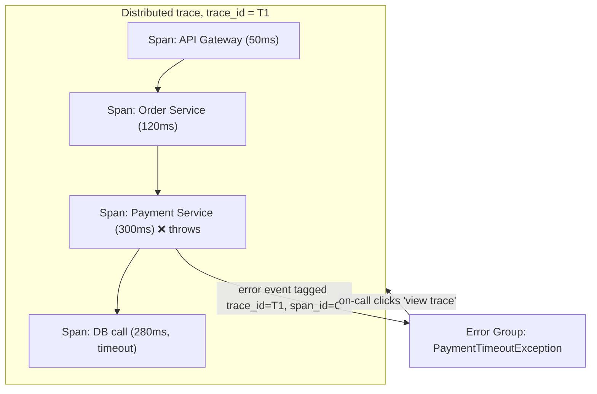

Reading this: the error group says "PaymentTimeoutException, fired 4,200 times in the last hour." The linked trace for one occurrence shows *why*: the Payment Service span waited 300ms on a DB call that itself timed out at 280ms — the bug isn't in Payment Service's code, it's a downstream DB. Without the trace_id link, on-call would have to guess; with it, root cause is one click away.

**How the link is made in practice:** the request's `trace_id`/`span_id` (propagated via W3C Trace Context headers, or vendor equivalents like AWS X-Ray's `X-Amzn-Trace-Id`) is attached to the error event at capture time (see the `STAMPS` fields above). The error store just needs to keep that id around and let the UI deep-link into the tracing backend (Jaeger/Zipkin/Tempo/X-Ray) by trace_id — the error store does **not** need to store the trace itself.

### 🆕 Deep dive: alerting & spike detection for errors

Error alerting has two distinct triggers, and conflating them is the most common design gap:

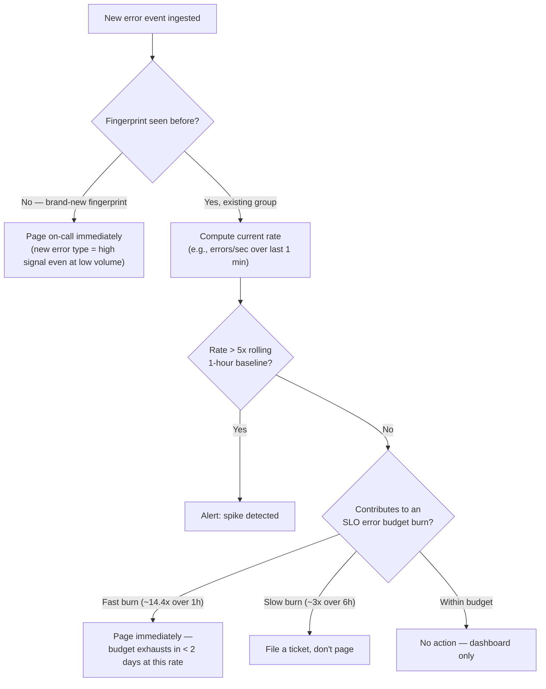

**Worked example, tying back to the capacity numbers above:** baseline is ~100 errors/sec across the fleet (0.01% of 1M req/sec). A bad deploy pushes the rate to ~1,000 errors/sec (0.1%) — that's 10x baseline, comfortably over a 5x threshold, so it pages. A brand-new fingerprint pages on its **first** occurrence regardless of rate — that's the deploy-just-broke-something case, and rate-based thresholds alone would miss it because count=1 never looks like a "spike."

**Cheat-sheet — "if X then Y" for error alerting:**
- If it's a **new fingerprint** → page immediately, don't wait for volume.
- If an **existing** fingerprint's rate exceeds ~5x its rolling baseline → page (spike).
- If the rate is elevated but under threshold → dashboard only, no page (avoid alert fatigue — same principle as the Golden Signals section above: alert on symptoms that matter, not every wiggle).

### 🆕 Deep dive: error budgets & SLO integration

An SLO (e.g., "99.9% of requests succeed") implies an **error budget**: 0.1% of requests are allowed to fail before the budget is exhausted. Error tracking's job here is to feed the error-group counts into a **burn-rate** calculation, not just a raw threshold.

| Burn rate | Meaning | Response |
|---|---|---|
| ~14.4x the sustainable rate over a 1-hour window | Budget for the whole month would be gone in < 2 days at this rate | **Page immediately** |
| ~3x the sustainable rate over a 6-hour window | Slower burn, still a real problem | **Ticket, next business day** |
| Within budget | Errors are happening but at a sustainable rate | **Dashboard only** |

This is Google SRE's **multi-window, multi-burn-rate alerting** pattern applied to the error groups this system produces — the same error-count data powers both "page now" (fast burn) and "fix this sprint" (slow burn) without needing two separate pipelines.

### 🆕 Deep dive: monitoring the monitor — isolating error tracking from the fleet's bad day

The error-tracking system watches the fleet, so it must **not** share the fleet's failure domain. If the same outage that spikes error volume 100x also takes down the ingestion pipeline, on-call loses visibility at the exact moment they need it most — the worst possible time for a cascading failure.

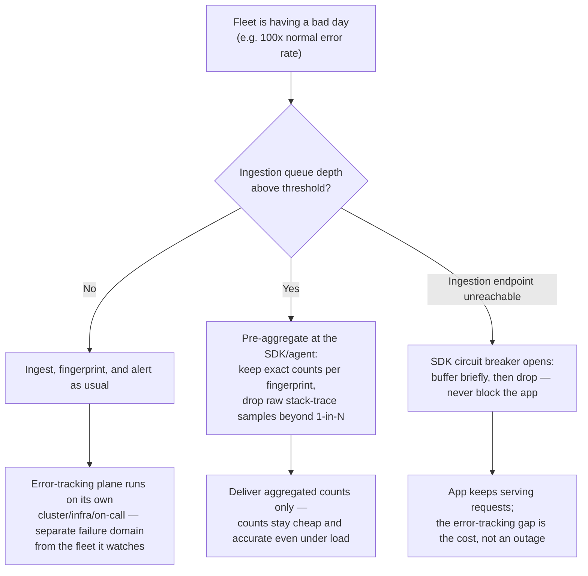

**Three concrete techniques, in order of how often they come up in an interview:**
1. **Physical/infra isolation** — the ingestion queue, dedup service, and error store run on their own cluster (own compute, own network path, ideally a different region/AZ than the primary fleet), the same way the "who monitors the monitor" principle from the metrics section applies here.
2. **Load shedding that preserves counts, not samples** — under overload, keep incrementing exact counters per fingerprint (cheap, small), but drop the expensive part (full stack-trace samples) beyond a 1-in-N rate. On-call still sees "this error is up 50x," just with fewer full traces to look at.
3. **Client-side circuit breaker** — the SDK in the monitored service must never let a slow/down error-tracking backend become a new outage. Bounded local buffer, short timeout, drop-and-move-on. Losing a handful of error reports is fine; blocking the request path is not.

**Cheat-sheet for this whole section**
- Error tracking ≠ metrics monitoring: it's discrete exception events grouped by fingerprint, not numeric time series.
- STAMPS fields: Stack trace, Trace-id, App/release, Message, Properties/context, Severity.
- Dedup by hashing normalized top-of-stack app frames — never raw text, never the whole trace.
- New fingerprint → page on first occurrence. Existing fingerprint → page on >5x rate spike. Both feed into SLO burn-rate alerting (fast burn pages, slow burn tickets).
- trace_id is the only link between "what broke" (error group) and "why, for this request" (distributed trace) — attach it at capture time, don't try to reconstruct it later.
- The tracking system must be able to survive the exact incident it exists to catch: separate failure domain, count-preserving load shedding, and a client SDK that fails open.

### 🆕 Real-world error-tracking systems (cite these alongside Prometheus/Gorilla above)

| System | Model | Notable design choice |
|---|---|---|
| **Sentry** | SDK + async ingestion, self-hosted or SaaS | Fingerprinting/grouping by stack-trace hash, release tracking, "new issue" vs "regression" alerting |
| **Rollbar / Bugsnag / Honeybadger** | SDK + hosted ingestion | Similar grouping model; strong deploy-tracking ("did this release introduce new errors") |
| **Google Cloud Error Reporting** | Auto-aggregates from Cloud Logging | Groups by stack trace automatically from structured logs, no separate SDK required if already logging to Cloud Logging |
| **AWS X-Ray / OpenTelemetry** | Distributed tracing, not error-grouping | The trace-correlation half of this design — pairs with any of the above via trace_id |
| **Datadog Error Tracking** | Integrated with Datadog APM | Groups errors and links directly to the APM trace and the log line, in one product |

---

## Real-world systems (cite these by name)

| System | Model | Notable design choice |
|---|---|---|
| **Prometheus** | Pull-based, pull + Pushgateway for batch jobs | Own TSDB, PromQL query language, label-based multi-dimensional data model, Alertmanager for routing/dedup |
| **Google Borgmon / Monarch** | Pull-based | Predecessor/successor to Prometheus's design; hierarchical federation across clusters, described in the Google SRE book |
| **Facebook ODS (Operational Data Store) / Gorilla** | Push-based, in-memory TSDB | Gorilla paper: 26x compression via delta-of-delta timestamps + XOR float encoding, optimized for "last 26 hours in RAM" queries |
| **Netflix Atlas** | In-memory dimensional TSDB | Optimized for very high cardinality, tolerates lossy/approximate rollups over long retention |
| **Uber M3 / M3DB** | Push-based ingestion, custom TSDB | Built to handle Uber's massive metric cardinality (per-trip, per-driver dimensions) |
| **DigitalOcean monitoring** | Pull-based | Explicitly cited in the course as a real pull-based example monitoring millions of machines |
| **AWS CloudWatch / Azure Monitor / GCP Cloud Monitoring** | Agent push | Cloud-native equivalents; also expose public **status dashboards** (health.aws.amazon.com, status.azure.com, status.cloud.google.com) — the "external, coarse-grained" tier of monitoring |
| **Grafana** | Visualization only (pairs with Prometheus/InfluxDB/Elasticsearch as data sources) | Dashboards, not storage — decouples viz from TSDB |
| **PagerDuty / Opsgenie** | Alert routing & escalation | On-call scheduling, escalation policies, alert dedup — sits downstream of the alert manager |

**Cheat-sheet**
- If asked "what's a real system that does this," Prometheus (pull) and Facebook Gorilla/ODS (push, compression) are the two strongest name-drops.
- Cloud provider status pages are the "meta" example: even hyperscalers publish a simplified, human-facing health dashboard — the same green/red heat-map idea at the service level.

---

## How to identify this topic in an interview

Signals that the interviewer wants a monitoring-system design (not just "add metrics" as an aside):
- "How would you know if this service is down before your customers tell you?"
- "Design a system to monitor CPU/memory/disk across a fleet of 100,000 servers."
- "How do you detect and alert on anomalies at scale?"
- Any full system design (YouTube, Uber, WhatsApp) where you say "we'd add monitoring" — be ready to go one level deeper if pushed: "what would that monitoring system actually look like?"
- Questions about **observability** (a superset term covering metrics + logs + traces) — bring in the three pillars but keep the focus on metrics/monitoring unless asked to expand.

**🆕 Signals it's specifically the error/exception-tracking variant** (jump straight to the [🆕 Deep dive: Server-side error/exception tracking](#-deep-dive-server-side-error-exception-tracking-the-sentryrollbar-style-problem) section):
- "Design a system like Sentry/Rollbar that tracks exceptions across thousands of service instances."
- "How would you group the same bug, thrown 50,000 times, into one ticket instead of 50,000?"
- "How do you know a new deploy just introduced a brand-new class of error, versus normal background noise?"
- "How would you connect a crash to the request/trace that caused it across microservices?"
- "How does the error-tracking system stay up when the fleet it's watching is on fire?"

**If pushed to go broader — the three pillars of observability**

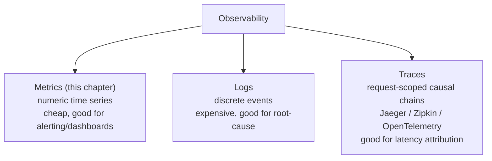

1. **Metrics** (this chapter) — aggregated numeric time series, cheap, good for alerting/dashboards.
2. **Logs** — discrete structured/unstructured events, expensive to store/query at scale, good for root-cause.
3. **Traces** — request-scoped causal chains across services (Jaeger, Zipkin, OpenTelemetry) — good for latency attribution in microservices.

Mentioning this taxonomy when asked "what else would you monitor" shows breadth without derailing into a different design.

---

## One-page visual recap

If you remember only one diagram from this chapter, make it this one — every other section is a zoom-in on one box here.

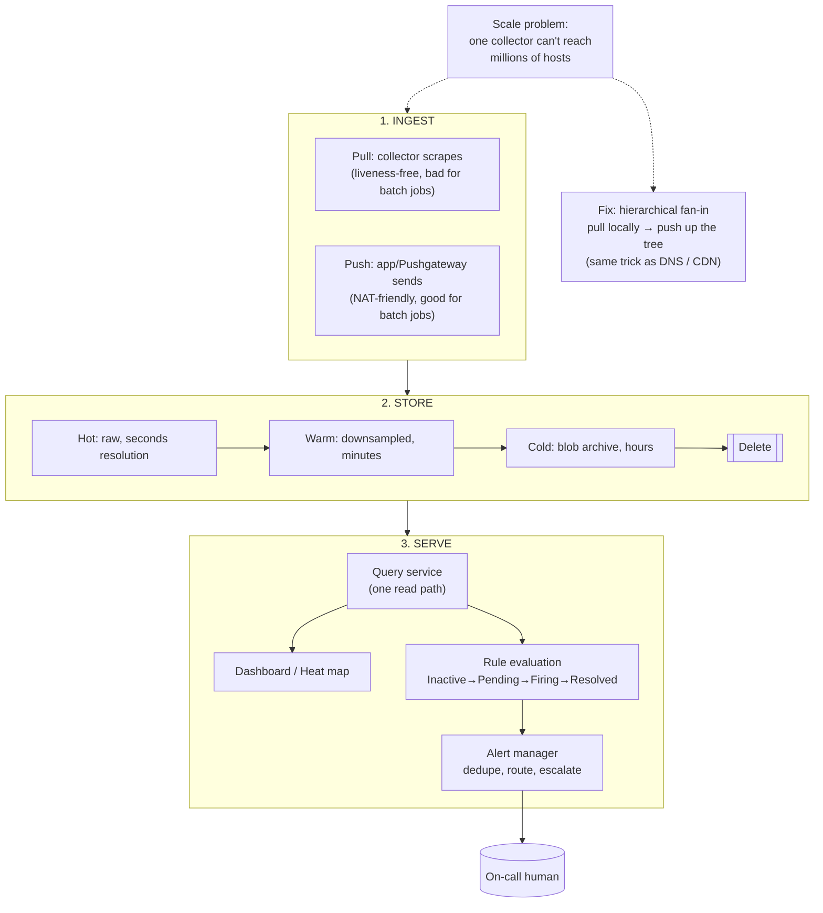

Read it left to right, and every deep dive in this guide is just an explanation of one arrow.

### 🆕 One-page visual recap — error/exception tracking

The equivalent single diagram for the error-tracking half of this guide:

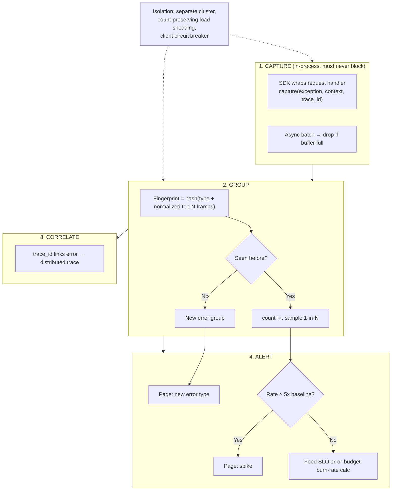

Read it top to bottom: capture without blocking → group by fingerprint → correlate via trace_id → alert on new-vs-spike-vs-budget-burn — with isolation wrapped around the whole pipeline so it survives the exact incident it's built to catch.

---

## Master Cheat Sheet

**Requirements**: process crashes, resource anomalies, hardware faults, reachability, network/power infra, cross-DC service health → collect, store, query, alert, visualize.

**Six components**: data collector, service discoverer, TSDB, rules & actions DB, querying service, alert manager, dashboard (7 if you count blob archival separately).

**Pull vs push**:
- Pull = liveness-for-free, network-friendly, bad for ephemeral jobs, needs service discovery.
- Push = NAT/firewall-friendly, good for batch jobs, no free liveness signal, risk of ingestion bursts.
- Production answer = hybrid, hierarchical: pull within a DC (1 collector : ~5,000 hosts), push up the hierarchy (secondary → primary → global).

**Storage**: TSDB compression (delta-of-delta + XOR encoding, à la Gorilla) ~1.37 bytes/point; watch for **cardinality explosion**; retention = hot (raw) → warm (downsampled) → cold (blob archive) → delete.

**Alerting**: Four Golden Signals (latency, traffic, errors, saturation), RED (rate/errors/duration), USE (utilization/saturation/errors); alert on symptoms not causes; dedupe/group/escalate.

**Heat maps**: grid sorted DC → cluster → row → rack; green/red per cell; 1 bit/server → 1M servers ≈ 125 KB.

**SPOF handling**: failover server → introduces consistency problem → still hits scaling ceiling → hierarchical push/pull is the real fix, not just "add a replica."

**Real systems to name**: Prometheus (pull, Pushgateway, PromQL, Alertmanager), Google Borgmon/Monarch, Facebook Gorilla/ODS (push, compression), Netflix Atlas, Uber M3, cloud provider status dashboards.

**One-liner if asked "how does this scale to millions of servers?"**: "Hierarchical fan-in — pull locally, push up the tree, same pattern as DNS/CDN — each level only handles a bounded fan-out, so you scale by adding nodes or levels, not by making one collector bigger."

**🆕 Error/exception tracking (Sentry-style — the other half of "monitor server-side errors")**:
- Different animal from metrics monitoring: discrete exception events grouped by fingerprint, not numeric time series.
- Data model mnemonic **STAMPS**: Stack trace, Trace-id, App/release, Message, Properties/context, Severity.
- Capture must be async and fail-open — it runs inside the code that's already failing, so it can never block or throw.
- Dedup by hashing normalized top-of-stack app frames; store one full sample per fingerprint per time bucket, everything else is just `count++`.
- Illustrative math: 10K instances, 1M req/sec, 0.01% error rate → ~100 errors/sec baseline; a 10x bad-deploy spike → ~1,000 errors/sec, well past a 5x-baseline alert threshold.
- trace_id (~16–24 bytes packed) is the only link from "what broke" (error group) to "why, for this request" (distributed trace) — attach it at capture time.
- Alerting has two triggers: brand-new fingerprint pages on first occurrence; existing fingerprint pages on >5x rate spike. Both also feed SLO error-budget burn-rate alerting (fast burn ~14.4x/1h → page, slow burn ~3x/6h → ticket).
- The tracking system must survive the exact incident it watches for: its own failure domain, count-preserving load shedding under overload, client-side circuit breaker that drops rather than blocks.
- Real systems to name: Sentry, Rollbar, Bugsnag, Honeybadger, Google Cloud Error Reporting, Datadog Error Tracking (+ AWS X-Ray/OpenTelemetry for the trace-correlation half).
- One-liner if asked "how is this different from the metrics system above?": "Metrics tell you the fleet has a fever; error tracking tells you which specific bug is causing it and how many instances have caught it."
