# Monitor Client-side Errors — FAANG Interview Guide

## TL;DR — the entire chapter in one diagram

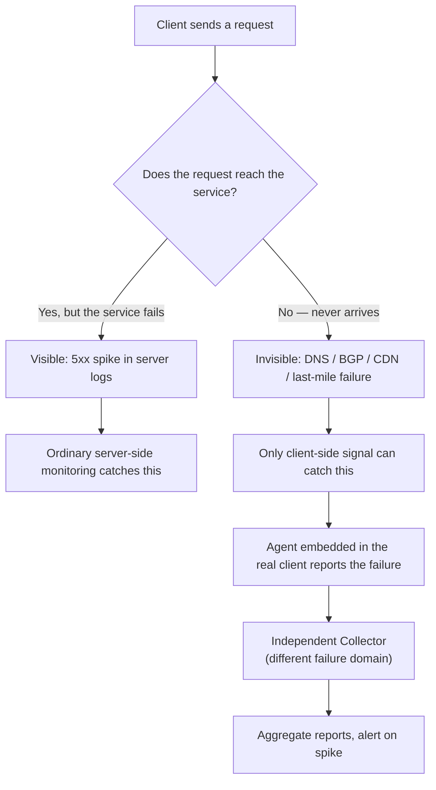

**The one idea to never forget:** *your server can be 100% healthy and 0% reachable, and your own infrastructure has no way to tell you that.* Everything else in this chapter is just "so what do we do about it" — including the operational scars (thundering herds, spoofed reports, false alarms) that a textbook lesson skips but an interviewer will absolutely probe.

## 1. Mental model

Server-side monitoring (logs, metrics, traces) only sees requests that **arrive**. If a client can't reach you — broken DNS, a BGP route hijack, a dead CDN edge, a failed ISP peering link, a captive portal — your dashboards show *nothing*, not an error. A 500 spike is loud. A silent client-side failure is invisible, and it dresses up as "traffic just went down," which is the trap.

> **Analogy:** server-side monitoring is a doctor who only sees patients who make it to the hospital. Client-side monitoring is a public-health survey that also counts the people who never arrived.

This is **Real User Monitoring (RUM)**: you cannot rely on your own infrastructure to tell you your own infrastructure is unreachable. You need signal generated *outside* it.

## 2. Why the blind spot exists

| Failure class | Example | Visible in server logs? |
|---|---|---|
| DNS resolution failure | Resolver can't find `example.com` | No |
| Routing / BGP issue | Route hijack, route leak, peering link down | No |
| Third-party infra failure | CDN edge down, middlebox drops packets | No |
| Last-mile / ISP issue | Home router misconfigured, ISP outage | No |
| Server overload / crash | 500s, timeouts | **Yes** |
| App-level bug | Bad response, 4xx | **Yes** |

The only server-side symptom of the left column is an unexplained **dip in traffic** — and dips are a weak, noisy signal: normal diurnal/weekly variance, a holiday, or a small affected user slice all look identical in an aggregate load graph. Say this out loud in an interview — **a dip has both false positives and false negatives** — it's the reason "just alert on a traffic drop" doesn't work.

### Real incidents worth naming from memory

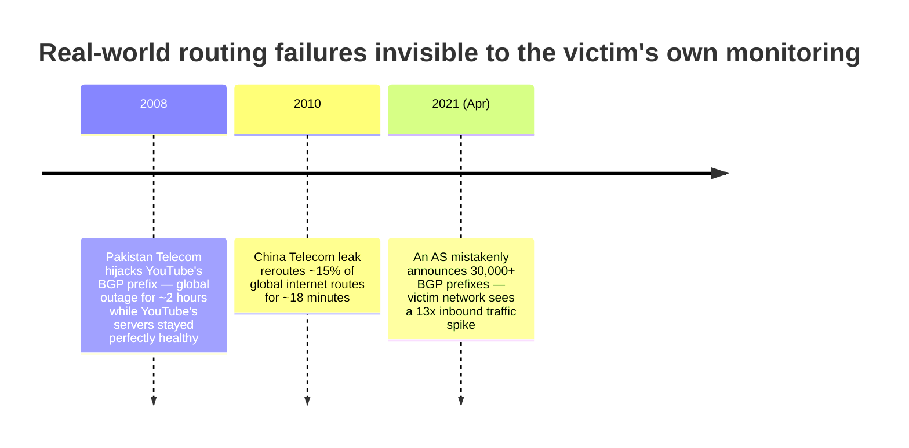

Play out the 2008 case as a sequence — this is the single most interview-usable story in this chapter:

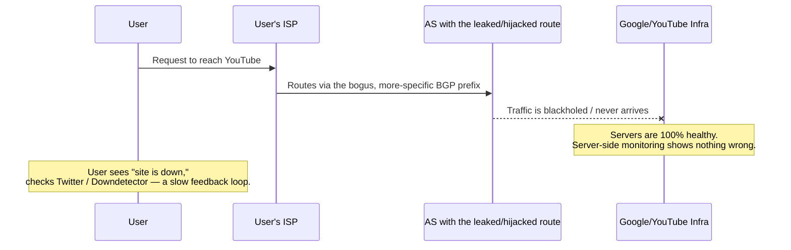

That gap between "user knows something's wrong" and "service finds out" is exactly what this chapter's design closes.

## 3. Design of a client-side monitoring system

### Attempt 1 — Active probing (synthetic monitoring)

Deploy your own **probers** at vantage points worldwide that periodically hit your service and check availability/latency (think Catchpoint, Pingdom, or an internal probing fleet).

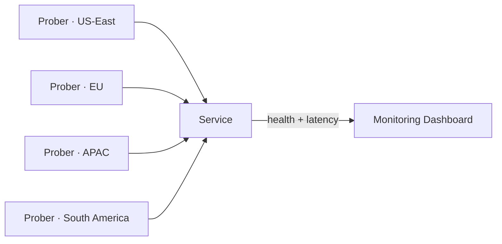

**Why it falls short:**

- **Incomplete coverage** — ~100,000 unique Autonomous Systems exist on the internet (as of March 2021); you can't afford probes inside all of them, and country/ISP regulation adds friction.
- **Doesn't imitate real users** — a prober isn't a real browser, on a real network stack, behind a real ISP's DNS resolver, a corporate proxy, or an ad blocker. It can miss exactly the failure modes that matter.

### Attempt 2 — Real User Monitoring (agent + independent collector)

Instead of simulating users from a handful of vantage points, instrument the **real client** so every real user becomes a vantage point.

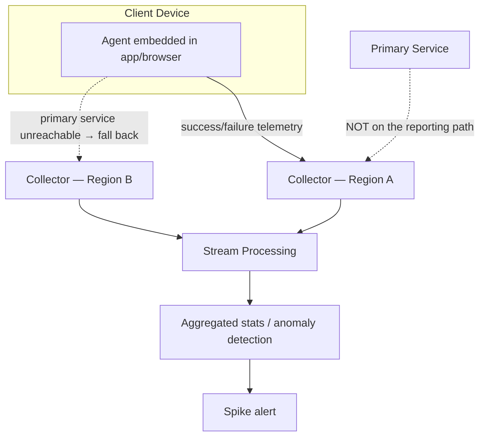

- **Agent** — code in the real client that observes real request outcomes and emits reports on failure.
- **Collector** — an endpoint **independent of the primary service**, whose only job is to keep receiving reports even when the primary service is completely dead.

Collectors form a **hierarchy of stream-processing pipelines** (Kafka + Flink/Spark-style) placed near client networks, rolling up into global stats over time. Because the goal is a **summary statistic** ("~1% of users in region X are failing"), the pipeline can tolerate **losing some reports** — a deliberate, lazy trade-off: lossy-and-cheap beats lossless-and-expensive when the actionable signal is a *rate*, not an audit trail. If you needed zero-loss (e.g., billing-grade accuracy), that's a materially pricier system — flag this trade-off if asked.

### Compare the two approaches — plot it, don't just list it

```mermaid
quadrantChart
    title Synthetic Monitoring vs Real User Monitoring
    x-axis Low Coverage --> High Coverage
    y-axis Low Realism --> High Realism
    quadrant-1 Ideal: broad and realistic
    quadrant-2 Realistic but narrow
    quadrant-3 Weak on both fronts
    quadrant-4 Broad but unrealistic
    Synthetic Probers: [0.25, 0.35]
    RUM Agent + Collector: [0.85, 0.85]
```

The whole design arc of this chapter is "move from bottom-left toward top-right."

## 4. Three hard sub-problems (from the lesson)

### 4.1 Activate / deactivate reporting (consent lifecycle)

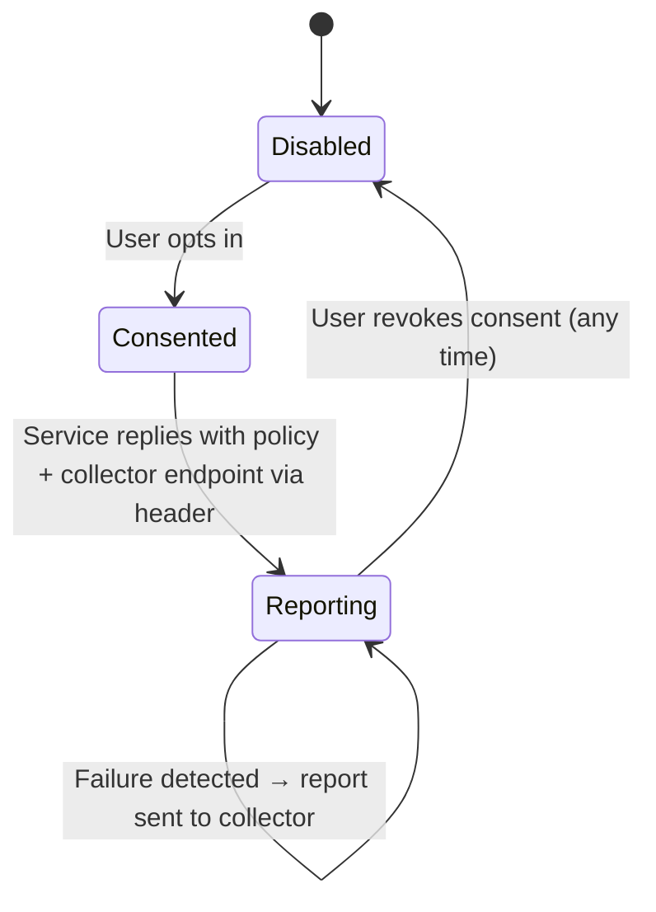

- Uses a custom **HTTP header** to carry policy from service to client — which is why it needs the **browser itself** to know about the feature (standardization, e.g. Chrome's Reporting API), or a **first-party client app/SDK** you fully control so you don't have to wait on browser vendors.
- The agent only fills in / activates the header **after explicit consent**; the service replies with the collection endpoint and policy.

### 4.2 Reaching collectors under faulty conditions — blast-radius isolation

The entire point of the collector is staying reachable when the *thing being monitored* isn't. So put it in a **different failure domain**:

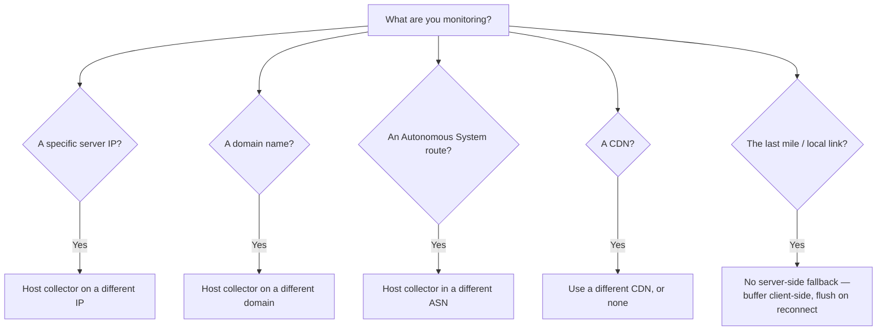

The agent tries collectors across failure domains until one works — the same principle as DNS resolver fallback, or multi-region health checks avoiding a single cloud provider. **Last-mile failure is a hard boundary**: if the user's own local connectivity is down, nothing server-side helps.

### 4.3 Protecting user privacy

Users must know exactly what's collected and be able to opt out anytime. For a browser-based agent, deliberately **exclude**:

- **Traceroute hops** — leaks precise geography.
- **Which DNS resolver is used** — also leaks location/ISP.
- **RTT / packet-loss data** — same leak risk, marginal value.

**Guiding rule:** collect the minimum, only for the consented purpose. Ideally restrict to what a normal weblog already captures on a *successful* request — don't add new active probing (traceroute/RTT) just to enrich error reports. Encrypt the report path end-to-end so no intermediary (ISP, middlebox) can read, alter, or strip it, and route it only to the designated collector.

## 5. Beyond the lesson — what a FAANG interviewer will actually probe

The textbook design (agent → independent collector → alert on spike) is necessary but not sufficient. Interviewers at the senior/staff level push on **scale** and **adversarial conditions**. These three gaps are the most common follow-ups — bring them up unprompted and you'll stand out.

### 5.1 The collector's own thundering-herd problem

A real global outage doesn't produce a few reports — it produces **millions of agents failing at the same instant**, all retrying against the same handful of collectors. Naively, you've just built a system that DDoSes itself at the exact moment you need it most.

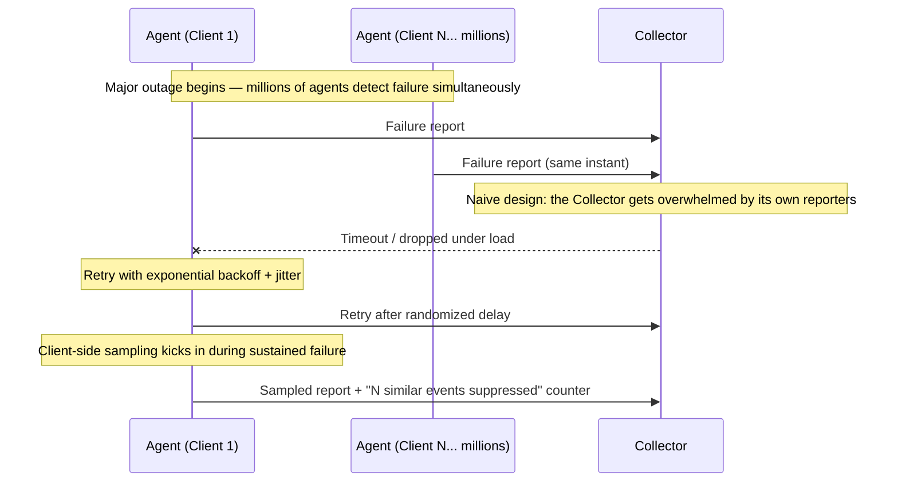

**Mitigations to name:** exponential backoff **with jitter** on retries (prevents synchronized retry storms), **client-side sampling** during sustained failure (report 1-in-N events plus a suppressed-count, not every single one), and horizontally scaled, geo-distributed collectors sized for burst — not average — load.

**Quick capacity gut-check (say this out loud, don't over-engineer it):** 1B daily active users, baseline 0.1% client error rate → ~1M reports/day normally. A major regional outage can push that to 100x within minutes → ~100M reports in a short burst. That two-orders-of-magnitude burst factor is *why* sampling and backoff aren't optional — a collector fleet sized for the 1M/day baseline falls over instantly without them.

### 5.2 Reports are untrusted input — defend against abuse

Anything sent by a client is attacker-controlled by definition. A malicious or compromised agent (or a botnet) could flood collectors with **fabricated failure reports** to trigger a false page, force an unnecessary failover, or waste on-call attention — a denial-of-service against your *incident response process*, not your servers.

- **Rate-limit** per client identity/IP at the collector.
- Use **robust statistics** for aggregation (trimmed means, median-based outlier rejection) so a small burst of spoofed reports can't single-handedly swing the aggregate.
- Require **lightweight attestation** where possible (e.g., signed reports from a first-party SDK) so anonymous, unauthenticated spam is easier to downweight.

### 5.3 Correlate client-side and server-side signal before paging anyone

A client-side spike alone is not proof of an outage — it could be a bug in the agent's error-classification logic, a normalization artifact, or one bad app release. Cheap, load-bearing step: **cross-check against server health and geographic concentration** before escalating.

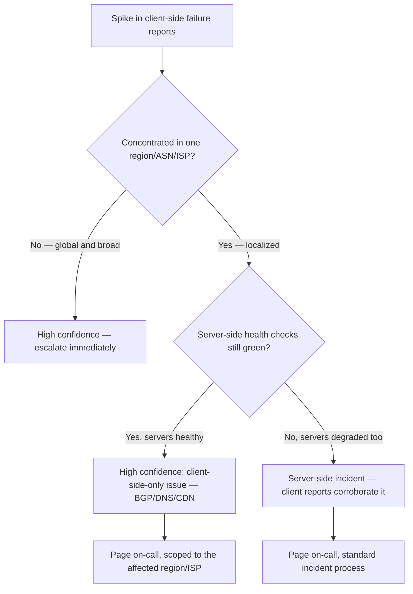

This is the difference between "alert that's actionable" and "alert that trains people to ignore alerts."

### 5.4 What actually goes in a report

Keep the schema minimal by design — this is the privacy rule from §4.3 made concrete:

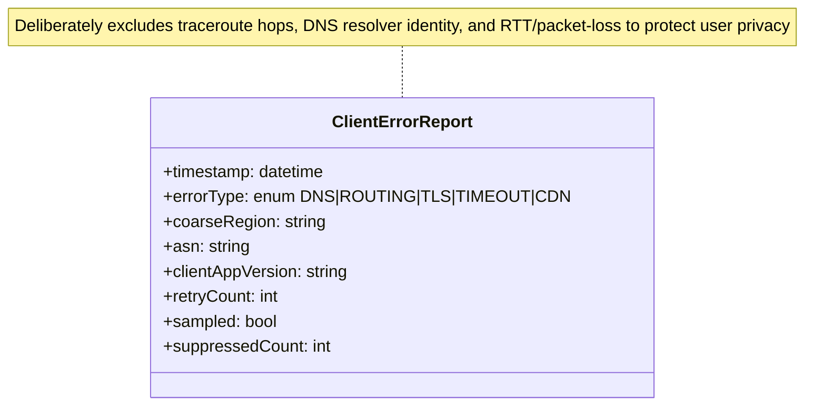

## 6. The full incident lifecycle — the "remember forever" picture

If you only retain one diagram from this whole guide, make it this one — it's the mental runbook an on-call engineer actually walks through, and it stitches together every piece above into one story.

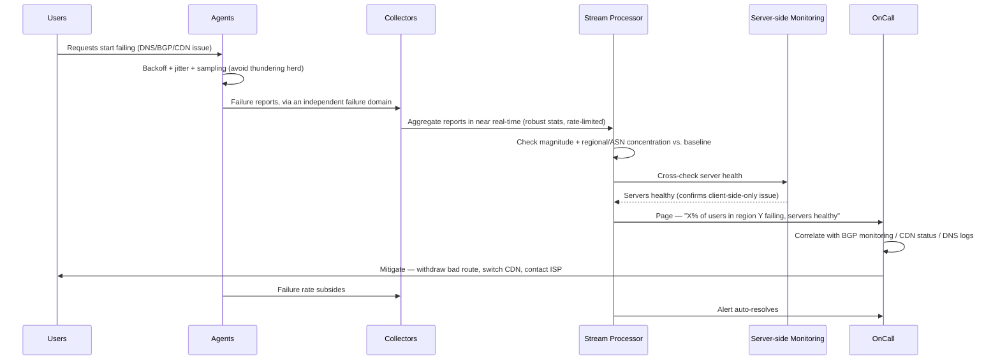

## 7. Real-world systems to name-drop

| System | What it does |
|---|---|
| **Chrome's Reporting API + Network Error Logging (NEL)** | W3C-standardized `Report-To` / `Reporting-Endpoints` headers let a site register out-of-band collectors; NEL reports DNS/TCP/TLS/HTTP failures the browser sees *before* any normal response — exactly the agent → independent-collector pattern above. |
| **Chrome UX Report (CrUX)** | Google's public, opt-in, internet-scale RUM dataset collected via Chrome. |
| **Sentry / Datadog RUM / New Relic Browser / Boomerang.js** | Commercial/OSS RUM SDKs: agent = SDK, collector = vendor's independent ingestion endpoint. |
| **Google SRE "outside-in" monitoring** | Monitors from outside Google's own network (peer ISPs, third-party vantage points) because self-monitoring can't see inbound route hijacks/leaks. |
| **Downdetector / social signals** | The slow fallback the lesson opens with — minutes-to-hours lag vs. seconds with agent/collector telemetry. |

## 8. How this shows up in an interview

Trigger phrases:

- "Metrics are healthy but users say the site is down — how do you catch that?"
- "How would you detect a BGP hijack / route leak affecting customers?"
- "Design monitoring for a global consumer product." (This is a component they expect, not the whole answer.)
- "How do you monitor things you don't control — CDN, DNS, an ISP?"
- "What happens to your monitoring system *during* a real outage?" — this is the question that's really asking about §5.1 (thundering herd). Don't miss it.

**Answer in this order:**

1. Name the blind spot: server telemetry only sees arrived requests; a traffic dip alone is too noisy to alert on.
2. Propose synthetic probing first, then immediately name its limits (coverage cost, unrealistic).
3. Introduce agent + independent collector (RUM).
4. Raise the three lesson sub-problems unprompted: consent, blast-radius reachability, privacy.
5. Volunteer the operational gaps before being asked: thundering herd/backoff/sampling, untrusted-input defense, client+server signal correlation.
6. Name a real system (NEL/Reporting API, CrUX, or a RUM vendor).

### Sample follow-up Q&A

| Interviewer asks | Strong answer in one line |
|---|---|
| "What if the outage itself causes every client to hammer your collector?" | Exponential backoff with jitter, plus client-side sampling with a suppressed-count field, so reporting volume degrades gracefully instead of collapsing the collector. |
| "Could an attacker fake an outage?" | Yes — treat reports as untrusted input: rate-limit per client, use robust/trimmed aggregation, prefer signed reports from a first-party SDK. |
| "How do you avoid paging on a false alarm?" | Correlate the client-side spike with server-side health and geographic/ASN concentration before escalating — a global-and-server-healthy spike is high confidence, a narrow spike needs corroboration. |
| "Why can collectors tolerate lossy delivery?" | Because the actionable output is an aggregate rate ("~1% of users"), not individual completeness — sampling and drops don't change the shape of that signal materially. |

## Interview cheat-sheet

- Server logs only see requests that **arrive** — DNS, BGP, CDN, and last-mile failures are **invisible**.
- A traffic **dip** is weak: high false-positive/false-negative rate from natural variance and partial-population impact.
- Real incidents: **Pakistan Telecom/YouTube 2008**, **China Telecom 2010 (~15% of routes)**, **2021 leak (30k+ prefixes, 13x spike)**.
- Design arc: **synthetic probers** (limited coverage/realism) → **agent + independent collector** (RUM).
- Collector must sit in a **different failure domain**: IP / domain / ASN / CDN, matched to what's being monitored — this is **blast-radius isolation**.
- **Last-mile failures have no server-side fix** — buffer client-side, flush on reconnect.
- Reports can be **lossy** — the goal is an aggregate rate, not an audit trail; zero-loss costs much more.
- Privacy: minimum data, explicit consent, no traceroute / DNS-resolver identity / RTT-packet-loss, encrypted, single designated collector.
- **A real outage floods the collector too** — exponential backoff + jitter + client-side sampling, or your monitoring system dies exactly when you need it.
- **Treat every report as untrusted input** — rate-limit, use robust/trimmed statistics, prefer signed first-party reports.
- **Correlate before you page** — client spike + server health + geo/ASN concentration together, not client signal alone.
- Real systems to cite: **NEL + Reporting API**, **CrUX**, Sentry/Datadog RUM/New Relic Browser.

## Master Cheat Sheet (one-page mind map)

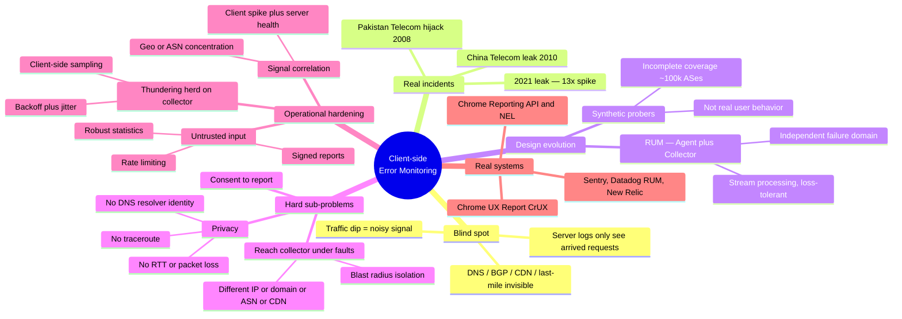

| Number to remember | What it's for |
|---|---|
| **~100,000** | Autonomous Systems on the internet (~2021) — why prober coverage is infeasible |
| **~2 hours** | YouTube outage duration from the 2008 Pakistan Telecom BGP hijack |
| **~15%** | Global routes rerouted in the 2010 China Telecom leak |
| **13x** | Inbound traffic spike from the April 2021 BGP prefix leak |
| **~1%** | Typical threshold language for "some users affected" in RUM aggregate alerting |
| **~100x** | Illustrative burst factor for report volume during a major outage vs. baseline — why backoff/sampling matter |
