# Monitor Client-side Errors — FAANG Interview Guide

> **Enhancement notes:** this pass left the original network-invisibility chapter (§§1-4, and old §5-8 renumbered to §6-9) untouched in structure and voice, and added:
> - A new **§5 "the other flavor"** covering the Sentry-style reading of this question — uncaught JS exceptions / mobile crashes — since the original chapter only covered network-invisible failures (DNS/BGP/CDN). Includes requirements, capacity estimation, API design, data model, a v1→v2→v3 architecture evolution, and deep dives on client batching/sampling, offline buffering, stack-trace fingerprinting, source-map resolution, per-client rate limiting, and spike/new-error alerting — each with a mermaid diagram (flowchart, sequence, state, or class).
> - A scope-note blockquote near the top flagging that "monitor client-side errors" is asked two ways, so you can steer to the right half fast.
> - Cross-references (§ numbers) between the two flavors where the same idea recurs (e.g., offline buffering in §4.2 and §5.7).
> - New rows/bullets in the real-systems table, interview Q&A, cheat-sheet, mind map, and numbers table to cover §5.
> - Existing §§1-4 and 6-9 prose, diagrams, and numbers are unchanged except for heading renumbering (5→6, 6→7, 7→8, 8→9) and two `§` cross-reference fixes.

## TL;DR — the entire chapter in one diagram

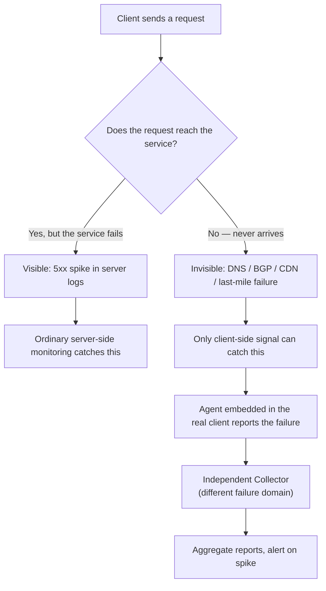

**The one idea to never forget:** *your server can be 100% healthy and 0% reachable, and your own infrastructure has no way to tell you that.* Everything else in this chapter is just "so what do we do about it" — including the operational scars (thundering herds, spoofed reports, false alarms) that a textbook lesson skips but an interviewer will absolutely probe.

> 🆕 **Scope note — this question comes in two flavors.** "Monitor client-side errors" gets asked two different ways in FAANG loops, and they share a skeleton (agent on the client → independent collector → aggregate → alert) but diverge on which part is hard:
> 1. **Network-invisible failures** — DNS/BGP/CDN/last-mile problems the server-side never sees at all. This is the lesson this chapter is built from — §§1-4 and §§6-9 below.
> 2. **Application error monitoring ("build Sentry")** — uncaught JS exceptions, unhandled promise rejections, native mobile crashes. The server sees the *request* fine; it's the client-side *code* that's broken. This is §5 below.
>
> If the interviewer says "users report the app crashes" or "how would you track JS errors," they mean flavor 2 — jump to §5. If they say "metrics are green but users say it's down," they mean flavor 1 — stay in §§1-4. Say out loud which one you're answering; it's a free point.

## 1. Mental model

Server-side monitoring (logs, metrics, traces) only sees requests that **arrive**. If a client can't reach you — broken DNS, a BGP route hijack, a dead CDN edge, a failed ISP peering link, a captive portal — your dashboards show *nothing*, not an error. A 500 spike is loud. A silent client-side failure is invisible, and it dresses up as "traffic just went down," which is the trap.

> **Analogy:** server-side monitoring is a doctor who only sees patients who make it to the hospital. Client-side monitoring is a public-health survey that also counts the people who never arrived.

This is **Real User Monitoring (RUM)**: you cannot rely on your own infrastructure to tell you your own infrastructure is unreachable. You need signal generated *outside* it.

## 2. Why the blind spot exists

| Failure class | Example | Visible in server logs? |
|---|---|---|
| DNS resolution failure | Resolver can't find `example.com` | No |
| Routing / BGP issue | Route hijack, route leak, peering link down | No |
| Third-party infra failure | CDN edge down, middlebox drops packets | No |
| Last-mile / ISP issue | Home router misconfigured, ISP outage | No |
| Server overload / crash | 500s, timeouts | **Yes** |
| App-level bug | Bad response, 4xx | **Yes** |

The only server-side symptom of the left column is an unexplained **dip in traffic** — and dips are a weak, noisy signal: normal diurnal/weekly variance, a holiday, or a small affected user slice all look identical in an aggregate load graph. Say this out loud in an interview — **a dip has both false positives and false negatives** — it's the reason "just alert on a traffic drop" doesn't work.

### Real incidents worth naming from memory

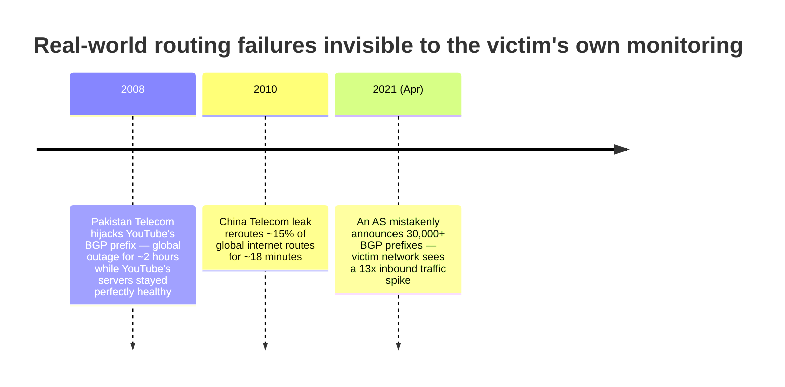

Play out the 2008 case as a sequence — this is the single most interview-usable story in this chapter:

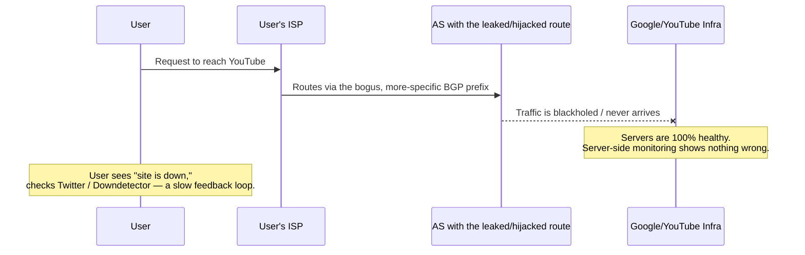

That gap between "user knows something's wrong" and "service finds out" is exactly what this chapter's design closes.

## 3. Design of a client-side monitoring system

### Attempt 1 — Active probing (synthetic monitoring)

Deploy your own **probers** at vantage points worldwide that periodically hit your service and check availability/latency (think Catchpoint, Pingdom, or an internal probing fleet).

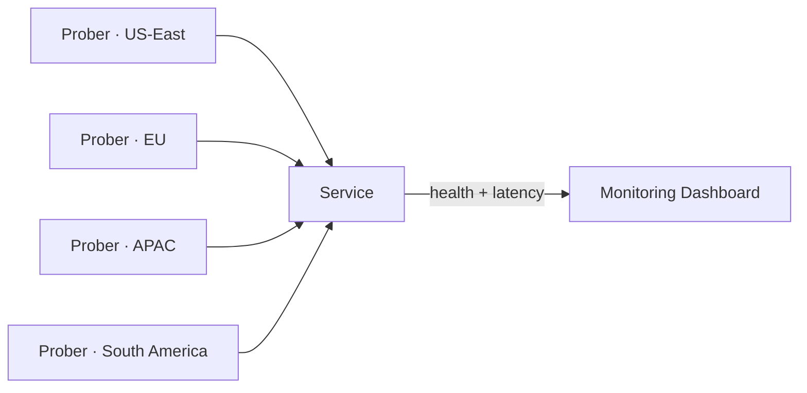

**Why it falls short:**

- **Incomplete coverage** — ~100,000 unique Autonomous Systems exist on the internet (as of March 2021); you can't afford probes inside all of them, and country/ISP regulation adds friction.
- **Doesn't imitate real users** — a prober isn't a real browser, on a real network stack, behind a real ISP's DNS resolver, a corporate proxy, or an ad blocker. It can miss exactly the failure modes that matter.

### Attempt 2 — Real User Monitoring (agent + independent collector)

Instead of simulating users from a handful of vantage points, instrument the **real client** so every real user becomes a vantage point.

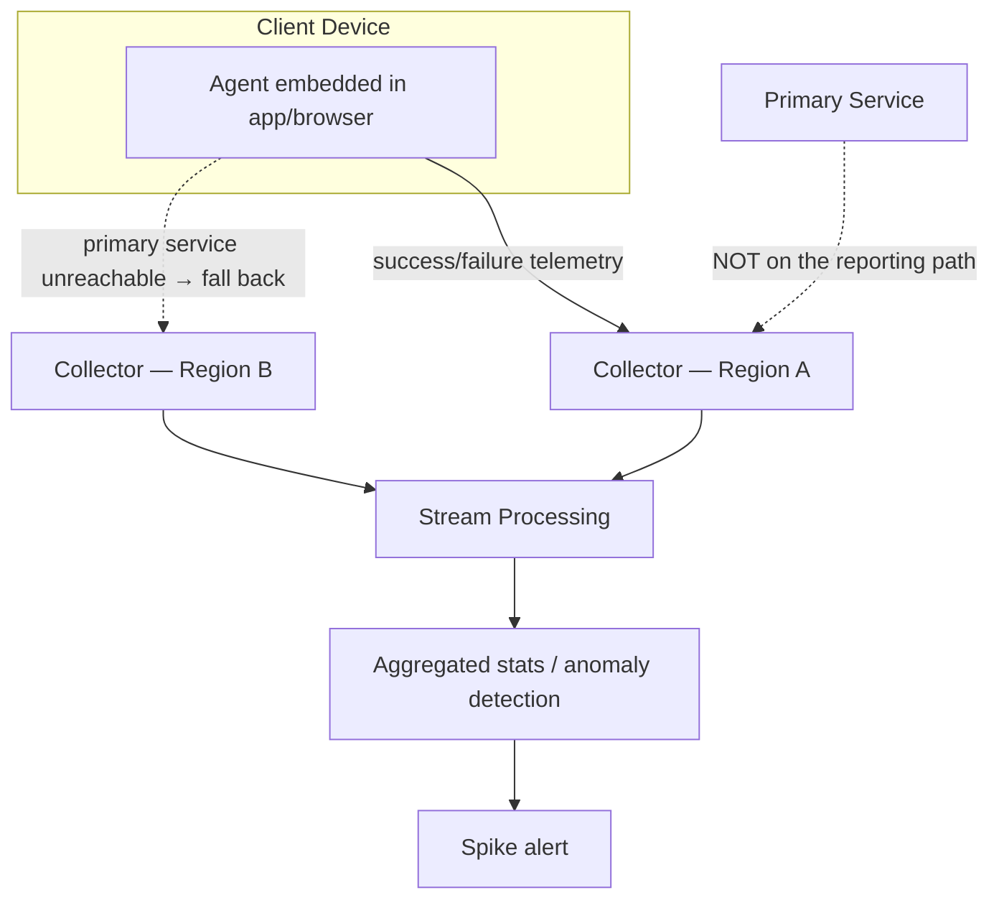

- **Agent** — code in the real client that observes real request outcomes and emits reports on failure.
- **Collector** — an endpoint **independent of the primary service**, whose only job is to keep receiving reports even when the primary service is completely dead.

Collectors form a **hierarchy of stream-processing pipelines** (Kafka + Flink/Spark-style) placed near client networks, rolling up into global stats over time. Because the goal is a **summary statistic** ("~1% of users in region X are failing"), the pipeline can tolerate **losing some reports** — a deliberate, lazy trade-off: lossy-and-cheap beats lossless-and-expensive when the actionable signal is a *rate*, not an audit trail. If you needed zero-loss (e.g., billing-grade accuracy), that's a materially pricier system — flag this trade-off if asked.

### Compare the two approaches — plot it, don't just list it

```mermaid
quadrantChart
    title Synthetic Monitoring vs Real User Monitoring
    x-axis Low Coverage --> High Coverage
    y-axis Low Realism --> High Realism
    quadrant-1 Ideal: broad and realistic
    quadrant-2 Realistic but narrow
    quadrant-3 Weak on both fronts
    quadrant-4 Broad but unrealistic
    Synthetic Probers: [0.25, 0.35]
    RUM Agent + Collector: [0.85, 0.85]
```

The whole design arc of this chapter is "move from bottom-left toward top-right."

## 4. Three hard sub-problems (from the lesson)

### 4.1 Activate / deactivate reporting (consent lifecycle)

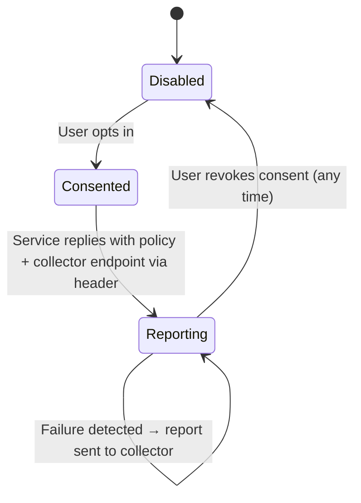

- Uses a custom **HTTP header** to carry policy from service to client — which is why it needs the **browser itself** to know about the feature (standardization, e.g. Chrome's Reporting API), or a **first-party client app/SDK** you fully control so you don't have to wait on browser vendors.
- The agent only fills in / activates the header **after explicit consent**; the service replies with the collection endpoint and policy.

### 4.2 Reaching collectors under faulty conditions — blast-radius isolation

The entire point of the collector is staying reachable when the *thing being monitored* isn't. So put it in a **different failure domain**:

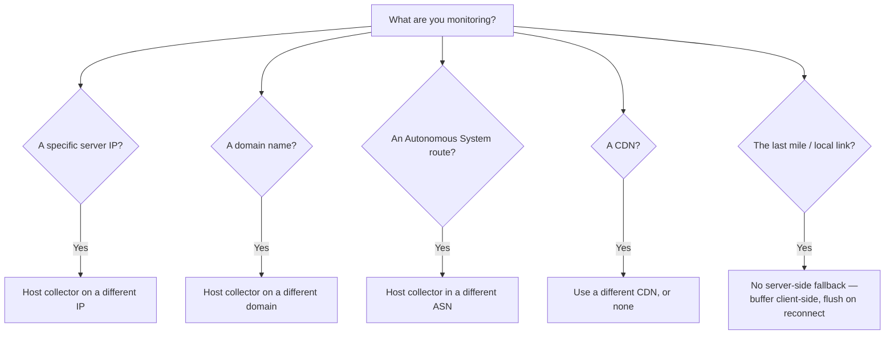

The agent tries collectors across failure domains until one works — the same principle as DNS resolver fallback, or multi-region health checks avoiding a single cloud provider. **Last-mile failure is a hard boundary**: if the user's own local connectivity is down, nothing server-side helps.

"Buffer client-side, flush on reconnect" is one line here, but it's a real state machine — see §5.7 for the offline-buffering diagram (same idea shows up in the Sentry-style flavor of this problem, just triggered by a dead network instead of a dead last mile).

### 4.3 Protecting user privacy

Users must know exactly what's collected and be able to opt out anytime. For a browser-based agent, deliberately **exclude**:

- **Traceroute hops** — leaks precise geography.
- **Which DNS resolver is used** — also leaks location/ISP.
- **RTT / packet-loss data** — same leak risk, marginal value.

**Guiding rule:** collect the minimum, only for the consented purpose. Ideally restrict to what a normal weblog already captures on a *successful* request — don't add new active probing (traceroute/RTT) just to enrich error reports. Encrypt the report path end-to-end so no intermediary (ISP, middlebox) can read, alter, or strip it, and route it only to the designated collector.

## 5. 🆕 The other flavor: monitoring JS/mobile application errors ("build Sentry")

Per the scope note above, this section answers the question when it means *application* errors — uncaught JS exceptions, unhandled promise rejections, native crashes on iOS/Android — not network-invisible failures. Same skeleton (agent → collector → alert), different hard parts: instead of blast-radius isolation, you're fighting **request volume from millions of devices, duplicate noise, and unreadable minified stack traces.**

### 5.1 🆕 Clarify requirements first

**Functional:**
- Capture uncaught exceptions, unhandled promise rejections (web) and native crashes (mobile), plus optional manual `logError()` calls from app code.
- Group repeated occurrences of the *same* bug into one entry instead of flooding a dashboard with duplicates.
- Alert the owning team when a **new** error type appears, or a **known** one spikes.
- Let a developer search by fingerprint and see: occurrence count, affected-user count, a human-readable stack trace, and a breakdown by browser/OS/app version.

**Non-functional:**
- The monitoring agent must never slow down or crash the host app — correctness of the product outranks completeness of telemetry.
- Write path: high throughput, loss-tolerant (sampling is fine). Read path: dashboards + search, much lower QPS.
- Alerting latency of **1-5 minutes** is fine — this is an ops signal, not a real-time control loop, so don't over-build for sub-second delivery.
- Ask the interviewer for client-base size and error rate before estimating — if they don't give numbers, say so and label your own as illustrative (below).

### 5.2 🆕 Capacity estimation (illustrative — numbers are assumptions, say so out loud)

Baseline, everyday load:
- Assume 100M daily active client sessions (web + mobile) and a 0.1% baseline error rate (some small fraction of sessions hit a bug) — **illustrative**, not a given.
- That's ~100,000 error events/day. Spread across a day this is only a few events/sec on average — boring, and not the number that matters.

The number that matters is a **bad release**, not the average day:
- A broken build ships to 5% of the mobile fleet (5M devices) over a 10-minute rollout window, and each affected device throws once on next launch.
- 5,000,000 events / 600 seconds ≈ **~8,300 errors/sec at peak** — this is the burst a naive design has to survive, not the daily average.
- Unbatched (one HTTP POST per error, ~3 KB each: message + stack + minimal context): ~8,300 req/sec hitting ingestion, ~25 MB/sec of payload — and the **connection overhead (TLS handshake, HTTP headers) per request dwarfs the payload cost**, which is the real reason a per-error design falls over before storage or bandwidth ever becomes the bottleneck.
- Client-side batching (flush every **10 seconds or 20 buffered events, whichever comes first**) turns "5 errors from one device in that window" into 1 request instead of 5. Add local dedup — suppress a repeated fingerprint after the first few occurrences and just bump a counter — and fleet-wide request volume typically drops **~90-95%**, down to a few hundred requests/sec even during the bad release.
- Storage stays bounded regardless of fleet size if you keep only grouped aggregates plus a capped sample per fingerprint (e.g., first 100 raw events, then 1-in-1000 sampled) rather than every raw event forever.

**The one-line version for the whiteboard:** *the daily average is a rounding error; the design has to survive the 10-minute window after a bad deploy, and batching+dedup is what makes that survivable.*

### 5.3 🆕 API design — client SDK reporting endpoint

```
POST /v1/errors/batch
{
  "clientId": "uuid",
  "appVersion": "3.4.1",
  "platform": "web | ios | android",
  "events": [
    {
      "eventId": "uuid",
      "timestamp": "2026-07-18T10:15:00Z",
      "type": "uncaught_exception | unhandled_rejection | native_crash | manual",
      "message": "Cannot read property 'x' of undefined",
      "stack": "<minified stack trace>",
      "breadcrumbs": ["clicked #checkout", "fetch /api/cart failed"],
      "context": { "url": "...", "userAgent": "...", "os": "...", "device": "..." }
    }
  ],
  "suppressedCounts": { "fp_9a2f...": 12 }
}

→ 202 Accepted (fire-and-forget — the client must never block the UI thread waiting on this)
```

Dashboard-side reads (`GET /errors?fingerprint=...&appVersion=...`) are ordinary CRUD over the aggregated store — not the hard part, keep it brief in an interview and spend the time on the write path instead.

### 5.4 🆕 Data model

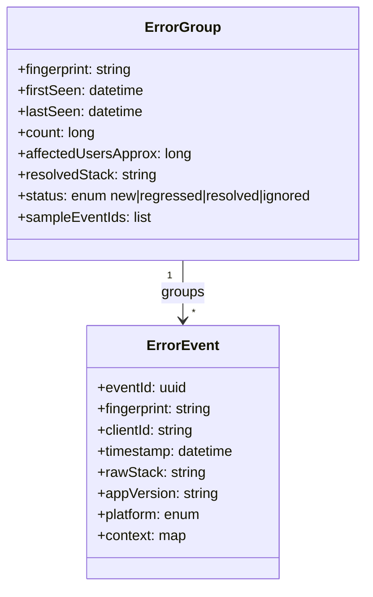

`ErrorEvent` is high-volume and short-retention (or sampled); `ErrorGroup` is low-volume, long-retention, and is what the dashboard and alerts actually read. `affectedUsersApprox` is a distinct-count estimate (HyperLogLog-style sketch) — don't pay for exact distinct-user counts at this volume, an approximation is the lazy-and-correct choice here.

### 5.5 🆕 Architecture evolution: v1 → v2 → v3

**v1 — naive, one HTTP call per error:**

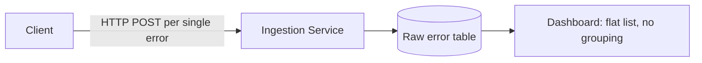
Breaks under the §5.2 bad-release burst; the dashboard is an unreadable firehose of duplicates; stacks are minified garbage; nobody gets paged automatically.

**v2 — add client-side batching + sampling:**

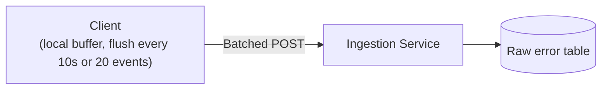
Cuts request volume ~90-95% (§5.2). Still no grouping, no readable stacks, no automated alerting — a human still has to notice a problem by eyeballing the dashboard.

**v3 — add server-side fingerprinting, source-map resolution, and spike alerting:**

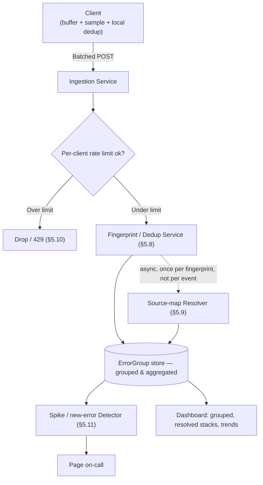

This is the "remember forever" target for the Sentry-style flavor — the counterpart to §7's incident-lifecycle diagram for the network-invisibility flavor.

### 5.6 🆕 Client-side sampling & batching — decision flowchart

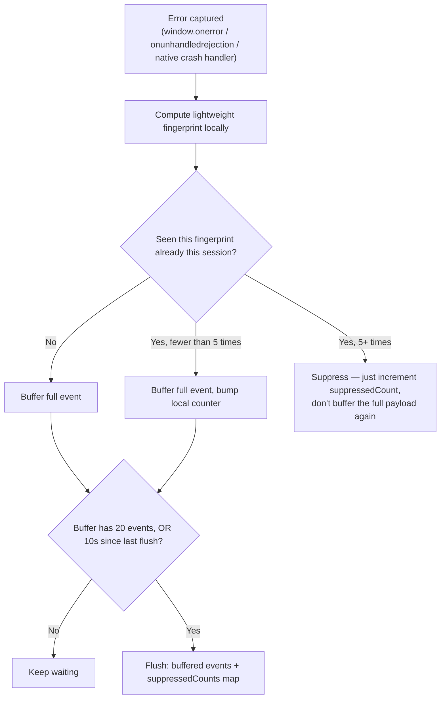

### 5.7 🆕 Offline buffering & retry — client state diagram

The same "buffer locally, flush on reconnect" idea from §4.2, spelled out as the state machine an interviewer expects for the client-error-monitoring flavor:

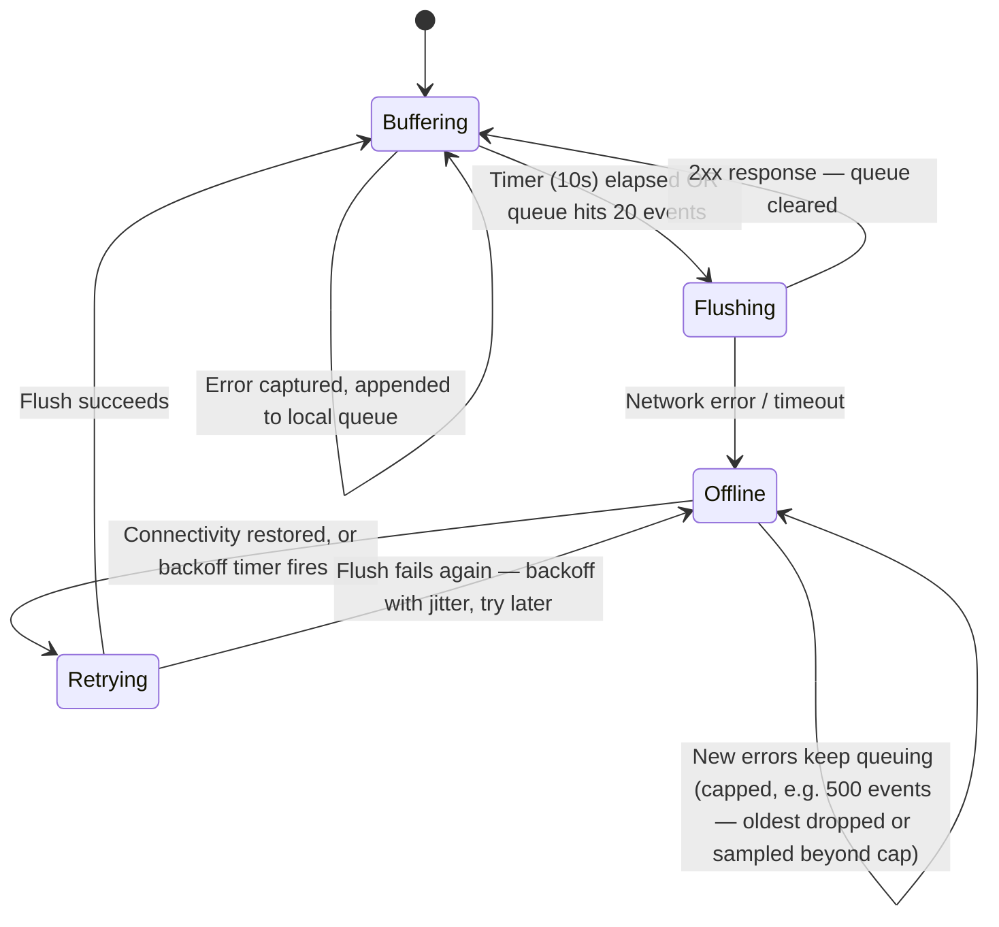

The queue cap matters: without one, a device offline for hours (airplane mode, subway, no signal) grows an unbounded local store. Cap it and drop-oldest-or-sample past the cap — losing some events from a device that's been offline for hours is a fine trade, the same lossy-is-fine logic as §3's collector design.

### 5.8 🆕 Stack-trace fingerprinting — grouping a new error into an existing bucket or a new one

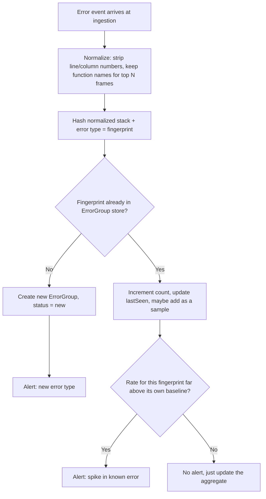

Why normalize before hashing: line/column numbers shift on every build even when the bug hasn't changed, so hashing the raw stack turns "the same bug" into "a new bug every release" — the single most common mistake in a naive design.

**Fingerprinting strategies compared:**

| Strategy | How it groups | Pros | Cons | Use when |
|---|---|---|---|---|
| Exact full-stack hash | Hash the raw stack string as-is | Trivial to implement | Line/column shift per build → same bug looks "new" every release | Don't ship this alone |
| Normalized top-N-frames hash | Strip file:line:col, hash function names for the top N (e.g. 5) frames | Stable across minor rebuilds, still cheap | Two distinct bugs sharing top frames can collide | Default choice — this is roughly what Sentry/Rollbar do |
| Message + top frame | Hash the error-message template plus the first frame | Cheapest, works with a truncated/partial stack | Generic messages ("undefined is not a function") collide a lot | Fallback when the stack is missing |
| Similarity clustering (edit-distance / embeddings) | Cluster new stacks against existing groups below a distance threshold | Survives refactors/renamed functions | Expensive, needs tuning, hard to defend at a whiteboard | Mention as where a mature system evolves to, not your starting design |

**Mnemonic:** *"same shape, same bucket"* — group on the **shape** of the stack (function-call structure), never on the exact **text** (which shifts every build).

### 5.9 🆕 Source-map resolution for minified stack traces

Production JS is minified and bundled — a raw stack trace says `at t.a (main.a8f3.js:1:48213)`, which is meaningless to a human. A **source map** (a build artifact mapping bundle position → original file/function/line) fixes this, but resolving it is CPU/IO work you don't want on the ingestion hot path:

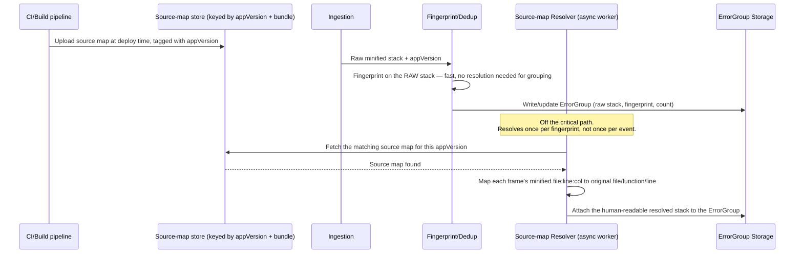

Two design choices worth saying out loud: fingerprinting runs on the **raw** stack (resolution isn't needed to know "have I seen this before"), and resolution runs **once per fingerprint** — not once per event — since it's the expensive step and a fingerprint might represent thousands of identical events.

### 5.10 🆕 Rate limiting per client

A single buggy device (an infinite error loop, a crash-on-every-frame bug) can otherwise flood the pipeline all by itself.

| If... | Then... |
|---|---|
| One `clientId` sends more than ~50 events/min | Server-side token bucket throttles further events from that client; excess gets a 429 or is silently dropped |
| The same fingerprint recurs repeatedly in one client session | Client self-throttles after ~5 occurrences (§5.6) — increments a local counter instead of sending the full event again |
| A whole fleet segment (one app version, one region) spikes together | That's real signal for the spike detector (§5.11) — don't apply the per-client cap to aggregate, fleet-wide surges, or you'll suppress the exact thing you want to detect |
| A client retries and resends an `eventId` you already have | De-dupe on `(clientId, eventId)` at ingestion so a timeout-triggered retry doesn't double-count |

### 5.11 🆕 Spike / new-error alerting

Two distinct alert conditions, both visible on the §5.8 flowchart: a **brand-new fingerprint** (baseline is zero, so any occurrence is worth flagging — usually rate-limited to avoid paging on a single noisy user) and a **known fingerprint whose rate jumps far above its own rolling baseline** (a regression, or a bad release). Both route through the same detector, just with a different comparison — new-vs-none, or current-vs-history.

### 5.12 🆕 End-to-end sequence: error occurs → alert

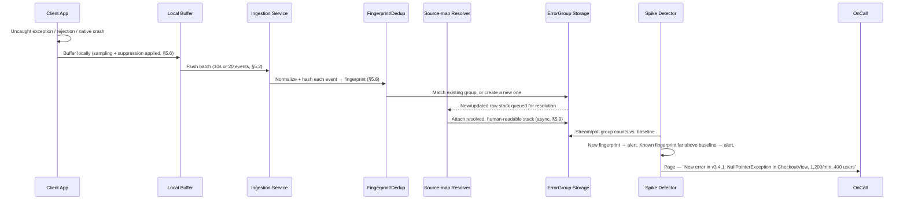

### 5.13 🆕 If X then Y — the whole section in one recall table

| If... | Then remember... |
|---|---|
| Interviewer says "JS errors" / "app crashes" / "build Sentry" | You're in §5, not §§1-4 — say so out loud |
| Asked "why not send every error as its own request?" | §5.2 burst math: ~8,300/sec in a bad-release window, connection overhead kills it before payload size does |
| Asked "how do you avoid a wall of duplicate entries?" | §5.8 fingerprinting — normalize before hashing, group on shape not exact text |
| Asked "why are the stack traces unreadable in prod?" | §5.9 source maps — resolve once per fingerprint, async, off the hot path |
| Asked "what stops one device from flooding you?" | §5.10 per-client rate limiting, plus client-side self-throttling |
| Asked "what if the device is offline?" | §5.7 state diagram — buffer, cap the queue, retry with backoff on reconnect |
| Asked "how do you know to page someone?" | §5.11 — new fingerprint (baseline zero) or known fingerprint spiking above its own baseline |

## 6. Beyond the lesson — what a FAANG interviewer will actually probe

The textbook design (agent → independent collector → alert on spike) is necessary but not sufficient. Interviewers at the senior/staff level push on **scale** and **adversarial conditions**. These three gaps are the most common follow-ups — bring them up unprompted and you'll stand out.

### 6.1 The collector's own thundering-herd problem

A real global outage doesn't produce a few reports — it produces **millions of agents failing at the same instant**, all retrying against the same handful of collectors. Naively, you've just built a system that DDoSes itself at the exact moment you need it most.

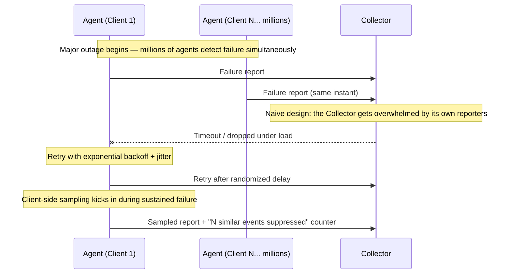

**Mitigations to name:** exponential backoff **with jitter** on retries (prevents synchronized retry storms), **client-side sampling** during sustained failure (report 1-in-N events plus a suppressed-count, not every single one), and horizontally scaled, geo-distributed collectors sized for burst — not average — load.

**Quick capacity gut-check (say this out loud, don't over-engineer it):** 1B daily active users, baseline 0.1% client error rate → ~1M reports/day normally. A major regional outage can push that to 100x within minutes → ~100M reports in a short burst. That two-orders-of-magnitude burst factor is *why* sampling and backoff aren't optional — a collector fleet sized for the 1M/day baseline falls over instantly without them.

### 6.2 Reports are untrusted input — defend against abuse

Anything sent by a client is attacker-controlled by definition. A malicious or compromised agent (or a botnet) could flood collectors with **fabricated failure reports** to trigger a false page, force an unnecessary failover, or waste on-call attention — a denial-of-service against your *incident response process*, not your servers.

- **Rate-limit** per client identity/IP at the collector.
- Use **robust statistics** for aggregation (trimmed means, median-based outlier rejection) so a small burst of spoofed reports can't single-handedly swing the aggregate.
- Require **lightweight attestation** where possible (e.g., signed reports from a first-party SDK) so anonymous, unauthenticated spam is easier to downweight.

### 6.3 Correlate client-side and server-side signal before paging anyone

A client-side spike alone is not proof of an outage — it could be a bug in the agent's error-classification logic, a normalization artifact, or one bad app release. Cheap, load-bearing step: **cross-check against server health and geographic concentration** before escalating.

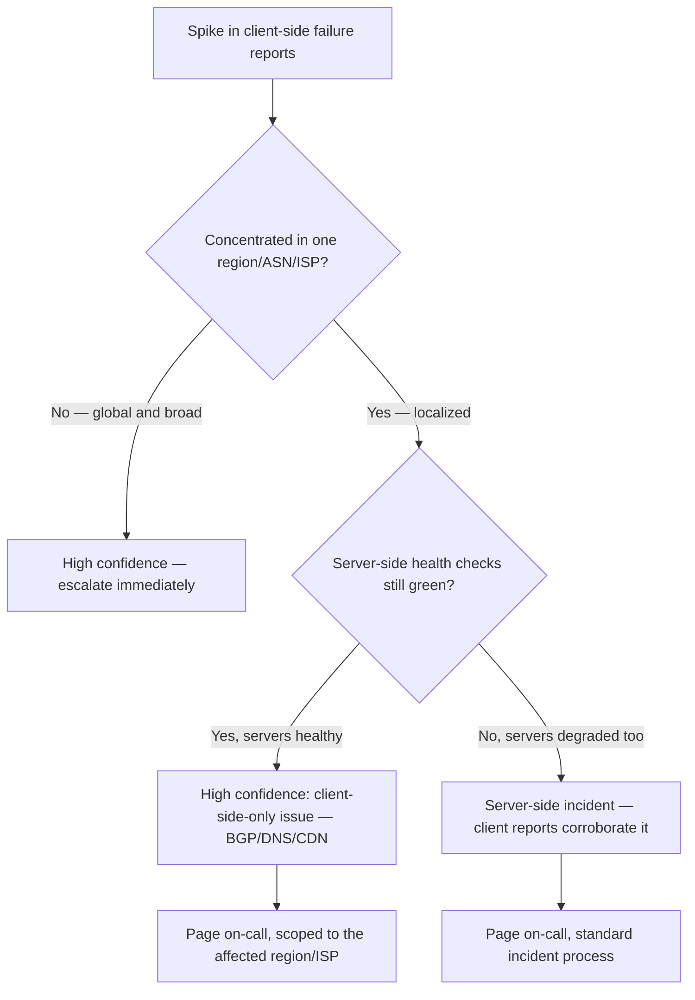

This is the difference between "alert that's actionable" and "alert that trains people to ignore alerts."

### 6.4 What actually goes in a report

Keep the schema minimal by design — this is the privacy rule from §4.3 made concrete:

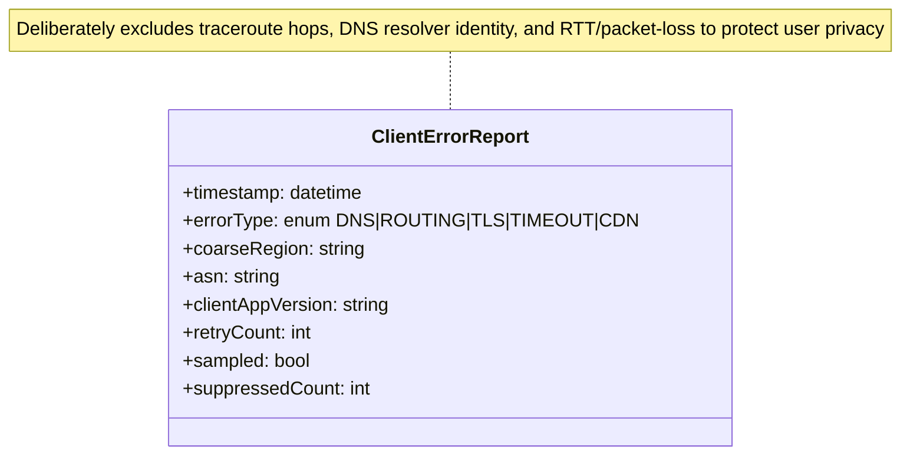

## 7. The full incident lifecycle — the "remember forever" picture

If you only retain one diagram from this whole guide, make it this one — it's the mental runbook an on-call engineer actually walks through, and it stitches together every piece above into one story.

```mermaid
sequenceDiagram
    participant Users
    participant Agents
    participant Collectors
    participant Stream as Stream Processor
    participant ServerMon as Server-side Monitoring
    participant OnCall

    Users->>Agents: Requests start failing (DNS/BGP/CDN issue)
    Agents->>Agents: Backoff + jitter + sampling (avoid thundering herd)
    Agents->>Collectors: Failure reports, via an independent failure domain
    Collectors->>Stream: Aggregate reports in near real-time (robust stats, rate-limited)
    Stream->>Stream: Check magnitude + regional/ASN concentration vs. baseline
    Stream->>ServerMon: Cross-check server health
    ServerMon-->>Stream: Servers healthy (confirms client-side-only issue)
    Stream->>OnCall: Page — "X% of users in region Y failing, servers healthy"
    OnCall->>OnCall: Correlate with BGP monitoring / CDN status / DNS logs
    OnCall->>Users: Mitigate — withdraw bad route, switch CDN, contact ISP
    Agents->>Collectors: Failure rate subsides
    Stream->>OnCall: Alert auto-resolves
```

## 8. Real-world systems to name-drop

| System | What it does |
|---|---|
| **Chrome's Reporting API + Network Error Logging (NEL)** | W3C-standardized `Report-To` / `Reporting-Endpoints` headers let a site register out-of-band collectors; NEL reports DNS/TCP/TLS/HTTP failures the browser sees *before* any normal response — exactly the agent → independent-collector pattern above. |
| **Chrome UX Report (CrUX)** | Google's public, opt-in, internet-scale RUM dataset collected via Chrome. |
| **Sentry / Datadog RUM / New Relic Browser / Boomerang.js** | Commercial/OSS RUM SDKs: agent = SDK, collector = vendor's independent ingestion endpoint. Sentry specifically is the §5 flavor of this problem — client batching, stack-trace fingerprinting, and source-map upload-and-resolve are literally its core product surface. |
| **Google SRE "outside-in" monitoring** | Monitors from outside Google's own network (peer ISPs, third-party vantage points) because self-monitoring can't see inbound route hijacks/leaks. |
| **Downdetector / social signals** | The slow fallback the lesson opens with — minutes-to-hours lag vs. seconds with agent/collector telemetry. |
| **🆕 Crashlytics / Bugsnag** | Mobile-native crash reporting — same §5 skeleton (batch on-device crash reports, symbolicate native stack traces the way source maps de-minify JS, group by fingerprint, alert on new/spiking crash signatures). |

## 9. How this shows up in an interview

Trigger phrases:

- "Metrics are healthy but users say the site is down — how do you catch that?"
- "How would you detect a BGP hijack / route leak affecting customers?"
- "Design monitoring for a global consumer product." (This is a component they expect, not the whole answer.)
- "How do you monitor things you don't control — CDN, DNS, an ISP?"
- "What happens to your monitoring system *during* a real outage?" — this is the question that's really asking about §6.1 (thundering herd). Don't miss it.
- "How would you build something like Sentry — capture and group JS errors from a website?" — this is the *other* flavor of the question; go to §5.

**Answer in this order (network-invisibility flavor, §§1-4 and 6-9):**

1. Name the blind spot: server telemetry only sees arrived requests; a traffic dip alone is too noisy to alert on.
2. Propose synthetic probing first, then immediately name its limits (coverage cost, unrealistic).
3. Introduce agent + independent collector (RUM).
4. Raise the three lesson sub-problems unprompted: consent, blast-radius reachability, privacy.
5. Volunteer the operational gaps before being asked: thundering herd/backoff/sampling, untrusted-input defense, client+server signal correlation.
6. Name a real system (NEL/Reporting API, CrUX, or a RUM vendor).

**🆕 Answer in this order (application-error / "build Sentry" flavor, §5):**

1. Clarify functional/non-functional requirements and get (or assume-and-label) rough scale numbers.
2. Do the capacity estimate — anchor on a bad-release burst, not the daily average (§5.2).
3. Sketch the API (client batch-reporting endpoint) and the two-table data model (raw events vs. grouped errors).
4. Walk the architecture evolution v1 → v2 → v3 (§5.5): naive per-error calls → client batching/sampling → server-side fingerprinting + source-map resolution + spike alerting.
5. Deep-dive whichever the interviewer leans into: fingerprinting (§5.8), source maps (§5.9), offline buffering (§5.7), or rate limiting (§5.10).
6. Close with alerting logic: new fingerprint vs. known-fingerprint spike (§5.11).

### Sample follow-up Q&A

| Interviewer asks | Strong answer in one line |
|---|---|
| "What if the outage itself causes every client to hammer your collector?" | Exponential backoff with jitter, plus client-side sampling with a suppressed-count field, so reporting volume degrades gracefully instead of collapsing the collector. |
| "Could an attacker fake an outage?" | Yes — treat reports as untrusted input: rate-limit per client, use robust/trimmed aggregation, prefer signed reports from a first-party SDK. |
| "How do you avoid paging on a false alarm?" | Correlate the client-side spike with server-side health and geographic/ASN concentration before escalating — a global-and-server-healthy spike is high confidence, a narrow spike needs corroboration. |
| "Why can collectors tolerate lossy delivery?" | Because the actionable output is an aggregate rate ("~1% of users"), not individual completeness — sampling and drops don't change the shape of that signal materially. |
| 🆕 "Why not just send every JS error as its own HTTP request?" | A bad release can push ~8,300 errors/sec; per-request connection overhead (not payload size) is what melts a naive backend — batch every 10s/20 events instead (§5.2). |
| 🆕 "How do you stop the same bug from showing up as 10,000 separate rows?" | Normalize the stack trace (strip line/column, keep function names) before hashing it into a fingerprint — hash the shape, not the exact text (§5.8). |
| 🆕 "Why are production stack traces unreadable, and how do you fix that?" | JS is minified; resolve via an uploaded source map, asynchronously, once per fingerprint rather than once per event (§5.9). |
| 🆕 "What stops one broken device from drowning the pipeline?" | Per-client token-bucket rate limiting at ingestion, plus client-side self-throttling after a few repeats of the same fingerprint (§5.10). |

## Interview cheat-sheet

- Server logs only see requests that **arrive** — DNS, BGP, CDN, and last-mile failures are **invisible**.
- A traffic **dip** is weak: high false-positive/false-negative rate from natural variance and partial-population impact.
- Real incidents: **Pakistan Telecom/YouTube 2008**, **China Telecom 2010 (~15% of routes)**, **2021 leak (30k+ prefixes, 13x spike)**.
- Design arc: **synthetic probers** (limited coverage/realism) → **agent + independent collector** (RUM).
- Collector must sit in a **different failure domain**: IP / domain / ASN / CDN, matched to what's being monitored — this is **blast-radius isolation**.
- **Last-mile failures have no server-side fix** — buffer client-side, flush on reconnect.
- Reports can be **lossy** — the goal is an aggregate rate, not an audit trail; zero-loss costs much more.
- Privacy: minimum data, explicit consent, no traceroute / DNS-resolver identity / RTT-packet-loss, encrypted, single designated collector.
- **A real outage floods the collector too** — exponential backoff + jitter + client-side sampling, or your monitoring system dies exactly when you need it.
- **Treat every report as untrusted input** — rate-limit, use robust/trimmed statistics, prefer signed first-party reports.
- **Correlate before you page** — client spike + server health + geo/ASN concentration together, not client signal alone.
- Real systems to cite: **NEL + Reporting API**, **CrUX**, Sentry/Datadog RUM/New Relic Browser.
- 🆕 "Client-side errors" has a second meaning — **JS/mobile app exceptions**, not network invisibility. Same skeleton, different hard parts (§5).
- 🆕 The number that matters is the **bad-release burst**, not the daily average — batch (10s/20 events) and locally dedup, or the burst melts ingestion.
- 🆕 Fingerprint the **normalized** stack (strip line/column, keep function shape) — hashing the raw stack turns "same bug" into "new bug" every build.
- 🆕 Resolve source maps **async, once per fingerprint** — not per event, and never on the ingestion hot path.
- 🆕 Two alert triggers: a **brand-new fingerprint** (baseline zero) or a **known one spiking** above its own rolling baseline.

## Master Cheat Sheet (one-page mind map)

```mermaid
mindmap
  root((Client-side<br/>Error Monitoring))
    Blind spot
      Server logs only see arrived requests
      DNS / BGP / CDN / last-mile invisible
      Traffic dip = noisy signal
    Real incidents
      Pakistan Telecom hijack 2008
      China Telecom leak 2010
      2021 leak — 13x spike
    Design evolution
      Synthetic probers
        Incomplete coverage ~100k ASes
        Not real user behavior
      RUM — Agent plus Collector
        Independent failure domain
        Stream processing, loss-tolerant
    Hard sub-problems
      Consent to report
      Reach collector under faults
        Different IP or domain or ASN or CDN
        Blast radius isolation
      Privacy
        No traceroute
        No DNS resolver identity
        No RTT or packet loss
    Operational hardening
      Thundering herd on collector
        Backoff plus jitter
        Client-side sampling
      Untrusted input
        Rate limiting
        Robust statistics
        Signed reports
      Signal correlation
        Client spike plus server health
        Geo or ASN concentration
    Real systems
      Chrome Reporting API and NEL
      Chrome UX Report CrUX
      Sentry, Datadog RUM, New Relic
    Other flavor -- app errors
      Capacity: bad-release burst not daily average
      Client batch plus local dedup
      Fingerprint normalized stack, not raw
      Source maps resolved async per fingerprint
      Per-client rate limiting
      Offline buffer with capped queue
      Alert: new fingerprint or known-fingerprint spike
```

| Number to remember | What it's for |
|---|---|
| **~100,000** | Autonomous Systems on the internet (~2021) — why prober coverage is infeasible |
| **~2 hours** | YouTube outage duration from the 2008 Pakistan Telecom BGP hijack |
| **~15%** | Global routes rerouted in the 2010 China Telecom leak |
| **13x** | Inbound traffic spike from the April 2021 BGP prefix leak |
| **~1%** | Typical threshold language for "some users affected" in RUM aggregate alerting |
| **~100x** | Illustrative burst factor for report volume during a major outage vs. baseline — why backoff/sampling matter |
| 🆕 **~8,300/sec** | Illustrative peak error rate from a bad release hitting 5M devices in a 10-minute rollout — the number a §5 design must survive |
| 🆕 **10s / 20 events** | Illustrative client batch-flush trigger (whichever comes first) — cuts request volume ~90-95% |
| 🆕 **~5** | Illustrative local-suppression threshold — after this many repeats of one fingerprint in a session, the client stops sending full payloads and just counts |
| 🆕 **1-5 min** | Reasonable alerting latency target for new/spiking errors — an ops signal, not a real-time control loop |
