# Distributed Cache — FAANG Interview Guide

> **Enhancement notes**: This pass filled the gaps a FAANG interviewer expects but the original draft skipped, and added recall aids. Sections marked 🆕 are new; everything else is the original content, renumbered to fit.
> - Added **§3 Clarify requirements** (functional + NFR questions to ask out loud) and **§4 API design and data model** (GET/SET/DELETE/EXPIRE/TTL/MGET/MSET surface, key namespacing, serialization, per-entry metadata) — both previously missing entirely.
> - Added **§17 Cache warm-up and cold start** — a gap called out explicitly: what happens when a node restarts with an empty cache, and how to ramp it back in without stampeding the DB.
> - Added new diagrams: a v1→v2→v3 **architecture evolution** sequence in §15, a **ring-rebalancing-on-node-addition** diagram and **hot-key detection flowchart** in §11, and a **cache-miss-with-stampede-lock flowchart** in §20.
> - Added concrete worked numbers throughout (e.g., a 50K req/sec hot key spread across 5 replicas to 10K req/sec each; adding a 4th shard moving ~75K of 300K keys; a cold node causing a 20x DB spike) and two new recall tables (invalidation strategies at a glance; stampede mitigation techniques compared).
> - Light clarity edit to the "naive design" intro in §12 (was a vague 3-item list, now says plainly what each problem is) — everything else's original voice and structure is untouched.

## 1. Mental model (read this once, never forget it)

A cache is a bet: most requests ask for a small, hot subset of your data, so keep that subset in RAM, in front of the database, and most requests never touch disk. **Locality of reference** (temporal — recently accessed data gets accessed again soon; spatial — nearby data gets accessed together) is the entire justification for caching. If access is uniformly random, caching buys you nothing — say this out loud if an interviewer asks "would you cache this?"

Think of a distributed cache as **a hash table that outgrew one machine**. Everything hard about it — consistent hashing, replication, hot keys, invalidation — is what you get when you're forced to shard `HashMap<K,V>` across a fleet and keep it correct under failure.

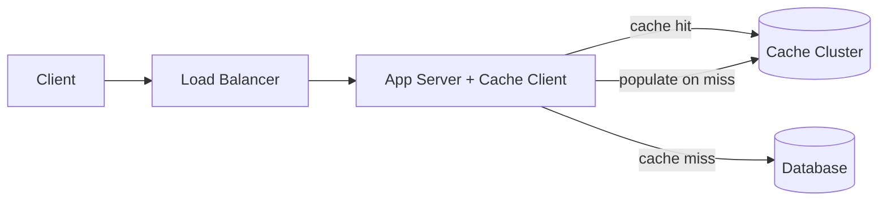
```mermaid
graph LR
    C[Client] --> LB[Load Balancer]
    LB --> App[App Server + Cache Client]
    App -->|cache hit| Cache[(Cache Cluster)]
    App -->|cache miss| DB[(Database)]
    App -->|populate on miss| Cache
```

> **Memory hook**: "Cache = commodity RAM standing between you and a slow, expensive disk." Facebook's Memcached tier turned 50M web-layer requests/day into 2.5M DB requests — a **95% hit rate**. That single number is why caches exist.

---

## 2. The interview playbook — say things in this order

Interviewers score structure as much as content. Walk through these seven steps out loud, in this order, whether the question is "design a distributed cache" or "how would you add caching to X":

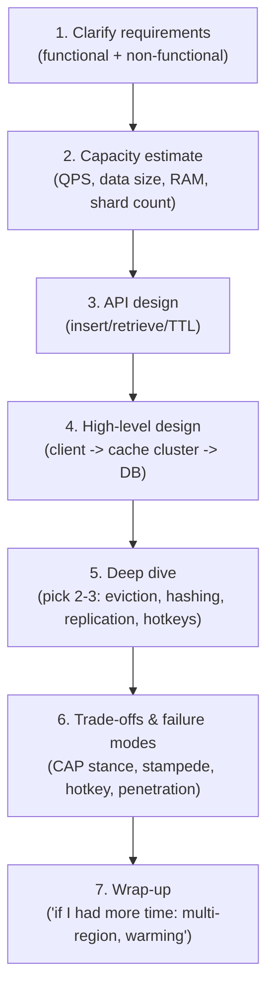
```mermaid
flowchart TD
    A["1. Clarify requirements\n(functional + non-functional)"] --> B["2. Capacity estimate\n(QPS, data size, RAM, shard count)"]
    B --> C["3. API design\n(insert/retrieve/TTL)"]
    C --> D["4. High-level design\n(client -> cache cluster -> DB)"]
    D --> E["5. Deep dive\n(pick 2-3: eviction, hashing, replication, hotkeys)"]
    E --> F["6. Trade-offs & failure modes\n(CAP stance, stampede, hotkey, penetration)"]
    F --> G["7. Wrap-up\n('if I had more time: multi-region, warming')"]
```

**Cheat-sheet**
- Never jump straight to "I'll use Redis." Earn it — requirements first, then capacity math, then the design.
- When the interviewer interrupts to go deep on one box, that's a signal, not a derail — follow it, then return to the checklist.
- Always close with the "if I had more time" line — it shows you know the edges of your own design.

---

## 🆕 3. Clarify requirements first (step 1 of the playbook, spelled out)

Don't design anything until you've said these out loud and gotten a nod. Interviewers deliberately leave this vague — asking the right questions here is itself a scored signal.

**Functional requirements** — pin these down:
- `get`/`set`/`delete` on a key — is that the whole surface, or do we also need `exists`, batch `mget`/`mset`, atomic `incr`/`decr`?
- Does every key need a **TTL**, or is expiry opt-in per key?
- Is this a **generic cache** (any service, any shape of data) or built for one specific access pattern (e.g., a session store, a leaderboard)? This changes whether Redis's richer data structures earn their keep (§19) or a plain Memcached-style KV store is enough.
- Do we need an explicit invalidation/delete API, or is TTL-based staleness acceptable? (Directly sets up §9.)

**Non-functional requirements** — the ones that actually drive the design:

| Question | Why it matters | Typical FAANG-interview default if unstated |
|---|---|---|
| What's the read:write ratio? | Read-heavy → optimize hit rate and read replicas; write-heavy → worry about write-back durability | Read-heavy, often 80:20 to 99:1 |
| What latency is acceptable on a hit? | Sets the RAM-only vs. RAM+disk decision | Sub-millisecond to low single-digit ms |
| Can the system tolerate stale data, and for how long? | Determines TTL length and whether write-through is required | A few seconds to a few minutes is usually fine |
| Does the cache need to survive a restart (durability)? | A cache is normally a *disposable* accelerator, not a source of truth | No — DB is source of truth; cache rebuilds itself (§17) |
| What's the working-set size and growth rate? | Feeds directly into capacity estimation (§13) | Ask for DAU/QPS and item size, then compute it live |
| What availability target? | Drives replica count and failover design (§12) | 99.9%+, no single point of failure |

> **Say this explicitly**: "A cache is allowed to lose data and rebuild itself from the database — that's what makes it a cache and not a database. If we need durability guarantees, we're really asking for a data store, not a cache." Interviewers listen for this line because it's the thing junior candidates miss.

---

## 🆕 4. API design and data model

Keep the API tiny — a cache earns its keep by being simple and fast, not feature-rich.

```
GET    key                          -> value | NOT_FOUND
SET    key, value, ttl_seconds?     -> OK
DELETE key                          -> OK | NOT_FOUND
EXISTS key                          -> bool
EXPIRE key, ttl_seconds             -> OK          # update TTL without rewriting the value
TTL    key                          -> seconds_remaining | -1 (no TTL) | -2 (missing)
MGET   [key, ...]                   -> {key: value}   # batch read, one round trip instead of N
MSET   {key: value, ...}, ttl?      -> OK             # batch write
INCR   key, delta=1                 -> new_value       # optional — needs an atomic counter, Redis-style
```

**Data model** — a distributed cache almost always stores **opaque bytes**, not typed objects:

- **Key**: a string, conventionally namespaced as `entity:id:field` (e.g. `user:42:profile`, `product:9981:price`) so multiple services sharing one cluster don't collide.
- **Value**: serialized bytes (JSON, Protobuf, or MessagePack) — the app serializes before `SET` and deserializes after `GET`. The cache itself doesn't know or care what's inside.
- **Metadata per entry** (kept alongside the value, not part of it): TTL/expiry timestamp, last-access time and/or access count (whichever the eviction policy needs, §8), and optionally a version number for the versioned-key pattern (§9).
- **Size limits matter**: most caches cap a single value (Memcached defaults to 1MB/item) — oversized blobs (a whole page of search results, a big serialized object) either get chunked across multiple keys or don't belong in the cache at all.

**Concrete example**: caching a user profile. Key = `user:42:profile`, value = 800-byte JSON blob, TTL = 300s. On write to the DB, the write path issues `DELETE user:42:profile` (or a fresh `SET`) so the next `GET` reloads the current row — this is explicit invalidation from §9, not eviction.

---

## 5. Where caching lives in a system

| Layer | Technology | What it accelerates |
|---|---|---|
| Client / browser | HTTP cache headers, browser cache | Avoids the network round-trip entirely |
| CDN / edge | Akamai, CloudFront, Fastly | Static assets, sometimes API responses |
| DNS | Resolver caching | Name resolution |
| Application | Local (in-process) cache, Redis/Memcached | Computed results, session data, hot objects |
| Database | Buffer pool, query cache | Reduces disk I/O and query latency |

Naming the layer signals you understand caching isn't one knob. "I'd cache static assets at the CDN, feed data at the application layer with Redis, and rely on the DB's own buffer pool for the rest" is a stronger answer than "add a cache."

---

## 6. Access patterns — who populates the cache, and when

This is the most commonly mis-named concept in interviews. There are two independent axes: **who fills the cache on a miss** (app vs. cache library) and **when the DB gets written** (sync, async, or never-through-cache).

### 4a. Read path: Cache-Aside vs. Read-Through

| Pattern | Who checks cache, who fetches DB on miss | Used by |
|---|---|---|
| **Cache-aside (lazy loading)** | **Application code** checks cache; on miss, app queries DB and writes result back to cache | Most hand-rolled Redis/Memcached usage — this is the default assumption unless stated otherwise |
| **Read-through** | The **cache library/proxy** itself owns the DB connection; app only ever talks to the cache, which transparently loads on miss | Managed caching layers (e.g., a caching proxy in front of the DB) |

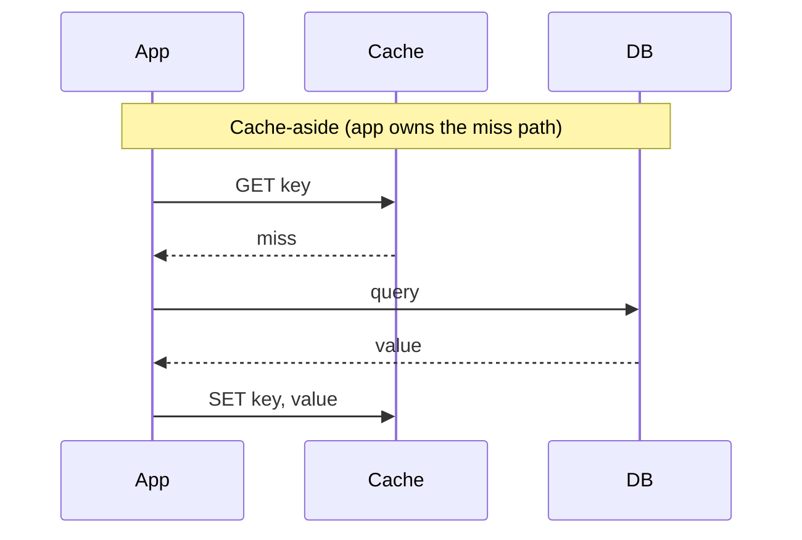
```mermaid
sequenceDiagram
    participant App
    participant Cache
    participant DB
    Note over App,DB: Cache-aside (app owns the miss path)
    App->>Cache: GET key
    Cache-->>App: miss
    App->>DB: query
    DB-->>App: value
    App->>Cache: SET key, value
```

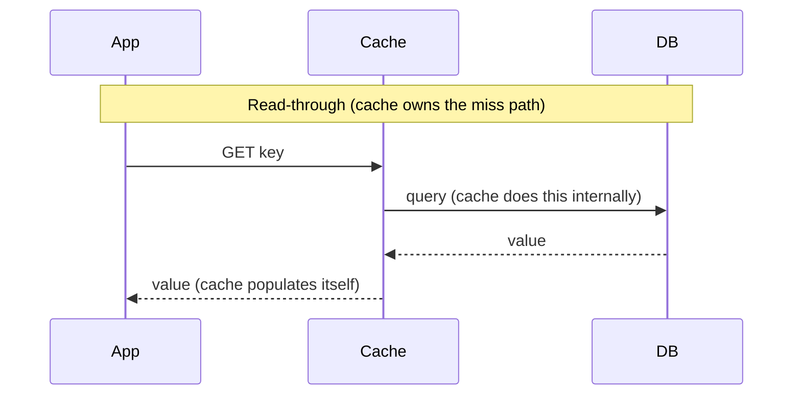
```mermaid
sequenceDiagram
    participant App
    participant Cache
    participant DB
    Note over App,DB: Read-through (cache owns the miss path)
    App->>Cache: GET key
    Cache->>DB: query (cache does this internally)
    DB-->>Cache: value
    Cache-->>App: value (cache populates itself)
```

> **Memory hook**: cache-**aside** = the app steps **aside** from the cache to go fetch data itself. Read-**through**: you never leave the cache, the request passes **through** it into the DB transparently.

### 4b. Write path: Write-Through / Write-Back / Write-Around

| Policy | How it works | Consistency | Write latency | Best for |
|---|---|---|---|---|
| **Write-through** | Write to cache **and** DB before ack | Strong | Higher (waits on DB) | Read-your-writes correctness (balances, inventory) |
| **Write-back (write-behind)** | Write to cache, ack immediately, flush to DB async | Weak — DB lags | Lowest | Write-heavy, tolerant of losing the last few writes (counters, metrics) |
| **Write-around** | Write to DB only; cache fills lazily on next read | DB fresh, cache stale/missing | Low, but guaranteed miss on first read after write | Write-once, rarely-read-immediately data (bulk imports) |

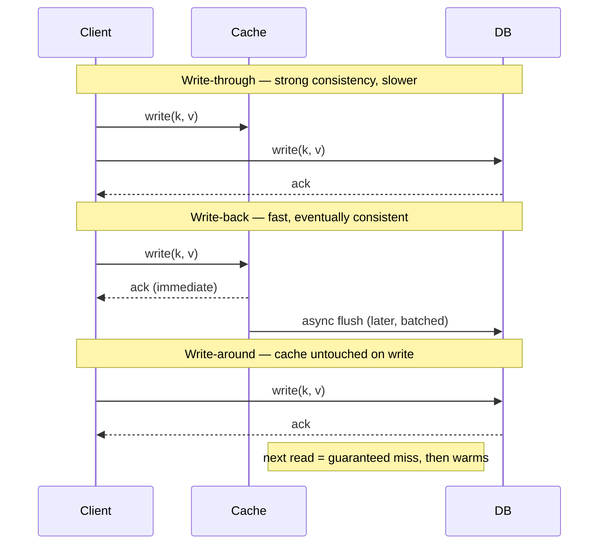
```mermaid
sequenceDiagram
    participant Client
    participant Cache
    participant DB
    Note over Client,DB: Write-through — strong consistency, slower
    Client->>Cache: write(k, v)
    Client->>DB: write(k, v)
    DB-->>Client: ack
    Note over Client,DB: Write-back — fast, eventually consistent
    Client->>Cache: write(k, v)
    Cache-->>Client: ack (immediate)
    Cache->>DB: async flush (later, batched)
    Note over Client,DB: Write-around — cache untouched on write
    Client->>DB: write(k, v)
    DB-->>Client: ack
    Note right of Cache: next read = guaranteed miss, then warms
```

> **Memory hook**: "THRU is True (both stores updated together). BACK is fast but risky (DB lags BEHIND). AROUND means the write goes AROUND the cache entirely."

**Interview trap**: *"write data and read it back immediately, want strong consistency"* → **write-through**, not write-back. Write-back optimizes write latency at the cost of the DB (and any reader bypassing cache) seeing stale data.

---

## 7. Single-node internals

Every cache node needs two data structures working together:

1. **Hash map** — O(1) average lookup, key → pointer to value/node.
2. **Doubly linked list** — orders entries by recency so eviction is O(1): move to head on access, evict from tail when full.

This pair **is** the classic "design an LRU cache" coding question — `HashMap<K, Node>` + intrusive doubly linked list, both `get`/`put` in O(1).

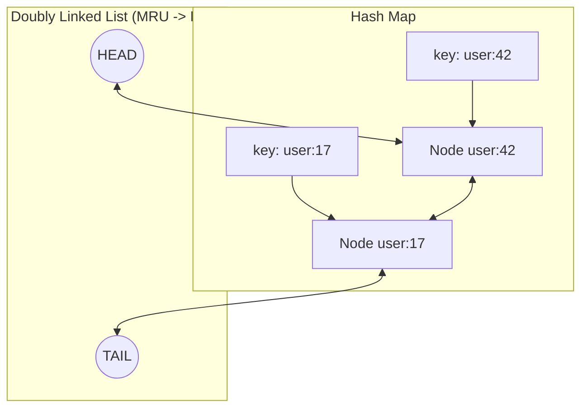
```mermaid
graph TD
    subgraph "Hash Map"
        K1["key: user:42"] --> N1
        K2["key: user:17"] --> N2
    end
    subgraph "Doubly Linked List (MRU  ->  LRU)"
        Head((HEAD)) <--> N1[Node user:42] <--> N2[Node user:17] <--> Tail((TAIL))
    end
```

**Bloom filter**: a probabilistic structure answering "is this key *definitely not* cached?" in O(k) with no false negatives (but possible false positives). Used to skip wasted DB lookups for keys that never existed — this is exactly how Cassandra avoids unnecessary SSTable reads, and the standard fix for **cache penetration** (see §20).

---

## 8. Eviction policies

RAM is small and expensive, so something must be evicted to make room.

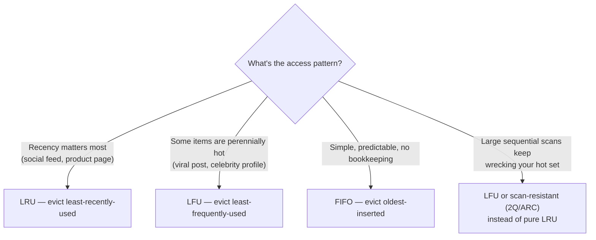
```mermaid
flowchart TD
    Q{"What's the access pattern?"} -->|"Recency matters most\n(social feed, product page)"| LRU["LRU — evict least-recently-used"]
    Q -->|"Some items are perennially hot\n(viral post, celebrity profile)"| LFU["LFU — evict least-frequently-used"]
    Q -->|"Simple, predictable, no bookkeeping"| FIFO["FIFO — evict oldest-inserted"]
    Q -->|"Large sequential scans keep\nwrecking your hot set"| SCAN["LFU or scan-resistant (2Q/ARC)\ninstead of pure LRU"]
```

| Policy | Evicts | Good for | Bad for |
|---|---|---|---|
| **LRU** | Oldest-accessed entry | General purpose, default answer | Sequential scans evict the whole hot set ("cache pollution") |
| **LFU** | Lowest access count | Long-tail popularity (viral content) | New items get evicted before they build up count |
| **FIFO** | Oldest-inserted entry | Cheap, predictable | Ignores actual access pattern |
| **Random** | Random entry | O(1), no bookkeeping | No guarantees — surprisingly competitive at scale though (Redis `allkeys-random`) |

> **Memory hook**: "LRU = **last touched** wins. LFU = **most touched** wins. FIFO = **oldest born** dies first."

### Why the eviction algorithm choice matters — the EAT formula (memorize this)

```
EAT (Effective Access Time) = Ratio_hit × Time_hit + Ratio_miss × Time_miss
```

Given: cache hit = 5ms (p99.9), cache miss = 30ms (p99.9, includes DB round-trip + cache repopulation):

- MFU, 10% miss rate: `EAT = 0.90×5 + 0.10×30 = 7.5ms`
- LRU, 5% miss rate: `EAT = 0.95×5 + 0.05×30 = 6.25ms`

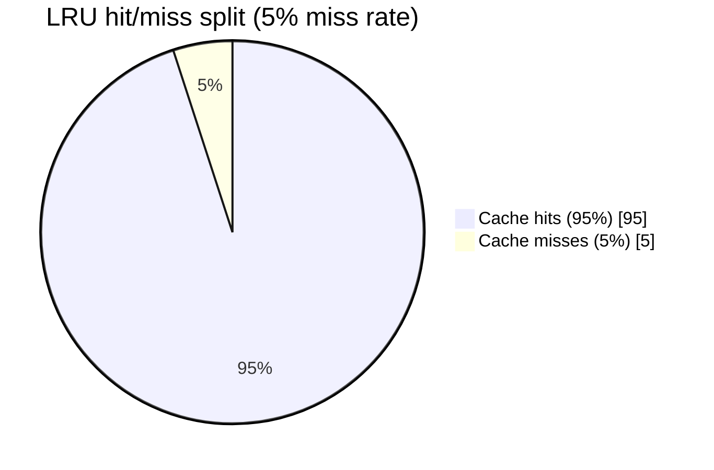
```mermaid
pie showData
    title LRU hit/miss split (5% miss rate)
    "Cache hits (95%)" : 95
    "Cache misses (5%)" : 5
```

**A 5-point hit-rate improvement is a ~17% latency improvement.** Know the formula, not the memorized number — interviewers will hand you different inputs.

---

## 9. Cache invalidation ("one of the two hard things in CS")

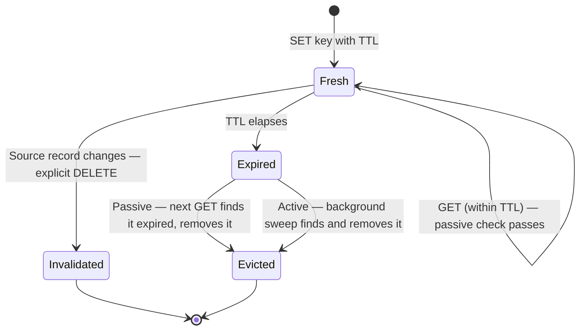
```mermaid
stateDiagram-v2
    [*] --> Fresh: SET key with TTL
    Fresh --> Fresh: GET (within TTL) — passive check passes
    Fresh --> Expired: TTL elapses
    Expired --> Evicted: Passive — next GET finds it expired, removes it
    Expired --> Evicted: Active — background sweep finds and removes it
    Fresh --> Invalidated: Source record changes — explicit DELETE
    Invalidated --> [*]
    Evicted --> [*]
```

- **TTL — active expiration**: a background daemon periodically scans and evicts expired keys (reclaims memory proactively, costs CPU).
- **TTL — passive expiration**: checked only on access; expired entries removed lazily (cheap, but stale entries linger in RAM until touched). Redis does **both** in production.
- **Explicit invalidation / delete-on-write**: when the source-of-truth record changes, the write path must actively delete or update the cache key. TTL alone won't catch this — an LRU entry can be "hot" and simultaneously *wrong*.
- **Versioned keys** (`user:42:v3`): sidesteps delete-race conditions entirely — old versions just age out via normal eviction.

**Cheat-sheet**: TTL handles *time-based* staleness. Explicit invalidation handles *event-based* staleness (a write happened). If asked "how do you keep cache and DB in sync after a delete" — the answer is always the write path, never the eviction policy.

#### 🆕 Invalidation strategies at a glance

| Strategy | Triggers on | Catches writes? | Cost | If asked... |
|---|---|---|---|---|
| TTL — active | Background sweep timer | No | CPU, always running | "reclaim memory proactively" |
| TTL — passive | Next GET after expiry | No | Cheap, but stale entry lingers in RAM | "lazy, low overhead" |
| Explicit delete-on-write | The write path, immediately | Yes | One extra call per write | "how do we stay in sync with the DB" |
| Versioned keys | New version written, old key just ages out | Yes (no race) | Slight key-space growth | "avoid delete-race conditions" |

**If X then Y**: *if the interviewer says "the DB changed, how does the cache find out" → your answer is explicit delete-on-write, never "wait for the TTL."* TTL is a safety net for staleness you didn't catch, not the primary invalidation mechanism.

---

## 10. Sharding topology: dedicated vs. co-located

| Model | Description | Pros | Cons |
|---|---|---|---|
| **Dedicated cache servers** | Cache on separate hosts from app/web servers | Scale cache and compute independently; shareable as "cache as a service" across microservices | Extra network hop, extra hardware |
| **Co-located cache** | Cache embedded on the same host as the app | Lower CAPEX/OPEX; scales automatically with the service | Host failure kills both cache and service together |

**Real-world anchor**: Facebook's Memcached tier is dedicated — ~28TB RAM across 800+ servers (2013), because Memcached is shared across many services, not owned by one.

**Default to dedicated** when multiple services share the cache or scale at different rates. Choose co-located only when operational simplicity matters more than isolation.

---

## 11. Finding the right server: consistent hashing

Plain `hash(key) % N` breaks catastrophically when `N` changes — adding/removing a node remaps nearly every key, causing a stampede on the DB. **Consistent hashing** places servers and keys on a hash ring; adding/removing a node only remaps the keys between it and its neighbor — roughly `K/N` keys move, not nearly all of them.

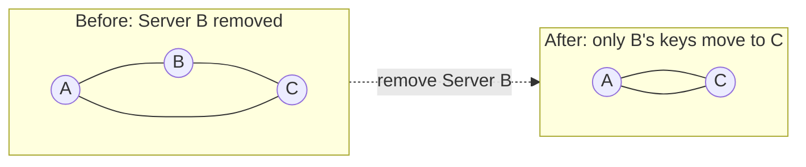
```mermaid
flowchart LR
    subgraph Before["Before: Server B removed"]
        direction LR
        A1((A)) --- B1((B)) --- C1((C)) --- A1
    end
    subgraph After["After: only B's keys move to C"]
        direction LR
        A2((A)) --- C2((C)) --- A2
    end
    Before -.->|"remove Server B"| After
```

#### 🆕 Ring rebalancing on node addition

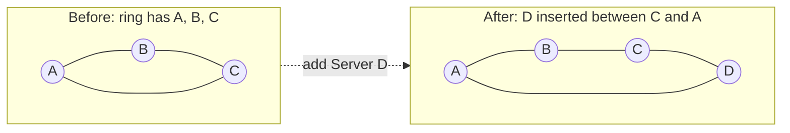
```mermaid
flowchart LR
    subgraph Before2["Before: ring has A, B, C"]
        direction LR
        A3((A)) --- B3((B)) --- C3((C)) --- A3
    end
    subgraph After2["After: D inserted between C and A"]
        direction LR
        A4((A)) --- B4((B)) --- C4((C)) --- D4((D)) --- A4
    end
    Before2 -.->|"add Server D"| After2
```

**Worked example**: 3 shards holding 300K keys total (100K each). Add a 4th shard: only the keys that now fall in D's slice of the ring move — roughly `300K / 4 ≈ 75K` keys relocate, and the other ~225K keys never move. Plain `hash(key) % N` would have remapped nearly all 300K keys on that same resize (`N` changed from 3 to 4 changes almost every `key % N` result) — that difference is the entire pitch for consistent hashing.

- Lookup complexity with a sorted ring + binary search: **O(log N)**, N = number of shards.
- **Virtual nodes** (each physical server mapped to many points on the ring) fix uneven load distribution — without them, a small N can produce a lumpy ring where some servers get disproportionately more keys.
- **Hotkey problem**: even with perfectly even key distribution, one *key* can dominate traffic (viral post, celebrity profile). This is a **load** problem, not a **hashing** problem — consistent hashing can't fix it. Fixes:
  - Read replicas for the hot shard.
  - **L1 local/in-process cache** in front of the distributed cache for the hottest keys (see §16).
  - Further shard within the hot key's range, or replicate that single key across nodes and pick one at random per request.

**Concrete example**: monitoring shows one key (`product:1001:price`, a flash-sale item) taking 50K req/sec on a shard that normally handles 10K req/sec total — a single key is 5x its shard's normal load. Replicate that key across 5 nodes and route requests to it round-robin/random: each replica now absorbs `50K / 5 = 10K req/sec`, back to a normal shard load.

#### 🆕 Detecting and mitigating a hot key

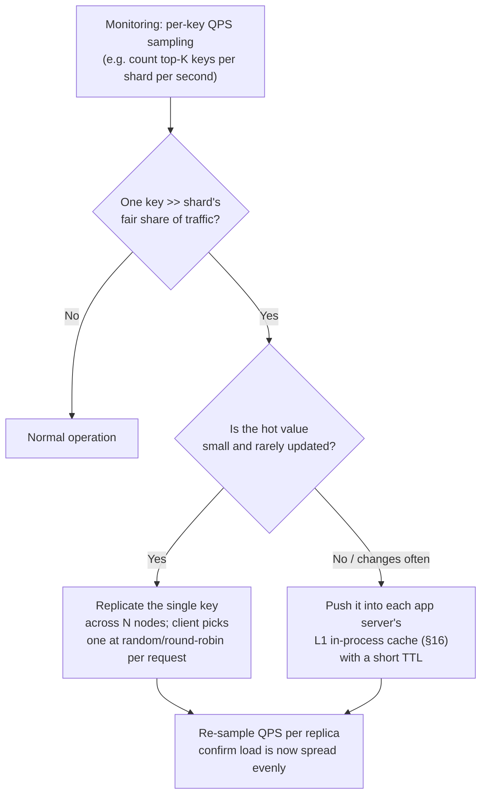
```mermaid
flowchart TD
    Mon["Monitoring: per-key QPS sampling\n(e.g. count top-K keys per shard per second)"] --> Detect{"One key >> shard's\nfair share of traffic?"}
    Detect -->|No| Normal["Normal operation"]
    Detect -->|Yes| Size{"Is the hot value\nsmall and rarely updated?"}
    Size -->|Yes| Replicate["Replicate the single key\nacross N nodes; client picks\none at random/round-robin per request"]
    Size -->|"No / changes often"| L1["Push it into each app server's\nL1 in-process cache (§16)\nwith a short TTL"]
    Replicate --> Recheck["Re-sample QPS per replica\nconfirm load is now spread evenly"]
    L1 --> Recheck
```

---

## 12. Availability: replication and configuration management

The naive design has three problems: (1) clients have no way to detect a server joining or dying, (2) one server per shard is a single point of failure with no read relief when that shard gets hot, (3) nothing guarantees every client agrees on which server owns which shard — two clients with different views of the topology will send the same key to two different servers.

### Server discovery — three escalating solutions

| Solution | Mechanism | Downside |
|---|---|---|
| Local config file per host | Manually pushed via DevOps tooling | Manual update + redeploy every change |
| Centralized config file | Single source, clients pull | Still manual, no health detection |
| **Configuration service** | Actively monitors health, pushes updates automatically | Most complex, but the only fully automatic option |

This is structurally identical to **service discovery** (ZooKeeper, etcd, Consul) — say that explicitly. Redis uses **Sentinel** for this exact role.

### Replication and failover

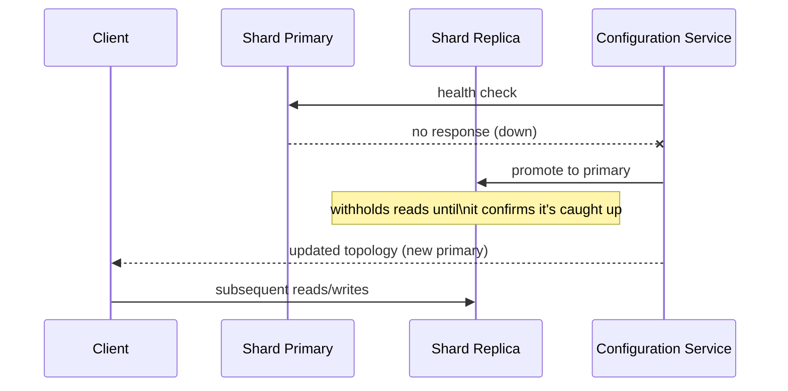
```mermaid
sequenceDiagram
    participant Client
    participant Primary as Shard Primary
    participant Replica as Shard Replica
    participant ConfigSvc as Configuration Service
    ConfigSvc->>Primary: health check
    Primary--xConfigSvc: no response (down)
    ConfigSvc->>Replica: promote to primary
    Note over Replica: withholds reads until\nit confirms it's caught up
    ConfigSvc-->>Client: updated topology (new primary)
    Client->>Replica: subsequent reads/writes
```

- **Same data center**: synchronous replication is affordable — strong consistency, acceptable latency.
- **Cross data center**: synchronous is too slow (WAN RTT) — use **asynchronous** replication, trading consistency for availability. This is a direct **CAP / PACELC** trade-off — name both if asked to justify the choice.
- A **recovering/rejoining replica must not serve reads** until it's confirmed caught up, or clients see stale data right after a failure window.

---

## 13. Capacity estimation (back-of-the-envelope) — do this math out loud

Interviewers score this step explicitly. The chain is always: **QPS → hit rate → working-set size → RAM per node → shard count → replica factor → network bandwidth check.**

```
QPS_avg   = daily_requests / 86,400
QPS_peak  = QPS_avg × peak_multiplier (commonly 3x)
Cache_QPS = QPS_peak × hit_rate
DB_QPS    = QPS_peak × (1 - hit_rate)

Working_set_size = hot_key_count × (avg_value_size + per_key_overhead)
                    # per_key_overhead ≈ 50-100 bytes (hashmap entry + DLL pointers + metadata)

Shards_needed = ceil(Working_set_size / usable_RAM_per_node)
Nodes_needed  = Shards_needed × replication_factor   # primary + N replicas

Bandwidth_per_node = (Cache_QPS / Shards_needed) × avg_response_size
```

**Worked example** — feed service, 500M DAU, 50 reads/user/day, 2KB avg item, 90% hit rate, 64GB usable RAM/node, replication factor 2:

| Step | Math | Result |
|---|---|---|
| Total reads/day | 500M × 50 | 25B/day |
| QPS (avg) | 25B / 86,400 | ~289K QPS |
| QPS (peak, 3x) | 289K × 3 | ~867K QPS |
| Cache QPS | 867K × 0.90 | ~780K QPS |
| DB QPS (miss overflow) | 867K × 0.10 | ~87K QPS |
| Working set (assume top 10% of 1B items covers 90% of traffic — Zipf/power law) | 100M keys × (2KB + ~100B overhead) | ~210 GB |
| Shards needed | 210GB / 64GB | ~4 shards |
| Nodes needed (with 1 replica each) | 4 × 2 | **~8 nodes** (round up for headroom → ~10-12) |
| Bandwidth per node | (780K/4) × 2KB | ~390 MB/s — well under a 10Gbps (1.25GB/s) NIC |

Say the *method*, not a memorized number — interviewers change the inputs and want to watch you redo the chain.

---

## 14. Numbers worth memorizing

| Operation | Approx. latency |
|---|---|
| RAM access | ~100 ns |
| Redis/Memcached GET (same rack, incl. network) | ~0.5–1 ms |
| SSD random read | ~100–150 μs |
| Indexed DB query (same DC) | ~1–10 ms |
| Complex DB query / join, no index | ~50–100+ ms |
| Same-DC network round trip | ~0.5 ms |
| Cross-region network round trip | ~50–150 ms |
| Well-tuned production cache hit rate | 90–99% |
| Typical single Redis node RAM | 16–128 GB (can go higher) |

These are the numbers behind every "why does caching help" justification — RAM access being ~10,000x faster than a cross-region round trip is the entire argument for edge/local caching.

---

## 15. Full detailed design

#### 🆕 Architecture evolution: v1 → v2 → v3

Narrating the design as an evolution — not jumping straight to the final diagram — is a strong way to show *why* each piece exists.

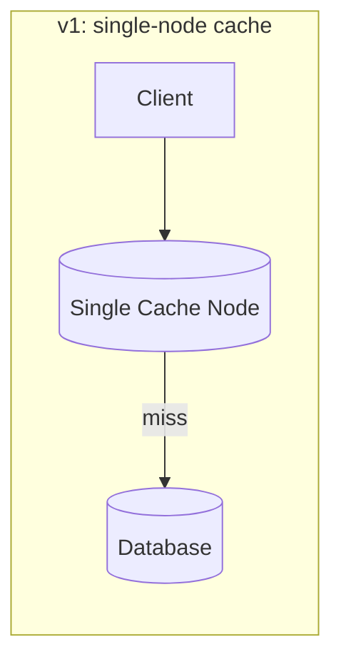
```mermaid
graph LR
    subgraph V1["v1: single-node cache"]
        C1[Client] --> Cache1[(Single Cache Node)]
        Cache1 -->|miss| DB1[(Database)]
    end
```
*Works until the working set outgrows one machine's RAM, or that one machine goes down and every request falls through to the DB.*

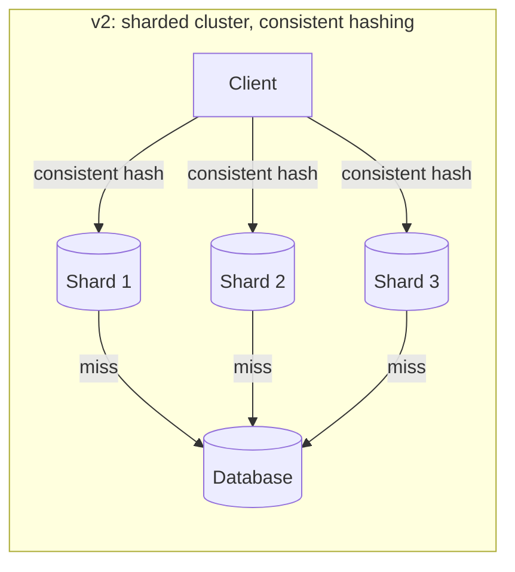
```mermaid
graph LR
    subgraph V2["v2: sharded cluster, consistent hashing"]
        C2[Client] -->|consistent hash| S1[(Shard 1)]
        C2 -->|consistent hash| S2[(Shard 2)]
        C2 -->|consistent hash| S3[(Shard 3)]
        S1 -->|miss| DB2[(Database)]
        S2 -->|miss| DB2
        S3 -->|miss| DB2
    end
```
*Fixes the size ceiling. Still has two problems: no replica if a shard dies, and no defense against a hot key or a stampede.*

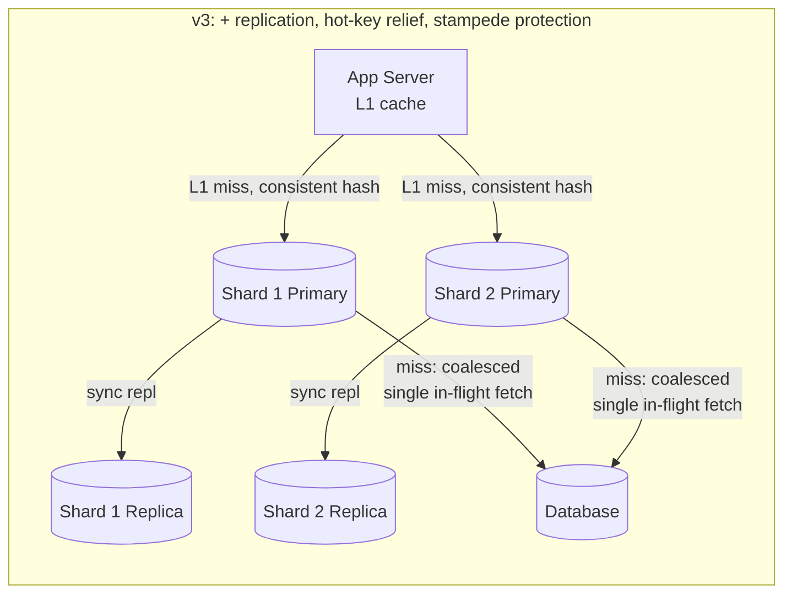
```mermaid
graph LR
    subgraph V3["v3: + replication, hot-key relief, stampede protection"]
        C3[App Server\nL1 cache] -->|L1 miss, consistent hash| S1P[(Shard 1 Primary)]
        C3 -->|L1 miss, consistent hash| S2P[(Shard 2 Primary)]
        S1P -->|sync repl| S1R[(Shard 1 Replica)]
        S2P -->|sync repl| S2R[(Shard 2 Replica)]
        S1P -->|"miss: coalesced\nsingle in-flight fetch"| DB3[(Database)]
        S2P -->|"miss: coalesced\nsingle in-flight fetch"| DB3
    end
```
*v3 is the target end-state: replicas remove the SPOF and absorb hot-shard reads, the L1 cache removes network hops for the single hottest keys, and request coalescing (§20) stops a stampede from ever reaching the DB as N redundant queries.*

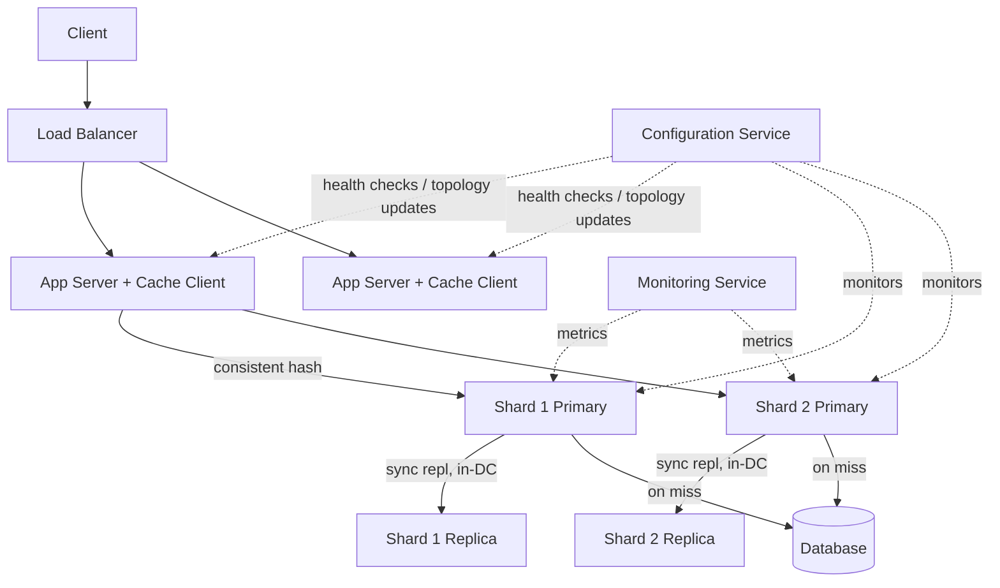
```mermaid
graph TB
    Client --> LB[Load Balancer]
    LB --> App1[App Server + Cache Client]
    LB --> App2[App Server + Cache Client]
    CS[Configuration Service] -.health checks / topology updates.-> App1
    CS -.health checks / topology updates.-> App2
    App1 -->|consistent hash| Shard1P[Shard 1 Primary]
    App1 --> Shard2P[Shard 2 Primary]
    Shard1P -->|sync repl, in-DC| Shard1R[Shard 1 Replica]
    Shard2P -->|sync repl, in-DC| Shard2R[Shard 2 Replica]
    CS -.monitors.-> Shard1P
    CS -.monitors.-> Shard2P
    Shard1P -->|on miss| DB[(Database)]
    Shard2P -->|on miss| DB
    Mon[Monitoring Service] -.metrics.-> Shard1P
    Mon -.metrics.-> Shard2P
```

Narrate in this order: **cache client** (consistent hash, picks shard, TCP/UDP, gets topology from config service) → **cache server** (hash map + DLL, eviction, TTL) → **primary + replica per shard** (availability, hot-shard read scaling) → **configuration service** (health + topology, must be consistent across all clients — disagreement here means split-brain reads) → **monitoring service** (hit/miss rate, latency percentiles, memory pressure).

Note: no delete API in the base design — eviction (algorithm-driven) and expiration (TTL-driven) handle removal locally. A delete API is added only when explicit invalidation is required (§9).

---

## 16. Multi-level caching (L1 local + L2 distributed)

A pattern worth volunteering when hotkeys or extreme latency come up: put a small **in-process (L1) cache** inside each app server, in front of the **distributed (L2) cache**.

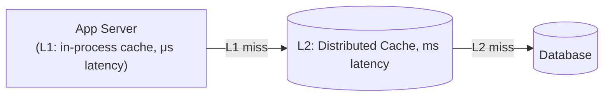
```mermaid
graph LR
    App["App Server\n(L1: in-process cache, μs latency)"] -->|L1 miss| L2[(L2: Distributed Cache, ms latency)]
    L2 -->|L2 miss| DB[(Database)]
```

- L1 absorbs the hottest keys with zero network hop — the direct fix for a single overloaded key that no amount of L2 replication can fully solve, since L2 replicas still cost a network round trip.
- Trade-off: L1 is per-process, so invalidation is harder (N processes to notify, not one cluster) — usually paired with a short TTL rather than active invalidation.

---

## 🆕 17. Cache warm-up and cold start

A node that just restarted (crash, deploy, autoscale-up) is a **cold cache** — empty, 0% hit rate. If the config service routes full production traffic to it immediately, every one of those requests misses and falls through to the DB at once. This is the same stampede shape as §20, but triggered by a node lifecycle event instead of a key expiring.

**Concrete example**: a shard normally serves 50K req/sec at a 95% hit rate — only 2.5K req/sec reach the DB. If that shard restarts cold, hit rate drops to ~0% until the working set rebuilds, so the DB briefly sees the full 50K req/sec — a **20x spike** on the exact box that was never sized for it.

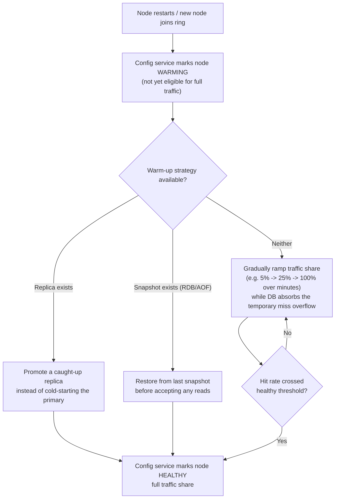
```mermaid
flowchart TD
    Start["Node restarts / new node joins ring"] --> Mark["Config service marks node WARMING\n(not yet eligible for full traffic)"]
    Mark --> Choice{"Warm-up strategy available?"}
    Choice -->|"Replica exists"| Promote["Promote a caught-up replica\ninstead of cold-starting the primary"]
    Choice -->|"Snapshot exists (RDB/AOF)"| Restore["Restore from last snapshot\nbefore accepting any reads"]
    Choice -->|"Neither"| Ramp["Gradually ramp traffic share\n(e.g. 5% -> 25% -> 100% over minutes)\nwhile DB absorbs the temporary miss overflow"]
    Promote --> Healthy
    Restore --> Healthy
    Ramp --> Check{"Hit rate crossed\nhealthy threshold?"}
    Check -->|No| Ramp
    Check -->|Yes| Healthy["Config service marks node HEALTHY\nfull traffic share"]
```

Mitigations, cheapest first:
- **Prefer promotion over cold restart**: if a replica is already warm (§12), promote it and let the old primary rejoin as the (cold) replica instead — reads never hit an empty cache.
- **Snapshot restore**: Redis's RDB/AOF (§19) lets a restarting node reload most of its working set from disk before serving traffic, instead of rebuilding it one DB-fallback at a time.
- **Gradual traffic ramp / canary warm-up**: the configuration service (§12) sends a small percentage of a shard's traffic to a newly-healthy node and increases it as the hit rate climbs, rather than flipping 0% → 100%.
- **Pre-warm from a hot-key list**: replay the top-N known-hot keys (from monitoring, §15) into the node before marking it healthy, so at least the highest-traffic keys don't start cold.
- **Rate-limit the DB during the warm-up window** — the same circuit-breaker discipline as the golden rule in §20 applies here: a cold node is a temporary, predictable spike, not a reason to let the DB fall over.
- **Consistent hashing already limits the blast radius**: a *new* node only owns ~K/N of the keyspace (§11), so a join is naturally cheaper to warm than a full-cluster restart would be.

> **Memory hook**: "A cold node is a self-inflicted stampede — treat it exactly like one: ramp it in, don't switch it on."

---

## 18. Evaluating against non-functional requirements

Walk NFRs in this order in your answer — each builds on a decision you already justified:

| NFR | How the design satisfies it |
|---|---|
| **Performance** | Consistent hashing → O(log N) shard lookup; hash map → O(1) key lookup; DLL → O(1) eviction; RAM-only storage |
| **Scalability** | Add shards with minimal rehashing; add replicas to absorb hot-shard read load; horizontal scale-out, no single bottleneck |
| **Availability** | Primary + replica per shard; configuration service auto-detects failures; recovering nodes withhold reads until caught up |
| **Consistency** | Tunable: sync in-DC (strong) / async cross-DC (eventual) — explicit CAP/PACELC trade-off |
| **Affordability** | Commodity hardware; RAM provisioned to hot working-set size, not total dataset size |

---

## 19. Real-world case studies

### Memcached — simplicity, shared-nothing, O(1) throughput
- Pure key-value; keys and values are **strings** — everything must be serialized.
- **Shared-nothing**: servers don't know about each other, no inter-server sync. All "distributed" logic (consistent hashing) lives client-side.
- No built-in persistence or replication (third-party only). Multithreaded — uses multicore machines efficiently.
- **Facebook**: ~28TB RAM / 800+ servers (2013), between web tier and MySQL, ~95% hit rate via approximate LRU, 50M requests → 2.5M DB hits.
- Best fit: **simple, read-heavy**, large objects, maximum throughput, no need for built-in HA.

### Redis — data-structure server, built-in HA, single-threaded core
- Rich types: strings, hashes, sorted sets, bitmaps, HyperLogLog, geospatial — computation can happen *inside* Redis (`ZINCRBY` on a leaderboard) instead of round-tripping.
- Also a **database** (AOF + RDB persistence) and a **message broker** (Pub/Sub, Streams).
- **Redis Sentinel/Cluster**: built-in sharding, replication, automatic failover — decouples data plane from control plane.
- **Single-threaded core** per instance — no lock contention; scale via more instances/cluster nodes, not more threads per node.
- **Pipelining**: batch commands into one round trip instead of waiting per-response — collapses N RTTs into 1. ~5x latency win even on loopback; biggest win over high-latency links.

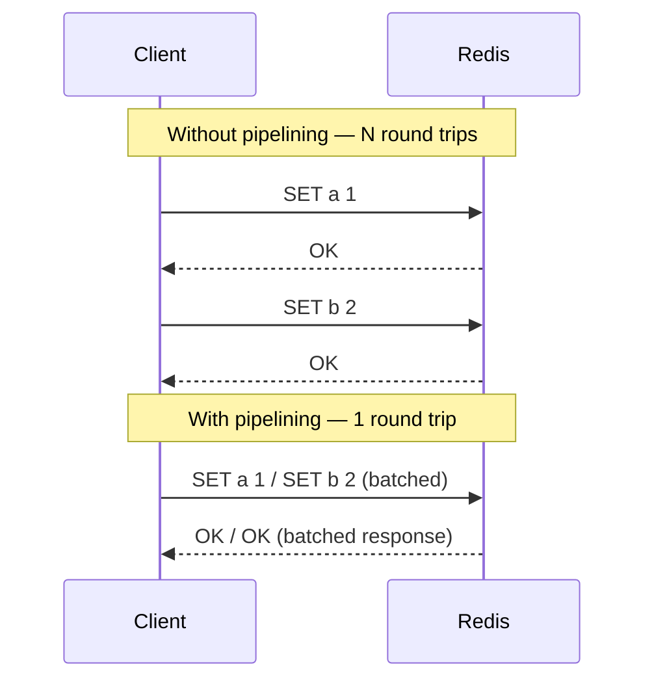
```mermaid
sequenceDiagram
    participant Client
    participant Redis
    Note over Client,Redis: Without pipelining — N round trips
    Client->>Redis: SET a 1
    Redis-->>Client: OK
    Client->>Redis: SET b 2
    Redis-->>Client: OK
    Note over Client,Redis: With pipelining — 1 round trip
    Client->>Redis: SET a 1 / SET b 2 (batched)
    Redis-->>Client: OK / OK (batched response)
```

| Feature | Memcached | Redis |
|---|---|---|
| Data model | Strings only | Strings, hashes, sets, sorted sets, bitmaps, HLL, geospatial |
| Persistence | No (3rd-party only) | Yes — RDB + AOF |
| Sharding | Client-side only | Built-in (Cluster) |
| Replication / HA | 3rd-party | Built-in (Sentinel/Cluster) |
| Threading | Multithreaded | Single-threaded core |
| Transactions | No | Yes (MULTI/EXEC) |
| Scripting | No | Yes (Lua) |
| Best for | Simple, read-heavy, max throughput | Complex, read+write, needs data structures/HA/persistence |

**The one-liner interviewers want**: *"Memcached is a simple, fast, shared-nothing key-value store that pushes clustering complexity to the client — great for pure read-through caching of large blobs. Redis is a data-structure server with built-in replication and persistence — pick it when the cache also needs to do more than GET/SET, or you want cluster management out of the box."*

---

## 20. Failure modes to volunteer (unprompted — this is what separates senior answers)

```mermaid
sequenceDiagram
    participant Req1 as Request 1
    participant Req2 as Request 2 (concurrent)
    participant Cache
    participant DB
    Note over Req1,DB: Cache stampede without coalescing
    Req1->>Cache: GET key (expired)
    Req2->>Cache: GET key (expired)
    Req1->>DB: query (redundant)
    Req2->>DB: query (redundant)
    Note over Req1,DB: With request coalescing
    Req1->>Cache: GET key (expired)
    Cache->>DB: single in-flight query (locks key)
    Req2->>Cache: GET key (expired)
    Cache-->>Req2: wait on in-flight fetch, not a new DB call
    DB-->>Cache: value
    Cache-->>Req1: value
    Cache-->>Req2: value (shared result)
```

#### 🆕 Cache-miss handling with a stampede lock

```mermaid
flowchart TD
    Get["GET key"] --> Hit{"Key present\nand not expired?"}
    Hit -->|Yes| Return["Return value"]
    Hit -->|No| Lock{"Acquire per-key\nfetch lock?"}
    Lock -->|"Got it (first request)"| Fetch["Query DB, SET cache,\nrelease lock"]
    Fetch --> Return
    Lock -->|"Someone else holds it"| Wait["Wait briefly on the\nin-flight fetch (or return\nslightly-stale value if one exists)"]
    Wait --> Return
```

**Concrete example**: a product page cached for 60s gets 2,000 req/sec. Without coalescing, the instant the key expires all ~2,000 requests in that second miss and hit the DB simultaneously. With a per-key lock, only the first misses through to the DB — the other 1,999 wait ~10-50ms for that one query's result and reuse it, so the DB sees **1 query, not 2,000**.

**Stampede mitigation techniques compared**:

| Technique | How it works | Trade-off |
|---|---|---|
| Request coalescing / mutex lock | First miss fetches, others wait on that in-flight result | Small added latency for waiters; needs a lock per key |
| Jittered TTL | Add random ±10-20% to each key's TTL | Spreads expirations over time, doesn't help a single sudden hot key |
| Probabilistic early refresh | Recompute slightly *before* expiry, with rising probability as TTL nears zero | No thundering herd at all, but adds background refresh traffic |
| Stale-while-revalidate | Serve the expired value immediately, refresh in the background | Best latency; briefly serves stale data by design |

| Problem | What it is | Fix |
|---|---|---|
| **Cache stampede / thundering herd** | Many requests miss simultaneously and all hit the DB at once | Request coalescing (one in-flight fetch per key), jittered TTLs, probabilistic early refresh |
| **Cache penetration** | Repeated requests for keys absent from cache *and* DB, bypassing the cache every time | Bloom filter to short-circuit definitely-absent keys, or cache the "not found" result briefly (**negative caching**) |
| **Hotkey / hot shard** | One key or shard gets disproportionate traffic | Read replicas for that shard, L1 local cache (§16), further sharding within the key's range |
| **Cache pollution** | A one-time large scan evicts the entire genuinely-hot working set | LFU instead of pure LRU, or scan-resistant algorithms (2Q/ARC) |
| **Split-brain / stale topology** | Different clients see different shard-ownership views | Single source of truth (configuration service) all clients pull from |

**Golden rule to say out loud**: *cache failure must never mean system failure*. If a cache node (or the whole cluster) is down, the client should fail open to the DB — degrade latency, don't go offline. Protect the DB during such an outage with rate limiting/circuit breakers, since it wasn't provisioned to take 100% of traffic.

---

## Master Cheat Sheet

**Definitions**: Cache = small, fast (RAM), nonpersistent store exploiting locality of reference. Distributed cache = multiple coordinating cache servers, needed when data won't fit one node or one node is an availability risk.

**The 7-step playbook**: Requirements → Capacity estimate → API → High-level design → Deep dive → Trade-offs/failure modes → Wrap-up.

**Requirements to ask for**: get/set/delete surface + TTL semantics, read:write ratio, tolerable staleness, durability (usually none — a cache is disposable by definition), availability target. **API**: `GET/SET/DELETE/EXISTS/EXPIRE/TTL` + batch `MGET/MSET`. **Data model**: opaque serialized bytes, namespaced keys (`entity:id:field`), metadata (TTL, access stats, version) stored alongside the value, not in it.

**Capacity math**: `QPS_avg = daily_requests / 86400` → `× peak_multiplier` → `× hit_rate` (cache) / `× miss_rate` (DB) → working set = `hot_keys × (value_size + overhead)` → `shards = working_set / RAM_per_node` → `nodes = shards × replication_factor`.

**Formulas**:
```
EAT = Ratio_hit × Time_hit + Ratio_miss × Time_miss
Consistent hashing lookup: O(log N), N = number of shards
Hash map lookup within a shard: O(1) average
Rehash on scale event (consistent hashing): ~K/N keys move
```

**Read pattern**: cache-aside (app owns the miss) vs. read-through (cache owns the miss).

**Write pattern**: write-through (strong, slow) · write-back (fast, weak) · write-around (DB-first, cache warms lazily). Mnemonic: "THRU is True, BACK lags BEHIND, AROUND skips the cache."

**Eviction**: LRU (default) · LFU (viral/long-tail) · FIFO (simplest) — hash map + doubly linked list, O(1). Mnemonic: "last touched / most touched / oldest born."

**Invalidation**: TTL (active = sweep, passive = check-on-access) + explicit delete-on-write for event-driven staleness.

**Sharding**: dedicated (shared across services) vs. co-located (cheap, correlated failure). Consistent hashing + virtual nodes for placement; hotkeys are a load problem, not a hashing problem.

**Availability**: primary + replicas per shard, sync in-DC / async cross-DC (CAP/PACELC), configuration service for auto-discovery, recovering nodes withhold reads until caught up.

**Multi-level caching**: L1 (in-process, μs) in front of L2 (distributed, ms) for hotkeys.

**Cache warm-up / cold start**: a freshly restarted node is a self-inflicted stampede — ramp its traffic share gradually, promote a warm replica instead of cold-starting, or restore from a snapshot; don't flip 0%→100% traffic on an empty cache.

**Memcached**: simple, shared-nothing, client-side clustering, no persistence, multithreaded, big read-heavy blobs.

**Redis**: data-structure server, built-in replication/persistence/Cluster, single-threaded core, pipelining for RTT reduction, complex read/write workloads.

**Numbers**: RAM ~100ns · cache GET ~0.5-1ms · SSD read ~100-150μs · indexed DB query ~1-10ms · same-DC RTT ~0.5ms · cross-region RTT ~50-150ms · healthy hit rate 90-99%.

**Failure modes to volunteer**: stampede (coalesce requests), penetration (Bloom filter / negative cache), hotkey (L1 cache / replicas), pollution (LFU / scan-resistant), split-brain (single config service).

**Golden rule**: cache failure ≠ system failure — always fail open to the DB, protect the DB with circuit breakers during the outage.

**Interview signal phrases**: "reduce database load," "sub-millisecond reads," "handle a hotkey/celebrity problem," "read far more than written," "survive a node failure without falling back to the DB entirely."
