# Distributed Messaging Queue — FAANG Interview Guide

> **Enhancement notes:** this pass added (1) a 🆕 Requirements-to-clarify section (functional + non-functional tables) up front, (2) a 🆕 API Design table (`CreateQueue`/`SendMessage`/`ReceiveMessage`/`DeleteMessage`/`ChangeMessageVisibility`) with the receipt_handle-vs-message_id safety detail called out, (3) a 🆕 v1→v2→v3 architecture-evolution diagram, (4) a 🆕 FIFO-vs-Standard queue trade-off table, (5) a 🆕 worked send→receive→process→delete sequence diagram showing a concrete visibility-timeout redelivery (30s timeout, 45s processing job), plus the message-lifecycle state diagram and a delivery-semantic decision flowchart, and (6) a 🆕 poison-message/DLQ decision flowchart. Everything else — the mental model, ordering/concurrency discussion, retry/backoff narrative, queue-vs-topic-vs-log table, golden rules, and master cheat sheet — was already strong and is left untouched.

## Mental Model

A messaging queue is a **surge tank between a fire hose and a garden hose**. The producer can spray messages in bursts; the consumer drains them at its own steady rate. The queue is the buffer that absorbs the mismatch so neither side has to match the other's speed, and neither side has to know the other exists.

Two purely different plumbing shapes hide behind the word "queue" in interviews — keep them separate from the first sentence you say:

- **Point-to-point (queue)**: one message, **one** consumer eats it. Mailroom with numbered pigeonholes — a letter is removed once picked up. (SQS, ActiveMQ, Kafka-with-single-consumer-group.)
- **Publish-subscribe (topic/log)**: one message, **every** subscriber gets a copy. Radio broadcast — the signal doesn't disappear because one listener tuned in. (SNS, Kafka topics with multiple consumer groups, Google Pub/Sub.)

Everything else in this guide — ordering, replication, delivery semantics — is about making that buffer **durable** (survives crashes), **scalable** (grows past one machine), and **available** (keeps working when a node dies) without giving up too much throughput.

---

## Big Picture — Everything in One Glance

Look at this once before you dive into details. Every branch below is a section in this guide — if you can redraw this from memory, you can reconstruct the whole topic under pressure.

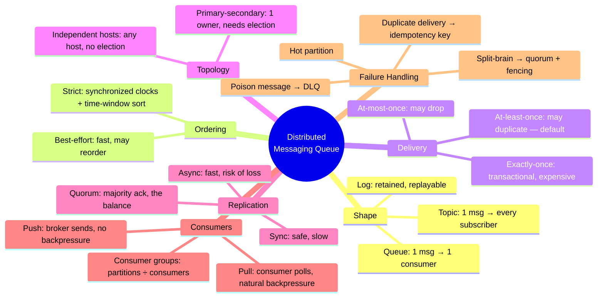
```mermaid
mindmap
  root((Distributed<br/>Messaging Queue))
    Shape
      Queue: 1 msg → 1 consumer
      Topic: 1 msg → every subscriber
      Log: retained, replayable
    Ordering
      Best-effort: fast, may reorder
      Strict: synchronized clocks + time-window sort
    Delivery
      At-most-once: may drop
      At-least-once: may duplicate — default
      Exactly-once: transactional, expensive
    Topology
      Primary-secondary: 1 owner, needs election
      Independent hosts: any host, no election
    Replication
      Async: fast, risk of loss
      Sync: safe, slow
      Quorum: majority ack, the balance
    Consumers
      Push: broker sends, no backpressure
      Pull: consumer polls, natural backpressure
      Consumer groups: partitions ÷ consumers
    Failure Handling
      Hot partition
      Poison message → DLQ
      Duplicate delivery → idempotency key
      Split-brain → quorum + fencing
```

---

## Interview Playbook

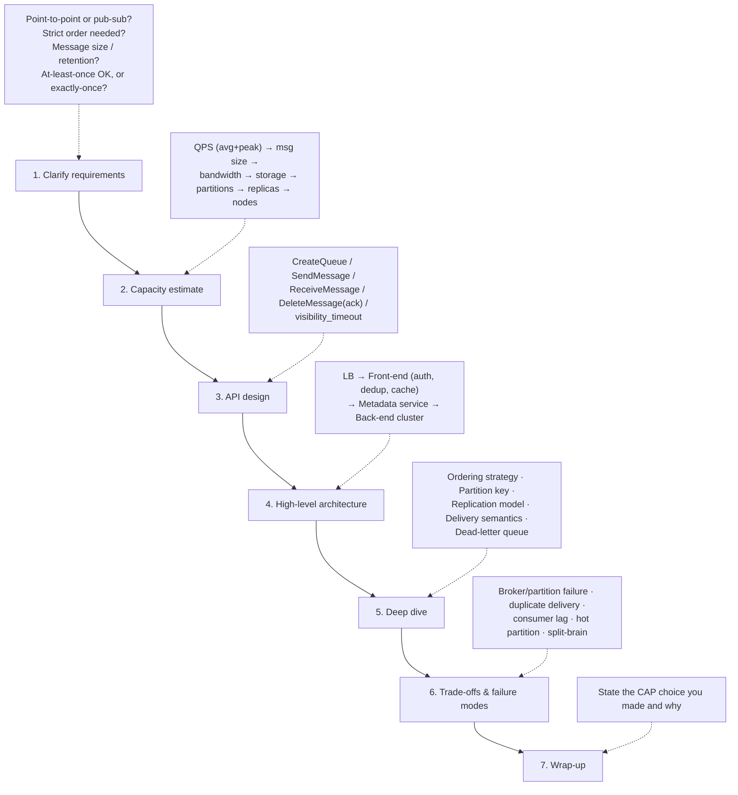
```mermaid
flowchart TD
    A[1. Clarify requirements] --> B[2. Capacity estimate]
    B --> C[3. API design]
    C --> D[4. High-level architecture]
    D --> E[5. Deep dive]
    E --> F[6. Trade-offs & failure modes]
    F --> G[7. Wrap-up]

    A1["Point-to-point or pub-sub?
    Strict order needed?
    Message size / retention?
    At-least-once OK, or exactly-once?"] -.-> A
    B1["QPS (avg+peak) → msg size →
    bandwidth → storage → partitions → replicas → nodes"] -.-> B
    C1["CreateQueue / SendMessage /
    ReceiveMessage / DeleteMessage(ack) /
    visibility_timeout"] -.-> C
    D1["LB → Front-end (auth, dedup, cache)
    → Metadata service → Back-end cluster"] -.-> D
    E1["Ordering strategy · Partition key ·
    Replication model · Delivery semantics ·
    Dead-letter queue"] -.-> E
    F1["Broker/partition failure · duplicate delivery ·
    consumer lag · hot partition · split-brain"] -.-> F
    G1["State the CAP choice you made and why"] -.-> G
```

**Say it out loud in this order.** Interviewers actively listen for #1 and #5 — jumping straight to "I'll use Kafka" without stating what ordering/delivery guarantee you actually need is the single most common way candidates lose points on this topic.

---

## What It Is & Why It Exists

A **messaging queue** is an intermediary between **producers** (write messages) and **consumers** (read and process messages), decoupling them in **time** (producer doesn't wait for consumer), **space** (they don't need each other's address), and **speed** (they run at independent rates).

**Why it exists — the concrete wins:**

| Benefit | Mechanism | Example |
|---|---|---|
| Lower client-perceived latency | Slow work moved off the request path | Upload a video → return 200 OK → transcode later via queue |
| Fault isolation | Producer/consumer crash independently | Email sender crashes; queued emails wait, no data lost |
| Elastic scaling | Add/remove consumers to match queue depth | Black Friday: scale consumer fleet 10x, producers untouched |
| Load leveling / backpressure | Queue absorbs bursts instead of dropping requests | Flash sale spike buffered instead of 503s |
| Decoupling | Producers/consumers don't know each other's internals | Order service doesn't know how notifications are sent |
| Priority handling | Multiple queues, weighted service time | Paid-tier requests get their own high-priority queue |

**Use cases worth naming in an interview:** bulk email/SMS, async media post-processing (transcoding, thumbnailing), recommender-system precomputation, order-processing pipelines, log/metric ingestion, webhook delivery with retries.

---

## 🆕 Requirements to Clarify First (Functional & Non-Functional)

Ask these before you draw a single box — they change the entire design, and interviewers are grading whether you ask, not just whether you eventually land somewhere reasonable.

**Functional requirements — what operations must the system support:**

| Requirement | Question to ask | Why it matters |
|---|---|---|
| Enqueue | One message at a time, or batches? | Batching changes the API and the throughput math |
| Dequeue | Do consumers pull, or does the broker push? | Drives the push-vs-pull decision later |
| Acknowledge / delete | Is "processed" explicit (ack) or implicit (delete-on-read)? | Determines at-least-once vs. at-most-once by default |
| Visibility / lease extension | Can a long-running job ask for more time? | Without it, long jobs get duplicated |
| Ordering | Must messages for the same key come out in send order? | Standard vs. FIFO queue type |
| Dead-lettering | What happens to a message that keeps failing? | Poison-message isolation |
| Queue management | Create/delete/configure queues via API, or fixed at deploy time? | Multi-tenant systems usually need dynamic queues |

**Non-functional requirements — the dials you're allowed to trade against each other:**

| Requirement | Typical interview answer | Trade-off it implies |
|---|---|---|
| Durability | No message loss once it's acknowledged as sent | Requires replication (sync/quorum, not async-only) |
| Availability | Producers can always enqueue, even if some consumers are down | Queue and consumer availability are decoupled by design |
| Delivery guarantee | At-least-once by default, unless told otherwise | Consumers must be idempotent |
| Ordering guarantee | Best-effort, unless a specific key must stay ordered | Strict order costs throughput (see Ordering section) |
| Latency | Sub-second enqueue and dequeue (illustrative — confirm with the interviewer) | Long polling instead of a tight polling loop |
| Throughput | State it as a range (e.g., "thousands to tens of thousands of msg/sec" — illustrative unless the prompt gives a number) | Drives partition count, not node count |
| Scalability | Both queue depth and throughput grow with traffic, not just storage | Partition count needs headroom — see Capacity Estimation |
| Message size | Cap it (e.g., 256 KB–1 MB, illustrative) | Large payloads go in blob storage with a pointer in the message |

**Say this out loud:** *"Before I design anything, I want to lock down: point-to-point or fan-out, ordering scope (none / per-key / global), delivery guarantee (at-least-once by default), and whether a message that keeps failing should ever be allowed to block the queue."* Getting this in the first two minutes is worth more than any diagram.

---

## 🆕 API Design

A point-to-point queue needs a small, boring API — the interview value is in naming every parameter that actually matters, not in the endpoint names.

| Operation | Key parameters | Returns | Notes |
|---|---|---|---|
| `CreateQueue` | `name`, `visibility_timeout` (e.g. 30s default), `max_receive_count` (e.g. 5), `retention_period` (e.g. 4d), `fifo: bool` | `queue_url` | FIFO vs. standard is chosen once, at creation — can't be flipped later without recreating the queue |
| `SendMessage` | `queue_url`, `body`, `delay_seconds` (optional), `message_group_id` (FIFO only), `dedup_id` (FIFO only, or a content hash) | `message_id` | A producer that retries a send on network timeout should pass a stable `dedup_id`, so the retry doesn't create a second message |
| `ReceiveMessage` | `queue_url`, `max_messages` (batch, e.g. 1–10), `wait_time_seconds` (long polling), `visibility_timeout` (optional override) | list of `{message_id, receipt_handle, body}` | Nothing is deleted here — the message just becomes invisible for `visibility_timeout` seconds |
| `DeleteMessage` | `queue_url`, `receipt_handle` | ack | This is the real "I'm done" signal — skip it and the message reappears |
| `ChangeMessageVisibility` | `queue_url`, `receipt_handle`, `new_timeout` | ack | Lets a slow consumer buy more time before the default timeout re-delivers the message |
| `GetQueueAttributes` | `queue_url` | `approx_number_of_messages` (queue depth), `oldest_message_age` | The two numbers you actually alert on — see Failure Modes |

**The one API detail worth memorizing cold:** `ReceiveMessage` returns a **receipt_handle**, not just the `message_id` — and a *new* receipt_handle is issued on every (re)delivery of the same message. `DeleteMessage`/`ChangeMessageVisibility` are keyed by receipt_handle, not message_id, so a stale handle from an earlier, already-expired delivery can't accidentally delete or extend a message a different consumer is now processing. This one design choice is what makes visibility-timeout redelivery safe — see the worked sequence diagram in Delivery Semantics.

---

## How It Works Internally — Architecture

#### 🆕 Architecture evolution: v1 → v2 → v3

Most candidates try to describe the final production system in one shot. It lands better — for you and for the interviewer — as three steps, each one fixing a concrete problem with the step before it:

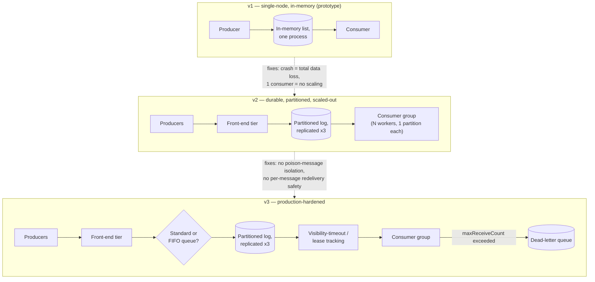
```mermaid
flowchart TD
    subgraph V1["v1 — single-node, in-memory (prototype)"]
    direction LR
    P1[Producer] --> Q1[("In-memory list,<br/>one process")]
    Q1 --> Cx1[Consumer]
    end

    subgraph V2["v2 — durable, partitioned, scaled-out"]
    direction LR
    P2[Producers] --> FE2[Front-end tier]
    FE2 --> PL[("Partitioned log,<br/>replicated x3")]
    PL --> CG2["Consumer group<br/>(N workers, 1 partition each)"]
    end

    subgraph V3["v3 — production-hardened"]
    direction LR
    P3[Producers] --> FE3[Front-end tier]
    FE3 --> QT{"Standard or<br/>FIFO queue?"}
    QT --> PL3[("Partitioned log,<br/>replicated x3")]
    PL3 --> VT["Visibility-timeout /<br/>lease tracking"]
    VT --> CG3["Consumer group"]
    CG3 -->|maxReceiveCount exceeded| DLQ3[("Dead-letter queue")]
    end

    V1 -. "fixes: crash = total data loss,<br/>1 consumer = no scaling" .-> V2
    V2 -. "fixes: no poison-message isolation,<br/>no per-message redelivery safety" .-> V3
```

- **v1 fails on:** a process crash loses every unacknowledged message, and only one consumer can drain it — fine for a take-home toy, not for an interview answer.
- **v2 fixes:** durability (replicated partitioned log) and consumer throughput (a consumer group, one partition per worker) — this is roughly "reinvent Kafka."
- **v3 fixes:** the two failure modes that actually show up under load — a message that keeps crashing every consumer (needs a DLQ) and a message stuck invisible forever if a consumer dies mid-processing (needs the visibility-timeout/lease tracker) — plus lets the caller opt into FIFO where strict order is worth the throughput cost.

**The shape you actually draw in an interview is v3's steady state, in more detail:**

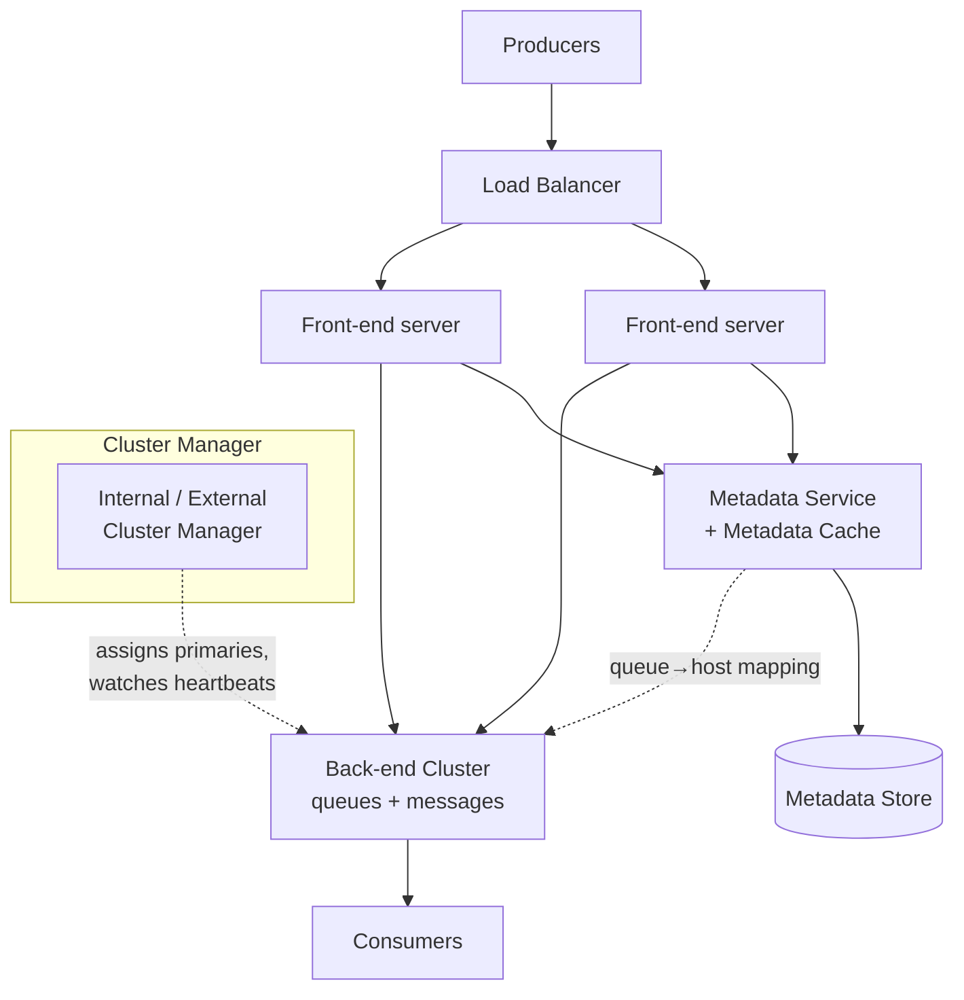
```mermaid
flowchart TD
    P[Producers] --> LB1[Load Balancer]
    LB1 --> FE1[Front-end server]
    LB1 --> FE2[Front-end server]
    FE1 --> MD[Metadata Service<br/>+ Metadata Cache]
    FE2 --> MD
    MD --> MDS[(Metadata Store)]
    FE1 --> BE[Back-end Cluster<br/>queues + messages]
    FE2 --> BE
    BE --> C1[Consumers]
    MD -. queue→host mapping .-> BE

    subgraph "Cluster Manager"
    CM[Internal / External<br/>Cluster Manager]
    end
    CM -. assigns primaries,<br/>watches heartbeats .-> BE
```

**The data model in one picture** — how queues, partitions, messages, and consumer groups actually relate to each other underneath that box diagram:

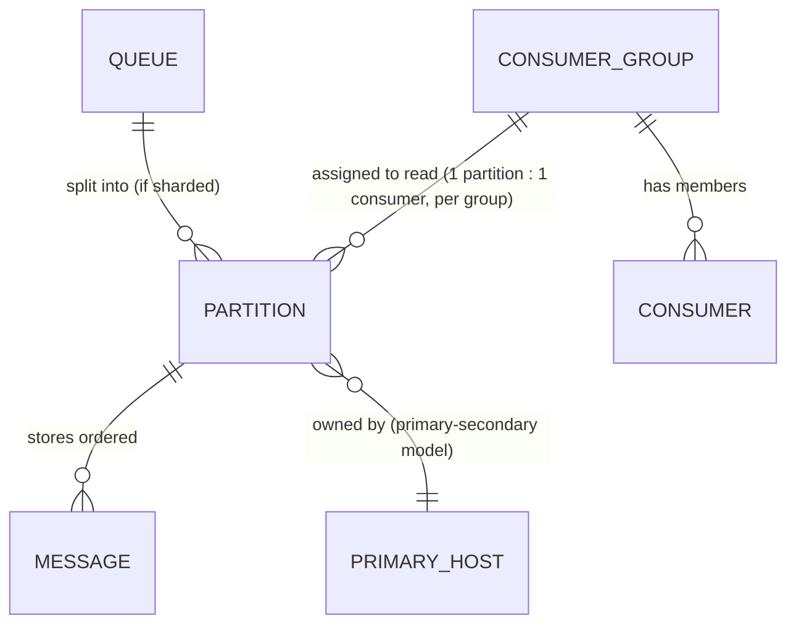
```mermaid
erDiagram
    QUEUE ||--o{ PARTITION : "split into (if sharded)"
    PARTITION ||--o{ MESSAGE : "stores ordered"
    PARTITION }o--|| PRIMARY_HOST : "owned by (primary-secondary model)"
    CONSUMER_GROUP ||--o{ CONSUMER : "has members"
    CONSUMER_GROUP ||--o{ PARTITION : "assigned to read (1 partition : 1 consumer, per group)"
```

**Memory hook:** *a queue is just "many partitions"; a partition is just "an ordered list of messages owned by one host"; a consumer group is just "a claim ticket that says which consumer reads which partition."* Everything else in this guide is detail on top of these four boxes.

### Front-end service (stateless, horizontally scaled)
Does the boring-but-essential work so the back-end stays simple:
- **Request validation** — required fields, size limits.
- **AuthN/AuthZ** — is this producer/consumer allowed on this queue.
- **Caching** — queue metadata + user data, to avoid hitting the metadata store per request.
- **Request dispatch** — routes to metadata service vs. back-end.
- **Deduplication** — hash-key lookup; reject repeats (critical for at-least-once producers that retry).
- **Usage/audit data collection**.

### Metadata service
Stores/retrieves/updates **queue metadata** (owner, size limits, partition map, primary host) — never the message payloads themselves. Sits between front-end and the data layer; front-end checks cache → metadata store on miss → repopulate cache.

**Two ways to organize the metadata cluster**, pick based on data size:

| Metadata fits on one machine | Metadata too large for one machine |
|---|---|
| Replicate identical copy on every cluster node | Shard by partition key / consistent hashing |
| Any node answers any request (LB in front) | Each shard replicated for availability |
| Simple, but wastes memory at scale | Mapping table lives either **only on front-end servers** (front-end must know shard→host map) or **on every back-end host** (any host can redirect — better for read-heavy traffic) |

**Memory hook:** *small metadata → mirror everywhere; big metadata → shard it, and decide who holds the map (front-end = fewer hops for writes, every host = better for read fan-out).*

### Partitioning — consistent hashing in practice

When a queue (or its metadata) is too big for one host, both the source material's "consistent hashing-like scheme" and every real system (Kafka, Cassandra, DynamoDB) solve placement the same way: hash keys and nodes onto the same ring, so adding/removing a node only reshuffles its **immediate neighbors' keys**, not the whole dataset.

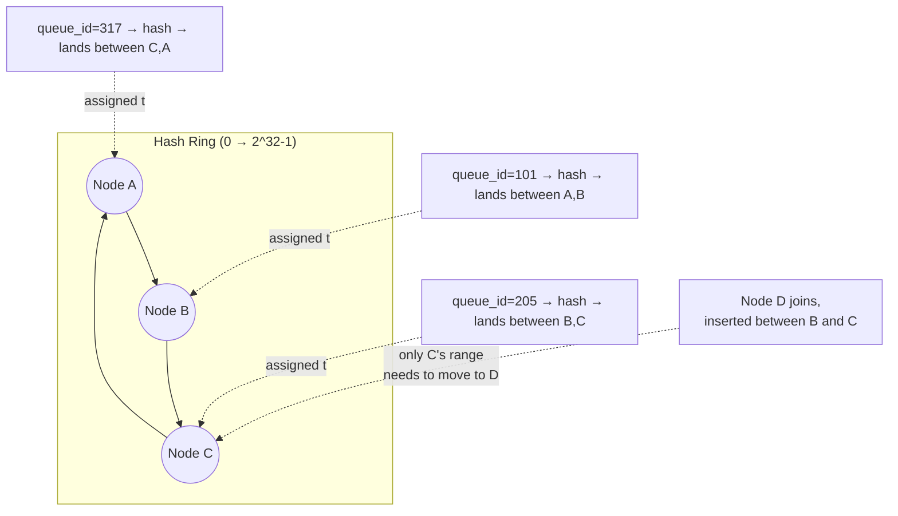
```mermaid
flowchart TD
    subgraph Ring["Hash Ring (0 → 2^32-1)"]
    NA((Node A)) --> NB((Node B)) --> NC((Node C)) --> NA
    end
    K1["queue_id=101 → hash → lands between A,B"] -.assigned to.-> NB
    K2["queue_id=205 → hash → lands between B,C"] -.assigned to.-> NC
    K3["queue_id=317 → hash → lands between C,A"] -.assigned to.-> NA
    ND["Node D joins,<br/>inserted between B and C"] -.only C's range<br/>needs to move to D.-> NC
```

**Why this matters over naive `hash(key) % N`:** modulo hashing remaps almost **every** key when `N` changes (a node join/leave reshuffles the entire cluster); consistent hashing remaps only the slice owned by the neighboring node. Say this explicitly if asked "how do you add a node without a full rebalance."

### Back-end service — where messages actually live

Two competing models for organizing back-end hosts. This is the **highest-value disambiguation** in this chapter — interviewers routinely ask "which one and why":

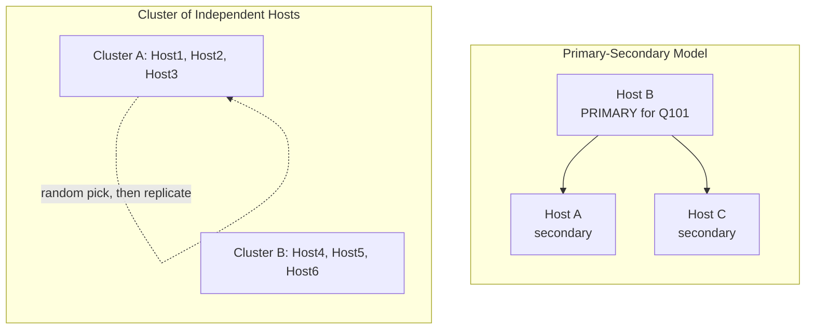
```mermaid
graph TD
    subgraph "Primary-Secondary Model"
    direction TB
    Q101P[Host B<br/>PRIMARY for Q101] --> Q101A[Host A<br/>secondary]
    Q101P --> Q101C[Host C<br/>secondary]
    end
    subgraph "Cluster of Independent Hosts"
    direction TB
    CA[Cluster A: Host1, Host2, Host3] -.random pick, then replicate.-> CA
    CB[Cluster B: Host4, Host5, Host6]
    end
```

| | Primary-secondary model | Cluster of independent hosts |
|---|---|---|
| Who owns a queue | One designated **primary** per queue; it fully owns reads/writes/replication/deletion | No fixed owner; **any** host in the assigned cluster can take a request |
| Who routes | Internal cluster manager tracks primary/secondary mapping | External cluster manager tracks queue→cluster mapping only |
| Failure handling | Must **elect a new primary** on failure (consensus/leader-election) | Just pick another host in the cluster — no election needed |
| Consistency | Simpler — single writer, natural ordering point | Harder — concurrent writers to replicas need reconciliation |
| Scales by | Adding primaries (more queues) | Adding clusters / hosts within a cluster |
| Real-world analog | Kafka partition leader/follower | DynamoDB/Cassandra-style ring, Kinesis shard spread |

**Memory hook:** *primary-secondary = "one captain per queue, promote a new one if they fall overboard"; independent hosts = "any deckhand can grab the next crate, no captain needed."*

**Quick decision — which topology do I say in the interview?**

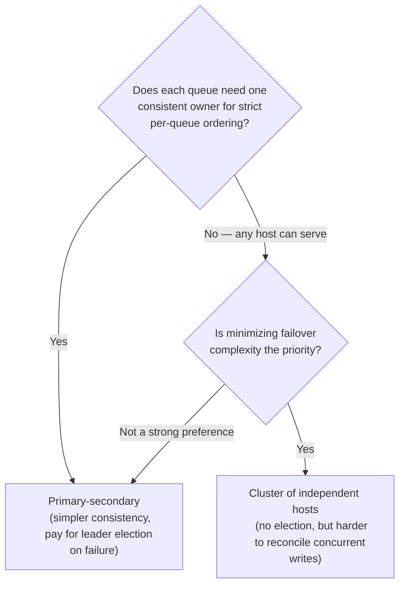
```mermaid
flowchart TD
    T1{Does each queue need one<br/>consistent owner for strict<br/>per-queue ordering?} -->|Yes| PS["Primary-secondary
    (simpler consistency,
    pay for leader election on failure)"]
    T1 -->|No — any host can serve| T2{Is minimizing failover<br/>complexity the priority?}
    T2 -->|Yes| IH["Cluster of independent hosts
    (no election, but harder
    to reconcile concurrent writes)"]
    T2 -->|Not a strong preference| PS
```

### Internal vs. external cluster manager

| | Internal Cluster Manager | External Cluster Manager |
|---|---|---|
| Scope | Inside **one** cluster | **Across** clusters |
| Node visibility | Knows every node in its cluster | Knows clusters, not their internal nodes |
| Listens for | Per-node heartbeats | Per-cluster health |
| Handles | Node failure, add/remove, primary election | Assigning a queue to a cluster, splitting a queue across clusters |

### Push vs. pull — how consumers actually get messages

This is a near-guaranteed interview question ("does the broker send to the consumer, or does the consumer ask?") and it's missing from most candidates' answers entirely.

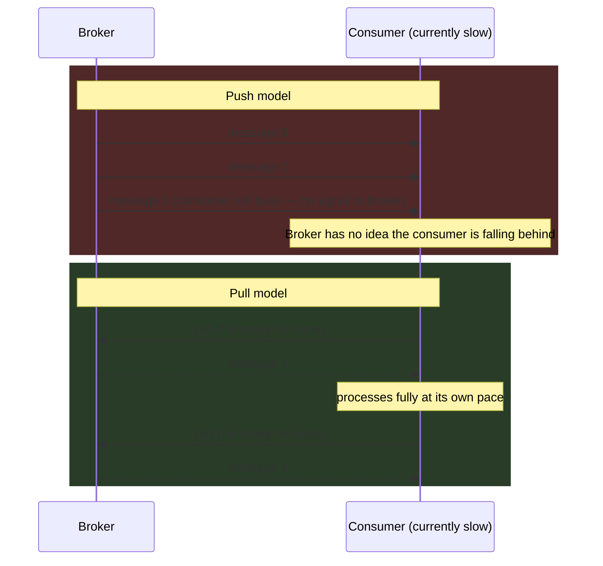
```mermaid
sequenceDiagram
    participant Broker
    participant Consumer as Consumer (currently slow)

    rect rgb(80,40,40)
    Note over Broker,Consumer: Push model
    Broker->>Consumer: message 1
    Broker->>Consumer: message 2
    Broker->>Consumer: message 3 (consumer still busy — no signal to broker)
    Note over Consumer: Broker has no idea the consumer is falling behind
    end

    rect rgb(40,60,40)
    Note over Broker,Consumer: Pull model
    Consumer->>Broker: poll (I'm ready for more)
    Broker-->>Consumer: message 1
    Note over Consumer: processes fully at its own pace
    Consumer->>Broker: poll (I'm ready for more)
    Broker-->>Consumer: message 2
    end
```

| | Push | Pull |
|---|---|---|
| Backpressure | None natively — broker can overrun a slow consumer | Natural — consumer only asks when ready |
| Latency | Lower (broker sends the instant it has data) | Slightly higher (bounded by poll interval) |
| Consumer control | Broker decides the pace | Consumer decides the pace and batch size |
| Real systems | RabbitMQ `basic.consume`, WebSocket-style push | Kafka (`poll()`), SQS (`ReceiveMessage`) — the dominant pattern at scale |

**Long polling — the trick that makes pull cheap:** a naive pull ("ask every 100ms, get empty replies most of the time") wastes calls and money. **Long polling** (SQS `WaitTimeSeconds`, Kafka `fetch.max.wait.ms`) holds the request open server-side until a message arrives or a timeout elapses, collapsing many empty polls into one held connection.

**Memory hook:** *push = firehose pointed at you, hope you can drink; pull = you bring the cup, and you decide how big a cup.* Pull's dominance in high-scale systems (Kafka, SQS) is precisely because it makes backpressure free — the interview answer to "how do you prevent a slow consumer from being overwhelmed" is almost always "we use pull, not push."

---

## Replication Deep-Dive: Sync vs. Async vs. Quorum

Durability is a **spectrum**, not a checkbox. This is the level of detail interviewers want once you've said "we replicate the data" — *how* does the primary decide when to acknowledge the producer?

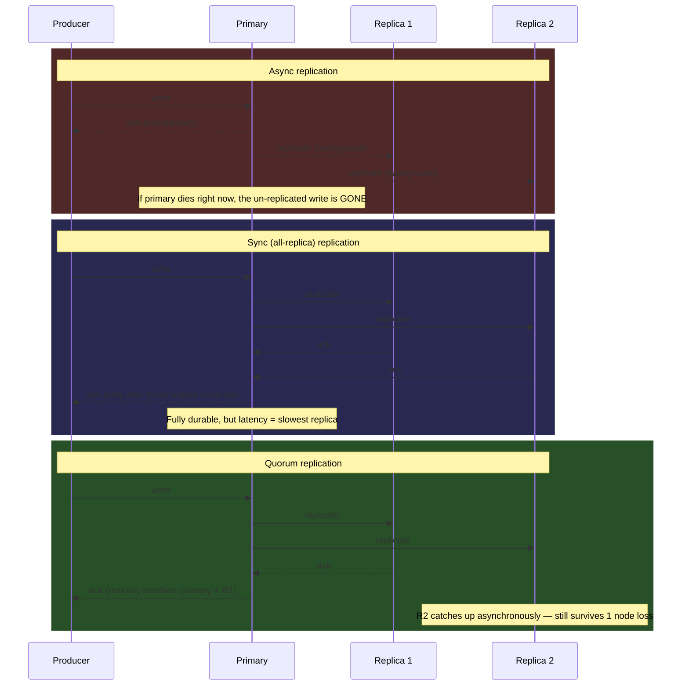
```mermaid
sequenceDiagram
    participant P as Producer
    participant Primary
    participant R1 as Replica 1
    participant R2 as Replica 2

    rect rgb(80,40,40)
    Note over P,R2: Async replication
    P->>Primary: write
    Primary-->>P: ack (immediately)
    Primary-->>R1: replicate (background)
    Primary-->>R2: replicate (background)
    Note over Primary: If primary dies right now, the un-replicated write is GONE
    end

    rect rgb(40,40,80)
    Note over P,R2: Sync (all-replica) replication
    P->>Primary: write
    Primary->>R1: replicate
    Primary->>R2: replicate
    R1-->>Primary: ack
    R2-->>Primary: ack
    Primary-->>P: ack (only after every replica confirms)
    Note over Primary: Fully durable, but latency = slowest replica
    end

    rect rgb(40,80,40)
    Note over P,R2: Quorum replication
    P->>Primary: write
    Primary->>R1: replicate
    Primary->>R2: replicate
    R1-->>Primary: ack
    Primary-->>P: ack (majority reached: primary + R1)
    Note over R2: R2 catches up asynchronously — still survives 1 node loss
    end
```

| Mode | Ack after | Durability | Latency | Who uses it |
|---|---|---|---|---|
| **Async** | Primary writes locally | Weakest — window of data loss on primary crash | Lowest | Systems that favor throughput over zero-loss (some Kafka `acks=1` configs) |
| **Sync (all replicas)** | Every replica confirms | Strongest | Highest — bounded by the slowest replica | Financial ledgers, anything where losing a write is unacceptable |
| **Quorum (majority)** | `⌊N/2⌋ + 1` replicas confirm | Strong enough to survive minority failures | Middle ground | Kafka `acks=all` with `min.insync.replicas`, most production defaults |

**Golden rule to say out loud:** *replication mode is a durability/latency dial, not a fixed property of "the queue" — you pick it per use case, and "quorum" is almost always the right default answer unless the interviewer specifically asks for maximum durability or minimum latency.*

---

## Message Ordering — the Core Design Tension

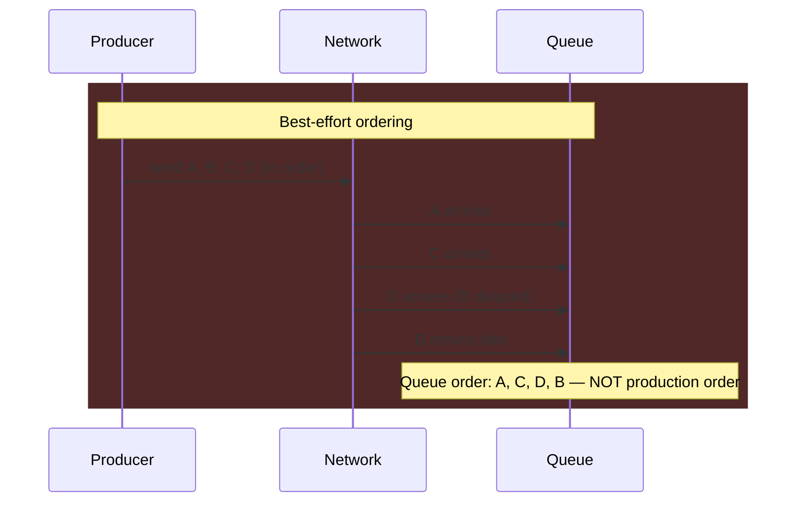
```mermaid
sequenceDiagram
    participant Producer
    participant Network
    participant Queue

    rect rgb(80,40,40)
    Note over Producer,Queue: Best-effort ordering
    Producer->>Network: send A, B, C, D (in order)
    Network->>Queue: A arrives
    Network->>Queue: C arrives
    Network->>Queue: D arrives (B delayed)
    Network->>Queue: B arrives late
    Note over Queue: Queue order: A, C, D, B — NOT production order
    end
```

| Ordering strategy | How | Weakness |
|---|---|---|
| **Best-effort** | Place messages in the order they **arrive** at the server | Cheap, high throughput — but production order ≠ queue order |
| **Monotonically increasing IDs** (server-assigned) | Server hands out 1, 2, 3... in a strict sequence | Serialization point = bottleneck under burst; still can't fix a message that arrives out of production order |
| **Causality-based sorting** | Sort by client-side timestamp | Can't compare timestamps across independent client sessions/clocks |
| **Synchronized-clock timestamps** | Use a synchronized clock (e.g., a sequencer service) to stamp messages; tag with process ID to break ties | The correct general answer — lets the server detect and wait for delayed messages; can double as a global cross-session ordering mechanism |

**Then you still have to sort on arrival** — an online sorting algorithm, typically bounded by a **time-window** (wait N ms to let stragglers catch up) to cap the latency penalty of strict ordering.

**Golden trade-off to say out loud:** *strict ordering trades throughput and latency for correctness of sequence; best-effort buys back throughput by admitting reordering is possible.* This is exactly why Kafka only guarantees order **within a partition**, not across an entire topic — global order across partitions is deliberately not sold, because it would kill parallelism.

### Managing concurrency
Two points of contention: multiple producers writing at once, multiple consumers reading at once.
- **Locking** — correctness-simple, but kills scalability and throughput (the single-server queue's exact problem — this is *why* a naive port to distributed doesn't work).
- **Serialize via buffers at both ends** — the practical answer; avoids race conditions without a global lock. Concretely: each partition gets one write buffer that appends sequentially (no two producers interleave writes to the same partition), and one consumer thread applies messages in receipt order (no two threads mutate the same partition's downstream state at once).
- **Multiple queues, dedicated producer/consumer pairs** — keeps per-queue ordering cost low at the price of more complex application logic (this is the mental model behind Kafka partitions: N partitions = N independent ordered logs, but the app must pick a partition key).

#### 🆕 FIFO vs. Standard queues — the ordering trade-off, productized

This is the same best-effort-vs-strict trade-off from above, worth naming as its own decision because it's exactly how SQS (and similarly-shaped systems) expose it to the caller — as a queue *type*, chosen once at creation:

| | Standard queue | FIFO queue |
|---|---|---|
| Ordering | Best-effort — usually in order, not guaranteed | Strict, per `message_group_id` |
| Delivery | At-least-once, duplicates possible | At-least-once, but with a dedup window (e.g., 5 minutes) giving effectively exactly-once processing |
| Throughput | Very high, scales near-linearly with partitions | Capped per queue/group — illustrative order of magnitude: low thousands of msg/sec with batching; check the provider's current limit, these have grown over time |
| Parallelism | Any consumer can take any message | Only one in-flight message per `message_group_id` at a time — more groups buys more parallelism |
| Typical use | Logs, metrics, notifications — anything order-tolerant | Sequenced business events: payment state-machine steps, inventory updates for one SKU — anything where processing B before A corrupts state |

**Memory hook:** *Standard is a fast-food counter — several windows, first available server takes your order, no ticket number. FIFO is a single-file DMV line — one ticket, strict order, and the whole line waits behind the one slow window.* If the prompt ever says "these events must apply in the order they happened for the same `X`" (same user, same order, same SKU), that's your cue to say "FIFO, partitioned by `X`" — not "standard queue."

---

## Delivery Semantics — the Other Core Disambiguation

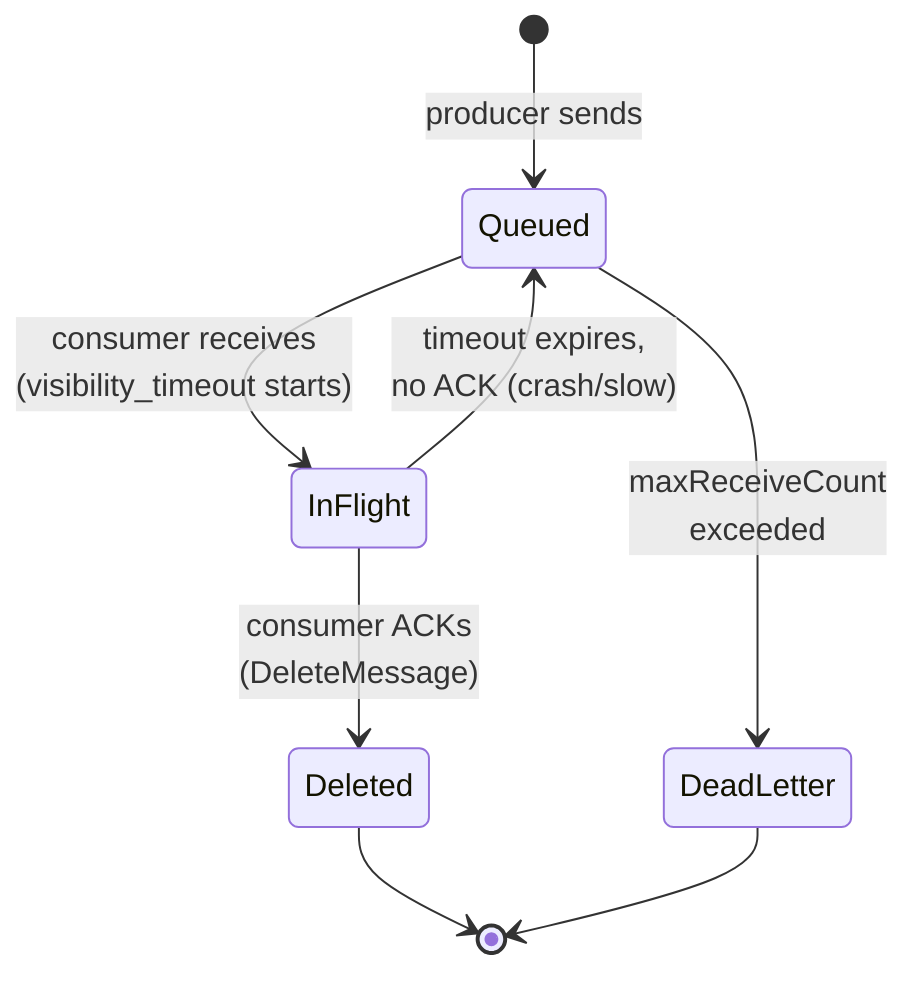
```mermaid
stateDiagram-v2
    [*] --> Queued: producer sends
    Queued --> InFlight: consumer receives<br/>(visibility_timeout starts)
    InFlight --> Deleted: consumer ACKs<br/>(DeleteMessage)
    InFlight --> Queued: timeout expires,<br/>no ACK (crash/slow)
    Queued --> DeadLetter: maxReceiveCount<br/>exceeded
    Deleted --> [*]
    DeadLetter --> [*]
```

| Semantic | Guarantee | Cost | Who uses it |
|---|---|---|---|
| **At-most-once** | Delivered 0 or 1 times — may silently drop | Cheapest, no retry bookkeeping | Metrics/logs where an occasional loss is fine |
| **At-least-once** | Delivered 1+ times — never silently dropped, but duplicates possible | Needs consumer-side idempotency or dedup | SQS (visibility timeout), Kafka (offset commit after processing) — **the default answer in most interviews** |
| **Exactly-once** | Delivered and processed exactly once | Requires transactional writes / idempotent producers + dedup on both ends; hardest and most expensive | Kafka transactions (producer idempotence + read-process-write transactions), payment processing pipelines |

**Two concrete mechanisms behind "don't delete on read" (both give at-least-once):**
1. **Offset-based, no delete** (Kafka model): message stays in the log; consumer tracks its own **offset**. Multiple consumer groups can each read the same message independently. A retention job deletes on expiry, not on consumption.
2. **Visibility-timeout model** (SQS model): message becomes **invisible** for `visibility_timeout` seconds after being received, not deleted. Consumer must call `DeleteMessage` (ack) before the timeout or the message reappears for another consumer to grab.

#### 🆕 Send → receive → process → delete, with a concrete redelivery

A worked example beats the abstract rule: **visibility timeout = 30s**, and this particular job **takes 45s** to process.

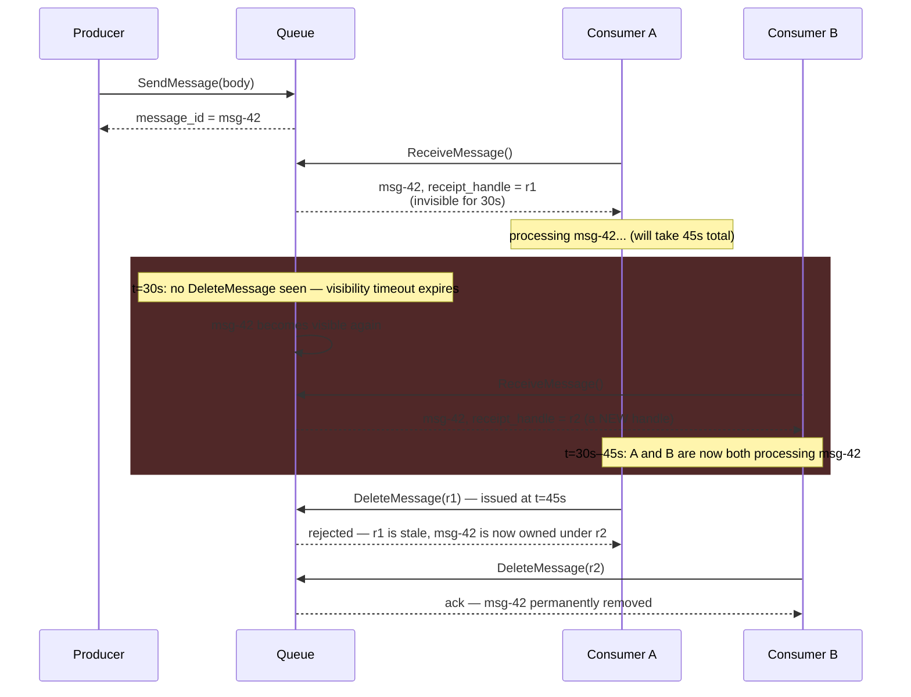
```mermaid
sequenceDiagram
    participant P as Producer
    participant Q as Queue
    participant A as Consumer A
    participant B as Consumer B

    P->>Q: SendMessage(body)
    Q-->>P: message_id = msg-42

    A->>Q: ReceiveMessage()
    Q-->>A: msg-42, receipt_handle = r1<br/>(invisible for 30s)
    Note over A: processing msg-42... (will take 45s total)

    rect rgb(80,40,40)
    Note over Q: t=30s: no DeleteMessage seen — visibility timeout expires
    Q->>Q: msg-42 becomes visible again
    B->>Q: ReceiveMessage()
    Q-->>B: msg-42, receipt_handle = r2 (a NEW handle)
    Note over A,B: t=30s–45s: A and B are now both processing msg-42
    end

    A->>Q: DeleteMessage(r1) — issued at t=45s
    Q-->>A: rejected — r1 is stale, msg-42 is now owned under r2
    B->>Q: DeleteMessage(r2)
    Q-->>B: ack — msg-42 permanently removed
```

Two things worth saying out loud about this diagram: the message reappeared **only** because A took longer than the timeout — nothing crashed — and A's delete is rejected specifically because it names the *old* receipt handle. That rejection is exactly the safety net `receipt_handle` (instead of reusing `message_id`) is designed to provide.

**Making the consumer actually idempotent, concretely:** keep a small dedup store (Redis, or a table with a TTL) keyed by a **business** idempotency key — an `order_id` or `payment_id`, not the queue's `message_id` — because what must not double-apply is the side effect, not the delivery. Before doing anything with a real-world effect (charging a card, sending an email), atomically check-and-set that key; if it's already set, skip the side effect and just acknowledge the message. Set the TTL comfortably longer than the worst-case reprocessing window — e.g., if visibility timeout is 30s and `maxReceiveCount` is 5, a TTL of a few minutes is generous headroom — so even a late duplicate gets caught.

**Point to ponder, answered:** if the visibility timeout expires while the consumer is *still* processing, **another consumer can pick up and process the same message concurrently** — this is exactly why at-least-once requires idempotent consumers, and why SQS/Kafka both expose an API to *extend* the timeout (`ChangeMessageVisibility` / Kafka's `max.poll.interval.ms`) for long-running jobs.

**Quick decision — which delivery semantic do I actually need?**

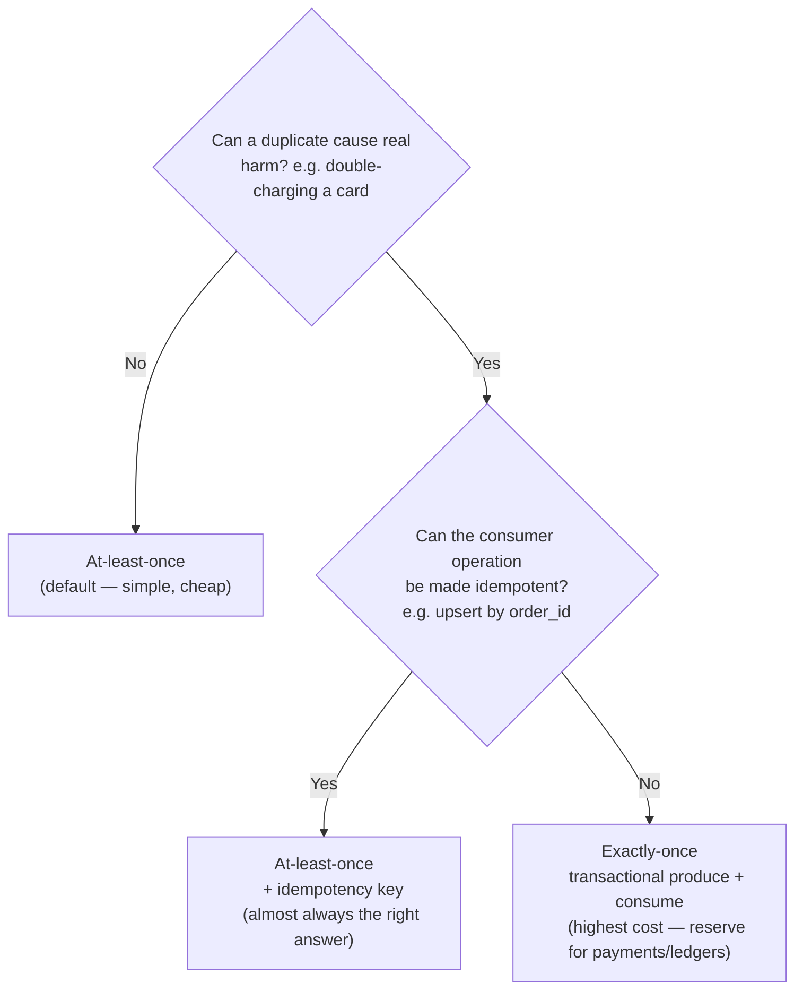
```mermaid
flowchart TD
    Q1{Can a duplicate cause real<br/>harm? e.g. double-charging a card} -->|No| AMO["At-least-once
    (default — simple, cheap)"]
    Q1 -->|Yes| Q2{Can the consumer operation<br/>be made idempotent?<br/>e.g. upsert by order_id}
    Q2 -->|Yes| AMO2["At-least-once
    + idempotency key
    (almost always the right answer)"]
    Q2 -->|No| EO["Exactly-once
    transactional produce + consume
    (highest cost — reserve for payments/ledgers)"]
```

---

## Retry, Backoff & Dead-Letter Queues

A message that fails processing shouldn't be retried instantly forever (hammers a possibly-struggling downstream) or dropped immediately (loses data on a transient blip). The standard pattern is **exponential backoff, capped, then quarantine:**

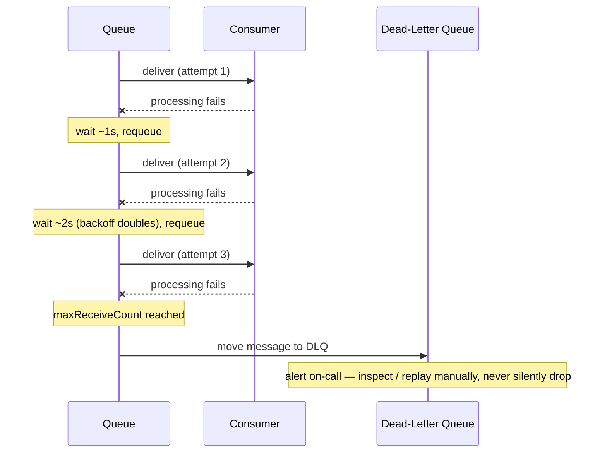
```mermaid
sequenceDiagram
    participant Q as Queue
    participant Consumer
    participant DLQ as Dead-Letter Queue

    Q->>Consumer: deliver (attempt 1)
    Consumer--xQ: processing fails
    Note over Q: wait ~1s, requeue
    Q->>Consumer: deliver (attempt 2)
    Consumer--xQ: processing fails
    Note over Q: wait ~2s (backoff doubles), requeue
    Q->>Consumer: deliver (attempt 3)
    Consumer--xQ: processing fails
    Note over Q: maxReceiveCount reached
    Q->>DLQ: move message to DLQ
    Note over DLQ: alert on-call — inspect / replay manually, never silently drop
```

**Dead-letter queue (DLQ):** after a message exceeds `maxReceiveCount`, it's routed to a separate queue instead of being retried forever — poison-pill isolation so one bad message can't stall the whole pipeline. *(This is a real quiz question in the source material — remember it cold: DLQ = messages that failed and hit the retry ceiling, not "successfully consumed" and not "producer died.")*

**Memory hook:** *backoff buys the downstream time to recover; the cap prevents one poison message from retrying forever; the DLQ makes sure "gave up retrying" is a visible event, not a silent data loss.*

#### 🆕 Poison-message decision flowchart

The DLQ isn't a separate feature bolted on — it's the answer to one specific question the consumer/queue must ask on every failed delivery:

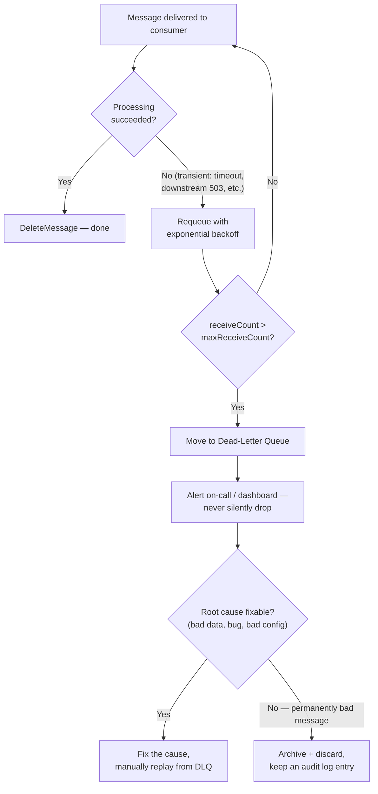
```mermaid
flowchart TD
    R["Message delivered to consumer"] --> P{"Processing<br/>succeeded?"}
    P -->|Yes| Del["DeleteMessage — done"]
    P -->|"No (transient: timeout,<br/>downstream 503, etc.)"| BO["Requeue with<br/>exponential backoff"]
    BO --> Cnt{"receiveCount ><br/>maxReceiveCount?"}
    Cnt -->|No| R
    Cnt -->|Yes| DLQ["Move to Dead-Letter Queue"]
    DLQ --> Alert["Alert on-call / dashboard —<br/>never silently drop"]
    Alert --> Fix{"Root cause fixable?<br/>(bad data, bug, bad config)"}
    Fix -->|Yes| Replay["Fix the cause,<br/>manually replay from DLQ"]
    Fix -->|"No — permanently bad message"| Archive["Archive + discard,<br/>keep an audit log entry"]
```

**If X then Y, cold:** *if a message has failed `maxReceiveCount` times, then it goes to the DLQ, not back to the main queue — retrying it a 6th time when 5 already failed just burns downstream capacity for nothing.*

---

## Queue vs. Topic vs. Log — Don't Blur These in an Interview

| | Queue (point-to-point) | Topic (pub-sub, fan-out) | Log (Kafka-style stream) |
|---|---|---|---|
| Consumption | One consumer per message | Every subscriber gets a copy | Every consumer **group** gets a copy; within a group, one partition → one consumer |
| Message survives read? | Usually deleted/invisible after ack | Delivered then typically gone (unless replay supported) | **Retained** for a configured time regardless of consumption — replay is native |
| Ordering | Global if single-partition | Per-topic, best-effort typically | Strict **within a partition** only |
| Replay old messages | No | Rarely | Yes — seek to any offset |
| Real systems | SQS, ActiveMQ (queue mode), RabbitMQ (direct) | SNS, RabbitMQ (fanout exchange), Google Pub/Sub | Kafka, Kinesis, Pulsar |

**Memory hook:** *queue = single ticket, one person redeems it; topic = flyer photocopied for everyone on the list; log = a ledger nobody erases, so you can re-read any past page.*

---

## Consumer Groups & Partition Rebalancing

This is how a log-based system (Kafka, Kinesis) actually **scales** consumption — the mechanism behind "add more consumers to read faster," which every candidate claims but few can explain.

**The rule:** within one consumer group, each partition is read by **exactly one** consumer at a time. So `#consumers ≤ #partitions` for full parallelism — a 4th consumer added to a 3-partition topic sits idle. This is the single most common capacity-planning mistake candidates make: *partition count is your ceiling on consumer parallelism, decide it up front, oversharding is cheap insurance, undersharding requires a repartition later.*

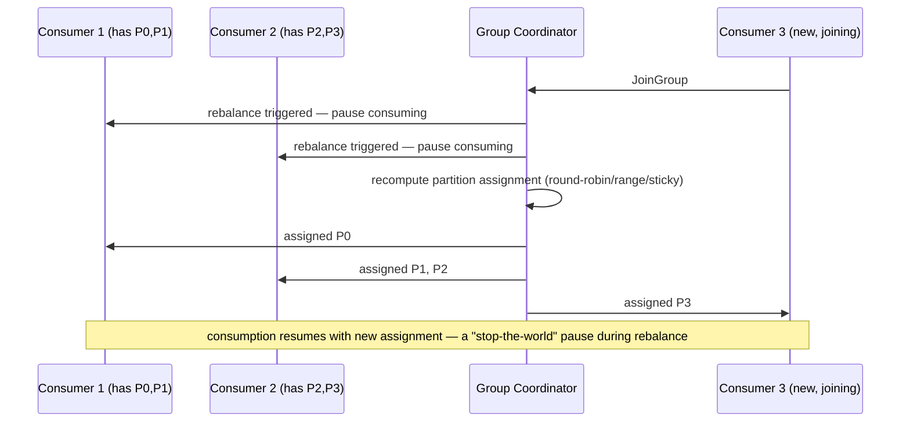
```mermaid
sequenceDiagram
    participant C1 as Consumer 1 (has P0,P1)
    participant C2 as Consumer 2 (has P2,P3)
    participant GC as Group Coordinator
    participant C3 as Consumer 3 (new, joining)

    C3->>GC: JoinGroup
    GC->>C1: rebalance triggered — pause consuming
    GC->>C2: rebalance triggered — pause consuming
    GC->>GC: recompute partition assignment (round-robin/range/sticky)
    GC->>C1: assigned P0
    GC->>C2: assigned P1, P2
    GC->>C3: assigned P3
    Note over C1,C3: consumption resumes with new assignment — a "stop-the-world" pause during rebalance
```

**Rebalancing also triggers on:** a consumer crashing (missed heartbeats), a consumer leaving cleanly, or partition count changing. **The cost interviewers want you to name:** rebalancing pauses the *entire* group briefly (older "eager" rebalance) — modern brokers use **incremental/cooperative rebalancing** so only the reassigned partitions pause, not the whole group. Mentioning this distinction is a strong signal you've operated these systems, not just read about them.

**Memory hook:** *a consumer group is a team splitting a stack of numbered folders (partitions) — one folder per teammate at a time; add a teammate, folders get reshuffled; a teammate quits, their folders go to someone else.*

---

## Numbers Worth Memorizing

| Fact | Value |
|---|---|
| Kafka default max message size | 1 MB (broker `message.max.bytes`, tunable to a few MB) |
| SQS max message size | 256 KB (larger payloads → store in S3, queue the pointer) |
| SQS default / max visibility timeout | 30 s default, 12 hours max |
| SQS message retention | 4 days default, 14 days max |
| Kinesis shard limits | 1 MB/s or 1,000 records/s write; 2 MB/s read |
| Kafka partition throughput (rule of thumb) | ~10 MB/s write per partition on commodity disks — plan partition count from target throughput, not intuition |
| Typical replication factor | 3 (tolerates 1 node loss with quorum, 2 with best-effort) |
| Same-datacenter round trip | ~0.5 ms |
| Cross-region round trip | ~50–150 ms — synchronous cross-region replication is a latency tax, not free durability |
| Disk sequential write | ~500 MB/s–1 GB/s (SSD) — why log-structured brokers append-only instead of random-writing |

These numbers justify *why* partition count and replication factor are the two levers you tune in a capacity estimate, not arbitrary system-specific trivia.

### Throughput tricks: batching & compression

Two cheap, high-leverage optimizations interviewers expect you to at least name when asked "how do you push more throughput through the same partitions":

| Technique | What it does | Trade-off |
|---|---|---|
| **Producer batching** | Group N messages into one network write (Kafka `linger.ms` + `batch.size`) | Higher throughput, but adds up to `linger.ms` of latency per message |
| **Compression** (snappy/lz4/zstd) | Compress a batch before sending over the wire and storing on disk | Less network/disk I/O, small CPU cost — almost always a net win at scale |
| **Consumer batching** | Pull/process N messages per round-trip instead of 1 | Fewer round-trips, but a batch failure can force reprocessing the whole batch (interacts with at-least-once + idempotency) |

**Memory hook:** *batching trades a few milliseconds of latency for a large multiple of throughput — the right trade almost everywhere except the most latency-sensitive path.*

---

## Capacity Estimation, Worked

**Formula chain:**
```
avg QPS = daily messages / 86,400
peak QPS = avg QPS × peak factor (typically 2–5x)
ingress bandwidth = peak QPS × avg message size
storage = daily messages × avg message size × retention_days
replicated storage = storage × replication factor
partitions needed = peak QPS / max QPS per partition   (or: peak bandwidth / per-partition MB/s)
nodes needed = (replicated storage / disk per node) AND (partitions × replication / partitions per node)
                — take the max of the two
```

**Worked example — order-processing queue for an e-commerce platform:**

- 10M orders/day → avg QPS = 10,000,000 / 86,400 ≈ **116 QPS**
- Peak factor 4x (flash sales) → peak QPS ≈ **464 QPS**
- Avg message size: 2 KB (order payload + metadata)
- **Ingress bandwidth** at peak: 464 × 2 KB ≈ **928 KB/s** ≈ 0.9 MB/s — trivial for one machine, but we still shard for isolation and availability, not raw throughput.
- **Storage** at 7-day retention: 10M × 2 KB × 7 = **140 GB** raw
- **Replicated storage** (factor 3): 140 GB × 3 = **420 GB**
- **Partitions**: even though 0.9 MB/s is tiny, business requires per-customer ordering → partition by `customer_id`, sized for future 20x growth → pick **50 partitions** (headroom, not raw throughput need)
- **Nodes**: 420 GB / (say 500 GB usable disk per broker after overhead) ≈ **1 node** for storage, but availability requires spreading 50 partitions × 3 replicas = 150 replica-slots across **at least 3 nodes** (one per replica) — realistically **5–6 nodes** for headroom and rolling upgrades.

**The reusable takeaway to say in an interview:** *raw throughput rarely dictates partition count at this scale — retention × replication dictates storage, and availability/ordering requirements dictate partition count. State both numbers, not just one.* If the interviewer changes an input (e.g., "what if it's 1B orders/day"), redo the same four lines — don't recite a memorized final answer.

---

## Design Decisions & Trade-offs

| Decision | Option A | Option B | What you're trading |
|---|---|---|---|
| Ordering | Best-effort | Strict (synchronized clocks + time-window sort) | Throughput/latency vs. correctness of sequence |
| Back-end topology | Primary-secondary | Cluster of independent hosts | Simplicity/consistency vs. no-election flexibility |
| Deletion model | Offset-based (Kafka) | Visibility-timeout (SQS) | Multi-consumer replay vs. simple single-consumer-per-message semantics |
| Delivery guarantee | At-least-once | Exactly-once | Operational simplicity vs. correctness under retries (payments, ledgers) |
| Metadata mapping location | Front-end only | Every back-end host | Fewer moving parts vs. better read fan-out tolerance |
| Replication | Primary-secondary (async or sync) | Quorum (majority ack) | Lower write latency vs. stronger durability guarantee |

### Where does this sit on CAP?

Interviewers like to check whether you can place your design on the CAP triangle without prompting:

- **Within a partition**, a well-designed queue is effectively **CP** — quorum writes mean you sacrifice some availability (a write can stall if you can't reach a majority) to guarantee the ordered log is consistent and durable.
- **Across the whole system** (many partitions, many queues), it behaves **AP** — the metadata/routing layer keeps serving other partitions/queues even if one partition's quorum is unreachable; a partial outage doesn't take down the whole cluster.
- **Consumer offsets** are typically **eventually consistent** — a consumer group's committed offset lags slightly behind actual processing, which is exactly why at-least-once (not exactly-once) is the default.

**One-liner:** *"Per-partition, I'm choosing consistency over availability via quorum writes; across partitions, the system stays available because a stuck partition doesn't block the others."*

---

## Common Failure Modes

| Failure | Symptom | Mitigation |
|---|---|---|
| Broker/primary node dies | Queue unavailable for writes | Fast primary election (internal cluster manager), replicas promoted |
| Network partition (split-brain) | Two nodes think they're primary | Quorum-based writes, fencing tokens, epoch/term numbers |
| Hot partition | One partition/queue overloaded while others idle | Better partition-key choice, or split queue across more partitions |
| Poison-pill message | Same message crashes every consumer, blocks queue | Dead-letter queue after N retries |
| Consumer crash mid-processing | Message stuck "in-flight" forever if no timeout | Visibility timeout / lease with auto-expiry |
| Duplicate delivery | At-least-once retries create dupes downstream | Idempotency keys, dedup cache at front-end (hash-key lookup) |
| Slow consumer (backpressure) | Queue depth grows unbounded | Auto-scale consumers, alert on queue depth / age-of-oldest-message |
| Metadata store overload | Every send/receive stalls | Cache metadata aggressively at front-end; shard metadata store itself |
| Clock skew | Synchronized-clock ordering breaks | NTP/PTP, hybrid logical clocks, or accept causality-based approach with known limitation |

---

## Real-World Systems — How They Actually Did It

| System | Model | Ordering | Delivery | Notable design choice |
|---|---|---|---|---|
| **Apache Kafka** | Log-based, partition = unit of parallelism | Strict within partition, none across | At-least-once by default; exactly-once via idempotent producer + transactions | Doesn't delete on read — consumer tracks offset; replay is a first-class feature |
| **Amazon SQS** | Point-to-point queue, cluster of independent hosts under the hood | Best-effort (standard) or strict FIFO (dedicated FIFO queues, lower throughput) | At-least-once (standard); exactly-once processing (FIFO, with dedup window) | Visibility timeout instead of delete-on-read; DLQ built in |
| **RabbitMQ** | Broker with exchanges (direct/topic/fanout) routing to queues | Per-queue FIFO | At-least-once (ack) or at-most-once (no-ack) | Flexible routing topology (exchange types) is its signature feature over plain queues |
| **Amazon Kinesis** | Sharded log, similar to Kafka partitions | Strict within shard | At-least-once | Shard = fixed throughput unit (1 MB/s in, 2 MB/s out); resharding is an explicit operation |
| **Apache Pulsar** | Separates compute (broker) from storage (BookKeeper) | Strict within partition | At-least-once / exactly-once | Broker is stateless — storage tier scales independently, unlike Kafka where broker owns the log on local disk |
| **Google Pub/Sub** | Pub-sub, fully managed | Best-effort (ordering keys optional for per-key order) | At-least-once | No fixed partition count exposed to the user — the "cluster of independent hosts" model taken to its logical extreme |

**Positioning these systems on two axes** (illustrative, not benchmarked — the point is the *shape* of the trade-off, not exact coordinates):

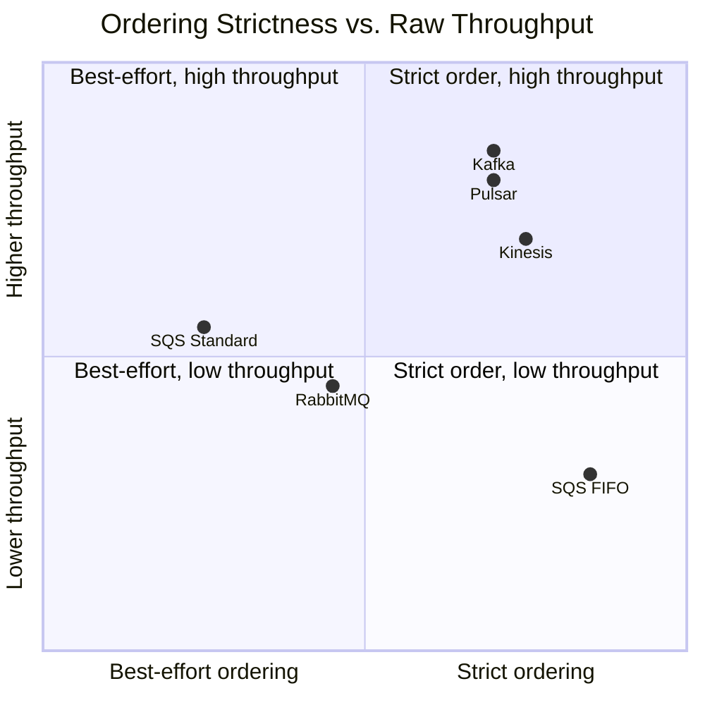
```mermaid
quadrantChart
    title Ordering Strictness vs. Raw Throughput
    x-axis Best-effort ordering --> Strict ordering
    y-axis Lower throughput --> Higher throughput
    quadrant-1 Strict order, high throughput
    quadrant-2 Best-effort, high throughput
    quadrant-3 Best-effort, low throughput
    quadrant-4 Strict order, low throughput
    Kafka: [0.7, 0.85]
    SQS Standard: [0.25, 0.55]
    SQS FIFO: [0.85, 0.3]
    RabbitMQ: [0.45, 0.45]
    Kinesis: [0.75, 0.7]
    Pulsar: [0.7, 0.8]
```

**Read it as:** paying for strict ordering (moving right) generally costs you throughput headroom (moving down) — SQS FIFO vs. SQS Standard is the clearest illustration of that same trade-off inside one product family.

**How to bring this up in an interview:** if asked "design a notification system / order pipeline / log ingestion system," name the closest real system early ("this is essentially the SQS/Kafka trade-off") — it signals you know the landscape, then justify **why** you'd pick one model over the other for *this specific* requirement (ordering need, replay need, fan-out need), rather than defaulting to "I'll use Kafka" for everything.

---

## How to Identify This Topic in an Interview

Watch for these phrases — they're signals the interviewer wants queue internals, not just "use SQS":
- "Design a system that must survive a downstream service being slow or down"
- "How would you decouple X from Y"
- "Design Kafka / SQS / a notification pipeline / an order-processing pipeline"
- "Messages must be processed in order" → they want the ordering trade-off discussion
- "A consumer might crash mid-processing" → they want visibility-timeout / offset / DLQ discussion
- "We can't lose any messages, ever" → they want durability + replication + at-least-once discussion
- "We need to fan a single event out to five downstream services" → pub-sub, not point-to-point
- "How do you add consumers to process faster" → they want consumer groups + partition-count-is-the-ceiling
- "How do you avoid overwhelming a slow consumer" → they want push vs. pull / backpressure
- "How durable is durable" → they want sync vs. async vs. quorum replication, not just "we replicate it"

---

## Golden Rules

- **A queue is a buffer for mismatched speed, not a database** — if consumers must query/scan/filter historical data at will, that's a log or a datastore, not a queue.
- **Global strict ordering and horizontal scalability are in tension** — pick per-partition ordering and shard by the key that must stay ordered, don't try to order everything.
- **At-least-once is the pragmatic default** — exactly-once is achievable but expensive; only pay for it when duplicates are truly unacceptable (money, not metrics).
- **Never delete a message on read** — delete (or make invisible) only on confirmed processing, so a crashed consumer never silently loses work.
- **A poison message should never be allowed to block a queue forever** — always cap retries and route to a dead-letter queue.
- **Metadata is small and hot; messages are large and bulky** — cache the former aggressively, shard the latter deliberately. Conflating the two in one storage tier is a common design smell.
- **Replication factor is a durability dial, partition count is a parallelism dial** — tune them independently, and justify each with a number, not intuition.
- **Partition count is your consumer-parallelism ceiling** — decide it with headroom up front; adding consumers past partition count buys you nothing.
- **Pull beats push at scale because backpressure comes for free** — the consumer, not the broker, decides its own pace.
- **Batch and compress before you add machines** — it's the cheapest throughput multiplier available, always try it before scaling out.

---

## Master Cheat Sheet

**Definitions:** Queue = point-to-point, one consumer eats each message. Topic = pub-sub, every subscriber gets a copy. Log = retained stream, replay by offset.

**Data model:** queue → partitions → ordered messages; partition → owned by one primary host; consumer group → claims partitions 1:1 per member.

**Ordering:** best-effort (arrival order) vs. strict (synchronized-clock timestamp + time-window sort). Strict costs throughput. Kafka's answer: strict *within a partition* only.

**Delivery:** at-most-once (may drop) / at-least-once (may duplicate, default answer) / exactly-once (idempotent producer + transaction, expensive). Decision tree: harm from dupes? → can you make it idempotent? → only then pay for exactly-once.

**Deletion:** offset-tracking (Kafka, supports replay) vs. visibility-timeout (SQS, simpler point-to-point model). Retry with capped exponential backoff, then DLQ — never retry forever, never drop silently.

**Push vs. pull:** push = broker sends, no backpressure. Pull = consumer polls, natural backpressure; long polling avoids wasted empty-poll round trips. Pull wins at scale.

**Consumer groups:** one partition, one consumer per group, at a time. `#consumers ≤ #partitions`. Adding/removing a consumer triggers a rebalance (cooperative rebalancing limits the pause to only the reassigned partitions).

**Back-end topology:** primary-secondary (one owner per queue, needs leader election on failure) vs. cluster of independent hosts (any host serves, no election, harder consistency).

**Replication modes:** async (fast, risk of loss) / sync-all (safest, slowest) / quorum (majority ack — the default production answer).

**Partitioning:** consistent hashing — node join/leave only reshuffles the neighboring slice, not the whole ring.

**Cluster managers:** internal = inside one cluster, knows every node. External = across clusters, knows clusters not their nodes.

**CAP stance:** per-partition = CP (quorum trades availability for consistency); across partitions = AP (one stuck partition doesn't block the rest); offsets = eventually consistent.

**Formula chain:** QPS → bandwidth → storage (× retention × replication) → partitions (from throughput + ordering key + consumer-parallelism target) → nodes (max of storage-bound and partition-slot-bound).

**Numbers:** Kafka msg ≤1MB, SQS msg ≤256KB, SQS visibility 30s/12h, SQS retention 4d/14d default/max, Kinesis shard 1MB/s in–2MB/s out, replication factor 3 is the default assumption.

**Failure modes to preempt unprompted:** hot partition, poison message → DLQ, duplicate delivery → idempotency key, consumer crash mid-flight → visibility timeout/lease, rebalance storm from flapping consumers.

**One-liner for the wrap-up:** *"I chose [ordering guarantee], [delivery semantic], and [replication mode] because [requirement], which cost us [trade-off] — here's how I'd detect and mitigate [the failure mode that trade-off introduces]."*
