# Apache Kafka — Production Deep-Dive Guide

> **Enhancement notes:** this pass focused on filling operational gaps the original guide (correctly) left out since fundamentals live in `18-Kafka-PubSub-Deep-Dive.md`. Added: §13 Capacity Planning (disk = throughput × retention × RF, network fan-out math, partitions-per-broker ceiling, all with worked illustrative numbers); §14 Operational Metrics table (lag, URP, offline partitions, ISR churn, p99 latency, disk %, active-controller-count, MM2 lag — each with healthy/warning/critical thresholds); §15 Rolling Upgrades (controlled-shutdown flowchart, why it beats a hard kill, the two-phase protocol-version bump); §16 Production Incident Playbook (three decision-tree flowcharts: consumer-lag alert, disk-approaching-full, and a hot-partition symptom table that cross-references §6 instead of repeating it); and a 🆕 Controller failure & re-election subsection in §3 (KRaft quorum Raft election, distinct from partition-leader election). Also added two rows to the Common Mistakes table, new interview Q&A entries, new cheat-sheet lines, and three new mindmap leaves. Left untouched: all of §1–§12 and Golden Rules — that content was already clear, correct, and appropriately scoped, so it was not rewritten.

Companion to `17-Distributed-Messaging-Queue-FAANG-Guide.md` — that guide covers the general theory (ordering, delivery semantics, replication). This one covers **Kafka specifically**: how to actually stand it up, create topics correctly, choose a partition key without shooting yourself in the foot, and run it across regions.

---

## Big Picture — Everything in One Glance

```mermaid
mindmap
  root((Apache Kafka))
    Fundamentals
      Topic: a name, no storage
      Partition: the real ordered log
      Offset: position within ONE partition
      Broker: hosts replicas
      Client talks direct to the leader
    Storage
      Partition = ordered log
      Segments: active vs sealed
      High Watermark: what's readable
    Reliability
      ISR: leader + in-sync followers
      Leader election: only from ISR
      Idempotence: dedup one producer's retries
      Transactions: atomic read-process-write
    Sharding
      Partition key = ordering promise
      hash(key) % N — check cardinality first
      Growing partitions changes the mapping
    Consumers
      Pull via poll
      Consumer group: 1 partition, 1 consumer
      Rebalance: Empty to Stable state machine
    Production
      acks=all + min.insync.replicas
      broker.rack for AZ spread
      MirrorMaker 2 across regions, never one stretched cluster
      🆕 Capacity: throughput x retention x RF
      🆕 Rolling upgrade: controlled shutdown, one broker at a time
      🆕 Watch lag, URP, p99, disk percent, controller count
```

---

## 1. Kafka Fundamentals — How It All Fits Together

If you only remember one sentence from this whole guide: **a topic is just a name; a partition is the thing that actually exists.** Almost every confusing Kafka question ("why can't I read this message yet," "why did adding partitions break my ordering," "how does replication work") traces back to not having that distinction crisp.

### The core concepts, bottom-up

| Term | What it actually is |
|---|---|
| **Cluster** | A group of Kafka brokers working together, coordinated by a controller |
| **Broker** | One Kafka server process — stores partitions on its local disk, serves produce/fetch requests over the network |
| **Topic** | A named category/feed of records. **Purely a logical name — it holds no data and has no size.** |
| **Partition** | The real unit of storage: an ordered, immutable, append-only log of records living on disk. A topic is split into 1 or more partitions. |
| **Record (message)** | One unit of data: key + value + headers + timestamp (see the table below) |
| **Offset** | A record's position within its **partition** — a simple incrementing integer, unique within that partition, permanently assigned, never reused. **Offsets are not global across a topic** — partition 0's offset 5 and partition 1's offset 5 are unrelated records. |
| **Replica** | A copy of one partition's log, living on a specific broker |
| **Leader** | The one replica of a partition that handles every read and write for it |
| **Follower** | Every other replica of that partition — passively replicates from the leader, ready to be promoted |
| **ISR (in-sync replica set)** | The subset of replicas (leader + caught-up followers) eligible to become leader if the current one dies |
| **Controller** | The broker elected (via KRaft) to own partition-leadership decisions and cluster metadata |
| **Producer** | A client that publishes records to a topic |
| **Consumer** | A client that reads records from a topic, tracking its own position (offset) |
| **Consumer group** | A named set of consumers that split a topic's partitions between them — the unit of parallel consumption |

### Topic → partition → record, visually

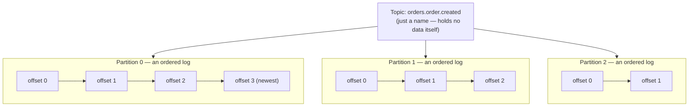

Three things to internalize from this picture alone:
1. **A topic has no order, no size, no location** — those properties belong to its partitions.
2. **Ordering is only guaranteed within one partition.** There is no such thing as "the 4th message ever sent to this topic" — only "the 4th message in partition 2."
3. **This is *why* the partition key matters (§6)** — the key decides which of these independent ordered logs a record lands in.

### Bridging to the general messaging-queue theory

| General concept (from the main FAANG guide) | Kafka's implementation |
|---|---|
| Queue | Topic |
| Shard/partition | Partition (an append-only, ordered log) |
| Back-end topology | Primary-secondary — each partition has one **leader**, N **followers** |
| Cluster manager | **Controller** (elected from the brokers themselves via KRaft — no separate ZooKeeper since Kafka 3.3+/4.0) |
| Delivery model | Pull — consumers call `poll()` |
| Deletion on read | No — offset-based, log is retained independent of consumption |

### Cluster topology

```mermaid
flowchart TD
    P1[Producer] --> B1
    P2[Producer] --> B2
    subgraph Cluster["Kafka Cluster"]
    B1[Broker 1<br/>Leader: P0, P2<br/>Follower: P1, P3]
    B2[Broker 2<br/>Leader: P1, P3<br/>Follower: P0, P2]
    B3[Broker 3<br/>Follower: P0,P1,P2,P3]
    CTRL[(Controller<br/>KRaft quorum)]
    end
    B1 --> C1[Consumer Group A]
    B2 --> C1
    CTRL -. leader election,<br/>metadata .-> B1
    CTRL -. . -> B2
    CTRL -. . -> B3
```

### How a client finds the right broker

A common misconception: that `bootstrap.servers` points at "the Kafka server" all traffic flows through. It doesn't — it's just a door in.

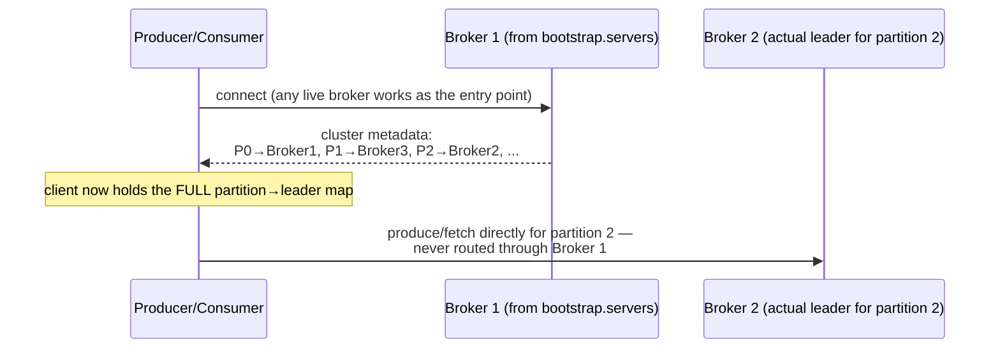

Once a client has this map, it talks **directly** to whichever broker leads the partition it needs. There is no central router or proxy broker — this direct-connection model is a core reason Kafka scales linearly with brokers instead of funneling through a single node.

### How a write flows, end-to-end

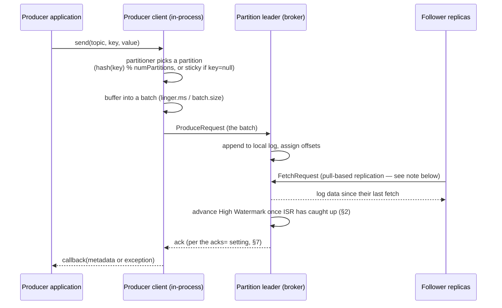

### How a read flows, end-to-end

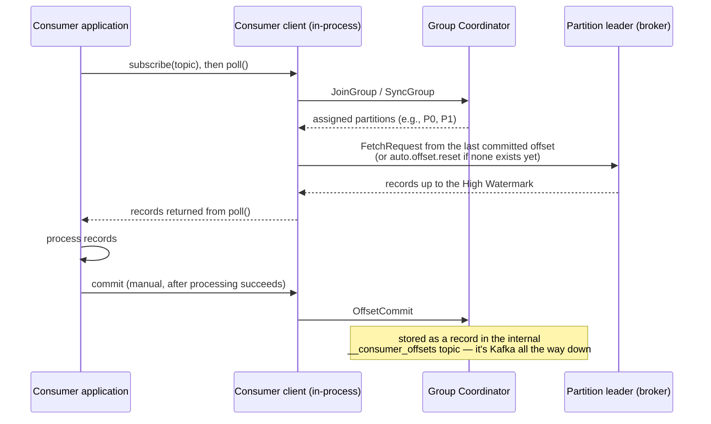

**A follower replica is, mechanically, nothing but a consumer of the leader's log** — it issues the same `FetchRequest` a real consumer client would. Kafka doesn't have two separate replication and consumption protocols; it reuses one (Fetch) for both. This single fact explains why replication is pull-based rather than the leader pushing to followers.

### Why Kafka is fast

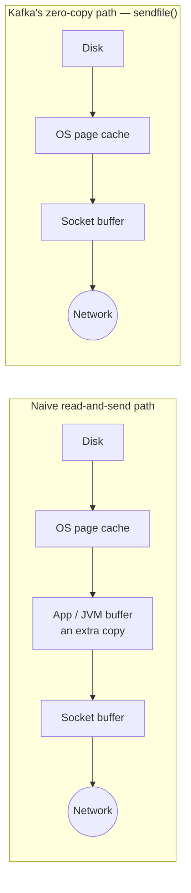

| Technique | What it buys |
|---|---|
| **Sequential disk I/O** | Appending to the end of a log is a sequential write — fast on both spinning disks and SSDs, since it avoids random-seek overhead entirely |
| **OS page cache, not JVM heap** | Kafka deliberately doesn't cache message bytes in JVM heap memory; it relies on the OS page cache, avoiding GC pressure and a second, redundant copy of the data |
| **Zero-copy transfer (`sendfile()`)** | When serving a fetch for data already in the page cache, the broker uses `sendfile()` to hand bytes straight from the page cache to the network socket — skipping the application/JVM buffer copy entirely |
| **Batching + compression** | Fewer, larger, compressed network writes (§7/§9) — amortizes per-request overhead |

**Memory hook:** *Kafka isn't fast despite writing to disk — it's fast partly *because* it writes to disk sequentially and gets out of the data's way (page cache + zero-copy) rather than shuffling bytes through extra buffers.*

### The Kafka ecosystem, briefly

This guide focuses on the broker core (topics/partitions/producers/consumers). The full ecosystem also includes:

| Component | What it's for |
|---|---|
| **Producer / Consumer API** | The client libraries this guide covers |
| **Kafka Streams** | A library for stream-processing apps built directly on topics (joins, aggregations, windowing) — uses the transactional API from §8 internally for exactly-once processing |
| **Kafka Connect** | A framework for standardized source/sink connectors (e.g., database → Kafka, Kafka → S3) without hand-writing producer/consumer code |
| **Admin API** | Programmatic topic/ACL/config management — what `kafka-topics.sh` and friends call under the hood |

### KRaft vs. ZooKeeper

If you're designing a new system today, assume **KRaft mode** (Kafka manages its own metadata/consensus via a Raft quorum of controller nodes) — ZooKeeper is legacy as of Kafka 4.0. Mentioning "no ZooKeeper needed, KRaft handles it" is a small but real signal of current knowledge in an interview.

### Anatomy of a Kafka record

What's actually inside each message:

| Field | Purpose |
|---|---|
| Key | Drives partition assignment (§6) and compaction identity |
| Value | The payload — opaque bytes to Kafka, structured by your serializer (Avro/Protobuf/JSON) |
| Headers | Key-value metadata (e.g., `trace_id`, `content-type`) — travels with the record without touching the value schema |
| Timestamp | Producer-set (event time) or broker-set (ingestion time), controlled by `message.timestamp.type` |
| Offset | Assigned by the broker — the record's permanent position within its partition, never reused |

---

## 2. Storage Internals: Segments & the High Watermark

Two mechanics explain almost every "why does Kafka behave this way" interview follow-up: how the log is actually stored on disk, and what a consumer is actually allowed to read.

### The log is a sequence of segment files, not one giant file

```mermaid
flowchart LR
    subgraph "Partition 0 — on disk"
    S1["Segment 0
    00000000000000000000.log
    (sealed — eligible for
    deletion/compaction)"]
    S2["Segment 1
    00000000000000050000.log
    (sealed)"]
    S3["Segment 2 — ACTIVE
    00000000000000098000.log
    (currently being appended to)"]
    S1 --> S2 --> S3
    end
    S3 -.rolls to a new segment<br/>at segment.bytes or segment.ms.-> S4["Segment 3 (future)"]
```

Retention (`retention.ms`/`retention.bytes`) and compaction operate on **whole sealed segments**, not individual messages — a segment becomes eligible for deletion only once every message in it is past the retention window. This is the mechanical reason `segment.bytes`/`segment.ms` exist as knobs separate from `retention.ms`: very large segments delay space reclamation, very small segments multiply file-handle and index overhead.

### The High Watermark — what a consumer is actually allowed to read

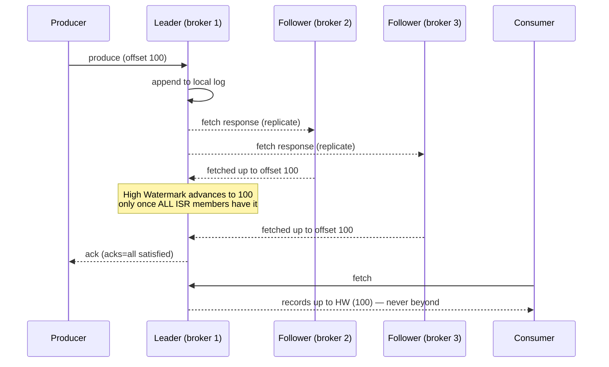

The **High Watermark (HW)** is the highest offset every in-sync replica (ISR member) has confirmed. A consumer can fetch only up to the HW — **never past it** — so it can never read a message that could vanish if the leader crashed the next instant. This is *why* a message can sit on the leader's disk yet be briefly invisible to consumers: it hasn't finished replicating across the full ISR.

**Memory hook:** *the HW is the "everyone has a copy" checkpoint — Kafka would rather make you wait a few milliseconds than let you read something that isn't safe yet.*

---

## 3. Broker Failure & Leader Election

What actually happens when the broker holding a partition's leader dies mid-write — a question interviewers ask almost every time replication comes up.

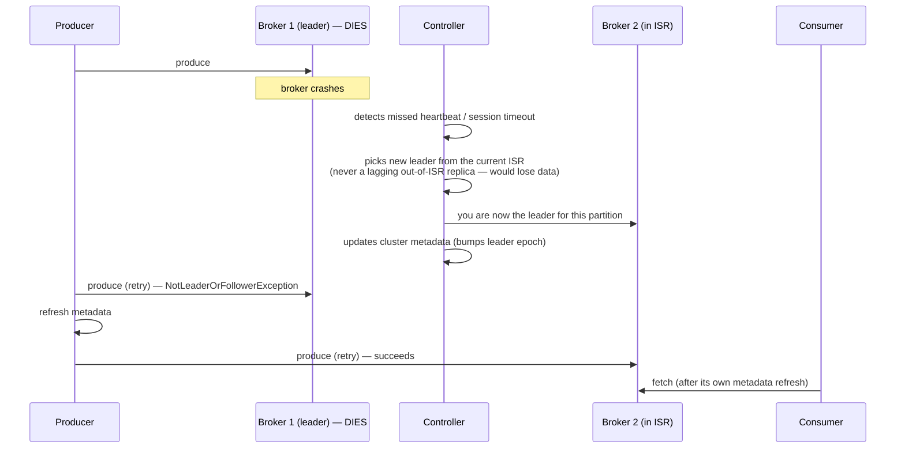

**Why the new leader is always chosen from the ISR:** a replica outside the ISR is, by definition, missing some recently committed messages. Promoting it would silently lose data clients were already told (via `acks=all`) was durable. This is the direct mechanical link between `min.insync.replicas` and "how much data can I lose on a leader failure" — the answer is zero, as long as the ISR was never allowed to shrink below your `min.insync.replicas` floor.

**Leader epoch, briefly:** each new leader election bumps a **leader epoch** number. Clients tag fetches/produces with the epoch they last saw; a stale epoch is rejected — this prevents a "zombie" old leader (one that hasn't yet realized it was demoted, e.g., stuck in a GC pause) from accepting writes after a new leader has already taken over.

### 🆕 Controller failure & re-election (KRaft quorum)

Everything above is about losing the leader of one **partition**. A different question interviewers also ask: what happens if the broker that's currently the **active controller** — the one making all those leader-election decisions — dies?

In KRaft mode, a small set of nodes (typically 3 or 5, an illustrative odd number chosen for quorum math) run as **controllers**, replicating cluster metadata (topic configs, partition-leader assignments, broker liveness) as a Raft log. Only one of them is the **active** controller at a time; the rest are standby voters that already hold a synced copy of the log.

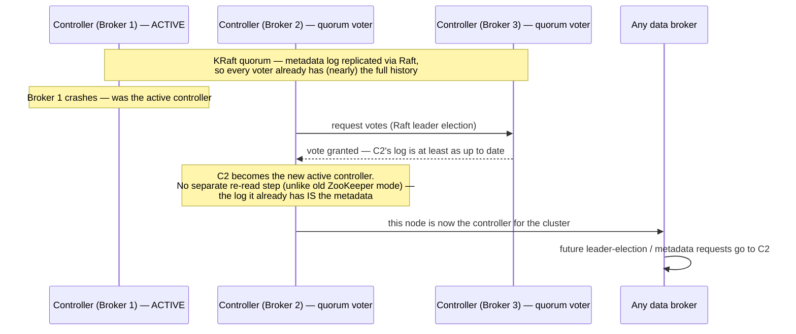

Why this matters in an interview: it's the direct payoff of "no ZooKeeper needed, KRaft handles it" (§ KRaft vs. ZooKeeper above) — controller failover used to mean re-reading state from a separate ensemble; now the new controller just continues from a log it was already replicating. For interview purposes, controller election **is** just a Raft quorum leader election over the metadata log — it isn't a separate protocol from partition leader election, only a different log being elected over.

**Practically:** on a small/local cluster brokers often run in "combined mode" (broker + controller on the same process, as in the docker-compose below). On a real production cluster, dedicate separate controller-only nodes once you're past a handful of brokers — the controller's job (metadata, leader elections) shouldn't compete for CPU/disk with the same node that's also serving live produce/fetch traffic.

---

## 4. Quick Local Cluster (KRaft, No ZooKeeper)

```yaml
# docker-compose.yml — 1-broker KRaft cluster for local experimentation
services:
  kafka:
    image: apache/kafka:3.8.0
    ports:
      - "9092:9092"
    environment:
      KAFKA_NODE_ID: 1
      KAFKA_PROCESS_ROLES: broker,controller
      KAFKA_LISTENERS: PLAINTEXT://:9092,CONTROLLER://:9093
      KAFKA_ADVERTISED_LISTENERS: PLAINTEXT://localhost:9092
      KAFKA_CONTROLLER_LISTENER_NAMES: CONTROLLER
      KAFKA_CONTROLLER_QUORUM_VOTERS: 1@kafka:9093
      KAFKA_LISTENER_SECURITY_PROTOCOL_MAP: CONTROLLER:PLAINTEXT,PLAINTEXT:PLAINTEXT
```

```bash
docker compose up -d
```

---

## 5. Creating Topics — The Right Way

```bash
kafka-topics.sh --bootstrap-server localhost:9092 --create \
  --topic orders.order.created \
  --partitions 12 \
  --replication-factor 3 \
  --config min.insync.replicas=2 \
  --config retention.ms=604800000 \
  --config cleanup.policy=delete \
  --config compression.type=zstd
```

| Flag | What it decides | Rule of thumb |
|---|---|---|
| `--partitions` | Parallelism ceiling (max concurrent consumers per group) and per-topic write throughput | `peak_throughput_MB_s / ~10 MB_s_per_partition`, then round up for headroom + target consumer count. **Decide generously — growing later is painful (see §12).** |
| `--replication-factor` | Durability / fault tolerance | 3 is the standard default (survives 1 broker loss with quorum, 2 with best-effort) |
| `min.insync.replicas` | How many replicas must ack before `acks=all` succeeds | Set to `replication.factor - 1` (e.g., 2 of 3) so you tolerate one broker loss without blocking writes |
| `retention.ms` | How long messages live regardless of consumption | Business-driven; 7 days (`604800000`) is a common default |
| `cleanup.policy` | `delete` (age-based) vs `compact` (keep latest value per key forever) | `delete` for event streams; `compact` for "latest state per key" topics (e.g., a changelog of `user_id → current profile`) |
| `compression.type` | Codec for on-disk + on-wire compression | `zstd` or `lz4` — near-free throughput/storage win |

**Topic naming convention worth adopting:** `<domain>.<entity>.<event>` (e.g., `orders.order.created`, `payments.invoice.paid`). Unnamed/ad-hoc topic names are one of the top sources of "which team owns this and what's in it" chaos at scale — decide the convention before the first topic ships.

**Changing partition/replication settings after creation:**
```bash
# Increase partitions (ONE-WAY — you cannot decrease partitions on a topic)
kafka-topics.sh --bootstrap-server localhost:9092 --alter --topic orders.order.created --partitions 24

# Change a config value
kafka-configs.sh --bootstrap-server localhost:9092 --entity-type topics --entity-name orders.order.created \
  --alter --add-config retention.ms=1209600000
```

---

## 6. Choosing a Partition Key — the Decision That Matters Most

This is the single highest-leverage decision in a Kafka design and the one interviewers probe hardest.

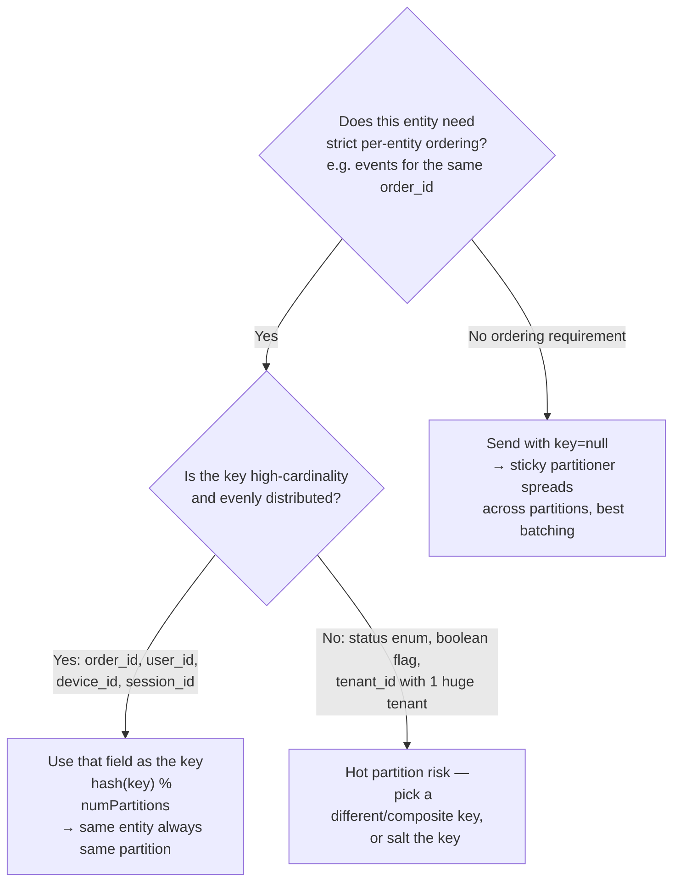

| Key choice | Cardinality | Result |
|---|---|---|
| `order_id` | High, evenly spread | Good — even distribution, and all events for one order stay ordered |
| `user_id` | High, but a few power users generate huge volume | Mostly good — watch for hot partitions from outlier users |
| `status` (`"pending"`, `"shipped"`, ...) | Very low (a handful of values) | **Bad** — all `"pending"` events pile into one partition |
| `tenant_id` where one tenant is 80% of traffic | Skewed | **Bad** — that tenant's partition becomes a bottleneck; consider a composite key like `tenant_id + "-" + hash(user_id) % N` to spread one tenant's load across several partitions while still keeping per-user order |
| `null` (no key) | N/A | Fine when you don't need per-entity order — modern producers use a **sticky partitioner**: batch to one partition for a while, then switch, for better batching efficiency than pure round-robin |

**Producer code — sending with a key:**
```java
// All events for the same customerId land on the same partition → ordered per customer
producer.send(new ProducerRecord<>("orders.order.created", order.getCustomerId(), order.toJson()));
```

**Custom partitioner** (only needed when the default `hash(key) % numPartitions` isn't good enough — e.g., you need to route by a *derived* field):
```java
public class TenantAwarePartitioner implements Partitioner {
    @Override
    public int partition(String topic, Object key, byte[] keyBytes,
                          Object value, byte[] valueBytes, Cluster cluster) {
        int numPartitions = cluster.partitionsForTopic(topic).size();
        Order order = (Order) value;
        // Spread one large tenant across several partitions while keeping per-user order
        String compositeKey = order.getTenantId() + "-" + (order.getUserId().hashCode() % 4);
        return Math.abs(compositeKey.hashCode()) % numPartitions;
    }
    @Override public void configure(Map<String, ?> configs) {}
    @Override public void close() {}
}
```

**Memory hook:** *the partition key is the ordering promise you're making — pick the field whose order actually matters to the business, and check its cardinality before you commit to it.*

---

## 7. Producer Configuration for Production

```java
Properties props = new Properties();
props.put("bootstrap.servers", "broker1:9092,broker2:9092,broker3:9092");
props.put("key.serializer", "org.apache.kafka.common.serialization.StringSerializer");
props.put("value.serializer", "org.apache.kafka.common.serialization.StringSerializer");

// Durability
props.put("acks", "all");                    // wait for min.insync.replicas
props.put("enable.idempotence", "true");     // dedupes retried sends — avoids duplicate writes
props.put("retries", Integer.MAX_VALUE);
props.put("max.in.flight.requests.per.connection", "5"); // safe with idempotence enabled

// Throughput
props.put("linger.ms", "10");                // wait up to 10ms to batch more messages
props.put("batch.size", "32768");            // 32KB batches
props.put("compression.type", "zstd");

KafkaProducer<String, String> producer = new KafkaProducer<>(props);

producer.send(
    new ProducerRecord<>("orders.order.created", order.getCustomerId(), order.toJson()),
    (metadata, exception) -> {
        if (exception != null) {
            log.error("Send failed for customer {}", order.getCustomerId(), exception);
        }
    }
);
producer.flush(); // ensure buffered records are sent before shutdown
```

| Config | Production value | Why |
|---|---|---|
| `acks` | `all` | Only setting that actually honors `min.insync.replicas` — `acks=1` can silently lose data on leader crash |
| `enable.idempotence` | `true` | Prevents duplicate writes when the producer retries a send that actually succeeded but the ack was lost |
| `compression.type` | `zstd` or `lz4` | Free throughput — see the main FAANG guide's batching/compression section |
| `linger.ms` + `batch.size` | Tune together | Trades a few ms of latency for far fewer, larger network writes |

**How `enable.idempotence` actually prevents duplicates — Producer ID + sequence numbers:**

```mermaid
sequenceDiagram
    participant Producer
    participant Broker

    Producer->>Broker: InitProducerId
    Broker-->>Producer: PID = 77
    Producer->>Broker: produce (PID=77, partition=3, seq=5)
    Broker->>Broker: append; record last seq seen = 5 for (PID=77, partition=3)
    Note over Producer,Broker: network blip — producer never received the ack
    Producer->>Broker: retry produce (PID=77, partition=3, seq=5)
    Broker->>Broker: seq=5 already seen for (PID=77, partition=3) — DISCARD, don't re-append
    Broker-->>Producer: ack (success)
    Note over Producer: producer sees success either way — never even knows a retry happened
```

Each producer instance gets a broker-assigned **Producer ID (PID)** and keeps a per-partition, monotonically increasing **sequence number**. The broker remembers the last committed sequence number per (PID, partition) and silently drops any duplicate — this is what makes retries safe without the producer ever de-duplicating itself. **This alone gives you idempotent *writes*, not exactly-once *processing*** — for a full read-process-write pipeline, you need transactions, next.

---

## 8. Exactly-Once Semantics: Transactions (Read-Process-Write)

`enable.idempotence=true` guarantees a single producer can't create a duplicate **write**. It says nothing about a **read-process-write** pipeline (consume from topic A, process, produce to topic B) where "commit my consumed offset" and "publish my output" are two separate operations that can fail independently — exactly the problem Kafka's transactional API (and Kafka Streams, internally) solves.

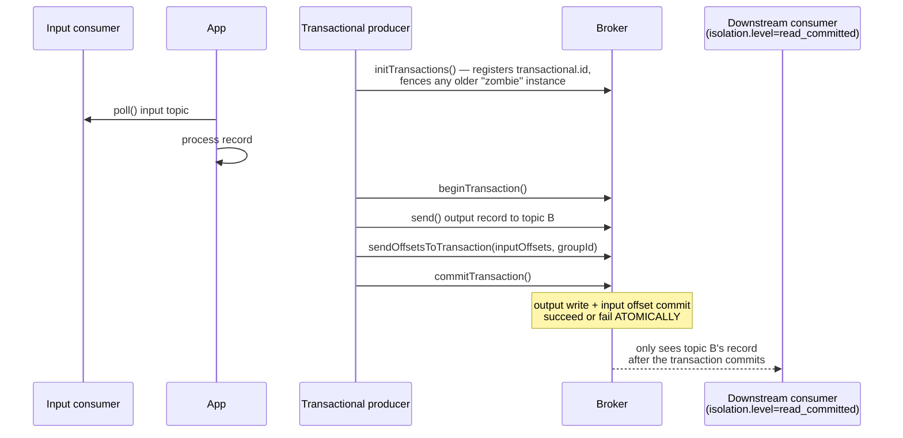

```java
producer.initTransactions();
try {
    producer.beginTransaction();
    producer.send(new ProducerRecord<>("orders.enriched", key, enrichedValue));
    producer.sendOffsetsToTransaction(currentOffsets, consumerGroupMetadata);
    producer.commitTransaction();
} catch (Exception e) {
    producer.abortTransaction();
}
```

```java
// Downstream consumers must opt in to see only committed data
consumerProps.put("isolation.level", "read_committed");
```

| Piece | What it does |
|---|---|
| `transactional.id` | Identifies this producer across restarts; lets the broker fence off a stale/zombie instance of the same producer via an epoch bump |
| `sendOffsetsToTransaction` | The key trick — commits the **input** offset and the **output** write in the same atomic transaction, so a crash can't leave you having consumed input without producing output, or vice versa |
| `isolation.level=read_committed` | Downstream consumers skip records from aborted transactions entirely — without this, they'd see "uncommitted" writes that later got rolled back |

**Cost:** transactions add latency (extra broker round trips, `transaction.timeout.ms` bookkeeping) — reserve them for pipelines where a duplicate or half-applied write is a real business problem (ledgers, billing). For general-purpose event processing, at-least-once + idempotent consumers is cheaper and usually sufficient.

---

## 9. Consumer & Consumer Group Configuration

```java
Properties props = new Properties();
props.put("bootstrap.servers", "broker1:9092,broker2:9092,broker3:9092");
props.put("group.id", "order-processors");
props.put("key.deserializer", "org.apache.kafka.common.serialization.StringDeserializer");
props.put("value.deserializer", "org.apache.kafka.common.serialization.StringDeserializer");

props.put("enable.auto.commit", "false");            // commit manually, after processing succeeds
props.put("auto.offset.reset", "earliest");          // what to do with no committed offset yet
props.put("max.poll.records", "500");                // batch size per poll()
props.put("max.poll.interval.ms", "300000");          // ceiling for processing time between polls
props.put("partition.assignment.strategy",
    "org.apache.kafka.clients.consumer.CooperativeStickyAssignor"); // incremental rebalancing

KafkaConsumer<String, String> consumer = new KafkaConsumer<>(props);
consumer.subscribe(Collections.singletonList("orders.order.created"));

while (true) {
    ConsumerRecords<String, String> records = consumer.poll(Duration.ofMillis(500));
    for (ConsumerRecord<String, String> record : records) {
        process(record); // must be idempotent — see the "at-least-once" section in the main guide
    }
    consumer.commitSync(); // commit only after the whole batch is actually processed
}
```

| Config | Why it matters |
|---|---|
| `enable.auto.commit=false` + manual `commitSync()` | Auto-commit on a timer can commit an offset for a message you haven't finished processing yet — a crash right after loses that message silently. Commit only after processing succeeds. |
| `CooperativeStickyAssignor` | Only reassigns the *moved* partitions during a rebalance instead of pausing the whole group — directly the "incremental/cooperative rebalancing" point from the main FAANG guide |
| `max.poll.interval.ms` | If your processing takes longer than this between `poll()` calls, the broker assumes the consumer is dead and triggers a rebalance — size this to your worst-case batch processing time |

**Throughput/latency tuning — the consumer-side mirror of producer batching:**

| Config | What it does | Trade-off |
|---|---|---|
| `fetch.min.bytes` | Broker waits until this much data is available before responding to a fetch | Higher = fewer, bigger fetches = better throughput |
| `fetch.max.wait.ms` | ...but never waits longer than this, even if `fetch.min.bytes` isn't met | Caps the latency `fetch.min.bytes` can add — the consumer-side equivalent of the producer's `linger.ms` |

**Kafka's internal consumer group rebalance protocol** — the actual state machine the Group Coordinator runs, which is what's really happening every time a consumer joins or leaves:

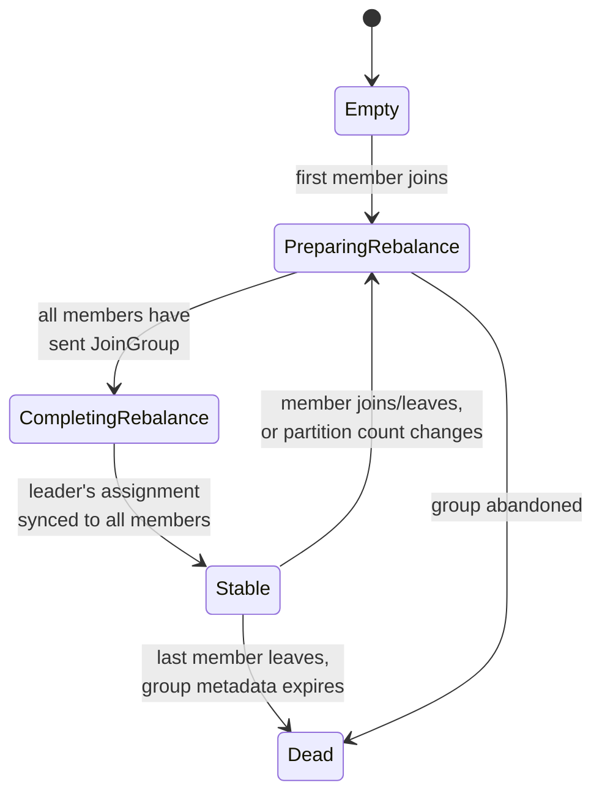

With the classic (`eager`) assignor, **every** member gives up **all** its partitions during `PreparingRebalance`, even ones it keeps afterward — the whole group stalls momentarily. `CooperativeStickyAssignor` changes this: members keep the partitions they're keeping, and only the specific moved partitions pause — the practical reason to set it explicitly rather than relying on the older default.

---

## 10. Multi-Region / Multi-Datacenter Deployment

### Within a region: rack (AZ) awareness

Set `broker.rack` in each broker's config to its availability zone. Kafka then places replicas of a partition across *different* racks automatically, so one AZ failure doesn't take out every replica of a partition.

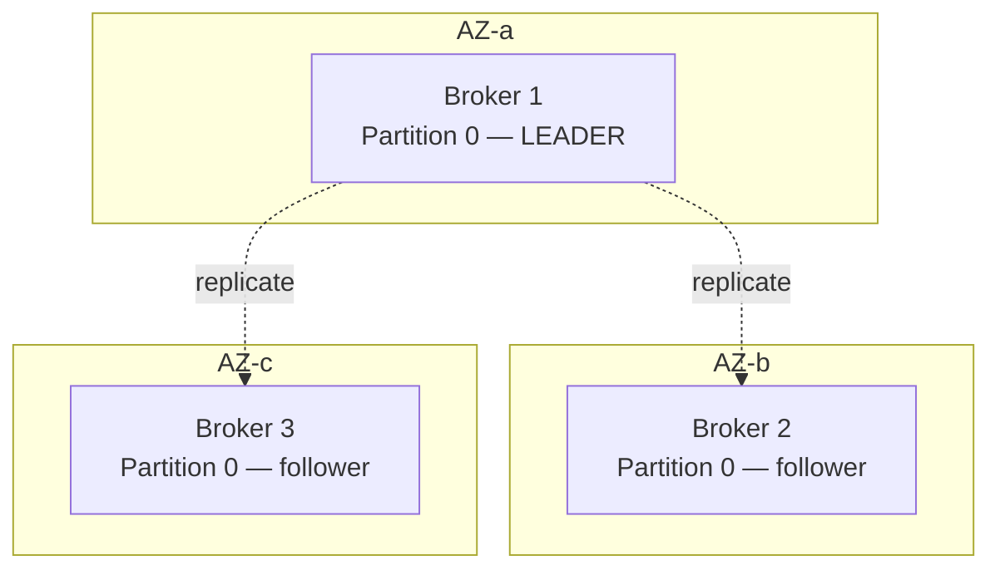

```properties
# server.properties on the broker running in AZ-b
broker.rack=us-east-1b
```

### Across regions: do NOT stretch one cluster over a WAN

Kafka's replication protocol assumes low, consistent latency between brokers. A single cluster spanning regions means every `acks=all` write waits on a cross-region round trip (50–150 ms) — this kills throughput and turns any network blip into replication lag or unavailability. **Say this explicitly if asked "how do you make Kafka global" — the naive answer (one big cluster) is a trap.**

The real answer is **one independent cluster per region, connected by async replication**:

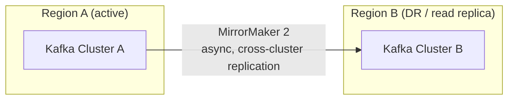

```properties
# mm2.properties — MirrorMaker 2 config: replicate region A → region B
clusters = A, B
A.bootstrap.servers = brokerA1:9092,brokerA2:9092
B.bootstrap.servers = brokerB1:9092,brokerB2:9092

A->B.enabled = true
A->B.topics = orders\..*        # regex — only mirror the "orders.*" domain

replication.factor = 3
sync.topic.configs.enabled = true
emit.heartbeats.enabled = true   # lets you measure replication lag
```

| Pattern | Topology | Use when |
|---|---|---|
| **Active-passive (DR)** | One region takes all writes; MirrorMaker 2 replicates to a standby region | Disaster recovery — standby is promoted only on a regional outage |
| **Active-active** | Both regions take local writes to region-scoped topics, replicated both ways | Lower write latency per region — but **you must design around it**: offsets don't translate 1:1 across clusters, so consumers can't just "fail over" and resume from the mirrored offset without extra bookkeeping (MM2 emits offset-mapping topics for this, but it adds real complexity) |
| **Stretched cluster** | One cluster, brokers physically in multiple regions | **Avoid** — this is the mistake, not a real option, for anything but two AZs a few ms apart |

**Golden rule to say out loud:** *replicate between independent regional clusters asynchronously; never stretch one Kafka cluster's synchronous replication across a WAN.*

---

## 11. Schema Management

Kafka stores bytes — it has no opinion on message structure. In production, pair it with a **Schema Registry** (Confluent Schema Registry, or open alternatives) and Avro/Protobuf:

```java
props.put("value.serializer", "io.confluent.kafka.serializers.KafkaAvroSerializer");
props.put("schema.registry.url", "http://schema-registry:8081");
```

| Compatibility mode | Rule | Use when |
|---|---|---|
| `BACKWARD` | New schema can read old data | Default choice — consumers upgrade before producers |
| `FORWARD` | Old schema can read new data | Producers upgrade before consumers |
| `FULL` | Both directions | Safest, most restrictive — required when producers and consumers deploy independently and you can't control order |

---

## 12. Common Mistakes to Avoid

| Mistake | Why it hurts | Fix |
|---|---|---|
| **Assuming `enable.idempotence` alone gives exactly-once processing** | It only dedupes retried writes from one producer — a read-process-write pipeline can still double-publish output or lose an offset commit on crash | Use transactions (`transactional.id` + `sendOffsetsToTransaction`, §8) when a duplicate or half-applied write across two topics is unacceptable |
| **Not monitoring under-replicated partitions / ISR shrink** | A shrinking ISR silently erodes your durability margin — by the time `min.insync.replicas` can't be met, writes start failing with no earlier warning | Alert on `UnderReplicatedPartitions` and ISR shrink/expand rate, not just broker-up/down |
| **Too few partitions at launch** | You can grow partitions, but growing changes `hash(key) % numPartitions` for every key — existing per-key ordering guarantees break the moment you add partitions | Size generously up front for 12–24 months of growth; treat repartitioning as a planned migration (new topic + dual-write/backfill), not a config change |
| **Thousands of tiny partitions "just in case"** | Each partition costs open file handles, memory, and replication overhead on every broker; excess partitions slow down leader election and controller failover | Size from the throughput/parallelism formula, not from "more must be safer" |
| **`acks=all` without setting `min.insync.replicas`** | Default `min.insync.replicas=1` means `acks=all` degrades to "just the leader" the moment one replica falls out of sync — a false sense of durability | Explicitly set `min.insync.replicas = replication.factor - 1` |
| **Blind `enable.auto.commit=true`** | Commits offsets on a timer regardless of whether processing finished — crash mid-batch either loses messages (committed-but-unprocessed) or silently reprocesses them depending on timing | Manual commit after confirmed processing; idempotent consumers regardless |
| **Skipping `enable.idempotence=true`** | A retried send after a lost ack can create a genuine duplicate write, not just a redelivered read | Idempotent producer is nearly free — enable it by default |
| **Low-cardinality or skewed partition key** | Hot partition — one partition (and its leader broker) takes disproportionate load while siblings sit idle | Check key cardinality before committing; salt/composite-key skewed keys |
| **Stretching one cluster across regions** | Every synchronous write pays cross-region latency; a network blip becomes a full replication stall | Independent per-region clusters + MirrorMaker 2 async replication |
| **Ignoring consumer lag** | Silent backlog growth until an SLA breach is the first signal anyone notices | Alert on consumer group lag and age-of-oldest-unconsumed-message, not just broker health |
| **No topic naming convention** | Ownership and discoverability collapse once you have hundreds of topics | Adopt `<domain>.<entity>.<event>` (or similar) before topic #2 |
| **Treating `compact` and `delete` cleanup policies as interchangeable** | `compact` keeps the *latest value per key forever* (a changelog), not a time-bounded event log — using it for an event stream silently drops history you expected to keep | `delete` for event streams, `compact` only for "current state per key" topics |
| **No capacity plan for retention × throughput growth** | Disk fills up gradually until a broker hits a critical-disk alert or, worse, crashes with no free space | Do the disk-sizing math up front (§13) and watch the *trend* of disk usage, not just its current value |
| **"Big bang" restart of every broker at once during an upgrade** | Kills availability for any partition whose replicas all bounce together — self-inflicted version of the multi-broker-outage scenario you'd never accept from an actual failure | Roll one broker at a time; wait for under-replicated partitions to hit 0 before touching the next (§15) |

---

## 13. 🆕 Capacity Planning — Sizing Disks, Network, and Partitions

Everything in this section answers one interview question: *"how do you size a Kafka cluster before you launch it?"* The honest answer is arithmetic, not intuition — and interviewers notice when a candidate can actually do the math instead of waving at "add more brokers."

### Disk: throughput × retention × replication factor

The formula is simple; people just forget the replication-factor multiplier:

```
disk needed for one topic ≈ throughput (bytes/sec) × retention (sec) × replication factor
```

**Worked example (illustrative numbers):** a topic ingests 50 MB/sec and is retained for 7 days, replication factor 3.

- One replica's worth of data: `50 MB/s × 604,800 s ≈ 30 TB`.
- With RF=3, the *cluster* needs roughly `30 TB × 3 = 90 TB` total — three independent 30 TB copies, living on three different brokers.
- Add ~20–30% headroom on top (index files, the currently-active unsealed segment, in-flight compaction temp files) — running any disk near 100% is how you get stuck mid-incident with no room to even roll a new segment.
- A broker with a 2 TB disk obviously can't hold a 30 TB replica of this topic alone. Your real options are: shorten retention, spread the topic's partitions across more/bigger-disk brokers, or use **tiered storage** (Kafka's built-in tiered storage in newer versions, or a custom job that offloads sealed segments to S3/GCS) so only recent data stays on local disk while older segments move to cheap object storage.

This is the concrete version of the "retention vs. disk cost" trade-off: every extra day of retention on a 50 MB/s topic costs roughly another ~4.3 TB of *replicated* disk (`50 MB/s × 86,400 s × 3`), not ~1.4 TB — forgetting the RF multiplier is the single most common capacity-planning mistake.

### Network: don't forget replication and fan-out reads

A leader broker's network egress isn't just what producers send it — it also replicates to every follower and serves every independent consumer group's fetches:

```
egress ≈ produce_rate × (replication_factor − 1)   [replication to followers]
        + produce_rate × number_of_consumer_groups  [each group re-reads the full stream]
```

**Worked example (illustrative):** a broker leads partitions ingesting 50 MB/s total, RF=3, and three independent consumer groups read the topic (a real-time processor, an analytics ETL job, an audit logger).

- Ingress from producers: 50 MB/s.
- Replication egress to 2 followers: `50 × 2 = 100 MB/s`.
- Consumer fetch egress: `50 × 3 = 150 MB/s`.
- Total egress ≈ 250 MB/s, on top of the 50 MB/s ingress. A 1 Gbps NIC tops out around 125 MB/s — this broker would already be oversubscribed. Busy brokers need multiple bonded NICs or 10 Gbps+ links, sized from this kind of fan-out math, not from the raw producer throughput alone.

### Partitions per broker

Partition *count per topic* is covered in §5 (`throughput ÷ ~10 MB/s per partition`, an illustrative per-partition ceiling that varies with hardware). The capacity-planning question on top of that is **how many total partitions can one broker hold** across all topics.

Each partition costs the broker open file handles (each segment is at least one, usually two, open files), some JVM heap and page-cache bookkeeping, and — critically — replication/metadata overhead that controller failover and leader elections have to iterate over. As an illustrative ceiling: keeping a broker under roughly a few thousand partitions (exact safe number depends on hardware, heap size, and Kafka version — check current docs rather than trusting a hard number) keeps controller failover and restarts fast. This is the mechanical reason "thousands of tiny partitions just in case" (§12) is a real production hazard, not just a style nitpick — it's this same budget, just approached from the "too many, too small" direction instead of the disk direction.

| Dimension | Formula | Illustrative worked number |
|---|---|---|
| Disk per topic (cluster-wide) | `throughput × retention × RF` | 50 MB/s × 7 days × RF3 ≈ 90 TB |
| Extra disk per extra day of retention | `throughput × 86,400s × RF` | ≈ 4.3 TB/day at 50 MB/s, RF3 |
| Broker network egress | `produce_rate × (RF−1) + produce_rate × #consumer groups` | 50 MB/s in → ~250 MB/s out (RF3, 3 groups) |
| Partitions per broker | keep well under hardware/version-specific ceiling | low thousands, illustrative — verify per version |

**Memory hook:** *multiply by replication factor for disk, multiply by (RF−1) **plus** every consumer group for network — the two most underestimated numbers in a Kafka capacity plan.*

---

## 14. 🆕 Operational Metrics — What to Watch, and Alert Thresholds

A Kafka dashboard that only shows "brokers up/down" will miss almost every real incident — durability and availability erode gradually (a shrinking ISR, creeping lag, a filling disk) well before anything actually goes offline. These are the numbers that catch it early.

| Metric | What it means | Healthy | Warning | Critical |
|---|---|---|---|---|
| **Consumer lag** (records behind) | Produced offset minus committed offset, per partition | Near 0, or spikes that recover within seconds/minutes | Growing steadily over several minutes | Growing for 15+ minutes with no recovery signal — see §16 |
| **Under-replicated partitions (URP)** | Partitions whose ISR is smaller than the replication factor | 0 | Briefly > 0 during a planned rolling restart | > 0 sustained outside a planned restart |
| **Offline partitions** | Partitions with no leader at all | 0 | — (there's no acceptable "warning" state here) | Any value > 0 — immediate incident, that partition can't be read or written |
| **ISR shrink/expand rate** | How often replicas fall out of and back into the ISR | Near 0 | Occasional blips (GC pause, transient network hiccup) | Frequent, recurring shrink-expand cycles on the same broker — usually an overloaded or flaky node |
| **Request latency, p99** (produce/fetch) | Broker-side time to handle a request | Single-digit ms | Tens of ms | Hundreds of ms+ — disk, GC, or CPU backpressure |
| **Broker disk usage** | How full each broker's log volume is | < 70% | 70–85% | > 85% — risk of failed segment rolls and, eventually, an out-of-disk crash |
| **Active controller count** (cluster-wide) | Should be exactly 1 at all times | 1 | — | 0 (no active controller) or > 1 (split-brain) sustained for more than a few seconds |
| **MirrorMaker 2 replication lag** (§10) | How far behind the DR/other-region cluster is | Seconds | Tens of seconds to low minutes | Growing/unbounded — check the MM2 connector and inter-region network |

Numbers above are illustrative starting points, not universal SLAs — calibrate the exact thresholds to your own traffic patterns and SLAs, but the *shape* (0 tolerance on offline partitions and controller count; trend-watching on lag, URP, and disk) generalizes.

**Memory hook — five graphs, five fingers:** if a dashboard only has room for five panels, make them **Lag, URPs, p99 latency, Disk %, Active-controller-count**. The first three tell you the cluster is keeping up; the last two tell you it's still structurally sound.

---

## 15. 🆕 Rolling Upgrades & Restarts Without Downtime

Kafka is built to tolerate one broker disappearing at a time — that's the entire point of replication. A rolling upgrade just does *on purpose, one broker at a time, with a health check between each step* what a real single-broker failure does by accident.

### The procedure

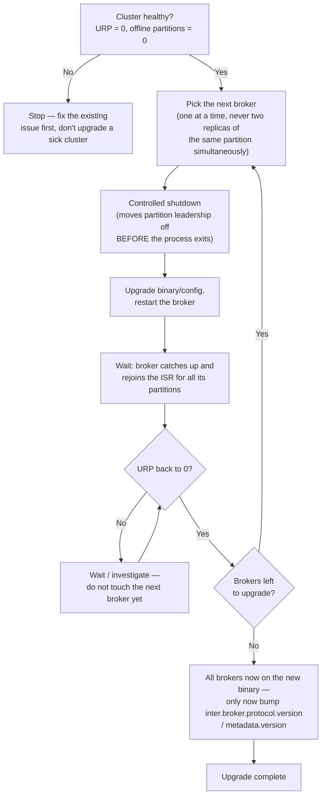

**Why controlled shutdown, specifically:** killing a broker with `SIGKILL` (or a hard crash) forces the controller to *detect* the failure via a missed heartbeat/session timeout before it can move leadership elsewhere — a real, if brief, gap where that broker's partitions are leaderless. A **controlled shutdown** (`controlled.shutdown.enable=true`, the default) tells the broker to proactively hand off leadership for all its partitions to another ISR member *before* it actually stops — the difference between a planned, near-zero-disruption step and a mini-outage on every restart.

**The two-phase protocol-version bump** exists as a rollback safety net: as long as `inter.broker.protocol.version` / `metadata.version` is still pinned to the old value, every broker — old binary or new — speaks the same wire/metadata format, so you can pause mid-rollout or even roll back a broker to the old binary if something looks wrong. Only after *every* broker is confirmed running the new binary do you bump the protocol version — that step is one-way, the same way growing partitions is (§12).

**Clients don't need to upgrade in lockstep with brokers** — Kafka brokers support older client protocol versions, so producers/consumers can lag the broker upgrade. Always check the specific release's upgrade notes for exceptions (deprecated configs, removed metrics) before assuming this holds for every version jump.

---

## 16. 🆕 Production Incident Playbook — Diagnosing the Three Most Common Pages

Three alerts account for most Kafka on-call pages. Each has a small decision tree that gets you to root cause faster than guessing.

### Consumer lag alert

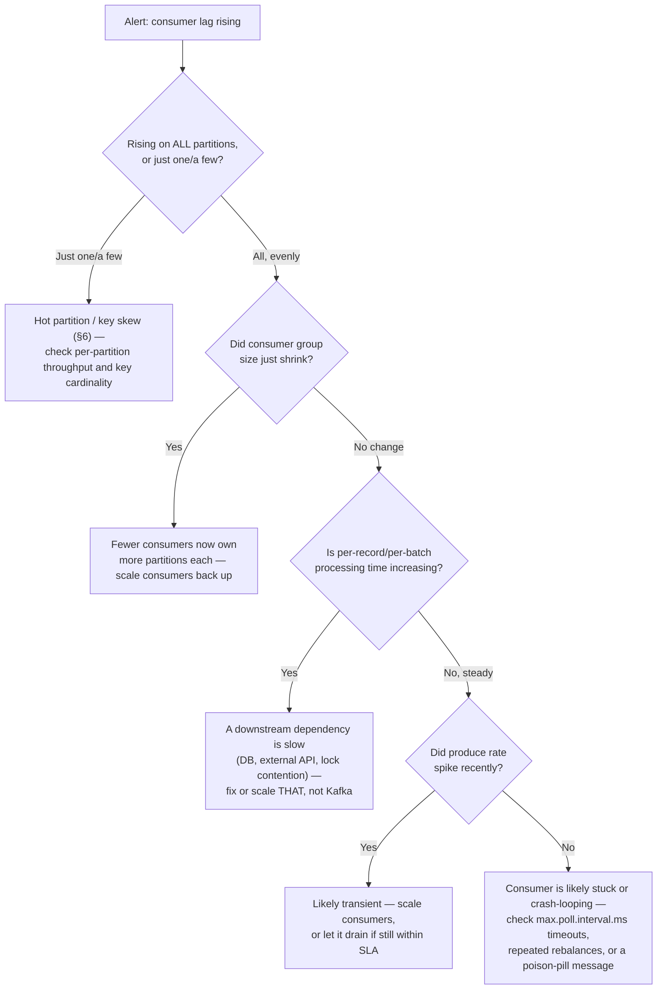

**Telling a blip from a real incident, with numbers:** a lag of 50K messages that drops back to 5K within a minute of a deploy finishing is normal catch-up, not an incident. A lag growing by **10K messages/minute for 15+ minutes with no recovery signal** is not a blip — at that rate it will keep growing until someone intervenes, whether that's scaling consumers, fixing a slow downstream call, or killing a stuck consumer instance.

### Disk approaching full

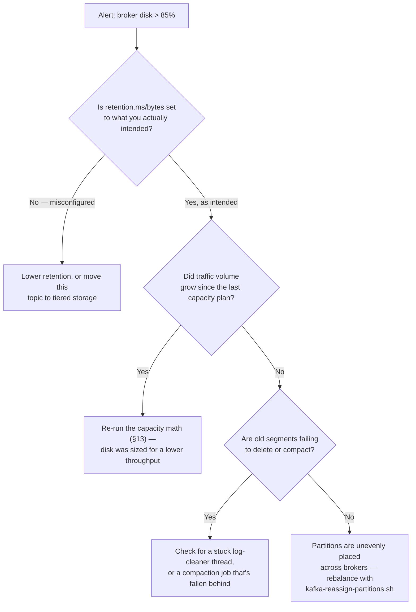

**Numbers before firefighting:** a broker with a 2 TB disk retaining 7 days of a 50 MB/s topic needs ~30 TB just for that one topic's replica (§13's math) — if a broker on 2 TB disks is at 85% and climbing, that's very likely a disk that was simply never sized for this retention/throughput combination, not a mysterious leak. Do the arithmetic before you start chasing "phantom" disk usage.

### Hot partition / partition skew

This one's fully covered as a design-time decision in §6 (the partition-key decision tree) — the production-incident version is just recognizing the same symptom live:

| Symptom | Likely root cause | Fix |
|---|---|---|
| One broker's CPU/network far above its peers, same partition count as everyone else | That broker leads a hot partition from a skewed/low-cardinality key | Composite or salted key (§6) |
| Lag on exactly one partition while siblings are fine | Same | Same |
| Lag rising on every partition, roughly proportionally | **Not** a hot-partition issue — use the consumer-lag tree above instead | — |

**Memory hook:** *one broker glowing red while its neighbors idle = a key problem (§6); every broker/partition degrading together = a capacity or consumer problem (above) — they look similar on a dashboard but have opposite fixes.*

---

## Golden Rules

- **The High Watermark, not the leader's disk, defines what's readable** — a message can be durably written and still briefly invisible to consumers; that's replication safety, not a bug.
- **A new leader is only ever elected from the ISR** — never from a lagging replica, or `acks=all`'s durability promise would be a lie.
- **Idempotence stops duplicate writes; transactions stop half-applied pipelines** — they solve different problems, and most systems only need the first one.
- **Partition count is a one-way door** — it can grow, but growing it silently changes which partition every existing key maps to.
- **Compaction is a changelog, not a retention policy** — never point `cleanup.policy=compact` at a topic you expect to replay as a full event history.

---

## How This Shows Up in a FAANG Interview

- "What happens if the leader dies right after a producer sends a message?" → leader-election-from-ISR + leader epoch fencing (§3).
- "Why might a consumer not see a message immediately after the producer got an ack?" → the High Watermark hasn't advanced yet (§2).
- "How do you get exactly-once in Kafka?" → distinguish idempotent producer (dedup one producer's writes) from transactions (atomic read-process-write) — naming both, and when each is enough, is the strong answer (§7–§8).
- "How would you reshard/add partitions without breaking per-key ordering?" → you can't do it silently; plan a new topic + backfill, because `hash(key) % N` changes for every key the moment `N` changes (§6).
- "How do you run Kafka across regions?" → independent per-region clusters + MirrorMaker 2 async replication, never one stretched cluster (§10).
- "How much disk do you provision for a topic?" → `throughput × retention × replication factor`, plus ~20–30% headroom — and remember every extra day of retention costs that multiplied-by-RF amount, not the raw per-replica figure (§13).
- "How do you upgrade a live Kafka cluster with zero downtime?" → controlled shutdown (moves leadership off first) + one broker at a time + only bump `inter.broker.protocol.version`/`metadata.version` after every broker is on the new binary (§15).
- "A consumer-lag alert just fired — what do you check first?" → all partitions or just one (hot key vs. real lag), did the group shrink, is per-record processing slowing down, or did produce rate spike — walk the tree, don't guess (§16).

---

## Kafka Cheat Sheet

- **Create:** `kafka-topics.sh --create --partitions N --replication-factor 3 --config min.insync.replicas=2`
- **Partition count** = throughput ÷ ~10 MB/s per partition, rounded up for consumer-parallelism headroom — oversize once, don't repartition later.
- **Partition key** = the field whose order matters to the business, checked for high/even cardinality first.
- **High Watermark:** consumers only ever read up to the offset every ISR member has confirmed — a durability guard, not a delay bug.
- **Leader election:** always from the ISR, fenced by a leader epoch so a "zombie" old leader can't accept stray writes.
- **Producer durability trio:** `acks=all` + `min.insync.replicas` + `enable.idempotence=true`.
- **Idempotence vs. transactions:** idempotence dedupes one producer's retried writes; transactions atomically bind a consumed offset to a produced write — reach for transactions only when a half-applied pipeline is unacceptable.
- **Consumer durability:** manual commit after processing, `CooperativeStickyAssignor` for gentle rebalances (`Empty → PreparingRebalance → CompletingRebalance → Stable`).
- **Region strategy:** one cluster per region + MirrorMaker 2 async replication. Never stretch one cluster over a WAN.
- **Rack awareness:** set `broker.rack` per AZ so replicas of a partition spread across failure domains automatically.
- **Schema safety:** Schema Registry + `BACKWARD`/`FORWARD`/`FULL` compatibility, decided by which side deploys first.
- **Disk sizing:** `throughput × retention × replication factor`, plus ~20–30% headroom — a 50 MB/s topic at 7-day retention, RF3, needs ≈90 TB cluster-wide.
- **Network sizing:** don't forget replication (×(RF−1)) *and* every independent consumer group re-reading the full stream — both add to a leader broker's egress.
- **Five dashboards to always have up:** consumer lag, under-replicated partitions, request p99 latency, broker disk %, active-controller-count (must be exactly 1).
- **Rolling upgrade:** controlled shutdown → one broker at a time → wait for URP=0 → only then bump the protocol/metadata version.
- **Incident triage in one line:** lag on one partition = hot key (§6); lag on all partitions = capacity/slow-consumer (§16); disk filling = redo the retention×RF math (§13); offline partitions = controller/broker down (§3).
