# Apache Kafka as Pub-Sub — Deep Dive & Production Guide

Companion deep-dive to `18-Pub-sub-FAANG-Guide.md`. This file goes past "Kafka
has partitions" into the internals, the exact knobs you configure to create
and shard topics correctly, how real companies run Kafka across regions, and
the specific mistakes that show up in production.

**Framing this file cares about**: Kafka is being treated here strictly as a
**pub-sub system** — one write, many independent readers, replay within
retention — not as a work queue. The queue-like behavior (one message, one
worker) only shows up *inside a single consumer group*; the moment you have
two consumer groups reading the same topic, you're looking at true pub-sub
fan-out. Keep that framing in your head through this whole guide.

## Mental model

Kafka is a **DVR for events, rented out as a broadcast service**. Unlike
Redis Pub/Sub's live radio, every message is recorded to disk *first*, then
served. Every subscriber (consumer group) gets its own "remote" — its own
independent position in the recording — so slow subscribers, new
subscribers, and subscribers that crash and restart all just rewind/resume
without affecting anyone else or the producer.

## How it works internally

### Broker request pipeline

A Kafka broker doesn't process a request the instant it arrives — there's a
pipeline designed to keep the broker responsive even while some requests
(like a `acks=all` produce waiting on replication, or a fetch waiting for
enough new data) are slow.

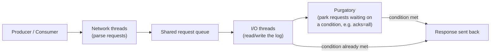

**Purgatory** is the internal name for where "not-yet-satisfiable" requests
wait — e.g., a producer that asked for `acks=all` is parked until every
in-sync replica has confirmed the write, and a consumer `fetch` with
`fetch.min.bytes` set can be parked until enough data accumulates (fewer,
bigger fetches instead of constant tiny ones).

### The log: segments, indexes, and why reads are fast

A partition on disk isn't one giant file — it's a directory of rotating
**segments**, each with a paired sparse index for O(log n) offset lookup
instead of a linear scan.

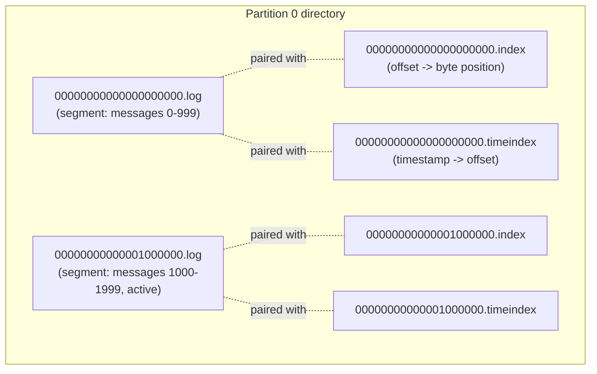

- Segments roll over based on size (`log.segment.bytes`, default 1GB) or age
  (`log.roll.ms`).
- Retention deletes/compacts **whole segment files**, not individual
  messages — this is why retention cleanup is cheap: no per-message
  bookkeeping.
- Kafka deliberately relies on the **OS page cache**, not JVM heap, for
  message data — writes go to the page cache and are flushed by the OS, and
  reads for recent data are served straight from page cache without touching
  disk. This is the single biggest reason Kafka gets away with disk-backed
  storage at very high throughput.
- Consumer fetches use **zero-copy** (`sendfile()`): data goes straight from
  the page cache to the network socket without being copied into the
  broker's user-space/JVM heap first.

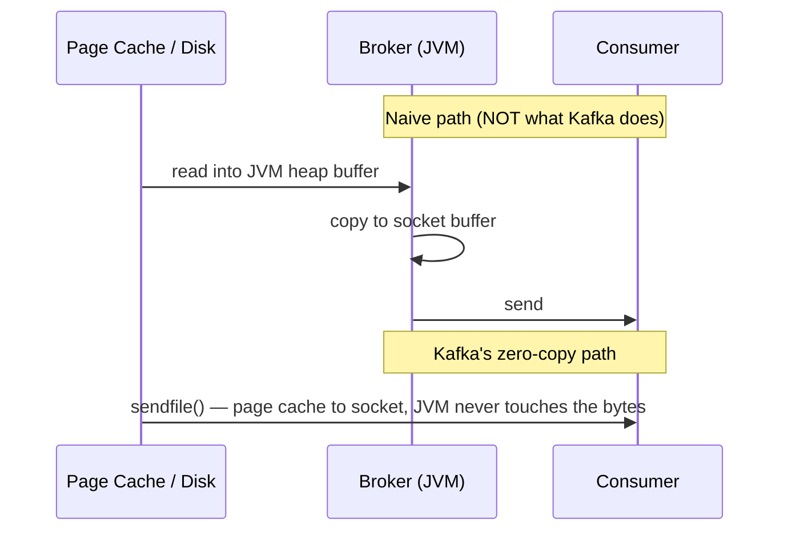

### Replication: leader, ISR, and the controller

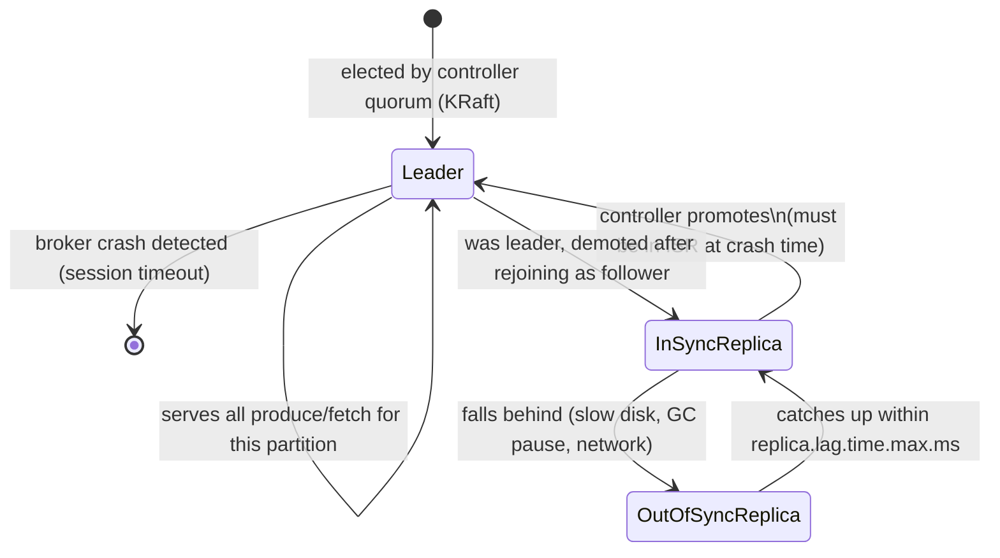

- **ISR (In-Sync Replica set)**: replicas that have fetched up to (within a
  bounded lag of) the leader's log. Only ISR members are eligible for
  leader promotion — promoting a replica outside the ISR would silently
  drop committed messages.
- **`acks=all` + `min.insync.replicas=2`** (with replication factor 3) is the
  standard durable combo: a write is only acknowledged once the leader *and*
  at least one follower have it, so losing any single broker can't lose data.
  `acks=all` with `min.insync.replicas=1` is a trap — it degrades to
  effectively the same guarantee as `acks=1` the moment the ISR shrinks to
  just the leader.
- **Controller (KRaft)**: since Kafka 3.3 (production-ready) and mandatory
  from Kafka 4.0 onward, a quorum of controller nodes (Raft-based) owns
  cluster metadata and leader election, replacing the old ZooKeeper
  dependency — one less distributed system to run in production.

## Creating topics and choosing your partition key

### Creating a topic

```bash
kafka-topics.sh --bootstrap-server localhost:9092 --create \
  --topic orders \
  --partitions 12 \
  --replication-factor 3 \
  --config retention.ms=604800000 \
  --config min.insync.replicas=2
```

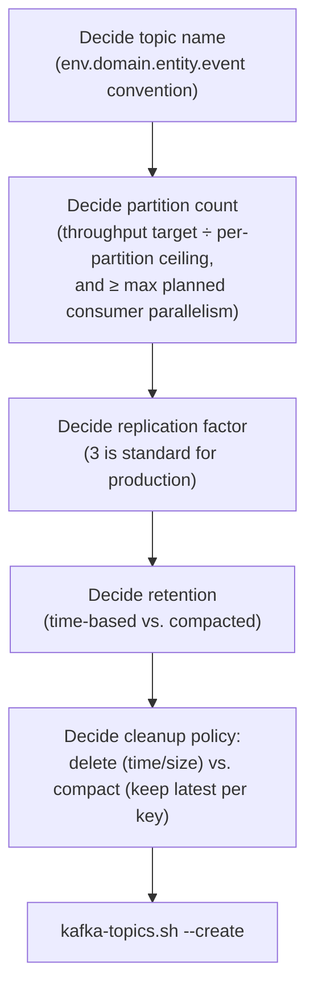

**Naming convention** (borrow this, don't invent one per team):
```
<env>.<domain>.<entity>.<event>
prod.orders.order.created
prod.payments.invoice.paid
staging.notifications.email.sent
```

### Partition key strategy — the decision that determines ordering and hot spots

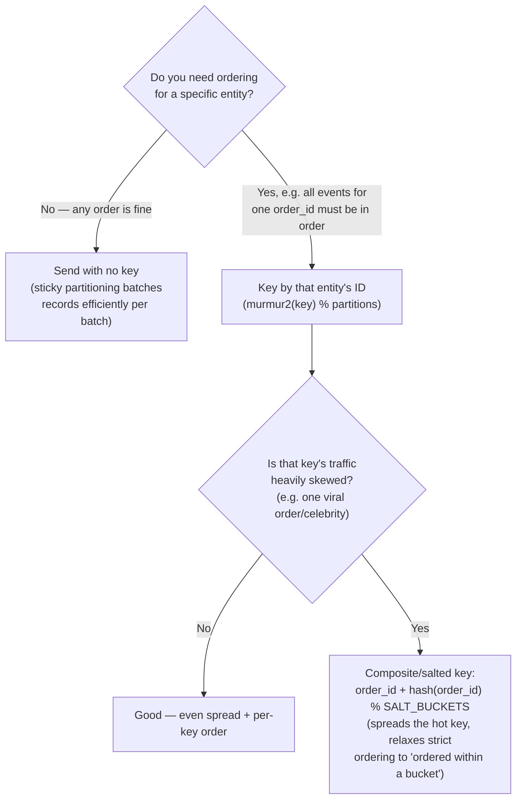

- **No key**: since KIP-480/482, the default partitioner uses **sticky
  partitioning** — it batches all the null-key records arriving in a short
  window into one partition per batch (not pure round-robin per record),
  which produces bigger, more efficient batches without hurting balance over
  time.
- **With a key**: `murmur2(key) % num_partitions` by default. Same key always
  → same partition → strict per-key ordering, at the cost of that key's
  entire load landing on one partition.
- **Hot key mitigation**: salt the key (append a bounded random or
  hash-derived suffix) to spread one overloaded entity across N partitions —
  you trade "strict order for this entity" for "order within each of the N
  buckets," which is usually an acceptable relaxation (e.g., process-then-
  reconcile patterns, or accept bounded reordering for non-financial events).

### Consumer groups — this is where "pub-sub, not queue" actually shows up

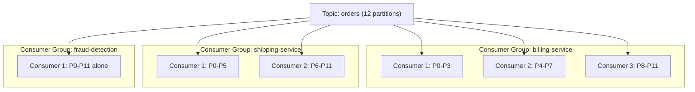

Every one of those three groups gets **every message** on the topic — that's
the pub-sub fan-out. *Within* `billing-service`, the three consumers split
the 12 partitions between them — that's the queue-like load balancing. Same
topic, three independent "queues," each processing the full stream at its
own pace. This diagram is the single best whiteboard artifact for answering
"how is Kafka pub-sub, not just a queue?"

**Producer/consumer code (concise, Python + `confluent-kafka`):**

```python
# Producer — key by order_id for per-order ordering
from confluent_kafka import Producer

p = Producer({"bootstrap.servers": "localhost:9092"})
p.produce("prod.orders.order.created", key="order-42", value='{"status":"created"}')
p.flush()

# Consumer — independent group.id = independent full copy of the stream
from confluent_kafka import Consumer

c = Consumer({
    "bootstrap.servers": "localhost:9092",
    "group.id": "billing-service",          # change this -> new independent subscriber
    "auto.offset.reset": "earliest",
    "partition.assignment.strategy": "cooperative-sticky",
})
c.subscribe(["prod.orders.order.created"])

while True:
    msg = c.poll(1.0)
    if msg is None:
        continue
    print(msg.key(), msg.value())
    c.commit(msg)
```

### Growing a topic's partitions — the ordering gotcha

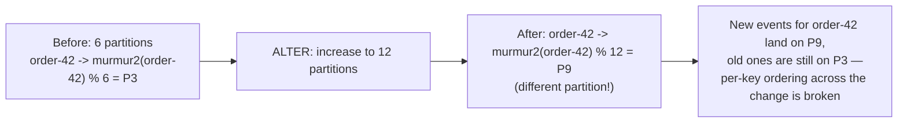

You can only **increase** partition count, never decrease it, and increasing
it changes the `hash % N` result for every existing key — anything relying
on "same key always same partition" breaks across that boundary. Plan
partition count for peak capacity up front; don't casually resize a
production topic that has ordering-sensitive keys.

## Cross-region / multi-datacenter production patterns

### MirrorMaker 2 — the standard replication tool

MirrorMaker 2 (built on Kafka Connect) replicates topics between clusters.
By default it **prefixes replicated topic names with the source cluster
alias** (e.g., `us-west.orders`) specifically to avoid an infinite
replication loop when you wire two clusters to mirror each other.

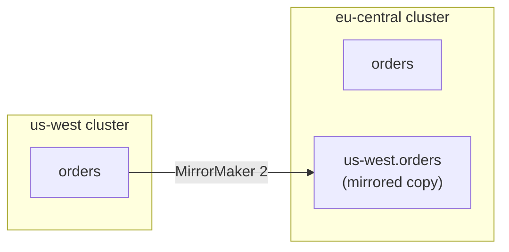

### Active-passive (DR) — the simple, safe default

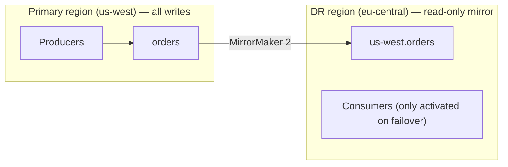

One region writes, the other is a replicated standby promoted only during a
regional failure. Simplest to reason about; the trade-off is the DR region's
compute sits mostly idle.

### Active-active — real fan-out, real complexity

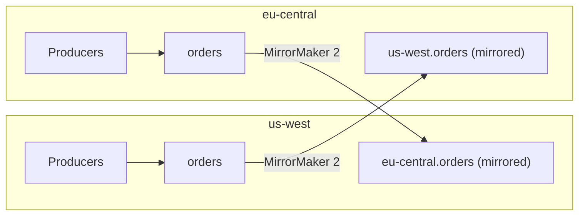

Both regions accept local writes and mirror to each other — lower write
latency for local producers in each region, but now you must handle: topic
name proliferation (`us-west.orders` vs `eu-central.orders` vs local
`orders` — which do consumers actually read?), **offset translation** (an
offset in the mirrored topic isn't the same offset as the source), and
potential **duplicate processing** if a consumer isn't careful about which
copies of a topic it subscribes to.

### The anti-pattern: stretching one cluster across regions

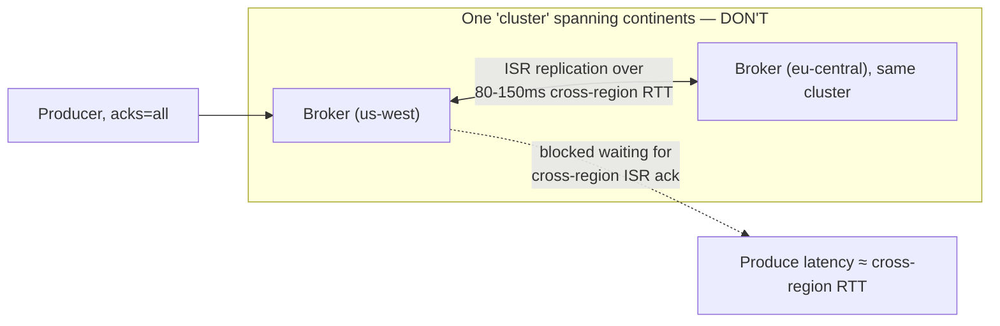

Never spread a single Kafka cluster's brokers across regions. ISR
replication assumes low, LAN-grade latency; putting it over a 80-150ms
cross-region link means every `acks=all` produce pays that full round trip,
and transient cross-region network blips look like broker failures, causing
spurious ISR shrinkage and leader elections. **Run one cluster per region,
replicate between clusters with MirrorMaker 2** — never one cluster spanning
regions.

### Aggregate cluster pattern (for global analytics)

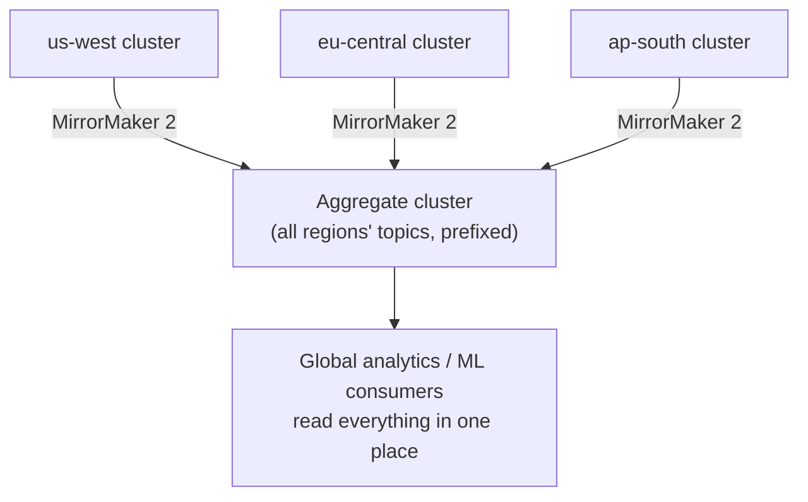

Each region keeps its own local, low-latency cluster for regional producers
and consumers; a separate aggregate cluster collects a mirrored copy of
everything for global consumers (analytics, monitoring) that need the full
picture — without forcing every regional producer to pay cross-region
latency just so a dashboard in one place can see it all.

## Mistakes to avoid

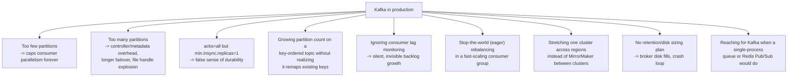

1. **Too few partitions.** Partition count is a hard ceiling on how many
   consumers in a single group can work in parallel — you cannot add a 5th
   parallel consumer to a 4-partition topic; it will sit idle. Size for peak
   planned consumer parallelism, not today's.
2. **Too many partitions.** Every partition costs open file handles (segment
   + index + timeindex files ×replication factor), adds controller metadata
   overhead, and lengthens leader-election/failover time during a broker
   restart. More isn't free — size to the throughput math, not "just use a
   big number to be safe."
3. **`acks=all` with `min.insync.replicas=1`.** This combination silently
   degrades to leader-only durability the instant any follower falls out of
   the ISR — always pair `acks=all` with `min.insync.replicas ≥ 2` (for
   replication factor 3) if durability is the actual goal.
4. **Repartitioning a key-ordered topic without accounting for remapping.**
   Increasing partitions changes `hash(key) % N` for every key — anything
   depending on "same key, same partition, therefore ordered" breaks at that
   boundary. Plan capacity up front instead.
5. **No consumer lag monitoring.** Because pub-sub decouples producer and
   consumer speed by design, a consumer silently falling behind produces no
   error anywhere — until retention expires and it starts losing data. Lag
   must be a first-class, alerted metric, not something you check
   reactively.
6. **Default eager rebalancing at scale.** The older eager assignor
   revokes *all* partitions from *all* group members on every join/leave,
   pausing the entire group — painful during autoscaling or rolling
   deploys. Use `cooperative-sticky` so only the specific partitions that
   need to move actually get reassigned.
7. **Stretching a single cluster across regions.** Covered above — this is
   the multi-region mistake senior candidates are expected to call out
   unprompted.
8. **No retention/disk capacity plan.** Retention is a promise about how
   much disk you need, not just a business/compliance policy — undersizing
   broker disk relative to `retention.ms × ingest rate × replication factor`
   causes brokers to hit disk-full and crash-loop under real traffic.
9. **Reaching for Kafka when you don't need it.** Running and tuning a
   distributed log cluster (ZooKeeper/KRaft, ISR tuning, partition
   rebalancing, MirrorMaker) is real, ongoing operational cost. If you don't
   need replay, don't need multiple independent consumer groups, and volume
   is modest, a managed queue (SQS) or even Redis Pub/Sub may be the
   correctly lazy choice — know when *not* to bring Kafka into a design.

## Golden rules

- **Partition count is a capacity decision made once, not a knob you casually
  turn later** — decreasing is impossible, increasing remaps every key.
- **`acks=all` is only as strong as `min.insync.replicas`** — always state
  both together, never one without the other.
- **One cluster per region, MirrorMaker between them** — never one cluster
  stretched across a continent.
- **Multiple consumer groups is what makes Kafka pub-sub instead of a
  queue** — a single group behaves exactly like a queue; that's not a bug,
  it's the mechanism.

## Cheat sheet

- Internals: network threads → shared request queue → I/O threads →
  purgatory (parks acks=all / fetch.min.bytes waits) → response. Storage
  relies on OS page cache + zero-copy `sendfile()`, not JVM heap.
- Log structure: partition → rotating segments, each with a `.log` +
  sparse `.index` + `.timeindex` — retention deletes whole segments, cheap.
- Durability knob pair: `acks=all` + `min.insync.replicas ≥ 2` (replication
  factor 3). ISR membership gates leader-election eligibility.
- Controller: KRaft quorum (Kafka 3.3+ production, mandatory 4.0+) — no more
  ZooKeeper dependency.
- Keying: no key → sticky partitioning (efficient batches); with key →
  `murmur2(key) % partitions` (per-key order, watch for hot keys → salt the
  key to spread).
- Consumer groups: one group = queue-like load balancing; multiple
  independent groups on one topic = true pub-sub fan-out — this is the
  mechanism, not a workaround.
- Cross-region: MirrorMaker 2 between **separate regional clusters**
  (active-passive for simplicity, active-active for local write latency,
  aggregate cluster for global analytics) — never stretch one cluster across
  regions.
- Top production mistakes to name unprompted: partition count as a
  one-way door, `acks=all` without `min.insync.replicas`, repartitioning
  breaking key ordering, unmonitored consumer lag, eager rebalancing storms,
  cross-region stretch clusters, disk sizing vs. retention.
