# Pub-Sub Systems — FAANG Interview Guide

## Mental model

A pub-sub system is a **newsletter, not a phone call**. A publisher doesn't know
who's reading, doesn't wait for anyone to pick up, and doesn't care if a new
subscriber joins tomorrow. The publisher writes once; the distribution system
fans it out. Contrast this with RPC (a phone call: caller blocks for a specific
callee to answer) and with a plain work queue (a ticket counter: one message,
consumed by exactly one worker, then gone).

Two things fall out of "newsletter" immediately:
- **Decoupling in time and space** — publisher and subscriber don't need to be
  up at the same moment, or even know about each other's existence, only the
  topic name.
- **One message, many readers** — the defining difference from a queue, where
  one message → one consumer.

Think Cristiano Ronaldo posting on Instagram: he is the publisher, the post is
the message, and millions of followers are subscribers who each get their own
copy, at their own pace, without Ronaldo doing anything extra per follower.

## Interview playbook

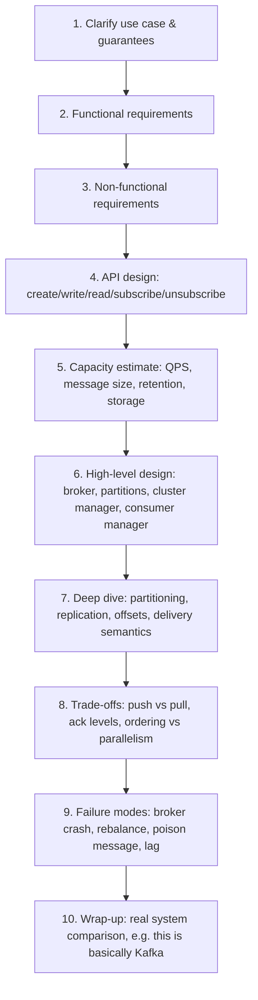

Say the order out loud in this sequence — interviewers grade the *path*, not
just the final diagram. Most candidates jump straight to "Kafka has
partitions" and skip requirements — that reads as memorized, not derived.

## Requirements clarification

Always state functional requirements before non-functional ones — the
non-functional list (scalable, available, durable...) is meaningless until
the interviewer knows what the system actually does.

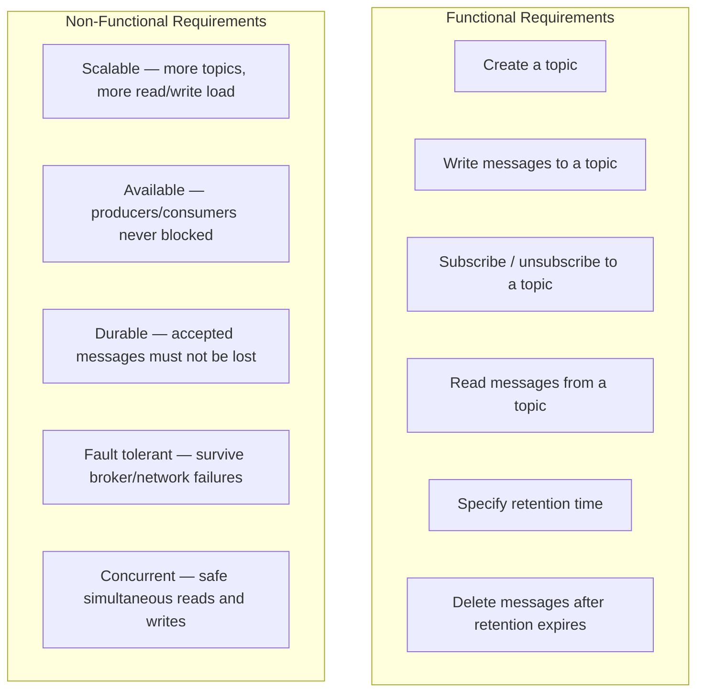

**Cheat-sheet**
- Functional = the six verbs: create, write, subscribe, read, retain, delete.
- Non-functional = **S-A-D-F-C** (Scalable, Available, Durable, Fault-tolerant,
  Concurrent) — say all five out loud even if the interviewer only asked for
  "a scalable system," it signals you know the full trade-off space.
- Durability and availability are the two an interviewer will pressure-test
  first — have your answer ready ("replication + acks=all" and "no
  single-point broker" respectively) before moving to API design.

## API design

Exclude producer/consumer identity from signatures — assume it comes from
the connection/auth context, not a parameter.

| Call | Signature | Returns |
|---|---|---|
| Create a topic | `create(topic_ID, topic_name)` | ack, or error |
| Write a message | `write(topic_ID, message)` — max 1 MB/message | ack, or error |
| Subscribe | `subscribe(topic_ID)` | ack |
| Read a message | `read(topic_ID)` | message object |
| Unsubscribe | `unsubscribe(topic_ID)` | ack |
| Delete a topic | `delete_topic(topic_ID)` | ack |

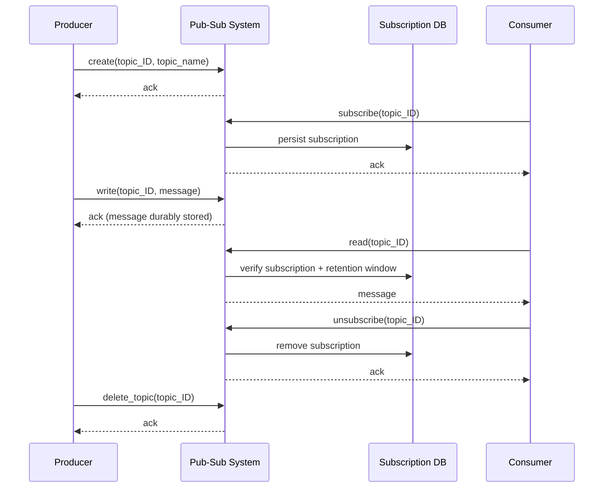

**Cheat-sheet**
- Six calls total — if you can't name them cold, you can't drive an API
  design discussion; write them on the whiteboard before the high-level
  diagram.
- `write()` and `read()` are the hot path — everything else (create,
  subscribe, delete) is control-plane and can be slower/less optimized.
- Retention is a **parameter of subscribe/create**, not a separate system —
  it just gates what `read()` is allowed to return.

## What it is — core vocabulary

| Term | Meaning |
|---|---|
| **Topic** | A named, durable, append-only log of messages. The unit a publisher writes to and a subscriber subscribes to. |
| **Producer / Publisher** | Writes messages to a topic. Doesn't know who reads them. |
| **Consumer / Subscriber** | Reads messages from a topic it has subscribed to. |
| **Broker** | The server that stores topic data and serves reads/writes. |
| **Partition** | A topic is split into partitions for parallelism; each partition is a strictly ordered, immutable log. |
| **Segment** | A partition is physically stored as segment files on disk; each message has an offset within its segment. |
| **Offset** | A monotonically increasing pointer identifying a message's position within a partition. The unit of "how far has this consumer read." |
| **Consumer group** | A set of consumers that split the partitions of a topic among themselves so each message is processed once *per group* (this is how pub-sub gets queue-like load-balancing without losing fan-out to other groups). |
| **Cluster manager** | Supervises broker health, owns leader election for partitions (e.g., ZooKeeper/KRaft in Kafka, Raft in Pulsar). |
| **Retention period** | How long a message stays in the topic after being written, independent of whether it's been read. |

## Why pub-sub exists

- **Decoupling** — producers and consumers scale, deploy, and fail
  independently. Add a new subscriber without touching the publisher.
- **Absorbing bursty load** — a topic acts as a buffer between a fast
  producer and a slower (or momentarily down) consumer.
- **Fan-out for free** — one write, N reads, without the publisher doing N
  times the work.
- **Async replication / multi-view sync** — a leader in leader-follower
  replication publishes changes; followers subscribe and apply asynchronously.
  WhatsApp's multi-device sync (phone + web + desktop all showing the same
  conversation) is the same pattern: each device is a subscriber to the
  account's event stream.
- **Log ingestion at scale** — Meta's **Scribe**, LinkedIn's **Kafka** (its
  original use case), and Netflix's **Keystone** pipeline all exist because
  every service emitting logs/events needs to reach many downstream analytics
  systems without knowing about them individually.

## How it works internally

### Design 1 — one queue per consumer (naive, and why it doesn't scale)

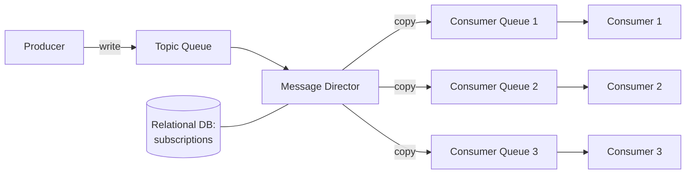

Each topic gets a distributed message queue; a **message director** reads it,
looks up subscribers in a DB, and copies the message into a dedicated queue
per consumer. Simple to reason about, but breaks at scale: millions of
subscribers × thousands of topics = millions of queues to provision and
babysit, and every message gets physically duplicated once per subscriber.
This is the design a candidate should propose first and then talk themselves
out of — showing you can identify the scaling wall is worth more than jumping
straight to the "correct" answer.

### Design 2 — broker + partitions (what Kafka/Pulsar/real systems do)

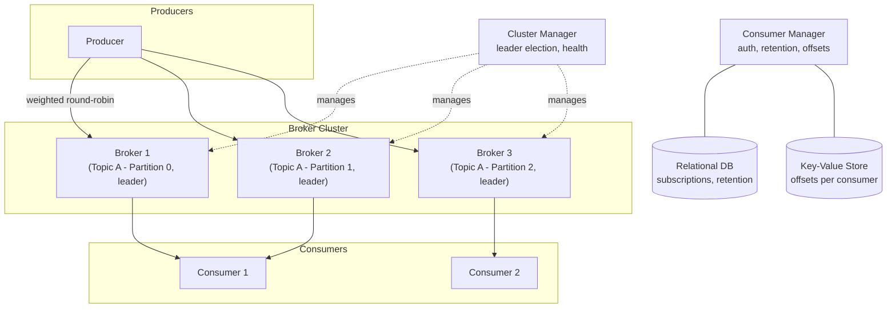

Instead of one queue per consumer, the **topic itself is partitioned** across
brokers, and each partition is an immutable, append-only log split into
**segment** files. A message's position is addressed by an **offset**, so
independent consumers can each read from wherever they are — no per-consumer
copy of the data.

- **Why partition at all**: reading/writing a topic is an I/O-bound task on
  one machine; partitioning turns one hot log into N parallel logs, each
  independently scalable, spread across different brokers.
- **Why round-robin (weighted)**: messages for a topic are distributed across
  its partitions so no single partition (and therefore no single broker)
  becomes a bottleneck. Weighted, because brokers/partitions may have uneven
  capacity.
- **Why segments**: bounding a partition's log into rotatable segment files
  makes retention/deletion cheap (drop whole segment files past the retention
  window) instead of needing per-message deletes.
- **Ordering**: guaranteed *only within a partition* (append-only, in order).
  There is no global ordering across partitions of the same topic — this is
  the #1 gotcha interviewers probe. If you need strict ordering for a key
  (e.g., all events for `user_id=42`), you must **key** messages so they
  always land on the same partition.

### Publish → deliver → acknowledge flow

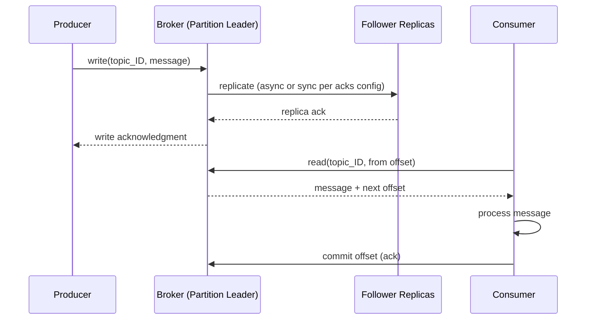

### Replication and failover

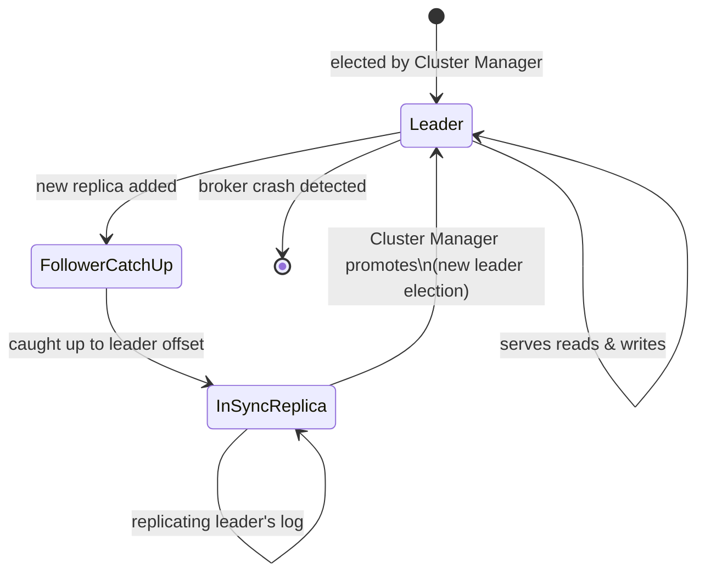

The **cluster manager** (ZooKeeper/KRaft-style in Kafka, a Raft group in
Pulsar/etcd-backed systems) tracks broker liveness via heartbeats, keeps the
broker↔partition registry, and runs leader election when a leader dies. Only
replicas that are "in-sync" (caught up within a bounded lag) are eligible to
become leader — promoting a stale replica would silently lose committed
messages.

### Consumer manager responsibilities

1. **AuthZ** — is this consumer allowed to read this topic (subscribed)?
2. **Retention enforcement** — is the requested offset still within the
   retention window, or has it been deleted?
3. **Delivery mode** — push (broker sends proactively) vs pull (consumer
   polls); most production systems (Kafka) are **pull-based** to let
   consumers control their own pace and avoid overload.
4. **Offset tracking** — stored in a fast key-value store (per
   consumer/consumer-group, per partition) so re-reads and restarts resume
   from the right place instead of replaying or skipping.

### Data model — how the pieces relate

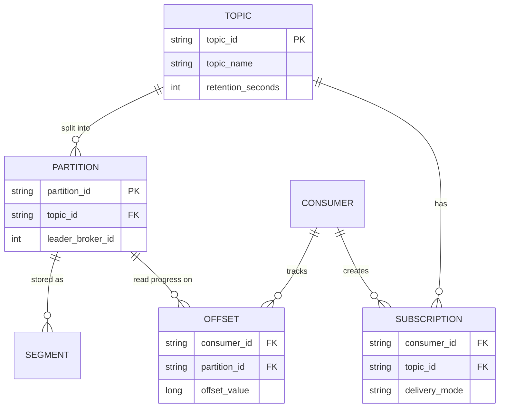

`TOPIC`/`PARTITION`/`SUBSCRIPTION` live in the relational DB (structured,
needs integrity); `OFFSET` lives in a key-value store (needs fast
point-lookups, not joins) — this is exactly the "which building block for
which data" question interviewers probe.

### Consumer groups and rebalancing

A **consumer group** is what turns pub-sub into queue-like load-balancing:
Kafka guarantees each partition is owned by exactly one member of a group at
a time, so N consumers in a group split a topic's partitions the way N
workers split a queue — while a second, independent group reading the same
topic still gets its own full copy of every message.

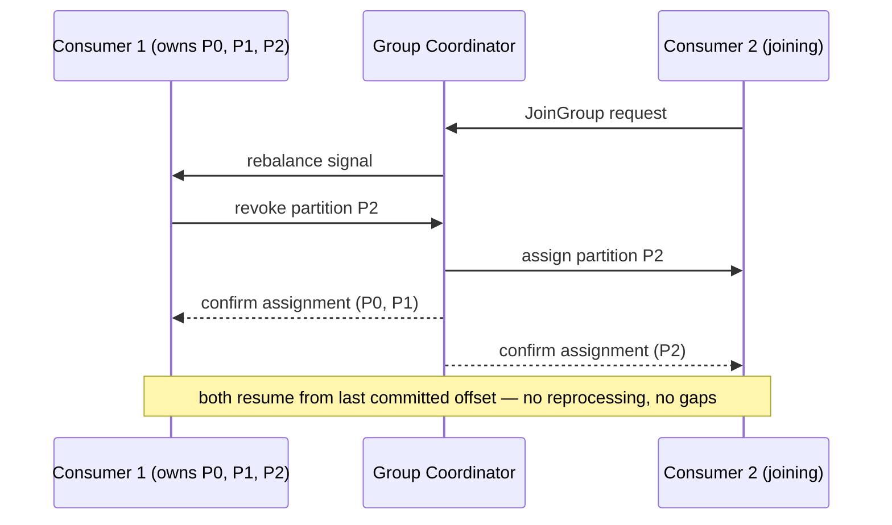

**Cheat-sheet (How it works internally)**
- Partitioning solves parallelism; segments solve cheap retention/deletion;
  offsets solve independent, replayable reads.
- Relational DB → structured metadata (topics, subscriptions); KV store →
  hot, high-QPS lookups (offsets).
- A consumer group = a queue; multiple consumer groups on one topic = full
  pub-sub fan-out. This single fact answers "how do you get load-balancing
  out of pub-sub?"
- Rebalancing is necessary but disruptive — prefer cooperative/incremental
  reassignment over stop-the-world when consumers join/leave often.

## Push vs. pull — disambiguation

| | Push | Pull |
|---|---|---|
| Who initiates delivery | Broker sends to consumer | Consumer polls broker |
| Risk | Can overwhelm a slow consumer | Consumer controls its own rate |
| Latency | Lower (broker pushes as soon as available) | Slightly higher (bounded by poll interval) |
| Back-pressure | Hard to implement | Natural — consumer just polls less |
| Real systems | Webhooks, some MQTT brokers, Server-Sent Events | Kafka, most log-based systems |
| Mnemonic | "Push = the boss walks over" | "Pull = you check your inbox" |

Most interview-grade answers: **support both** — let each consumer declare a
preference, same as the source material's consumer manager design — but
default recommendation for a high-throughput system is **pull**, because it's
the only one that gives consumers real back-pressure control.

**Cheat-sheet**
- Default answer: pull, because back-pressure is free and overload is a real
  production failure mode.
- Offer push only when the interviewer emphasizes latency (real-time
  notifications) over throughput.
- Letting each consumer choose its own mode costs one extra field in the
  subscription record — cheap to mention, shows design maturity.

## Delivery-semantics — disambiguation

| Semantic | Meaning | Cost | Who uses it |
|---|---|---|---|
| **At-most-once** | Message delivered 0 or 1 times; never retried | Cheapest, can silently lose messages | Metrics/telemetry where an occasional drop is fine |
| **At-least-once** | Message delivered ≥1 times; retried until acked | Requires idempotent consumers | Default for most pub-sub (Kafka default, SQS standard) |
| **Exactly-once** | Message delivered and processed exactly once | Most expensive — needs transactional writes + dedup | Kafka transactions (idempotent producer + transactional consumer), financial pipelines |

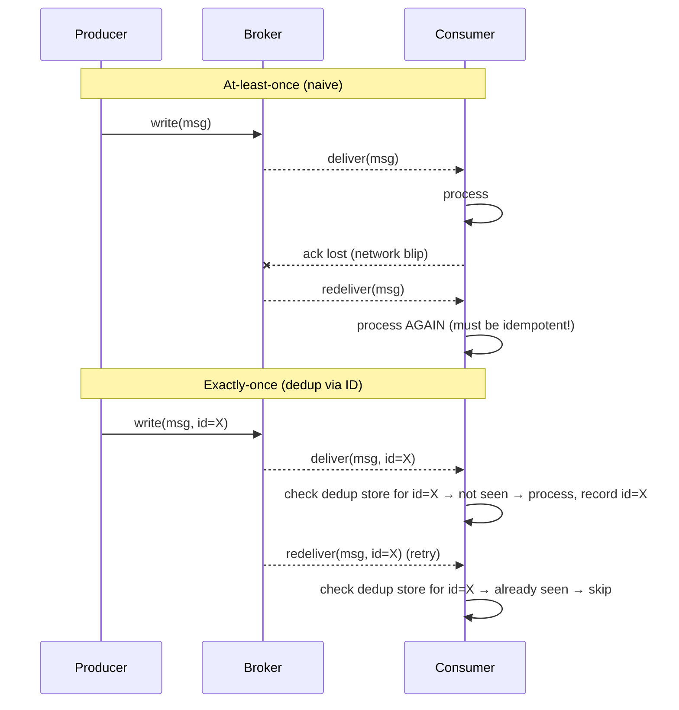

**Mnemonic**: "at-most, at-least, exactly" — cost goes up left to right;
default to at-least-once + idempotent consumer unless the interviewer
specifically calls for exactly-once (money movement, inventory decrement).

**Cheat-sheet**
- At-least-once is the default; it only works if consumers are idempotent
  (dedup by message ID or use a natural idempotency key).
- Exactly-once = idempotent producer (no duplicate writes) + transactional
  consumer (read+process+commit atomically) — say both halves, interviewers
  dock points for naming only one.
- Never promise exactly-once "for free" — it's a design decision with a real
  throughput cost, not a checkbox.

## Pub-sub vs. message queue — disambiguation

This is the single most common pub-sub interview question, asked almost
word-for-word: *"what's the difference between a pub-sub system and a
queue?"* Have the one-liner ready: **a queue delivers each message to one
consumer; pub-sub delivers each message to every subscriber.**

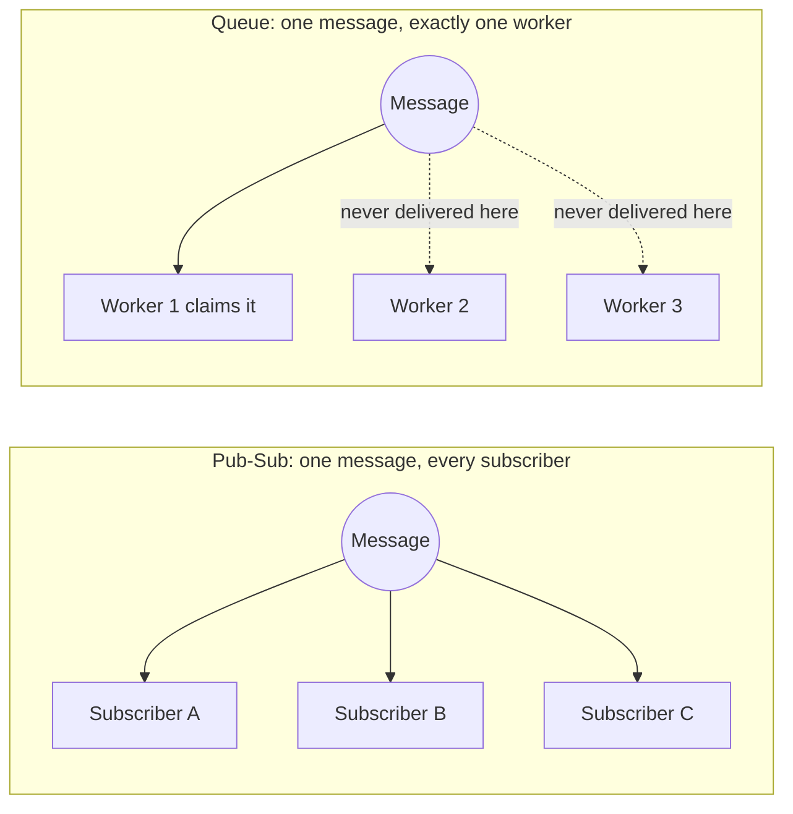

| | Pub-Sub | Message Queue |
|---|---|---|
| Consumers per message | Many (every subscriber gets a copy) | One (single consumer claims and removes it) |
| Consumer awareness | Publisher doesn't know subscriber count | Producer doesn't care who dequeues, but only one does |
| Message lifecycle | Retained for a period regardless of reads (log semantics) | Typically removed once consumed/acked |
| Replay | Yes — new subscriber can read from an old offset within retention | Usually no — once dequeued, it's gone |
| Load balancing across workers | Achieved via **consumer groups** (partition-per-consumer) | Native — that's the whole point of a queue |
| Example | Kafka topic, SNS topic, Google Pub/Sub topic | SQS queue, RabbitMQ queue, Kafka *within* one consumer group |

**Key interview insight**: modern log-based pub-sub (Kafka) actually
subsumes queue semantics — a **consumer group** behaves like a queue (each
partition consumed by exactly one member of the group), while *multiple*
consumer groups reading the same topic get full pub-sub fan-out. This is why
AWS pairs **SNS (pub-sub, fan-out) → SQS (queue, per-subscriber buffering)**:
SNS fans a message out to N SQS queues, one per subscribing service, each
service then dequeues at its own pace. That combination is effectively
reimplementing "Design 1" from this chapter — one queue per consumer — but
using managed services instead of hand-rolled infrastructure.

**Cheat-sheet**
- One-liner: queue = one message → one consumer; pub-sub = one message → N
  subscribers.
- A consumer *group* is how pub-sub gets queue behavior back — don't say
  "Kafka isn't a queue," say "Kafka is a queue when you only have one
  consumer group."
- Need both fan-out *and* per-subscriber buffering/back-pressure? That's the
  SNS→SQS pattern — pub-sub for distribution, a queue per subscriber for
  isolation.
- If the interviewer says "each task should be processed exactly once by one
  worker," that's a queue question wearing a pub-sub costume — don't
  over-apply consumer-group fan-out where a plain queue is the right answer.

## Broker technology comparison — when to use which

| System | Model | Ordering | Delivery | Retention | Best for |
|---|---|---|---|---|---|
| **Kafka** | Partitioned log, pull-based | Per-partition strict order | At-least-once (exactly-once w/ transactions) | Time/size-based, replayable | High-throughput event streaming, log aggregation, event sourcing |
| **AWS SNS + SQS** | Fan-out topic → per-subscriber queue | No ordering guarantee (FIFO variant exists) | At-least-once | Queue: until consumed; SNS: none (fire-and-forget) | Serverless fan-out, decoupled microservices, low ops overhead |
| **Google Cloud Pub/Sub** | Managed topic/subscription, push or pull | No global order (ordering keys available) | At-least-once | Configurable, up to 7 days (Seek supported) | Managed cross-region fan-out, GCP-native pipelines |
| **RabbitMQ** | Exchange + queue (AMQP) | Per-queue FIFO | At-least-once / at-most-once configurable | Until consumed (or TTL) | Complex routing (topic/direct/fanout exchanges), lower-throughput, RPC-style workloads |
| **Redis Pub/Sub** | In-memory, fire-and-forget | None | At-most-once (no persistence, no replay) | None — if no subscriber is listening, message is lost | Real-time low-latency notifications where loss is acceptable (live cursors, chat typing indicators) |
| **NATS / NATS JetStream** | Lightweight core pub-sub, JetStream adds persistence | Per-stream order (JetStream) | At-most-once (core) / at-least-once (JetStream) | None (core) / configurable (JetStream) | Ultra-low-latency microservice messaging |

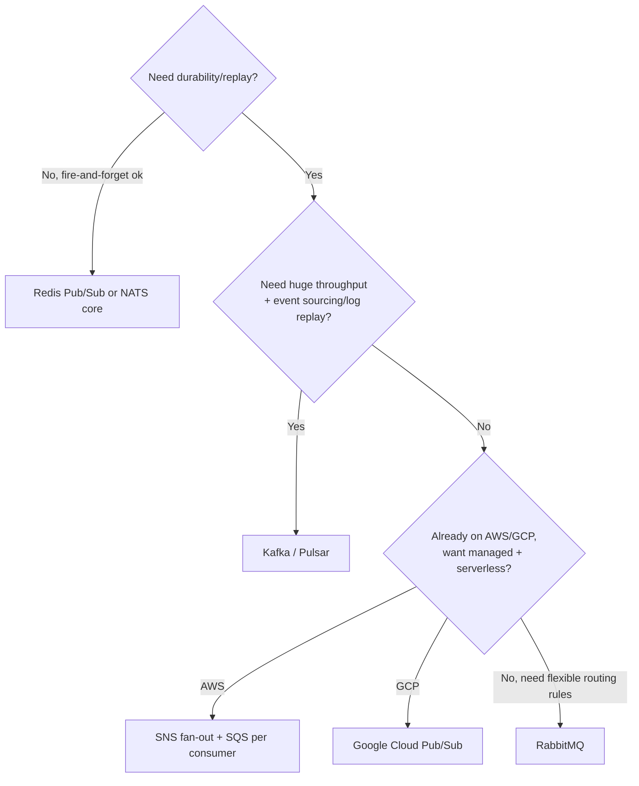

**Cheat-sheet**
- "Design something like Kafka" → they want you to build Design 2 from
  scratch; "design a notification fan-out on AWS" → they want SNS+SQS
  reasoning, not a from-scratch broker.
- Redis Pub/Sub's defining trait: **no persistence** — if no subscriber is
  connected when a message is published, it's gone forever. Say this
  explicitly; it's the fact interviewers use to test if you actually know
  the tool or just its name.
- Managed (SNS/SQS, Cloud Pub/Sub) vs. self-hosted (Kafka, RabbitMQ) is
  itself a trade-off worth naming: less ops burden vs. more control over
  partitioning/ordering/cost at extreme scale.

## Capacity estimation, worked example

**Formula chain**: messages/sec → message size → partition count →
storage/day → replication overhead → broker count.

```
Given:
  Producers publish P = 500,000 messages/sec across all topics
  Avg message size = 1 KB  (API says max 1 MB, use realistic avg)
  Retention = 7 days
  Replication factor = 3

1. Write throughput
   Bandwidth_in = 500,000 msg/s * 1 KB = 500 MB/s

2. Storage per day (before replication)
   Storage/day = 500 MB/s * 86,400 s = ~43.2 TB/day

3. Storage for full retention window (before replication)
   Storage_total = 43.2 TB/day * 7 days = ~302 TB

4. With replication factor 3 (each partition has 2 extra copies)
   Storage_with_replication = 302 TB * 3 = ~906 TB

5. Partition count (to parallelize across brokers)
   If a single partition/broker can sustain ~10 MB/s of durable writes:
   Partitions_needed = 500 MB/s / 10 MB/s per partition = 50 partitions minimum
   → round up and over-provision for hot partitions: ~150-200 partitions

6. Broker count
   If each broker can hold ~10 TB of local disk reliably and serve
   ~1 GB/s aggregate I/O:
   Brokers_for_storage = 906 TB / 10 TB per broker = ~91 brokers
   Brokers_for_throughput = 500 MB/s replication traffic considered too
   → provision for the larger of the two, then add headroom (~20%) for
     rebalancing and broker failure tolerance → ~110 brokers

7. Consumer fan-out bandwidth check
   If each message is read by an average of 4 subscriber types:
   Bandwidth_out = 500 MB/s * 4 = 2 GB/s aggregate egress to plan network for
```

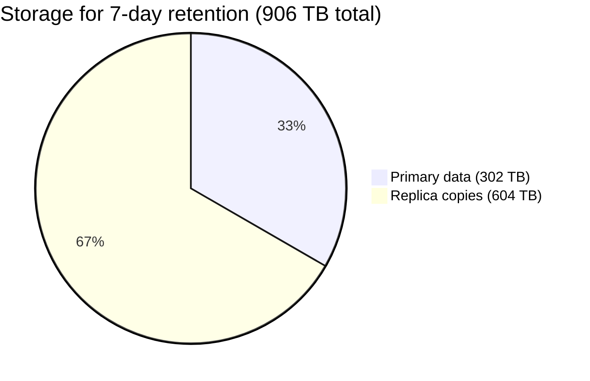

That pie chart is the number to internalize: **replication factor 3 means
your real storage bill is 3× the raw data**, not 1×. Interviewers routinely
catch candidates who compute storage and forget to multiply by replication
factor — don't be that candidate.

**The method matters more than the number** — if an interviewer changes P to
5M msg/s or retention to 30 days, redo steps 1→7 live; don't recite "we need
X brokers" from memory.

**Cheat-sheet**
- Formula chain, memorize the *shape*, not the numbers: `msgs/sec × avg size
  → bandwidth → × retention → raw storage → × replication factor → real
  storage → ÷ per-broker capacity → broker count`.
- Always sanity-check partition count against the ~10 MB/s per-partition
  ceiling — too few partitions is the most common self-inflicted bottleneck.
- State assumptions out loud (avg message size, per-broker disk/IO limits)
  before computing — the assumption is what the interviewer is actually
  grading, not the arithmetic.

## Design decisions and trade-offs

| Decision | Option A | Option B | Trade-off |
|---|---|---|---|
| Partitioning key | Round-robin (no key) | Hash of a business key (e.g., user ID) | Round-robin balances load evenly but loses per-key ordering; keyed partitioning gives ordering per key but risks hot partitions for skewed keys |
| Acknowledgment level | `acks=1` (leader only) | `acks=all` (leader + all in-sync replicas) | `acks=1` is faster but can lose data if leader dies before replicating; `acks=all` is durable but higher latency |
| Delivery mode | Push | Pull | Push = lower latency, risk of overload; pull = natural back-pressure, slightly higher latency |
| Retention | Time-based (e.g., 7 days) | Size-based (e.g., keep last 100 GB) | Time-based is predictable for compliance; size-based caps storage cost regardless of traffic spikes |
| Ordering guarantee | Global order | Per-partition order | Global order kills parallelism (single writer/reader); per-partition order is the practical default — pick the partition key to match your ordering need |
| Delivery semantics | At-least-once | Exactly-once | At-least-once is cheap but demands idempotent consumers; exactly-once needs transactional writes + dedup store, costs throughput |
| Replica placement | Same rack/AZ | Cross-AZ | Same-AZ is faster replication but a single AZ outage loses availability; cross-AZ survives AZ failure at the cost of replication latency |

**Cheat-sheet**
- Every row is a **latency vs. durability/ordering** trade — when asked "why
  not just always pick the safe option," the answer is always latency cost.
- `acks=all` + cross-AZ replicas + keyed partitioning is the "maximally safe"
  combo — quote it, then immediately name its cost (higher write latency,
  possible hot partitions) so it doesn't sound like a free lunch.
- If the interviewer says "minimize latency," default to `acks=1` +
  round-robin + push; if they say "never lose data," default to `acks=all` +
  cross-AZ + at-least-once with idempotent consumers.

## Common failure modes

- **Broker (partition leader) crash** — cluster manager must detect (via
  heartbeat timeout) and promote an in-sync replica. If it promotes a lagging
  replica, committed-but-unreplicated messages are lost — this is why
  `acks=all` + minimum in-sync replica count matters.
- **Consumer lag / slow consumer** — a consumer falling behind doesn't block
  the producer (that's the whole point of decoupling), but if lag exceeds the
  retention window, messages age out and are lost to that consumer. Monitor
  consumer lag as a first-class metric, not an afterthought.
- **Poison message** — a malformed message that crashes every consumer that
  tries to process it, causing an infinite redelivery loop. Mitigate with a
  **dead-letter queue/topic** after N failed attempts.
- **Rebalancing storm** — in consumer-group systems, a consumer joining or
  leaving triggers partition reassignment ("rebalance"); frequent
  joins/leaves (e.g., a flapping deployment) cause a storm of rebalances that
  stall consumption cluster-wide. Mitigate with cooperative/incremental
  rebalancing (Kafka's `CooperativeStickyAssignor`) instead of "stop the
  world" rebalancing.
- **Hot partition** — a skewed partition key (e.g., one celebrity user ID)
  overloads a single partition/broker while others sit idle. Mitigate with
  salting the key or a secondary random component for high-cardinality-skew
  cases.
- **Network partition / split-brain on leader election** — two brokers both
  believe they're the leader for a partition. Solved via a quorum-based
  cluster manager (ZooKeeper/Raft) that only allows a leader to be elected
  with majority agreement.
- **Backlog buildup from a permanently down consumer** — if retention is the
  only backstop, unlimited producers + a dead consumer group can pile up
  storage cost. Alert on lag, don't just retain-and-forget.

### Poison message → dead-letter handling

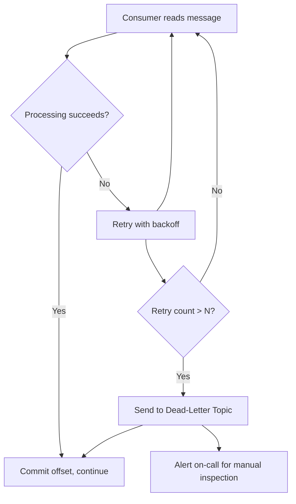

### Hot-partition mitigation

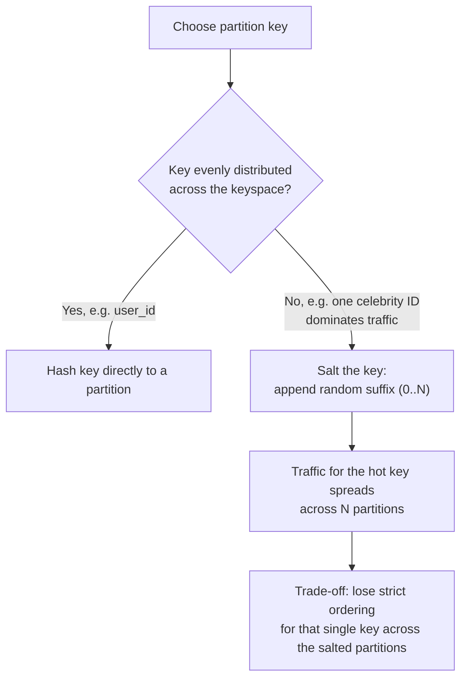

**Cheat-sheet**
- Six failure modes to have ready: leader crash, consumer lag, poison
  message, rebalance storm, hot partition, split-brain election — naming all
  six unprompted is a strong signal of depth.
- Every mitigation trades away something: DLQ trades strict processing order
  for the poisoned message; salting trades per-key ordering for load spread;
  cooperative rebalancing trades a slightly more complex protocol for less
  downtime.
- "How does this fail?" is often asked directly — don't wait to be asked,
  volunteer 2–3 of these once the happy-path design is on the board.

## Real-world examples

- **LinkedIn → Apache Kafka**: Kafka was built at LinkedIn specifically to
  replace a sprawl of point-to-point data pipelines (activity data, metrics,
  logs) with one partitioned, replicated, replayable log — the canonical
  "why pub-sub" story to cite in an interview.
- **Meta Scribe**: a pub-sub-style log ingestion system used to route and
  archive massive volumes of application/log events across Meta's fleet,
  supporting knowing exactly what data goes where and cleaning up
  unwanted/processed data.
- **Netflix Keystone**: a Kafka-based real-time stream processing pipeline
  handling trillions of events/day for personalization, monitoring, and
  analytics — a good example to cite for "capacity at extreme scale."
  
- **AWS SNS + SQS fan-out pattern**: an order-service publishes
  "OrderPlaced" to an SNS topic; separate SQS queues for
  billing, shipping, and notifications each get their own copy and consume
  independently — the textbook managed-service version of "Design 1"
  (one queue per consumer) from this chapter.
- **WhatsApp multi-device sync**: each logged-in device (phone, web, desktop)
  acts as a subscriber to the account's message stream, so publishing a
  message once fans out consistently to every view without the sender
  knowing how many devices are attached.
- **Twitter/X timeline fan-out**: a tweet is "published" and fanned out
  (pub-sub style) to follower timelines — the same
  celebrity-hot-partition problem shows up here in production (Ronaldo's
  90M+ followers is a real fan-out/hot-key engineering problem, not just an
  analogy).

## Numbers worth memorizing

| Quantity | Typical value |
|---|---|
| Max message size (this chapter's API, and Kafka default) | 1 MB (Kafka default `message.max.bytes`; SNS/SQS caps around 256 KB) |
| Default retention (Kafka) | 7 days |
| Typical replication factor | 3 |
| In-memory (Redis) pub-sub latency | sub-millisecond |
| Kafka broker-to-broker replication latency (same AZ) | ~1–5 ms |
| Cross-region replication latency | 50–150+ ms depending on distance |
| Healthy consumer lag | seconds, not minutes — alert well before it approaches retention window |
| SQS standard queue at-least-once dedup window | 5 minutes (for FIFO queues' dedup) |
| Partition throughput ceiling (rule of thumb) | ~10 MB/s durable writes per partition before you need more partitions |

## Memory hooks

- **Partitions = parallel lanes on a highway** — more lanes, more
  throughput, but a single car (message) only ever stays in one lane
  (partition) — that's why ordering is per-partition, not global.
- **Offset = a bookmark, not a receipt** — it just says "I've read up to
  here," it doesn't delete anything; that's what makes replay possible.
- **Consumer group = carpooling** — the group splits the ride (partitions)
  among its members; two different groups can both ride the same route
  independently (full fan-out).
- **acks=all is a rollcall, acks=1 is a show of hands** — rollcall (wait for
  everyone) is slower but nobody's left behind; a show of hands (just the
  leader) is fast but risks losing a straggler's vote if the leader disappears
  right after.

## How to identify this topic in an interview

Watch for these prompts — they're pub-sub in disguise:
- "Design a notification system" / "design a system that fans out updates to
  many subscribers"
- "Design a log aggregation / metrics pipeline"
- "How would you decouple service A from service B?"
- "Design a system for real-time monitoring / activity feeds"
- "How does WhatsApp/Slack keep multiple devices in sync?"
- "Design something like Kafka" (an explicit ask to design the building
  block itself, not a system that uses it)
- Any mention of "event-driven architecture," "asynchronous processing," or
  "at-least-once delivery" in requirements

## Golden rules

- **A publisher never needs to know who or how many are subscribed** — the
  moment your design has the producer aware of a specific consumer, you've
  built RPC, not pub-sub.
- **Ordering is a per-partition promise, never a global one** — don't
  design around "the events will arrive in order" unless you've pinned them
  to a single partition via key.
- **Decoupling means a slow or dead consumer must never block or crash the
  producer** — retention absorbs the gap; monitoring (not blocking) is the
  correct reaction to lag.
- **At-least-once + idempotent consumer is the default, not exactly-once** —
  reach for the expensive guarantee only when correctness genuinely requires
  it (money, inventory).
- **Every dead-letter/poison-message path needs a bounded retry count** —
  infinite redelivery isn't durability, it's a denial-of-service against
  your own consumers.

## Master Cheat Sheet

- **Definition**: async, decoupled, one-to-many messaging — publisher
  writes to a topic, any number of subscribers read independently.
- **Requirements**: functional = create/write/subscribe/read/retain/delete
  (six verbs); non-functional = **S-A-D-F-C** (Scalable, Available, Durable,
  Fault-tolerant, Concurrent).
- **API**: `create`, `write`, `subscribe`, `read`, `unsubscribe`,
  `delete_topic` — write/read are the hot path, the rest is control-plane.
- **Core building blocks**: topic (partitioned log) → segments → offsets;
  broker cluster; cluster manager (leader election/health); consumer manager
  (authz, retention, offsets); relational DB for subscription metadata; KV
  store for offsets.
- **Consumer groups**: one group = a queue (partitions split among members);
  multiple groups on one topic = full pub-sub fan-out.
- **Two designs**: (1) queue-per-consumer — simple, doesn't scale past
  thousands of consumers; (2) broker+partition log — scales via parallel
  partitions, is what Kafka/Pulsar actually do.
- **Ordering**: per-partition only. Pin a business key to a partition for
  ordering guarantees on that key.
- **Delivery semantics**: at-most-once < at-least-once (default) <
  exactly-once (transactional, expensive) — pick the cheapest one that
  satisfies correctness.
- **Push vs pull**: pull gives natural back-pressure and is the default for
  high-throughput logs; push is lower-latency but risks overloading slow
  consumers.
- **Replication**: factor of 3 typical; `acks=all` for durability,
  `acks=1` for speed; only in-sync replicas are eligible for leader
  promotion.
- **Capacity math chain**: msgs/sec × size → bandwidth → ×retention days →
  storage → ×replication factor → ÷per-broker capacity → broker count; check
  partition count against per-partition throughput ceiling (~10 MB/s).
- **Failure modes to name**: leader crash/failover, consumer lag exceeding
  retention, poison messages (→ DLQ), rebalancing storms, hot partitions,
  split-brain leader election.
- **Real systems to cite**: Kafka (LinkedIn), Scribe (Meta), Keystone
  (Netflix), SNS+SQS fan-out (AWS), Cloud Pub/Sub (Google), multi-device sync
  (WhatsApp).
- **One-liner for the whiteboard**: "Partition the topic for parallelism,
  replicate each partition for durability, track progress with offsets, and
  let consumer groups decide how work is split — that's a pub-sub system."
