# Redis Pub/Sub — Deep Dive & Production Guide

Companion deep-dive to `18-Pub-sub-FAANG-Guide.md`. That guide covers pub-sub
as a concept; this one covers **one specific implementation** in the depth a
"tell me about a pub-sub system you've actually used" follow-up demands.

## Mental model

Redis Pub/Sub is a **live radio broadcast**, not a mailbox. If your radio is
off when the song airs, you never hear it — nothing is recorded, nothing is
queued for you. Compare to Kafka, which is a **podcast**: recorded first,
downloadable anytime within the retention window. This one distinction —
*live vs. recorded* — explains almost every design decision and every
production mistake in this guide.

## What Redis Pub/Sub actually is

- Built into core Redis since version 2.0 — no separate product, just
  commands on the same single-threaded Redis process that serves your keys.
- **Fire-and-forget, at-most-once, zero persistence.** Not written to RDB
  snapshots, not written to the AOF log, not stored anywhere. A `PUBLISH`
  with no subscribers is a no-op that succeeds and delivers to nobody.
- **Channels are just strings** — there's no `CREATE CHANNEL` command.
  Subscribing to a channel that doesn't "exist" yet just means you'll get
  the next message published to it; there's nothing to pre-provision.
- Two subscription styles:
  - `SUBSCRIBE channel` — exact channel name match.
  - `PSUBSCRIBE pattern` — glob-style pattern match (`news.*`, `chat.room.?`).
- Since **Redis 7.0**: **Sharded Pub/Sub** (`SSUBSCRIBE` / `SPUBLISH` /
  `SUNSUBSCRIBE`), purpose-built to make Pub/Sub viable in Cluster mode (see
  below — this is the single most important production fact in this guide).

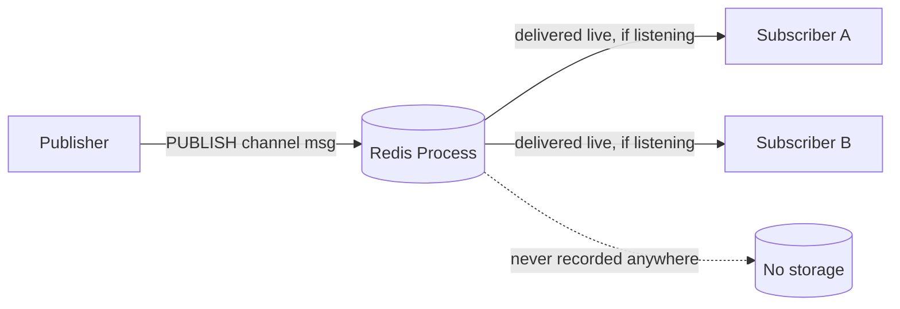

## How it works internally

### Subscribe mode: the connection itself changes state

The detail that trips people up in a live-coding follow-up: **once a
connection issues `SUBSCRIBE`, that connection is no longer a normal command
connection.** In the classic protocol (RESP2), a subscribed connection can
only run `SUBSCRIBE`/`UNSUBSCRIBE`/`PSUBSCRIBE`/`PUNSUBSCRIBE`/`PING`/`QUIT`
— trying to run `GET`/`SET` on it is an error. This is exactly why every code
example in this guide opens **two separate clients**, one for publishing and
one for subscribing — a subscriber connection has given up its ability to do
anything else.

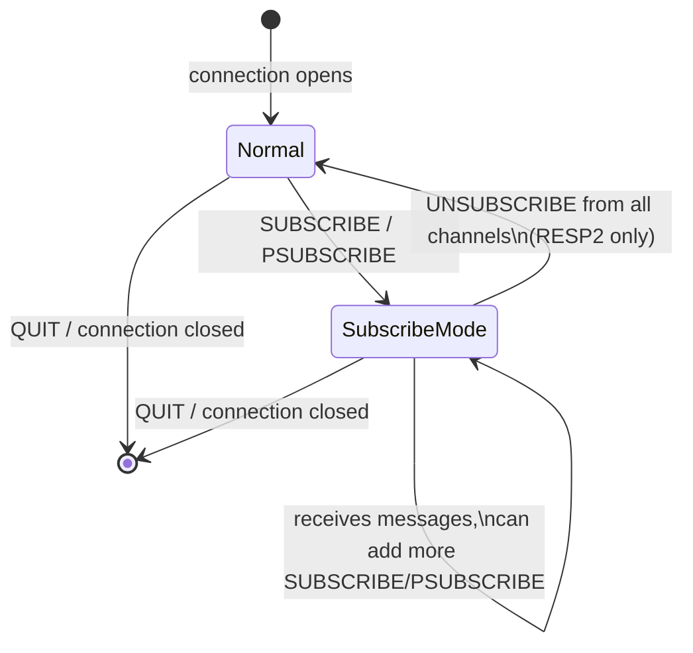

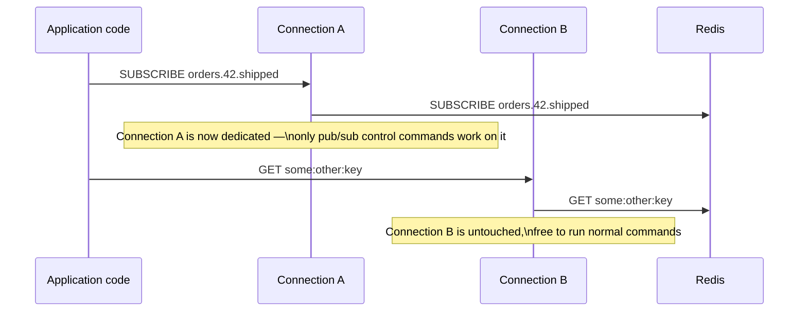

**RESP3** (opt-in via `HELLO 3`) relaxes this: pub/sub messages arrive as
out-of-band **push messages** multiplexed onto the same connection that's
also running regular commands — modern client libraries (recent redis-py,
Jedis, node-redis v4+) use this to avoid the two-connection dance under the
hood, but the underlying constraint (a RESP2 subscriber connection is
single-purpose) is what every interview-level mental model should start
from, since it's still what you hit with `redis-cli` or older client
versions.

### The event loop delivers synchronously, in your request path

Redis is single-threaded for command execution. `PUBLISH` is handled like any
other command: the calling client blocks until Redis has looked up every
matching subscriber (exact + pattern) and written the message to each of
their **socket output buffers**, in the same event-loop tick.

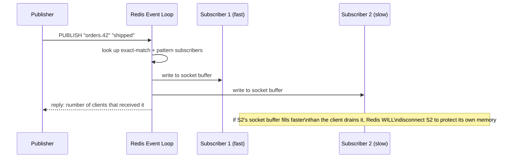

- There is **no per-subscriber queue**. The message either lands in the
  subscriber's TCP socket buffer right now, or (if the subscriber is slow or
  disconnected) it's gone.
- `PUBLISH`'s cost is **O(N + M)**: N = subscribers on the exact channel, M =
  number of distinct active patterns that must be tested against this
  channel name. A system with thousands of `PSUBSCRIBE` patterns makes every
  single publish more expensive, even ones with no matching pattern.
- **`client-output-buffer-limit pubsub <hard> <soft> <soft-seconds>`** — a
  real config knob (default hard 32MB, soft 8MB/60s) that force-disconnects
  a subscriber whose output buffer grows too large. This is Redis protecting
  itself from a slow consumer eating server memory — and it means a slow
  subscriber doesn't just lag, it gets **dropped**, silently losing every
  message published from the moment of disconnect to reconnect+resubscribe.

### Replication: replicas relay live, but still don't persist

`PUBLISH` is propagated over the normal replication stream, so subscribers
connected to a **replica** also receive messages published on the master —
useful for read-scaling subscriber fan-out. But replication ≠ durability
here: replicas hold the message in memory just long enough to relay it, same
as the master. A replica reboot loses nothing extra, because there was
nothing stored to lose.

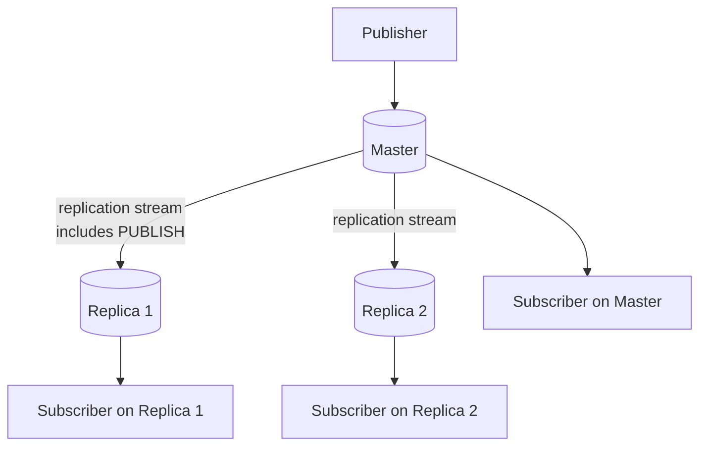

### Cluster mode: the broadcast-storm trap (and why Sharded Pub/Sub exists)

This is the fact that separates "used Redis Pub/Sub in a toy app" from
"ran it in production." **Classic `PUBLISH` in Cluster mode is broadcast to
every single node in the cluster**, regardless of which node the subscribers
are actually connected to — because a channel name, unlike a key, isn't
assigned to a specific hash slot in classic Pub/Sub. Every node has to check
its local subscribers on every publish, cluster-wide.

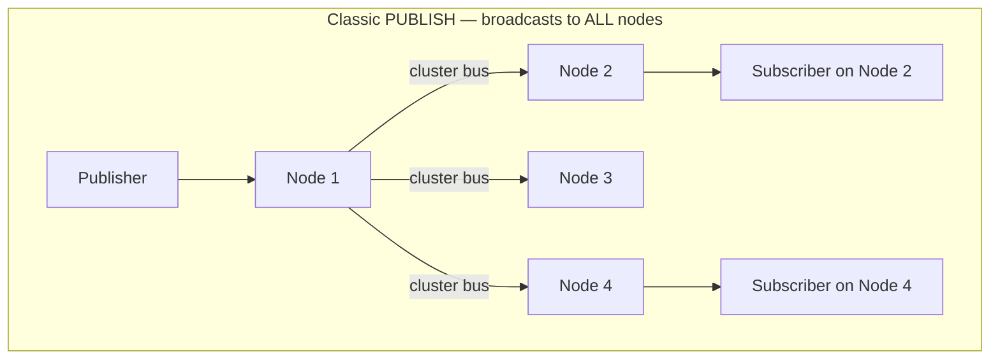

At high publish rates with many cluster nodes, this is **O(nodes)**
amplification of every message — a real, measured cause of cluster-bus
saturation in production Redis Cluster deployments.

**Sharded Pub/Sub (Redis 7+)** fixes this by treating the channel name like
a key: it's hashed with the same `CRC16(channel) mod 16384` scheme used for
keys, assigned to one of the cluster's 16,384 hash slots, and a message
published with `SPUBLISH` only propagates to the **shard (master + its own
replicas) that owns that slot** — not the whole cluster.

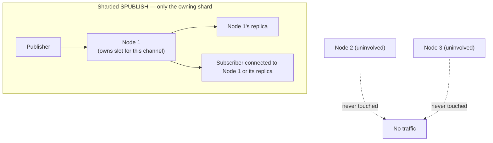

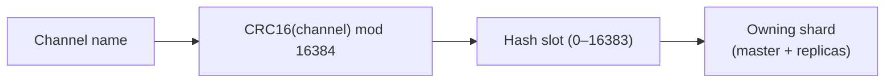

**Rule of thumb**: if you're running Redis Cluster (not just a single
primary or primary+replica), use `SSUBSCRIBE`/`SPUBLISH` — never classic
`SUBSCRIBE`/`PUBLISH` — once your fan-out or publish rate is non-trivial.

### Keyspace notifications — Redis publishing to itself

This is Redis's own built-in pub/sub use case, and a favorite interview
follow-up: *"how would you get notified the instant a Redis key expires or
changes?"* Answer: **keyspace notifications** — Redis internally calls
`PUBLISH` on special channels whenever a key is touched, if you turn the
feature on (it's off by default, because it isn't free — every write now
also does a publish).

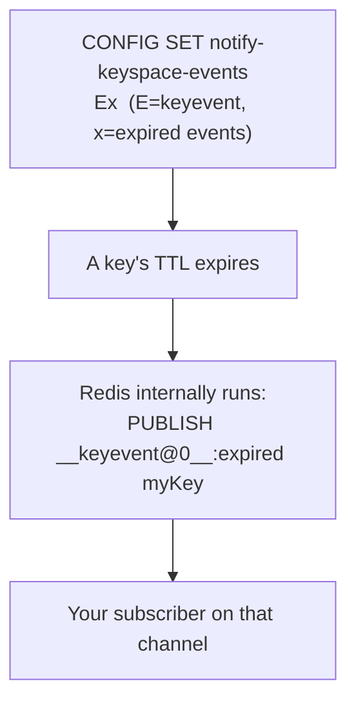

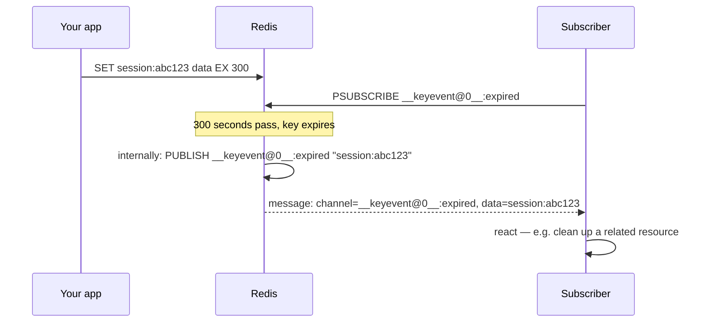

**Two notification classes**, both toggled by `notify-keyspace-events` flags:
- `__keyspace@<db>__:<key>` → event name (subscribe by key)
- `__keyevent@<db>__:<event>` → key name (subscribe by event type, e.g. all
  expirations, all deletes)

**Common use**: cache-invalidation fan-out (notify all app servers the
instant a cached value expires or is overwritten) and distributed
session/lock cleanup. **Caveat to state out loud**: this inherits every
Pub/Sub limitation above — if no one is subscribed when a key expires, that
notification is gone, same as any other Pub/Sub message. It's a convenience
hook, not a durable event log.

## Creating channels and choosing keys/shards

There's no schema to design up front — the two decisions that matter are
**naming** and **shard placement**.

### Naming convention

Use a hierarchical, dot- or colon-separated name so pattern subscriptions
stay useful:

```
<domain>.<entity-id>.<event>
orders.42.shipped
chat.room-8821.message
presence.user-9001.online
```

### Pattern subscriptions (`PSUBSCRIBE`) — powerful but not free

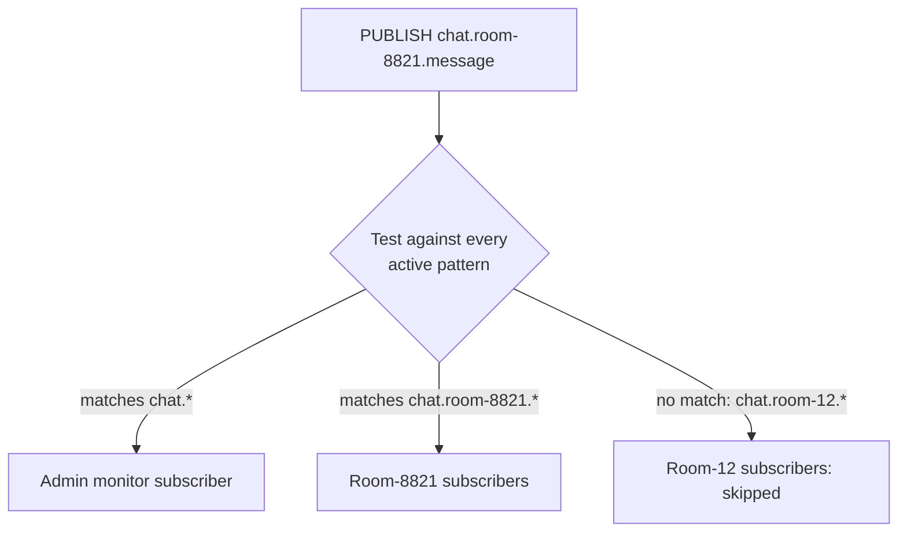

Use `PSUBSCRIBE` sparingly (e.g., one admin/monitoring subscriber watching
`chat.*`), not as the primary fan-out mechanism for thousands of rooms —
every publish pays the cost of testing every live pattern.

### Choosing the shard for a channel (Cluster mode)

Sharded Pub/Sub hashes the **channel name itself**. You don't pick a slot
directly, but you influence which shard a channel lands on the same way you
would for keys — via a **hash tag**: the substring inside `{}` is what gets
hashed, not the whole name.

```
chat.{room-8821}.message      → hashes on "room-8821"
chat.{room-8821}.presence      → same hash tag → same shard
chat.{room-9999}.message       → different tag  → likely a different shard
```

Use a hash tag when you need a channel and a **related key** (e.g., a Redis
Stream or a counter for that same room) to live on the same shard — this
matters if you ever combine `SPUBLISH` with a Lua script or a transaction
that also touches a key, since cross-slot operations aren't atomic in
Cluster mode.

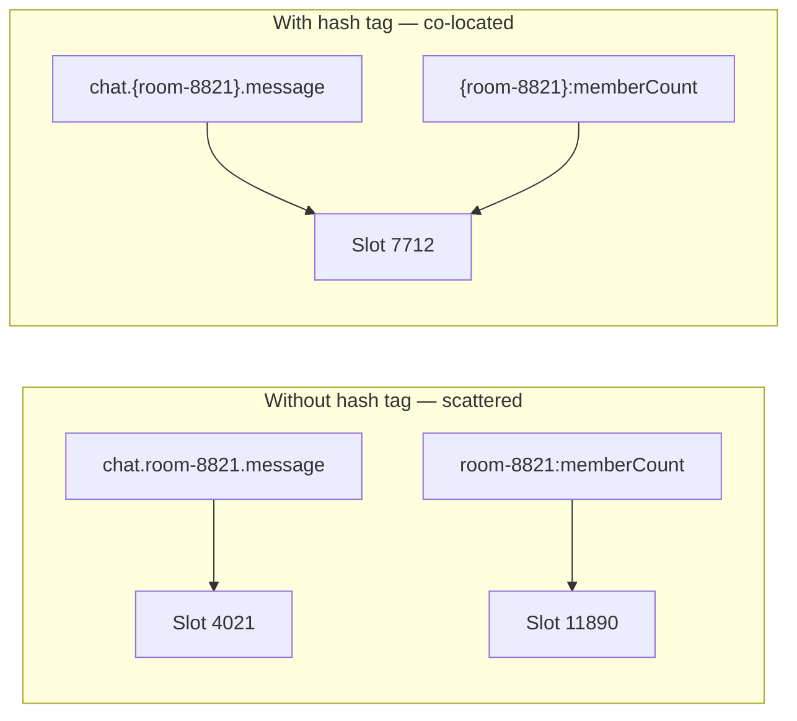

### Code examples

**redis-cli — classic pub/sub**
```bash
# Terminal A: subscribe
redis-cli SUBSCRIBE orders.42.shipped

# Terminal B: publish
redis-cli PUBLISH orders.42.shipped '{"status":"shipped","carrier":"ups"}'

# Pattern subscribe — every order event for order 42
redis-cli PSUBSCRIBE 'orders.42.*'
```

**redis-cli — sharded pub/sub (Cluster mode, Redis 7+)**
```bash
redis-cli -c SSUBSCRIBE chat.room-8821.message
redis-cli -c SPUBLISH chat.room-8821.message '{"user":"riyaz","text":"hi"}'
```

**Python (redis-py ≥ 4.5, supports sharded pub/sub)**
```python
import redis

r = redis.Redis(host="localhost", port=6379)
pubsub = r.pubsub()
pubsub.subscribe("orders.42.shipped")

for message in pubsub.listen():
    if message["type"] == "message":
        print(message["channel"], message["data"])

# Publishing
r.publish("orders.42.shipped", '{"status": "shipped"}')

# Sharded pub/sub against a Redis Cluster
from redis.cluster import RedisCluster
rc = RedisCluster(host="localhost", port=6379)
shard_pubsub = rc.pubsub()
shard_pubsub.ssubscribe("chat.room-8821.message")
rc.spublish("chat.room-8821.message", "hi")
```

**Node.js (ioredis)**
```javascript
const Redis = require("ioredis");
const sub = new Redis();
const pub = new Redis();

sub.subscribe("orders.42.shipped", (err, count) => {});
sub.on("message", (channel, message) => {
  console.log(channel, message);
});

pub.publish("orders.42.shipped", JSON.stringify({ status: "shipped" }));

// Sharded (cluster mode)
const cluster = new Redis.Cluster([{ host: "localhost", port: 7000 }]);
cluster.ssubscribe("chat.room-8821.message");
cluster.spublish("chat.room-8821.message", "hi");
```

## Real-world example: chat fan-out across WebSocket servers

This is the worked example behind "design WhatsApp/Slack/Messenger" and "how
do multiple app servers stay in sync for real-time delivery" — the most
common reason Redis Pub/Sub shows up in a system design interview at all.

### The actual problem Pub/Sub is solving here

Chat clients hold a persistent WebSocket to **one** of many stateless app
servers behind a load balancer. Each server only has live socket handles for
the users currently connected *to it*. If User A (on WS-Server-1) sends a
message to User B, and B happens to be connected to WS-Server-2, Server-1 has
no way to reach B's socket directly — it needs a relay. That relay is Redis
Pub/Sub.

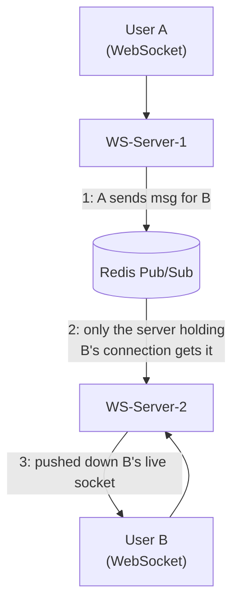

### Designing the channel: per-user inbox (recommended default)

Give every user their own channel, and have whichever server currently holds
that user's live connection subscribe to it on connect, unsubscribe on
disconnect. The sender's server never needs to know *where* the recipient
is connected — it just publishes to the recipient's channel, and Redis
delivers to whichever server (zero or one) is currently subscribed.

```
user.{user_id}.inbox
user.4711.inbox
user.9082.inbox
```

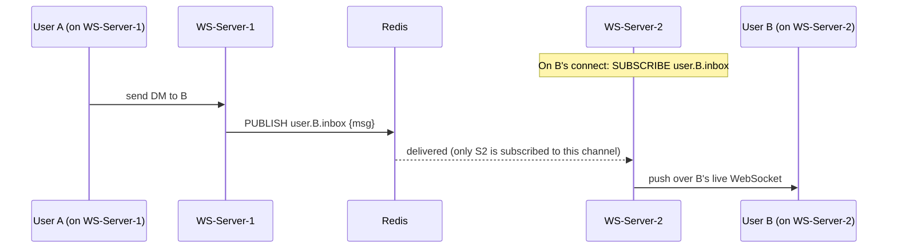

Notice what you *didn't* need: a lookup table telling Server-1 which server
B is on. Per-user channels make Redis itself the routing layer — "deliver to
whoever is subscribed" **is** "deliver to wherever the user is connected."

### Designing the channel: per-conversation (alternative for 1:1)

Some systems instead key the channel off the conversation, not the user —
useful if you want one channel per DM thread regardless of which two users
are in it (e.g., to attach conversation-level metadata via a Lua script on
the same shard):

```
chat.dm.{lower_user_id}_{higher_user_id}.messages
chat.dm.4711_9082.messages
```

Sort the two IDs into a canonical order so both participants' servers
compute the same channel name regardless of who's "sender" vs "recipient" in
a given message. Trade-off vs. per-user channels: both participants' servers
must subscribe to *every* conversation channel that has a locally-connected
participant, instead of one channel per local user — more bookkeeping, no
real benefit for plain 1:1 chat, so **default to per-user channels** unless
you have a concrete reason (e.g., per-conversation presence/typing state)
to key on the conversation instead.

### Designing the channel: group chat / rooms

A group with thousands of members can't reasonably get a channel per member
pair — you'd publish the same message once per recipient. Instead, key the
channel off the **group**, and have each server subscribe **once** if it has
*any* locally-connected member of that group, then fan out to its own local
members in-process (no extra Redis traffic for that last hop):

```
chat.group.{group_id}.messages
chat.group.55231.messages
```

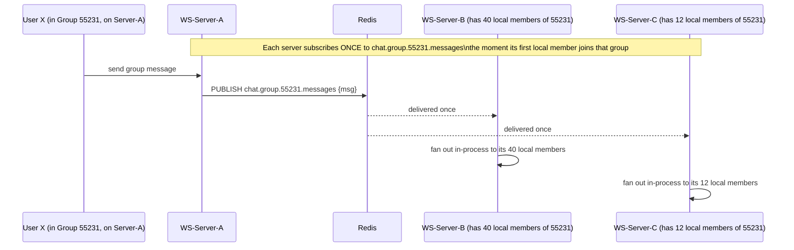

This bounds Redis-level fan-out to **"servers that have at least one member
of this group,"** not "number of group members" — the expensive last-mile
fan-out (to potentially thousands of sockets) happens locally, in-process,
on each server, which is nearly free compared to another network hop per
recipient.

### The presence problem: "which server is this user connected to?"

This is a genuinely separate concern from message delivery, and worth
calling out explicitly in an interview — don't conflate the two:

- **If you use per-user channels**, you don't need a separate routing table
  for delivery — Redis's subscription state *is* the routing table (nobody
  subscribed = user is offline, from the delivery system's point of view).
- **You still need an explicit presence registry** for anything that isn't
  "deliver a live message": showing online/offline status, read receipts,
  "last seen," and — critically — deciding whether to fall back to a push
  notification (APNs/FCM) because Pub/Sub gives no delivery confirmation and
  no offline queue.

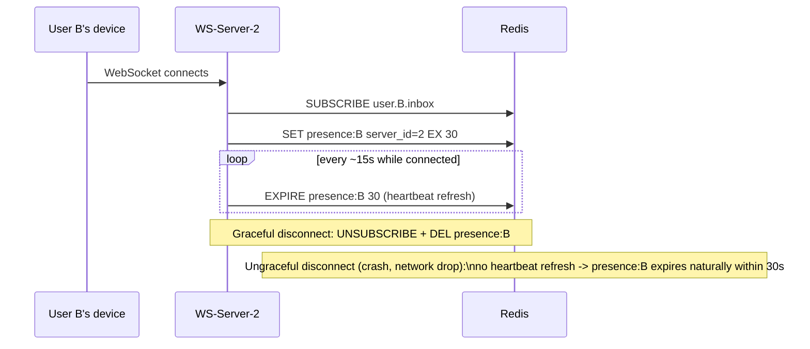

Using a **TTL-based heartbeat** for the presence key (not just set-on-connect,
delete-on-disconnect) matters because a server crash or a client that never
sends a clean close frame would otherwise leave a stale "B is on Server-2"
entry forever — the same self-healing idea as a lease.

### Scaling this — what breaks first, and the fix

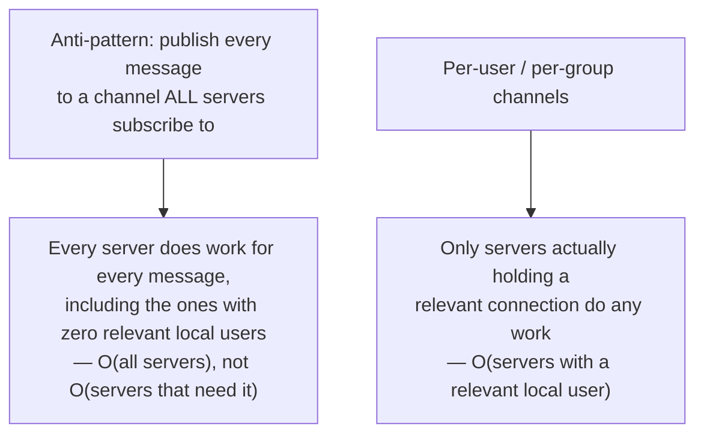

- **Millions of per-user channels + subscribe/unsubscribe churn** (mobile
  clients reconnecting constantly on flaky networks) is the real scaling
  limit of this design, not message volume. Mitigate with **Sharded Pub/Sub**
  (Cluster mode) so subscription and publish load spread across shards
  instead of hammering one Redis process — this is exactly the earlier
  "hash tag" and slot-hashing content applied to `user.{id}.inbox` channels.
- **Never broadcast a 1:1 or small-group message to a channel every server
  subscribes to "just in case."** That's the Cluster-mode broadcast-storm
  trap from earlier, wearing a chat-app costume — it makes every message
  cost O(all servers) instead of O(servers that actually need it).
- **Offline delivery isn't Pub/Sub's job.** If a message is sent while the
  recipient has no server subscribed (fully offline), Pub/Sub drops it —
  production systems persist the message to a database/queue regardless
  (for chat history and offline delivery) and use Pub/Sub only for the
  "someone is live right now" fast path; a client reconnecting always
  reconciles against the durable store, never against Pub/Sub.

### Real systems using this exact pattern

- **Socket.IO's official Redis adapter** is this pattern almost verbatim:
  every Socket.IO server instance subscribes to shared Redis Pub/Sub
  channels, and "broadcast to a room" is implemented as publish-to-Redis,
  then each server that has local sockets in that room delivers locally —
  the standard way to run Socket.IO/WebSocket servers horizontally in
  production Node.js deployments.
- **Slack-style real-time messaging backends** use the same shape: stateless
  edge/gateway servers holding live connections, a pub/sub layer as the
  cross-server relay, and a separate durable store (database, not Pub/Sub)
  as the source of truth for history and offline delivery.
- **Contrast worth naming**: WhatsApp famously does *not* use Redis for this
  — it's built on Erlang/OTP, where each user's connection is an Erlang
  process with a location-transparent process registry, so "send to user B"
  is a language-level primitive rather than an external pub/sub hop. Good to
  mention this shows you know Redis Pub/Sub is *a* solution to this problem,
  not *the only* one — the underlying problem (route a message to whichever
  server holds a live connection) is universal; the mechanism varies by
  stack.

## Redis Streams — the durable sibling (know this contrast cold)

Interviewers frequently ask "how would you make this durable?" immediately
after Pub/Sub — the answer is **Redis Streams** (`XADD`/`XREAD`/consumer
groups via `XGROUP`/`XREADGROUP`), a completely different data structure
that behaves like a miniature Kafka: persisted, replayable, consumer groups.

| | Pub/Sub | Streams |
|---|---|---|
| Persistence | None | Yes — stored as a Redis data type, survives restarts (with AOF/RDB) |
| Replay | No | Yes — read from any ID, consumer groups track position |
| Offline subscriber | Misses everything | Catches up from last-read ID |
| Consumer groups | No (Pub/Sub has no grouping) | Yes — `XREADGROUP`, load-balances like a queue |
| Cost | Cheapest — no storage | Higher — memory-resident log, needs trimming (`XTRIM`/`MAXLEN`) |
| Use when | Ephemeral signals — presence, typing indicators, cache invalidation broadcast | Anything where a missed message is a bug, not a shrug |

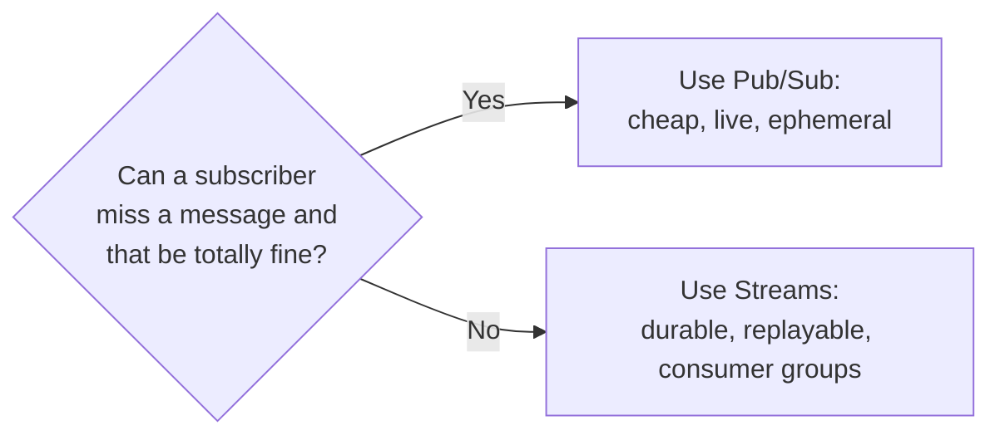

## Multi-region / production distribution

Plain Redis Pub/Sub has **no native cross-region fan-out** — a
`replicaof`/`slaveof` link only relays a single primary's publishes to that
primary's own replicas, wherever they're hosted. It is not multi-writer and
it's not a general geo-replication mechanism.

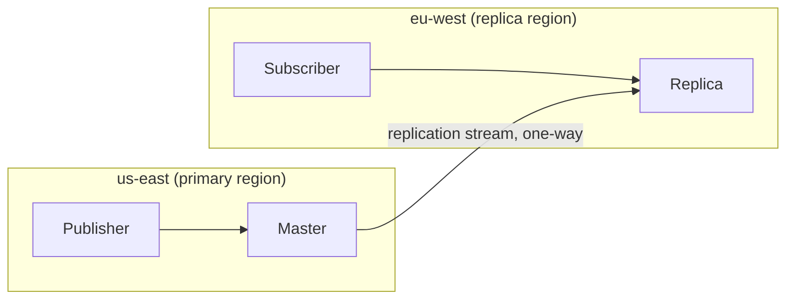

This works for **read-scaling subscribers globally off one authoritative
writer region**, but it is not active-active: `eu-west` can't publish and
have it show up on `us-east`'s subscribers without its own separate link
back, and Redis OSS gives you no conflict resolution if you try to hand-roll
that.

### Two production patterns that actually work

**1. Redis Enterprise Active-Active (CRDB)** — a commercial feature using
CRDTs for conflict-free multi-writer replication; Pub/Sub messages published
in any participating region propagate to subscribers in every region. Use
this only if you're already paying for Redis Enterprise — don't reach for it
just to solve pub/sub geo-fan-out alone.

**2. The pragmatic pattern: durable backbone + regional relay.** Almost every
real production system that needs cross-region fan-out does **not** try to
make Redis Pub/Sub itself cross-region. Instead: a durable, naturally
geo-replicated system (Kafka + MirrorMaker 2, or a cloud pub-sub service) is
the source of truth across regions, and a small regional relay service
subscribes to that global stream and **republishes locally** into each
region's own Redis for ultra-low-latency local fan-out (e.g., to WebSocket
gateway servers in that region).

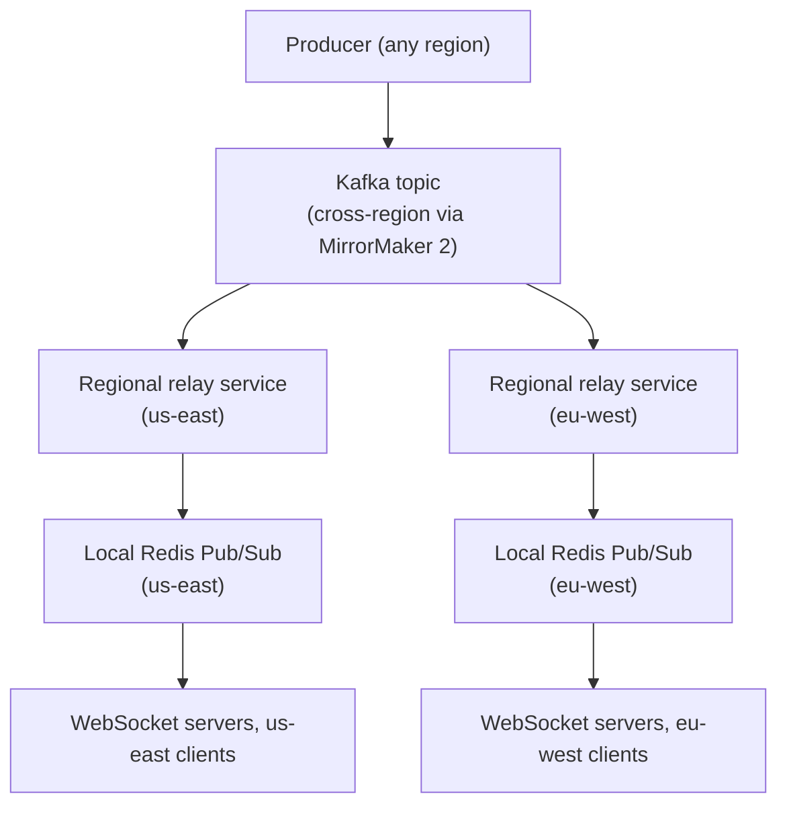

This gives you the best of both: **durability and cross-region consistency**
from Kafka, and **sub-millisecond local fan-out** from Redis — instead of
stretching Redis itself across a continent and eating cross-region latency
on every publish.

## Numbers worth knowing

| Quantity | Typical value |
|---|---|
| Same-process/same-AZ publish→deliver latency | sub-millisecond |
| Single-threaded command throughput (simple ops) | ~100K–1M ops/sec depending on payload size and hardware |
| Default `client-output-buffer-limit pubsub` | hard 32MB, soft 8MB / 60s |
| Cluster hash slots (used by both keys and sharded channels) | 16,384 |
| Classic `PUBLISH` cost in an N-node cluster | O(N) — every node checked, regardless of subscriber location |
| Sharded `SPUBLISH` cost | O(1) relative to cluster size — only the owning shard is touched |

## Memory hooks

- **Live radio vs. podcast** — Pub/Sub is live (miss it, it's gone forever);
  Streams/Kafka is a podcast (recorded, rewind anytime within retention).
- **A subscribed connection is a one-way walkie-talkie** — once you key
  `SUBSCRIBE`, that connection can only listen/unsubscribe/ping — it can't
  also place a normal order (`GET`/`SET`) until it lets go of the button.
  That's why you always see two connections in the code.
- **Sharded Pub/Sub treats a channel name like a key** — same 16,384-slot
  hashing Redis already uses for data, just applied to the channel string
  instead. If you already understand Redis Cluster key sharding, you already
  understand `SPUBLISH`.
- **Keyspace notifications are Redis talking to itself** — every `PUBLISH`
  rule in this guide (no persistence, no delivery guarantee) applies exactly
  the same to these internally-generated messages.

## How to identify this in an interview

Watch for these prompts — they usually mean "the interviewer wants Redis
Pub/Sub specifically, not a generic message broker":
- "How would multiple app server instances stay in sync for WebSocket
  broadcast?" (Redis Pub/Sub is the classic answer for fan-out across a
  stateless app server fleet.)
- "How do you invalidate a local in-process cache across all servers when
  data changes?"
- "How would you know the instant a Redis key expires?" → keyspace
  notifications.
- "Design a live presence/typing-indicator/notification feature" where
  losing an occasional update is explicitly acceptable.
- Any prompt where the interviewer emphasizes **low latency over
  durability** — that trade is Pub/Sub's entire reason to exist.
- A prompt that emphasizes **"must not lose a single event"** is a trap —
  correctly redirect to Streams or Kafka and say why.

## Mistakes to avoid

```mermaid
flowchart TD
    A["Redis Pub/Sub in production"] --> B{"Made these mistakes?"}
    B --> M1["Assumed durability\n(no persistence, ever)"]
    B --> M2["Ignored client-output-buffer-limit\n(slow subscribers get silently dropped)"]
    B --> M3["Used classic PUBLISH in Cluster mode\n(broadcasts to every node)"]
    B --> M4["Over-used PSUBSCRIBE patterns\n(cost scales with pattern count)"]
    B --> M5["No lag/delivery visibility\n(PUBSUB NUMSUB isn't a health metric)"]
    B --> M6["Assumed cross-region replication\n(only replicates to that primary's own replicas)"]
    B --> M7["Reconnected without expecting a gap\n(no session resumption — missed window is gone)"]
```

This is the timeline every candidate should be able to draw from memory —
it's the entire "at-most-once, no catch-up" property made concrete:

```mermaid
sequenceDiagram
    participant Pub as Publisher
    participant R as Redis
    participant Sub as Subscriber

    Pub->>R: PUBLISH orders.42 "msg 1"
    R-->>Sub: msg 1 delivered
    Note over Sub: network blip / GC pause / restart — connection drops
    Pub->>R: PUBLISH orders.42 "msg 2"
    Note over R: no subscriber currently on this channel —\nmsg 2 is delivered to nobody and discarded
    Sub->>R: reconnects, SUBSCRIBE orders.42
    Note over Sub: subscription starts fresh from "now" —\nmsg 2 is gone forever, no backlog, no offset to replay from
    Pub->>R: PUBLISH orders.42 "msg 3"
    R-->>Sub: msg 3 delivered
```

1. **Treating Pub/Sub as durable.** No persistence, period. If a subscriber
   is offline, restarting, or momentarily disconnected, it misses those
   messages forever — there's no backlog to catch up on. If "must not miss a
   message" is a requirement, you're describing Streams or Kafka, not
   Pub/Sub.
2. **Not knowing about `client-output-buffer-limit`.** A slow subscriber
   doesn't gracefully lag — past the configured buffer limit, Redis
   disconnects it outright to protect server memory. Size limits deliberately
   and monitor for pubsub client disconnects; don't discover this the first
   time it happens in prod.
3. **Using classic `PUBLISH`/`SUBSCRIBE` in Cluster mode at scale.** It
   broadcasts to every node's cluster bus regardless of subscriber location —
   fine at low volume, a real bottleneck at high fan-out. Use
   `SPUBLISH`/`SSUBSCRIBE` (Redis 7+) once you're in Cluster mode with
   meaningful traffic.
4. **Over-relying on `PSUBSCRIBE`.** Each pattern subscription adds cost to
   *every* publish on the server, not just the channels it matches. Prefer a
   small, fixed number of pattern subscribers (e.g., one monitoring service)
   over pattern-matching as your primary fan-out design.
5. **No observability into delivery.** `PUBSUB NUMSUB channel` and `PUBSUB
   NUMPAT` tell you subscriber/pattern counts at this instant, not whether
   any message was actually delivered or dropped — there is no delivery
   receipt. If you need to know "did this message get through," that's
   another sign you want Streams, not Pub/Sub.
6. **Assuming replication means geo-distribution.** A replica in another
   region receiving publishes from one primary is not the same as
   multi-region active-active — know the difference before you promise it in
   a design doc.
7. **Expecting to "resume" a subscription after reconnect.** There is no
   session/offset concept in classic Pub/Sub — a dropped connection means a
   silent gap, and resubscribing starts you at "now," not "where you left
   off."

## Golden rules

- **Per-user (or per-group) channels make Redis itself the routing table.**
  Don't build a separate "which server is this user on" lookup for message
  delivery if a channel-per-entity design already gets Redis to deliver only
  to whoever is currently subscribed.
- **Presence tracking and message delivery are two different problems.**
  You need an explicit, TTL-backed presence registry for online/offline
  status and offline-push decisions — but not necessarily for routing a live
  message, if your channel design already handles that.
- **If losing a message is a shrug, use Pub/Sub. If it's a bug, use
  Streams (or Kafka).** This single question resolves almost every "should
  we use Redis Pub/Sub here?" debate.
- **In Cluster mode, `SPUBLISH` is the default, not `PUBLISH`.** Reach for
  classic Pub/Sub only on a single primary (or primary+replica) deployment.
- **A slow subscriber is a dropped subscriber, not a lagging one.** Design
  consumers assuming Redis will disconnect them under buffer pressure, not
  gently throttle them.

## Cheat sheet

- Redis Pub/Sub = live broadcast, at-most-once, zero persistence, in the
  request path of `PUBLISH` itself.
- A subscribed connection (RESP2) can only run pub/sub control commands —
  that's why publisher and subscriber are separate client connections; RESP3
  push messages relax this but the mental model starts from RESP2.
- Keyspace notifications (`notify-keyspace-events`) are Redis publishing to
  itself on `__keyspace@<db>__`/`__keyevent@<db>__` channels — same
  guarantees (or lack thereof) as any other Pub/Sub message.
- Chat fan-out (WhatsApp/Slack-style): per-user channel (`user.{id}.inbox`)
  for 1:1 so Redis's subscription state doubles as routing; per-group
  channel (`chat.group.{id}.messages`) so each server subscribes once and
  fans out locally to its own members instead of once per recipient.
  Presence (who's online, where) is a separate TTL-heartbeat registry, not
  something Pub/Sub delivery needs on its own.
- Channels need no creation; naming convention is your only design lever —
  use hierarchical dot/colon names for pattern-friendliness.
- Cluster mode: classic `PUBLISH` broadcasts to **every node**; `SPUBLISH`
  (Redis 7+) hashes the channel to a slot and only touches the **owning
  shard** — always prefer sharded pub/sub at scale.
- Hash tags (`{tag}`) let you co-locate a channel with a related key on the
  same shard for atomic Cluster-mode operations.
- No native cross-region fan-out — production pattern is Kafka/managed
  pub-sub as the durable cross-region backbone, with Redis Pub/Sub used only
  for the final, local, low-latency hop within each region.
- The production failure mode to know cold: `client-output-buffer-limit`
  silently disconnects slow subscribers — that's where "missing messages in
  prod" reports usually trace back to.
