# Rate Limiter — The Story (narrative edition)

> **What this file is.** The reference file, `19-Rate-Limiter-FAANG-Guide.md`, is the one to recite from — requirements, algorithms, data model, capacity math, the master cheat sheet. This file is a second way in: the same material as one continuous story, told in plain language. Engineers at a company keep hitting a wall, patch it, and the patch itself creates the next wall — until we land on the exact same design the reference file documents. The company, **PulseAPI** (a communications API that lets developers send SMS and push notifications through it, billed per message), is fictional. But every wall it hits, and every fix it reaches for, is something a real, named system actually does: GitHub's fixed-window API limits, Stripe's and AWS API Gateway's documented token buckets, NGINX's leaky-bucket `limit_req` module, Lyft's open-source `ratelimit` service running inside Envoy, and Google's open-source Doorman for cross-region quotas. I'll say clearly, every time, whether something is a documented fact or just a reasonable stand-in number, tagged `[illustrative]`.

**The trigger phrases** for this whole topic: *"design a rate limiter,"* *"how do we stop one client from hammering our API,"* or *"how do we cap what we spend on a third-party call."* Keep one sentence in your head as you read: **a rate limiter isn't a wall — it's a bouncer with a clipboard, counting requests against a rule and letting through only what the rule allows.** The clipboard — where that count actually lives, and how it stays correct when many machines are writing to it at once — is the entire hard part of this problem. Everything below is just this one idea, getting harder in small, honest steps.

---

## Chapter 1 — The retry loop that cost $11,900 in one afternoon

It's 2018. PulseAPI is small — a REST API where developers call `POST /messages/sms`, and PulseAPI forwards each one to a carrier that charges per message sent. There is **no rate limiting anywhere** in the system. Nobody's needed it yet.

One of PulseAPI's customers, an online retailer's checkout-confirmation service, ships a bug: when the carrier is briefly slow to respond, their code retries the *same* SMS send with no backoff, no cap, every 20 milliseconds, forever, until someone notices. It runs unnoticed for about four hours. Worked number `[illustrative — PulseAPI's own pricing and retry rate, standing in for a well-documented failure category]`: roughly 110 requests/sec, nonstop, for 4 hours ≈ 1,584,000 messages sent, at $0.0075 per message ≈ **$11,880** — just under twelve grand — for one customer's bug, in one afternoon. Worse: while that customer's traffic floods PulseAPI's shared web tier, *other* customers' legitimate SMS sends start timing out too. One buggy client is starving everyone else on a shared resource — this exact scenario has a name in the field: **friendly-fire DoS**.

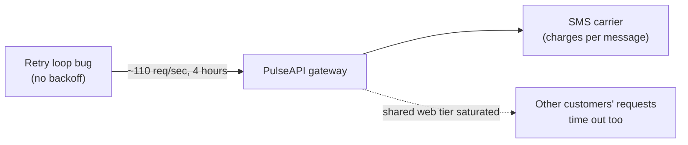

The obvious next question: *why did nothing stop this?* Because nothing was counting. There was no rule, and nothing enforcing one — any request that reached the server got forwarded, no matter how many came from the same place, no matter how fast.

**The fix, and the analogy for the rest of this story:** put a rate limiter in front of everything. Think of it as **a bouncer with a clipboard**, not a wall — it doesn't block traffic categorically, it counts requests against a rule and only lets through what the rule allows. Where does the bouncer stand? Not in the client's own code (a client SDK limiter is a courtesy — the attacker, or the buggy retry loop, controls that code and can just remove it). Not buried inside each backend service either (it works, but couples limiting logic into app code you'd have to duplicate everywhere). The bouncer stands at the **gateway**, the one place *all* traffic already has to pass through:

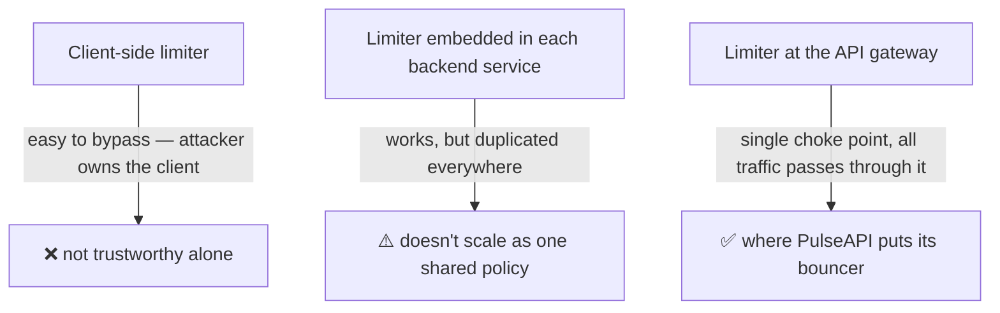

**New problem, visible within the first week of running this in production:** PulseAPI doesn't run one gateway box — it runs several, behind a load balancer, for redundancy. Which raises an immediate question: does each one of those boxes keep its *own* clipboard, or do they share one?

**How I'd say this in an interview:** "A rate limiter is a bouncer with a clipboard — it counts, checks against a rule, and lets through only what's allowed. It has to sit somewhere all traffic actually passes through, which is why client-side limiting is a UX nicety at best and the gateway is where real enforcement lives. The next question is always where the clipboard's actual numbers live once you have more than one gateway box."

---

## Chapter 2 — Every bouncer keeping his own clipboard

PulseAPI stands up 4 identical gateway instances behind a round-robin load balancer, each running its own in-process counter — a plain map from API key to a request count, reset every minute. The rule: **100 requests/minute per API key.**

Six weeks later, a partner integration team notices something odd: a customer capped at 100/min is somehow pushing through closer to **400 requests in a minute** during their peak. The reason is exactly the shape of the setup: with 4 servers and round-robin routing, that customer's traffic gets split roughly evenly across all 4 boxes, and *each* box independently thinks "you've sent 100 to *me*, that's the limit" — with no idea the same client also sent 100 to the other three. Four bouncers, each holding their own clipboard, each blind to the other three's count. `4 × 100 = 400` — 4x the intended limit, and it gets worse the more gateway boxes get added.

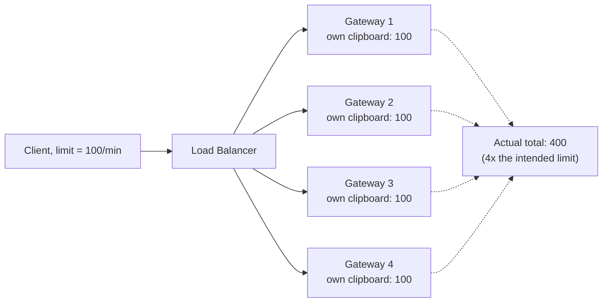

The obvious question: *why didn't anyone catch this in testing?* Because a single developer testing from one machine almost always lands on the same gateway box (or close to it) — the bug only shows up under real, spread-out production traffic, which is exactly why "it works on my machine" is a trap for this whole topic.

**The fix:** stop keeping separate clipboards. Move the count into a **shared store** — PulseAPI picks Redis, in-memory and fast — so every gateway box checks and increments the *same* number for a given key, no matter which box happens to handle the request. One clipboard at the front desk, instead of one per bouncer.

**New problem, immediately obvious once it's built:** a shared clipboard answers "where does the number live," but not "what number, exactly, and counted over what window?" Right now the counter just increments a raw integer with no notion of time at all — the very first algorithm question is still unanswered.

**How I'd say this in an interview:** "Per-server in-memory counters look fine until you have more than one server — then the limit gets divided by however many servers are in the pool, because none of them can see each other's count. The standard fix is centralizing the counter in a shared store like Redis, so the limit means the same thing no matter which node handles the request."

---

## Chapter 3 — The clipboard that resets at the stroke of the minute

PulseAPI wires the shared Redis counter to the simplest possible algorithm: a **fixed window counter**. Divide time into 1-minute buckets; each bucket has its own counter; reject once it hits 100. This is exactly what GitHub's REST API does in production, at real scale — 5,000 requests/hour, fixed window, a real and citable example.

It works, mostly. Then a customer complains their "100/min" limit let through **196 requests in about 2 seconds**. Here's the bug: 98 requests land at `0:59.5`, right before the minute boundary — allowed, since the `0:00–1:00` window's counter was still under 100. Then 98 more land at `1:00.5`, right after the boundary — also allowed, since the `1:00–2:00` window starts its counter fresh at zero. Any 60-second slice that *straddles* the two windows — say `0:30` to `1:30` — actually saw up to 196 requests, nearly double the intended limit. This is the **edge-burst problem**, and it's a structural flaw of fixed windows, not a bug in PulseAPI's code — GitHub tolerates the exact same flaw, because a bounded 2x edge case is an acceptable cost for a free, coarse limit protecting mostly-idle capacity.

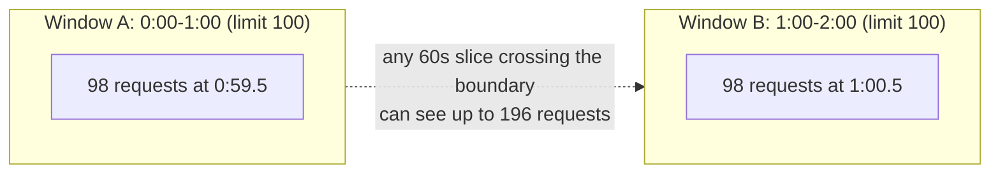

PulseAPI can't shrug this off the way GitHub does — every one of those extra requests is a real, billed carrier send. The obvious next question: *how do we make the window actually roll, instead of snapping back to zero?* First attempt: a **sliding window log** — instead of one counter, keep every single request's timestamp in a sorted log per key, evict anything older than 60 seconds on every check, and compare the log's size to the limit. This is exact — there's no edge case left, because the window is computed relative to *right now*, for every single request.

**New problem, showing up the moment traffic climbs:** PulseAPI is now doing about 4,000 requests/sec. A busy API key's log, over a 60-second rolling window, can hold **up to 240,000 timestamps** — one entry per request, even the rejected ones, until each ages out. That's real memory, per key, scaling with *traffic volume* rather than with the *limit* — the log for a busy key can be dramatically bigger than the log for a quiet one with the same limit.

**The fix that actually ships:** the **sliding window counter** — the pragmatic middle ground. Keep only *two* fixed-window counters per key (the previous window's count and the current window's count), and blend them by how much of the previous window has "bled into" the present:

```math
Rate = R_{prev} \times \frac{window - overlap}{window} + R_{curr}
```

Worked example straight from the math: previous window `R_prev = 88`, current window `R_curr = 12`, `window = 60s`, `overlap = 15s` (15 seconds into the new minute):

```
Rate = 88 × (60 − 15)/60 + 12 = 88 × 0.75 + 12 = 66 + 12 = 78
78 < 100 → allow
```

Two clipboards, blended by overlap, instead of one giant ledger of every stub. It assumes requests were spread evenly across the previous window — an approximation, not exact — but it closes the edge-burst hole to a rounding error instead of a 2x spike, at the memory cost of just two integers per key. This becomes PulseAPI's default algorithm going forward, the same choice most production systems land on.

> **A trap worth knowing:** if someone asks "which algorithm smooths the fixed-window edge spike — token bucket, sliding log, or fixed window?" — the honest answer is *none of those three*. Token bucket allows bursts rather than smoothing them; sliding log has no edges to smooth because it's exact; fixed window *causes* the edge-burst problem. The sliding window counter is the one that actually fixes it, and it's easy to leave out of the option list by accident.

**How I'd say this in an interview:** "Fixed window is the simplest thing that could work, but it has a structural edge-burst flaw — up to 2x the limit across a boundary. Sliding window log fixes that exactly but costs memory proportional to traffic, not to the limit. The sliding window counter is the production default because it keeps just two numbers per key and smooths the edge case down to an acceptable approximation."

---

## Chapter 4 — Two clipboards, two very different jobs

Two separate requirements land on PulseAPI's desk in the same sprint, and they pull in opposite directions.

First: a mobile-app customer complains their users get throttled unfairly. Their app syncs in the background and, once it wakes up, legitimately fires 20 requests in one second — well under their daily quota, just bunched up. The sliding window counter *would* actually let this through fine, since it's still counting correctly — but PulseAPI wants to be explicit about **guaranteeing burst tolerance** as a first-class feature, not an accident of the math. The named answer for "should short bursts be explicitly allowed, up to a cap" is the **token bucket**. Picture an arcade token dispenser: it drops a token into a cup at a fixed rate, up to a maximum the cup can hold; every request spends one token; empty cup, reject. Worked example from the classic version of this algorithm: capacity `C = 3`, refill rate `R = 3/min`. Three requests land in the same minute and drain the cup; a fourth in that same minute is rejected; a minute later the cup has refilled to 3. This is real, documented, production behavior — **Stripe** runs a token bucket per API key (with separate buckets for reads vs. writes), and **AWS API Gateway** explicitly documents its own limiter as a token bucket: a steady-state rate plus a burst capacity, configurable per account.

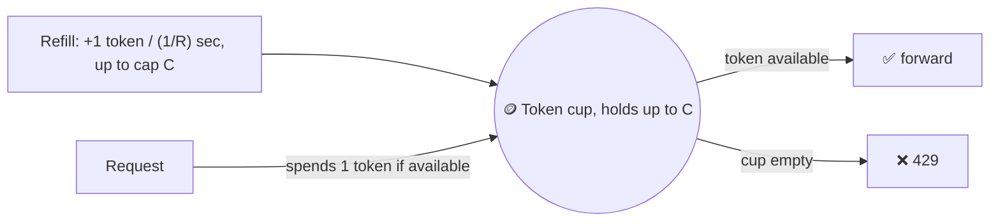

Second, the opposite problem: PulseAPI's *own* outbound calls to the SMS carrier are contractually capped — the carrier's SLA says no more than **50 sends/sec, sustained, no bursts, or they start dropping PulseAPI's traffic.** Inbound customer traffic is bursty by nature (that's the whole point of the token bucket above), but the carrier doesn't care how bursty the input was — it only accepts a flat, constant rate. The named answer here is the opposite mechanism: the **leaky bucket** — a bucket with a fixed-size hole that always drains at the same rate, no matter how fast you pour water in. This is exactly what **NGINX's `limit_req` module** implements, baked directly into the web server, and it's mathematically equivalent to what Redis's own `CELL` command implements via something called the Generic Cell Rate Algorithm.

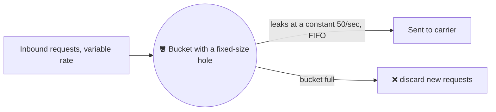

The distinction, worth saying precisely: token bucket controls the **input** — it decides whether a request is *allowed through at all*, and lets the downstream see a burst up to the cup's capacity. Leaky bucket controls the **output** — it queues requests and lets the downstream see only a fixed, constant drip, no matter what the input looked like. Same bucket vocabulary, opposite question being answered.

**New problem:** both of these buckets need more state per key than the sliding window counter's two integers — a token cup needs `{tokens, last_refill_timestamp}`, and taking a token means reading that state, doing refill math, and writing it back. Under concurrency, that read-then-write is exactly the same shape of bug that a naive fixed-window increment has — except now it's explicit and unavoidable, because refill math genuinely requires a read before a write.

**How I'd say this in an interview:** "Token bucket and leaky bucket use the same bucket-and-cup vocabulary but answer opposite questions — token bucket lets a burst *through*, leaky bucket smooths a burst *out* to a fixed rate. I'd pick token bucket for a public-facing API that should tolerate short bursts, the way Stripe and AWS API Gateway both do, and leaky bucket for feeding a downstream system with a genuinely fixed capacity, the way NGINX's `limit_req` does."

---

## Chapter 5 — Two bouncers peeking at the same "4"

PulseAPI's counter-update code, until now, does the obvious thing: read the current count, check it against the limit in application code, then write the incremented value back. One night, a monitoring dashboard flags a customer capped at 100/min who actually got **118 requests through** in a single minute — not a huge overage, but a real one, and the sliding-window-counter math itself isn't wrong here. The bug is concurrency: two gateway processes, handling two requests for the same API key at nearly the same instant, both `GET` the counter and both see `4` (well under the limit), both compute `5` in their own memory, and both `SET` it back to `5`. Both requests get admitted — but only one increment actually "happened," from the store's point of view. This is the classic **get-then-set** race, and it can happen dozens of times a minute under real concurrent load, quietly padding every customer's effective limit by a few percent.

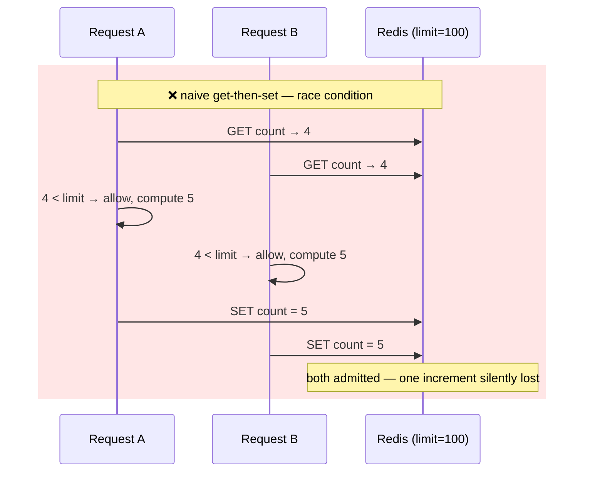

The obvious question: *didn't centralizing the clipboard in Chapter 2 already fix this?* No — "shared" only means one clipboard exists, not that reading it and writing it happens as one indivisible step. Two bouncers can absolutely still both peek at the same "4" written on that one shared clipboard before either of them updates it.

**The fix:** stop doing get-then-set — do **set-then-get**, atomically. Redis's `INCR` command increments the counter *and* returns the new value in a single, indivisible operation — there's no gap in the middle for a second request to sneak a read.

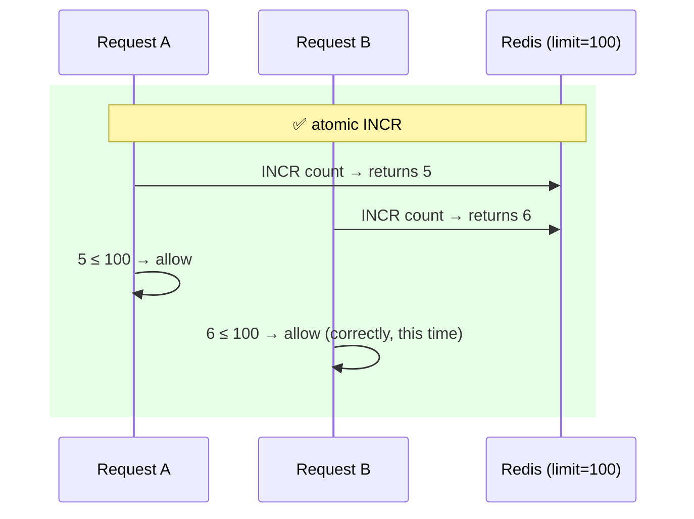

For the token bucket from Chapter 4, a plain `INCR` isn't enough — refilling tokens, checking availability, decrementing, and setting a TTL are *multiple* steps, and each one individually atomic still leaves gaps between them. The fix one level up: bundle the whole sequence into a **Lua script** that Redis runs server-side, atomically, as a single round trip — "check refill, check availability, decrement, done" happens as one indivisible unit, with nothing else able to interleave partway through.

**New problem:** atomic ops close the correctness gap, but they don't make the round trip to Redis free. Every single request, for every customer, now pays a real network hop before it can be forwarded at all — is that actually sustainable once traffic is real production scale, not a demo?

**How I'd say this in an interview:** "A shared counter doesn't automatically mean safe concurrent access — get-then-set has a race window that two nearly-simultaneous requests can both slip through. The standard fix is an atomic increment like Redis's `INCR`, and for anything needing more than one step — like a token-bucket refill — a Lua script that runs the whole sequence as one atomic round trip on the server."

---

## Chapter 6 — Checking the master clipboard on every single letter

PulseAPI's traffic has grown to a real number worth doing math on: **20,000 requests/sec** across all customers, at peak. Each request now does one atomic Lua check-and-increment against Redis before being forwarded. Add roughly 2x headroom for retries and TTL housekeeping, and that's about **40,000 ops/sec** the counter store needs to sustain — comfortably inside what a single Redis node can do (a simple-ops Redis node typically handles somewhere from 100K up to 1M ops/sec). So throughput isn't the bottleneck here. Latency is.

Every one of those 20,000 requests/sec, even the ones nowhere near their limit, now pays a same-datacenter round trip to Redis — roughly 0.5–1ms — *before* the request can even be forwarded to the actual backend. That's not a lot on its own, but it's now sitting on the critical path of literally every request PulseAPI handles, adding a fixed latency tax that has nothing to do with what the backend itself needs to do its job. At 20,000 req/sec, that's 20,000 extra round trips a second, permanently baked into p99 latency.

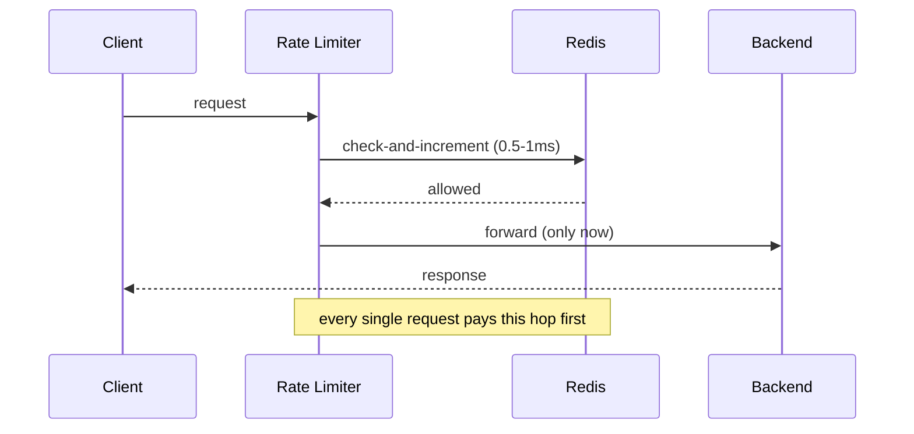

The obvious question: *does the bouncer really need to phone the back office before waving anyone through?* No — split the work. Keep a short-lived **local cache** of counts at each gateway, check *that* first and respond immediately (the **online path**), and update the real counter in Redis **asynchronously**, after the fact (the **offline path**). The bouncer doesn't run to the back office to log every single guest before letting them in — they wave people through off a running tally they keep themselves, and the back office gets the full log a moment later.

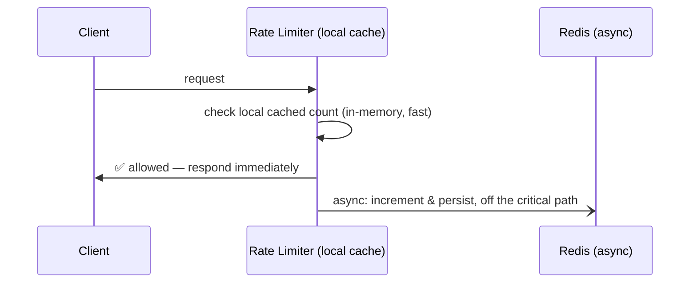

**New problem:** a locally cached count can drift from the real, shared count between sync cycles. If the local cache syncs with Redis every 500ms `[illustrative sync interval]`, a customer capped at 100/min (~1.67/sec) who happens to hit *two different* gateway boxes right in that 500ms gap can, in the worst case, get counted twice for a moment before the two boxes reconcile. It's a real, bounded overage — small, but real — and PulseAPI accepts it deliberately: a little slack in exchange for taking Redis off the critical path of every single request. That's the exact same accuracy-vs-cost trade every algorithm in this story has made, just moved up a layer, from the algorithm to the architecture itself.

**How I'd say this in an interview:** "A synchronous check-and-increment on every request adds real, permanent latency, even when throughput isn't the bottleneck. Splitting into an online path — check a local cache, respond immediately — and an offline path — persist the real update asynchronously — takes the store off the critical path, at the cost of a small, bounded window where a client can slip slightly past the limit."

---

## Chapter 7 — Whose watch actually says "now"

The token bucket's refill math needs to know how much time has elapsed since the last request. The sliding window counter needs to know exactly where "now" sits relative to a window boundary. Both depend on a timestamp — and PulseAPI's gateway fleet now spans multiple availability zones, each box running its own system clock.

One gateway box has a misconfigured NTP daemon and its clock drifts **6 seconds ahead** of the rest of the fleet `[illustrative — the specific drift; clock skew from unsynced NTP is a real, documented failure mode]`. For most systems that's nothing. For a token bucket, it's a real bug: if that drifting box computes "elapsed time since last refill" using its *own* clock, it thinks 6 extra seconds have passed since the last request — refilling roughly 6 seconds' worth of extra tokens that shouldn't exist yet, and letting a customer burst past their real quota, but only for requests that happen to land on that one box. For the sliding window counter, the same drift can place a request in the *wrong* window right near a boundary — quietly reintroducing the exact double-counting problem the sliding window design exists to prevent in the first place.

The obvious question: *whose clock should actually decide "now"?* Not each gateway box's own clock — because there's no reason to trust that any two boxes agree, and the whole point of a shared limit is that it means the same thing everywhere. The answer is the **shared store's** clock — the one clock every gateway box can agree is the same clock, because there's only one of it.

**Fixes, cheapest first:**

1. **Compute "now" at the store, not on the gateway node** — use Redis's own `TIME` command (or call it from inside the same Lua script already doing the atomic check) so every caller, regardless of which box it's running on, agrees on the same clock.
2. **Run NTP/chrony on every node**, as an actual production dependency, not an afterthought — properly synced servers typically drift by single-digit milliseconds from each other, which is negligible against windows measured in seconds to minutes.
3. **Prefer coarser windows** where sub-second precision doesn't matter — a 60-second window absorbs a few milliseconds of drift for free; only sub-second limits are meaningfully sensitive to clock skew at all.

**How I'd say this in an interview:** "Any timestamp-based algorithm — token bucket refill, sliding window boundaries — is only as correct as the clock it's computed against. In a distributed setup, the fix is to compute 'now' using the shared store's clock, like Redis's own `TIME` command, instead of trusting each gateway node's local clock, which can drift. The memory hook I use: if correctness depends on 'now,' ask whose clock 'now' actually is."

---

## Chapter 8 — The one client who floods a single clipboard

A food-delivery app, one of PulseAPI's biggest customers, goes viral during a televised sports final. Their traffic on a single API key spikes from a typical 200 req/sec to **9,000 req/sec** `[illustrative spike magnitude — the celebrity-key pattern itself is real and well-documented]`. That one API key hashes to one specific Redis shard, and that shard's node starts timing out under the load — not just for the viral customer, but for **every other customer** whose key happens to hash to that same shard, purely by bad luck of the hash function. One key hammering one resource, taking down everyone sharing that resource with it — the same shape of problem as Chapter 1's retry loop, just one layer further down the stack, on the counter store itself instead of the SMS carrier.


The fix, once the pattern is named: split that one key's own counter across **multiple sub-counters** — write to a randomly-chosen sub-key on each request, and sum all the sub-keys together when checking the total. Instead of one clipboard tracking this one VIP guest's headcount, split it across, say, 8 clipboards at 8 different desks, and add them up whenever anyone actually asks for the total. More sub-keys means less write contention on any single one, at the cost of reads (the check itself) getting slightly slower — summing 8 numbers instead of reading 1 — and slightly less precise, since a check can race slightly against a write landing on a *different* sub-key at the same instant.

Separately, a related-but-different problem shows up once PulseAPI leans on the per-node local caching from Chapter 6: if a given key's requests can land on *any* gateway node, and each node keeps its own local cache, that's Chapter 2's every-bouncer-has-his-own-clipboard problem all over again, just reintroduced through a different door. The fix for *this* is routing, not counting: **consistent hashing** (or sticky sessions at the load balancer) so a given key's requests reliably land on the *same* node — and, as a bonus over a plain `hash(key) % N`, only the fraction of keys owned by a node that dies or gets replaced needs to remap, instead of reshuffling every key in the system.

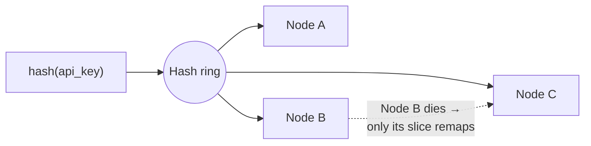

**How I'd say this in an interview:** "A single hot key can saturate whatever shard it lands on and degrade every neighbor sharing that shard — the fix is sharded sub-counters, summed at read time, trading a little read latency and precision for a lot less write contention. That's a different problem from routing a key to the same node consistently for local caching — that one's solved with consistent hashing, not counter sharding."

---

## Chapter 9 — Waving everyone through when the clipboard office is unreachable

One night, PulseAPI's Redis cluster has a real network partition to one availability zone, lasting **90 seconds**. Every gateway node, still synchronously depending on Redis for its offline-sync check-ins from Chapter 6, starts timing out on its calls — and each timeout takes the full connection-timeout window (2 seconds `[illustrative timeout config]`) to fail before the request can even be decided. The result: for those 90 seconds, PulseAPI's throughput across the *entire platform* — not just the customer near their limit — drops to under 10% of normal, because every request is now stuck waiting out a doomed call to a store that isn't answering. The rate limiter, built to protect the system, became the outage.

The obvious question: *when the clipboard office genuinely can't be reached, should the bouncer wave everyone through, or turn everyone away?* This isn't a technical question — it's a policy question, and the honest answer is "it depends what's being protected," decided per rule, in advance, not discovered live during an incident.

**The fix: a circuit breaker.** After some number of consecutive failures or timeouts — say 5 in a row — the breaker "opens," and gateway nodes immediately stop even attempting to reach Redis, falling back to a pre-decided policy instead of hanging on every single request waiting to find out. For PulseAPI, that policy is different depending on what's at stake: general API traffic **fails open** — let it through unthrottled for now, because losing the whole platform for a few minutes is worse than losing precise limiting for a few minutes. The **login endpoint** fails closed — reject or queue, because a Redis blip during an active credential-stuffing attempt is exactly the worst possible moment to go permissive. The breaker periodically "half-opens," letting a trickle of traffic through to test whether Redis has actually recovered, before fully closing again.

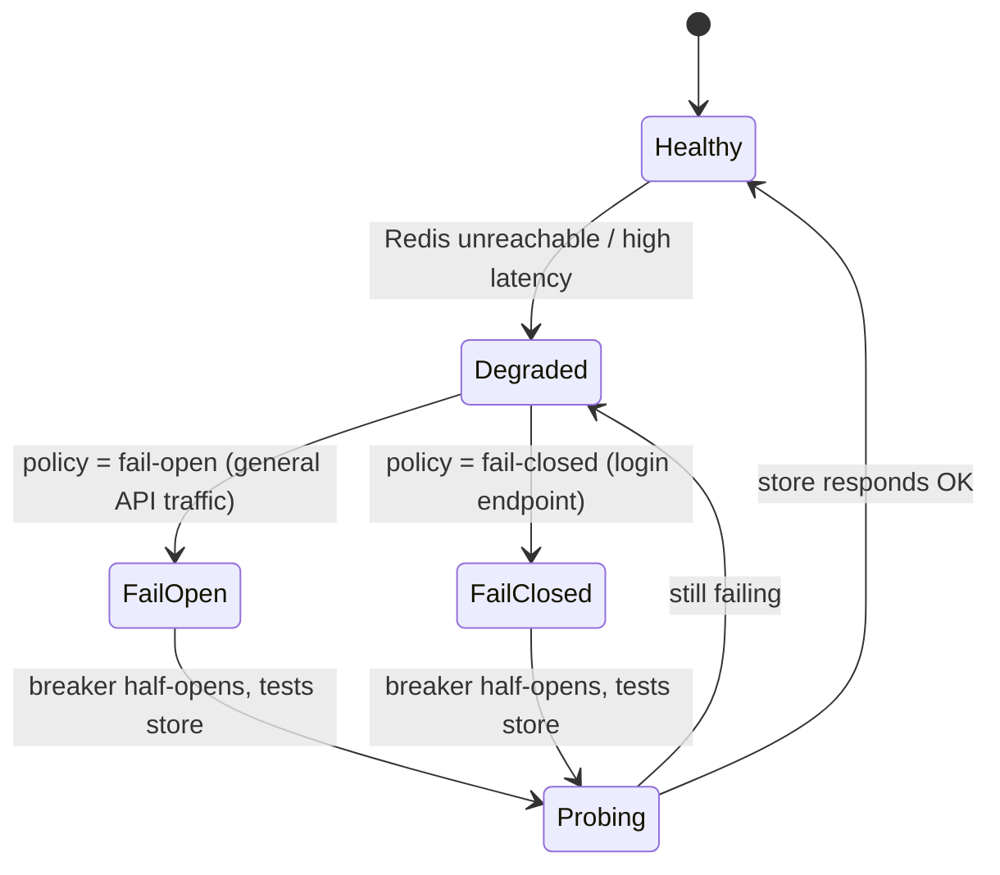

Put together, this is the real production shape PulseAPI ends up running: **local cache for fast checks (Ch6) + async sync to Redis (Ch6) + a circuit breaker that knows when to stop asking and fall back to a pre-decided policy (this chapter).** It's the same accuracy-vs-cost, availability-vs-consistency trade that's run through this whole story, now wired all the way through as an actual production architecture, not just a single algorithm choice.

**How I'd say this in an interview:** "Fail-open versus fail-closed is a policy decision, not a default — I'd decide it per rule, before an incident, not during one. A circuit breaker automates *when* that policy kicks in: after N consecutive failures it opens, applies the pre-decided fallback immediately instead of hanging every request on a dead store, and periodically half-opens to check if the store's back."

---

## Chapter 10 — Opening a second country without calling headquarters on every request

PulseAPI expands into the EU, standing up a second regional gateway cluster with its own local Redis. Most customers only ever hit one region and don't care. But a handful of PulseAPI's largest enterprise customers have a **single global quota** — say, 1,000,000 requests/day, total, no matter which region it's sent from.

The obvious first idea: have the EU cluster check the US cluster's Redis (or vice versa) on every request, to keep one truly global, always-consistent count. The obvious problem: a cross-region round trip runs **50–150ms** — added to *every single request* from either region, just to protect one shared counter for a handful of enterprise accounts. That's an unacceptable latency tax on all EU traffic, for a feature most customers don't even use.

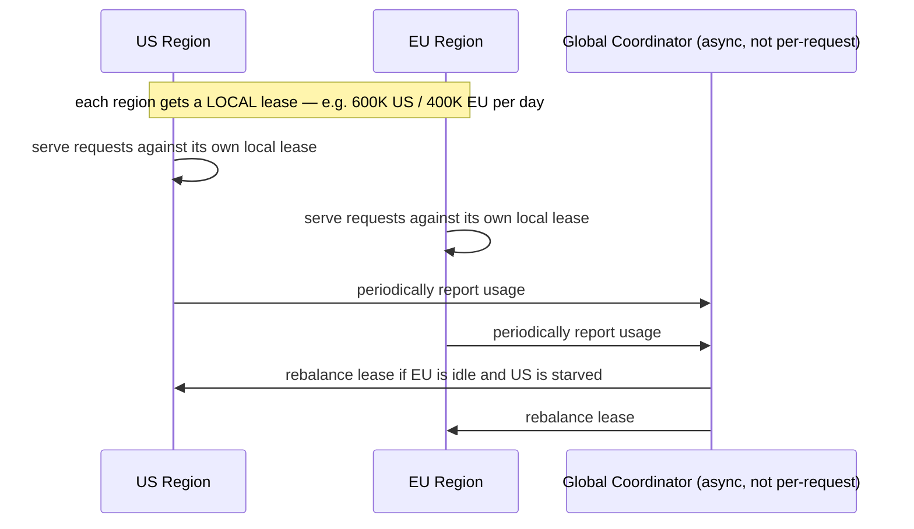

The fix: split the global quota into **local leases per region**, and enforce each lease fast and locally, with no per-request cross-region call at all. PulseAPI's 1,000,000/day enterprise quota becomes, say, a 600,000/day US lease and a 400,000/day EU lease, each region enforcing its own lease independently. A separate, async, low-frequency process periodically compares actual usage across regions and **rebalances the leases** — if the EU region is running quiet and the US region is close to exhausting its lease, some of the unused EU allotment gets reassigned to US. This is the real, documented model behind Google's open-source **Doorman**: distributed, lease-based fair sharing across regions, reconciled asynchronously instead of checked synchronously.

The trade-off, stated plainly: PulseAPI gives up perfect, real-time global precision — for a few minutes, a customer could theoretically burst slightly past 1,000,000 if both regions happen to use their full local lease right before a rebalance — in exchange for keeping every single request fast and regional. Precisely the same shape of trade as every earlier chapter, just at the scale of continents instead of servers.

**How I'd say this in an interview:** "Real-time global limits across regions would need a cross-region round trip on every request, which is a latency non-starter at 50 to 150 milliseconds. The standard trick, the same idea behind Google's Doorman, is to split the global budget into local leases per region, enforce each lease fast and locally, and reconcile the leases periodically and asynchronously — trading perfect global precision for regional low latency."

---

## Chapter 11 — Telling the well-behaved clients how to behave

One thing has been quietly wrong since Chapter 1: when a request gets rejected, PulseAPI's gateway just... drops it, with a generic error and no explanation. Support tickets pile up: *"why was I blocked? For how long? What's my actual limit?"* Worse — some customer SDKs, seeing a vague failure with no guidance, just retry immediately and repeatedly, turning a well-behaved client into an accidental version of Chapter 1's own bug.

**The fix:** always respond to a throttled request with the standard, expected shape — **HTTP `429 Too Many Requests`**, a **`Retry-After`** header telling the client exactly how long to back off, and `X-RateLimit-Limit` / `X-RateLimit-Remaining` / `X-RateLimit-Reset` headers so a well-written client can see its own quota state and self-adjust before it even hits the wall. Discord, for a real comparison, returns exactly `Retry-After` on its own `429`s. Silent drops don't protect anyone — they just turn cooperative clients into unwitting attackers.

Along the way, PulseAPI also settles the granularity question for good — not one limit, but several tiers running simultaneously:

| Limit tier | Rule | Why it exists separately |
|---|---|---|
| Per-API-key | Freemium: 100/min · Paid: 10,000/min | The main business-facing quota, tied to what a customer pays for |
| Per-IP | 20 req/min/IP on unauthenticated endpoints (signup, login) | A blunt net for traffic that hasn't even proven who it is yet |
| Global | 5,000 outbound sends/sec company-wide, regardless of who's asking | Protects PulseAPI's own carrier connection itself, not any one customer — the rare case where the limit isn't "per someone," it's on the shared resource directly |

The **login endpoint** specifically stays fail-closed, echoing Chapter 9's decision — a Redis blip during a live credential-stuffing attempt against customer accounts is exactly the wrong moment to go permissive, even though general API traffic fails open. And paid enterprise customers get **soft throttling** — a 5% grace over their cap (10,000 → 10,500) — rather than a hard cliff, since a momentary overage from a paying customer is a worse look than a slightly generous limit; freemium customers get **hard throttling**, no exceptions, since there's no revenue relationship to protect against a hard cutoff.

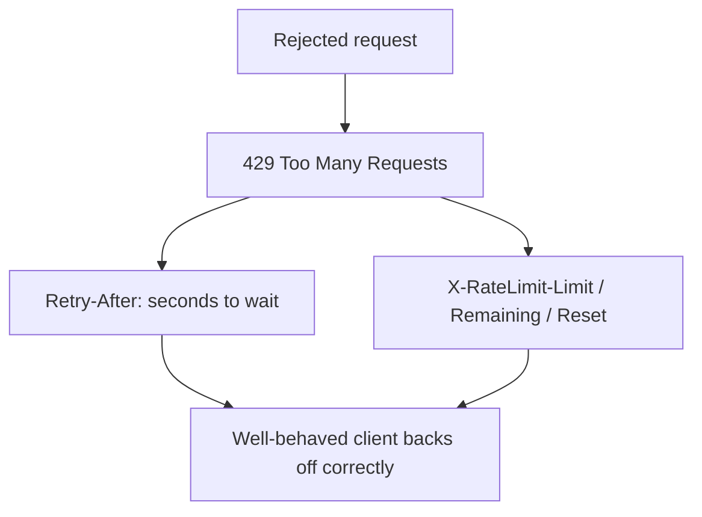

**How I'd say this in an interview:** "A rejection without an explanation just turns well-behaved clients into accidental attackers — always return 429, Retry-After, and the X-RateLimit headers so a client can self-correct. And one limit is almost never enough in practice — I'd expect per-user, per-IP, and often one limit protecting the shared downstream resource itself, all running at once, each with its own fail-open/fail-closed and hard/soft policy decided deliberately, not by accident."

---

## Where the story actually lands


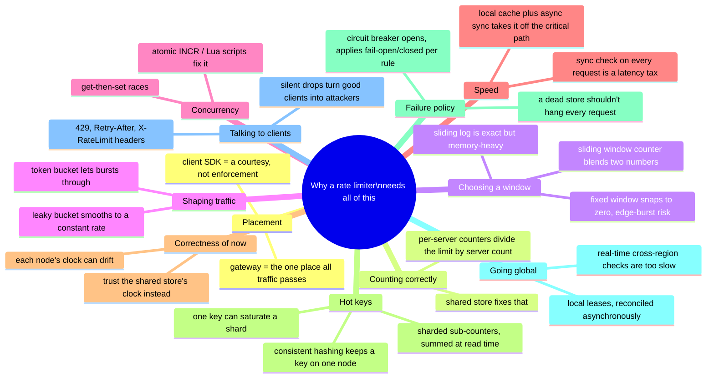

Every real rate limiter you'll design in an interview sits *somewhere* on this chain. The skill isn't reciting all eleven chapters — it's stopping where the stated requirements say to stop. A single-service internal API with modest scale might reasonably stop around Chapter 6. A public, multi-region, billed-per-call platform has to reach Chapter 9 and 10. If nobody's mentioned multiple regions, walking all the way to Chapter 10 unprompted reads as padding, not depth.

---

## Grill me — adversarial follow-ups

**Q1: "Why not just make the rate limit generous enough that Chapter 2's per-server overcounting never matters in practice?"**
Because the overcounting scales with however many gateway boxes you add — it's not a fixed slack you can absorb once, it's a multiplier that gets worse every time you scale out for unrelated reasons. You'd be tying your rate-limit correctness to your gateway fleet size, which is exactly the kind of hidden coupling that bites you the next time ops adds capacity for a totally different reason.

**Q2: "Isn't the sliding window counter just... wrong, since it assumes even distribution within the previous window?"**
Yes, honestly — it's an approximation, not an exact count, and it can be fooled by a client who deliberately clusters requests at one end of a window. But the error is small and bounded, and the cost of the exact alternative — a sliding window log — is memory proportional to traffic instead of to the limit. For almost every real system, that trade is worth making; you'd only reach for the log if you had a small key space and truly needed exactness.

**Q3: "You picked token bucket for inbound and leaky bucket for the outbound carrier call — could you have used the same algorithm for both?"**
Not without giving something up. The inbound side explicitly wants to let legitimate bursts through, which is what token bucket is for. The outbound side has a hard contractual ceiling with the carrier that must never spike, which only leaky bucket's constant-drain guarantee gives you. Using leaky bucket inbound would unnecessarily delay legitimate bursty clients; using token bucket outbound would let PulseAPI itself violate the carrier's SLA.

**Q4: "Atomic INCR fixed your race condition — so why do you ever need a Lua script instead of just INCR everywhere?"**
Because INCR only makes *one* operation atomic. The moment your logic needs more than one step to make a decision — check a token bucket's refill math, then decide, then decrement, then set a TTL — there's a gap between those steps where another request can interleave, even if each individual step is atomic on its own. A Lua script closes that gap by running the whole sequence as one indivisible unit on the Redis server itself.

**Q5: "If the online/offline split from Chapter 6 lets a client slip slightly past the limit during the sync gap, isn't that just... a bug you're choosing to ship?"**
It's a deliberate, bounded trade-off, not an oversight. The alternative — checking the real, authoritative counter synchronously on every request — puts a real network hop on the critical path of every single request, which doesn't scale. A short, bounded overage during a sync gap is a much smaller cost than adding permanent latency to 100% of traffic to close a gap that's usually milliseconds wide anyway.

**Q6: "Why does clock skew matter for a fixed window counter but you didn't mention it in Chapter 3?"**
A pure fixed-window counter that only counts requests — with no refill math, no rolling boundary computed relative to "now" — is actually the one algorithm that's least sensitive to clock skew, since it only needs to know which coarse bucket a timestamp falls into, not a precise elapsed duration. Token bucket and sliding window counter both depend on a *precise* notion of elapsed time or "now," which is exactly why skew bites them and not a plain fixed window.

**Q7: "Sharded sub-counters fixed your hot key — doesn't that just mean every key should always be sharded, all the time?"**
No — sharding trades write contention for read cost and precision, and most keys never see enough traffic to need that trade. Sharding every key by default means every single rate-limit check now sums N sub-keys instead of reading one, for no benefit on the 99% of keys that were never going to be hot. The right move is detecting or predicting which keys are actually hot and only sharding those.

**Q8: "Your circuit breaker fails open for general traffic — doesn't that mean an attacker could deliberately knock Redis over just to bypass the rate limiter entirely?"**
That's a real risk worth naming, and it's exactly why the policy isn't uniform — the login endpoint and anything security-critical fail *closed* specifically because that attack path exists. For general API traffic, the calculation is that losing the whole platform to a Redis outage is worse than a short window of reduced throttling, but that's a judgment call made explicitly per rule, not a blanket default, and it's worth saying that trade-off out loud unprompted.

**Q9: "Given this whole story, if someone just says 'design a rate limiter' cold, where do you actually start?"**
I'd ask the two or three questions that decide almost everything downstream: rate limit per what — user, IP, API key — and is this one service or a policy shared across many services and regions, and what's the cost of a client slightly exceeding the limit versus the cost of enforcing it exactly. Then I'd walk forward from a shared counter and an algorithm choice only as far as those answers actually require — sharding, circuit breakers, and multi-region leases are things you earn by naming a real requirement, not defaults you bolt on to sound thorough.

---

## Cheat sheet — one line per stop on the story

- **No limiter at all**: one bug or one attacker can cost real money and starve every other client on a shared resource — the whole reason a rate limiter exists.
- **Placement**: gateway/middleware, because it's the one place all traffic already passes through — client-side is a courtesy, never the enforcement point.
- **Per-server counters**: divide your real limit by however many servers you have — fix by centralizing the count in a shared store.
- **Fixed window counter**: simplest option, but can let up to 2x the limit through across a window boundary — the edge-burst problem.
- **Sliding window log**: exact, no edge case, but memory scales with traffic volume, not with the limit — expensive at real scale.
- **Sliding window counter**: two blended numbers instead of a full log — the production default, an approximation good enough for almost everything.
- **Token bucket**: lets bursts *through*, up to a cap — the right tool when the input side should tolerate spikes (Stripe, AWS API Gateway).
- **Leaky bucket**: smooths bursts *out* to a fixed rate — the right tool when the output side has a hard, constant capacity (NGINX `limit_req`).
- **Get-then-set race**: two requests can both read the same count and both get admitted — fixed by an atomic `INCR`, or a Lua script for anything multi-step.
- **Critical path**: a synchronous check on every request is a permanent latency tax — split into a fast local-cache check plus an async persisted update.
- **Clock skew**: token-bucket refill and sliding-window boundaries both depend on "now" — compute it at the shared store's clock, not each node's own.
- **Hot key**: one client can saturate the shard it happens to land on — sharded sub-counters, summed at read time, fix write contention at some read cost.
- **Consistent hashing**: keeps a key's requests landing on the same node for local caching, and only remaps a small slice when a node changes.
- **Circuit breaker**: a dead store shouldn't hang every request — trip after N failures, apply a pre-decided fail-open/fail-closed policy per rule, then probe to recover.
- **Multi-region**: real-time cross-region checks cost 50-150ms per request — split the quota into local leases, reconcile asynchronously instead (Doorman model).
- **Talking to clients**: always return `429` + `Retry-After` + `X-RateLimit-*` — a silent drop just turns a good client into an accidental attacker.
- **The meta-lesson**: every fix in this story buys one property — correctness, low memory, burst control, concurrency safety, low latency, timestamp correctness, shard fairness, resilience, or global scale — by spending a different one. Say the trade in the same sentence you propose the fix.
