# Rate Limiter — FAANG System Design Interview Guide

> **Enhancement notes:** This pass added an explicit **data model** for the rule DB and counter store (§8), an **architecture-evolution walkthrough** — v1 naive per-server counters → v2 centralized Redis → v3 local cache + async sync + fail-open circuit breaker (§10), a **clock-skew** deep dive for timestamp-based algorithms in a distributed setting (§10), and a **fail-open/fail-closed decision flowchart** built around a circuit breaker with a failure threshold and half-open probe (§16). It also added a couple of trade-off rows and cheat-sheet lines that reference this new material. Everything else — the algorithm deep dives, capacity math, race-condition fixes, real-world examples, and cheat sheets — was already solid and is left as-is. New material is marked with 🆕.

## 1. Mental Model

A rate limiter is a **bouncer with a clipboard**, not a wall. It doesn't block traffic categorically — it counts, compares against a rule, and lets through only what the rule allows, rejecting (or queuing) the rest. The clipboard (counter state) is the hard part of this problem, not the door.

Three ideas carry the entire topic:

- **It's a counting problem under concurrency.** Every algorithm is really "how do I count events in a time window, cheaply and correctly, when thousands of counters are being incremented concurrently from many machines?"
- **It protects the protector, not the resource.** A rate limiter that itself becomes slow, unavailable, or a single point of failure has made things worse, not better. It must be cheaper and more available than the thing it guards.
- **The interesting trade-off is accuracy vs. cost vs. smoothness**, and every algorithm sits at a different point on that triangle.

## 2. Interview Playbook

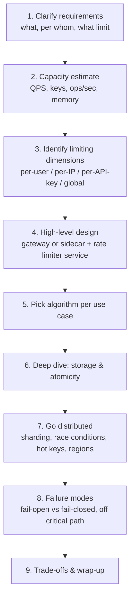

Talk through it in this order out loud. Interviewers are grading whether you *derive* the algorithm choice from the requirement, not whether you recite the five algorithm names.

## 3. Requirements Clarification Checklist

Ask these in the first two minutes — each answer materially changes the design, and asking them signals you've done this before.

| Ask | Why it changes the design |
|---|---|
| Rate limit **per what**? (user, IP, API key, device, endpoint) | Determines the counter key, and whether you'll face a hot-key problem |
| One service, or a **shared policy across many services/regions**? | Single-node cache vs. centralized store vs. multi-region design (§10) |
| Hard cutoff, or can we **degrade gracefully**? | Hard / soft / elastic throttling choice (§6) |
| What's the cost of **over-counting slightly**? | Sliding window counter (approximate, cheap) vs. sliding window log (exact, costly) |
| Is this protecting **cost, security, or fairness**? | Fail-open vs. fail-closed policy (§16) |
| Expected **QPS and number of distinct keys**? | Sharding and capacity-estimate inputs (§13) |
| Do clients need to **self-throttle** (e.g. SDKs, partners)? | Whether you expose `X-RateLimit-*` headers vs. just a `429` |

### Functional & non-functional requirements (baseline)

- **Functional:** limit requests per client within a configurable time window; notify the client when the limit is crossed.
- **Non-functional:** **available** (it's a protective layer — it can't be the thing that goes down first), **low-latency** (every request pays its cost), **scalable** (must track an ever-growing number of clients).

## 4. What It Is & Why It Exists

A rate limiter caps the number of requests a client can issue to a service in a time window and throttles anything past that. It's a defensive layer, not a feature — it exists to keep a shared, finite resource usable and fair.

| Motivation | Concrete scenario |
|---|---|
| Prevent resource starvation | "Friendly-fire DoS" — a buggy retry loop in a client hammers your API and starves other tenants |
| Stop abuse / attacks | Brute-force login attempts, credential stuffing, L7 DDoS |
| Enforce policy & quotas | Freemium tiers, "500 requests/min unless you upgrade" |
| Control data flow | Backpressure — smooth a bursty producer into a steady rate a downstream system can absorb |
| Control cost | Cap spend on metered downstream calls (SMS, email, third-party APIs, GPU inference) so a bug or attacker can't run up a bill |

## 5. Where to Place a Rate Limiter

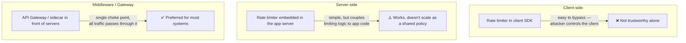

Client-side limiting is real (it improves UX and cuts wasted round-trips) but it's a courtesy, never the enforcement point — always back it with server-side or gateway enforcement. Middleware/API-gateway placement wins in practice because API endpoints are already the vantage point through which *all* traffic flows, so you get complete coverage for free.

## 6. Types of Throttling

| Type | Behavior | When to use |
|---|---|---|
| **Hard throttling** | Requests over the limit are discarded, no exceptions | Security-critical limits (login attempts, payment API abuse) |
| **Soft throttling** | Limit can be exceeded by a fixed percentage (e.g. 500 → 525, a 5% grace) | Customer-facing quotas where a hard cliff hurts UX |
| **Elastic / dynamic throttling** | Limit can be exceeded further if the system has spare capacity, with no fixed cap | Internal systems where you'd rather use idle capacity than reject work |

**Memory hook:** Hard = wall. Soft = wall with a 5% crumple zone. Elastic = wall that moves with how full the room is.

## 7. High-Level Design & Architecture

Start with the big picture before zooming into one request — interviewers want to see the whole system take shape first.

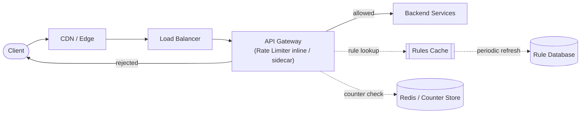

Then zoom into one request's journey:

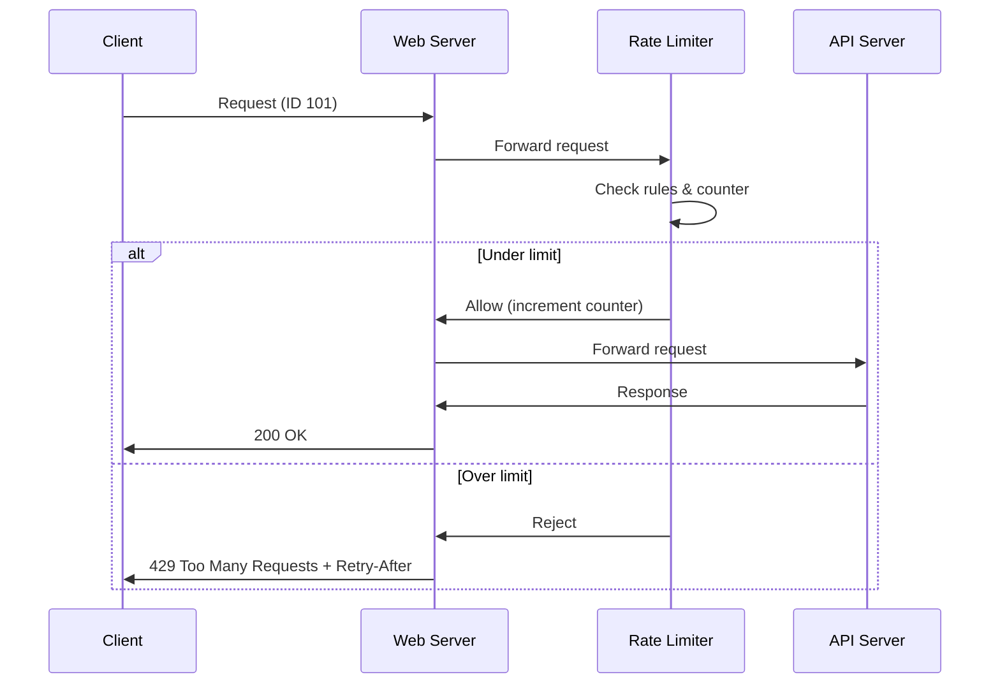

A rate-limiting rule is just declarative config keyed by a dimension (user, IP, API key, message type…) plus a limit and a window. Lyft's open-sourced `ratelimit` service format is the canonical example and worth quoting cold in an interview:

```yaml
domain: messaging
descriptors:
  - key: message_type
    value: marketing
    rate_limit:
      unit: day
      requests_per_unit: 5
```

## 8. Detailed Design

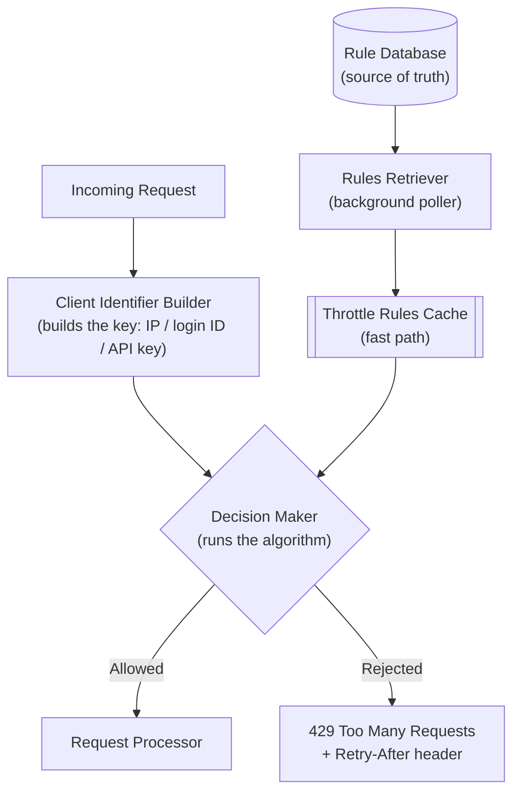

| Component | Job |
|---|---|
| **Rule database** | Persistent source of truth for limits, owned by the service owner |
| **Rules retriever** | Background job polling the DB for rule changes, refreshes the cache |
| **Throttle rules cache** | Serves rule lookups fast — reading a rule shouldn't hit persistent storage on the hot path |
| **Client identifier builder** | Builds the counter key: IP, login ID, API key, or a composite. No sequencer — this ID *is* the shard key |
| **Decision maker** | Runs the chosen algorithm against the cache to allow/reject |

On rejection, respond with **HTTP 429 Too Many Requests**, and either drop the request outright or queue it for later processing if the rejection was due to transient system overload rather than the client actually exceeding its own quota.

### Service API — what does "calling the rate limiter" actually look like?

Interviewers often push for the literal contract. Modeling it after Envoy/Lyft's `ratelimit` service (a real, citable shape):

```
POST /rate_limit_check
{
  "domain": "messaging",
  "descriptors": [
    { "entries": [{ "key": "message_type", "value": "marketing" }] }
  ]
}

→ 200 OK
{
  "overallCode": "OK",           // or "OVER_LIMIT"
  "statuses": [
    {
      "code": "OK",
      "currentLimit": { "requestsPerUnit": 5, "unit": "DAY" },
      "limitRemaining": 3
    }
  ]
}
```

This is a small, stateless, horizontally-scalable RPC — deliberately dumb. All the hard state lives in the cache/store behind it, not in the service itself.

### 🆕 Data model

Two stores, two very different shapes and access patterns — don't design them the same way.

**Rule database — source of truth, low QPS, read through the cache**

| Field | Type | Example |
|---|---|---|
| `rule_id` (PK) | string | `rl_messaging_marketing` |
| `domain` | string | `messaging` |
| `descriptor_key` | string | `message_type` |
| `descriptor_value` | string | `marketing` |
| `requests_per_unit` | int | `5` |
| `unit` | enum | `DAY` |
| `algorithm` | enum | `sliding_window_counter` |
| `updated_at` | timestamp | — |

This table is tiny — hundreds to low thousands of rows for an entire company's worth of rules — so it's cheap to cache in full, in memory, on every gateway node (that's the "throttle rules cache" from the component diagram above).

**Counter store — the hot path, Redis, illustrative key layout for a sliding window counter:**

```
key:   ratelimit:{domain}:{descriptor_key}:{descriptor_value}:{window_start}
value: integer counter
TTL:   2 × window_size   (window auto-expires; no cleanup job needed)
```

Example: `ratelimit:messaging:user_id:42981:2026-07-18T01:00` → `12`, with a 120s TTL for a 60s window — the key deletes itself, so there's nothing to garbage-collect.

Token bucket needs slightly richer state per key, since it tracks more than a count:

```
value: { tokens: 7, last_refill_ts: 1737180032 }   # a small hash, not a scalar
```

**Memory hook:** the rule DB is small and slow-changing — cache it whole. The counter store is huge and hot — shard it, TTL it, and never let a key outlive the window it belongs to.

## 9. Rate-Limiting Algorithms

### Pick the algorithm — decision tree

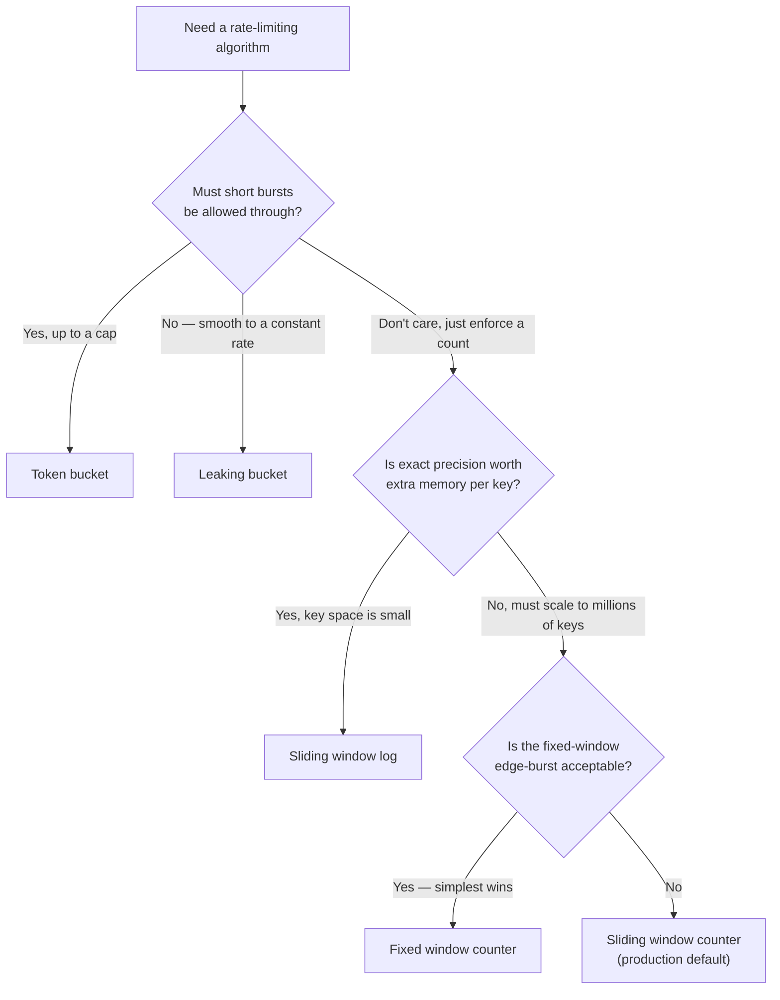

### Token bucket

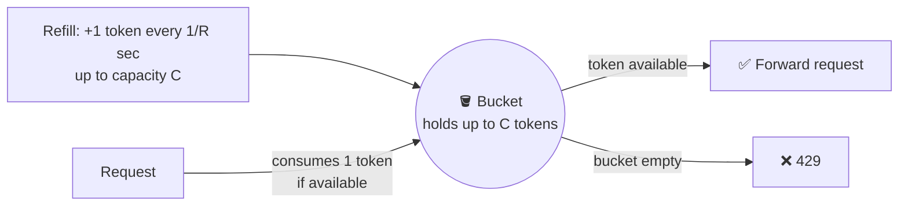

Worked example from the source material: capacity = 3, refill = 3/min. Three requests land in the same minute and drain the bucket; a fourth in that same minute is rejected; after a minute the bucket refills to 3.

```
function allow(key):
    bucket = load(key)                     # {tokens, last_refill_ts}
    now = current_time()
    elapsed = now - bucket.last_refill_ts
    bucket.tokens = min(C, bucket.tokens + elapsed * R)
    bucket.last_refill_ts = now
    if bucket.tokens >= 1:
        bucket.tokens -= 1
        save(key, bucket)
        return ALLOW
    return REJECT
```

- **Parameters:** capacity `C`, rate limit `R`, refill rate `1/R` per second, requests count `N`.
- **Allows bursts** up to `C`, as long as tokens are available — this is a *feature*, not a bug, when you want to permit short spikes (e.g. a user opening 10 tabs at once).
- **Space efficient** — only needs a token count and last-refill timestamp per key.
- **Downside:** taking a token typically needs a lock/atomic op under contention, and tuning `C` and `R` well is genuinely hard.

### Leaking bucket

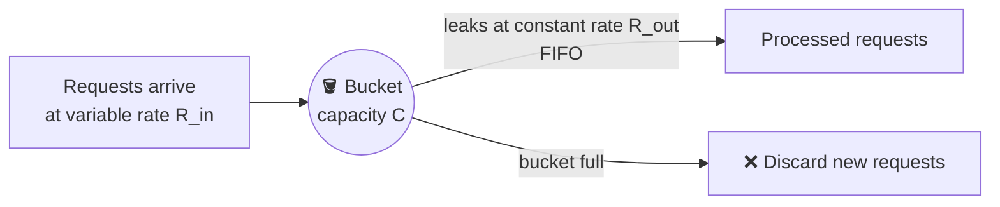

A variant of token bucket that queues requests instead of tokens, and drains them at a **constant** outgoing rate, FIFO. Where token bucket lets a burst *through*, leaky bucket smooths a burst *out* — that's the whole distinction.

- **Parameters:** capacity `C`, inflow rate `R_in` (varies), outflow rate `R_out` (fixed).
- **No burst pass-through** — good when the downstream system has a genuinely fixed processing rate.
- **Downside:** a burst can fill the queue and delay the most recent requests; sizing `C` and `R_out` is still a tuning problem.

### Fixed window counter

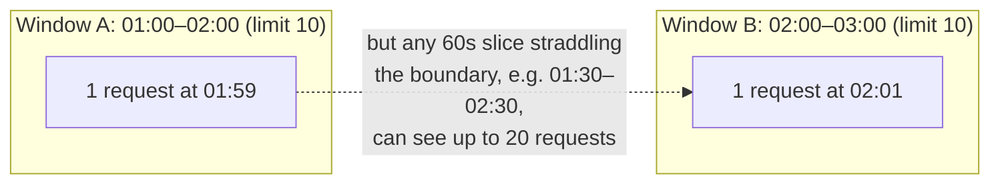

Divide time into fixed windows (a minute, an hour); each window has its own counter; increment on each request, reject once the counter hits the limit.

- **Simple, space-efficient** (one counter + window-start timestamp per key).
- **Fatal flaw:** the **edge-burst problem** — a client can send up to `2x` the limit within a short span that straddles two windows, because each window is judged independently.

### Sliding window log

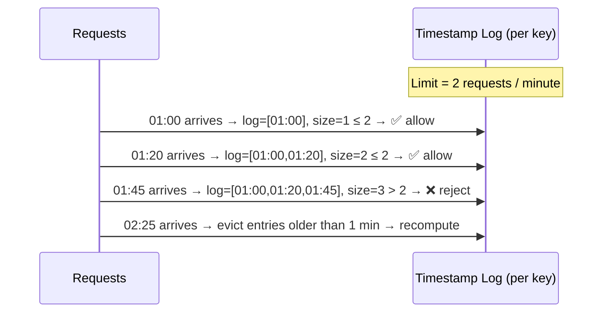

Store every request's arrival timestamp in a log (sorted set), evict anything older than the window on each check, and allow/reject based on the resulting log size.

- **No edge cases** — the window is truly rolling, computed relative to *now* for every request. Most accurate of the five.
- **Downside:** memory scales with request volume, not with the limit — one log entry per request, even rejected ones, must be tracked until it ages out. Expensive at scale.

### Sliding window counter

The pragmatic middle ground: keep only two fixed-window counters (previous + current) and weight them by overlap, instead of a full log.

```math
Rate = R_p \times \frac{timeframe - overlap}{timeframe} + R_c
```

Worked example: previous window `R_p = 88`, current window `R_c = 12`, `timeframe = 60s`, `overlap = 15s`:

```
Rate = 88 × (60 − 15)/60 + 12 = 88 × 0.75 + 12 = 66 + 12 = 78
78 < 100 (limit) → allow
```

```
function allow(key, limit, window_size):
    now = current_time()
    curr = floor(now / window_size)
    R_p = get(key, curr - 1) or 0
    R_c = get(key, curr) or 0
    overlap = window_size - (now mod window_size)
    weighted = R_p * (window_size - overlap) / window_size + R_c
    if weighted < limit:
        incr(key, curr)
        return ALLOW
    return REJECT
```

- **Space efficient** (two counters per key, not a log) while smoothing the fixed-window edge-burst problem.
- **Downside:** it *assumes* requests were evenly distributed within the previous window — an approximation, not exact. Good enough for almost every real system, and the **production default**.

> **Quiz check — a trap worth knowing:** *"Which algorithm smooths spikes at the window edge — token bucket, sliding window log, or fixed window counter?"* The correct answer is **none of the above**. The algorithm that actually smooths edge spikes is the **sliding window counter**, which isn't in that option list. Token bucket allows bursts (doesn't smooth them), sliding window log has no edges to smooth (it's exact), and fixed window counter *causes* the edge-burst problem rather than fixing it. Know each algorithm precisely enough to spot when the "obvious-sounding" answer is a trap.

### Comparison table

| Algorithm | Space efficient? | Allows burst? | Best for |
|---|---|---|---|
| Token bucket | Yes | Yes, up to bucket capacity | APIs that should tolerate short bursts (most public APIs) |
| Leaking bucket | Yes | No — smooths to constant rate | Feeding a fixed-throughput downstream worker |
| Fixed window counter | Yes | Yes — can spike to 2x at edges | Simple, coarse-grained limits where exactness doesn't matter |
| Sliding window log | No — stores every timestamp | No | Small key spaces needing exact enforcement |
| Sliding window counter | Yes (slightly more than fixed window) | Smooths bursts, doesn't eliminate them | Default choice for most production API rate limiters |

**Memory hook for the five:** *"Tokens burst, water leaks, windows snap, logs remember everything, and the sliding counter splits the difference."*

### Disambiguation: commonly confused pairs

**Token bucket vs. Leaking bucket** — both use a bucket metaphor and the same three parameters, but they answer opposite questions:

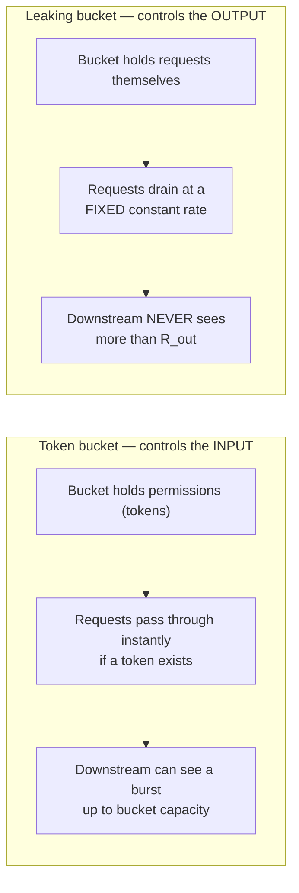

**Fixed window vs. Sliding window log vs. Sliding window counter** — all answer "how many requests in the last window?", but trade memory for accuracy differently:

| | Fixed window | Sliding window log | Sliding window counter |
|---|---|---|---|
| What it stores | 1 counter, resets on window boundary | Every request timestamp | 2 counters (prev + current window) |
| Accuracy | Low (edge-burst hole) | Exact | Approximate (assumes even distribution) |
| Memory | O(1) per key | O(requests) per key | O(1) per key |

## 10. Distributed Rate Limiting

A single rate limiter node can't handle traffic at FAANG scale, so you run a cluster. That forces a choice about where the counter state lives:

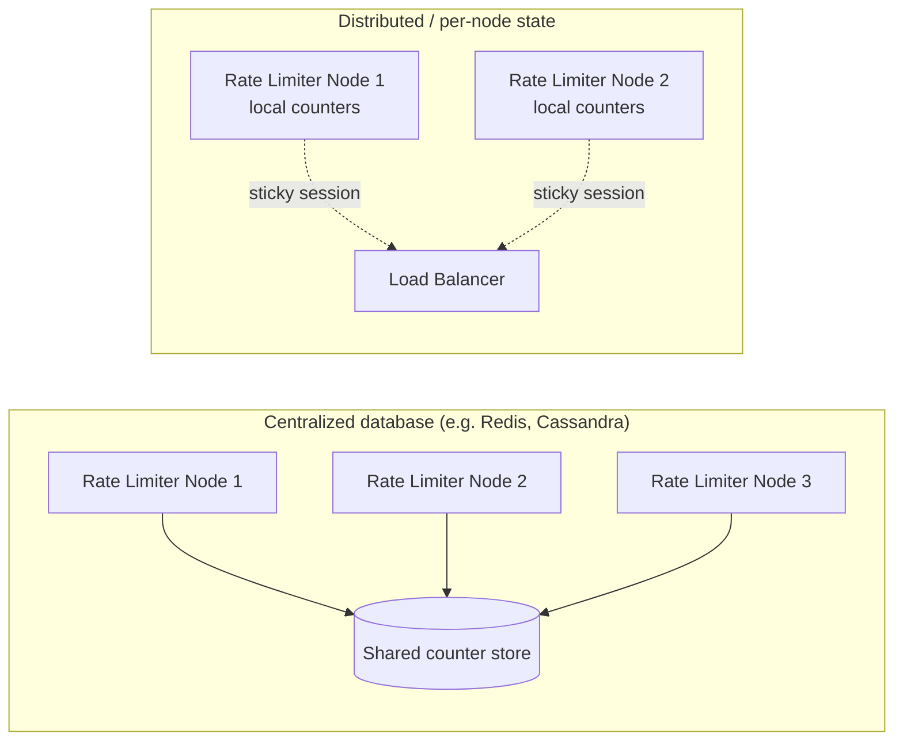

| | Centralized DB | Distributed (per-node) state |
|---|---|---|
| Correctness | Strict — client can never exceed the limit | Client can momentarily exceed the limit while state propagates |
| Latency | Higher — every check is a network hop to the shared store | Lower — local memory read |
| Failure mode | DB overload/lock contention under high concurrency | Needs sticky sessions at the LB → hurts fault tolerance & rebalancing |
| Scales by | Sharding the DB | Adding nodes, but sticky sessions cap how evenly you can rebalance |

Real systems (Envoy/Lyft `ratelimit`, Stripe) mostly land on **centralized store (Redis) + local caching/approximation** as a hybrid.

A second, independent axis: **shared counter vs. per-user counter.** Almost every real system uses per-key counters — a global bucket only makes sense for protecting a shared downstream resource itself (e.g. "no more than 1000 total writes/sec to this database, regardless of who's asking").

### 🆕 Architecture evolution: v1 → v2 → v3

Most candidates jump straight to "Redis with Lua scripts." Narrating *why* the simpler versions break first is what shows you derived the design instead of memorizing it.

**v1 — in-memory counter per server (breaks first)**

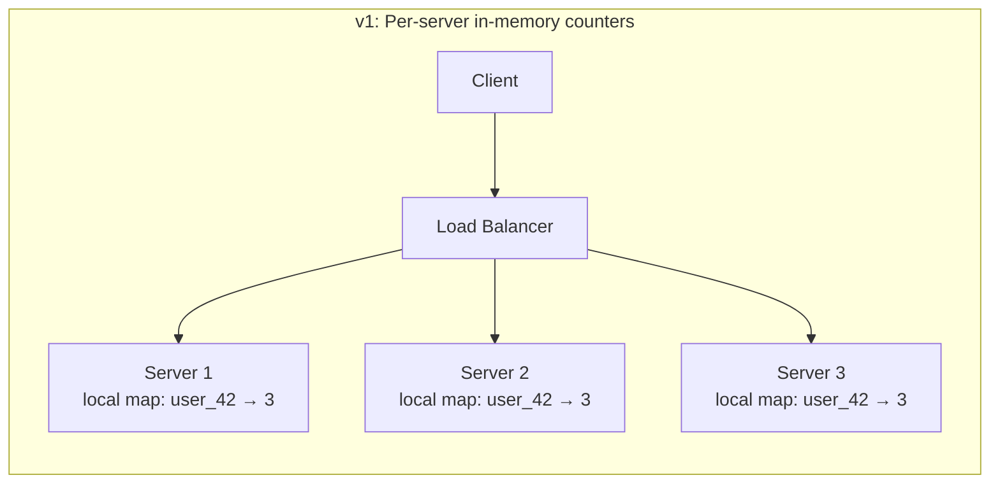

Each server counts in its own process memory. Zero network cost, but with 3 servers behind a round-robin LB, a client limited to 5 requests/min can actually get up to `3 × 5 = 15/min`, because each server enforces the limit only against its own third of the traffic. Breaks the moment there's more than one server — i.e., immediately, in any real deployment.

**v2 — centralized Redis counter (correct, but a hop on every request)**

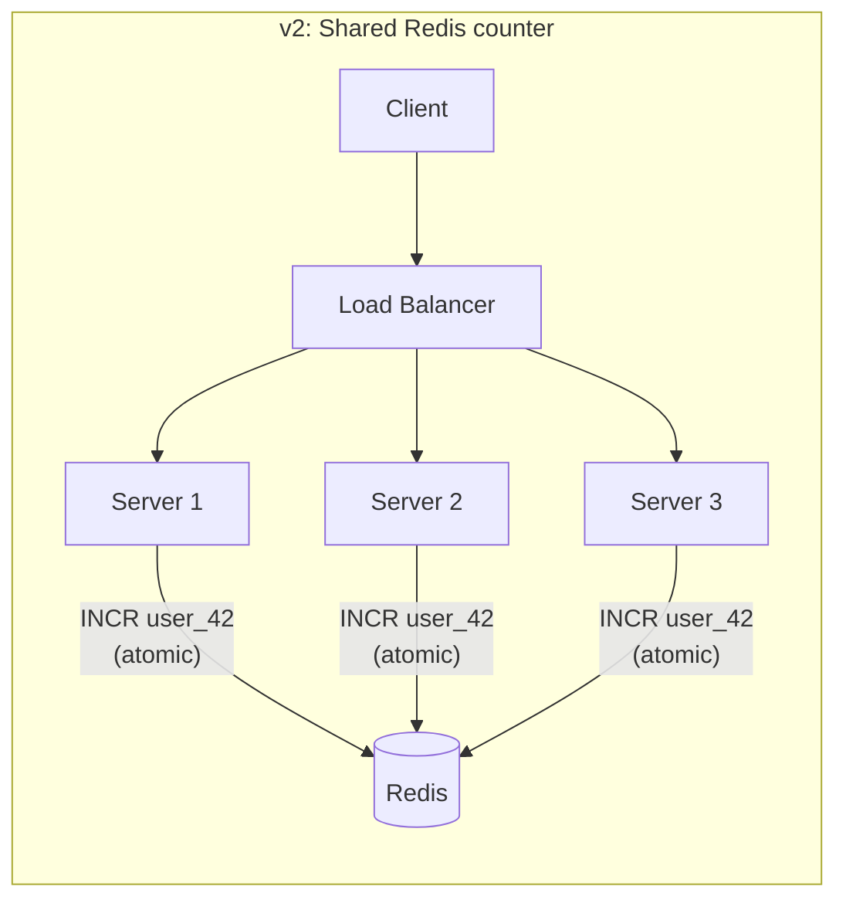

All servers check/increment the same Redis key, so the limit holds regardless of which server handles the request — this fixes v1's overcounting. The cost: every request now pays a synchronous round trip to Redis (~0.5–1ms same-DC, per §14) before it can be forwarded, and Redis becomes a dependency of every single request.

**v3 — local cache + async sync + fail-open circuit breaker (production shape)**

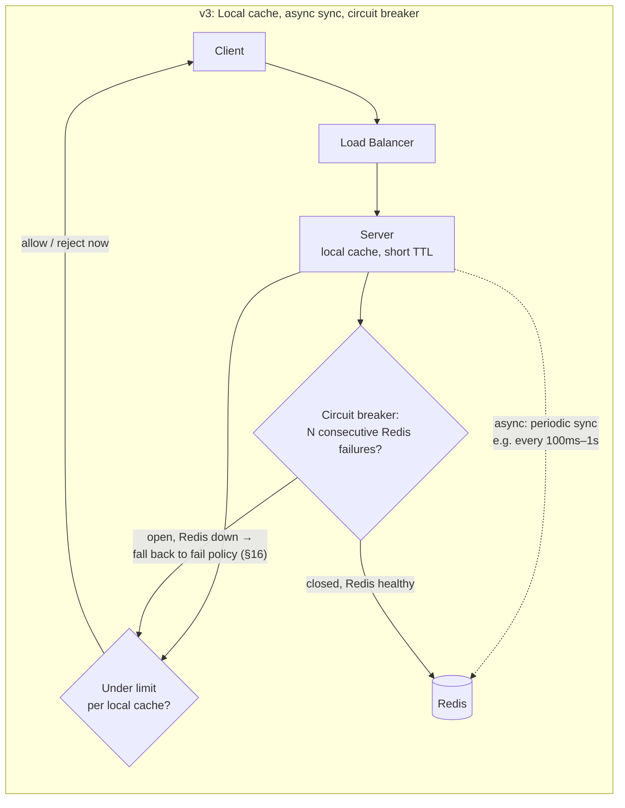

Servers keep a short-lived local cache of counts, synced from Redis periodically instead of on every request — most requests are decided from local memory. A circuit breaker watches Redis health: after N consecutive failures/timeouts it "opens," and the node stops hammering a dead store and falls back to its configured fail-open/fail-closed policy (§16) instead; it periodically half-opens to probe whether Redis has recovered. This trades a small amount of precision — a client can burst slightly across one sync interval — for lower latency and resilience to store outages. It's the same accuracy-vs-cost trade-off that runs through every algorithm in §9, now applied to the architecture itself. This is also what "centralized store + local caching/approximation" (mentioned above) looks like concretely.

**Memory hook:** *v1 forgets to share, v2 shares but waits on every request, v3 shares lazily and knows when to stop asking.*

### Routing a key to the right counter (consistent hashing)

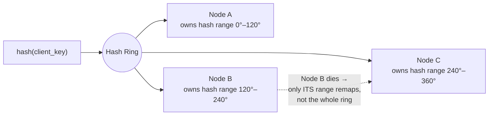

When rate limiting uses per-node local state, every request for a given key must land on the *same* node to be counted correctly. Consistent hashing (or sticky sessions at the LB) achieves that — and unlike a plain `hash(key) % N`, it only remaps the fraction of keys owned by a node when it dies, instead of reshuffling everything.

### 🆕 Clock skew across distributed nodes

Every algorithm except a plain request-count-only fixed window leans on a timestamp: token bucket's `last_refill_ts`, sliding window log's per-request timestamps, sliding window counter's window boundaries. In a distributed rate limiter, that timestamp is often generated on whichever gateway node happened to handle the request — and machine clocks drift relative to each other.

Concretely: NTP-synced servers typically stay within single-digit milliseconds of each other, but a misconfigured or unsynced node can drift by seconds or more. If node A's clock reads 5 seconds ahead of node B's:

- **Token bucket** refilling "1 token/sec" can look like it refilled ~5 extra (or 5 fewer) tokens' worth of time depending on which node computed the elapsed time, letting a client slip through that should've been throttled — or the reverse.
- **Sliding window log/counter** can place a request in the wrong window near a boundary, reintroducing the exact double-counting the sliding window design exists to avoid.

**Fixes, cheapest first:**

1. **Compute "now" at the store, not on the gateway node.** Redis's own `TIME` command (or `redis.call('TIME')` inside the Lua script doing the check) gives every caller the same clock — the only clock that matters is the shared store's, not each gateway's local one.
2. **Run NTP/chrony on every node** as a production dependency, not an afterthought. This keeps drift to single-digit milliseconds, which is negligible against window sizes measured in seconds to minutes.
3. **Prefer coarser windows where precision isn't critical.** A 60-second window swallows a few milliseconds of skew for free; only sub-second limits are meaningfully sensitive to it.

**Memory hook:** *if correctness depends on "now," ask whose clock "now" is.*

### Going global: multi-region rate limiting

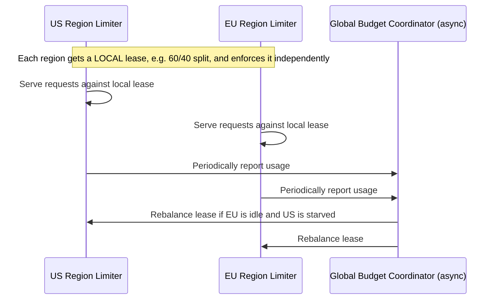

True real-time global limits across regions would require a cross-region round trip on every request — 50–150ms, unacceptable. The standard trick (the idea behind Google's open-source **Doorman**) is to split the global budget into **local leases per region**, enforce each lease independently and fast, and reconcile leases periodically and asynchronously. You trade perfect global precision for regional low latency — name this trade-off explicitly if asked about global limits.

## 11. Race Conditions & Atomicity

The classic bug: **get-then-set**. Read the counter, increment in application memory, write it back. Under concurrency, two requests can both read `count=4` (limit 5), both compute `5`, both write `5`, and both get admitted.

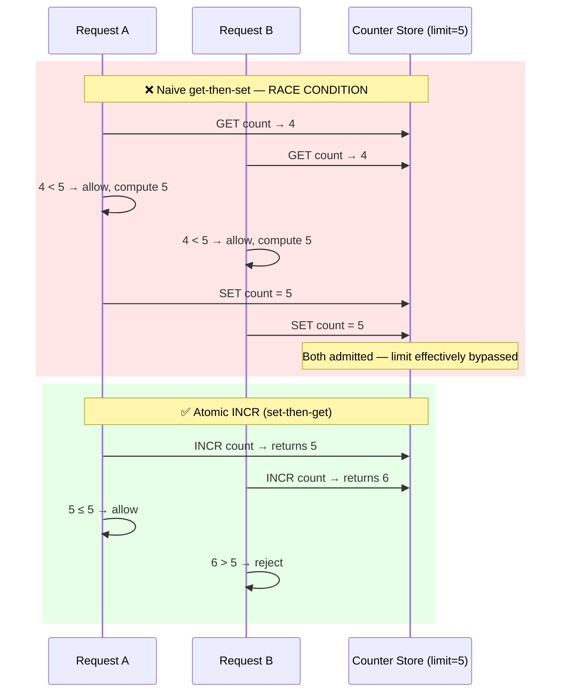

**Fixes, in order of what teams actually reach for:**

1. **Atomic increment ("set-then-get")** — `INCR` (Redis) or an equivalent atomic op returns the *new* value directly; there's no read-modify-write gap. Default fix, works under low-to-moderate contention.
2. **Locking** — correct but a throughput killer; only reach for it when you need multi-step atomicity a single atomic op can't express.
3. **Lua scripting (Redis) / stored procedures** — bundle "increment + check + set TTL" into one atomic server-side script so the whole decision is a single round trip.
4. **Sharded counters** — split one hot key's quota across `N` sub-counters, write to a random shard, sum all shards on read. More shards = less write contention, but reads get slower and slightly less precise.

## 12. Keeping the Rate Limiter Off the Critical Path

A full read-check-increment-write cycle on every request, before forwarding it, adds latency to every single request — unacceptable at millions of requests/sec.

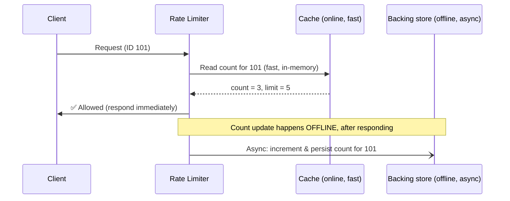

Split the work into an **online path** (check cached count, respond immediately) and an **offline path** (persist the update asynchronously). For a handful of requests this makes no difference; at scale it's the difference between a rate limiter that's invisible and one that's the slowest hop in the request path.

## 13. Capacity Estimation — Worked Example

**Scenario:** API gateway in front of a service doing 100K QPS, rate-limited per user, with a rolling 1-minute window.

**Formula chain:** `QPS → ops per request → total ops/sec on the store → ops/sec per shard → shard count → memory per key → total memory → replication factor → bandwidth check`

```
1. Ops per request
   1 atomic check-and-increment op (via Lua/INCR) per request
   → 100,000 QPS × 1 op = 100,000 ops/sec on the counter store

2. Headroom
   Add ~2x for retries, TTL housekeeping, and rule-cache misses
   → design for ~200,000 ops/sec

3. Shard sizing
   A single Redis node comfortably sustains ~100K–200K simple ops/sec
   → need at least 2 shards for capacity, round up to 4 for headroom/rebalancing

4. Memory per key
   key (user_id, ~8–16 bytes) + counter (8 bytes) + window timestamp (8 bytes)
   + Redis per-key overhead (~50–70 bytes) ≈ 100 bytes/key

5. Active key count
   Assume 5M concurrently-active users in any given 1-minute window
   → 5,000,000 keys × 100 bytes ≈ 500 MB total

6. Replication (factor 3, for availability)
   500 MB × 3 ≈ 1.5 GB total store footprint

7. Bandwidth check
   200,000 ops/sec × ~150 bytes (request + response) ≈ 30 MB/sec
   → trivially within a single 1–10 Gbps link
```

**Takeaway to say out loud:** the *memory* footprint of a rate limiter is almost always negligible (MBs to low GBs) — the real bottleneck is **ops/sec and round-trip latency** on the shared store, which is exactly why sharding, local caching, and the online/offline split (§12) matter more than counter storage efficiency.

## 14. Numbers Worth Memorizing

| Metric | Value | Why it matters |
|---|---|---|
| HTTP status for throttled request | `429 Too Many Requests` | The correct, expected response code — interviewers listen for this |
| Standard rate-limit response headers | `X-RateLimit-Limit`, `X-RateLimit-Remaining`, `X-RateLimit-Reset`, `Retry-After` | Lets well-behaved clients back off correctly instead of hammering you |
| Redis single-node throughput (simple ops) | ~100K–1M ops/sec | Anchors your shard-count math |
| Same-DC round trip | ~0.5–1 ms | Cost of a synchronous store check on the critical path |
| Cross-AZ round trip | ~1–2 ms | Cost if your cache/store isn't co-located with the gateway |
| Cross-region round trip | ~50–150 ms | Why a *global* centralized limiter across regions is usually a mistake |
| Bytes per counter key (Redis, with overhead) | ~50–100 bytes | Anchors memory-footprint math (§13) |
| GitHub REST API (authenticated) | 5,000 req/hour, fixed window | Real, citable example of fixed-window at scale |

## 15. Design Decisions & Trade-offs

| Decision | Option A | Option B | What tips it |
|---|---|---|---|
| Where to enforce | Client-side | Server-side / gateway | Always B for enforcement; A only as a UX optimization |
| Algorithm | Token/leaky bucket | Sliding window counter/log | Need burst tolerance or smoothing → bucket family. Need precision → sliding window family |
| State location | Centralized store | Per-node distributed state | Strict correctness needed → centralized. Lowest latency, tolerate slight overage → distributed |
| Counter update timing | Synchronous (critical path) | Asynchronous (online check / offline update) | Async wins at any real scale (§12) |
| Concurrency control | Lock | Atomic op (INCR) / Lua script | Atomic op wins almost always |
| On store failure | Fail-closed (reject) | Fail-open (allow) | Security-critical limit → fail-closed. Availability-critical service → fail-open |
| Granularity | Single global limit | Per-user / per-IP / per-API-key / per-endpoint | Real systems almost always need multiple tiers simultaneously |
| Global scope | Real-time centralized | Local lease + async reconcile | Cross-region real-time is a latency mistake — lease-based wins (§10) |
| Timestamp source (🆕) | Each gateway node's local clock | Shared store's clock (e.g. Redis `TIME`) | Any distributed deployment of a timestamp-based algorithm → shared clock, to avoid drift (§10) |
| Store-outage handling (🆕) | Block/retry until the store responds | Circuit breaker → fail-open/closed per rule | Never let a dead store hold every request hostage — trip a breaker and apply the pre-decided policy (§16) |

## 16. Failure Modes

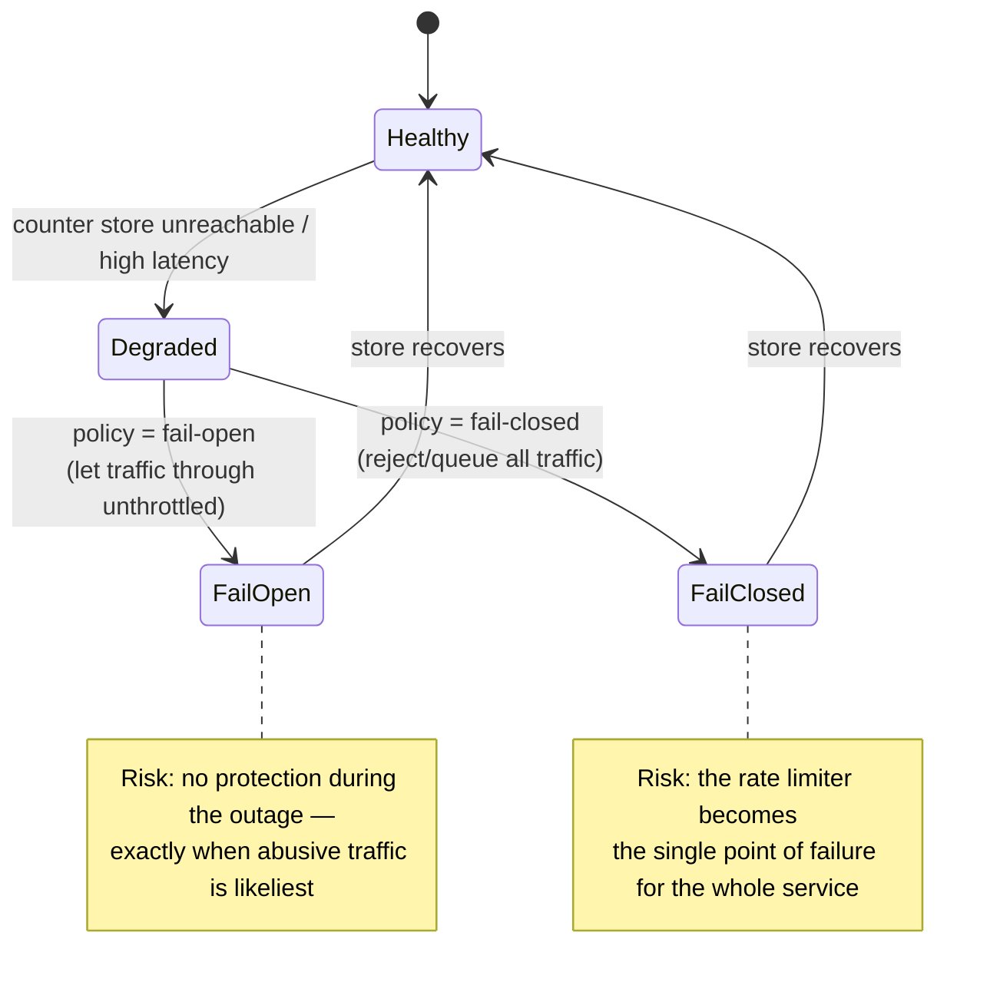

- **Fail-open vs. fail-closed is a decision, not a default** — pick per rule. A login-brute-force limiter should fail-closed; a general API-abuse limiter usually fails-open because losing the *whole service* to a rate-limiter outage is worse than a temporary loss of throttling.
- **Hot key / celebrity problem** — one viral account or one shared API key can pin a single shard, degrading everyone sharing that shard. Mitigate with sharded counters (§11) or a dedicated higher-capacity tier for known-large keys.
- **Rule cache staleness** — the rules retriever polls on an interval, so a just-changed limit takes effect with a delay. Fine for policy changes, not fine if reacting to an active attack — pair with an out-of-band "kill switch" push path for emergencies.
- **Thundering herd on window reset** — fixed-window and token-bucket-refill both create a moment where a lot of previously-blocked traffic becomes eligible at once; the sliding window counter and leaky bucket exist partly to avoid this.

#### 🆕 Fail-open vs fail-closed decision flowchart

The stateDiagram above shows the *states*; this shows the *decision logic* a node actually runs, wired through a circuit breaker so a dead store doesn't hang every request while it decides:

```mermaid
flowchart TD
    Req[Request needs a rate-limit check] --> Store{Can we reach the<br/>counter store?}
    Store -->|Yes, healthy| Normal[Check counter normally,<br/>allow/reject per limit]
    Store -->|No / timeout| Count{Consecutive failures<br/>≥ threshold N?}
    Count -->|"No — still under N"| Retry[Treat as a transient blip:<br/>retry once, then decide]
    Count -->|"Yes → circuit breaker OPENS"| Policy{What is this<br/>rule protecting?}
    Policy -->|"Security / cost<br/>(login, payments, paid 3rd-party calls)"| FailClosed[Fail-closed:<br/>reject or queue until store recovers]
    Policy -->|"General availability<br/>(most public API traffic)"| FailOpen[Fail-open:<br/>let traffic through unthrottled]
    FailOpen --> Probe[Breaker periodically<br/>half-opens to test the store]
    FailClosed --> Probe
    Probe -->|Store responds OK| Normal
```

The threshold `N` and the per-rule policy are both config, decided in advance — the breaker just automates *when* the policy kicks in, so no single slow request has to wait out a full timeout to find out.

```mermaid
pie title Typical rate-limiter check outcomes at steady state
    "Served from rules cache" : 99
    "Rule cache miss → rule DB" : 1
```

## 17. Real-World Examples

| System | Approach |
|---|---|
| **Lyft `ratelimit`** (open source, gRPC) | Descriptor-based YAML rules (domain/key/value → limit) backed by Redis; became the de facto standard, used inside Envoy proxy as a filter |
| **Stripe** | Token bucket per API key, separate buckets for read vs. write operations; returns `429` with clear headers |
| **AWS API Gateway** | Explicitly documented as token bucket: a **steady-state rate** plus a **burst capacity**, configurable per account/stage |
| **GitHub REST API** | Fixed window counter: 5,000 requests/hour for authenticated requests, exposes `X-RateLimit-*` headers |
| **Discord** | Per-route bucket *and* a global bucket simultaneously (multi-tier limiting); `Retry-After` returned on `429` |
| **Cloudflare** | Sliding-window-style and leaky-bucket variants at the edge, at massive scale, for L7 DDoS mitigation |
| **Redis `CELL` command (redis-cell module)** | Implements the **Generic Cell Rate Algorithm (GCRA)** — mathematically equivalent to a leaky bucket, computed without a background refill process |
| **Google Doorman** (open source) | Distributed rate limiter using lease-based fair sharing across client processes/regions — the model behind §10's multi-region approach |
| **NGINX `limit_req` module** | Leaky-bucket implementation baked into the web server itself |

## 18. How to Identify This Topic in an Interview

Direct signals: *"design a rate limiter,"* *"design Kong/an API gateway,"* *"how would you prevent abuse of this API,"* *"how do you stop this endpoint from being hammered."*

Indirect signals — this topic is a **sub-component** the interviewer expects you to volunteer inside a bigger design, without being asked by name:

- Any **public API** or **multi-tenant SaaS** design → "I'd rate limit per API key/tenant so one noisy client can't degrade others."
- **Login / auth** flows → "I'd rate limit login attempts per account and per IP to blunt credential stuffing."
- **Messaging / notification** systems (SMS, email, push) → "I'd cap sends per user per day, partly for cost, partly for abuse."
- **Payment / billing** systems → "I'd rate limit write operations tightly and fail-closed, since correctness beats availability here."
- **Any design with a third-party dependency you pay per call for** → "I need an outbound rate limiter so a retry storm doesn't blow the budget."

Volunteering the rate limiter unprompted in these contexts is a strong signal of production experience — most candidates only bring it up when asked directly.

## 19. Rapid-Fire Interview Follow-Ups

| Question | Answer |
|---|---|
| Can a rate limiter double as a load balancer? | No. An LB spreads load across healthy backends for throughput/availability; a rate limiter enforces a policy ceiling per client. They sit at the same layer but solve different problems — you need both, not either/or. |
| If the rate limiter itself fails, accept or reject? | Depends what you're protecting: fail-closed for a security-critical limit, fail-open for a general availability concern. State the policy per rule (§16) — don't let it be an accident of a client library's default. |
| How do you rate-limit across regions without adding latency to every request? | Split the global quota into local per-region leases (Doorman-style); enforce locally and fast; reconcile leases asynchronously (§10). |
| How do you handle a "hot key" — one API key generating way more traffic than everyone else? | Sharded sub-counters summed at read time, or route known-large keys to a dedicated higher-capacity partition. |
| How would you rate-limit WebSocket/gRPC streams instead of discrete requests? | Token bucket on connection-open events to cap concurrent connections, plus a separate message-rate limiter per open connection for in-stream traffic. |
| What if a legitimate user gets falsely throttled? | Prefer soft/elastic throttling over hard cutoffs for customer-facing limits, expose remaining-quota headers, and provide an override/appeals path for support. |
| Why not just rate limit at the load balancer only? | You can for coarse, IP-level protection (e.g. NGINX `limit_req`), but per-user/per-API-key business quotas need app/gateway-layer logic the LB can't express. |

## 20. Golden Rules

- **The rate limiter must be cheaper and more available than what it protects.** If it's slower or less reliable than the backend, you've added a new bottleneck, not removed one.
- **Keep it off the critical path.** Check against a fast cache and respond immediately; update counters asynchronously (§12).
- **Atomic ops beat locks.** Never do get-then-set on a shared counter under real contention (§11).
- **Fail-open vs. fail-closed is a per-rule security decision, not an accident** — decide it explicitly.
- **Always tell the client why and when to retry** — `429` + `Retry-After` + `X-RateLimit-*` headers. Silent drops turn well-behaved clients into accidental attackers.
- **Pick the algorithm from the requirement, not from familiarity** — burst-tolerant vs. burst-smoothing vs. exact vs. cheap are different questions with different right answers.
- **One limit is rarely enough.** Real systems layer per-user, per-IP, per-API-key, per-endpoint, and global limits simultaneously.
- **Global real-time precision doesn't scale across regions — lease-and-reconcile does.**
- **If a decision depends on "now," agree on whose clock counts.** Compute timestamps at the shared store, not on each gateway node — clock drift silently breaks token-bucket refill and sliding-window boundaries (§10).

## 21. One-Glance Mind Map

```mermaid
mindmap
  root((Rate Limiter))
    Why
      Prevent resource starvation
      Stop abuse / DoS / brute force
      Enforce quotas & policy
      Control cost
      Smooth data flow
    Placement
      Client - UX only
      Server-side
      Gateway / Middleware - preferred
    Throttling type
      Hard
      Soft
      Elastic
    Algorithms
      Token bucket - allows burst
      Leaking bucket - smooths to constant
      Fixed window - simple, edge-burst flaw
      Sliding window log - exact, costly
      Sliding window counter - default choice
    Distributed
      Centralized store - correct, slower
      Per-node state - fast, sticky routing
      Consistent hashing for key routing
      Sharded counters for hot keys
      Global - local leases plus async reconcile
      Clock skew - agree on the store's clock, not each node's
      v1 to v3 evolution - per-server to Redis to local cache plus breaker
    Concurrency
      Atomic INCR over locks
      Lua scripts for multi-step atomicity
    Critical path
      Online check - sync, fast
      Offline update - async
    Failure policy
      Fail-open - availability first
      Fail-closed - security first
      Circuit breaker - opens after N failures, half-opens to probe
    Always return
      429
      Retry-After
      X-RateLimit headers
```

## 22. Master Cheat Sheet

**Requirements:** limit requests/client/window, configurable limit, client notified on breach. NFRs: available, low-latency, scalable.

**Placement:** middleware/gateway > server-side > client-side (client-side is UX-only, never enforcement).

**Throttling types:** hard (strict cutoff) · soft (+X% grace) · elastic (up to spare capacity).

**Algorithms — pick by what you need:**
| Need | Algorithm |
|---|---|
| Tolerate short bursts | Token bucket |
| Smooth to a constant downstream rate | Leaking bucket |
| Simplest possible | Fixed window counter (accept the edge-burst risk) |
| Exact enforcement | Sliding window log (accept the memory cost) |
| Production default | Sliding window counter |

**Formula to remember:**
```
Rate = R_prev × (window − overlap)/window + R_curr
```

**Distributed state:** centralized store (Redis/Cassandra) = correct but adds latency; per-node state = fast but needs sticky routing (consistent hashing) and tolerates momentary overage. Hot keys → sharded counters. Multi-region → local leases + async reconcile (Doorman model), never real-time cross-region checks. Architecture matures v1 (naive per-server) → v2 (centralized Redis) → v3 (local cache + async sync + fail-open circuit breaker) (🆕 §10).

**Data model (🆕):** small rule DB (rule/domain/descriptor/limit/window), cached whole in memory; huge hot counter store keyed `ratelimit:{domain}:{key}:{value}:{window}` with a self-expiring TTL (§8).

**Concurrency fix:** atomic `INCR` / Lua script > locking. Compute timestamps at the store's clock, not each node's, to avoid clock-skew bugs in token bucket / sliding window (🆕 §10).

**Critical path:** online check (cache read, respond now) + offline update (persist count async).

**Capacity math order:** QPS → ops/sec on store → shard count → memory/key → total memory → replication → bandwidth. Memory is cheap; ops/sec and RTT are the real constraint.

**Failure policy:** fail-closed for security-critical limits, fail-open for availability-critical services — pick per rule. Wire it through a circuit breaker (N consecutive failures → trip → apply policy → periodically half-open to probe) so no request blocks on a dead store (🆕 §16).

**Always return:** `429` + `Retry-After` + `X-RateLimit-Limit/Remaining/Reset`.

**Real examples to cite:** Lyft `ratelimit` (Envoy), Stripe (token bucket per key), AWS API Gateway (documented token bucket), GitHub (fixed window, 5000/hr), Discord (per-route + global bucket), Cloudflare (edge leaky/sliding), Redis `CELL`/GCRA, Google Doorman, NGINX `limit_req`.
