# Blob Store — The Story (narrative edition)

> **What this file is.** The reference file, `20-Blob-Store-FAANG-Guide.md`, is the one to recite from — requirements, the capacity math, every trade-off table, the master cheat sheet. This file is a second way in: the same material as one continuous story, told in plain language. Engineers at a company keep hitting a wall, patch it, and the patch itself creates the next wall — until we land on the exact same design the reference file documents. The company, **SnapVault** (a photo-and-video-sharing app), is fictional. But every wall it hits, and every fix it reaches for, is something a real, named system actually did: Facebook's Haystack photo store (the 2010 "Finding a needle in Haystack" paper), Facebook's f4 warm storage system, Amazon S3, Google's GFS-to-Colossus migration, Azure Blob Storage, and Dropbox's Magic Pocket. I'll say clearly, every time, whether a number is a documented fact or a reasonable stand-in — those get an inline `[illustrative]` tag.

**The trigger phrases** for this whole topic: *"design S3,"* *"design a photo/video storage system,"* *"how would you store and serve billions of user-uploaded files."* Keep one sentence in your head as you read: **storing one big file is easy — write it to a disk. Knowing which of ten thousand disks holds a specific 4MB slice of it, replicated three times, without a full scan, is the actual problem.** Everything below is just this one idea, getting harder in small, honest steps.

---

## Chapter 1 — The photo that took ten disk seeks to load

It's 2011. SnapVault is small — a photo app, a few hundred thousand users. Every uploaded photo gets saved the obvious way: as its own file, `/storage/user_id/photo_id.jpg`, on an NFS-mounted filer. This is exactly how Facebook's own photo infrastructure worked in its early years too, and it's fine — until it isn't.

By 2012, SnapVault has hundreds of millions of photos. Reads start feeling sluggish, and nobody can point at why — CPU is fine, network is fine, disks aren't even full. The real culprit, and this is a documented finding from Facebook's own Haystack paper: on a typical filesystem, fetching one small file isn't one disk operation, it's several — one or more seeks to walk the directory structure and translate the filename into an inode number, another seek to read that inode, then a final seek to read the actual data. With deep or crowded directories, the paper describes this stacking up to **roughly 10 real disk operations to fetch a single photo** `[illustrative — the paper's own account is "the standard set of Unix file system access assumptions... breaks down," in this range, not a single universally-quoted constant]`. At ~10ms per HDD seek, that's **~100ms of pure metadata chasing** before a single byte of the actual photo is read — and with hundreds of millions of tiny files, the metadata working set is far too big to stay cached in RAM, so almost every request pays the full cost.

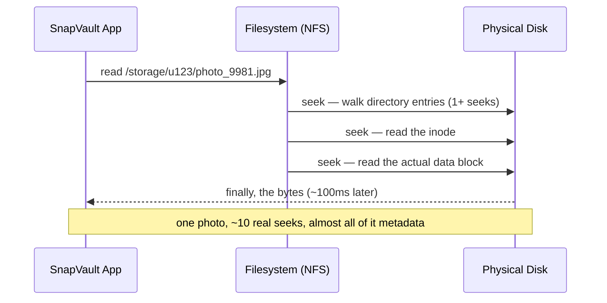

The obvious next question: *why does a filesystem choke on lots of small files specifically?* Because a general-purpose filesystem is built to answer "does this path exist, what are its permissions, when was it modified" for arbitrary files — rich metadata, checked on every access. A photo doesn't need any of that. It just needs "give me these exact bytes, fast."

**The fix, and the first analogy for this story:** stop treating each photo as its own file. Pack many photos into one big physical file — call it a **volume** — and keep a single, tiny, in-memory index that maps `photo_id → offset inside that volume`. This is **Haystack packing**, the real fix Facebook shipped. Think of it as **one big filing cabinet drawer with a single typed index card taped to the front**, instead of a thousand tiny labeled envelopes each requiring you to walk to a different shelf. Look up the offset in RAM (a hash lookup, ~100ns), then do exactly **one** disk seek straight to the bytes. Ten seeks become one.

**New problem, immediate:** that "one big filing cabinet drawer" is a single physical file, sitting on a single disk, on a single machine. It fills up, and if that one disk dies, everything inside that volume — potentially tens of thousands of photos — dies with it.

**How I'd say this in an interview:** "The classic small-file problem isn't disk space, it's metadata — every tiny file pays the full cost of filesystem lookups designed for rich, general-purpose files. Facebook's Haystack paper solved this by packing many photos into one large file with an in-memory offset index, turning ten seeks into one — that's the move to remember, not just the fact that it's slow."

---

## Chapter 2 — The warehouse drawer that filled up and then vanished

SnapVault ships Haystack-style packing. Reads get fast — genuinely one seek per photo now. Volumes are capped at a fixed size, roughly **100GB each** `[illustrative — a round number in the ballpark Haystack-style systems actually use, not a quoted constant]`, so no single file grows unbounded.

Six months later, at SnapVault's upload rate — worked number: **20,000 photos/day × ~400KB average = ~8GB/day** — one 100GB volume fills up in about **12 days**, and SnapVault just keeps opening new ones on the same machine. Then one Tuesday, that machine's disk controller fails. Every volume it was hosting — months of accumulated photos, tens of millions of them — is gone. There's exactly one copy of each, and it just died.

The obvious question: *why does "pack files efficiently" have anything to do with "keep a copy alive if a disk dies"?* It doesn't — those are two separate problems, and Haystack packing only ever solved the first one.

**The fix:** split the system into two completely separate concerns. A **metadata service** (call it the master) tracks *where* each chunk of data lives — which machine, which volume, which offset. Dumb **data nodes** just hold bytes and don't think about anything else. This is the same split GFS and HDFS use, and it's the backbone of every real blob store from here on. The analogy: **a shipping manifest vs. the cargo itself** — a manifest clerk who knows exactly which of ten thousand warehouse racks holds crate #482,991, and separate racks that just hold crates and never get asked a question. SnapVault also starts supporting video around now, and video and photos alike get split into fixed-size **chunks** (64–128MB, the same range GFS and HDFS use) so no single chunk is too big to replicate or move quickly. Each chunk gets written to **three** data nodes, on the master's instruction, before the upload is acknowledged.

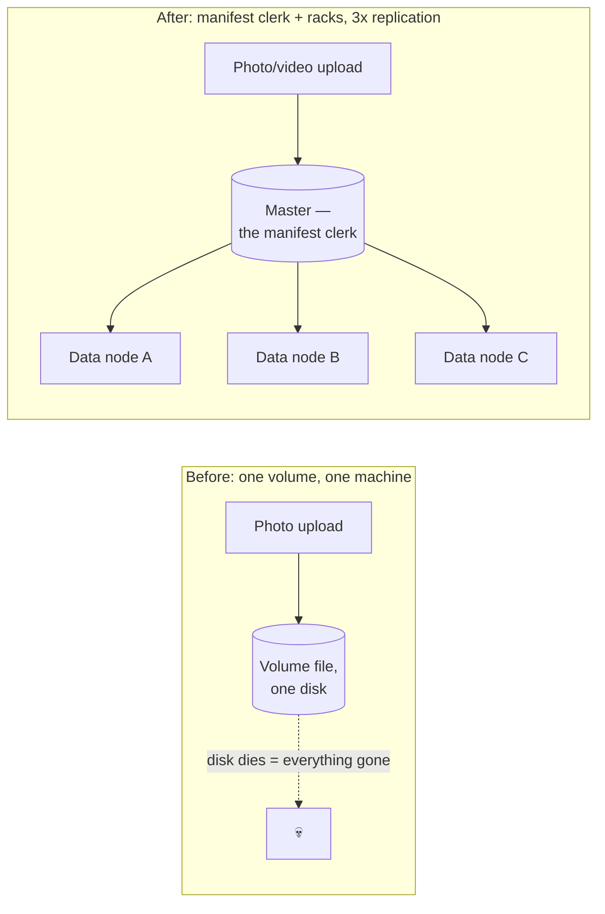

**New problem:** three copies of *everything*, forever, is expensive — and most of what SnapVault stores is old vacation photos nobody has opened in years. The storage bill just tripled, and it's about to keep growing.

**How I'd say this in an interview:** "Packing small files solves a metadata-overhead problem; it says nothing about durability. The real fix is splitting 'where is it' from 'the bytes' — a metadata service plus dumb data nodes replicating chunks — which is the same shape as GFS's master/chunkserver split. The very next question that fix raises is: do we really need three full copies of everything, forever?"

---

## Chapter 3 — The storage bill that tripled for photos nobody looks at anymore

Worked number: SnapVault stores about **20TB/day** raw across photos and video by year three. At 3x replication that's **60TB/day physical**, and over a year that's roughly **7.3PB raw → ~21.9PB physical**. Finance flags it in a budget review: most of that 21.9PB is photos and videos from years ago that get essentially zero reads.

The obvious question: *does a 5-year-old photo nobody has viewed in 4 years need the exact same durability strategy as a photo uploaded an hour ago that's actively being viewed by the uploader's friends?* No — both need to *never disappear*, but "never disappear" doesn't require three full, ready-to-serve-instantly copies.

**The fix:** for aged, infrequently-accessed ("cold") data, switch from replication to **erasure coding**. This is exactly what Facebook's real **f4** system does — it takes photos that have aged out of Haystack's hot, triple-replicated tier and re-encodes them. The analogy: **10 of 14 puzzle pieces.** Split the data into 10 equal data shards, compute 4 extra parity shards using Reed-Solomon math, and spread all 14 across 14 different machines. The property that matters: you need *any* 10 of the 14 survivors, not a specific 10 — so you can lose up to 4 machines at once and still reconstruct everything, while paying only **~1.4x storage overhead** instead of 3x.

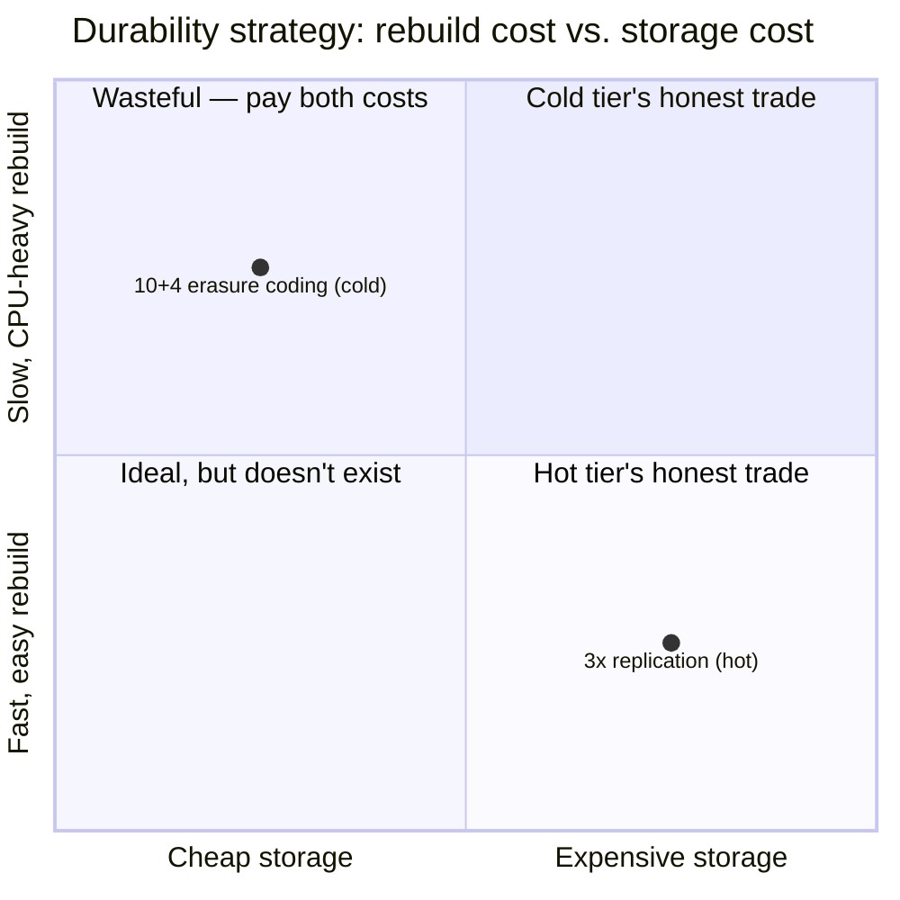

**New problem:** rebuilding a lost erasure-coded shard means reading all 10 surviving peers and re-running the encode math — CPU- and network-heavy, and too slow for photos people are actively opening right now. So erasure coding only makes sense for cold data; SnapVault keeps hot data on 3x replication. But there's a second problem hiding underneath both strategies: every copy — replicated or erasure-coded — is still sitting in **one region**. A whole-region event (a fire, a multi-hour power failure) takes out every copy at once, hot or cold.

**How I'd say this in an interview:** "Uniform durability wastes either money or latency — replicate hot data because rebuild has to be instant, erasure-code cold data because you can afford a slower, CPU-heavy rebuild in exchange for cutting overhead from 200% to about 40%. This is literally the trigger for Facebook's real Haystack-to-f4 migration. But neither strategy alone survives a whole region going dark, and that's the next gap."

---

## Chapter 4 — The region that went dark

SnapVault's entire footprint — hot replicas and cold erasure-coded shards alike — lives in one region, spread across a few racks and data centers. One year, that region has a multi-hour outage `[illustrative — a stand-in for "a real regional event," not a specific incident]`. Every single copy of every photo is unreachable, and if the event had been permanent instead of temporary, every copy would simply be gone — no amount of in-region replication protects against the region itself disappearing.

The obvious question: *if we already replicate three times, why isn't that enough?* Because all three copies were chosen to be *close together* on purpose, to keep write latency low — which is exactly what makes them all fail together.

**The fix:** add a fourth kind of copy, asynchronous, in a **different region entirely**, replicated *after* the client already got their "upload complete." Each ring of copies now defends a specific, named failure: **rack** copy defends against a power/network strip dying, **same-region, different data-center** copy defends against a fire or flood in one building, **remote-region** copy defends against the region itself going dark. This tiered placement is the real, documented shape Azure and S3-style systems actually use.

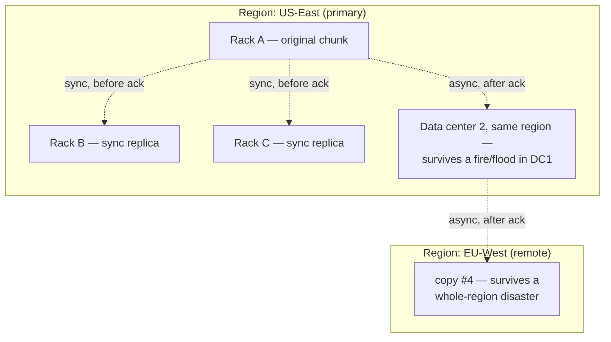

**New problem:** the remote-region copy is asynchronous — it lands *after* the client already got a success response. Which raises an uncomfortable question SnapVault hasn't actually answered yet: if a friend on the other side of the world clicks the link two hundred milliseconds after upload, and the remote region's copy hasn't landed yet, what do they see?

**How I'd say this in an interview:** "Replication needs at least three tiers, not one — rack, data center, and region — because each one defends against a genuinely different failure, and naming which failure each copy defends against is what makes the answer sound engineered rather than memorized. But an async cross-region copy immediately opens a consistency question: what does a reader in that remote region see before the copy has landed?"

---

## Chapter 5 — The upload that "succeeded" but 404'd for a friend

A user in New York uploads a photo, sees "upload complete" instantly, and immediately shares the link with a friend in Singapore. The friend clicks it **~200ms later** `[illustrative timing — the real risk category, cross-region replication lag, is well documented; the exact gap is a stand-in]` and gets a **404 — file not found**. Nothing is actually lost. The async copy to the Singapore-side region simply hasn't landed yet. But to that friend, it looks exactly like data loss.

The obvious question: *if the upload already said "success," shouldn't "success" mean everyone, everywhere, can see it right now?* That's a real design choice, not an accident — and SnapVault has to pick a side explicitly.

**The fix:** commit to **strong read-after-write consistency for metadata**, but scope it honestly. Inside the primary region, don't acknowledge the client's upload until *all three* synchronous replicas have confirmed the write — and never serve a read from a copy that hasn't confirmed it. That guarantees "success" really does mean success, everywhere the sync replicas live. The async cross-region copy is the one piece explicitly allowed to be eventually consistent — it's a trade SnapVault names out loud, not a bug it apologizes for. This is exactly the real move Amazon made with S3: eventually consistent for years, then **moved to strong read-after-write consistency in December 2020** — a documented, industry-shaping change.

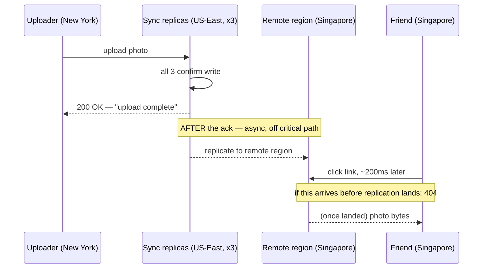

**New problem:** guaranteeing strong consistency this way means *every* metadata read and write for the whole app funnels through the same master/metadata service, to check "has this write actually confirmed everywhere it needs to." As SnapVault's user base keeps growing, that one clerk starts getting asked an awful lot of questions.

**How I'd say this in an interview:** "If an interviewer asks whether this design is eventually consistent, the precise answer is: strong within the primary region, eventual only for the async cross-region copy, and only until that copy lands — S3 itself made exactly this move to strong read-after-write in December 2020. The cost of strong consistency is that the metadata service now sits on the critical path of every single read and write."

---

## Chapter 6 — The one clerk everybody has to ask, every single time

SnapVault's master node — the manifest clerk from Chapter 2 — now has to be consulted for every `getBlob` call: check access, look up which data nodes hold the chunks, confirm none of them are behind. Benchmarks show the master tops out around **~10,000 QPS** `[illustrative — the reference design's own stand-in ceiling for "one metadata instance," not a hard physical constant]`. SnapVault's read traffic, driven by viral posts, dwarfs its write traffic — worked ratio, roughly **400 reads for every 1 write** at peak, the same lopsided shape any consumer photo/video app has. The master, doing a full lookup on every single read, is nowhere near able to keep up.

The obvious question: *why does every read have to ask the clerk at all, if the answer barely ever changes?* It doesn't, most of the time — a chunk's location is stable for long stretches. The client just doesn't know that yet on its first request.

**The fix:** client-side caching of the **chunk → data-node mapping**, the exact same "resolve once, reuse the answer" trick a DNS cache uses. The first read for a given photo is a **cold read** — ask the master, get the mapping, fetch the bytes, and cache the mapping locally. Every read after that is a **warm read** — skip the master entirely, go straight from client to data node.

```mermaid
sequenceDiagram
    participant C as Client
    participant M as Master (manifest clerk)
    participant D as Data Node

    rect rgb(60,20,20)
    Note over C,D: Cold read — first access, no cached mapping
    C->>M: getBlob(photo_id)
    M-->>C: chunk locations [D1, D2, D3]
    C->>D: fetch bytes
    D-->>C: photo data
    C->>C: cache the mapping
    end
    rect rgb(20,50,30)
    Note over C,D: Warm read — every access after
    C->>C: check cache — hit
    C->>D: fetch bytes directly
    D-->>C: photo data
    Note over C,M: master never contacted
    end
```

**New problem:** caching the mapping only works if the mapping stays true. And the master doesn't actually promise it will.

**How I'd say this in an interview:** "The master's QPS ceiling only has to absorb cold reads and writes, not the full read volume, once clients cache the chunk-to-node mapping — same shape as a DNS cache or connection reuse. The whole trick only holds up as long as the cached answer stays true, which is exactly the next thing that breaks."

---

## Chapter 7 — The cached address that pointed at an empty rack

The master notices Data Node 12's disk is showing early failure signs and proactively moves its chunks over to Data Node 47 — a sensible, self-healing move. But thousands of clients are still holding a cached mapping from an hour ago that says "photo 9981 lives on D12." The next time each of those clients tries a warm read, it hits D12, finds nothing there anymore, and fails — a spike of broken image icons across the app, for photos that are perfectly safe and readable, just not where the cache thinks they are.

The obvious question: *doesn't a short TTL on the cache fix this?* Only partially, and clumsily — too short a TTL means constantly re-asking the master (defeating the point of caching); too long means exactly this failure window. TTL alone answers "how stale can this get," not "did it actually go stale."

**The fix:** attach a version — an **epoch/generation number** — to the cached mapping itself. A failed fetch against a cached mapping isn't treated as "the photo is gone"; it's treated as "my mapping might be outdated," and triggers exactly one fallback round-trip to the master to refresh. Cheap in the normal case (mappings rarely change), self-healing in the rare case (a rebalance happened). This is the same "cache coherence via versioning, not TTL alone" fix that shows up anywhere a client caches an answer that the source of truth can move underneath it.

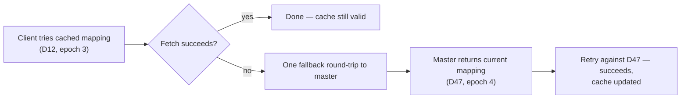

Beyond the client's own cache, SnapVault adds one more layer for reads: a **CDN at the edge**, caching the actual bytes of publicly-viewable photos. This is trivially safe *because* photos are write-once — an immutable object never needs invalidation, only expiry, and a new upload just gets a new URL entirely. When a single meme photo goes viral overnight — millions of reads a second — the CDN edge absorbs nearly all of it; SnapVault's origin storage only ever serves the first cache-fill per edge location.

**New problem:** reads are handled well now. But SnapVault adds **albums**, and `listAlbumPhotos` — one of the most common calls in the whole app — is oddly, consistently slow.

**How I'd say this in an interview:** "Cache invalidation here isn't a TTL problem, it's a coherence problem — version the cached answer so a miss triggers exactly one refresh instead of either constant re-checking or silent staleness. And CDN caching in front of all of this is only free because the data is immutable — no invalidation needed, only expiry, since an 'edit' is always a brand new URL."

---

## Chapter 8 — The album list that had to ask sixty different filing cabinets

SnapVault's first instinct for partitioning metadata was the obvious one: hash each photo's own ID and spread it across, say, **60 partitions**. Clean, evenly balanced, great for write throughput. But a user's album with 200 photos ends up with those 200 metadata rows scattered almost uniformly across all 60 partitions — by simple pigeonhole math, roughly 3-4 photos per partition. Calling `listAlbumPhotos` on that one album means fanning a request out to **all 60 partitions** and merging the results, every single time, for one of the most common actions in the app.

The obvious question: *why would you partition by the ID of the thing you're not usually looking up in bulk?* Because it felt balanced — but "balanced" isn't the goal, "matches how you actually read the data" is.

**The fix:** partition by the **composite key** — `account_id + album_id + photo_id` — so every photo belonging to the same album lands in the *same* partition. `listAlbumPhotos` becomes a single partition scan instead of a 60-way fan-out and merge.

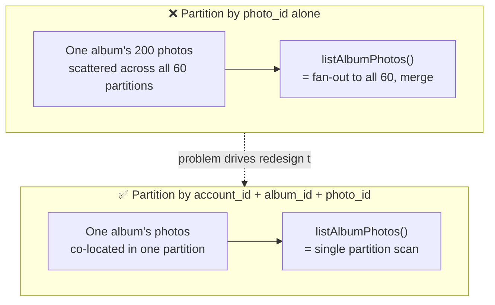

The trade-off, said out loud: this trades a little write-balance purity for read locality — the right call, because SnapVault's dominant access pattern is "show me this album," not "show me a random scatter of photos." The risk it accepts: one account that goes viral and dumps 50,000 photos into a single public album creates a genuine write hotspot on that one partition.

**New problem:** SnapVault now supports video, and a 1.8GB video upload over a spotty mobile connection keeps failing at 92% and restarting from byte zero, every single time.

**How I'd say this in an interview:** "Partition key choice is a trade-off between write distribution and read locality, and you pick based on your dominant access pattern — here, listing-by-album beats spreading writes evenly, so the partition key is the composite path, not the raw photo ID alone."

---

## Chapter 9 — The 2GB video that had to restart from zero, every time

A user tries to upload a 1.8GB birthday video on a flaky connection. It dies at **92%**, three times in a row, and they give up. The whole upload is one giant HTTP request — any dropped packet near the end means starting completely over from byte zero.

The obvious question: *why should one dropped packet near the finish line cost the entire transfer?* Because the upload was designed as one atomic all-or-nothing call, with no concept of "partial progress that's safe to keep."

**The fix:** **multipart upload**. Split the file client-side into parts (S3's real limits: **5MB to 5GB per part**, up to a **5TB** total object), upload the parts in parallel, and only the parts that fail get retried — not the whole object. The server stitches parts together and verifies checksums once everything lands.

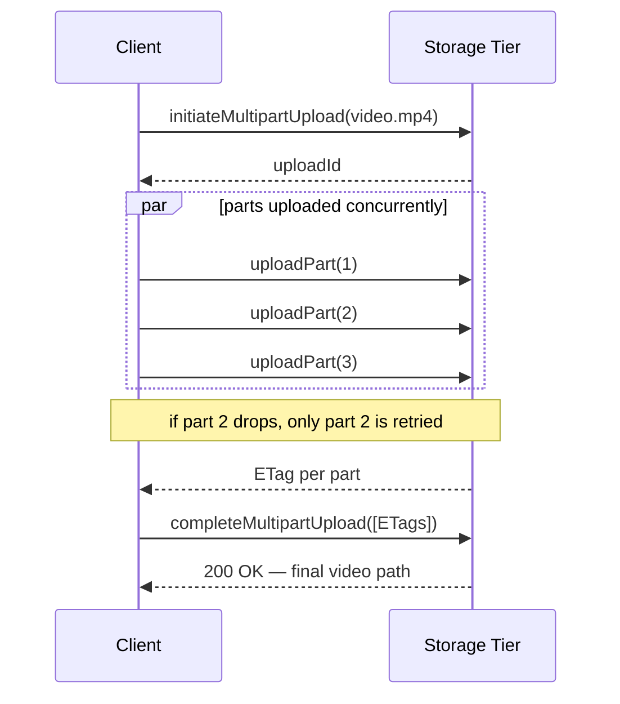

A second, real production optimization SnapVault adopts at the same time: don't tunnel the video's bytes through the app tier at all. The app server issues a **pre-signed URL** — a time-limited, capability-scoped link — and the client uploads directly to the storage tier, bypassing the app tier's bandwidth entirely. Think of it as **a scoped, time-limited badge that any door can check on its own, without calling the front desk** — the storage tier validates the badge's signature and expiry locally, with no round trip back to the master or the app server.

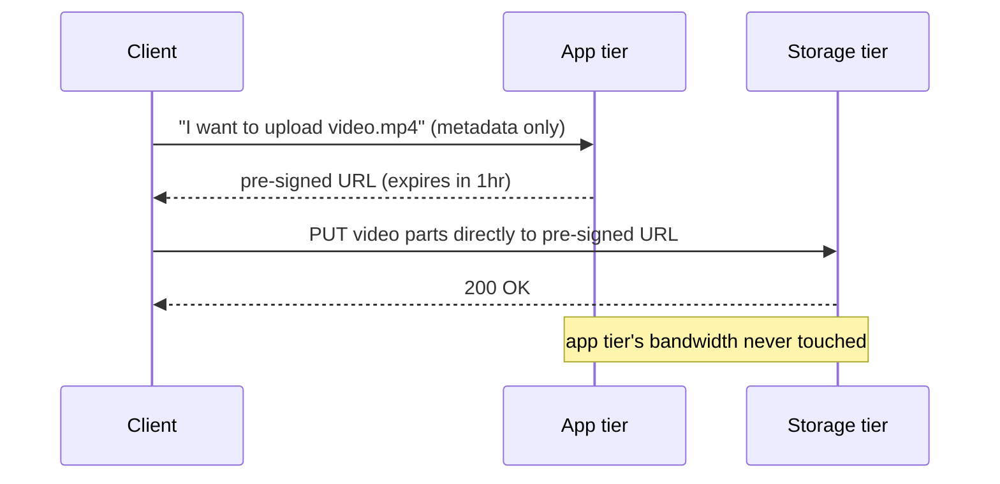

**New problem:** uploads and reads are both fast and resilient now. But storage keeps growing forever, because deleted photos and videos aren't actually freeing any space, and a viral meme photo that 40,000 users independently uploaded is stored as **40,000 separate full copies**.

**How I'd say this in an interview:** "Multipart upload turns 'restart a multi-gigabyte transfer' into 'resend one 8MB part,' which is what makes uploads over unreliable mobile networks viable at all. And in real systems — S3, GCS, Azure — the app tier usually doesn't touch the bytes at all; it just issues a pre-signed URL and gets out of the way, which removes it as a bandwidth bottleneck entirely."

---

## Chapter 10 — The delete button that had to wait for a warehouse audit, and the meme stored 40,000 times

SnapVault's first delete implementation is synchronous and literal: `deleteBlob` physically scrubs the bytes off all three replicas (and, for cold data, coordinates across all 14 erasure-coded shards) before returning success. Worked cost: confirming physical erasure everywhere, live, takes on the order of **hundreds of milliseconds to a couple of seconds** `[illustrative — the real cost driver, cross-node coordination before ack, is real; the exact figure is a stand-in]` — a noticeably slow, all-or-nothing delete button.

The obvious question: *does the user need to wait for the physical bytes to be gone, or just for the photo to disappear from view?* Just the second one — nobody's staring at a disk-usage dashboard the moment they hit delete.

**The fix:** **tombstone now, reclaim later**. `deleteBlob` instantly writes a "DELETED" marker into metadata — the photo vanishes from the app immediately — while a background garbage collector frees the actual bytes later, off the critical path. This trades temporary disk-accounting lag for a fast, non-blocking delete API — the exact same "acknowledge fast, reconcile async" shape as a queue's soft-delete-plus-compaction.

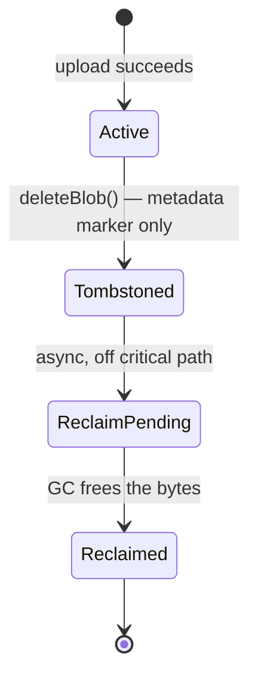

Separately, someone on the data team notices the 40,000-copies problem: a viral meme photo, uploaded independently by 40,000 different users, is stored as 40,000 identical full-size copies. The fix: **content-addressable dedup** — hash the bytes (SHA-256) at upload time; if that hash already exists in storage, don't write new bytes at all, just add a metadata pointer and increment a reference count. This is only safe *because* photos are immutable — nobody can "edit" a shared blob out from under the other 39,999 people pointing at it.

Now the two fixes have to talk to each other, or dedup silently breaks: the garbage collector must **not** reclaim a chunk just because one tombstoned blob points at it — it has to check the chunk's reference count first. Only when the retention window has passed *and* the refcount hits zero *and* no in-flight read is still holding it, is the chunk actually eligible for reclaim.

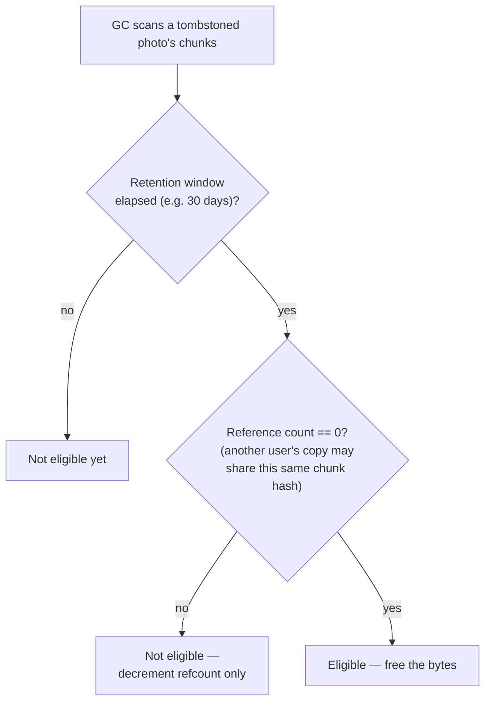

**New problem:** every fix so far — the master, the cache, the partition scheme, the GC — has been living on one logical metadata service. SnapVault keeps growing every year, and eventually even a well-cached, well-partitioned master's *total index* outgrows what one instance's memory and CPU can hold.

**How I'd say this in an interview:** "Delete has to be instant from the user's point of view and lazy from the disk's point of view — tombstone immediately, reclaim asynchronously. Content-addressable dedup is the natural next move once you notice the same bytes uploaded by different people, and it's safe specifically because the data is immutable — but it means garbage collection now has to check a reference count, not just a tombstone, before it frees anything."

---

## Chapter 11 — The clerk that had to be cloned

Even with client-side caching absorbing most reads, the master's remaining traffic — cold reads, all writes, all rebalancing decisions — eventually creeps past its own **~10,000 QPS** ceiling `[illustrative, same stand-in ceiling as Chapter 6]` once SnapVault crosses a few hundred million accounts. This is the same ceiling GFS itself eventually hit with its single master — a well-documented, real scaling wall, not a SnapVault-specific quirk.

The obvious question: *if data itself scales by sharding across many machines, why would metadata be any different?* It isn't — the fix is the same shape.

**The fix:** shard the metadata service itself. A thin routing layer sits in front, and **N metadata shards** behind it, each owning a disjoint range of the partition key (the same `account_id`-based ranges Chapter 8 already introduced for data). This is exactly the real move Google made going from **GFS's single master to Colossus's sharded metadata layer** (via what Google calls Curator processes), and it's the same two-layer shape Azure Blob Storage documents publicly: a **stream layer** doing the replicated byte storage, and a **partition layer** — itself horizontally partitioned — playing the master's role.

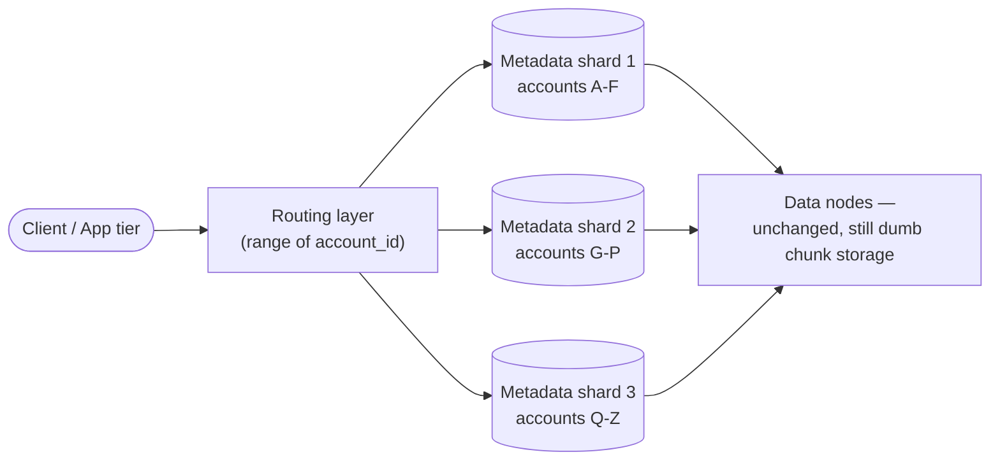

Sharding fixes throughput, but each individual shard is still, on its own, a single point of failure — so each one gets a hot standby and **consensus-based leader election** (Raft/Paxos, or an external coordinator like ZooKeeper/etcd), so a shard's failure is a few seconds of unavailability for its slice of accounts, never data loss. The new leader always rebuilds its state from the **durable metadata store**, never by re-scanning data nodes — that would be far too slow.

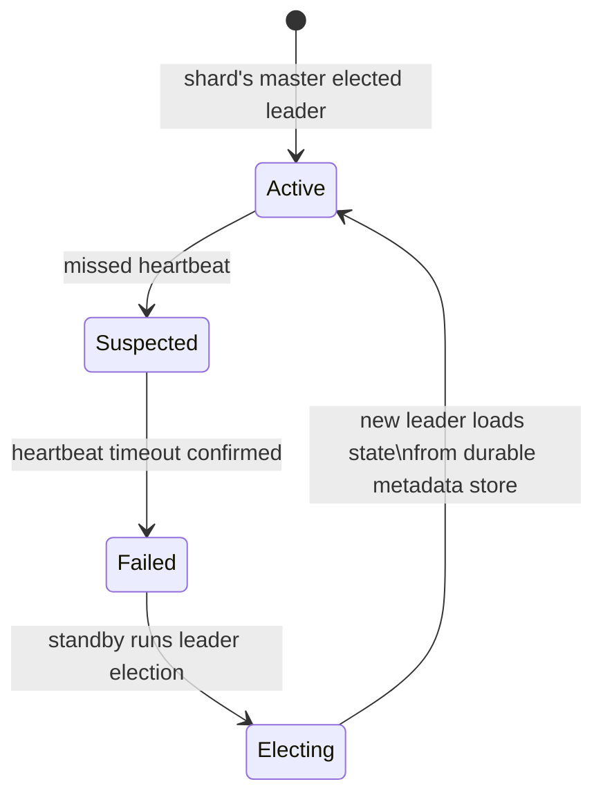

This is roughly where SnapVault's design actually lands — and it's the same place Facebook's real **Tectonic** system landed, unifying Haystack-style hot storage and f4-style cold storage into one exabyte-scale system with a sharded, disaggregated metadata layer, instead of maintaining several bespoke storage systems side by side. Dropbox's own **Magic Pocket** made a related bet — migrating off S3 entirely to build custom erasure-coded storage tuned to Dropbox's own access patterns and cost targets. From here, further evolution is tuning and operations, not new architecture.

**How I'd say this in an interview:** "The master in any first-pass diagram is a stand-in for a metadata *service* — at real scale it's sharded the same way the data itself is, which is exactly Google's move from GFS to Colossus, and Azure's partition-layer design. Naming that unprompted pre-empts the follow-up before the interviewer has to ask it."

---

## Where the story actually lands

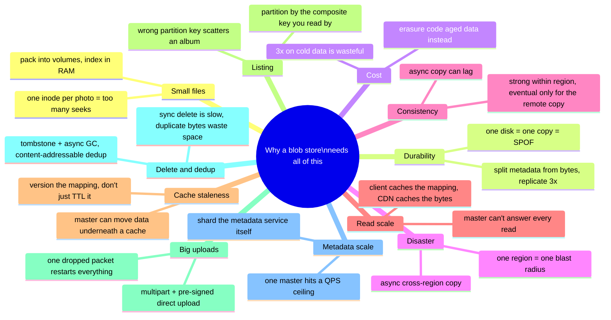

Every real production blob store you'll design in an interview sits *somewhere* on this chain. The skill isn't reciting all eleven chapters — it's stopping where the requirements say to stop. A small internal file-upload tool might reasonably stop around Chapter 4. A YouTube- or S3-scale system needs to reach Chapter 9 through 12. If nobody's mentioned multi-region disaster recovery, walking there unprompted reads as padding, not depth.

---

## Grill me — adversarial follow-ups

**Q1: "Why not just buy bigger disks instead of doing all this Haystack packing?"**
Bigger disks push the wall further out but don't remove it — the problem isn't capacity, it's that every small file pays a fixed metadata-lookup cost regardless of disk size. Haystack packing fixes the actual bottleneck (seeks per read), not just the symptom (running out of space).

**Q2: "If erasure coding is cheaper, why not use it everywhere and skip replication entirely?"**
Because erasure coding's rebuild is CPU- and network-heavy — reading 10 surviving shards and re-running the math — which is fine for cold data you rarely touch, but far too slow for hot data where a node failure needs to be invisible to an active reader right now. You pick per data temperature, not universally.

**Q3: "Your strong-consistency fix in Chapter 6 waits for all sync replicas before acking — doesn't that make every write slow?"**
It makes every write as slow as the slowest of three nearby, same-region replicas — which is fast, because they're deliberately placed close together for exactly this reason. The genuinely slow, eventually-consistent piece is the cross-region copy, and that one happens after the client already has their answer, so it's never on the latency path the user feels.

**Q4: "Isn't client-side caching of the chunk mapping just moving the staleness problem around instead of solving it?"**
Partially, yes — that's an honest trade, not a flaw hidden from the interviewer. Caching removes the master as a bottleneck for the 99% common case, and versioning the cache turns the rare staleness case into one cheap fallback round-trip instead of either silent failure or paying the master-round-trip cost on every single read.

**Q5: "Why partition by account+album+blob instead of just sharding by account_id alone — isn't that simpler?"**
It's close, but album-level co-location still matters once one account has many large albums spread thin — the point is picking the key that matches the actual dominant read (`listAlbumPhotos`), and composite keys let you tune that precisely instead of only getting account-level locality.

**Q6: "Multipart upload retries failed parts — what stops a client from completing the upload with a corrupted part?"**
Each part carries a checksum, verified independently when it lands, and the final `completeMultipartUpload` call re-verifies against the ETags returned for every part before stitching — a part that doesn't match its expected checksum gets rejected and re-uploaded, not silently accepted.

**Q7: "Content-addressable dedup sounds risky — what if two different photos happen to hash to the same value?"**
With SHA-256, a collision is astronomically unlikely — far less likely than undetected hardware failure — which is why every real system using this technique (backup systems, git itself) accepts that risk as effectively zero rather than engineering around it.

**Q8: "Doesn't tombstone-then-reclaim mean a determined attacker could 'delete' something and still read it during the retention window?"**
Yes, and that's deliberate, not a bug — the retention window exists specifically so an *accidental* delete is recoverable; if a design genuinely needs "gone means gone, instantly, no recovery window," that's a different, explicit requirement to negotiate up front, not the default.

**Q9: "You keep saying 'shard the master' — isn't the routing layer in front of the shards just a new single point of failure?"**
The routing layer itself needs to be stateless and horizontally replicated — it only holds a small, mostly-static range map, so it's cheap to run many copies behind a load balancer. The actual hard consistency problem is inside each metadata shard's own leader election, which is why that piece specifically gets a real consensus protocol, not the routing layer.

**Q10: "Given this whole story, if someone says 'design a blob store' cold, where do you actually start?"**
Get two things clear before drawing anything: is this write-once-read-many (almost always yes for blob stores), and what's the durability target — because those two answers dictate replication vs. erasure coding, consistency model, and multi-region strategy all at once. Then walk forward only as far as the stated scale requires — chunking and basic replication are close to a given; multi-region, dedup, and sharded metadata are things you earn by naming a specific scale or requirement, not defaults you bolt on for their own sake.

---

## Pacing note

**If this is 60 seconds inside a bigger question:** say the manifest-clerk line — split "where is it" from "the bytes," pack small files, chunk big ones, replicate hot data and erasure-code cold data, cache the metadata not just the bytes — then say "I'd go deeper into consistency, partitioning, or garbage collection if you want a specific deep dive." That's the whole shape in one breath.

**If this is the whole 15-20 minute focus:** walk the chapters in order — why small files hurt filesystems, splitting metadata from bytes, replication vs. erasure coding by data temperature, multi-region disaster recovery and what that does to consistency, client-side caching and its staleness fix, partitioning by read pattern, multipart upload and pre-signed URLs, tombstone-based delete and dedup, then sharding the metadata service itself if scale comes up. Don't walk all eleven unprompted — follow the interviewer's questions, and use the skipped chapters as your "if I had more time" closer.

---

## Active recall — no answers, test yourself cold

1. What's the one-sentence reason a naive filesystem struggles with millions of small photos?
2. What does Haystack packing actually do, and why does it turn ~10 seeks into 1?
3. Why does 3x replication on *all* data eventually become a cost problem, and what's the fix for cold data specifically?
4. Name the three tiers of replica placement and the one specific failure each tier defends against.
5. What's the precise difference between what's strongly consistent and what's eventually consistent in this design?
6. Why does client-side caching of the chunk-to-node mapping need a version/epoch number instead of just a TTL?
7. Walk through why partitioning photo metadata by `photo_id` alone breaks `listAlbumPhotos`.
8. What two separate problems does multipart upload plus a pre-signed URL solve, and which one is about resilience vs. which is about bandwidth?
9. Why must garbage collection check a reference count, not just a tombstone, before reclaiming a chunk's bytes?
10. What real, documented system made the exact move of sharding a single master into a distributed metadata layer?

*Spaced repetition: test this list today, again in 2-3 days, again in a week.*

---

## Cheat sheet — one line per stop on the story

- **Small-file overhead**: a plain filesystem pays multiple real disk seeks per tiny file — Haystack packing turns that into one seek by packing many files into one volume with an in-memory offset index.
- **Metadata/data split**: a master (manifest clerk) tracks where bytes live; dumb data nodes just hold them — this split, plus chunking big objects, is what lets replication and placement scale independently of the bytes.
- **Replication vs. erasure coding**: replicate hot data (fast rebuild, 3x cost); erasure-code cold data (slow, CPU-heavy rebuild, ~1.4x cost) — pick by data temperature, not universally.
- **Multi-region placement**: rack copy defends against a power failure, same-region DC copy against a fire/flood, remote-region copy against the region itself going dark.
- **Consistency**: strong read-after-write within the primary region; the async cross-region copy is the only piece allowed to be eventually consistent, and only until it lands.
- **Client-side metadata caching**: skip the master on every warm read by caching the chunk-to-node mapping — version it with an epoch so a rebalance triggers one cheap refresh instead of silent staleness.
- **CDN in front**: safe with zero invalidation logic because objects are immutable — a new version is always a new URL.
- **Partition key choice**: partition by the composite key you actually read by (account+album+blob), not by the ID that merely balances writes evenly.
- **Multipart upload + pre-signed URLs**: retry only the failed part instead of the whole object, and let the client talk directly to storage instead of tunneling bytes through the app tier.
- **Tombstone + async GC**: delete is instant in metadata, byte reclaim happens later, gated by a retention window and a reference count of zero.
- **Content-addressable dedup**: hash the bytes; if it already exists, add a pointer and bump a refcount instead of storing a duplicate copy — safe only because objects are immutable.
- **Sharded metadata service**: once one master hits its QPS ceiling, shard it the same way the data itself is sharded, with per-shard leader election for failover — the real move from GFS to Colossus, and Azure's stream-layer-plus-partition-layer design.
- **The meta-lesson**: every fix in this story buys one property (fast reads, durability, cost efficiency, disaster tolerance, correctness, read scale, cache freshness, read locality, upload resilience, fast delete, no wasted bytes, or metadata scale) by spending or risking a different one — say the trade in the same sentence you propose the fix.
