# Blob Store — FAANG System Design Interview Guide

## Mental model

A blob store is **S3/GCS/Azure Blob in miniature**: a flat key → bytes store for
huge, immutable, unstructured objects (videos, images, backups, logs). Throw away
everything you know about filesystems — there are no directories, no in-place
edits, no small-file assumptions. Think of it as three nested lookup tables
(`account → containers → blobs`) sitting on top of a dumb, horizontally-scaled
disk farm, with **all the intelligence living in metadata, not in the bytes**.

The one sentence that unlocks the whole design: **"the hard part isn't storing
big files, it's storing the tiny facts about billions of big files, cheaply,
consistently, and fast."** A 4K video is easy — write it to a disk. Knowing
which of 10,000 disks has chunk #3,482,991,204 of it, replicated three times,
without a full scan, is the actual system design problem.

Everything else falls out of two constraints:
- **Write once, read many (WORM)** — objects are immutable once written; "editing"
  means uploading a new version. This is what makes caching, CDN delivery, and
  replication trivial compared to a mutable database.
- **Objects are too big for one machine, one disk, or one network call** — so
  every blob is split into fixed-size **chunks**, and everything downstream
  (replication, placement, streaming, garbage collection) operates at chunk
  granularity, not blob granularity.

---

## Object storage vs. block storage vs. file storage

This is the single most common opening curveball ("why not just use a shared
filesystem?") and the fastest way to lose credibility if you can't answer it in
30 seconds.

| | Block storage | File storage | Object storage (blob store) |
|---|---|---|---|
| Unit of access | Fixed-size block/sector | File, inside a directory tree | Whole object (key → bytes) |
| Namespace | None — raw address space | Hierarchical (POSIX paths) | Flat (key/path string, no real directories) |
| Mutability | In-place overwrite of any block | In-place edits, appends, byte-range writes | Immutable — new version replaces the whole object |
| Metadata | Minimal (filesystem owns it) | Rich (permissions, timestamps, ACLs) | Very rich, user-extensible (tags, custom key-value) |
| Access API | SCSI/iSCSI, mounted as a raw disk | NFS/SMB, POSIX syscalls | HTTP REST (`PUT`/`GET`/`DELETE`) |
| Scale ceiling | One VM/host at a time | Millions of files, shared by many hosts | Billions of objects, exabytes |
| Example | AWS EBS, a VM's boot disk | AWS EFS, NFS, HDFS | **This chapter** — S3, GCS, Azure Blob |
| Typical workload | Databases, boot volumes — needs low-latency random I/O | Shared config, home directories, small shared files | Media, backups, logs, ML datasets — big, rarely-edited objects |

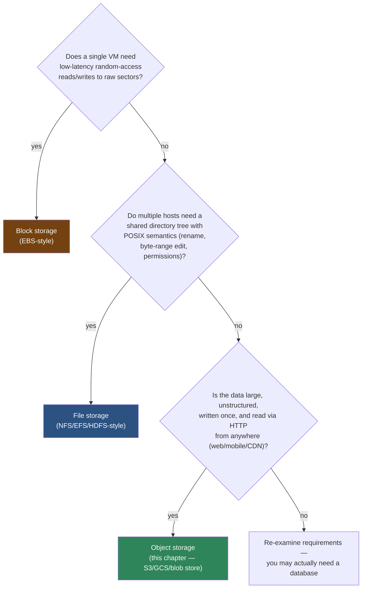

*Mnemonic:* **"block = a disk, file = a cabinet with folders, object = a warehouse with barcodes."** A warehouse doesn't care about folders — it cares about a flat ID you can look up instantly, which is exactly the blob store's flat namespace.

---

## Interview playbook

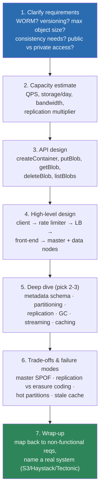

**How to use this out loud:** don't silently think through all 7 steps — narrate
which step you're on ("let me estimate capacity before I draw boxes"). Interviewers
grade the *process* as much as the answer. Spend the most breath on step 5 — that's
where senior signal comes from. Steps 1–4 should take under 10 minutes combined.

### How to identify this topic in an interview
These phrasings all resolve to "design a blob store," even when they don't say so:
- "Design S3 / Google Cloud Storage / Azure Blob Storage"
- "Design Dropbox / Google Drive" (the storage backend, not the sync client)
- "Design a photo storage system" (Facebook/Instagram Haystack lineage)
- "Design a video storage/upload system for YouTube" (the storage tier specifically)
- "How would you store and serve billions of user-uploaded files?"
- "Design a backup service" / "Design a CDN origin store"

If the interviewer instead emphasizes *directory hierarchies*, *POSIX semantics*,
*random-access reads/writes into a file*, or *small files with frequent updates* —
that's a **distributed filesystem** (HDFS/GFS) or **database** question, not a
blob store question. Say so; naming the distinction is itself signal.

---

## Requirements clarification

### Functional requirements
| Operation | Description |
|---|---|
| `createContainer` | Group blobs under a storage account (like an S3 bucket) |
| `putBlob` | Upload a blob into a container |
| `getBlob` | Retrieve a blob by its fully-qualified path/URL |
| `deleteBlob` | Soft-delete a blob (optionally honoring a retention window) |
| `listBlobs` | Paginated listing of blobs in a container, optionally by prefix |
| `deleteContainer` | Delete a container and everything inside it |
| `listContainers` | List all containers under an account |

Containers cannot nest (flat namespace) — this is a deliberate simplification
that avoids recursive-delete and directory-rename semantics entirely.

### Non-functional requirements
| Property | Target | Why it's non-negotiable here |
|---|---|---|
| Availability | 99.9%+ (write), 99.99%+ (read) | Read-heavy consumer products (video, images) fail loudly on read errors |
| Durability | 99.999999999% ("11 nines") | Losing user data is the one unrecoverable failure — the industry-standard S3 target |
| Scalability | Billions of blobs, exabytes | No ceiling on accounts, containers, or object count |
| Throughput | GB/s aggregate | Large-object transfer, not small-request QPS, dominates |
| Reliability | Detect + self-heal node/disk/rack failure | Failure is the normal case at this scale, not the exception |
| Consistency | Strong, at least for metadata | A read-after-write miss reads as "my upload silently failed" to a user |

**Disambiguate durability vs. availability up front** — interviewers often use
them interchangeably, and separating them cleanly is a strong signal:

| | Durability | Availability |
|---|---|---|
| Question it answers | "Will my data still exist later?" | "Can I access it *right now*?" |
| Threat it defends against | Permanent data loss (disk death, bit rot) | Transient outage (node down, network partition) |
| Primary mechanism | Replication factor + erasure coding + checksums | Load balancing + failover + caching |
| Failure mode if violated | Unrecoverable — data is gone | Recoverable — retry later |

*Mnemonic:* **durability = "will it exist tomorrow," availability = "can I get it right now."** You can have 11-nines durability with an outage in progress — the bytes are safe on disk, you just can't reach them this second.

---

## Capacity estimation, worked

### The formula chain
```
1. Servers needed        = DAU (or QPS) / QPS-per-server
2. Raw storage/day       = objects/day × avg object size
3. Bandwidth in          = raw storage/day / seconds-in-day
4. Bandwidth out         = DAU × reads/user/day × avg object size / seconds-in-day
5. Replicated storage    = raw storage × replication factor (or × EC overhead)
6. Metadata store size   = (blobs × chunks/blob × replicas) × metadata-row-size
7. Partition/shard count = replicated storage / storage-per-partition-server
```
Walk this chain **every time inputs change** — interviewers will perturb DAU or
object size mid-interview specifically to see if you re-derive or just recite
the earlier number.

### Worked example: YouTube-scale video blob store
**Assumptions:** 5M DAU, 500 QPS/server, 50 MB/video, 20 KB/thumbnail, 250K
uploads/day, 20 reads/user/day.

| Step | Calculation | Result |
|---|---|---|
| Servers | 5,000,000 / 500 | **10,000 servers** |
| Storage/day | 250,000 × (50 MB + 20 KB) | **≈12.51 TB/day** |
| Bandwidth in | 12.51 TB / 86,400s | **≈1.16 Gb/s** |
| Bandwidth out | (5M × 20 × 50 MB) / 86,400s | **≈462.96 Gb/s** |

**Extend it — the part most guides stop short of:**

| Step | Calculation | Result |
|---|---|---|
| 5-year raw storage | 12.51 TB/day × 365 × 5 | **≈22.8 PB** (single copy) |
| With replication (×3) | 22.8 PB × 3 | **≈68.4 PB physical** |
| With erasure coding (×1.4, 10+4) instead | 22.8 PB × 1.4 | **≈31.9 PB physical** |
| Metadata rows (2 chunks/video × 3 replicas) | 250,000 × 2 × 3 × 365 × 5 | **≈2.7 billion rows/5yr** |
| Metadata store size (200 bytes/row) | 2.7B × 200 bytes | **≈550 GB** — fits a sharded KV store, not a single MySQL box |

The read:write bandwidth ratio (**462.96 : 1.16 ≈ 400:1**) is the single most
important number to say out loud — it's *why* the design is read-optimized
(replica fan-out for reads, aggressive CDN caching, chunk-parallel fetch) rather
than write-optimized. State the method, then let the interviewer change an input
and redo the chain live — that's the actual signal they're looking for.

### Numbers worth memorizing
| Reference | Value |
|---|---|
| RAM random access | ~100 ns |
| SSD random read (4KB) | ~150 µs |
| Sequential read from SSD (1MB) | ~1 ms |
| Disk seek (HDD) | ~10 ms |
| Sequential read from HDD (1MB) | ~20 ms |
| Same-datacenter round trip | ~0.5 ms |
| Cross-region round trip | ~150 ms |
| GFS/HDFS chunk size | 64–128 MB |
| S3 multipart part size | 5 MB – 5 GB per part |
| S3 max single object size | 5 TB |
| Target durability | 99.999999999% (11 nines) |
| Typical replication factor | 3 (sync) + cross-region async copies |
| Erasure coding overhead (10+4) | ~1.4× vs. 3× for replication |

The HDD-seek number (~10ms) is *why* blob stores use large, sequential chunks
instead of small random-access records — it amortizes the one expensive seek
over tens of megabytes of sequential transfer.

---

## High-level design

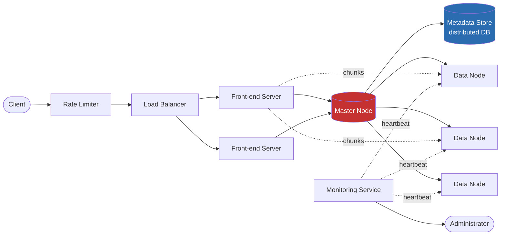

**Components at a glance:**
- **Rate limiter** — per-user/per-IP throttling (see the Rate Limiter chapter for the token-bucket mechanics).
- **Load balancer** — spreads traffic across front-ends; can be DNS-based across regions.
- **Front-end servers** — stateless request handlers; do not store data themselves.
- **Master node** — the brain: chunk-to-data-node mapping, free-space tracking, unique ID assignment, access-control checks. This is a **GFS/HDFS NameNode analogue** — recognize the pattern, it repeats across distributed storage designs.
- **Data nodes** — dumb chunk storage; send heartbeats + chunk reports to the master.
- **Metadata store** — sharded, distributed DB holding account/container/blob metadata (not the master's in-memory state necessarily, but its durable backing store).
- **Monitoring** — watches disk health and free space, pages the administrator before capacity runs out.

### API design
```
createContainer(containerName)
putBlob(containerPath, blobName, data)
getBlob(blobPath)
deleteBlob(blobPath)
listBlobs(containerPath)
deleteContainer(containerPath)
listContainers(accountID)
```
`putBlob`/`getBlob` are logical signatures — real implementations stream in
chunks or use **multipart upload** (see below) rather than one giant call.

---

## Deep dive 1: three-layer abstraction & metadata

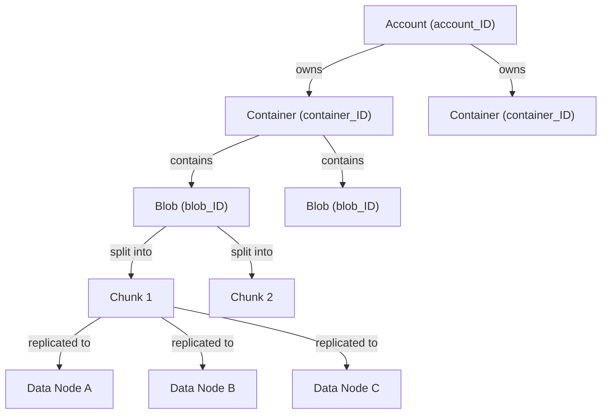

| Layer | Unique ID | Sharded by | Maps to |
|---|---|---|---|
| Account | `account_ID` | `account_ID` | list of `container_ID`s |
| Container | `container_ID` | `container_ID` | list of `blob_ID`s |
| Blob | `blob_ID` | `blob_ID` | list of chunks + data node IDs |

*Mnemonic:* **"account owns containers, containers hold blobs, blobs are chunks"** — three nesting levels, each with its own ID space, each shardable independently.

**Why fixed-size chunks, and why the size matters:** disks have near-constant
latency across a *range* of transfer sizes (e.g., writing 4–8 MB costs about the
same as 9–20 MB) because the fixed cost is the seek, not the transfer. So:
- **Bigger chunks** → smaller master-node metadata (fewer chunk records per blob) but coarser-grained replication/rebalancing.
- **Smaller chunks** → finer-grained parallelism and faster recovery, but metadata bloats and disk-latency overhead per chunk grows.

**Point to ponder — what if blob size isn't a multiple of chunk size?** The last
chunk is simply short (padded logically, not physically) — the metadata for that
chunk stores its *actual* byte length, not just its offset, so the master node
(or client, if it caches chunk metadata) knows to read fewer bytes on the final
segment. This is the same "last block is short" trick GFS and HDFS use.

---

## Deep dive 2: partitioning — the "don't just partition by blob ID" lesson

This is the single most commonly *wrong* first instinct in this design, and the
highest-signal deep-dive to walk through out loud.

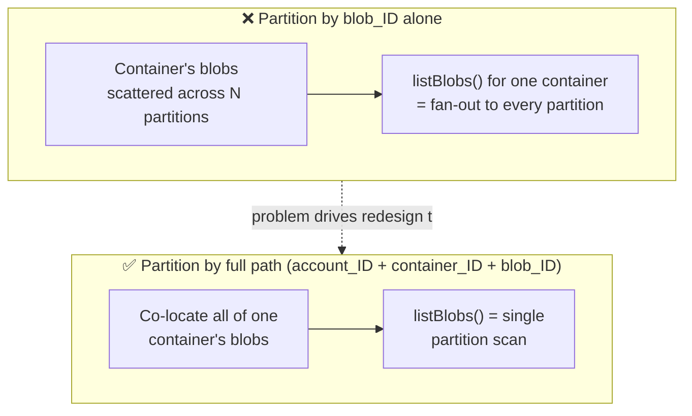

Partitioning purely by `blob_ID` (e.g., a hash or range over the ID) spreads a
single container's blobs uniformly across every partition server — great for
write load-balancing, terrible for `listBlobs`/`listContainers`, which now have
to fan out to every partition and merge. **Partitioning by the composite key
(`account_ID`, `container_ID`, `blob_ID`)** co-locates one account's/container's
data, trading a little write hotspot risk (a viral account) for cheap listing
and locality. The master node owns and persists this partition map in the
metadata store.

**Golden pattern to name explicitly:** partition key choice is a trade-off
between *write distribution* and *read locality* — pick the key that matches
your dominant access pattern (here: list-by-container dominates over
list-across-random-blobs).

---

## Deep dive 3: read path — cache hit vs. cache miss

Reads dominate this system (recall the 400:1 bandwidth ratio from the capacity
estimate), so the read path's fast case matters more than its slow case. Contrast
them side by side — this is the pattern to reach for whenever a system has a
"first time is slow, every time after is fast" shape:

```mermaid
sequenceDiagram
    participant C as Client
    participant M as Master Node
    participant D as Data Node

    rect rgb(60,20,20)
    Note over C,D: Cold read — no cached metadata (first access)
    C->>M: getBlob(path)
    M->>M: check private/public + auth
    M->>M: look up chunk → data node mapping
    M-->>C: chunk locations [D1, D2, D3]
    C->>D: fetch chunk bytes
    D-->>C: chunk data
    C->>C: cache chunk→node mapping locally
    end

    rect rgb(20,50,30)
    Note over C,D: Warm read — cached metadata (every read after)
    C->>C: check local cache → hit
    C->>D: fetch chunk bytes directly
    D-->>C: chunk data
    Note over C,M: master node never contacted
    end
```

The whole point of client-side metadata caching is to turn every read after the
first into a **direct client → data-node call that skips the master entirely** —
the master's ~10K QPS ceiling only has to absorb cold reads and writes, not the
full read volume. This is the same "resolve once, reuse the answer" shape as a
DNS cache or a browser's connection-reuse pool. See the staleness fix for this
cache under Deep Dive 7 (Caching) below.

---

## Deep dive 4: replication vs. erasure coding

### Two levels of replication

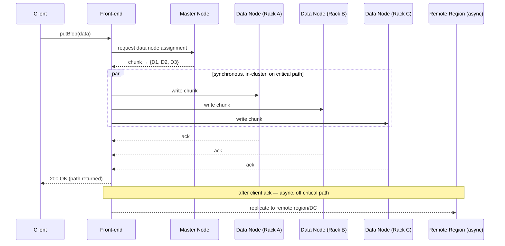

| | Synchronous (intra-cluster) | Asynchronous (cross-region) |
|---|---|---|
| When | Before ack-ing the client | After ack-ing the client |
| Optimizes for | Strong consistency, low latency (racks are near each other) | Availability against regional disaster |
| Typical copies | 3 (within one cluster, different fault domains) | 1–3 additional, in other DCs/regions |
| Risk if skipped | Data loss on single-cluster disaster | Data loss on regional disaster only |

**Typical real placement (matches Azure/S3-style designs):** local copy in
primary DC (rack/drive failure) → second copy in another DC in the *same*
region (fire/flood) → third copy in a *different region* (regional disaster).
Reads are served from whichever copy is closest and already replicated —
**never served from a region the write hasn't reached yet**, which is the
mechanism that keeps this strongly consistent rather than eventually consistent.

### Where the four copies actually live

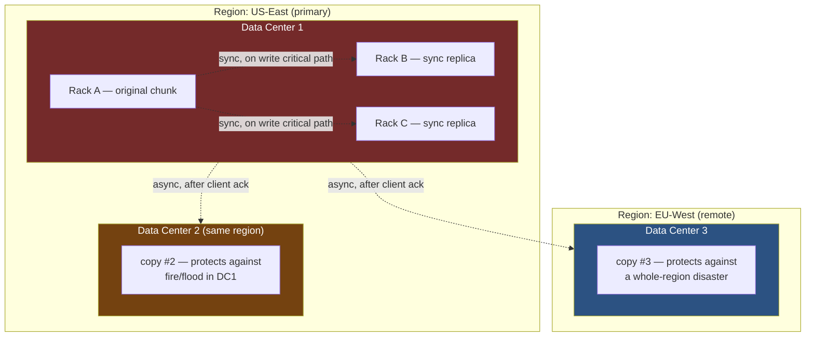

Each ring of protection answers one specific failure: **rack** (power/network
strip fails) → **data center** (fire, flood, cooling failure) → **region**
(earthquake, region-wide outage). Naming which failure each copy defends
against — not just "we keep 4 copies" — is what makes this answer sound
engineered rather than memorized.

### Replication vs. erasure coding
| | Replication (×3) | Erasure coding (e.g., 10 data + 4 parity) |
|---|---|---|
| Storage overhead | 200% (3× raw) | ~40% (1.4× raw) |
| Rebuild cost on node loss | Copy one full replica | Reconstruct from *k* of *n* shards — CPU + network heavy |
| Read/write latency | Low (direct copy) | Higher (encode/decode overhead) |
| Best for | Hot data, low-latency tier | Warm/cold data, cost-sensitive tier |
| Real examples | Intra-cluster replicas (GFS, HDFS, this design) | Facebook f4, Azure cold storage, S3 Glacier internals |

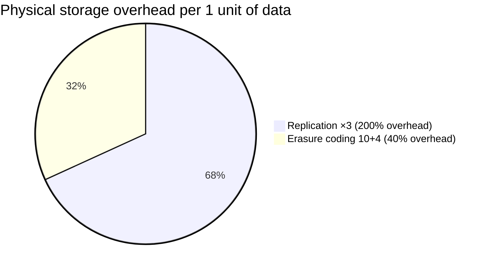

**How 10+4 erasure coding actually reconstructs data** — the part people gesture
at without explaining:

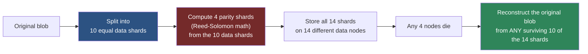

The property that matters: you need **any** 10 of the 14 shards, not a specific
10 — that's what survives up to 4 simultaneous node failures while only paying
1.4× storage instead of 3×. The cost is CPU: rebuilding a lost shard means
reading all 10 surviving peers and re-running the encode math, which is why EC
is reserved for **cold** data where rebuild frequency is low and latency is not
customer-facing.

*Mnemonic:* **"replicate hot, erasure-code cold."** Say this line and name Facebook's
f4 (which moved *aged* photos from Haystack's triple-replication to erasure
coding once access frequency dropped) — that's the canonical real-world
justification for tiering replication strategy by data temperature.

---

## Deep dive 5: garbage collection & the delete lifecycle

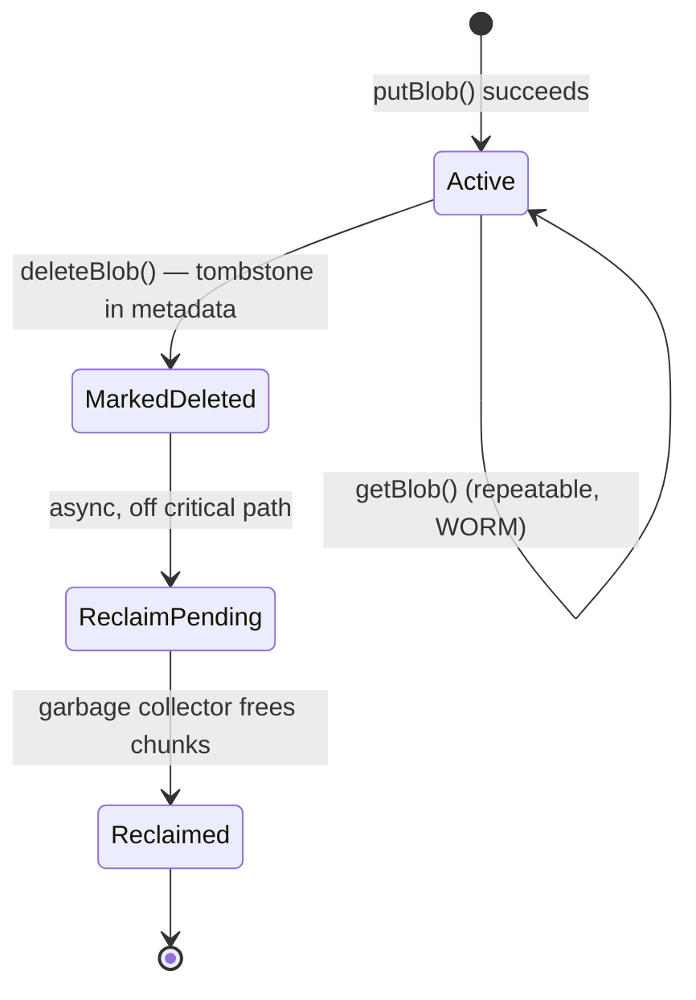

Delete is answered instantly by writing a "DELETED" tombstone into metadata —
the blob becomes invisible immediately — while the actual chunk bytes on data
nodes are freed later by a background garbage collector. This trades **temporary
metadata inconsistency** (chunks marked deleted still occupy disk for a while)
for **fast, non-blocking delete responses**. The user-visible effect is zero;
only disk-utilization accounting lags.

**Why this matters as a design principle to name out loud:** never make a
user-facing API call block on a slow background cleanup process. Acknowledge
fast, reconcile state asynchronously — the same pattern shows up in queue-based
systems' "soft delete + compaction" and in CDNs' "purge is eventually consistent."

---

## Deep dive 6: streaming, chunk-parallel reads, and multipart upload

For large objects, both ends of the API are streamed, not single-shot:

- **Read (streaming):** the client reads `X` bytes at a time — bytes `[0, X-1]`,
  then `[X, 2X-1]`, and so on — using an offset cursor, so playback (e.g., video
  seeking) doesn't require the whole object in memory.
- **Write (multipart upload):** large uploads are split client-side into parts,
  uploaded in parallel, and stitched together server-side once all parts land —
  this is what lets a client resume a failed upload from the last successful
  part instead of restarting a multi-GB transfer from byte zero.

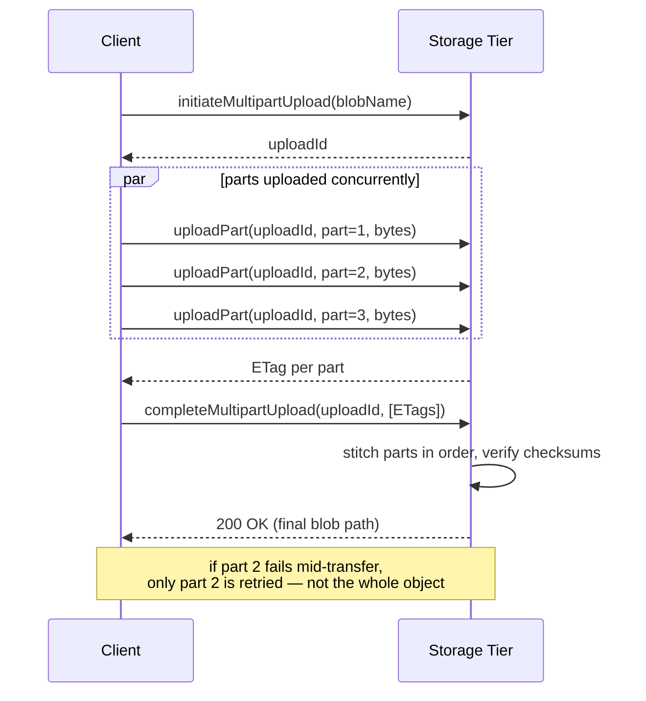

**Why this matters beyond "it's faster":** part-level retry turns a single
flaky network blip from "restart a 4 GB upload" into "resend 8 MB." At scale,
this difference is what makes uploads over unreliable mobile networks viable at
all — name this explicitly if the interviewer asks about mobile/unreliable
clients.

**A real-world optimization the source material doesn't cover, and interviewers
love:** in production blob stores (S3, GCS, Azure), the client usually does **not**
tunnel bytes through the front-end/app tier at all. The app server issues a
**pre-signed URL** (a time-limited, capability-scoped URL) and the client uploads
or downloads *directly* against the storage tier.

```mermaid
sequenceDiagram
    participant C as Client
    participant App as App/Front-end
    participant S as Storage Tier

    rect rgb(60,20,20)
    Note over C,S: Naive — bytes tunnel through the app tier
    C->>App: PUT /upload (full file body)
    App->>S: forward bytes
    S-->>App: ack
    App-->>C: 200 OK
    end

    rect rgb(20,50,30)
    Note over C,S: Pre-signed URL — app tier only issues a capability
    C->>App: POST /upload-url (metadata only)
    App-->>C: pre-signed URL (time-limited)
    C->>S: PUT directly to pre-signed URL
    S-->>C: 200 OK
    C->>App: notify upload complete (optional)
    end
```

This halves the app tier's bandwidth bill and removes it as a throughput
bottleneck entirely — bring this up unprompted in the deep dive, it's a strong
senior-level signal.

---

## Deep dive 7: caching

| Layer | What's cached | Why |
|---|---|---|
| Client | Blob's chunk-to-data-node metadata (after first read) | Skip the master node entirely on repeat reads |
| Front-end | Partition map | Route requests to the right partition without a master round trip |
| Master node | Frequently-accessed chunks | Reduce disk I/O for hot objects |
| CDN (edge) | Publicly-accessible blob bytes, until TTL expires | Serve reads without touching origin storage at all |

**The staleness trap — point to ponder:** if the master moves data between nodes
(e.g., ahead of a disk failure) after a client cached the old chunk→node
mapping, the client's cached metadata goes stale and reads fail or 404 against
the old node. **Fix pattern:** version the cached metadata (an epoch/generation
number) so a failed fetch against stale info triggers one fallback round-trip to
the master to refresh — cheap in the common case, self-healing in the rare case.
This is the same invalidation problem every client-side cache in front of a
mutable index has, and naming it as "cache coherence via versioning, not TTL
alone" is the answer interviewers want.

CDN caching is trivially safe here specifically *because* of WORM — an
immutable object never needs invalidation, only expiry, and a new version just
gets a new URL. If your interviewer relaxes the WORM assumption ("what if users
can edit blobs in place?"), say explicitly that this breaks CDN cache coherence
and would force cache invalidation or content-addressed URLs (hash the content
into the path) to route around it.

---

## Deep dive 8: security & access control

A near-guaranteed follow-up ("how do you stop me from reading someone else's
private blob?") that's cheap to answer well if you've pre-loaded the pieces.

| Concern | Mechanism |
|---|---|
| Who can read/write a blob | Access level on the blob/container: **private** (owner account only) or **public** (anyone with the URL) — checked by the master node before returning chunk locations |
| Temporary, scoped sharing of a private blob | **Pre-signed URL**: owner requests a capability-scoped, time-limited URL; anyone holding that URL can access the object until it expires — no account/session needed |
| Data at rest | Each chunk encrypted before/at write time (server-side encryption); encryption keys managed separately from the data itself |
| Data in transit | TLS on every hop — client↔front-end, front-end↔data node, cross-region replication links |
| Revoking access | Private objects: instant (next request re-checks the ACL). Already-issued pre-signed URLs: can't be revoked early unless you also check a server-side flag — call this trade-off out explicitly |

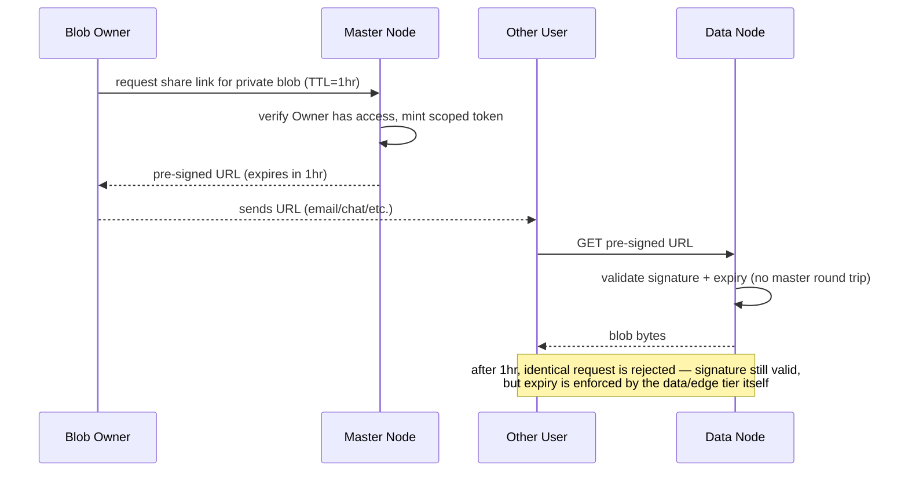

**Why the data node validates the signature itself, not the master:** round-tripping
every download through the master for an auth check would recreate the exact
bottleneck the whole architecture is built to avoid — the token is
self-describing (signed, with an embedded expiry) precisely so any node can
verify it locally.

---

## Key design decisions and trade-offs

| Decision | Chosen approach | Alternative | Why chosen |
|---|---|---|---|
| Data organization | Flat namespace, no nested containers | Hierarchical filesystem tree | Avoids recursive rename/delete complexity at scale |
| Object mutation | Immutable (WORM), new version on "edit" | In-place mutation | Makes replication, caching, CDN delivery trivial |
| Partition key | Full path (`account+container+blob`) | `blob_ID` alone | Read locality for `listBlobs` beats write-distribution purity |
| Delete semantics | Tombstone now, reclaim later (GC) | Synchronous hard delete | Keeps the delete API fast; storage reclaim isn't user-facing |
| Durability strategy | 3× sync replication (hot) | Erasure coding everywhere | Lower latency for active data; EC reserved for cold tiers |
| Consistency | Strong (read-your-write) | Eventual | User-facing "did my upload work" correctness matters more than raw write throughput |
| Upload path | Direct-to-storage via pre-signed URL | Proxy through app tier | Removes app tier as a bandwidth bottleneck |

---

## Bottlenecks and failure modes

### Is the master node a single point of failure?
**Point to ponder, answered:** yes, by construction — one master handles all
metadata reads and chunk placement. Mitigate, don't eliminate, with:
1. **Hot standby + consensus-based leader election** (Raft/Paxos, or a
   ZooKeeper/etcd-style external coordinator) so a new leader takes over within
   seconds of a failure being detected.
2. **Durable, replicated backing store** for master state (the metadata store),
   so a freshly-elected leader can rebuild in-memory state instead of losing it.
3. **Sharding the master itself** once a single instance's QPS ceiling (~10K QPS
   in this design) is reached — partition metadata across multiple master
   instances, each owning a range of the partition key, the same fix GFS/HDFS
   evolved into with federated namenodes, and what Colossus does versus classic
   GFS's single master.

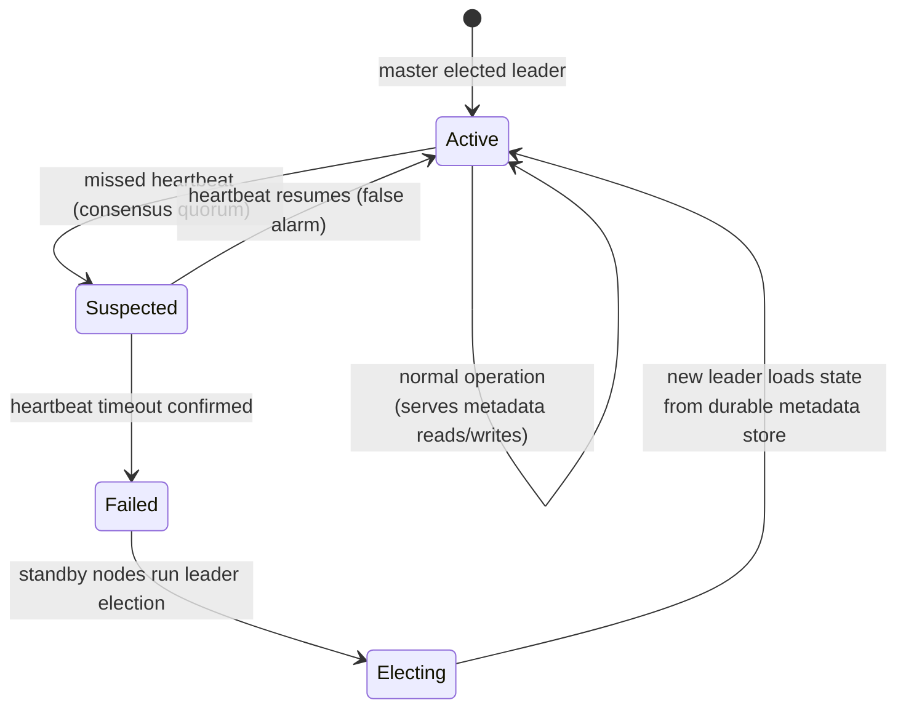

The step that's easy to forget when describing this out loud: the new leader
doesn't rebuild state from data nodes (too slow, too much data) — it rebuilds
from the **durable metadata store**, which is why that store must itself be
replicated and consistent, not just the master's in-memory cache of it.

### How do we scale past the master's QPS ceiling?
**Point to ponder, answered:** horizontal sharding of the master itself (one
master per partition range) plus aggressive client/front-end caching of
metadata so most reads never reach the master at all — the two techniques
compound rather than compete.

### What happens on concurrent writes with the same blob name?
**Point to ponder, answered:** the master node detects the name collision at
write time and assigns the later write a new version number rather than
silently overwriting — consistent with WORM. This is a **last-writer-wins with
versioning**, not a last-writer-wins-with-overwrite; the earlier blob remains
addressable by its version.

### Other failure modes to name proactively
- **Data node failure** — detected via missed heartbeat; master serves reads from replicas and queues a replay log for when the node recovers.
- **Rack/DC/region failure** — covered by the multi-level replica placement (rack → DC → region).
- **Bit rot / silent corruption** — checksum (CRC32C or similar) each chunk at write time; verify on read and during periodic background **scrubbing**; a checksum mismatch triggers a rebuild from a healthy replica.
- **Hot partition** (one viral account/container) — partition-level load balancing plus, if needed, splitting an overloaded partition further.

---

## Real-world references

| System | Notable design choice |
|---|---|
| **Amazon S3** | Buckets/keys flat namespace; moved from eventual to **strong read-after-write consistency in Dec 2020**; storage classes (Standard/IA/Glacier) trade latency for cost; 11-nines durability target |
| **Facebook Haystack** | Solved the "too many small photo files" problem — instead of one filesystem inode per photo (metadata explosion), packs many photos into large physical volume files with an in-memory index, turning "read a photo" into "one seek," not "one filesystem lookup + one seek" |
| **Facebook f4** | Warm-storage follow-up to Haystack — moves *aged*, less-frequently-accessed photos from 3× replication to **erasure coding** (10+4-style), cutting storage overhead roughly in half without sacrificing durability |
| **Facebook Tectonic** | Unifies Haystack, f4, and other siloed blob stores into one exabyte-scale filesystem with a sharded, disaggregated metadata layer — the "stop maintaining N bespoke storage systems" consolidation move |
| **Google Colossus** (GFS's successor) | Replaced GFS's single master with a distributed, sharded metadata layer (via a Curator process) specifically to remove the single-master QPS/SPOF ceiling this chapter's design has |
| **Azure Blob Storage** | Two-layer design: a **stream layer** (append-only replication, analogous to this chapter's data nodes) and a **partition layer** (analogous to the master node) that's itself horizontally partitioned and load-balanced across servers |
| **Dropbox Magic Pocket** | Custom-built exabyte storage after migrating off S3 — erasure coding, custom hardware, built specifically to cut per-GB cost at Dropbox's access pattern/scale |

Dropping any two of these by name, with *why* they made a specific choice
(not just "S3 exists"), is what separates a pass from a strong-hire in this
question.

---

## Common interview curveballs

A rapid-fire reference for the follow-ups interviewers reach for once the base
design is on the board. Read this section last, right before you walk in.

| Curveball | One-line answer |
|---|---|
| "Two users upload the same blob name at the same time — what happens?" | Master detects the collision at write time and versions the later write; nothing is silently overwritten (WORM). |
| "How would you avoid storing 10,000 copies of the same viral image different users upload?" | **Content-addressable dedup**: hash the bytes (e.g., SHA-256); if the hash already exists, add a metadata pointer + increment a reference count instead of storing new bytes. Safe only because objects are immutable — a reference-counted blob can't be corrupted by one owner's "edit." |
| "A single object goes viral — millions of reads/sec." | CDN edge caching absorbs almost all of it (WORM makes this safe with no invalidation); origin only serves the initial cache-fill per edge location. |
| "Can I get transactional writes across multiple blobs?" | No — object storage gives per-object atomicity only. If you need multi-object transactions, that's a database question, not a blob store question; say so. |
| "How do you test that cross-region failover actually works?" | Scheduled game days / chaos testing — intentionally fail a region in a controlled window and verify traffic reroutes and no writes are lost. |
| "How do you support first-class object versioning (not just collision handling)?" | Store a `version_id` as part of the object's addressable path; `getBlob` without a version returns latest, with a version returns that exact historical copy; deletes on a still-versioned object just hide the "latest" pointer. |
| "What if the interviewer removes the WORM assumption?" | Say explicitly: in-place mutation breaks CDN cache coherence (now needs invalidation, not just expiry) and breaks the dedup trick above (a shared blob can't be safely mutated for one owner) — naming *what breaks* is the answer, not just "we'd add locks." |

---

## Golden rules

- **Never mutate a blob in place.** WORM isn't a limitation, it's what makes replication, caching, and CDN delivery cheap — an "edit" is a new version, not a write to old bytes.
- **The master node's job is metadata, never bytes.** The moment bytes flow through it, it becomes the bottleneck the whole architecture was designed to avoid.
- **Delete fast, reclaim later.** A user-facing API must never block on garbage collection, compaction, or cross-node cleanup.
- **Partition by access pattern, not by ID convenience.** A partition key that spreads writes but shatters your most common read (`listBlobs`) is a wrong answer that looks right on a whiteboard.
- **Replicate hot data, erasure-code cold data.** Applying one durability strategy uniformly wastes either latency or money — tier by access temperature.
- **Cache invalidation needs a version, not just a TTL,** whenever the thing behind the cache can move (node rebalancing) even if the *content* never changes.
- **A single master is fine until it isn't — plan its failover and its sharding before the interviewer asks, not after.**

---

## Master Cheat Sheet

**One-liner:** a blob store is a flat, three-layer (account→container→blob) KV
store for immutable large objects, where blobs are split into fixed-size
chunks, chunk placement/metadata lives in a master node backed by a sharded
distributed DB, and durability comes from sync intra-cluster replication +
async cross-region replication, with erasure coding for cost-efficient cold
tiers.

**Formula chain:** servers = DAU/QPS-per-server → storage/day = objects × size
→ bandwidth = storage / seconds-in-day → replicated storage = raw × replication
factor (or × 1.4 for 10+4 EC) → metadata rows = blobs × chunks × replicas.

**Numbers:** 11 nines durability · replication ×3 = 200% overhead vs. EC 10+4 ≈
40% overhead · GFS/HDFS chunk 64–128MB · S3 max object 5TB · HDD seek ~10ms ·
cross-region RTT ~150ms.

**Disambiguations:** block (raw sectors, one VM) vs. file (POSIX tree, shared)
vs. object (flat, immutable, HTTP — this chapter) · durability (will it exist)
vs. availability (can I reach it now) · replication (fast, expensive) vs.
erasure coding (cheap, CPU-heavy rebuild, any-k-of-n reconstruction) · sync
intra-cluster (consistency) vs. async cross-region (availability) ·
partition-by-ID (write-balanced, read-scattered) vs. partition-by-path
(read-local, write-hotspot-risk).

**Golden rules, compressed:** never mutate in place · master handles metadata
only, never bytes · delete fast, GC later · partition for your read pattern ·
replicate hot, erasure-code cold · cache the metadata, not just the bytes, and
version it instead of just TTL-ing it · self-describing tokens (signed URLs)
avoid re-routing every auth check through the master · plan master failover
and sharding up front.

**Name-drop list:** S3 (strong consistency since 2020) · Haystack (small-file
problem) · f4 (erasure coding for warm data) · Tectonic (unified metadata layer)
· Colossus (sharded master vs. GFS's single master) · Azure (stream layer +
partition layer) · Dropbox Magic Pocket (custom EC hardware).
