# Distributed Search — FAANG Interview Guide

*Chapter 21: Design a distributed search system (Google Search / Elasticsearch / YouTube search style)*

---

## 1. Mental Model

Think of search as a **library with a card catalog, run by a thousand librarians in parallel.**

- **Crawler** = scouts who go out and photocopy every book (documents).
- **Indexer** = librarians who read every photocopy and build a card catalog — one card per *word*, listing every book that contains it (inverted index).
- **Searcher** = the front desk clerk who takes your query, looks up cards for each word, intersects/ranks the book lists, and hands you a sorted stack.

The single deepest idea in this chapter: **flip the data from "document → words" (forward index) to "word → documents" (inverted index)**. Everything else — sharding, replication, MapReduce, caching — exists only to build and serve that flipped structure at web scale, because a card catalog for 100+ petabytes of web pages cannot live on one machine or be rebuilt from scratch on every query.

Second deepest idea: **decouple write path (indexing) from read path (searching)**. They have opposite resource profiles (CPU/batch-heavy vs. RAM/latency-heavy) and opposite failure tolerances (indexing can lag; search cannot lag on request latency), so colocating them on the same node is the single most tempting and most wrong shortcut — the course's own "final design" pivot exists specifically to undo it.

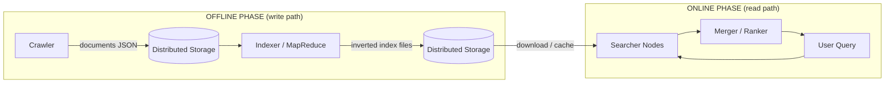

---

## 2. How to Identify This Topic in an Interview

Green-flag phrases the interviewer will actually say:

- "Design a search engine like Google" / "design search for YouTube/Amazon/Twitter"
- "Design Elasticsearch" / "design a full-text search system"
- "How would you search across billions of documents in under 200ms?"
- "Design autocomplete / typeahead" (a close cousin — same index, different query shape)
- "Design a log search system" (Splunk/ELK-style) — same core, different freshness SLA

What the interviewer is actually testing:

1. Do you know **inverted index** is the answer, not grep-through-documents or SQL `LIKE`?
2. Can you reason about **partitioning strategy** (term vs. document) and defend your choice?
3. Do you separate **write-heavy indexing** from **read-heavy, latency-sensitive serving**?
4. Can you estimate index size and QPS with real numbers, not hand-waving?
5. Do you know ranking isn't just "match" — relevance scoring (TF-IDF/BM25), and at FAANG scale, learned ranking?

**Golden rule:** If you find yourself designing a database schema with a `WHERE content LIKE '%term%'` clause, you have failed the interview in the first two minutes.

---

## 3. Interview Playbook

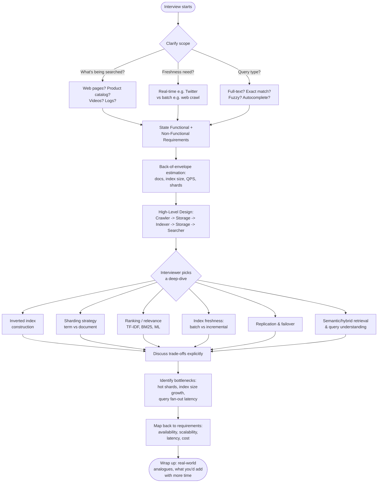

**Time budget for a 45-min interview:**
| Phase | Minutes |
|---|---|
| Requirements + clarifying questions | 5 |
| Capacity estimation | 5–7 |
| High-level design | 10 |
| Deep dive (pick 1–2) | 15 |
| Bottlenecks + trade-offs + wrap-up | 5–8 |

---

## 4. Requirements Clarification

### Functional Requirements

| # | Requirement | Notes |
|---|---|---|
| 1 | **Search**: user submits a text query, gets back relevant, ranked results in near real time | Core requirement |
| 2 | Support **partial/fuzzy match**, typo tolerance | Common follow-up |
| 3 | Support **ranking by relevance** (not just boolean match) | Interviewer usually pushes here |
| 4 | Support **incremental updates** (new documents appear over time) | Freshness matters for logs, tweets, products |
| 5 | (Optional) Autocomplete / query suggestions | Ask if in scope |
| 6 | (Optional) Faceted search / filters (price range, date, category) | Common for e-commerce search |

### Non-Functional Requirements

| Requirement | Why it matters |
|---|---|
| **Availability** | Search is often the primary product surface — an outage is highly visible. Favor availability over strict consistency (AP over CP in CAP terms). |
| **Scalability** | Index must grow to petabytes; QPS must grow to hundreds of thousands. |
| **Low latency** | Users expect results in **<200-300ms** end-to-end; internal shard fan-out budget is usually **<100ms**. |
| **Cost efficiency** | Must run on commodity hardware, not one giant mainframe. |
| **Consistency (relaxed)** | Slight staleness in index is acceptable (eventual consistency) — a newly indexed document need not be searchable within milliseconds. |
| **Durability** | Index and raw documents must survive node/AZ failure. |

**Golden rule:** Search is the textbook case for **eventual consistency + AP** — near-real-time freshness is a "nice to have" tunable, not a correctness requirement, unlike a payments ledger.

---

## 5. Capacity Estimation, Worked

### The formula chain

```
documents  →  tokens/terms  →  inverted index size  →  QPS  →  shard count  →  replicas  →  storage + bandwidth
```

```
Terms per doc               ≈ doc size / avg token size (after stopword removal, stemming)
Index size                  = Storage/doc (raw) + (Terms/doc × Storage/term entry)
Total index size            = Num docs × Index size per doc
QPS                         = Daily Active Users searching concurrently / (or) requests-per-day / 86400
Servers needed              = Peak QPS / QPS a single server can sustain
Shard count (partitions)    = Total index size / Max comfortable shard size (keep shard in RAM, e.g. 20-50 GB)
Total nodes                 = Shard count × Replication factor (typically 3)
Bandwidth                   = QPS × avg request/response payload size
```

### Worked example — YouTube-style video search (matches source, extended)

**Inputs:**
- 3M daily active searchers, single server handles 1,000 req/s
- Each video → one JSON metadata doc, 200 KB (title, description, channel, transcript)
- ~1,000 unique terms extracted per doc after stopword removal
- 100 bytes of index storage per term entry (postings: doc id + freq + positions)
- 6,000 new videos/day
- 150M search requests/day
- Query size 100 bytes in, response ~4,000 bytes out (80 suggestions × 50 bytes)

**Step 1 — Servers for query serving:**
```
3,000,000 users / 1,000 req/s per server = 3,000 servers (for a burst of fully concurrent search)
```

**Step 2 — Storage per video:**
```
Total_storage/video = Storage/doc + (Terms/doc × Storage/term)
                    = 200 KB + (1,000 × 100 B)
                    = 200 KB + 100 KB = 300 KB
```

**Step 3 — Daily index growth:**
```
Total_storage/day = 6,000 videos × 300 KB = 1.8 GB/day
→ ~657 GB/year just for new content (before considering re-indexing/updates)
```

**Step 4 — Bandwidth:**
```
Requests/sec = 150,000,000 / 86,400 ≈ 1,736 req/s
Incoming BW  = 1,736 × 100 B  ≈ 1.39 Mb/s
Outgoing BW  = 1,736 × 4,000 B ≈ 55.6 Mb/s
```

**Step 5 — Shard count (extend the source's estimate — for full catalog, not just daily delta):**

Assume YouTube has ~14 billion videos total (illustrative order of magnitude).
```
Total index size ≈ 14e9 videos × 300 KB ≈ 4.2 PB
Comfortable shard size (fits in RAM/SSD, fast to rebuild) ≈ 30 GB
Shard count = 4.2 PB / 30 GB ≈ 140,000 shards
With replication factor 3 → 420,000 shard-copies distributed over the fleet
```

This is why real engines cap shard size — not because of a hard limit, but because oversized shards blow past a single node's RAM and make recovery/rebalancing painfully slow.

### Worked example — Web-scale search (order-of-magnitude sanity check)

- Google-scale: ~100+ billion indexed pages (course source cites "hundreds of billions of web pages, ~100 PB" as of 2022).
- Average inverted index overhead is commonly cited as **30-40% of raw corpus size** for a well-compressed index (with positions/skip-lists), though naive designs can exceed 100%.
- 100 PB raw corpus × ~0.35 compression-adjusted ratio ≈ **35 PB index** — still far beyond any single machine, confirming the need for horizontal partitioning across tens of thousands of nodes.

**Golden rule of estimation:** Always show the chain (docs → terms → index bytes → shards → replicas), not just a final number. Interviewers grade the method.

### Latency & size numbers to memorize

These are the hardware-level numbers that justify *why* the design caches hot segments in RAM and prefers same-AZ replica reads:

| Operation | Typical latency/size |
|---|---|
| RAM access | ~100 ns |
| SSD random read | ~100-150 μs (≈1,000x slower than RAM) |
| HDD seek | ~10 ms (≈100x slower than SSD) |
| Same-datacenter network RTT | ~0.5-1 ms |
| Cross-region network RTT | ~50-150 ms |
| Typical single-node disk capacity | ~1-4 TB SSD (commodity search node) |
| Typical single-node RAM available for caching | ~32-128 GB |

This is why hot segments live in RAM (a 100ns lookup vs. a 150μs SSD read is a >1000x latency win when multiplied across a fan-out of hundreds of shards), and why a same-AZ replica read (~1ms) beats a cross-region hop (~50-150ms) by two orders of magnitude — cross-region reads alone would blow the entire <200-300ms search budget.

### Interview cheat-sheet — Estimation
- Formula chain: docs → terms/doc → bytes/term → index size → shard count → × replication factor.
- Use round, defensible assumptions (announce them out loud).
- Anchor shard size to "must fit comfortably in RAM" (20-50 GB is a safe number to say).
- Always convert daily/monthly volumes to per-second QPS before sizing servers.
- Separate incoming vs outgoing bandwidth — outgoing is usually 10-40x larger (result payloads > query text).
- State replication factor (3 is the industry default) before computing total node count.

---

## 6. Indexing Deep Dive

### Forward index vs. inverted index

| | Forward Index (document-level) | Inverted Index |
|---|---|---|
| Structure | doc ID → full content/terms | term → list of (doc, freq, positions) |
| Build cost | Trivial (just store the doc) | Requires tokenization, dedup, stopword removal |
| Search cost | O(all docs) — must scan every document | O(matching terms) — direct lookup |
| Good for | Fetching a document by ID, re-ranking after candidate retrieval | Full-text search, boolean/relevance queries |
| Real use | Used *alongside* inverted index to fetch full doc for snippet generation | The actual query-time data structure |

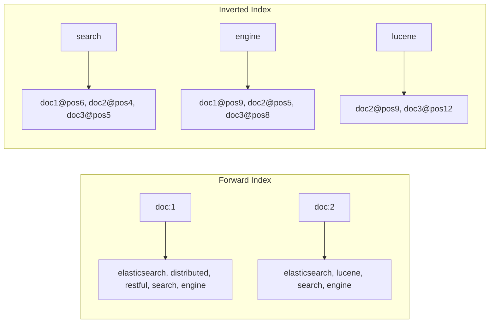

**Mnemonic:** Forward index = *phone book by name* (person → number). Inverted index = *reverse phone lookup* (number → who owns it). Search always needs the reverse lookup.

### Inverted index construction pseudocode

```python
def build_inverted_index(documents):
    index = defaultdict(lambda: {"doc_freq": {}, "positions": defaultdict(list)})
    for doc_id, text in documents.items():
        tokens = tokenize(text)              # split into words
        tokens = remove_stopwords(tokens)     # drop "the", "is", "a"...
        tokens = stem_or_lemmatize(tokens)    # "running" -> "run"
        for pos, term in enumerate(tokens):
            entry = index[term]
            entry["doc_freq"][doc_id] = entry["doc_freq"].get(doc_id, 0) + 1
            entry["positions"][doc_id].append(pos)
    return index
    # Output per term: { doc_ids: [...], freq: [...], positions: [[...], ...] }
```

Each term's postings list stores: **(1) document IDs containing it, (2) term frequency per doc, (3) positions** (needed for phrase queries like `"search engine"` and proximity ranking).

### Document-level index vs. inverted index

| | Document-level index | Inverted index |
|---|---|---|
| Query cost | Scan every doc, count occurrences | Direct hashmap lookup per term |
| Fuzzy search | Must pattern-match across every doc | Still needs auxiliary structures (n-gram/trie) but only over the term dictionary, not documents |
| Scales to billions of docs | No — minutes/hours per query | Yes, with sharding |
| Storage overhead | None extra | +30-100% overhead for postings |

### Index lifecycle (per document)

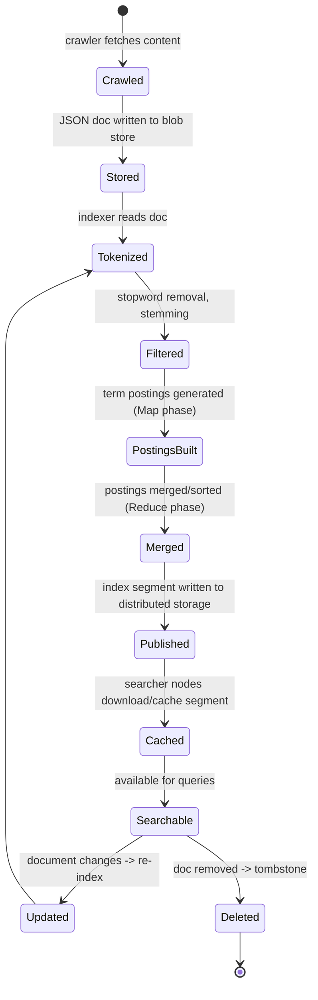

### Batch vs. real-time (incremental) indexing

| | Batch indexing | Real-time / incremental indexing |
|---|---|---|
| Latency to searchable | Minutes to hours | Seconds |
| Throughput | Very high (MapReduce over huge corpora) | Lower per-document overhead cost, higher operational complexity |
| Typical use | Web crawl re-index, nightly catalog refresh | Twitter/X search, live logs (Splunk/ELK), stock news search |
| Mechanism | MapReduce/Spark job over full or delta corpus | Streaming pipeline (Kafka → indexer), segment-based near-real-time (NRT) commits |
| Real system | Google's original MapReduce-based indexing pipeline (now Percolator/Caffeine, near-real time) | Elasticsearch "refresh" (default 1s) creates new searchable Lucene segments without a full commit |

**Mnemonic for index update strategies:** *"Rebuild, Append, or Merge"* — full **rebuild** (batch, expensive, simple), **append** new segments (fast, but fragments the index, needs periodic merge), **merge** compacts fragments back down (background cost to keep query-time cost low). Elasticsearch literally does append-then-background-merge (this is Lucene's segment merge policy).

### Push-based vs. pull-based index updates

| | Push-based | Pull-based |
|---|---|---|
| Who initiates | Indexer pushes new segments to searchers | Searchers poll/pull new segments on a schedule |
| Freshness | Can be near-instant | Bounded by poll interval |
| Coupling | Indexer needs to know searcher topology | Loose coupling — searchers just read from distributed storage |
| Failure mode | Push can be lost if searcher is down during push | Searcher naturally catches up on next pull, self-healing |
| What this course design uses | **Pull** — searchers download index files from distributed storage independently | — |

Pull-based is why the design in this chapter is resilient: a new searcher node just pulls the latest index from blob storage — no coordination needed with the indexer.

### Golden rule (Indexing)
Indexing is a batch/streaming *data processing* problem, not a *database write* problem — treat it like an ETL pipeline (MapReduce/Spark/Flink), not like inserting a row.

### Interview cheat-sheet — Indexing
- Always propose inverted index first; justify by contrasting with the O(N) cost of scanning documents.
- Describe postings list contents precisely: doc ID, term frequency, positions (for phrase queries).
- Know the trade-off: postings overhead (storage) buys you O(1) term lookup (speed).
- Mention stopword removal, stemming/lemmatization as index-size reducers.
- Distinguish batch (MapReduce) vs. incremental/streaming indexing, and pick based on the freshness requirement stated by the interviewer.
- Cite Lucene's segment model (append + background merge) as the real-world instance of this pattern.

---

## 7. High-Level Design

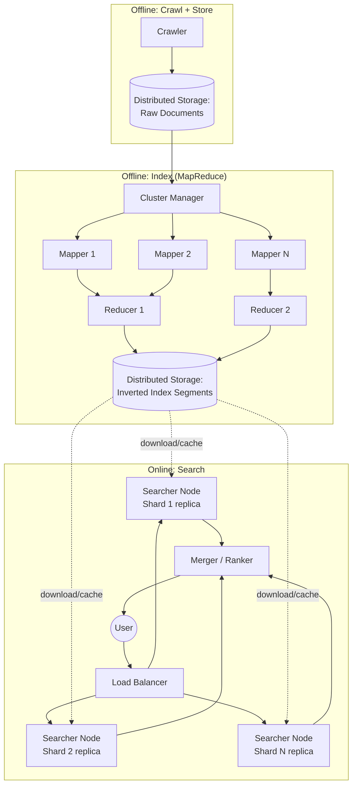

### API design

```
search(query: string, filters?: dict, page_token?: string) -> { results: [doc_id...], next_page_token }
```

Kept intentionally minimal at the client boundary — nearly all complexity is server-side (tokenization, fan-out, ranking).

### Sequence: a single search request

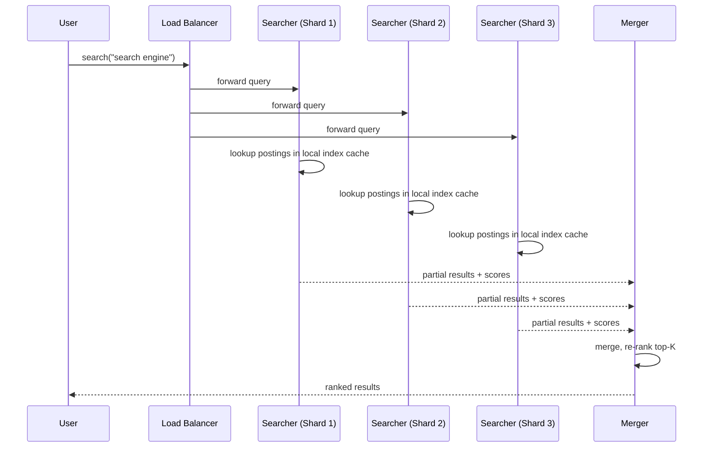

### Interview cheat-sheet — High-Level Design
- Draw two clearly separated phases: offline (crawl → store → index → store) and online (query → fan-out → merge → rank → return).
- State that the API surface is thin; all complexity is server-side.
- Show the merger/scatter-gather explicitly — it's the piece people forget and it's where p99 latency comes from (tail latency = slowest shard).
- Mention that distributed storage (blob store) is the shared substrate for both raw docs and index segments — reuse of a building block, not a new system.

---

## 8. Sharding / Partitioning Deep Dive

### Document partitioning vs. term partitioning

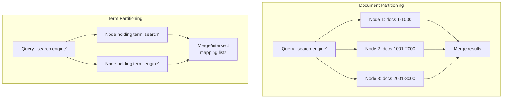

| | Document Partitioning | Term Partitioning |
|---|---|---|
| How split | Documents divided into subsets; each node indexes its subset fully | Term dictionary divided; each node owns a slice of terms across *all* docs |
| Query fan-out | Every query hits **every** node (broadcast) | Query hits only nodes owning the query's terms |
| Concurrency benefit | Lower — always full fan-out | Higher in theory — different query terms hit different nodes in parallel |
| Multi-word query cost | Cheap — each node already has all terms for its docs; merge is simple union | Expensive — must ship large postings lists between nodes to intersect on shared terms |
| Inter-node communication | Low | High (the practical killer) |
| Rebalancing on node add/remove | Straightforward (rehash doc→node) | Harder (term distributions are skewed — Zipfian) |
| Real-world usage | **Dominant in practice** — Elasticsearch, Solr, Google | Rare in production; mostly academic/niche |
| Used in this course's design | **Yes** | No (discussed, then rejected) |

**Mnemonic:** *"Partition by document, not by dictionary."* Document partitioning keeps each node self-sufficient (has everything for its docs); term partitioning forces nodes to constantly talk to each other for multi-word queries — and almost all real queries are multi-word.

### Consistent hashing & rebalancing

Plain `hash(doc_id) % N` looks simple but breaks the moment `N` changes: adding or removing one node changes the modulus for *every* key, so nearly 100% of docs remap to a different node — meaning a near-total, unnecessary reshuffle of the index just to add one box.

**Consistent hashing** fixes this: nodes and keys are placed on a hash ring; each key belongs to the first node clockwise from it. Adding/removing a node only affects the keys between it and its predecessor — roughly **1/N of keys move**, not 100%.

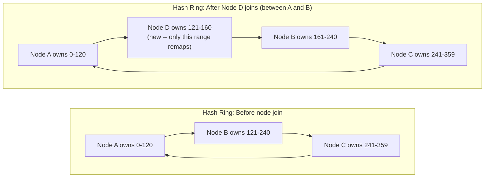

Only the slice between Node A and the new Node D remaps (keys 121-160 move from B to D); Node B keeps most of its range, and Nodes A and C are untouched.

**Mnemonic:** *"Ring, not modulus"* — a hash ring reshuffles a slice; a modulus reshuffles everything.

### Golden rule (Sharding)
Choose the partitioning scheme that minimizes cross-node chatter for your dominant query shape. Since real queries are multi-term, document partitioning wins almost every time — know this cold, and be ready to explain *why* term partitioning loses (large postings-list shuffling for intersection).

### Interview cheat-sheet — Sharding
- Name both partitioning strategies unprompted — shows breadth.
- Justify document partitioning with the multi-word-query argument, not just "it's simpler."
- Mention hashing (consistent hashing ideally) to assign docs to partitions and support rebalancing.
- Justify *why* consistent hashing specifically: plain `hash(doc_id) % N` remaps ~100% of keys on any node add/remove; a hash ring only remaps ~1/N of keys.
- Note that term distribution is Zipfian (few terms are extremely hot — "the", "a" — most are rare) which makes term partitioning's "load balancing" promise hollow in practice.
- Real systems: Elasticsearch shards = document partitions (configurable shard count per index); Google's original design (1998 Anatomy of a search engine paper) also shards by document range.

---

## 9. Replication & Fault Tolerance

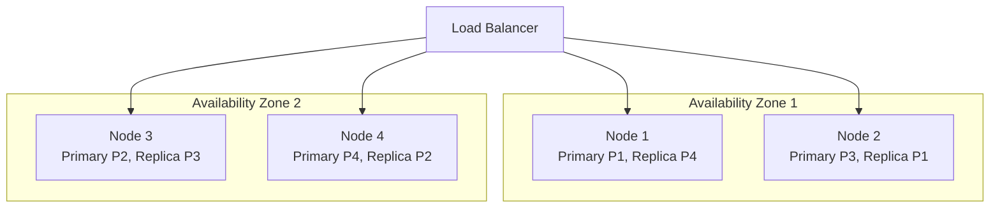

- **Replication factor (RF) = 3** is the industry default (same number you'll see in HDFS, Cassandra, Kafka). One primary + two replicas.
- Replicas are spread across **availability zones** so a single AZ failure doesn't take out every copy of a partition.
- **Indexing with replicas:** in the *first* design iteration in this chapter, all 3 replicas independently recompute the index from the same partition (wasteful — 3x CPU for no benefit, since they converge on the same output deterministically).
- **The fix (final design):** compute the index **once** on a primary/indexer node, then **replicate the resulting binary index file**, not the computation. This is a classic "compute once, ship bytes" optimization — the same principle behind build artifact caching in CI/CD.

### Naive vs. optimized replica indexing

**Naive — every replica recomputes independently (3x wasted CPU):**

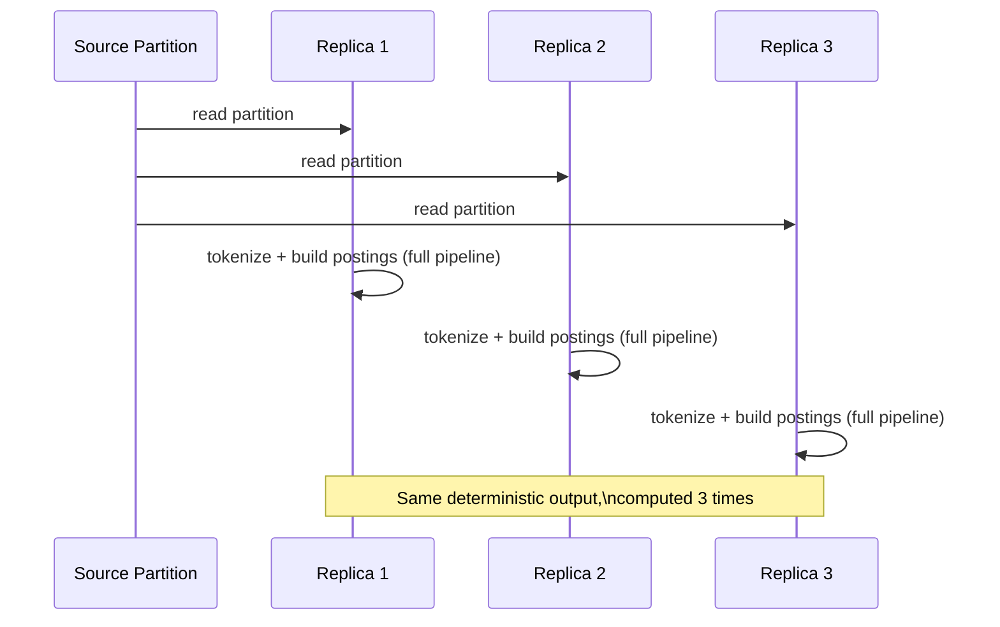

**Optimized — compute once, ship bytes:**

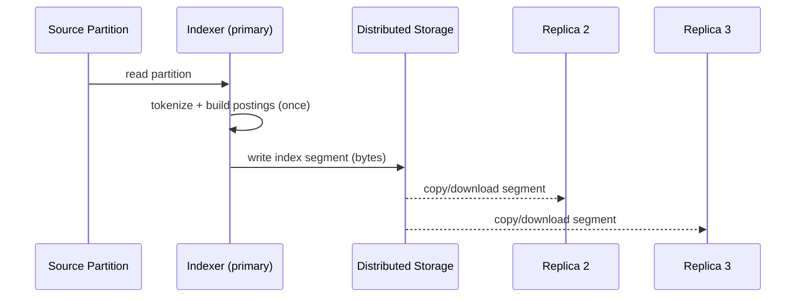

### Sequence: failover when a searcher node dies

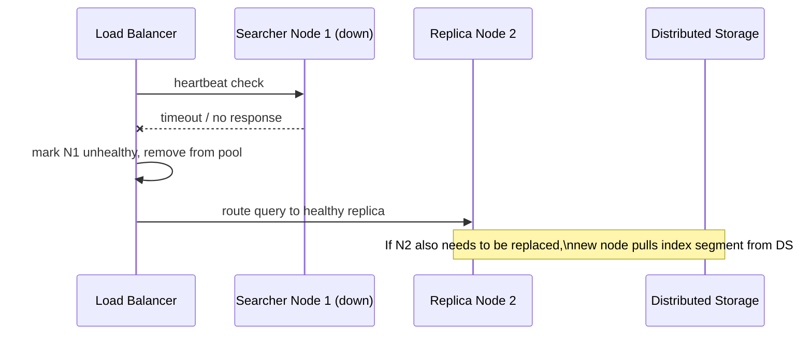

### Golden rule (Replication)
Replicate the *computed artifact*, never the *computation*, when the computation is deterministic and expensive. This single decision is what separates the "initial design" from the "final/scalable design" in this chapter.

### Interview cheat-sheet — Replication
- State RF=3 as your default and justify it (tolerates 1 node failure with 2 copies still available, or even 2 failures with graceful degradation).
- Spread replicas across AZs, not just across nodes in the same rack/AZ.
- Call out explicitly: compute-once-replicate-the-file beats recompute-on-every-replica.
- Mention heartbeat-based health checking + load balancer-driven failover.
- Note indexing replication can be **asynchronous** (search availability doesn't need to wait for full replica convergence) — ties directly to the eventual consistency NFR.

---

## 10. Scaling: Separating Indexing from Search

This is the single most important design pivot in the chapter — treat it as the "big reveal" in an interview.

### Problems with colocation (initial design)

1. **Resource contention** — indexing (CPU/IO heavy batch work) and searching (RAM/latency-sensitive) compete for the same node's resources; a big re-index job can spike search latency.
2. **Independent scaling is impossible** — a spike in search QPS shouldn't force you to spin up more indexing capacity, and vice versa, but colocation ties them together.
3. **Redundant computation** — as covered above, every replica recomputes the same index from scratch.

### The fix

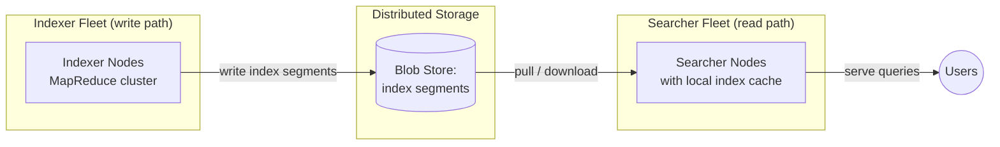

- Indexers and searchers are now **independent fleets** that scale on their own metrics (indexing throughput vs. query QPS).
- They communicate **only through distributed storage** — no direct coupling, no RPC between the two fleets.
- Searchers **cache** downloaded index blobs locally (SSD/RAM) for latency; distributed storage is the durable source of truth.
- New documents flow continuously: indexers index them as available; searchers periodically pull fresh segments — this is the **pull-based, near-real-time refresh** model.

### MapReduce indexing internals

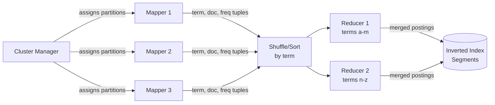

- **Map phase:** each Mapper reads a document partition, tokenizes, and emits `(term, doc_id, freq, position)` tuples.
- **Shuffle/sort:** tuples are grouped by term (this is the expensive network-shuffle step in any MapReduce job).
- **Reduce phase:** each Reducer receives all tuples for its assigned term range and merges them into the final postings list.
- **Fault tolerance:** cluster manager reschedules failed Map/Reduce tasks on other nodes — this is MapReduce's built-in resilience, not something you build yourself.
- A node **can serve as both Mapper and Reducer** across phases (they don't run concurrently for the same job), so hardware is reused, not doubled.

### Golden rule (Scaling)
When two subsystems have opposite resource profiles (batch-CPU vs. latency-RAM) and opposite failure-tolerance requirements (can-lag vs. cannot-lag), **decouple them via a durable intermediate store**, don't try to schedule around the contention on the same box.

### Interview cheat-sheet — Scaling
- Lead with the *problem* (colocation causes contention + redundant compute) before presenting the fix — shows you understand why, not just what.
- Present distributed storage as the decoupling point between indexer and searcher fleets.
- Explain MapReduce Map → Shuffle → Reduce for index construction, and that shuffle-by-term is the costly step.
- Mention local caching on searcher nodes (index in RAM/SSD) as the latency lever.
- Know that indexing and search now scale on independent axes — say the words "independent scaling" explicitly, it's a top signal phrase.

---

## 11. Ranking & Relevance (Beyond the Source Material)

The course's design merges results "by frequency," which is a real but naive starting point. A FAANG interview will expect you to go further.

### TF-IDF vs. BM25

| | TF-IDF | BM25 |
|---|---|---|
| Formula core | `tf(t,d) × idf(t)` where `idf = log(N / df(t))` | `IDF(t) × [tf(t,d)×(k1+1)] / [tf(t,d) + k1×(1-b+b×|d|/avgdl)]` |
| Term frequency saturation | None — score grows linearly (unboundedly) with tf | Saturates — 10th occurrence of a word adds much less score than the 2nd |
| Document length normalization | Weak/manual | Built-in (`b` parameter normalizes for doc length) |
| Tunable | Not really | `k1` (saturation speed), `b` (length normalization strength) |
| Who uses it today | Legacy / textbook baseline | **Elasticsearch/Lucene default since v5+**, Solr default |

```
BM25 pseudocode sketch:
score(D, Q) = Σ_{t in Q} IDF(t) * ( f(t,D) * (k1+1) ) / ( f(t,D) + k1 * (1 - b + b * |D|/avgdl) )

where:
  f(t,D)  = frequency of term t in document D
  |D|     = length of document D (in words)
  avgdl   = average document length across the corpus
  k1      ≈ 1.2 (controls tf saturation)
  b       ≈ 0.75 (controls length normalization)
```

**Mnemonic:** TF-IDF asks "how rare and how often" with no ceiling. BM25 asks the same question but says "diminishing returns after a point, and I'll adjust for document length." BM25 is TF-IDF with common sense added.

### Precision vs. Recall

| | Precision | Recall |
|---|---|---|
| Question answered | Of the results I returned, how many are relevant? | Of all relevant documents that exist, how many did I return? |
| Formula | `TP / (TP + FP)` | `TP / (TP + FN)` |
| Search analogy | "Are my top 10 results actually good?" | "Did I miss a great result buried on page 50?" |
| Typical priority for web/product search | **High priority** — users rarely go past page 1 | Lower priority beyond a reasonable cutoff |
| Typical priority for legal/medical search | Lower priority | **High priority** — missing a document can be costly |

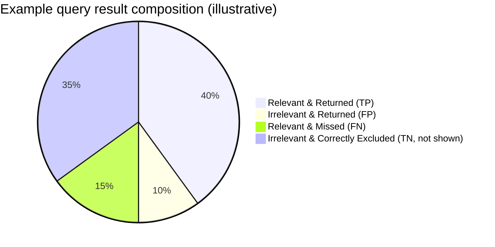

### Ranking signal categories (memory hook)

**Mnemonic: "TFR-PQA"** — **T**ext relevance (BM25/TF-IDF), **F**reshness (recency boost), **R**eputation (PageRank/authority/CTR history), **P**ersonalization (user history/location), **Q**uality signals (spam score, load time), **A**vailability/business signals (in stock, ad bid, margin — e.g. Amazon product search).

### Real-world ranking pipeline (two-stage retrieval)

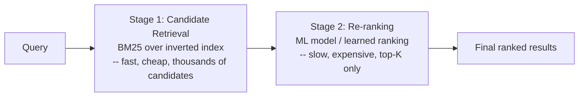

This two-stage pattern (cheap broad retrieval → expensive narrow re-ranking) is universal at FAANG scale: Google (BM25-like retrieval → RankBrain/BERT re-ranking), Amazon product search (inverted index retrieval → learned re-ranking on conversion signals), YouTube search/recommendations (candidate generation → deep ranking model). **Say this pattern out loud in the interview** — it's a strong signal you've seen production search, not just the course material.

### Semantic / Vector Search & Hybrid Retrieval

**Why pure lexical (BM25) retrieval fails:** query `"affordable laptop"` will not match a document that only says `"budget notebook"` — zero shared terms, even though the meaning is identical. Inverted-index retrieval is fundamentally a **term-matching** operation; it has no notion of meaning.

**Embeddings:** a bi-encoder (sentence-transformer-style model) encodes both documents and queries into dense vectors such that semantically similar text lands close together in vector space (measured by cosine or dot-product similarity). This is computed once per document at index time, and once per query at query time.

**Approximate Nearest Neighbor (ANN) search:** exact k-NN over billions of vectors (brute-force distance to every vector) is too slow for query-time latency budgets, so production systems use ANN indexes that trade a small amount of recall for a massive speedup:

| | HNSW (graph-based) | IVF / IVF-PQ (inverted-file + quantization) |
|---|---|---|
| Structure | Multi-layer proximity graph over vectors | Vectors clustered into buckets (coarse quantizer); PQ compresses vectors within a bucket |
| Recall | High | Slightly lower (quantization loses precision) |
| Memory | Higher (graph edges + full vectors) | Lower (compressed/quantized vectors) |
| Query speed | Very fast | Fast, tunable by `nprobe` (buckets searched) |
| Good for | Recall-sensitive workloads with RAM to spare | Massive corpora where memory is the binding constraint |
| Real use | FAISS `IndexHNSWFlat`, most vector DB defaults | FAISS `IndexIVFPQ`, large-scale product search |

**Hybrid retrieval:** run BM25 lexical retrieval and vector/ANN retrieval **in parallel**, then fuse the two ranked result sets. The standard fusion technique is **Reciprocal Rank Fusion (RRF)** — no score normalization needed, just ranks:

```
RRF_score(doc) = Σ_{retriever r} 1 / (k + rank_r(doc))     where k ≈ 60
```

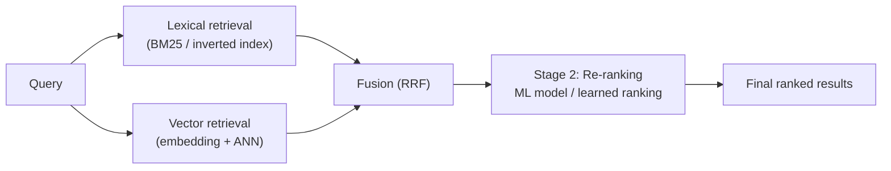

This extends the two-stage pipeline above: fusion simply becomes the new "Stage 1 output" feeding the same re-ranker.

**Decision tree — lexical vs. vector vs. hybrid:**

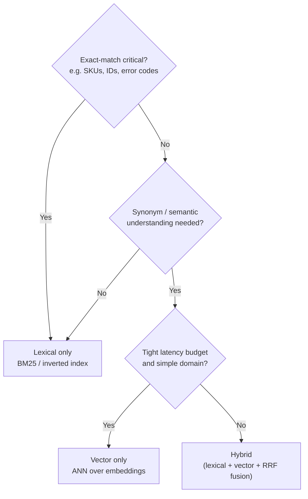

**Mnemonic:** *"Lexical finds the same words; vector finds the same meaning; hybrid finds both and lets fusion pick the best of each."*

Real systems: Google augments classic indexing with dual-encoder/BERT-based dense retrieval; Amazon and Google product search use semantic matching to bridge vocabulary gaps between query and listing; vector databases — FAISS (Meta, who invented it), Pinecone, pgvector — serve the ANN layer; Elasticsearch has shipped native `dense_vector`/kNN search since v8, making hybrid retrieval a first-class feature rather than a bolt-on.

### Golden rule (Ranking)
Retrieval finds candidates cheaply; ranking orders them expensively. Never run your expensive ranker over the full corpus — only over the retrieval stage's small candidate set.

### Interview cheat-sheet — Ranking
- Never say "just sort by term frequency" as your final answer — mention TF-IDF, then upgrade to BM25 as the practical default.
- Know precision vs. recall and which one dominates for the domain in the prompt (web search = precision-heavy, legal/medical/enterprise search = recall-heavy).
- Describe the two-stage retrieval → re-ranking pipeline used by every major production search system.
- Mention personalization/freshness/business signals as a layer on top of pure text relevance.
- If asked about learning-to-rank, name it (gradient-boosted trees or neural re-rankers over hand-engineered + embedding features) without needing to derive it.
- If asked about synonyms/semantic gap (query and doc use different words for the same thing), pivot to embeddings + ANN (HNSW or IVF-PQ) — don't try to solve it with more BM25 tuning.
- Default to **hybrid retrieval** (lexical + vector, fused with RRF) as your production answer — pure vector-only is rare because it sacrifices exact-match precision (SKUs, IDs).
- Name FAISS/HNSW/IVF-PQ and RRF by name — these are the concrete, checkable signals that you know modern retrieval, not just classic IR.

---

## 12. Query Understanding: Autocomplete, Fuzzy Search & Caching

### Autocomplete / typeahead

Autocomplete is **not** a live search per keystroke — it's a lookup into a **prefix trie** where every node/prefix has a **precomputed top-K most-popular completions**, computed offline from query logs and refreshed periodically (not live).

```mermaid
flowchart TD
    Root(("root")) --> S["s"]
    S --> SE["se"]
    SE --> SEA["sea"]
    SEA --> R1["+r -> \"search\"\n(top-K precomputed)"]
    SEA --> T1["+t -> \"seattle\"\n(top-K precomputed)"]
    SEA --> L1["+l -> \"seal\"\n(top-K precomputed)"]
```

Real instance: Elasticsearch's **completion suggester** stores exactly this — a finite-state-transducer-backed structure with precomputed weighted suggestions per prefix, served as an in-memory lookup.

**Mnemonic:** *"Precompute the top-K at every prefix so autocomplete is a hashmap lookup, not a live search."*

### Fuzzy search / typo tolerance

Two real mechanisms, usually combined:

| | Edit-distance (Levenshtein) automaton | N-gram (trigram) indexing |
|---|---|---|
| Mechanism | Automaton over the term dictionary bounded to edit distance 1-2 | Index overlapping trigrams per term; query trigrams match postings sharing enough overlap |
| Cost | Cheap per query at bounded distance; scales with dictionary size, not corpus size | Extra index structure (larger dictionary), but lookup is a normal postings lookup |
| Precision | Exact — guarantees matches within N edits | Approximate — trigram overlap is a candidate filter, often re-verified by real edit distance |
| Use case | Single-term typo correction ("helo" -> "hello") | Fast candidate generation at scale, good with partial/substring matches |
| Real implementation | Lucene's `FuzzyQuery` (Levenshtein automaton) | PostgreSQL `pg_trgm`, Elasticsearch n-gram tokenizer |

Both work over the **term dictionary**, not the documents — the same reason fuzzy search stays fast even at billions of docs (Section 6's forward-vs-inverted distinction: fuzzy matching is a dictionary-scale problem, not a corpus-scale one).

### Query-result caching

A thin cache (Redis / local LRU) sits in front of the searcher/merger layer, keyed on **normalized query + filters** — this is separate from index-segment caching (Sections 6/10), which caches the *index data*, not *query results*.

- **Why it works:** query distributions are Zipfian — a small set of distinct queries account for a large share of total traffic. Top 1% of distinct queries commonly account for **20-30%+ of total query volume** in typical search-log observations, so even a modest cache absorbs a large fraction of load.
- **Invalidation:** exact invalidation (bust only the cache entries affected by a newly published segment) is hard and expensive to track precisely. Most systems accept a **short TTL** (e.g., 60s) and brief staleness instead — search is already eventually consistent (Section 4), so this is a natural extension, not a new compromise.

### Golden rule (Query Understanding)
Query-time smarts — autocomplete, fuzzy matching, caching — all trade a little staleness or precomputation for a lot of latency savings. None of them make the result *more correct*; all of them make it *fast enough to feel instant*.

### Interview cheat-sheet — Query Understanding
- Autocomplete is precomputed top-K per prefix (offline, from query logs), never a live per-keystroke search — say this explicitly, it's the #1 misconception.
- Name Elasticsearch's completion suggester as the concrete real-world instance.
- Fuzzy search has two real mechanisms: Levenshtein automaton (exact, bounded distance) and n-gram/trigram indexing (approximate, fast candidate generation) — both operate over the term dictionary, not the documents.
- Cache query results separately from index segments — same latency goal, different cache key and different data.
- Justify caching with the Zipfian argument (small % of distinct queries = large % of traffic), not just "caching is good."
- Accept a short TTL for cache staleness rather than exact invalidation — precise invalidation on every index update is not worth the engineering cost given search is already eventually consistent.

---

## 13. Bottlenecks, Failure Modes & Mitigations

| Bottleneck / Failure | Cause | Mitigation |
|---|---|---|
| **Hot shard** | Popular query terms concentrated on few partitions (Zipfian term distribution) | Document partitioning (spreads any term across many shards); add more replicas for hot shards specifically |
| **Tail latency from scatter-gather** | Query fans out to all shards; overall latency = slowest shard (p99 of p99s) | Set per-shard timeouts, return partial results, use "hedged requests" (send duplicate request to backup replica if primary is slow) |
| **Index too large for RAM** | Corpus growth outpaces shard sizing | Cap shard size (e.g., 20-50 GB), split ("re-shard") as corpus grows, use SSD-backed segments with RAM caching for hot segments only |
| **Stale index / freshness lag** | Batch MapReduce runs periodically; new docs invisible until next run | Move to incremental/streaming indexing (append new segments continuously, background-merge), tunable refresh interval |
| **SPOF in centralized design** | Single node running crawler+indexer+searcher | Distribute + replicate across nodes and AZs (the whole point of this chapter) |
| **Index recomputation waste** | Every replica independently re-runs indexing | Compute once, replicate the resulting binary artifact |
| **Cluster manager failure** (MapReduce) | Single coordinator for Map/Reduce task assignment | Standby/leader-election for cluster manager (like YARN ResourceManager HA, or Google's Borg/Omega master) |
| **Cache stampede on searcher restart** | New searcher node with cold cache pulls entire index from storage under load | Pre-warm from a healthy replica's cache, gradual traffic ramp-up (canary the new node) |
| **Query injection / abuse / SEO gaming** | Adversarial content trying to rank artificially high | Spam/quality scoring signals, rate limiting, anomaly detection on crawler side |
| **Network partition between indexer and searcher fleets** | They only communicate via distributed storage | Design is naturally resilient — searchers keep serving last-known-good index; no synchronous dependency |

### Golden rule (Failure modes)
In a scatter-gather system, your p99 latency is dominated by your slowest shard replica, not your average shard. Design for the tail (timeouts + partial results + hedged requests), not the average.

### Interview cheat-sheet — Bottlenecks
- Always mention scatter-gather tail latency as *the* latency bottleneck in sharded search — few candidates bring this up unprompted.
- Propose partial results + timeout as the pragmatic mitigation (better a slightly incomplete answer in 100ms than a complete one in 2s).
- Distinguish "the design is resilient to X" (network partition between fleets) from "the design needs added resilience for Y" (cluster manager SPOF) — shows nuanced judgment, not blanket confidence.
- Call re-sharding/rebalancing a known operational cost, don't pretend it's free.

---

## 14. Key Design Decisions & Trade-offs Summary

| Decision | Chosen approach | Alternative | Trade-off accepted |
|---|---|---|---|
| Index structure | Inverted index | Forward/document-level index | +Storage overhead / −Query latency (huge win) |
| Partitioning | Document partitioning | Term partitioning | +Full fan-out per query / −Avoids expensive cross-node postings shuffling for multi-word queries |
| Indexing model | MapReduce (batch/parallel) | Single-node sequential indexing | +Operational complexity / −Can't index web-scale corpora at all otherwise |
| Replica indexing | Compute once, replicate artifact | Recompute on each replica | +Single point of index generation (needs its own reliability) / −3x CPU/memory savings |
| Indexing/search coupling | Fully decoupled fleets via distributed storage | Colocated on same nodes | +More infra pieces to operate / −Independent scaling, no resource contention |
| Consistency model | Eventual (searchers pull index periodically) | Strong (synchronous index push before ack) | +Search results may lag reality briefly / −Search availability never blocked by indexing |
| Ranking | Two-stage (cheap retrieval + expensive re-rank) | Single-stage exhaustive ranking | +Pipeline complexity / −Can afford expensive ML ranking without scanning full corpus |
| Update strategy | Append new segments + background merge | Rebuild full index on every change | +Read-time overhead of merging segments / −No downtime, no full-corpus reprocessing per update |
| Retrieval semantics | Hybrid (lexical BM25 + vector/ANN, fused via RRF) | Lexical-only (BM25) | +Extra index (embeddings + ANN) and fusion step to run / −Catches semantic/synonym matches lexical-only misses (e.g. "affordable laptop" ~ "budget notebook") |
| Autocomplete computation | Precomputed top-K per prefix (offline, refreshed periodically) | Live query per keystroke | +Staleness until next refresh, extra offline job / −Sub-millisecond hashmap-style lookup instead of a live search per keystroke |

---

## 15. Real-World References

| System | How it maps to this chapter |
|---|---|
| **Google Search** | Classic "Anatomy of a Large-Scale Hypertextual Web Search Engine" (Brin & Page, 1998) paper describes crawler → repository → indexer → inverted index → PageRank-augmented ranking, is the direct ancestor of this design. Modern Google uses Caffeine (near-real-time indexing, replacing the old batch MapReduce pipeline) and multiple ranking layers (BM25-like text relevance + hundreds of ML signals, RankBrain/BERT-based re-ranking). |
| **Elasticsearch / Apache Lucene** | Lucene is the inverted-index library at the core; "index" in Elasticsearch = collection of **shards**, each shard = a Lucene index made of immutable **segments**. New docs create new segments (near-real-time refresh, default 1s); background **merge policy** compacts small segments — directly mirrors the "append then merge" update strategy discussed above. Default relevance scoring since v5 is **BM25**. Sharding = document partitioning, replication factor is configurable per index (default 1 replica → 2 copies total, tunable to match the RF=3 convention). |
| **Apache Solr** | Same Lucene core as Elasticsearch; uses **SolrCloud** with ZooKeeper for cluster coordination/leader election (a concrete instance of the "cluster manager" role described in this chapter's MapReduce indexing). |
| **Bing** | Similar crawler → index → rank pipeline; publicly known for heavy investment in learned ranking models (LambdaMART, gradient-boosted trees) layered on top of inverted-index retrieval — a real instance of the two-stage retrieval/re-ranking pattern. |
| **Algolia** | Optimizes specifically for **typo-tolerant, low-latency (sub-50ms) search-as-you-type**; pre-computes ranking heavily at index time to keep query-time work minimal — an extreme point on the "shift work from query-time to index-time" spectrum. |
| **Amazon product search** | Inverted index over product catalog + heavy business-signal ranking layer (in-stock status, price competitiveness, ad bids, historical conversion rate) on top of text relevance — a real instance of the "business signals" ranking category. |
| **Splunk / ELK stack (log search)** | Same inverted-index core, but optimized for **write-heavy, time-bucketed, append-only** data (logs) rather than a relatively static web corpus — shards are often time-based (one shard per hour/day) rather than hash-based. |
| **Twitter/X search** | Needs near-real-time indexing (tweets searchable within seconds) — a real-world case forcing the batch MapReduce model toward the streaming/incremental indexing model discussed in section 6. |
| **Vector search / FAISS / Pinecone / pgvector / Elasticsearch kNN** | FAISS (built by Meta, who invented it) is the reference ANN library (HNSW, IVF-PQ indexes); Pinecone and pgvector are managed/embedded vector-DB options; Elasticsearch has shipped native `dense_vector` fields and kNN search since v8 — the real-world instances of the hybrid retrieval pipeline discussed in Section 11. |
| **Autocomplete: Elasticsearch completion suggester / Google Suggest** | Elasticsearch's completion suggester precomputes weighted, prefix-indexed suggestions (FST-backed) for instant lookup; Google Suggest similarly serves precomputed popular completions per prefix, refreshed from query logs rather than computed live per keystroke — the real-world instance of the autocomplete pattern in Section 12. |

### Interview cheat-sheet — Real-world references
- Naming Lucene's segment-and-merge model when discussing index updates is the single highest-leverage "I know production search" signal you can give.
- If the prompt is time-sensitive data (logs, tweets), pivot immediately to streaming/incremental indexing and time-based sharding — don't force the batch MapReduce model onto a freshness-critical prompt.
- Mention BM25 as literally the default in Elasticsearch/Solr today — grounds your ranking answer in reality, not textbook TF-IDF.
- If asked about typo tolerance/fuzzy search, mention n-gram indexes or edit-distance-based term expansion (e.g., Levenshtein automaton, as used in Lucene's `FuzzyQuery`).

---

## 16. Disambiguation Quick Reference

### Push-based vs. pull-based indexing (recap diagram)

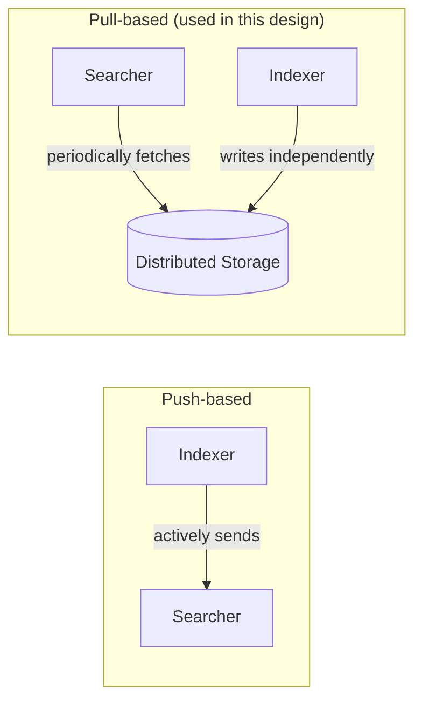

### Sharding by term vs. by document (recap)
See Section 8 table — document partitioning wins for multi-word queries; term partitioning wins (in theory) for single-term query concurrency but loses on cross-node merge cost in practice.

### Batch vs. real-time indexing (recap)
See Section 6 table — batch = MapReduce over full/delta corpus, periodic; real-time = streaming append with background merge, continuous.

---

## 17. Master Cheat Sheet

**Mental model:** Search = card catalog (inverted index) + parallel librarians (sharded indexer/searcher fleets).

**Core formula chain:**
```
docs → terms/doc → index bytes/doc → total index size → shard count (size/30-50GB) → × RF(3) nodes → bandwidth (QPS × payload)
```

**Numbers worth memorizing:**

| Metric | Typical value |
|---|---|
| Replication factor | 3 |
| Comfortable shard size | 20-50 GB (must fit in node RAM/cache) |
| End-to-end search latency budget | <200-300ms |
| Elasticsearch default refresh interval (NRT) | 1 second |
| Inverted index storage overhead vs raw corpus | ~30-100% depending on positions/compression |
| BM25 default params | k1 ≈ 1.2, b ≈ 0.75 |
| Query bandwidth ratio (out:in) | Typically 10-40x (results >> query text) |
| Requests/day → req/sec | divide by 86,400 |
| RAM access | ~100 ns |
| SSD random read | ~100-150 μs |
| HDD seek | ~10 ms |
| Same-datacenter network RTT | ~0.5-1 ms |
| Cross-region network RTT | ~50-150 ms |
| Typical single-node RAM for caching | ~32-128 GB |
| Typical single-node disk capacity | ~1-4 TB SSD |

**Key formulas:**
```
Storage/doc(total) = Storage/rawdoc + (Terms/doc × Storage/term)
Servers needed      = Peak concurrent queries / QPS per server
Shard count          = Total index size / Max shard size
Total nodes           = Shard count × Replication factor
Bandwidth             = Requests/sec × Payload size
```

**Mnemonics:**
- Forward index = phone book (name→number); Inverted index = reverse lookup (number→name). Search always needs the reverse.
- "Partition by document, not by dictionary" — document partitioning wins because real queries are multi-word.
- Ranking signals = **TFR-PQA**: Text relevance, Freshness, Reputation, Personalization, Quality, Availability/business.
- Index update = "Rebuild, Append, Merge" — batch rebuild vs. streaming append-then-background-merge (Lucene's actual model).
- BM25 = "TF-IDF with common sense" — adds saturation + length normalization.
- "Ring, not modulus" — consistent hashing remaps ~1/N of keys on a node change; plain `hash % N` remaps ~100%.
- "Lexical finds the same words; vector finds the same meaning; hybrid finds both and lets fusion pick the best of each."
- Autocomplete = "precompute the top-K at every prefix" — a hashmap lookup, not a live search per keystroke.

**Golden rules, one per section:**
1. Search is the textbook AP (eventual consistency) system — don't over-engineer strong consistency.
2. Indexing is an ETL/batch-data problem, not a database-write problem.
3. Choose the partitioning scheme that minimizes cross-node chatter for your dominant (multi-word) query shape.
4. Replicate the computed artifact, never the computation, when computation is deterministic and expensive.
5. Decouple subsystems with opposite resource profiles via a durable intermediate store (distributed storage), not clever scheduling on shared nodes.
6. Retrieval finds candidates cheaply; ranking orders them expensively — never run the expensive ranker over the full corpus.
7. Query-time smarts — autocomplete, fuzzy matching, caching — trade a little staleness/precomputation for a lot of latency savings.
8. Design for tail latency (slowest shard), not average latency, in any scatter-gather system.

**One-liner answers for common interviewer probes:**
- "Why not just grep/LIKE query the documents?" → O(N) per query; doesn't scale past thousands of docs. Inverted index makes term lookup O(1)-ish.
- "Why document partitioning over term partitioning?" → Multi-word queries would require shipping huge postings lists between term-owning nodes to intersect; document partitioning keeps each node self-sufficient per query.
- "Why decouple indexing from search?" → Opposite resource profiles (batch CPU vs. latency-sensitive RAM) and opposite lag tolerance (indexing can lag; search can't).
- "How do you keep search fast as the index grows?" → Cap shard size, add shards + replicas, cache hot segments in RAM, two-stage retrieval + re-ranking so the expensive model only ever sees a small candidate set.
- "How do you keep it available?" → Replicate across AZs (RF=3), asynchronous index propagation, load-balancer-driven failover, pull-based updates so a new node self-heals from durable storage.
- "How would you support semantic/synonym search?" → Add a vector/embedding retrieval path (ANN over HNSW or IVF-PQ) alongside BM25, fuse both ranked lists with Reciprocal Rank Fusion, then feed the fused set into the existing re-ranking stage.
- "How do you build autocomplete / handle typos?" → Autocomplete: precomputed top-K completions per prefix in a trie (offline, from query logs), not live search. Typos: Levenshtein automaton (bounded edit distance) or n-gram/trigram indexing over the term dictionary, e.g. Lucene's `FuzzyQuery`.
