# Elasticsearch — Practitioner Deep-Dive Guide

*Chapter 21 companion: the actual Elasticsearch framework — internals, API surface, and production operation across regions*

> This is the hands-on companion to the Distributed Search FAANG guide. That guide derives *why* inverted indexes, sharding, replication, and BM25 exist. This one assumes you know all that and goes deep on **how Elasticsearch itself implements those ideas** — real config keys, real endpoints, real defaults — so you can both run a multi-region cluster without getting paged at 3am and answer "how does ES actually do X" in an interview.

---

## 1. Mental Model

Think of Elasticsearch as **a distribution and orchestration layer wrapped around many copies of a single-machine search library.**

The library is **Apache Lucene**: a Java full-text search engine that runs inside one JVM on one machine. Lucene knows how to build an inverted index, store it as immutable **segments**, score documents with BM25, and answer queries — but it has **no networking, no REST API, no clustering, no concept of a "node" or "replica."** It is a `.jar` you embed in a program. If Lucene is a car engine, Elasticsearch is the whole car: chassis, wheels, steering, dashboard.

Elasticsearch takes N Lucene instances, spreads them across machines, and adds everything Lucene lacks:

- **A REST/JSON API** over HTTP (`GET /index/_search`) — no Java required to use it.
- **Distribution**: an ES "index" is a *logical* collection of documents split across many **shards**, and each shard is one physical Lucene index.
- **Replication**: each shard has a primary and configurable replicas, kept in sync.
- **Clustering**: nodes discover each other, elect a master, maintain shared cluster state, and rebalance shards on failure.
- **A document/mapping model, ingest pipelines, aggregations, ILM, cross-cluster replication/search, snapshots.**

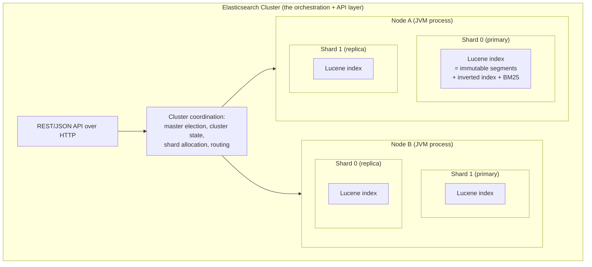

**The one-sentence distinction:** *Lucene is the single-JVM search library that does the actual indexing and scoring; Elasticsearch is what makes many Lucene indices behave as one distributed, network-accessible, fault-tolerant system.* Every ES shard is literally a Lucene index — when you understand this, most ES behavior (segments, refresh, merges, immutability) stops being ES magic and becomes "that's just Lucene."

### Elasticsearch vs. OpenSearch (the license fork)

Worth knowing cold, since it comes up both operationally (which one are you actually running?) and in interviews (open-source/vendor-lock-in questions): in **2021**, Elastic relicensed Elasticsearch and Kibana away from the permissive Apache 2.0 license to a dual **SSPL / Elastic License** (source-available, but restrictive for competing hosted offerings — aimed squarely at cloud providers reselling ES as a managed service). **AWS**, together with other contributors, forked the last Apache-2.0 version into **OpenSearch**, now under the Linux Foundation. The two have since diverged in features (e.g., vector search implementation details, security defaults) but share the same Lucene-based core and most of the concepts in this guide. Elastic has since also offered an **AGPL** option alongside SSPL/Elastic License (a later move back toward more conventional open source). **Practical takeaway:** "Elasticsearch" and "OpenSearch" are siblings, not synonyms — check which one a job/managed-service/vendor is actually running before assuming API/feature parity.

**Golden rule:** Every ES feature is either "Lucene does this per-shard" or "ES coordinates this across shards." Know which side of the line any behavior lives on and you can reason about it from first principles.

---

## 2. Core Concepts & Data Model

### The containment hierarchy

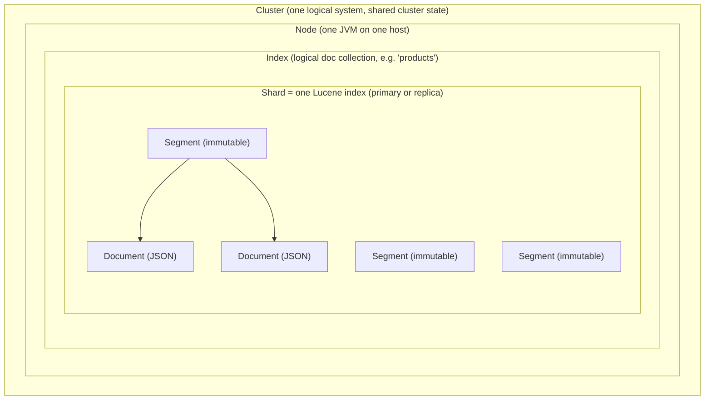

- **Cluster**: a set of nodes sharing the same `cluster.name`, one elected master maintaining **cluster state** (mappings, shard locations, settings).
- **Node**: one `elasticsearch` JVM process. Identified by `node.name`; behavior set by `node.roles`.
- **Index**: a named logical collection of documents (`products`, `logs-2026.07.17`). Purely logical — its data lives in shards.
- **Shard**: one Lucene index. A **primary** shard owns a slice of the documents; **replica** shards are copies for HA and read throughput. Primary count is fixed at creation; replica count is mutable.
- **Segment**: an immutable Lucene file-set. New docs go into new segments; deletes are tombstones; background **merges** compact segments.
- **Document**: a JSON object with an `_id`, stored in `_source`, indexed per its mapping.

### Node roles

Set with the `node.roles` list in `elasticsearch.yml`. A node with `node.roles: []` (empty) becomes a **coordinating-only** node.

| Role (`node.roles` value) | What it does | Notes |
|---|---|---|
| `master` | Master-**eligible**; can be elected cluster master (owns cluster state, allocates shards) | Run 3 dedicated ones for HA; keep them off data duty |
| `data` | Generic data node: holds shards, executes queries/indexing | The workhorse if you don't use tiers |
| `data_hot` | Hot tier: actively written + queried (fast SSD, high CPU) | Newest, most-queried data |
| `data_warm` | Warm tier: read-only, queried less (cheaper storage) | Aged-out indices |
| `data_cold` | Cold tier: rarely queried, cheapest storage, often searchable snapshots | Fewer/no replicas |
| `data_frozen` | Frozen tier: archived, searchable snapshots only, minimal local resources | Slow-but-possible search from object store |
| `ingest` | Runs ingest pipelines (transform/enrich docs pre-index) | Lightweight ETL before Lucene write |
| `ml` | Runs machine-learning jobs (anomaly detection, etc.) | Licensed feature |
| `transform` | Runs continuous transforms (pivot/aggregate into new indices) | — |
| `remote_cluster_client` | Can connect to remote clusters (needed for CCS/CCR coordination) | Required on nodes that initiate cross-cluster ops |
| `voting_only` | Master-eligible for voting/quorum only, never elected leader | Tie-breaker in even-numbered master setups |
| *(empty `[]`)* | **Coordinating-only**: routes requests, fans out queries, merges results, holds no data | Put behind the load balancer as a "smart router" |

**Mnemonic for the data tiers: "Hot Warm Cold Frozen" = "Fast → Cheap → Cheaper → Archived."** Data ages downhill; query speed and cost both drop at each step.

### Cluster formation & master election

When nodes start, they must find each other, agree on a master, and converge on one shared cluster state. This is a **quorum-based** process (ES 7+): a master is elected only if a **majority of master-eligible nodes** agree, which is exactly what makes the split-brain fix in section 9 possible.

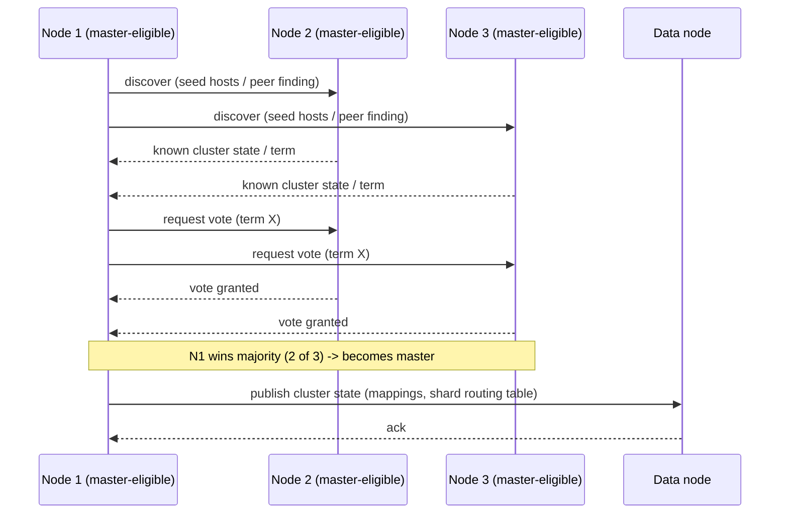

Once elected, the master owns **cluster state** (index mappings, settings, and the shard routing table — which shard copy lives on which node) and publishes updates to every node. Data nodes don't vote on queries or writes — they just execute against whatever shards the master has assigned them.

### Realistic production topology

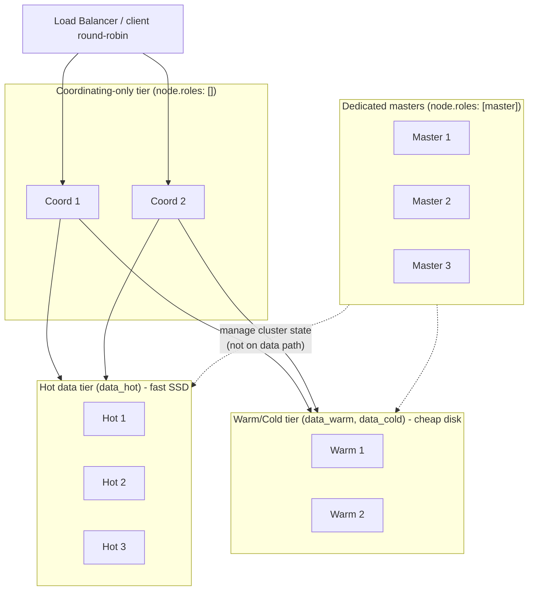

Three dedicated masters (quorum of 2 survives one loss), N hot data nodes taking writes and recent-data queries, M warm/cold nodes for aged data, and coordinating-only nodes as the query fan-out/merge layer behind the LB. Clients never need to know shard locations — any coordinating node figures that out from cluster state.

### Document model: mapping and field types

A **mapping** is the schema for an index: which fields exist and how each is analyzed/indexed. The single most consequential field-type decision in ES is **`text` vs `keyword`**, and getting it wrong is the #1 source of "why doesn't my search work" tickets.

| | `text` | `keyword` |
|---|---|---|
| Analyzed? | **Yes** — run through an analyzer (tokenized, lowercased, stemmed) | **No** — stored verbatim as a single token |
| Indexed as | Many tokens: `"The Quick Fox"` → `[the, quick, fox]` | One token: `"The Quick Fox"` → `["The Quick Fox"]` |
| Good for | Full-text search (`match` queries, relevance) | Exact match, filtering, sorting, aggregations |
| Supports `match`? | Yes (analyzed both sides) | Technically yes but behaves like exact match — a common trap |
| Sortable / aggregatable? | **No** by default (needs costly fielddata) | **Yes** cheaply (via doc values) |
| Example use | Product description, blog body, log message | Status enum, SKU, tag, hostname, user ID, category |

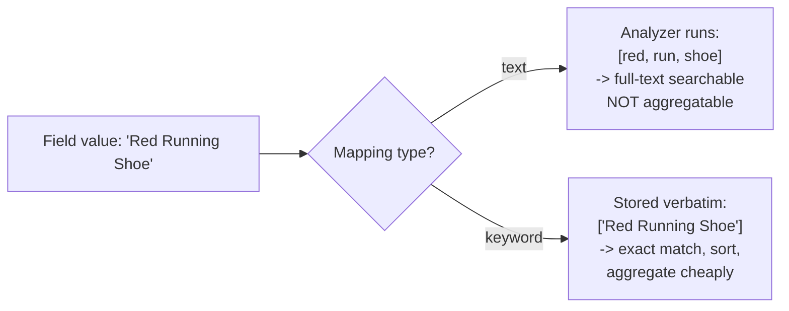

**The classic trap:** you map `status` as `text`, then filter `status = "IN STOCK"`. A `term` query for `"IN STOCK"` on a `text` field finds nothing, because the analyzer indexed `[in, stock]` (lowercased, split) — the exact token `"IN STOCK"` was never stored. Fix: map exact-value fields as `keyword`.

The standard pattern is a **multi-field**: index a string as `text` for search *and* `keyword` for filter/sort/aggregate simultaneously.

### Dynamic vs explicit mapping

- **Dynamic mapping (default):** ES infers types from the first document it sees for each field. Convenient for prototyping, dangerous in production — an uncontrolled stream of new field names causes **mapping explosion** (see section 9).
- **Explicit mapping:** you define fields up front. Control `dynamic` with `true` (add new fields, default), `false` (ignore/don't index unknown fields but keep in `_source`), or `strict` (reject documents with unknown fields).

### Concrete mapping example (e-commerce product)

```json
PUT /products
{
  "settings": {
    "number_of_shards": 3,
    "number_of_replicas": 1,
    "analysis": {
      "analyzer": {
        "english_desc": { "type": "english" }
      }
    }
  },
  "mappings": {
    "dynamic": "strict",
    "properties": {
      "name":        { "type": "text", "fields": { "raw": { "type": "keyword" } } },
      "description": { "type": "text", "analyzer": "english_desc" },
      "sku":         { "type": "keyword" },
      "category":    { "type": "keyword" },
      "brand":       { "type": "keyword" },
      "price":       { "type": "scaled_float", "scaling_factor": 100 },
      "in_stock":    { "type": "boolean" },
      "created_at":  { "type": "date" },
      "tags":        { "type": "keyword" },
      "variants":    {
        "type": "nested",
        "properties": {
          "color": { "type": "keyword" },
          "size":  { "type": "keyword" },
          "qty":   { "type": "integer" }
        }
      }
    }
  }
}
```

Why each choice:
- `name` is `text` (users search it) with a `.raw` `keyword` sub-field for sorting/aggregating by exact name.
- `description` uses the `english` analyzer (stemming + English stopwords) — you want "running" to match "run".
- `sku`, `category`, `brand`, `tags` are `keyword` — you filter/facet on these, never full-text search them.
- `price` is `scaled_float` (stores as a long × 100) to avoid float rounding on currency while keeping range queries cheap.
- `variants` is **`nested`** so `{color, size}` pairs keep their per-element association (see section 5's nested example — this is not optional cleverness, it prevents wrong matches).
- `dynamic: "strict"` — a product document with an unexpected field is **rejected**, not silently added. This is the guardrail against mapping explosion.

### Practitioner cheat-sheet — data model
- One ES index = many Lucene indices (shards); one shard = many immutable segments.
- Dedicated masters (3), tiered data nodes, coordinating-only routers is the standard production shape.
- `node.roles: []` = coordinating-only; use these as the query fan-out layer.
- `text` = analyzed/searchable, `keyword` = exact/sortable/aggregatable. Use a multi-field to get both.
- Never `term`-query or aggregate on a raw `text` field; use its `.keyword` sub-field.
- Set `dynamic: "strict"` (or `false`) on anything touching user-generated field names.

**Golden rule:** If you will filter, sort, or aggregate on a field, it must be `keyword` (or numeric/date), not `text`.

---

## 3. How Indexing Works Internally

### The analyzer pipeline

Every `text` field is processed by an **analyzer** = **char filters → tokenizer → token filters**, in that order.


Worked example, `"The Quick-Foxes!"` with the `english` analyzer:
1. **Char filter**: none applied → `"The Quick-Foxes!"`.
2. **Tokenizer** (`standard`): splits on punctuation/hyphen → `["The", "Quick", "Foxes"]`.
3. **Token filters**: lowercase → `["the", "quick", "foxes"]`; English stop removes `"the"` → `["quick", "foxes"]`; stemmer → `["quick", "fox"]`.

Result stored in the inverted index: `[quick, fox]`. **The same analyzer runs at query time**, so a search for `"foxes"` also stems to `fox` and matches — this symmetry is why `match` queries "just work" and why using a different analyzer at index vs search time silently breaks matching.

You can preview any analyzer with the `_analyze` API:

```json
POST /products/_analyze
{ "analyzer": "english", "text": "The Quick-Foxes!" }
```

### The full internal write path

When you index a document, here's what physically happens:

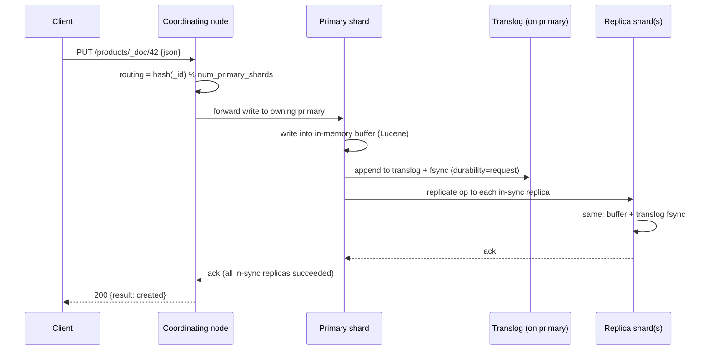

Step by step:
1. **Client → coordinating node.** Any node can coordinate.
2. **Routing.** The coordinator computes `shard = hash(routing_value) % number_of_primary_shards`. `routing_value` defaults to `_id`; you can override with a custom routing key. This picks exactly one primary.
3. **Primary write.** The primary writes the doc into an **in-memory buffer** (Lucene's indexing buffer). *It is not yet searchable.*
4. **Translog.** The op is appended to the **translog** (write-ahead log) and, by default (`index.translog.durability: request`), **fsynced to disk before the request is acked.** This is what makes an acked write durable even though the Lucene segment hasn't been committed yet.
5. **Replication.** The primary forwards the op to each in-sync replica, which repeats buffer + translog. Only after in-sync replicas ack does the primary ack the coordinator.
6. **Client gets 200.** The doc is durable but still **not searchable** until the next refresh.

### Refresh vs Flush vs Merge

These three are constantly confused. They are different operations at different points in a segment's life.

| | Refresh | Flush | Merge |
|---|---|---|---|
| What it does | Turns the in-memory buffer into a new **searchable** in-memory/OS-cache segment | fsyncs Lucene segments to disk, writes a Lucene **commit**, clears the translog | Background: combines many small segments into fewer larger ones, drops deleted docs |
| Makes docs searchable? | **Yes** — this is what makes NRT search work | Already searchable; adds durability | No new visibility; reclaims space + speeds queries |
| Default trigger | Every `1s` if the shard is being searched (`index.refresh_interval`) | Automatically based on translog size/age (`index.translog.flush_threshold_size`) | Lucene's `TieredMergePolicy`, automatic |
| Cost | Cheap-ish but frequent; each refresh creates a segment | Moderate (disk fsync + commit) | Expensive (I/O + CPU rewriting segments) |
| Key tunable | `index.refresh_interval` (set `-1` to disable during bulk loads) | `index.translog.flush_threshold_size` | merge policy settings (rarely tuned by hand) |

Key relationships:
- **Refresh ≠ durability.** A refreshed doc is searchable but its durability comes from the **translog**, not from being in a committed segment. That's why translog fsync (step 4 above) matters.
- **Flush clears the translog.** After a flush, the data is in committed segments, so the translog no longer needs to replay it, and it's truncated.
- **Merge is why deletes are lazy.** Deleting a doc just marks it in a `.liv` tombstone; the space is only reclaimed when a merge rewrites that segment without the dead doc.

### A segment's lifecycle

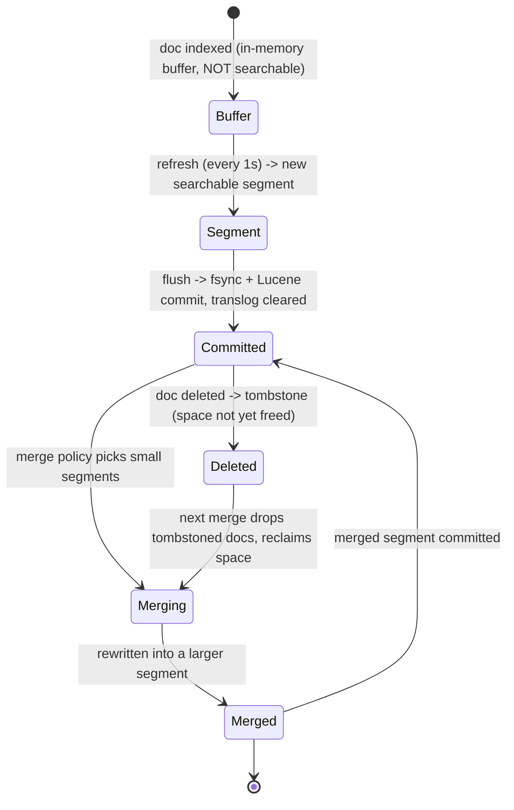

### Near-real-time (NRT) search, precisely

A document is **not searchable the instant you index it.** It becomes searchable only after the **next refresh** — by default within 1 second. So:
- Index a doc, immediately search for it → you may get **zero results** for up to ~1s. This is *correct, expected* NRT behavior, not a bug.
- Need read-your-write immediately? Use `GET /index/_doc/42` (a direct get by ID reads through the translog and is real-time), or pass `?refresh=wait_for` on the index request (waits for the next refresh before returning), or `?refresh=true` (forces a refresh — expensive, don't do this per-doc).

### Practitioner cheat-sheet — indexing internals
- Analyzer = char filters → tokenizer → token filters; the *same* analyzer runs at index and query time.
- Write path: coordinator → route by hash(`_id`) → primary buffer + translog fsync → replicas → ack.
- Durability comes from the **translog fsync**, not from the segment being committed.
- Refresh (1s) makes docs searchable; Flush commits + clears translog; Merge compacts segments and frees deleted space.
- A doc is **not searchable until the next refresh** — that's NRT, by design.
- For bulk loads, set `index.refresh_interval: -1` and `number_of_replicas: 0`, then restore after — big throughput win.

**Golden rule:** "Indexed" and "searchable" are different states separated by a refresh; "acked" and "committed to a segment" are different states separated by a flush. Keep the four states straight.

---

## 4. How Search Works Internally

### Query then fetch (two round-trips, not one)

The single most misunderstood thing about ES search: a search is **two phases**, not one broadcast. This is called **query-then-fetch**.

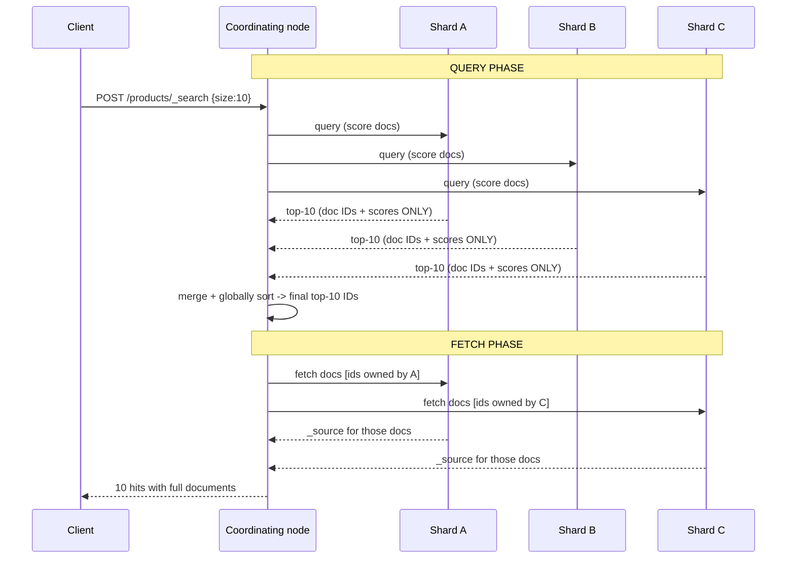

- **Query phase:** the coordinator broadcasts the query to one copy of every relevant shard. Each shard locally scores its docs and returns **only doc IDs + scores** (plus sort values) for its own top-K. No document bodies move yet.
- **Coordinator merges:** it merges all shards' top-K lists and sorts globally to find the real top-K.
- **Fetch phase:** a *second* round-trip retrieves the actual `_source` for only the final top-K, and only from the shards that own those specific docs.

Why two phases: shipping full document bodies from every shard for every candidate would be enormously wasteful. Query-then-fetch moves only tiny (id, score) tuples in phase one and full bodies for just the final K in phase two. The cost: **two network round-trips**, which is why people who assume "one broadcast" mis-estimate latency.

### Relevance scoring — what's ES-specific

ES's default scoring is **BM25** (Lucene's `BM25Similarity`, default since ES 5.0). The BM25 math is covered in the companion guide — here's what's ES-specific:

- **`_score`** is attached to every hit. Sorting defaults to `_score` descending.
- **`explain` API**: `GET /products/_explain/42` (or `"explain": true` in the body) returns the full per-term score breakdown — the tool for "why did this rank here."
- **Boosting**: `"boost"` on a field or query multiplies its contribution. `function_score` queries let you fold in arbitrary signals (recency decay, popularity, random) via `field_value_factor`, `gauss`/`linear`/`exp` decay functions, or `script_score`.
- Similarity is tunable **per field** via the `similarity` mapping parameter (e.g., switch a field to `boolean` similarity for no TF weighting).

### Native vector / kNN search (hybrid retrieval, ES-specific)

The companion FAANG guide covers *why* semantic/vector retrieval exists (the lexical "affordable laptop" vs "budget notebook" gap) — here's how **Elasticsearch itself** implements it.

- **`dense_vector`** is a field type that stores an embedding (a float array) per document, computed by whatever embedding model you choose upstream (or via an ES **inference** processor/endpoint if using Elastic's ML features).
- ES's approximate nearest-neighbor search is backed by **Lucene's own HNSW implementation** (shipped since Lucene 9 / ES 8.x) — the same HNSW algorithm discussed generically in the companion guide, just running per-shard like everything else in this doc's mental model.
- A `knn` clause can be run **standalone** or **combined with a normal `query` clause in the same `_search` request** — ES fuses the two ranked lists server-side, giving you hybrid lexical+vector retrieval without a separate application-level fusion step.

```json
POST /products/_search
{
  "size": 10,
  "query": {
    "bool": { "filter": [ { "term": { "in_stock": true } } ] }
  },
  "knn": {
    "field": "description_embedding",
    "query_vector": [0.12, -0.04, 0.98, "...ndims..."],
    "k": 10,
    "num_candidates": 100
  }
}
```
`k` = final nearest neighbors wanted; `num_candidates` = how many candidates each shard explores before returning its top-`k` (higher = better recall, more cost) — this is the HNSW recall/speed knob discussed generically in the companion guide, exposed here as one concrete parameter.

| | Exact k-NN (`script_score` cosine/dot) | Approximate k-NN (`knn` clause, HNSW) |
|---|---|---|
| Cost | O(n) brute-force scan of every vector — fine for small candidate sets | Sub-linear via the HNSW graph — needed at scale |
| Recall | 100% (exact) | High but not guaranteed 100% (tunable via `num_candidates`) |
| Use case | Re-ranking a small pre-filtered set | Primary retrieval over millions/billions of vectors |

**Mnemonic:** *"`knn` in the body = hybrid for free"* — combining `query` + `knn` in one request is ES doing the lexical/vector fusion for you, instead of you running two searches and merging client-side.

### Query context vs Filter context

This distinction trips people up constantly. Every clause runs in one of two contexts:

| | Query context | Filter context |
|---|---|---|
| Question it answers | "How **well** does this match?" | "Does this match, **yes or no**?" |
| Produces a `_score`? | **Yes** — contributes to relevance | **No** — score is irrelevant |
| Cacheable? | Not cached (scores vary) | **Yes** — cached in the node query cache (a bitset) |
| Speed | Slower (must compute scores) | Faster (bitset intersection, reused) |
| Where you write it | `must`, `should` | `filter`, `must_not` |
| Use for | Full-text relevance ("find laptops **like** this") | Hard constraints (in_stock=true, price 10–50, category=shoes) |

**Rule of thumb:** if a clause is a yes/no constraint (dates, ranges, enums, booleans), put it in `filter` — you get correct results, cached bitsets, and no wasted scoring. Only put full-text relevance clauses in query context.

### The deep-pagination problem

`from` + `size` pagination breaks past **10,000 results** (`index.max_result_window`, default 10000). Why: to return results `from: 9990, size: 10`, **every shard must produce and sort its top `from + size` = 10,000 candidates** and ship all of them to the coordinator, which then merges `num_shards × 10,000` results just to discard all but 10. Cost grows with `from`, and it's paid on every shard. Past the window, ES rejects the request.

Alternatives:

| | `from` + `size` | `search_after` (+ PIT) | `scroll` |
|---|---|---|---|
| Mechanism | Skip `from`, take `size` | Cursor: pass last hit's sort values to get the next page | Snapshot a frozen view, iterate segments |
| Cost of deep pages | Grows with `from` (each shard sorts `from+size`) | Flat/cheap regardless of depth | Cheap per page; holds resources |
| Max depth | `max_result_window` (10k default) | Unbounded (forward-only) | Unbounded (forward-only) |
| Random access (jump to page 500)? | Yes (but expensive/broken deep) | **No** — forward-only | No — forward-only |
| Consistency across pages | None (index can change between pages) | Consistent **if** paired with a **PIT** (point-in-time) | Consistent (frozen snapshot at scroll start) |
| Intended use | Shallow UI paging (first few pages) | Deep pagination, "load more" / infinite scroll | Full-corpus **export/reindex** (batch), not user-facing |
| Status | Fine for shallow; don't go deep | **Preferred** for deep user-facing pagination | Discouraged for pagination; still valid for bulk export |

**Point-in-Time (PIT)** gives `search_after` a consistent view: open one with `POST /products/_pit?keep_alive=1m`, pass the returned `pit.id` in each search, and `search_after` walks a frozen snapshot so docs don't shift or duplicate between pages. `scroll` still exists and is fine for *reindex/export* jobs, but it's deprecated as the recommended deep-pagination tool in favor of PIT + `search_after`.

```json
POST /products/_search
{
  "size": 20,
  "query": { "match": { "name": "shoe" } },
  "pit": { "id": "46ToAwM...==", "keep_alive": "1m" },
  "sort": [ { "price": "asc" }, { "_shard_doc": "asc" } ],
  "search_after": [39.99, 12345]
}
```

### Practitioner cheat-sheet — search internals
- Search is **query-then-fetch**: phase 1 returns (id, score) from every shard; phase 2 fetches bodies for the final top-K only. Two round-trips.
- Default scoring is BM25; use `explain` to debug rankings and `function_score` to inject signals.
- Native vector search: `dense_vector` field + `knn` clause, backed by Lucene HNSW; combine `query` + `knn` in one request for free server-side hybrid fusion.
- Yes/no constraints go in **`filter`** (cached, no scoring); relevance goes in **`must`/`should`** (scored).
- `from`+`size` dies past `index.max_result_window` (10k) and is O(from) per shard.
- Deep pagination = **PIT + `search_after`**; `scroll` is for batch export, not user paging.

**Golden rule:** If you paginate deeper than a handful of pages, you should be using `search_after`, not `from`/`size`. `from`/`size` is a shallow-UI convenience, not a scan mechanism.

---

## 5. Query DSL — Practical Examples

All examples hit `POST /products/_search` unless noted.

### `match` vs `term` (analyzed vs exact)

```json
// match: query text is ANALYZED, then matched against the text field's terms
{ "query": { "match": { "name": "running shoes" } } }
// -> analyzed to [run, shoe] and matches docs containing either (OR by default)

// term: query is NOT analyzed; looks for the EXACT token
{ "query": { "term": { "category": "footwear" } } }
// -> correct on a keyword field; category must equal exactly "footwear"
```

**The trap:** running `term` on a `text` field, or `match` expecting exact behavior. If `category` were mapped `text`, `term: {category: "Winter Boots"}` finds nothing because the field was analyzed to `[winter, boots]` — the token `"Winter Boots"` never existed. Rule: **`term` on `keyword`, `match` on `text`.**

### `multi_match` (one query, several fields)

```json
{
  "query": {
    "multi_match": {
      "query": "waterproof jacket",
      "fields": ["name^3", "description"],
      "type": "best_fields"
    }
  }
}
```
`name^3` boosts name matches 3×. `best_fields` scores by the single best-matching field.

### `bool` — a realistic compound product query

Must match the text, hard-filter by category and stock, and *boost* (not require) a preferred brand:

```json
{
  "query": {
    "bool": {
      "must": [
        { "match": { "description": "trail running shoe" } }
      ],
      "filter": [
        { "term":  { "category": "footwear" } },
        { "term":  { "in_stock": true } },
        { "range": { "price": { "gte": 40, "lte": 150 } } }
      ],
      "should": [
        { "term": { "brand": { "value": "salomon", "boost": 2 } } }
      ],
      "must_not": [
        { "term": { "tags": "discontinued" } }
      ]
    }
  }
}
```
- `must` = scored relevance requirement.
- `filter` = cached yes/no constraints (category, stock, price range) — no scoring cost.
- `should` = optional boost; docs from the preferred brand rank higher but non-matches still return.
- `must_not` = exclusion (filter context, no score).

### `range`

```json
{ "query": { "range": {
  "created_at": { "gte": "2026-01-01", "lte": "now/d", "format": "yyyy-MM-dd" }
}}}
```
`now/d` = start of today (date math). Ranges belong in `filter` context.

### `nested` — the object-array association problem

Naive object mapping **flattens** arrays and loses per-element association. Suppose a product has two variants:

```json
{ "variants": [
  { "color": "red",  "size": "large" },
  { "color": "blue", "size": "small" }
]}
```

If `variants` is a plain `object`, ES internally stores `variants.color: [red, blue]` and `variants.size: [large, small]` as **separate flat lists**. A query for "red AND small" then **wrongly matches** — red exists, small exists, but never together in one variant. This is silent, dangerous data corruption of query semantics.

Mapping `variants` as **`nested`** (as in section 2's mapping) stores each variant as a hidden sub-document, preserving the pairing. The correct query:

```json
{
  "query": {
    "nested": {
      "path": "variants",
      "query": {
        "bool": {
          "must": [
            { "term": { "variants.color": "red" } },
            { "term": { "variants.size": "small" } }
          ]
        }
      }
    }
  }
}
```
Now "red + small" correctly returns **nothing** for the above product, because no single variant is both. `nested` has a real query-time cost (each nested doc is a separate Lucene doc) — use it only when per-element association actually matters.

### Aggregations: bucket vs metric

| | Bucket aggregation | Metric aggregation |
|---|---|---|
| Produces | **Groups** (buckets) of documents | A **computed number** over documents |
| Examples | `terms`, `date_histogram`, `range`, `filters`, `nested` | `avg`, `sum`, `min`, `max`, `cardinality`, `percentiles`, `stats` |
| Nestable? | Yes — buckets can contain sub-aggregations | Metrics are leaves (usually) |
| Analogy | SQL `GROUP BY` | SQL aggregate function (`AVG(...)`) |

`terms` facet (counts per category) + a metric nested inside each bucket (avg price per category):

```json
{
  "size": 0,
  "aggs": {
    "by_category": {
      "terms": { "field": "category", "size": 20 },
      "aggs": {
        "avg_price": { "avg": { "field": "price" } }
      }
    }
  }
}
```
`"size": 0` returns no hits, only the aggregation. `date_histogram` for a time series:

```json
{
  "size": 0,
  "aggs": {
    "sales_over_time": {
      "date_histogram": { "field": "created_at", "calendar_interval": "day" }
    }
  }
}
```

**Aggregate on `keyword` (or numeric/date), never raw `text`** — see section 9's fielddata note.

### Bulk API — always use it for write-heavy workloads

Individual index requests each pay full HTTP + routing + refresh-scheduling overhead. The `_bulk` endpoint batches many ops into one request using **NDJSON** (newline-delimited: an action line, then a source line, each terminated by `\n`, including the final line):

```json
POST /_bulk
{ "index": { "_index": "products", "_id": "1" } }
{ "name": "Red Shoe", "category": "footwear", "price": 59.99, "in_stock": true }
{ "index": { "_index": "products", "_id": "2" } }
{ "name": "Blue Boot", "category": "footwear", "price": 89.99, "in_stock": false }
{ "update": { "_index": "products", "_id": "1" } }
{ "doc": { "price": 49.99 } }
{ "delete": { "_index": "products", "_id": "3" } }
```

One request, four ops. Bulk drastically cuts per-request overhead and is the difference between hundreds and tens-of-thousands of docs/sec. Keep bulk requests to a sane size (commonly a few MB / a few thousand docs per request) and tune from there.

### Index template + component template

For a rolling set of indices (daily logs), you don't set mappings by hand each day. **Component templates** are reusable building blocks; an **index template** composes them and matches index-name patterns:

```json
// Reusable settings block
PUT /_component_template/logs-settings
{
  "template": {
    "settings": { "number_of_shards": 2, "number_of_replicas": 1, "index.refresh_interval": "5s" }
  }
}

// Reusable mappings block
PUT /_component_template/logs-mappings
{
  "template": {
    "mappings": {
      "properties": {
        "@timestamp": { "type": "date" },
        "level":      { "type": "keyword" },
        "message":    { "type": "text" },
        "service":    { "type": "keyword" }
      }
    }
  }
}

// Index template: applies to any index matching logs-* and enables a data stream
PUT /_index_template/logs-template
{
  "index_patterns": ["logs-*"],
  "data_stream": {},
  "composed_of": ["logs-settings", "logs-mappings"],
  "priority": 200
}
```

Now any index (or data stream) named `logs-*` automatically gets consistent settings + mappings.

### Practitioner cheat-sheet — Query DSL
- `term` = exact on `keyword`; `match` = analyzed on `text`. Mixing them is the top query bug.
- `bool`: `must`/`should` scored, `filter`/`must_not` cached and unscored. Put constraints in `filter`.
- Object arrays flatten and lose pairing — use **`nested`** when per-element association matters.
- Bucket aggs group (`terms`, `date_histogram`); metric aggs compute (`avg`, `cardinality`). Nest metrics inside buckets.
- Always use `_bulk` (NDJSON) for write-heavy loads; never loop single index requests.
- Use component + index templates so rolling indices get consistent mappings automatically.

**Golden rule:** Reach for `nested`/`join` only when a flat/denormalized model genuinely can't express the relationship — both cost you at query time, so they're a last resort, not a default.

---

## 6. Sharding & Routing Specifics

### Primary shard count is a one-way door

**The number of primary shards is fixed at index creation and cannot be changed in place.** This is the single most consequential up-front decision in ES, because routing depends on it: `shard = hash(_id) % number_of_primary_shards`. Change the divisor and every document routes to a different shard — so ES simply won't let you.

Escape hatches (all are *reindex-under-the-hood workarounds*, not true resizes):
- **`_split`**: multiply primaries (e.g., 2 → 4 → 8) into a new index; requires the source to be read-only.
- **`_shrink`**: reduce primaries into a new index.
- **`_reindex`**: copy into a freshly-created index with whatever shard count you want (the general-purpose fix).

**Replica count, by contrast, is mutable anytime**: `PUT /products/_settings {"number_of_replicas": 2}` takes effect immediately.

Defaults worth knowing: since ES 7.0, a new index defaults to **1 primary shard and 1 replica** (older versions defaulted to 5 primaries).

### Routing

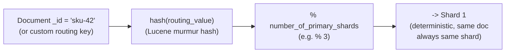

`routing_value` defaults to `_id`. You can supply a **custom routing key** (e.g., `?routing=customer_123`) so all of a customer's docs land on one shard — this makes their queries hit a single shard instead of fanning out, but risks hot spots if one key dominates. The formula being `% num_primaries` is exactly *why* the primary count is immutable.

### Shard sizing guidance

Target **10–50 GB per shard** (a widely cited operational sweet spot; many run hot shards toward the smaller end for faster recovery). The two failure modes:

- **Oversharding** (too many tiny shards): every shard is a Lucene index with its own memory overhead, file handles, and cluster-state footprint. Thousands of tiny shards bloat cluster state, slow cluster-state updates, waste heap, and slow every query (more shards to coordinate). A rough guardrail: keep **shards per node roughly proportional to heap** (commonly cited target ≈ **≤ 20 shards per GB of heap**).
- **Undersharding** (too few giant shards): a 500 GB shard can't be split without a reindex, can't rebalance across nodes evenly, creates hot spots, and takes forever to recover/relocate after a failure.

### How many primary shards should I start with?

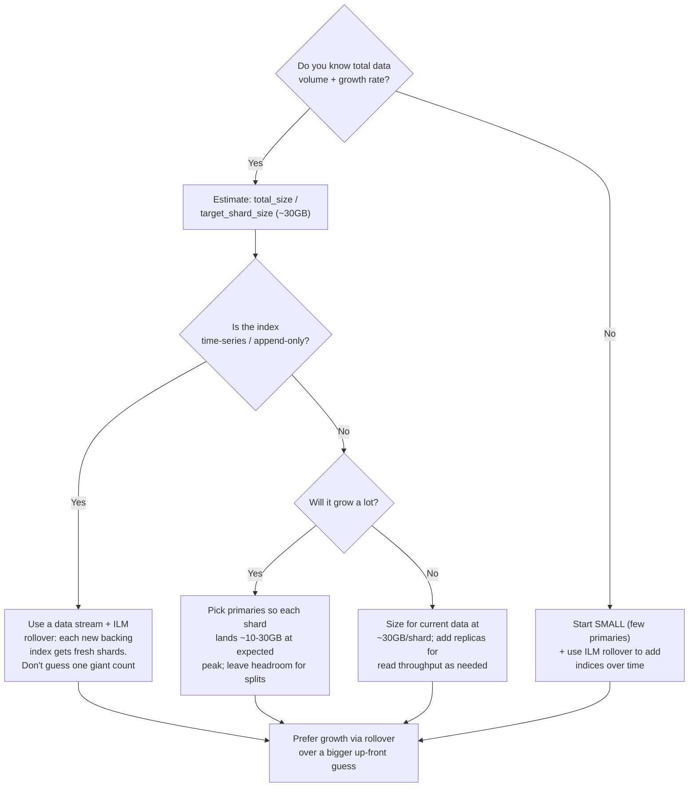

**Prefer starting smaller with room to grow via ILM rollover rather than guessing one huge shard count** you can never take back. For time-series data, the whole problem dissolves: each rollover creates a new backing index with fresh shards, so you never need to predict lifetime volume.

### Practitioner cheat-sheet — sharding
- Primary count is **fixed at creation**; `_split`/`_shrink`/`_reindex` are reindex workarounds, not resizes.
- Replica count is changeable live (`number_of_replicas`).
- `shard = hash(routing) % num_primaries` — this is *why* primaries are immutable.
- Target **10–50 GB per shard**; avoid oversharding (cluster-state/heap bloat) and undersharding (no rebalance, slow recovery).
- Rough cap: **≤ ~20 shards per GB of heap** per node.
- Time-series data → data stream + rollover; never hand-pick a lifetime shard count.

**Golden rule:** Shard count is a one-way door. Plan for growth with ILM rollover, not with a bigger guess you can't undo.

---

## 7. Index Lifecycle Management (ILM) & Data Streams

### The tier lifecycle

Data ages through tiers, each cheaper and slower than the last:

- **Hot**: actively written and queried. Fast SSD, high CPU, replicas for HA. (`data_hot`)
- **Warm**: no longer written, queried occasionally. Cheaper storage, maybe fewer replicas, force-merged to fewer segments. (`data_warm`)
- **Cold**: rarely queried. Cheapest local storage; often backed by **searchable snapshots** (data lives in object storage, mounted read-only). (`data_cold`)
- **Frozen**: essentially archived. Data lives entirely in object storage; a small local cache serves slow-but-possible searches. Minimal node resources. (`data_frozen`)
- **Delete**: gone.

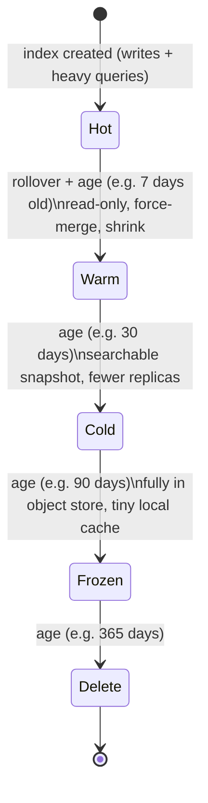

Transition triggers are **age, size, or doc count** (or combinations). Hot→warm typically fires on age or on rollover; deletion on age.

### Data streams + rollover

You do **not** manually create and manage `logs-2026.07.17`-style indices. Instead:
- A **data stream** is a write-time abstraction: you write to one name (`logs-app`), and ES appends to a hidden **backing index** (`.ds-logs-app-2026.07.17-000001`).
- **`_rollover`** creates a new backing index when a condition is met (`max_age`, `max_primary_shard_size`, `max_docs`), and the write alias flips to it automatically.
- **ILM** ties it together: one policy drives rollover + tier transitions + deletion.

Abbreviated ILM policy:

```json
PUT /_ilm/policy/logs-policy
{
  "policy": {
    "phases": {
      "hot": {
        "actions": {
          "rollover": { "max_primary_shard_size": "30gb", "max_age": "1d" }
        }
      },
      "warm": {
        "min_age": "7d",
        "actions": { "forcemerge": { "max_num_segments": 1 }, "shrink": { "number_of_shards": 1 } }
      },
      "cold": {
        "min_age": "30d",
        "actions": { "searchable_snapshot": { "snapshot_repository": "s3-repo" } }
      },
      "delete": {
        "min_age": "90d",
        "actions": { "delete": {} }
      }
    }
  }
}
```

Rollover here fires at 30 GB primary shard size *or* 1 day, whichever comes first — so shards stay in the target size band automatically and you never guessed a lifetime shard count.

### Practitioner cheat-sheet — ILM & data streams
- Tiers: hot (write+query) → warm (read-only) → cold (searchable snapshot) → frozen (object store) → delete.
- Transition triggers: age, size, doc count.
- Data stream = write to one name, ES manages hidden backing indices.
- `_rollover` on `max_primary_shard_size`/`max_age`/`max_docs` keeps shards in the target size band.
- One ILM policy drives rollover + tiering + deletion; attach via index template.

**Golden rule:** For time-series/log data, never manage indices by hand — a data stream + ILM rollover keeps shard sizes healthy and retires old data automatically.

---

## 8. Multi-Region / Cross-Cluster Production Architecture

### Single cluster, multi-AZ: shard allocation awareness

Within one region you spread nodes across availability zones. But by default ES might place a primary and its only replica in the **same** AZ — so one AZ outage loses both copies. **Shard allocation awareness** prevents this.

Configure a zone attribute per node and tell the cluster to be aware of it:

```yaml
# elasticsearch.yml on each node, tagged with its AZ
node.attr.zone: az-a         # az-b, az-c on other nodes
cluster.routing.allocation.awareness.attributes: zone
# optional: force replicas across all listed zones
cluster.routing.allocation.awareness.force.zone.values: az-a,az-b,az-c
```

ES then guarantees a shard and its replicas are spread across zones:

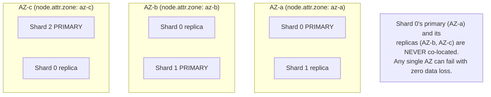

Failure mode prevented: an AZ outage taking out both a primary and its only replica simultaneously. With awareness, every shard survives losing any one AZ.

### Cross-Cluster Replication (CCR)

CCR replicates **data** from a **leader** index in one cluster to a **follower** index in another, independently-run cluster (typically one per region).

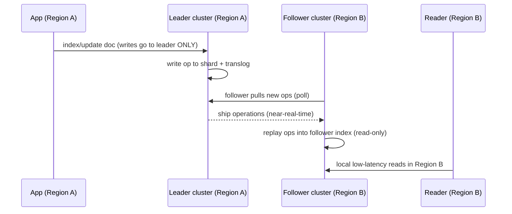

Key facts:
- **One-directional per index pair.** The follower is **read-only**; it passively replays the leader's operations. Writes must go to the leader.
- **Near-real-time**, pull-based: the follower fetches new operations from the leader's shards.
- **Uses:** disaster recovery (promote the follower if Region A dies) and geo-proximity reads (serve Region B locally instead of cross-region).
- **CCR replicates data, not cluster state.** Mapping changes on the leader index *do* propagate with the data, but cluster settings, ILM policies, templates, users/roles, and other clusters' config do **not**. You are still operating **two separate clusters** — two sets of masters, two sets of ops.

### Cross-Cluster Search (CCS)

CCS runs one search that **federates across multiple remote clusters without moving data.** A coordinating cluster registers remote clusters and fans a query out to them, merging results.

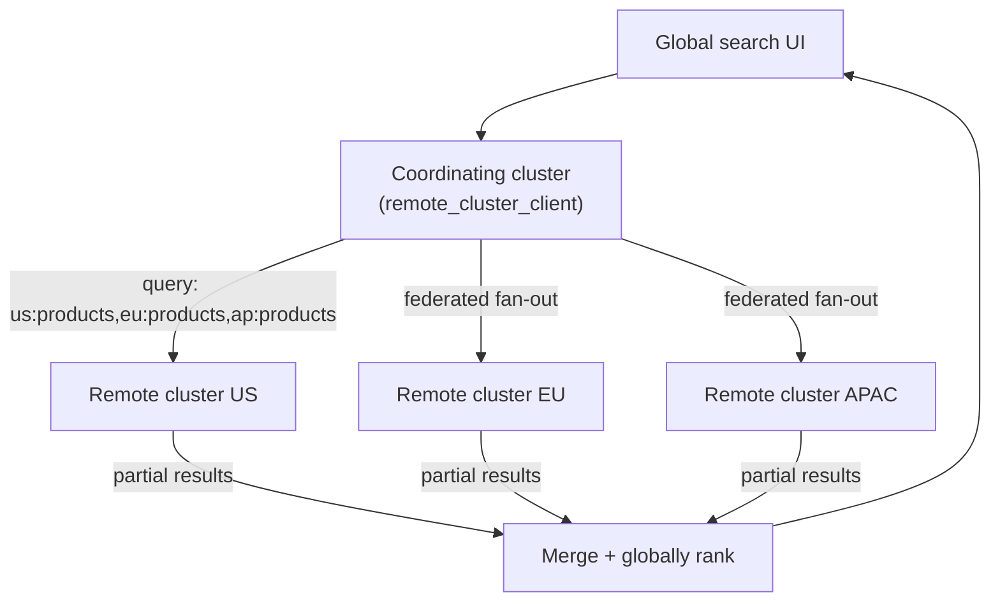

Register a remote and query it with a `cluster:index` prefix:

```json
PUT /_cluster/settings
{ "persistent": { "cluster": { "remote": {
  "eu":   { "seeds": ["es-eu-1.internal:9300"] },
  "apac": { "seeds": ["es-ap-1.internal:9300"] }
}}}}
```
```json
POST /products,eu:products,apac:products/_search
{ "query": { "match": { "name": "shoe" } } }
```

### CCR vs CCS

| | CCR (Cross-Cluster Replication) | CCS (Cross-Cluster Search) |
|---|---|---|
| Problem it solves | Have a local copy of data in another region (DR / local reads) | Search data that stays where it is, from one place |
| Read or write | Replicates **writes** (data movement) | **Read-only** query federation |
| Moves/copies data? | **Yes** — data is duplicated to the follower | **No** — data stays in each remote cluster |
| Directionality | One-way per index pair (leader → follower, follower read-only) | Query fans out to all listed remotes |
| Latency profile | Local reads after replication; writes still go to leader | Each query pays cross-region latency to remotes |
| Typical use | Regional failover/DR, geo-local reads of the same dataset | One global search UI over regionally-siloed data |

**Mnemonic: "CCR Replicates, CCS Reads."** CCR copies data across clusters; CCS queries across clusters without copying.

### Multi-region topology decision tree

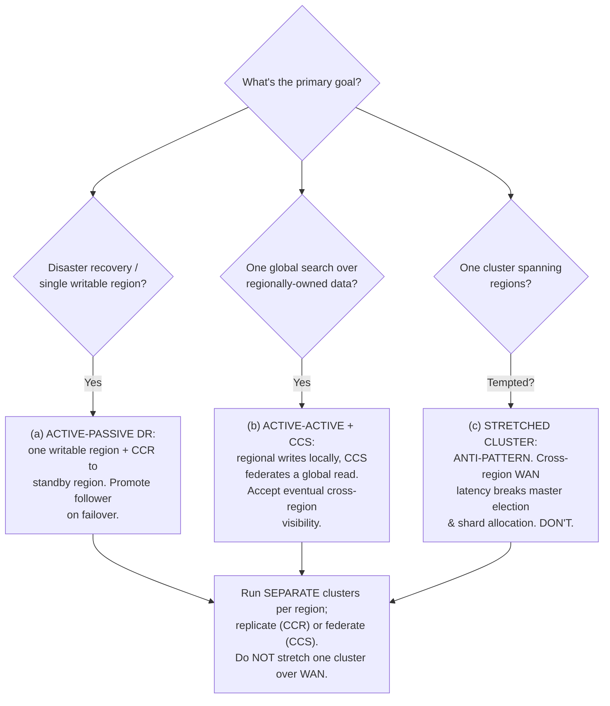

- **(a) Active-passive DR:** one writable region, CCR to a standby. On regional failure, promote the follower to a normal index and redirect writes. Simplest correct multi-region story.
- **(b) Active-active + CCS:** each region owns/writes its own data; a coordinating cluster uses CCS for a unified global read. Accept that cross-region data isn't instantly visible everywhere.
- **(c) Stretched single cluster across regions:** **generally an anti-pattern.** Master election and shard allocation are latency-sensitive; high-latency WAN links between nodes cause election instability, slow cluster-state propagation, and thrashing shard relocation. Real-world guidance: **don't stretch one ES cluster across high-latency WAN links — run separate clusters per region and replicate (CCR) or federate (CCS) between them.** (Multi-AZ within one region is fine; multi-region within one cluster is not.)

### Snapshot & Restore

Independent of CCR, the actual **backup/DR mechanism** is snapshot-and-restore to object storage (S3/GCS/Azure Blob):

```json
// Register a repository
PUT /_snapshot/s3-repo
{ "type": "s3", "settings": { "bucket": "my-es-backups", "region": "us-east-1" } }

// Take an incremental snapshot
PUT /_snapshot/s3-repo/snap-2026-07-17?wait_for_completion=false
{ "indices": "products,logs-*", "include_global_state": true }

// Restore (possibly into a different cluster/region)
POST /_snapshot/s3-repo/snap-2026-07-17/_restore
{ "indices": "products", "rename_pattern": "(.+)", "rename_replacement": "restored-$1" }
```

Snapshots are **incremental** (only new/changed segments are uploaded), repository-based, and restorable to a **different cluster or region entirely** — this is your cross-region DR that doesn't depend on running two live clusters. It's also the mechanism under **searchable snapshots** (cold/frozen tiers mount snapshot data read-only instead of storing full local copies).

### Practitioner cheat-sheet — multi-region
- Multi-AZ: set `node.attr.zone` + `cluster.routing.allocation.awareness.attributes: zone` so a primary and its replicas never share an AZ.
- CCR: leader→follower, one-way, follower read-only, near-real-time; replicates **data + mapping**, not cluster config. Two separate clusters to operate.
- CCS: read-only federated search over remotes; no data movement; query with `cluster:index` prefix.
- Topologies: (a) active-passive DR via CCR, (b) active-active + CCS for global read, (c) stretched single cluster = anti-pattern.
- Snapshot/restore to object storage = incremental, cross-cluster-restorable backup; also powers searchable snapshots.

**Golden rule:** Don't stretch one ES cluster across regions. Run one cluster per region and connect them with CCR (replicate) or CCS (federate). Cluster coordination is latency-sensitive; WAN links break it.

---

## 9. Common Production Mistakes to Avoid

### 1. Wrong primary shard count, discovered too late
**What/why:** Primary count is fixed at creation (section 6). Teams guess, then hit oversharding (thousands of tiny shards → bloated cluster state, heap pressure, slow everything) or undersharding (giant shards that can't rebalance or recover). **Fix:** size for 10–50 GB/shard; for growing/time-series data use data streams + ILM rollover so you never guess a lifetime count. To fix an existing mistake: `_reindex`/`_split`/`_shrink` into a correctly-sized index behind an alias.

### 2. Mapping explosion from unbounded dynamic mapping
**What/why:** Dynamic mapping (on by default) creates a new field mapping for every new JSON key. Feed it user-generated or high-cardinality keys (e.g., indexing arbitrary event attributes as top-level fields, or `metrics.<uuid>`) and you get **thousands of unique fields**. Mappings live in **cluster state**, replicated to every node — this blows up cluster-state size and heap, and slows every cluster-state update.
**What breaks:** heap climbs, cluster-state updates lag, eventually you hit the field limit (`index.mapping.total_fields.limit`, default 1000) and writes fail.
**Fix:** `dynamic: "strict"` or `"false"` on indices exposed to uncontrolled keys; define explicit mappings; for genuinely arbitrary key-value data use the **`flattened`** field type (maps an entire object as one field, so N keys don't become N mappings).

### 3. JVM heap misconfiguration
Two hard rules, both real:
- **Heap ≤ 50% of node RAM.** Lucene relies heavily on the **OS filesystem cache** (the other half) to serve segment reads from memory. Give all RAM to the JVM and you starve the cache Lucene needs.
- **Heap ≤ ~32 GB (really ~26–30 GB depending on JVM).** Above ~32 GB the JVM can no longer use **compressed ordinary object pointers ("compressed oops")**, so pointers become 64-bit — you *lose* usable heap and may end up with *less* effective memory at 40 GB than at 31 GB.

So on a 128 GB box, run ~30 GB heap and let ~98 GB be filesystem cache; if you have more RAM, run multiple nodes rather than one giant heap.

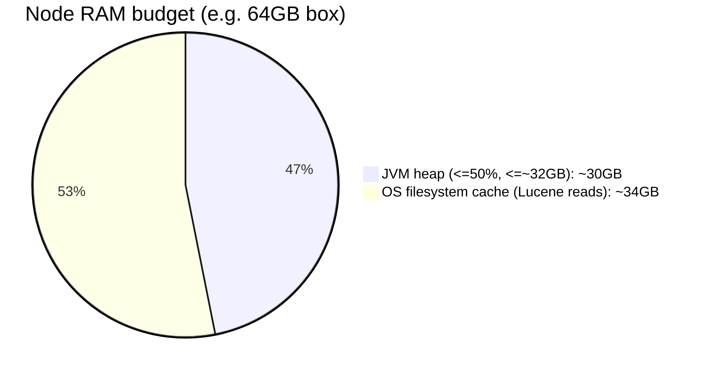

### 4. `from`+`size` for deep pagination (see section 4)
Breaks past `max_result_window` (10k) and is O(from) per shard. **Fix:** PIT + `search_after`.

### 5. Not using the Bulk API for high-volume writes (see section 5)
Per-request overhead crushes throughput. **Fix:** `_bulk` NDJSON, a few MB per request.

### 6. Historical split-brain (pre-7.x `minimum_master_nodes`)
**What/why:** Before ES 7.0, you manually set `discovery.zen.minimum_master_nodes`. Set it too low (below `(master_eligible / 2) + 1`) and a network partition could let **both sides elect their own master and both accept writes** — classic split-brain, diverging data.

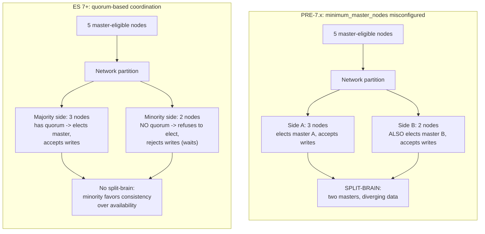

**Fix / current state:** ES 7+ replaced Zen discovery with an **automatic quorum-based cluster coordination layer**. You no longer set `minimum_master_nodes` at all — the cluster manages voting configuration itself, and a minority partition simply **cannot** elect a master (it refuses writes, choosing consistency over availability on that side). Still worth knowing for old clusters and as an interview/history point. The correct old value was `(master_eligible / 2) + 1`.

### 7. Ignoring disk-based shard allocation watermarks
**What/why:** ES stops using nodes as their disks fill, per `cluster.routing.allocation.disk.watermark.*`:
- **low** (~85%): stop allocating **new** shards to this node.
- **high** (~90%): actively **relocate shards away** from this node.
- **flood_stage** (~95%): make all indices with a shard on this node **read-only** (`index.blocks.read_only_allow_delete`) — **writes start failing.**

Teams discover this only when production writes suddenly 403. **Fix:** monitor disk %, alert well before 85%, expand storage / delete old indices, and remove the read-only block after freeing space.

### 8. Fielddata / circuit breakers on `text` fields
**What/why:** Sorting or aggregating on an analyzed `text` field requires **fielddata** — an in-heap, uninverted structure built by scanning every term, historically a top cause of heap blowups (and OOM). Modern ES disables fielddata on `text` by default and trips the **fielddata circuit breaker** instead. The reason you sort/aggregate on **`keyword`** is that keyword fields use **doc values** — an on-disk, columnar, OS-cache-friendly structure built at index time, not heap-resident fielddata. **Fix:** aggregate/sort on `keyword` (or numeric/date) fields; never enable fielddata on `text` unless you truly know why.

### 9. Treating ES as the sole system of record
**What/why:** ES is a search/analytics store, not a durable source of truth. A mapping change, corruption, or reindex-from-scratch needs to **replay data from somewhere.** If ES is the only copy, you can't reindex. **Fix:** keep a durable upstream — a database, or an event log (Kafka) — that can replay into ES. ES becomes a derived, rebuildable view.

### 10. Ignoring cluster health (yellow vs red)
- **Green**: all primaries and all replicas allocated.
- **Yellow**: all **primaries** allocated, but **some replicas are unassigned.** Data is fully available and safe, but you've lost redundancy (or never had it). Common causes: single-node cluster (a replica can't be placed on the same node as its primary), or a disk watermark blocking allocation.
- **Red**: **some primaries are unassigned** — part of your data is **unavailable**, and if a snapshot doesn't exist, that's potential **data loss.**

Check with `GET /_cluster/health` and diagnose unassigned shards with `GET /_cluster/allocation/explain`. **Don't just "monitor it"** — know that yellow = degraded redundancy (act soon), red = missing data (act now).

### 11. Reindexing without aliases
**What/why:** If your app reads/writes a concrete index name (`products`), you can't change its mapping without downtime — mapping changes to existing fields require a **new index + reindex**, and there's no atomic way to swap. **Fix:** always read/write through an **alias**. Reindex into `products-v2`, then atomically flip the alias:

```json
POST /_aliases
{ "actions": [
  { "remove": { "index": "products-v1", "alias": "products" } },
  { "add":    { "index": "products-v2", "alias": "products" } }
]}
```
Zero downtime, instant cutover, easy rollback.

### 12. Single-node "cluster" mistaken for HA
**What/why:** A one-node cluster can't allocate replicas (a replica may not share a node with its primary), so it's **yellow forever** and has **zero redundancy** — lose the node, lose everything. **Fix:** a real HA deployment is ≥3 nodes across AZs with replicas allocated (green). One node is a dev box, not production.

### 13. Overusing `nested` / parent-child (`join`)
**What/why:** `nested` stores each sub-object as a separate hidden Lucene doc (query-time join cost); the `join` field (parent-child) is even heavier (routing constraints, global ordinals in heap, slower queries). People reach for them by reflex when a flat/denormalized model would serve. **Fix:** denormalize by default; use `nested` only when per-element association is required (section 5), and `join` only when you truly need independent update of parent vs child at scale.

### Practitioner cheat-sheet — mistakes
- Size shards for growth (rollover), not a fixed guess; keep them 10–50 GB.
- `dynamic: strict`/`false` or `flattened` to prevent mapping explosion.
- Heap ≤ 50% RAM **and** ≤ ~32 GB — both, always.
- PIT + `search_after` for deep pages; `_bulk` for writes.
- ES 7+ auto-manages quorum (no `minimum_master_nodes`); old value was `(N/2)+1`.
- Watch disk watermarks (85/90/95); flood_stage makes indices read-only.
- Aggregate/sort on `keyword` (doc values), never `text` (fielddata).
- Keep a durable upstream (DB/Kafka) — ES is rebuildable, not the source of truth.
- Yellow = replica unassigned (degraded); red = primary unassigned (data unavailable).
- Read/write through **aliases** so you can reindex + flip atomically.

**Golden rule:** Most ES production incidents trace back to one of four sins — a fixed shard count you can't undo, dynamic mapping you didn't lock down, heap you set wrong, or treating ES as your only copy of the data. Get those four right and the rest is tuning.

---

## 10. Capacity & Sizing Worked Example

**Inputs:**
- Ingest: **50 GB/day** of logs (already accounting for indexing overhead, i.e., on-disk primary size).
- Retention: **30 days hot + 90 days warm** = 120 days total.
- Replication factor: **1 replica** (2 copies total) on hot, **0 replicas** on warm (cold-ish, snapshot-backed).
- Target shard size: **~30 GB** (middle of the 10–50 GB band).
- Rollover so each backing index/shard stays in-band.

### The formula chain
```
daily primary size → tier data volume → × (1 + replicas) for stored size
→ shard count (stored / target shard size) → node count (per tier capacity)
→ heap/RAM per node
```

### Step 1 — Primary data volume per tier
```
Hot primary   = 50 GB/day × 30 days  = 1,500 GB  = 1.5 TB
Warm primary  = 50 GB/day × 90 days  = 4,500 GB  = 4.5 TB
```

### Step 2 — Stored size (apply replication)
```
Hot stored   = 1.5 TB × (1 + 1 replica) = 3.0 TB
Warm stored  = 4.5 TB × (1 + 0 replica) = 4.5 TB
Total stored = 3.0 TB + 4.5 TB         = 7.5 TB
```

### Step 3 — Shard count (via rollover, target ~30 GB/shard)
```
Hot primary shards   = 1,500 GB / 30 GB  ≈ 50 primary shards  (100 shards incl. 1 replica)
Warm primary shards  = 4,500 GB / 30 GB  ≈ 150 primary shards (150 shards, no replica)
```
With daily rollover at ~50 GB/day, that's ~2 primary shards per daily backing index (50/30 ≈ 1.7, round to 2) — right in the band, no lifetime guess needed.

### Step 4 — Node count per tier
Assume hot nodes hold **~1.5 TB usable** each (leaving headroom under the 85% watermark and for merges) and warm nodes hold **~4 TB usable** each (cheaper, denser disks).
```
Hot nodes  = 3.0 TB stored / 1.5 TB per node = 2 nodes  -> round UP to 3 for AZ spread + HA
Warm nodes = 4.5 TB stored / 4.0 TB per node ≈ 1.2      -> round UP to 2 for redundancy
```
Plus **3 dedicated master nodes** (small) and **2 coordinating nodes** for query fan-out. So: 3 hot + 2 warm + 3 master + 2 coord.

### Step 5 — Heap / RAM per data node
Shards-per-node sanity check against the ≤ ~20 shards/GB-heap guardrail:
```
Hot shards per node ≈ 100 shards / 3 nodes ≈ 33 shards/node
Warm shards per node ≈ 150 shards / 2 nodes ≈ 75 shards/node
```
At **30 GB heap**, the guardrail allows ~600 shards/node — comfortably fine. RAM per node:
```
Heap = 30 GB  (≤50% RAM and ≤~32GB)
RAM  = 30 GB / 0.5 = 64 GB per data node
```
So each data node: **64 GB RAM, 30 GB heap, ~34 GB OS filesystem cache**, with hot nodes on fast SSD (~1.5 TB usable) and warm nodes on cheaper dense disk (~4 TB usable).

**Result:** 30 GB/day × 120-day retention with RF choices → **7.5 TB stored**, **~50 hot + ~150 warm primary shards** managed by rollover, **3 hot + 2 warm data nodes** (plus 3 masters + 2 coord), each data node **64 GB RAM / 30 GB heap.**

---

## 11. Real-World Reference Points

- **Elastic Cloud (Elasticsearch Service):** Elastic's own managed multi-region offering uses exactly the patterns above — cross-cluster replication for regional DR and cross-cluster search for federated global queries, with separate clusters per region rather than stretched clusters. Snapshot lifecycle management (SLM) to object storage is the default backup mechanism.
- **Logging/observability (ELK / EFK stacks):** the most common production ES pattern by far — Elasticsearch + Logstash/Fluentd/Beats + Kibana for centralized logs, metrics, and traces. These deployments live and die by data streams + ILM rollover (section 7) and hot/warm/cold tiering (section 2), because log volume is huge, append-only, and time-ordered — the ideal shape for rollover.
- **APM / security analytics (SIEM):** built on the same time-series + tiering foundation; frozen tier + searchable snapshots make it economical to keep a year of security logs queryable from object storage.

*(Note: some large engineering orgs have publicly discussed moving code search on and off Elasticsearch over the years, but the specifics vary and I'm not certain enough of the current state to assert it — omitting rather than guessing.)*

### When (not) to reach for Elasticsearch

Golden rule #12 says ES isn't your source of truth — here's the decision made concrete:

| | Elasticsearch | OLTP database (Postgres/MySQL/DynamoDB) | OLAP warehouse (BigQuery/Snowflake/ClickHouse) | Vector DB (Pinecone/pgvector/FAISS) |
|---|---|---|---|---|
| Strong point | Full-text relevance, faceted/aggregated search, near-real-time | Transactions, strong consistency, being the durable source of truth | Large-scale historical analytics, complex joins, cost-efficient scans | Pure ANN vector similarity at massive scale |
| Consistency | Eventual (NRT — see section 3) | Strong (ACID) | Usually eventual/batch | Usually eventual |
| Should it be your only copy of the data? | **No** — rebuild from an upstream source | **Yes** — this is the upstream source | Usually fed from OLTP/event log, not primary either | Typically no — often paired with a metadata store |
| Typical role in an architecture | Derived read/search index alongside a DB | System of record | Derived analytics layer | Derived embedding index alongside a DB |

**Rule of thumb:** if the question is "where does this data live *first*, before anything can search or analyze it," the answer is never Elasticsearch. ES (and OLAP warehouses, and vector DBs) are downstream, rebuildable views — this is the same "compute once, keep a durable upstream" principle from the companion guide's replication section, applied to the whole system rather than just one indexing job.

---

## 12. Golden Rules

The survive-even-if-you-forget-everything-else principles:

1. **Every ES feature is either "Lucene per-shard" or "ES across-shards"** — know which side any behavior lives on.
2. **Never search an analyzed `text` field expecting exact match** — use `keyword` (or a `.keyword` sub-field) for exact/filter/sort/aggregate.
3. **Shard count is a one-way door** — plan for growth via ILM rollover, not a bigger up-front guess.
4. **Heap ≤ 50% of RAM and ≤ ~32 GB — both, always** — leave the rest for the OS filesystem cache Lucene depends on.
5. **A doc isn't searchable until the next refresh** — "indexed" ≠ "searchable"; durability comes from the translog, not the segment.
6. **Search is query-then-fetch (two round-trips)** — tiny (id, score) tuples first, full bodies for the top-K only.
7. **Constraints go in `filter` context** — cached, unscored, fast; relevance goes in `must`/`should`.
8. **Deep pagination = PIT + `search_after`**, never `from`/`size` past a few pages.
9. **Always use `_bulk` for write-heavy loads.**
10. **Don't stretch one cluster across regions** — one cluster per region, connected by CCR (replicate) or CCS (federate).
11. **Read/write through aliases** so you can reindex and flip atomically with zero downtime.
12. **ES is a rebuildable derived view, not your source of truth** — keep a durable upstream to replay from.

---

## 13. Master Cheat Sheet

### Key config settings + defaults

| Setting | Default | What it controls |
|---|---|---|
| `number_of_shards` | 1 (since 7.0) | Primary shards — **fixed at creation** |
| `number_of_replicas` | 1 | Replica copies — **mutable anytime** |
| `index.refresh_interval` | `1s` | How often new docs become searchable (NRT) |
| `index.translog.durability` | `request` | fsync translog per request (durable acks) |
| `index.max_result_window` | `10000` | `from`+`size` ceiling |
| `index.mapping.total_fields.limit` | `1000` | Max fields before writes fail (mapping explosion guard) |
| `cluster.routing.allocation.disk.watermark.low` | `85%` | Stop allocating new shards to node |
| `...disk.watermark.high` | `90%` | Relocate shards off node |
| `...disk.watermark.flood_stage` | `95%` | Make indices read-only (writes fail) |
| `cluster.routing.allocation.awareness.attributes` | *(unset)* | AZ/rack-aware replica placement |
| JVM heap | `≤50% RAM, ≤~32GB` | The two non-negotiable heap rules |
| Default similarity | BM25 (since 5.0) | Relevance scoring |

### Key API endpoints

| Endpoint | Purpose |
|---|---|
| `GET/POST /index/_search` | Query (query-then-fetch) |
| `POST /_bulk` | Batched index/update/delete (NDJSON) |
| `GET/PUT /index/_mapping` | Inspect/extend field mappings |
| `POST /_aliases` | Atomically add/remove index aliases |
| `PUT /_ilm/policy/<name>` | Define lifecycle policy |
| `POST /index/_rollover` | Roll to a new backing index |
| `POST /_reindex`, `POST /index/_split`, `_shrink` | Change shard count (via new index) |
| `POST /_pit`, `_search` + `search_after` | Deep pagination |
| `PUT /_ccr/follow`, `/_ccr/pause_follow` | Cross-cluster replication |
| `PUT /_cluster/settings` (`cluster.remote.*`) + `remote:index` in `_search` | Cross-cluster search |
| `PUT /_snapshot/<repo>`, `.../_restore` | Backup/restore to object storage |
| `GET /_cluster/health`, `/_cluster/allocation/explain` | Health + unassigned-shard diagnosis |
| `POST /index/_analyze` | Preview an analyzer's output |
| `POST /index/_search` with a `"knn": {...}` clause | Native ANN vector search (Lucene HNSW); combine with `"query"` for hybrid |

### Mnemonics gathered
- **"Lucene per-shard, ES across-shards"** — which layer owns a behavior.
- **"Hot Warm Cold Frozen = Fast → Cheap → Cheaper → Archived"** — data tiers.
- **`text` = analyzed/searchable, `keyword` = exact/sortable/aggregatable.**
- **"Refresh makes searchable, Flush makes durable+clears translog, Merge compacts+frees deletes."**
- **"Query-then-fetch"** — two round-trips, ids first, bodies last.
- **"Filter for facts, query for relevance"** — filter context vs query context.
- **"Shard count is a one-way door."**
- **"CCR Replicates, CCS Reads."**
- **"Heap ≤ 50% and ≤ 32, both."**
- **"`knn` in the body = hybrid for free"** — native vector search fuses with lexical query server-side.
- **"Elasticsearch and OpenSearch are siblings, not synonyms"** — 2021 SSPL/Elastic-License fork, check which one you're actually running.

### Symptom → probable cause

| Symptom | Probable cause |
|---|---|
| Cluster status **yellow** | Unassigned **replica** — often single-node cluster, or disk watermark blocking allocation |
| Cluster status **red** | Unassigned **primary** — data unavailable, potential data loss; check `allocation/explain` |
| **Writes suddenly failing (read-only)** | Disk **flood_stage** (95%) hit — free space, clear `read_only_allow_delete` block |
| `term` query returns nothing on a string field | Field is `text` (analyzed), not `keyword` — token doesn't exist verbatim |
| Search **slow past page ~50**, or errors past 10k | Deep pagination with `from`/`size` — switch to PIT + `search_after` |
| **Heap climbing steadily**, GC pressure | Mapping explosion, fielddata on `text`, or too many small shards |
| **Writes throttled / low throughput** | Not using `_bulk`, or refresh_interval too aggressive during load |
| Doc indexed but **not found immediately** | NRT — not searchable until next refresh (use `?refresh=wait_for` or GET-by-id) |
| **Wrong nested matches** ("red+small" hits a red-large / blue-small doc) | Object array flattened — needs `nested` mapping + `nested` query |
| **New writes rejected**, "limit of total fields" | Mapping explosion hit `total_fields.limit` — lock `dynamic`, use `flattened` |
| Multi-region cluster **unstable, masters flapping** | Stretched cluster over WAN — split into per-region clusters + CCR/CCS |

### Golden rules, gathered
1. Lucene per-shard vs ES across-shards — know the boundary.
2. Never exact-match a `text` field.
3. Shard count is a one-way door — grow via rollover.
4. Heap ≤ 50% RAM and ≤ ~32 GB.
5. Indexed ≠ searchable (refresh); acked ≠ committed (flush); durability = translog.
6. Search is query-then-fetch, two round-trips.
7. Constraints in `filter`, relevance in `must`/`should`.
8. Deep pagination = PIT + `search_after`.
9. Bulk writes via `_bulk`, always.
10. One cluster per region; connect with CCR/CCS; never stretch over WAN.
11. Read/write through aliases for zero-downtime reindex.
12. ES is a rebuildable view — keep a durable upstream source of truth.
