# Distributed Task Scheduler — FAANG System Design Interview Guide

> Think: cron-at-datacenter-scale. Airflow, Chronos, Kubernetes CronJob, AWS EventBridge Scheduler, Google Borg, Temporal/Cadence — all answers to the same question: **"given millions of tasks and thousands of machines, who runs what, when, and what happens when it fails?"**

---

## 1. Mental Model

A task scheduler is **three problems wearing a trenchcoat**:

1. **Admission** — accept a task description durably, cheaply, without blocking the caller (write-ahead, not execute-ahead).
2. **Matching** — decide *when* and *on which worker* a ready task runs, given priority, dependencies, and resource constraints (a bin-packing + priority-queue problem).
3. **Guarantee** — make sure the task actually ran, exactly the number of times the business needs (0, 1, or "at least 1 but idempotent"), even though machines, networks, and processes all fail mid-flight.

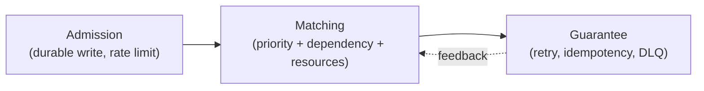

**Analogy — airport control tower, not a single air-traffic controller.** A single OS scheduler is a control tower for one runway. A distributed task scheduler is a *network* of towers coordinating thousands of runways (workers), routing flights (tasks) that sometimes must land only after another flight lands (dependencies), and must reroute automatically when a runway closes (worker failure) — without losing track of any flight (durability) or landing the same plane twice on the same runway (idempotency).

**Golden mental split:** every distributed scheduler = **Control Plane** (decides what should run — stateful, low QPS, correctness-critical) + **Data Plane** (actually runs it — stateless-ish, high QPS, throughput-critical). Interviewers are listening for whether you keep these separate.

---

## 2. How to Identify This Topic in an Interview

Signal phrases that mean "this is a task scheduler problem," even if not named directly:

- "Design a cron service / job scheduler / workflow engine"
- "Design a system that runs millions of background jobs / async tasks"
- "Design Facebook Async / Airbnb Airflow / Uber Cadence / AWS Lambda's async invoke"
- "Design a system to send reminder emails / notifications at a specific time"
- "Design a CI/CD pipeline runner" (DAG + workers + retries)
- "Design a system to process delayed/scheduled messages" (Kafka delayed queue, EventBridge Scheduler)
- "How would you make sure a task that touches money runs exactly once?"
- Anything mentioning: **DAG, dependency between jobs, retry policy, backoff, cron expression, at-least-once delivery, leader election, distributed lock, worker pool, priority queue for jobs.**

**What the interviewer is actually testing:** distributed coordination (leader election / locks), queueing theory (priority + delay), failure handling (idempotency, retries, DLQ), and resource-aware placement (bin packing). If you only talk about "a queue + workers," you've covered maybe 30% of the signal they want.

---

## 3. Interview Playbook

```mermaid
flowchart TD
    S["Start"] --> Q1["Clarify scope:\nWho submits tasks? One-off vs recurring (cron)?\nDependencies (DAG)? Scale (jobs/day)?"]
    Q1 --> Q2["Functional reqs:\nsubmit, cancel, monitor, retry, cancel-dependents"]
    Q2 --> Q3["Non-functional reqs:\navailability, durability, scalability,\nfault tolerance, bounded wait, exactly/at-least-once"]
    Q3 --> E["Back-of-envelope:\ntasks/day -> tasks/sec -> QPS on DB\n-> worker pool size -> storage"]
    E --> H["High-level design:\nClient -> Rate Limiter -> Task Submitter\n-> Metadata DB -> Scheduler/Queue -> Workers"]
    H --> D1["Deep dive #1: Queueing & Prioritization\n(delay tolerance, multiple queues, starvation)"]
    D1 --> D2["Deep dive #2: Leader election &\ncoordination (who assigns tasks)"]
    D2 --> D3["Deep dive #3: Failure handling\n(idempotency, retries, DLQ, exactly-once)"]
    D3 --> D4["Deep dive #4: Dependency graph\n(DAG, topological execution)"]
    D4 --> D5["Deep dive #5: Multi-tenancy\n& fair scheduling"]
    D5 --> D6["Deep dive #6: Scaling, clock skew,\ncrash recovery & monitoring"]
    D6 --> T["Trade-offs: push vs pull, SQL vs NoSQL\nmetadata, single-region vs geo-replicated"]
    T --> B2["Bottlenecks: DB hot rows, thundering herd\non cron minute boundary, leader failover gap"]
    B2 --> R["Real-world tie-in:\nAirflow / Borg / Temporal / EventBridge"]
    R --> W["Wrap: recap reqs met, call out what you'd\nbuild next given more time"]
```

**Cheat sheet for this section**
- Spend the first 5 minutes pinning down: one-shot vs recurring, DAG or not, and delivery guarantee needed — these three answers reshape the entire design.
- Say "control plane vs data plane" early; it signals architectural maturity.
- Don't jump to Kafka/Redis names before establishing the *shape* of the problem (priority + delay + dependency).
- Always ask: "what happens on task failure?" before designing happy path — it's the crux of the problem.
- Budget ~40% of interview time on failure/retry/idempotency deep dive — that's where most signal is extracted.
- Explicitly separate "scheduling *when*" (cron/timer logic) from "scheduling *where*" (placement on a worker) — candidates who conflate these lose points.

---

## 4. Requirements Clarification

### Functional Requirements

| # | Requirement | Notes |
|---|---|---|
| 1 | **Submit task** | One-off or recurring (cron-like), with metadata: resource needs, dependencies, priority, retry policy |
| 2 | **Cancel task** | Before or during execution; must cascade to dependents if DAG |
| 3 | **Allocate resources** | Match task to a worker meeting CPU/RAM/disk/IOPS/port needs |
| 4 | **Monitor & reschedule on failure** | Detect failed/stuck tasks, retry per policy |
| 5 | **Efficient & fair resource use** | No starvation across tenants; no over-provisioning a light task |
| 6 | **Release resources** | Reclaim on completion (success, failure, or timeout/kill) |
| 7 | **Show task status** | waiting / running / succeeded / failed / retrying / dead-lettered / cancelled |

### Non-Functional Requirements

| # | Requirement | What it really means in design terms |
|---|---|---|
| 1 | **Availability** | No single point of failure in submission or scheduling path (replicate everything) |
| 2 | **Durability** | Once acknowledged, a task survives crashes — write to durable store *before* ack |
| 3 | **Scalability** | Horizontally scale submitters, metadata store, queue, and worker fleet independently |
| 4 | **Fault tolerance** | Worker/leader/DB node death doesn't lose or duplicate work (beyond declared guarantee) |
| 5 | **Bounded waiting time** | Task starts within an SLA of its scheduled/delay-tolerance time, or client is notified |
| 6 | **Delivery guarantee** (add this — source omits it explicitly but every interviewer probes it) | State up front: at-least-once by default; exactly-once *effect* via idempotency |

**Cheat sheet**
- Always state delivery semantics explicitly — "at-least-once execution, exactly-once *effect* via idempotency keys" is the answer 90% of interviewers want to hear.
- Distinguish **task-level SLA** (this task's deadline) from **system-level SLA** (99.9% of tasks start within N seconds of schedule).
- Fairness ("noisy neighbor" tenant hogging resources) is a non-functional requirement candidates commonly forget — mention it, tie it to rate limiting + quotas per tenant.
- Ask explicitly: "do tasks depend on each other?" — this single answer decides if you need a DAG/graph DB at all.
- Cancellation of a task with active dependents is an edge case worth naming even if you don't design it fully.

---

## 5. Capacity Estimation

### Formula chain (memorize the shape, not just the numbers)

```
scheduled tasks/day
        │  (÷ 86,400, account for peak factor)
        ▼
tasks/sec at peak = (tasks/day × peak_multiplier) / 86,400
        │
        ▼
queue throughput needed  ≈ tasks/sec at peak  (enqueue + dequeue, so ×2 ops/sec)
        │
        ▼
worker pool size = (tasks/sec at peak × avg execution time) / tasks-per-worker-concurrency
        │
        ▼
metadata DB QPS = tasks/sec (insert) + tasks/sec (status update, ~2-3x per task: start, progress, finish)
        │
        ▼
storage for task state = tasks/day × retention_days × avg_row_size
```

### Worked numeric example

Assume a mid-size cloud/task platform (think: one org's internal Airflow-scale, or Facebook Async-scale but rounded down):

| Input | Value |
|---|---|
| Scheduled tasks/day | 500 million |
| Peak-to-average multiplier | 3× (bursts around top of hour/day boundaries) |
| Avg task execution time | 5 seconds |
| Avg concurrency per worker | 20 tasks in-flight |
| Metadata row size | ~500 bytes |
| Retention | 30 days |

**Step 1 — average tasks/sec:**
500,000,000 / 86,400 ≈ **5,787 tasks/sec average**

**Step 2 — peak tasks/sec:**
5,787 × 3 ≈ **17,360 tasks/sec at peak**

**Step 3 — queue throughput:**
Enqueue + dequeue + ack ≈ 3 ops per task → **~52,000 ops/sec** on the distributed queue. This is well within Kafka/SQS/Redis-Streams territory (each does 100K+ msgs/sec per broker/shard), confirming a single sharded queue layer is feasible.

**Step 4 — worker pool size:**
Little's Law: `workers_needed = arrival_rate × avg_service_time / concurrency_per_worker`
= 17,360 tasks/sec × 5 sec / 20 = **4,340 concurrent worker slots**
→ round up with 30% headroom for retries/skew ≈ **~5,700 worker slots** (e.g., 570 machines × 10 slots each, or size per your container CPU budget).

**Step 5 — metadata DB QPS:**
Insert (1) + status transitions (assume 3: dispatched, running, terminal) = 4 writes/task
17,360 × 4 ≈ **~69,000 writes/sec at peak** → this is the real bottleneck. This single number is why nobody puts task metadata in a single-master RDBMS at this scale — it forces sharding (by TaskID hash or by tenant) or a wide-column store (Cassandra/DynamoDB/Bigtable-style).

**Step 6 — storage:**
500M tasks/day × 500 bytes × 30 days retention ≈ **7.5 TB** of task metadata (before replication factor; ×3 replicas ≈ 22.5 TB). Trivial for modern distributed storage, but drives the "prune/cold-tier old task records" design decision.

**Punchline to say out loud in interview:** *"The queue layer is rarely the bottleneck — it's the metadata store's write QPS, because every task does 3-4 writes for its lifecycle, not 1."* This is the single most valuable capacity-estimation insight for this topic.

**Cheat sheet**
- Always convert "tasks/day" to "tasks/sec at peak," never leave it as a daily average — daily averages hide the real bottleneck.
- Multiply task count by **lifecycle writes per task (3-4x)**, not 1x, when estimating DB QPS — this is the #1 thing candidates under-estimate.
- Use Little's Law for worker pool sizing: `N = λ × W`. Say the name — it signals rigor.
- Call out peak multiplier explicitly (cron jobs cluster at `:00` boundaries — real "thundering herd" risk, covered in Section 16).
- State replication factor (×3 typical) when giving storage numbers.
- Round to the nearest clean order of magnitude when speaking (~17K/sec, ~5,700 workers, ~70K writes/sec, ~7.5TB) — precision theater wastes interview time.

---

## 6. Numbers Worth Memorizing

| Metric | Typical value | Why it matters |
|---|---|---|
| Facebook Async daily task volume | Tens of billions/day (public talks cite 10B+) | Anchor for "what does datacenter-scale actually mean" |
| Kubernetes CronJob min schedule granularity | 1 minute | Cron syntax floor — can't schedule sub-minute natively |
| Typical leader election failover time (ZooKeeper/etcd) | 1–10 seconds (session timeout dependent) | Sets your "how long can the scheduler be headless" answer |
| ZooKeeper default session timeout | ~6–20 sec (tickTime × dependent) | Too short = false-positive failovers; too long = slow detection |
| etcd default election timeout | ~1 second (configurable) | Raft-based, generally faster failover than ZK in practice |
| Exponential backoff base | 1st retry ~1s, doubling, capped ~ 5–15 min | Standard retry curve (AWS SDKs, gRPC use this shape) |
| Max retry attempts (typical default) | 3–5 before DLQ | Balances resilience vs. wasted resource on poison messages |
| SQS visibility timeout default | 30 sec (configurable up to 12 hr) | Classic "at-least-once" mechanic to know cold |
| Kafka single partition throughput | ~10s of MB/sec, 100K+ msgs/sec | Anchor for "is a queue the bottleneck" (usually no) |
| Task execution cap (interview default to assume) | Minutes, not hours, for "short" tasks | Distinguish short-task scheduler vs. long-running workflow engine |
| Cron field count | 5 fields (min, hr, day, month, weekday) or 6 with seconds (Quartz) | Know the format cold — interviewers sometimes ask you to write one |
| Resource-to-demand target ratio | Provider aims to keep this ratio away from 0 (i.e., maintain slack) | Ties directly to autoscaling triggers |

**Cheat sheet**
- Know at least one real number for "how big is big" (Facebook Async's billions/day) — grounds your estimation.
- Memorize the exponential backoff shape (base × 2^n, capped, plus jitter) — you'll be asked to whiteboard it.
- Know SQS visibility timeout as the canonical "lease" pattern for at-least-once queues.
- Know cron has no sub-minute granularity — if asked for second-level scheduling, say you need a custom timer wheel, not cron.
- Leader election failover (~1-10s) means your design must tolerate a **scheduling gap** of that size — mention what happens to due tasks during that gap (they wait, they don't get lost, because they're durably stored not just in leader's memory).

---

## 7. High-Level Design

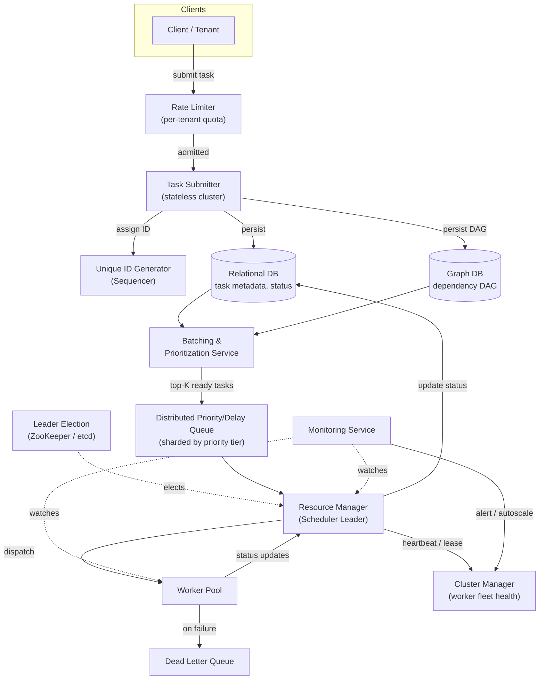

**Component roles (extending the source material):**

| Component | Responsibility | Scaling knob |
|---|---|---|
| Rate limiter | Per-tenant admission control, protects downstream | Token bucket per tenant, sharded by tenant ID |
| Task submitter | Stateless validation + write, no SPOF | Horizontal — add nodes behind LB |
| Sequencer (ID gen) | Globally unique, roughly time-ordered IDs (Snowflake-style) | Partition by node ID bits |
| Relational DB | Structured metadata: status, retries, execution cap | Shard by TaskID or TenantID |
| Graph DB | DAG of dependent tasks, topological ordering | Partition by workflow/DAG ID |
| Batching & prioritization | Pulls ready tasks (dependencies satisfied), ranks by delay tolerance | Runs per-shard, independent workers |
| Distributed queue | Holds top-K ready tasks per priority tier | Sharded by priority/tenant; use delay queue for future-dated tasks |
| Leader election | Elects the active Resource Manager instance | ZooKeeper/etcd, ephemeral node + session lease |
| Resource Manager | Matches queued tasks to free workers (bin packing) | Only the leader does this — followers stand by |
| Cluster manager | Tracks worker liveness via heartbeat, reassigns on failure | Gossip or heartbeat-to-leader |
| Worker pool | Executes task payload in sandbox | Autoscale on resource-to-demand ratio |
| Monitoring | Health checks, alerting, feeds autoscaler | Pull metrics from all of the above |
| Dead letter queue | Holds tasks that exhausted retries | Manual/automated inspection & replay |

**Why a DB *and* a queue (the "Point to Ponder" from the source, answered properly):** The queue is optimized for fast, ordered, ephemeral hand-off to workers — it is *not* meant to be an audit-durable system of record, and most queue implementations either drop messages under certain failure modes or make querying "all pending tasks for tenant X" expensive/impossible. The DB is the durable **system of record** (survives queue crashes, supports rich queries, supports resuming a crashed scheduler by re-reading state); the queue is a **dispatch cache** of "ready to run right now" work. Writing to DB first, queue second, means a crash between the two steps only loses *dispatch speed*, never the task itself — a re-scan of the DB for "waiting but not queued" tasks recovers it.

**Cheat sheet**
- Draw control plane (submitter, RM leader, cluster manager) separate from data plane (workers) — call this out verbally.
- Justify DB *and* queue explicitly: DB = durable system of record, queue = fast ephemeral dispatch structure.
- Mention the RDB/GDB split from the source material, but say GDB is only needed if the interview scope includes dependent tasks / DAGs (Airflow-style); skip it for a pure cron service.
- Resource Manager should be a singleton per shard (leader-elected) — parallel resource managers double-booking the same worker is a classic bug to call out proactively.
- Sequencer should generate roughly time-sortable IDs (Snowflake-style) so DB range scans by "recently created" work well.

---

## 8. Task Lifecycle (State Machine)

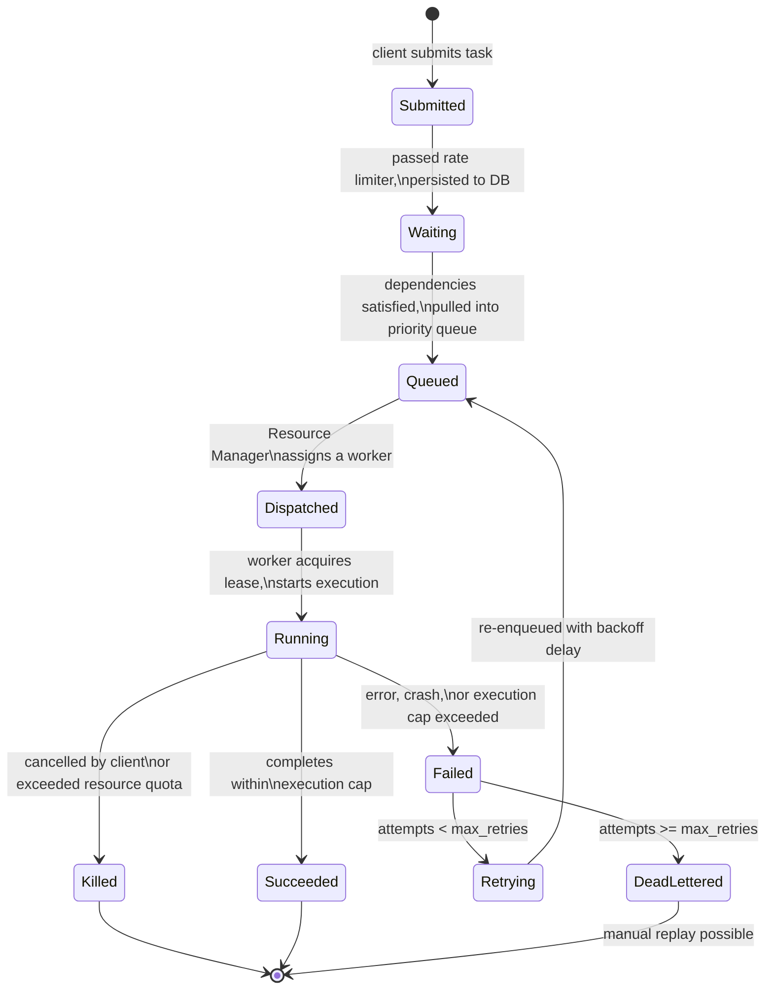

**Cheat sheet**
- "Waiting" (in DB, not yet queued) vs "Queued" (in the dispatch queue) is a distinction most candidates skip — but it's exactly what lets you recover from queue data loss.
- A task's dependents must move from a blocked/pending state to "Waiting" only when *all* upstream dependencies hit `Succeeded` — say this explicitly when covering DAGs.
- `Killed` is a distinct terminal state from `Failed` — killed tasks (cancelled, or over quota) typically should **not** auto-retry; failed tasks should.
- Dead-lettered tasks need a replay path — mention it, even briefly, as an operational necessity.

---

## 9. Deep Dive: Queueing & Prioritization

### Why plain FIFO breaks down
A single FIFO queue treats an urgent security alert the same as a "suggest a friend" batch job. Under load, urgent tasks queue behind a backlog of low-value ones — starvation of the tasks that matter most.

### The delay-tolerance model (from source, formalized)
Every task carries a **delay tolerance** — max acceptable wait before execution. Schedule using **Earliest Deadline First (EDF)**: task with smallest `(delay_tolerance - time_waited)` runs next. This is the same core idea as real-time OS scheduling, applied at datacenter scale.

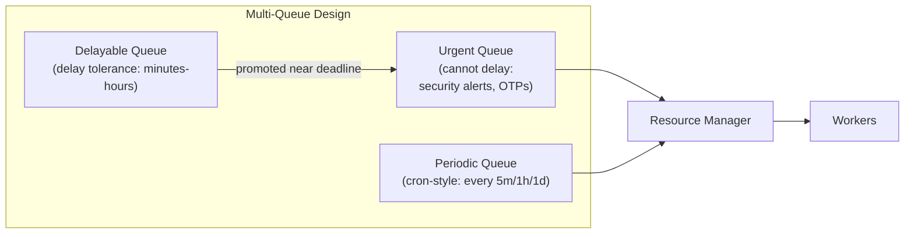

**Anti-starvation rule:** as a task in `Q2` approaches its delay-tolerance deadline, **promote** it into `Q1`. This is the aging technique borrowed from OS schedulers (prevents low-priority starvation) applied to task queues.

### Determining delay tolerance (answering the source's "Point to Ponder")
- Client-specified explicitly (best — e.g., "must run within 2 minutes").
- Defaulted by task *type/category* (e.g., notification=seconds, analytics batch=hours).
- Derived from SLA tier the tenant pays for (premium tenants get tighter default tolerance).

### Priority queue implementation options

| Approach | How | Trade-off |
|---|---|---|
| Redis sorted set (ZSET) | Score = deadline timestamp, `ZRANGEBYSCORE` for due tasks | Simple, fast, but single-node memory bound unless clustered |
| Kafka + multiple topics per priority tier | Separate topic per tier, consumer prioritizes higher tiers | Great throughput, but cross-topic starvation logic is manual |
| Delay-queue via SQS (visibility timeout / delaySeconds) | Native delay up to 15 min; longer delays need re-enqueue loop | Managed, but capped delay window |
| Timer wheel (custom, e.g., Kafka's own internal delayed operation purgatory, or Netty's HashedWheelTimer pattern) | Bucketed by time slot, O(1) amortized insert/expire | Best for *very* high volume delayed scheduling; more code to own |
| Database polling (poll `WHERE next_run_at <= now()` with index) | Simple, durable by construction | Doesn't scale past low thousands/sec without careful sharding; risk of hot-row contention |

### Cron parsing: how "periodic" becomes "waiting" (the algorithm interviewers may ask you to sketch)

A cron expression is 5 fields — `minute hour day-of-month month day-of-week` (Quartz adds a 6th `seconds` field). Each field is one of: `*` (any), a value (`5`), a range (`1-5`), a step (`*/15`), or a list (`1,15,30`).

```
*/15 9-17 * * 1-5   →  "every 15 minutes, 9am-5pm, Mon-Fri"
```

**Next-fire-time algorithm (the part worth whiteboarding):** don't scan minute-by-minute into the future — bubble up field-by-field, same approach Quartz's `CronTrigger` uses:
```
next_fire_time(cron, after_ts):
    candidate = after_ts + 1 minute, seconds truncated
    loop (bounded, e.g. max 4 years to avoid infinite loop on impossible expr like Feb 30):
        if candidate.month not in cron.months: bump to first valid month, reset day/hr/min; continue
        if candidate.day not in cron.days (both dom & dow, OR'd if both restricted): bump day, reset hr/min; continue
        if candidate.hour not in cron.hours: bump hour, reset min; continue
        if candidate.minute not in cron.minutes: bump minute; continue
        return candidate   # all fields satisfied
```
This is O(field count) per bump, not O(minutes until next match) — the difference matters when a task is scheduled "once a year."

A **cron materializer** service runs this function per registered schedule, and when `next_fire_time <= now`, it inserts a new task row (state `Waiting`) and recomputes the *next* `next_fire_time` — recurring schedules are a template that stamps out fresh task instances, never one eternal running record.

```mermaid
gantt
    dateFormat  HH:mm
    axisFormat  %H:%M
    title Cron materialization timeline (every top-of-hour and quarter-hour tick)
    section Materializer
    Job A instance (*/15 * * * *) :a1, 09:00, 1m
    Job A instance                :a2, 09:15, 1m
    Job A instance                :a3, 09:30, 1m
    Job B instance (0 * * * *)    :b1, 09:00, 1m
    section Thundering herd risk
    Everything due on the hour fires together :crit, herd, 09:00, 1m
```

The `herd` bar is the point to call out unprompted: every schedule anchored to a round minute converges at `:00`/`:15` boundaries — this is *why* Kubernetes CronJob and most production schedulers jitter dispatch by a few seconds instead of firing on the exact tick.

**Fair scheduling across tenants** (multiple tenants sharing these same queues) gets its own deep dive — see Section 13, since it's a distinct concern from *priority within one tenant's tasks*.

**Cheat sheet**
- Name EDF (Earliest Deadline First) as the scheduling policy for delay-tolerant tasks — it's the textbook-correct answer.
- Always pair priority queues with an **aging/promotion mechanism** — a priority queue alone starves low-priority work forever under sustained load.
- Distinguish 3 queue categories from the source (urgent / delayable / periodic) and explain how periodic (cron) tasks get materialized into "waiting" instances at each firing time.
- If asked to implement a delay queue at very high scale, mention **timer wheels** as the O(1) data structure of choice over naive sorted-set scans.
- Cron tasks are just periodic tasks whose "next run" is recomputed each time — mention that recurring schedules are re-materialized as new task instances, not one eternal task record.
- Know the next-fire-time algorithm's shape: bubble up field-by-field (month → day → hour → minute), don't linear-scan minutes — a bounded loop guards against impossible expressions (Feb 30).

---

## 10. Deep Dive: Leader Election & Coordination

**Why you need it:** if two Resource Manager instances both think they're in charge, they double-dispatch tasks onto the same worker slot (or double-count capacity). Exactly one instance must hold "the pen" at a time.

### Mechanism (ZooKeeper or etcd)

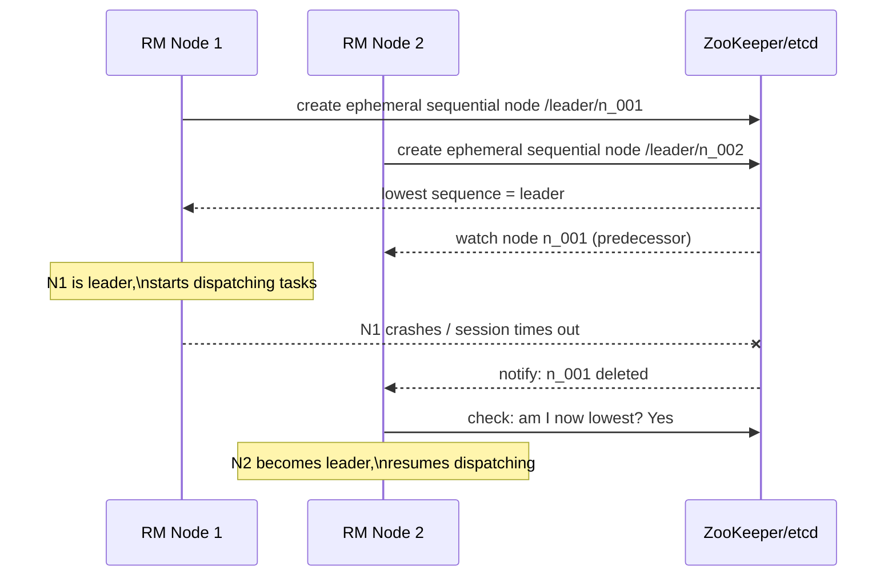

This is the standard **ZooKeeper leader election recipe**: ephemeral sequential znodes, each candidate watches its immediate predecessor (not all nodes — avoids herd effect on failover). etcd equivalent: `campaign()` API built on Raft, using lease-bound keys.

### Split-brain and fencing
Network partition can cause a stale leader to believe it's still in charge after a new leader is elected. Fix: **fencing tokens** — every lease/leadership grant comes with a monotonically increasing token; workers/DB reject writes carrying an older token than the last one seen. This is the same pattern as Chubby/etcd lease fencing described in *Designing Data-Intensive Applications*.

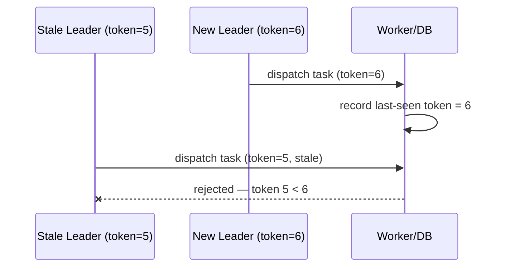

### Alternatives to leader election
- **Sharded ownership, no single leader**: partition tasks by hash(TaskID) into N shards, each shard has its own independent mini-leader (or lock). Reduces blast radius of a single leader failure, better horizontal scale.
- **Lease-per-task instead of leader-per-cluster**: any RM instance can pick up any task, but must first acquire a short-lived distributed lock/lease on that specific TaskID (e.g., Redis `SET NX PX`, or a DB row with `owner + lease_expiry`). This is the "peer-to-peer" style covered in the disambiguation table below.

**Cheat sheet**
- Know the ZK recipe cold: ephemeral sequential znodes, watch-your-predecessor (not watch-everyone).
- Always mention **fencing tokens** when discussing leader election — "how do you handle a stale leader after failover" is a near-guaranteed follow-up.
- State the failover cost in seconds (session timeout dependent, Section 6) and what happens to due work during that gap (nothing lost — it's durable in DB, just delayed).
- Offer the sharded/lease-per-task alternative as a scaling upgrade once asked "what if one leader can't handle dispatch throughput."
- etcd (Raft) is generally preferred in newer designs (Kubernetes uses etcd) over ZooKeeper (Kafka/Hadoop legacy, ZAB protocol) — know both exist, know why K8s picked etcd (simpler ops model, gRPC API).

---

## 11. Deep Dive: Delivery Guarantees, Retries & Idempotency

### The three delivery semantics

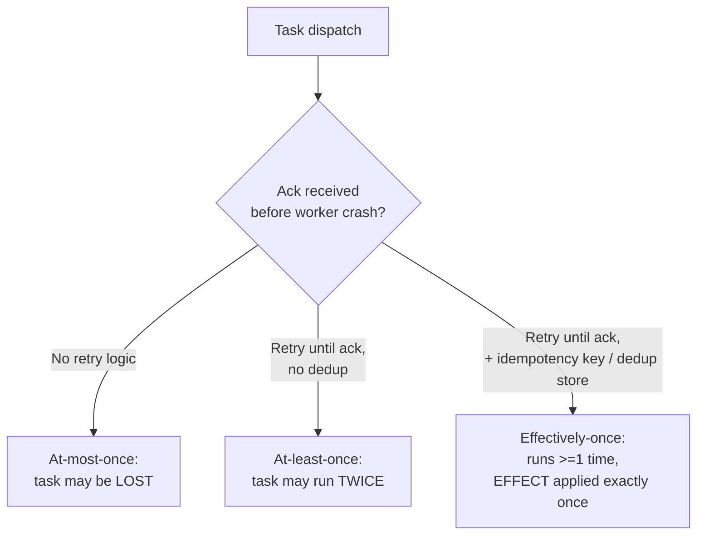

**True exactly-once execution is not achievable across an unreliable network** (this is a FLP/two-generals-problem consequence) — what real systems build is **at-least-once delivery + idempotent processing = exactly-once *effect***. Say this precisely in the interview; it's the single most-checked-for statement on this topic.

### Retry design

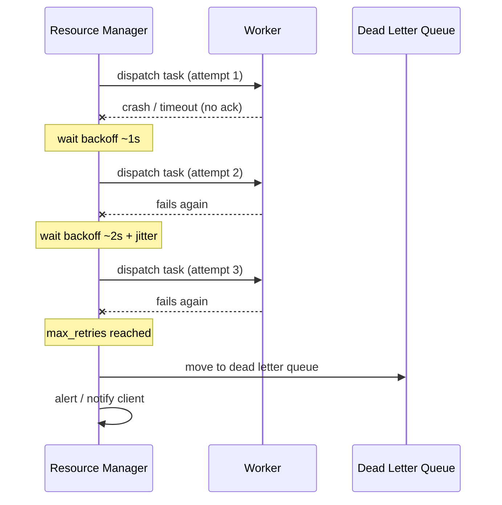

**Backoff formula (memorize):**
```
delay(n) = min(base * 2^n, max_delay) + random_jitter(0, delay(n) * 0.2)
```
Jitter prevents synchronized "thundering herd" retries (the "retry storm" failure mode — see Section 16).

### Idempotency implementation patterns

| Pattern | How it works | Best for |
|---|---|---|
| **Idempotency key** | Client (or scheduler) attaches a unique key per logical operation; server stores `(key -> result)` and short-circuits duplicate requests with the same key | Payment/financial tasks (source's $10 transfer example) |
| **Natural dedup key** | Use a deterministic ID derived from task content (e.g., `hash(video_id + version)`), overwrite instead of insert | Uploads, file processing (source's video upload example) |
| **Upsert / conditional write** | `INSERT ... ON CONFLICT DO NOTHING` or conditional update with version check | State transitions, DB-backed side effects |
| **Compare-and-swap on status** | Worker claims task via `UPDATE tasks SET status='running', owner=me WHERE status='queued' AND id=X` — only one worker's CAS succeeds | Preventing double-dispatch at claim time itself |

### Distributed locking, worked example (preventing double execution)

Say two Resource Manager instances (or two cron-materializer replicas) both wake up and try to claim the same due task at the same instant — without a lock, both dispatch it to a worker, and a "send invoice email" task fires twice.

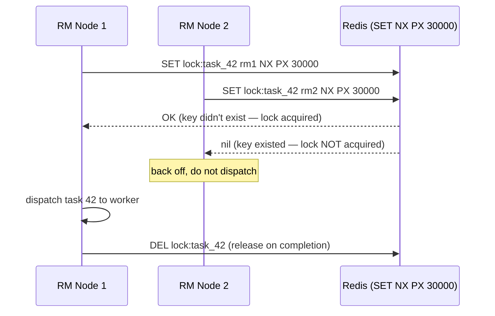

`SET key value NX PX 30000` is atomic in Redis: "set if not exists, expire in 30s." The TTL is the safety net if RM1 dies holding the lock. This is the same shape as the CAS-based DB claim (`UPDATE ... WHERE status='queued'`) from the table above — pick whichever store you've already justified elsewhere in the design (don't introduce Redis *just* for locking if Postgres is already your metadata store).

**Nuance worth stating out loud (the "Redlock debate"):** a single-instance Redis lock is not safe against a leader that stalls past its TTL (GC pause, network partition) and then wakes up believing it still holds the lock — it can dispatch after a *second* node has already acquired the lock and dispatched too. The fix is the same **fencing token** pattern from Section 10 (attach a monotonically increasing token to the lock grant; the worker/DB rejects a stale token) — mention this if asked "is a Redis lock enough," because "it depends on fencing, not just the lock" is the senior-level answer.

**Answering the source's "Point to Ponder" — task that can never finish (infinite loop):** enforce the **execution cap** as a hard resource-level timeout (SIGKILL / container teardown), not an application-level check — you cannot trust the payload to self-terminate. Pair with a monitoring heartbeat: if a worker stops reporting progress within N seconds, treat as dead and reclaim, even without hitting the cap.

**Answering "what happens when the same task fails multiple times":** exhaust `max_retries` with exponential backoff → move to **Dead Letter Queue** → alert the owning team/client → optionally support manual or automated replay after a fix. Never retry forever — that's a resource leak and can mask a systemic outage as "still processing."

**Cheat sheet**
- State plainly: exactly-once *delivery* is impossible over unreliable networks; exactly-once *effect* via idempotency is the achievable, correct goal.
- Give the backoff formula with jitter by name — "exponential backoff with full jitter" is an AWS-blog-famous term, use it.
- Idempotency key vs natural dedup key: keys for client-initiated financial-like operations, natural hash-based keys for content-addressable operations (uploads).
- Execution cap must be enforced by the **infrastructure** (container/cgroup kill), never trusted to application code.
- Always mention Dead Letter Queue as the terminal safety net — a system with unbounded retries is a design smell to call out.
- CAS-based task claiming (`UPDATE ... WHERE status='queued'`) is the simplest anti-double-dispatch mechanism — cheaper to explain than full distributed locks for many designs.
- If you do reach for `SET NX PX` locking, know the failure mode: TTL expiry + a stalled holder = two workers can still believe they hold the lock. Fencing tokens close that gap, a bare Redis lock alone does not.

---

## 12. Deep Dive: Dependency Graph (DAG) Handling

Used when tasks form a DAG (Airflow-style) rather than being fully independent.

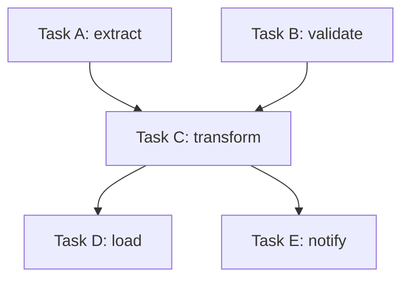

**Design mechanics:**
1. Store the DAG in a **graph database** (or adjacency list in a regular DB — graph DB is a nice-to-have, not mandatory at moderate scale).
2. **Topologically sort** at submission time to detect cycles (reject cyclic DAGs immediately — a cycle means the workflow can never complete).
3. A downstream task enters `Waiting`/ready-to-queue only when **all** upstream parents reach `Succeeded` — track via a **dependency counter** (decrement on each parent's success; zero = ready) rather than re-scanning the whole graph on every event, for O(1) readiness checks.
4. On a parent's terminal `Failed` (post-DLQ), decide **failure propagation policy**: fail-fast (cancel all descendants) vs. best-effort (skip only affected branch) — Airflow supports both (`trigger_rule` concept: `all_success`, `all_done`, `one_failed`, etc.). Mention this configurability — it's a strong signal.

**Cheat sheet**
- Cycle detection at submission time (not at run time) — reject bad DAGs early, cheaply.
- Use a per-node "pending parent count" decremented on each parent completion for O(1) readiness detection, not full-graph re-traversal.
- Name Airflow's `trigger_rule` concept (all_success / one_failed / all_done) as the industry-standard way to express failure propagation policy.
- A DAG scheduler is a strict superset of a plain task scheduler — say this to frame scope: "if there's no dependency between tasks, skip the graph DB entirely."

---

## 13. Deep Dive: Multi-Tenancy & Fair Scheduling

**Why it's a separate concern from Section 9's priority queues:** priority/EDF decides ordering *within* a shared pool of tasks. Fairness decides how much of that pool each **tenant** is entitled to — without it, one tenant submitting 1M low-priority tasks can still starve another tenant's high-priority ones simply by volume, or a "free tier" tenant can crowd out a paying one of equal task priority. This is the classic **noisy-neighbor problem**.

### Max-min fairness / weighted fair queuing, worked example

Give each tenant a **weight** (often tied to SLA tier) and allocate worker capacity proportionally, not equally.

| Tenant | Weight | Share of 1,000 worker-slots/sec |
|---|---|---|
| A (enterprise SLA) | 5 | 5/10 × 1,000 = **500** |
| B (standard SLA) | 3 | 3/10 × 1,000 = **300** |
| C (free tier) | 2 | 2/10 × 1,000 = **200** |

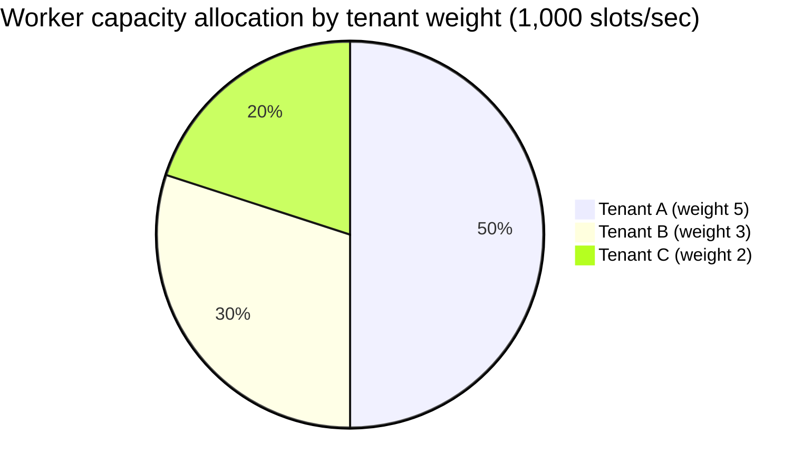

If tenant C only *uses* 50 of its 200 allotted slots, max-min fairness redistributes the unused 150 proportionally among A and B rather than letting it sit idle — this is the same idea as Linux CFS (Completely Fair Scheduler) redistributing CPU `vruntime` slack among runnable processes, and it's a strong analogy to drop in interview: **"treat tenants the way Linux CFS treats processes — fair shares of a resource, unused share reclaimed, not wasted."**

### Enforcement mechanisms
- **Per-tenant token bucket** at the admission/rate-limiter layer (Section 7's `RL` component) — caps burst submission rate, independent of downstream fairness.
- **Per-tenant queue-depth quota** — Resource Manager refuses to dispatch tenant X's Nth-in-flight task past its quota, even if X's tasks are otherwise highest-priority-in-queue.
- **Weighted round robin / deficit round robin across tenant sub-queues** — instead of one global priority queue, keep one queue per tenant and pull from each in proportion to weight (a "deficit counter" per tenant absorbs uneven task sizes).

**Cheat sheet**
- Fairness ≠ equality — allocate by **weight** (tied to SLA tier), not an equal split, and say so explicitly.
- Name the failure mode by its common label: **noisy neighbor**. Interviewers listen for this exact term.
- Drop the Linux CFS analogy — fair share + reclaim-unused-slack is instantly recognizable and memorable.
- Enforce fairness at two layers: admission (token bucket, rejects/delays at the door) and dispatch (per-tenant quota, protects worker slots even for already-admitted work).

---

## 14. Deep Dive: Horizontal Scaling, Worker Partitioning & Backpressure

### Partitioning tasks across a growing/shrinking worker fleet

Naive `hash(TaskID) % N` partitioning breaks the moment `N` changes — adding one worker reshuffles almost every task's assigned owner, causing a mass rebalancing storm. Fix: **consistent hashing** (with virtual nodes for even load) — the same technique DynamoDB/Cassandra use for partitioning.

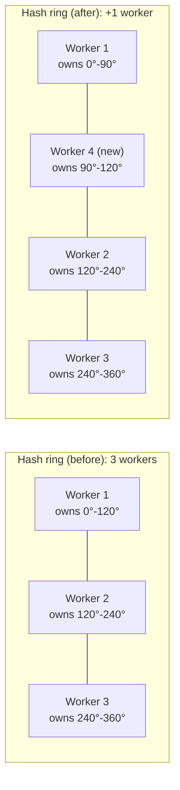

**Worked comparison:** with `mod N` hashing, going from 3 → 4 workers reassigns ~75% of keys. With consistent hashing (100+ virtual nodes per physical worker for even spread), the new worker only claims a slice carved out of its ring neighbors — roughly **1/N of tasks move (~25% here), not 75%**. That's the number to say out loud when asked "how do you scale the worker fleet without a rebalancing storm."

### Backpressure & rate limiting (protecting the system from itself)

Two independent knobs, easy to conflate:
- **Rate limiting** — caps *admission* (client → submitter), typically **token bucket**: bucket of size `B` (burst allowance), refills at `R` tokens/sec (sustained rate); request needs 1 token or is rejected/delayed. Example: `B=100, R=50/sec` lets a client burst 100 tasks instantly, then throttles to 50/sec.
- **Backpressure** — a *downstream* signal (queue depth, DB write latency climbing) that tells upstream components to slow down or shed load, even from already-admitted, already-rate-limited traffic. Rate limiting alone doesn't help if the bottleneck is the metadata DB, not the front door.

**Load-shedding order when backpressure triggers:** shed lowest-priority-tier submissions first (Section 9's `Q3`/periodic, then `Q2`/delayable, before ever touching `Q1`/urgent), then apply harsher per-tenant throttling to tenants already over their fair share (Section 13), only rejecting urgent-tier traffic as an absolute last resort. Autoscale workers on **queue-depth trend**, not raw CPU — CPU can look fine while the queue balloons if tasks are I/O-bound.

**Cheat sheet**
- Consistent hashing (with virtual nodes) is the correct answer to "how do you partition tasks across workers that scale up/down" — quantify it: ~1/N tasks move per resize vs. ~(N-1)/N with naive modulo hashing.
- Rate limiting (token bucket, at admission) and backpressure (queue-depth/latency signal, from downstream) are two different mechanisms — don't conflate them in your answer.
- Shed low-priority load before touching urgent-tier traffic; autoscale on queue-depth trend, not CPU alone.

---

## 15. Deep Dive: Clock Skew, Crash Recovery & Monitoring/Alerting

### Clock skew: don't trust the worker's watch

NTP-synced machine clocks still drift by tens to hundreds of milliseconds (occasionally seconds under NTP failure) relative to each other. If Worker A reports "completed at 10:00:00.000" using its own clock, and the Resource Manager's clock is 400ms behind, comparing those two timestamps directly can produce negative durations or falsely-expired leases.

**The fix, stated simply: never compare two different machines' wall-clock timestamps to make a correctness decision.** Instead:
- Lease/timeout expiry is computed by **one authority** (the RM/leader) using its *own* clock against its *own* receipt time of the last heartbeat — never by trusting a timestamp a worker put in a message.
- Use each machine's **monotonic clock** (`clock_gettime(CLOCK_MONOTONIC)` / Python's `time.monotonic()`) for measuring *durations* (task runtime, lease age) — monotonic clocks never jump backward from NTP corrections, wall clocks can.
- For ordering events across machines where it matters (rare for this topic, common in distributed DBs), reach for logical clocks (Lamport timestamps / vector clocks) rather than wall-clock ordering — worth a one-line mention if pressed, not a deep dive here.

**Worked scenario:** Worker A's clock is 5 minutes fast. It self-reports task completion at what it thinks is `10:05`. If the RM trusted that timestamp against its own `10:00` clock, it would look like the task finished "in the future" or ran suspiciously fast. Correct design: the RM stamps its *own* receive-time on the completion event and ignores the worker-embedded timestamp for any correctness/timeout decision (it's fine to keep the worker's timestamp for display/debugging only).

### Crash recovery: how a dead Resource Manager's in-flight work gets found again

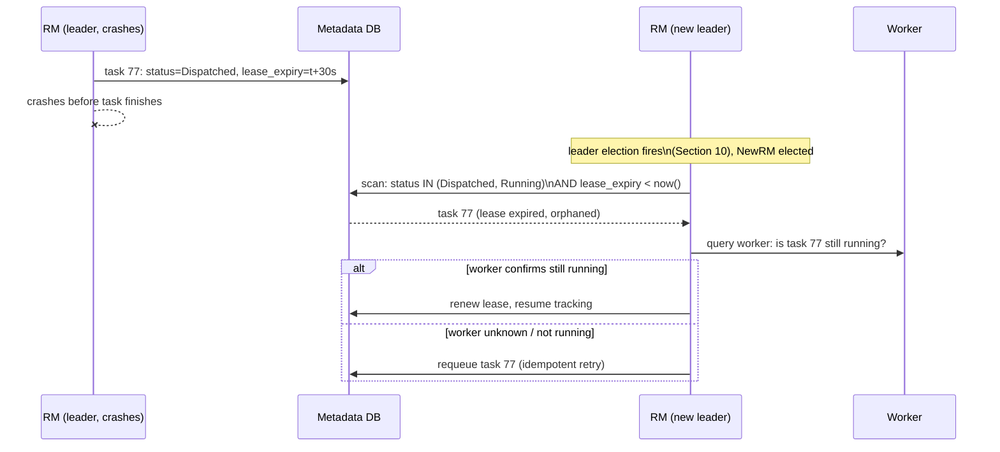

This is the payoff of Section 7's "DB is the durable system of record": recovery is just **"scan for stuck leases,"** not a special-cased crash-recovery subsystem — the same query a health-check cron runs periodically also serves as crash recovery after a leader failover.

### Monitoring & alerting on missed or stuck jobs

| Signal | How to detect | Alert on |
|---|---|---|
| **Missed schedule** | Cron materializer's `next_fire_time` passed but no task row was created (materializer itself was down) | Any miss beyond a `startingDeadlineSeconds`-style grace window (Kubernetes CronJob's actual field name — cite it) |
| **Stuck/zombie task** | `status='Running'` with `lease_expiry < now()` and no heartbeat renewal | Immediately — this is what Section 15's crash-recovery scan also catches |
| **Growing backlog** | Queue depth trending up over a sliding window, not just an absolute threshold | Rate-of-change alert, not just a static "queue > X" — catches slow degradation early |
| **Elevated DLQ rate** | `DLQ inserts / total dispatches` over trailing 5 min | Spike vs. baseline — a sudden jump usually means a downstream dependency is down, not that tasks got individually unlucky |
| **Dispatch latency p99** | Time from `Queued` → `Dispatched` | Regression vs. rolling baseline; a rising p99 is the earliest sign of an overloaded Resource Manager |

**Memory hook — "SLOW" for what to dashboard:**
- **S**tuck leases (zombie tasks)
- **L**ag in dispatch (p99 queued→dispatched)
- **O**verdue schedules (missed cron ticks)
- **W**idening backlog (queue-depth trend, not a static threshold)

**Cheat sheet**
- Golden rule: never let two machines' wall clocks decide a correctness question — one authority's clock, or a monotonic clock for durations.
- Worked answer for "what happens if the leader dies mid-dispatch": new leader scans for expired leases in the DB — same query serves both routine health-checking and crash recovery, no special subsystem needed.
- Missed-schedule detection means comparing "expected next run" to "did a task row get created," not just watching for task-level failures — a materializer outage produces silent misses, not loud failures.
- Alert on **trend** (backlog growing, p99 rising) in addition to static thresholds — static thresholds catch outages, trends catch slow degradation before it becomes an outage.

---

## 16. Bottlenecks & Failure Modes

| Failure mode | Symptom | Mitigation |
|---|---|---|
| **Thundering herd at cron boundaries** | Massive spike of tasks all due at `:00`/midnight | Jittered scheduling (spread within a window), pre-warm worker capacity, stagger cron registration times |
| **Metadata DB hot rows/shards** | One tenant's tasks overload one shard | Shard by `hash(TaskID)` not `TenantID` alone; per-tenant rate limiting upstream |
| **Leader election flapping** | Frequent failovers under GC pauses or network blips | Tune session timeout higher than p99 GC pause; use lease renewal heartbeats, not one-shot checks |
| **Split-brain double dispatch** | Same task runs on 2 workers simultaneously | Fencing tokens (Section 10) + idempotent workers |
| **Retry storm** | Synchronized retries after a transient outage overload recovery | Exponential backoff **with jitter**; circuit breaker to pause retries during known outage |
| **Queue starvation** | Low-priority queue never drains | Aging/promotion policy (Section 9) |
| **Poison message loop** | Task fails deterministically, retried forever, wastes capacity | Max retry cap + DLQ, always |
| **Worker resource leak** | Task exceeds declared resources, starves co-located tasks | Cgroup/container resource caps + kill on breach (performance isolation) |
| **Stuck/zombie task (crash mid-execution)** | Task shows "running" forever, resource never reclaimed | Heartbeat/lease expiry — if worker doesn't renew lease within timeout, treat as dead, requeue |
| **Backlog death spiral** | Queue depth grows faster than drain rate, latency compounds | Backpressure: reject/shed new low-priority submissions before saturating; autoscale workers on queue-depth metric, not just CPU |
| **Cascading DAG failure** | One upstream failure blocks a huge downstream fan-out indefinitely | Explicit failure propagation policy + timeout-based auto-fail of blocked descendants |

**Memory hook — "SPLIT-Q" for the top five failure modes to always mention:**
- **S**tarvation (low priority never runs)
- **P**oison messages (infinite retry loop)
- **L**eader split-brain (double dispatch)
- **I**dempotency violations (double effect)
- **T**hundering herd (cron boundary spike)
- **Q**ueue backlog death spiral (no backpressure)

**Cheat sheet**
- Always bring up thundering herd at cron boundaries unprompted — it's a real, memorable failure mode (this is exactly why Kubernetes CronJob has `startingDeadlineSeconds` and concurrency policy).
- Backpressure (shedding low-priority admission before the system falls over) is a stronger answer than "just add more workers."
- Distinguish transient failure (retry helps) from deterministic/poison failure (retry never helps, cap it) — explicitly naming this distinction is a senior-level signal.
- Zombie/stuck tasks are a lease-expiry problem, not a "the code is buggy" problem — frame it that way.
- Circuit breaker pattern belongs in your retry answer for third-party/downstream dependency failures, distinct from the internal backoff-with-jitter answer.

---

## 17. Key Design Decisions & Trade-offs

| Decision | Option A | Option B | Trade-off |
|---|---|---|---|
| Task assignment model | **Push** (scheduler assigns worker directly) | **Pull** (workers poll queue for work) | Push = lower latency, needs scheduler to know live capacity; Pull = simpler, naturally load-balances, but polling adds latency + wasted empty polls |
| Metadata store | Relational (Postgres/MySQL, sharded) | Wide-column (Cassandra/DynamoDB/Bigtable) | RDB = rich queries, transactions, easier joins for DAG; wide-column = higher write throughput, weaker query flexibility |
| Leader coordination | Single global leader (ZK/etcd) | Sharded ownership, no single leader | Single leader = simple mental model, dispatch throughput ceiling; sharded = higher throughput, more complex ownership/rebalancing logic |
| Delivery guarantee | At-least-once + idempotency | At-most-once (fire-and-forget) | At-least-once = never silently lose work, requires idempotent design; at-most-once = simpler, but risk silent task loss — unacceptable for anything business-critical |
| Queue technology | Kafka (log-based) | SQS/RabbitMQ (traditional message queue) | Kafka = massive throughput, replay, but no native per-message delay/priority (must build on top); SQS/RabbitMQ = native delay & visibility timeout & priority features, lower max throughput |
| Dependency modeling | Graph DB | Adjacency list in RDB | Graph DB = natural traversal/queries for complex DAGs; RDB adjacency list = one less moving part, fine for shallow/simple DAGs |
| Geo-distribution | Single region | Geo-replicated multi-region | Single region = simpler consistency; multi-region = higher availability + lower latency for global tenants, but cross-region coordination cost (leader election across regions is expensive — usually shard by region instead) |
| Retry ownership | Scheduler retries centrally | Worker/task self-retries internally | Central = consistent policy enforcement, visibility; self-retry = flexible per-task logic, but harder to cap globally and observe |

**Cheat sheet**
- Push vs pull is the single most commonly asked trade-off — know the answer: pull is simpler and self-load-balancing (used by Sidekiq, Celery, most queue-based workers); push is lower latency but needs the scheduler to track live worker capacity (used by Borg/Kubernetes scheduler).
- Justify Kafka vs SQS/RabbitMQ by whether you need native delay/priority (SQS/RabbitMQ) or massive throughput + replay (Kafka) — say both exist, pick based on stated scale.
- Multi-region leader election is expensive (cross-region consensus latency) — prefer regional shards each with their own leader over one global leader, and mention this as a scale answer.
- Always tie each decision back to the stated non-functional requirement it serves (don't pick technologies in a vacuum).

---

## 18. Disambiguation: Commonly Confused Term Pairs

### 15.1 At-most-once vs. At-least-once vs. Exactly-once

| | At-most-once | At-least-once | Exactly-once (effect) |
|---|---|---|---|
| Definition | Task runs 0 or 1 times | Task runs ≥1 times | Task's *side effect* applied exactly once, execution may repeat |
| Mechanism | Fire, forget, no retry | Retry until ack | At-least-once delivery + idempotency key/dedup |
| Risk | Silent task loss | Duplicate side effects if not idempotent | None (if idempotency correctly implemented) — but cost is a dedup store |
| Use case | Best-effort metrics/logs | Default for most task schedulers | Payments, video upload, anything with real-world side effects |

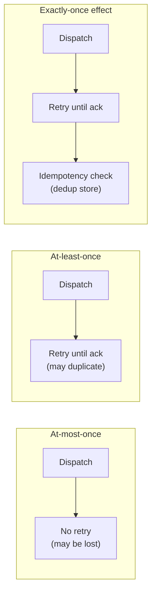

### 15.2 Cron (schedule-driven) vs. Event-driven scheduling

| | Cron / time-driven | Event-driven |
|---|---|---|
| Trigger | Wall-clock time (`0 * * * *`) | External event (file uploaded, message arrives) |
| Predictability | Fully predictable timing | Bursty, unpredictable timing |
| Example | Nightly batch report | Process image the moment it's uploaded |
| Scheduler design impact | Needs a timer/cron-materializer component | Needs an event listener/webhook + same downstream queue/worker machinery |
| Real system | Kubernetes CronJob, `cron(...)` in EventBridge | S3 event notifications, EventBridge event rules |

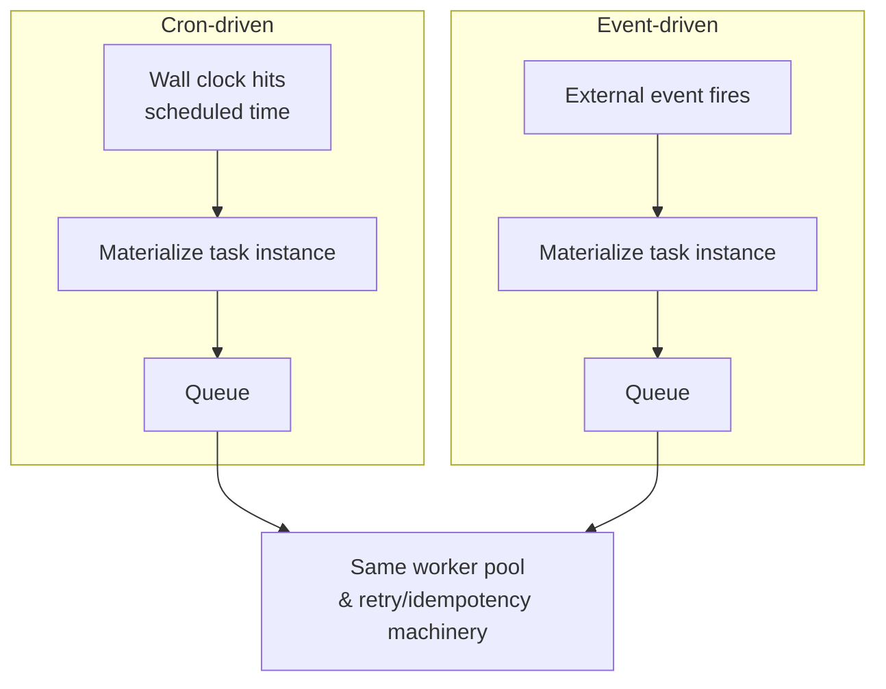
Both converge on the same downstream machinery — the only difference is *what materializes a task instance*.

### 15.3 Leader-follower vs. Peer-to-peer coordination

| | Leader-follower | Peer-to-peer (lease-per-task) |
|---|---|---|
| Who decides dispatch | One elected leader | Any node, coordinating via per-task locks |
| Failure impact | Brief gap during failover (seconds) | No global gap; only affected task's lock holder needs replacement |
| Complexity | Simpler mental model | More complex — every dispatch needs its own lock acquisition |
| Throughput ceiling | Bounded by single leader's dispatch rate | Scales horizontally, no single bottleneck |
| Real system | Kubernetes scheduler (single active), Borg cell master | Distributed cron implementations using per-job locks in Redis/DB |

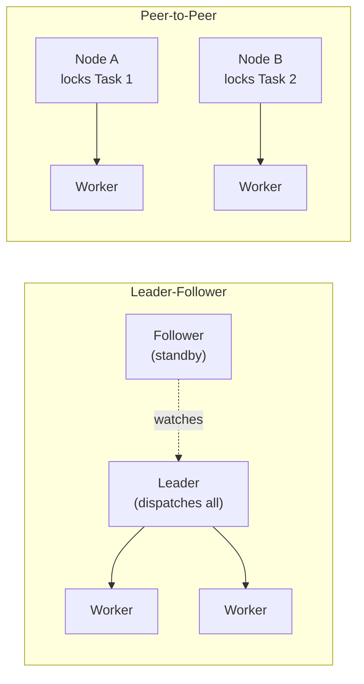

### 15.4 Task queue vs. Message queue

| | Task queue | Message queue |
|---|---|---|
| Payload semantics | "Do this work" — imperative, tied to a specific handler/worker type | "Something happened" — data event, possibly many consumers |
| Consumption pattern | Typically single consumer executes and completes the work | Often pub-sub, multiple independent consumers |
| Built-in features expected | Priority, delay, retries, execution status tracking | Ordering, partitioning, replay, fan-out |
| Example | Celery, Sidekiq, this system's distributed queue | Kafka topic, SNS/SQS, RabbitMQ exchange |
| Overlap | A task queue is often *built on top of* a message queue, adding scheduling semantics on top | — |

### 15.5 Orchestration vs. Choreography (for multi-task workflows)

| | Orchestration | Choreography |
|---|---|---|
| Control | Central orchestrator tells each task when to run (this system's Resource Manager, or Airflow's scheduler) | Each task reacts to events from prior tasks, no central brain (event-driven chain) |
| Visibility | Easy to see whole workflow state in one place | Harder to trace — state is implicit across event trail |
| Failure handling | Central retry/compensation logic | Each service handles its own retry/compensation (sagas) |
| Coupling | Tasks don't need to know about each other, only the orchestrator does | Tasks are coupled to the events they emit/consume |
| Real system | Airflow, Temporal/Cadence workflows, Step Functions | Event-driven microservices reacting via Kafka topics |

**Cheat sheet (for all of Section 18)**
- When asked "is this exactly-once," always answer with the precise framing: delivery ≥1, effect =1, via idempotency.
- Cron and event-driven scheduling share the same downstream pipeline — only the *trigger* differs; say this to show you understand the architecture is trigger-agnostic.
- Prefer leader-follower for simplicity unless asked to scale dispatch beyond one leader's throughput ceiling, then pivot to peer-to-peer/lease-per-task.
- Task queue vs message queue: task queues add scheduling semantics (priority, delay, retry, status) on top of generic message queue primitives — many real task queues (Celery) literally run atop a message broker (Redis/RabbitMQ).
- Orchestration (Airflow/Temporal-style) is the better default answer for this chapter's DAG scheduling — mention choreography only as the contrasting alternative for loosely-coupled event chains.

---

## 19. Real-World References

| System | Approach | Key idea to borrow |
|---|---|---|
| **Facebook Async** | Priority-based distributed task scheduler for billions of async requests/day | Priority tiers + delay tolerance is literally this system's namesake design |
| **Apache Airflow** | DAG-based workflow orchestrator, Python-defined DAGs, central scheduler + executor + metadata DB | `trigger_rule` for failure propagation; DAG-as-code; scheduler polls DB for due DAG runs |
| **Chronos (on Mesos)** | Cron replacement built on Mesos, "distributed and fault-tolerant cron" | Uses Mesos resource offers (framework requests resources, doesn't own workers directly) — good contrast to Borg's model |
| **Kubernetes CronJob** | Controller loop creates a `Job` from a `CronJob` template at each schedule tick | `concurrencyPolicy` (Allow/Forbid/Replace) and `startingDeadlineSeconds` directly solve the thundering-herd/missed-tick problem — name these flags in interview |
| **Google Borg / Omega** | Cluster manager scheduling millions of tasks across cells of tens of thousands of machines; central Borgmaster with replicated Paxos-based state | Two-level scheduling (quick "score and pick" pass + slower feasibility pass); priority + preemption of low-priority batch tasks by high-priority production tasks |
| **AWS Step Functions / EventBridge Scheduler** | Managed state-machine orchestration (Step Functions) + managed cron/one-off scheduling at massive scale (EventBridge Scheduler) | Step Functions = orchestration-as-a-service (Amazon States Language DAG); EventBridge Scheduler = fully managed "create a schedule, we call your target" abstraction — good answer for "would you build or buy?" |
| **Uber Cadence / Temporal** | Workflow-as-code: business logic written as regular code, engine persists execution history and replays deterministically on failure | "Durable execution" — workers can crash mid-workflow and resume exactly where they left off by replaying event history, not by re-running side effects (huge idempotency win) |
| **Quartz Scheduler** (Java) | Classic in-JVM job scheduling library with `Trigger`/`JobDetail`/`Scheduler` model, clustered mode via shared DB row-locking | Good reference for cron-expression parsing and DB-based clustering via `SELECT ... FOR UPDATE` locking pattern — cheap way to explain distributed lock without ZK/etcd |

**Cheat sheet**
- Reach for Borg's **two-level scheduling** (fast filtering pass + slower scoring pass) if asked how to scale scheduling decisions across tens of thousands of machines.
- Reach for Temporal/Cadence's **durable execution / event history replay** model if asked "how do you resume a long-running, multi-step task after a crash without re-running completed side effects" — it's a materially different (and more advanced) answer than simple retry-from-scratch.
- Mention Kubernetes CronJob's `concurrencyPolicy` and `startingDeadlineSeconds` by name — they are literally the productionized answers to "what if the previous run is still going" and "what if we missed the tick because the controller was down."
- If asked "build vs buy," EventBridge Scheduler / Step Functions are the correct "buy" answer for many real interviews — know they exist as managed alternatives.
- Quartz's `SELECT ... FOR UPDATE` clustering is the simplest possible distributed lock explanation if the interviewer wants something simpler than ZooKeeper.

---

## 20. Golden Rules

1. **Durable write before dispatch.** Never let a task exist only in a queue or in a leader's memory — a DB row (or equivalent durable log) must exist first.
2. **At-least-once delivery + idempotent handlers, always.** Don't chase impossible exactly-once delivery; chase exactly-once *effect*.
3. **Separate "when" from "where."** Cron/timer logic (when a task becomes ready) is a different concern from placement logic (which worker runs it).
4. **One writer per task at a time.** Whether via leader election, fencing tokens, or CAS-based claiming — prevent double-dispatch by construction, not by hope.
5. **Every retry loop needs a ceiling.** Max attempts + backoff + jitter + a Dead Letter Queue — no exceptions, ever.
6. **Priority queues starve without aging.** If you add priority, you must add promotion, or low-priority work dies permanently under load.
7. **Enforce resource caps at the infrastructure layer**, not the application layer — never trust task code to self-terminate or self-limit.
8. **Metadata store write QPS, not queue throughput, is usually the real bottleneck** — size it explicitly (lifecycle writes ≈ 3-4x task count).
9. **Never let two machines' wall clocks decide a correctness question.** One authority's clock for timeouts, monotonic clocks for durations — clock skew is a silent double-execution bug waiting to happen.
10. **Fair share beats equal share, and backpressure beats overload.** Weight tenants by SLA tier, not headcount; shed low-priority admission before the whole system falls over.

---

## 21. Master Cheat Sheet

**Opening moves:** clarify (one-shot vs recurring? DAG or independent? delivery guarantee needed?) → functional/non-functional reqs → capacity estimate (tasks/day → tasks/sec peak → queue ops → worker pool via Little's Law → DB QPS at ~3-4x task count → storage).

**Architecture in one line:** Client → Rate Limiter → Task Submitter (stateless) → Sequencer (unique ID) → Metadata DB (durable system of record) [+ Graph DB if DAG] → Batching/Prioritization → Distributed Priority/Delay Queue → Leader-elected Resource Manager → Worker Pool (sandboxed, resource-capped) → status feedback loop → Monitoring/Autoscaler, with a Dead Letter Queue as the terminal safety net.

**Every deep dive should touch:**
- Queueing: multi-tier priority + delay tolerance + EDF + aging/promotion (anti-starvation).
- Coordination: leader election (ZK ephemeral-sequential / etcd Raft) + fencing tokens against split-brain; or peer-to-peer lease-per-task for higher throughput.
- Reliability: at-least-once + idempotency keys/natural dedup + CAS-based claiming + exponential backoff with jitter + DLQ.
- Dependencies (if in scope): DAG stored as graph/adjacency list, cycle-checked at submission, per-node pending-parent counters for O(1) readiness, configurable failure propagation policy.
- Multi-tenancy: weighted fair share (SLA tier, not headcount), per-tenant token bucket at admission + per-tenant dispatch quota, noisy-neighbor as the term to name.
- Scaling & ops: consistent hashing for worker partitioning (~1/N tasks move per resize), token bucket vs backpressure as distinct mechanisms, clock skew handled via one authority's clock + monotonic durations, crash recovery = scan for expired leases (same query as routine health-checking).
- Failure modes to proactively name: thundering herd at cron boundaries, hot-shard metadata writes, leader flapping, retry storms, queue starvation, poison messages, zombie/stuck tasks, backlog death spiral.

**Trade-offs to have an opinion on:** push vs pull dispatch; SQL vs wide-column metadata store; single global leader vs sharded ownership; Kafka vs SQS/RabbitMQ for the queue layer; build (Airflow-style self-hosted) vs buy (EventBridge Scheduler/Step Functions).

**Precise statements that signal seniority:**
- "Exactly-once delivery isn't achievable over an unreliable network — we get exactly-once effect via at-least-once delivery plus idempotency."
- "The metadata store's write QPS is usually the bottleneck, not the queue — each task does 3-4 lifecycle writes, not one."
- "We separate control plane (who decides) from data plane (who executes) so each scales and fails independently."
- "Priority without aging is starvation with extra steps."
- "Resource caps must be enforced by the infrastructure — cgroups/containers — never by trusting the task's own code."
- "Fairness is weighted share plus reclaim of unused slack, the same model Linux CFS uses for processes."
- "Crash recovery isn't a special subsystem — it's the same expired-lease scan a health check already runs."

**Close strong:** map every non-functional requirement (availability, durability, scalability, fault tolerance, bounded wait, delivery guarantee) back to a specific component decision you made, and name one thing you'd build next with more time (e.g., cross-region leader sharding, smarter bin-packing/scoring pass à la Borg, or a Temporal-style durable-execution upgrade for long-running workflows).
