# Sharded Counters — The Story (narrative edition)

> **What this file is.** The reference file, `24-Sharded-Counters-FAANG-Guide.md`, is the one to recite from — the mental model, the APIs, every trade-off table, the capacity math, the master cheat sheet. This file is a second way in: the same material as one continuous story, told in plain language. Engineers at a company keep hitting a wall, patch it, and the patch itself creates the next wall — until we land on the exact same design the reference file documents. The company, **ClipTide** (a short-video app), is fictional. But every wall it hits, and every fix it reaches for, is something a real, named system actually does: Google App Engine's own documented "sharded counters" pattern for Datastore, Twitter's likes/retweets infrastructure, Instagram's visibly-rounded like counts, Reddit's vote counting, YouTube's intentionally-delayed view counts, and the DynamoDB/Cassandra "random suffix on a hot partition key" trick. I'll say clearly, every time, whether a number is a documented fact or just a reasonable stand-in for the story.

**The trigger phrases** for this whole topic: *"design a like/upvote/view counter at scale,"* *"a celebrity's post just got a million likes in a minute — what breaks?,"* or *"how do you count something with a hot key?"* Keep one sentence in your head as you read: **a sharded counter takes one counter that a lock or a single row can't keep up with, splits it into N independent pieces so writes go in parallel, and only pays the cost of putting the pieces back together when someone actually reads the total.** Everything below is just this one idea, getting harder in small, honest steps.

---

## Chapter 1 — The like button that jams at 2,200 taps a second

It's ClipTide, a short-video app. Every video has a row: `videos(id, ..., like_count)`. When you double-tap a video, the server runs one line: `UPDATE videos SET like_count = like_count + 1 WHERE id = X`. For almost every video on the platform this is completely fine — most videos get a handful of likes an hour, and one row can obviously handle that.

Then a 40-follower creator posts a video, "How Soup Saved My Week." Nobody on the team expected it, which is exactly the point: it gets picked up by an algorithm push and pulls **92,000 likes in 4 minutes** `[illustrative — the specific creator and clip are invented, but this shape of surprise virality is exactly the "heavy hitters problem" real platforms like Twitter document — a single post pulling in far more than its account's normal traffic]`. Averaged out that's ~380 writes/sec, but likes don't arrive evenly — they burst, and the burst peaks at **2,200 writes/sec** on that one row.

Every one of those 2,200 writers is queuing for the *same* row lock. A single database row's write ceiling sits in the **low thousands per second at best** before lock-wait time starts dominating — this is a well-documented shape, not just a ClipTide quirk; it's the exact motivating example in Google App Engine's own sharded-counter documentation. At ClipTide's peak, p99 write latency on that row jumps from a normal ~5ms to **600ms+**, and some writes start timing out entirely. The soup video's like button visibly stalls for real users.

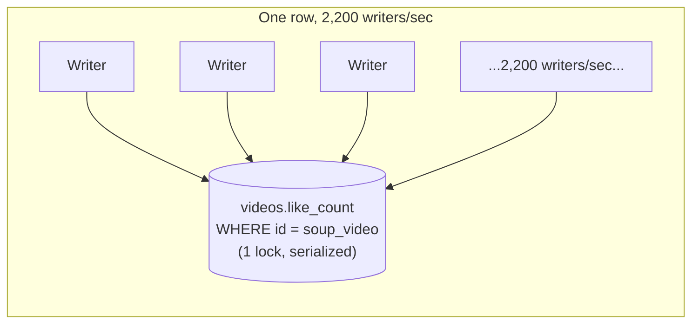

The obvious question: *why does one popular video get to make the like button feel broken for everyone hitting that same row?* Because "the count" is modeled as one number behind one lock — every writer, no matter how unrelated, has to wait in the exact same single-file line to touch it.

**The fix, and the analogy for the rest of this story:** stop making everyone squeeze through one door. Split the counter into many independent sub-counters — **shards** — the way a stadium doesn't run 50,000 fans through one turnstile: it opens a **bank of turnstile gates**, and the crowd spreads across all of them at once. Nobody needs to know the total headcount to walk through their own gate; someone only adds up all the gates' tallies when they actually need the grand total.

**New problem, visible the moment you build it:** how many gates do you open? ClipTide has to decide a shard count *before* it knows whether a given video will flop or go viral — and that guess is about to be wrong.

**How I'd say this in an interview:** "A single counter row is a single lock, so writes serialize no matter how fast the disk or database is — that ceiling is in the thousands per second, not millions. The fix is always the same shape: split the hot counter into N independent shards so writes spread out in parallel, and pay for it later on the read side."

---

## Chapter 2 — Fifty gates, but somebody has to guess the number first

The fix from Chapter 1, concretely: `createCounter(video_id, number_of_shards)` creates `N` physical rows/keys instead of one, and every like does `writeCounter` against just *one* of them, picked at random. ClipTide rolls this out with a simple rule: assign shard count from a creator's follower count at video-creation time — big accounts get more gates up front, small accounts get fewer (no point opening 20 turnstile gates for a video that'll get 12 likes).

For the soup video, though, the creator had 40 followers — ClipTide's "cold tier" — so it got exactly **4 shards**. At the 2,200 writes/sec peak, that's ~550 writes/sec per shard, comfortably under any single-row ceiling. The turnstile trick works: p99 write latency drops back to ~5ms, and the like button stops stalling.

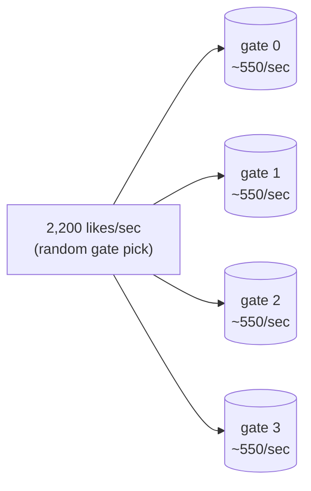

Two days later, the soup video gets picked up by a celebrity's story repost, and the burst gets genuinely bigger — the absolute peak spikes to **8,800 likes/sec** for about ninety seconds `[illustrative]`. It's still the same 4 gates, because nobody resized them. 8,800 ÷ 4 = **2,200 writes/sec per shard** — right back over the single-row ceiling from Chapter 1. The exact same disease, recurring one level down, because the "gate count" was a one-time guess made when the video had 40 followers, and virality doesn't check your follower count first.

The obvious question: *if a guess made at creation time can be wrong by orders of magnitude, why guess once and stop?* Because until now, nothing was watching. The fix isn't a smarter initial guess — it's a shard count that can **grow while the video is still hot**, based on what's actually happening, not what was predicted at birth.

**How I'd say this in an interview:** "Sizing shard count once, at creation, from a heuristic like follower count, is the simple default — Google App Engine's classic example does exactly this with a fixed N. But a fixed guess can be wrong, and when a low-follower account goes viral anyway, you're back to the original hot-row problem, just spread across fewer shards than you actually need."

---

## Chapter 3 — Opening more gates while the crowd is still coming through

The fix: don't fix shard count at creation and forget it — monitor **per-shard** write QPS, and when it crosses a threshold, open more gates *live*. ClipTide's rule, matching the standard shape of this fix: if a shard's QPS goes above **70% of its ceiling**, compute a new target shard count — `ceil(current_QPS / per-shard_ceiling) × safety margin` — and add that many new shards to the video's shard list.

For the soup video: 4 shards, each hitting ~2,200/sec against a ~2,000/sec ceiling — that's over 70% and climbing. New target: `ceil(8,800 / 1,500) × 1.5 ≈ 9` shards, so ClipTide widens from 4 to 9. Crucially: this widening only changes where **new** writes go. Every one of the 4 original shards keeps its already-accumulated total exactly as it is — a shard is just a number, there's no "identity" tied to it that needs migrating, unlike resharding a normal keyed dataset.

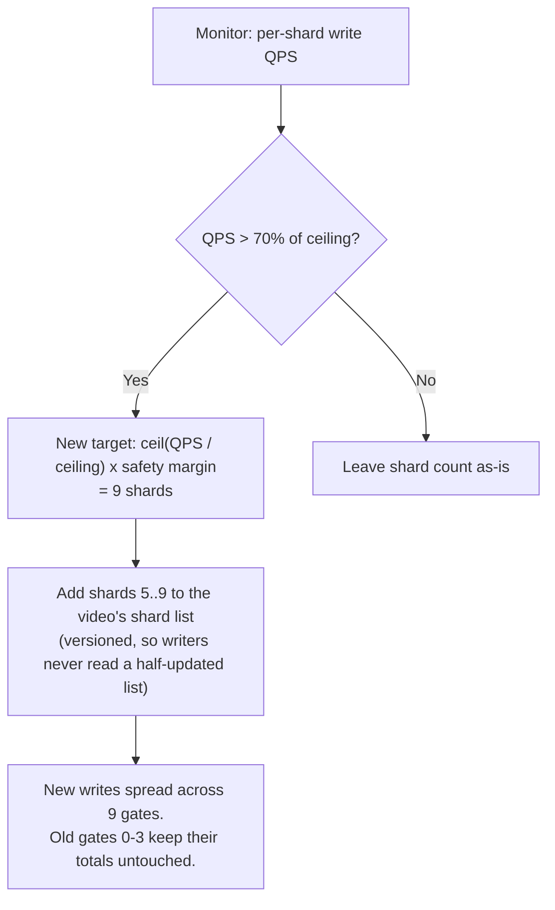

This closes the "guessed wrong at birth" problem — the gate count now breathes with real traffic instead of a one-time prediction. **New problem, a layer down:** even with 9 gates open and total traffic well within capacity, one specific gate can still end up doing far more work than its siblings — not because the *overall* prediction was wrong, but because the *rule for picking a gate* is unfair.

**How I'd say this in an interview:** "Fixed shard count mispredicts; adaptive shard count reacts to live per-shard QPS instead of a one-time guess. And the reason widening is cheap is that a shard holds no identity-bearing data to migrate — you're only ever changing where *future* writes land, never touching what's already been counted."

---

## Chapter 4 — The gate everyone's funneled into because the sign is wrong

ClipTide's original shard-picker used `hash(user_id) % num_shards` — deterministic, so the same user always lands on the same shard. That sounds harmless, but ClipTide's user-ID distribution isn't perfectly uniform, and on the soup video specifically, this hash clusters an outsized slice of the app's most active likers onto **shard 7**. Worked number: with 9 shards evenly loaded, each should see ~980 writes/sec at the 8,800/sec peak — but shard 7 alone is measured at **4,900 writes/sec**, roughly **5x** its siblings, while the other 8 gates sit comfortably under load.

The obvious question: *didn't we just fix this exact problem?* Not quite — Chapter 3 fixed "the total guess was too low." This is a different bug: the total capacity is fine, but the *rule for choosing a gate* isn't spreading traffic evenly, so one gate quietly becomes a smaller version of the original hot row.

The fix, same shape as before, applied recursively: switch shard selection from a hash that happens to cluster, to **pure random selection** — `shard_id = random.randint(0, N-1)` — which converges to near-uniform load once you have enough shards, precisely because it has no structure for traffic to accidentally cluster around. Then rebalance shard 7 the same way Chapter 3 widened the whole set: add more gates, cut new writes over to the wider list, and leave shard 7's already-accumulated total exactly where it is.

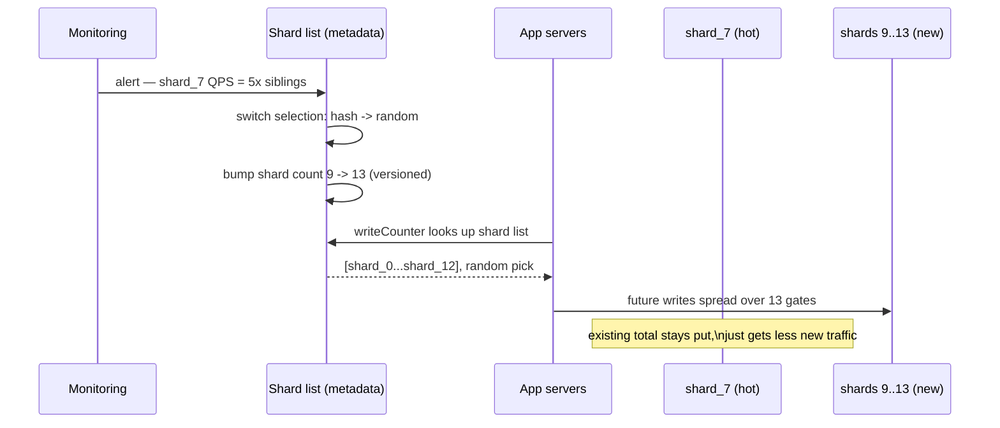

This is the second-order version of the exact same disease from Chapter 1 — a hot key inside what was supposed to already be the fix for hot keys. Naming it out loud ("this can recreate itself one level down if selection isn't fair") is exactly the kind of depth an interviewer is listening for.

**How I'd say this in an interview:** "Sharding fixes the entity-level hot key, but a bad selection strategy can create a second-order hot key *inside* the shard set itself — the fix is the same idea applied recursively: detect it by watching per-shard QPS, not total QPS, switch to a fairer selection rule like random, and rebalance the same additive way — widen and cut over, never migrate."

---

## Chapter 5 — Adding up 30 numbers on every single page load

Writes are solved. But the soup video is now genuinely famous — ClipTide's app shows the live like count on every page view, and the video is getting **10,000 page views/sec** at its peak (people replaying it, sharing it, scrolling past it in feed). Every one of those page loads calls `readCounter(video_id)`, and the naive read implementation sums **all 30 shards** (it's since grown that far) on every single call.

Worked number: 10,000 reads/sec × 30 shards summed per read = **300,000 shard-reads/sec**, generated purely to compute a total that a person is going to glance at for half a second. That's more load than the 8,800 writes/sec peak that started this whole story — the fix for the write problem just created a *bigger* problem on the read side.

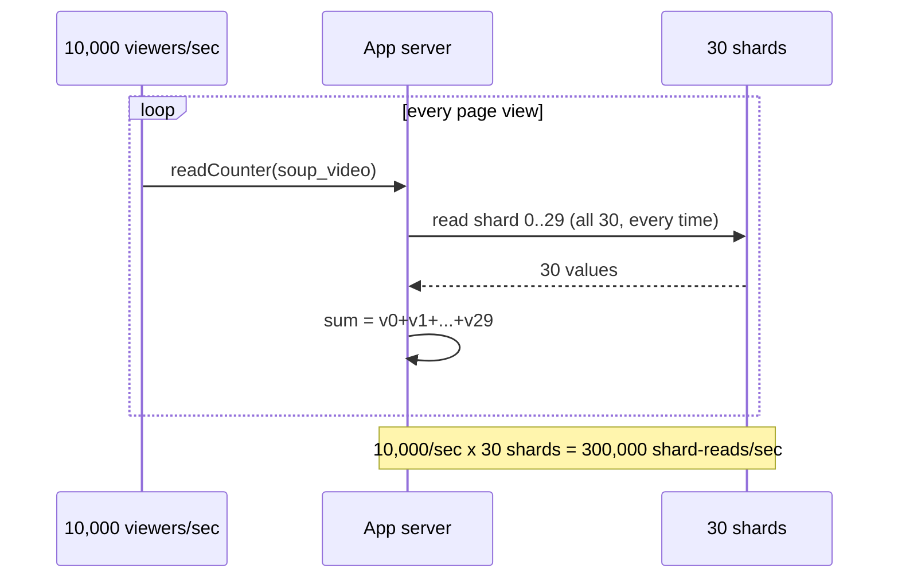

The obvious question: *does every single page view really need a fresh, live sum?* No — a like count doesn't need to be exact to the millisecond; it needs to look right to a person scrolling past. The fix: stop summing on every read. Compute the sum periodically in the background, cache it, and let reads hit the cache.

**How I'd say this in an interview:** "Fan-out-on-read scales linearly with shard count and read QPS — 30 shards times 10,000 reads/sec is 300,000 shard operations just to render a number nobody's checking precisely. That number is exactly what justifies adding a cache — I'd derive it rather than just assert 'we need caching.'"

---

## Chapter 6 — The number on the screen is always a little bit old, on purpose

The fix: a background job sums all 30 shards every **2 seconds** and stores the result in a cache; page views read the cached value instead of summing live. Worked number: the background job costs 30 shard-reads every 2 seconds — **15 shard-reads/sec** — versus the 300,000/sec from Chapter 5. That's a reduction of roughly **20,000x**, at the cost of the displayed count being up to 2 seconds stale.

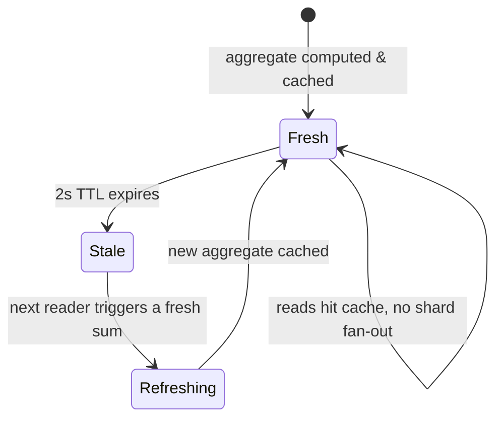

Two seconds is fine for a normal video. It is *not* fine for the soup video mid-burst: at 8,800 writes/sec, 2 seconds of staleness means the displayed number can lag the real one by **~17,600 likes** during the burst window — visible enough that a user liking the video and refreshing might see the count barely move. ClipTide's fix, layered on top: invalidate the cache after a write-count threshold too, not just a time TTL — so a bursting video refreshes its cache more often *because* it's bursting, not on a flat clock. On top of that, they add **stale-while-revalidate**: a reader always gets the cached value instantly, and if it's past due, a background refresh kicks off without making that reader wait for the fan-out sum.

**New problem, worth naming out loud rather than hiding:** this is now a permanently approximate number. It is never going to be *exactly* right at the instant you read it — and that has to be a stated product decision, not a bug someone discovers later. This is exactly why Instagram and YouTube visibly round or intentionally delay their displayed counts — it's the same trade-off, shipped in production, not a theoretical concern.

**How I'd say this in an interview:** "A flat TTL bounds staleness by time, which under-serves a suddenly-bursting counter — write-count-triggered invalidation bounds it by volume instead, and stale-while-revalidate means readers never pay the fan-out cost directly. Either way, I'd say the staleness bound out loud as a number, like '≤2 seconds,' because it's a product decision, not an implementation detail to bury."

---

## Chapter 7 — The like that gets undone, and the shard that goes negative

ClipTide's shard scheme so far silently assumes every write only ever goes *up* — but people double-tap to like, then immediately un-like, all the time. Worked number: on a random sample of ClipTide's traffic, roughly **5%** of like actions are followed by an unlike within the same session `[illustrative]`. The naive `increment(shard_id)` call has no way to express "actually, undo that" — it can only add.

The fix: every write already picks a shard the same way (random); it just carries a **signed delta**, `+1` for like or `-1` for unlike, applied to whichever shard was picked. The global sum still comes out correct even though any *individual* shard's running total can legitimately dip — that's fine, because nobody reads one shard's value on its own.

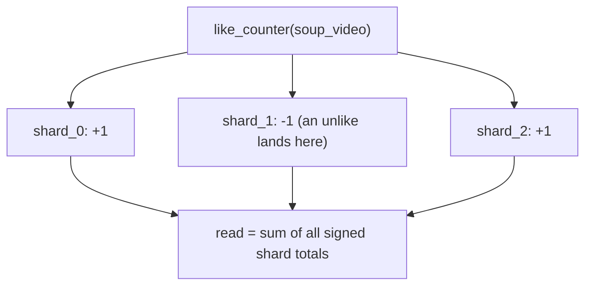

This works for a single app writing through one coordinated path. But ClipTide is also rolling out **edge caching regions** where a like or unlike can be accepted at the edge with no immediate coordination back to a central shard router. Under that setup, a plain signed increment can race with itself in ways that are hard to reason about. The upgrade: **PN-counter-lite** — keep two tallies per shard, `P` (likes) and `N` (unlikes), and compute the displayed value as `ΣP − ΣN`. An unlike never decrements `P`; it only increments `N`. Every operation becomes append-only, which makes it safe to retry blindly with zero coordination — the same idea a CRDT PN-Counter uses, just without the full multi-region machinery yet.

**New, honest problem:** a dropped write — a retry that double-fires the increment but whose matching decrement never lands — makes the displayed count quietly drift away from the truth over time, and nothing about the shard math catches that on its own. The mitigation isn't clever math, it's a boring **reconciliation job**: recompute the true sum from an authoritative event log on a slow cadence (hourly/daily) and correct the cached aggregate — the same idea as an accounting reconciliation run.

**How I'd say this in an interview:** "A naive sharded counter assumes increment-only, but likes get undone, so writes need a signed delta from day one. For coordination-free writes I'd go further, to a P/N split where undo only ever adds to a second tally — append-only, safe to retry — and I'd still run a periodic reconciliation against a source-of-truth log, because a lost write will drift the count no matter how clever the shard math is."

---

## Chapter 8 — Redis is fast, until the box restarts

ClipTide stores shard values in Redis — `HINCRBY counter:soup_video shard_id 1` — because a single Redis instance handles roughly **80,000-100,000+ ops/sec per core**, an order of magnitude past anything a durable database row can do, which is exactly why it's the default choice for hot shard storage. Reads and writes both feel instant.

Then a routine Redis box restart during a deploy wipes an in-memory instance that hadn't been configured with persistence — and every shard value it was holding for three still-hot videos, including the soup video, resets to zero. This is the exact same failure shape as Chapter 1 of the *messaging-queue* version of this story: fast and in-memory is not the same thing as durable, and a crash doesn't ask permission first.

The fix: keep Redis for the hot write/read path — it's not going anywhere, it's simply too fast to give up — but add a periodic flush of the aggregated total to a **durable** store, Cassandra in ClipTide's case, matching the same Redis-for-shards / Cassandra-for-durable-aggregate split the reference guide's source material actually uses. Redis crashes now only cost you the seconds of writes since the last flush, not the whole counter's history.

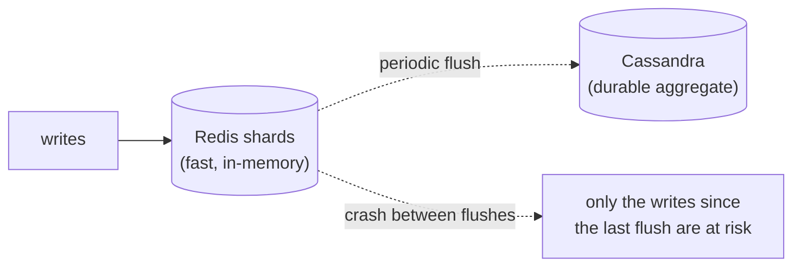

Once that flush loop exists, ClipTide notices it can push the read-cost win from Chapter 6 even further: instead of only summing shards on a timer, have every shard write also nudge a **running aggregate** key directly — "write-behind." Reads then hit that single pre-computed number, no summing at all, ever, on the read path. It's cheaper than even the cached-aggregate model. The cost: it's a *second* write per increment, and if that nudge is ever lost (a crash between the shard write and the aggregate nudge), the running total drifts from the true sum — the exact same drift problem from Chapter 7, just with a new cause. The same fix applies: periodic reconciliation against the real shard sum, on a slow cadence.

**How I'd say this in an interview:** "Redis buys roughly two orders of magnitude of write throughput over a durable row, but in-memory means a crash can lose it — so I'd flush the aggregate to a durable store periodically, and only accept the last few seconds of writes as at-risk. Write-behind aggregation is the next lever after that — cheapest possible reads — but it's a second write path that can drift, so it still needs the same reconciliation habit."

---

## Chapter 9 — The lookup you forgot was on the hot path too

Every single write to the soup video starts the same way: "which shards does this counter even have?" — a lookup against a metadata store (`counter_id → shard_count → shard locations`). ClipTide initially puts this in the same relational database as everything else. At 8,800 writes/sec on one video, that's **8,800 metadata lookups/sec** hitting a small, rarely-changing table — and it turns into its own miniature version of Chapter 1's problem: a "small" lookup table becomes a hot row, purely because it sits, unnoticed, in the critical path of every write.

The fix is the least surprising one in this whole story: cache it. `counter_id → shard list` changes maybe once every few minutes (only when Chapter 3 or 4's rebalancing triggers), so it's an extremely cache-friendly value — put it in Redis/Memcache next to the shards themselves, and the 8,800/sec lookup load turns into a nearly-free in-memory read plus an occasional cache refresh when the shard list actually changes.

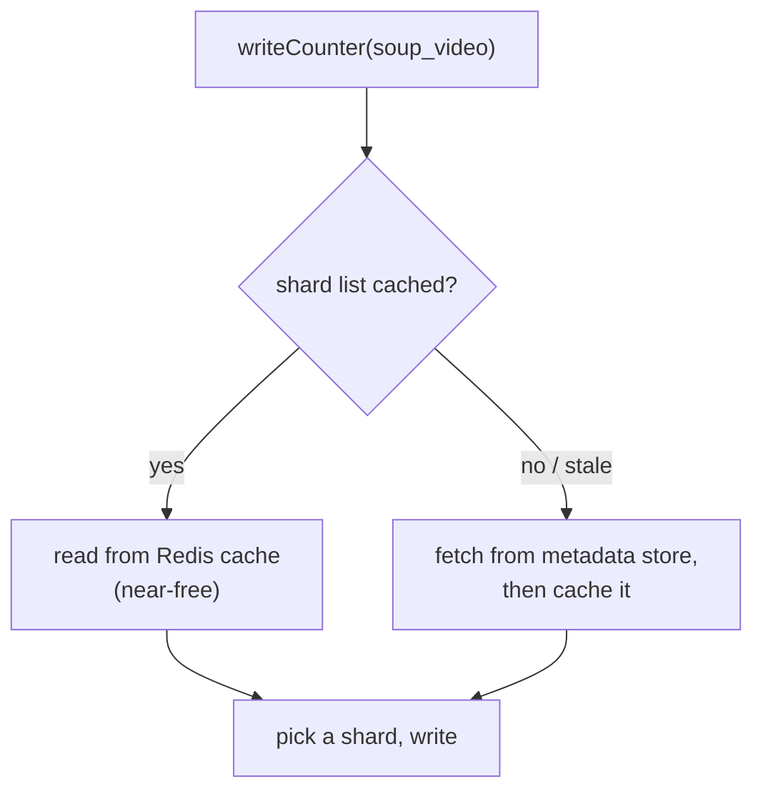

The lesson is a familiar one by now: any lookup that runs on every write is a hot path by definition, whether it "feels" hot or not, and it deserves the exact same caching instinct as the counter it's serving.

**How I'd say this in an interview:** "The counter-to-shards mapping is itself a read on every write, so it needs the same aggressive caching as everything else on the write path — it's an easy thing to forget precisely because it looks like small, boring metadata."

---

## Chapter 10 — When "close enough" isn't actually close enough

Everything so far assumed the product is fine with an approximate, eventually-consistent count. One day, a different team asks ClipTide's counter infra to power **creator payouts** — a video's total watch-time-weighted engagement score feeds directly into how much money a creator gets paid that month. Now "close enough" is genuinely unacceptable: an approximation that shorts a creator, or overpays one, is a real financial problem, not a cosmetic UX one.

The obvious question: *do we just make sharded counters exact, then?* No — the whole reason they're fast is that reads never lock all the shards before summing; forcing that would mean re-introducing serialization, which is exactly the bottleneck this entire story exists to remove. The honest answer is: **use a different tool** for this specific requirement, not a stricter version of this one.

Two different "wrong tool" moments show up, and they're easy to conflate in an interview, so it's worth being precise about which is which:

- **Need an exact number, but writes come from many regions with no central coordinator.** This is where **CRDTs** — G-Counters and PN-Counters, the mathematically rigorous cousin of Chapter 7's PN-counter-lite — actually belong. Real implementations exist in Redis's CRDT mode and in Riak. Unlike a sharded counter's approximate snapshot-sum, a CRDT merge is provably, exactly correct on convergence, because the merge operation (take the max per-node tally) is commutative, associative, and idempotent by construction — no coordinator required, no snapshot timing question at all.
- **Need to answer a genuinely different question.** "How many *unique* people watched this video" is a **distinct-count** question, which sharded counters were never built to answer — that's **HyperLogLog** (Redis's `PFADD`/`PFCOUNT`), which estimates cardinality in about **12KB** regardless of scale, at roughly **0.81% error**. And "what are the top trending sounds on the app right now" is a **frequency-over-huge-cardinality** question — that's **Count-Min Sketch** territory, used for heavy-hitter/Top-K detection, which Reddit-style systems layer on top of straightforward vote counters to get a "hot" ranking score.

```mermaid
quadrantChart
    title Counting tools: coordination needed vs. what's being answered
    x-axis Needs coordination --> No coordinator needed
    y-axis Answers "sum" --> Answers something else
    quadrant-1 Distinct/frequency, decentralized
    quadrant-2 Sum, decentralized (CRDT)
    quadrant-3 Sum, coordinated (sharded counters)
    quadrant-4 Distinct/frequency, coordinated
    "Sharded counters": [0.2, 0.15]
    "CRDT (G/PN-Counter)": [0.85, 0.2]
    "HyperLogLog": [0.55, 0.8]
    "Count-Min Sketch": [0.5, 0.85]
```

ClipTide's actual answer for creator payouts: don't touch the live like-counter path at all. Compute payout-relevant totals from an authoritative append-only event log, on a batch cadence, with real transactional guarantees — exactly the golden rule the reference guide states directly: sharded counters are the wrong tool for money, full stop, reach for a single authoritative writer or a proper transaction instead.

**How I'd say this in an interview:** "Sharded counters trade exactness for write throughput, on purpose — so the moment a requirement genuinely needs exactness, the fix isn't a stricter sharded counter, it's a different tool: CRDTs if you need exact convergence with no coordinator, HyperLogLog if the real question is distinct count not sum, Count-Min Sketch if it's frequency over a huge key space. Naming which one applies, instead of forcing sharded counters to do a job they were never built for, is the signal an interviewer is listening for."

---

## Where the story actually lands

```mermaid
flowchart LR
    A["Ch1: one row, one lock\n(2,200 writes/sec jams it)"] -->|"fixes: parallel writes\nbreaks: shard count is a guess"| B["Ch2: fixed shards"]
    B -->|"fixes: absorbs current load\nbreaks: guess is wrong when it re-surges"| C["Ch3: adaptive shard count"]
    C -->|"fixes: total capacity\nbreaks: one gate still gets unfair traffic"| D["Ch4: fair selection + rebalance"]
    D -->|"fixes: writes\nbreaks: reads now sum N shards every time"| E["Ch5: fan-out read cost"]
    E -->|"fixes: nothing yet\nneeds: a cache"| F["Ch6: cached aggregate + staleness bound"]
    F -->|"fixes: read cost\nbreaks: undo/unlike wasn't modeled"| G["Ch7: signed delta / PN-counter-lite"]
    G -->|"fixes: correctness\nbreaks: in-memory storage isn't durable"| H["Ch8: Redis + durable flush + write-behind"]
    H -->|"fixes: durability\nbreaks: the shard-lookup itself is hot"| I["Ch9: cache the metadata too"]
    I -->|"fixes: the write path\nbreaks: some requirements aren't a fit at all"| J["Ch10: CRDT / HyperLogLog / Count-Min Sketch"]
```

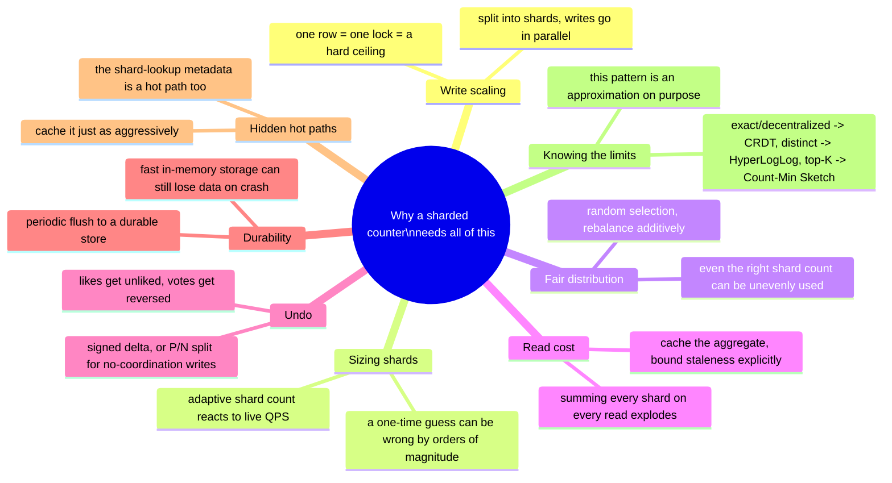

Every real interview question about counting a hot key sits somewhere on this chain. The skill isn't reciting all ten chapters — it's stopping where the stated requirements say to stop. A "design a like button" question might reasonably stop around Chapter 6. A question that mentions money, payouts, or "must be exact" should send you straight to Chapter 10's decision, not further sharding.

---

## Pacing note

**If this is 60 seconds inside a bigger question:** say the turnstile-bank line — split the hot counter into N shards so writes go in parallel, sum them on read — then say "I'd cache that sum with a bounded staleness window, support signed deltas for undo, and flag if this needs to be exact, because then it's the wrong tool entirely." That's the whole shape in one breath.

**If this is the whole 15-20 minute focus:** walk the chapters in order — why one counter row breaks, sharding it, why a fixed guess at shard count fails and adaptive sizing fixes it, why even a correctly-sized shard set can develop an unfair hot shard, why fan-out reads explode and caching fixes it with a stated staleness bound, why undo needs a signed delta, why in-memory storage needs a durable flush, why the shard-lookup metadata is a hot path too, and finally when this pattern is flatly the wrong tool. Don't walk all ten unprompted — follow wherever the interviewer's questions actually point, and use the skipped chapters as your "if I had more time" closer.

---

## Active recall — no answers, test yourself cold

1. What's the one-sentence reason a sharded counter exists at all?
2. Why does a single counter row's write ceiling stay in the thousands/sec no matter how fast the underlying disk is?
3. What's the concrete failure with picking shard count once, at creation, from a heuristic like follower count?
4. What's the actual difference between what adaptive shard count (Chapter 3) fixes and what fair selection (Chapter 4) fixes?
5. Why does growing a shard set never require migrating any data, unlike resharding a normal keyed dataset?
6. Walk through the exact math that shows why fan-out-on-read explodes at high read QPS, and what fixes it.
7. What's the difference between a fixed TTL, a write-count-triggered invalidation, and stale-while-revalidate?
8. Why isn't a plain increment enough once unlikes/unvotes exist, and what are the two levels of fix?
9. Why can write-behind aggregation drift even when nothing crashes, and what's the standard mitigation?
10. Why is the counter-to-shard-list metadata lookup itself a hot path, even though it looks like small, boring data?
11. Name the three "wrong tool" signals from Chapter 10 and which alternative each one points to.
12. If an interviewer says "this counter has to be exact, no exceptions," what do you say next?

*Spaced repetition: test this list today, again in 2-3 days, again in a week.*

---

## Grill me — adversarial follow-ups

**Q1: "Why not just add a database index or a faster disk instead of sharding the counter?"**
Because the bottleneck isn't disk speed, it's the lock — every writer serializes on the same row no matter how fast the underlying storage is. A faster disk raises the ceiling a little; sharding removes the shared lock entirely by giving writers independent things to write to.

**Q2: "If sharded counters are eventually consistent, how is that different from just having a buggy counter?"**
It's a deliberate, bounded trade, not a bug — the reference guide is explicit that you never lock all shards before reading, because summing is inherently a snapshot-in-time approximation. The difference from "buggy" is that the staleness is bounded and stated out loud, like "≤2 seconds," and the product has explicitly signed off on that bound.

**Q3: "You picked random shard selection — isn't hash-based selection strictly better since it's deterministic?"**
Not for this use case — determinism is exactly what caused Chapter 4's hot-shard bug, because a hash can cluster unevenly across a real, non-uniform user-ID distribution. Random selection has no structure to cluster around, so with enough shards it converges to near-uniform load, which is the property you actually want here.

**Q4: "Why widen the shard count instead of just moving some load off the hot shard to an existing one?"**
Because a shard has no identity-bearing data to move — it's just a number — so "widen and let new writes route differently" is strictly cheaper than migrating anything. The old shard's accumulated total simply stops growing as fast; nothing needs to be copied or merged.

**Q5: "Doesn't caching the aggregate just move the hot-key problem to the cache key instead of the counter row?"**
It changes the shape of the load, but not into the same failure — a cache read is O(1) and doesn't contend with anything, unlike a write lock. What it does introduce is staleness, which is why the design has to pick and state a TTL or write-count threshold rather than pretending the cache is free.

**Q6: "If write-behind aggregation can drift, why use it over just caching the periodic sum?"**
Because at extreme read QPS, even a cache-hit fan-out-sum-then-cache cycle has a cost on the write side of the aggregation job — write-behind removes that entirely by keeping a running total updated inline. You accept a small drift risk in exchange for the absolute cheapest possible read, and you bound the drift with periodic reconciliation, the same fix used for lost decrements.

**Q7: "Why is a lost decrement or a lost write-behind nudge dangerous, if the count is already approximate anyway?"**
Staleness and drift are different failure modes — staleness self-corrects the moment the next refresh runs, but a lost write never gets counted again on its own; the error is permanent until something actively re-derives the true value. That's exactly why reconciliation against an authoritative log is a recurring fix in this story, not staleness tolerance.

**Q8: "Isn't a PN-Counter-lite just a worse, home-grown CRDT — why not use a real CRDT from the start?"**
For a single app-server-mediated write path, a real CRDT's guarantees are more machinery than the problem needs — PN-counter-lite gets you append-only, retry-safe writes without a CRDT-aware storage layer. The moment writes genuinely come from multiple regions with no shared coordinator, that's exactly the signal to upgrade to a real CRDT, not a reason to have started with one.

**Q9: "How would you even detect you need any of this before a video goes viral and breaks?"**
Watch per-key write QPS and per-key lock-wait/p99 write latency, not just system-wide averages — a system-wide average completely hides one row getting hammered while everything else is idle. The soup video's spike would show up as a single counter_id's write QPS and p99 latency both spiking in isolation, well before the whole system's aggregate metrics move at all.

**Q10: "Given this whole story, if someone says 'design a view/like counter' cold, where do you start?"**
Establish the skew first — ask whether one entity can plausibly get disproportionate traffic, and get a rough peak number, because uniform load doesn't need any of this. Then walk forward only as far as the stated requirements demand: sharding and a cached read for a typical like-counter question, decrements and durability if they push on correctness, and CRDT/HyperLogLog/Count-Min Sketch only if they name a requirement that's actually a different problem.

---

## Cheat sheet — one line per stop on the story

- **Single counter row**: one lock, one queue of writers — ceiling is in the thousands/sec, not millions, no matter the hardware.
- **Fixed shard count**: splits the write path into N independent gates — but it's a one-time guess made before you know if the entity will go viral.
- **Adaptive shard count**: monitors per-shard QPS and widens live when it crosses a threshold — additive, never migratory, because a shard holds no identity to move.
- **Fair selection (random over hash)**: prevents a second-order hot shard from forming inside an otherwise correctly-sized shard set — detect it by watching per-shard QPS, not total QPS.
- **Fan-out read cost**: summing every shard on every read scales linearly with both shard count and read QPS — the number that justifies adding a cache.
- **Cached aggregate + staleness bound**: O(1) reads instead of O(N); bound staleness with a TTL, a write-count trigger for bursty entities, or stale-while-revalidate so readers never block.
- **Signed delta / PN-counter-lite**: undo (unlike, unvote) needs a delta or a P/N split from day one — a lost write causes permanent drift, fixed only by periodic reconciliation against a source-of-truth log.
- **Redis shards + durable flush**: in-memory storage is fast but not crash-proof — periodically flush the aggregate to a durable store so a Redis restart only risks the last few seconds of writes.
- **Write-behind aggregation**: cheapest possible reads via a running total nudged on every write — trades in a second write path that can drift, same reconciliation fix applies.
- **Cache the metadata too**: the counter-to-shard-list lookup runs on every write, so it's a hot path by definition even though it looks like small, boring metadata.
- **Knowing the limits**: sharded counters trade exactness for throughput on purpose — exact + no coordinator needs a CRDT, distinct-count needs HyperLogLog, frequency/top-K over huge key spaces needs Count-Min Sketch, and none of this belongs anywhere near money.
- **The meta-lesson**: every fix in this story buys one property (write parallelism, correct sizing, fair load, cheap reads, correctness under undo, durability, a fast metadata path, or the right tool for exactness) by spending a different one — say the trade in the same sentence you propose the fix.
