# Sharded Counters — FAANG System Design Interview Guide

> **Enhancement notes:** This pass added (1) an explicit Requirements Clarification (functional + non-functional) subsection and a Data Model subsection under §3, (2) an architecture-evolution walkthrough — v1 single row → v2 fixed-N shards → v3 adaptive shards + write-behind cache — under a new §5.0, (3) an adaptive shard-count decision flowchart under §6.1, (4) a 3-way "exact sharded vs HyperLogLog vs in-memory batching" comparison table under §6.5, and (5) a compact "if X → then Y" recall table under §15. It also tightens a couple of dense run-on sentences (§6.6, §8) for plain-language clarity. Everything else — mental model, playbook, capacity math, disambiguation tables, failure modes, golden rules — was already solid and is left untouched. New material is marked with a 🆕 in its heading.

> Building block. Not a full system — a technique you slot into "design X at scale" whenever X has a number that gets hammered by concurrent writes: likes, views, votes, impressions, rate-limit counters, inventory counts.

---

## 1. Mental Model

**One doorbell, one visitor at a time. A stadium turnstile bank, 50 gates, one crowd.**

A single counter is a single row/variable protected by a lock (or a single DB row's write throughput ceiling). Every writer queues behind it. A **sharded counter** splits that one counter into `N` independent sub-counters ("shards"), scatters writes across them in parallel, and **sums them up only when someone reads**.

```
Hot counter (BAD):           Sharded counter (GOOD):
                              
  1,000,000 writers            1,000,000 writers
        │                            │
        ▼                    ┌───────┼───────┐
   [ counter ]                ▼       ▼       ▼
   (1 lock, serialized)   [shard0] [shard1] [shard N]
                          (parallel, no shared lock)
                                │       │       │
                                └───────┴───────┘
                                   read = Σ shards
```

Trade you're making: **you move cost from the write path to the read path.** Writes become cheap and parallel; reads become an aggregation (fan-out + sum, or a cached rollup).

### Interview cheat-sheet — Mental Model
- Say it in one line: "shard the hot row so writes parallelize; pay for it on reads by aggregating or caching."
- It's a **write-scaling** pattern, not a storage engine — it sits on top of whatever DB/cache you already have.
- Core tension: **more shards = faster writes, slower/more expensive reads.**
- It only matters for **skewed** key access (a few counters get massive traffic) — uniform load doesn't need it.
- Analogy for interviewers: toll booths (many lanes to reduce congestion) vs. bank teller queue count.

---

## 2. Interview Playbook — When and How to Bring This Up

### Signal phrases that mean "they want sharded counters"
- "Design a **like/upvote/heart** button at scale"
- "Design a **view counter** for YouTube/TikTok videos"
- "Design **Reddit vote counting**"
- "How do you count something with a **hot key/hot partition**?"
- "A celebrity's post gets 1M likes in a minute — what breaks?"
- "Design a **rate limiter**" (counter increments per window, same hot-key problem)
- "Design **trending topics / Top-K**" (needs fast increment + periodic aggregation)
- "Design an **ad impression/click counter**"

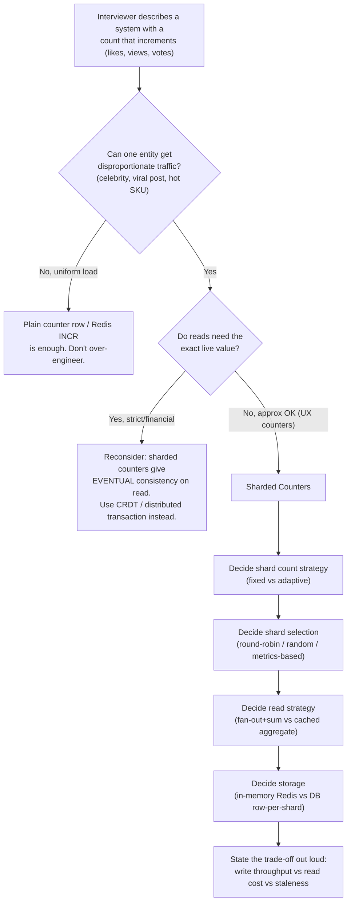

### Interview cheat-sheet — Playbook
- Don't jump to sharded counters immediately — first establish **why** a single counter fails (compute the QPS, show lock contention/row hotspot).
- Always state the **CAP-ish trade**: you're trading read freshness for write scalability.
- Mention it's the same fix used for **hot partitions** in Cassandra/DynamoDB/Bigtable — ties your answer to real infra knowledge.
- If the interviewer pushes on "exact count," pivot to CRDTs or a single authoritative sequencer — know when NOT to use this pattern.
- Close the loop: mention how you'd **detect** you need this (metrics: per-key write QPS, lock wait time, p99 write latency spike on one key).

---

## 3. What It Is

A **sharded counter** (aka **distributed counter**) replaces one logical counter with `N` physical sub-counters ("shards"). Writers pick one shard (by hash, round-robin, random, or load-aware routing) and increment/decrement *that* shard only. Readers sum all shards to get the total, either on-demand (fan-out read) or from a periodically-refreshed cached aggregate.

```
createCounter(counter_id, number_of_shards)   // one logical counter → N physical rows
writeCounter(counter_id, action_type)         // picks 1 shard, ±1
readCounter(counter_id)                       // Σ over all shards (or cached Σ)
```

Google popularized this exact pattern in the **App Engine Datastore sharded counter** doc (the canonical reference every interviewer has half-read) — same three operations, same shard-count trade-off.

### 🆕 3.1 Requirements Clarification (say this out loud first)

**Functional requirements**
- Increment / decrement a named counter (like, unlike, view, vote).
- Read the current (approximate) total for a counter.
- Support many independent counters — one per post/video/tweet — not just one global counter.
- (Optional, ask the interviewer) Per-user "have I already liked this" state — usually a separate table, not part of the counter itself.

**Non-functional requirements**
- **Write throughput:** must absorb bursty, skewed traffic — one viral post can generate tens of thousands of writes/sec while most posts generate almost none. Design for the peak on the hottest entity, not the system-wide average.
- **Read latency:** sub-10ms for a count display — it renders on every page view of the post.
- **Read consistency:** eventual is acceptable. Product tolerance is usually "a few seconds of staleness on a like/view count is fine." Say this out loud and get the interviewer to confirm it; if they say "must be exact," this pattern is the wrong tool (see §10.2).
- **Durability:** counts must survive a node restart/crash — in-memory shards need periodic flush to a durable store.
- **Availability over strict consistency:** prefer serving a slightly-stale count over failing the read.

Close the clarification with one sentence: *"I'll optimize for write availability and read latency, and accept eventual consistency on the displayed count — tell me if that's not acceptable for this use case."*

### 🆕 3.2 API Design (fleshed out)

The three logical operations above, as they'd actually look over HTTP/RPC:

| Operation | Signature | Notes |
|---|---|---|
| Create | `POST /counters` `{counter_id, entity_type, initial_shard_count}` → `201` | Called once when the entity (tweet/post/video) is created. |
| Increment / decrement | `POST /counters/{counter_id}/writes` `{delta: +1 \| -1, dedupe_key?}` → `202 Accepted` | `dedupe_key` (e.g. `user_id:action`) lets a downstream job detect duplicate/replayed writes. Async-friendly — the caller doesn't need the new total back. |
| Read | `GET /counters/{counter_id}` → `{counter_id, value, as_of_timestamp}` | `as_of_timestamp` makes the staleness explicit to the caller instead of hiding it. |

Returning `202` (not `200` with the new value) on write is a deliberate choice: the caller shouldn't expect the response to reflect a fresh global total, because summing on every write would defeat the whole point of sharding.

### 🆕 3.3 Data Model

Three things need storage: the shard values, the metadata mapping a counter to its shards, and (optionally) the cached aggregate.

```
counters_metadata                 shard_values (Redis hash, one per counter)
─────────────────────             ─────────────────────────────────────────
counter_id      PK                key:   counter_id:shard_id
entity_type                       value: int64 (or two int64s, P and N — §5.5)
shard_count
created_at
last_resharded_at

aggregate_cache (Redis, TTL'd)
───────────────────────────────
key:   counter_id:aggregate
value: {sum, computed_at}
ttl:   T seconds (§5.4)
```

`counters_metadata` is small — one row per entity — but read on every write, so cache it aggressively (golden rule #9). `shard_values` is the hot path: N keys per counter, written constantly. `aggregate_cache` only exists if you chose the cached-rollup read strategy (§6.3) over pure fan-out.

### Interview cheat-sheet — What it is
- Three APIs to name: `createCounter`, `writeCounter`, `readCounter` — mention metadata store tracks `counter_id → shard_count → shard locations`.
- A shard is just a normal row/key; nothing fancy — the cleverness is entirely in routing + aggregation.
- Distinguish from a **cache**: sharded counters change how writes are *distributed*; a cache changes how reads are *served*. You typically use both together.
- It's a horizontal-scaling technique for **one hot key**, not for scaling the whole dataset (that's regular sharding/partitioning).

---

## 4. Why It Exists — The Hot Key / Heavy Hitters Problem

Real systems have power-law traffic: a tiny number of posts/tweets/videos get disproportionate interaction ("heavy hitters problem"). Example from source material: Twitter averages ~6,000 tweets/sec (360K/min, ~500M/day), and a single celebrity tweet can pull in **millions of likes** within minutes.

If likes for that tweet are `UPDATE tweets SET like_count = like_count + 1 WHERE id = X`:

- Every writer contends for the **same row lock** (or same partition key in Cassandra/DynamoDB/Bigtable).
- Lock-wait time grows **non-linearly** with concurrency — past a threshold, the system spends more time acquiring the lock than doing the increment.
- In distributed stores this shows up as a **hot partition**: one partition absorbs all the traffic while the other N-1 sit idle, and you can't fix it by adding more nodes (the key still maps to one partition).

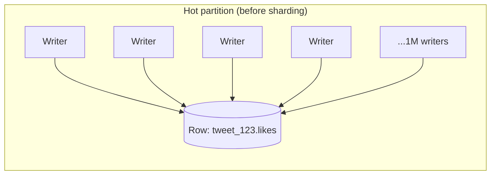

### Concrete before/after: one viral tweet

**Before (single row):** Tweet `id=9876` (a buzzer-beater clip) pulls 80,000 likes in 3 minutes — ~444 writes/sec sustained, bursting to ~2,000 writes/sec. Every write runs `UPDATE tweets SET like_count = like_count + 1 WHERE id = 9876`. A single MySQL row tops out around 1,000-2,000 writes/sec before lock-wait dominates — at the 2,000/sec peak, p99 write latency jumps from ~5ms to 400ms+, and writes start timing out.

**After (20 shards, random selection):** The same 2,000 writes/sec peak scatters across 20 shard rows — each shard sees ~100 writes/sec, nowhere near any single-row ceiling. p99 write latency stays at ~5ms. The total work is unchanged; what changed is that no single lock queue absorbs all of it.

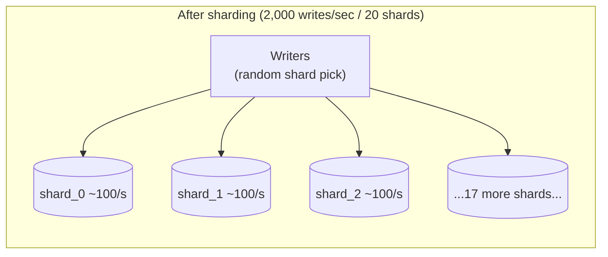

### Interview cheat-sheet — Why
- Name the problem explicitly: **"heavy hitters problem"** and **"hot partition / hot key"** — interviewers listen for this vocabulary.
- Root cause is **lock contention** (single-node) or **partition-key skew** (distributed store) — both are variants of the same disease.
- Quantify it: at 100K writes/sec on one MySQL row, you are nowhere close (MySQL row ≈ hundreds to low-thousands writes/sec with locking overhead) — this is the number that justifies the whole design.
- The fix is always the same shape: **spread the write, concentrate the read** (aggregate/cache).

---

## 5. How It Works Internally

### 🆕 5.0 Architecture Evolution: v1 → v2 → v3

Walk an interviewer through this progression out loud — it shows you didn't jump straight to the complex answer.

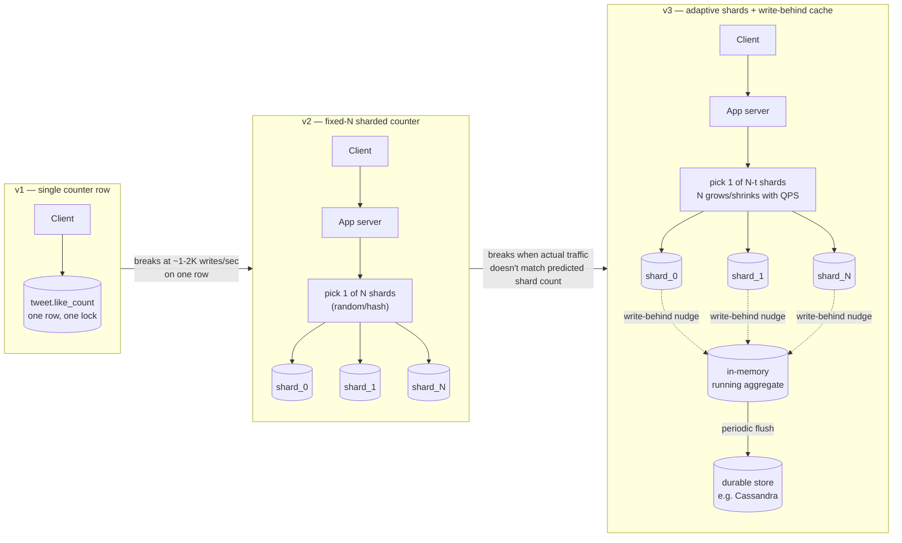

- **v1** works fine until one entity gets hot — then it's a single lock, single row, hard ceiling (§4).
- **v2** fixes the write bottleneck but bakes in a guess (`number_of_shards` chosen at creation, §5.1). A wrong guess means an under-provisioned hot shard, or wasted read fan-out if you over-shard.
- **v3** adds two things on top of v2: the shard count itself reacts to live write-QPS (§6.1, adaptive), and each shard write also nudges an in-memory running total (write-behind, §6.3) so reads almost never need to fan out. The periodic flush to a durable store is just for crash-recovery, not for serving reads.

Each arrow in the diagram is a concrete "what broke" — that's the story to tell, not just the end state.

### 5.1 Counter creation

```
createCounter(counter_id, number_of_shards)
```
- Called when the entity is created (e.g., tweet posted) — one call may spin up **multiple** counters: like counter, reply counter, retweet counter, view counter (if it has video).
- `number_of_shards` is decided *at creation time* from predictive heuristics (see §7 capacity estimation): follower count, historical virality, whether the post is public/protected, whether it contains trending hashtags.
- Metadata (`counter_id → shard_count → shard → node mapping`) lives in a fast KV store (Redis/Memcache in the source's design): key = counter_id, value = list of shard IDs/locations.

### 5.2 Write path

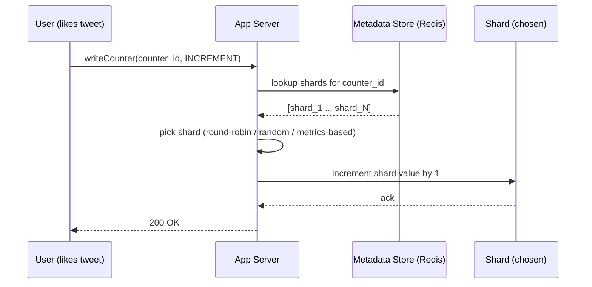

Shard-selection pseudocode:
```python
# Random selection — simplest, good default
shard_id = random.randint(0, num_shards - 1)
increment(counter_id, shard_id)

# Hash-based (deterministic, good if you need the same
# writer to often hit the same shard, e.g. per-region rollups)
shard_id = hash(user_id) % num_shards
increment(counter_id, shard_id)

# Round-robin (per-server local counter, simple, assumes uniform request cost)
shard_id = next(round_robin_cycle)
increment(counter_id, shard_id)
```

### 5.3 Read / aggregation path

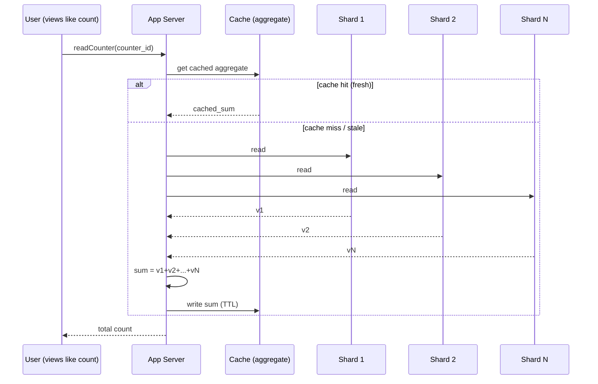

Key design point from the source material: **do not lock all shards before summing.** Summation is inherently a **snapshot-in-time approximation** — by the time you report the value, writes have already changed it. This is fine for like/view counts; it is *not* fine for money.

### 5.4 Cache staleness lifecycle

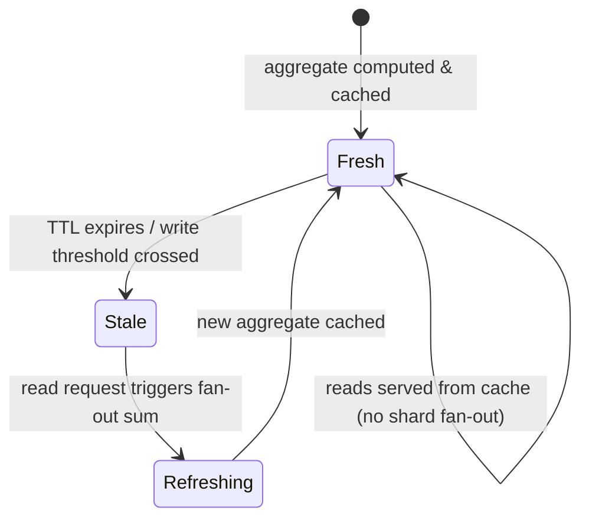

**Invalidation strategies, ranked by how most systems actually pick:**
- **Fixed TTL** (default answer): cache the aggregate for `T` seconds; on expiry, the next reader triggers a fresh fan-out sum. Staleness bound is one number you can quote (`T=2s`).
- **Write-count-triggered**: invalidate after N writes have landed since the last refresh instead of after T seconds — bounds staleness by *volume*, which matters more than time for a bursting viral post (2 seconds can mean 200,000 more writes).
- **Hybrid (stale-while-revalidate)**: always serve the cached value; if it's past TTL, kick off an async refresh in the background instead of blocking the reader on the fan-out. Readers never pay fan-out latency — they occasionally see slightly-more-stale data during the refresh window.

Lead with fixed-TTL, then volunteer write-count-triggered as the upgrade for bursty entities — it shows you know *why* a flat TTL can under-serve a suddenly-hot counter.

### 5.5 Handling Decrements (Unlike / Unvote)

Naive sharded counters assume monotonic increment — but likes get unliked, upvotes get reversed. Two ways to handle it:

1. **Signed delta on the same shard scheme** (what most systems do): `writeCounter` takes `delta = +1` or `-1` instead of an implicit increment. Shard is picked the same way (random/hash); the signed delta is applied to that shard. The global sum still comes out correct even though an individual shard's running total can dip.
2. **PN-Counter-lite** (CRDT-flavored, for writes hitting multiple nodes with no coordination): keep two tallies per shard — `P` (likes) and `N` (unlikes) — displayed value = `ΣP − ΣN`. A "reversal" increments `N`, it never decrements `P`. This makes every operation append-only and safe to retry, at the cost of double the storage.

```python
def write_counter(counter_id, delta):           # delta = +1 (like) or -1 (unlike)
    shard_id = random.randint(0, num_shards - 1)
    bucket = "P" if delta > 0 else "N"
    redis.hincrby(f"{counter_id}:{bucket}", shard_id, 1)

def read_counter(counter_id):
    p = sum(redis.hvals(f"{counter_id}:P"))
    n = sum(redis.hvals(f"{counter_id}:N"))
    return p - n
```

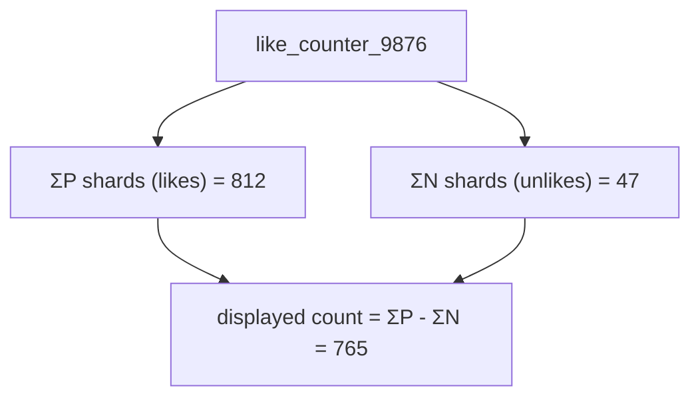

Worked example: a user double-taps to like then immediately unlikes the same tweet. Both writes land on (possibly different) shards; the aggregate converges to the correct net value with no coordination between the two writes.

**Watch for drift:** a lost decrement (dropped write, a retry that double-fires the increment but the matching decrement never lands) makes the displayed count creep away from truth. Mitigation: periodic reconciliation — recompute the true sum from an authoritative event log/join table on a slow cadence (hourly/daily) and correct the cached aggregate, the same idea as an accounting reconciliation job.

### Interview cheat-sheet — How it works
- Draw the write path as **fan-out on write, fan-in on read** — this one phrase captures the whole architecture.
- Say explicitly: reads are **periodic aggregation + cache**, not "sum on every request" — that's the scalability lever on the read side.
- Never say "lock all shards then sum" — call out that this is intentionally an eventually-consistent read.
- Metadata store (counter_id → shards) is itself a hot-ish read path — cache it (Redis/Memcache), don't hit a relational DB per write.

---

## 6. Types / Variants

### 6.1 Shard-count strategy: Fixed vs. Adaptive

| | Fixed shard count | Adaptive (dynamic) shard count |
|---|---|---|
| How decided | Set once at `createCounter` time from heuristics (followers, post type) | Monitored and resized based on live write-QPS feedback |
| Pros | Simple, predictable read cost | Matches real traffic; avoids over/under-provisioning |
| Cons | Wrong prediction = hot shard (too few) or wasted read cost (too many) | Needs a monitoring/rebalancing system; resharding is nontrivial (in-flight writes, moving totals) |
| Real-world | Google App Engine's classic example uses a fixed `N` | Twitter-style systems for viral content need this — a nobody's tweet can go viral in minutes |

**Memory hook — "F.A.T." shard strategies: F**ixed, **A**daptive, **T**iered (start with few shards, add more as write-QPS crosses thresholds — a hybrid of the two).

#### 🆕 Adaptive shard-count decision flowchart

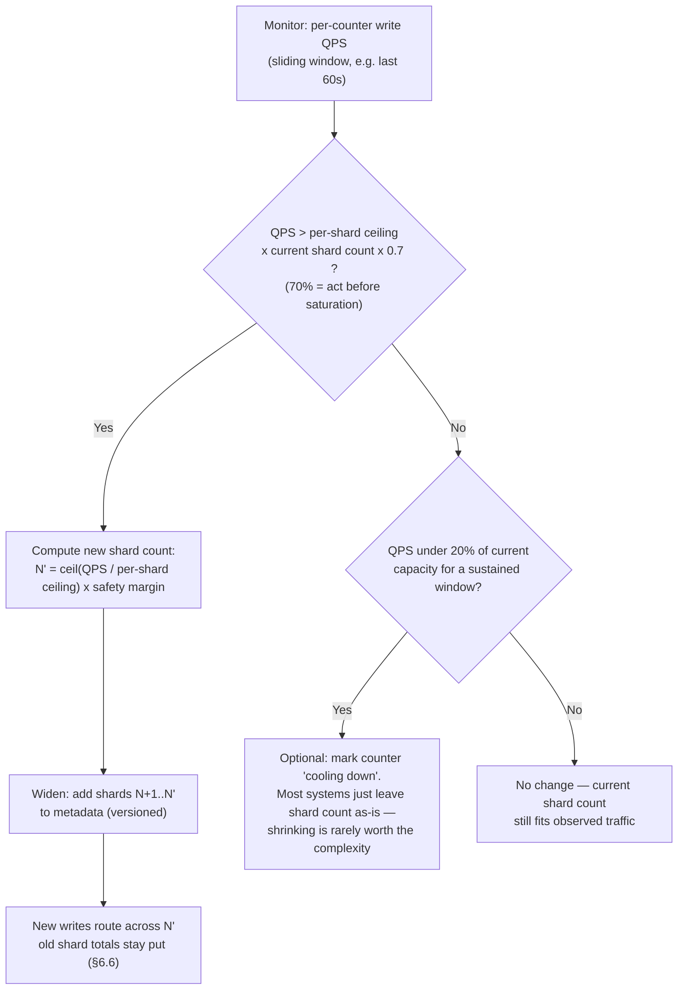

Trigger the "widen" path off **per-shard** QPS, not the counter's total QPS — a skewed selection strategy can overload one shard while the total still looks fine (§6.6).

### 6.2 Storage backing: In-memory vs. DB-backed

| | In-memory (Redis `INCR`/`HINCRBY`) | DB-backed (row per shard: Cassandra/DynamoDB/MySQL) |
|---|---|---|
| Write latency | Sub-millisecond | Single-digit ms (Cassandra/Dynamo), can be worse for MySQL row locking |
| Durability | Needs AOF/RDB persistence or replica; risk of loss on crash unless configured | Durable by default |
| Best for | High-QPS ephemeral counters (live view counts, real-time leaderboards) | Counters that must survive as system of record (persisted like/vote counts) |
| Typical pairing | Redis shards + periodic flush to durable store (Cassandra) for the aggregate | — |

The source material's design does exactly this hybrid: **Redis/Memcache for shard writes and metadata, Cassandra for the periodically-computed durable aggregate.**

### 6.3 Aggregation strategy: Fan-out read vs. Cached rollup vs. Write-behind aggregation

| Strategy | What happens on read | Consistency | Cost profile |
|---|---|---|---|
| **Fan-out read (sum-on-read)** | Read all N shards live, sum | Freshest possible (still eventually-consistent w.r.t. in-flight writes) | Read cost scales **linearly** with shard count; bad at high read QPS |
| **Cached aggregate (periodic pull)** | Background job sums shards every T seconds, caches result; reads hit cache | Staleness bounded by T | O(1) read cost; write cost to re-aggregate is O(N) but amortized off the read path |
| **Write-behind aggregation (push)** | Each shard write also nudges a running aggregate (best-effort, e.g. increments a Redis aggregate key alongside the shard) | Can drift if nudges are lost; needs periodic reconciliation against true sum | Cheapest reads; adds a second write per increment |

**Memory hook — "PFC" read strategies: P**ull-on-read (fan-out), **F**resh-cache (periodic pull + cache), **C**ontinuous push (write-behind).

### 6.4 CRDT-based counters (the "exact eventual consistency" alternative)

When you need **multi-region, no-coordination** counters that still converge to a mathematically correct value (not just "approximately right"), use **CRDTs**:

- **G-Counter (Grow-only Counter)**: each node keeps its own increment tally; global value = sum across all nodes' tallies. Merges by taking max per-node value — commutative, associative, idempotent → safe under replication/retries.
- **PN-Counter (Positive-Negative Counter)**: two G-Counters (one for increments, one for decrements); value = P − N. Supports decrements (likes can be un-liked).

| | Sharded counters (this chapter) | CRDT counters (G-Counter/PN-Counter) |
|---|---|---|
| Coordination | Central metadata store decides shard routing | None — fully decentralized, any replica can accept a write |
| Best for | Single-datacenter or app-server-mediated writes | Multi-region, offline-tolerant, no single point of coordination |
| Merge correctness | Sum is exact only when a coherent snapshot is read (approximation) | Mathematically guaranteed convergence (idempotent merge) |
| Complexity | Lower — plain rows + routing logic | Higher — needs CRDT-aware storage/merge logic (e.g., Redis CRDT, Riak) |

### 6.5 Approximate counting: Count-Min Sketch / HyperLogLog (the "don't even store exact shards" alternative)

For some problems you don't need an *exact* count at all — you need a good estimate at a fraction of the memory:

- **HyperLogLog (Redis `PFADD`/`PFCOUNT`)**: estimates **cardinality** (distinct count) — e.g., unique visitors — in ~12KB regardless of input size, ~0.81% standard error. Solves a **different problem** than sharded counters (distinct count, not sum of events) — common interview confusion.
- **Count-Min Sketch**: estimates **frequency** of items in a stream (e.g., "how many times has this hashtag appeared") using a small 2D array of counters and hash functions — sub-linear memory, tunable error via width/depth, used for heavy-hitter/Top-K detection at ingestion.

| | Sharded Counters | HyperLogLog | Count-Min Sketch |
|---|---|---|---|
| Answers | Exact total count of a *known* entity's events | Approx. **distinct** count | Approx. **frequency** of items, good for heavy hitters/Top-K |
| Memory | O(shards) — grows with entity count | O(1) per counter (~12KB) | O(width × depth), fixed |
| Use when | You need per-entity exact-ish totals (likes, views) | "How many unique users viewed this" | "What are the top K trending hashtags right now" |

#### 🆕 Quick comparison: exact sharded counting vs HyperLogLog vs in-memory batching

These solve different problems but get lumped together in interviews — know which axis each one trades on.

| | Exact sharded counting | HyperLogLog | In-memory batching (write-behind) |
|---|---|---|---|
| Question answered | "What's the total?" — exact-ish, eventually consistent | "How many *distinct* items?" — approximate | "What's the total?" — same question as sharded counting, cheaper reads |
| Accuracy | Exact sum, as of the last aggregation pass | ~0.81% standard error, never exact | Exact sum, but can drift if a nudge is lost (§5.5) |
| Memory | O(number of shards) | O(1) — ~12KB flat, regardless of scale | O(1) extra — one running total per counter |
| Shines when | Per-entity like/view/vote counts | Unique visitors, unique viewers | Read QPS so high that even a cache-hit fan-out sum is too much |
| Fails when | Doesn't dedupe — two writes from the same user both count | Can never give you the exact number | Needs periodic reconciliation against a source of truth |

Recall trick — **"sum vs. distinct vs. speed."** Sharded counters optimize the *sum*, HyperLogLog optimizes *distinct*, write-behind batching optimizes *read speed* for a sum you're already computing.

Concrete number for the batching column: flushing an in-memory aggregate to the durable store every **100ms**, instead of writing the durable store on every increment, cuts durable-store writes by roughly **100x** for a counter taking 10 writes/ms. The trade: up to 100ms of data is at risk if the process crashes between flushes.

### 6.6 Rebalancing: When a Shard Itself Gets Hot

Sharding fixes the entity-level hot key. But a **second-order hot key** can appear inside the shard set itself: a poorly-distributing hash clusters too many active users onto `shard_7`, or random selection just gets unlucky enough times that one shard becomes a mini hot-key inside its own Cassandra/DynamoDB partition. The fix is the same idea, applied recursively — plus a live-migration question you didn't face at creation time.

**Detect:** per-shard write-QPS, not just the counter's total QPS. If `shard_7` runs at 5x its siblings, either selection is skewed or the partitioning underneath maps several shards onto the same physical node.

**Rebalance live, in 3 steps:**
1. **Widen** — add `M` new shards to the counter's shard list in the metadata store (versioned, so in-flight writers never read a half-updated list).
2. **Cut over new writes** — future writes route across the new total (`N+M`) immediately. The hot shard's *accumulated* total is never touched; it simply becomes one of many shards going forward and stops absorbing a disproportionate share of *new* traffic.
3. **Re-aggregate** — the background aggregation job just sums the new shard list. No value migration needed — sharded counters never move historical totals between shards (unlike resharding a keyed dataset); you're only ever changing where *future* writes land.

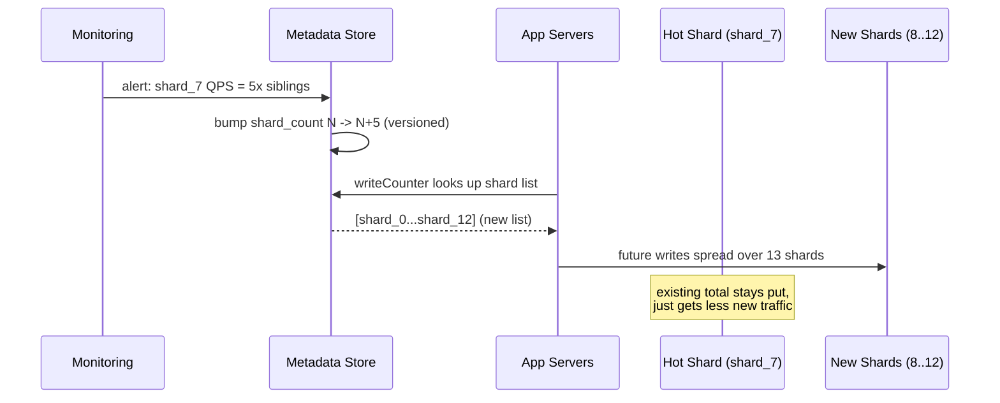

This is far cheaper than resharding a normal partitioned dataset, because a counter shard holds no identity-bearing rows to migrate — it's a single number. **Growing shard count is additive, not migratory** — that's the whole reason this technique is cheap. Shrinking (merging shards back down) is rarer and harder; most systems just leave low-traffic shards in place and keep summing them rather than merging.

### Interview cheat-sheet — Variants
- Always mention that **shard count is a knob**, not a constant — fixed vs. adaptive is a legitimate trade-off to discuss out loud.
- If the interviewer says "multi-region, no central coordinator," pivot to **CRDTs** — shows depth beyond the course material.
- If the interviewer says "distinct users" instead of "count of events," that's **HyperLogLog**, not sharded counters — don't conflate them.
- If the interviewer says "top K trending X," mention **Count-Min Sketch** as memory-efficient alternative/complement to per-hashtag sharded counters.
- Storage choice (Redis vs. Cassandra vs. MySQL) should track durability requirements, not just speed.

---

## 7. When to Use Which

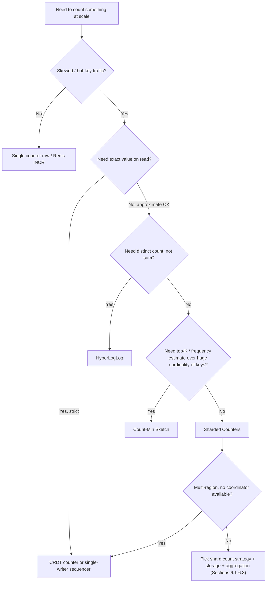

### Interview cheat-sheet — When to use which
- Sharded counters win when: single app/region, need per-entity exact-ish counts, moderate read QPS.
- CRDTs win when: multi-datacenter writes with no coordinator, need mathematically exact eventual convergence.
- HyperLogLog wins when: the question is "how many unique X," not "how many total X."
- Count-Min Sketch wins when: you must rank/detect heavy hitters among huge key cardinality (can't afford a shard set per key).
- Plain counter wins when: traffic is uniform, no single entity dominates — don't over-engineer.

---

## 8. Capacity Estimation — Worked Example

### The formula chain

```
1. writes/sec (peak) for the hot entity
        ↓
2. per-shard write capacity ceiling (of underlying store)
        ↓
3. shards_needed = ceil(writes_per_sec / per_shard_capacity) × safety_factor
        ↓
4. read/aggregation cost = shards_needed × per_shard_read_latency  (fan-out)
        ↓
5. if aggregation cost too high → introduce caching layer,
   refresh_interval chosen to bound staleness vs. read cost
```

### Worked numeric example: a viral post hitting 100K likes/sec

**Inputs**
- Peak write rate: **100,000 likes/sec** on one post (viral moment).
- Underlying store: Redis, single-core `INCR` ceiling ≈ 80-100K ops/sec. But a single hot **key** still serializes on that key even though Redis itself is fast — so we shard to spread across **Redis cluster slots / physical shards**, not because of raw per-op speed.
- Target: keep per-shard write rate under **5,000 writes/sec** — comfortable margin, and in the same ballpark as realistic single-partition ceilings on Cassandra/DynamoDB (~1-3K writes/sec before throttling).

**Shard count**
```
shards_needed = 100,000 / 5,000 = 20 shards
with 50% safety margin → 30 shards
```

**Read cost (fan-out, no caching)**
```
30 shards × ~1ms per-shard read, done in parallel (not serial)
```
Each read fans out to all 30 shards at once, so wall-clock latency stays ~1-3ms — bounded by the slowest shard, not the sum of all of them. But the *load* on the store is 30x: at 10,000 reads/sec on this post, that's 300,000 shard-reads/sec generated just to compute the aggregate.

This is the number that justifies caching: 300K extra store ops/sec to serve reads is not acceptable.

**Read cost (with cached aggregate, refreshed every 2 seconds)**
```
Aggregation job cost: 30 shard-reads every 2s = 15 shard-reads/sec (background)
Client read cost: O(1) cache hit, ~1ms
Staleness bound: ≤ 2 seconds (acceptable for a like counter, NOT for a
                 balance/inventory counter)
```

**Result:** 30 shards, periodic (2s) cache refresh, reduces read-side store load from 300,000 ops/sec to **15 ops/sec** at the cost of up to 2 seconds of staleness on the displayed count.

### Interview cheat-sheet — Capacity estimation
- Always state the **peak** write rate you're designing for, not average — viral spikes are bursty (order-of-magnitude jump in seconds).
- Memorize the chain: **writes/sec → per-shard ceiling → shard count (+ safety margin) → read fan-out cost → cache to bound it.**
- Explicitly compute the "read cost without caching" number — it's the number that *justifies* adding a cache, and interviewers reward you for deriving rather than asserting it.
- State your staleness bound out loud and justify it against the product requirement (like count can be 2s stale; a balance can't).
- Always add a safety margin (30-50%) to shard count — traffic prediction is inherently imprecise (see §6.1 adaptive sharding).

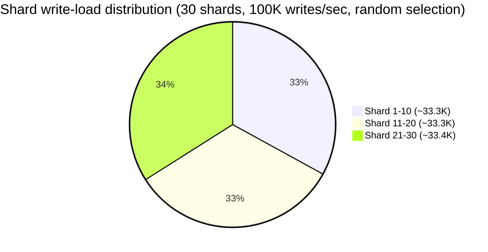
*(Random/hash selection with enough shards converges to near-uniform load — this is the whole point.)*

---

## 9. Numbers Worth Memorizing

| Metric | Approx. value | Why it matters |
|---|---|---|
| Single MySQL row write ceiling (with lock contention) | Low hundreds to ~1-2K writes/sec before lock wait dominates | Baseline "why a single counter fails" number |
| Single Cassandra/DynamoDB partition write ceiling | ~1,000-3,000 writes/sec (DynamoDB: 1,000 WCU/sec per partition is the classic quoted limit) before hot-partition throttling | Justifies shard count math |
| Redis single-instance `INCR` throughput | ~80K-100K+ ops/sec per core (simple in-memory op) | Why Redis is default for shard storage |
| Redis cache read latency | Sub-millisecond (~0.1-1ms) | Why cached aggregate reads are "free" compared to fan-out |
| HyperLogLog memory footprint | ~12 KB per counter, ~0.81% error | Contrast vs. exact counting memory cost |
| Twitter historical average tweet rate | ~6,000 tweets/sec, ~500M tweets/day | Source-material scale anchor |
| DynamoDB adaptive capacity / hot partition threshold | Traffic to one partition beyond its share triggers throttling regardless of overall table provisioning | Explains *why* DynamoDB users hit this even with "enough" total capacity |

### Interview cheat-sheet — Numbers
- You don't need exact vendor numbers memorized cold — you need the **shape**: single-partition ceilings are in the **thousands/sec**, not millions/sec, regardless of store.
- Know that adding total table/cluster capacity does **not** fix a hot partition — capacity is provisioned/limited per-partition in DynamoDB/Cassandra-style systems.
- Redis in-memory ops are ~1-2 orders of magnitude faster than a durable DB row — hence the common "Redis for shards, Cassandra for durable aggregate" pairing.

---

## 10. Disambiguation — Commonly Confused Pairs

### 10.1 Sharded counters vs. Distributed counters vs. CRDT counters

| | Sharded Counter | "Distributed Counter" (generic term) | CRDT Counter |
|---|---|---|---|
| Precision | Definition-level term for splitting one counter into N shards + aggregation | Umbrella term — sharded counters ARE one kind of distributed counter | Guarantees mathematically exact convergence without coordination |
| Coordination needed | Yes — a metadata/routing layer picks the shard | Varies | No — any replica accepts writes independently |
| Note | The course material uses "sharded counter" and "distributed counter" **interchangeably** — be ready for either term in an interview | — | Bring this up only if asked about multi-region/offline writes |

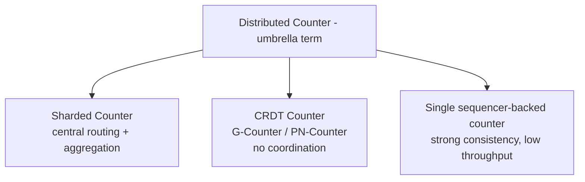

### 10.2 Eventual vs. Strong consistency for the aggregate read

| | Eventual (sharded counter default) | Strong |
|---|---|---|
| What you get | Sum reflects shard values as of last aggregation pass; may lag live writes | Sum is guaranteed exact at read time |
| Cost | Cheap (cached or async fan-out) | Expensive — needs locking all shards or a single source of truth |
| Use for | Like counts, view counts, vote counts | Account balances, inventory counts, anything money-adjacent |
| Course material's stance | Explicitly: don't lock shards before summing — treat reads as approximate | — |

### 10.3 Hot partition vs. Hot key

| | Hot Partition | Hot Key |
|---|---|---|
| Scope | A physical partition/node in a distributed store receiving disproportionate traffic | A specific logical key (could map to one partition) receiving disproportionate traffic |
| Cause | Partition key design maps many hot keys to the same partition, OR one key alone saturates its partition | Traffic skew on one row/key (e.g., celebrity's tweet ID) |
| Relationship | A hot key **causes** a hot partition when the store colocates by key | Sharded counters fix this by turning **one hot key into N less-hot keys** spread across partitions |

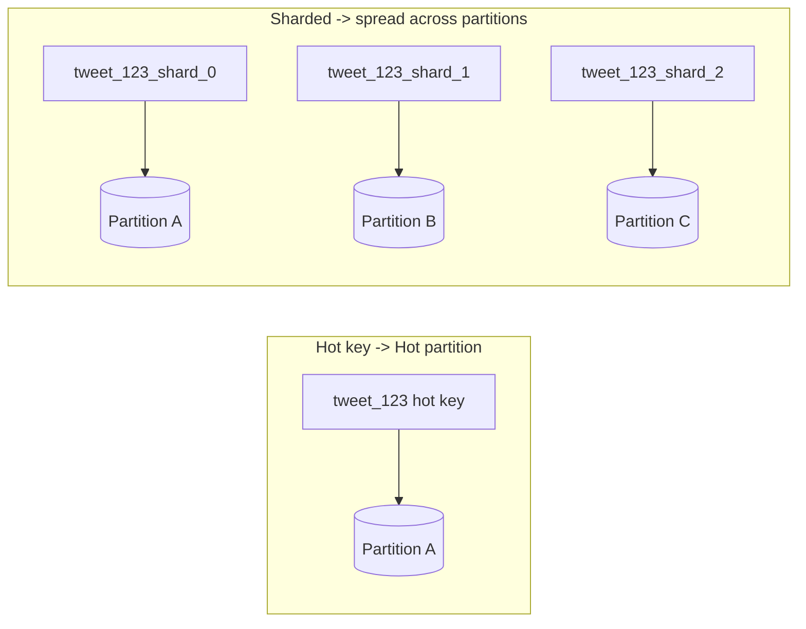

### 10.4 Write-through cache vs. Write-behind aggregation

| | Write-through cache | Write-behind aggregation (this pattern's read side) |
|---|---|---|
| What's cached | The value itself, written to cache AND store synchronously on every write | A **periodically recomputed sum** across shards, decoupled from individual writes |
| Consistency | Strong (cache always matches store post-write) | Bounded staleness (matches store as of last aggregation pass) |
| Applies to | General caching pattern | Specific to sharded-counter aggregation — you're not caching one value's write, you're caching a **derived rollup** of many shards |

### Interview cheat-sheet — Disambiguation
- If interviewer says "distributed counter," treat it as synonymous with "sharded counter" unless they clarify they mean CRDTs.
- Always state which consistency model you're choosing for the **read**, not just the write — this is where most designs get probed.
- "Hot partition" and "hot key" are cause-and-effect, not synonyms — a hot key *causes* a hot partition; sharding is what breaks that causal link.
- Don't confuse "write-through cache" (generic pattern) with the aggregation-cache used here (a derived, periodically-recomputed value).

---

## 11. Design Decisions & Trade-offs

| Decision | Option A | Option B | What to say in interview |
|---|---|---|---|
| Shard count | Few shards | Many shards | "Few shards → write contention. Many shards → expensive/stale reads. I'll size shards from predicted peak write QPS with a safety margin, and make it adaptive if I have monitoring in place." |
| Shard selection | Round-robin | Random / metrics-based | "Round-robin is simplest but blind to real-time load; metrics-based (load balancer aware of shard health) handles variable node load but adds complexity. I'd start random, upgrade to metrics-based only if load imbalance becomes visible." |
| Read strategy | Fan-out sum on every read | Cached periodic aggregate | "Fan-out is simplest but O(N) per read; cached aggregate is O(1) per read at the cost of bounded staleness — pick staleness bound from product requirements." |
| Storage | In-memory (Redis) | Durable (Cassandra/DynamoDB row per shard) | "Redis for hot shard writes + fast reads; periodically flush the aggregate to a durable store so counts survive cache eviction/restart." |
| Placement | Centralized (same DC as app servers) | Edge/CDN-adjacent, geo-distributed | "For a global product, place shards near the region generating the writes (reduces write latency) and aggregate centrally or per-region depending on whether we need global or regional Top-K." |
| Decrements | Support them (net delta can be negative) | Increment-only | "Likes can be unliked — need a PN-counter-style shard (or allow negative increments) not a pure grow-only counter." |

### Interview cheat-sheet — Trade-offs
- Frame everything as: **write scalability vs. read cost vs. staleness** — this triangle is the entire design space.
- Justify shard count numerically (§8), don't just say "some shards."
- Call out the decrement case explicitly (unlike, unvote) — a naive design assumes monotonic increment.
- Mention resharding cost: growing/shrinking shard count for a *live* counter is nontrivial (in-flight writes to old shard mapping, need to migrate/merge totals) — most systems set shard count at creation and rarely change it, or use time-windowed tiers instead.

---

## 12. Common Failure Modes

1. **Under-provisioned shards for an unpredicted viral post** — a low-follower account goes viral; the small shard count set at creation can't absorb the burst. *Mitigation*: adaptive/monitored shard count, or a fast-path fallback (temporarily widen shard count / route through a queue that drains into shards).
2. **Read amplification** — too many shards + fan-out-on-read with no caching = read cost explodes (see §8's 300K ops/sec example). *Mitigation*: cached aggregate with bounded staleness.
3. **Hot shard within the shard set** — a bad selection strategy (e.g., naive hash with poor distribution, or round-robin combined with retries always hitting the same shard) recreates the original hot-key problem at smaller scale. *Mitigation*: random or metrics-based selection; monitor per-shard QPS.
4. **Treating this as strongly consistent** — product/finance stakeholders assume the displayed count is exact; it's an approximation. *Mitigation*: set expectations explicitly, never use this pattern for money/inventory.
5. **Losing decrements** — unliking removes votes but shard scheme assumed increment-only, causing count drift. *Mitigation*: design shards to support signed deltas from day one.
6. **Metadata store as a new single point of failure/hot key** — every write first looks up "which shards does counter_id have," and *that* lookup itself can become a hot key if not cached. *Mitigation*: cache the counter→shards mapping aggressively (it changes rarely).
7. **Resharding a live, hot counter** — changing shard count mid-flight risks writes landing on stale shard lists or double counting during migration. *Mitigation*: version the shard-count metadata, drain old shards before removing them, or avoid resharding by over-provisioning up front for known-hot entities.

### Interview cheat-sheet — Failure modes
- Always volunteer at least 2 failure modes unprompted — shows you're not just reciting the happy path.
- The "nobody's post goes viral unexpectedly" case is a favorite follow-up question — have an adaptive-sharding answer ready.
- State explicitly that this pattern is **wrong for money** — a strong interview signal that you know its limits.

---

## 13. Real-World Examples

- **Google App Engine Datastore Sharded Counters** — the original, most-cited reference implementation: fixed shard count per counter, random shard selection, periodic aggregation with memcache.
- **Twitter likes/retweets/views** — this chapter's running example: per-tweet counters, shard count driven by follower count and public/protected status, Cassandra for durable aggregate, Redis/Memcache for shard + metadata storage.
- **Instagram like counters** — similar sharded-counter approach for celebrity posts; displayed counts are commonly rounded/approximated in the UI, an implicit admission of eventual consistency.
- **Reddit vote counting** — combines sharded increment/decrement (up/down) with a separate "hot" ranking score computed periodically from vote totals + time decay (a Top-K-style problem layered on top of counters).
- **YouTube view counts** — famously *does not* show live counts in real time for high-traffic videos; views are validated/batched/aggregated with intentional delay, partly for spam/bot filtering, partly the same read-aggregation-cost problem.
- **DynamoDB/Cassandra/Bigtable hot-partition mitigation** — the general database-level version of this same idea: add a random or hashed **suffix** to a hot partition key (`itemID#<0-N>`) to spread writes, then aggregate across the fan-out on read. This is literally "sharded counters" applied to arbitrary hot keys, not just counts.
- **Rate limiters at scale** — sliding-window/token-bucket counters per user/IP hit the same hot-key issue for very popular API keys; sharded counter buckets (with approximate global rate via periodic sync) are a standard mitigation.

### Interview cheat-sheet — Real-world examples
- Cite Google App Engine's sharded counter doc by name — it's the textbook reference and signals you've seen this outside the course.
- Mention YouTube/Instagram's *visibly* approximate or delayed counts as evidence this trade-off is shipped in production, not theoretical.
- Bring up the DynamoDB/Cassandra "random suffix on partition key" trick — it's the same pattern, phrased in database terms, and interviewers from a data-infra background respond well to it.

---

## 14. Golden Rules

1. **Shard the write, aggregate the read** — the entire pattern in five words.
2. **Never lock all shards to read** — treat the aggregate as an approximation, not a transaction.
3. **Size shards from peak write QPS ÷ per-shard ceiling, with margin** — don't guess a round number.
4. **Cache the aggregate; don't fan out on every read** — O(1) reads over O(N) reads, always.
5. **This is a write-scaling tool for skewed traffic only** — don't apply it to uniformly-loaded counters.
6. **Wrong tool for exact/strong-consistency counting** (money, inventory) — reach for a single authoritative writer or a proper transaction instead.
7. **Distinguish "sum of events" from "distinct count"** — sharded counters solve the former; HyperLogLog solves the latter.
8. **Support signed deltas from day one** — likes get unliked, votes get reversed.
9. **Cache the counter→shard metadata mapping too** — it's a lookup on every single write.
10. **State the staleness bound out loud** — it's a product decision, not an implementation detail to hide.
11. **Growing shard count is additive, never migratory** — a shard is just a number, so widening a hot shard set means new writes route differently, not that old totals move.

---

## 15. Master Cheat Sheet

**One-liner:** Split one hot counter into N shards; writers pick a shard at random/hash/metrics-based; readers sum shards periodically and cache the result — trading read freshness for write throughput.

**Three APIs:** `createCounter(counter_id, num_shards)` · `writeCounter(counter_id, action_type)` · `readCounter(counter_id)`.

**Core formula:**
```
shards_needed = ceil(peak_writes_per_sec / per_shard_write_ceiling) × safety_margin
read_cost(fan-out) = shards_needed × per_shard_read_latency × read_qps
read_cost(cached)  = O(1) per read + O(shards_needed) per aggregation cycle
```

**Decision tree:** skewed traffic? → need exact value? (yes → CRDT/sequencer) → need distinct count? (yes → HyperLogLog) → need top-K/frequency over huge key space? (yes → Count-Min Sketch) → else → Sharded Counters.

**Shard-count strategy:** Fixed (simple, mis-predicts) vs. Adaptive (accurate, needs monitoring) — memory hook **F.A.T.**

**Shard-selection strategy:** Round-robin (simple, load-blind) / Random (simple, good default) / Metrics-based (load-aware, complex).

**Read-aggregation strategy:** Pull-on-read (fan-out) / Fresh-cache (periodic pull+cache) / Continuous push (write-behind) — memory hook **P.F.C.**

**Storage pairing:** Redis/Memcache for hot shards + metadata, Cassandra/DynamoDB for durable periodic aggregate.

**Cache invalidation:** fixed TTL (default) → write-count-triggered (for bursty entities) → stale-while-revalidate (never block a reader on fan-out).

**Decrements:** signed delta on the same shards (`+1`/`-1`) is the default; PN-Counter-lite (`ΣP − ΣN`, append-only) for no-coordination multi-node writes. Reconcile drift on a slow cadence against an authoritative log.

**Resharding a hot shard:** widen the shard list → cut new writes over → re-aggregate. No value migration — growing is additive, not migratory.

**Numbers to have cold:** single-partition write ceilings are thousands/sec not millions/sec (MySQL row: hundreds-low thousands; Cassandra/DynamoDB partition: ~1-3K); Redis INCR: ~80-100K+/sec; HyperLogLog: ~12KB/counter at ~0.81% error.

**Confused-pair reflexes:** sharded counter = one flavor of "distributed counter"; hot key causes hot partition; eventual consistency is the default read model here, not a bug; write-behind aggregation ≠ write-through cache.

**Failure modes to volunteer:** unpredicted viral burst overwhelms fixed shard count; fan-out reads without caching explode read QPS; naive selection recreates a hot shard; decrements assumed away; metadata lookup itself becomes hot; live resharding is hard.

**Real-world anchors:** Google App Engine (origin), Twitter/Instagram likes, YouTube views (intentionally delayed), Reddit votes, DynamoDB/Cassandra hot-partition-key suffixing.

**🆕 If X → then Y (fast recall under pressure):**

| If... | Then... |
|---|---|
| One entity's write QPS is uniform and low | Plain counter row / Redis `INCR` — don't shard. |
| One entity's write QPS exceeds the store's single-row/partition ceiling | Shard the counter (§5, §8). |
| The write rate for a hot entity keeps changing unpredictably | Adaptive shard count, not fixed (§6.1). |
| Reads must be exact, no staleness tolerated | Wrong pattern — use a single sequencer or a transaction, not sharded counters (§10.2). |
| You need "how many unique X," not "how many total X" | HyperLogLog, not sharded counters (§6.5). |
| You need top-K / frequency across a huge key space | Count-Min Sketch (§6.5). |
| Writes come from multiple regions with no shared coordinator | CRDT counter — G-Counter/PN-Counter, not centrally-routed shards (§6.4). |
| The action can be reversed (unlike, unvote) | Signed delta or PN-Counter-lite shards, never increment-only (§5.5). |
| Fan-out-on-read is generating too much load on the store | Cache the aggregate; bound staleness by TTL or write-count (§5.4, §6.3). |

**Golden rule to close any answer with:** "Sharded counters buy write scalability by making the read an approximation — I'd confirm with the interviewer/PM how stale a count is acceptable before finalizing the aggregation strategy."
