# Design YouTube — The Story (narrative edition)

> **What this file is.** The reference file, `26-Design YouTube-FAANG-Guide.md`, is the one to recite from — requirements, API shapes, every trade-off table, the master cheat sheet. This file is a second way in: the same material as one continuous story, told in plain language. Engineers at a fictional video-sharing startup, **ClipVine**, keep hitting a wall, patch it, and the patch itself creates the next wall — until we land on the exact same design the reference file documents. ClipVine is made up. But every wall it hits, and every fix it reaches for, is something a real, named system actually does: YouTube's own documented architecture (Vitess, Bigtable, GFS/Colossus, its published recommendation-system research), Netflix's real per-title encoding pipeline, and the real, standardized adaptive-streaming protocols HLS (Apple) and DASH (MPEG). I'll say clearly, every time, whether something is a documented fact or a reasonable illustrative guess, using an inline `[illustrative]` tag.

**The trigger phrases** for this whole topic: *"design YouTube,"* *"design a video streaming platform,"* *"design Netflix/TikTok/Vimeo,"* or *"design a system that lets people upload and stream huge media files at scale."* Keep one sentence in your head as you read: **a video platform is really two systems bolted together — a slow, one-time write pipeline that turns one raw upload into a whole matrix of ready-to-stream files, and a blistering, repeated read pipeline that hands pieces of that matrix to millions of people at once — and almost every design decision below exists to keep those two pipelines from stepping on each other.** Everything that follows is just this one idea, getting harder, one honest step at a time.

---

## Chapter 1 — The one box that does everything

It's early 2016. ClipVine is three people and one server. A creator hits "upload," the server writes the raw file straight to its own local disk, and when someone hits "play," that exact same server streams those exact same raw bytes back out. No encoding, no separate storage, no CDN — just one box, doing upload and playback with the same disk and the same network card.

Most days this is fine — a few dozen uploads, a few thousand views. Then a five-minute "study playlist" video gets shared in a large student forum. Within an hour it has **500 concurrent viewers**. Here's the number that breaks things: ClipVine never re-encodes anything, so every viewer downloads the *raw* camera file — for a 5-minute 1080p phone video, that's about **600 MB raw** (a real, documented rough figure for raw-vs-encoded video: source footage this size compresses roughly 20:1 down to about 30 MB once properly encoded — but ClipVine isn't encoding, so nobody gets the 30 MB version). Do the math: 500 viewers × 600 MB = **300 GB served in that one hour**, and virality doesn't spread evenly across 60 minutes — most of that hits within the first 10–15 minutes. The server's network card is a standard 1 Gbps link, which tops out around 125 MB/s. Sustained average demand alone (300 GB / 3600s ≈ 83 MB/s) is already eating two-thirds of that link before the traffic even bursts. New uploads — which are trying to write to the *same disk* that's frantically reading for 500 concurrent playback streams — start timing out mid-transfer. Two creators lose partially-uploaded videos that night.

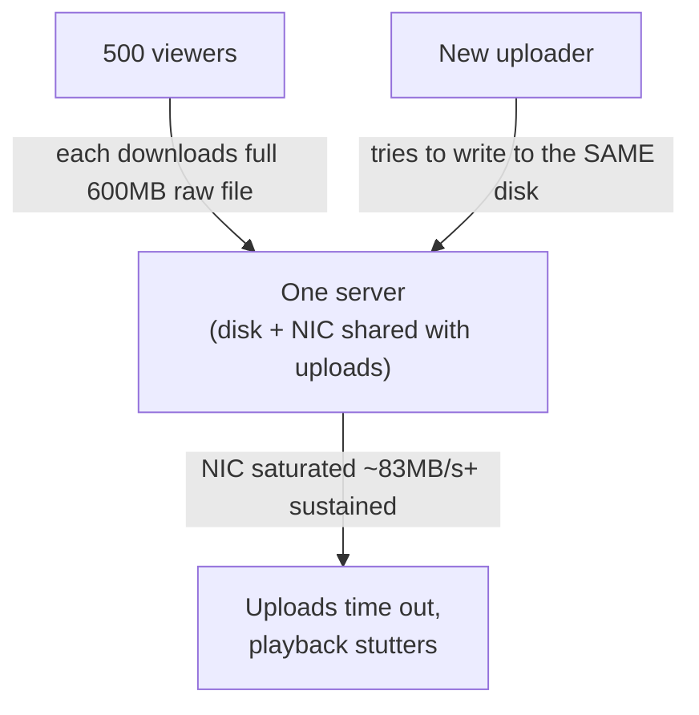

The obvious question: *why is watching a 5-minute video costing 600 MB in the first place?* Because ClipVine never separated "the file that was uploaded" from "the file that gets served" — it's the same file, doing double duty, sitting on the same disk that also has to accept new writes.

**The fix, and the first analogy for the rest of this story:** move video bytes off the app server entirely, onto dedicated **blob storage** — a separate system whose only job is holding files durably. Think of it as a **warehouse and a storefront counter**. The storefront counter (the app server) is where customers place orders and get handed things — it shouldn't also be the building where every box in the company is stacked to the ceiling. Put the boxes in a warehouse; let the counter just point people to the right box.

**New problem, immediately visible:** moving the bytes to a warehouse doesn't make the boxes smaller. ClipVine is now serving the *exact same* 600 MB raw file from a nicer, dedicated storage system — the bandwidth bill didn't shrink by one byte, because nobody has compressed anything yet.

**How I'd say this in an interview:** "The very first split in any video platform is separating the bytes from the server that handles requests — blob storage for the file, app server for logic and pointers. That fixes 'one disk doing everyone's job at once,' but it doesn't fix bandwidth, because you're still shipping the full, uncompressed file to every single viewer."

---

## Chapter 2 — Vacuum-sealing the couch before you ship it

ClipVine's engineers look at the numbers again: **600 MB raw for 5 minutes of footage**, and realize almost none of that is necessary to actually *watch* the video well. Raw camera footage is enormously redundant — frame to frame, most pixels barely change — and real, standard video codecs are built exactly to exploit that redundancy.

The fix: **transcode** every upload, once, at ingest time, into a properly compressed rendition — H.264, the industry's universal baseline codec. Applied to the same 5-minute clip, the same footage that was 600 MB raw comes out around **30 MB encoded** — a genuine, well-documented ~20:1 compression ratio for this kind of source. Redo Chapter 1's math with this one change: that same viral spike of 500 viewers now needs 500 × 30 MB = **15 GB**, not 300 GB — a 20x drop in the exact number that was breaking the server, with zero change to viewer count.

**The analogy:** shipping furniture flat-packed and vacuum-sealed instead of fully assembled and boxed with all the air still in it. Same couch, same customer experience once it's unpacked — a fraction of the truck space to move it.

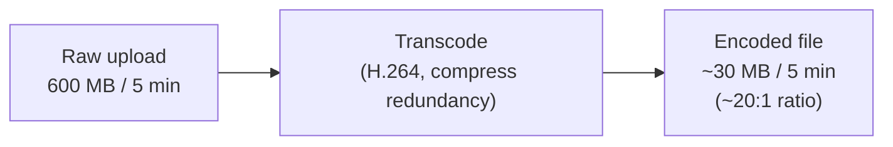

**New problem:** encoding isn't instant. A 5-minute clip might transcode quickly, but ClipVine's creators are already uploading longer videos, and someone has to actually *run* this encoding step — and right now, the only place to run it is inline, as part of the same upload request, before the server says "done."

**How I'd say this in an interview:** "Never serve the raw upload — always transcode once at ingest into a compressed rendition. The ~20:1 raw-to-encoded ratio is the single number that most cleanly justifies transcoding, the same way the upload-to-view bandwidth ratio later justifies a CDN. But *where* that encoding step runs is a completely separate design decision, and doing it inline is the next thing that breaks."

---

## Chapter 3 — The waiter who won't take a new order until the kitchen's done

ClipVine wires encoding directly into the upload request: the server accepts the file, transcodes it right there, on the same request thread, and only then responds "upload complete." It works fine for short clips. Then ClipVine runs a "trending creators" push notification, and five people upload 10-minute videos within the same minute.

Here's the math that breaks it. Before this feature, an upload-handling slot took about 2 seconds (just moving bytes, no encoding) and the server had 50 such slots — plenty of headroom for the handful of uploads ClipVine actually saw per minute. Now, with inline encoding, a 10-minute video takes roughly **7 minutes** to transcode on a single modest worker `[illustrative — encode time scales with source duration on shared hardware, a real and documented pattern; the exact minutes here are a stand-in]`. Redo the capacity math: 50 slots ÷ 420 seconds each ≈ **0.12 uploads/sec of sustained capacity** — about one upload every 8-9 seconds. The trending push just sent 5 uploads in one minute. Within a few minutes, all 50 slots are occupied by videos still transcoding, and the next batch of everyday uploads — the ones with nothing to do with the trending push — get rejected outright, because the server literally cannot accept a new file until an existing encode finishes.

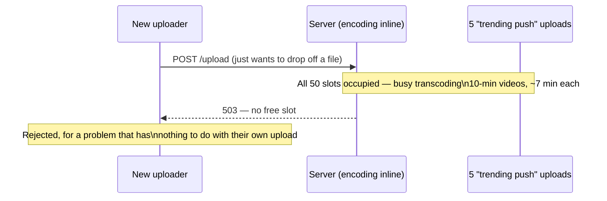

The obvious question: *why does the person uploading have to wait for the encode to finish at all?* They don't need the video watchable in the next second — encoding is a background job, not something the uploader is standing there staring at.

**The fix:** decouple accepting the upload from doing the encode. The app server writes the metadata, stashes the raw file in blob storage, drops a job onto a **queue**, and immediately tells the uploader "got it, processing" — a separate **encoder farm** picks jobs off that queue on its own schedule, with as many workers as needed, entirely independent of how many uploads are arriving right now.

**The analogy:** a waiter and a kitchen ticket rail. The waiter (app server) takes your order, clips the ticket to the rail, and immediately goes to serve the next table — they don't stand at the stove watching your food cook. The kitchen (encoder farm) works through the rail at its own pace, adding more cooks if the rail backs up.

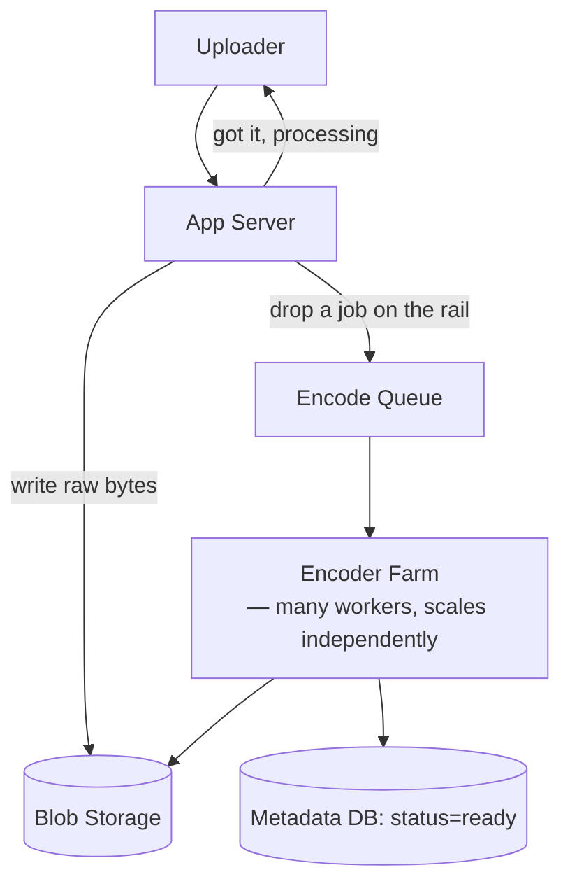

Because encode latency (minutes) is far more tolerant than upload latency (seconds), encoder workers can even run on cheap, bursty spot/preemptible capacity — a job that gets briefly delayed because a worker got reclaimed is nearly invisible to the creator waiting on a "processing" spinner.

The encoder farm also does one more job worth naming here: it generates **thumbnails** at the same time it transcodes. Thumbnails are a huge count of small (under 10 MB) immutable objects, which is exactly the shape of workload a wide-column store like **Bigtable** is built for — this is the real, documented choice YouTube's own infrastructure makes, storing thumbnails separately from the relational metadata that describes videos, channels, and comments.

**New problem:** the encoder farm now produces one, single, fixed-quality output per video — say, 1080p at a middling bitrate. ClipVine's creators watch from everywhere: fiber-connected desktops, and phones on a train losing signal every few minutes. One fixed rendition can't serve both well.

**How I'd say this in an interview:** "Accepting an upload and encoding it are two different jobs running at two different speeds, and a queue is what lets the accept step say 'done' without waiting on the encode step to finish — exactly the same decoupling idea as a producer/consumer queue anywhere else in distributed systems, just applied to video. What it doesn't fix yet is that a single fixed encode output is a bad fit for every possible viewer's network."

---

## Chapter 4 — One shoe size for every foot

ClipVine's encoder farm ships every video as one file: 1080p, H.264, a bitrate tuned for "good broadband." For months this looks fine, because most viewers *are* on good broadband. Then ClipVine's mobile app takes off, and support tickets about "constant buffering" spike. The pattern: viewers on 3G/4G — commuters on trains, people in areas with weak signal — are stuck trying to pull a stream that assumes far more bandwidth than they have. Internal logs show roughly **30% of mobile sessions** `[illustrative]` sit under 2 Mbps of sustained throughput at some point during playback, while the one-and-only rendition needs closer to 5 Mbps to avoid stalling. Meanwhile, a viewer on a gigabit connection is stuck at the *same* 1080p quality ClipVine could easily have pushed higher for them — there's no upside for having more bandwidth than the single fixed rendition needs.

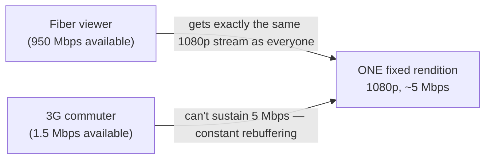

The obvious question: *if different viewers have wildly different bandwidth, why does everyone get exactly the same file?* Because the encoder only ever produces one option — there's nothing else to switch to, even if the player wanted to.

**The fix:** stop encoding one file — encode a **bitrate ladder**. Instead of one 1080p rendition, transcode into several resolutions at several bitrates: a concrete, real shape of this ladder is **6 resolutions (1080p, 720p, 480p, 360p, 240p, 144p) × 2 codecs (H.264 for universal compatibility, VP9 for modern devices — VP9 is Google's own royalty-free codec, roughly 30-50% smaller than H.264 at similar quality) = 12 output files** per upload. A player picks whichever rung fits its current network, and can move up or down without anyone re-encoding anything.

**The analogy — reuse the flat-pack idea from Chapter 2, one level up:** instead of vacuum-sealing the couch at one size, you vacuum-seal it at several sizes — small, medium, large — and let the customer's own truck decide which one it can actually carry today. Same underlying couch, several shippable versions of it.

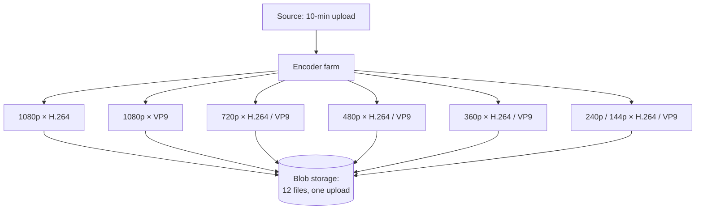

This is the moment the earlier mental-model line stops being an abstraction and becomes a literal count: **one upload is not one file, it's a matrix** — resolutions × codecs (and, next chapter, × segments). Twelve stored renditions from a single upload, and this exact shape (a handful of resolutions crossed with a couple of codecs) is a real approximation of what YouTube's actual production pipeline outputs.

**New problem:** having 12 separate whole *files* doesn't let a phone switch from the 480p file to the 720p file mid-playback without either buffering the whole new file from the start or awkwardly restarting. Whole-file renditions and smooth mid-stream quality switching don't mix.

**How I'd say this in an interview:** "One fixed rendition can't serve both a fiber connection and a train commuter well — the fix is a bitrate ladder, several resolution/codec combinations from the same source, so the player can pick the rung that fits. A real ladder shape is something like six resolutions times two codecs, twelve files from one upload. What that alone doesn't solve is switching between rungs *smoothly*, mid-video, without restarting."

---

## Chapter 5 — A book you can jump to any chapter of

Even with 12 renditions sitting in blob storage, ClipVine's player has a problem: each rendition is one long file. If a viewer's bandwidth drops halfway through a 10-minute 720p stream, switching to 360p means either starting a brand-new 360p download from byte zero (re-buffering everything already watched) or nothing at all. There's no way to jump into the *middle* of a different-quality file at the *same point in time*.

The obvious question: *what if, instead of one long file per rendition, each rendition were chopped into small, independently-requestable pieces — and every rendition used the exact same time boundaries for those pieces?* Then switching quality mid-stream is just: request the next few-second piece from a different rendition instead of the one you were on. No restart, no re-download of anything already watched.

**The fix:** **chunk every rendition into short segments** — a few seconds each (real-world segment durations run **2–10 seconds**) — plus a small text or XML **manifest** that lists every rendition and every segment's location. This is exactly what the two real, standardized adaptive-streaming protocols do: **HLS** (created by Apple, manifest is a `.m3u8` playlist, native on iOS/Safari) and **MPEG-DASH** (an open, codec-agnostic standard, manifest is a `.mpd` XML file, the primary delivery mechanism YouTube's web player actually uses).

**The analogy:** a book that's been cut into individually-numbered chapters, with a table of contents up front. You can start reading at chapter 1, and if chapter 4 turns out to be in a language you don't read well, you can grab the "easier" translation of *just chapter 5* — you don't have to re-read chapters 1 through 4 in a different language first.

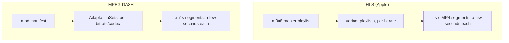

With segments in place, the player runs a genuinely simple loop: after each segment finishes downloading, measure current buffer health and recent throughput, and pick the rung for the *next* segment accordingly — drop a rung immediately if the buffer is draining (never let it hit zero, that's a visible rebuffer, the worst outcome), climb one rung at a time if bandwidth comfortably covers it (never jump straight to the top rung off one good measurement). No server-side per-viewer transcoding is involved at all — it's the client reading a shared manifest and requesting different pieces.

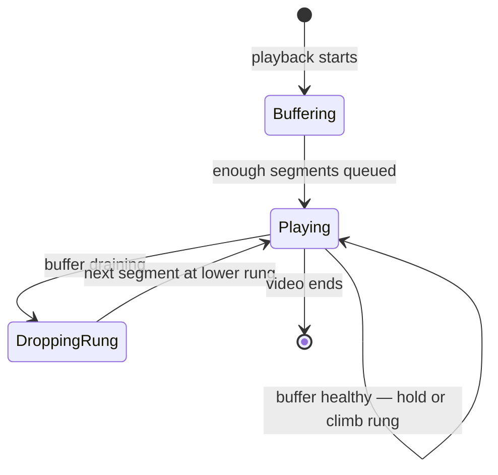

**New problem:** segments and a ladder solve *how* a video streams smoothly once bytes arrive — but they say nothing about *where* those bytes are physically sitting. Right now, every one of those segments, for every rendition, for every video, still lives in ClipVine's one origin data center. As ClipVine's viewer base spreads across the country and then the world, that becomes the next thing that breaks — not gradually, but by a specific, calculable multiplier.

**How I'd say this in an interview:** "Chunking is the second half of adaptive bitrate streaming — the ladder gives you quality options, segments are what let the player switch between them mid-stream without restarting. HLS and DASH are the two real standardized ways to package that: same idea, different manifest format, different ecosystem. It's purely client-driven — no per-viewer server-side transcoding."

---

## Chapter 6 — The 60x problem

ClipVine now has a solid single-region setup: chunked, multi-rendition video sitting in one origin's blob storage, served correctly to whichever rung a viewer's connection supports. Growth keeps going, and someone finally does the bandwidth math properly, the same way the reference guide's own capacity-estimation section does it.

Say ClipVine is uploading content at a rate where, per minute, viewers watch **300x more minutes of video than get uploaded** — a real, documented ratio for large video platforms (this specific 1:300 upload-to-view ratio is the number the reference guide's own worked estimate uses for YouTube's actual scale). Encoded viewing bitrate averages meaningfully higher than encoded upload-storage bitrate, because you're streaming continuously, not just storing once. Multiply it out the way the guide does: at YouTube's real, documented scale (≈500 hours of video uploaded *per minute*), this ratio produces roughly **200 Gbps of upload bandwidth versus roughly 12 Tbps of download/viewing bandwidth** — a **60x jump** from what comes in to what has to go out. ClipVine is nowhere near YouTube's absolute numbers, but the *ratio* is the same shape at any scale that has real viewers: a small fraction of bandwidth goes toward accepting new content, a vastly larger multiple goes toward serving it back out, repeatedly, to everyone who watches.

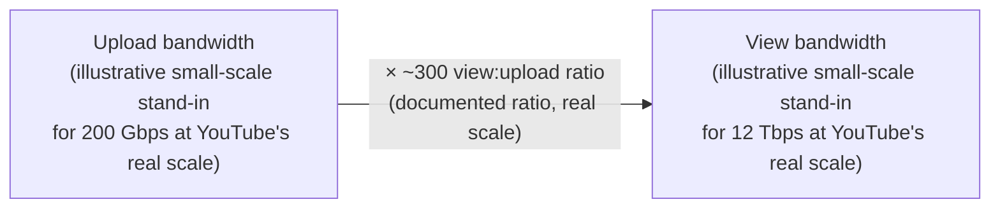

The obvious question: *can one origin data center, anywhere, physically serve output bandwidth that's 60x its input?* No. No single fleet of servers, however large, should be expected to absorb that kind of egress without help — the request rate for *viewing* dwarfs the request rate for *uploading* by the same multiple, every single day, forever, and it only grows.

**The fix, and its name: a CDN** — a network of servers ("edges" or "PoPs," points of presence) geographically spread out, sitting between the origin and viewers, caching copies of segments so that most requests never have to travel all the way back to the one origin at all.

**New problem:** a CDN edge has finite storage. It can't cache *everything* — that just recreates the origin's storage problem at every single edge simultaneously. It needs a policy for what to cache, where, and when.

**How I'd say this in an interview:** "The upload-to-view bandwidth multiplier — something like 60x at YouTube's documented real scale — is the single number that most cleanly justifies a CDN in this design; no origin fleet is meant to eat that much egress directly. What a CDN doesn't answer by itself is *which* content goes to *which* edges, and that's a real caching-policy decision, not just 'turn on a CDN.'"

---

## Chapter 7 — Stock the shelf before the sale, or order it only when someone asks

ClipVine turns on a CDN and immediately hits the policy question: some videos are wildly predictable hits — a scheduled creator livestream recap posted at a known time — and some are the vast, unpredictable long tail — a four-year-old tutorial that gets forty views a month. Treating both the same way is wrong in both directions.

**Push CDN**: the origin proactively copies content out to edge servers *before* anyone asks for it. Great for predictable hits — the content is always warm, first-request latency is always fast. But if the prediction is wrong, that's wasted edge storage sitting idle.

**Pull CDN**: the edge does nothing until the first real viewer requests a segment — that request is a cache **miss**, so the edge fetches it once from the origin, serves it, and *keeps* a copy for the next viewer. Storage-efficient — nothing gets cached that nobody actually wanted — but the very first request for anything is always a slower round trip to origin.

**The analogy:** push is stocking the store shelf before a big sale you know is coming; pull is a library that only orders a specific book in after the first person actually asks for it — and then keeps a copy on the shelf for the next reader.

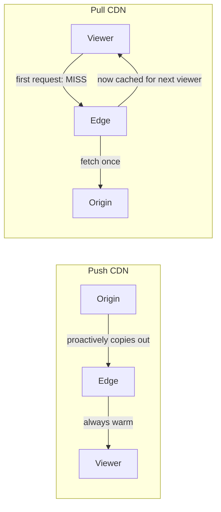

ClipVine's real policy, matching the same real trade-off that large platforms actually make: **push** content whose view velocity crosses a "trending" threshold — pre-warm it across many regional edges ahead of the demand curve — and leave everything else **pull**-only, fetched to an edge on first request and evicted if it goes cold. A real, documented cache-hit-ratio outcome of doing this well on genuinely popular content is **90–95%** — meaning only 5–10% of requests for hot content ever have to make the slower trip back to origin at all.

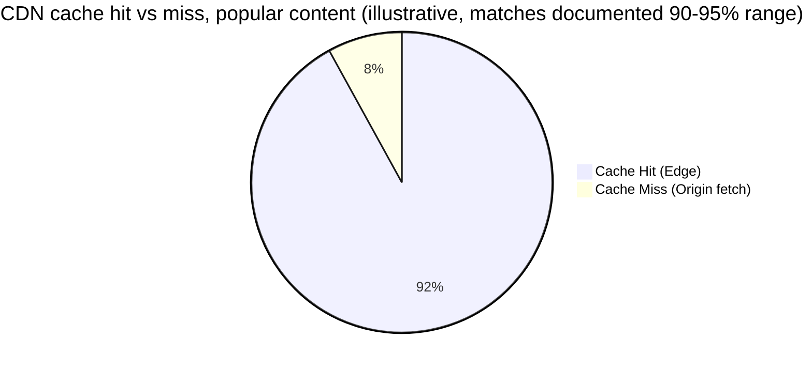

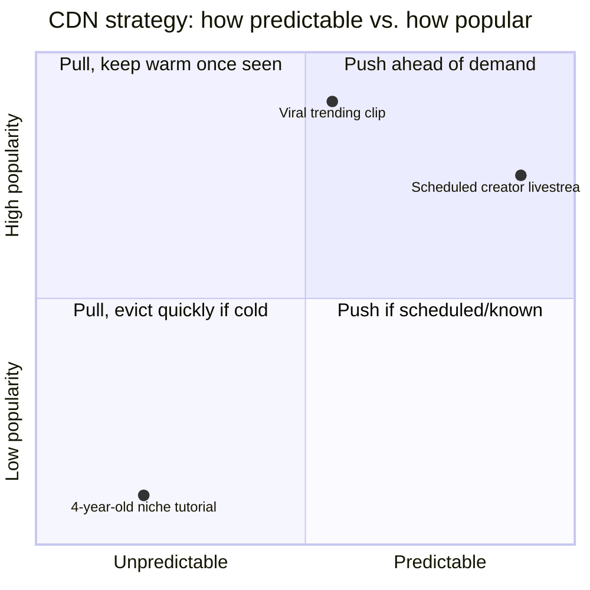

**New problem:** deciding push-vs-pull is a policy for *content*. It says nothing about what happens when the *edge itself* — the physical PoP nearest a given viewer — is unhealthy, or has simply never seen a particular video before even though it's hot everywhere else. Popularity is global. Caching is per-PoP.

**How I'd say this in an interview:** "Push and pull aren't competing options, they're both used at once — push for the predictably popular slice, pull for the long tail, based on view velocity crossing a threshold. A real cache hit ratio of 90-95% on popular content is the number that tells you the policy is working. What it doesn't cover is a specific edge being down, or being cold for a video that's hot everywhere else — that's a separate failure mode."

---

## Chapter 8 — The corner store that's closed reroutes you to the next one

Two things bite ClipVine in the same month, both variations on "the nearest edge isn't actually available for this request."

First: a regional PoP has a hardware fault and stops responding to health checks. Every viewer whose GeoDNS resolution pointed there needs to be rerouted, transparently, to the next-nearest healthy PoP — without the viewer ever seeing an error.

Second, and more subtle: a cricket-highlights-style clip goes viral and gets pushed to every major regional PoP within minutes of crossing the trending threshold — except one small town's local edge, which has simply never served a request for *this* video before, because no one nearby has watched it yet. A viewer there gets a cache **miss** even though the video is globally hot everywhere else — popularity doesn't automatically mean "cached at every single PoP on Earth," it means "cached wherever it's already been requested or proactively pushed."

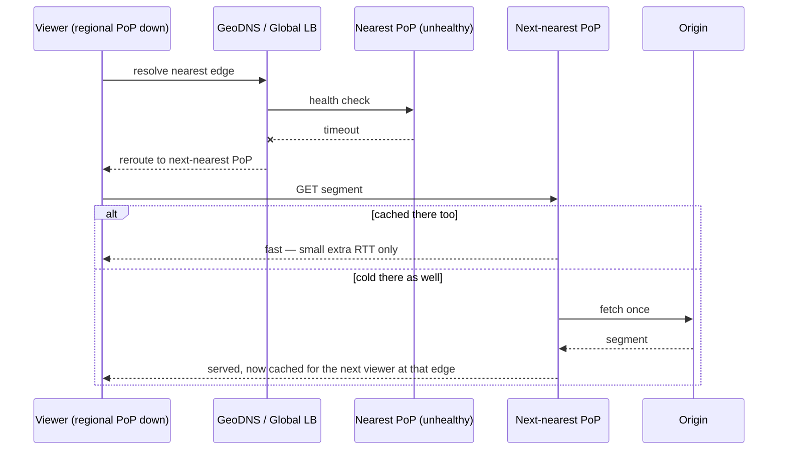

**The fix, reusing the corner-store idea from the push/pull analogy, one level up:** if your regular corner store is closed, your GPS silently reroutes you to the next-nearest one — a few extra minutes, no visible failure. That's exactly the job of a **global load balancer doing health checks and geo-aware failover**: unhealthy PoPs get taken out of rotation automatically, and a cold miss at any single PoP is just... a normal cache miss, handled the same way any pull-CDN miss is handled, with the added benefit that *that* edge is now warm for the next viewer nearby.

One more piece worth naming here: **origin storage itself is tiered by popularity**, not treated as one uniform pool. Popular and moderately-popular content sits on low-latency **flash/SSD** storage at origin, because pushes and pulls both benefit from a fast source; the long tail sits on cheaper, denser **spinning disk**, where cost-per-GB matters more than shaving milliseconds off a rare request.

**New problem:** all of this — encoding, ladders, segments, CDN, failover — is about getting *bytes* to viewers efficiently. None of it has touched the other half of the platform yet: the database that stores *what a video actually is* — its title, its channel, its comments, its like count — and that database has been quietly getting hammered the whole time.

**How I'd say this in an interview:** "PoP failover is the same health-check-and-reroute pattern you'd use for any regional failure, just scoped to CDN edges — a cold miss at one PoP isn't a bug, it's the pull-CDN model working as designed, and origin itself should be tiered flash-vs-disk by popularity too. That closes out delivery. Metadata is a completely separate subsystem, with its own separate scaling story."

---

## Chapter 9 — One filing cabinet, then a receptionist who knows all of them

ClipVine's metadata — video titles, channel info, comments, likes, view counts — has lived in one MySQL instance since day one, because it's exactly the kind of structured, relational, join-friendly data that a relational database is good at, and honestly for years this was never the bottleneck. Then a video goes properly viral, and comments and likes start arriving against that one video's row at a rate of **thousands of writes per second** — a real, documented shape of hot-row problem large platforms hit, not a hypothetical.

The obvious first fix: **shard by `video_id`** — split the one giant table across several machines, so a video's data always lives together (pagination and "top comment" queries never cross shards), and no single machine holds every video's writes.

**New problem, almost immediately:** sharding by hand means the application now has to know which shard holds which video, has to handle resharding as ClipVine grows, has to route connections correctly, and has to somehow still get ACID guarantees for things like "this like was recorded exactly once." Every one of those concerns leaks straight into application code, and it gets worse with every new shard added.

**The fix:** put a routing/abstraction layer in front of the shards, so the application still thinks it's talking to one database. This is exactly what **Vitess** does — a real, documented system YouTube built for exactly this problem and open-sourced in 2010 (it now also powers Slack, GitHub, and HubSpot, among others). **VTGate** routes every query to the right shard; **VTTablet** wraps each physical MySQL instance; a topology service tracks the shard map. The app keeps writing normal SQL against what looks like one database — Vitess handles resharding, connection pooling, and failover underneath.

**The analogy — one filing cabinet becomes many, plus someone who always knows which one has your folder:** a single filing cabinet works until it's full, so you add more cabinets — but now anyone looking for a folder has to guess which cabinet it's in. Vitess's VTGate is the receptionist standing in front of all the cabinets who always knows exactly which one to walk you to, so nobody visiting the office ever has to know there's more than one cabinet at all.

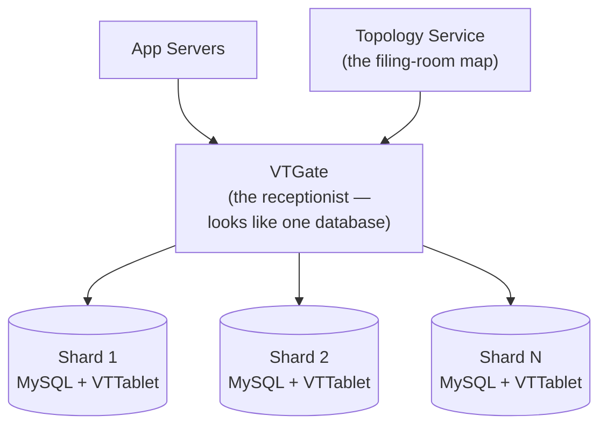

A quick, concrete schema check is worth doing here, because "a metadata DB" alone reads as vague in an interview: `VIDEO` rows hold pointers (`manifest_url`) and attributes, never bytes; `RENDITION` is a one-to-many child of `VIDEO` — literally the "matrix, not a file" idea from Chapter 4, made into rows; `COMMENT` self-references (`parent_comment_id`) for threaded replies, no separate replies table needed; and a `VIEW` table logs one *row per playback event* rather than just incrementing a counter — because a counter alone can't answer "did they actually watch it," which matters both for ranking and, next chapter, for fraud.

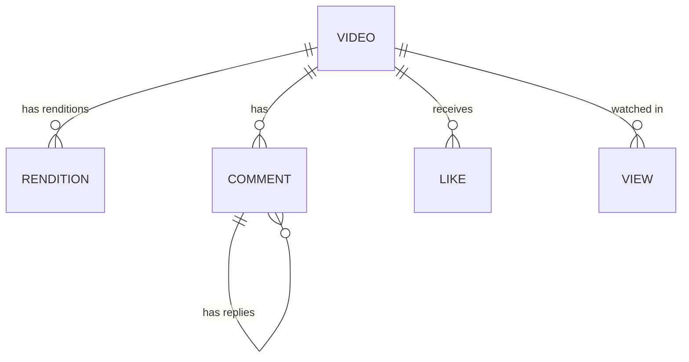

**New problem:** sharding by `video_id` correctly spreads *different videos'* writes across different shards — but a single viral video's comments and likes still all land on *one* shard, because they're all the same `video_id`. Vitess solved "one database can't hold everyone," not "one hot video can flood one shard's write capacity by itself." That's a different, narrower problem, and it shows up next.

**How I'd say this in an interview:** "Plain sharding fixes total capacity but pushes every routing and resharding decision into application code — Vitess is the real answer: a routing layer that keeps the app thinking it's talking to one database while resharding and failover happen underneath. It doesn't, on its own, fix one single viral video hammering one shard — that's a hot-row problem, one layer down."

---

## Chapter 10 — The turnstile clicker at the stadium gate

Vitess spreads *different* videos across shards fine. But one video going properly viral still means thousands of `like_count` and `comment_count` increment writes per second, all against the *same row*, on the *same shard* — a hot row, no matter how many total shards ClipVine has. If every single like naively does `UPDATE videos SET like_count = like_count + 1 WHERE video_id = X`, that one row becomes a lock-contention bottleneck all by itself, independent of total system capacity.

The obvious question: *does the like counter really need to be exactly, synchronously correct at the millisecond someone taps the button?* No — nobody is going to notice or care if the number they see is a few seconds stale. What they *would* notice is the like button spinning or failing because the row is locked.

**The fix:** stop writing the counter synchronously on every single like. Buffer increments in an in-memory counter (a cache, or a lightweight aggregator), and flush the accumulated total to the database on a short interval — a real, reasonable cadence is **every 1–5 seconds**, or on a batch-size threshold, whichever comes first. The count shown to users is approximately right in real time, and exactly right within a few seconds.

**The analogy:** a turnstile clicker at a stadium gate. The attendant clicks a mechanical counter as people walk through — they don't stop and hand-write an exact running tally in a ledger after every single person. The number on the clicker is close enough, instantly, and gets reconciled against the precise count later.

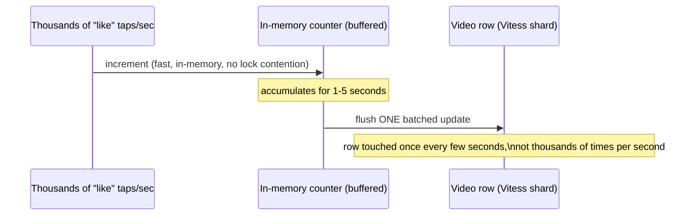

Worth also rate-limiting at the very edge of this path — a token-bucket per user (and per IP, for unauthenticated abuse) rejects a spam-like flood before it ever reaches the buffered counter at all, the same principle as any abuse-prevention gate: catch it before it costs you anything downstream.

**New problem:** the buffered-counter trick makes engagement counters *fast and scalable*. It says nothing about whether the underlying numbers are *honest*. A like button being gamed is annoying; a **view count** being gamed is a direct fraud problem — bot farms and click-rings have a real financial incentive to inflate it, for ad revenue or perceived virality, in a way nobody bothers doing for a comment count.

**How I'd say this in an interview:** "The fix for a hot counter row isn't sharding harder, it's relaxing exactly-right-this-millisecond correctness — buffer the increment in memory, flush on a short interval, and the count is approximately right always and exactly right within seconds. Rate-limiting the write path before it ever reaches the counter is the other half of the same defense. That's the whole fix for likes and comments — view counts need one more layer on top, because they're a fraud target, not just a scale problem."

---

## Chapter 11 — The ticket stub that only counts if you actually sat through the show

ClipVine applies the exact same buffered-counter trick to view counts and, a few weeks later, notices something odd: a handful of videos have view counts climbing far faster than any plausible organic audience, with almost no comments or likes to match. Someone is sending a flood of raw `GET /videos/{id}` requests — no real playback, just automated pings — because a higher view count is worth something (ad impressions, perceived popularity, algorithmic boost), and nothing was checking whether anyone actually *watched* anything.

The obvious question: *what should even count as "one view"?* Not a raw HTTP request — that's just asking for metadata, anyone's browser does that constantly for reasons that have nothing to do with watching. A real view should require some minimum evidence of actual playback `[illustrative — exact thresholds real platforms use for "what counts as a view" are closely-guarded, undisclosed details; the shape of the check below is a reasonable stand-in]`: a client-side ping sent only after several seconds of confirmed playback, not a page load.

**The fix, layered on top of Chapter 10's buffering:**

1. **Log every raw event, regardless of outcome** — every ping still lands in the `VIEW` table from Chapter 9, because that raw data feeds fraud detection and watch-time-based ranking even when it *doesn't* move the public counter.
2. **Only count validated pings toward the public number** — basic checks (rate limits, known bot signatures, does this look like a real session) filter obvious junk immediately; a dedup window collapses the same viewer replaying a video 50 times in a minute into one counted view for public display, even though every play still counts toward watch-time analytics.
3. **Score suspicious patterns asynchronously, after the fact** — many views from a narrow IP range with no realistic watch-time distribution gets flagged, and the count can be retroactively corrected once confirmed, rather than trying to catch every case perfectly in real time.

**The analogy:** a ticket stub that only counts once you've actually sat through some of the show — someone walking past the box office window and being handed a stub for free doesn't count as an audience member, and if a whole busload of people did that as a scam, the venue can void those stubs after the fact without having had to stop everyone at the door and interrogate them individually.

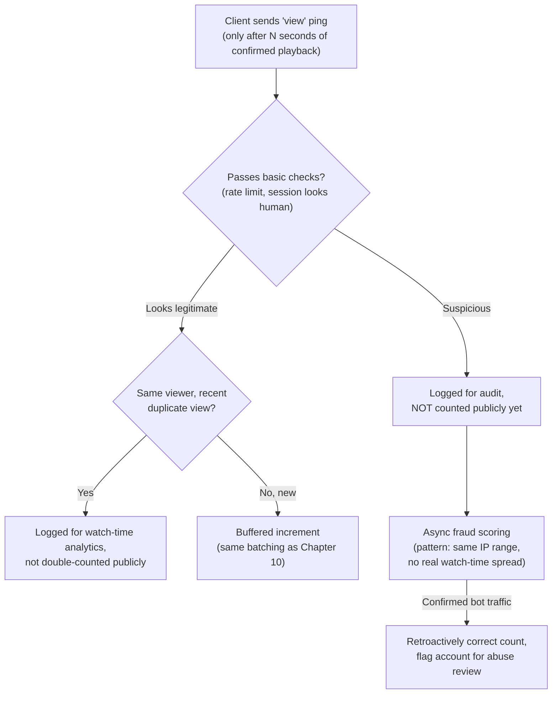

**New problem:** engagement and view-count integrity are now handled. But none of this addresses a much more basic question ClipVine keeps getting asked as its catalog grows: with thousands of videos now, how does anyone actually *find* the right one, or get shown something they'd actually want to watch?

**How I'd say this in an interview:** "A view isn't a raw request, it's a validated playback event — minimum watch duration, dedup within a window, and async fraud scoring on top, because unlike a like count, a view count is a direct fraud target with real financial incentive behind gaming it. The pattern underneath is the same as engagement counters: log everything, count validated events only, and let the audit trail correct the public number after the fact rather than trying to be perfect in the first millisecond."

---

## Chapter 12 — A wide net, then a fine-tooth comb

ClipVine's catalog has grown past the point where anyone can browse it — people need to search, and they need a homepage that shows them something worth watching without searching at all. Two different problems, and ClipVine's engineers initially try to solve both with one signal, which turns out to be a mistake worth walking through.

**Search** first: every uploaded video gets processed into a searchable document (title, channel, description, category), keywords land in an inverted index, and at query time candidates get retrieved and then **re-ranked** using view count, watch time, and freshness — not pure keyword match, because "most relevant" and "most exact text match" aren't the same thing.

**Recommendations** are a harder problem: ClipVine can't run an expensive, feature-rich model over every video in the catalog for every single homepage load — that's too slow and too costly to do millions of times a second. The real, documented answer (this two-stage shape matches YouTube's own published recommendation architecture — Covington et al., "Deep Neural Networks for YouTube Recommendations," 2016) is a **two-stage funnel**: a cheap **candidate generation** stage narrows millions of videos down to a few hundred using coarse signals (watch history, subscriptions, related topics), then a much richer **ranking** stage scores those few hundred down to a few dozen using session context, engagement patterns, and diversity.

**The analogy:** a wide net first, then a fine-tooth comb. You can't run a fine-tooth comb over an entire ocean — you'd never finish — so you use a wide net to pull in a manageable haul, *then* comb through that much smaller haul carefully.

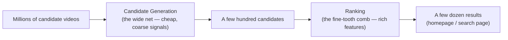

Here's the mistake ClipVine actually makes, and the fix it reveals: an engineer wires the *recommendation* score straight into the *CDN push* decision, reasoning "if it's heavily recommended, it must be about to be watched a lot, so push it to every edge." The result: a video recommended intensely to one small, geographically scattered niche audience — say, fans of a specific obscure hobby — gets proactively pushed to edges worldwide. Almost none of those edges ever see more than one or two of that niche audience's requests, so most of that pushed data sits idle, wasting exactly the edge storage Chapter 7 was trying to protect.

**The real fix:** treat "popular" and "recommended" as two genuinely separate signals, never merge them. **Popularity** — raw, global view velocity — is what should drive CDN push decisions, because it predicts *where geographically* demand is concentrated. **Recommendation** is a *per-user* signal that drives what shows up on one specific person's homepage, and says nothing about geographic concentration at all. A video can be globally unpopular but strongly recommended to one user's niche interest, or globally viral but irrelevant to a given individual — both are true at once, for different reasons, and only one of them should ever touch a CDN push decision.

**New problem:** ClipVine now correctly separates these two signals — but both signals, and every search query, still assume every video is *visible to everyone who's allowed to see it*, and up to now, that's been "everyone, full stop." A creator asking for a private, invite-only upload is the next feature request, and it breaks something interesting.

**How I'd say this in an interview:** "Search is retrieval plus engagement-aware re-ranking, and recommendations are a two-stage funnel — cheap candidate generation narrowing millions to hundreds, then expensive ranking narrowing hundreds to dozens, the same real shape YouTube's own published architecture uses. The trap is conflating 'popular' with 'recommended' — one is global and drives CDN placement, the other is per-user and drives personalization, and mixing them wastes edge capacity on content that's hot for one person, not one region."

---

## Chapter 13 — A wristband checked once at the gate

A creator asks ClipVine for a **private video** — visible only to a specific list of people. The first implementation is the obvious, naive one: every time a viewer requests a video segment, the CDN edge calls back to the app server to check the access-control list before serving it.

Here's why this is bad, with a real number behind it: a cross-region round trip for that ACL check runs roughly **150–200 ms** (a real, documented range for cross-region network latency). A single video is chopped into hundreds of a-few-seconds-each segments. If *every segment request* pays that round trip, playback of a private video buffers constantly — the entire point of caching segments at a nearby edge is defeated, because the edge can never actually decide anything on its own; it has to ask permission every single time.

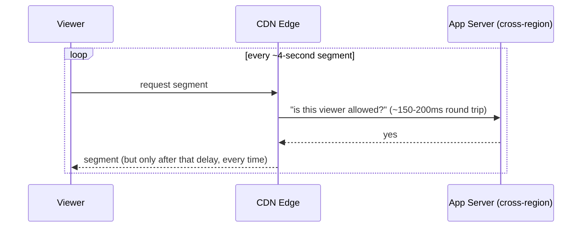

The obvious question: *does access actually need to be re-checked on every single segment, or just once, up front?* Once — nothing about a viewer's permissions changes in the four seconds between one segment and the next.

**The fix:** **signed URLs**. The app server checks the ACL exactly **once**, at manifest-request time — the moment a viewer asks "can I watch this at all" — and if allowed, mints a time-limited, HMAC-signed URL (`video_id` + `expiry` + optional `user_scope`, signed with a server-side secret). Every subsequent segment request carries that signature, and the CDN edge validates it **locally**, with simple math, no database call, no round trip, no knowledge of ACLs at all.

**The analogy:** a wristband checked once at the front gate of a concert. The person at the gate does the real work — checking your ticket, confirming you're allowed in — once. Every usher inside just glances at the wristband; they don't call the box office to re-verify you every time you walk past a different section.

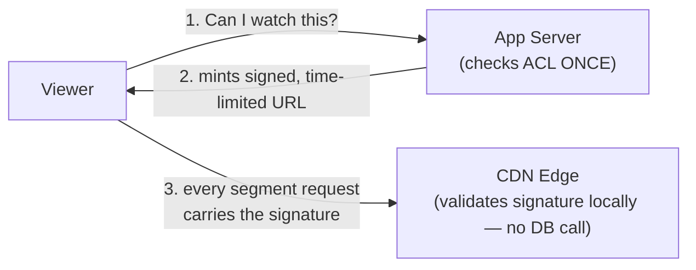

This distinction matters for the middle tier too: **unlisted** videos use an unguessable, high-entropy video ID — that's obscurity, not real cryptographic access control, and it's excluded from search/recommendations on purpose. Only **private** videos get the actual signed-URL treatment.

**New problem:** access control answers *who's allowed to watch*. It says nothing about content that was fine when uploaded but later gets flagged — a copyright claim, a policy violation, a user report — after it's already public and already cached at edges everywhere.

**How I'd say this in an interview:** "Signed URLs are the standard answer to private video, and the reason they work is doing the expensive check exactly once, at manifest time, so every segment request afterward is a cheap, stateless signature check at the edge — the edge never needs to know anything about ACLs. Unlisted is a different, weaker guarantee: an unguessable ID, not real cryptography, and it's worth saying that distinction out loud unprompted."

---

## Chapter 14 — The bouncer at the door, and the video that gets flagged after the fact

Two more scenarios round out the abuse story. First: a burst of new accounts starts mass-uploading near-identical copies of a video that just went viral — clearly trying to ride the trending wave for their own channels. Second: a legitimate creator's video gets a copyright claim from a rights holder two weeks *after* it's already been served to thousands of viewers and cached across dozens of edges.

**Upload-side abuse** gets handled in a fixed order, each check cheaper than letting bytes actually land:
1. **Rate limit per account and per IP** (a token bucket) — catches both one spammy account and many accounts coming from one source.
2. **Quota check before any bytes land** — reject an over-quota upload before it ever touches storage, not after wasting the transfer.
3. **Fingerprint/dedup check** — the same content-fingerprinting technique used to catch storage-wasting duplicates doubles as a repost/spam filter.
4. **Tiered limits by trust** — new, unverified accounts get tighter limits than established channels with a track record.

**The analogy:** a bouncer checking IDs at the door before anyone gets near the velvet rope — every one of these checks happens *before* the expensive part (accepting and storing a whole file), the same principle as rate-limiting before touching a database row from Chapter 10.

**Content moderation** is the other half — what happens to something that was fine at upload time but gets flagged later. Two separate paths feed the *same* state machine: **proactive** (an automated fingerprint match against a database of claimed content, run continuously, not just at upload) and **reactive** (a user files a report). Either path lands the video in the same review flow.

```mermaid
stateDiagram-v2
    [*] --> Clean
    Clean --> Flagged: proactive fingerprint match OR user report
    Flagged --> UnderReview: routed to human/automated review
    UnderReview --> Clean: false positive
    UnderReview --> Demonetized: minor policy violation
    UnderReview --> Removed: severe violation or upheld copyright claim
    Demonetized --> Clean: appeal upheld
    Removed --> Clean: appeal upheld
    Removed --> [*]: appeal window closed
```

**New problem:** every fix so far has assumed ClipVine's infrastructure — origin, primary metadata shards, encoder farm — all lives in one data center region. Eighteen months in, an actual regional outage happens, and it turns out nobody had defined, in advance, exactly how much data that's allowed to cost, or how long it's allowed to take to recover.

**How I'd say this in an interview:** "Upload abuse and playback access control are two separate systems solving two separate problems — don't merge them into one 'auth check' in an answer. Moderation has two entry points, proactive fingerprinting and reactive reporting, feeding one review state machine, and it's worth saying explicitly that moderation isn't purely reactive — a good system is actively scanning, not just waiting for reports."

---

## Chapter 15 — Two dashboards and a backup region

ClipVine's primary data center loses power for two hours. Blob storage and the primary metadata shards for a chunk of videos become unreachable. The postmortem surfaces two separate failures stacked on top of each other: first, nobody had a clear, pre-agreed answer for "how much data are we willing to lose, and how long are we willing to be down" before this happened; second, nobody was even alerted early — the team found out from a spike in support tickets, not from a dashboard.

The obvious first question: *what should actually page someone, before users notice?* Not a generic "error rate," which lags the real problem — two specific numbers, one per pipeline, are the leading indicators:

- **Encode queue depth / oldest-job age** (upload pipeline) — a rising backlog is the earliest sign the encoder farm can't keep up, long before creators start complaining that their videos are stuck "processing."
- **Time-to-first-frame and rebuffer ratio** (playback pipeline) — these are literally what "smooth streaming" means to a viewer; cache hit ratio and egress bandwidth are useful *diagnostics* once something's already wrong, but they aren't what the user experiences directly.

```mermaid
flowchart TD
    subgraph Upload["Upload pipeline health"]
        E1["Encode queue depth\n(earliest signal)"] --> E2["Encode latency p50/p95"]
    end
    subgraph Playback["Playback pipeline health"]
        P1["Time-to-first-frame"] --> P3["Does starting a video feel instant?"]
        P2["Rebuffer ratio"] --> P4["Does it feel smooth once started?"]
    end
```

The second, structural fix: **cross-region replication**, for both halves of the data. Blobs get replicated to at least two geographically separate regions at write time — the same 3x replication factor used for basic durability, spread across separate buildings, not just separate disks in one building. Metadata gets replicated across regions through Vitess's own multi-cell topology — each region is a cell with its own local shards, and cross-cell replication sits on top of the cross-shard replication already inside one cell.

On a full region failure, the exact same mechanism from Chapter 8's PoP failover runs again, at a bigger blast radius: the global load balancer's health checks detect the failed region and reroute traffic to the next-nearest healthy one, within seconds — no manual intervention required for the reroute itself.

```mermaid
sequenceDiagram
    participant GLB as Global LB
    participant R1 as Region A (down)
    participant R2 as Region B (healthy)
    GLB->>R1: health check
    R1--xGLB: no response
    GLB-->>R2: reroute all affected traffic
    Note over R2: same reroute mechanism as PoP failover,\njust a bigger blast radius
```

What this bounds, explicitly, are two numbers worth naming by name: **RPO** (Recovery Point Objective — how much data could be lost) is bounded by the async replication lag at the moment of failure, since anything written to the failed region's primary but not yet replicated is the only real risk. **RTO** (Recovery Time Objective — how long until service is back) is dominated by DNS/LB reroute time, typically low minutes — not by how long it takes to physically fix the failed region, since traffic has already moved on by then.

**How I'd say this in an interview:** "Saying 'we replicate' isn't a disaster-recovery story by itself — give both a bounded RPO and RTO. Region failover reuses the exact same health-check-and-reroute mechanism as CDN PoP failover, just with a much bigger blast radius. And the two metrics that should page someone before customers ever notice are encode queue depth on the upload side and time-to-first-frame plus rebuffer ratio on the playback side — everything else is a diagnostic, not a user-facing signal."

---

## Where the story actually lands

```mermaid
flowchart LR
    A["Ch1: one box\n(disk fights itself)"] -->|"fixes: decouple storage\nbreaks: raw bytes still huge"| B["Ch2: transcode/compress"]
    B -->|"fixes: 20:1 smaller\nbreaks: inline encode blocks uploads"| C["Ch3: async encode queue"]
    C -->|"fixes: accept ≠ encode\nbreaks: one fixed quality for everyone"| D["Ch4: bitrate ladder"]
    D -->|"fixes: quality options exist\nbreaks: can't switch mid-stream"| E["Ch5: chunk into segments (HLS/DASH)"]
    E -->|"fixes: smooth ABR\nbreaks: one origin can't serve everyone"| F["Ch6: the 60x problem"]
    F -->|"fixes: need a CDN\nbreaks: what to cache where"| G["Ch7: push vs pull"]
    G -->|"fixes: hot vs long-tail policy\nbreaks: one PoP down or cold"| H["Ch8: PoP failover + origin tiering"]
    H -->|"fixes: delivery is solid\nbreaks: metadata DB can't take the writes"| I["Ch9: Vitess sharding"]
    I -->|"fixes: total capacity\nbreaks: one video's row is still hot"| J["Ch10: buffered counters"]
    J -->|"fixes: counters scale\nbreaks: view counts are a fraud target"| K["Ch11: validated views"]
    K -->|"fixes: engagement solved\nbreaks: how do people find anything"| L["Ch12: search + two-stage recs"]
    L -->|"fixes: discovery solved\nbreaks: private video check is too slow"| M["Ch13: signed URLs"]
    M -->|"fixes: access control\nbreaks: abuse + late-discovered violations"| N["Ch14: rate limits + moderation"]
    N -->|"fixes: abuse handled\nbreaks: one region outage, no plan"| O["Ch15: monitoring + multi-region DR"]
```

```mermaid
mindmap
  root((Design YouTube))
    Upload pipeline
      Decouple bytes from app server
      Transcode, never serve raw
      Async encode queue + farm
      Bitrate ladder + segments
    Playback pipeline
      60x view:upload bandwidth -> CDN
      Push hot, pull long tail
      PoP + origin tiering
      Client-side ABR, no server transcode
    Metadata + engagement
      Vitess for structured data
      Buffered counters for hot rows
      Validated views, fraud scored async
    Discovery
      Search: index + engagement re-rank
      Recs: candidate gen then ranking
      Popular (global) != Recommended (per-user)
    Trust + resilience
      Signed URLs, checked once
      Rate limit before any write
      Moderation: proactive + reactive
      RPO/RTO, cross-region replication
```

Every real video platform interview question sits somewhere on this chain. The skill isn't reciting all fifteen chapters — it's stopping where the stated requirements say to stop. A simple "design a video-sharing app" prompt might reasonably stop around Chapter 8 (delivery). A prompt that specifically mentions monetization, fraud, or compliance needs Chapters 10 through 15. If nobody's asked about private video or moderation, walking there unprompted reads as padding, not depth.

---

## Grill me — adversarial follow-ups

**Q1: "Why not just buy a bigger, faster single server instead of decoupling storage and encoding?"**
Because that only buys headroom, not a fix — the moment traffic outgrows whatever "bigger" you bought, you're back to the exact same wall, just later and after spending more money. The actual problem is architectural: one box doing upload, encode, and serve at once can't scale each of those independently, no matter how fast that one box is.

**Q2: "You said encoding is asynchronous — so is a video immediately watchable the instant it's uploaded?"**
No, and that's expected — there's a real processing window between "uploaded" and "published" while the encoder farm produces the bitrate ladder and thumbnails, roughly tracking the source video's own duration on a shared, parallelized farm. That's exactly why creators see a "processing" spinner proportional to how long their video is, and it's a deliberate trade-off: real-time transcoding at request time would be far too slow and expensive to do per-viewer.

**Q3: "If push CDN pre-warms hot content, what happens the very first time a video goes viral — before it's crossed the trending threshold?"**
It's served the normal pull way — cache miss, fetch from origin, cache it — right up until view velocity crosses whatever threshold triggers a proactive push. There's necessarily a short lag between "starting to go viral" and "now pre-warmed everywhere," and during that lag some viewers eat a slower origin round trip; that's an accepted cost of not trying to push every video preemptively.

**Q4: "Isn't sharding metadata by `video_id` just moving the single-point-of-failure problem down to one shard per hot video?"**
Yes, exactly — sharding buys total system capacity, not protection for any one shard against a single video's own hot-row traffic. That's precisely why the buffered-counter fix exists on top of sharding: it's a separate problem (contention on one row) from the one sharding already solved (capacity across the whole table).

**Q5: "Why buffer counters instead of just adding more database read/write replicas?"**
More replicas help with read fan-out, but this is a write-contention problem on one specific row — more replicas don't reduce how many writers are fighting to update the same row, they just add more places that also need to eventually agree on its value. Buffering the increment in memory and flushing in batches directly reduces how often that row gets touched at all, which is the actual bottleneck.

**Q6: "How would you actually catch someone gaming the view counter with a botnet spread across thousands of IPs?"**
Per-IP rate limiting alone won't catch it, since no single IP looks abnormal — you need pattern-level fraud scoring on the aggregate: many sessions with implausible watch-time distributions (near-zero variance, exact durations, no natural drop-off curve) converging on one video faster than any organic audience plausibly would. That scoring runs asynchronously, after the raw events are already logged, and corrects the public count retroactively rather than trying to block every fraudulent ping in real time.

**Q7: "Recommendation and search both rank things — why do they need separate systems at all?"**
They're solving different retrieval problems even though both end in a "ranked list." Search starts from an explicit query and an inverted index; recommendations start from no query at all and have to generate candidates purely from behavioral signals, which is why recs need the extra candidate-generation stage that search mostly doesn't.

**Q8: "Your signed-URL fix checks access once at manifest time — what stops someone from just sharing that signed URL with people who shouldn't have access?"**
The signature is time-limited by design, so a leaked URL only works until it expires, bounding the blast radius; for the highest-sensitivity content you'd also scope the signature to a specific user or session, not just a video ID and expiry, so even a URL shared within the expiry window fails a scope check. It's a real trade-off between edge-side statelessness and how tightly you can bind the URL to one specific viewer.

**Q9: "What's actually the biggest single limitation left in this design, at the end of Chapter 15?"**
Two honest ones: there's still no deduplication of near-identical uploads, which wastes real storage and complicates copyright enforcement, and the relational metadata layer — even sharded through Vitess — is the piece most likely to need attention again first at another order of magnitude of growth, before delivery or storage do.

**Q10: "If someone just says 'design a video platform' cold, where do you actually start?"**
Say the two-pipeline framing out loud first — write-heavy, latency-tolerant upload versus read-heavy, latency-intolerant playback — because almost every later decision is just an implementation detail of one side or the other. Then estimate scale out loud, sketch upload and playback as two separate flows through one diagram, and let the interviewer's follow-ups decide which 2-3 chapters of this story you actually walk deep into.

---

## Cheat sheet — one line per stop on the story

- **One box doing everything**: disk and bandwidth fight each other between uploads and playback — the reason storage gets decoupled from the app server on day one.
- **Transcoding**: never serve the raw upload — compress once at ingest, ~20:1 raw-to-encoded is the number that justifies it.
- **Async encode queue + farm**: decouple accepting an upload from encoding it, so one slow encode can't block someone else's fast upload.
- **Bitrate ladder**: one fixed rendition can't serve both a fiber connection and a 3G commuter — encode multiple resolutions/codecs (a real shape: 6 resolutions × 2 codecs = 12 files).
- **Chunking + HLS/DASH**: cut every rendition into short segments with a shared manifest, so the player can switch quality mid-stream without restarting.
- **The 60x problem**: view bandwidth dwarfs upload bandwidth by a documented ~60x multiplier at real scale — the single number that justifies a CDN.
- **Push vs pull CDN**: push pre-warms predictable hits, pull caches the long tail on first request — real systems use both, split by view velocity.
- **PoP failover + origin tiering**: health-checked reroute to the next-nearest edge on failure; origin storage itself is flash for hot content, disk for the long tail.
- **Vitess**: routing layer in front of many MySQL shards so the app still sees "one database" — the real, documented fix once plain sharding leaks into app code.
- **Buffered counters**: a hot row from viral likes/comments is fixed by relaxing "instantly exact" to "approximately real-time, exactly correct within seconds."
- **Validated views**: a view is a confirmed-playback event, not a raw request — log everything, count validated events, fraud-score and correct after the fact.
- **Search vs recommendations**: search re-ranks retrieval results with engagement signals; recs are a two-stage funnel, cheap candidate generation then expensive ranking.
- **Popular ≠ Recommended**: global view velocity drives CDN push; per-user relevance drives the homepage — conflating them wastes edge capacity.
- **Signed URLs**: check access once at manifest time, sign a time-limited URL, let the CDN edge validate the signature locally with no DB round trip per segment.
- **Upload abuse + moderation**: rate-limit and quota-check before bytes land; moderation has two entry points (proactive fingerprint match, reactive report) feeding one review state machine.
- **Monitoring + multi-region DR**: encode queue depth, time-to-first-frame, and rebuffer ratio are the leading signals; always state a bounded RPO and RTO, not just "we replicate."
- **The meta-lesson**: every fix in this story buys one property (decoupling, compression, adaptive quality, delivery scale, write capacity, counter safety, fraud resistance, discoverability, access control, abuse resistance, or resilience) by spending something else — say the trade in the same sentence as the fix.
