# Design YouTube — FAANG System Design Interview Guide

> **Enhancement notes:** This pass adds material on top of the existing guide without touching what already worked. New additions: (1) an API design table and an architecture-evolution walkthrough (v1 single server → v2 async transcode + CDN → v3 adaptive streaming + multi-tier cache + recs) in section 5; (2) a view-count tracking & anti-fraud deep dive folded into section 6.5; (3) two new decision flowcharts — CDN edge-vs-origin tiering by popularity, and ABR segment-quality selection by buffer/bandwidth — in section 6.3; (4) `VIEW` and `PLAYLIST` entities added to the data-model ER diagram in section 6.2; (5) a hot-vs-long-tail CDN strategy table and a concrete transcoding-output example (6 resolutions × 2 codecs = 12 files). A few dense paragraphs (6.3, 6.6, 6.7) were also tightened into shorter sentences for readability. New headings are marked 🆕; everything else — structure, numbers, existing diagrams, and voice — is unchanged.

## 1. Mental Model

YouTube is two systems bolted together, with wildly different traffic shapes:

1. **Upload pipeline** — write-heavy, latency-tolerant, CPU-bound (transcoding), consistency-tolerant. A video uploaded at 2am doesn't need to be watchable at 2:00:01am.
2. **Playback pipeline** — read-heavy (views outnumber uploads ~300:1), latency-intolerant, bandwidth-bound, and dominated by a small number of very popular videos (long-tail distribution).

The entire design falls out of treating these as separate pipelines with separate storage, separate scaling knobs, and separate consistency requirements. If you remember one thing walking into the interview: **decouple write path (ingest → encode → store) from read path (locate → cache → stream)**, and everything else — blob storage, CDN, transcoding farm, metadata sharding — is just an implementation detail of one side or the other.

Second mental model: **a video is not a file, it's a matrix.** One upload becomes `resolutions × bitrates × codecs × segments` — dozens to hundreds of derived chunks. You store and serve this matrix, not "the video."

**Memory hook**: *"Upload once, encode many, cache near, stream adaptively."*

---

## 2. Interview Playbook

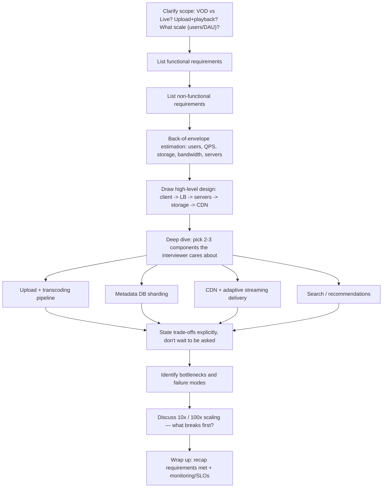

**How to identify this topic in an interview**: "design YouTube," "design a video streaming platform," "design Netflix/TikTok/Vimeo," "design a system that lets users upload and stream large media files at scale," "design a CDN-backed content platform." All of these share the encode → store → cache → stream skeleton below — only the emphasis shifts (Netflix: licensing/DRM/regions; TikTok: short-form + heavier recommendation weight; live streaming: replace VOD encode step with real-time transcoding + low-latency delivery).

---

## 3. Requirements Clarification

### Functional Requirements
- Upload videos (resumable, chunked)
- Stream/watch videos (adaptive quality)
- Search videos by title/metadata
- Like/dislike videos
- Comment on videos
- View thumbnails
- Save videos to playlists

**Out of scope unless asked**: live streaming, monetization/ads, DRM, recommendations UI, subscriptions/notifications — mention them, then explicitly park them.

### Non-Functional Requirements

| Requirement | What it means here |
|---|---|
| High availability | 99%+ uptime; prefer availability over consistency (AP over CP in CAP terms) |
| Scalability | Storage, bandwidth, and concurrent-request growth must all scale horizontally without redesign |
| Low latency / smooth streaming | Playback start time and rebuffering are the core UX metrics |
| Reliability / durability | Uploaded content must never be lost or corrupted (replicate, checksum) |
| Eventual consistency acceptable | A subscriber doesn't need to see a new upload instantly; **user account/auth data still needs strong consistency** |

**Memory hook**: *functional = what the user can DO; non-functional = how well the system BEHAVES while they do it.*

### Interview Cheat-Sheet
- Always separate "user data" (needs ACID) from "content metadata" (can be eventually consistent) — call this out early, it justifies every DB decision later.
- State explicitly: we are optimizing for availability + low latency over strict consistency (CAP theorem, AP system).
- Ask the interviewer: VOD only, or live too? This changes the entire encode step.
- Don't forget non-functional reliability = durability of uploaded bytes, distinct from availability of the read path.

---

## 4. Capacity Estimation (Worked Example)

### Inputs (state assumptions out loud)
- Total users: 1.5B, Daily Active Users (DAU): 500M
- Avg video length: 5 min
- Raw (pre-encode) size for 5 min video: 600 MB → 120 MB/min raw
- Encoded size for 5 min video: 30 MB → **6 MB/min encoded**
- Upload rate: 500 hours of video uploaded **per minute**
- Upload : View ratio = 1 : 300
- Typical server capacity: 8,000 requests/sec

### Formula chain

```
Total_storage         = Total_upload_per_min (minutes) × Storage_per_min
Total_bandwidth_up     = Total_upload_per_min (minutes) × Size_per_min_raw
Total_bandwidth_down   = Total_upload_per_min × Upload:View_ratio × Size_per_min_encoded
Num_servers            = DAU / Requests_handled_per_server_per_day  (or QPS form below)
Storage_with_replication = Total_storage × Replication_factor (typically 3x)
Storage_with_multi_res   = Total_storage × Num_quality_renditions (partially offset — lower res = smaller files)
```

### Worked numbers

**Storage per minute of upload:**
```
500 hours/min × 60 min/hour × 6 MB/min(encoded) = 180,000 MB = 180 GB/min
```

**Storage per year:**
```
180 GB/min × 60 min/hr × 24 hr/day × 365 days ≈ 94.6 PB/year (one rendition, no replication)
```
Multiply by ~3x for replication (durability) and by a multi-resolution factor (5 renditions ≈ +2–3x effective, since lower-res renditions are much smaller than source) → realistically **500 PB–1 EB/year** just for new video, before thumbnails, chat, comments, or backups. This is why YouTube's actual storage is measured in exabytes and grows continuously — this estimate, done live in an interview, is exactly the right order of magnitude to state.

**Upload bandwidth:**
```
500 hr/min × 60 min/hr × 50 MB/min(raw upload) = 1,500,000 MB/min
= 25,000 MB/s = 25,000 × 8 Mb/s ÷ 1000 = 200,000 Mbps = 200 Gbps
```

**Download (viewing) bandwidth**, using upload:view = 1:300 and ~10 MB/min average viewing bitrate:
```
View content-minutes/min = 500 hr/min × 60 min/hr × 300 = 9,000,000 min/min
Bandwidth = 9,000,000 min/min × 10 MB/min ÷ 60 s = 1,500,000 MB/s
= 12,000,000 Mbps = 12,000 Gbps ≈ 12 Tbps
```
(Equivalently: `200 Gbps × 300 × (10/50) = 12 Tbps`.) This 60x jump from upload to view bandwidth is *the* number that justifies a CDN — no single origin fleet should absorb 12 Tbps of egress without geo-distributed caching.

**Servers (concurrency):**
```
500,000,000 DAU / 8,000 req/s per server = 62,500 servers
```
This is a simplification (assumes uniform load); in reality you'd size by peak QPS, not DAU directly — `Peak_QPS = DAU × avg_requests_per_user_per_day / seconds_in_day × peak_factor` (peak_factor typically 2–3x average).

**Duplicate-video waste** (illustrates why dedup matters): if 50 of the 500 hourly upload-hours are duplicates:
```
(50 × 60 min) × 6 MB/min = 18,000 MB = 18 GB wasted/minute
18 GB/min × 525,600 min/year ≈ 9.5 PB/year wasted
```

### Numbers Worth Memorizing

| Metric | Value |
|---|---|
| YouTube MAU (2022+) | ~2.5 billion |
| Video uploaded per minute | ~500 hours |
| Raw : encoded compression ratio | ~20:1 (600 MB → 30 MB for 5 min) |
| Upload : view ratio | ~1 : 300 |
| Typical CDN cache hit ratio (popular content) | 90–95% |
| Replication factor (durability) | 3x (standard for GFS/Colossus/HDFS-style systems) |
| HLS/DASH segment duration | 2–10 s (YouTube ~ a few seconds) |
| Server QPS (rule-of-thumb single app server) | ~5,000–10,000 req/s |
| Cross-region network RTT | 100–200 ms |
| Same-region RTT | 0.5–2 ms |
| SSD random read latency | ~100 μs |
| HDD seek latency | ~5–10 ms |
| "5 nines" availability budget | 5.26 min downtime/year |
| "3 nines" availability budget | 8.76 hr downtime/year |

### Interview Cheat-Sheet
- Always state assumptions before crunching numbers — the interviewer is grading your method, not memorized digits.
- Show the formula symbolically first (`Total = rate × size`), then plug numbers — this signals rigor.
- The upload:view ratio (1:300) is the single number that most cleanly justifies "we need a CDN."
- Always mention replication factor (~3x) and multi-resolution storage multiplier — raw storage estimates without them are naive and interviewers will probe this.
- Convert MB/s → Mbps → Gbps carefully (×8 for bits, not bytes) — this is a common live-arithmetic trip-up.

---

## 5. High-Level Design

#### 🆕 API Design

Before drawing boxes, pin down the contract the client actually calls — interviewers will ask for this if you don't offer it first. Keep it small; it should map 1:1 onto the functional requirements in section 3.

| Endpoint | Method | Purpose | Key request fields | Key response fields |
|---|---|---|---|---|
| `/videos` | `POST` (chunked, resumable) | Initiate/continue an upload | `upload_id` (empty on first call), `chunk_index`, `chunk_bytes`, `channel_id`, `title`, `visibility` | `upload_id`, `next_expected_chunk`, `status` |
| `/videos/{video_id}` | `GET` | Fetch metadata + manifest URL for playback | `video_id` | `title`, `duration_sec`, `manifest_url`, `status`, `channel` |
| `/videos/{video_id}/manifest` | `GET` (signed if private) | Resolve the HLS/DASH manifest from the nearest CDN edge | `video_id`, `signature` (private only) | `.m3u8` / `.mpd` body |
| `/search` | `GET` | Query videos by title/metadata | `q`, `page_token` | ranked list of `video_id`, `title`, `thumbnail_url` |
| `/videos/{video_id}/comments` | `POST` / `GET` | Write or paginate comments | `text`, `parent_comment_id` (optional) | `comment_id`, `created_at` |
| `/videos/{video_id}/like` | `POST` | Like/dislike a video | `reaction_type` | `202 Accepted` (counter updates async — see 6.5) |
| `/videos/{video_id}/thumbnail` | `GET` | Fetch a thumbnail variant | `size_variant` | image bytes / CDN redirect |

**One line to say out loud:** uploads are the only endpoint that isn't a simple request/response — it's chunked and stateful (`upload_id` threads the chunks together), because a multi-GB POST over a flaky connection cannot be a single atomic call.

#### Architecture Diagram

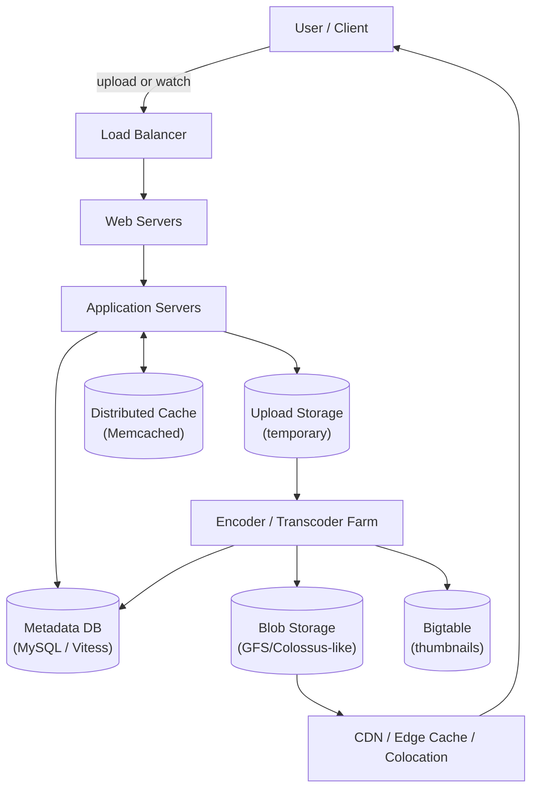

**Flow**: user uploads → server persists metadata + hands video to upload storage → encoder pulls from a queue, transcodes into multiple resolutions/bitrates, generates thumbnails → outputs land in blob storage (+ Bigtable for thumbnails) → metadata DB updated with playback manifest → popular content proactively pushed to CDN; everything else served on-demand ("pull") from CDN/colocation on cache miss, falling back to origin blob storage.

**Why upload goes to the server, not straight to the encoder** (a classic follow-up question): the server owns validation, auth, quota checks, dedup checks, and metadata writes atomically with acceptance — bypassing it would mean the encoder has to reimplement all of that, and you lose a clean retry/resume point for chunked uploads.

#### 🆕 Architecture Evolution: v1 → v2 → v3

Interviewers often want to see *how* you'd arrive at the diagram above, not just the end state — walking through the evolution shows you understand which pain point each new component fixes.

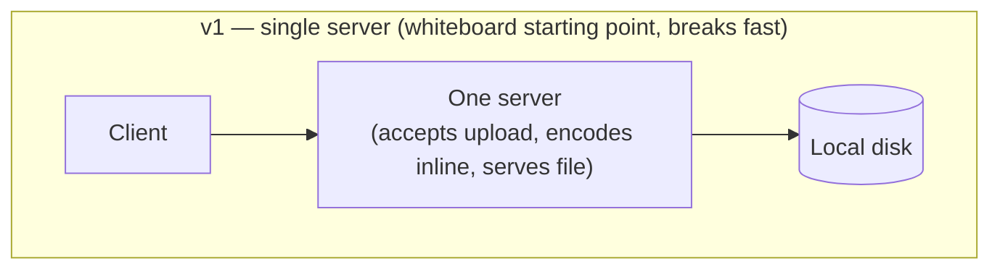

*v1 problem*: one process does upload, encode, and serve. A single slow encode blocks new uploads; a disk failure loses videos; there's no way to scale reads and writes independently.

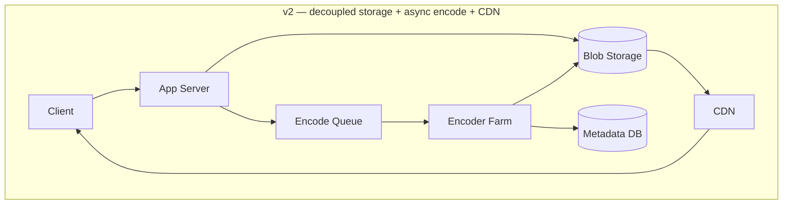

*v2 fix*: upload and encode are decoupled by a queue (upload spikes no longer stall on transcode capacity); bytes move out of the app server onto durable blob storage; a CDN sits in front of blob storage so reads don't hammer origin. *Still missing*: every video gets one fixed bitrate (no adaptive quality), and the CDN treats every video the same regardless of popularity.

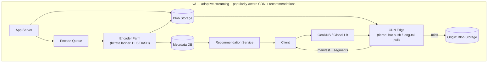

*v3 additions*: encoder now produces a full resolution/bitrate ladder (adaptive bitrate streaming, section 6.3) instead of one fixed rendition; the CDN tier is popularity-aware (push hot content ahead of demand, pull the long tail on miss — see the new decision flowchart below); a recommendation service personalizes what's surfaced, separate from what's cached. This is the diagram at the top of this section, arrived at incrementally.

**If asked "how would this design change at 10x scale," this evolution *is* the answer** — name the next bottleneck (MySQL write throughput → Vitess; single-tier CDN → popularity-aware tiering; fixed bitrate → ABR) rather than describing v3 from scratch.

### Interview Cheat-Sheet
- Draw upload path and playback path as two distinct flows through the same diagram — don't conflate them.
- Blob storage stores bytes; metadata DB stores *pointers + attributes*; never put video bytes in a relational DB.
- CDN sits between blob storage and the user — it's a cache layer, not a replacement for origin storage.
- Bigtable/wide-column store for thumbnails is a deliberate choice: many small objects (<10 MB), high throughput, not much need for joins.
- If you have time, sketch the v1→v2→v3 evolution before the final diagram — it demonstrates you can justify *why* each component exists, not just that you memorized the picture.

---

## 6. Deep Dives

### 6.1 Upload → Encode Pipeline

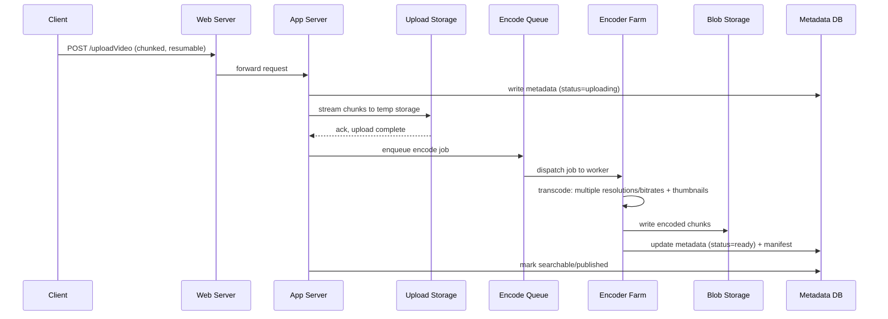

Uploads are chunked so a dropped connection resumes from the last acked chunk instead of restarting a multi-GB transfer (classic resumable/async API pattern). The encode step is decoupled via a **queue**, so upload spikes don't stall on transcoding capacity — encoders scale independently and can burst on spot/preemptible capacity since encode latency (minutes) is far more tolerant than upload latency (seconds).

**Video lifecycle** (useful to draw when asked "what happens after upload"):

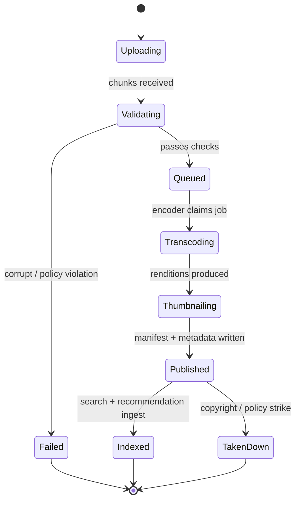

**Transcoding vs. Transmuxing** — a pair interviewers love to probe:

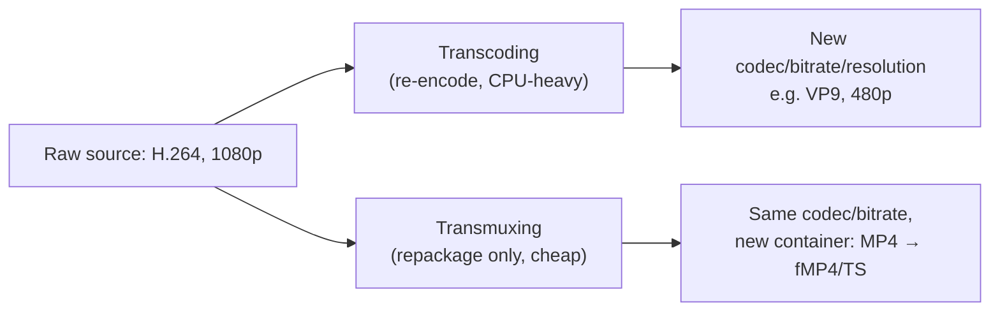

| | Transcoding | Transmuxing |
|---|---|---|
| What changes | Codec, resolution, bitrate (re-encodes pixels) | Container/wrapper only (repackages existing bitstream) |
| Cost | CPU/GPU-intensive, slow | Cheap, fast, near-lossless |
| When used | New device support, quality ladder generation, compression | Adapting same encoded stream to different delivery protocol (e.g., MP4 → HLS segments) |
| Example | H.264 1080p → VP9 480p | H.264 MP4 → H.264 in .ts segments for HLS |

**🆕 Concrete example — "a video is a matrix," with real numbers**: take a 10-minute 1080p upload (~1.5 GB raw). Encode it into a typical ladder of 6 resolutions (1080p, 720p, 480p, 360p, 240p, 144p) × 2 codecs (H.264 for compatibility, VP9 for modern devices) = **12 output files**, roughly **2 GB total** across all renditions combined (lower resolutions are far smaller than the source, so the total isn't 12× the original). Each of those 12 files is then chopped into a few hundred HLS/DASH segments. One upload, twelve stored renditions, hundreds of servable chunks — this is the "matrix, not a file" idea from section 1 made concrete.

**Per-shot/per-segment encoding**: instead of encoding the whole 5-minute video at one bitrate ladder, split into short segments (shots) and encode *each segment* at a bitrate suited to its visual complexity (a static talking-head segment compresses far more than a fast-action segment). This is functionally the same idea as **Netflix's per-title/per-shot encoding** using perceptual quality metrics (Netflix uses VMAF; YouTube's equivalent pipeline optimizes similarly) — same bit budget, meaningfully better perceived quality, smaller files.

**Memory hook** for encoding formats: *"H.264 is the lingua franca (universal compatibility), VP9/AV1 are the diet versions (same quality, ~30–50% smaller, more CPU to encode, used for modern devices only)."*

**Trace one real upload end-to-end**: Alice, a home cook in São Paulo, uploads a 12-minute 4K cooking video from her phone at 3:00:00pm local time. Raw file ≈ 4.5 GB.

| Time | What happens | Where |
|---|---|---|
| 3:00:00pm | App splits file into ~5 MB chunks, starts `POST /uploadVideo` against the nearest regional web server | São Paulo edge, ~10-20 ms RTT from her phone |
| 3:00:00–3:03:00pm | Chunks stream in over home upload bandwidth (~25 Mbps); app server writes a metadata row (`status=uploading`) immediately, so the video shows up in her "Uploads" list right away as *processing* | Upload storage (regional, temporary) |
| 3:03:05pm | Last chunk acked → app server enqueues an encode job | Regional encode queue |
| 3:03:06pm | An encoder worker in the same South America region claims the job within seconds — deliberately *not* shipped to a US/EU data center first, because re-transferring 4.5 GB across an ocean would cost more time than the encode itself | South America encoder farm |
| 3:03:20–3:11:00pm | Transcoding: 4K source → full ladder (4K/1440p/1080p/720p/480p/360p) × (H.264 + VP9); per-shot encoding runs different segments on different workers in parallel, so wall-clock time (~8 min) tracks source duration (12 min) rather than being a small multiple of it | Encoder farm (parallelized) |
| 3:11:05pm | Thumbnails generated + Alice's custom thumbnail ingested | Bigtable |
| 3:11:10pm | Renditions written to blob storage; HLS/DASH manifest assembled; metadata DB flips to `status=ready` then `published` | Blob storage + Metadata DB |
| 3:11:20pm | Video enters the search index and recommendation candidate pool; first São Paulo viewers stream it via a cache-miss pull from origin — it hasn't earned a CDN push yet, since push decisions are driven by view velocity that doesn't exist for a 15-second-old video | Search/Rec ingest + CDN (pull path) |

Total: **~11 minutes** from "tap upload" to "watchable," for a 12-minute video. The headline number to say out loud in an interview: *encode wall-clock time roughly tracks source duration on a shared, per-shot-parallelized farm* — which is exactly why creators see a "processing" spinner proportional to video length, and why placing the encoder in the same region as the upload (not the nearest "biggest" data center) matters for large raw files.

#### Interview Cheat-Sheet
- Never say "we transcode on-the-fly during playback" — always pre-generate the resolution/bitrate ladder at upload time; real-time transcoding is a live-streaming problem, not VOD.
- Distinguish transcoding (expensive, changes bits) from transmuxing (cheap, changes wrapper) — conflating them is a common tell of shallow understanding.
- Mention per-shot/per-segment encoding as the "advanced" answer when asked how to save storage without hurting quality.
- Chunking has a second benefit beyond adaptive bitrate: it parallelizes preprocessing and is essential infrastructure for live streaming.

---

### 6.2 Metadata Storage & Sharding

| | MySQL (metadata/users) | Bigtable (thumbnails) |
|---|---|---|
| Data shape | Structured, relational, needs querying/joins | Massive count of small (<10 MB) key-value blobs |
| Consistency | Strong (ACID) — needed for user accounts, likes counts | Eventual is fine |
| Scale pattern | Vertical then sharded | Horizontal by design (built on GFS/Colossus) |
| Failure mode at scale | Single-node write bottleneck, join costs blow up | Scales linearly with more tablet servers |

At YouTube's actual scale, plain sharded MySQL breaks down: every sharding decision (re-sharding, connection routing, failover) leaks into application code, and cross-shard queries + ACID guarantees become unmanageable. YouTube's real answer is **Vitess**:

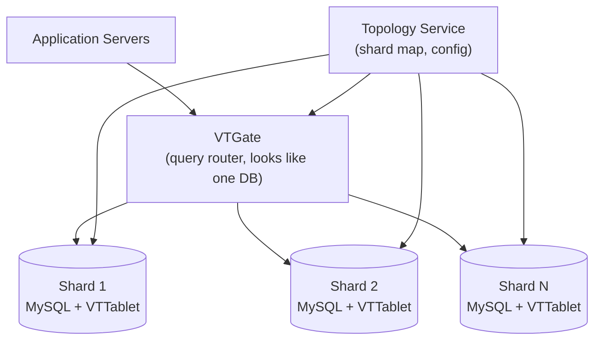

Vitess puts a routing/abstraction layer (**VTGate**) in front of many physical MySQL shards (each wrapped by **VTTablet**), so the application still thinks it's talking to one database — but resharding, connection pooling, query rewriting, and failover are handled by Vitess, not app code. Result: MySQL's ACID guarantees + NoSQL-like horizontal scalability, without rewriting the data layer into a NoSQL model. YouTube open-sourced Vitess in 2010 and it now also powers Slack, GitHub, HubSpot, and others.

**Why not just denormalize instead?** Denormalization trades write performance for read performance — fine until write volume grows, at which point it degrades unpredictably. Vitess avoids this trade entirely by keeping the schema normal and scaling the routing/sharding layer instead.

**Core schema, made concrete** (draw this when asked "what does the metadata DB actually look like" — an abstract "metadata DB" box is the #1 thing that reads as hand-wavy in this deep dive):

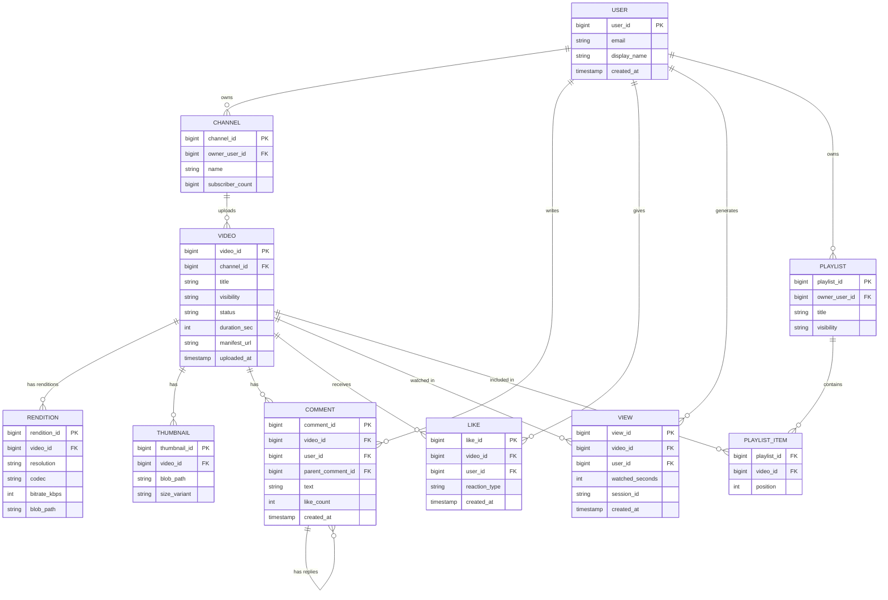

Note what lives where: `VIDEO` and `RENDITION`/`THUMBNAIL` rows are *pointers* (`blob_path`, `manifest_url`) — the pixels themselves are never in this schema, only in blob storage. `RENDITION` is a one-to-many child of `VIDEO` because that's the "matrix, not a file" mental model made literal: one video row, N rendition rows. `COMMENT` self-references (`parent_comment_id`) for threaded replies — the same table, no separate "replies" table needed.

**🆕 `VIEW` and `PLAYLIST`, and why they're not as simple as they look**: `VIEW` is deliberately a row-per-event log, not a counter column — `watched_seconds` is what feeds both the raw view count (see 6.5) and watch-time-based ranking (see 6.4); a counter column alone can't answer "did they actually watch it." `PLAYLIST_ITEM` is a join table (composite key `playlist_id` + `video_id`, with `position` for ordering) because a video can sit in many playlists and a playlist holds many videos — a plain FK on either side can't express that many-to-many relationship.

#### Interview Cheat-Sheet
- Justify MySQL for user/metadata (need ACID, structured queries) vs. Bigtable/wide-column for thumbnails (huge count of small immutable blobs, high throughput).
- If asked "how does this scale past a few shards," say Vitess (or name Citus/Vitess-equivalents) — don't just say "add more shards" and stop.
- Mention that denormalization is the naive alternative and explain why it fails at write-heavy scale.
- Alternatives worth naming: HDFS/Cassandra as substitutes for GFS/Bigtable if the interviewer pushes on non-Google stacks.

---

### 6.3 Delivery: CDN, Push vs. Pull, HLS vs. DASH, Adaptive Bitrate

**Push vs. Pull CDN:**

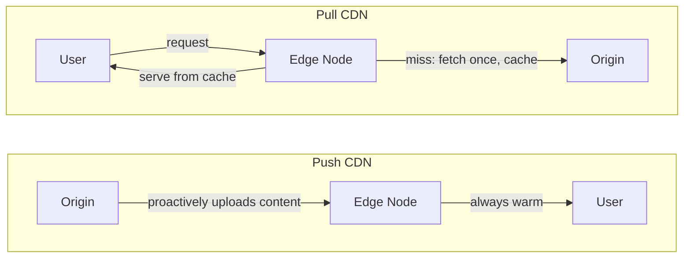

| | Push CDN | Pull CDN |
|---|---|---|
| Who uploads content to edge | Origin proactively pushes | Edge fetches lazily on first request (cache miss) |
| Best for | Predictably popular/viral content, scheduled releases | Long-tail/unpredictable content |
| Storage efficiency | Wastes space if prediction wrong | Only stores what's actually requested |
| First-request latency | Always fast (pre-warmed) | Slow on cold cache (origin round-trip) |
| YouTube's actual use | Home page trending / viral videos pushed ahead of time | Vast majority of long-tail catalog |

**Memory hook**: *Push = "ship it before anyone asks" (like stocking shelves before a sale). Pull = "fetch it the first time someone asks, then keep it" (like a library holding a book after the first checkout).*

#### 🆕 Hot vs. long-tail: the CDN strategy table

| | Hot / viral video | Long-tail video |
|---|---|---|
| Example | Cricket highlights, 2M views/hour and climbing | A 4-year-old tutorial with 40 views/month |
| CDN strategy | **Push** — pre-warm many edge PoPs ahead of demand | **Pull** — fetch to edge only on first request, evict on idle |
| Origin storage tier | Flash/SSD (low-latency, worth the cost) | Spinning disk (dense, cheap, latency matters less) |
| Cache hit ratio | 90–95%+ (illustrative — this is the pie chart below) | Lower; more origin round-trips per view |
| Failure cost if wrong | Wasted edge storage if prediction misses | A cold-cache first request is slow but rare — few users affected |
| "If X then Y" | If view-velocity crosses a trending threshold → push to regional PoPs proactively | If a video sits below the popularity threshold → leave it pull-only, don't waste edge capacity |

#### 🆕 CDN tier decision flowchart — origin vs. edge, by popularity

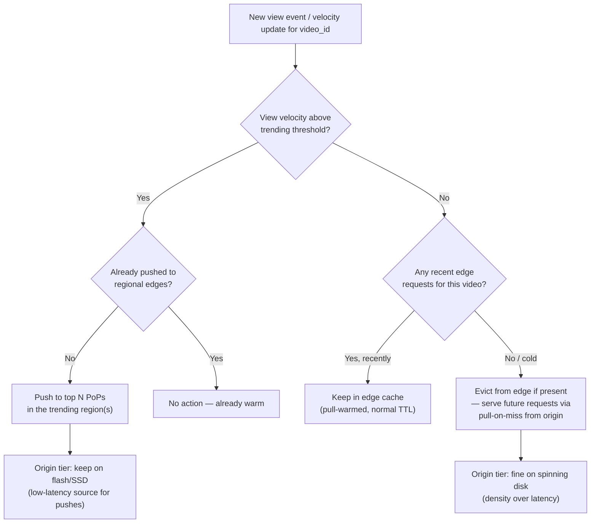

**One line to say out loud**: the decision isn't per-request, it's per-video and re-evaluated on a schedule (or on a velocity trigger) — you don't want to recompute "is this hot" on every single view.

**HLS vs. DASH** (the two adaptive streaming protocols):

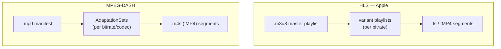

| | HLS | DASH |
|---|---|---|
| Creator | Apple | MPEG (open standard) |
| Manifest format | `.m3u8` (text playlist) | `.mpd` (XML manifest) |
| Codec support | Historically H.264/HEVC-centric | Codec-agnostic (VP9, AV1, H.264, etc.) |
| Native device support | Native on iOS/Safari | Native almost everywhere except Apple (needs JS player, e.g. dash.js/Shaka) |
| Segment container | `.ts` (legacy) or fMP4 (modern) | fMP4 (`.m4s`) |
| YouTube's usage | Supported | DASH is YouTube's primary web delivery mechanism |

**Adaptive Bitrate Streaming (ABR)**: video is pre-encoded into a bitrate/resolution *ladder*, chopped into short segments (a few seconds each). The client continuously measures buffer health and throughput, and independently requests the next segment at whatever rung of the ladder it can sustain — no server-side per-client transcoding needed.

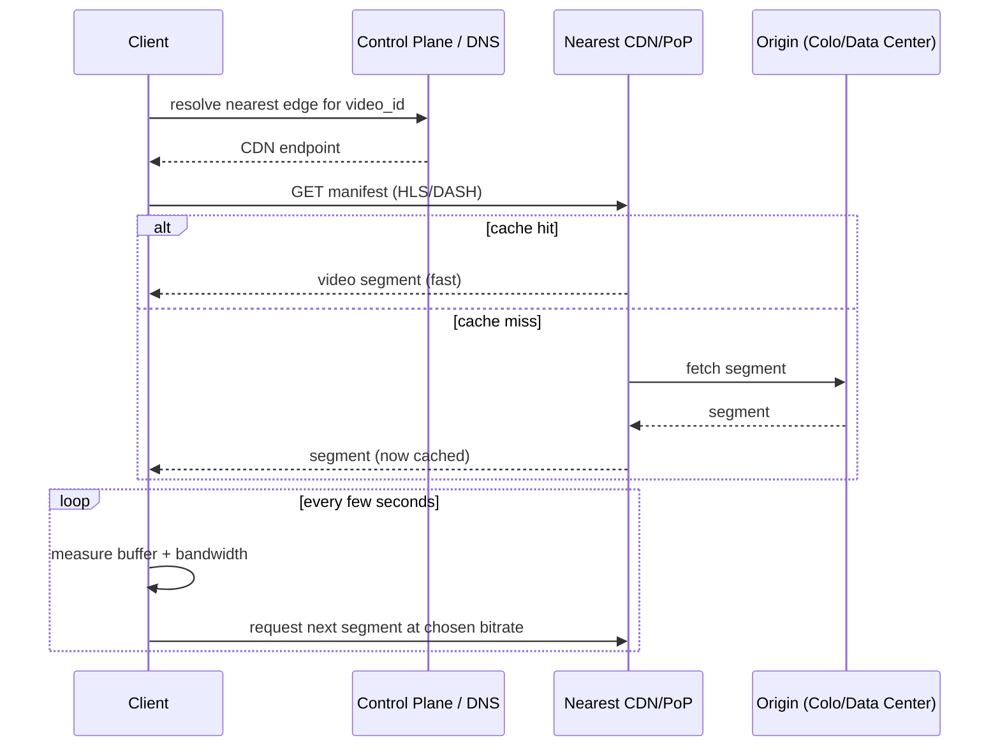

ABR depends on four inputs: **end-to-end available bandwidth**, **device capability**, **encoding technique used**, and **client buffer occupancy**.

#### 🆕 Adaptive bitrate selection flowchart — what the client decides at each segment boundary

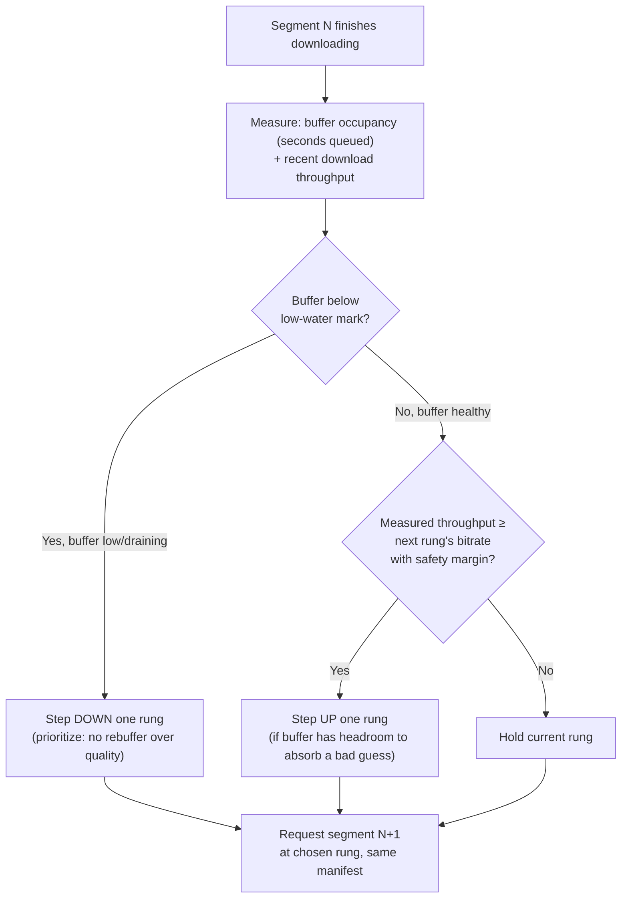

**If X then Y, the whole ABR algorithm in one line**: if the buffer is draining, drop quality immediately regardless of bandwidth (never let it hit zero — that's a rebuffer, the worst UX outcome); else if bandwidth comfortably covers the next rung up, climb one step at a time (never jump straight to the top rung — a bad guess at max bitrate empties the buffer fast). This is why quality ramps up gradually after a video starts, and drops fast when a connection degrades.

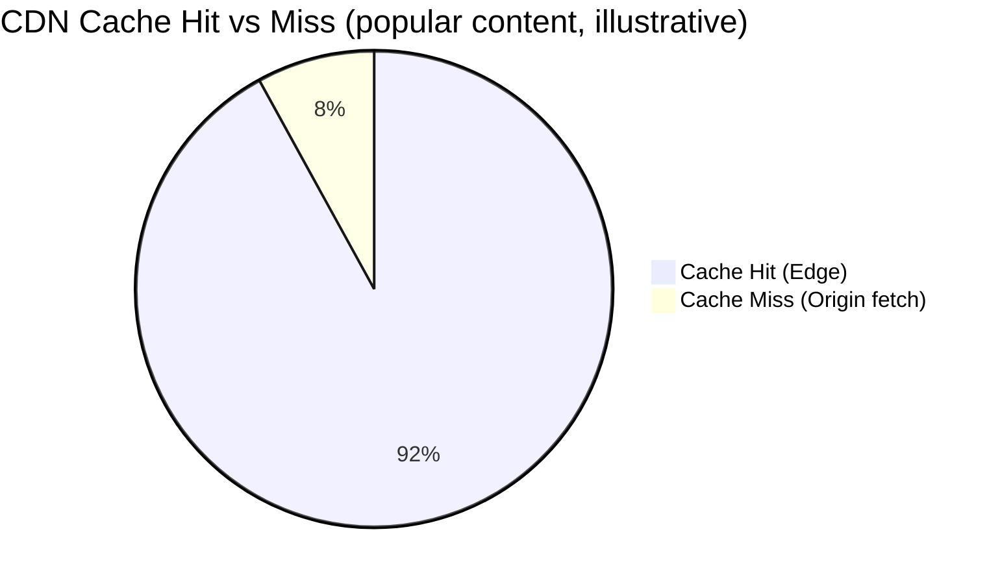

**Content placement hierarchy**, closest to farthest from the user:

1. **CDN edge / colocation inside ISP PoPs** — the fastest hop, content sits inside the ISP's own network.
2. **Internet Exchange Points (IXPs)** — used when there's no direct deal with that ISP.
3. **YouTube's own data centers (origin)** — the fallback for everything else.

Origin storage itself is tiered by popularity: **flash/SSD** servers hold popular and moderately-popular content, because low latency is worth the extra cost there; **spinning-disk** servers hold the long tail, where density (cost per GB) matters more than latency. YouTube also pushes large content batches into ISP caches during off-peak hours, to avoid competing with daytime network traffic.

**CDN/region failover** — the other half of the cache-miss story is a *PoP* miss, not just a content miss:

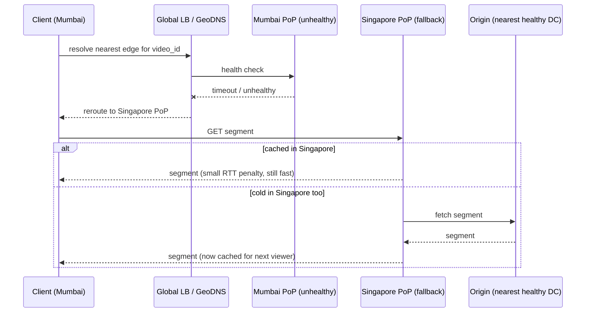

**Trace one real playback request, including a cold-cache hop**: Rahul in Mumbai taps play on a cricket highlights clip that went viral 20 minutes ago (2M views in the last hour, climbing fast).
- GeoDNS resolves him to the Mumbai PoP (~5-8 ms RTT). Because the video's view velocity crossed the "trending" threshold ~15 minutes ago, it was already **pushed** to major Asia-Pacific PoPs (Mumbai, Singapore, Tokyo) — so his manifest and first segment are both cache **hits**: first frame renders in well under 200 ms.
- His phone's ABR client starts at 1080p (measured ~8 Mbps sustained), requesting 4-second segments in a loop.
- He walks into a building; throughput drops to ~1.5 Mbps. At the next segment boundary (not mid-segment) the client drops to 480p — no rebuffer, no server involved, a purely client-side decision reading the same cached manifest.
- Meanwhile a friend 300 km away, in a town whose local PoP has never served this video, requests it for the first time: cache **miss** even though the video is globally hot, edge fetches from the nearest origin DC (~60-80 ms), caches it — every subsequent viewer at *that* edge now gets the hit path. Popularity is global; caching is per-PoP.
- If the Mumbai PoP itself had failed a health check, GeoDNS would have silently rerouted Rahul to Singapore instead (the sequence diagram above) — a few extra milliseconds of RTT, no visible error, no manual intervention.

#### Interview Cheat-Sheet
- Push CDN = pre-warm for predictable viral hits; Pull CDN = cache-on-first-miss for the long tail. Real systems use both.
- HLS vs DASH: know one lives in the Apple ecosystem, the other is the open, codec-agnostic standard most others (including YouTube's web player) use.
- ABR happens client-side by requesting differently-encoded segments — there is no per-user server-side transcoding at request time.
- Draw the hit/miss + fallback-to-origin path — interviewers want to see you handle the cache-miss case, not just the happy path.
- Mention the flash-vs-storage-server origin tiering — it shows you understand cost/latency trade-offs even within "the origin."
- If asked "how does the CDN decide what to cache where," walk through the tier decision flowchart: view velocity drives push, recency of requests drives pull-cache retention.
- If asked "how does the player pick quality," the one-liner is: drop fast on a draining buffer, climb slow when bandwidth allows headroom — never jump straight to the top rung.

---

### 6.4 Search & Recommendations

**Search**: each uploaded video is processed into a document (title, channel, description, transcript-derived content, length, category) → keywords extracted into an inverted index (key = keyword, value = occurrence/frequency/location across documents) → query time, relevant videos are retrieved then **re-ranked** using view count, watch time, freshness, and personalization — not just keyword match.

**Search request path** (cache-first, like almost every high-QPS read in this design):

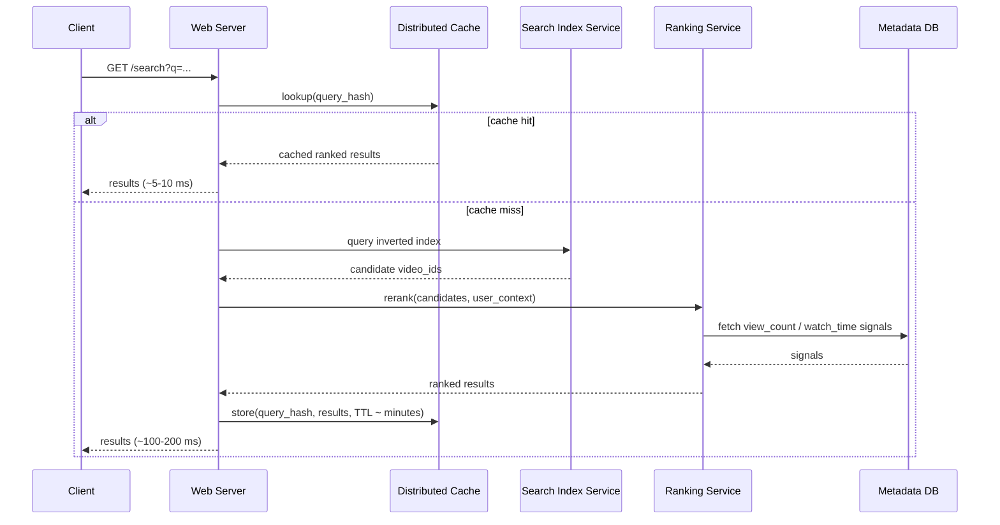

Same pattern as CDN delivery (cache in front of a slower source-of-truth), which is why it's worth drawing even though search feels like a different subsystem — an interviewer probing "do you always reach for the same shape of solution" is really asking if you understand *why* caching works here: query popularity is long-tailed too, a small set of queries dominates traffic, so a short TTL cache absorbs most reads before they ever reach the index/ranking services.

**Recommendations** — two-stage funnel (matches YouTube's published "Deep Neural Networks for YouTube Recommendations" architecture):

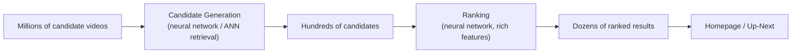

Stage 1 (**candidate generation**) narrows millions of videos down to hundreds using coarse signals: watch history, search history, subscriptions, related topics. Stage 2 (**ranking**) scores those hundreds down to a few dozen using much richer features (session context, engagement patterns, freshness, diversity). Splitting into two stages is a cost/latency trade: a rich ranking model is too expensive to run over millions of items, so cheap retrieval narrows the field first — a pattern common to nearly all large-scale recommender and search systems (retrieve-then-rank).

**Popular vs. recommended, disambiguated**: "popular" content is a *global* signal driving CDN pre-push decisions (same video cached for everyone); "recommended" content is a *per-user* signal driving what's shown on the homepage (different for every viewer). A video can be globally unpopular but strongly recommended to one user's niche interest, or globally viral but irrelevant to a given user.

#### Interview Cheat-Sheet
- Search = inverted index + relevance ranking augmented with engagement signals (view count, watch time) — not pure keyword match.
- Recommendations = two-stage funnel: cheap candidate generation (millions → hundreds) then expensive ranking (hundreds → dozens). Name this pattern even in unrelated recsys questions — it generalizes.
- Don't conflate "popular" (drives CDN caching, global) with "recommended" (drives personalization, per-user).
- If pressed for depth, mention retrieval via approximate nearest neighbor (ANN) over embeddings as the modern version of "candidate generation."

---

### 6.5 Comments, Likes, Views & Engagement Counters at Scale

Functional requirements mention these on day one, but they're a genuine deep dive: a single viral video can take **thousands of like/comment writes per second against one `video_id`** — the same hot-shard problem as section 8, but for OLTP writes instead of reads.

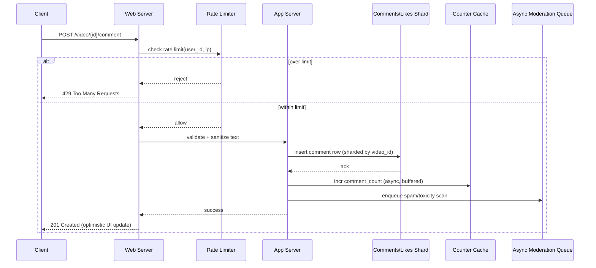

Three ideas make this scale:

1. **Shard comments/likes by `video_id`**, same as any other Vitess-sharded table — a video's comments always live together, so pagination and "most-liked comment" queries never cross shards.
2. **Don't increment the counter synchronously on every write.** A denormalized `like_count`/`comment_count` column on the `VIDEO` row updated on every single like would itself become the hot row. Instead: buffer increments in an in-memory counter (cache or a lightweight aggregator), flush to the DB on a short interval (e.g. every 1-5s) or on batch thresholds — the count is *approximately* right in real time and *exactly* right within seconds. This is the same "relax consistency where users won't notice" principle from section 7, applied to a counter instead of a feed.
3. **Rate limit at the edge**, before any DB write is attempted — a token-bucket per user (and per IP, to catch unauthenticated abuse) rejects spam comment/like floods before they ever reach the shard.

**Memory hook**: *"Count fast, count approximately, reconcile within seconds"* — never make a like button synchronously fight a hot row.

#### 🆕 View-count tracking & anti-fraud at scale

View counting looks like "increment a number on play" until you notice two problems: (1) it's the same hot-row problem as likes/comments above, and (2) unlike a like button, a view count is a fraud target — bot farms and click-rings inflate it directly for ad revenue or virality, so it needs validation, not just scale.

**What actually counts as "one view"** (illustrative rule, exact thresholds are a YouTube trade secret): a client-side ping after some minimum watched duration (e.g., several seconds of actual playback, not just a page load) — a raw HTTP request to `/videos/{id}` is not a view, only a playback-confirmed watch event is.

```mermaid
flowchart TD
    A["Client sends 'view' ping\n(after N seconds watched)"] --> B{"Passes basic checks?\n(rate limit, known bot signature,\nsession looks human)"}
    B -->|Suspicious| C["Log to VIEW table for audit,\nDO NOT count toward public view_count"]
    B -->|Looks legitimate| D{"Same user_id/session_id\nalready viewed this video\nrecently?"}
    D -->|Yes, duplicate| E["Log VIEW row (for watch-time/analytics),\nskip incrementing view_count"]
    D -->|No, new view| F["Buffer increment in counter cache\n(same buffered-counter pattern as likes)"]
    F --> G["Batch flush to view_count\nevery few seconds"]
    C --> H["Async fraud-scoring job\n(pattern: many views, same IP range,\nno real watch-time distribution)"]
    H -->|Confirmed bot traffic| I["Retroactively adjust count,\nflag account for abuse review"]
```

Three ideas make this trustworthy, not just fast:

1. **Log every raw event, count only validated ones.** Every ping lands in the `VIEW` table (section 6.2) regardless of outcome — that data feeds fraud detection and watch-time-based ranking (section 6.4) even when it doesn't move the public counter.
2. **Dedup within a window.** The same user replaying a video 50 times in a minute is one view for public display purposes (exact rules vary), even though every play still contributes to watch-time analytics.
3. **Buffer and batch the increment**, exactly like the like/comment counters above — a viral video's view counter is a hot row for the same reason a viral video's like counter is.

**Memory hook**: *"Log everything, count validated views only, reconcile fraud after the fact — never let the public number be the fraud checkpoint."* The count you show users is a best-effort real-time estimate; the audit trail (the `VIEW` table) is the source of truth that can correct it later.

#### Interview Cheat-Sheet
- The interviewer follow-up "what happens when a video goes viral and everyone likes it at once" is really asking about this section — answer with buffered/async counters, not "the DB scales horizontally."
- Comments thread via self-reference (`parent_comment_id`) in the same table — no separate replies table.
- Rate limiting belongs *before* the app server touches the DB, not as a DB-level throttle.
- View count is not just a scale problem, it's a fraud problem — a "view" is a validated playback event (minimum watch duration, dedup, bot-scoring), not a raw request.
- Keep the raw event log (`VIEW` rows) separate from the public-facing counter — that's what lets you retroactively correct fraud without ever having under-counted honestly.

---

### 6.6 Security, Abuse Prevention & Access Control

Two distinct concerns get conflated if you're not careful: **who can upload** (abuse prevention) and **who can watch** (access control).

**Upload-side abuse prevention** — four checks, in the order they run:
1. **Rate limit per account and per IP** (token-bucket) — caps uploads/minute, catches both single-account spam and multi-account abuse from one source.
2. **Quota check before any bytes land** — reject over-quota uploads before they touch upload storage, not after.
3. **Dedup/fingerprint check** — the same LSH fingerprinting used for storage dedup (section 8) doubles as a spam/repost filter.
4. **Tiered limits by trust** — new/unverified accounts get tighter limits than established channels (the same idea as "verified creators get priority in the encoder backlog," from the bottlenecks table).

**Playback-side access control** — every video has a visibility level, enforced *before* a CDN edge ever serves a byte:

| Visibility | Who can watch | How it's enforced |
|---|---|---|
| Public | Anyone | No check — manifest/segment URLs are stable, cacheable indefinitely |
| Unlisted | Anyone with the link | Same as public *technically*, but the video_id is unguessable (opaque, high-entropy ID) and excluded from search/recommendations — security through obscurity, not real access control |
| Private | Owner + explicitly-granted users | **Signed URLs**: app server checks the ACL, then mints a time-limited, HMAC-signed URL (`video_id` + `expiry` + optional `user_scope`, signed with a server-side secret); CDN edge validates the signature locally (no DB round-trip per segment request) and rejects anything expired or tampered with |

Signed URLs are the mechanism that makes private video *not* a special case for the CDN: the edge never needs to know about ACLs, only "is this signature valid and unexpired" — the expensive check (who's allowed to see this) happens once, at manifest-request time, on the app server; every subsequent segment request is a cheap, stateless signature check at the edge.

**Content moderation / copyright lifecycle** (draw this when asked "what happens when a video gets a copyright claim or is reported"):

```mermaid
stateDiagram-v2
    [*] --> Clean
    Clean --> Flagged: user report or automated scan match
    Flagged --> UnderReview: routed to human review / ContentID-style match
    UnderReview --> Clean: false positive, no action
    UnderReview --> Demonetized: policy violation (minor)
    UnderReview --> Removed: severe violation or upheld copyright claim
    Demonetized --> Clean: appeal upheld
    Removed --> Clean: appeal upheld
    Removed --> [*]: appeal window closed, permanent
    Demonetized --> [*]
```

Proactive scanning (fingerprint match against a claimed-content database at upload time) and reactive reporting (user flags) both feed the same `Flagged` state — worth saying explicitly, since interviewers sometimes probe whether you think moderation is purely reactive.

**Memory hook**: *"Rate limit who can upload, sign the URL for who can watch"* — two different gates, two different mechanisms, don't merge them into one "auth check."

#### Interview Cheat-Sheet
- Signed URLs are the standard answer to "how would you support private/unlisted videos" — naming it beats "we'd check permissions" every time.
- Unlisted ≠ private: unlisted is an unguessable ID with no real cryptographic guarantee; only private uses signed, expiring URLs.
- Upload rate limiting and playback access control are separate systems solving separate problems — don't merge them in your answer.
- Moderation has two entry points (proactive fingerprint match, reactive user report) feeding one state machine.

---

### 6.7 Monitoring, SLOs & Multi-Region Disaster Recovery

**What to alert on** — pick metrics from both pipelines, not just one:

| Metric | Pipeline | Why it matters |
|---|---|---|
| Upload success rate | Upload | Drops signal client-network issues or a broken ingest path |
| Encode queue depth / oldest-job age | Upload | Rising backlog = publish delay growing; the earliest signal of encoder farm saturation |
| Encode latency (p50/p95) | Upload | Tracks whether the farm keeps pace with source duration (recall the Alice walkthrough: ~8 min encode for 12 min source is the healthy baseline) |
| Time-to-first-frame (p50/p95) | Playback | The single best proxy for "does starting a video feel instant" |
| Rebuffer ratio | Playback | The single best proxy for "does playback feel smooth" once started |
| CDN cache hit ratio | Playback | Drop here means unexpected origin load is coming — the pie chart in 6.3 (92/8 hit/miss) is the healthy baseline to alert against |
| Origin egress bandwidth | Playback | Approaching the 12 Tbps-class estimate from section 4 without a corresponding hit-ratio explanation means a CDN or push-prediction problem |
| 5xx error rate (per region) | Both | Fastest way to detect a regional outage before users flood support |
| DB replication lag (per shard) | Metadata | Growing lag risks serving stale "published" state or losing writes on failover |

**Memory hook**: *"If you can't name time-to-first-frame and rebuffer ratio unprompted, you haven't actually designed the playback SLO"* — these two numbers are what "smooth streaming" (a stated non-functional requirement in section 3) cashes out to concretely.

**Multi-region / disaster recovery story**, broken into the three things to say when asked:
- **Metadata**: replicated across regions via Vitess's multi-cell topology — each cell is a region-local set of shards, with cross-cell replication on top of the cross-shard replication already inside a cell.
- **Blobs**: replicated to at least two geographically separate regions at write time. The same 3x replication factor from section 4 is spread across failure domains — different buildings, not just different disks in one building.
- **On a full region failure**: the global LB reroutes traffic to the next-nearest healthy region within seconds, using the same health checks as the PoP failover in 6.3. The only at-risk data is metadata writes that were in-flight to the failed region's primary — that bounds **RPO** (Recovery Point Objective) to the async replication lag at failure time. **RTO** (Recovery Time Objective) is dominated by DNS/LB reroute time — typically low minutes, not the time to physically recover the failed region.

**Memory hook**: *RPO = how much data could you lose; RTO = how long until you're back.* State both numbers explicitly if asked about DR — "we replicate" alone isn't a DR story, a bounded RPO/RTO is.

#### Interview Cheat-Sheet
- Time-to-first-frame and rebuffer ratio are the two playback SLO metrics to name first — everything else (cache hit ratio, egress bandwidth) is diagnostic, not user-facing.
- Encode queue depth is the earliest leading indicator of an upload-side incident — alert on backlog *growth rate*, not just absolute depth.
- Always give both an RPO and an RTO number when asked about disaster recovery — one without the other is an incomplete answer.
- Region failover reuses the exact same health-check/reroute mechanism as PoP failover in 6.3 — same pattern, larger blast radius.

---

## 7. Key Design Decisions & Trade-offs

| Decision | Why | Cost / Trade-off |
|---|---|---|
| Eventual consistency for video metadata/feeds | Availability + low latency matter more than every viewer seeing updates instantly | A new upload may not appear in subscribers' feeds for seconds–minutes |
| Strong consistency for user account data | Auth, billing-adjacent data cannot be "eventually" correct | Extra care/isolation needed to keep this data separate from the relaxed side |
| Distributed cache (Memcached, LRU) over centralized cache | Centralized cache = single point of failure at this scale; access pattern is long-tailed, LRU handles this well | Cache coherency/invalidation complexity across nodes |
| Bigtable for thumbnails, MySQL/Vitess for metadata | Different data shapes need different engines — one size does not fit all at this scale | Two storage systems to operate, monitor, and keep schema-consistent with app logic |
| Public CDN in low-traffic regions, private CDN at scale | Private CDN = high CAPEX, only worth it once traffic justifies it | Public CDN costs more per-GB at high volume; private CDN requires upfront investment + ops burden |
| Pre-encode fixed bitrate ladder, no on-the-fly transcode | On-demand transcoding is far too slow/expensive to do per-request | Extra storage for every rendition (partially mitigated by per-shot encoding) |
| Chunked/resumable uploads | Large files over unreliable client networks need resumability | Adds complexity: chunk tracking, reassembly, partial-failure handling |
| No video de-duplication (baseline design) | Simpler pipeline | Wastes storage (~9.5 PB/year in our estimate) and enables copyright/spam issues — must be explicitly called out as a gap |
| Vitess over hand-rolled sharding | Keeps ACID + relational model while scaling horizontally | Additional infrastructure layer (VTGate/VTTablet/topology service) to run |

### Interview Cheat-Sheet
- Every design choice should come with its cost stated in the same breath — interviewers are explicitly listening for this.
- CAP theorem answer for YouTube: **AP system** for content/feeds, **CP-ish** (strong consistency) carve-out for user/account data.
- If asked "what's the biggest limitation of your design," dedup and the eventual MySQL bottleneck are the two strongest, source-grounded answers.

---

## 8. Bottlenecks, Failure Modes & Mitigations

| Bottleneck / Failure | Symptom | Mitigation |
|---|---|---|
| Hot shard / celebrity video | One video/channel gets disproportionate reads, overloads one shard/cache node | Consistent hashing to spread load; push hot content aggressively to CDN so origin/DB rarely gets hit for it |
| Thundering herd on cache miss | A viral video's cache entry expires, thousands of requests hit origin simultaneously | Request coalescing (single origin fetch serves all waiting clients), staggered TTLs, pre-warming before predicted spikes |
| Single load balancer as SPOF | LB failure takes down all traffic | Redundant LBs behind anycast/DNS, health checks, active-active pairs |
| MySQL as a choke point at scale | Write throughput plateaus, replication lag grows | Vitess-style sharding/routing abstraction; separate read replicas for read-heavy queries |
| Encoder farm backlog | Upload spike outpaces encode capacity, publish delay grows | Autoscaled/elastic transcoding workers (bursty compute is a great fit for spot/preemptible instances), priority queues (e.g., verified creators or scheduled releases first) |
| CDN/edge outage in a region | Users in that region see high latency or failures | Global load balancer reroutes to next-nearest CDN/region; graceful fallback to origin |
| Data center failure | Total regional outage | Cross-data-center replication of metadata + blobs; global LB steers traffic elsewhere |
| Duplicate/spam uploads | Wasted storage, copyright complaints | Locality-sensitive hashing (LSH) for near-duplicate detection; heavier techniques (block matching, phase correlation, ML-based fingerprinting) for harder cases |
| Unexpected traffic spike (breaking news, viral event) | Sudden multi-x load | Horizontal scalability + burst into public cloud capacity (with pre-negotiated contracts — cloud elasticity is not infinite/instant) |
| Server health/faults undetected | Serving from a degraded/erroring server | Heartbeat protocol between servers and LB/orchestrator; automatically evict unhealthy nodes |

### Interview Cheat-Sheet
- "Isn't the load balancer a single point of failure?" → yes if there's only one; mitigate with redundant LBs + health checks + DNS/anycast failover. Expect this question, it's in the source quiz.
- Hot-key/hot-shard problems are best answered with consistent hashing + aggressive CDN placement, not "add more servers."
- Always distinguish a **regional** failure (reroute via global LB) from a **component** failure (redundancy + heartbeat within a region).
- Cloud burst capacity is a good answer for spikes, but caveat it: contracts and quotas mean it's not unlimited.

---

## 9. Real-World References (How YouTube/Google Actually Solved This)

- **Vitess**: open-sourced by YouTube (2010) — a sharding/routing middleware in front of MySQL, giving the app a "single database" illusion while scaling horizontally. Now also used by Slack, GitHub, HubSpot.
- **GFS → Colossus**: YouTube's blob storage is built on Google's distributed file system lineage (Google File System, succeeded internally by Colossus) — the conceptual equivalent of S3/HDFS for this design.
- **Bigtable**: wide-column store, used for exactly the kind of workload described here (huge count of small objects, e.g. thumbnails) — publicly documented Google infrastructure.
- **Custom web server**: YouTube doesn't run stock Apache/Nginx at the edge of its stack; Google runs its own custom web-serving infrastructure, because general-purpose servers weren't tuned enough for YouTube's specific traffic profile at its scale.
- **Per-shot/per-title encoding**: the "encode segments differently based on content complexity" idea mirrors **Netflix's** well-documented per-title/per-shot encoding optimization (using perceptual quality metrics like VMAF) — same engineering idea, applied by the other major streaming company, useful to cite as corroboration.
- **Recommendation system**: YouTube's published architecture (candidate generation + ranking, both neural networks) is public research (Covington et al., "Deep Neural Networks for YouTube Recommendations," 2016) — safe to cite by name in an interview.
- **Global network**: YouTube rides on Google's own backbone network, which peers directly with a large number of ISPs worldwide (reducing hops to end users) — this is why Google can push content deep into ISP PoPs rather than relying purely on third-party CDNs.
- **Codecs in production**: H.264/AVC (universal baseline), VP9 (Google's own, royalty-free, ~30-50% smaller than H.264 at similar quality), AV1 (next-gen, royalty-free, heavier to encode, increasingly used for popular content where the one-time encode cost pays off over massive view counts).

### Interview Cheat-Sheet
- Naming Vitess, Bigtable, and Colossus/GFS by name signals real domain knowledge — use them, don't just say "a NoSQL database."
- If asked "why not just use S3 and DynamoDB" (common in non-Google-flavored interviews), say: conceptually equivalent — blob storage + wide-column/NoSQL metadata store — name the AWS analogs confidently.
- Citing the actual YouTube recommendation paper (candidate generation + ranking, both DNNs) elevates a generic answer into a well-grounded one.
- Mention that owning the network (Google backbone/peering) is itself a competitive moat most companies don't have — cheaper CDN-alternative answers (third-party CDN, multi-CDN) are the right answer if you don't own a global backbone.

---

## 10. Golden Rules

1. **Decouple upload path from playback path.** Different traffic shape, different scaling story, different consistency needs.
2. **Never store video bytes in a relational database.** Blob storage for bytes, metadata DB for pointers/attributes, always.
3. **Encode once into a bitrate/resolution ladder at ingest time.** Never transcode per-request at playback time (that's a live-streaming problem, not VOD).
4. **CDN is not optional at this scale.** The upload:view bandwidth multiplier (60x+ in our estimate) makes a single-origin design physically impossible.
5. **Push predictable/popular content, pull the long tail.** Don't try to pre-warm everything — storage is finite, access is long-tailed.
6. **Relax consistency where users won't notice (feeds, view counts); never relax it for identity/auth/billing-adjacent data.**
7. **Chunk everything** — uploads (for resumability), and video (for adaptive bitrate + parallel processing). One mechanism, two payoffs.
8. **Every design decision needs its cost stated in the same sentence.** "We use X because Y, at the cost of Z" is the sentence pattern interviewers are listening for.
9. **Never serve private/unlisted content without a signed, time-boxed URL.** Visibility is an access-control rule enforced once at manifest time, not a per-segment DB check at the edge.
10. **Instrument time-to-first-frame and rebuffer ratio.** Every other playback metric (cache hit ratio, egress bandwidth) is diagnostic; these two are what "smooth streaming" actually means to a user.

**Recap, at a glance:**

```mermaid
mindmap
  root((Design YouTube))
    Upload pipeline
      Chunked resumable upload
      Queue-decoupled encoding
      Bitrate ladder at ingest
      Never transcode live
      Rate limit per account
    Playback pipeline
      Push popular, pull long tail
      Client-side ABR
      HLS or DASH
      Signed URLs for private
    Storage
      Blob store for bytes
      Bigtable for thumbnails
      Vitess for structured metadata
      Buffered async counters
    Consistency
      AP for feeds and counters
      CP for identity and auth
    Resilience
      Redundant load balancers
      Consistent hashing
      Cross region replication
      Bounded RPO and RTO
```

---

## 11. Interview Strategy Cheat-Sheet

- **Open** by explicitly scoping: VOD vs. live, which features are in scope, target scale (users, not "millions" vaguely — pin a number).
- **Estimate out loud**, formula first then numbers — this is graded on method, not memorized digits.
- **Draw upload and playback as two separate flows** through the same high-level diagram; don't let one diagram imply they share a hot path.
- **Pick 2–3 deep dives** based on interviewer signal — don't try to deep-dive everything. Strong defaults: encoding pipeline, metadata sharding (Vitess), CDN/ABR delivery.
- **State trade-offs unprompted.** "We chose X, which costs us Y" earns more credit than being asked "but what about Y?" and improvising.
- **Anticipate the classic follow-ups**: "isn't the LB a SPOF," "why server before encoder," "how do you handle duplicates," "what happens at 10x scale."
- **Close with monitoring/SLOs and a scaling story** ("at 10x we'd need to revisit MySQL sharding and encoder farm capacity first — those are the two components that don't linearly scale for free").
- **Name real systems** (Vitess, Bigtable, Colossus/GFS, VP9/AV1, HLS/DASH) — concrete nouns read as depth; generic nouns ("a database," "a cache") read as shallow.

---

## 12. Master Cheat Sheet

**Formulas**
```
Total_storage        = Total_uploaded_minutes_per_min × Storage_per_min
Total_bandwidth_up   = Total_uploaded_minutes_per_min × Raw_size_per_min
Total_bandwidth_down = Total_uploaded_minutes_per_min × Upload:View_ratio × Encoded_size_per_min
Num_servers           = Peak_concurrent_requests / Requests_per_server
Storage_actual        = Total_storage × Replication_factor(~3x) × Num_renditions(effective ~2-3x)
```

**Worked example numbers**: 180 GB storage/min of upload → ~95 PB/yr (single rendition) → several hundred PB–1 EB/yr realistic. 200 Gbps upload bandwidth → 12 Tbps view bandwidth (60x). 62,500 servers for 500M DAU at 8,000 req/s/server.

**Term pairs**: Transcoding (re-encode, expensive) vs. Transmuxing (repackage, cheap). Push CDN (pre-warm, predictable content) vs. Pull CDN (cache-on-miss, long tail). HLS (Apple, `.m3u8`) vs. DASH (open, `.mpd`, codec-agnostic). MySQL/Vitess (structured, ACID, users+metadata) vs. Bigtable (small-object, high-throughput, thumbnails). Unlisted (unguessable ID, no crypto guarantee) vs. Private (signed, time-boxed URL). RPO (data lost) vs. RTO (time to recover).

**Mnemonics**: "Upload once, encode many, cache near, stream adaptively." Push = stock the shelf before the sale; Pull = restock after the first customer asks. "Count fast, count approximately, reconcile within seconds" (comment/like counters). "Rate limit who can upload, sign the URL for who can watch."

**Golden rules**: decouple upload/playback · never put bytes in a relational DB · pre-encode the ladder, never transcode live · CDN is mandatory at this bandwidth multiplier · push popular, pull long-tail · relax consistency for feeds, never for identity · chunk everything · always state the cost of every decision · sign every private-video URL, never gate it at the edge with a DB check · instrument time-to-first-frame and rebuffer ratio above all else.

**One-liners for common questions**:
- *Isn't the LB a SPOF?* → Yes if singular; use redundant LBs + health checks + anycast/DNS failover.
- *Why not upload straight to the encoder?* → Server owns auth/validation/dedup/metadata-write atomically; bypassing it duplicates that logic into the encoder.
- *How do you scale MySQL?* → Vitess: routing/sharding abstraction layer, app still sees "one DB," ACID preserved.
- *How do you handle a viral video?* → Push to CDN proactively, consistent hashing to avoid hot shards, request coalescing to avoid thundering herd on cache miss.
- *How do you save storage without hurting quality?* → Per-shot/per-segment encoding, bitrate tuned to visual complexity per segment (Netflix-style per-title encoding is the industry parallel).
- *What's the biggest gap in this design?* → No deduplication (LSH/fingerprinting would fix it) and MySQL's ceiling before Vitess-style sharding is introduced.
- *How do you handle a viral like/comment storm on one video?* → Shard by video_id, buffer counter increments in-memory, flush async — never a synchronous increment on a hot row.
- *How do you support private/unlisted videos?* → Signed, time-boxed URLs (HMAC over video_id + expiry) checked once at manifest time; the CDN edge only validates the signature, never queries the ACL per segment.
- *What would you alert on?* → Time-to-first-frame and rebuffer ratio for user-facing playback health; encode queue backlog age for upload-side health; both lead the corresponding 5xx/error-rate metrics.
- *What's your DR story if a region goes down?* → Global LB reroutes on health-check failure (same mechanism as PoP failover); state a bounded RPO (replication-lag window) and RTO (reroute time, low minutes) explicitly, don't just say "we replicate."
