# Design Quora — The Story (narrative edition)

> **What this file is.** The reference file, `27-Design Quora-FAANG-Guide.md`, is the one to recite from — requirements, API shapes, every trade-off table, the master cheat sheet. This file is a second way in: the same material as one continuous story, told in plain language. Engineers at a company keep hitting a wall, patch it, and the patch itself creates the next wall — until we land on the exact same design the reference file documents. The company, **PlantParent** (a Q&A app for houseplant hobbyists — "why are my monstera's leaves turning yellow," that kind of thing), is fictional. But every wall it hits, and every fix it reaches for, is something a real, named system actually does: Quora's own documented move from HBase to MyRocks and its long-polling notification design, Reddit's deep recursive comment threading and public "hot" ranking formula, Stack Overflow's transparent vote-and-age ranking, Twitter/X's push/pull hybrid feed, and Google's use of MinHash/LSH for near-duplicate detection at web scale. I'll say clearly, every time, whether something is a documented fact or just a reasonable stand-in number, using an inline `[illustrative]` tag.

**The trigger phrases** for this whole topic: *"design Quora,"* *"design Stack Overflow,"* *"how would you rank answers to a question,"* *"how do you stop the same question being asked 10,000 times."* Keep one sentence in your head as you read: **a Q&A platform has to do two very different jobs — store what people actually wrote, durably and correctly, and separately, imperfectly, guess what to show first — and almost the whole interview is about making sure neither job ever blocks the other.**

---

## Chapter 1 — The counter that couldn't count straight

PlantParent is small — a few thousand hobbyists, one MySQL table called `answers` with a plain integer column, `vote_count`, sitting right next to the answer's text. When an answer crosses 100 upvotes, the author gets a "you hit gold status!" email, so the upvote endpoint does the obvious thing: read `vote_count`, add 1 in application code, check if it just crossed 100, then write the new number back.

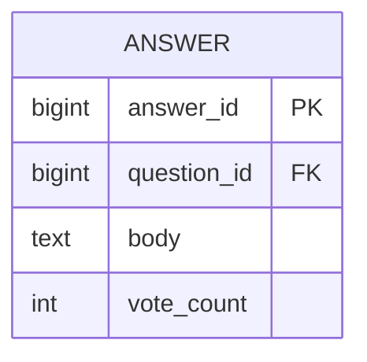

One afternoon, a gardening newsletter with 80,000 subscribers links straight to PlantParent's answer on yellowing monstera leaves. In the first 12 minutes, the client-side analytics log **340 separate upvote-button clicks** — but when someone checks the database right after, `vote_count` reads **217** `[illustrative]`. Worse, the author gets the "you hit gold status!" email **three separate times**, because three concurrent requests each independently saw the count cross from 99 to 100.

The obvious question: *how do you lose 123 real clicks just by counting them?* Because "read, then add one, then write" is two separate round trips, not one atomic step. Between your read and your write, someone else can read the *same* stale number, add one to it too, and write their own answer back — whichever write lands last simply overwrites yours, and your +1 vanishes without a trace. This is the exact same lost-update race you'd hit incrementing any shared counter this way, on any database.

**The fix, and the analogy for the rest of this story:** stop reading the number at all — just tell the database to add one, atomically, in a single operation, the same way a mechanical turnstile counter ticks up by exactly one every time someone walks through, with nobody needing to check the display first. `UPDATE answers SET vote_count = vote_count + 1 WHERE id = 42` (or Redis's `INCR`) does the read-and-write as one indivisible step at the server — no other request can sneak in the middle.

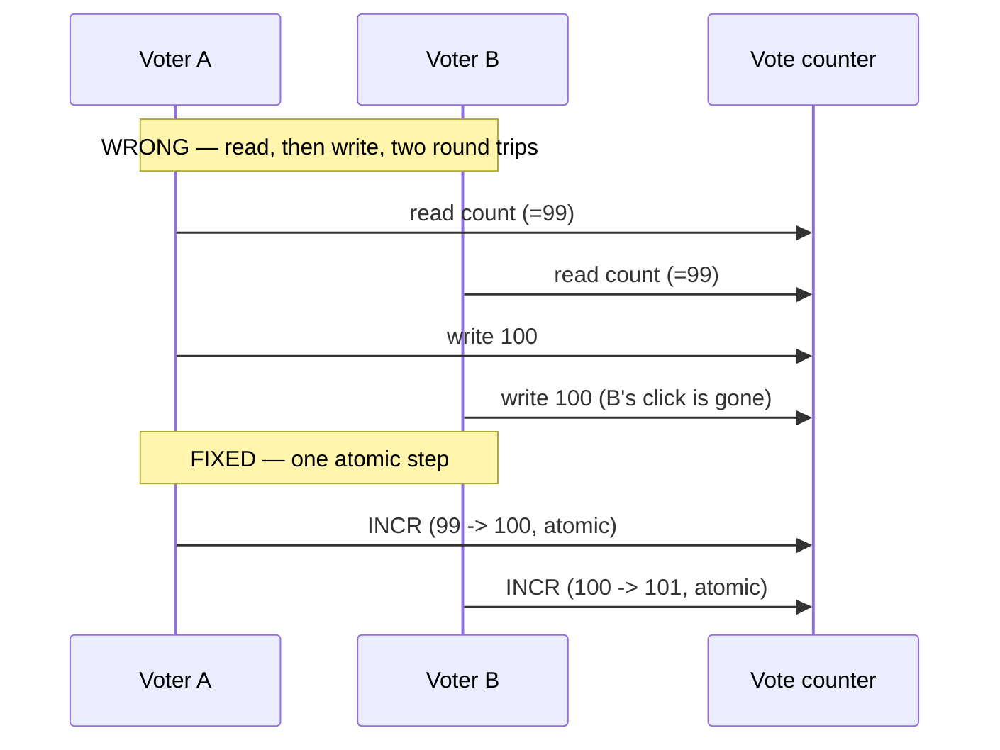

**New problem, same day:** the atomic increment is correct now, but it's still hitting the *exact same row* that stores the answer's actual text. While the newsletter traffic drives roughly 30 votes/sec at the row's peak `[illustrative]`, the answer's original author tries to fix a typo in the same answer — and their edit request waits on that same row's lock for **2.3 seconds** `[illustrative]` before it can even start. Votes and content edits are now fighting each other for the same lock, on the same row, for no reason related to either of them.

**How I'd say this in an interview:** "A counter under concurrent writes always needs an atomic increment, never read-then-write — that part's almost a reflex. The less obvious part is that even a correct atomic increment is still competing for a row's lock if you leave it sitting next to the content it's counting, and that's the very next thing that has to move."

---

## Chapter 2 — The vote that doesn't wait for the content

The fix: stop touching the `answers` table for votes at all. When someone votes, the service publishes a `vote_cast` event to a queue and immediately tells the voter "done" — the actual counting happens somewhere else entirely, asynchronously, by a separate worker. Content writes (post, edit) and vote writes no longer share a row, a table, or even a code path.

**The analogy:** think of it as a ballot drop box at the back of the room. You drop your vote in and walk away — you don't wait around while someone tallies it. Someone else empties the box and does the counting on their own schedule, far from the room where people are still busy writing and editing things.

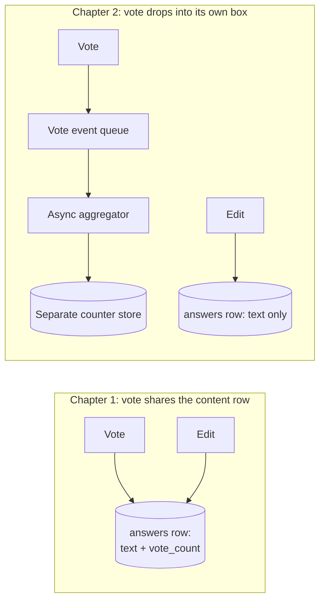

This holds up well — content edits are never blocked by votes again. But eight months later, the same answer gets picked up by a major home-and-garden magazine's site as "answer of the day." Over the next three hours it collects **8,400 upvotes**, arriving in bursts of up to **60 concurrent requests** all hitting the *same single counter key* at once `[illustrative]`. One atomic `INCR` is fast in isolation, but under that much contention on one key, latency on that single operation climbs from under 1ms to roughly **40ms** `[illustrative]` — and because every voter's request waits on that one op, upvoting the trending answer starts to feel sluggish for exactly the people most excited to do it.

The obvious question: *the increment is atomic, so why is it slow?* Atomic doesn't mean free of contention — it means no two writers can corrupt each other, but they still have to take turns on the *same* key. One drop box, no matter how well-organized, only has one slot to drop a ballot through at a time.

**How I'd say this in an interview:** "Moving votes off the content table onto their own queue and counter fixes lock contention with content edits — that's the big win. But a single counter key is still one key, and a genuinely viral answer can make even an atomic increment on one key into the new bottleneck, which is a completely different, narrower problem."

---

## Chapter 3 — Twenty drop boxes instead of one

The fix: split the one counter key into **N shard keys** — say **20** — and route each vote to one shard by `hash(user_id) % 20`, so the flood spreads across 20 independent counters instead of hammering one. Readers don't read any single shard; a periodic async job sums all 20 and caches that total for display.

**Same analogy, scaled up:** instead of one ballot drop box for the whole room, put out 20 of them around the room. Each box only ever sees a slice of the crowd. Nobody's fighting over the same slot anymore — and a separate person can walk around later, empty all 20 boxes, and write down the grand total once.

With the magazine-feature answer's 8,400 upvotes spread across 20 shards, each shard absorbs roughly **420 votes** `[illustrative]` instead of one key absorbing all 8,400 — no single shard ever sees more than a trickle, even during the burst.

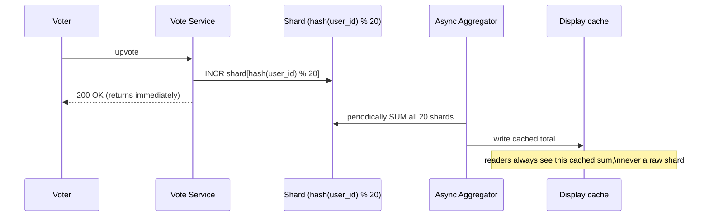

**New problem, a different failure this time — not a flood, a flake:** a user on a shaky mobile connection double-taps the upvote button, or the app's own network layer silently retries a request that actually succeeded server-side but timed out before the response reached the client. PlantParent's mobile team finds roughly **4% of vote requests are unintentional client-side retries** `[illustrative]`. Every one of those retries lands on some shard as a brand-new +1 — one person's flaky connection is now counted as several people's opinions, and there's still no way to answer the simple question "did *I*, specifically, already vote on this?"

**How I'd say this in an interview:** "Sharded counters are the standard fix once one counter key *can* go viral — split the write across N shards, sum them on read, cache the sum. It's a strictly bigger-scale version of the same drop-box idea. But sharding fixes volume, not correctness — a retried or double-clicked vote still slips through as extra +1s, and that's a different bug that needs a different fix."

---

## Chapter 4 — The vote that remembers who cast it

The fix: stop thinking of a vote as "a number that goes up" and start thinking of it as a **state**, per `(user_id, answer_id)` pair — none, upvoted, or downvoted — stored as an upsert. Casting the same vote twice, whether from a double-tap or a network retry, just overwrites the same row with the same value: the second write is a no-op in effect, not a second +1.

**The analogy:** a wedding guest book. Signing your name twice doesn't add a second guest — the book already has your name on the first line, and the count of guests is *derived* from the distinct names in the book, never from a raw tally of pen strokes.

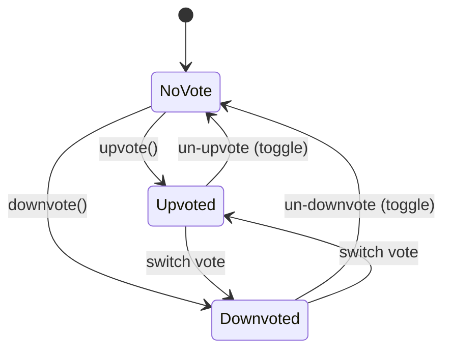

One more thing falls out of this for free: PlantParent can now split its consistency guarantee cleanly. The *displayed count* everyone sees can stay eventually consistent — a cached sum, a few seconds stale, nobody notices or cares. But *"did I already vote"*, for the one specific person looking at their own screen, has to be strongly consistent — read from the primary or a read-your-own-write path — or the upvote button will visibly flicker between states for that one user.

**New problem — and this one has nothing to do with the vote pipeline at all:** votes are now accurate, idempotent, and correctly counted. But the PlantParent team notices something uglier sitting right on top of all that correct counting: a joke answer to "how often should I water my succulent" — *"just talk to it nicely, plants can sense fear"* — sits at **1,240 upvotes**, ranked #1, while a genuinely detailed, correct answer from an actual certified horticulturist sits third with **340 upvotes**. Support tickets start arriving: *"the top answer on my question isn't even real advice."*

**How I'd say this in an interview:** "Storing a vote as a per-user state, not a raw increment, is what makes votes idempotent — a duplicate write just re-asserts the same state instead of double-counting. It also cleanly splits the consistency requirement: the shown count can be eventually consistent, but 'did I vote' has to be strong, per user. Once votes are trustworthy, the very next problem is that trustworthy vote counts still aren't the same thing as quality."

---

## Chapter 5 — The loudest answer isn't the best one

Sorting answers by raw vote count rewards whatever gets shared and laughed at the most, not whatever actually answers the question — jokes and memes accumulate upvotes just as easily as correct, careful answers do, sometimes more easily.

The obvious question: *if not votes, then what?* Extract more than one signal about each answer over time — upvotes, views, comments, the answerer's topic-specific credibility, dwell time / read-through rate, time decay, edit recency — and combine them, instead of trusting any single number alone.

**The analogy:** judging a talent show purely by applause volume rewards the loudest joke, not the best performance. You need the judges' scorecards too — multiple signals, weighed together, not just crowd noise. Reuse that phrase, "judges' scorecards," for this whole idea of multi-signal scoring.

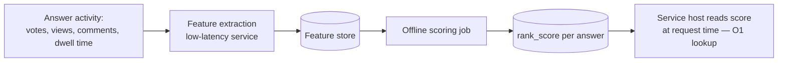

This is Quora's own real, documented approach per their engineering blog: features feed an offline-trained model, and the resulting score is precomputed and stored in a fast key-value store (Quora specifically moved this store from HBase to MyRocks, cutting P99 read latency from about **80ms to about 4ms** — a real, cited number). Reading the score at serve time is then just a lookup, not a computation.

Two real contrast points worth naming out loud:

| Platform | How they rank | Why |
|---|---|---|
| **Reddit** (documented, public formula) | `log10(max(\|ups-downs\|,1)) + sign(ups-downs) × age/45000` — no ML | Optimizes for chronological freshness ("hot"), not long-term correctness |
| **Stack Overflow** (documented) | Vote count + age decay + accepted-answer boost, deliberately simple; runs on a small number of powerful, vertically-scaled SQL Server boxes | Optimizes for auditability — "why is *this* the accepted answer" has to be inspectable, not personalized |
| **Quora / PlantParent** | Offline ML over multiple signals, personalized per viewer | "Best answer" genuinely varies by the reader's own interests and expertise — no single formula fits every viewer |

**The honest cost, not a bug to fix, just a trade-off to state plainly:** because this scoring runs offline in batches, a brand-new answer posted five minutes ago has no signal yet. It defaults to a "newest first" fallback position, sitting below older, lower-quality, but already-scored answers, until it accrues enough engagement to be scored on merit. That's the deliberate price of keeping ranking off the request path.

**How I'd say this in an interview:** "Upvotes alone are a bad ranking signal because jokes and virality get votes too — the fix is multi-signal offline scoring, precomputed so serving is just a fast lookup. The honest trade-off is cold start: a great new answer won't rank #1 instantly, and that's accepted, not solved, because fixing it would mean doing expensive scoring synchronously on every write."

---

## Chapter 6 — The reply chain fourteen levels deep

Underneath answers, PlantParent lets people comment — and comment on comments. One thread, a heated debate about whether tap water is bad for ferns, spirals into a reply chain **fourteen levels deep** `[illustrative]`, each level stored the obvious way: a `parent_comment_id` pointing at whatever it's replying to, recursively, with no depth limit.

Rendering that one comment section takes **900ms at P99** `[illustrative]`, because assembling a fourteen-level tree means walking the recursive structure level by level. A normal, shallow comment section on any other answer renders in about **15ms**.

The obvious question: *do we need a fully recursive, unlimited-depth comment tree at all?* Reddit genuinely builds exactly that — deep, recursive comment trees are core to Reddit's whole product, and it's a real, documented design choice that works *for them* because their UX is literally built around following long nested discussions. But PlantParent's comments are a lightweight aside sitting underneath the real content (the answer), not the main event.

**The fix — Quora's actual real choice, per the reference guide:** cap nesting at **one level**. A comment on an answer, and replies to that comment — full stop, no grandchildren. The `parent_comment_id` column still exists in the schema, but it's a convention enforced by the application, not a schema constraint, and it only ever points one level up.

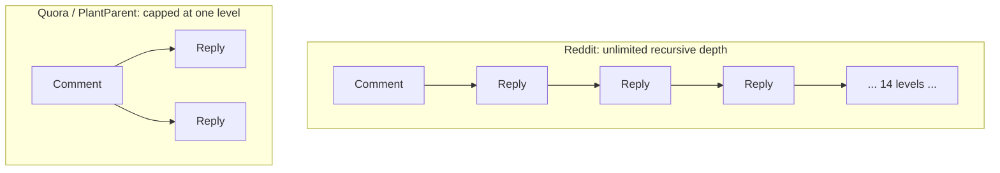

**The honest cost:** some genuinely multi-turn troubleshooting conversations — "what soil?" / "which brand?" / "here's a link" — no longer fit cleanly in one flat level. Users start working around it, typing things like "@ replying to the comment about tap water" in plain text. That's a deliberate, accepted trade-off, not a bug — the alternative (unbounded recursive rendering cost on every page view) is worse for the 99% of comment sections that never needed deep threading in the first place.

**How I'd say this in an interview:** "Unlimited recursive comment nesting is a real, valid choice — it's exactly what Reddit does, because deep threaded discussion is their actual product. But it has a real rendering cost, and if comments are a lightweight aside rather than the main content, capping to one level of nesting — which is Quora's real choice — keeps every comment section's cost flat and predictable, at the cost of occasionally flattening a conversation that wanted more depth."

---

## Chapter 7 — The follow list that turned into a firehose

PlantParent lets you follow topics — "Succulents," "Orchids" — and new answers to a followed topic show up in your feed. The obvious first implementation: the instant a new answer posts, fan out and write a feed-row insert for every single follower of that topic, right then, so their feed is always fully pre-built and instantly readable.

The "Succulents" topic has grown to **42,000 followers** `[illustrative]`. A popular member posts a new answer, and the fan-out worker now has to write 42,000 feed-insert rows. At the worker's throughput of roughly **2,000 writes/sec** `[illustrative]`, one single new answer takes **21 seconds** just to finish propagating. If five popular topics each get a new answer in the same minute, the fan-out queue backs up, and some users' feeds visibly lag behind real activity by several minutes.

The obvious question: *do we just make the fan-out workers faster?* That only pushes the ceiling further out — some topic will eventually cross whatever fixed throughput you provision, the same way one influencer's newsletter blew past Chapter 1's assumptions. You can't out-provision an unbounded number of followers.

**The fix:** a hybrid — **push** (pre-materialize into every follower's feed at write time) for topics under some follower threshold, and **pull** (merge at read time, from the topics you follow, when you open your feed) for the huge ones. This is exactly the real, documented trade-off Twitter/X ships for its celebrity-follower problem, just applied here to topics instead of people.

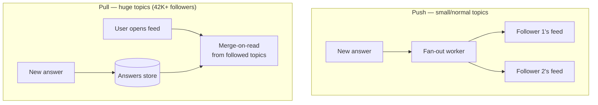

Worth saying explicitly: PlantParent's feed, like Quora's real one, is topic-driven, not a pure follower graph the way Twitter's is — there's no clean "who does this fan out to" answer for a topic the way there is for a person's followers, so leaning on pull-and-merge, backed by heavy caching, is the natural default here even before anything reaches celebrity scale. That caching matters *because* PlantParent's reads massively outnumber its writes — plausibly somewhere around **40-50x more reads than writes** `[illustrative]` once you count every page view against every vote, question, and answer — which is the same underlying reason a cache sits in front of almost everything in this whole story.

**The honest cost:** hybrid means two separate code paths to reason about and test, forever, instead of one. That's accepted, not solved — it's cheaper than either pure-push's write storms or pure-pull's slow merges at real scale.

**How I'd say this in an interview:** "Pure push blows up the moment something has enough followers — Twitter's celebrity problem, here it's a huge topic instead of a huge person. Pure pull is always safe but always a bit slower to read. The standard answer is hybrid: push for the normal case, pull for the huge one, and accept that you now maintain two code paths instead of one."

---

## Chapter 8 — Five hundred people ask about brown leaf tips

Search, first pass: a `LIKE '%brown tips%'` scan across the question-text column. With **220,000 questions** now in the table `[illustrative]`, that full scan takes **1.8 seconds at P99** `[illustrative]` — unbearable for a live search box.

The fix, first layer: build an **inverted index** — tokenize question and answer text, topic names, and usernames, so a search for "brown leaf tips" finds "tips of leaves turning brown" too, and cache hot queries so repeated searches skip the index lookup entirely.

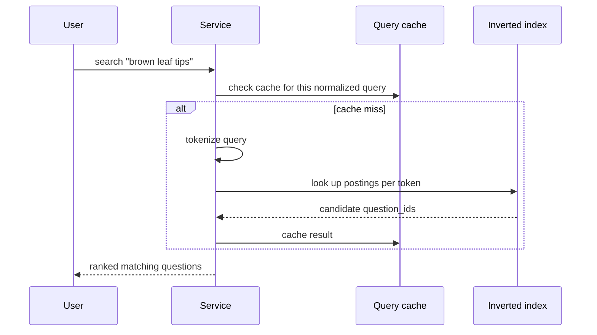

**But building the index surfaces something worse than slow search:** "why are my plant's leaves getting brown tips" has effectively been asked **500+ separate times** in slightly different wording — "brown leaf tips houseplant," "tips of leaves turning brown," "why do leaf edges go brown" — same underlying question, scattered across 500+ separate threads, each with its own thin, separate answer set, instead of one strong thread with the best answers concentrated together.

The obvious question: *can we just check every new question against the whole corpus for a semantic match before publishing?* Not cheaply — running an expensive similarity model against 220,000 existing questions for every single new one doesn't scale. The real answer is a two-stage funnel, cheap first, expensive only on the shortlist: **shingling + MinHash + Locality-Sensitive Hashing** narrows the whole corpus down to a handful of real candidates cheaply (this is the same real, documented primitive Google uses for near-duplicate detection at web scale, just applied to questions instead of web pages) — then **sentence-embedding similarity** confirms true paraphrase matches only against that short candidate list.

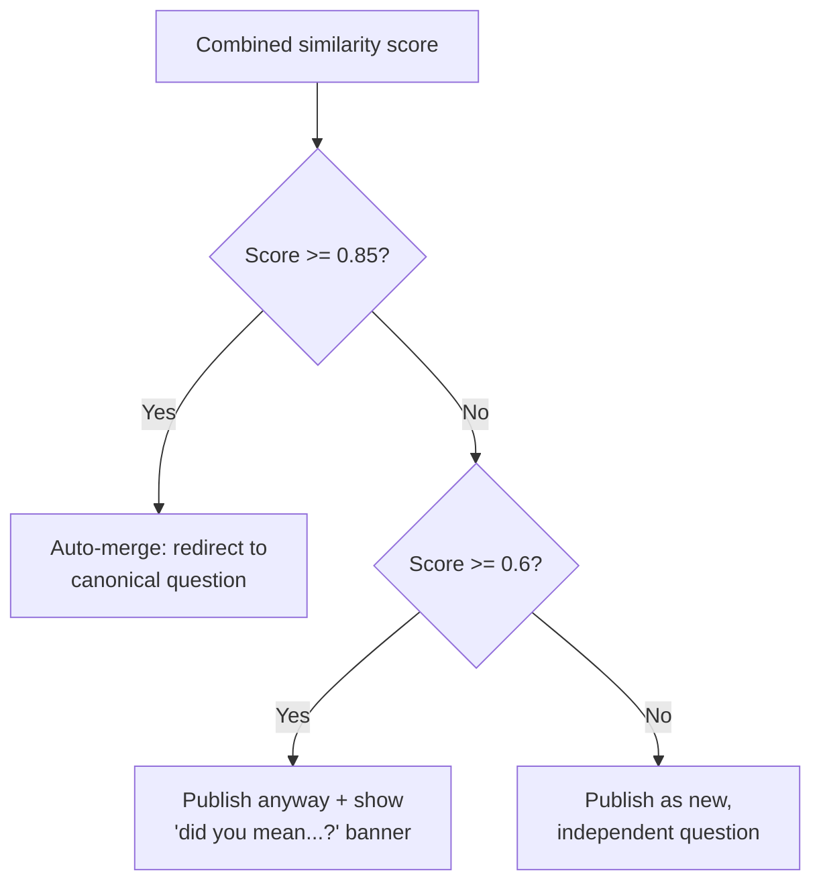

These cutoffs are **illustrative**, not source-verified — the shape that matters is three bands, not two. A binary merge/no-merge is too blunt: a false-positive auto-merge (two genuinely different questions silently combined) does more damage than a missed near-duplicate, which is exactly why the middle band exists — publish it, but nudge the asker with a "did you mean...?" suggestion instead of the system guessing on their behalf.

**How I'd say this in an interview:** "Search itself is a straightforward inverted index with caching — the more interesting problem search *reveals* is duplicate questions fragmenting the corpus. The fix is a coarse-to-fine funnel: cheap lexical LSH narrows the field, expensive semantic embeddings confirm, and a three-way threshold — merge, suggest, publish — avoids the false-positive cost of a hard binary cutoff."

---

## Chapter 9 — The kid asking "are we there yet" from the back seat

PlantParent adds notifications — "someone answered a question you follow" — the naive way: the client polls `GET /updates` every 3 seconds, forever, asking "anything new?"

With **40,000 daily active users** `[illustrative]` each polling every 3 seconds, that's roughly **13,300 requests/sec** of pure "anything new?" traffic — and the overwhelming majority of those requests get back the answer "no." Almost the entire notification system's server capacity is spent answering silence.

The obvious question: *why keep asking if nothing's changed most of the time?* Because plain polling can't tell the difference between "check right now" and "check whenever something actually happens" — it just checks on a fixed clock, regardless of whether there's anything to say.

**The fix — Quora's actual documented choice:** long polling. The client asks once, and the server *holds the request open* — up to **60 seconds** — and only responds the instant there's real data, or when the hold window times out. The client immediately re-asks the moment it gets a response either way.

**The analogy:** a kid in the back seat asking "are we there yet?" every three seconds is plain polling. Long polling is the parent saying "I will tell you the second we arrive" — the kid asks once and just waits quietly, and gets an answer the instant it's true, not on the next scheduled check-in.

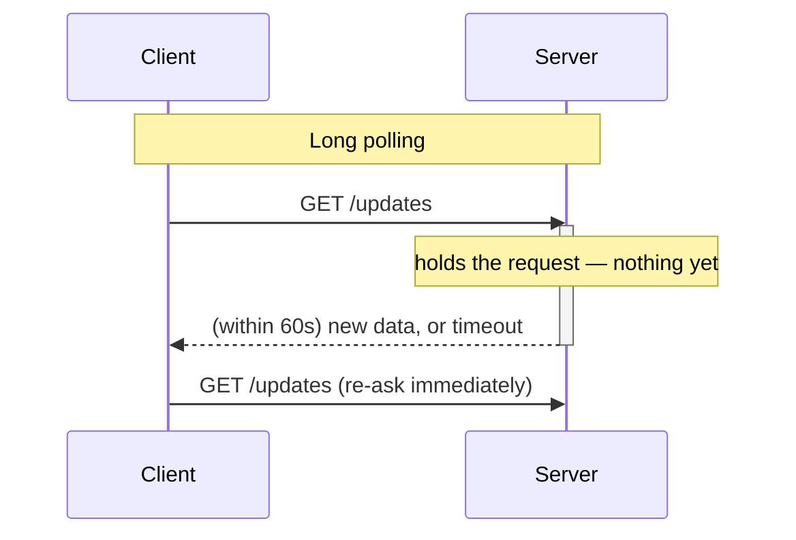

**The honest cost, not a bug:** long polling never *loses* a notification — if a connection has already timed out, the notification just waits in a durable store until the client's next request, whenever that is. But a client that's genuinely offline (phone closed, no open request at all) simply won't be told anything until it reconnects and asks again. That's an inherent property of any pull-based delivery, long-polling included — the alternative, a persistent push connection (WebSocket/APNs/FCM), trades that limitation for a real ongoing cost: holding open connection state for every single online user, all the time, whether or not anything's happening.

**How I'd say this in an interview:** "Plain polling wastes most of its own capacity answering 'nothing new' at any real scale. Long polling collapses that into one held connection, answered the instant there's actually something to say — it's Quora's real, documented choice, holding requests up to 60 seconds. It's not lossy, either — an unanswered notification just sits durably until the client's next ask."

---

## Chapter 10 — The bouncer at the door

Growth brings the less fun kind of attention: spam accounts posting affiliate-link "answers" disguised as fertilizer advice, and outright vote manipulation — one week, a "best fertilizer for tomatoes" answer racks up **900 upvotes in 40 minutes**, almost all from accounts created that same day `[illustrative]` — a textbook vote-buying ring.

The obvious question: *should every post wait for a human or model to clear it before it goes live?* No — that adds review latency to essentially every harmless post just to catch the rare bad one, and the overwhelming majority of content is completely fine.

**The fix:** publish first, screen asynchronously — an async classifier scores content after it's already live, with three confidence bands `[illustrative cutoffs]`: **≥0.95** confidently a violation → auto-remove immediately and notify the author; **0.5-0.95** uncertain → flag for a human/ML review queue while it stays visible; **below 0.5** → auto-publish and just keep watching its ongoing signals.

**The analogy:** a bouncer at the door who checks ID fast for everyone walking in — that's the rate limiter, covered next — and only pulls the genuinely sketchy-looking ones into a back room for a closer look, instead of interrogating every single guest before letting anyone through the door.

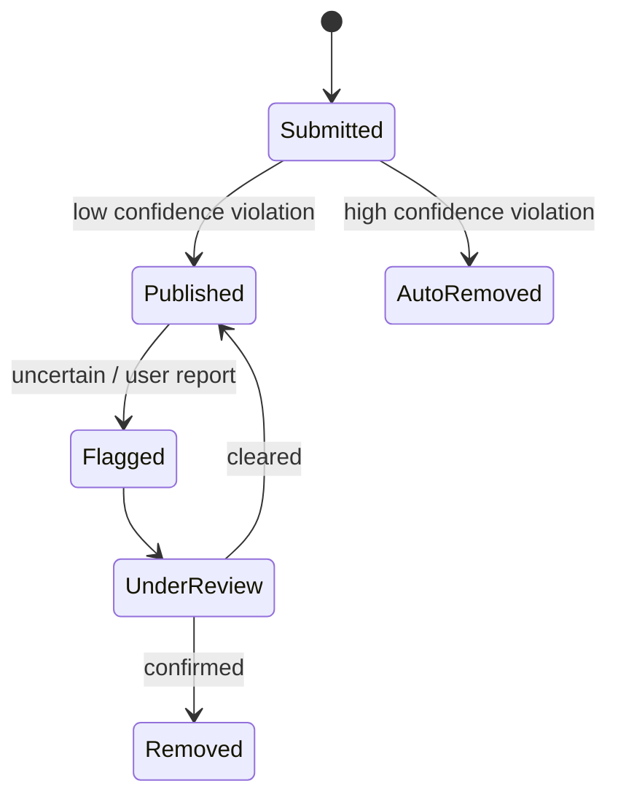

Separately, a **token-bucket rate limiter** per `(user_id, action_type)` — say, max 10 answers/hour, 100 votes/hour, 5 questions/hour `[illustrative]` — plus a secondary IP/device-fingerprint bucket, catches raw volume abuse before it ever reaches the classifier at all: cheapest defense, applied first.

A rate limiter alone doesn't catch *coordination*, though — it bounds one account's volume, not a ring of accounts acting together. That needs pattern signals run offline: vote-velocity spikes on one answer, new/low-reputation accounts clustering their votes together, the same IP voting through many distinct accounts, and vote-graph clustering (accounts that only ever vote on each other's content). Detected suspicious votes get **down-weighted in ranking, not deleted outright** — the reader's experience stays uninterrupted while the count quietly stops rewarding the manipulation, and a full account review happens asynchronously afterward.

**How I'd say this in an interview:** "Publish-then-screen beats screen-then-publish for latency, because most content is fine — three confidence bands (auto-remove, flag, auto-publish) avoid forcing a binary call on the uncertain middle. Rate limiting catches volume cheaply and first; velocity and graph-clustering, run offline, catch coordination a rate limiter can't see at all."

---

## Chapter 11 — Anonymous hides the name, not the row

Two last trust questions PlantParent's users actually ask: *"can I post this without my name on it?"* — some people don't want their real account attached to "I've killed six plants in a row, what am I doing wrong" — and *"what if I never want to see this person's comments again?"*

The obvious question for anonymity: *should anonymous answers live in a separate table with no author linked at all?* No — if abuse happens inside an anonymous answer, you still need to trace it back to a real account for moderation, and splitting storage in two would fragment both moderation and duplicate-detection logic for no real benefit.

**The fix:** anonymity is a **display-layer mask**, not a storage decision. The row always stores the real `author_id`. The API response strips or replaces `author_id → author_name` for every viewer except the author themself, at read time.

**The analogy:** the name tag you can take off in public — but the venue's guest-book registration backstage still has your real name in it the whole time.

For blocking: a directed edge, `(blocker_id, blocked_id)`, in its own table, enforced entirely at **read time**, in two places — feed/recommendation generation filters out anyone on your block list (and filters you out of their audience, too), and question/search pages hide a blocked user's answers *from the blocker specifically*. The content itself stays completely visible to everyone else — blocking is a personal filter, not a takedown.

**The analogy:** your own personal do-not-call list, not a ban from the building.

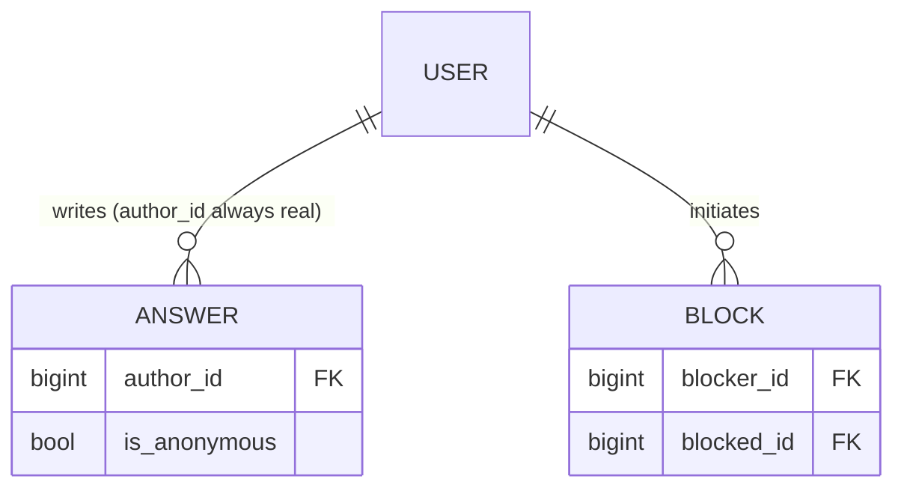

Both of these are, deliberately, **eventually consistent, read-time filters** — exactly consistent with everything else in this story that isn't the core content write itself: never let privacy or moderation logic sit on the synchronous write path.

**How I'd say this in an interview:** "Anonymity should be a display-time mask on the real author_id, never a separate storage model — you still need the real author for moderation and abuse tracing. Blocking is the same shape: a directed edge, enforced as a cheap read-time filter in feed and search generation, hiding the person from one specific viewer, not taking the content down for everyone."

---

## Where the story actually lands

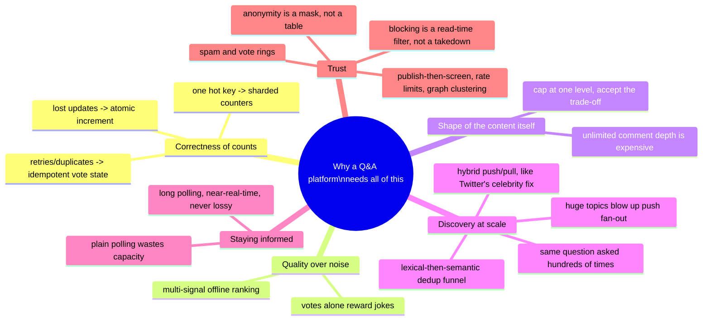

Every real Q&A system you'd design in an interview sits somewhere on this chain. The point isn't reciting all eleven chapters — it's knowing where to stop. A small internal FAQ tool might reasonably stop around Chapter 4. Anything with real growth and a public voting mechanism needs Chapters 5 through 9. Anything opening itself to the public internet eventually needs 10 and 11 too.

---

## Grill me — adversarial follow-ups

**Q1: "Why not just use atomic increments from day one — wasn't the read-modify-write bug obvious?"**
In hindsight, yes, but the real trap was the milestone-badge check — "did we just cross 100" genuinely feels like it needs to read the current value first. The actual fix is separating concerns: atomic increment for the count itself, and a separate idempotent check (has this badge already been sent?) for the side effect, instead of coupling them into one read-modify-write.

**Q2: "Isn't sharded counters overkill for a small hobby app — couldn't you just live with one hot key?"**
Only if you're confident nothing you host will ever go viral, and that's a bad bet for any public platform, however niche. Sharded counters cost very little extra complexity once you already have an async aggregator in place from decoupling votes off the content table — it's a cheap insurance policy, not a big lift.

**Q3: "Why store a full row per (user, answer) vote instead of just a counter — doesn't that cost a lot more storage?"**
It does cost more storage, and that's worth it, because a raw counter genuinely cannot answer "did this specific user already vote," which the UI needs on essentially every page load. The row-per-vote model also makes votes trivially idempotent — the whole reason retries and double-clicks stop being a problem.

**Q4: "Why does Quora bother with ML ranking when Stack Overflow gets by with a simple formula?"**
Personalization need — Quora's "best answer" genuinely varies by the reader's own interests and background, so ranking has to vary per viewer. Stack Overflow's model is closer to "there is one correct or accepted answer," and they deliberately favor a transparent, auditable formula over anything a viewer couldn't reconstruct by hand.

**Q5: "Capping comments at one level feels arbitrary — why not just let threads go as deep as they want, like Reddit?"**
Reddit's whole product is built around deep threaded discussion, so the recursive rendering cost is worth paying there. Comments here are a lightweight aside under the real content — the answer — so capping depth keeps every comment section's rendering cost flat and predictable, and it's a deliberate trade-off, not an oversight.

**Q6: "PlantParent's feed is topic-driven, not follower-driven — why bring up Twitter's celebrity-fan-out problem at all?"**
Because the underlying math is identical either way — any single object with a large enough audience, whether it's a person's followers or a topic's followers, turns "one write" into "N writes," and that's the exact shape of problem that breaks pure push. Twitter's celebrity case is just the cleanest, most-documented reference point for that number getting large.

**Q7: "Why not run the expensive semantic similarity model against every existing question for every new one, and skip the cheap lexical pass?"**
Cost — comparing one new question against the entire corpus with an expensive embedding model doesn't scale as the corpus grows into the hundreds of thousands. The cheap lexical/LSH pass narrows the field to a handful of real candidates first, so the expensive model only ever runs against a short list, not the whole question base.

**Q8: "If long polling never loses a notification, why would anyone ever choose push (WebSockets) instead?"**
Latency — push delivers the instant something happens, long polling waits for the next held connection to resolve, which is fast but not quite instant. The trade is real ongoing connection-state cost for every online user versus a slightly less immediate but much cheaper mechanism, and long polling is the pragmatic middle Quora actually ships.

**Q9: "What's PlantParent's story if the entire primary region goes down?"**
An asynchronously replicated standby database plus continuously cross-region-replicated blob storage, in a second region kept scaled-down but ready. Promotion to primary has to be a deliberate, health-checked decision, never automatic, and you state honest numbers for it — some minutes of the very latest writes could be lost (RPO), and promoting, warming caches, and repointing DNS realistically takes tens of minutes (RTO), not seconds.

**Q10: "How would you actually know any of these fixes are working once they're live in production?"**
Track the RED signals — rate, errors, duration, headline P99 not average — per critical endpoint, and alert on the user-facing symptom, like "P99 write latency crossed 200ms," not on every internal cause like "one database replica's CPU is elevated." Fewer, high-signal alerts beat paging on every small internal wobble.

---

## Cheat sheet — one line per stop on the story

- **Read-modify-write on a shared counter**: always loses updates under concurrency — fix with an atomic increment, never a separate read then write.
- **Vote sharing a lock with content**: decouple votes onto their own async pipeline (queue + separate counter store) so content edits never wait on vote traffic.
- **One hot counter key**: sharded counters spread a viral flood across N keys, summed and cached for readers — never read a raw shard directly.
- **Retries/double-clicks on a counter**: store vote as a per-(user, answer) state, not a raw number — idempotent by construction, and it's what lets "did I vote" be strongly consistent while the shown count stays eventually consistent.
- **Ranking by votes alone**: rewards jokes and virality — fix with multi-signal offline scoring (votes, views, comments, credibility, dwell time, decay, edits), precomputed so serving is an O(1) lookup.
- **Unlimited recursive comment trees**: expensive to render at depth — cap nesting at one level (Quora's real choice) unless deep threading is genuinely the product (Reddit's real choice).
- **Pure push fan-out**: blows up the moment one topic (or person) has enough followers — hybrid push/pull, exactly Twitter/X's celebrity fix, bounds the write cost.
- **Slow full-text scan**: build an inverted index with query caching; the deeper problem it usually reveals is duplicate questions, fixed by a cheap-lexical-then-expensive-semantic funnel with a three-way merge/suggest/publish threshold.
- **Naive polling**: wastes most of its own capacity answering "nothing new" — long polling (Quora's real, documented choice, up to 60s) collapses that into one held, near-real-time connection that never loses a notification.
- **Screen-before-publish moderation**: adds latency to the 99% of harmless posts to catch the rare bad one — publish-then-screen with confidence-banded auto-remove/flag/auto-publish is the standard fix; rate limiting catches volume, offline velocity/graph analysis catches coordinated rings.
- **Anonymity & blocking**: both are read-time display filters on real, fully-tracked data — anonymity masks the author's name, not the row; blocking hides a person from one viewer, not a takedown of the content.
- **The meta-lesson**: every fix in this story buys one property — correctness, throughput, quality, cheap rendering, bounded fan-out, discoverability, freshness, or trust — by spending something else in return; say the trade in the same breath you propose the fix.
