# Design Quora — The Story (Narrative Edition)

> **What this file is:** The technical reference file (`27-Design Quora-FAANG-Guide.md`) is your blueprint for interviews — containing API shapes, database schemas, trade-off tables, and cheat sheets. This file is a companion narrative: it tells the exact same engineering story as a continuous, plain-English journey. 
>
> We follow a fictional company named **CineBuff** (a Q&A platform for movie enthusiasts and cinema lovers asking questions like *"What does the spinning top at the end of Inception really mean?"* or *"Why did Christopher Nolan shoot Oppenheimer in 70mm IMAX?"*). As CineBuff grows, its engineers keep running into performance and architectural bottlenecks. Every time they deploy a quick patch, that patch creates the next bottleneck — until the system evolves into the exact architecture used by top tech companies today.
>
> Every bottleneck and fix in this story comes directly from real-world, documented engineering decisions:
> - **Quora:** Migration from HBase to MyRocks for low-latency ranking storage, long-polling notification delivery, and 1-level nested comment capping.
> - **Reddit:** Deep recursive comment threading and the public "hot" ranking decay formula.
> - **Stack Overflow:** Transparent, deterministic vote-and-age ranking on vertically scaled SQL Server infrastructure.
> - **Twitter / X:** Hybrid push/pull fan-out architecture for handling high-follower entities.
> - **Google:** Multi-stage Locality-Sensitive Hashing (MinHash/LSH) for near-duplicate detection at scale.
>
> Wherever concrete numbers appear in this story, factual documented figures are noted, while estimated examples are marked with an inline `[illustrative]` tag.

---

### Interview Context & Core Principle

**The Trigger Phrases:** In a system design interview, this topic appears when you are asked to:
- *"Design Quora"* or *"Design Stack Overflow"*
- *"Design a platform to rank answers to questions"*
- *"How do you prevent duplicate questions on a Q&A site?"*

**The Core Principle:** Keep one fundamental rule in mind throughout this guide:
> **A Q&A platform must perform two completely different jobs:**
> 1. **Durable Storage:** Store user content (questions, answers, comments) accurately and durably.
> 2. **Heuristic Ranking:** Estimate and guess which content to show first using real-time and background scoring.
> 
> **The core goal of the interview is to design a system where neither job ever blocks the other.**

---

## Chapter 1 — The Counter That Couldn't Count Straight

### The Initial Setup
CineBuff starts small with a few thousand film lovers. It uses a single MySQL database containing an `answers` table. The table stores the answer text alongside a simple integer column called `vote_count`.

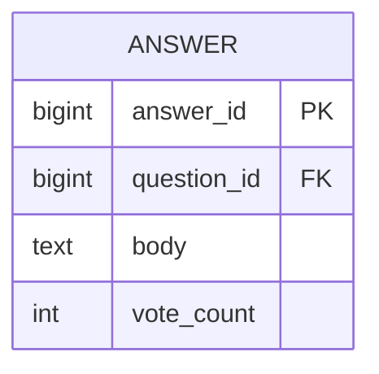

When an answer hits 100 upvotes, the system sends the author a celebratory email: *"You hit Gold Critic status!"* 

To implement this, the backend application code runs a straightforward three-step process whenever someone clicks the upvote button:
1. **Read** the current `vote_count` from the database.
2. **Add 1** to the count inside the application code.
3. **Check** if the new count equals 100 to trigger the email, then **Write** the updated number back to the database.

---

### The Bottleneck: Lost Updates Under Traffic
One afternoon, a popular movie podcast with 80,000 subscribers links directly to a CineBuff answer explaining the timeline of *Interstellar*. 

In the first 12 minutes, the analytics service logs **340 individual upvote clicks**. However, when an engineer checks the database immediately after, `vote_count` shows only **217** `[illustrative]`. **123 real votes vanished into thin air.** 

To make matters worse, the author receives the *"You hit Gold Critic status!"* email **three separate times**.

#### Step-by-Step Breakdown of the Race Condition:
Why did the counter lose 123 votes? Because reading a number, modifying it in code, and writing it back requires **two separate network round trips**. 

```
Timeline of a Race Condition (Lost Update):

Time T1: Voter A reads vote_count from DB  ==> Returns 99
Time T2: Voter B reads vote_count from DB  ==> Returns 99 (Stale read!)
Time T3: Voter A calculates (99 + 1 = 100) ==> Writes vote_count = 100 to DB
Time T4: Voter B calculates (99 + 1 = 100) ==> Writes vote_count = 100 to DB
```

* **Outcome 1 (Lost Vote):** Voter B's write lands last and overwrites Voter A's write. Two users clicked upvote, but the database counter only incremented by 1.
* **Outcome 2 (Duplicate Emails):** Three concurrent requests (Voter A, Voter B, Voter C) all read `99` at T1, calculated `100` at T2, and independently triggered three separate email notifications.

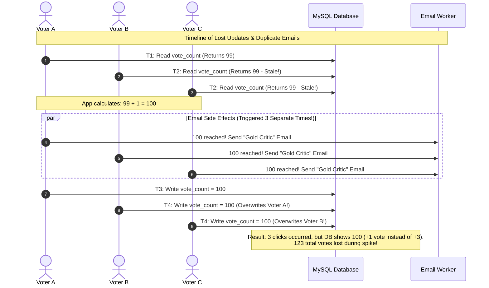

---

### The Fix: Atomic Increments
Stop reading the number before updating it. Instead, tell the database engine to increment the column natively in **one single, indivisible operation**.

**The Analogy:** Think of a mechanical turnstile counter at a movie theater entrance. Every time a person pushes through the gate, the mechanical gear ticks up by exactly 1. Nobody has to read the number display, calculate the next number in their head, and manually repaint the dial.

In SQL, this is written as:
```sql
UPDATE answers SET vote_count = vote_count + 1 WHERE answer_id = 42;
```
In Redis, this is performed using the native command:
```text
INCR answer:42:votes
```

Because the database engine executes the increment as a single atomic operation, no parallel request can intervene between the read and the write.

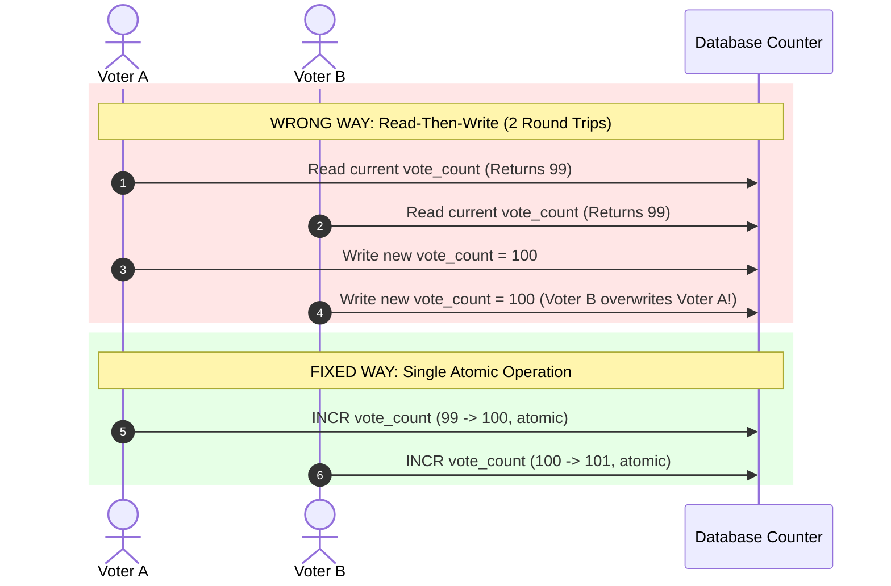

---

### The Next Bottleneck: Row Lock Contention
Atomic increments make the counter accurate, but a new problem immediately arises. 

The `vote_count` column sits in the **same database row** as the answer's text `body`. When database updates run, MySQL acquires an **exclusive row-level lock** on that specific row.

During the podcast traffic spike:
1. Incoming votes hit the row at **30 votes per second** `[illustrative]`.
2. The original author opens the app to fix a typo in their movie breakdown.
3. The author's edit request (`UPDATE answers SET body = ...`) is forced to wait **2.3 seconds** `[illustrative]` while the database processes the queue of row locks for incoming votes.

Content updates and vote counts are completely unrelated, yet they are fighting for the exact same database row lock.

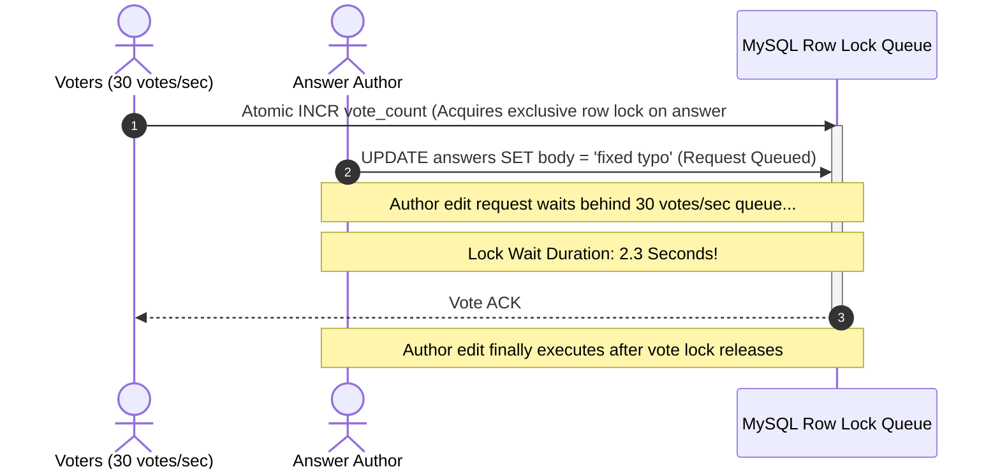

---

### How to Explain This in an Interview
> *"A counter under concurrent writes always requires atomic increments (`INCR` or `UPDATE count = count + 1`) rather than read-modify-write patterns. However, even an atomic operation will cause lock contention if the counter sits in the same table row as the content text. Our next step must be decoupling the counter from the content store entirely."*

---

## Chapter 2 — The Vote That Doesn't Wait for the Content

### The Fix: Decoupling Votes via Asynchronous Queues
To eliminate lock contention, stop modifying the `answers` table when a user casts a vote. 

Instead:
1. When a user clicks upvote, the Vote API publishes a lightweight `vote_cast` event to an asynchronous message queue (e.g., Apache Kafka or RabbitMQ).
2. The API immediately returns a `200 OK` success response to the user.
3. A background worker reads events off the queue and updates a dedicated counter store asynchronously.

**The Analogy:** Think of a ballot drop box placed outside a film festival auditorium. Moviegoers drop their paper vote stubs into the slot and walk away to catch the next screening. They do not stand around waiting for festival staff to tally each vote. Festival staff collect the stubs and count them on their own schedule in an office upstairs.

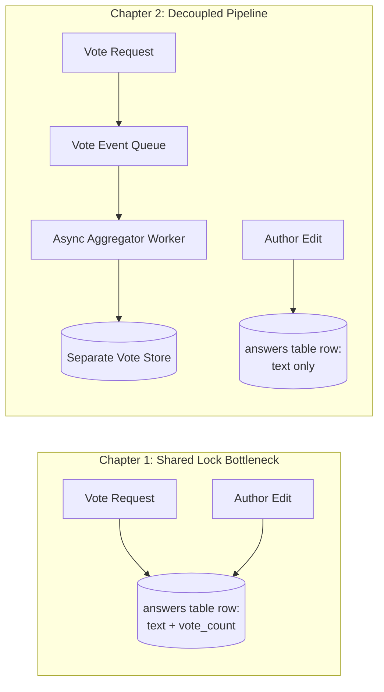

By decoupling the pipeline, editing an answer touches only the `answers` table, while voting touches only the event queue. Row lock contention drops to zero.

---

### The Next Bottleneck: Hot Key Contention
Eight months later, a major movie news site features CineBuff's breakdown of *Inception* as its *"Film Theory of the Day."*

Over the next 3 hours, the answer receives **8,400 upvotes**, arriving in concentrated bursts of **60 concurrent vote requests per second** `[illustrative]`. 

Even though votes are queued and stored in a fast key-value store (like Redis), every single write operation targets the **exact same counter key**: `answer:42:votes`.

#### Why Does a Fast Key-Value Store Slow Down?
In Redis or single-threaded counter stores, atomic operations on a single key must execute sequentially:
* While operating on key `answer:42:votes`, only one write executes at a time.
* As concurrency surges to 60 requests/sec, incoming commands line up in the server socket buffer.
* Individual operation latency rises from **<1ms to over 40ms** `[illustrative]`.
* Users experience visible delay on the upvote button for trending movie answers.

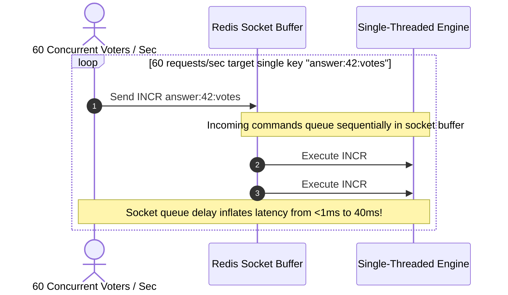

---

### How to Explain This in an Interview
> *"Moving votes to an asynchronous event queue solves lock contention between content edits and votes. However, a single counter key remains a single key. When an answer goes viral, high concurrency on a single key creates hot-key bottlenecking—even in memory-first stores like Redis."*

---

## Chapter 3 — Twenty Drop Boxes Instead of One

### The Fix: Sharded Counters
To resolve hot-key contention, split the single logical counter for an answer into **N separate sub-counters (shards)**—for example, **20 shards**.

#### Step-by-Step Sharding Implementation:
1. **Key Structure:** Instead of one key (`answer:42:votes`), create 20 keys: `answer:42:votes:shard:0` through `answer:42:votes:shard:19`.
2. **Write Routing:** When a user votes, hash their `user_id` to select a shard deterministically:
   $$\text{shard\_id} = \text{hash}(\text{user\_id}) \pmod{20}$$
3. **Execution:** The write request increments only that specific shard key (`INCR answer:42:votes:shard:7`).
4. **Aggregation:** A background worker periodically calculates the total count by summing all 20 shards (`SUM(shard_0 ... shard_19)`) and writes the sum to a cached display key (`answer:42:votes:display_cache`).
5. **Read Routing:** Frontend clients read only the cached total sum—they never read individual shards directly.

```
Mathematical Impact of Sharding:

Viral Traffic Burst: 8,400 total upvotes at 60 requests/sec
--------------------------------------------------------------
Single Counter Key:  1 key handles 60 writes/sec  (High Bottleneck)
20 Sharded Keys:    20 keys handle ~3 writes/sec per shard (Zero Bottleneck)
```

**The Analogy:** Instead of placing one single ballot drop box outside the cinema, place 20 drop boxes around the multiplex lobby. Moviegoers spread out evenly across all 20 boxes, eliminating lines. Later, an employee walks around, collects the tallies from all 20 boxes, and posts the total score on the theater marquee.

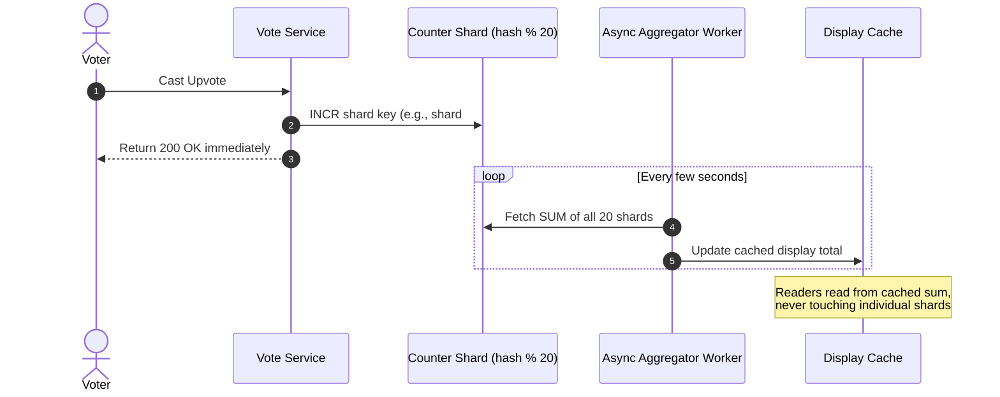

---

### The Next Bottleneck: Unintentional Retries & Double-Counting
Sharding handles scale perfectly, but mobile network realties expose a correctness flaw.

Mobile connections frequently drop packets. If a user on a shaky 4G connection taps the upvote button:
1. The request reaches the server and increments shard key `#7`.
2. The server sends back a success HTTP response, but the user's mobile connection drops before receiving it.
3. The mobile client application automatically retries the network request 2 seconds later.
4. The retried request reaches the server and lands on a shard as a **brand-new +1 increment**.

CineBuff's telemetry reveals that **~4% of daily vote requests are client-side retries or double-taps** `[illustrative]`. Because counters only know how to increment numbers, every retry inflates the count illegally. Furthermore, the system has no way to answer the basic query: *"Has User X already voted on Answer Y?"*

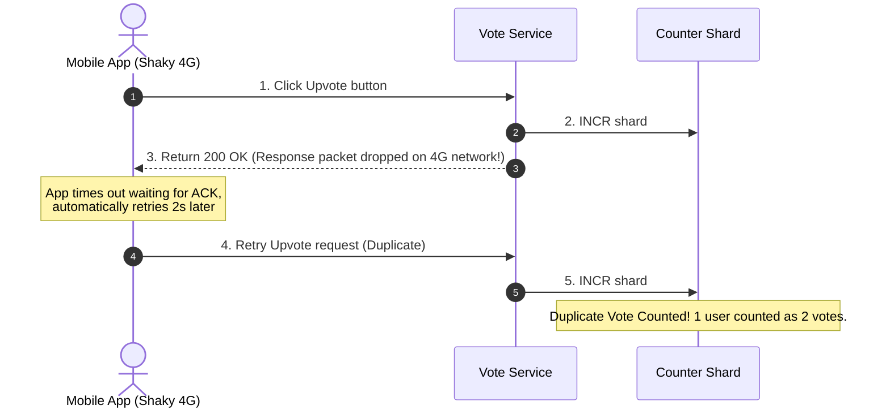

---

### How to Explain This in an Interview
> *"Sharded counters solve high-write volume by distributing operations across N keys and aggregating the total asynchronously. However, sharding solves scale, not correctness. Because raw counters cannot identify who performed an action, network retries and double-clicks result in duplicate counting."*

---

## Chapter 4 — The Vote That Remembers Who Cast It

### The Fix: Storing Votes as Per-User State
Stop treating a vote as a numeric increment. Treat a vote as a **persistent state record** tied to a specific `(user_id, answer_id)` tuple.

#### Data Schema & State Machine:
Store votes in a relational table or wide-column store using an idempotent upsert:

```sql
CREATE TABLE answer_votes (
    user_id BIGINT NOT NULL,
    answer_id BIGINT NOT NULL,
    vote_state VARCHAR(10) NOT NULL, -- 'upvoted', 'downvoted'
    updated_at TIMESTAMP DEFAULT CURRENT_TIMESTAMP,
    PRIMARY KEY (user_id, answer_id)
);
```

When a user upvotes, execute an **upsert** operation:
```sql
INSERT INTO answer_votes (user_id, answer_id, vote_state)
VALUES (101, 42, 'upvoted')
ON DUPLICATE KEY UPDATE vote_state = 'upvoted';
```

If a network retry or accidental double-tap occurs, the second write simply re-asserts `vote_state = 'upvoted'`. The database row remains unchanged, making the write completely **idempotent**.

**The Analogy:** Think of a VIP guest list for a movie premiere. If you sign your name on Line 14 of the VIP register, writing your name on Line 14 again does not add a second person to the theater. The total guest count is derived from the count of *unique registered names*, not the total number of pen strokes.

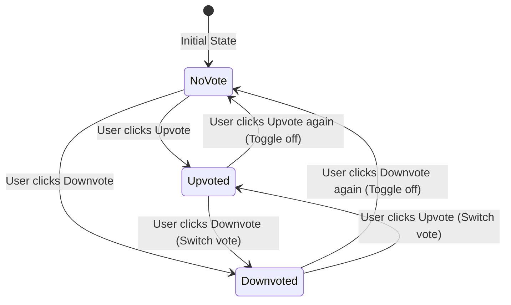

---

### Splitting Consistency Guarantees
Storing per-user state allows us to split the consistency requirements of the application into two distinct paths:

1. **Public Display Count (Eventually Consistent):** The total vote count shown to the public (`"1,240 votes"`) can be updated asynchronously every few seconds via background workers. If it is 3 seconds out of date, no user notices.
2. **User Vote Status (Strongly Consistent):** When a user views an answer, their personal upvote button state (*"Did I upvote this?"*) must be read directly from the primary database or via a read-your-own-writes path. Otherwise, the button will visibly flicker between active and inactive states upon page refresh.

---

### The Next Bottleneck: Votes Do Not Equal Quality
With accurate, idempotent voting in place, a major product issue emerges.

On a question asking *"How did Thanos snap his fingers in metal armor?"*, a joke answer—*"He sprayed WD-40 inside the gauntlet first"*—accumulates **1,240 upvotes** and ranks #1. Meanwhile, a detailed, technical explanation written by a verified Marvel VFX supervisor receives **340 upvotes** and sits buried at #3.

Sorting content purely by raw upvote totals rewards funny memes and quick jokes while burying deep, authoritative answers.

---

### How to Explain This in an Interview
> *"To ensure idempotency and support user-specific UI states, votes must be stored as per-user state records `(user_id, answer_id)` rather than raw increments. This allows display totals to remain eventually consistent while personal vote states remain strongly consistent. However, once votes are accurate, we face a product challenge: raw vote counts measure popularity, not answer quality."*

---

## Chapter 5 — The Loudest Answer Isn't the Best One

### The Fix: Multi-Signal Offline Scoring
To rank answers accurately, we must combine multiple signals rather than relying on upvote totals alone.

#### Multi-Signal Inputs:
* **Vote Metrics:** Upvotes, downvotes, and upvote-to-downvote ratios.
* **Engagement Signals:** Total views, read-through rates, and average dwell time (did users read the movie analysis for 45 seconds or leave after 2 seconds?).
* **Author Authority:** Topic-specific credibility score of the author (e.g., answers written by users with a high acceptance rate in *Film Theory* or *VFX*).
* **Content Freshness & Edits:** Time decay algorithms and recency of updates.

**The Analogy:** Judging an Oscar category based purely on crowd applause volume rewards the loudest comedy blockbusters over masterfully crafted dramas. Film academy judges use detailed scorecards evaluating cinematography, screenplay, sound design, and acting alongside audience reception.

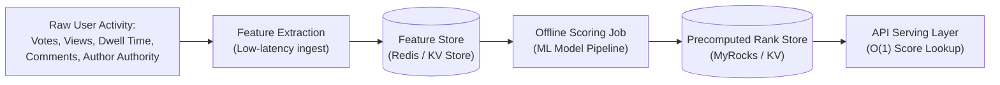

---

### Real-World Engineering Implementations
How do major Q&A and community platforms solve ranking?

| Platform | Ranking Mechanism | Architectural Rationale |
| :--- | :--- | :--- |
| **Quora** *(Reference Model)* | **Offline ML Scoring Models:** Features feed an offline ML model. Scores are precomputed and written to a key-value store. | Quora migrated its precomputed ranking store from HBase to **MyRocks** (RocksDB-backed MySQL engine), dropping P99 read latency from **80ms to 4ms**. Serving ranks requires a fast $O(1)$ key lookup. |
| **Reddit** | **Public Deterministic Formula:**<br>$$\text{Score} = \log_{10}(\max(|U - D|, 1)) + \frac{\text{sign}(U - D) \times \text{age}}{45000}$$ | Optimizes for real-time news and viral freshness ("Hot"). Public, non-personalized math run directly on SQL databases. |
| **Stack Overflow** | **Deterministic SQL Ranking:** Accepts votes, age decay, and a massive score boost for accepted answers. | Runs on vertically scaled, high-performance SQL Server clusters. Optimizes for auditable, predictable correctness over personalization. |

---

### The Trade-off: Cold-Start Latency
Because scoring runs offline in batch jobs, a brand-new movie breakdown posted 2 minutes ago has no historical engagement data (views, dwell time, votes). 

It temporarily defaults to a fallback position (*"Newest Answers"*) below older scored answers until the offline batch job runs. **This is an intentional trade-off:** we accept slight delay in ranking new answers to keep heavy ML model computations off the synchronous request path.

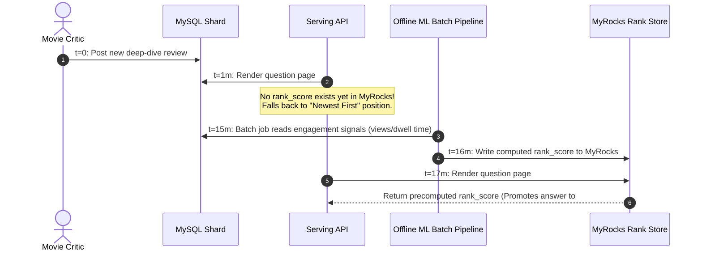

---

### How to Explain This in an Interview
> *"Raw vote counts reward virality over quality. We solve this by implementing multi-signal scoring (combining votes, dwell time, author authority, and decay). Following Quora's real-world design, scores are computed offline and stored in a low-latency key-value store like MyRocks for $O(1)$ read-time lookup. The accepted trade-off is the cold-start problem, where new answers require a brief period to accumulate engagement signals before ranking accurately."*

---

## Chapter 6 — The Reply Chain Fourteen Levels Deep

### The Bottleneck: Deep Recursive Comment Trees
Underneath movie breakdowns, CineBuff allows users to post comments and reply to existing comments. 

On an answer debating whether *Interstellar* is scientifically accurate about black holes, a debate spirals into a reply chain **14 levels deep** `[illustrative]`. 

Each comment record contains a `parent_comment_id` foreign key pointing to its parent comment.

```sql
CREATE TABLE comments (
    comment_id BIGINT PRIMARY KEY,
    answer_id BIGINT NOT NULL,
    parent_comment_id BIGINT NULL, -- Recursive self-reference
    body TEXT NOT NULL
);
```

#### Why Deep Recursion Destroys Rendering Latency:
To render a 14-level nested thread:
1. The application must execute recursive SQL queries (`WITH RECURSIVE`) or issue multiple database round trips to fetch children level by level.
2. In-memory tree assembly for deep threads increases P99 rendering latency from **15ms (for shallow threads) to 900ms** `[illustrative]`.

---

### Structural Comparison: Reddit vs. Quora

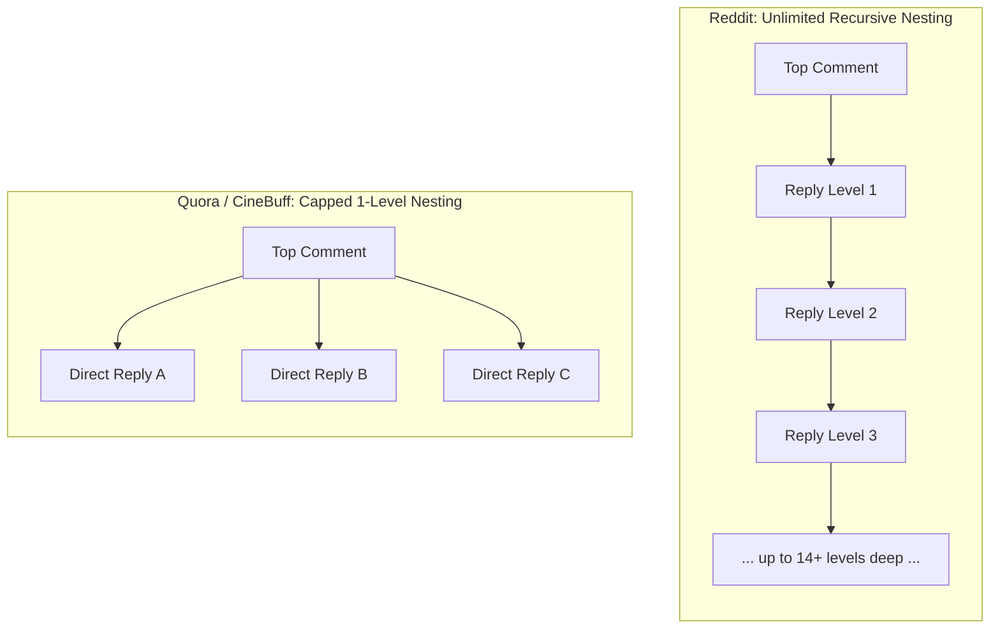

* **Reddit's Choice:** Reddit supports infinite nested comment trees because deep threaded discussion *is* the core product experience. They accept complex tree-building infrastructure to support this UX.
* **Quora's Choice:** On Quora (and CineBuff), the primary value sits in the main **Answer**, while comments are secondary. Quora explicitly **caps comment nesting at 1 level** (a top-level comment and its direct replies—no grandchildren).

---

### The Fix: Application-Enforced Level Capping
Keep the `parent_comment_id` column in the database, but enforce a hard rule in the application layer:
* If a user replies to an Answer, `parent_comment_id = NULL` (Top-level comment).
* If a user replies to a Top-level comment, `parent_comment_id = comment_id` (Level-1 reply).
* If a user attempts to reply to a Level-1 reply, the API automatically attaches the new reply to the **Top-level comment**, converting deep trees into a flat list of replies.

#### Trade-Off:
Users occasionally type manual workarounds like *"@Christopher replying to your point about black hole physics..."*. We accept this minor UX friction to guarantee flat $O(1)$ query patterns and predictable 15ms rendering latencies across all comment sections.

---

### How to Explain This in an Interview
> *"Unlimited recursive comment trees work for platforms like Reddit where nested discussion is the main product, but they introduce severe query and rendering overhead. For a Q&A site like Quora, capping comment nesting at 1 level keeps queries flat, simple, and performant, bounded at predictable latencies."*

---

## Chapter 7 — The Follow List That Turned Into a Firehose

### The Bottleneck: Fan-Out Write Storms
CineBuff allows users to follow movie topics (e.g., *"Sci-Fi Movies"*, *"Marvel / MCU"*). When a new answer is posted under a topic, it must appear in the activity feeds of all users following that topic.

#### Initial Naive Implementation: Push-On-Write
When a user posts an answer, a background worker fetches all followers of that topic and inserts a feed entry into every follower's timeline table.

```
Mathematical Breakdown of Fan-Out Bottleneck:

Topic: "Marvel / MCU" has 42,000 followers [illustrative]
Worker Write Capacity: 2,000 feed inserts/second [illustrative]

Time to process 1 answer: 42,000 / 2,000 = 21 SECONDS
```

If 5 popular topics receive new answers in the same minute:
$$\text{Total Inserts} = 5 \times 42,000 = 210,000 \text{ writes}$$
$$\text{Queue Backlog Time} = \frac{210,000}{2,000} = 105 \text{ seconds (1.75 minutes)}$$

Users' feeds lag behind real-time activity by several minutes because workers cannot write feed records fast enough.

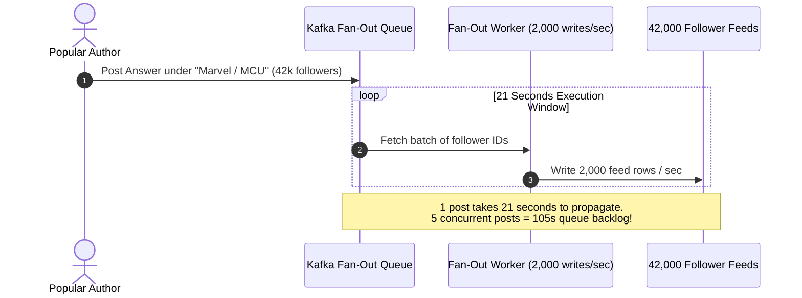

---

### The Fix: Hybrid Push/Pull Fan-Out Model
This is the classic **Twitter / X celebrity fan-out architecture**, adapted for topic graphs.

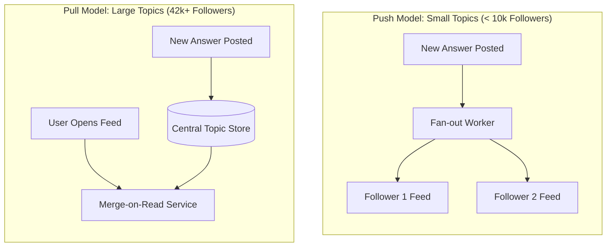

#### How the Hybrid Model Works:
1. **Low-Follower Topics (< 10,000 followers):** Use **Push-on-Write**. Pre-materialize feed entries directly into followers' feed caches.
2. **High-Follower Topics ($\ge$ 10,000 followers):** Use **Pull-on-Read**. Do not write 42,000 rows on post creation. Instead, store the post once in the central Topic timeline. When a follower opens their feed, a timeline merger service pulls the latest posts from popular topics and merges them into the user's feed on the fly.

---

### High Read-to-Write Asymmetry
Q&A platforms experience high read-to-write ratios—typically **40x to 50x more reads than writes** `[illustrative]`. 

Because users read feeds constantly but write answers infrequently, heavy caching layers (Redis cluster timelines) sit in front of the merge-on-read service to ensure fast feed rendering.

---

### How to Explain This in an Interview
> *"Pure push fan-out fails when topics or users have large follower bases. We implement a hybrid push/pull fan-out architecture: push updates for low-follower topics to pre-materialize feeds, and pull updates on read for high-follower topics. This bounds write fan-out latency while maintaining fast feed generation."*

---

## Chapter 8 — Five Hundred People Ask About Inception's Ending

### Search Architecture: Inverted Index & Query Caching
CineBuff's initial search uses a SQL `LIKE '%inception ending%'` wildcard query across 220,000 questions `[illustrative]`. P99 latency reaches **1.8 seconds** `[illustrative]`, causing search timeouts.

#### The Fix:
1. Build an **Inverted Index** (using Elasticsearch/Lucene) that tokenizes question text into inverted term lists (`"inception" -> [Q10, Q45, Q99]`).
2. Add a **Normalized Query Cache** layer to serve frequent searches (`"inception spinning top"`) instantly from memory.

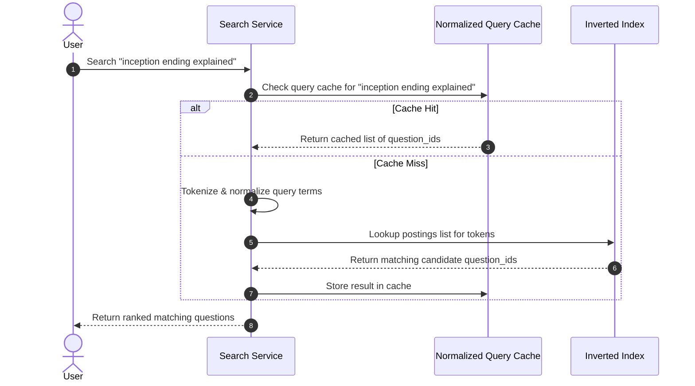

---

### The Deeper Problem: Corpus Fragmentation
Fast search exposes a major content issue: the question *"What does the spinning top at the end of Inception mean?"* has been asked **over 500 times** in slightly different variations:
* *"Inception ending spinning top explained"*
* *"Did Cobb dream the ending of Inception?"*
* *"Was Cobb still in a dream at the end of Inception?"*

Instead of one high-quality canonical question containing 20 great answers, the platform has 500 fragmented question threads, each containing 1 or 2 thin answers.

---

### The Fix: Multi-Stage Duplicate Detection Funnel
Running deep machine learning models (like BERT or sentence transformers) to compare every new question against all 220,000 existing questions is computationally impossible at scale. 

We solve this using Google's web-scale duplicate detection architecture: a **coarse-to-fine candidate funnel**.

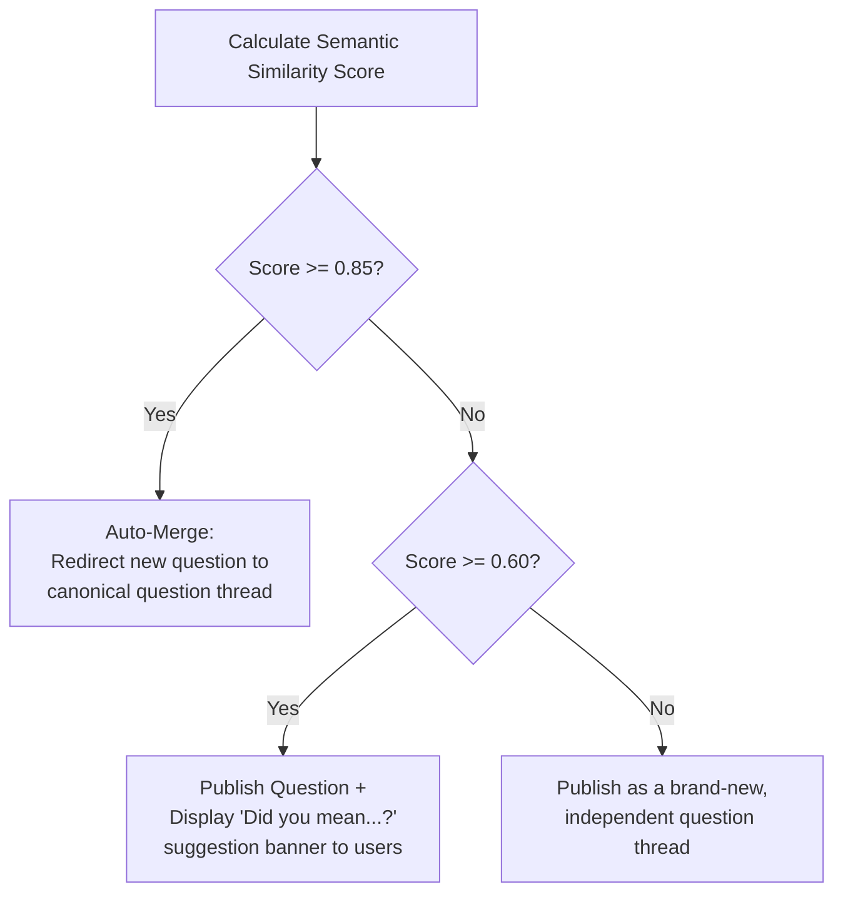

#### Step-by-Step Funnel Pipeline:
1. **Stage 1 (Coarse/Cheap Lexical Pass):** Use **Shingling + MinHash + Locality-Sensitive Hashing (LSH)**. LSH hashes questions into buckets such that similar phrasing collides in the same hash bucket. This reduces 220,000 questions down to **5 candidate questions** in under 5ms.
2. **Stage 2 (Fine/Expensive Semantic Pass):** Pass the 5 candidates into a deep **Sentence-Embedding Vector Model** to compute exact cosine similarity scores ($0.0$ to $1.0$).
3. **Stage 3 (Three-Tier Thresholding):**
   * **Score $\ge$ 0.85 (High Confidence Duplicate):** Automatically merge and redirect the new question to the existing canonical question thread.
   * **Score between 0.60 and 0.84 (Moderate Similarity):** Publish the question, but present a prominent banner to the author: *"Did you mean one of these existing questions?"*
   * **Score < 0.60 (Unique Question):** Publish as an independent question.

---

### How to Explain This in an Interview
> *"Search uses an inverted index with query caching. To prevent corpus fragmentation from duplicate questions, we deploy a multi-stage funnel: cheap MinHash/LSH narrows candidate pools fast, and sentence-embedding models calculate semantic similarity. A three-tier threshold (auto-merge, soft suggest, publish) prevents false-positive auto-merges from breaking user experience."*

---

## Chapter 9 — The Kid Asking "Are We There Yet" From the Back Seat

### The Bottleneck: Short Polling Wastes Server Capacity
CineBuff introduces real-time notifications (*"Someone answered your movie question!"*). 

The mobile app polls the server every 3 seconds (`GET /updates`).

#### Traffic Calculation:
```
Active Users: 40,000 Daily Active Users (DAU) [illustrative]
Polling Frequency: Every 3 seconds

Request Rate = 40,000 / 3 = 13,333 Requests / Second
```

Over 99% of these requests return `{"updates": []}`. The infrastructure spends thousands of HTTP connections and CPU cycles answering *"No, nothing new happened."*

**The Analogy:** A child in the back seat of a car asking *"Are we there yet?"* every 3 seconds. The driver is forced to answer *"No"* 100 times in a row.

---

### The Fix: Long Polling (Quora's Real Choice)
Instead of short polling, adopt **Long Polling**—which is Quora's documented real-world notification architecture.

```mermaid
sequenceDiagram
    autonumber
    actor C as Mobile Client
    participant S as Notification Server
    participant Queue as User Notification Queue

    C->>S: GET /updates (Long Poll Request)
    activate S
    Note over S: Server suspends request & holds<br/>HTTP connection open (up to 60s)
    
    alt New Notification Arrives (e.g., at second 14)
        Queue->>S: Push event (e.g., "New Answer")
        S-->>C: 200 OK + Notification Payload
        deactivate S
        C->>S: GET /updates (Re-open Long Poll immediately)
    else Timeout Reached (60s elapsed)
        S-->>C: 204 No Content (Connection Timeout)
        deactivate S
        C->>S: GET /updates (Re-open Long Poll immediately)
    end
```

#### Long Polling Mechanics:
1. The client opens a request (`GET /updates`).
2. The server **holds the request open** (suspending response execution) for up to **60 seconds**.
3. If an event occurs, the server immediately flushes data down the open connection and completes the response.
4. If no event occurs after 60 seconds, the server returns a `204 No Content` timeout, and the client instantly opens a new long-poll connection.

**The Analogy:** The driver tells the child: *"Quietly wait. I will speak up the exact second we pull into the cinema parking lot."*

---

### Trade-Off: Long Polling vs. WebSockets
* **WebSockets:** Full-duplex persistent TCP connections. Excellent for high-frequency bidirectionality (like multiplayer games or chat rooms), but requires maintaining heavy stateful connection managers for every online user.
* **Long Polling:** Standard HTTP requests that work seamlessly through proxies, firewalls, and load balancers without maintaining full-duplex socket state. If a client goes offline, notifications accumulate safely in a durable database until the next connection.

---

### How to Explain This in an Interview
> *"Short polling wastes server resources on empty responses. We implement Long Polling (Quora's documented architecture), holding HTTP requests open up to 60 seconds to deliver near-real-time events instantly while keeping transport stateless and reliable."*

---

## Chapter 10 — The Bouncer at the Door

### The Bottleneck: Spam and Coordinated Vote Rings
As CineBuff grows, bad actors appear: affiliate marketing bots post link-stuffed answers ("Watch free movies here!"), and vote-buying rings manipulate rankings (**900 upvotes in 40 minutes** on a single movie review from newly registered accounts `[illustrative]`).

---

### The Fix: Asynchronous Moderation & Token Buckets
Never force legitimate users to wait for synchronous human or ML review before their posts appear. Use a **Publish-Then-Screen** pattern combined with rate limiters.

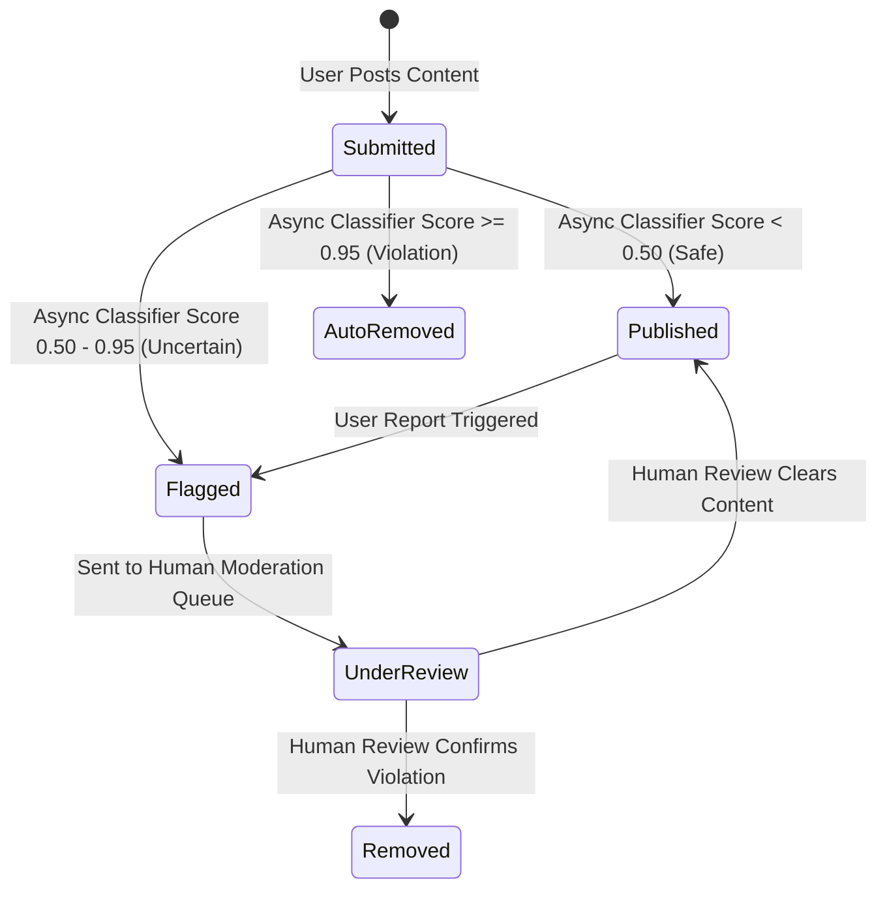

#### Defense Layers:
1. **Frontline Defense (Token-Bucket Rate Limiter):** Limits per-user/IP action frequency (e.g., max 10 answers/hour, 100 votes/hour `[illustrative]`) directly at the API gateway to stop automated spam scripts.
2. **Asynchronous ML Content Classifier:** Evaluates published content asynchronously and assigns a confidence score ($0.0$ to $1.0$):
   * **Score $\ge$ 0.95:** Auto-remove content instantly and flag the account.
   * **Score 0.50 to 0.94:** Keep content visible, but flag for human moderation review queues.
   * **Score < 0.50:** Content remains live without intervention.
3. **Offline Graph Clustering (Anti-Vote Manipulation):** Detects vote rings by identifying accounts that share IP subnets, registration timestamps, and vote-clustering behavior (accounts that exclusively vote on each other's posts). Suspicious votes are **down-weighted in ranking algorithms silently** rather than deleted outright, preventing attackers from gaming the detection system.

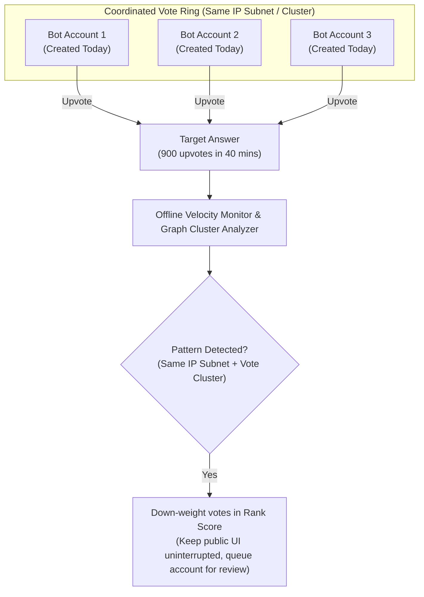

---

### How to Explain This in an Interview
> *"To preserve low latency, we use publish-then-screen moderation over screen-then-publish. Token buckets enforce rate limits at the gateway, asynchronous classifiers handle content safety using confidence thresholds, and offline graph clustering down-weights vote rings silently."*

---

## Chapter 11 — Anonymous Hides the Name, Not the Row

### Privacy & Trust Requirements
CineBuff users request two final features:
1. **Anonymous Posting:** Users want to ask sensitive questions (e.g., *"I didn't like The Godfather, am I crazy?"*) without displaying their identity publicly.
2. **User Blocking:** Users want to block abusive individuals from appearing in their feeds or comment sections.

---

### Fix 1: Anonymity as a Display-Layer Mask
Never create a separate `anonymous_answers` table. Anonymity is a **display-layer transformation**, not a data-storage split.

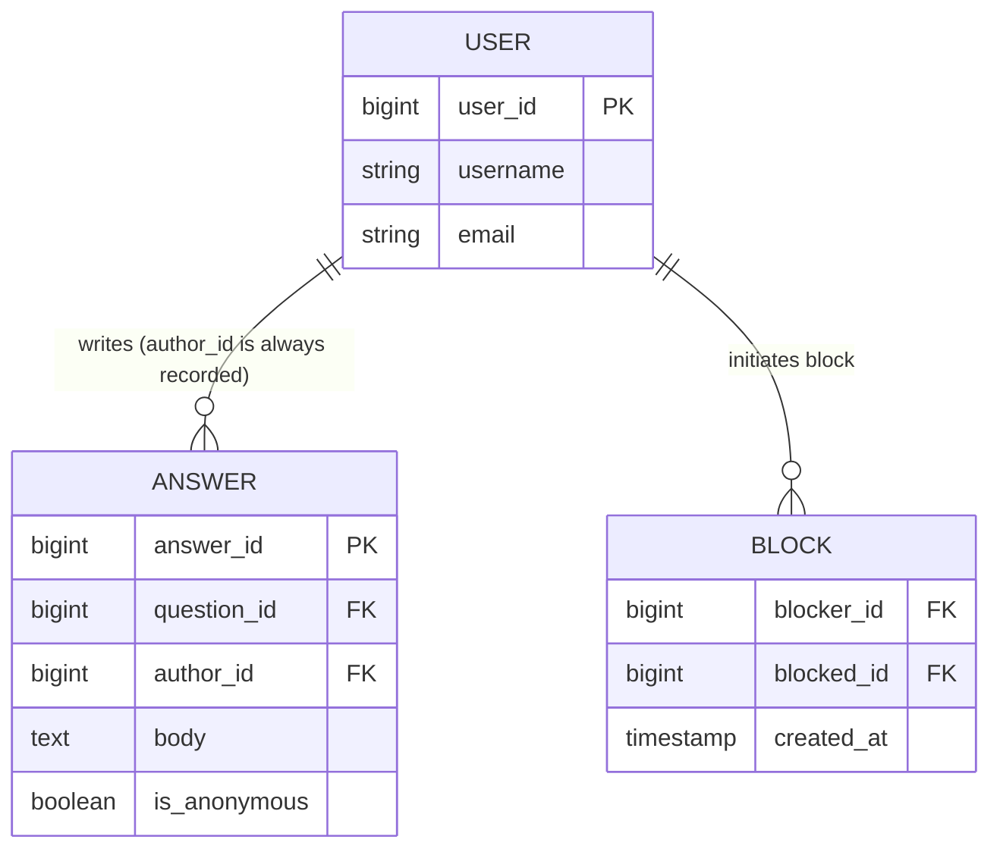

```mermaid
flowchart TD
    subgraph DB["Database Row (Always Stores Real Author ID)"]
        Row["answer_id: 42\nauthor_id: 8091 (Real User ID)\nis_anonymous: true\nbody: 'I didn't like The Godfather'"]
    end

    API["API Gateway / Response Transformer"]
    
    Row --> API
    
    API --> Viewer1{"Viewer = Author (ID 8091)?"}
    Viewer1 -->|Yes| Public1["Render: 'By You (Anonymous to others)'"]
    
    API --> Viewer2{"Viewer = General Public?"}
    Viewer2 -->|Yes| Public2["Render: 'By Anonymous Movie Buff'\n(author_id masked)"]
    
    API --> Mod{"Viewer = Admin / Moderator?"}
    Mod -->|Yes| AdminView["Render: 'Author ID: 8091'\n(Full auditability preserved)"]
```

* **Storage:** The `answers` table always records the true `author_id` alongside an `is_anonymous = true` boolean flag. This ensures moderation tools can trace abusive posts back to real accounts.
* **Serving:** When returning payload JSON, the API layer inspects `is_anonymous`. If `true`, it strips `author_id` and overwrites `author_name` with `"Anonymous Movie Buff"` for all viewers except the author themselves.

---

### Fix 2: Read-Time Directed Block Filtering
Blocking is stored as a directed edge table: `blocks(blocker_id, blocked_id)`.

Blocking is enforced **at read time**:
1. **Feed Generation:** The recommendation engine filters out posts written by anyone on the viewer's block list.
2. **Q&A Page Rendering:** When rendering answers, the API appends a WHERE clause excluding blocked user IDs for that viewer specifically. Content remains fully visible to the rest of the world.

---

### How to Explain This in an Interview
> *"Anonymity must be a display-layer mask over a fully tracked `author_id` to allow moderation tracing. User blocking is a directed relationship enforced as a read-time filter during feed and page generation."*

---

## Where the Story Lands: Complete Architecture Map

```mermaid
flowchart LR
    A["Ch1: Read-Modify-Write\n(Lost Vote Updates)"] -->|"Fix: Atomic Increments\nBottleneck: Shared Lock"| B["Ch2: Decouple Queue"]
    B -->|"Fix: Separate Write Queue\nBottleneck: Single Hot Key"| C["Ch3: Sharded Counters"]
    C -->|"Fix: 20 Sharded Keys\nBottleneck: Duplicate Retries"| D["Ch4: Per-User Vote State"]
    D -->|"Fix: Idempotent State\nBottleneck: Jokes Rank #1"| E["Ch5: Offline ML Ranking"]
    E -->|"Fix: Multi-Signal Scoring\nBottleneck: Deep Comment Tree"| F["Ch6: 1-Level Comment Cap"]
    F -->|"Fix: Capped Nesting\nBottleneck: Topic Write Storm"| G["Ch7: Hybrid Fan-Out"]
    G -->|"Fix: Push/Pull Hybrid\nBottleneck: Duplicate Questions"| H["Ch8: Search & LSH Funnel"]
    H -->|"Fix: LSH + Vector Funnel\nBottleneck: Polling Wastes CPU"| I["Ch9: Long Polling"]
    I -->|"Fix: Held HTTP Requests\nBottleneck: Spam & Vote Rings"| J["Ch10: Async Moderation"]
    J -->|"Fix: Rate Limit + Screening\nBottleneck: Privacy Needs"| K["Ch11: Read-Time Privacy"]
```

```mermaid
mindmap
  root((Why a Q&A Platform\nNeeds All of This))
    Correctness of Counts
      Lost updates -> Atomic increment
      One hot key -> Sharded counters
      Retries and duplicates -> Idempotent vote state
    Quality Over Noise
      Votes alone reward jokes
      Multi-signal offline ranking
    Content Structure
      Unlimited comment depth is expensive
      Cap at one level
    Discovery at Scale
      Huge topics blow up push fan-out
      Hybrid push-pull model
      Duplicate questions fragment answers
      Lexical and semantic dedup funnel
    Staying Informed
      Plain polling wastes capacity
      Long polling holds connections
    Trust and Security
      Spam and vote rings
      Publish-then-screen rate limits
      Anonymity as a display mask
      Blocking as a read-time filter
```

---

## Grill Me — Adversarial Follow-Up Questions & Answers

### Q1: "Why not use atomic increments from day one? Wasn't read-modify-write an obvious bug?"
> **Answer:** In hindsight, yes. However, developers fall into the read-modify-write trap when milestone checks are involved (e.g., checking *"did this count just hit 100 to send an email?"*). The fix is decoupling concerns: perform atomic increments for counting, and handle side effects (emails) via idempotent background event listeners.

### Q2: "Isn't sharding counter keys overkill for a small app?"
> **Answer:** For a low-traffic application, single counters are fine. But on any public platform, popular posts can go viral unexpectedly. Once votes are decoupled onto an event queue, sharding counter keys across 20 shards requires minimal extra code and acts as cheap insurance against hot-key bottlenecks.

### Q3: "Does storing a per-user vote row consume too much storage?"
> **Answer:** Storage is cheap compared to the cost of corrupted data and bad UX. Raw counters cannot answer *"Did User X vote on Answer Y?"*, which is required to render UI state. Per-user state rows are essential for vote idempotency and consistent user interfaces.

### Q4: "Why does Quora use ML ranking while Stack Overflow uses a simple formula?"
> **Answer:** Quora's content domain is subjective, so the "best answer" varies based on viewer interests, requiring personalized ML scoring. Stack Overflow focuses on objective technical correctness, prioritizing auditable, transparent formulas where the top-rated or accepted answer is clear to everyone.

### Q5: "Isn't capping comment nesting at 1 level restrictive for users?"
> **Answer:** Yes, it limits deep sub-debates. However, Q&A platforms prioritize the main Answer over comments. Capping nesting at 1 level guarantees flat database queries and fast, predictable rendering latencies, avoiding the recursive rendering overhead faced by platforms like Reddit.

### Q6: "Why reference Twitter's celebrity fan-out model for a topic-based platform?"
> **Answer:** Because fan-out math is identical regardless of entity type. Whether 50,000 users follow a celebrity or a movie topic, writing 50,000 rows on post creation causes the exact same write-storm bottleneck. Twitter's hybrid push/pull pattern is the standard solution for high-fanout entities.

### Q7: "Why use a cheap lexical pass (LSH) before semantic vector embeddings?"
> **Answer:** Computational efficiency. Comparing one new question against 220,000 existing questions using deep vector models is computationally expensive and slow. MinHash/LSH filters the corpus down to a few candidates in milliseconds, allowing vector models to run only on the shortlist.

### Q8: "If long polling works so well, why would anyone use WebSockets?"
> **Answer:** WebSockets excel at full-duplex, low-latency bidirectional communication (e.g., real-time multiplayer gaming or chat applications). However, WebSockets require persistent state management for open sockets. Long polling uses standard stateless HTTP requests, making it simpler and more cost-effective for notification systems.

### Q9: "What happens if a primary database region experiences an outage?"
> **Answer:** The system relies on asynchronous cross-region database replication and continuously synced blob storage in a secondary standby region. Failover is managed via controlled health checks, accepting minimal data loss (RPO of seconds) and recovery time (RTO of minutes) to avoid split-brain scenarios.

### Q10: "How do you monitor these systems in production to ensure stability?"
> **Answer:** Monitor RED metrics (Rate, Errors, Duration), focusing on headline P99 latency rather than averages. Alerts trigger on user-facing degradation (e.g., *"P99 write latency exceeds 200ms"*), rather than internal hardware fluctuations.

---

## Master Cheat Sheet — One Line Per Chapter

1. **Read-Modify-Write Counters:** Always lose updates under concurrency—use atomic increments (`INCR` or `UPDATE count = count + 1`).
2. **Decoupled Voting Pipelines:** Move votes to asynchronous queues so content edits never wait on vote traffic.
3. **Sharded Counters:** Distribute high-volume writes across N shard keys and aggregate totals asynchronously to prevent hot-key bottlenecks.
4. **Per-User Vote State:** Store votes as per-user state records `(user_id, answer_id)` to ensure write idempotency and consistent UI state rendering.
5. **Multi-Signal Ranking:** Avoid sorting by upvotes alone; precompute multi-signal ML scores offline and store in low-latency stores like MyRocks for $O(1)$ serving.
6. **Capped Comment Nesting:** Cap comment depth at 1 level to maintain flat database queries and fast rendering latencies.
7. **Hybrid Fan-Out Architecture:** Use push fan-out for low-follower topics and pull fan-out for high-follower topics to bound write latencies.
8. **Multi-Stage Duplicate Detection:** Combine cheap MinHash/LSH candidate retrieval with semantic vector models and three-tier decision thresholds to eliminate duplicate questions.
9. **Long Polling Notifications:** Replace short polling with held HTTP requests (up to 60 seconds) for efficient, near-real-time notification delivery.
10. **Asynchronous Moderation:** Deploy publish-then-screen pipelines with gateway token buckets, classifier confidence bands, and offline graph clustering to combat spam and vote manipulation.
11. **Read-Time Privacy Filters:** Implement anonymity as a display-layer mask over tracked author IDs, and handle blocking via read-time query filters.
12. **The Golden Rule of System Design:** Every architecture choice trades one property (throughput, latency, consistency, simplicity) for another—always state the trade-off alongside your solution.
