# Design Quora — FAANG System Design Interview Guide

> **Enhancement notes:**
> - Added a formal **🆕 API Design** table (endpoints, methods, request/response shape) under Section 4 — the original went straight from capacity estimation to architecture without one.
> - Added **🆕 Architecture Evolution (v1 → v2 → v3)** diagrams showing the design grow from a single synchronous DB, to async vote aggregation + cache, to the full ranking/search/moderation pipeline.
> - Added a worked **🆕 sharded-counter example** (10K upvotes / 20 shards) with its own vote → shard → async-aggregation → cache sequence diagram, plus a sync-vs-async vote-counting comparison table.
> - Added a **🆕 recency-ranking vs. quality-signal-ranking** trade-off table and a **🆕 moderation decision flowchart** with illustrative confidence thresholds for auto-publish / flag / auto-remove, plus a matching three-way threshold flowchart for duplicate-question merge/suggest-merge/publish.
> - Added a clearly-labeled **🆕 illustrative generic-scale example** (MAU, questions/month, answers/month, read:write ratio) alongside the source's own Quora-specific worked numbers.
> - Existing sections, ordering, tone, and every prior diagram are untouched; only minor clarity tightening was folded into surrounding prose here and there (not individually marked — this note covers it).

## 0. Mental Model

Quora is **"Stack Overflow's ranking problem + Twitter's feed problem + Reddit's voting problem"** wearing one UI.

Think of it as three engines bolted together:

1. **A write path** that stores questions/answers/comments/votes durably and consistently (people's actual content — lose this and you lose trust).
2. **A ranking/recommendation engine** that decides what answer shows first and what shows in your feed (best-effort, ML-driven, can be wrong without anyone noticing).
3. **A search/dedup engine** that stops the same question from being asked 10,000 times and lets you find the one canonical thread.

The entire interview is about **picking the right consistency and freshness guarantee for each of these three engines** — not about drawing more boxes. Content = strong-ish consistency, eventually correct. Ranking/counters = eventual consistency, always available. Search index = near-real-time, best-effort.

**Analogy**: Quora is a library (durable, catalogued books = Q&A) with a busy reference desk (search/dedup) and a recommendation librarian standing over your shoulder (ranking/feed) who's allowed to be a little wrong.

---

## 1. Interview Playbook

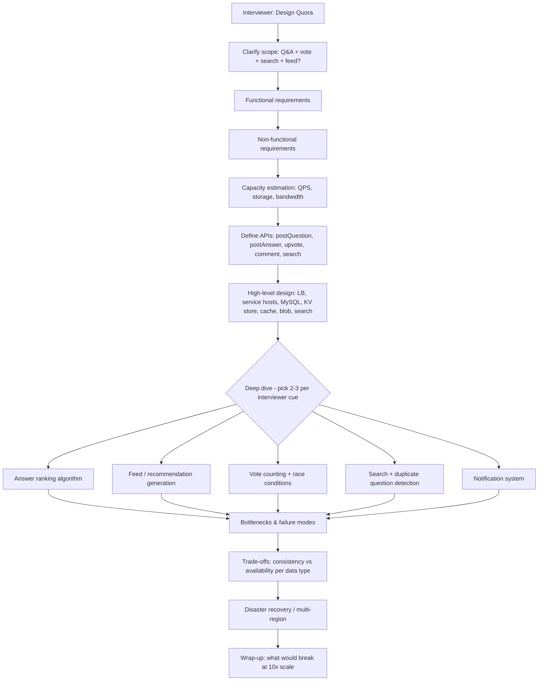

**How to identify this topic in an interview**: phrases like "design Quora", "design Stack Overflow", "design Reddit", "design a Q&A platform", "how would you rank answers to a question", "how do you prevent duplicate questions", "design a voting/upvote system at scale" — all funnel into this same mental model.

---

## 2. Requirements Clarification

### Functional Requirements

| # | Requirement | Notes |
|---|---|---|
| 1 | Post questions & answers (text, image, video) | Core write path |
| 2 | Upvote / downvote / comment on answers | High write volume, race-condition prone |
| 3 | Search for existing questions | Must catch near-duplicates |
| 4 | Feed / recommendation (topics, related Qs) | Personalization + discovery |
| 5 | Rank answers within a question | Not just upvote count — quality signal |

Memory hook: **"Q-A-V-S-R"** — **Q**uestion, **A**nswer, **V**ote/comment, **S**earch, **R**ank/recommend.

Ask the interviewer explicitly: do we need **notifications**, **user follows/topics**, **moderation/spam**, **anonymous answers**, **edit history**? These aren't in the source chapter but are natural extensions interviewers probe — call them out as "out of scope unless you want depth here."

### Non-Functional Requirements

| Requirement | What it means for Quora | Priority |
|---|---|---|
| Scalability | Feature count and users both grow — servers must scale horizontally and be near-stateless | High |
| Consistency | Questions/answers must look the same to everyone reading them (not necessarily instantly visible to *all* users at once) | High for content, low for counters |
| Availability | High concurrent-request tolerance; a slow feed is fine, a 500 error is not | High |
| Performance | No perceptible delay; P99 latency matters more than average | High |
| Durability | Content is user-generated and irreplaceable — never silently lose an answer | High |

**Golden clarifying question to ask out loud**: "Do all users need to see a new answer/comment instantly, or is a short propagation delay (seconds) acceptable?" — the source material explicitly says **no**, propagation delay is fine. This single answer justifies eventual consistency for feed/counters and unlocks caching everywhere.

### Cheat-sheet
- Lead with functional scope in one line: "ask, answer, vote, comment, search, rank, recommend."
- State explicitly that per-user real-time visibility is NOT required — this is the concession that makes the whole design tractable.
- Split NFRs into content (strong) vs. engagement metadata (eventual) early — this framing pays off in every later section.
- Call out disaster recovery as a NFR — most candidates forget it; the source material dedicates a whole section to it.
- Don't over-scope: skip building the ML ranking model itself, focus on the *system* that serves it.

---

## 3. Capacity Estimation (Worked Example)

### Formula chain

```
DAU × requests/user/day
        │
        ▼
Requests/day → RPS = requests/day ÷ 86400
        │
        ▼
Servers = DAU ÷ (RPS a single server can serve, e.g. 8000)
        │
        ▼
Storage/day = Σ (content type count × avg size)
        │
        ▼
Storage/year = Storage/day × 365
        │
        ▼
Bandwidth (in)  = Storage/day ÷ 86400 sec × 8 bits/byte
Bandwidth (out) = Σ (views/day × content size) ÷ 86400 × 8 bits/byte
        │
        ▼
Shards = Total storage ÷ storage-per-shard-node (given disk size)
Replicas = per shard, typically 3 for durability + read scaling
```

### Worked numbers (from the source, memorize the pattern not just digits)

**Assumptions**: 1B total users, 300M DAU, 20 requests/user/day, 15% questions have an image (250 KB), 5% have a video (5 MB), 1 question posted/user/day with 2 answers, 10 upvotes, 5 comments per question, text content ≈ 1 KB.

```
Requests/day = 300M × 20 = 6 × 10^9
RPS         = 6×10^9 / 86400 ≈ 69,500

Servers     = 300M DAU / 8000 RPS-per-server ≈ 37,500 servers

Storage/day:
  text:   300M questions × 1 KB           = 0.3 TB
  images: 300M × 15% × 250 KB             = 11.25 TB
  video:  300M × 5%  × 5 MB               = 75 TB
  ─────────────────────────────────────────────────
  total/day                               ≈ 86.55 TB
  total/year = 86.55 TB × 365             ≈ 31.6 PB

Bandwidth:
  incoming = 86.55 TB / 86400 sec × 8     ≈ 8 Gbps
  outgoing (20 views/user/day, same mix):
    text   ≈ 0.56 Gbps
    images ≈ 20.83 Gbps
    video  ≈ 138.89 Gbps
  outgoing total                          ≈ 160.3 Gbps
  total bandwidth = 8 + 160.3             ≈ 168.3 Gbps
```

**Takeaway to say out loud in the interview**: "Video dominates both storage (87% of daily storage) and bandwidth (82% of outgoing) despite being only 5% of questions — this tells us blob storage + CDN offload is the single highest-leverage infra decision, not the SQL database."

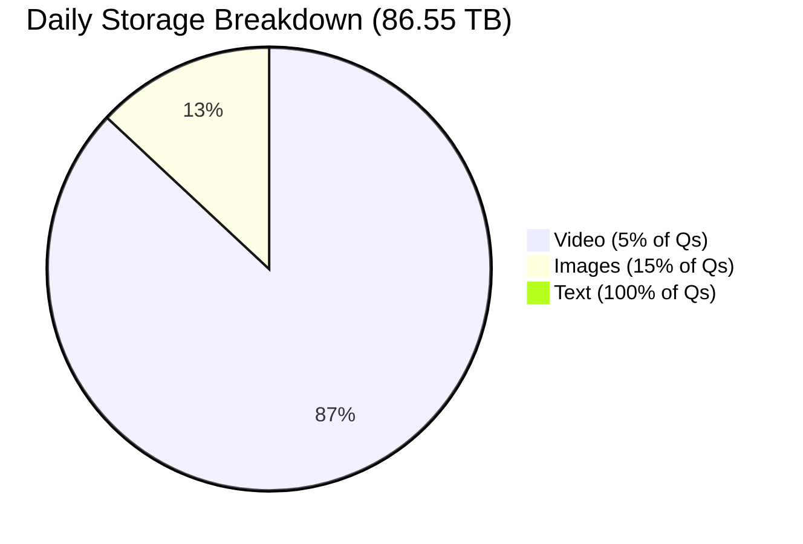

### Numbers worth memorizing

| Metric | Value |
|---|---|
| RPS a single commodity server can handle (rule of thumb) | ~8,000 |
| Avg question text | ~1 KB |
| Avg image | ~250 KB |
| Avg video | ~5 MB |
| S3 durability | 99.999999999% (11 nines) |
| S3 availability SLA | 99.9% |
| Quora's claimed custom queue throughput | ~15,000 tasks/sec |
| HBase P99 latency (Quora's own reported number) | ~80 ms |
| MyRocks P99 latency (after migration) | ~4 ms |
| Long-poll hold time (Quora) | up to 60 sec |
| Typical replica count for durability | 3 |

#### 🆕 Illustrative generic-scale example (read:write ratio)

The numbers above are the source material's own worked example, shaped around Quora's specific assumptions. Interviewers often hand you rounder, more generic numbers instead — here's the same drill run on those, **labeled illustrative since these aren't source-verified**:

- **300M MAU**, ~30M DAU (10% daily-active is a common rule of thumb for a content-consumption app).
- **~5M new questions/month**, **~50M new answers/month** (≈10 answers/question, illustrative).
- **~2.5B question/answer page views/month** (people read far more than they write).

That's roughly **2.5B reads : 55M writes ≈ 45:1** on content alone for this illustrative example — and real-world reported ratios for read-heavy social/UGC platforms are often quoted much higher (100:1 to 1000:1) once you count views served straight from cache/CDN that never reach a service host at all. Say the ratio out loud whenever you justify a cache: an order of magnitude (or more) more reads than writes is *why* Memcached/CDN sit in front of everything, and *why* it's fine for writes to be a little slower and stricter than reads.

### Cheat-sheet
- Always derive RPS from DAU × actions/day ÷ 86400 — interviewers want to see the formula, not a memorized number.
- State the servers formula as DAU ÷ per-server-RPS-capacity; 8000 RPS/server is a defensible assumption to state and move on from.
- Do the storage breakdown by content type — it reveals where the architecture money goes (video/blob, not SQL).
- Bandwidth = incoming (write path) + outgoing (read/view path); outgoing usually dominates by 10-20x because reads >> writes.
- Round aggressively — 69,500 ≈ "~70K RPS" is fine, precision isn't the point.

---

## 4. High-Level Design

### 🆕 API Design

Name the endpoints before drawing boxes — it forces you to say out loud which calls are synchronous writes, which are reads, and which is the odd one out (long-poll). A handful of REST-ish endpoints is enough; the interviewer is checking that you know the request/response shape and the sync-vs-async split, not grading you on a full OpenAPI spec.

| Endpoint | Method | Request (key fields) | Response | Notes |
|---|---|---|---|---|
| `/questions` | POST | `user_id, title, body, topic_ids[], image?, video?` | `question_id` | Sync DB write only; index/notify async — see 5.1 |
| `/questions/{id}/answers` | POST | `user_id, body, is_anonymous?` | `answer_id` | Same sync/async split as above |
| `/answers/{id}/vote` | POST | `user_id, value` (`+1 / -1 / 0`) | `200 OK` | Upsert on `(user_id, answer_id)` — idempotent, see 5.2 |
| `/answers/{id}/comments` | POST | `user_id, body, parent_comment_id?` | `comment_id` | One level of nesting by convention |
| `/questions/{id}` | GET | — | `question, ranked answers[]` | Cache-first read — see 5.4 |
| `/search` | GET | `q, cursor?` | `question_ids[]` (ranked) | Cache-first, tokenized query — see 5.5 |
| `/feed` | GET | `user_id, cursor?` | mixed feed items[] | Pre-materialized (push) or merged (pull) — see 5.4 |
| `/updates` | GET (long-poll) | `user_id, since_token?` | notification payload or timeout | Held ≤60s — see 5.6 |
| `/users/{id}/block` | POST | `blocker_id, blocked_id` | `200 OK` | Read-time filter only, no cascading delete — see 5.8 |

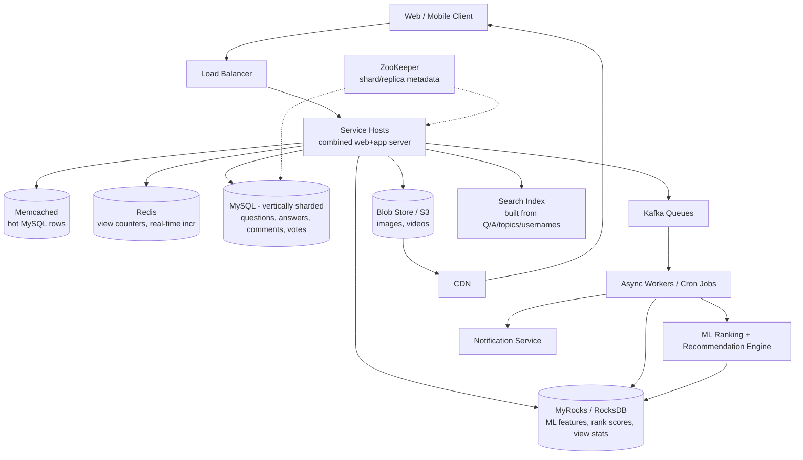

**Why service hosts are combined (not separate web + app tiers)**: the initial design split web servers (manager processes, page assembly) from application servers (worker processes, business logic) connected via a router library. This added a network hop and control-plane chatter on every request. The final design **merges them into one powerful, homogeneous machine** — eliminates the network I/O and makes horizontal scaling trivial (just add identical boxes behind the LB).

### Why these specific stores

| Data | Store | Why |
|---|---|---|
| Questions, answers, comments, votes | MySQL (vertically sharded) | Strong consistency, relational integrity, mature tooling |
| View counts, ML features, rank scores | MyRocks (was HBase) | High write throughput, low P99 latency, LSM-tree suits counters/features |
| Hot MySQL rows | Memcached | Simple read-through cache, `multiget()` batches lookups |
| Real-time counters (view counter) | Redis | Native atomic `INCR`, in-place increments |
| Images / videos | Blob store (S3) | Cheap, durable, offloaded to CDN |
| Async jobs (notifications, analytics, view-count aggregation) | Kafka + cron workers | Decouples "not-so-urgent" work from the request path |
| Shard/replica topology | ZooKeeper | Centralized metadata for "which partition holds which table/host" |

### Cheat-sheet
- Draw the LB → service host → {MySQL, KV store, cache, blob, Kafka} fan-out — that's 90% of the diagram points.
- Justify *why two caches* (Memcached for generic hot rows, Redis for atomic counters) — this is a favorite follow-up.
- Mention ZooKeeper explicitly as the piece that answers "how does a service host know which shard to query" — often forgotten.
- Say "service hosts are combined and homogeneous" before being asked — it preempts the "why not separate web/app tiers" question.
- Blob + CDN for media is a one-liner, don't over-engineer it: images/videos are read-heavy and immutable once posted.

### 🆕 Architecture Evolution: v1 → v2 → v3

Drawing the end-state diagram (above) straight away skips the part interviewers actually want to see: *why* each piece is there. Narrate it as three stages.

**v1 — single DB, synchronous vote counting (naive, breaks fast):**

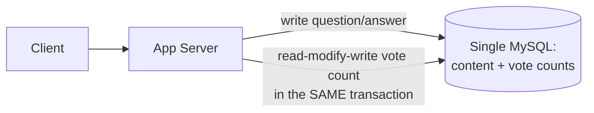

Everything — content and vote counts — lives in one table, updated in one transaction. Fine at low volume. Breaks the moment one answer goes viral: every voter now serializes on a read-modify-write of the same row (section 5.2's lost-update race), and the vote write competes with content writes for the same DB's capacity.

**v2 — async vote aggregation + cache (fixes the hot key):**

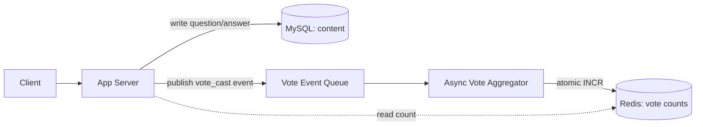

Vote writes move off the content DB entirely: the app server just publishes an event and returns. An async aggregator does the atomic increment and readers hit a cache, not the DB. This is the single biggest win in the whole redesign — it turns a write-time lock contention problem into a queue-depth problem, which is much easier to scale.

**v3 — ranking service + search index + moderation pipeline (the source's actual end-state):**

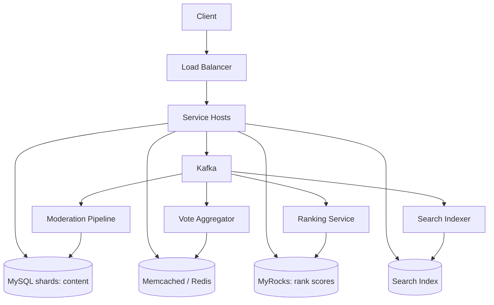

One event bus (Kafka), fanning out to independent async consumers — vote aggregation, ranking, search indexing, moderation — none of which block each other or the synchronous write path. This is exactly the high-level design diagram from earlier in this section; the evolution framing just explains *why* it looks the way it does.

Mnemonic: **"v1 blocks on one lock, v2 removes the lock, v3 gives every side-effect its own queue."**

### Core Data Schema

Grounding the "what goes in MySQL" discussion in an actual schema — draw this if asked "what does a question/answer row look like":

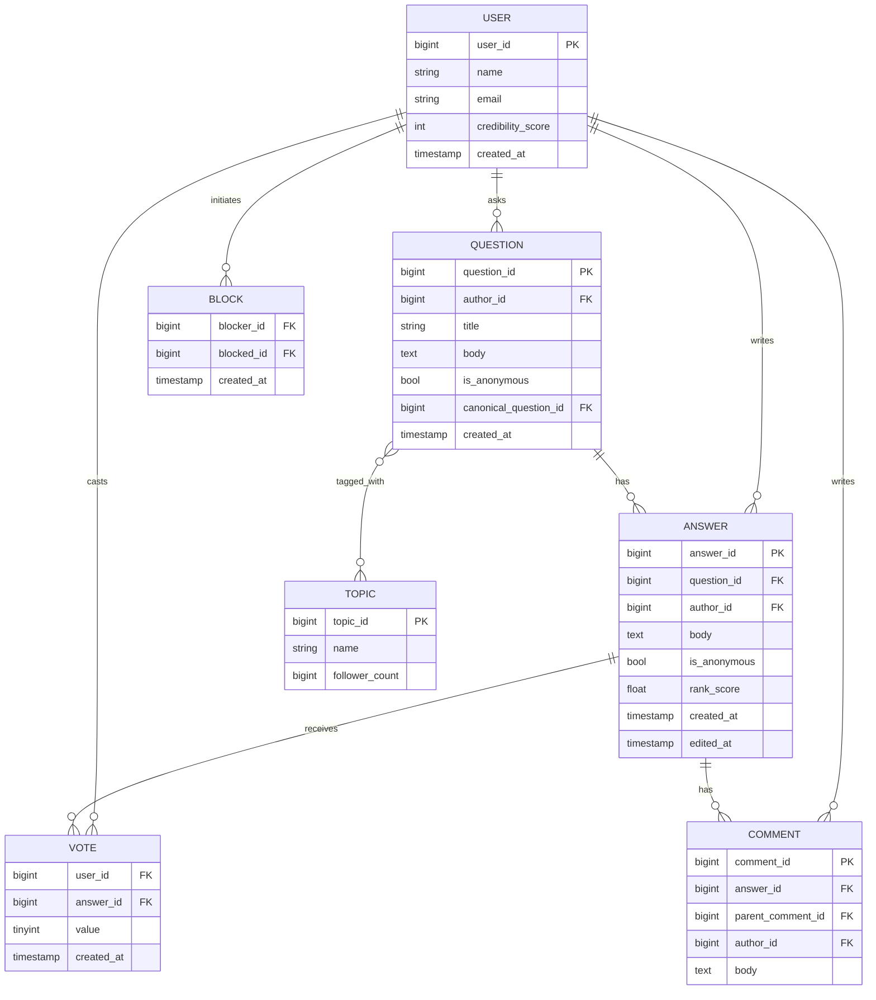

Notes worth saying out loud: **VOTE is a row per (user_id, answer_id), not a counter column** — this is what makes the vote state machine (section 5.2) and idempotency possible. **`rank_score` lives on the ANSWER row's logical entity but physically in MyRocks**, not MySQL — the ER diagram shows the relationship, not the storage engine. **`canonical_question_id`** is null unless this question was merged as a duplicate (section 5.5) — it points at the surviving question. **`is_anonymous`** is a display flag, not a separate table (see section 5.8). **`parent_comment_id`** caps at one level of nesting by convention, not by schema constraint.

---

## 5. Deep Dives

### 5.1 Posting a Question / Answer — Request Flow

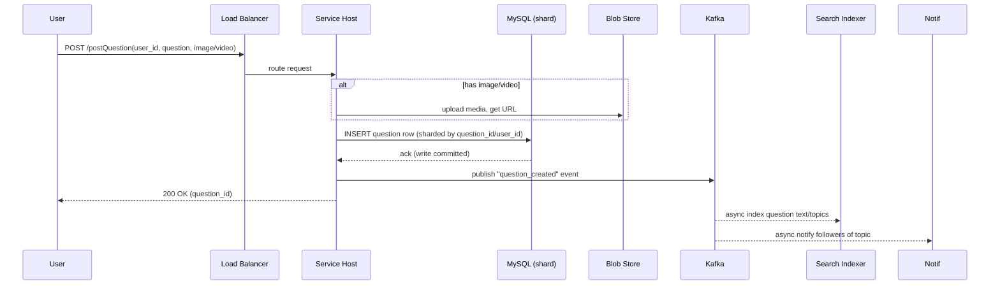

Key point: the **synchronous** path is only DB write + blob upload. Indexing, notification, and feature extraction are **asynchronous** via Kafka — this is what keeps P99 write latency low.

#### Trace it end-to-end: Priya posts an answer

Priya has strong credibility in the "Machine Learning" topic, which 40K users follow. She posts a 600-word answer to a trending question tagged `#MachineLearning`.

1. **t=0ms** — client sends `POST /postAnswer`; load balancer routes to a service host.
2. **t=5ms** — service host writes the answer row synchronously to the MySQL shard owning that `question_id`. DB acks the commit. This is the *only* step Priya's client blocks on.
3. **t=8ms** — service host returns `200 OK` with `answer_id`. Perceived latency: ~10-15ms.
4. **t=10ms, off Kafka topic `answer_created` (async, parallel, non-blocking)**:
   - **Fan-out decision**: 40K followers is below the celebrity cutoff (say 100K), so the fan-out worker pushes the answer into the pre-materialized feed of all 40K followers — a write-amplification cost paid off Priya's request path, never on it.
   - **Notification dispatch**: notification workers read the same event and enqueue "new answer in a topic you follow" — delivered to online users' long-poll connections within their current hold window (see 5.6 walkthrough), push notification to offline users.
   - **Cache invalidation**: the question page's cached answer list (Memcached) is invalidated or given a short TTL, so the next reader sees Priya's answer appended immediately — even before it has a meaningful rank score.
5. **Seconds to minutes later**: the feature-extraction service picks up early engagement (views, dwell time) on Priya's answer; the next offline ranking batch computes a `rank_score` and writes it to MyRocks. This is *why* a brand-new answer doesn't jump to #1 instantly — it defaults to a "newest first" fallback position until it accrues enough signal to be ranked on merit.

The order that matters: **DB write → response to Priya → {fan-out, notification, feature extraction, cache invalidation} all fire off the same Kafka event, in parallel, none blocking the others or blocking Priya.**

### 5.2 Voting — Race Conditions & Consistency

**The problem**: two concurrent upvotes on the same answer, naive `read count → +1 → write count` will lose an update (classic lost-update race).

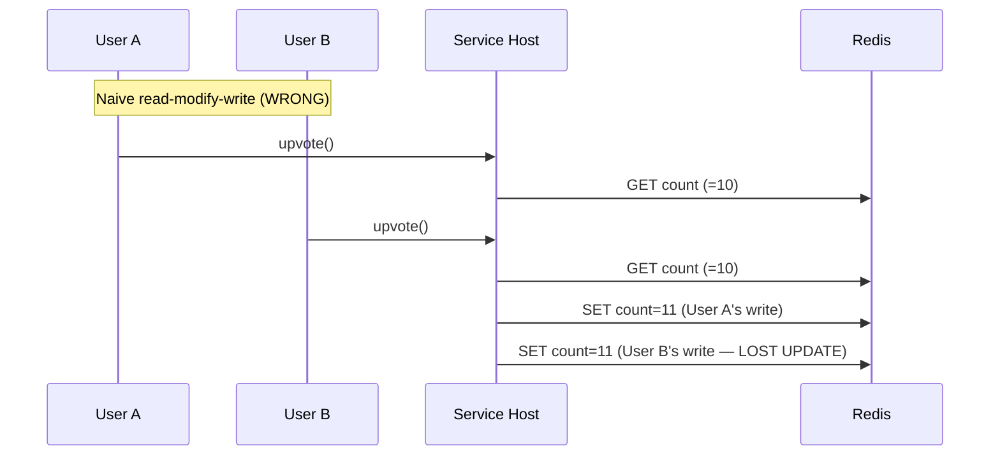

**Fix**: use atomic increment primitives, not read-modify-write:
- `INCR`/`INCRBY` in Redis (atomic at the server level) instead of GET+SET.
- Or a **sharded counter** pattern (see Sharded Counters building block) — split one counter into N shards, each takes a fraction of writes, sum on read. Solves both the race AND the hot-key contention problem when an answer goes viral.
- Idempotency: store `(user_id, answer_id) → vote_value` so a duplicate click/retry doesn't double count — enforce via a unique constraint or upsert, not just an increment.

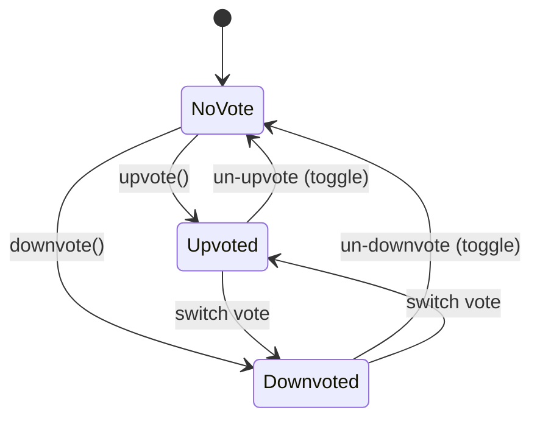

Votes are a **state machine per (user, answer) pair**, not an unbounded counter increment — this is what prevents a user from upvoting the same answer 1,000 times.

**Consistency choice**: vote *counts* shown to readers = eventual consistency (Redis async replication / read from cache is fine). But *whether I already voted* must be strongly consistent per-user (read from primary or a strongly consistent path) — otherwise the UI flickers between vote states.

#### 🆕 Sharded counters: worked example + async aggregation flow

**Illustrative example**: an answer goes viral and racks up **10,000 upvotes**. A single Redis key doing `INCR` 10,000 times spread over an hour is trivial on its own (~3/sec) — the real problem is a *burst*: a link on the front page can drive hundreds of concurrent voters at once, all contending for the same key. Split the counter into **20 shards**: each shard absorbs roughly **500 votes** (10,000 ÷ 20) instead of one key absorbing all 10,000, and the number shown to readers is `SUM(shard_0 … shard_19)`, computed periodically by an aggregator — never recomputed on every single vote.

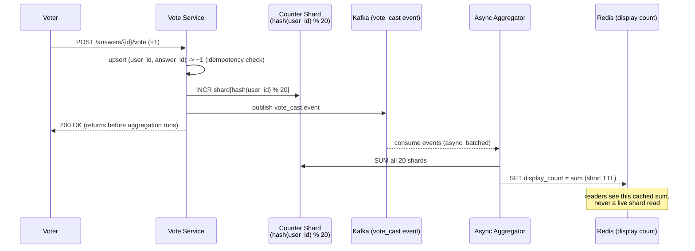

| | Synchronous (naive) | Atomic `INCR` (single key) | Sharded counters + async aggregation |
|---|---|---|---|
| Race-safe? | No — read-modify-write loses updates | Yes — atomic at the server | Yes — atomic per shard |
| Safe when an answer goes viral? | No | Degrades — every write serializes on one key | Yes — writes spread across N shards |
| Read cost | Cheap (one GET) | Cheap (one GET) | One `SUM` (batched + cached), not per-read |
| Blocks the voter's request on? | The DB write | The Redis round-trip | Nothing — ack returns before aggregation runs |
| Use when | Never at scale | Fine until an answer *can* go viral | Default for anything that might go viral |

Mnemonic: **"One key for a trickle, many shards for a flood."**

#### Cheat-sheet
- Never do GET-then-SET for counters — always atomic INCR or a sharded-counter aggregate.
- Vote is a (user, target) state machine (none/up/down), not a raw counter — store the edge, derive the count.
- Separate consistency requirement: vote *count* (eventual) vs. "did I vote" (strong, per-user) — a common trap interviewers set.
- Hot answers (viral) need sharded counters to avoid single-key write contention — mention this proactively for any "what if this answer gets 1M upvotes in an hour" follow-up.
- Comments/threads: store `parent_comment_id` for one level of nesting (Quora keeps comments flat/shallow, unlike Reddit's deep threading) — mention you'd cap nesting depth to bound query complexity.

### 5.3 Answer Ranking

**Why not just sort by upvotes?** Source material explicitly flags this: joke answers accumulate upvotes too. Upvote count alone rewards humor/virality over correctness.

**Quora's real approach** (per the engineering blog referenced in the source): extract features over time per answer (upvotes, views, comments, answerer's topic credibility, time decay, edit recency, dwell time/read-through rate) → feed into an **offline-trained ML model** → produce a rank score stored in the KV store (MyRocks) → service host reads the precomputed score at request time.

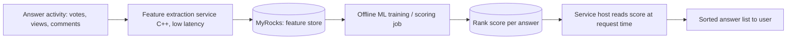

**Why offline, not online, ranking**: good answers accrue signal (votes/views) over time, so freshness isn't critical; offline scoring is cheaper and doesn't burden the request-path infra. Contrast with the *recommendation* system (feed), which needs **both online and offline** because a fresh question needs to reach potential answerers immediately.

**Real-world parallel — Stack Overflow**: uses a simpler, more transparent formula (Wilson score / vote age decay) rather than a black-box ML ranker, because SO explicitly optimizes for auditability of "why is this the accepted answer." Quora leans ML because it also personalizes ranking per viewer (what's "best" varies by reader's interest), which SO does not do.

**Real-world parallel — Reddit**: uses a public formula (roughly `log10(max(|ups-downs|,1)) + sign(ups-downs) × age_seconds/45000`), open-sourced, no ML — optimizes for chronological freshness decay ("hot" ranking) rather than long-term quality.

#### 🆕 Recency-ranking vs. quality-signal-ranking trade-offs

| | Recency-weighted (Reddit "hot") | Quality-signal ML (Quora's approach) |
|---|---|---|
| Core signal | Vote differential, decayed by post age | Votes + views + comments + credibility + dwell time + edit recency |
| Compute cost | Cheap — closed-form formula, computable on read | Expensive — offline feature extraction + trained model |
| Personalized per viewer? | No — same score for everyone | Yes — can vary by reader's interests |
| Rewards | Fresh, currently-engaging content | Durable correctness/expertise over virality |
| Weak spot | An old-but-still-correct answer sinks over time | A new, correct answer ranks low until it accrues signal (cold start) |
| Pick this when | Content is transient and time-ordered (a feed of new posts) | Content answers a fixed, reusable question and competes on long-term merit |

**If X then Y**: if the content is a firehose of new, time-ordered posts (Reddit/Twitter feed), rank by recency-decay. If the content answers a fixed, reusable question (Quora/Stack Overflow), rank by quality signal — recency alone would let a stale-but-early wrong answer permanently outrank a better one posted later.

**Signals beyond raw votes** — what actually feeds the feature extractor:

| Signal | What it captures | Why votes alone miss it |
|---|---|---|
| Upvotes/downvotes | Raw popularity | Jokes/memes accumulate votes too |
| Views | Reach | High views ≠ high quality |
| Comments | Engagement depth | Controversial ≠ correct |
| Answerer credibility | Topic-specific expertise/track record | A domain expert's answer should outrank a funnier, more-upvoted one |
| Dwell time / read-through rate | Did readers actually read it, not bounce | Catches clickbait-y or low-substance answers |
| Time decay | Recency vs. staleness | An old answer with outdated info shouldn't beat a corrected recent one |
| Edit recency | Was it kept up to date | Old, never-updated "best" answers go stale silently |

Mnemonic: **"Votes lie; Views, Comments, Credibility, Dwell-time, Decay and Edits don't."**

#### Term-pair disambiguation: Ranking vs. Recommendation

| | Answer Ranking | Recommendation / Feed |
|---|---|---|
| Question | "Which answer is best for *this* question?" | "What should *this* user see next?" |
| Input scope | Single question's answer set | Whole corpus + user profile/graph |
| Mode | Offline only (source: "good to implement offline") | Online **and** offline (needs freshness) |
| Personalized per viewer? | Less so (mostly answer-quality signal) | Heavily personalized |
| Failure mode if stale | Slightly wrong order, low harm | Missed engagement, but not "wrong" |

#### Cheat-sheet
- State explicitly: "upvotes alone are a bad ranking signal because of joke/viral answers" — shows you internalized the actual problem, not just the mechanism.
- Ranking = offline batch (cheap, latency-tolerant); Recommendation/feed = online + offline hybrid (freshness-sensitive).
- Feature extraction should be a separate low-latency service (C++/Go) feeding a slower ML scoring job — decouple "fast path" from "smart path."
- Namedrop Reddit's public hot-ranking formula and Stack Overflow's transparent scoring as contrast points — shows breadth.
- Precomputed scores live in a KV/wide-column store (MyRocks/HBase-like), read at serve time — ranking is O(1) lookup, not O(n) compute per request.

### 5.4 Feed Generation — Fan-out on Write vs. Fan-out on Read

Not explicit in the source material, but this is the #1 expected extension for any social/Q&A feed system — bring it up proactively.

| | Fan-out on Write (push) | Fan-out on Read (pull) | Hybrid |
|---|---|---|---|
| When feed entry created | At write time, pushed to every follower's feed store | At read time, pulled/merged from all followed sources | Push for most users, pull for celebrities |
| Read latency | Very low (feed pre-materialized) | Higher (merge at read time) | Low for most |
| Write cost | High if fan-out is large (celebrity problem) | Low, constant | Balanced |
| Best for | Users with few followers/topics | Users/topics with millions of followers | Real systems (Twitter, Quora-scale) |
| Failure mode | Write amplification for viral topics | Read amplification, slow feed for power users | Complexity of two code paths |

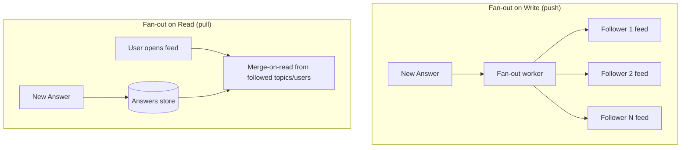

**For Quora specifically**: feed mixes *topics you follow* (few, high fan-in) with *questions needing answers* (recommendation-driven, not follower-graph-driven) — so it's naturally closer to **fan-out on read with heavy caching**, since the "who does this fan out to" question doesn't have a clean follower-graph answer like Twitter. Mention this distinction — it's a good signal you're not just pattern-matching "feed = fan-out on write."

Memory hook: **"Push what's rare, pull what's huge"** — push (write) works when fan-out is small; pull (read) wins when fan-out is massive (celebrity/viral topic problem).

#### Cheat-sheet
- Always name both strategies and the hybrid — pure push or pure pull answers read as incomplete.
- Celebrity/viral-topic problem = the standard follow-up; hybrid (push for normal, pull for high-fan-out) is the standard answer.
- Quora's feed is topic-and-recommendation driven, not a pure follower graph — say so, it differentiates you from a rehearsed Twitter answer.
- Precompute (materialize) feeds in a cache/KV store, invalidate/refresh lazily — don't recompute the ML ranking on every page load.

#### Read Path: Viewing a Question Page

The other half of "cache generously for reads" (Golden Rule 5) made concrete — this is what happens when any user, not just a feed subscriber, opens a question page:

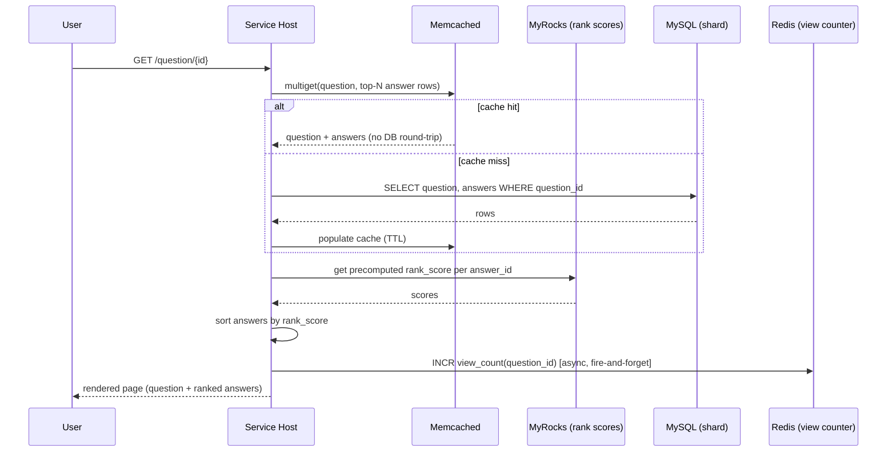

The **write path is heavy, the read path is cheap**: two cache lookups (rows + scores) and an async counter bump — no synchronous ranking computation, no synchronous write. This asymmetry (expensive writes, cheap reads) is why the earlier deep dives push so much work off the write path — reads happen orders of magnitude more often.

### 5.5 Search & Duplicate Question Detection

**Search**: build an inverted index (from questions, answers, topic labels, usernames) in the KV store; tokenize so word-order doesn't matter ("How do I lose weight" matches "weight, how to lose"); cache hot queries. (See the *Distributed Search* building-block chapter for the general indexing/scaling pattern — this chapter just applies it.)

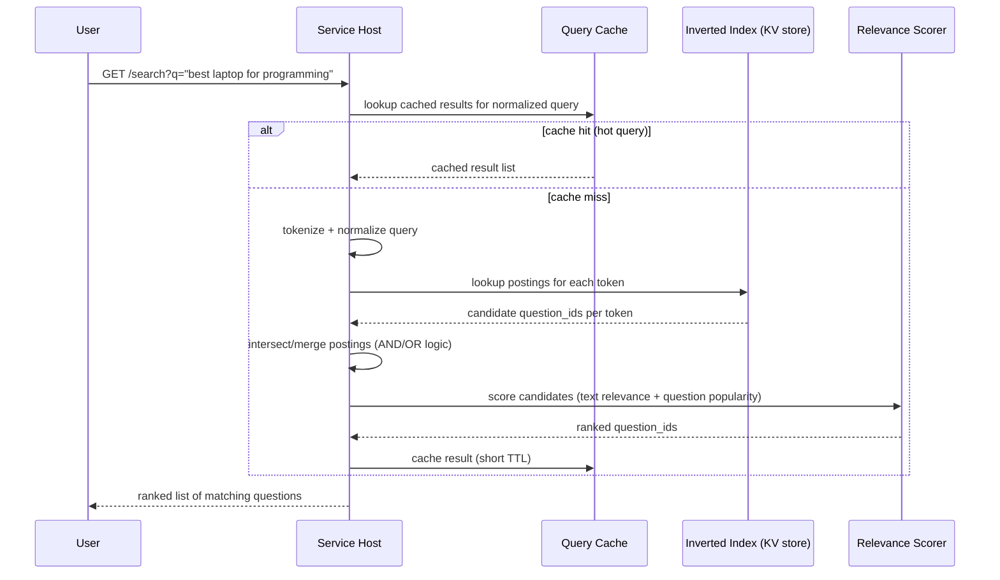

**Duplicate question detection** (flagged in the source as a recommendation-system responsibility, not detailed) — standard real-world techniques worth naming:

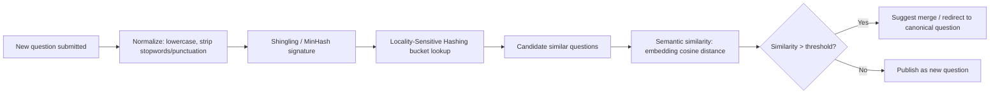

- **Lexical**: shingling + MinHash + LSH catches near-identical phrasing cheaply (sub-linear candidate lookup, no full corpus scan).
- **Semantic**: sentence embeddings + approximate nearest neighbor (e.g., HNSW index) catches paraphrases ("How to lose weight fast" vs "Quick ways to shed pounds") that lexical matching misses.
- Real platforms (Quora, Stack Overflow) combine both: cheap lexical filter first (reduce candidates), expensive semantic model second (precision) — classic **coarse-to-fine funnel** to keep the expensive model off the hot path.

#### 🆕 Duplicate-question decision thresholds: merge vs. suggest vs. publish

A binary merge/no-merge decision is too blunt — a near-miss shouldn't silently swallow a genuinely different question. Use three bands instead (**illustrative cutoffs**, tune per corpus in practice):

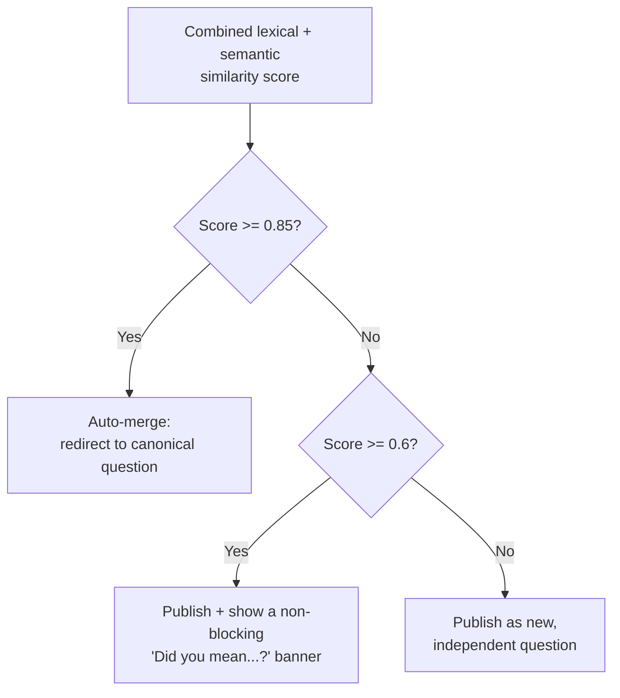

- **≥ 0.85** — confident duplicate: auto-merge, redirect to the canonical question (the flow below).
- **0.6 – 0.85** — plausible near-duplicate: publish anyway, but surface a "did you mean...?" suggestion so the asker can self-merge without the system guessing wrong.
- **< 0.6** — treat as a genuinely new question.

**The merge flow, concretely** — what happens the instant a duplicate is detected at submission time:

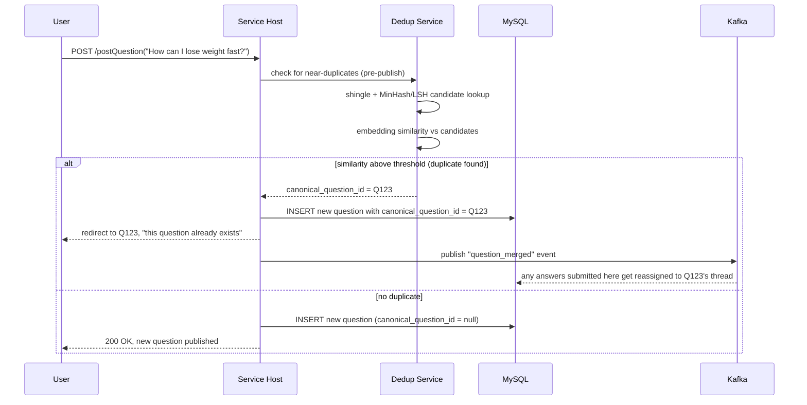

#### Cheat-sheet
- Search index built from Q + A + topic + username text, tokenized for order-invariance.
- Duplicate detection is a two-stage funnel: cheap lexical (shingling/MinHash/LSH) filters candidates, expensive semantic (embeddings) confirms — never run the expensive model over the whole corpus per new question.
- This is exactly the kind of "the source glossed over it" gap interviewers dig into — having the two-stage answer ready is high-leverage.
- Canonical-question redirect (merge duplicate into original, preserve answer history via `canonical_question_id`) is the actual UX outcome, not just a "reject" — mention it.

### 5.6 Notification System

Not detailed in the source (it's raised only as a "Points to Ponder" question), but expected in a real interview.

**Push vs. Pull disambiguation**:

| | Push | Pull | Long Polling (what Quora uses) |
|---|---|---|---|
| Mechanism | Server proactively sends (WebSocket/APNs/FCM) | Client repeatedly asks "anything new?" | Client asks, server holds request open until data or timeout |
| Server load | Low per-notification, needs persistent connections | High — constant polling regardless of new data | Medium — connection held but no wasted round-trips when idle |
| Latency | Lowest | Highest (bound by poll interval) | Near-real-time, bounded by hold timeout |
| Quora's choice | — | — | Holds request up to 60 sec; replies immediately if there's an update, else times out and client re-requests |

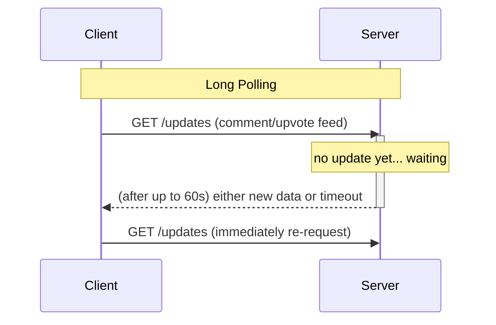

Why Quora picked long polling over plain polling: plain polling wastes server cycles answering "nothing new" every few seconds at 300M DAU scale; long polling collapses many empty round-trips into one held connection, answered the instant there's real data.

Async delivery path: Kafka topic per notification type (mention, answer-to-followed-question, upvote-milestone) → notification workers → push to long-poll waiters / mobile push service.

#### Trace it end-to-end: Amir gets notified

Continuing the walkthrough from 5.1 — Amir follows `#MachineLearning` and has the question page open, so his client already has a long-poll `GET /updates` held open (up to 60 seconds).

- **t=0s**: Amir's long-poll request starts, server holding it open, nothing to send yet.
- **t=10ms after Priya's post (section 5.1 step 4)**: the notification worker reads the `answer_created` event off Kafka and writes "Priya answered a question you follow" into Amir's durable notification store, then signals his open long-poll connection.
- **t=12s (of Amir's 60s hold window)**: the held request returns immediately with the notification payload — Amir sees a toast almost in real time even though the delivery mechanism is "polling," not a push socket. His client immediately re-issues a new long-poll GET.
- **If Amir's connection had already timed out** (idle past 60s with no open request): the notification just sits in his durable store and is delivered on his *next* request, whenever that is — long polling never loses a notification, it only delays delivery to the next poll. This durability is why the notification store is a real write, not just an in-memory signal to a socket.

#### Cheat-sheet
- Long polling is Quora's actual documented choice — cite it, don't default to "we'll use WebSockets" without justifying why.
- Plain polling wastes RPS at scale; push (WebSocket) is lowest latency but highest connection-state cost; long polling is the pragmatic middle Quora chose.
- Kafka topics segregate notification types so a burst in one (e.g., mass upvote event) doesn't delay another (e.g., direct mention).
- Notifications are inherently eventually consistent — never justify strong consistency here.

### 5.7 Spam / Abuse Prevention, Rate Limiting & Content Moderation

Not in source; standard interviewer probe for any UGC platform.

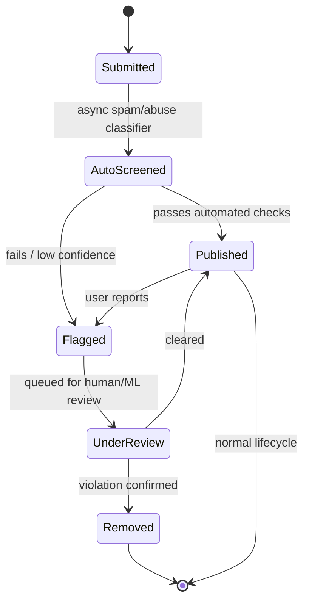

- Publish-then-verify (optimistic) beats verify-then-publish (pessimistic) for latency — most content is fine, so don't block the write path on a moderation model; screen asynchronously via Kafka, retract if flagged.
- Rate limiting (see the Rate Limiter building block) at the API layer throttles spam-posting accounts before they ever reach the moderation pipeline — cheapest first line of defense.

#### 🆕 Moderation: how content gets flagged for review

The state diagram above shows the lifecycle; this is what decides which branch a piece of content takes at the `AutoScreened` step (**illustrative confidence thresholds**, not source-verified):

```mermaid
flowchart TD
    Submit[Content submitted] --> Classify[Async spam/abuse<br/>classifier score]
    Classify --> D1{Confidence >= 0.95<br/>violation?}
    D1 -->|Yes| AutoRemove[Auto-remove,<br/>notify author, log for appeal]
    D1 -->|No| D2{Confidence >= 0.5?}
    D2 -->|Yes| Flag[Flag for human/ML review queue]
    D2 -->|No| Publish[Auto-publish,<br/>keep monitoring signals]
    Flag --> Review{Reviewer decision}
    Review -->|Violation confirmed| Remove[Remove + strike on account]
    Review -->|Cleared| Publish
```

The three-way split is the point to say out loud: high-confidence violations never see daylight, low-confidence content publishes immediately (optimistic, matching the state diagram above), and only the uncertain middle band costs a human reviewer's time.

**Rate limiting, concretely**: token-bucket limiter per `(user_id, action_type)` — e.g. max 10 answers/hour, max 100 votes/hour, max 5 questions/hour — with a secondary IP/device-fingerprint bucket to catch multi-account abuse from one source. Limiter state lives in Redis, using the same atomic-`INCR`-with-TTL primitive as vote counters (section 5.2) — one mechanism, two use cases.

**Vote manipulation / bot detection** — a rate limiter alone catches volume, not coordination. Pattern-based defenses run offline, async, off the request path:

| Signal | Detects |
|---|---|
| Vote velocity spike (N votes in M seconds on one answer) | Bot script or purchased upvotes |
| New/low-reputation accounts voting in a tight cluster on one answer | Vote ring / brigading |
| Same IP/device fingerprint voting many distinct accounts | Sockpuppets |
| Vote graph clustering (accounts that only ever vote on each other's content) | Coordinated ring — only catchable via offline graph analysis, not per-request |

Detected suspicious votes are **down-weighted or excluded from the `rank_score` computation**, not deleted outright — keeps the reader experience uninterrupted while keeping ranking honest; a full account-level review runs asynchronously afterward.

Mnemonic: **"Rate-limit the request, pattern-match the graph"** — a simple limiter bounds volume; velocity/graph analysis catches coordination a limiter can't see.

#### Cheat-sheet
- Moderate asynchronously (publish-then-screen), not synchronously — keeps write-path P99 low.
- Content lifecycle is a state machine: Submitted → Published/Flagged → UnderReview → Removed/Published — draw it, don't describe it in prose.
- Rate limiting on posting/voting APIs is the first spam defense, before any ML classifier runs.
- Vote/bot abuse needs two layers: token-bucket for volume, velocity + graph clustering (offline) for coordinated rings.

### 5.8 Privacy & Trust: Anonymous Answers + Blocked Users

Not in the source material, but any Q&A/social platform interview eventually asks: "what about anonymous answers, and what if I block someone?"

**Anonymous questions/answers**: the row still stores the real `author_id` (needed for moderation, abuse tracing, and "my anonymous answers" management in the author's own account) — anonymity is a **display-layer decision, not a storage-layer one**. The API response strips/masks `author_id → author_name` for every viewer except the author themself. Never build a separate "anonymous content" table — that fragments moderation and dedup, which both need the real author.

**Blocked users**: blocking is a directed edge, `(blocker_id, blocked_id)`, in the `BLOCK` table (see the ER diagram in section 4). Enforcement happens at **read time**, in two places:
- **Feed/recommendation generation**: filter out content authored by anyone in the viewer's block list, and filter the viewer out of the blocked user's audience too — a cheap set-membership check merged into candidate generation, not a join.
- **Search/question pages**: a blocked user's answers are hidden from the blocker's view only — the answer stays visible to everyone else. Blocking is per-relationship, not a global takedown.

Both anonymous-handling and blocking are **eventually consistent, read-time filters** — consistent with the rest of the design's philosophy: never let privacy/moderation logic sit on the synchronous write path.

Mnemonic: **"Anonymous hides the name, not the row; blocking hides the person, not the post."**

### 5.9 Monitoring & SLOs

Not in the source material; a senior candidate should proactively raise this before being asked "how do you know it's working in production?"

**Golden signals per critical endpoint** (postQuestion, postAnswer, vote, search, feed) — the RED method:
- **Rate**: RPS per endpoint, split read vs. write.
- **Errors**: 4xx/5xx rate, plus business-level errors (lost-update retries on votes, failed dedup checks).
- **Duration**: P50/P95/P99 latency — headline P99, not average; a P99 spike means real users are hurting even while the average looks healthy.

**Example SLOs to state out loud** (defensible round numbers, not claiming source-verified precision):

| SLO | Target |
|---|---|
| Write availability (post question/answer/vote) | 99.95% |
| Read availability (view/search/feed) | 99.99% — reads are more resilient, cache absorbs backend blips |
| P99 write latency | < 200 ms |
| P99 cached read latency | < 100 ms |
| Kafka consumer lag (notifications, indexing, ranking) | < 30 sec normal, alert above 2 min |
| Search index staleness | < 1 min from publish to searchable |

**Alerting philosophy**: alert on the SLO — the user-facing symptom (latency, error rate, queue lag) — not on every internal cause. Don't page on "one MySQL replica is at 80% CPU"; page on "P99 write latency crossed 200ms," then let the on-call dig into cause. Fewer, high-signal alerts beat many low-signal ones — alert fatigue is worse than a missed edge case.

Mnemonic: **"Page on the symptom, diagnose the cause."**

### 5.10 Multi-Region & Disaster Recovery

Section 7 and the cheat sheets already flag DR as a first-class NFR — here's the architecture that backs that claim, worth drawing if the interviewer pushes on "what if us-east-1 goes down."

```mermaid
flowchart TB
    DNS[Global DNS / Traffic Manager]
    subgraph "Region A - Primary"
    LB1[Load Balancer] --> SH1[Service Hosts]
    SH1 --> DB1[(MySQL Primary)]
    SH1 --> Cache1[(Memcached / Redis)]
    SH1 --> Blob1[(S3 bucket)]
    end
    subgraph "Region B - Standby"
    LB2[Load Balancer - cold] --> SH2[Service Hosts - scaled down]
    SH2 --> DB2[(MySQL Replica)]
    SH2 --> Cache2[(Memcached / Redis - cold)]
    SH2 --> Blob2[(S3 bucket - replicated)]
    end
    DNS --> LB1
    DNS -. failover .-> LB2
    DB1 -. async replication .-> DB2
    Blob1 -. cross-region replication .-> Blob2
```

**Topology**: the primary region takes all writes; the standby region holds an async MySQL replica, a cross-region-replicated S3 bucket, and a scaled-down (cold or warm) service-host fleet. ZooKeeper/metadata quorum should itself span at least 3 AZs within the primary region — a second region alone doesn't solve quorum, an odd-numbered majority does.

**RPO (Recovery Point Objective)**: bounded by MySQL async replication lag to the standby — typically seconds, but state it as "up to N minutes of the most recent writes could be lost in a full-region failure," and name N explicitly (e.g., 5 minutes) rather than claiming zero data loss.

**RTO (Recovery Time Objective)**: time to promote the standby DB to primary, warm caches, and repoint global DNS — typically tens of minutes, not seconds; say so rather than implying instant failover.

**What's automatic vs. what needs a runbook**: blob replication (S3 cross-region) and DB replication (async replica) run continuously with no human action. Promoting the standby to primary is a *decision* — never auto-promote without a clear quorum/health check, to avoid split-brain. Call this out as a deliberate, gated step.

Mnemonic: **"Replicate continuously, promote deliberately."**

---

## 6. Key Design Decisions & Trade-offs

| Decision | Benefit | Cost |
|---|---|---|
| Combine web + app servers into one service host | Removes network hop, simpler horizontal scaling | Less separation of concerns; a bug in one layer can affect the whole host |
| Vertical sharding of MySQL (not horizontal) | Enables joins within a shard, less cross-shard complexity, targeted read-replica scaling for hot shards | A single vertically-sharded table can still outgrow one host — eventually needs horizontal sharding too |
| MyRocks over HBase | P99 latency 80ms → 4ms; native MySQL interop tooling | Migration cost; different operational tooling/expertise needed |
| Offline answer ranking | Cheap, doesn't burden request path, tolerant of ML latency | Ranking is stale until next batch run — a great new answer won't rank #1 immediately |
| Eventual consistency for view counters / vote counts | High availability, cheap writes (Redis INCR), no lock contention | Users can briefly see slightly different counts; never a source of truth for critical decisions |
| Strong-ish consistency for question/answer content (MySQL synchronous replication within DC) | No lost/inconsistent content, users trust what they read | Higher write latency than eventual consistency stores |
| Async task queues (Kafka) for notifications/analytics/view-count aggregation | Keeps API request path fast; smooths load spikes | Added operational complexity (consumer lag, exactly-once semantics questions) |
| Long polling for live updates | Lower server load than naive polling, near-real-time | Still holds connections (resource cost) vs. plain request/response; more complex than simple polling |
| ZooKeeper for shard/replica metadata | Single source of truth for topology, enables adding/removing replicas cleanly | Another distributed system to operate; ZK itself needs HA |

### Golden Rules (read this section right before the cheat sheet)

1. **Match consistency to the data's blast radius**: content people wrote (strong) vs. counters/derived signals (eventual) — never apply one consistency model uniformly.
2. **Keep the ML/ranking/recommendation compute off the synchronous write path** — always async, always via a queue.
3. **Atomic increments only** for any counter under concurrent write — read-modify-write is always wrong at scale.
4. **Vertical sharding co-locates joins; horizontal sharding is the eventual fallback** once any single shard outgrows one host — say both, don't pick one as permanent.
5. **Cache generously for reads (view counts, search index, rank scores), never cache the "did I vote" state carelessly** — that one needs to be correct per-user.
6. **Every async system (Kafka, notifications, ranking) must degrade gracefully** — a stalled queue should never block core Q&A posting/reading.
7. **Disaster recovery is a first-class NFR**, not an afterthought — cross-region backup + a stated RPO/RTO belongs in your design, not just "we have backups."

### Mental Model Recap (Mindmap)

A 10-second visual recap — say this out loud before you start drawing boxes:

```mermaid
mindmap
  root((Quora))
    Write Path
      Strong consistency
      MySQL vertical shards
      Never lose content
    Ranking Engine
      Offline ML scores
      Signals beyond votes
      Precomputed O1 read
    Search and Dedup
      Near real time index
      Lexical then semantic funnel
      Canonical question redirect
    Golden Rules
      Match consistency to blast radius
      Async off the write path
      Atomic increments only
      Cache reads not my vote status
      Disaster recovery is a NFR
```

---

## 7. Bottlenecks & Failure Modes

| Failure / Bottleneck | Root Cause | Mitigation |
|---|---|---|
| In-memory task queues lost on crash | Queues held in application server RAM, no durability | Move to durable external queue (Kafka) — done in final design |
| Hot MySQL tables/shards | A few tables (e.g., popular questions, active users) get disproportionate QPS | Add read replicas for hot shards; consider horizontal sharding beyond vertical |
| HBase P99 latency spikes | LSM-tree/read-path tuning not optimal for Quora's access pattern | Swap in MyRocks (measured 80ms→4ms P99) |
| Celebrity/viral question fan-out | One question suddenly needs to reach millions | Hybrid fan-out (pull for high-fan-out sources), sharded counters for votes/views |
| Network hop latency between web & app tier | Separate manager/worker processes across a network link | Merge into single service host |
| Single region outage | No documented DR plan in initial design | Cross-region async replication, S3 zonal + cross-region backup, defined RTO/RPO |
| Duplicate/near-duplicate questions fragmenting answers | No dedup at ingestion | Lexical + semantic dedup funnel before publish |
| Vote race conditions on viral answers | Read-modify-write / single hot key | Atomic INCR, sharded counters |
| Search index staleness | Async indexing lag | Accept near-real-time SLA (seconds), cache popular queries |

### Cheat-sheet
- Every bottleneck in the source traces to one theme: **something that was in-memory/synchronous became durable/asynchronous** in the final design (queues → Kafka, HBase → MyRocks, split servers → merged servers).
- When asked "what breaks at 10x," answer: hot shards first, then vote/view counters on viral content, then search index freshness.
- Always pair a failure mode with its *specific* fix, not a generic "add more servers."

---

## 8. Real-World References

| Platform | What they actually do differently |
|---|---|
| **Quora** (per their engineering blog, cited by this course) | MySQL + MyRocks (not HBase) for low P99; combined service hosts; Python Paste framework; C++ for latency-critical feature extraction; Thrift for cross-language RPC; long polling for live updates; custom async queue handling ~15K tasks/sec; AWS-hosted (S3, Redshift) |
| **Stack Overflow** | Deliberately simple, transparent ranking (vote count + age decay + accepted-answer boost), not ML — optimizes for auditability over personalization; famously runs on a small number of powerful vertically-scaled SQL Server boxes (contrarian to "always shard horizontally") |
| **Reddit** | Public, open-sourced "hot" ranking formula (log of vote differential + time decay); comment threading is deep/recursive (unlike Quora's shallow comments); uses fan-out-on-read for most feeds due to subreddit-scale fan-out |
| **Twitter/X** | Canonical hybrid fan-out (push for normal users, pull for celebrities) — the reference implementation for the fan-out trade-off table in section 5.4 |
| **Google/general search** | Locality-sensitive hashing (MinHash/SimHash) for near-duplicate detection at web scale — same primitive applied here to duplicate-question detection |

### Cheat-sheet
- Cite Quora's actual MyRocks migration numbers (80ms → 4ms P99) — concrete, memorable, shows you engaged with the real source rather than generic patterns.
- Contrast Stack Overflow's transparent formula vs. Quora's ML ranking — shows you understand *why* platforms diverge (personalization need vs. auditability need), not just that they differ.
- Use Twitter as the textbook fan-out reference when discussing Quora's feed, but note Quora's feed is less follower-graph-shaped and more topic/recommendation-shaped.

---

## 9. Interview Strategy Cheat-Sheet

- **Open** with the one-liner: "Quora = durable Q&A content (strong-ish consistency) + best-effort ranking/feed (eventual, ML-driven) + search/dedup (near-real-time)." Anchors every later decision.
- **Estimate fast, round hard**: ~70K RPS, ~37.5K servers, ~87TB/day (dominated by video), ~168 Gbps bandwidth. State the formula, don't just recite digits.
- **Draw the merged service-host architecture** and explain *why* it's merged (removes a network hop) — this single insight from the source material is a strong signal you read the real case study, not a generic template.
- **Justify every datastore choice** by its actual property: MySQL (relational integrity for content), MyRocks (low P99 for counters/features), Memcached (generic hot-row cache with multiget), Redis (atomic counters), Blob+CDN (media).
- **Always split consistency by data type** — content strong, engagement metadata eventual — and say it explicitly rather than picking one model for everything.
- **Go deep on 2-3 areas** the interviewer signals interest in: ranking algorithm, vote race conditions, feed fan-out, dedup, or notifications — don't shallowly cover all seven.
- **Name the trade-off, not just the technique**, every time: e.g., "offline ranking is cheap but not instantly fresh," "vertical sharding avoids joins but a single shard can still outgrow one box."
- **Close with disaster recovery**: daily backups to S3, cross-region replication, and name the two open questions (backup frequency vs. data loss window; restoration time vs. downtime) — shows senior-level completeness.

---

## 10. Master Cheat Sheet (One Page)

**Formulas**
```
RPS            = (DAU × actions/user/day) / 86400
Servers        = DAU / RPS-per-server            (assume ~8000/server)
Storage/day    = Σ(count_i × avg_size_i)
Storage/year   = Storage/day × 365
Bandwidth in   = Storage/day / 86400 × 8          (bits)
Bandwidth out  = Σ(views/day × size) / 86400 × 8
```

**Worked example**: 300M DAU, 20 req/user/day → ~69,500 RPS → ~37,500 servers. Storage/day ≈ 86.55 TB (text 0.3 + image 11.25 + video 75), ~31.6 PB/year. Bandwidth ≈ 168.3 Gbps (8 in + 160.3 out). Video is 5% of posts but ~87% of storage and ~82% of egress bandwidth — the actual capacity driver.

**Numbers to know cold**: 8000 RPS/server · 1KB text/250KB image/5MB video · S3 = 11 nines durability, 99.9% availability · Quora async queue ~15K tasks/sec · HBase P99 80ms → MyRocks P99 4ms · long-poll hold ≤60s.

**Mnemonics**
- Functional scope: **Q-A-V-S-R** (Question, Answer, Vote/comment, Search, Rank/recommend).
- Fan-out choice: **"Push what's rare, pull what's huge."**
- Dedup funnel: **cheap-lexical-first, expensive-semantic-second** (MinHash/LSH → embeddings).
- Ranking signals: **"Votes lie; Views, Comments, Credibility, Dwell-time, Decay and Edits don't."**
- Abuse defense: **"Rate-limit the request, pattern-match the graph."**
- Privacy: **"Anonymous hides the name, not the row; blocking hides the person, not the post."**
- Monitoring: **"Page on the symptom, diagnose the cause."**
- DR: **"Replicate continuously, promote deliberately."**

**Golden rules**
1. Match consistency to data's blast radius (content strong, counters eventual).
2. Keep ML/ranking/recommendation off the synchronous write path.
3. Atomic increments only for concurrent counters — never read-modify-write.
4. Vertical sharding co-locates joins; horizontal sharding is the eventual fallback.
5. Cache reads generously; never cache "did I vote" carelessly.
6. Async systems must degrade gracefully without blocking core Q&A.
7. Disaster recovery is a first-class NFR with a stated RPO/RTO.

**One-liners for common follow-ups**
- "Why not rank by upvotes alone?" → Joke/viral answers accumulate votes too; use ML features (views, comment quality, time decay, credibility) trained offline.
- "How do you stop duplicate questions?" → Two-stage funnel: lexical shingling/MinHash/LSH for candidates, semantic embeddings for confirmation, then redirect to canonical question.
- "How do you avoid lost updates on votes?" → Atomic INCR/sharded counters, never GET-then-SET; vote itself is a per-(user,answer) state machine, not a raw counter.
- "Push or pull for feed?" → Hybrid: push for normal fan-out, pull for viral/celebrity-scale fan-out; Quora's feed is topic/recommendation-driven, not pure follower-graph.
- "Push, pull or long-poll for live updates?" → Long polling — avoids wasted round trips of plain polling while staying near-real-time, which is Quora's actual documented choice.
- "Why vertical over horizontal sharding here?" → Co-locates tables needing joins in one partition, reducing cross-shard queries; still may need horizontal sharding later if a shard outgrows one host.
- "What's your DR plan?" → Daily backups to S3 same-zone + cross-region replication; explicitly name the RPO gap (data since last backup) and RTO (hours, DB unavailable during restore) as open trade-offs.
- "How do you handle anonymous answers?" → Anonymity is a display-layer mask on `author_id`, not a separate storage model; the row keeps the real author for moderation/abuse tracing.
- "How do you handle blocked users?" → Read-time filter (set-membership check) at feed/search generation, not a write-time/global takedown; eventually consistent like everything else non-content.
- "How do you prevent vote manipulation/bot abuse?" → Token-bucket rate limit per user+IP for volume; velocity spikes + vote-graph clustering (offline) for coordinated rings; down-weight suspicious votes in ranking rather than blocking the read path.
- "What are your SLOs?" → 99.95% write / 99.99% read availability, P99 write <200ms, P99 cached read <100ms, Kafka lag <30s — alert on the SLO breach, not every internal cause.
- "What's your multi-region failover story, concretely?" → Async MySQL replica + continuous S3 cross-region replication; promotion to primary is a deliberate, gated, quorum-checked step (RPO ~minutes, RTO ~tens of minutes), not instant auto-failover.
