# Design Google Maps — The Story (narrative edition)

> **What this file is.** There is a technical reference file named `28-Design Google Maps-FAANG-Guide.md`. That document contains the raw requirements, back-of-the-envelope capacity calculations, trade-off tables, and cheat sheets. 
> 
> This file presents the exact same architectural principles, but tells them as one continuous, practical story written in plain English. We follow an engineering team at a fictional regional delivery startup named **ParcelPath**. As the company grows, the team repeatedly runs into performance walls. Each patch they build creates the next technical bottleneck. Eventually, their system evolves into the exact architecture used by modern production systems.
> 
> Although ParcelPath is fictional, every problem it encounters—and every solution it builds—is grounded in real production engineering:
> - **Google S2 Geometry**: A cube-projected sphere mapping system combined with a Hilbert curve. Used inside Google Maps and Google Cloud Spanner/Bigtable.
> - **Uber H3**: A hexagonal spatial grid system used for dispatching and surge pricing.
> - **Geohashing**: String-based spatial encoding used in Redis GEO and Elasticsearch.
> - **OSRM Contraction Hierarchies**: Precomputed shortcut graphs for fast, nationwide routing.
> - **Hidden Markov Models (HMM)**: Probabilistic map matching that turns noisy GPS pings into exact road segments.
> - **Graph Neural Networks (GNN)**: DeepMind and Google's published research on predictive ETA generation across interconnected road graphs.
> 
> *Note on numbers:* Whenever a metric or number appears in this story, we explicitly note whether it is a documented real-world fact or an illustrative stand-in. Illustrative numbers are tagged with `[illustrative]`.

---

### The One Sentence to Keep in Your Head

> **The entire road network, the spatial "what is near me" search index, and the visual map tiles are all far too large to load or compute as a single piece.** 
> 
> Therefore, every fix in this guide follows the exact same three-step pattern:
> 1. **Partition** the world into small, manageable geographic pieces.
> 2. **Precompute** expensive mathematical answers offline.
> 3. **Stitch** small precomputed answers together dynamically when the user makes a live request.

---

### System Trigger Phrases
Whenever an interviewer asks questions containing these core requirements, you are dealing with this system design pattern:
- *"Find the fastest route between point A and point B"*
- *"Show me what drivers or restaurants are near me"*
- *"Update the live ETA as traffic conditions change"*
- *"Track millions of moving delivery phones live on a map"*

Every chapter below shows how this simple pattern scales up to solve increasingly difficult engineering problems.

---

## Chapter 1 — The Night ParcelPath Tried to Run Dijkstra Across All of Texas

### The Initial Setup
In the early days, ParcelPath is a small delivery-routing startup based in Austin, Texas. Instead of paying third-party mapping APIs per request, they decide to build their own routing engine. 

They start with the simplest possible design:
1. Load the **entire road network** into server memory as a single graph.
2. In this graph, **intersections are vertices (nodes)**, and **road segments are edges**.
3. Run **Dijkstra's Shortest Path algorithm** from scratch whenever a truck needs a route.

### Why It Worked in Austin
Austin’s road network is relatively compact:
- **Vertices (Intersections):** ~45,000 `[illustrative]`
- **Edges (Road Segments):** ~115,000 `[illustrative]`
- **Dijkstra Execution Time:** ~70 milliseconds per route query.
- **System Demand:** 150 route requests per second.

A single decent server handles 150 requests per second with room to spare. The engineering team is happy, and the code moves to production.

---

### Expanding to all of Texas: The Performance Wall
Six months later, ParcelPath expands nationwide, starting with statewide coverage across Texas. Delivery trucks now route out of major hubs in Austin, Houston, Dallas, and San Antonio.

The road network graph is no longer a single city—it covers an entire state:
- **Vertices (Intersections):** ~1.8 million `[illustrative — roughly 40x the size of a mid-sized metropolitan graph]`.
- **Edges (Road Segments):** ~4.6 million `[illustrative]`.

### The Mathematical Breakdown of the Failure
Dijkstra’s algorithm explores graph nodes outward in concentric rings, expanding in every direction until it is mathematically certain it has found the absolute shortest path. Because the search space is now 40 times larger, the query latency scales terribly:
- **Single Query Latency:** Spikes from **70ms to 3.4 seconds**.
- **System Load:** Increases to **500 requests per second**.

Let me break down the hardware math to show why this breaks down:
1. **Capacity per server:** If 1 query takes 3.4 seconds, 1 CPU core processes only `1 / 3.4 = 0.29` requests per second.
2. **Servers needed for 500 req/sec:** `500 / 0.29 = 1,724` CPU cores / dedicated servers.
3. **User Experience:** Even with 1,700+ servers running, every delivery driver waits **over 3.4 seconds** just to compute a single delivery route.

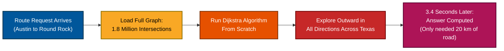

### Why Did This Latency Spike Happen?
Dijkstra does not know where the destination is relative to the origin. It explores all directions equally. Even if a driver only needs to travel 20 kilometers north from Austin to Round Rock, Dijkstra explores hundreds of miles west toward El Paso and east toward Houston before completing.

---

### The Solution: Segmentation (The Atlas Analogy)
Instead of holding the entire state as one massive graph, **segment the map into smaller grid tiles**, just like pages in a printed paper atlas.

- You never unfold a 10-foot map of the United States just to navigate across your neighborhood. You open the specific page containing your city.
- You only turn to an adjacent page when your route explicitly crosses the boundary of your current page.

ParcelPath splits Texas into **5 mile × 5 mile geographic segments**:
- Austin becomes a grid of ~30 segments.
- The entire state of Texas is partitioned into a few thousand segments.
- Each segment graph is stored independently in memory on routing servers.
- Inside a single 5×5 mile segment, running Dijkstra is fast again — back down near that **original ~70ms** from Chapter 1's early Austin-only days. That's not a coincidence: one segment is roughly the same size as Austin's whole original graph was, so it gets roughly the same latency. The graph a query has to touch shrank by about 1/2,000th, and the latency shrank right along with it.

---

### The New Problem: Cross-Segment Routing
Intra-city local deliveries inside one segment run lightning-fast. But ParcelPath introduces an overnight shipping route from **Austin to Dallas (~200 km, straight-line)**.

This route crosses **~40 individual map segments**:
- Running Dijkstra 40 separate times independently inside each segment and stitching the edges together by guesswork fails completely.
- A road choice that looks locally optimal inside Segment 12 might force the truck onto a slow, dead-end rural road in Segment 13.
- Local optimization does not guarantee global optimization.

---

### How to Explain This in an Interview
> *"When a graph becomes too massive to process on a single machine, we partition it into localized geographic segments. However, partitioning immediately creates a cross-boundary stitching problem. We cannot simply run isolated local searches and stitch them together by guesswork; we must design a mechanism to connect these segmented graphs correctly."*

---

## Chapter 2 — Exit Points: Precomputing Your Way Out of Every Page

### The Architecture: Precomputed Exit Points
To route between different segments without loading the entire state graph, we use **precomputed exit points**:

1. **Identify Boundary Nodes:** In every segment, find the specific intersections that connect to neighboring segments. These are called **exit points** (or boundary nodes).
2. **Offline Precomputation:** Offline, run Dijkstra between every pair of exit points inside that segment. Also compute the shortest distance from every internal intersection to each exit point.
3. **Cache the Distances:** Store these precomputed distances in a fast lookup table.

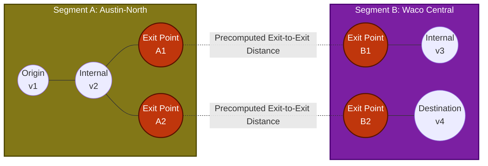

---

### Step-by-Step Example: Austin to Dallas Route
When a user requests a route from Austin to Dallas:

1. **Bounding Box Filter (Haversine Distance):**
   - Calculate straight-line distance (Haversine formula) between Austin and Dallas (~200 km).
   - Draw an elliptical search corridor connecting origin and destination.
   - Filter down candidate segments from 3,000 across Texas to just **28 corridor segments**.

2. **Construct the Meta-Graph:**
   - Instead of loading all 100,000+ intersections inside those 28 segments, extract **only their exit points**.
   - 28 segments × ~6 exit points per segment = **~168 total meta-nodes**.
   - Connect these 168 meta-nodes using the precomputed exit-to-exit distance edges.

3. **Run Shortest Path on Meta-Graph:**
   - Run Dijkstra or A* on this lightweight **168-node meta-graph**.
   - Execution time: **Under 4 milliseconds**.

| Routing Approach | Search Space Size (Nodes) | Latency | Correctness Guaranteed? |
| :--- | :--- | :--- | :--- |
| **Full Graph Dijkstra (Ch. 1)** | ~1,800,000 nodes | 3,400 ms | Yes |
| **Naive Segment Stitching** | ~45,000 nodes (40 hops) | ~120 ms | **No (Suboptimal paths)** |
| **Exit-Point Meta-Graph (Ch. 2)** | **~168 exit nodes** | **< 4 ms** | **Yes** |

---

### Data Model Schema for Segment Routing

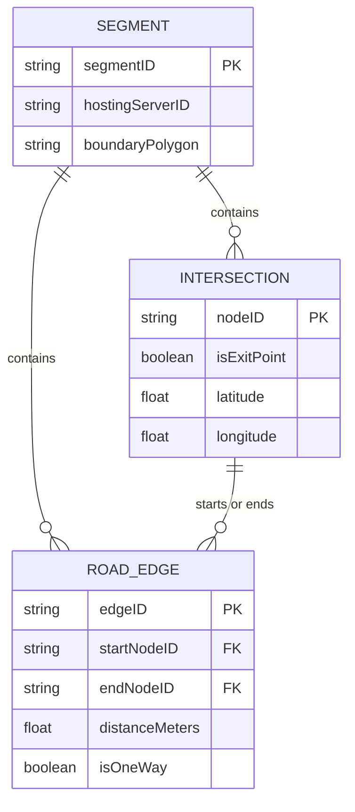

---

### The New Pipeline Problem: Precomputation Lockouts
Precomputed exit tables work brilliantly—until real-world road changes happen.

When a new subdivision opens in East Austin with 40 new intersections, that segment's pairwise exit table must be recalculated. On launch day, ParcelPath runs this recomputation **synchronously on the live routing server**:
- Recomputing all-pairs shortest paths for the updated segment takes **12 minutes** `[illustrative]`.
- During those 12 minutes, the live routing service locks up, causing all delivery routes into East Austin to fail.

### The Immutable Rule of Cache Management
> **Never block live user traffic to update a precomputed routing cache.**
> 
> Always update precomputations **asynchronously** on background worker nodes. Keep serving live traffic using the existing cached version. Once the background process finishes building the new segment table, swap the pointer atomically in memory. Serving slightly stale routing data for 10 minutes is far better than causing system downtime.

---

### How to Explain This in an Interview
> *"Exit points turn a massive graph search into a lightweight traversal across precomputed shortcuts between segment boundaries. This is effectively a simplified Contraction Hierarchy. The key operational requirement is that all shortcut maintenance must happen asynchronously off the critical request path to prevent blocking live user traffic."*

---

## Chapter 3 — Turning a Typed Address into a Coordinate

### The Problem: Addresses Are Free Text, Graphs Need Coordinates
Neither Dijkstra nor segment graphs understand text like `"2100 Guadalupe St, Austin, TX"`. Routing engines only operate on exact latitude and longitude coordinates.

ParcelPath’s naive v1 approach:
- Query a database table containing 2.4 million Texas address rows using an SQL wildcard search:
  `SELECT lat, lng FROM addresses WHERE address_string LIKE '%2100 Guadalupe%'`
- **Performance:** At low traffic, table scans take ~85ms.
- **At 500 req/sec:** 500 concurrent table scans pin database CPU to 95%, causing p99 latencies to skyrocket past **900ms**.

---

### Solution 1: Forward Geocoding via an Inverted Index
Forward geocoding converts human-readable text into a geographic coordinate (`Text -> Lat/Lng`).

Instead of scanning relational table rows, treat forward geocoding as a **text search problem**:
1. **Tokenize:** Break addresses into normalized terms (e.g., `2100`, `guadalupe`, `st`, `austin`, `tx`).
2. **Inverted Index:** Build an inverted index mapping each term to matching Address IDs.
3. **Rank Results:** Score matches using string closeness (Levenshtein distance), location popularity, and proximity to the user's current view.
4. **Result:** Token lookup completes in **~4 milliseconds**.

---

### Solution 2: Reverse Geocoding vs. Map Matching
Reverse geocoding is the exact opposite of forward geocoding (`Lat/Lng -> Text Address`).

It is crucial to understand the distinct roles of these three geospatial operations:

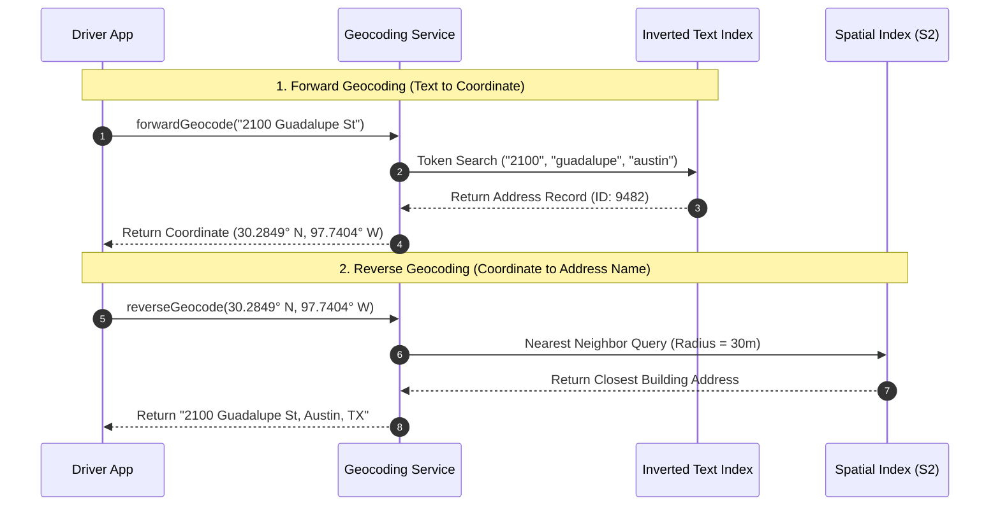

| Operation | Input | Output | Primary Data Structure | Use Case |
| :--- | :--- | :--- | :--- | :--- |
| **Forward Geocoding** | Text string (`"2100 Guadalupe"`) | `(Lat, Lng)` coordinate | Inverted Index / Trie | User types destination in search bar. |
| **Reverse Geocoding** | `(Lat, Lng)` point | Text address (`"2100 Guadalupe"`) | Spatial Index (R-Tree / S2) | Displaying current location address on UI. |
| **Map Matching (Ch. 7)** | Noisy GPS ping | Exact **Road Edge ID** | Hidden Markov Model + Graph | Snapping driver pings to road network. |

---

### The New Problem: Spatial Proximity Queries
Reverse geocoding needs a fast way to answer: *"What address is closest to coordinate (30.2849, -97.7404)?"*

Text inverted indexes cannot perform 2D spatial distance calculations. We need a dedicated **spatial index**.

---

### How to Explain This in an Interview
> *"Geocoding and routing are two separate systems. Forward geocoding is an inverted-index text search problem. Reverse geocoding is a spatial nearest-neighbor search. Neither does graph routing—they simply map human text to coordinates so the routing engine can locate the start and end nodes."*

---

## Chapter 4 — Geohash: A Cheap Answer with a Boundary Bug

### The Solution: What is a Geohash?
A **Geohash** converts a 2D `(latitude, longitude)` coordinate into a single 1D alphanumeric string by interleaving the binary bits of latitude and longitude.

#### Step-by-Step Bit Interleaving Example
Suppose latitude is `30.2849` and longitude is `-97.7404`:
1. Express latitude and longitude as binary strings based on repeated midpoint partitioning of global bounds.
2. Interleave latitude and longitude bits:
   - Latitude bits: `1 0 1 1 0...`
   - Longitude bits: `0 1 1 0 1...`
   - Interleaved: `0 1 1 0 1 1 1 0 0 1...`
3. Convert the binary string into Base32 characters (`0-9`, `b-z`).
4. Resulting Geohash: **`9v6mm2`**.

#### Character Length and Cell Precision
The length of the geohash string determines the geographic boundary size:

| Geohash Length | Cell Width × Height | Use Case |
| :--- | :--- | :--- |
| **4 characters** | ~39 km × 19.5 km | Metropolitan Region |
| **6 characters** | **~1.2 km × 0.6 km** | **Neighborhood Level (ParcelPath Default)** |
| **8 characters** | ~38 m × 19 m | Individual Building / Block |

Using Redis `GEOADD` and `GEORADIUS` (which use geohashes under the hood), ParcelPath indexes live driver positions for fast driver-matching queries.

---

### The Boundary Edge Bug
Geohashing works well until ParcelPath encounters the **Edge Discontinuity Problem**.

#### Step-by-Step Example of the Bug:
1. Two delivery drop-off points sit **15 meters apart** across a street.
2. However, an invisible geohash boundary runs down the middle of that street.
3. Drop-off A falls into cell **`9v6mm2`**.
4. Drop-off B falls into cell **`9v6mp8`**.

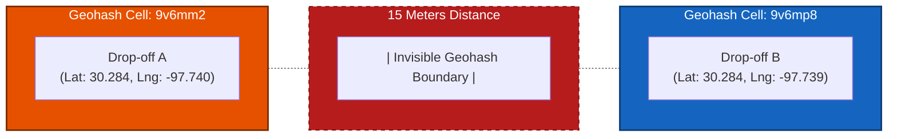

If a driver in cell `9v6mm2` queries for available deliveries using exact prefix matching (`WHERE geohash LIKE '9v6mm2%'`), the database **completely misses Drop-off B**, even though it is only 15 meters away!

In production, an audit revealed **12% of radius queries missed nearby drivers** due to this boundary issue `[illustrative]`.

#### The Standard Workaround
To fix this bug, every radius query must evaluate **all 8 neighboring cells** in addition to the central cell (9 total cells).

---

### Structural Flaws of Geohash
Even with the 8-neighbor patch, geohash has two major limitations:
1. **Polar Distortion:** Because meridians converge at the poles, rectangular geohash grid cells shrink and distort as you move away from the equator.
2. **Fixed Grid Size:** Geohash cells are uniform everywhere. A rural desert cell covers the exact same area as a cell in dense downtown Manhattan, ignoring data density differences.

---

### How to Explain This in an Interview
> *"Geohash is a simple spatial index created by interleaving coordinate bits into base32 strings. However, string prefix matching fails near cell boundaries. Two points millimeters apart across a cell line get completely different prefixes. You must query all 8 surrounding neighbor cells to prevent missing nearby entities."*

---

## Chapter 5 — Quadtree vs. Google S2: The Production Standard

### Alternative 1: Quadtree (Adaptive Density)
A **Quadtree** addresses geohash’s fixed-grid limitation by recursively splitting 2D space:
1. Start with a bounding box for the entire area.
2. If a box contains more than a threshold number of items — call it `N` (e.g., more than 100 drivers) — split it into **4 equal quadrants**.
3. Repeat recursively until every leaf node contains fewer than `N` items.

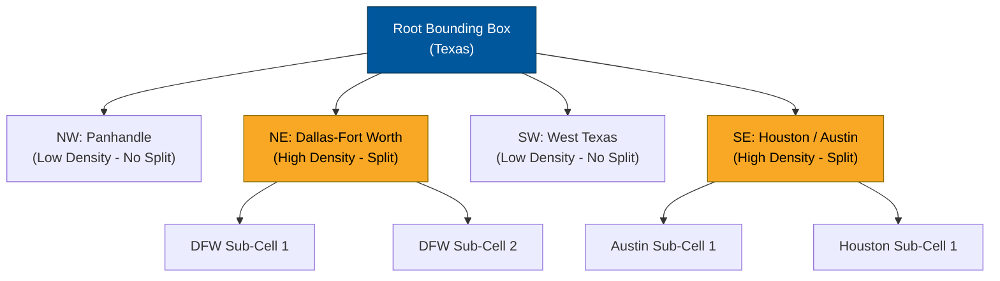

- **Result:** Downtown Austin gets divided into hundreds of tiny sub-cells, while rural West Texas remains one large cell.
- **Flaw:** Quadtrees operate on flat 2D planes. They do not account for Earth's spherical curvature, making them unsuitable for global scale.

---

### Alternative 2: Google S2 (The Production Standard)
Google solved both polar distortion and spatial density with **S2 Geometry**, the library powering Google Maps, Bigtable, and Spanner.

#### How Google S2 Works:
1. **Cube Projection:** Enclose the Earth inside a 3D cube. Project all surface points outward onto the **6 faces of the cube**. This minimizes spherical surface distortion.
2. **Quadtree Subdivision:** Divide each cube face into hierarchically nested square cells (from Level 0 down to Level 30).
3. **Hilbert Space-Filling Curve:** Map 2D cell coordinates on each face onto a 1D line using a **Hilbert Curve**.


#### Why the Hilbert Curve is Crucial for Databases
A Hilbert curve winds through 2D grid cells such that cells that are physically close in 2D space remain **numerically adjacent in 1D space**.

Because S2 Cell IDs are simple 64-bit integers, database engines like Bigtable or Spanner store spatial data using the S2 Cell ID directly as the primary row key:
- **Spatial Range Query:** Finding everything within a radius becomes a fast, contiguous **1D database range scan** (`WHERE cell_id BETWEEN X AND Y`), completely avoiding scatter-gather queries across distributed nodes!

---

### Alternative 3: Uber H3 (Hexagonal Grids)
Uber created **H3**, an open-source spatial index based on **hexagonal cells**.

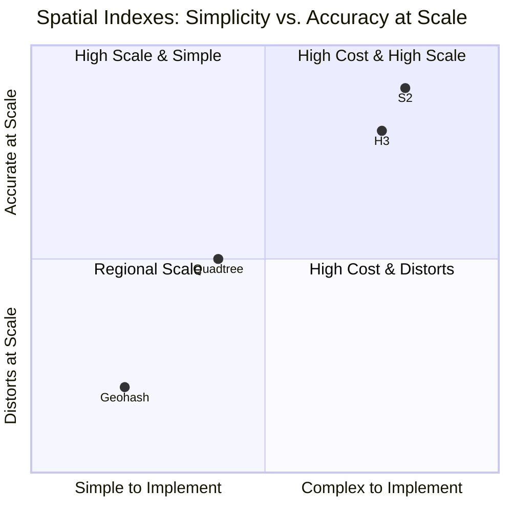

- **Why Hexagons?** In a square grid, diagonal neighbors are about 1.41x (√2 times) farther away than the neighbors directly above, below, left, or right of you. In a hexagon grid, **all 6 neighboring centroids are equidistant** — there's no "diagonal is farther" quirk to correct for.
- **Use Case:** Uber uses H3 for marketplace metrics, dispatch matching, and dynamic surge pricing. ParcelPath uses H3 for surge zones, while using S2 for graph partitioning.

---

### How to Explain This in an Interview
> *"Geohash distorts at high latitudes, while Quadtree ignores spherical curvature. Google Maps uses S2 Geometry, projecting the sphere onto 6 cube faces mapped via a 1D Hilbert curve. This keeps 2D spatial neighbors adjacent in 1D space, enabling fast contiguous database range scans."*

---

## Chapter 6 — Scaling to Nationwide Routing: Contraction Hierarchies

### The Performance Limit of A* Search
As ParcelPath expands coast-to-coast, cross-country freight routes touch **over 900 map segments**. The meta-graph created in Chapter 2 grows to **over 14,000 exit points** `[illustrative]`.

Running A* search (Dijkstra using a Haversine distance heuristic to guide the search toward the destination) takes **~650ms**. While faster than pure Dijkstra, 650ms is too slow when handling thousands of concurrent freight requests.

---

### The Real Solution: Contraction Hierarchies (CH)
**Contraction Hierarchies** is the production algorithm used by open-source routing engines like **OSRM** to achieve millisecond cross-country routing.

#### How Contraction Hierarchies Work:

1. **Node Importance Ranking (Offline):**
   - Every intersection node in the entire graph is assigned an "importance rank" based on how many shortest paths pass through it.
   - Quiet residential cul-de-sacs have low importance. Major highway interchanges have high importance.

2. **Node Contraction (Offline Shortcut Creation):**
   - Nodes are removed ("contracted") one by one, starting from the least important.
   - When removing node `V`, check whether the shortest path between its two neighbors `U` and `W` used to pass through `V`. If it did, add a direct **shortcut edge** straight from `U` to `W`, with a weight equal to `distance(U,V) + distance(V,W)` — so the trip through `V` is still represented, just without needing to visit `V` itself.

3. **Query Phase (Online Upward Search):**
   - Run bidirectional A* search simultaneously from the origin and destination.
   - **Crucial Rule:** The search is restricted to only traverse edges leading to nodes of **higher importance rank**.
   - Because the search only moves "upward" toward major highways via precomputed shortcuts, the total search space shrinks from millions of nodes to **fewer than 50 nodes**.

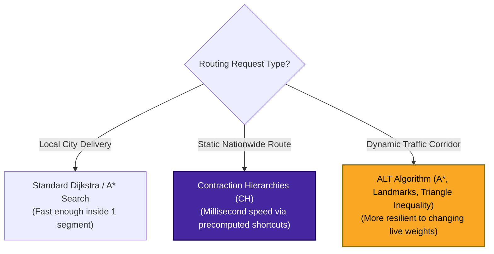

---

### The Trade-off: Fixed Weights vs. Dynamic Traffic
Contraction Hierarchies achieve millisecond query speeds because shortcut edges are computed offline assuming **static edge weights** (speed limits).

If an accident on I-35 drops traffic speed from 65 mph to 10 mph:
- The precomputed shortcuts built through I-35 become invalid.
- Re-running the full offline contraction process across the entire national graph takes hours.

#### Production Mitigations:
1. **Periodic Re-contraction:** Re-run CH shortcut generation periodically (e.g., every 30 minutes) on background clusters.
2. **ALT Algorithm:** Use **ALT** (A*, Landmarks, and Triangle Inequality). Precompute exact distances from all nodes to a small set of fixed "landmark" nodes. ALT handles dynamic weight changes better than CH, though it is slightly slower.

---

### How to Explain This in an Interview
> *"To scale routing to a national graph, production systems use Contraction Hierarchies (CH). CH precomputes shortcut edges by contracting less important local nodes offline. Online queries only move upward to higher-importance highway nodes, returning answers in under 10ms. For live traffic changes, we either periodically re-contract shortcuts or use ALT."*

---

## Chapter 7 — Map Matching: Turning Noisy GPS Pings into Graph Edges

### The Problem: Raw GPS Data is Extremely Noisy
ParcelPath's driver mobile apps stream GPS pings every 5 seconds containing `(latitude, longitude, speed, heading, timestamp)`.

However, mobile GPS sensors have a real-world accuracy margin of **±20 meters**.

#### Step-by-Step Failure of Naive "Nearest Edge" Snapping
Imagine a driver traveling at 65 mph on Highway I-35, which runs directly alongside a slow 25 mph frontage road:

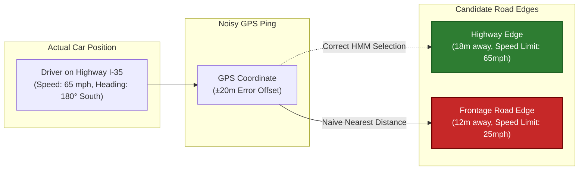

1. The raw GPS ping lands 12 meters from the frontage road and 18 meters from the highway due to GPS drift.
2. Naive nearest-distance mapping snaps the driver to the **frontage road** because it is 6 meters closer.
3. **System Corruption:** The system records a 65 mph vehicle on a 25 mph residential frontage road, triggering false speeding alerts and corrupting local traffic metrics!

Audit logs showed naive distance snapping misattributed **22% of highway pings near interchanges** `[illustrative]`.

---

### The Solution: Hidden Markov Model (HMM) Map Matching
Production systems use a **Hidden Markov Model (HMM)** to snap pings to the correct road edge.

An HMM evaluates two distinct probabilities together:

1. **Emission Probability:** How close is the GPS coordinate to the candidate road edge, and how closely does the device heading match the road's direction?
2. **Transition Probability:** Is it physically possible for a vehicle to travel from the previously matched road edge to this new candidate edge within the 5-second sampling window?

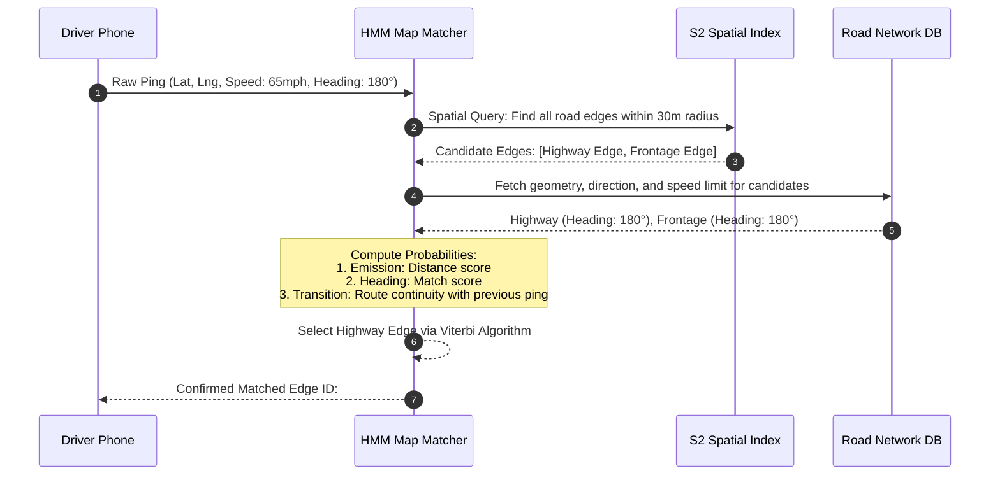

---

### How to Explain This in an Interview
> *"Raw GPS has a ±20-meter error, making raw distance snapping fail near parallel roads. We use a Hidden Markov Model (HMM) for map matching. The HMM combines spatial distance emission probabilities with transition probabilities based on heading alignment and route continuity across consecutive pings."*

---

## Chapter 8 — Controlling Live Traffic Updates: Aggregation and Debouncing

### The Problem: Graph Weight Flapping
Once GPS pings are correctly snapped to road edges, ParcelPath’s initial design updated live traffic by writing new speeds directly to the graph database:
`UPDATE road_edges SET current_speed = 0 WHERE edge_id = 'E-102'`

#### The Failure Scenario:
- **Write Load:** 3,000 active delivery drivers pinging every 5 seconds generate **600 database write queries per second**.
- **Traffic Light Noise:** A driver stops at a red light on a 45 mph arterial road. Their speed drops to 0 mph for 45 seconds, then resumes to 45 mph when the light turns green.

Updating edge weights directly causes the graph to **flap uncontrollably**:
- During a 10-minute period, a single street edge had its speed updated **40 times** between 0 mph and 45 mph `[illustrative]`.
- Every speed change invalidated downstream cached routes, forcing thousands of unnecessary re-computations.

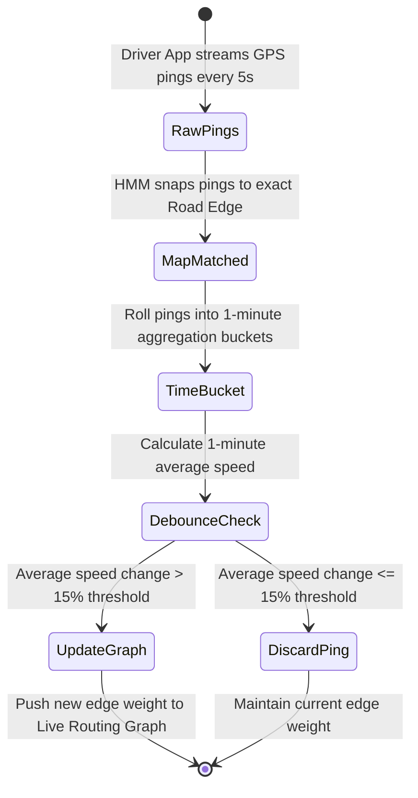

---

### The Solution: Time-Bucket Aggregation + Hysteresis Debouncing

1. **Time-Bucket Aggregation:** Do not process pings individually. Group all map-matched pings for an edge into **1-minute sliding time buckets**. Calculate the average speed across all drivers in that bucket.
2. **Hysteresis Thresholding (Debouncing):** Only write a new speed to the live graph if the bucket average deviates from the current stored graph speed by **more than 15%**.

#### Impact of the Solution:
- A single driver stopped at a red light is averaged out by 25 other drivers moving through the corridor.
- Momentary speed drops are filtered out.
- Only genuine, sustained traffic slowdowns trigger updates to the live routing graph.

---

### How to Explain This in an Interview
> *"Writing raw GPS pings directly to graph edges causes write storms and graph weight flapping due to stoplights. We aggregate pings into 1-minute time buckets per edge and apply a hysteresis threshold. We only update edge weights when average speeds change by more than 15%, preserving graph stability."*

---

## Chapter 9 — Filtering Fraud and Sensor Glitches

### Scenario A: The Teleporting Driver (Hardware Glitch)
A driver's smartphone GPS chip experiences a hardware glitch:
- **Ping 1 (Time 10:00:00):** Austin (Lat: 30.267, Lng: -97.743)
- **Ping 2 (Time 10:00:05):** Houston (Lat: 29.760, Lng: -95.369)
- **Implied Traversal:** 180 km in 5 seconds = **129,600 km/h**.

If fed directly into map matching, this bad ping corrupts Houston edge metrics.

---

### Scenario B: Ghost Traffic Jam Attack (Malicious Griefing)
Waze publicly documented an attack where bad actors used emulated phones running fake GPS apps to report 0 mph speeds on a quiet street. Their goal was to trick the routing algorithm into diverting traffic away from their neighborhood.

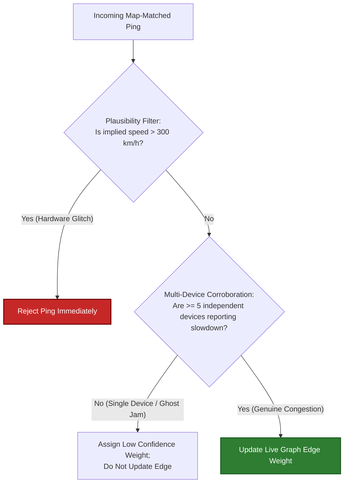

---

### The Two-Layer Defense Architecture

#### Layer 1: Velocity Plausibility Filter
Before running map matching, compute the straight-line speed between consecutive pings from the same device:

```
Implied Speed = Haversine distance between ping 1 and ping 2 ÷ time elapsed between them
```

If that implied speed exceeds physical limits (e.g., **> 300 km/h**), immediately discard the ping.

#### Layer 2: Multi-Device Corroboration
Never adjust a major road edge's live weight based on pings from a single device. Require corroborating slowdown pings from **at least 5 independent devices** within the same time bucket before marking a road congested.

---

### How to Explain This in an Interview
> *"We use a two-layer validation model for live traffic telemetry. First, a velocity plausibility filter drops pings implying impossible speeds (>300 km/h). Second, multi-device corroboration prevents malicious ghost jams by requiring speed slowdowns to be confirmed by at least 5 independent devices before updating edge weights."*

---

## Chapter 10 — Building an Honest ETA Engine

### The Problem: Static Speed Limits Fail in Production
ParcelPath’s v1 ETA engine calculated trip duration using a basic formula:

```
ETA = Distance ÷ Posted Speed Limit
```

#### The Real-World Failure:
- A 14 km delivery route along roads with a 50 km/h speed limit yields a predicted ETA of **~17 minutes**.
- During 5:30 PM rush hour, heavy congestion causes the actual travel time to take **41 minutes**.
- Customer satisfaction drops due to inaccurate arrival estimates.

---

### Layer 1: Historical Time-Bucket Profiling
Edge travel times vary predictably by time of day and day of week.
- Partition every road edge's historical data into **15-minute time buckets across 7 days** (672 historical buckets per edge per week).
- Store historical average speeds for each bucket:
  `Edge #8492 -> Tuesday 17:15-17:30 -> Avg Speed: 18 km/h`

---

### Layer 2: Blending Live Traffic with Historical Profiles
Combine historical patterns with live traffic data using a weighted blend:

```
Effective Speed = (w × Live Speed) + ((1 − w) × Historical Speed)
```

Here, `w` is a weight between 0 and 1 that controls how much you trust the live reading versus the historical average:

- **Normal flow (`w = 0.2`):** When live conditions match historical trends, lean primarily on historical averages — only 20% weight goes to the live reading.
- **Incident / jam (`w = 0.8`):** When live speeds drop sharply because of an accident, flip that ratio — now 80% of the weight goes to what's actually happening right now.

> **Design Choice:** Do not maintain separate weight multipliers for weather or construction. Fold all external conditions directly into a single dynamic metric: **current effective edge speed**.

---

### Layer 3: Predictive ETA via Graph Neural Networks (GNNs)
Combining historical and live speeds still evaluates edges independently. It cannot predict that a traffic jam 3 km ahead will spill over into your current edge 10 minutes from now.

#### Google & DeepMind Research (2020-2021)
To address this, Google Maps adopted **Graph Neural Networks (GNNs)**:


- The road network is modeled as a connected graph inside a GNN.
- The model predicts how traffic congestion propagates across neighboring edges over time, lowering ETA error rates significantly.

---

### How to Explain This in an Interview
> *"Basic ETAs using static speed limits fail during traffic. We combine historical 15-minute time-bucket speed profiles with live traffic telemetry using a dynamic weighting blend. At top scale, systems like Google Maps use Graph Neural Networks (GNNs) to model spatio-temporal traffic propagation across connected road subgraphs."*

---

## Chapter 11 — Live Navigation and Dynamic Rerouting

### The Problem: Frozen Navigation After a Missed Turn
In ParcelPath's v1 driver app, the route and ETA were calculated once at the start of the trip.

If a driver missed a highway exit:
- The app continued displaying instructions for the original route.
- The ETA froze or counted down toward a turn that was no longer possible.

---

### The Architecture: WebSocket Streaming & Debounced Deviation

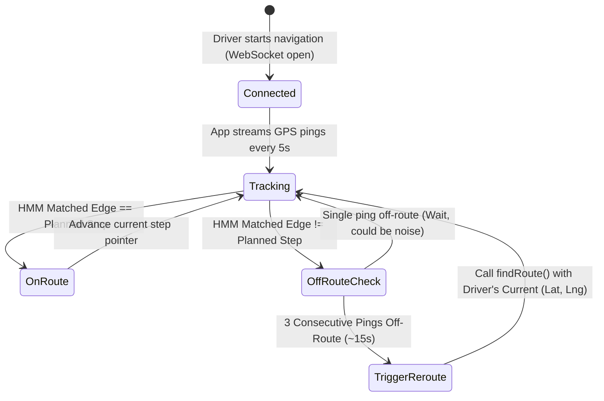

#### Step-by-Step Rerouting Workflow:
1. **Persistent WebSocket:** Maintain a persistent bidirectional WebSocket connection between driver phones and navigation servers.
2. **Continuous Step Tracking:** As map-matched pings arrive, verify whether the matched edge aligns with the next expected step in the route plan.
3. **Debounced Deviation Detection:**
   - A single off-route ping may just be GPS noise or a temporary lane change. **Do not reroute immediately.**
   - Only trigger a reroute after **3 consecutive off-route pings (~15 seconds)**.
4. **Re-executing findRoute():** Rerouting does not require a complex separate algorithm. It simply calls the standard `findRoute()` pipeline (Chapters 1-6), substituting the driver's current position as the new origin.

---

### How to Explain This in an Interview
> *"Live navigation streams pings over a persistent WebSocket connection. We compare map-matched pings against planned route steps. To prevent unnecessary recalculations from GPS jitter, we debounce deviation detection—requiring 3 consecutive off-route pings before invoking the standard route-finding service with the driver's updated location."*

---

## Chapter 12 — Tile Rendering: Solving the Bandwidth Crisis

### The Problem: Raster Map Rendering Doesn't Scale
Both the driver app and customer tracking web pages must render visual background maps.

ParcelPath's initial rendering approach:
- Server renders the requested map area into a static **PNG image tile** and sends it to the client.
- **Bandwidth Calculation:**
  - Active Users: 40,000 concurrent map viewers.
  - Viewport Load: Each viewer loads ~12 raster PNG tiles per pan/zoom action.
  - Tile Refresh: Maps update every 10 seconds.
  - PNG Tile Size: ~80 KB per tile.

Let's work through the math step by step:

1. **Requests per second:** 40,000 viewers × 12 tiles each = 480,000 tile loads, spread over a 10-second refresh window → `480,000 ÷ 10 = 48,000 tile requests per second`.
2. **Bandwidth:** 48,000 requests/sec × 80 KB per tile = 3.84 GB/sec, which works out to roughly **30.7 Gbps**.

Without caching, server hosting bills become unsustainably expensive.

---

### The Solution: Vector Tiles + CDN Tile Pyramid

#### Step 1: Fixed Tile Pyramid `(Zoom, X, Y)` Addressing
Partition the world into a quadtree grid of square tiles for every zoom level (Zoom 0 to 22). Each tile is uniquely addressed by integer coordinates `(z, x, y)`.

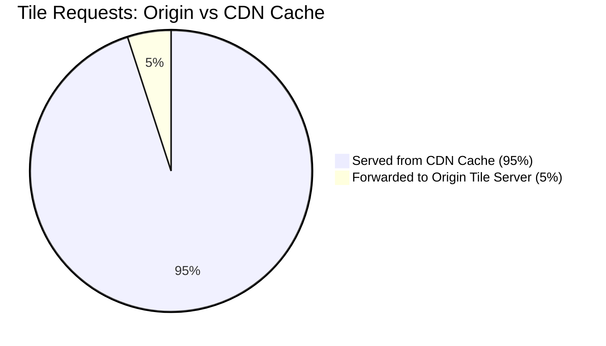

Because tile URLs use deterministic paths (e.g., `https://cdn.parcelpath.com/tiles/14/3821/6129.pbf`), a **CDN sitting in front of origin tile servers achieves a ~95% cache hit rate**, reducing origin bandwidth load by **20x** (down to ~1.5 Gbps).

#### Step 2: Vector Tiles (Mapbox Vector Tile - MVT Format)
Switch from pre-rendered **PNG raster tiles (80 KB)** to raw **Vector tiles (15 KB)** containing mathematical geometries and metadata encoded as binary Protocol Buffers (`.pbf`).

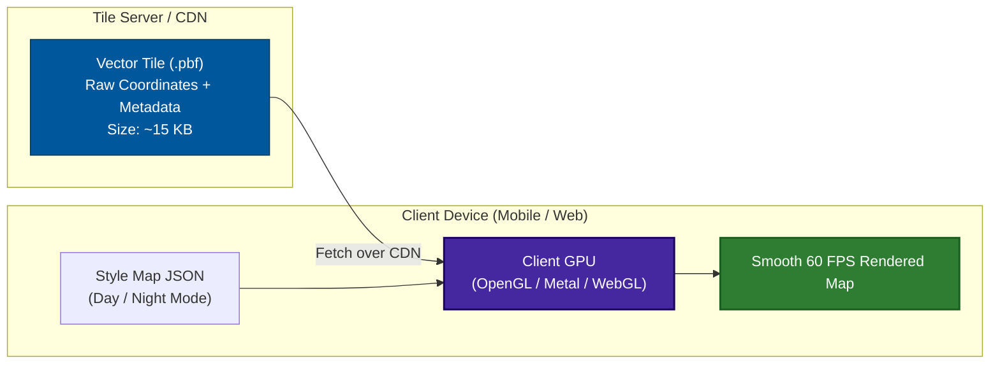

#### Advantages of Vector Tiles over Raster Tiles:
1. **75%+ Payload Reduction:** Tile size drops from ~80 KB to ~15 KB.
2. **Client-Side GPU Rendering:** Client devices render geometries smoothly at 60 FPS using OpenGL/Metal/WebGL.
3. **Instant Styling:** Switching to "Night Mode" simply applies a local JSON stylesheet change—requiring zero server round-trips!

---

### How to Explain This in an Interview
> *"Map rendering uses the same partition-and-cache pattern as routing. We divide the world into a fixed (z, x, y) tile pyramid served via a CDN for a 95% cache hit rate. We ship lightweight vector protobuf tiles (.pbf) instead of PNG images, offloading smooth 60 FPS rendering and dynamic styling to the client GPU."*

---

## Where the Story Actually Lands

Before we look at the final architecture as a finished picture, it's worth looking at it one more way: as the chain of problems and fixes that got us there. Every chapter in this story exists because the previous chapter's fix created a brand-new problem. That chain is the whole point of telling this as a story instead of just handing you the final diagram.


Read left to right, each arrow is really saying "this fixed the last problem, but it opened a new one":

- **Ch1 → Ch2**: bounding the graph into segments makes routing fast inside one segment, but now you need a way to route *across* segments correctly — that's exit points.
- **Ch2 → Ch3**: exit points assume you already have a lat/lng to route from — but a typed address is just text, so you need geocoding first.
- **Ch3 → Ch4**: geocoding gets you a coordinate, but neither forward nor reverse geocoding has a cheap way to ask "what's near this point" — that's what a spatial index is for, starting with geohash.
- **Ch4 → Ch5**: geohash's boundary bug and fixed grid size get fixed by quadtrees (density) and then S2 (density + sphere curvature, the real answer Google ships).
- **Ch5 → Ch6**: none of that indexing work says anything about routing fast at planet scale — that's Contraction Hierarchies.
- **Ch6 → Ch7**: Contraction Hierarchies assumes edge weights that don't change, so now you need a live signal — real GPS pings — to know what's actually happening on the roads.
- **Ch7 → Ch8**: map matching correctly snaps a ping to a road edge, but writing every raw ping straight to the graph causes weight "flapping" — so you aggregate and debounce.
- **Ch8 → Ch9**: debouncing filters normal noise, but it does nothing about a broken sensor or a malicious actor — so you add a plausibility filter and cross-device corroboration.
- **Ch9 → Ch10**: trustworthy live speed is still just a number per edge — turning that into an accurate ETA needs historical blending, not just distance-over-speed-limit.
- **Ch10 → Ch11**: even a good ETA goes stale the moment a driver misses a turn — so you need live deviation detection and rerouting.
- **Ch11 → Ch12**: all of this has been about the road graph and where drivers are on it — but the app also has to literally draw a map on screen, and that's its own bandwidth problem, solved by the exact same partition-and-cache trick one more time.

---

## Architecture Summary

### Master Architecture Flowchart

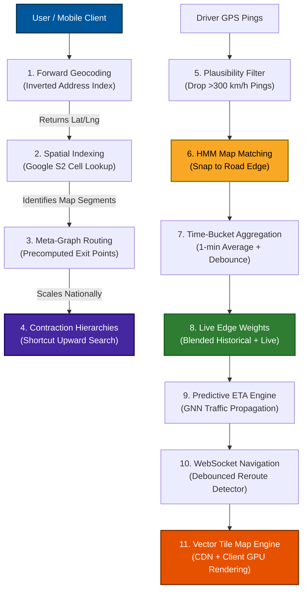

---

### Master Concept Mindmap

```mermaid
mindmap
  root((Google Maps<br/>Architecture))
    Scaling Graph Search
      Full Dijkstra fails at scale
      Geographic 5x5 mile segments
      Precomputed exit-point meta-graphs
      Contraction Hierarchies shortcuts
    Geospatial Indexing
      Inverted index for address text
      Geohash boundary discontinuities
      Google S2 cube projection + Hilbert curve
      Uber H3 hexagonal dispatch grids
    Live Telemetry Processing
      Raw GPS noise (±20m error)
      HMM map matching (emission + transition)
      Time-bucket aggregation (1-min sliding)
      Debounce thresholding (15% delta)
    Data Integrity & Trust
      Plausibility speed cap (300 km/h)
      Multi-device corroboration (5+ devices)
    ETA Calculation
      Historical 15-min time-bucket speed profiles
      Live traffic telemetry blending
      DeepMind Graph Neural Networks
    Live Navigation
      WebSocket telemetry streaming
      Debounced rerouting (3 off-route pings)
    Vector Tile Rendering
      Quadtree (z, x, y) tile pyramids
      CDN caching (95% hit rate)
      Vector protobuf (.pbf) payload
      Client GPU rendering
```

---

## Adversarial Interview Questions ("Grill Me")

### Q1: "Why build a custom routing engine instead of using Google Maps API?"
> **Answer:** At low query volume, paying per API call to a provider like Google Maps or Mapbox is the correct business choice. Building a custom engine requires significant multi-year engineering investment. You only build in-house when query volume makes third-party API costs prohibitive, or when proprietary routing logic (e.g., custom delivery fleet constraints, specialized vehicle routing, internal marketplace optimization) requires direct control over graph weights.

### Q2: "Doesn't graph segmentation turn one big bottleneck into thousands of small ones?"
> **Answer:** Segmentation makes graph processing tractable by scoping operations to isolated subgraphs. However, high-density areas (like downtown Manhattan at 5 PM) can still experience load spikes. We solve this by replicating hot segment graphs across multiple routing worker nodes and using dynamic non-uniform segment sizing (smaller segments in dense urban cores, larger segments in rural regions) to distribute computational load evenly.

### Q3: "Why switch from Geohash to Google S2 before hitting high query volumes?"
> **Answer:** Geohash’s primary flaw—polar distortion—is a structural mathematical property. While distortion is negligible near the equator, it degrades accuracy at higher latitudes. Migrating a core geospatial indexing scheme late in a system's lifecycle requires rewriting primary database keys, index queries, and caching layers. Adopting Google S2 early guarantees consistent cell areas globally and native 1D range scan compatibility in databases like Spanner or Bigtable.

### Q4: "Why use segments and exit points if Contraction Hierarchies (CH) already provides millisecond routing?"
> **Answer:** Contraction Hierarchies and spatial segmentation address different operational problems:
> - **CH** speeds up graph pathfinding queries.
> - **Segmentation** handles graph storage, memory boundaries, localized map editing, and regional failure isolation.
> 
> Furthermore, CH shortcut precomputation relies on graph partitions to run parallelized offline builds. CH and segmentation are complementary techniques used together in production.

### Q5: "Why can't we map-match GPS pings using simple nearest-neighbor distance?"
> **Answer:** Nearest-distance snapping fails near parallel roads (such as a 65 mph highway running parallel to a 25 mph frontage road). Because GPS drift averages ±20 meters, pings frequently land closer to the wrong road. A Hidden Markov Model (HMM) evaluates spatial distance alongside heading alignment and historical trajectory continuity, correctly identifying the true road segment.

### Q6: "Doesn't hysteresis debouncing delay critical accident alerts?"
> **Answer:** Yes, strict debouncing creates a slight delay in updating small traffic changes. To handle severe incidents (such as a highway dropping from 65 mph to 5 mph instantaneously), we implement a fast-path override. While minor speed fluctuations wait for time-bucket aggregation, large delta drops (>50% speed reduction) bypass the normal debounce window and trigger immediate edge updates.

### Q7: "How do you defend against a coordinated botnet faking traffic jams across thousands of fake devices?"
> **Answer:** Velocity filters and multi-device corroboration handle rogue devices and sensor errors. However, a sophisticated botnet emitting realistic GPS pings across thousands of virtual devices can pass basic checks. 
> 
> Defending against coordinated attacks requires multi-modal anomaly detection:
> - Cross-referencing app telemetry against independent third-party signals (such as physical IoT road sensors or municipal traffic cameras).
> - Analyzing device telemetry signatures (e.g., verifying hardware sensor entropy, cell tower handoffs, and Bluetooth beacon signals) to ensure pings originate from physical mobile hardware rather than software emulators.

### Q8: "Why fold weather and traffic into a single 'average speed' instead of separate edge multipliers?"
> **Answer:** Modeling weather, rain, visibility, and traffic as independent graph multipliers increases mathematical complexity without improving ETA accuracy. Rain affects different road surfaces, grades, and driver populations inconsistently. Measuring the real-world outcome—the actual observed speed of vehicles currently traversing that edge—automatically captures the net effect of all environmental conditions in a single empirical metric.

### Q9: "Walk through step-by-step what happens when a driver misses a highway exit."
> **Answer:**
> 1. The driver app streams a GPS ping over an open WebSocket.
> 2. The HMM map matcher snaps the ping to an off-route edge.
> 3. The deviation detector flags an off-route signal, but **holds execution** to rule out GPS noise.
> 4. The driver streams 2 additional consecutive pings mapped to off-route edges (~15 seconds elapsed).
> 5. The debounced deviation threshold is met, triggering a reroute event.
> 6. The server calls `findRoute(origin = current_lat_lng, destination = final_dest)`.
> 7. The updated route path and step instructions stream back over the WebSocket to the driver app.

### Q10: "If an interviewer asks 'Design Google Maps' cold, how do you structure your answer?"
> **Answer:** Start by outlining the three core pillars:
> 1. **Geospatial Indexing & Location Search** (Address Geocoding, S2 Spatial Indexing).
> 2. **Graph Routing & Pathfinding** (Map Segmentation, Exit Points, Contraction Hierarchies).
> 3. **Live Telemetry & Navigation Engine** (GPS HMM Map Matching, Traffic Aggregation, Vector Tiles).
> 
> State the central design principle: *"Partition the world, precompute expensive paths offline, and stitch small cached answers together online."* Then ask the interviewer which pillar they want to prioritize.

---

## Pacing Guide for System Design Interviews

### 60-Second Overview (Short Answer / High Level)
> *"Google Maps relies on one unifying pattern: the road graph, search index, and map tiles are too large to process as a whole, so we partition the world, precompute offline, and stitch answers online. 
> 
> We split the road graph into 5x5 mile segments connected by precomputed exit points, using Contraction Hierarchies for millisecond national routing. For location indexing, we use Google S2 cells to convert 2D coordinates to 1D database keys. Live traffic ingests GPS pings via WebSockets, map-matches them using Hidden Markov Models, and aggregates updates into time buckets. Finally, visual maps are served as CDN-cached vector tiles rendered on the client GPU."*

### 20-30 Minute Deep Dive (Full Architectural Walkthrough)
1. **Requirements & Back-of-Envelope (3 mins):** Define scale (500 req/sec routing, 40,000 map viewers, 3,000 live drivers).
2. **Graph Partitioning & Routing (7 mins):** Explain Dijkstra failure, 5x5 mile segments, precomputed exit points, and Contraction Hierarchies.
3. **Geospatial Indexing (5 mins):** Compare Geohash vs. Quadtree vs. Google S2 (cube projection + Hilbert curve).
4. **Live Traffic Pipeline (7 mins):** Explain HMM map matching, time-bucket aggregation, debouncing, and ghost-jam mitigation.
5. **ETA Engine & Rerouting (5 mins):** Detail historical/live speed blending, GNNs, WebSocket navigation, and debounced rerouting.
6. **Tile Rendering & Wrap-up (3 mins):** Explain vector protobuf tiles, CDN tile pyramids `(z, x, y)`, and client GPU rendering.

---

## Self-Assessment Checklist (Active Recall)

Test your knowledge by answering these core questions without looking at the text:

1. *What is the three-step architectural principle that governs Google Maps?*
2. *Why does expanding Dijkstra from Austin to Texas increase latency from 70ms to 3.4 seconds?*
3. *What specific calculation does an "exit point" allow a routing engine to bypass during a live request?*
4. *How does forward geocoding differ from reverse geocoding and map matching?*
5. *Why do two points 15 meters apart across a street get completely different Geohash prefixes?*
6. *What two core problems does Google S2 solve that Geohash and Quadtree fail to address?*
7. *Why do Contraction Hierarchies struggle with live traffic changes, and how is this mitigated?*
8. *Why does naive nearest-distance GPS snapping fail near parallel roads?*
9. *What causes graph weight flapping in live traffic systems, and how does time-bucket debouncing fix it?*
10. *How do velocity filters and multi-device corroboration defend against bad telemetry?*
11. *Why is static speed limit ETA calculation inaccurate during rush hour?*
12. *Why doesn't a live navigation engine trigger a full route recalculation on the first off-route GPS ping?*

---

## Quick-Reference Cheat Sheet

- **Full-Graph Dijkstra:** Correct but explores nodes proportionally to graph size. Fails beyond local city scale.
- **Map Segmentation:** Partitions the world graph into small 5x5 mile atlas pages managed on single servers.
- **Exit Points:** Precomputes interior-to-boundary distances offline, shrinking cross-segment routing to a small meta-graph search.
- **Async Precomputation:** Always update graph caches asynchronously off the critical request path to prevent live system lockouts.
- **Forward Geocoding:** Converts text address → Lat/Lng using tokenized inverted text indexes.
- **Reverse Geocoding:** Converts Lat/Lng → nearest text address using spatial indexes.
- **Map Matching:** Snaps noisy GPS pings → exact road graph edge IDs using Hidden Markov Models (HMM).
- **Geohash:** Base32 bit-interleaved spatial grid. Suffers from boundary discontinuities and polar distortion.
- **Quadtree:** Recursively subdivides space based on data density, but ignores 3D spherical curvature.
- **Google S2:** Projects sphere onto 6 cube faces using a 1D Hilbert curve. Enables fast database range scans via 64-bit integer keys.
- **Uber H3:** Hexagonal grid system offering uniform neighbor distances, ideal for dispatch and surge pricing zones.
- **A\* Search:** Enhances Dijkstra using a directional heuristic (e.g., Haversine distance to goal) to guide pathfinding.
- **Contraction Hierarchies (CH):** Precomputes shortcut edges through contracted low-importance nodes for millisecond national routing.
- **HMM Map Matching:** Evaluates spatial distance emissions and trajectory transition probabilities to snap pings accurately.
- **Time-Bucket Aggregation:** Groups pings into 1-minute averages to smooth out red-light stops and write storms.
- **Hysteresis Debouncing:** Only updates live graph edge weights when average speeds change by >15%.
- **Telemetry Validation:** Combines velocity plausibility caps (>300 km/h) with multi-device corroboration (5+ devices) to block bad data.
- **ETA Engine:** Blends historical 15-minute speed profiles with live traffic. Advanced systems use Graph Neural Networks (GNNs).
- **WebSocket Navigation:** Streams live pings continuously, triggering reroutes only after 3 consecutive off-route pings (~15s).
- **Vector Tiles (MVT):** Serves raw protobuf vector geometry (`.pbf`) behind CDNs (`z, x, y`), enabling smooth 60 FPS client GPU rendering.
- **The Core Senior Trade-off:** System performance is achieved by trading memory and offline compute for online query speed and system reliability.
