# Design Google Maps — The Story (narrative edition)

> **What this file is.** The reference file, `28-Design Google Maps-FAANG-Guide.md`, is the one to recite from — requirements, capacity math, every trade-off table, the master cheat sheet. This file is a second way in: the same material as one continuous story, told in plain language. Engineers at a company keep hitting a wall, patch it, and the patch itself creates the next wall — until we land on the exact same design the reference file documents. The company, **ParcelPath** (a regional delivery-routing startup), is fictional. But every wall it hits, and every fix it reaches for, is something a real, named system actually does: Google's own **S2 Geometry** library (cube-projected sphere + Hilbert curve, used inside Maps and Bigtable), Uber's **H3** hexagonal grid, geohashing (Redis GEO, Elasticsearch), **OSRM**'s Contraction Hierarchies, Hidden-Markov-Model map matching, and Google + DeepMind's published graph-neural-network work on ETA prediction. I'll say clearly, every time, whether something is a documented fact or just a reasonable stand-in number — those get an `[illustrative]` tag.

**The one sentence to keep in your head:** the road network, the "what's near me" index, and the map you're looking at are all too big to touch as a whole, so every fix in this story does the same three things — **partition the world into small pieces, precompute the expensive stuff offline, and stitch small cached answers together on the user's actual request.**

**The trigger phrases** for this whole topic: *"find the fastest route,"* *"show me what's near me,"* *"update my ETA as traffic changes,"* or *"track millions of moving phones live."* Keep reading — every chapter below is that one sentence above, getting harder in small, honest steps.

---

## Chapter 1 — The night ParcelPath tried to Dijkstra all of Texas

It's early days. ParcelPath is a delivery-routing startup in Austin, Texas, and instead of paying a commercial maps API per call, they build their own router — starting with the simplest possible thing: load the *entire* road network into memory as one graph, and run Dijkstra fresh, from scratch, for every single delivery route request.

Austin's road graph is small enough for this to just work: roughly 45,000 intersections (vertices) and 115,000 road segments (edges) `[illustrative]`. Dijkstra over the whole thing takes about **70ms** per query. At their early volume — 150 route requests/sec — one solid server handles it without complaint. Nobody worries about this.

Six months later, ParcelPath expands to cover all of Texas, routing deliveries out of hubs in Houston, Dallas, and San Antonio from one shared service. The "whole graph" isn't a city anymore — it's a state, and it balloons to roughly **1.8 million intersections** `[illustrative — a state-wide road graph being on the order of 40x a mid-size metro's]`. Dijkstra explores a number of nodes roughly proportional to the graph's size before it's sure it's found the shortest path, so latency doesn't stay at 70ms — it stretches to about **3.4 seconds** per query. Demand has grown too, to 500 requests/sec statewide. Redo the math: at 3.4 sec/query, one server finishes maybe 0.3 requests/sec, so keeping up with demand would take **over 1,600 servers** — and even then, every single customer is staring at a 3+ second wait for a delivery route.

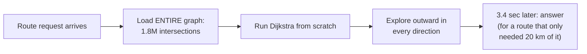

The obvious question: *why does adding one more state turn a 70ms query into a 3.4-second one?* Because Dijkstra explores outward in every direction until it's certain it's found the shortest path — the bigger the map, the more of it gets touched, even when the actual route only needs a tiny corner.

**The fix, and the analogy for the rest of this story: segmentation.** Cut the map into pages, like an atlas. You never unfold the whole atlas to find one street — you flip to the one page (segment) that has your neighborhood on it, and only flip to a neighboring page when your route actually crosses onto it. ParcelPath cuts the state into roughly 5×5 mile segments — Austin alone becomes about 30 segments, all of Texas becomes a few thousand. Each segment is small enough that one server holds it entirely in memory, and Dijkstra *inside* one page is fast again — back down near that original 70ms, now for a graph 1/2,000th the size.

**New problem, immediately:** most deliveries stay inside one or two pages of the atlas — fine. But ParcelPath's new "Austin-to-Dallas overnight line-haul" product routes a truck across roughly 40 pages. Nothing so far explains how to go from "fast inside one page" to "fast, and *correct*, across 40 pages." Running Dijkstra 40 separate times and gluing the endpoints together by guesswork doesn't even guarantee a good answer — a locally convenient exit out of page 12 might dump the truck onto a terrible road in page 13.

**How I'd say this in an interview:** "A graph too big to touch as a whole always gets fixed the same way — partition it into pieces small enough for a plain shortest-path algorithm on one machine. But the instant a real route needs to cross more than one piece, partitioning creates a brand-new stitching problem, and that's the very next thing to solve."

---

## Chapter 2 — Exit points: precomputing your way out of every page

**The fix:** for every segment, *offline*, run Dijkstra between every pair of vertices inside it once, and cache the results — interior-to-interior distances, and distances from every interior vertex to the segment's **exit points** (the handful of boundary edges connecting to neighboring segments). Cross-segment routing then becomes:

1. Compute the haversine (straight-line) distance between source and destination — this bounds *which* segments are even worth considering.
2. Build a tiny **meta-graph** whose vertices are just the exit points of the segments in that radius, using the already-cached exit-point-to-exit-point distances as edges.
3. Run a shortest-path algorithm on that small meta-graph, not the original huge one.

Worked number: Austin to Dallas is about 200km haversine, which bounds the search to roughly 28 segments along that corridor `[illustrative]` instead of the few thousand covering all of Texas. Those 28 segments' *exit points* total maybe 180 vertices — versus the tens of thousands of intersections actually inside them. Dijkstra/A* on a 180-vertex graph: single-digit milliseconds. Compare that to Chapter 1's guesswork glue job — unbounded, of unknown correctness, likely seconds — this version is bounded, correct by construction, and fast, because the expensive part (every pairwise distance *inside* a segment) was already computed and cached long before this request ever arrived.

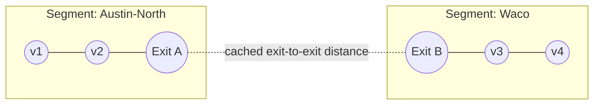

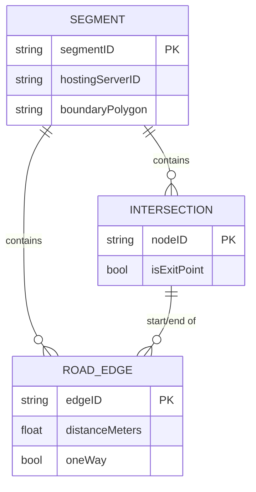

**New problem:** the offline precompute is a real, recurring cost, not a one-time one. When a new East Austin subdivision opens with 40 new intersections, that segment's *entire* pairwise-distance table has to be redone — and its exit-point distances feed every neighboring segment's meta-graph too. On launch day, ParcelPath's map team runs the recompute job **synchronously**, and it blocks live routing for that segment for about **12 minutes** `[illustrative]` while it walks through all-pairs Dijkstra by hand. During those 12 minutes, deliveries into East Austin simply fail.

**The fix, stated as a rule:** run precompute **asynchronously and incrementally** — one segment at a time, entirely off the live request path — and keep serving the *old* cached numbers until the new ones are ready, instead of blocking anything. Slightly stale beats completely unavailable.

**How I'd say this in an interview:** "Exit points turn cross-segment routing into a search over a handful of precomputed numbers instead of the whole subgraph — it's genuinely a hand-rolled, lightweight contraction hierarchy, I just haven't called it that yet. The cost you're buying is that every edit to the map has to trigger a recompute, and that recompute needs to run async, off the critical path, or you've just moved Chapter 1's blocking problem into your map-editing pipeline instead of fixing it."

---

## Chapter 3 — Turning a typed address into something a segment understands

None of the last two chapters work if ParcelPath can't first answer: *what lat/lng is "2100 Guadalupe St, Austin"?* First attempt: scan a raw addresses table (2.4M rows across Texas `[illustrative]`) with a `LIKE` query per request. At low volume this is fine — about 85ms per scan. At 500 requests/sec, that's 500 concurrent table scans hammering one Postgres box; p99 latency blows past 900ms and CPU sits at 95%.

**The fix: forward geocoding via an inverted index.** Tokenize each address into street number, street name, city, and postal code; index each token to a list of candidate addresses; rank candidates by popularity, string-match quality, and proximity to the requester. It's the exact same trie/inverted-index machinery as search typeahead — just indexing addresses instead of web pages. Lookup becomes an index seek instead of a table scan: about **4ms**.

Reverse geocoding — lat/lng → nearest human-readable address, used when a driver's GPS ping needs to be shown as a street name — is worth calling out as a *different* problem: it's a spatial nearest-neighbor query, not a text search, and it's not the same thing as **map matching** (Chapter 7), which snaps a ping onto a road *edge* for routing/traffic, not an address for display.

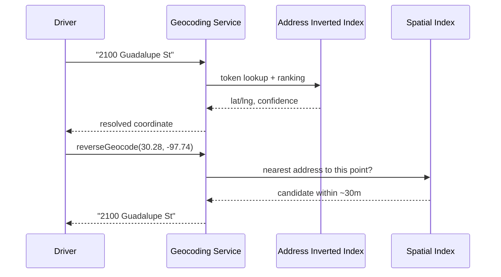

**New problem:** reverse geocoding needs some cheap way to ask "what's near this point in space" — and so, quietly, does forward geocoding's proximity ranking. A plain text index has no concept of "near." That's the same gap Chapter 1's segments glossed over too — "5×5 miles" was just declared, with no real mechanism yet for "which segment/cell does this exact point fall into, cheaply, at request time."

**How I'd say this in an interview:** "Forward geocoding is a text-search problem — inverted index plus ranking. Reverse geocoding is a spatial nearest-neighbor problem, using a totally different index. Neither one is routing — they're the prerequisite step that turns free text or a raw ping into the lat/lng that routing and rendering actually consume."

---

## Chapter 4 — Geohash: a cheap answer, with a boundary-shaped hole in it

**The fix: geohash.** Interleave latitude and longitude bits into a base32 string; the string's length controls precision. ParcelPath adopts 6-character geohashes — about 1.2km × 0.6km per cell, a real documented geohash precision level — and now "which cell is this point in" and "what's roughly nearby" both become cheap prefix operations. They even store live driver locations in Redis by geohash, using Redis's real, documented `GEO` commands, for fast radius queries.

It works well for a year. Then, worked concretely: two delivery drop-off points sit **15 meters apart** but straddle a geohash cell boundary — one gets prefix `9v6mm2`, the other `9v6mp8`, completely different strings despite being almost next to each other. A "find available drivers within 500m" query that only checks the exact matching prefix misses drivers who are genuinely close but happen to sit one cell over. A staging audit finds **12% of "nearby driver" queries** near cell boundaries return fewer drivers than actually exist within the stated radius `[illustrative]`.

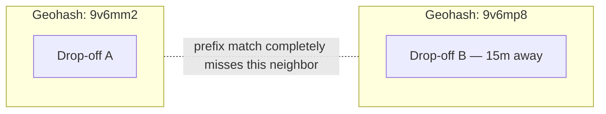

The patch everyone reaches for — also query the neighboring cells, not just the exact prefix match — helps, but it's a workaround, not a fix for the underlying issue: a geohash rectangle also **distorts** the farther you get from the equator, which barely bites ParcelPath in Texas but is flagged immediately by the team as soon as nationwide expansion into higher latitudes comes up.

**New problem, underneath the boundary bug:** even patched, geohash's grid is the *same size everywhere*. Downtown Austin has roughly 50x the intersection density of rural Hill Country `[illustrative]`, but a fixed rectangular grid has no concept of that — it can't make cells smaller where the map is busy and bigger where it isn't.

**How I'd say this in an interview:** "Geohash is the simplest spatial index — a string prefix you can shard and cache by — but two points a few meters apart can land in totally different prefixes right at a cell boundary, so any naive prefix-only radius search silently drops real neighbors. You patch it by also checking adjacent cells, but that's damage control, not a structural fix."

---

## Chapter 5 — Quadtree, then S2: the one Google actually ships

**Fix 1: Quadtree.** Recursively split a bounding box into 4 quadrants, and keep splitting wherever there's enough data to justify it. Downtown Austin gets subdivided many times over; rural Hill Country stays coarse. This solves the density problem geohash couldn't — but a quadtree's squares still don't account for the *sphere* at all, which is invisible at Texas's scale and becomes a real problem the moment you're planet-scale.

**Fix 2, the real answer: S2 Geometry.** This is Google's own, documented spatial-indexing library, used inside Maps and Bigtable: project the sphere onto **6 cube faces**, then index cells on each face along a **Hilbert space-filling curve**. Cells come out near-equal-area everywhere on the actual sphere — no pole distortion like geohash, no arbitrary non-uniformity like a raw quadtree — and because a Hilbert curve keeps spatially-nearby points numerically nearby, Google stores geo data in Bigtable/Spanner with the S2 cell ID as part of the row key: "find what's nearby" becomes a cheap contiguous range scan instead of a scatter-gather across the whole table.

ParcelPath, planning to go nationwide, adopts S2 for their segment/index layer for exactly this reason — not because pure distortion was hurting them yet at Texas's latitude, but because it's the documented fix for the exact failure mode that just bit their geohash setup. Worth naming alongside it: **H3**, Uber's real, documented hexagonal hierarchical index — hexagons give every neighbor the *same* distance (no diagonal-vs-adjacent distortion a square grid has), which is why Uber uses H3 for dispatch/surge-pricing zones rather than for routing itself. ParcelPath actually ends up using an H3-style grid for "which zone is this idle driver sitting in," while keeping S2 for the road-network segmentation from Chapter 1.

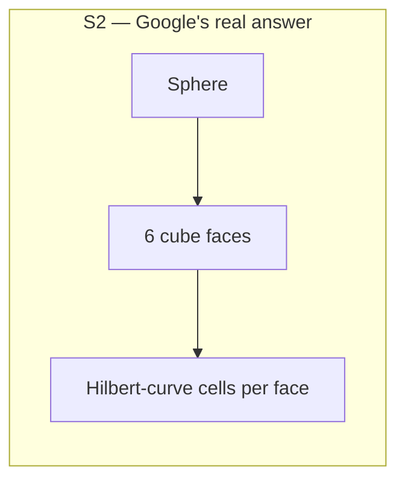

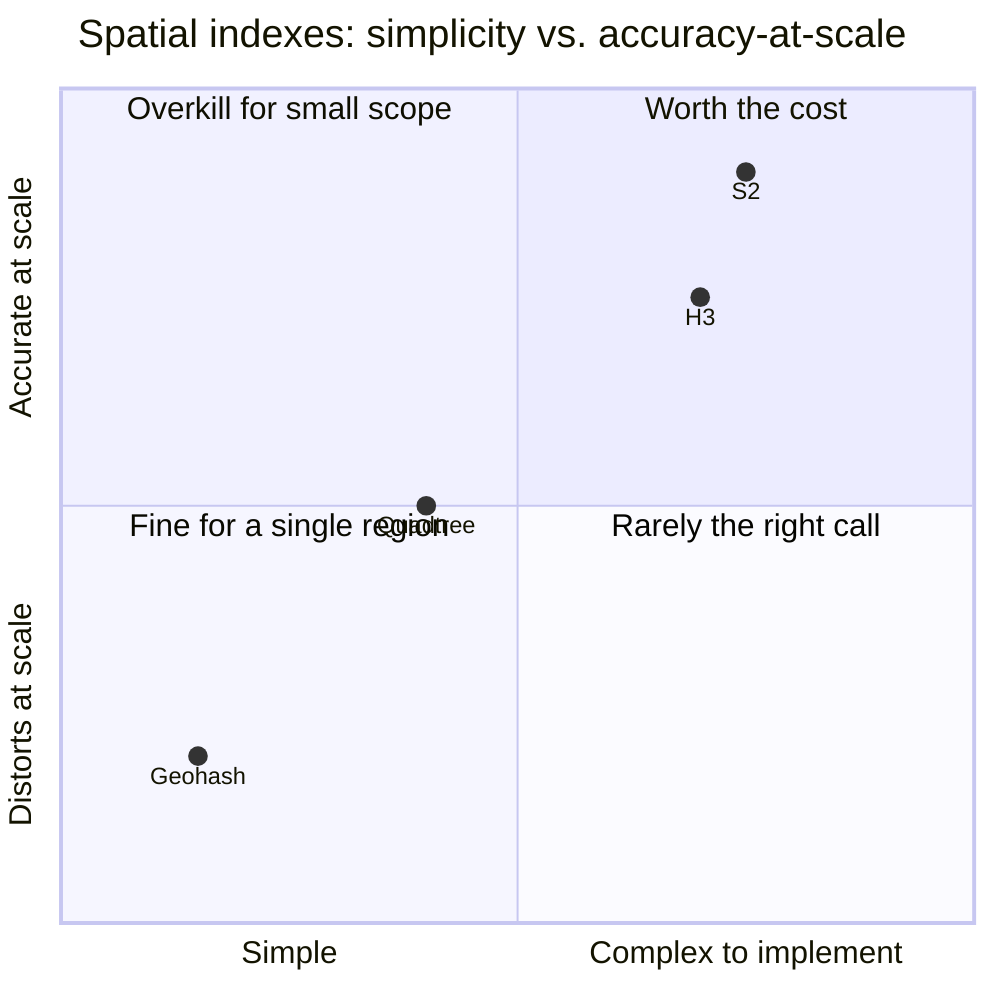

**New problem:** none of these indexes say anything about *how to route fast* once you're covering a whole country's worth of segments — that's an algorithm question, not an indexing one.

**How I'd say this in an interview:** "Geohash distorts near the poles and has a boundary discontinuity; a quadtree fixes uneven density but still ignores the sphere; S2 fixes both — near-equal-area cells everywhere, plus Hilbert-curve locality that makes range scans cheap — which is why it's genuinely what Google uses, not geohash. H3's hexagons are worth naming too, but for dispatch/zones, not for the road graph itself."

---

## Chapter 6 — Dijkstra was fine per-segment; the meta-graph itself starts to choke

Nationwide expansion means Chapter 2's exit-point meta-graph grows huge in its own right. A new B2B freight product routes trucks coast-to-coast, and one such route touches roughly 900 segments — the meta-graph balloons to about **14,000 exit-point vertices** `[illustrative]`. Even A* — Dijkstra plus a heuristic, here the straight-line haversine distance to the destination, biasing the search toward the goal instead of exploring blindly outward — takes about **650ms** on a meta-graph that size. Still technically inside budget, but climbing, and freight is the fastest-growing part of the business.

**The real production answer: Contraction Hierarchies (CH)** — the actual technique **OSRM**, a real, documented open-source router, uses at planet scale. Offline, rank every node by "importance," then repeatedly *contract* the least important ones, replacing paths through them with precomputed shortcut edges. Query time drops to near-instant, because the online search barely has to touch unimportant nodes at all — it mostly hops shortcuts.

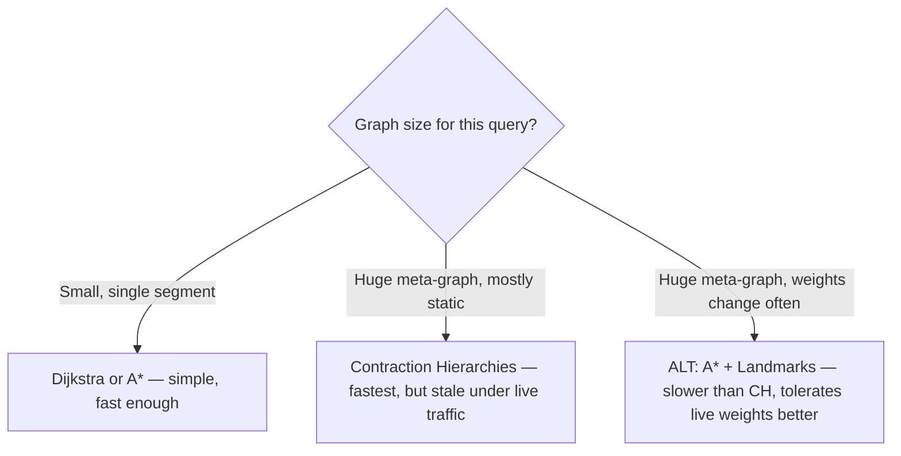

**New problem, stated honestly, not immediately fixed:** CH's shortcuts are precomputed assuming *fixed* edge weights. The moment live traffic changes one edge's weight, some shortcuts built through it are quietly wrong — and re-running the full contraction from scratch on demand is far too expensive to do every time one highway gets congested. Production systems either accept some staleness and periodically re-contract, or lean on **ALT** (A* + Landmarks + the Triangle inequality — precompute distances to a small set of fixed landmark nodes), which tolerates changing weights better than CH while still beating plain A*. ParcelPath also realizes, out loud, that their own Chapter 2 exit-point precompute already *is* a small, hand-rolled contraction hierarchy — they just never had the name for it until now.

**How I'd say this in an interview:** "Segments keep each subgraph small enough that plain Dijkstra is genuinely fine locally — the hard part is the meta-graph at planet scale, and Contraction Hierarchies, what OSRM actually ships, is the standard fix there. The catch is CH assumes static weights, so once live traffic enters the picture you either accept staleness between re-contractions or lean on something like ALT that tolerates change better."

---

## Chapter 7 — Turning a noisy dot into "which road are you actually on"

None of Chapter 6's live-weight talk means anything without an actual source of live traffic. ParcelPath's driver app already streams GPS pings — lat, lng, speed, heading, timestamp — every 5 seconds over a WebSocket. Raw GPS accuracy is about **±20 meters**, a real, documented figure for consumer GPS — nowhere near precise enough to say confidently which of three parallel roads (a highway plus two frontage roads) a driver is actually on.

First attempt: snap every ping to whichever road edge is nearest by raw distance. Result: a driver doing 65mph on I-35 gets snapped onto the frontage road **22% of the time** near interchanges `[illustrative]`, simply because the frontage road happens to be a few meters closer at that exact spot. Now the frontage road looks congested — a bunch of fast-moving highway pings wrongly attributed to it — while the highway itself looks emptier than it really is.

**The fix: map matching**, using a Hidden Markov Model — a real, widely-documented technique in GIS and telematics, not something ParcelPath invented. Score each nearby *candidate* edge not just by raw distance, but by how well its bearing matches the device's current heading, whether the implied speed is even plausible for that road type, and continuity with whichever edge the *previous* ping matched (a driver doesn't teleport between roads ping to ping).

```mermaid
sequenceDiagram
    participant Device
    participant Matcher as Map Matcher (HMM)
    participant SpatialIdx as S2 Index
    participant GraphDB

    Device->>Matcher: raw ping (lat, lng, speed=65mph, heading=180°)
    Matcher->>SpatialIdx: candidate edges within ~20m
    SpatialIdx-->>Matcher: highway edge, frontage-road edge
    Matcher->>GraphDB: fetch bearing of each candidate
    GraphDB-->>Matcher: highway bearing matches 180°; frontage doesn't
    Matcher->>Matcher: score via heading + speed + continuity with prior edge
    Matcher-->>Matcher: pick highway edge
```

**New problem:** matching each ping to the *correct* edge is necessary, but it's only step one — now ParcelPath has to decide what to actually *do* with a correctly-matched ping, at real scale, every few seconds, for thousands of drivers at once.

**How I'd say this in an interview:** "Raw GPS isn't 'which road' — it's a noisy dot that could plausibly be on any of two or three nearby roads. Map matching, usually via a Hidden Markov Model over heading, speed, and continuity with the last matched edge, is what turns that dot into a specific road edge you can actually attribute traffic to."

---

## Chapter 8 — The graph that updated itself into a flapping mess

Naive first version: every single map-matched ping immediately writes a fresh "current speed" value straight onto that edge in the graph store. Fleet size: 3,000 concurrently navigating drivers, pinging every 5 seconds, is **600 writes/sec** hitting a graph database that wasn't built for that write rate. Worse: a driver stopped at a red light pings 0mph, then 28mph once it turns green, then 0mph again at the next light — the *same* edge's weight flaps up and down dozens of times a minute, and every flap re-triggers dependent route recalculations for anyone currently routed across it. On one downtown corridor with 6 traffic lights, one edge's weight changes **40 times in 10 minutes** `[illustrative]` — for a genuinely unremarkable street.

**The fix: aggregate, then debounce.** Roll pings into per-edge, per-time-bucket buckets (say, 1 minute), average the speeds inside each bucket, and only push a new weight to the live graph when the aggregated value moves by more than a threshold percentage. A red light's momentary 0mph gets diluted by the other 30 samples in that same bucket that weren't stopped; only a genuine, sustained slowdown crosses the threshold.

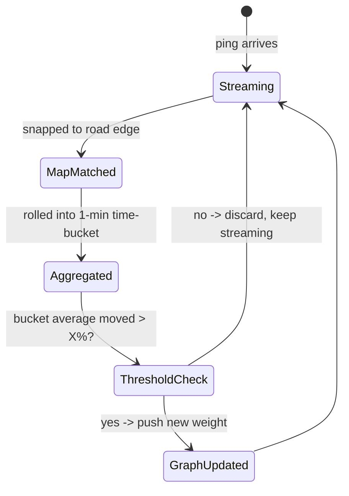

**New problem:** the debounce threshold protects against noise from *honest* drivers and normal stoplights. It does nothing at all about a device that's lying, broken, or being used to game the system.

**How I'd say this in an interview:** "Writing every single ping straight to a live edge weight causes update storms — a stoplight alone can make one edge flap dozens of times an hour. The fix is aggregating into time buckets and only pushing an update past a debounce threshold — a deliberate trade of a little freshness for a lot of stability."

---

## Chapter 9 — The driver whose phone thought it teleported to Houston

One driver's GPS chip glitches and reports a jump of 180km between two consecutive 5-second pings — implying a speed of roughly 130,000 km/h. Fed naively into map matching and aggregation, that single bad sample can corrupt whichever edge it lands near. Separately, and this is a real, documented phenomenon, Waze has publicly dealt with "ghost traffic jam" griefing — people fabricating slow-moving reports to fake congestion on a road they'd rather see emptier.

**The fix, two layers, matching the analogy of "don't trust one witness, trust the crowd":**

1. **Plausibility filter, before map matching even runs:** reject a ping outright if the implied speed since the last ping exceeds a physically sane cap — say, 300 km/h — killing the teleport case before it can pollute anything.
2. **Corroboration across many independent devices:** an edge's live speed is always an *aggregate* over many drivers in that time bucket, never a single device's word. One remaining bad actor barely moves a 30-sample average, whereas it would fully control a 1-sample average.

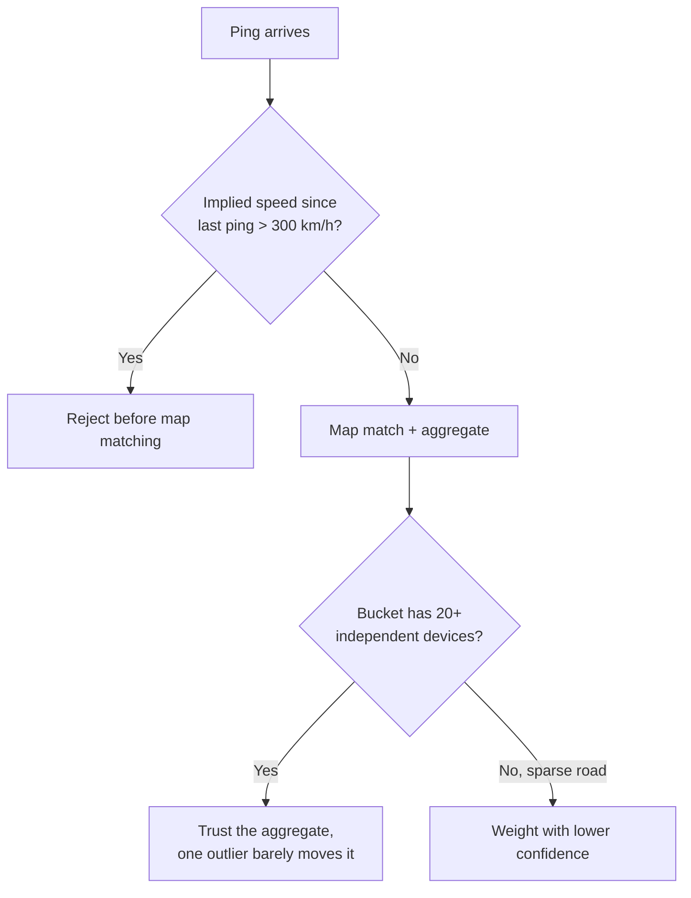

**New problem:** even with trustworthy live speeds now flowing in, the number a customer actually sees — "your package arrives in 22 minutes" — is still just some arithmetic downstream of distance and speed, and that arithmetic hasn't been checked for accuracy yet.

**How I'd say this in an interview:** "Never trust a single GPS ping — reject the physically impossible outright, and for everything else, lean on aggregation across many independent devices so one liar or one broken sensor barely moves the average. That's the same real-world defense against Waze's documented ghost-jam griefing problem."

---

## Chapter 10 — The ETA that was honest about distance and wrong about time

Naive ETA: distance ÷ posted speed limit. Worked number: a 14km route on roads posted at an average 50km/h limit gives a confident "22-minute" ETA. Actual result during 5:30pm rush hour: **41 minutes** — support tickets spike, even though the *route itself* (the sequence of roads chosen) was correct the whole time.

**Fix, layer one:** fold in historical, time-bucketed averages per edge — "this stretch is typically 40% slower every weekday 5-6pm." Better, but it describes a typical Tuesday, not today.

**Fix, layer two:** fold in the *live* aggregated speed from Chapters 7-9. Now the ETA reflects both "usually slow here at this hour" and "actually slow here right now." Deliberate, worth naming: traffic and weather aren't modeled as separate, independent edge weights — they're folded into one number, the edge's *current average speed* — because reasoning about them as independent multipliers adds complexity without much accuracy payoff.

**New problem, stated honestly rather than solved further:** even historical-plus-live still scores each edge independently. It can't anticipate that the edge you're about to enter is *about to* get congested because of a jam building two edges ahead. The real state-of-the-art direction — and this is genuinely documented, published work by Google with DeepMind, around 2020-2021 — is modeling ETA as a **graph neural network** over the road-segment graph itself, so congestion on one edge propagates a predicted effect to its neighbors instead of every edge being scored alone. ParcelPath doesn't build this themselves — it's a serious research-scale undertaking — but the team flags it as the known next step if ETA accuracy ever becomes the actual bottleneck. One more honest note: ETA error compounds across a long, multi-segment trip, so periodically re-grounding the estimate against the driver's *actual live position* matters — which is exactly the next chapter's problem.

**How I'd say this in an interview:** "ETA is distance combined with historical patterns and live traffic, folded into one 'average speed' number per edge, not a static division. The state-of-the-art evolution beyond that — what Google and DeepMind actually published — treats the whole road graph as a neural-network input, so congestion can propagate to neighboring edges instead of every road being judged alone."

---

## Chapter 11 — The driver who missed the turn

ParcelPath's v1 navigation computes the ETA and route once, at trip start, and never touches it again. A driver misses a highway exit; the app keeps counting down toward a turn that will never happen, and the customer's live tracking page sits there frozen, confidently wrong, for the rest of the trip.

**The fix:** keep the driver's WebSocket connection open — the same one already streaming pings for the traffic pipeline in Chapters 7-9 — and map-match every incoming ping (the same matcher, reused) against the *step* the trip is currently on, not just against the traffic edge. If the matched edge is the planned next edge, it's a no-op — just advance the "current step" pointer. If the matched edge is off the planned route, don't reroute on the very first off-route ping — a single matching error or a driver mid-correction on a missed turn shouldn't trigger a full recompute. Only fire a reroute after the deviation persists for several consecutive pings — around **15 seconds** at a 5-second ping interval `[illustrative]`.

The reroute itself is nothing new: it's literally the *same* `findRoute` call from Chapters 1-6, called again with the origin swapped to the driver's current lat/lng. There's no special "rerouting" code path — the only genuinely new piece is the deviation *detector* sitting in front of the existing pipeline.

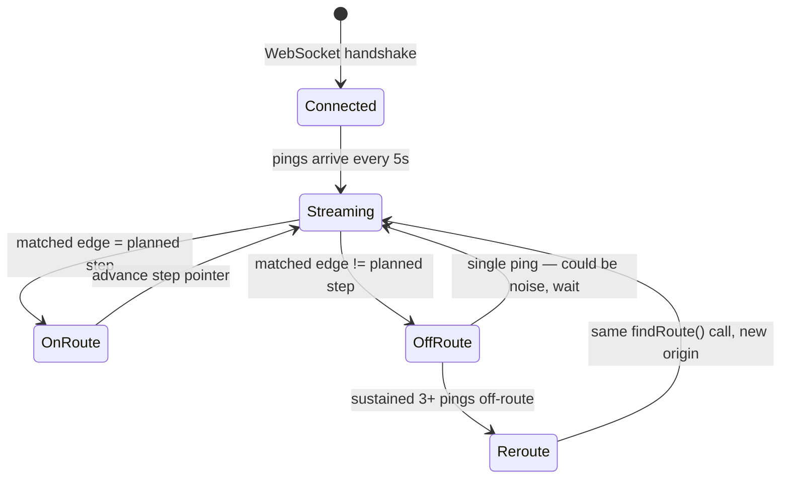

**New problem, the last one in the routing/telemetry half of this story:** everything so far has been about the road graph and where drivers are on it. Both the driver app and the customer's tracking page also have to literally *draw* a map on screen — a completely separate cost that's been growing quietly the whole time.

**How I'd say this in an interview:** "Rerouting isn't a special feature — it's a debounced deviation detector wired in front of the exact same route-finding call from day one, just with a new origin. The only design decision is how many consecutive off-route pings you require before acting, so a single noisy sample doesn't trigger a needless recompute."

---

## Chapter 12 — Drawing the map itself nearly bankrupts the bandwidth bill

ParcelPath's driver app shows a live map so a driver can see their position and route; the customer tracking page shows the same. First version: the server renders the entire visible map area as one big PNG image and ships it down whenever the viewport moves. Worked number: about 40,000 concurrent map viewers (drivers plus customers watching live tracking), each pulling roughly 12 raster tiles, refreshed every ~10 seconds on pan/zoom, each tile ~80KB. That's `40,000 × 12 / 10 = 48,000 tile requests/sec × 80KB ≈ 30.7 Gb/s` with zero caching — and the AWS egress bill nearly doubles month over month as usage grows.

**The fix, two parts.** First: split the map into a fixed pyramid of tiles addressed by `(zoom, x, y)` — the exact same partitioning idea as segments (Chapter 1) and S2 cells (Chapter 5), just applied to *rendering* instead of *routing* — and put a CDN in front of it. Fixed `(z,x,y)` keys are trivially cacheable, unlike a free-form bounding-box query with an infinite key space. At a realistic ~95% cache-hit ratio, origin bandwidth drops roughly **20x**. Second: switch from **raster tiles** (pre-rendered PNG, ~50-100KB) to **vector tiles** — geometry plus style data as protobuf, ~10-30KB, the real, documented Mapbox Vector Tile format. Smaller payload, and the client can instantly re-style — a driver's night-mode toggle, for instance — with zero server round-trip, at the cost of shifting rendering work onto the client's own CPU/GPU.

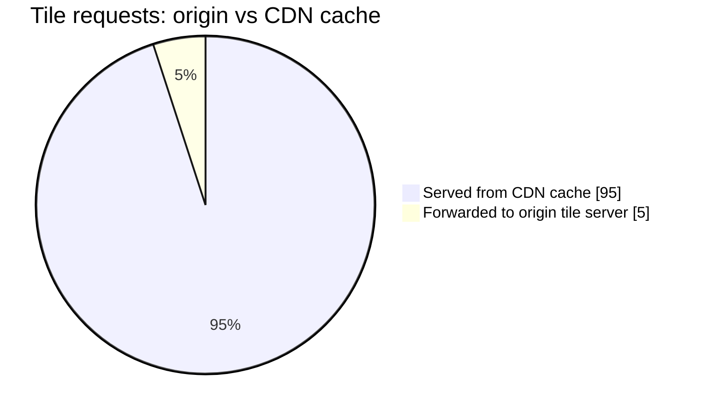

This closes the loop, rather than opening a new problem. Vector tiles behind a CDN, addressed by a fixed partition key, is the same partition-and-cache idea that already fixed routing (segments + exit points), indexing (S2 cells), and traffic (time-buckets) — just applied one more time, to pixels.

**How I'd say this in an interview:** "Map rendering isn't a separate design problem from routing — it's the exact same partition-and-cache trick, cutting up pixels by zoom/x/y instead of roads by segment, with a CDN doing for tiles what the exit-point cache does for routes. Vector tiles over raster is the same trade every layer of this system makes: shift cost from the server to the client in exchange for smaller payloads and instant re-styling."

---

## Where the story actually lands


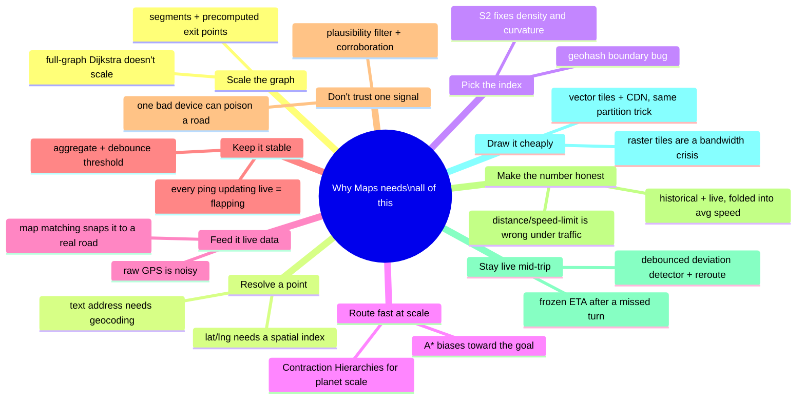

Every real production maps system sits somewhere on this chain. The skill isn't reciting all twelve chapters — it's stopping where the interviewer's actual question says to stop. A "design a nearby-restaurants feature" prompt might reasonably stop around Chapter 5. A "design turn-by-turn navigation" prompt has to reach Chapter 11. Walking to Chapter 12 unprompted, when nobody asked about rendering, reads as padding, not depth.

---

## Grill me — adversarial follow-ups

**Q1: "Why build all of this instead of just paying a commercial maps API per call?"**
At low volume, paying per call is absolutely the right answer — building your own router is a multi-year investment you shouldn't make until the per-call bill or the rate limits are genuinely hurting. ParcelPath's whole story only kicks off because they wanted an in-house, live-traffic-aware routing engine for their own delivery fleet, and the economics tipped once volume got large enough. If asked this cold, say the build-vs-buy trade-off out loud before diving into any architecture.

**Q2: "Doesn't segmentation just turn one big single-point-of-failure into thousands of small ones — what stops one hot segment, like downtown Austin at 5pm, from becoming a bottleneck on its own?"**
Exactly right, and the fix is the same one you'd use for any hot shard: replicate the busy segment across multiple servers, and consider non-uniform segment sizing — smaller segments in dense areas spread load more evenly than one giant fixed-size square downtown. Segmentation buys you tractability, not automatically even load; that's a separate, second problem you solve with replication.

**Q3: "Geohash worked for a year — why switch to S2 before it actually broke at scale?"**
Because the specific failure mode — pole/high-latitude distortion — was invisible at Texas's latitude but guaranteed to bite the moment they expanded nationwide into higher latitudes, and by then their whole segment/index layer would depend on it. Switching early, while migration is cheap, is the same instinct as fixing the partition-count problem before it becomes structural — pay the cost once, deliberately, instead of under pressure later.

**Q4: "Contraction Hierarchies gives millisecond queries — why bother with segments and exit points at all instead of just running CH over the whole planet graph?"**
Because CH's offline contraction step itself needs the graph broken into manageable pieces to compute and maintain at all, and segments are also what make live map edits and regional failure isolation tractable — CH answers "how do I query fast," segments answer "how do I even store, update, and reason about a graph this size." In practice, the exit-point precompute *is* a lightweight, hand-rolled CH; a full planet-scale CH implementation like OSRM's is the natural next step, not a replacement for having partitions.

**Q5: "Why does map matching need heading and continuity with the previous ping — isn't nearest-edge-by-distance good enough?"**
No — that's literally the bug from Chapter 7: a driver on the highway gets snapped onto a frontage road 22% of the time near interchanges, because "nearest" ignores which direction the car is actually facing and where it plausibly came from one ping ago. Heading and continuity are what let the algorithm tell "parallel road going the same way" apart from "the road you're actually on."

**Q6: "The debounce threshold delays real traffic updates on purpose — isn't that dangerous during an actual accident?"**
It's a real trade-off, and the honest answer is: give large weight deltas a fast path around the normal debounce window. A stoplight causing a small, expected fluctuation should wait for the threshold; a highway going from 60mph to 5mph in one bucket is exactly the kind of sustained, large signal you don't want delayed by the same rule built to filter out noise.

**Q7: "How do you defend against a coordinated fleet of fake devices, not just one glitchy phone?"**
The plausibility filter (reject impossible speed jumps) and single-device dilution (aggregate across many independent devices) both assume the bad actors are a small minority of a bucket's samples — a large coordinated fleet can genuinely overwhelm that. At that point you're into anomaly detection: comparing a road's reported speed against multiple independent signal sources (other apps, historical baselines, road-sensor data if available) rather than trusting your own app's aggregate alone — this is a real, harder problem, and worth naming as a limitation rather than claiming the corroboration fix solves it completely.

**Q8: "Why fold traffic and weather into 'average speed' instead of modeling them as separate, independent edge weights?"**
Because trying to reason about "30% traffic penalty" and "15% rain penalty" as independent multipliers adds real modeling complexity for accuracy gains that are hard to prove out, especially once you're already refreshing that average speed from live pings anyway. One honest number per edge, refreshed often, is simpler to build, simpler to debug, and good enough for the stated 2-3 second latency and reasonable-ETA-accuracy targets.

**Q9: "Walk through exactly what happens end to end when a driver misses a turn."**
The next ping after the missed turn map-matches to a road edge that isn't the planned next step — that's an off-route signal, but the system waits, because one off-route ping could just be matching noise. If the next two or three pings are also off-route, the deviation detector fires a reroute event, which is nothing more than the original `findRoute` call run again with the origin swapped to the driver's current lat/lng — same segments, same exit-point cache, same algorithm, brand-new starting point.

**Q10: "Given this whole story, if someone says 'design Google Maps' cold, where do you actually start?"**
Say the three pillars up front — geospatial index, routing graph, live telemetry — and the one unifying idea: partition the world, precompute offline, stitch small cached answers online. Then ask which half the interviewer cares about most, routing-heavy or proximity-heavy, because that reprioritizes the next 30 minutes; segmentation and a spatial index are close to a given either way, but contraction hierarchies, map matching, and rerouting are things you earn by the interviewer steering there, not defaults you dive into unprompted.

---

## Pacing note

**If this is 60 seconds inside a bigger question:** say the atlas-page line — the road network's too big to touch as a whole, so you partition it into segments, precompute shortest paths offline, and stitch small cached answers together online — then say "same trick again for the spatial index (S2 cells) and the map tiles (zoom pyramid + CDN), and live traffic is a separate async pipeline that never blocks a route request." That's the whole shape in one breath.

**If this is the whole 20-30 minute focus:** walk the chapters roughly in order — why full-graph Dijkstra fails, segments and exit points, geocoding, the spatial-index evolution (geohash → quadtree → S2), routing at scale (A* → Contraction Hierarchies), GPS ingestion and map matching, aggregation and debouncing, ETA modeling, live rerouting, then tile serving if there's time left. Don't walk all twelve unprompted — follow the interviewer's actual questions, and use whichever chapters you skipped as your "here's what I'd add with more time" closer.

---

## Active recall — no answers, test yourself cold

1. What's the one sentence that explains almost every fix in this story?
2. Why does adding one more state to the routing graph turn a 70ms Dijkstra query into a 3.4-second one?
3. What exactly does an "exit point" let you skip computing at request time?
4. Why is reverse geocoding a different problem from forward geocoding, and different again from map matching?
5. Concretely, why can two points 15 meters apart get completely different geohash prefixes?
6. What two real problems does S2 fix that geohash and a plain quadtree each miss?
7. Why does Contraction Hierarchies struggle with live traffic, and what's the honest mitigation?
8. Walk through why "nearest edge by distance" is the wrong way to map-match a GPS ping.
9. Why does writing every raw ping straight to a live edge weight cause "flapping," and what fixes it?
10. What's the difference between the plausibility filter and the corroboration-across-devices fix — what does each one actually stop?
11. Why does ETA fold traffic and weather into "average speed" instead of separate weights?
12. What's the only genuinely new piece of code that rerouting requires, given everything else already built?

*Spaced repetition: test this list today, again in 2-3 days, again in a week.*

---

## Cheat sheet — one line per stop on the story

- **Full-graph Dijkstra**: correct but explores proportional to graph size — fine for one city, falls over at state/planet scale.
- **Segmentation**: cut the map into atlas pages small enough for one server and a plain shortest-path algorithm.
- **Exit points**: precompute every interior-to-boundary distance offline, so cross-segment routing searches a tiny meta-graph instead of the real one.
- **Async, incremental precompute**: map edits trigger recomputation off the live path — never block live routing to refresh cached numbers.
- **Forward geocoding**: text address → lat/lng, via an inverted index — a search problem, not a spatial one.
- **Reverse geocoding**: lat/lng → nearest address, via spatial nearest-neighbor — not the same as map matching, which snaps a ping to a road edge, not an address.
- **Geohash**: cheap, shardable prefix-based grid — but boundary discontinuities and pole distortion are real, documented weaknesses.
- **Quadtree**: adapts cell size to data density, still ignores the sphere.
- **S2 Geometry**: Google's real answer — cube-projected sphere + Hilbert curve, near-equal-area cells, locality that makes Bigtable range scans cheap.
- **H3**: Uber's real hex-grid alternative — uniform neighbor distance, better fit for dispatch/zones than for road routing.
- **A\***: Dijkstra plus a heuristic (haversine-to-goal) that biases the search toward the destination — free upgrade over plain Dijkstra.
- **Contraction Hierarchies**: OSRM's real production technique — precompute shortcuts through unimportant nodes for near-instant planet-scale queries, at the cost of going stale under live traffic.
- **ALT**: A* plus landmark distances — slower than CH, more tolerant of changing weights.
- **Map matching (HMM)**: snap a noisy GPS ping to the correct road edge using heading, speed plausibility, and continuity with the prior matched edge, not just raw distance.
- **Aggregation + debounce**: roll pings into time buckets, only push a live weight update past a threshold delta — stops stoplight noise from flapping the graph.
- **Plausibility filter + corroboration**: reject physically impossible pings outright, and never trust a single device's word for an edge's live speed — the real defense behind Waze's documented ghost-jam problem.
- **ETA modeling**: historical time-bucketed averages plus live aggregated speed, folded into one "average speed" per edge — the real state-of-the-art evolution is a graph neural network (Google + DeepMind) so congestion propagates across neighboring edges.
- **Deviation detection + reroute**: debounce a few consecutive off-route pings before acting, then reroute is just the same `findRoute` call with a new origin.
- **Vector tiles + CDN**: same partition-and-cache trick as segments and S2 cells, applied to pixels — fixed `(z,x,y)` keys make tiles cacheable, and vector format shifts rendering cost to the client for a smaller payload.
- **The meta-lesson**: every fix in this story buys one property — tractability, correctness, freshness, trust, or bandwidth — by spending a different one, and naming that trade in the same sentence as the fix is what actually reads as senior in the room.
