# Design Google Maps — FAANG Interview Guide

## 1. Mental Model

Google Maps is three products wearing one UI:

1. **A geospatial database** — "where is X, what's near me" (search + indexing).
2. **A routing engine** — "shortest/fastest path over a graph with billions of edges."
3. **A live-telemetry system** — millions of GPS pings/sec that both update *your* position and feed everyone else's ETA.

The one idea that unlocks the whole design: **the road network is too big to touch as a whole**. Every hard problem in this system — scalability, ETA accuracy, tile rendering, live location — is solved the same way: **partition the world (segments/tiles/cells), precompute offline, stitch small pieces together online.** If you remember one sentence for the whole interview, it's this one.

Analogy: think of the world graph like a highway map printed at different zoom levels in an atlas — you never unfold the whole atlas to find one street; you open to the right page (segment), read local detail, and only unfold neighboring pages when your route crosses a page boundary (segment stitching via exit points).

**Cheat-sheet**
- Maps = geospatial index + routing graph + live telemetry, bolted together.
- Golden move: partition → precompute offline → stitch small answers online.
- Road network = weighted graph (intersections = vertices, roads = edges, weights = distance/time/traffic).
- Everything expensive gets done offline, off the user's critical path.
- Segments/tiles/cells are the same idea wearing different hats (storage partition, render partition, index partition).

---

## 2. How to Identify This Topic in an Interview

You're looking at a "Design Google/Apple Maps," "Design Uber's ETA," "Design a ride-sharing dispatch system," "Design a location-based check-in/nearby-friends feature," or "Design a delivery-routing system" prompt. Signal phrases:

- "Find the shortest/fastest route between two points."
- "Show nearby restaurants / drivers / friends within X km."
- "Update ETA as traffic changes."
- "Track live location of millions of devices."
- "The graph has billions of nodes — how do you make this fast?"

This is a **geospatial + graph** problem, not a generic CRUD/feed problem. If the interviewer emphasizes "real-time position updates," lean into the telemetry/pub-sub half. If they emphasize "compute the route," lean into the graph-partitioning/routing-algorithm half. Most interviews want both, briefly, then deep-dive wherever they poke.

**Cheat-sheet**
- Trigger words: shortest path, ETA, nearby X, live location, road network, turn-by-turn.
- Two families of related prompts: *routing-heavy* (Maps, Waze) vs *proximity-heavy* (Uber matching, Yelp nearby, Find My Friends). Same index toolkit (geohash/S2/quadtree), different core algorithm (Dijkstra/A* vs radius/kNN search).
- Always ask which half the interviewer cares about most — it reprioritizes your 45 minutes.

---

## 3. Interview Playbook

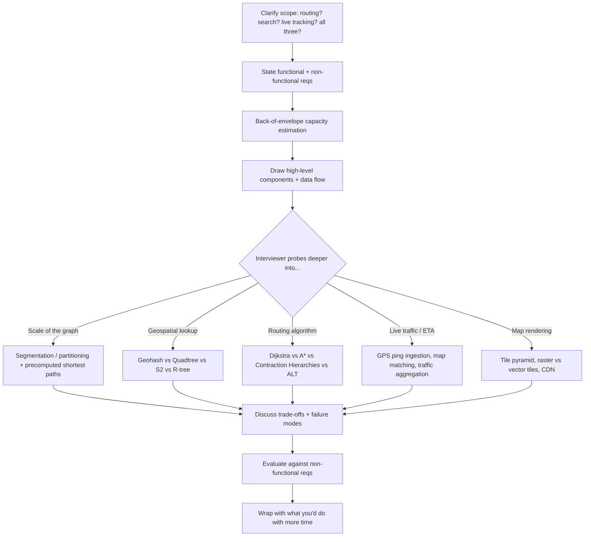

**Cheat-sheet**
- Spend ~5 min on requirements + estimation, ~10 min high-level, ~20 min deep dive where the interviewer steers, ~5 min trade-offs/wrap-up.
- Don't silently pick Dijkstra-on-full-graph as your final answer — say it, then immediately say why it doesn't scale, then partition.
- Narrate trade-offs out loud constantly — that's the signal FAANG interviewers grade on, not the diagram.

---

## 4. Requirements Clarification

### Functional Requirements
1. **Identify current location** — approximate lat/lng from GPS/Wi-Fi/cell tower.
2. **Recommend fastest/optimal route** — given source + destination (text), by distance and time, per transport mode (car/bike/walk/transit).
3. **Turn-by-turn directions** — step list, re-route on deviation.
4. *(Extended, worth mentioning as stretch)* Nearby search (POIs), live traffic overlay, ETA sharing.

### Non-Functional Requirements
| Requirement | Target | Why it matters |
|---|---|---|
| Availability | 99.99%+ | Navigation mid-drive can't go dark |
| Scalability | Billions of nodes/edges, millions QPS | 194+ countries, 32M+ DAU |
| Latency | Route + ETA in 2–3 sec (p99) | UX-critical, driver already moving |
| Accuracy | ETA within a small % of actual | Trust; compounding error over a long trip |
| Consistency | Eventual is fine for map data; freshness matters for traffic | Road data changes rarely; traffic changes every minute |

**Location accuracy inputs** (interviewers like this detail):
- GPS: ~20 m accuracy, degrades indoors/underground.
- Wi-Fi positioning: helps indoors, city-block accuracy.
- Cell tower triangulation: accurate to ~thousands of meters, best as a fallback.

**Clarifying questions to ask out loud:**
- Cars only, or also walking/biking/transit (changes the graph — one-ways, bike lanes, station graphs)?
- Do we need live traffic-adjusted ETA or just static distance/time?
- Do we own the map data or ingest from third parties (government + fleet-collected)?
- Read-heavy (billions of route queries) vs write-heavy (location pings) — assume both, but they scale independently.

**Cheat-sheet**
- 3 functional pillars: locate, route, navigate (+re-route).
- 4 non-functional pillars: available, scalable, fast (<3s), accurate.
- Road network = weighted graph; weights = distance, time, traffic — not orthogonal, traffic feeds into time.
- Map/road data is near read-only (one-time bulk load + rare edits); live traffic data is a firehose.
- Always separate "static geodata" scaling story from "live telemetry" scaling story — they use different infra.

---

## 5. Capacity Estimation

### Formula chain (memorize the shape, not just the numbers)

```
1. Server count      = Daily Active Users (peak-adjusted) / requests-handled-per-server

2. Incoming BW       = requests/sec × request_size

3. Outgoing BW       = requests/sec × response_size

4. GPS ping QPS      = concurrent_navigating_users × (1 / ping_interval_sec)

5. GPS ingest BW     = GPS_ping_QPS × ping_payload_size

6. Raw ping storage  = GPS_ping_QPS × ping_payload_size × 86,400 × retention_days

7. Tile request QPS  = concurrent_map_viewers × tiles_per_viewport / avg_seconds_between_refresh

8. Tile origin BW    = Tile_request_QPS × tile_size × (1 − CDN_cache_hit_ratio)

9. Routing/ingestion
   server count       = peak_QPS_for_that_service / per-server-throughput
```

### Worked numeric example

**Base assumptions (from requirements):**
- DAU = 32M (~1B monthly), single server handles 8,000 req/s.

**1. App/route servers**
```
32,000,000 / 8,000 = 4,000 servers
```

**2/3. Route-request bandwidth**
```
Requests/sec = (32M × 50 requests/user/day) / 86,400 ≈ 18,518 req/s
Incoming BW  = 18,518 × 200 B  ≈ 29.6 Mb/s
Outgoing BW  = 18,518 × 2,005 KB ≈ 297 Gb/s   (2 MB visuals + 5 KB text per response)
```

**4/5/6. Live GPS telemetry (extending the source numbers — this is the part interviewers love to probe):**
```
Assume 5% of DAU is actively navigating at peak = 1.6M concurrent devices
Ping interval = 5 sec → each device sends 0.2 pings/sec

GPS ping QPS = 1,600,000 × 0.2 = 320,000 pings/sec

Payload (userID, ts, lat, lng, speed, heading) ≈ 100 bytes

Ingest bandwidth = 320,000 × 100 B ≈ 256 Mb/s

Daily ping volume = 320,000 × 86,400 ≈ 27.6 billion pings/day
Raw 7-day retention storage ≈ 27.6B × 100 B × 7 ≈ 19.3 TB (raw, pre-compaction —
aggregated traffic-signal storage is orders of magnitude smaller since only
per-road/per-time-bucket stats need to persist long-term)
```

**7/8. Map tile serving**
```
Assume 10% of DAU browsing the map concurrently = 3.2M viewport sessions
~12 tiles visible per viewport, refreshed every ~10 sec on pan/zoom

Tile QPS = 3,200,000 × 12 / 10 ≈ 3.84M tile requests/sec
Vector tile size ≈ 20 KB

Full bandwidth (no cache) = 3.84M × 20 KB ≈ 614 Gb/s
With 95% CDN cache-hit ratio → origin bandwidth ≈ 30.7 Gb/s
```

**9. Supporting server counts**
```
WebSocket gateway servers (50K live connections/server capacity):
  1,600,000 / 50,000 = 32 servers → round up + redundancy ≈ 40–50 servers

Storage: one-time road network load ≈ 20+ PB (2022 figure) — near-static,
so amortized daily storage growth is negligible (only diffs/edits + traffic
aggregates grow daily).
```

**Cheat-sheet**
- Server count formula: DAU / per-server-capacity. Always state the per-server assumption out loud (it's arbitrary, own it).
- Two independent capacity stories: (a) query-serving (routing) scales with DAU × requests/user; (b) telemetry ingestion scales with *concurrently navigating* users × ping-rate, not DAU.
- Tile bandwidth is dominated by CDN cache-hit ratio — a 95% hit rate is a 20x bandwidth reduction at origin.
- Road network storage is one-time/bulk (~20 PB class); GPS ping storage is the fast-growing stream, kept short-lived and aggregated down.
- Always convert your final numbers to a common unit (Mb/s or Gb/s) — interviewers notice unit mismatches.

---

## 6. High-Level Design

### Components
| Component | Responsibility |
|---|---|
| Location finder | Resolves user's current lat/lng, holds a persistent connection for live updates |
| Distributed search (Typeahead) | Text place-name → lat/lng, and reverse |
| Route finder | Front door for a routing request; orchestrates area search |
| Area search service | Finds source/destination segments, asks graph processing for the path |
| Graph processing service | Runs shortest-path over the relevant segment(s) |
| Navigator | Tracks the user mid-trip, detects deviation, triggers re-route |
| Graph DB | Stores road network as a graph (nodes=intersections, edges=roads) |
| Key-value store | segment→server mapping, segment boundary coords, exit-point precomputed distances |
| Pub-sub (Kafka) | Deviation events, live GPS ping streams, traffic-analytics fan-out |
| Map/tile servers + CDN | Serves rendered map imagery/vector tiles |
| Third-party road data + graph builder | Ingests/normalizes/loads road data into the graph |
| Load balancer | Spreads requests/WebSocket connections across servers |

**Memory hook:** *"Find it, Route it, Watch it"* — Distributed Search (find), Route/Area/Graph services (route), Navigator (watch/re-route).

### Architecture diagram

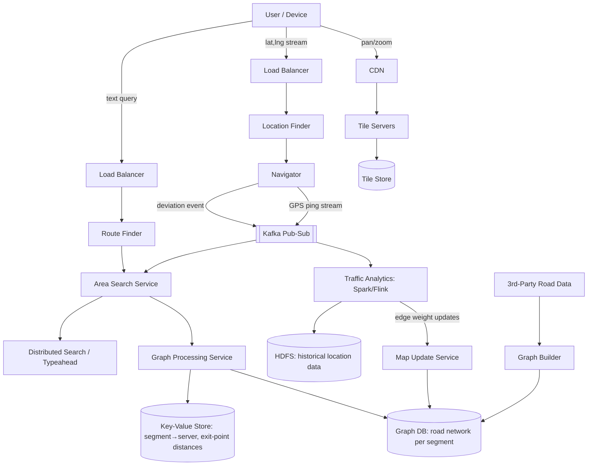

### Request workflow (sequence diagram)

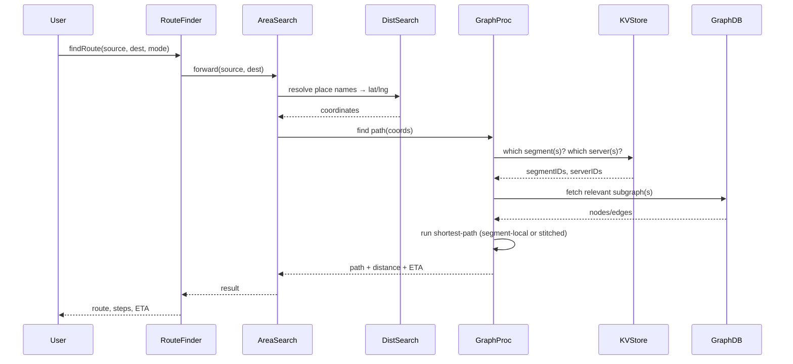

**Cheat-sheet**
- Route Finder = orchestrator/front door; Area Search = "which segments"; Graph Processing = "actual pathfinding."
- Key-value store is the traffic cop: segment→server, segment boundaries, and cached exit-point distances all live there — it's on the critical path for *every* request, so it must be low-latency and horizontally scaled.
- Kafka is the connective tissue for anything asynchronous: deviation → re-route, GPS stream → analytics.
- Graph DB stores segment-local graphs; nobody queries the *whole* graph in one call, ever.
- Draw the diagram left-to-right in this order — user, resolve names, resolve segments, resolve servers, run algorithm — interviewers can follow the request as they read.

---

## 7. Deep Dive: Geospatial Indexing

You need to answer: *given a lat/lng, which partition (segment/tile/cell) does it belong to, and what's nearby?* Four standard tools:

| Index | Structure | Cell shape | Neighbor lookup | Real-world user | Best for |
|---|---|---|---|---|---|
| **Geohash** | Interleave lat/lng bits → base32 string | Rectangle (varies by latitude) | Prefix match, but neighbors can have wildly different prefixes at boundaries | Elasticsearch, Redis GEO, MongoDB | Simple radius search, human-readable/shareable cells |
| **Quadtree** | Recursive 4-way split of a bounding box | Square (until reprojected) | Tree traversal to siblings | Custom spatial engines, older GIS systems | Non-uniform density (denser subdivision in cities) |
| **S2 Geometry** | Project sphere onto cube faces, Hilbert-curve index each face | Near-square, near-equal-area on the actual sphere | Hilbert curve locality — very good | **Google** (Maps, Bigtable geo-indexes), MongoDB (newer versions) | Planet-scale, minimal distortion at poles, polygon coverage |
| **R-tree** | Bounding boxes grouped bottom-up (not a fixed grid) | Arbitrary rectangles, can overlap | Tree search, box-in-box | PostGIS, spatial DB engines | Indexing arbitrary polygons/shapes (building footprints, geofences), not just points |

**Memory hook:** *"Great Quality Systems Rock"* → **G**eohash, **Q**uadtree, **S2**, **R**-tree.

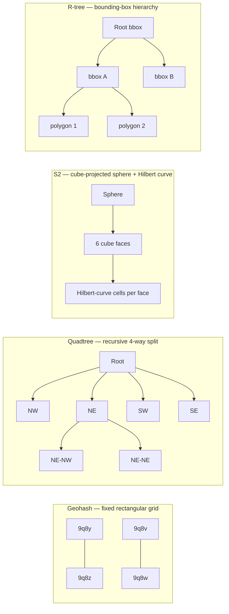

**Why interviewers ask about this:** geohash's biggest gotcha is the **boundary problem** — two points 1 meter apart can have completely different geohash prefixes if they straddle a grid boundary, breaking naive prefix-based radius queries (fix: query neighboring cells too, or use S2/quadtree's better locality). S2 is the "correct" answer for planet-scale because it accounts for sphere curvature (geohash rectangles distort badly near poles); it's genuinely what Google uses internally.

### Decision tree: which index to pick?

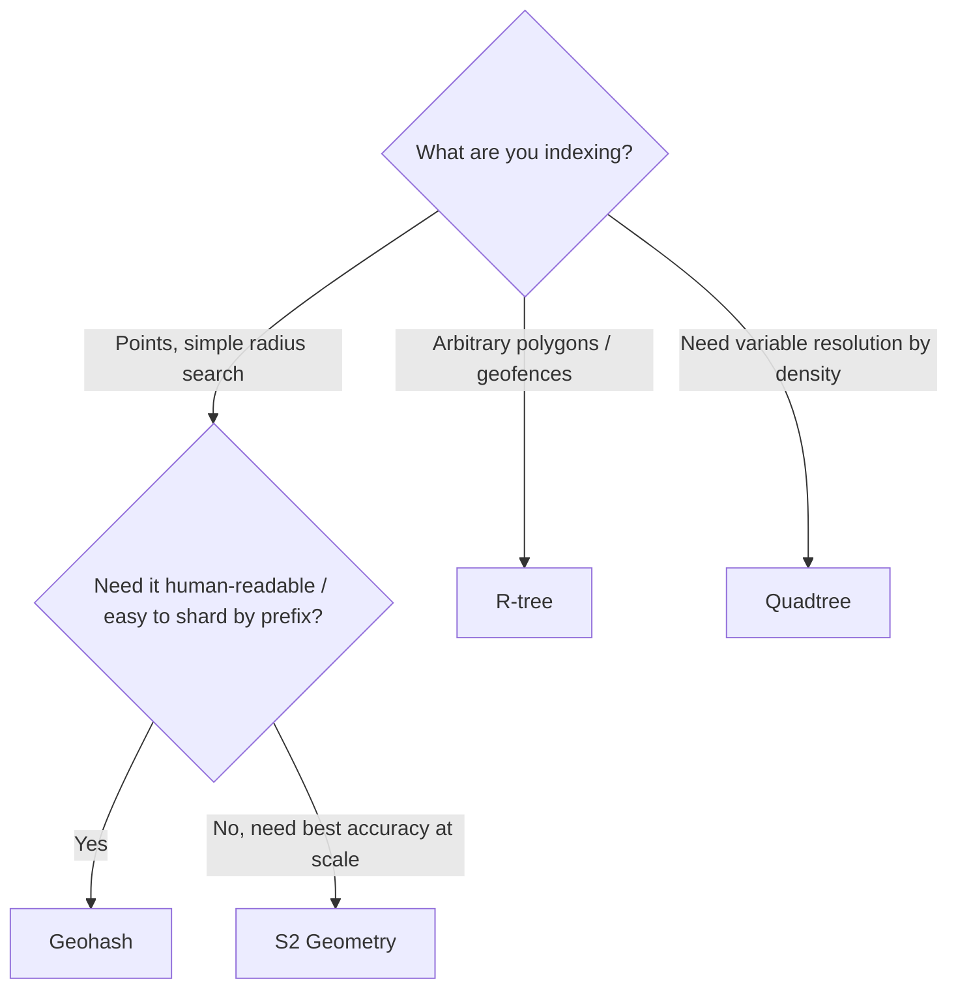

**Cheat-sheet**
- Geohash = simplest, shardable, but distorts near poles and has boundary discontinuity — always mention the neighbor-cell fix.
- Quadtree = adapts to density (fine cells in cities, coarse in deserts) — good verbal answer for "how do segments vary in size."
- S2 = what Google actually uses; near-equal-area cells on the sphere, Hilbert-curve locality means nearby cells have nearby IDs (great for range scans in Bigtable/Spanner).
- R-tree = for shapes, not points — geofencing, building footprints, delivery zones.
- Uber uses **H3** (hexagonal hierarchical index) as a fifth alternative worth name-dropping — hexagons have uniform neighbor distance (no diagonal-vs-adjacent distortion like squares).

---

## 8. Deep Dive: Road Network Graph & Segmentation

**Core problem:** a global road graph has billions of vertices/edges — you can't load it, can't traverse it, can't hold it in one server's memory.

**Solution: segments.** Divide the globe into small areas (e.g., 5×5 mile squares — really S2/quadtree cells in practice). Each segment:
- Has 4 boundary coordinates (or arbitrary polygon).
- Hosts its own small subgraph (intersections = vertices, roads = weighted edges: distance, time, traffic).
- Small enough to fit in one server's memory, be traversed and updated cheaply.

**Offline precomputation per segment:**
- Run Dijkstra (or better) between every pair of vertices *inside* the segment.
- Cache the shortest distance, time, and path for every vertex pair.
- Treat the segment's **exit points** (boundary edges connecting to neighboring segments) as special vertices, and also precompute shortest paths from every interior vertex to every exit point.

**Cross-segment routing (stitching):**
1. Compute the haversine (great-circle) aerial distance between source and destination.
2. Include only the segments within roughly that aerial radius (bounds the search space — you don't consider segments on the other side of the planet).
3. Build a *meta-graph* whose vertices are just the exit points of the included segments, and whose edges are the already-cached exit-point-to-exit-point distances.
4. Run the shortest-path algorithm on this much smaller meta-graph.

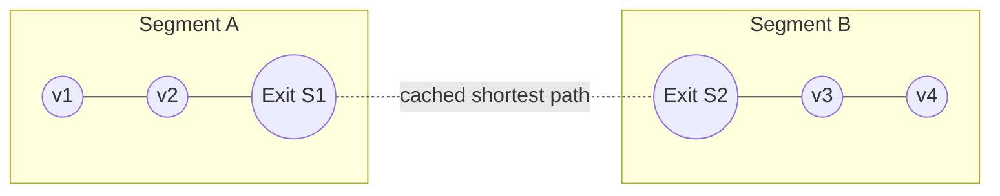

**Haversine formula (memorize the shape, not the derivation):**
```
a = sin²(Δlat/2) + cos(lat1)·cos(lat2)·sin²(Δlng/2)
c = 2·atan2(√a, √(1−a))
distance = R · c        (R = Earth radius ≈ 6,371 km)
```

### Storage schema
| Store | Contents |
|---|---|
| Key-value | segmentID, hosting serverID, boundary coordinates, list of neighboring segmentIDs |
| Graph DB | Per-segment road network graph (vertices=intersections, edges=roads with weights) |
| Relational DB | Per-edge congestion table: `edgeID, hourRange, rush(bool)` — is this edge typically congested at this hour |

IDs (`segID`, `serverID`, `edgeID`) come from a unique ID generator (Snowflake-style sequencer).

### Data schema (ER diagram)

Turns the storage table above into something you can actually draw on a whiteboard — this is the shape interviewers expect when they ask "what does a row look like?"

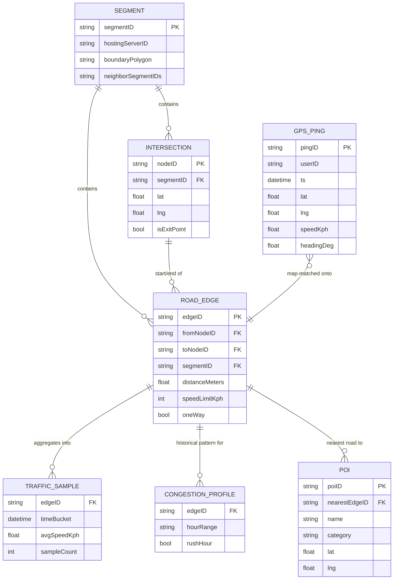

**Cheat-sheet**
- Segments turn an intractable global graph into hundreds of tractable local graphs.
- All expensive pairwise shortest-path computation happens **offline**; the user-facing path only ever touches cached results or a small stitching graph.
- Exit points are the trick that makes cross-segment routing cheap: they're precomputed vertices that "summarize" a whole segment down to a handful of numbers.
- Haversine bounds *which* segments you even consider — without it you'd have to guess a search radius.
- Non-uniform segment sizing (smaller in dense cities, larger in rural areas) is a scalability lever — mention it as an optimization.

---

## 9. Deep Dive: Routing Algorithms

| Algorithm | Precompute? | Query time | Handles live weights? | Real-world use |
|---|---|---|---|---|
| **Dijkstra** | None | Slow on large graphs (explores all directions) | Yes, trivially (just re-run) | Base case, used per-segment (small graph) |
| **A\*** | None (needs a heuristic, e.g. straight-line/haversine distance) | Faster than Dijkstra — heuristic biases search toward destination | Yes | Good middle ground, easy to explain in interview |
| **Contraction Hierarchies (CH)** | Heavy offline preprocessing: "contract" (shortcut) unimportant nodes, ranked by importance | Extremely fast (ms, planet-scale) | Poorly — live traffic changes break precomputed shortcuts; needs periodic re-contraction or a live-weight overlay | OSRM, real production routers |
| **ALT** (A* + Landmarks + Triangle inequality) | Precompute distances to a small set of landmark nodes | Faster than plain A*, easier to keep "live" than CH | Better than CH for dynamic weights | Research/production hybrid systems |

**Memory hook:** *"Dave Always Considers Landmarks"* → **D**ijkstra, **A\***, **C**ontraction Hierarchies, ALT (**L**andmarks).

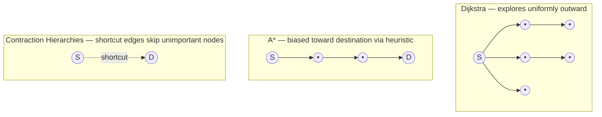

### Which to pick? (decision tree)

```mermaid
flowchart TD
    A{Graph size for this query?} -->|Small (single segment)| B[Dijkstra or A* — good enough, simple]
    A -->|Planet-scale meta-graph| C{Weights change often live?}
    C -->|Rarely, mostly static| D[Contraction Hierarchies — fastest]
    C -->|Frequently, need freshness| E[ALT or A* with live-weight overlay]
```

**Why the segment design sidesteps the hardest part of this debate:** because segments keep each subgraph small, plain **Dijkstra is genuinely good enough per-segment**, and CH-style precomputation is really what you're doing *at the exit-point/meta-graph level* — the exit-point cached distances *are* a lightweight contraction hierarchy in spirit. Say this explicitly in the interview — it shows you connected the two ideas instead of reciting them separately.

### Trace this: Raj's 6 PM rush-hour request

Raj is in Koramangala, Bangalore, and asks for directions to Kempegowda International Airport at 6:00 PM — peak rush hour. Hop by hop:

1. **Geocoding (~20 ms):** "Koramangala" and "Kempegowda Airport" resolve to lat/lng via Distributed Search — a reverse-index lookup, no graph traversal yet.
2. **Segment resolution (~5 ms):** Both coordinates map to S2 cells. Area Search asks the KV store which segment/server hosts each — Koramangala lands in `segment_482`, the airport in `segment_901`, ~40 km and several segments away.
3. **Bounding the search (~1 ms, no I/O):** Graph Processing computes the haversine distance (≈40 km) and includes only segments within that aerial radius — roughly 15–20 segments along the Bangalore-to-airport corridor, not all of Karnataka.
4. **Meta-graph stitch (~10–30 ms):** A meta-graph is built from just the *exit points* of those segments — a few hundred vertices. A* runs on it using precomputed exit-point-to-exit-point distances.
5. **Live traffic overlay (~5–10 ms):** Before finalizing weights, Graph Processing checks the live-traffic cache (fed by the pipeline in §11). Outer Ring Road segments show avg speed down from 45 km/h to 14 km/h — those edges' time-weight rises, and the algorithm may prefer a marginally longer but faster corridor via Hosur Road.
6. **Response assembly (~5 ms):** Path + turn-by-turn steps + ETA (distance/live-speed, not distance/speed-limit) return to Raj's phone.
7. **Total: ~1.5–2 sec end-to-end** — comfortably inside the 2–3 sec p99 target, because the only *online* work is a small meta-graph search plus a few cache reads; everything expensive (pairwise segment distances, exit-point distances) was already computed offline.

What's cached: the geocode, the segment→server mapping, the exit-point distances. What's always fresh: the live-traffic overlay, recomputed from the last few minutes of GPS pings.

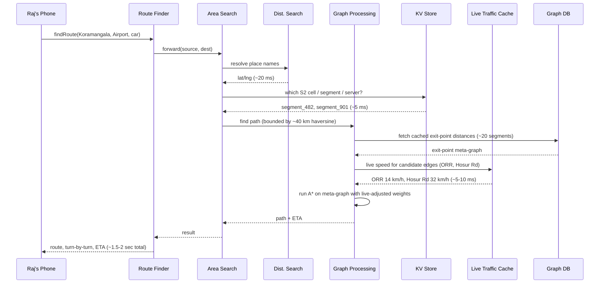

**Cheat-sheet**
- Dijkstra explores in all directions — correct but wasteful; fine on a small (segment) graph.
- A* = Dijkstra + a heuristic (usually haversine distance to goal) that biases the search — free upgrade, always mention it.
- Contraction Hierarchies = the industry-standard trick for planet-scale routing (used by OSRM); huge offline cost, near-instant queries, but stale under live traffic unless re-contracted or overlaid.
- ALT = a way to get CH-like speed while staying more tolerant of changing edge weights (better fit for traffic-aware routing).
- The segment + exit-point design *is* a hand-rolled contraction hierarchy — call that out to score architecture points.

---

## 10. Deep Dive: Map Tile Serving & Rendering

Maps aren't shipped as one giant image — they're a **tile pyramid**: the world is rendered at multiple zoom levels, each level split into fixed-size tiles (typically 256×256 px), addressed by `(zoom, x, y)`.

| Zoom level | Approx. meters/pixel | Typical use |
|---|---|---|
| 0 | ~156,543 m | Whole world |
| 5 | ~4,900 m | Continent |
| 10 | ~150 m | City |
| 15 | ~4.8 m | Streets |
| 18–20 | ~0.3–1.2 m | Building-level |

Formula: `meters/pixel ≈ 156,543 / 2^zoom` (at the equator).

### Raster vs Vector tiles

| | Raster tiles | Vector tiles |
|---|---|---|
| Format | Pre-rendered PNG/JPEG image | Geometry + style data (protobuf, e.g. Mapbox Vector Tile spec) |
| Size | Larger (~50–100 KB) | Smaller (~10–30 KB) |
| Client rendering cost | None (just display image) | Client GPU renders on the fly |
| Styling flexibility | Fixed at render time (need new tiles for dark mode, etc.) | Client can re-style instantly (day/night, labels language) — no server round-trip |
| Zoom smoothness | Discrete jumps between pre-rendered levels | Smooth continuous zoom (geometry scales) |
| CPU/battery cost | Server-heavy | Client-heavy |
| Bandwidth | Higher per tile, but simpler CDN caching | Lower per tile |

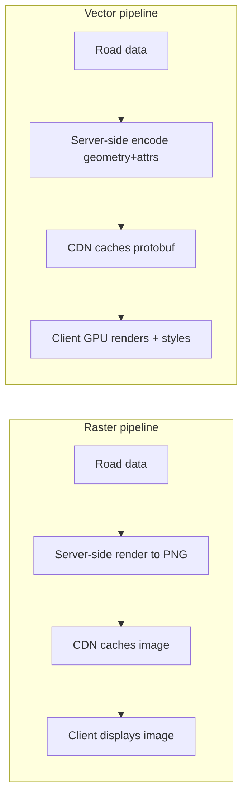

**CDN caching split** — since tiles are the dominant bandwidth cost (614 Gb/s theoretical in our estimate), cache-hit ratio is everything:

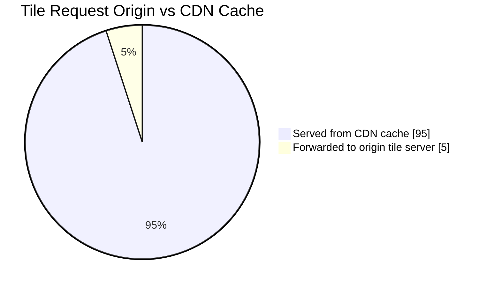

**Cheat-sheet**
- Tiles are addressed by `(zoom, x, y)` — same trick as segments/S2 cells: fixed-size partitions of the world at multiple resolutions.
- Modern Google/Apple/Mapbox Maps use vector tiles: smaller payload, instant re-styling (dark mode, language), smooth zoom — cost is shifted to client CPU/GPU.
- Raster tiles are simpler and cheaper to serve blindly but inflexible and heavier per request.
- CDN cache-hit ratio dominates your bandwidth bill — popular city tiles get near-100% hit rates; rural/rare zoom levels don't.
- Tile pyramid and geospatial segments are conceptually the same partitioning idea applied to rendering instead of routing.

---

## 11. Deep Dive: Real-Time Traffic Aggregation from GPS Pings

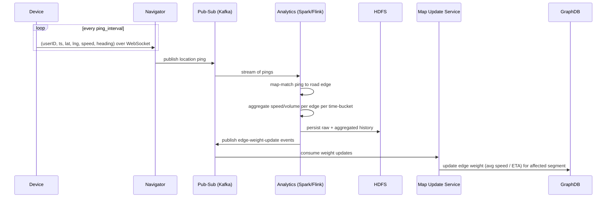

**Map matching** (a detail interviewers love): a raw GPS ping is noisy (±20 m) and doesn't say *which road* the device is on. Map matching snaps the ping onto the nearest plausible road edge using the road graph + heading + speed + previous pings (commonly a Hidden Markov Model over candidate edges). Without map matching, you can't attribute a ping to a specific edge to compute per-road congestion.

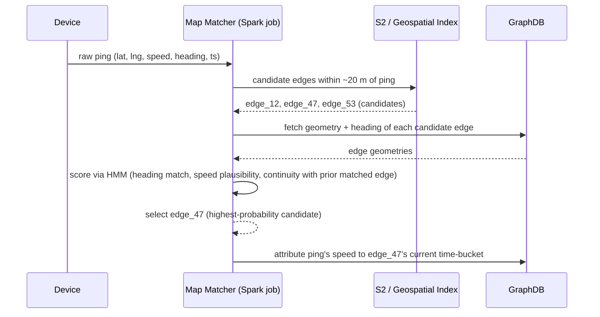

### Trace this: how Outer Ring Road's jam gets detected

At 6:02 PM, 8,000 concurrent devices are navigating Bangalore's Outer Ring Road corridor, each pinging every 5 sec (~1,600 pings/sec on this corridor alone). A ping from Priya's phone at (12.935, 77.625) is noisy — GPS puts her within ±20 m of three parallel candidate edges (main carriageway + two service roads). The map-matcher above uses her heading (92°, matching the main carriageway's bearing) and continuity with her previously matched edge to snap her onto `edge_ORR_1147`, not a service road.

Spark aggregates all ~1,600 pings/sec on this corridor into 1-minute time-buckets per edge. At 6:00 PM, `edge_ORR_1147`'s bucket shows avg speed 41 km/h (450 samples); by 6:05 PM it's down to 13 km/h (510 samples) — a >65% delta, well past the debounce threshold. That crosses the threshold check below, so Map Update Service pushes the new edge weight into Graph DB within roughly 30–60 sec of the slowdown starting. Any route query touching this edge after that point — like Raj's request in §9 — sees the updated 13 km/h weight; the raw pings also land in HDFS to feed tomorrow's historical-average update.

**Why WebSockets, not polling:** location updates are bidirectional and frequent; a persistent connection avoids repeated HTTP handshake overhead. The load balancer must distribute WebSocket connections across servers because each server has a max connection ceiling (design constraint you should state a number for, e.g., "50K sockets/server," and derive gateway server count from it — see estimation section).

**Debounce updates — don't recompute constantly:** transient conditions (a red light) shouldn't trigger a graph update. Only recompute/re-propagate an edge weight when it changes by more than a threshold percentage — this is a deliberate trade-off between freshness and system load.

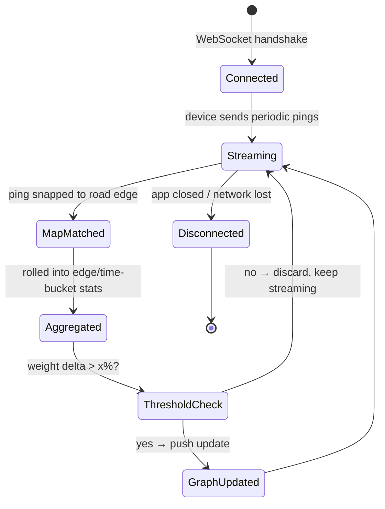

**Cheat-sheet**
- Pipeline: WebSocket ping → Kafka → stream analytics (map matching + aggregation) → HDFS (history) + edge-weight updates → graph DB.
- Map matching is required before a ping is useful for traffic — raw lat/lng isn't "which road."
- Debounce/threshold-based updates prevent transient noise (a stoplight) from causing constant graph churn — a named, deliberate trade-off (freshness vs system load).
- WebSocket connection ceiling per server directly drives your gateway-tier server count — always state the assumed ceiling.
- This whole pipeline runs off the user's request path — it only *feeds* the graph; it never blocks a route query.

---

## 12. Deep Dive: ETA Prediction

Naive ETA = distance / speed-limit. Reality needs:
- **Historical traffic patterns**: "highway X has heavy traffic 8–10 AM" (time-bucketed averages per edge).
- **Live traffic**: current aggregated speed per edge from the pipeline above.
- **Road/weather conditions**: construction, incidents — treated as *modifiers to average speed*, not as independent graph weights (the source material makes this exact call: traffic/weather aren't directly quantifiable as edge weights, so they're folded into the average-speed number instead).
- **Segment stitching error**: ETA across segments = sum of segment ETAs + exit-point transition; small errors compound over long trips, so periodic re-evaluation against live position matters.

**Practical modeling note (goes beyond the source, expected in a strong interview answer):** production systems (Google's published work with DeepMind) model ETA prediction as a **graph neural network** problem — treating the road segment graph itself as the model input so that congestion on one edge propagates predicted effects to neighboring edges, instead of scoring each edge independently. Worth a one-line mention as "how the industry evolved past pure historical averaging."

**Cheat-sheet**
- ETA = f(distance, historical speed pattern, live traffic, incident modifiers) — not a static distance/speed-limit divide.
- Traffic/weather are folded into *average speed*, not modeled as separate first-class edge weights — simpler and good enough.
- Recompute ETA when the underlying weight changes past a threshold, not on every tick.
- Advanced answer: graph neural networks let congestion propagate across neighboring edges instead of scoring roads independently (this is what Google actually ships).
- ETA accuracy degrades over long multi-segment trips — mention periodic re-evaluation against the user's live position as the mitigation.

---

## 13. Location Updates at Scale

- Persistent WebSocket connection per active device; load balancer shards connections across a fleet of gateway servers (bounded by per-server socket ceiling).
- Ping payload kept tiny (~100 bytes: userID, timestamp, lat, lng, speed, heading) — bandwidth scales linearly with concurrent navigators, not DAU.
- Pings fan out via Kafka to two consumers: (1) Navigator's own deviation-detection logic (has the user left the suggested path?), (2) the analytics pipeline (traffic aggregation, feeds back into the graph).
- **Lazy loading**: Google Maps only loads the map data (tiles, POIs) for the visible viewport, not the whole route or region — reduces initial load, saves bandwidth, and reduces server load per client. This is explicitly why "availability" holds up even at huge scale.

**Cheat-sheet**
- One WebSocket per active device; gateway tier sized by socket-ceiling-per-server, not by CPU.
- Ping payload is deliberately minimal — the design bets on high *volume*, low *per-message cost*.
- Same ping stream serves two masters: deviation detection (sync-ish, on Navigator) and traffic analytics (async, via Kafka/Spark) — don't couple them.
- Lazy-loading the viewport, not the world, is a direct availability lever — say this if asked "how does this stay available under load."

---

## 14. Key Design Decisions & Trade-offs

| Decision | Benefit | Cost / Trade-off |
|---|---|---|
| Segment the graph | Makes billions-of-nodes graph tractable; parallel processing | Cross-segment queries need stitching logic; segment boundary design is non-trivial |
| Precompute shortest paths offline (per segment + exit points) | Near-instant query time | Storage overhead; staleness until recomputation; recompute cost on graph edits |
| Cache aggressively (subpaths, tiles, exit distances) | Massive latency win | Cache invalidation complexity when live traffic/road changes |
| WebSocket for location | Real-time, low overhead vs polling | Server-side connection state, harder to load-balance/failover than stateless HTTP |
| Vector tiles over raster | Smaller payload, client-side restyle | Shifts CPU/battery cost to client devices, more complex client renderer |
| Fold traffic/weather into "average speed" instead of separate weights | Simpler model, good enough accuracy | Loses some nuance (can't reason about traffic and road-condition independently) |
| Threshold-based graph weight updates | Prevents update storms from transient conditions | Slightly stale ETA between threshold crossings — explicit accuracy/cost trade-off |
| S2/geohash/quadtree for spatial partitioning | Fast "which segment" lookups | Pick one: S2 (best accuracy, more complex) vs geohash (simplest, boundary issues) |
| Contraction Hierarchies-style precompute for planet-scale routing | Millisecond queries at huge scale | Poor fit for highly dynamic live-traffic weights without periodic re-contraction |

**Cheat-sheet**
- Every trade-off in this system is precompute-vs-freshness or bandwidth-vs-flexibility — frame your answers that way and you'll sound coherent.
- Naming the cost, not just the benefit, is the single biggest signal of seniority in this interview.
- If asked "what would you change with more time," a strong answer is always: non-uniform segment sizing, better cache-invalidation on traffic updates, replication for segment servers.

---

## 15. Bottlenecks & Failure Modes

| Failure mode | Why it happens | Mitigation |
|---|---|---|
| Single segment server is a hotspot (e.g., Manhattan at rush hour) | Uneven query density across geography | Replicate hot segments; non-uniform segment sizing (smaller segments in dense areas spreads load) |
| Segment server goes down | Any server is a SPOF for its segment | Replication; load balancer routes around dead replicas; fast segment reassignment via KV store |
| Key-value store overloaded (it's on *every* request's path) | It resolves segment→server for every single query | Horizontally shard/replicate the KV store; cache segment→server mapping at the graph-processing layer |
| Stale traffic data after a real incident | Threshold-based updates intentionally delay small changes | Prioritize/fast-path large weight deltas (accidents, closures) around the debounce threshold |
| GPS ping storm overwhelms Kafka/analytics | Rush hour = simultaneous spike in concurrent navigators | Partition Kafka topics by geography; autoscale consumer groups; backpressure/sampling under extreme load |
| Cross-segment route near many segment boundaries (dense urban grid) | Query touches many segments' exit points at once | Bound search radius via haversine distance; cap number of included segments |
| Tile origin overload during CDN cache miss storm (new region, map update) | Cold cache after data refresh | Pre-warm CDN caches on known-popular tiles after each map data push |
| Recomputation cost after bulk road-data edits | Every affected segment's offline precompute must rerun | Recompute asynchronously, incrementally, segment-by-segment — never block live traffic on this |

**Cheat-sheet**
- The KV store (segment→server mapping) is the most dangerous single point of contention — it's on every request, unlike the graph DB which is only touched per-segment.
- Hot geography (dense cities) needs non-uniform segment sizing + replication, not just "add more servers."
- Debounce thresholds trade freshness for stability — but should have a fast-path exception for large deltas (accidents/closures).
- Design for graceful degradation: serve a slightly stale ETA/route rather than fail the request outright.

---

## 16. Production Readiness: Rate Limiting, Security, Monitoring, Multi-Region & Offline

### Rate limiting & abuse prevention
- **API key + token bucket** per client — e.g. ~100 req/min for third-party API consumers, a higher/unmetered quota for the first-party mobile app. Protects Route Finder/Graph Processing from scraping or retry storms; return 429 + `Retry-After` on burst.
- **Per-device ping rate cap** on the ingestion path — a device flooding pings (buggy or malicious client) shouldn't get outsized weight in traffic aggregation; cap accepted pings/sec/device before they ever reach Kafka.

### Spoofed / abusive GPS handling
- **Plausibility filter before map matching:** reject a ping if the implied speed since the last ping is physically impossible (e.g., >300 km/h) — cheap check, kills GPS spoofing/teleporting bots before they pollute traffic stats.
- **Corroboration, not single-source trust:** an edge's live speed is an aggregate over many independent devices per time-bucket, so one spoofed or outlier device barely moves the average — a side benefit of the aggregation design, worth naming explicitly as your anti-abuse story.
- **Real-world parallel:** Waze has documented "ghost traffic jam" griefing (fake reports/pings fabricating congestion) — plausibility filters + corroboration are the standard mitigation.

**Memory hook:** *"Throttle the key, trust no single ping, believe the crowd"* → API throttling, plausibility filter, multi-device corroboration.

### Monitoring & SLOs
| Metric | Target | Why it matters |
|---|---|---|
| Route calc latency (p50/p99) | p99 < 2–3 sec | Direct UX/NFR target (§4) |
| Traffic-freshness lag (ping → graph weight update) | < 60 sec | Stale traffic data = wrong ETA during real incidents |
| GPS ping ingestion consumer lag (Kafka) | near-zero, alert on growth | Growing lag = traffic data silently going stale |
| Tile serving error rate / CDN miss rate | <1% errors, >95% cache hit | Origin overload risk (§15) |
| KV store (segment→server) p99 latency | single-digit ms | On every request's path — the most dangerous SPOF (§15) |
| WebSocket connect success rate | >99.9% | Gateway-tier health; feeds both navigation and traffic pipeline |

If you can only watch four dashboards in the interview room, say these four: **route p99, traffic-freshness lag, KV-store latency, ping consumer lag.**

### Multi-region & disaster recovery
- Segments are geography, so they're **naturally regional** — a route query confined to one continent never crosses a region boundary; no cross-region synchronous dependency on the hot path.
- Rare cross-region trips stitch through the same exit-point meta-graph mechanism (§8), just spanning a region boundary instead of a segment boundary — same trick, one level up.
- Each region replicates its segment/graph data across ≥3 AZs; the KV store (segment→server mapping) is small and read-heavy, so replicate it **globally** — a region can fail over routing to another region's replica during a regional outage.
- The live-traffic pipeline (Kafka/Spark/HDFS) stays regional and is *not* cross-region replicated — losing a region loses only that region's traffic freshness. Routing degrades to historical-average weights, not a hard failure (Golden Rule 8).

**Memory hook:** *"Regional by default, global only where it's cheap"* → segments/graph/telemetry stay regional; only the small, read-heavy KV mapping goes global.

### Offline maps & low connectivity
- Client pre-downloads a bounded region's vector tiles + a compact routing graph (topology only — nodes/edges, no live-traffic overlay) for offline use.
- Offline routing reuses the *same* segment/exit-point algorithm — the only missing input is the live-traffic weight source, so ETAs fall back to historical averages, not a different code path.
- Deltas (new roads, closures) sync opportunistically when connectivity returns; the offline package is versioned so the client knows how stale it is.

**Cheat-sheet**
- Rate-limit both directions: incoming route requests (API abuse) and incoming GPS pings (traffic-data poisoning).
- Spoofed-GPS defense is two-layered: reject the physically impossible, then dilute the merely-suspicious via aggregation across many devices.
- Four SLOs that matter most: route p99, traffic-freshness lag, KV-store latency, ping consumer lag.
- DR story: segments/graph are regional (no cross-region hot-path dependency); only the small KV mapping replicates globally.
- Offline mode = same algorithm, degraded weight source (historical instead of live) — never a different design.

---

## 17. Real-World References — How Google Maps Actually Solved It

- **S2 Geometry Library**: Google's actual spherical-geometry indexing library — projects the sphere onto a cube, indexes cells via a Hilbert curve for locality. Used across Google infra (Maps, Bigtable geo-range-scans) — this is the real answer to "how does Google do geospatial indexing," not geohash.
- **Bigtable/Spanner-backed storage**: road network and metadata are stored in Google's own distributed databases, leveraging S2-cell IDs as (part of) the row key so that geographically nearby data is stored physically close — turns "find nearby data" into a cheap range scan.
- **Contraction Hierarchies-style routing** is the industry-standard technique for planet-scale route queries; the open-source **OSRM** (Open Source Routing Machine) project is a well-known public implementation interviewers may reference.
- **Traffic prediction with Graph Neural Networks**: Google published work (with DeepMind, ~2020–2021) modeling ETA prediction as a graph problem — treating road segments and their neighbors jointly rather than scoring edges independently — deployed into Google Maps' live ETA and used to materially cut prediction error versus historical-average baselines.
- **Waze integration**: Google acquired Waze and uses crowdsourced, driver-reported incident data (accidents, hazards, police, road closures) as an additional live-signal input layered on top of GPS-ping-derived traffic — a fast-path signal that doesn't wait for the debounce/aggregation pipeline.
- **Uber's H3** (hexagonal hierarchical spatial index) is a widely cited alternative to S2/geohash worth naming as "the other real production geospatial index" — hexagons give uniform neighbor-to-neighbor distance, useful for surge-pricing/dispatch-style problems more than for routing itself.
- **Lazy/tiled loading**: Maps clients only fetch tiles/data for the visible viewport at the current zoom, consistent with the tile-pyramid design — this is a genuine, documented Google Maps performance practice, not just a course simplification.

**Cheat-sheet**
- If asked "what does Google actually use for spatial indexing," the strong answer is **S2**, not geohash.
- If asked about routing at planet scale, **Contraction Hierarchies** (or CH-like exit-point precomputation) is the real-world technique, and **OSRM** is a citable open-source example.
- If asked about ETA accuracy, mention **Graph Neural Networks** (Google + DeepMind) as the state-of-the-art evolution beyond historical averages.
- Waze acquisition = real-world proof that crowdsourced/human-reported signals matter alongside passive GPS telemetry.

---

## 18. Golden Rules

1. Never run a shortest-path algorithm over the whole planet graph — partition first (segments/tiles/cells), route second.
2. Precompute everything computable offline; the user's critical path should only ever touch cached results or a small stitching problem.
3. Treat location pings as a stream, not a request-response call — pub/sub, not synchronous writes, and never block navigation on analytics.
4. ETA is a distribution shaped by historical + live data, not a static distance/speed division — and it must be periodically re-grounded against reality on long trips.
5. Static geodata (road network) and live telemetry (GPS pings, traffic) are different systems with different scaling stories — don't design them as one blob.
6. Every geospatial index trades precision, locality, and simplicity against each other — pick based on the query shape (radius vs polygon vs planet-scale range scan), not habit.
7. Cache aggressively at every layer (tiles, subpaths, exit-point distances) — recomputation cost is almost always worse than storage cost.
8. Design for graceful degradation: a stale ETA beats no ETA; a last-known position beats a frozen map.
9. Rate-limit both directions and never trust a single GPS ping — throttle the API, cap ping rates, corroborate across devices before letting one report move an edge's weight.

### Mind map recap

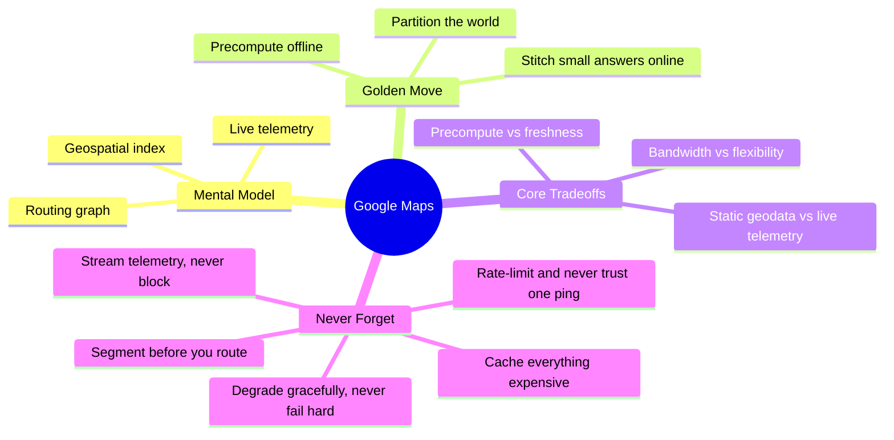

---

## 19. Master Cheat Sheet

**One-liner:** Maps = partition the world (segments/tiles/cells) → precompute shortest paths & render tiles offline → stitch small cached answers together on the user's request path, while a separate async pipeline (WebSocket → Kafka → Spark) turns live GPS pings into updated traffic weights and refreshed ETAs.

**Formulas**
```
servers            = DAU / requests_per_server_per_sec
bandwidth           = requests_per_sec × payload_size
GPS_ping_QPS        = concurrent_navigators / ping_interval_sec
tile_QPS            = concurrent_viewers × tiles_per_viewport / refresh_interval_sec
origin_tile_BW      = tile_QPS × tile_size × (1 − CDN_hit_ratio)
haversine_distance  = R · 2·atan2(√a, √(1−a)),  a = sin²(Δlat/2)+cos(lat1)cos(lat2)sin²(Δlng/2)
meters_per_pixel    ≈ 156,543 / 2^zoom   (equator)
```

**Numbers worth memorizing**
| Fact | Value |
|---|---|
| Earth radius (haversine) | ~6,371 km |
| Earth circumference | ~40,075 km |
| GPS accuracy | ~20 m |
| Cell tower accuracy | up to a few thousand m |
| Zoom 0 tile | whole world, ~156 km/pixel |
| Zoom 15 tile | streets, ~4.8 m/pixel |
| Vector tile size | ~10–30 KB |
| Raster tile size | ~50–100 KB |
| Google Maps road data storage (2022) | 20+ PB, one-time/bulk |
| Route response p99 target | 2–3 sec |
| CDN cache-hit target | ~95%+ |
| WebSocket connections/server (assume) | ~50K |
| API rate limit (assume, 3rd-party key) | ~100 req/min |
| Traffic-freshness SLO (ping → graph update) | < 60 sec |
| GPS plausibility cap | reject if implied speed >300 km/h |

**Comparison tables to recall cold:** Geohash vs Quadtree vs S2 vs R-tree (§7); Dijkstra vs A* vs Contraction Hierarchies vs ALT (§9); Raster vs Vector tiles (§10).

**Mnemonics**
- Geospatial indexes: *"Great Quality Systems Rock"* → Geohash, Quadtree, S2, R-tree.
- Routing algorithms: *"Dave Always Considers Landmarks"* → Dijkstra, A*, Contraction Hierarchies, ALT.
- Core services: *"Find it, Route it, Watch it"* → Search/Location, Route/Area/Graph, Navigator.
- Abuse defense: *"Throttle the key, trust no single ping, believe the crowd"* → API throttling, plausibility filter, corroboration.
- Multi-region: *"Regional by default, global only where it's cheap"* → segments/graph/telemetry regional, KV mapping global.

**Golden rules recap:** partition before routing · precompute offline · stream, don't request-response, telemetry · ETA is a distribution, re-ground it · separate static geodata from live telemetry scaling · pick spatial index by query shape · cache everything expensive · degrade gracefully, never fail hard · rate-limit both directions and never trust one GPS ping.

**If the interviewer only remembers one thing about your answer:** you segmented the graph, precomputed exit-point distances offline (a hand-rolled contraction hierarchy), and kept live traffic as an asynchronous side pipeline that never blocks a route request.
