# Design a Proximity Service (Yelp / Nearby Places) — FAANG Interview Guide

## 0. Mental Model

Yelp is "search, but the primary filter is geometry, not keywords." Every proximity system (Yelp, Uber driver-matching, Tinder nearby, Pokemon Go, food-delivery restaurant lists) reduces to one question:

> **Given a point (lat, lng) and a radius/K, which of N objects on Earth are closest, fast, without scanning all N?**

The trick is always the same three-step recipe:

1. **Collapse 2D space into a smaller search space** (geohash string, quadtree node, grid cell, R-tree bounding box).
2. **Index that smaller space** so a point → candidate-set lookup is O(log N) or O(1), not O(N).
3. **Rank candidates by real distance** (haversine) + business logic (rating, relevance) only on the small candidate set, never on the whole dataset.

Analogy: it's like finding a book in a library. You don't scan every shelf (O(N) scan). You use the Dewey Decimal number (spatial index) to jump to the right aisle (candidate region), then read the 20 spines on that shelf (haversine + rank) to find the exact book.

**Interview cue phrases that mean "this is a proximity problem":** "nearby restaurants," "find drivers near me," "people near you," "show pins on a map within X km," "nearest warehouse/hospital/ATM," "geofencing," "check-in feed sorted by distance." All of these want the same architecture.

---

## 1. Interview Playbook

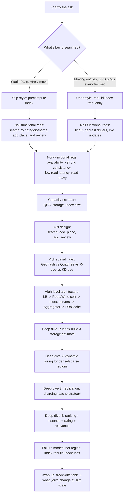

**Cheat-sheet:**
- Always ask: are entities static (places) or moving (drivers/riders)? This single answer decides your whole index refresh strategy.
- State the non-functional priority explicitly: **availability + low latency > strong consistency** for search; write path (reviews/ratings) can be eventually consistent.
- Don't jump to QuadTree immediately — walk the interviewer through the naive approach (DB range query) → why it fails → grid → dynamic grid → tree. Shows reasoning, not memorized answer.
- Budget time: ~5 min requirements, ~5 min estimation, ~10 min API/schema, ~20 min deep dive on indexing, ~10 min bottlenecks/trade-offs.

---

## 2. Requirements Clarification

### Functional Requirements
- **Search nearby**: given `(lat, lng, radius)` and optional `category` or `name`, return matching places.
- **View place details**: name, address, category, rating, photos.
- **Add a place** (business owner onboarding): name, description, category, lat/lng, photos.
- **Add a review**: text, photo(s), rating (1–5 stars) tied to a place + user.
- **(Extension you should propose)**: autocomplete/typeahead, filters (open now, price range), sort by distance vs. rating vs. relevance.

### Non-Functional Requirements
| Requirement | Target | Why |
|---|---|---|
| Availability | > Consistency (AP over CP) | Stale place data (wrong hours) is tolerable; downtime is not. |
| Latency | p99 search < 200–300 ms | Users expect map results near-instantly. |
| Scalability | Elastic — lunchtime/tourist-season spikes | Load isn't uniform in time or geography. |
| Consistency | Eventual for reads (ratings, photos); need reasonably fresh writes | New review need not appear instantly to every reader. |
| Read:Write ratio | Extremely read-heavy (est. 100:1+) | Millions search, few thousand add/edit places daily. |

**Mnemonic — "SLAC"**: **S**calability, **L**atency, **A**vailability, **C**onsistency (relaxed) — the four NFRs to recite in order.

### Interview Cheat-Sheet
- Say out loud: "This is read-heavy, so I'll optimize the read path aggressively and can afford eventual consistency on writes."
- Explicitly separate **place data** (name/address/category — changes rarely) from **dynamic data** (ratings/reviews/photos — changes more, but still not real-time-critical) from **search index** (needs periodic rebuild, not per-write mutation, for Yelp; needs near-real-time mutation for Uber).
- Call out both "search by geo-radius" and "search by name" as two different code paths (spatial index vs. traditional inverted/text index) — don't conflate them.

---

## 3. Capacity Estimation (Worked Example)

### Assumptions (matches source, industry-typical)
- 178M total users, 60M DAU, 500M places, 20% YoY place growth.
- 1M reviews/day. 5 new places/day. 1 photo/place average, 3 MB/photo.
- RPS-per-server ≈ 8,000 (standard interview constant for a well-tuned stateless server).

### Formula chain

```
1. QPS (read)      = DAU * avg_searches_per_user_per_day / 86,400
2. Servers needed   = DAU / RPS_per_server              (rough capacity heuristic)
3. Storage           = Σ (entity_row_size * entity_count)
4. Index size        = spatial_index_nodes * bytes_per_node
5. Bandwidth in      = (writes/day * avg_write_payload_size) / 86,400
6. Bandwidth out     = (searches/day * results_per_search * avg_result_payload) / 86,400
```

### Worked numbers (from the course, sanity-checked)

**Servers:**
```
60,000,000 DAU / 8,000 RPS per server ≈ 7,500 application servers
```

**Storage (row sizes derived from schema, see §5):**
| Entity | Row size | Count | Total |
|---|---|---|---|
| Place | 1,296 B | 500M | 648 GB |
| Photo (metadata only) | 280 B | 500M | 140 GB |
| Review | 537 B | 1M/day (accum.) | 0.54 GB/day |
| User | 264 B | 178M | 46.99 GB |
| **Total (steady state)** | | | **~835.5 GB** |

Note: actual photo *blobs* (3 MB each) live in blob storage (S3/GCS/Blob Store), not the DB — 500M × 3MB ≈ 1.5 PB separately, growing daily.

**Bandwidth:**
- Incoming (writes: 5 places/day + 1M reviews/day + photo uploads) ≈ **51 Kbps** (metadata only; photo upload traffic is separate/async).
- Outgoing (60M DAU × 20 results/search × (1,296 B place + 3 MB photo)) ≈ **331 Gbps** — dominated entirely by photo egress. **This tells you: put a CDN in front of photos immediately, or this number doesn't survive contact with production.**

**Spatial index storage (QuadTree, see §6):**
```
Per place stored in leaf node: (PlaceID + lat + lng) = 8+8+8 = 24 bytes
500M places * 24 B = 12 GB  (raw place data in tree)
Leaf capacity = 500 places/node → 500M / 500 = 1M leaf nodes
Internal nodes ≈ 1/3 of leaf count = ~333K nodes, 4 child pointers * 8B = 32B/node
Internal node storage = 1M * 1/3 * 4 * 8 = 10.67 MB
Total QuadTree size ≈ 12 GB + 10.67 MB ≈ 12.01 GB   → fits on ONE server (or replica set)
```

That "fits on one server" number is the single most important sentence in this whole design — it's *why* Yelp-scale proximity search doesn't need exotic distributed-tree machinery: replicate the whole tree, don't shard it (see §8).

**Segment/grid storage (static-grid alternative, see §6):**
```
Earth land area ≈ 60M sq. miles, radius = 10 mi → segment ≈ (2*10)^2 = 400 sq mi
Segments ≈ 60,000,000 / ~10 (radius-derived cell) ≈ 6M segments
Segment_ID (8B) + Place_ID (8B) per place-in-segment mapping, 500M places
Total ≈ 6M * 8B (segment keys) + 500M * 8B (place refs) ≈ 4.048 TB
```
Contrast: static grid ≈ 4 TB vs. QuadTree ≈ 12 GB. This 300x gap is exactly why dynamic/tree-based indexing wins — a uniform grid wastes enormous space on sparse cells (ocean, desert) while a tree adapts depth to density.

### Numbers Worth Memorizing
| Metric | Value |
|---|---|
| RPS per server (generic heuristic) | 8,000 |
| Read:Write ratio for POI search apps | ~100:1 to 1000:1 |
| Geohash length 6 → cell size | ~1.2 km × 0.6 km |
| Geohash length 7 → cell size | ~150 m × 150 m |
| Geohash length 8 → cell size | ~38 m × 19 m |
| Earth surface area | ~510M km² (196M sq mi) |
| Earth land area | ~148M km² (60M sq mi, per course) |
| Typical QuadTree leaf capacity | 100–500 points/node |
| Acceptable p99 search latency | 100–300 ms |
| Photo/image size assumption | 2–5 MB (uncompressed upload) |

### Interview Cheat-Sheet
- Always separate metadata storage (DB rows) from blob storage (photos) — mixing them inflates your DB storage estimate absurdly.
- State the punchline explicitly: "the spatial index for 500M places fits in ~12 GB — small enough to replicate fully on every search node; we don't need to shard the tree itself."
- Bandwidth-out from photos will dwarf everything else — call it out and immediately propose a CDN + thumbnail strategy.
- Show your formula, plug in numbers live, don't just state a memorized final answer — interviewers score the method.

---

## 4. High-Level Design

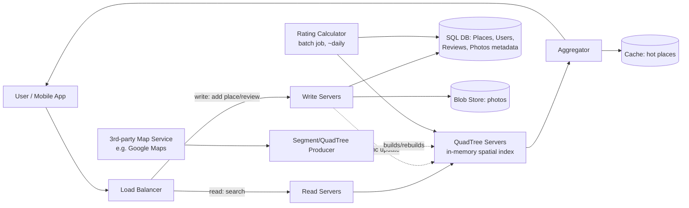

### Components
| Component | Responsibility |
|---|---|
| Load Balancer | Splits read vs write traffic; routes by consistent hashing where needed. |
| Read Servers | Stateless; forward geo-queries to QuadTree servers, merge/return results. |
| Write Servers | Handle add-place/add-review; write to SQL + blob store; trigger async index update. |
| QuadTree Servers | In-memory spatial index (or geohash/grid); the core "find candidates in radius" engine. |
| Aggregator | Merges results from possibly multiple QuadTree shards/neighbors, applies final ranking, truncates to top-K. |
| SQL Database | Source of truth: Place, Photos, Reviews, Users tables (relational, needs joins & consistency). |
| Key-Value Store | Segment/QuadTree persistence (rebuild capability), place ID → server mapping for sharding. |
| Blob Storage | Actual photo bytes; fronted by CDN. |
| Cache | Hot/popular places (LRU) to shave DB & tree lookups for tourist hotspots, viral places. |
| Segment/Tree Producer | Offline/periodic job: ingests map data, rebuilds segments/QuadTree (Yelp: monthly, since places rarely move). |
| Rating Calculator | Batch job (daily) recomputing aggregate ratings — avoided doing this on every review write (too hot a path). |

### Sequence: Nearby Search Request

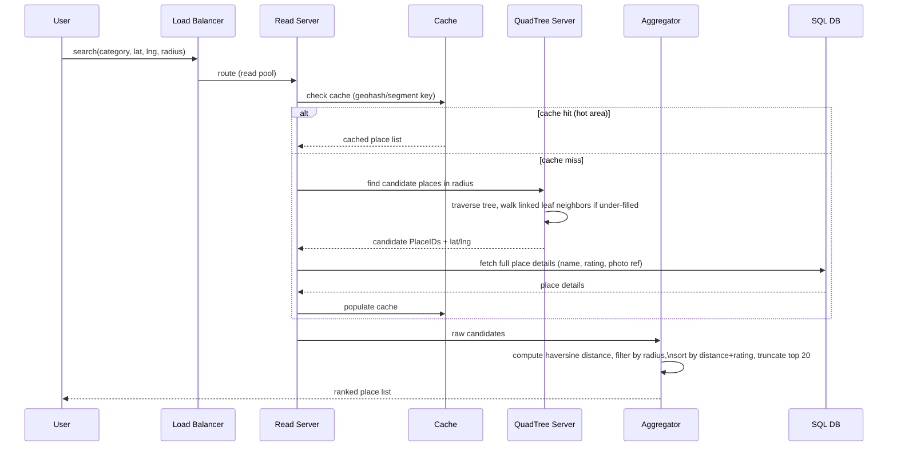

### Sequence: Add Place / Add Review (Write Path)

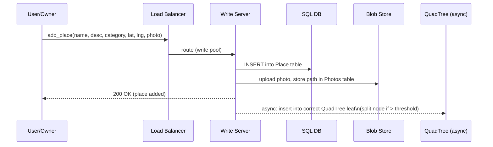

### Sequence: Business Moves / Updates Location

A subtly different write path — the index never "moves" an entry, it deletes from the old leaf and inserts into a new one:

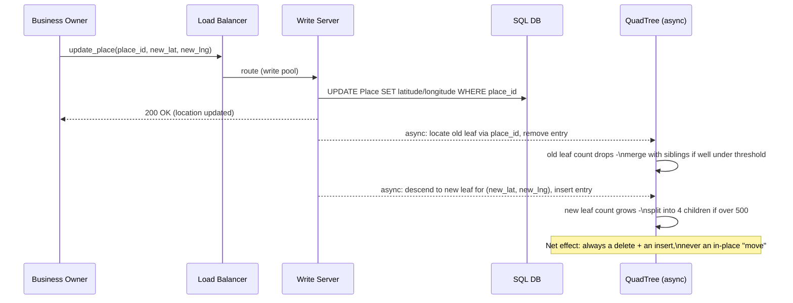

### Interview Cheat-Sheet
- Explicitly separate read and write server pools — read-heavy workload is the whole reason this split exists.
- Cache sits in front of the QuadTree lookup, keyed by segment/geohash — not per exact query (exact-lat-lng cache keys almost never hit twice).
- The index update from write path is **async** — new places don't need to be searchable within milliseconds; eventual consistency is fine and expected.
- Rating recomputation is a **batch/offline job**, not synchronous with each review — say this explicitly, it signals you understand hot-path protection.

---

## 5. Storage Schema

```
Place(Place_ID PK [8B], Name [256B], Description [1000B], Category [8B],
      Latitude [8B], Longitude [8B], Photos_FK [8B], Rating [computed])
      → row ≈ 1,296 bytes

Photos(Photo_ID PK [8B], Place_ID FK [8B], Photo_path [256B])
      → row ≈ 280 bytes

Reviews(Review_ID PK [8B], Place_ID FK [8B], User_ID FK [8B],
        Review_description [512B], Rating [1B])
      → row ≈ 537 bytes

Users(User_ID PK [8B], User_name [256B])
      → row ≈ 264 bytes
```

- IDs generated via a **unique ID generator / sequencer** (Snowflake-style) — 64-bit, sortable, no coordination bottleneck.
- Photos store only a **path/reference**; actual bytes live in blob storage — never put binary blobs in a relational row.
- SQL chosen over NoSQL here specifically because: relational queries needed ("places a user reviewed," "all reviews for a place"), and consistency across Users/Places/Reviews matters more than write throughput for this entity data.

### 5.1 Entity-Relationship Diagram

`GEO_INDEX_LEAF` isn't a SQL table — it's the in-memory QuadTree leaf metadata, persisted to the KV store for rebuild — included here to make the "which place lives in which leaf" relationship concrete.

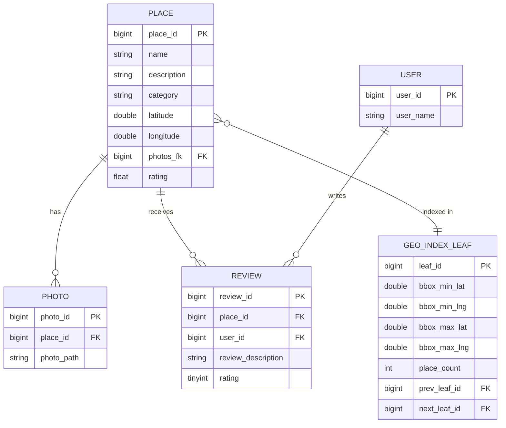

`prev_leaf_id`/`next_leaf_id` are the doubly-linked-leaf pointers from §6.4 — the thing that makes neighbor traversal O(1) instead of a re-descend from root.

### Interview Cheat-Sheet
- Justify SQL vs NoSQL per-table, don't default to "NoSQL because scale." Relational integrity between User/Place/Review is a legitimate reason for SQL here.
- Mention ID generation strategy (Snowflake/sequencer) — a detail interviewers probe if you skip it.
- Separate metadata (DB) from bytes (blob store) as a hard rule for any media-bearing entity.

---

## 6. Deep Dive: Spatial Indexing (the heart of the interview)

### 6.1 The naive approach (start here, then motivate the rest)

`SELECT * FROM Place WHERE lat BETWEEN ? AND ? AND lng BETWEEN ? AND ?` — a bounding-box scan on a B-tree index over lat, then lng separately. **Problem**: a B-tree on a single column can't efficiently intersect two range predicates at once; DB ends up scanning one dimension's range fully then filtering the other in memory. At 500M rows this is too slow. This motivates a *spatial* index.

### 6.2 The four real options

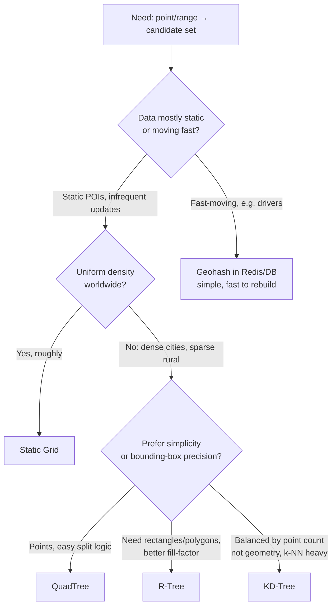

| Structure | How it works | Best for | Weakness |
|---|---|---|---|
| **Geohash** | Interleave lat/lng bits → base32 string; prefix = region. Store in sorted DB index or Redis sorted set. | Simple infra, works natively in Redis (`GEOADD`/`GEOSEARCH`), MongoDB, Postgres, Elasticsearch. | Edge/boundary problem (nearby points can have very different prefixes near cell edges); fixed cell size unless you vary precision manually. |
| **Static Grid** | Divide world into fixed-size cells (e.g., 5×5 mi); each cell stores its place list. | Trivial to implement/reason about. | Dense cities → huge lists per cell (slow scan); sparse regions waste storage/lookups. This is the "uneven distribution" problem the course explicitly calls out. |
| **QuadTree** | Recursive 4-way split of a 2D region only where point count exceeds threshold (dynamic grid). Leaf nodes linked (doubly linked list) for neighbor traversal when a leaf underflows results. | Yelp/POI search: static-ish data, need adaptive density handling, simple in-memory rebuild. | Rebuild cost on mass insert; not ideal for constantly-moving points (rebuild storms). |
| **R-Tree** | Groups nearby objects into minimum bounding rectangles (MBRs), hierarchically, balanced like a B-tree. | Polygon/region queries (e.g. "delivery zone boundaries"), PostGIS/MySQL spatial default. | More complex insert/rebalance logic than QuadTree; overlapping MBRs can slow queries. |
| **KD-Tree** | Binary tree splitting alternately on x then y axis at median. | In-memory k-NN search over a fixed point set (e.g., nearest-driver at a snapshot in time). | Poor for dynamic insert/delete — degrades to unbalanced tree, needs periodic full rebuild; not disk-friendly. |

**Mnemonic — "GRQK"**: **G**eohash (string trick, Redis-native) → **R**-tree (rectangles, PostGIS) → **Q**uadTree (adaptive squares, Yelp's pick) → **K**D-tree (k-NN snapshot, good for in-memory one-shot ranking). Pick based on: *do you need strings-in-a-DB-index (Geohash), regions/polygons (R-tree), adaptive point density (QuadTree), or pure in-memory k-NN (KD-tree)?*

### 6.3 Why the course picks QuadTree for Yelp specifically

- Places barely move (a restaurant doesn't relocate hourly) → rebuild cost is amortized (rebuilt **monthly**).
- Density is wildly uneven (Manhattan vs. rural Montana) → dynamic splitting (max 500 places/node, split into 4 children on overflow) solves this cleanly, unlike a static grid.
- Whole tree fits in ~12 GB (see §3) → trivially replicable in-memory on every search server; no need for complex distributed tree sharding.
- Leaf nodes double-linked → cheap "expand search to neighbors" when a leaf has too few results (walk left/right without re-descending from root).

### 6.4 QuadTree lifecycle

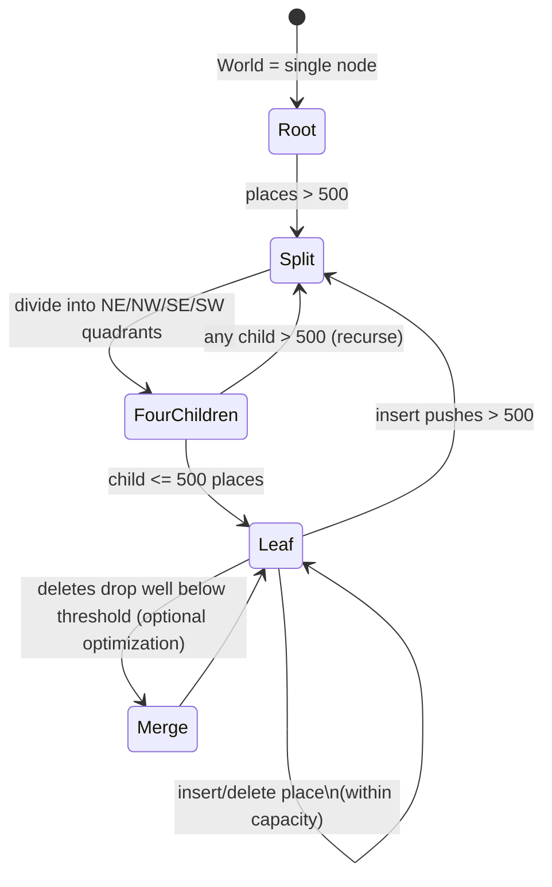

### 6.5 Search-using-QuadTree walkthrough

1. Start at root, descend toward the segment containing the user's `(lat, lng)`.
2. At the leaf, collect places; if count ≥ requested K (e.g. 20), stop.
3. If leaf has too few, walk the **doubly-linked list** to sibling leaves outward until radius exhausted or K satisfied.
4. Send candidate PlaceIDs to Aggregator → fetch full details from DB/cache → compute haversine distance → sort → truncate.

### 6.6 Disambiguation: Geohash vs QuadTree vs R-Tree vs KD-Tree

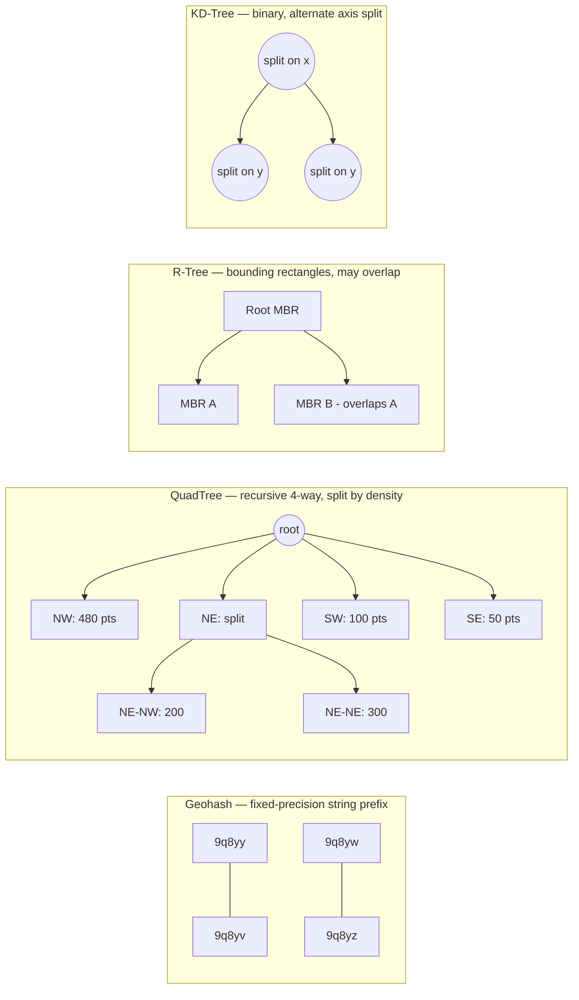

| Dimension | Geohash | Static Grid | QuadTree | R-Tree | KD-Tree |
|---|---|---|---|---|---|
| Data structure | String prefix / hash | Fixed 2D array | 4-ary tree | Balanced n-ary tree of MBRs | Binary tree |
| Adapts to density | Only via manual precision choice | No | Yes (native) | Yes (native) | Yes, but degrades on updates |
| Native DB support | Redis, Postgres, Elasticsearch, DynamoDB (via libraries) | Roll your own | Roll your own (or use S2/H3) | PostGIS, MySQL SPATIAL, MongoDB | Roll your own / SciPy, not DB-native |
| Update cost | O(1) reinsert | O(1) | O(log N), occasional split cascade | O(log N), occasional rebalance | Expensive — near-full rebuild |
| Best query shape | Point radius via prefix match | Point radius | Point radius, point k-NN | Range/polygon, region overlap | Point k-NN (static snapshot) |
| Typical real use | Uber H3, Redis GEO, Mongo geohash index | Naive prototypes | Yelp (per this course), Google Maps segments | PostGIS, spatial DBs, delivery zones | In-memory ML/geometry libraries |

### 6.7 Disambiguation: Static Grid vs Dynamic Grid (QuadTree)

| | Static Grid | Dynamic Grid (QuadTree) |
|---|---|---|
| Cell size | Fixed (e.g., 5×5 mi everywhere) | Variable — shrinks in dense areas |
| Manhattan cell | Overflowing with 50,000 places | Recursively split until ≤500/leaf |
| Rural cell | Nearly empty, wastes a lookup key | Stays a large leaf (no unnecessary split) |
| Storage | ~4 TB (course estimate, over-provisioned for sparse cells) | ~12 GB (adapts to actual density) |
| Failure mode | Slow queries in hot cities, wasted space in rural cells | Rebuild cascades if data highly volatile |

### 6.8 Disambiguation: DB-native geospatial queries vs application-level indexing

| | DB-native (PostGIS `ST_DWithin`, MySQL `ST_Distance_Sphere`, MongoDB `$geoNear`, Redis `GEOSEARCH`) | Application-level (custom QuadTree/segment servers) |
|---|---|---|
| Setup effort | Low — enable extension, add spatial index | High — build, replicate, and maintain your own index servers |
| Control over sharding/replication | Limited to DB's story | Full control — replicate whole tree per node, shard by region |
| Scale ceiling | Good up to 10s of millions of rows per node | Built for 100M–1B+ point scale as a dedicated tier |
| When to choose | Small-to-mid scale, want to ship fast, team lacks infra capacity | FAANG-scale interview answer, when QPS/dataset size demands a dedicated tier |
| Interview signal | Mentioning this shows pragmatism — "at smaller scale I'd just use PostGIS" | Shows you can design the specialized system when scale actually requires it |

### 6.9 Static POI vs Moving-Entity Indexing (the Uber Follow-Up)

Almost every proximity interview pivots at some point to "now what if these were moving, like Uber drivers?" Have this table ready cold:

| | Yelp-style (static POI) | Uber-style (moving entity) |
|---|---|---|
| Update frequency | Rare — owner edits address | Every 3–5 sec (GPS ping) |
| Index structure | QuadTree / R-tree, rebuilt periodically | Geohash or H3 in Redis/in-memory, cheap re-bucket per ping |
| Rebuild strategy | Full rebuild monthly; on-demand for bulk import | No "rebuild" — continuous upsert of each driver's current cell |
| Consistency need | Eventual (minutes fine) | Near-real-time (seconds) — a stale driver location is a failed match |
| Write QPS shape | Tiny (5 places/day) | Enormous — every active driver, every few seconds |
| Bottleneck to worry about | Read/query volume | Index **write** throughput becoming the bottleneck |
| Query pattern | Radius search + text relevance | k-NN "nearest K drivers" issued repeatedly per rider |

**One-liner:** if the interviewer says "now make it Uber" — swap QuadTree-with-monthly-rebuild for Redis GEO/H3-with-continuous-upsert; the rest of the architecture (LB, read/write split, cache, aggregator, haversine ranking) is untouched. This is exactly the same fork as the very first decision node in the §1 playbook diagram — it's worth pointing back to it.

### 6.10 Trace: Maria's Lunch Search in Downtown SF

Concrete walkthrough, worth rehearsing end-to-end out loud:

Maria opens the Yelp app at 12:05 pm at Market & 4th St, San Francisco (37.7863° N, 122.4058° W) and searches "tacos" within 2 miles.

1. App sends `search(category="tacos", lat=37.7863, lng=-122.4058, radius=2mi)` to the LB (~5 ms network).
2. Read Server builds a cache key from a coarse geohash of her location (e.g. `9q8yy`, ~1.2 km cell) + category. **Cache MISS** — nobody searched tacos from this exact block in the last few minutes. (~1 ms)
3. Read Server asks the QuadTree to descend toward (37.7863, -122.4058). Downtown SF is dense — the tree is already split down to a leaf covering roughly 4 city blocks. Root → child → child → leaf: 4 hops, ~2 ms in-memory.
4. That leaf holds ~480 places of all categories; filtering to "tacos" yields only 6 candidates — below Maria's implicit K=20. The QuadTree walks its **doubly-linked leaf list** outward to the 2 adjacent leaves (no re-descend from root, ~1 ms) and now has 23 taco-tagged PlaceIDs.
5. Read Server fetches details for those 23 IDs: 4 are already hot in cache ("Gracias Madre," "El Farolito"...); the other 19 come from a batched SQL multi-get (~15 ms).
6. Aggregator computes haversine distance from Maria's point to all 23, drops 3 that are actually >2 mi away (a square leaf boundary isn't a circle — the classic false-positive from index vs. real-distance mismatch), ranks the remaining 20, returns top 20.
7. **Total server-side time: ~5+1+2+1+15+3 ≈ 27 ms** — comfortably inside the 200–300 ms p99 budget. Most of the user-perceived latency budget is actually network + client render, not the index — a useful thing to say out loud when asked "is this fast enough?"

### Interview Cheat-Sheet
- Never say "I'll use a QuadTree" without first explaining why grid/geohash alone falls short (uneven density) — walking the reasoning is the actual signal.
- Know that Uber/Google use geohash-like systems (S2 cells, H3 hexagons) for **moving** entities because rebuild cost must stay near-zero; Yelp uses QuadTree because places are **static**, so rebuild cost is a non-issue (monthly rebuild is fine).
- Always mention the doubly-linked-leaf trick for handling under-filled leaves — it's the "aha" detail that separates a memorized answer from an understood one.
- If asked "what if this were Uber instead of Yelp" — answer instantly: switch to a fast-updating index (geohash in Redis, or grid with frequent refresh), because entities move every few seconds and a tree rebuild storm would kill you.
- Mention real DB-native geospatial functions exist (PostGIS, MongoDB $geoNear, Redis GEO) as the "don't reinvent this at small scale" alternative.

---

## 7. Ranking: Distance + Relevance

Two-stage ranking, always:
1. **Candidate generation** (cheap, spatial index): get all places within radius — this is a **filter**, not a rank.
2. **Scoring** (expensive, small set): combine
   - `distance` (haversine formula from user's exact lat/lng to place's exact lat/lng — the tree only gave you approximate region membership)
   - `rating` (precomputed, batch-updated daily)
   - `relevance`/text match (if searching by name/category — inverted index / search engine like Elasticsearch)
   - optionally: `open now`, `price`, personalization signals

```
haversine(lat1, lng1, lat2, lng2):
    a = sin²(Δlat/2) + cos(lat1)·cos(lat2)·sin²(Δlng/2)
    c = 2·atan2(√a, √(1−a))
    distance = R_earth · c     # R_earth ≈ 6371 km
```

Final score, e.g.: `score = w1 * (1/distance) + w2 * rating + w3 * text_relevance` — weights tunable/A-B tested.

Rating is **not** recomputed synchronously on every review — the course explicitly calls this out: it's a daily batch job (Rating Calculator) writing back into both DB and QuadTree node metadata, because per-review recompute on a hot path is wasteful and ratings don't need sub-hour freshness.

### Trace: Scoring Maria's 20 Candidates

Continuing the §6.10 example — the Aggregator now has 20 taco places within 2 mi of Maria and must rank them. Take 3 representative ones, with `score = w1*(1/distance) + w2*rating + w3*relevance`, weights `w1=0.5, w2=0.3, w3=0.2`:

| Place | Distance | Rating | Text match | Score |
|---|---|---|---|---|
| Gracias Madre | 0.3 mi | 4.5 | exact ("tacos" in menu tags) | 0.5·(1/0.3) + 0.3·4.5 + 0.2·1.0 = **3.22** |
| El Farolito | 0.6 mi | 4.6 | exact | 0.5·(1/0.6) + 0.3·4.6 + 0.2·1.0 = **2.41** |
| Random Taco Truck | 0.1 mi | 3.2 | partial | 0.5·(1/0.1) + 0.3·3.2 + 0.2·0.5 = **6.06** |

The mediocre-but-nearly-adjacent truck wins purely on the `1/distance` term blowing up as distance → 0. This is a real, commonly-probed pitfall — say out loud that production systems dampen it, e.g. `1/(distance + 1)` or `-log(distance)`, instead of raw inverse distance, precisely so a place 30 m away doesn't mathematically dominate a genuinely-better place 500 m away. Weights (`w1, w2, w3`) are then A/B tested, not hand-picked.

### Interview Cheat-Sheet
- Always state: spatial index gives you a *candidate set*, never the final ranked answer — ranking always needs a second, smaller-scale pass.
- Know the haversine formula shape (don't need to derive it, just recognize `atan2`/`sin²` and R_earth ≈ 6,371 km) — great circle distance, not Euclidean.
- Batch-update expensive aggregates (ratings) — say "daily job during low-traffic window" out loud.
- If asked about personalization/ML ranking — mention it as a v2 extension (collaborative filtering, click-through data) but don't over-invest interview time there unless asked.

---

## 8. Key Design Decisions and Trade-offs

| Decision | Why | Cost / Trade-off |
|---|---|---|
| SQL for Place/User/Review data | Relational integrity, consistent view of ratings/reviews | Harder to horizontally scale writes vs. NoSQL; mitigated by read-heavy nature |
| Key-value store for segment→places and tree→server mapping | O(1) lookup, easy rebuild | Eventually consistent with SQL source of truth |
| QuadTree over static grid | Adapts to density, ~300x smaller footprint at this scale | Rebuild cascades on mass insert; more complex than a flat grid |
| Replicate whole tree (not shard it) | Tree fits in ~12 GB — cheap to replicate everywhere | Doesn't scale if dataset grows 100x past memory limits of one box — would need per-region sharding then |
| Partition by PlaceID (not region) for storage | Avoids hot-region overload during tourist season | Slightly more complex lookup (need KV store: PlaceID → server) vs. naive "region = shard key" |
| Async index update on write | Keeps write path fast; new places don't need instant searchability | New place may not be searchable for minutes; acceptable per requirements |
| Monthly segment/tree rebuild | Places rarely move; rebuild cost amortized | If bulk imports happen more frequently, staleness window grows — must trigger on-demand rebuild for that case |
| Cache hot/popular places | Shaves both tree traversal + DB roundtrip for viral/trending spots | Cache invalidation on review/rating update; stampede risk on cold viral spike |
| Daily batch rating recompute | Avoids expensive synchronous aggregation on every review | Rating can be up to 24h stale — acceptable trade for this domain |

### Interview Cheat-Sheet
- Every "why" above should have a matching "cost" — interviewers actively probe for whether you understand the trade-off, not just the choice.
- The "replicate not shard" decision is scale-dependent — say explicitly "at this data size (12 GB) replication is cheaper than sharding; if the tree were 500 GB, I'd shard by region and accept cross-shard aggregation for radius searches spanning boundaries."
- Partition-by-PlaceID vs partition-by-region is a classic hot-shard vs. simplicity trade-off — always mention the tourist-season/viral-event failure mode as your justification.

---

## 9. Bottlenecks, Failure Modes, and Mitigations

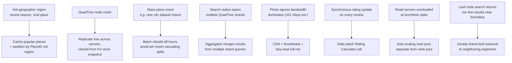

| Failure mode | Symptom | Mitigation |
|---|---|---|
| Hot region overload | One shard/server gets disproportionate QPS (viral restaurant, major event) | Partition by PlaceID not region; cache hot places; rate-limit abusive clients |
| Single QuadTree server down | Search availability drop for that region | Replicate QuadTree across ≥3 servers (leader-follower); rebuild from KV-store-persisted snapshot |
| Boundary/edge effect | Nearby place missed because it's in the adjacent segment/geohash cell | Doubly-linked leaves (QuadTree) or search 8 neighboring geohash cells, not just 1 |
| Stale index after bulk import | New places not searchable for a long window | Trigger on-demand partial rebuild for the affected region instead of waiting for the monthly cycle |
| Cache stampede on newly-viral place | Thundering herd of cache misses hitting DB/tree simultaneously | Request coalescing, short TTL + jittered expiry, pre-warm on trending signal |
| Photo bandwidth dominates egress | Outgoing bandwidth blows past estimate | CDN edge caching, serve thumbnails in list view, full image on click-through only |
| Cross-shard radius queries | Radius search near a shard boundary needs data from 2+ shards | Aggregator fan-out to neighboring shards + merge, same pattern as scatter-gather search |

### 9.1 Sequence: Cache Stampede During a Viral Local Event

The failure-mode table above names this; here's the request timeline that makes it click:

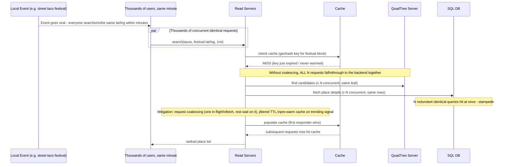

### 9.2 Abuse Prevention: Fake Reviews, Review-Bombing, Scraping

- **Fake/incentivized reviews** — cluster by device/IP, flag new-account-plus-5-star correlation, and route suspicious reviews to a quality classifier *before* publish; hold for moderation rather than blocking outright (keeps write-path fast, still eventually consistent).
- **Review-bombing** (coordinated flood of 1-star reviews after a news event) — rate-limit reviews per user per place per day; detect an anomalous review-rate spike on one place and temporarily freeze its rating recompute pending human moderation.
- **Scraping** (bots harvesting listings via the search API) — per-IP/per-API-key rate limiting at the gateway (token bucket, e.g. 100 req/min/key), CAPTCHA on anomalous patterns, and paginated/truncated responses to blunt full-dataset scraping economics.
- These abuse states map onto a listing lifecycle — new places aren't searchable until **Verified**, and abuse reports move a listing to **Flagged** pending review:

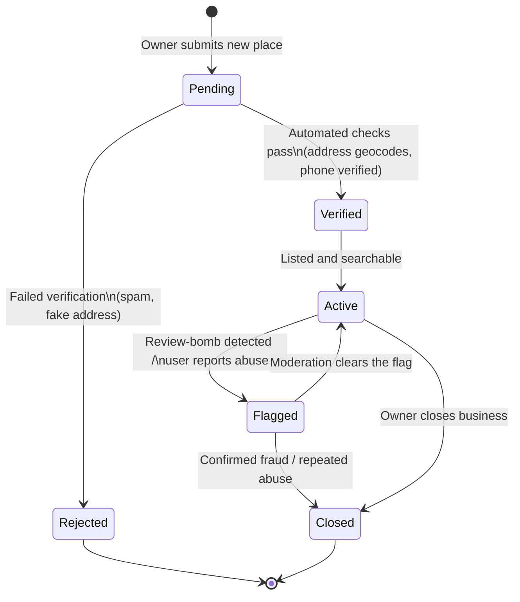

**Mnemonic — "RRS"**: **R**ate-limit, **R**eport-based flagging, **S**core/classify before publish — the three abuse levers on any review platform.

### 9.3 Security & Privacy: Location Data Handling

- A user's precise lat/lng is PII-adjacent — never log raw exact coordinates in plaintext app logs; truncate/fuzz to a coarser geohash (~100 m) for analytics.
- Encrypt in transit (TLS) and at rest, same as other PII columns; least-privilege access (only ranking/aggregator services see exact precision, analytics jobs get coarsened data).
- Search history is sensitive — retain with a TTL (e.g. 90 days) and let users clear it, mirroring GDPR/CCPA "right to erasure."
- **Contrast**: for the *person-search* variant (Tinder-style "people nearby"), deliberately fuzz the indexed entity's own location (snap to a coarser geohash cell, show "0.5 mi away" not an exact point) — the privacy bar is much higher when the thing being indexed is a person, not a business.

**Mnemonic — "FEL"**: **F**uzz, **E**ncrypt, **L**imit retention — the three location-privacy levers.

### 9.4 Monitoring & SLOs

| Metric | Target / Signal | Why it matters |
|---|---|---|
| Search latency | p50 < 50 ms, p99 < 200–300 ms | Direct UX signal; page on p99 regression |
| Index freshness lag | New place searchable within minutes (Yelp) / seconds (Uber-style) | Detects a stalled async index-update pipeline |
| Cache hit ratio | > 80% for popular-area queries | Low ratio signals a cold cache or bad TTL tuning |
| QuadTree rebuild success | Alert if the monthly rebuild fails or overruns its maintenance window | A silent rebuild failure slowly stales the whole index |
| Error rate (5xx) | < 0.1% per read/write pool | Standard availability SLO |
| Rating batch pipeline lag | Completes before each day's peak traffic window | A slipped batch job means visibly stale ratings |

**Mnemonic — "LIFE"**: **L**atency, **I**ndex freshness, **F**ailure rate, **E**ffectiveness of cache — the four dashboards to have ready.

### 9.5 Multi-Region & Disaster Recovery

- QuadTree servers replicate **per region**, not globally shard — the whole tree fits in ~12 GB, so every region holds a full replica. A region outage fails over to the nearest healthy region, at the cost of extra cross-region latency for that traffic, never total unavailability.
- SQL source of truth: multi-region read replicas, single write region (or multi-write with last-write-wins on non-critical fields) — reviews/ratings already tolerate eventual consistency, so async cross-region replication fits the existing consistency model without a new design.
- Blob store (photos): multi-region replicated object storage behind a global CDN — already stateless from the app's point of view.
- DR drill cadence: quarterly "kill a region" game day; target RTO in minutes (failover to replica), RPO in seconds-to-minutes (async replication lag) — consistent with the AP-over-CP stance from §2.

**Mnemonic — "RRB"**: **R**eplicate the tree, **R**eplicate the DB (read replicas), **R**eplicate the **B**lob store — the three things to replicate per region.

### Interview Cheat-Sheet
- Always mention the **boundary problem** explicitly for whichever index you pick (geohash prefix mismatch at cell edges, QuadTree leaf underflow) — it is the single most commonly probed edge case.
- Replication > sharding for the tree at this data size — but know when that flips (data too big for one box's memory).
- Cache stampede protection (jittered TTL, request coalescing) is a strong signal of production experience — mention it even if not asked.
- CDN for photos is a "free win" answer — always mention it given the bandwidth-out estimate dominates by 1000x over incoming.

---

## 10. Real-World References

- **Google Maps / Yelp course lineage**: this chapter explicitly reuses "segments" from the Google Maps chapter of the same course — world divided into fixed-then-dynamic regions, mirroring how Google's own S2 geometry library (hierarchical spherical cells) works in spirit.
- **Uber**: uses **H3** (Uber's open-sourced hexagonal hierarchical geospatial index) instead of QuadTrees/geohash squares — hexagons have uniform adjacency (6 neighbors, consistent distance), avoiding geohash's "distance to neighbor varies by direction" distortion. Chosen specifically because drivers move constantly, so index must support fast, uniform-cost re-bucketing.
- **Google S2**: hierarchical decomposition of a sphere into cells using a space-filling (Hilbert) curve — used internally at Google and by many geo-systems for exact, distortion-minimal spherical indexing (unlike naive lat/lng grids which distort near poles).
- **Redis GEO commands** (`GEOADD`, `GEOSEARCH`, `GEODIST`): implemented internally via geohash + sorted sets — the simplest production-grade way to add "nearby X" to a system without hand-rolling a QuadTree, good up to tens of millions of points.
- **Elasticsearch `geo_point` / `geo_shape`**: uses a combination of geohash-based indexing (via BKD trees under the hood in Lucene) — commonly paired with text search when both relevance ranking and geo-filtering are needed simultaneously (exactly Yelp's "search by name" + "search by category near me" hybrid).
- **PostGIS** (Postgres spatial extension): R-tree-based `GiST` index for polygons/regions — the go-to when you need actual geometry (delivery zone polygons, geofences), not just point-radius queries.
- **Foursquare/Swarm**: same problem class as Yelp — check-in and nearby-venue discovery, historically used geohash-style geo-indexing combined with a dedicated recommendation layer for ranking.
- **Tinder/dating apps "people nearby"**: same pattern, but privacy-sensitive — often deliberately fuzz exact location (snap to a coarser geohash) before indexing, trading precision for privacy; worth mentioning if an interviewer pivots the question toward a people-search variant.

### Interview Cheat-Sheet
- Name-drop H3 (Uber) vs S2 (Google) vs Geohash (Redis/Mongo/ES) as three real, production geo-indexing systems — shows breadth beyond the course's QuadTree answer.
- If interviewer says "what about polygons/delivery zones" — pivot immediately to R-tree/PostGIS, don't force QuadTree to do a job it's not built for.
- If interviewer pivots to people-search/dating — mention location fuzzing/privacy trade-off unprompted, it's a differentiator.

---

## 11. Golden Rules

1. **Filter with the index, rank with real distance.** The spatial index only ever produces a candidate set — haversine + business scoring always happens as a second, smaller pass.
2. **Static data → precompute & batch-rebuild. Moving data → cheap incremental index.** This single fact decides QuadTree (Yelp) vs. geohash/H3 (Uber).
3. **Uneven density kills static grids.** Always let cell/node size adapt to point count, not to fixed geography.
4. **Replicate small indexes; shard only when they no longer fit in memory on one box.** Know your own index's byte size before deciding.
5. **Never let rating/aggregate recomputation sit on the write hot path.** Batch it.
6. **Handle the boundary problem explicitly** — every spatial index has an edge/neighbor issue; naming it unprompted is a strong signal.
7. **Read-heavy means split the read and write paths early**, and let read infrastructure (cache, replicas) absorb the burst traffic.
8. **Photo/media bandwidth will dominate your bandwidth estimate — always** — CDN it before it becomes a discussion point.

### Recap Mindmap

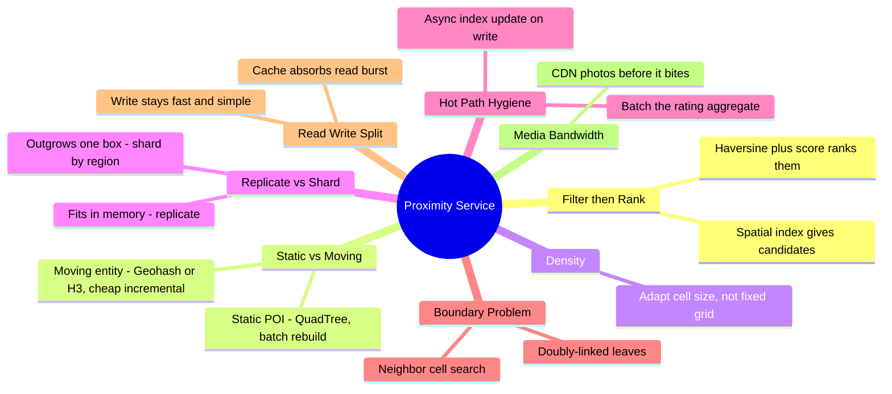

---

## 12. Master Cheat Sheet

**Core formula chain:**
```
Servers        = DAU / RPS_per_server                (8,000 RPS/server baseline)
Storage         = Σ (row_size_i * count_i)
Index size       = leaf_count * bytes_per_leaf_entry + internal_node_count * (4 ptrs * 8B)
Bandwidth_in     = (daily_write_bytes) / 86,400
Bandwidth_out    = (daily_searches * results_per_search * avg_result_size) / 86,400
Haversine dist   = 2R·atan2(√a,√(1−a)),  a = sin²(Δlat/2)+cos(lat1)cos(lat2)sin²(Δlng/2), R≈6371km
```

**Worked answer to remember:** 178M users, 60M DAU, 500M places → ~7,500 servers, ~836 GB DB storage, ~12 GB QuadTree (fits on one box, replicate don't shard), ~331 Gbps egress (photo-dominated → CDN).

**Index picker one-liner:** Static + uneven density → QuadTree. Moving entities → Geohash/H3. Polygons/regions → R-Tree. In-memory one-shot k-NN → KD-Tree. Small scale/fast ship → DB-native geospatial (PostGIS/Mongo/Redis GEO).

**Architecture one-liner:** LB → split Read/Write pools → Read hits Cache → QuadTree servers (in-memory, replicated) → Aggregator (haversine + rank) → back to user. Write hits SQL + Blob Store, async-updates the tree. Nightly/monthly batch jobs rebuild tree and recompute ratings.

**Mnemonics:**
- **SLAC** — Scalability, Latency, Availability, Consistency(relaxed): NFR recital order.
- **GRQK** — Geohash, R-tree, QuadTree, KD-tree: spatial index family, pick by data shape/mobility.
- **RRS** — Rate-limit, Report-based flagging, Score/classify before publish: the three abuse levers (§9.2).
- **FEL** — Fuzz, Encrypt, Limit retention: the three location-privacy levers (§9.3).
- **LIFE** — Latency, Index freshness, Failure rate, Effectiveness of cache: the four dashboards to have ready (§9.4).
- **RRB** — Replicate the tree, Replicate the DB, Replicate the Blob store: per-region DR checklist (§9.5).

**Ranking gotcha to remember:** raw `1/distance` blows up near zero and lets a mediocre place 30 m away beat a great place 500 m away — dampen it (`1/(distance+1)` or `-log(distance)`) before weighting against rating/relevance (see §7 trace).

**Moving-entity follow-up one-liner:** "make it Uber" = swap QuadTree-with-monthly-rebuild for Geohash/H3-with-continuous-upsert; LB, read/write split, cache, aggregator, and haversine ranking are untouched (§6.9).

**Golden rules (see §11) in one breath:** filter-then-rank; static-precompute vs moving-incremental; adapt cell size to density; replicate-until-it-doesn't-fit-then-shard; batch the aggregates; name the boundary problem; split read/write paths; CDN the media.

**Failure modes to have ready:** hot region (partition by ID, cache), node crash (replicate + KV snapshot rebuild), boundary miss (linked leaves / neighbor-cell search), cache stampede (jitter + coalescing), cross-shard radius (aggregator fan-out).

**What changes at 10-100x scale:** shard the QuadTree by macro-region once it exceeds single-node memory; move from monthly to event-triggered partial rebuilds; introduce a dedicated search/ranking ML layer; consider H3/S2 if entities start moving (delivery, ride-hailing pivot).
