# Designing Uber — FAANG System Design Interview Guide

> **Enhancement notes:** This pass added things a FAANG interviewer would probe for that weren't explicit yet: a `cancelRide` API, a concrete search-radius-expansion flowchart for "no driver found nearby," a surge-multiplier computation flowchart (the mechanics were described in prose but never diagrammed), and a trip-to-payment state linkage showing that `Completed` isn't really the last state once you account for async capture. It also added two failure-mode rows (rider no-show at pickup, rider disconnect mid-trip — only the driver-side case existed before) and lightly rewrote two dense paragraphs (Section 7.5 Stage 1, Section 11.3 DeepETA) into shorter sentences without changing their content or numbers. New subsections and diagrams are tagged `🆕`. Everything else — the mental model, capacity math, existing diagrams, mnemonics, and golden rules — is untouched because it already worked.

## 1. Mental model

Uber is **three coupled real-time systems wearing one app icon**:

1. **A live geo-index** — where is everyone, right now (updates every 2–4s, at the scale of millions of moving points).
2. **A matching/auction engine** — pair scarce supply (drivers) with bursty demand (riders) in milliseconds, optimizing for the whole marketplace, not one rider.
3. **A ledger with a fraud layer** — money must move exactly once, and someone will try to cheat it.

Everything else (maps, ETA, notifications, surge) is glue around these three. If you keep this triad in your head, you can reconstruct 90% of the design from scratch under pressure.

Analogy: think of it as **air-traffic control (geo-index) + a stock exchange matching engine (dispatch) + a bank (payments)**, all sharing one mobile app.

---

## 2. Interview playbook

Talk through Uber in this order out loud. This is the checklist — rehearse it until it's reflexive.

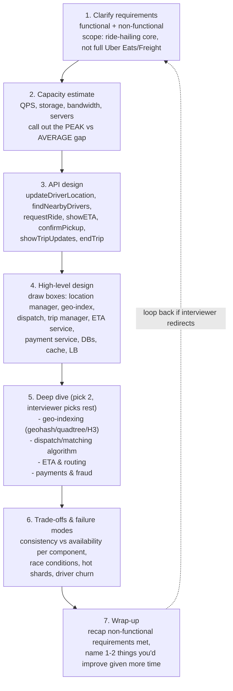
```mermaid
flowchart TD
    A["1. Clarify requirements<br/>functional + non-functional<br/>scope: ride-hailing core, not full Uber Eats/Freight"] --> B["2. Capacity estimate<br/>QPS, storage, bandwidth, servers<br/>call out the PEAK vs AVERAGE gap"]
    B --> C["3. API design<br/>updateDriverLocation, findNearbyDrivers,<br/>requestRide, showETA, confirmPickup,<br/>showTripUpdates, endTrip"]
    C --> D["4. High-level design<br/>draw boxes: location manager, geo-index,<br/>dispatch, trip manager, ETA service,<br/>payment service, DBs, cache, LB"]
    D --> E["5. Deep dive (pick 2, interviewer picks rest)<br/>- geo-indexing (geohash/quadtree/H3)<br/>- dispatch/matching algorithm<br/>- ETA & routing<br/>- payments & fraud"]
    E --> F["6. Trade-offs & failure modes<br/>consistency vs availability per component,<br/>race conditions, hot shards, driver churn"]
    F --> G["7. Wrap-up<br/>recap non-functional requirements met,<br/>name 1-2 things you'd improve given more time"]
    G -.loop back if interviewer redirects.-> A
```

**Cheat-sheet for this section**
- Never start drawing boxes before you've stated the 2-3 numbers that will shape the design (DAU, trips/day, ping interval).
- State your scope cut up front: "I'll design ride request → match → trip → payment; I'll treat maps/routing tiles as a given third-party service unless you want me to go deeper."
- Budget your 45 minutes: ~5 min requirements, ~5 min capacity, ~5 min API, ~10 min HLD, ~15 min deep dive, ~5 min trade-offs/wrap-up.
- If the interviewer says "let's go deeper on X," that's your steering wheel — drop your own agenda and follow it.
- Always end a deep dive with the trade-off you accepted, not just the mechanism.

---

## 3. How to identify this topic in an interview

You're being asked "Design Uber" (or a variant) when you hear:

- "Design a **ride-hailing / ride-sharing** service" (Uber, Lyft, Grab, Ola, Didi).
- "Design a system that **matches moving supply with moving demand** in real time."
- "Design **food/parcel delivery dispatch**" (DoorDash, Instacart, UberEats) — same triad, different entities.
- "Design **fleet tracking / nearby X** with live location updates every few seconds."
- Any prompt mentioning **surge pricing, driver-rider matching, live ETA, or in-app payment with fraud**.

Distinguish from adjacent problems:
- **Yelp/proximity search** = static points, read-heavy, no matching, no payments → subset of Uber's geo-index problem, not the whole thing.
- **Google Maps** = routing/tiles/traffic at planetary scale, no marketplace/matching — Uber's ETA service *depends on* a Maps-like routing engine but doesn't rebuild it in an interview.
- **WhatsApp/Twitter** = messaging fan-out, not geo-matching — don't reach for consistent hashing on user ID here, reach for geo-partitioning.

---

## 4. Requirements clarification

### Functional requirements

| # | Requirement | Notes to say out loud |
|---|---|---|
| 1 | Update driver location | Continuous, every ~4s, from every online driver |
| 2 | Find nearby drivers | Rider opens app → see available cars near them |
| 3 | Request a ride | Rider picks destination + vehicle type → system finds a driver |
| 4 | Match & notify driver | Nearest/best driver gets a request, can accept/reject |
| 5 | Show driver ETA | Both pre-trip (pickup ETA) and in-trip (destination ETA) |
| 6 | Confirm pickup | Driver marks rider picked up |
| 7 | Show live trip updates | Both parties see position + time remaining |
| 8 | End trip & charge | Driver ends trip → fare computed → payment captured |
| 9 | Manage payments | Auth → capture → payout to driver, refunds |
| 10 | Cancellations | Either party can cancel pre-pickup; a late cancellation or rider no-show after the driver arrives can carry a fee — a common interviewer follow-up |

**Explicitly out of scope unless asked:** ride pooling/UberPool matching, surge pricing UI, driver onboarding/KYC, ratings, in-app chat, multi-stop trips. Say this out loud — it shows scoping discipline.

### Non-functional requirements

| Requirement | Why it matters here | Design lever |
|---|---|---|
| **Availability** > Consistency for location/matching | A stale driver pin is fine; a frozen app is not | AP components: driver location, nearby search |
| **Strong consistency** for trip state & payments | Two riders must not be matched to one driver; money must not double-charge | CP components: trip manager, ledger |
| Low latency | Matching must feel instant (<2s), location pings can't queue | In-memory hash table, WebSockets, async writes |
| High write throughput | Millions of location pings/sec | Horizontally sharded, no cross-shard joins |
| Horizontal scalability | Rider/driver growth is unbounded and regional | Geo-sharded services, stateless app tier |
| Fault tolerance | One data center outage shouldn't strand riders | Multi-region, replica failover |
| Fraud resistance | Money system is an attack surface from day one | Risk engine + anomaly detection (RADAR) |

**Key interview move — CAP per component, not per system.** Uber is *not* one consistency model. Say explicitly: "Driver GPS pings and nearby-driver search are AP (eventual consistency, favor availability); trip state and payment ledger are CP (favor consistency, use synchronous replication / transactions)." This single sentence signals seniority.

**Cheat-sheet for this section**
- Always ask: what's the scale (DAU, trips/day, regions)? Ping interval? Payment scope (auth only vs full ledger)?
- Split CAP per subsystem — location vs money.
- Call out consistency requirement explicitly for double-booking prevention (this is the classic gotcha: "what if two drivers accept the same ride?").
- Fraud detection as a *non-functional* requirement is easy to forget — mention it before the interviewer has to ask.
- State latency targets numerically: match within ~2s, location propagation within ~1 ping cycle (4s).

---

## 5. Capacity estimation (worked example)

Assume (numbers an interviewer will accept, round for speed):

```
Registered riders        : 500,000,000  (500M)
Registered drivers        : 5,000,000    (5M)
Daily active riders (DAU) : 20,000,000   (20M)
Daily active drivers      : 3,000,000    (3M)
Daily trips               : 20,000,000   (20M)
Avg trip duration          : 15 min (900s)
Location ping interval     : every 4s per active driver
```

### 5.1 QPS — the number that actually drives architecture

```
Trip-request QPS (avg) = 20,000,000 trips / 86,400 s ≈ 232 QPS
Peak factor (rush hour)= 3–5x average in ride-hailing (vs 2x typical web traffic)
Trip-request QPS (peak)≈ 232 × 4 ≈ 930 QPS

Location-ping QPS (avg)= 3,000,000 active drivers / 4 s ≈ 750,000 writes/sec  ← THE big number
  (this dwarfs ride-request QPS by ~800x — say this out loud, it's the headline stat)

Nearby-driver-search QPS: assume each of 20M DAU riders opens/refreshes the map
  ~10 times/session on average → 200,000,000 reads/day ≈ 2,315 QPS avg, ~10x peak ≈ 23,000 QPS
  (this is why nearby-search MUST be cache-backed, never hit source-of-truth DB)
```

**Takeaway to say in the room:** "The bottleneck isn't ride requests — it's the 750K/sec firehose of location pings. Any component in that path must be O(1) per write, in-memory, and horizontally shardable. This kills naive 'write to SQL on every ping' designs immediately."

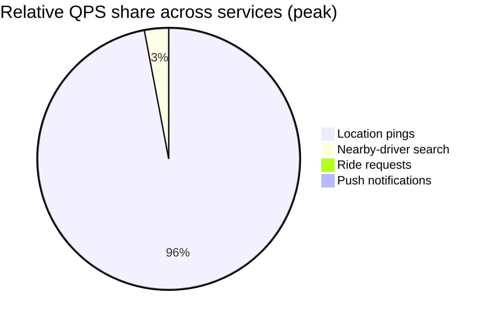
```mermaid
pie title Relative QPS share across services (peak)
    "Location pings" : 750000
    "Nearby-driver search" : 23000
    "Ride requests" : 930
    "Push notifications" : 3700
```

One glance at this pie chart makes Golden Rule #3 ("the busiest number wins the architecture") visceral — location pings aren't just bigger, they're a different order of magnitude from everything else combined.

### 5.2 Storage — the source usually stops here, don't

```
Rider metadata:  500M riders × 1,000 B         = 500 GB (one-time) + 500 MB/day new
Driver metadata: 5M drivers × 1,000 B          = 5 GB (one-time)   + 100 MB/day new
Driver LAST-KNOWN location: 5M × 36 B          = 180 MB (constantly overwritten, not accumulated)
Trip records: 20M trips/day × 100 B            = 2 GB/day

## Gap the source material skips: location HISTORY (breadcrumb trail)
Needed for: trip replay, fare disputes, fraud investigation (RADAR), ETA model training.
Per trip: 900s / 4s ping ≈ 225 pings × 36 B ≈ 8.1 KB/trip
Daily breadcrumb volume: 20,000,000 trips × 8.1 KB ≈ 162 GB/day  ← dominates storage, not the "2 GB" trip table

Total real daily write volume ≈ 162 GB (breadcrumbs) + 2 GB (trips) + 0.6 GB (new users) ≈ ~165 GB/day
Annual (raw, single copy): 165 GB × 365 ≈ 60 TB/year
With Cassandra replication factor 3: 60 TB × 3 ≈ 180 TB/year (steady state, before compaction/TTL)
```

Apply a **TTL** on raw breadcrumbs (e.g., 90 days hot, then cold-archive to blob storage) — don't keep 180 TB/year forever in your hot cluster. This is the trade-off to name explicitly.

### 5.3 Node/shard count

```
Assume 2 TB usable capacity per Cassandra node (leaving headroom for compaction):
Nodes for 1 year hot retention ≈ 180 TB / 2 TB ≈ 90 nodes (round up → ~100–120 with headroom)

Geo-sharding: partition by region/city rather than raw geohash/H3 cell count —
operational locality (data residency, regional outages) matters more than perfectly even key distribution.
~10–20 metro "super-regions" each independently shardable and failover-able.
```

### 5.4 Bandwidth

```
Location-ping bandwidth: 750,000 updates/sec × (driverID 3B + lat/long 16B) = 14.25 MB/s × 8 ≈ 114 Mbps ingress
Trip-request bandwidth: 232/s × 100B × 8 ≈ 185 kbps (negligible next to location pings)
Egress (trip updates + nearby-driver lists pushed to apps) is same order of magnitude or larger —
budget roughly 2x ingress for full duplex real-time UI ≈ ~230–300 Mbps aggregate at global scale.
```

### 5.5 In-memory cache sizing (a number worth having ready)

```
Live location of every active driver, held entirely in RAM (Redis hash table):
3,000,000 drivers × ~100 B/entry (id + lat/lon + ts + overhead) ≈ 300 MB
Even with H3-index overhead and 5M total (not just active) drivers: < 1–2 GB total.
```
**Say this explicitly** — it's a great "aha": the entire world's live driver fleet position fits comfortably in the RAM of a couple of Redis nodes. The hard part isn't the data size, it's the *write rate* (750K/sec).

### 5.6 Servers — go beyond the textbook formula

The naive formula `DAU / RPS-per-server` (20M / 8,000 ≈ 2,500 servers) is a fine sanity check but conflates wildly different services. Break it down per service instead — this is the trade-off/critique to voice:

| Service | Peak QPS | RPS/server (est.) | Servers (w/ 2x redundancy) |
|---|---|---|---|
| Location ingestion (WebSocket) | 750,000 | ~5,000 | ~300 |
| Nearby-driver search (cached read) | 23,000 | ~8,000 | ~6 (mostly cache/CDN absorbs this) |
| Ride-request / dispatch (CPU-heavy matching) | ~930–1,500 | ~200 | ~10–15 |
| Payment/risk engine | ~930 | ~500 | ~4–6 |

**Cheat-sheet for this section**
- Lead with QPS, not storage — QPS (750K/sec location writes) is what shapes the architecture.
- Always separate **average** and **peak** (3–5x for ride-hailing due to commute-hour spikes, weather, events).
- Storage: the "last known location" table is tiny (180 MB); the **breadcrumb/history trail** is the real storage driver (~162 GB/day) — naming this gap shows depth beyond the course material.
- Name a retention/TTL policy — don't let hot storage grow unbounded.
- Give a per-service server breakdown, not one blanket number — shows you understand heterogeneous load.
- One memorable number: the whole live driver fleet's positions fit in a couple GB of RAM.

### 5.7 Redone example — what if the interviewer changes the inputs?

Interviewers routinely swap one assumption mid-conversation to see if your model actually holds together, not just memorized. Suppose the interviewer stops you and says: *"Let's scope this to a single mid-size country, not global — 60M registered riders, 4M DAU, 1.5M daily active drivers, and let's tighten the ping interval to 2s for better in-city matching."*

Redo the math live, using the exact same formulas with new numbers plugged in:

```
Daily trips (assume ~1 trip/DAU): 4,000,000
Trip-request QPS (avg) = 4,000,000 / 86,400 ≈ 46 QPS
Trip-request QPS (peak) ≈ 46 × 4 ≈ 185 QPS

Location-ping QPS (avg) = 1,500,000 drivers / 2s ≈ 750,000 writes/sec
  ← notice this lands on the SAME 750K/sec as the original 3M-driver / 4s GLOBAL estimate.
  Halving the driver count but also halving the ping interval is a wash — say this out loud,
  it proves you understand the formula, not just the memorized answer.

Breadcrumb storage/day = 4,000,000 trips × (900s / 2s pings) × 36 B/ping
  = 4,000,000 × 450 pings × 36 B ≈ 64.8 GB/day
  (pings/trip doubled from ~225 to ~450 because cadence doubled, so per-trip bytes doubled too: ~16.2 KB/trip)
Annual raw ≈ 64.8 GB × 365 ≈ 23.6 TB/year; × 3 replication ≈ ~71 TB/year
Nodes needed (2 TB/node) ≈ 71 TB / 2 TB ≈ 36 nodes — far fewer than the ~100-120 for the global estimate,
  which makes sense: it's one country's history, not the whole world's.
```

**The move that matters:** don't panic when the interviewer changes a number — re-derive from the same formulas live, out loud. That halving drivers while doubling ping frequency nets an *identical* QPS is exactly the kind of on-the-fly sensitivity insight that separates "understood the model" from "memorized the answer."

---

## 6. Numbers worth memorizing

| Metric | Value | Context |
|---|---|---|
| Driver location ping interval | 2–4 s | Real Uber cadence is closer to 4s baseline, adaptive down to ~1s in dense/matching zones |
| In-memory hash table read/write | ~0.1–1 ms | Redis GET/SET |
| Cross-AZ network round trip | ~0.5–2 ms | Same-region |
| Cross-region network round trip | 50–150 ms | Why geo-sharding beats global consistency here |
| WebSocket connection overhead per server | ~5K–50K concurrent conns | Depends on tuning; drives "servers per location-service" math |
| Geohash length 6 cell size | ≈ 1.2 km × 0.6 km | City-block-ish granularity |
| Geohash length 7 cell size | ≈ 153 m × 153 m | Building-block granularity |
| H3 resolution 8 hex edge | ≈ 461 m | Common resolution for surge-pricing zones |
| H3 resolution 9 hex edge | ≈ 174 m | Finer dispatch/search granularity |
| Quadtree rebalance threshold (Yelp/Uber pattern) | ~500 points/leaf | Split node when a cell exceeds this |
| Dispatch batching window (industry pattern) | 100 ms – a few sec | Trade instant-match latency for better global assignment |
| Cassandra typical node capacity (design assumption) | ~1–2 TB usable | Leaves headroom for compaction |
| Peak/average traffic multiplier (ride-hailing) | 3–5x | Higher than typical web (2x) due to commute-hour spikes |
| Kafka end-to-end latency | tens of ms | Payment event pipeline |
| Payment authorization round trip (PSP) | 200 ms – 2 s | External dependency, budget timeout + retry |

---

## 7. High-level design

### 7.1 API design

| API | Signature | Purpose |
|---|---|---|
| Update driver location | `updateDriverLocation(driverID, oldLat, oldLong, newLat, newLong)` | Streamed every ping interval |
| Find nearby drivers | `findNearbyDrivers(riderID, lat, long)` | Powers the map view |
| Request a ride | `requestRide(riderID, lat, long, dropOffLat, dropOffLong, vehicleType)` | Kicks off matching |
| Show driver ETA | `showETA(driverID, eta)` | Pre-trip pickup ETA |
| Confirm pickup | `confirmPickup(driverID, riderID, timestamp)` | Marks trip start |
| Show trip updates | `showTripUpdates(tripID, riderID, driverID, driverLat, driverLong, timeElapsed, timeRemaining)` | Live trip telemetry |
| End the trip | `endTrip(tripID, riderID, driverID, timeElapsed, lat, long)` | Triggers fare calc + payment |
| 🆕 Cancel a ride | `cancelRide(tripID, initiatorID, initiatorType, reason)` | Either party can call it; free before a driver is assigned, may incur a fee once the driver has arrived (no-show) — see Section 17 |

### 7.2 Data model / schema

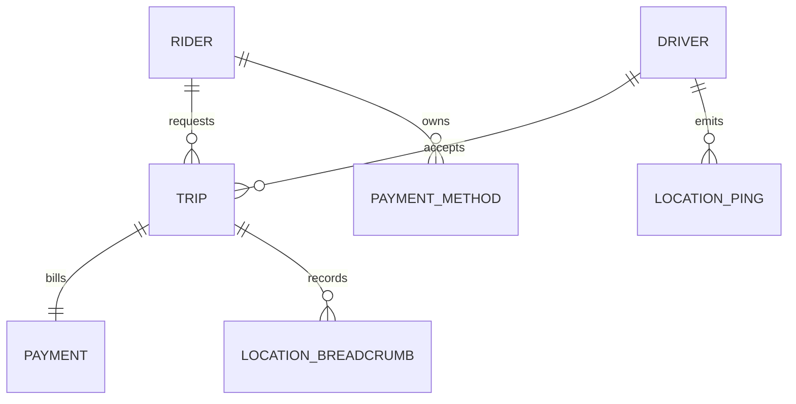
```mermaid
erDiagram
    RIDER ||--o{ TRIP : requests
    DRIVER ||--o{ TRIP : accepts
    DRIVER ||--o{ LOCATION_PING : emits
    TRIP ||--|| PAYMENT : bills
    TRIP ||--o{ LOCATION_BREADCRUMB : records
    RIDER ||--o{ PAYMENT_METHOD : owns
```

| Entity | Store | Key fields | Notes |
|---|---|---|---|
| **Rider** | MySQL/Docstore (rarely-changing profile) | riderID (PK), name, phone, rating, defaultPaymentMethodID, homeMarket | Read-heavy, tiny compared to location data |
| **Driver** | MySQL/Docstore | driverID (PK), name, rating, vehicleType, vehicleID, status (Offline/Available/Dispatched/OnTrip), currentTripID | `status` is the field the CAS double-dispatch guard (Section 17) operates on |
| **Driver live location** | Redis hash | driverID (key) -> {lat, long, timestamp, heading, speed} | Overwritten every ping, never accumulated — this is the ~300MB-2GB "fits in RAM" table from Section 5.5 |
| **Trip** | MySQL while in-progress -> Cassandra once completed | tripID (PK), riderID, driverID, status, pickupLat/Long, dropoffLat/Long, requestedAt, matchedAt, startedAt, completedAt, fareAmount | The MySQL→Cassandra move on completion is why Section 16 lists both stores as accepted trade-offs, not redundant overlap |
| **Location breadcrumb** | Cassandra (partition key: tripID or driverID+day) | tripID, sequenceNo, lat, long, timestamp | ~36B/ping, ~225 pings/trip at 4s cadence — the 162GB/day storage driver from Section 5.2 |
| **Payment/Ledger entry** | MySQL (ledger needs ACID) | entryID (PK), tripID, riderID, driverID, amount, type (debit/credit), idempotencyKey, status (authorized/captured/failed/refunded), createdAt | Double-entry: every trip produces a *matched* debit(rider) + credit(driver) pair, never a lone row |
| **Payment method** | Payment Profile Service, tokenized | paymentMethodID, riderID, PSP token (never a raw card number) | PCI scope reduction — the app/DB never touches a real card number, only a PSP-issued token |

**Worked example — ledger row volume:** 20M trips/day × 2 rows/trip (matched debit+credit) × ~200 B/row ≈ 8 GB/day of pure ledger writes — small next to the 162 GB/day breadcrumb trail, but this is the data that must survive audits and regulatory retention for *years*, unlike breadcrumbs which get a 90-day TTL. Naming this contrast (small-but-permanent vs. huge-but-disposable) is a good depth signal.

**Why this three-way split, in one sentence:** hot/ephemeral/high-write data (live location) lives in RAM; append-only historical data (breadcrumbs, completed trips) lives in a horizontally-scalable wide-column store; anything needing relational integrity and ACID (in-flight trip state, money) lives in a traditional RDBMS. This is the data-model mirror of the "CAP per component" idea from Section 4.

**Cheat-sheet for this section**
- If asked to "draw the schema," draw the ER diagram first, then immediately name which physical store each entity lives in — that's the part interviewers actually want to hear.
- `Driver.status` is the single field every double-dispatch guard hinges on — mentioning it here previews your Section 17 answer.
- Payment methods are tokenized, never raw card numbers — a one-line PCI-compliance signal that costs nothing to say.
- Trip rows migrate stores on completion (MySQL → Cassandra) — that's matching each phase of the trip to the consistency model it actually needs, not denormalization for its own sake.

### 7.3 Architecture

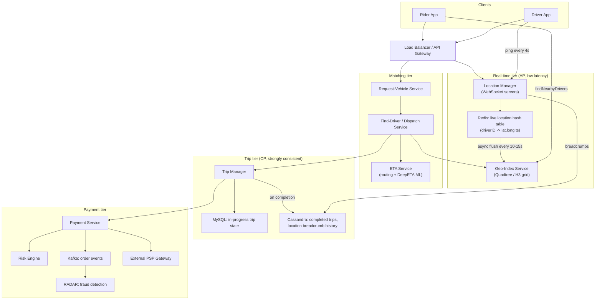
```mermaid
flowchart TB
    subgraph Clients
        RiderApp["Rider App"]
        DriverApp["Driver App"]
    end

    LB["Load Balancer / API Gateway"]

    subgraph RealTimeTier["Real-time tier (AP, low latency)"]
        LM["Location Manager<br/>(WebSocket servers)"]
        Redis["Redis: live location hash table<br/>(driverID -> lat,long,ts)"]
        GeoIndex["Geo-Index Service<br/>(Quadtree / H3 grid)"]
    end

    subgraph MatchingTier["Matching tier"]
        RVS["Request-Vehicle Service"]
        FDS["Find-Driver / Dispatch Service"]
        ETASvc["ETA Service<br/>(routing + DeepETA ML)"]
    end

    subgraph TripTier["Trip tier (CP, strongly consistent)"]
        TM["Trip Manager"]
        MySQL["MySQL: in-progress trip state"]
        Cassandra["Cassandra: completed trips,<br/>location breadcrumb history"]
    end

    subgraph PaymentTier["Payment tier"]
        PaySvc["Payment Service"]
        Risk["Risk Engine"]
        Kafka["Kafka: order events"]
        RADAR["RADAR: fraud detection"]
        PSP["External PSP Gateway"]
    end

    RiderApp --> LB
    DriverApp --> LB
    LB --> LM
    LB --> RVS

    DriverApp -- "ping every 4s" --> LM
    LM --> Redis
    Redis -- "async flush every 10-15s" --> GeoIndex
    RiderApp -- "findNearbyDrivers" --> GeoIndex

    RVS --> FDS
    FDS --> GeoIndex
    FDS --> ETASvc
    FDS --> TM
    TM --> MySQL
    TM -- "on completion" --> Cassandra
    LM -- "breadcrumbs" --> Cassandra

    TM --> PaySvc
    PaySvc --> Risk
    PaySvc --> Kafka
    Kafka --> RADAR
    PaySvc --> PSP
```

### 7.4 Ride-request sequence (happy path + rejection loop)

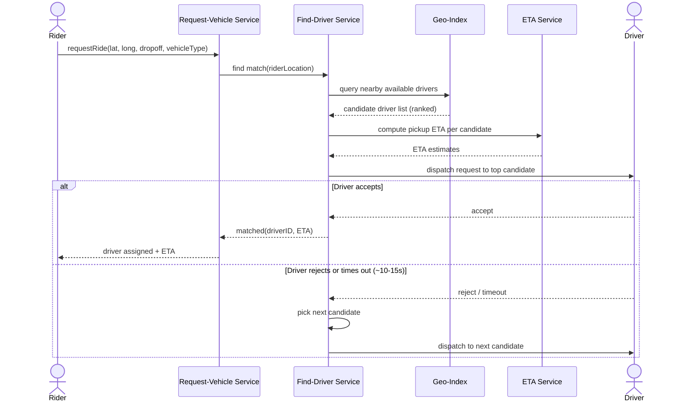
```mermaid
sequenceDiagram
    actor Rider
    participant RVS as Request-Vehicle Service
    participant FDS as Find-Driver Service
    participant Geo as Geo-Index
    participant ETA as ETA Service
    actor Driver

    Rider->>RVS: requestRide(lat, long, dropoff, vehicleType)
    RVS->>FDS: find match(riderLocation)
    FDS->>Geo: query nearby available drivers
    Geo-->>FDS: candidate driver list (ranked)
    FDS->>ETA: compute pickup ETA per candidate
    ETA-->>FDS: ETA estimates
    FDS->>Driver: dispatch request to top candidate
    alt Driver accepts
        Driver-->>FDS: accept
        FDS-->>RVS: matched(driverID, ETA)
        RVS-->>Rider: driver assigned + ETA
    else Driver rejects or times out (~10-15s)
        Driver-->>FDS: reject / timeout
        FDS->>FDS: pick next candidate
        FDS->>Driver: dispatch to next candidate
    end
```

**Cheat-sheet for this section**
- Draw the real-time tier (AP) and trip/payment tier (CP) as visually separate blocks — this is the single clearest signal of design maturity.
- The location manager and geo-index are decoupled via Redis specifically to absorb 750K/sec writes without hammering the spatial index on every ping.
- APIs are intentionally coarse-grained REST/RPC-style calls; in reality the driver/rider connections are long-lived WebSockets, not per-ping HTTP calls — say so.
- The rejection loop in the sequence diagram is a common follow-up ("what if the driver doesn't respond?") — have a timeout number ready (10–15s is reasonable).

### 7.5 Architecture evolution — from a naive monolith to the final design

Walking an interviewer through *how* you'd arrive at the Section 7.3 architecture — rather than presenting it fully-formed — is often the single most memorable part of the interview. Show what breaks at each stage and why that specific pain forces the next change.

**Stage 1 — naive single-region monolith (what most candidates instinctively draw first):**

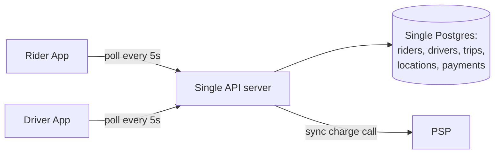
```mermaid
flowchart LR
    RiderApp["Rider App"] -- "poll every 5s" --> API["Single API server"]
    DriverApp["Driver App"] -- "poll every 5s" --> API
    API --> DB[("Single Postgres:<br/>riders, drivers, trips,<br/>locations, payments")]
    API -- "sync charge call" --> PSP["PSP"]
```

*What breaks:* 3M active drivers polling every 5s means **600,000 requests/sec just to ask "anything new?"** Most of those calls come back "nothing changed" — wasted work, and still not far off the eventual 750K/sec push-based load, just far less useful per request. Worse, every location update writes into the same relational table as riders, trips, and payments. That churn causes row-level lock contention and index bloat on `driver_location`, which slows down unrelated trip and payment queries too. It's also one DB in one region, so a single outage strands every rider globally. And payment capture blocks on the PSP inside the same request as trip-end, so the user waits 200ms-2s at the worst possible moment — right when they're trying to get out of the car.

**Stage 2 — push-based location + geo-index + async payment:**

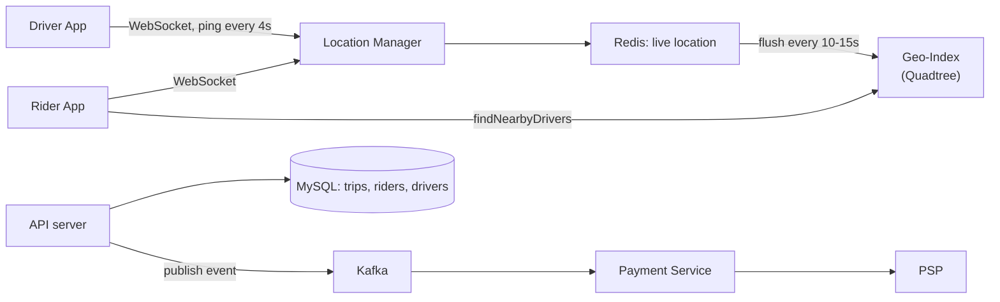
```mermaid
flowchart LR
    RiderApp["Rider App"] -- "WebSocket" --> LM["Location Manager"]
    DriverApp["Driver App"] -- "WebSocket, ping every 4s" --> LM
    LM --> Redis["Redis: live location"]
    Redis -- "flush every 10-15s" --> Geo["Geo-Index<br/>(Quadtree)"]
    RiderApp -- "findNearbyDrivers" --> Geo
    API["API server"] --> MySQL[("MySQL: trips, riders, drivers")]
    API -- "publish event" --> Kafka["Kafka"]
    Kafka --> PaySvc["Payment Service"] --> PSP["PSP"]
```

*What improved:* WebSockets replace polling (750K/sec pushed writes instead of 600K/sec mostly-wasted polls, but now every push actually carries new information); Redis absorbs the write-hot location path so the quadtree only rebalances on a periodic flush, not per-ping; async Kafka-driven capture gets the PSP call off the trip-completion critical path.
*What still breaks:* everything is still **one region** — a rider in Singapore is served by a datacenter in the US, adding 150-250ms to every call — and dispatch is still a single service doing greedy nearest-driver matching with no fraud/risk layer and no geo-sharding, so one metro's traffic spike (a stadium letting out) can degrade the whole global location tier.

**Stage 3 — geo-sharded, multi-service final design:**

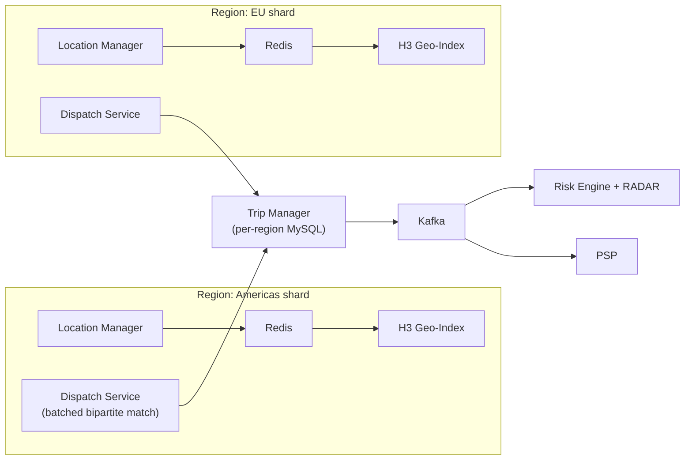
```mermaid
flowchart LR
    subgraph RegionA["Region: Americas shard"]
        LM_A["Location Manager"] --> Redis_A["Redis"]
        Redis_A --> H3_A["H3 Geo-Index"]
        FDS_A["Dispatch Service<br/>(batched bipartite match)"]
    end
    subgraph RegionB["Region: EU shard"]
        LM_B["Location Manager"] --> Redis_B["Redis"]
        Redis_B --> H3_B["H3 Geo-Index"]
        FDS_B["Dispatch Service"]
    end
    TM["Trip Manager<br/>(per-region MySQL)"]
    Kafka["Kafka"]
    Risk["Risk Engine + RADAR"]
    PSP["PSP"]
    FDS_A --> TM
    FDS_B --> TM
    TM --> Kafka --> Risk
    Kafka --> PSP
```

*What this buys:* Ringpop-style consistent-hashing + gossip assigns drivers to region shards, so a Tokyo ping never crosses an ocean; H3 replaces the quadtree for uniform-neighbor dispatch and doubles as the surge-pricing index; batched bipartite matching replaces greedy nearest-driver for whole-marketplace efficiency; RADAR sits on the same Kafka stream as payments for real-time fraud signals. This is the architecture detailed in full in Section 7.3 — everything in it answers a specific pain point from Stage 1 or 2, not an arbitrary design choice.

**The narrative to say out loud:** "I'd start simple — single DB, polling — then show you it falls over at 750K/sec and 100+ms cross-region latency, and evolve it in two concrete steps to the geo-sharded, event-driven design." This story is more convincing than presenting the final architecture cold, because it proves the complexity is *earned*, not memorized.

**Cheat-sheet for this section**
- Use this evolution as your opening gambit in the HLD section if the interviewer seems to want depth on *process*, not just the end state.
- Each stage should name one concrete number that breaks (600K wasted polls/sec, 150ms cross-region latency, a single metro's spike degrading the whole tier) — vague "it doesn't scale" is not credible, a number is.
- Don't skip Stage 1 out of embarrassment — naming the naive design and its failure mode IS the skill being tested, not a confession of ignorance.

---

## 8. Deep dive: geospatial indexing

This is the single most-tested sub-topic. You must be able to compare three structures fluently.

### 8.1 Geohash vs Quadtree vs H3

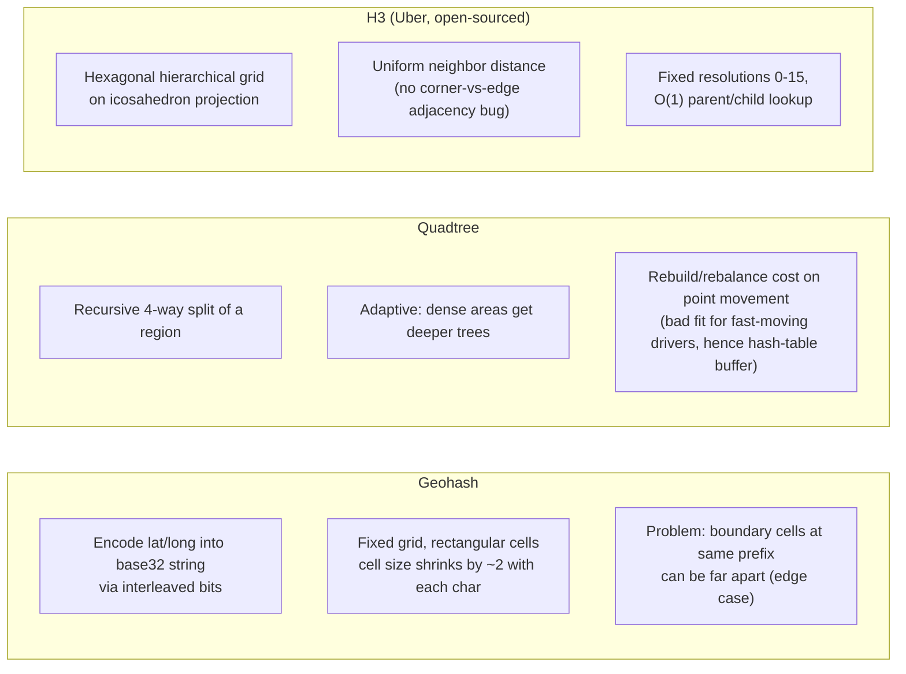
```mermaid
flowchart LR
    subgraph Geohash["Geohash"]
        direction TB
        G1["Encode lat/long into base32 string<br/>via interleaved bits"]
        G2["Fixed grid, rectangular cells<br/>cell size shrinks by ~2 with each char"]
        G3["Problem: boundary cells at same prefix<br/>can be far apart (edge case)"]
    end
    subgraph Quadtree["Quadtree"]
        direction TB
        Q1["Recursive 4-way split of a region"]
        Q2["Adaptive: dense areas get deeper trees"]
        Q3["Rebuild/rebalance cost on point movement<br/>(bad fit for fast-moving drivers, hence hash-table buffer)"]
    end
    subgraph H3["H3 (Uber, open-sourced)"]
        direction TB
        H1["Hexagonal hierarchical grid<br/>on icosahedron projection"]
        H2["Uniform neighbor distance<br/>(no corner-vs-edge adjacency bug)"]
        H3_["Fixed resolutions 0-15,<br/>O(1) parent/child lookup"]
    end
```

| Property | Geohash | Quadtree | H3 |
|---|---|---|---|
| Cell shape | Rectangle | Rectangle (variable size) | Hexagon (uniform size per resolution) |
| Adaptivity | Fixed grid | Adaptive to point density | Fixed grid (choose resolution per use case) |
| Neighbor uniformity | Poor (aspect ratio distortion near poles) | N/A (tree, not grid) | Excellent — all 6 neighbors equidistant |
| Update cost on movement | O(1) re-encode | O(log n) possible rebalance/split | O(1) re-encode |
| Best for | Simple prefix-based sharding, URL-friendly keys | Load-adaptive search (Yelp-style static POIs) | Ride-hailing dispatch, surge-pricing zones, uniform radius search |
| Real-world user | Elasticsearch geo queries, MongoDB geo | Yelp, early Uber | Uber (open-sourced 2018), many geospatial analytics stacks |
| Known weakness | Edge/boundary discontinuity ("two nearby points, very different hash") | Costly rebalancing under high write rate | More complex math (indexing library needed), less human-readable |

**Why Uber specifically prefers H3 over quadtree/geohash for dispatch:** ride-matching needs "give me everything within a radius" queries with *uniform* distance semantics — with a square grid, a diagonal neighbor is ~1.4x farther than an edge neighbor, which silently biases "nearest driver" ranking. Hexagons make all 6 neighbors equidistant, so a k-ring expansion (ring 1, ring 2, ...) is a true, undistorted radius search.

**Precision reference tables**

Geohash (base32 string length → approx cell size):

| Length | Cell size (approx) |
|---|---|
| 4 | 39.1 km × 19.5 km |
| 5 | 4.89 km × 4.89 km |
| 6 | 1.22 km × 0.61 km |
| 7 | 153 m × 153 m |
| 8 | 38.2 m × 19 m |

H3 (resolution → approx hex edge length):

| Resolution | Edge length (approx) | Typical use |
|---|---|---|
| 4 | ~130 km | Country/region-level analytics |
| 7 | ~1.4 km | City-district demand heatmaps |
| 8 | ~461 m | Surge-pricing zone (common choice) |
| 9 | ~174 m | Fine-grained dispatch search |
| 10 | ~65 m | Pedestrian/micro-mobility granularity |

**Cheat-sheet for this section**
- Lead with the mental model: geohash = "string prefix trick," quadtree = "adapts to where the points are," H3 = "hexagons for uniform-distance radius search."
- The reason quadtree alone struggles for Uber: driver positions change every 4s, and quadtree rebalancing is not O(1) — this motivates the hash-table + periodic-flush hybrid (next section).
- If asked "why not just use geohash for Uber," the answer is the boundary-discontinuity problem plus non-uniform neighbor distance.
- Know at least 2 concrete precision numbers per structure (don't just say "it's fine-grained").
- Namedrop that H3 is open-source and Uber-authored — strong signal you've read real engineering material, not just the course.

---

## 9. Deep dive: location tracking & geo-sharding

**The core tension:** the spatial index (quadtree/H3) needs to answer "who's near me" fast, but rebuilding/rebalancing it on every 4-second ping from millions of drivers is too expensive.

**Solution — decouple write path from read/index path:**

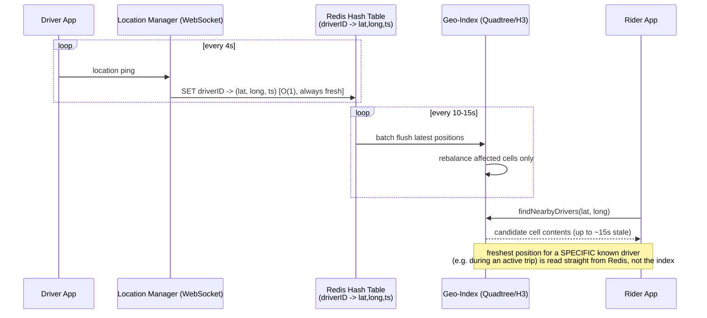
```mermaid
sequenceDiagram
    participant D as Driver App
    participant LM as Location Manager (WebSocket)
    participant R as Redis Hash Table<br/>(driverID -> lat,long,ts)
    participant Q as Geo-Index (Quadtree/H3)
    participant Rider as Rider App

    loop every 4s
        D->>LM: location ping
        LM->>R: SET driverID -> (lat, long, ts)   [O(1), always fresh]
    end
    loop every 10-15s
        R->>Q: batch flush latest positions
        Q->>Q: rebalance affected cells only
    end
    Rider->>Q: findNearbyDrivers(lat, long)
    Q-->>Rider: candidate cell contents (up to ~15s stale)
    Note over Rider,Q: freshest position for a SPECIFIC known driver<br/>(e.g. during an active trip) is read straight from Redis, not the index
```

- **Freshness split:** "where is driver X right now" (active trip tracking) reads Redis directly — always fresh. "Who's near me" (discovery) reads the spatial index — up to ~15s stale, which is an acceptable trade-off since a driver 15s away hasn't moved far.
- **Geo-sharding:** partition Redis and the geo-index by coarse region (H3 res 2–4, or simply "metro area") so a Tokyo location ping never touches a São Paulo shard. This bounds shard size, bounds blast radius of a shard failure, and satisfies data-residency requirements.
- **Consistent hashing / gossip for shard ownership:** production systems (Uber uses a library called Ringpop internally) use consistent hashing + a gossip protocol (SWIM) to assign driver IDs to owning nodes and rebalance smoothly when nodes join/leave — avoids a central coordinator being a bottleneck or SPOF.
- **Adaptive ping interval:** real systems don't use a flat 4s for everyone — drivers in dense urban cores or mid-dispatch ping faster (~1–2s) for matching accuracy; idle drivers in sparse areas can back off to 10s+ to save battery/bandwidth.

**Cheat-sheet for this section**
- The killer insight: separate the "always fresh, O(1)" hot path (hash table) from the "periodically rebuilt, spatially queryable" index — don't index on every write.
- Know the two different staleness tolerances: active-trip tracking (must be fresh) vs. nearby-discovery (15s stale is fine).
- Geo-shard by region, not by hash of driver ID — locality and blast-radius matter more than perfectly even distribution.
- Mention gossip-based membership (SWIM-style) as the production answer to "how do shards know who owns what without a single coordinator."
- Adaptive ping cadence is a nice "beyond the source" detail that shows real-world awareness (battery/bandwidth trade-off).

### 9.1 Real-time channel selection & push notification delivery

Not every client-server interaction needs the same transport. Pick the channel per use case, not one channel for everything:

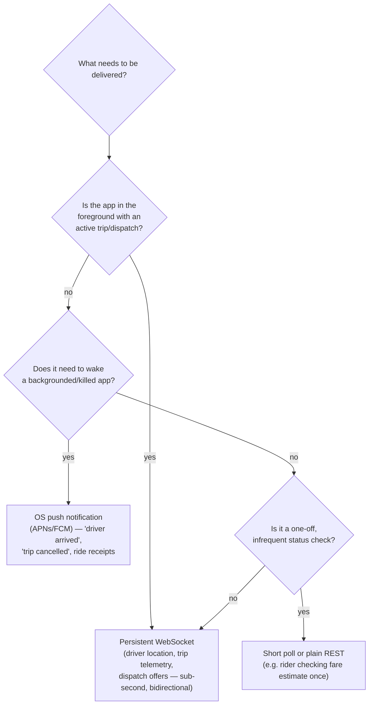
```mermaid
flowchart TD
    A{"What needs to be delivered?"} --> B{"Is the app in the<br/>foreground with an<br/>active trip/dispatch?"}
    B -- yes --> C["Persistent WebSocket<br/>(driver location, trip telemetry,<br/>dispatch offers — sub-second, bidirectional)"]
    B -- no --> D{"Does it need to wake<br/>a backgrounded/killed app?"}
    D -- yes --> E["OS push notification<br/>(APNs/FCM) — 'driver arrived',<br/>'trip cancelled', ride receipts"]
    D -- no --> F{"Is it a one-off,<br/>infrequent status check?"}
    F -- yes --> G["Short poll or plain REST<br/>(e.g. rider checking fare estimate once)"]
    F -- no --> C
```

- **WebSocket** wins for anything continuous and bidirectional while the app is open: location pings, dispatch offers, live trip telemetry. This is why Section 5.6's server-sizing table budgets ~5K-50K concurrent connections per location-ingestion server.
- **OS push (APNs/FCM)** is required, not optional, for anything that must reach a backgrounded or fully-killed app — a WebSocket only exists while the app process is alive. "Driver arrived," "trip cancelled by the other party," and the post-trip receipt all go through push, with the open WebSocket (if any) as a redundant/faster confirmation.
- **Polling/REST** is fine for genuinely one-off, low-frequency reads with no urgency (e.g., "show my ride history").

**Push delivery is fire-and-forget over an unreliable third party (APNs/FCM) — plan for retries and a fallback:**

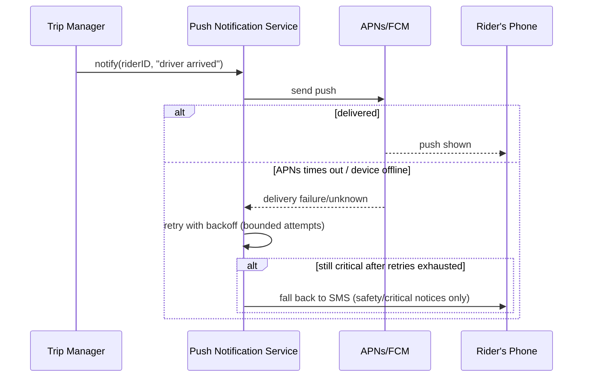
```mermaid
sequenceDiagram
    participant TM as Trip Manager
    participant PN as Push Notification Service
    participant APNs as APNs/FCM
    participant Phone as Rider's Phone

    TM->>PN: notify(riderID, "driver arrived")
    PN->>APNs: send push
    alt delivered
        APNs-->>Phone: push shown
    else APNs times out / device offline
        APNs-->>PN: delivery failure/unknown
        PN->>PN: retry with backoff (bounded attempts)
        alt still critical after retries exhausted
            PN->>Phone: fall back to SMS (safety/critical notices only)
        end
    end
```

**Worked example — notification fan-out load:** 20M daily trips × ~4 notification-worthy events/trip (matched, driver arrived, trip started, trip completed/receipt) ≈ 80M pushes/day ≈ 926 pushes/sec average, spiking to ~3,700/sec at a 4x peak factor — two orders of magnitude below the 750K/sec location firehose, which is why the push service is never the bottleneck and can run a far smaller, simpler fleet than the location-ingestion tier.

**Cheat-sheet for this section**
- Give the decision tree, not a single blanket answer, when asked "WebSocket or polling?" — the real answer is "it depends which of these three needs you're serving."
- Push notifications are unreliable-by-nature (third-party APNs/FCM, device may be offline) — always mention retry + a critical-path SMS fallback for safety-relevant messages.
- Notification volume (~1K/sec avg) is trivially small next to the location firehose — say so, it reassures the interviewer you haven't lost track of which number actually matters (Golden Rule #3).

---

## 10. Deep dive: matching / dispatch

### 10.1 Push vs pull dispatch

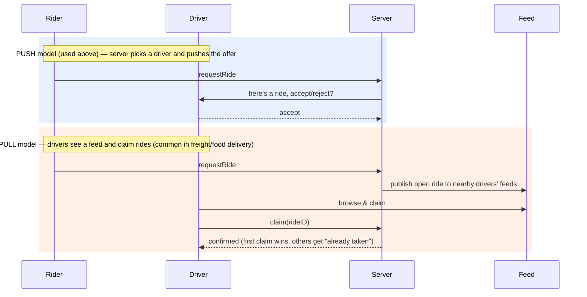
```mermaid
sequenceDiagram
    rect rgb(230,240,255)
    Note over Rider,Driver: PUSH model (used above) — server picks a driver and pushes the offer
    Rider->>Server: requestRide
    Server->>Driver: here's a ride, accept/reject?
    Driver-->>Server: accept
    end
    rect rgb(255,240,230)
    Note over Rider,Driver: PULL model — drivers see a feed and claim rides (common in freight/food delivery)
    Rider->>Server: requestRide
    Server->>Feed: publish open ride to nearby drivers' feeds
    Driver->>Feed: browse & claim
    Driver->>Server: claim(rideID)
    Server-->>Driver: confirmed (first claim wins, others get "already taken")
    end
```

| | Push | Pull |
|---|---|---|
| Who decides the match | Server (one candidate at a time or optimized batch) | Driver (browses and claims) |
| Rider wait feels like | Deterministic, sequential offers | Can feel slower (drivers cherry-pick) |
| Cherry-picking risk | Low — server controls order | High — drivers may skip low-fare/short trips |
| Best for | Rider-facing on-demand rides (Uber/Lyft core) | Freight, food delivery, gig marketplaces with driver choice |
| Failure mode | Sequential rejects add latency | "Nobody claims it" — starvation for undesirable jobs |

Uber's core rideshare product is push-based; food delivery (feed-style claiming) leans more pull-like in parts of the flow.

### 10.2 Matching algorithms — beyond "nearest driver"

**Naive:** nearest available driver by straight-line or road distance. Simple, but greedy-locally-optimal — bad for the marketplace globally (e.g., always taking the closest driver can starve a slightly-farther driver and create local supply deserts).

**Uber's real approach — batched bipartite matching (their dispatch optimization, "DISCO"-style):**

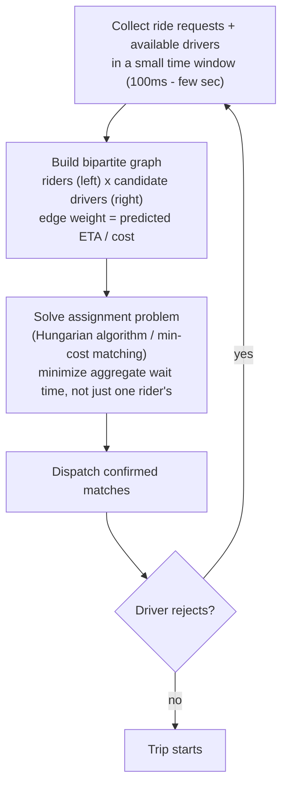
```mermaid
flowchart TD
    A["Collect ride requests + available drivers<br/>in a small time window (100ms - few sec)"] --> B["Build bipartite graph<br/>riders (left) x candidate drivers (right)<br/>edge weight = predicted ETA / cost"]
    B --> C["Solve assignment problem<br/>(Hungarian algorithm / min-cost matching)<br/>minimize aggregate wait time, not just one rider's"]
    C --> D["Dispatch confirmed matches"]
    D --> E{"Driver rejects?"}
    E -- yes --> A
    E -- no --> F["Trip starts"]
```

| Approach | Optimizes for | Cost | Latency |
|---|---|---|---|
| Greedy nearest-driver | Single rider's wait time | Cheap, O(candidates) | Instant |
| Batched bipartite matching | Whole-marketplace efficiency (aggregate ETA, fewer long-hauls) | Higher (assignment problem), needs a batching window | Small added delay (fits in match SLA) |
| Auction/bid-based | Price discovery | Complex, rarely used for core rideshare | Variable |

**Trade-off to name:** batching trades a few hundred milliseconds of added latency for materially better fleet efficiency (fewer wasted deadhead miles, more balanced pickup times across a whole zone) — worth it at Uber's scale, probably not worth the complexity for a 10-driver campus shuttle app.

**Mnemonic — dispatch selection factors ("D.R.I.V.E."):**
- **D**istance / ETA to pickup
- **R**ating & reliability (acceptance rate, cancellation history)
- **I**dle time (fairness — don't always pick the same driver)
- **V**ehicle type match (economy/XL/pool)
- **E**n-route status (prefer drivers already heading that direction over one who'd need a U-turn)

### 🆕 10.3 Search-radius expansion when no driver is found

Sometimes the geo-index query in Section 10.2 comes back empty, or every candidate it does return rejects the offer — a sparse suburb at 2am, or a sudden local supply crunch. Don't fail the request. Widen the search net.

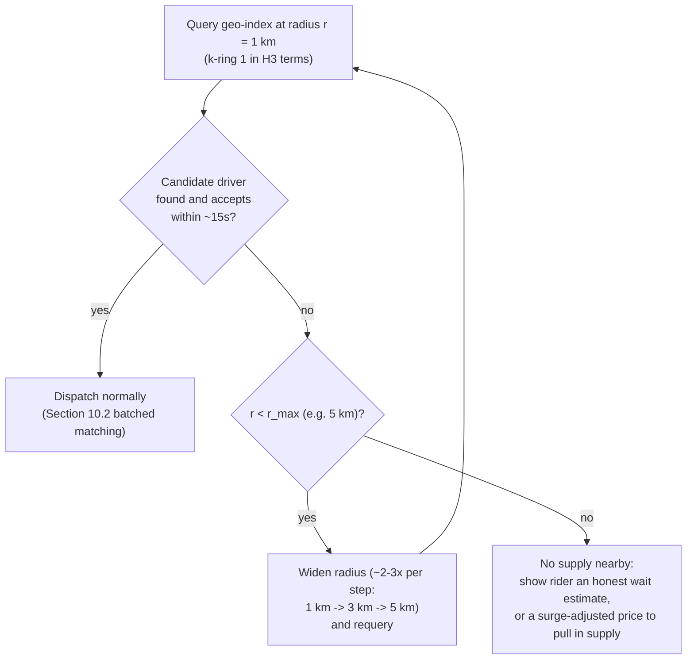
```mermaid
flowchart TD
    A["Query geo-index at radius r = 1 km<br/>(k-ring 1 in H3 terms)"] --> B{"Candidate driver<br/>found and accepts<br/>within ~15s?"}
    B -- yes --> C["Dispatch normally<br/>(Section 10.2 batched matching)"]
    B -- no --> D{"r < r_max (e.g. 5 km)?"}
    D -- yes --> E["Widen radius (~2-3x per step:<br/>1 km -> 3 km -> 5 km)<br/>and requery"] --> A
    D -- no --> F["No supply nearby:<br/>show rider an honest wait estimate,<br/>or a surge-adjusted price to pull in supply"]
```

**Illustrative numbers, not a documented Uber constant** — the pattern is what matters, not the exact figures: start at a 1 km radius, retry each ring for up to ~15s, widen roughly 2-3x per step, and give up widening past ~5 km after ~30-45s of total elapsed search. Past that cap, be honest with the rider instead of hanging silently — either a queue estimate or a surge-priced offer that might pull an idle driver in from farther away.

**Recall hook — "1-3-5-15":** radius steps 1 km → 3 km → 5 km, ~15s dwell per ring before expanding.

**Cheat-sheet for this section**
- Always name both dispatch models (push/pull) even if the interviewer only asked about Uber — shows you know the design space.
- Naive nearest-driver is a fine *starting* answer; the follow-up depth is batched bipartite matching — bring it up proactively, don't wait to be asked "can you do better?"
- Say explicitly: batching window size is a latency-vs-efficiency dial, not a fixed constant.
- Use the D.R.I.V.E. mnemonic to enumerate ranking factors instead of just "distance."
- Race condition to flag unprompted: two dispatch decisions targeting the same driver simultaneously — covered in Section 17 (failure modes).
- "What if no driver is found nearby?" is a near-guaranteed follow-up — answer with radius expansion (10.3), not silence or an infinite wait.

---

## 11. Deep dive: ETA & routing

### 11.1 The two sub-problems

1. **Shortest path** — origin to destination on a road graph.
2. **Travel time** — given the path, how long will it actually take (traffic, lights, turns)?

### 11.2 Algorithm comparison

| Algorithm | Idea | Complexity at scale | Use case |
|---|---|---|---|
| Dijkstra | Classic shortest path, explores by cumulative cost | Too slow on continent-scale graphs, single-threaded | Teaching baseline, small graphs |
| A* | Dijkstra + heuristic (e.g., straight-line distance) to prune search | Better, still not fast enough alone at global scale | Medium graphs, real-time single queries |
| **Contraction Hierarchies (CH)** | Precompute "shortcut" edges between important nodes offline; query only touches a tiny subgraph | Query time near-instant (ms), but needs periodic offline reprocessing | Production routing engines (used in OSRM, and conceptually by Uber/Google-scale systems) |
| Graph partitioning + parallel CH | Split graph into partitions/cells, preprocess each in parallel, only stitch across partition boundaries at query time | Horizontally parallelizable — if each partition's precompute takes 1s and they run in parallel, total wall-clock ≈ 1s regardless of graph size | Uber's actual described approach for planet-scale ETA |

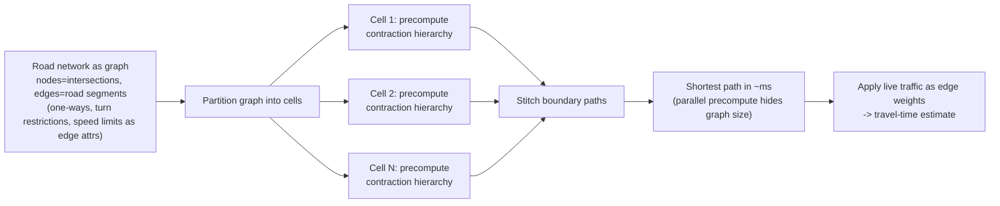
```mermaid
flowchart LR
    A["Road network as graph<br/>nodes=intersections, edges=road segments<br/>(one-ways, turn restrictions, speed limits as edge attrs)"] --> B["Partition graph into cells"]
    B --> C1["Cell 1: precompute<br/>contraction hierarchy"]
    B --> C2["Cell 2: precompute<br/>contraction hierarchy"]
    B --> C3["Cell N: precompute<br/>contraction hierarchy"]
    C1 & C2 & C3 --> D["Stitch boundary paths"]
    D --> E["Shortest path in ~ms<br/>(parallel precompute hides graph size)"]
    E --> F["Apply live traffic as edge weights<br/>-> travel-time estimate"]
```

### 11.3 DeepETA — the ML correction layer

Routing engines are good at *distance/path* but systematically mis-estimate *time* (traffic surprises, unmodeled local effects). Uber's real approach (DeepETA, described in their engineering blog):

1. Routing engine produces a baseline ETA from the best path + live traffic weights.
2. A post-processing ML model (transformer-style, quantile regression) sits on top of that baseline. It takes features like origin, destination, time of day/week, weather, live traffic, and this exact segment's historical error — then predicts a **residual correction**: how far off the routing engine's raw estimate is likely to be, and in which direction.
3. This hybrid (deterministic routing + learned residual) beats either pure-graph-algorithm ETA or pure-ML ETA alone, and is far cheaper to retrain/redeploy than a full end-to-end model.

**Cheat-sheet for this section**
- Always split the problem into path-finding vs. time-estimation — interviewers listen for this decomposition.
- Never propose raw Dijkstra as your final answer at scale — say it, then immediately upgrade to contraction hierarchies / precomputed hierarchical shortcuts.
- The parallel-partition trick (precompute independently per cell, stitch at boundaries) is the single best "sounds like you've read the real engineering blog" line.
- Mention DeepETA as the ML layer that corrects systematic routing-engine bias — frame it as "graph gives the path, ML corrects the time," not "we replaced routing with ML."
- If pressed on trade-offs: CH needs periodic offline re-preprocessing when road topology/traffic patterns change — that's the cost of the fast query time.

---

## 12. Deep dive: surge pricing

Not explicitly asked for by the source material, but a very common interview follow-up ("how would you handle a stadium letting out 50,000 people with no drivers around?").

**Mechanics:**
1. Discretize the map into fixed cells (H3 resolution 8/9 is a natural fit — uniform-size zones).
2. Continuously compute a **supply/demand ratio** per cell (open ride requests vs. available drivers), refreshed every 1–5 minutes.
3. When demand >> supply in a cell, apply a **multiplier** to the base fare in that cell — this does two things simultaneously: (a) dampens demand (some riders wait it out), (b) incentivizes idle drivers nearby to reposition into the surge cell.
4. Multiplier decays smoothly as the ratio normalizes — avoid discontinuous jumps (rider trust problem) by smoothing/capping the rate of change.

**Trade-offs:**
- Cell size too small → noisy, flickering surge boundaries (rider sees 2.1x on one side of the street, 1.0x on the other). Too large → fails to target the actual hot spot.
- Update frequency too fast → price whiplash erodes trust; too slow → doesn't clear the market during a fast-moving event (concert letting out).
- Surge is fundamentally a **read from the same live geo-index used for dispatch** — it's not a separate data pipeline, it's a different aggregation over the same driver-position stream.

### 🆕 12.1 How the multiplier actually gets computed

The prose above says "apply a multiplier" — here's the mechanism an interviewer will ask you to spell out:

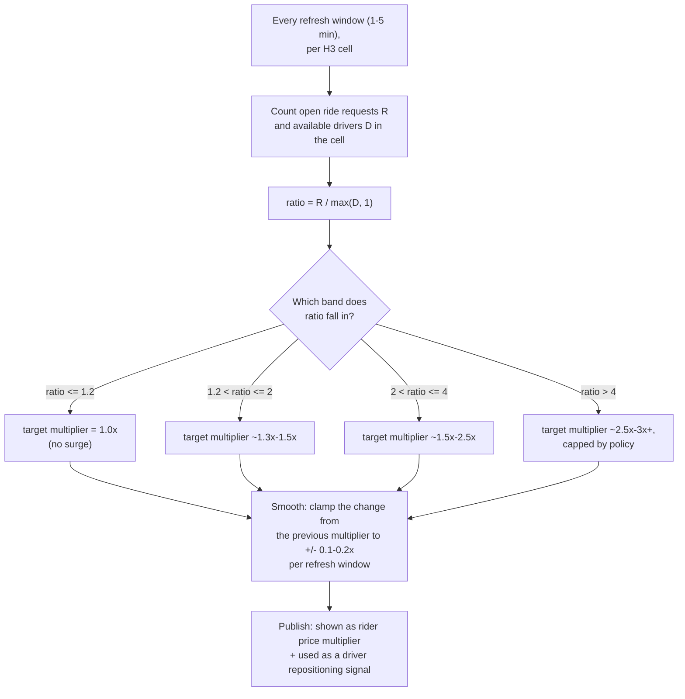
```mermaid
flowchart TD
    A["Every refresh window (1-5 min),<br/>per H3 cell"] --> B["Count open ride requests R<br/>and available drivers D in the cell"]
    B --> C["ratio = R / max(D, 1)"]
    C --> D{"Which band does<br/>ratio fall in?"}
    D -- "ratio <= 1.2" --> E["target multiplier = 1.0x<br/>(no surge)"]
    D -- "1.2 < ratio <= 2" --> F["target multiplier ~1.3x-1.5x"]
    D -- "2 < ratio <= 4" --> G["target multiplier ~1.5x-2.5x"]
    D -- "ratio > 4" --> H["target multiplier ~2.5x-3x+,<br/>capped by policy"]
    E & F & G & H --> I["Smooth: clamp the change from<br/>the previous multiplier to +/- 0.1-0.2x<br/>per refresh window"]
    I --> J["Publish: shown as rider price multiplier<br/>+ used as a driver repositioning signal"]
```

**Illustrative bands, not a published Uber formula** — the ratio thresholds and multiplier values are for demonstrating the mechanism, not exact production constants.

**Recall hook — "if X then Y":** if ratio ≈ 1 (supply meets demand), no surge. If ratio doubles, the multiplier moves up a band — but never linearly and never by more than the smoothing cap in one refresh, because an instant 3x jump is a trust problem even when the math says it's justified.

**Cheat-sheet for this section**
- Ground surge in the geo-index you already built — don't invent a parallel system.
- Name the H3-resolution choice explicitly as the surge-zone granularity lever.
- Trade-off pair to state: cell size (targeting precision) vs. update frequency (price stability).
- Mention the dual purpose: surge both suppresses demand and attracts supply — interviewers like hearing the two-sided effect.
- If asked "how exactly is the number computed," don't stop at "supply and demand" — walk through the ratio → band → smoothing-cap pipeline in 12.1.

---

## 13. Deep dive: payments

### 13.1 Sync vs async payment capture

| | Synchronous capture | Asynchronous capture (Uber's actual model) |
|---|---|---|
| When charge happens | Immediately, blocking the trip-end flow | Trip ends instantly for the user; charge processed via event stream (Kafka) in the background |
| User-perceived latency | Waits on PSP round-trip (200ms–2s) at the worst possible moment (end of ride) | Zero — "trip complete" shown immediately, receipt follows |
| Failure handling | Must retry inline or fail the whole trip-end UX | Retries, DLQ, reconciliation happen off the critical path |
| Consistency model | Simpler to reason about (one transaction) | Needs idempotency keys + reconciliation jobs to guarantee exactly-once charge |
| Best for | Low-volume, simple checkout flows | High-volume, latency-sensitive marketplaces (Uber, Amazon-scale) |

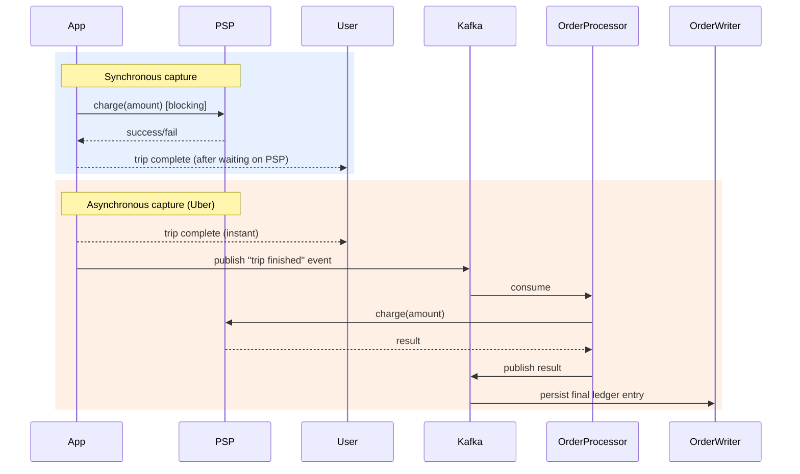
```mermaid
sequenceDiagram
    rect rgb(230,240,255)
    Note over App,PSP: Synchronous capture
    App->>PSP: charge(amount) [blocking]
    PSP-->>App: success/fail
    App-->>User: trip complete (after waiting on PSP)
    end
    rect rgb(255,240,230)
    Note over App,PSP: Asynchronous capture (Uber)
    App-->>User: trip complete (instant)
    App->>Kafka: publish "trip finished" event
    Kafka->>OrderProcessor: consume
    OrderProcessor->>PSP: charge(amount)
    PSP-->>OrderProcessor: result
    OrderProcessor->>Kafka: publish result
    Kafka->>OrderWriter: persist final ledger entry
    end
```

### 13.2 End-to-end payment workflow (pre-trip auth → post-trip capture)

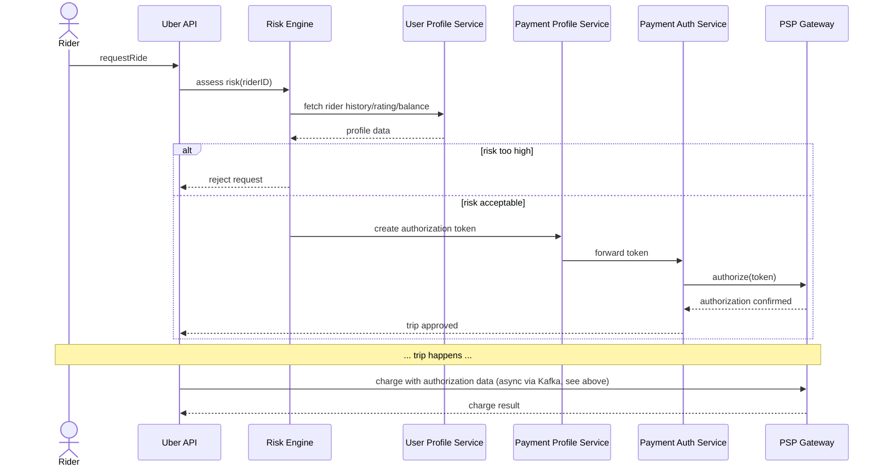
```mermaid
sequenceDiagram
    actor Rider
    participant API as Uber API
    participant Risk as Risk Engine
    participant UPS as User Profile Service
    participant PPS as Payment Profile Service
    participant PAS as Payment Auth Service
    participant PSP as PSP Gateway

    Rider->>API: requestRide
    API->>Risk: assess risk(riderID)
    Risk->>UPS: fetch rider history/rating/balance
    UPS-->>Risk: profile data
    alt risk too high
        Risk-->>API: reject request
    else risk acceptable
        Risk->>PPS: create authorization token
        PPS->>PAS: forward token
        PAS->>PSP: authorize(token)
        PSP-->>PAS: authorization confirmed
        PAS-->>API: trip approved
    end
    Note over Rider,PSP: ... trip happens ...
    API->>PSP: charge with authorization data (async via Kafka, see above)
    PSP-->>API: charge result
```

### 13.3 Kafka's role — why streaming, not direct calls

- **Decoupling**: order-creator, order-processor, and order-writer are independent services that don't need to know about each other's uptime.
- **Durability**: an event sits safely in Kafka if a downstream consumer is temporarily down — no lost charges.
- **Async processing**: PSP calls (200ms–2s, external, sometimes flaky) never block the user-facing trip-completion path.
- **Double-entry bookkeeping**: every money movement is recorded as a matched debit/credit pair in the order store — this is what makes reconciliation and audits tractable, and is the correct mental model for *any* payment ledger design question, not just Uber's.

**What to prevent (state this list from memory in an interview):**
- Lack of payment (trip completed, never charged)
- Duplicate payment (charged twice — solved via idempotency keys on the charge request)
- Incorrect payment amount (fare calculation bug)
- Incorrect currency conversion
- Dangling authorization (auth'd but never captured or voided — must have a TTL + reconciliation sweep)

**Cheat-sheet for this section**
- Lead with "money must be exactly-once" — then explain idempotency keys + Kafka as the mechanism, not just "we use a queue."
- Explicitly contrast sync vs async capture — this is a classic disambiguation the interviewer is checking for.
- Double-entry bookkeeping is the correct universal answer for any "design a payment/ledger system" sub-question — memorize the phrase and the reasoning (every transaction is a balanced debit+credit, makes the ledger auditable and self-correcting).
- Name the 5 failure scenarios ("what to prevent") from memory — it signals you've internalized the problem, not just paraphrased a slide.
- PSP integration is always the reliability weak point — mention retry/timeout/circuit-breaker around it.

---

## 14. Deep dive: fraud detection (RADAR)

**Why it's hard:** most fraud resembles a zero-day exploit — patterns you haven't seen before. Pure rule-based systems miss novel fraud; pure ML is a black box that's hard to make accountable.

**Fraud categories — mnemonic "G.P.S. F.A.K.E." (ways bad actors abuse the trip):**
- **G**PS manipulation (spoofing location / fake-GPS apps)
- **P**adding trip time/distance deliberately (long-hauling)
- **S**tolen/false identity (fake driver or rider accounts)
- **F**ees fabricated (bogus cleaning fees, damage claims)
- **A**ccept-then-abandon (confirms trip, never intends to complete it, forces rider cancellation)
- **K**it/vehicle mismatch (driving an unapproved vehicle)
- **E**ntry falsification (false info at account signup)

**RADAR architecture:**

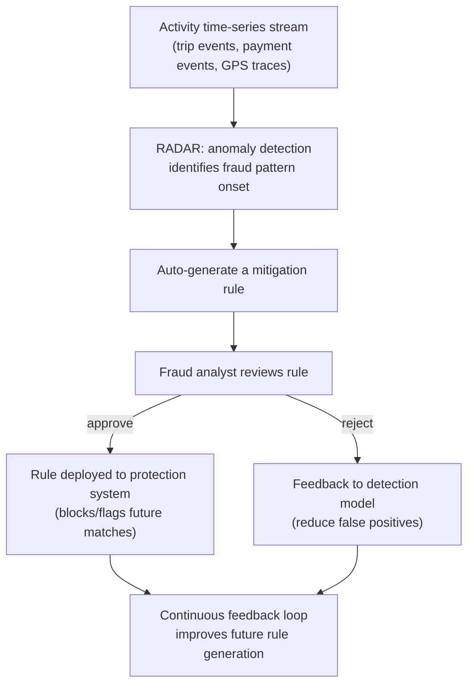
```mermaid
flowchart TD
    A["Activity time-series stream<br/>(trip events, payment events, GPS traces)"] --> B["RADAR: anomaly detection<br/>identifies fraud pattern onset"]
    B --> C["Auto-generate a mitigation rule"]
    C --> D["Fraud analyst reviews rule"]
    D -->|approve| E["Rule deployed to protection system<br/>(blocks/flags future matches)"]
    D -->|reject| F["Feedback to detection model<br/>(reduce false positives)"]
    E --> G["Continuous feedback loop<br/>improves future rule generation"]
    F --> G
```

**Two time dimensions RADAR examines:**
1. **Trip time** — real-time monitoring during the ride (rider/driver GPS coherence, speed vs. real traffic conditions, route deviation).
2. **Settlement time** — post-trip, payment processing/reconciliation window (can be days to weeks) where chargebacks and disputes surface.

**Trade-off:** human-in-the-loop review is what makes the system accountable and auditable, but it caps throughput — you can't have an analyst review every one of millions of daily trips. The design compromise is **AI proposes, human approves the *rule*** (not every instance) — one approved rule then auto-applies at scale. This amortizes human review cost across many future fraud attempts.

**Cheat-sheet for this section**
- Fraud detection is a first-class non-functional requirement for any payments-adjacent design — raise it before being asked.
- Use the G.P.S. F.A.K.E. mnemonic to rattle off fraud categories fluently.
- The key architectural idea to articulate: detect pattern → generate *rule* → human approves rule → rule auto-applies at scale. This is what makes human-in-the-loop compatible with massive throughput.
- Two time windows matter: real-time (during trip) and settlement time (days/weeks later) — don't only talk about real-time fraud.
- Acknowledge the ethical/fairness tension explicitly (automated decisions need audit trails) — this is a mature, senior-level point.

### 14.1 Security, rate-limiting & abuse prevention (beyond payment fraud)

Payment fraud (RADAR, above) is one slice of a bigger abuse surface. A few concrete controls worth naming unprompted:

| Threat | Control |
|---|---|
| Scraping driver supply/pricing via `findNearbyDrivers` | Per-account + per-IP rate limiting on read APIs; obfuscate exact positions slightly (snap to a small grid) for non-matched drivers |
| Fake ride-request spam / bot accounts | Rate limit `requestRide` per rider account; device attestation + CAPTCHA at signup; new-account trip limits until a trust score builds |
| Replayed/spoofed location pings | Signed, timestamped pings with a short validity window + nonce — a captured ping can't be replayed later to fake a location |
| Credential stuffing / account takeover | Standard auth hardening: rate-limited login, MFA for high-risk actions (changing payout bank account), anomaly-based step-up auth |
| Service-to-service trust | mTLS between internal services (location manager, dispatch, payment) so a compromised edge service can't directly impersonate the payment service |
| Driver/vehicle identity fraud | Out-of-band KYC/background check at onboarding (non-technical control, but worth naming — it's the first line of defense, before any of the above) |

**Cheat-sheet for this section**
- Rate-limiting is cheap to say and often skipped — mention per-account and per-IP limits on both write APIs (`requestRide`) and read APIs (`findNearbyDrivers`) unprompted.
- Signed/timestamped location pings defeat naive replay attacks — a nice complement to RADAR's after-the-fact anomaly detection (this is prevention, RADAR is detection).
- mTLS between internal services is the right answer to "what stops a compromised service from impersonating another one internally."

---

## 15. State machines

### 15.1 Trip lifecycle

```mermaid
stateDiagram-v2
    [*] --> Requested: rider calls requestRide
    Requested --> Matching: dispatch searches candidates
    Matching --> Requested: no driver found / all rejected (retry)
    Matching --> DriverAssigned: driver accepts
    DriverAssigned --> Cancelled: rider or driver cancels pre-pickup
    DriverAssigned --> EnRouteToPickup: driver starts navigating to rider
    EnRouteToPickup --> Arrived: driver reaches pickup location
    Arrived --> InProgress: confirmPickup called
    InProgress --> Completed: endTrip called
    Completed --> [*]
    Cancelled --> [*]
```

### 15.2 Driver availability lifecycle

```mermaid
stateDiagram-v2
    [*] --> Offline
    Offline --> Available: driver goes online
    Available --> Dispatched: matched to a ride request
    Dispatched --> Available: rider/driver cancels before pickup
    Dispatched --> OnTrip: confirmPickup succeeds
    OnTrip --> Available: endTrip succeeds
    Available --> Offline: driver goes offline
    Dispatched --> Offline: driver force-quits app (timeout triggers reassignment)
```

### 🆕 15.3 Trip → payment linkage — why `Completed` isn't really the last state

Section 15.1 treats `Completed` as terminal for the *trip* lifecycle, and that's the right scope for a trip state machine. But Section 13 showed that capture happens asynchronously afterward — in money terms, the trip isn't fully "done" until the ledger says so. Worth drawing this bridge explicitly if the interviewer pushes on "so when does the rider actually get charged":

```mermaid
stateDiagram-v2
    [*] --> Completed: endTrip called (Section 15.1)
    Completed --> Paid: async capture succeeds<br/>(Kafka pipeline, Section 13.1)
    Completed --> PaymentRetrying: PSP timeout/failure,<br/>retry with backoff
    PaymentRetrying --> Paid: retry succeeds
    PaymentRetrying --> PaymentEscalated: retries exhausted -><br/>reconciliation job / manual review
    Paid --> [*]
    PaymentEscalated --> [*]
```

This is also why trip rows migrate MySQL → Cassandra on completion (Section 7.2) while the *ledger* entry stays in the ACID store until it's actually settled: the trip record and the money settle on two related but distinct timelines, and only one of them (money) needs years of durable, auditable history.

**Cheat-sheet for this section**
- Drawing these two state machines unprompted answers "what happens if X cancels at step Y" before it's even asked.
- The transition guard worth calling out: `Dispatched --> Offline` (app crash / connectivity loss mid-dispatch) must trigger a timeout-based reassignment — tie this back to Section 17's failure modes.
- Trip state lives in the strongly-consistent store (MySQL) precisely because these transitions must never race (e.g., can't be `Completed` and `Cancelled` simultaneously).
- If asked "what happens after `Completed`," don't shrug — walk the `Completed -> Paid` bridge in 15.3, it's a natural segue back into the payments deep dive (Section 13).

---

## 16. Key design decisions & trade-offs

| Decision | Alternative rejected | Why this choice | Cost accepted |
|---|---|---|---|
| Redis hash table for live location + async flush to spatial index | Update quadtree/H3 index on every ping | Spatial index rebuild/rebalance is too costly at 750K writes/sec | Nearby-driver search is up to ~15s stale |
| Cassandra for completed trips + location history | Single MySQL for everything | Need horizontal write scale for ever-growing history at ~162 GB/day | Eventual consistency, no multi-row ACID transactions on history data |
| MySQL for in-progress trip state | Cassandra for everything | Trip state needs relational integrity + strong consistency (no double-booking) | Vertical scaling limits (mitigated: trip volume in-flight at once is much smaller than historical volume) |
| Async payment capture via Kafka | Synchronous charge at trip-end | User-facing latency must not depend on PSP round-trip | Requires idempotency keys + reconciliation jobs for exactly-once guarantees |
| Batched bipartite matching | Greedy nearest-driver | Better aggregate marketplace efficiency | Adds a small batching-window delay (100ms–few sec) |
| H3 hexagonal grid for dispatch/surge | Geohash or plain quadtree | Uniform neighbor distance = undistorted radius search | More complex indexing math/library dependency |
| Geo-sharding by region | Sharding by consistent hash of driver ID | Data locality, regulatory residency, bounded blast radius | Potential regional hot spots (e.g., NYC shard is busier than a small-city shard) — needs per-region capacity planning |
| WebSockets for driver/rider connections | Polling over HTTP | Push-based low-latency updates, fewer wasted requests | More server-side connection-state to manage; reconnection/session-resume logic needed |
| Human-approved auto-rules (RADAR) | Fully automated ML blocking | Accountability/auditability of high-stakes account/payment actions | Throughput capped by analyst review bandwidth (amortized via "approve the rule, not the instance") |

---

## 17. Bottlenecks, failure modes, and how to address them

| Failure mode | Symptom | Mitigation |
|---|---|---|
| Location-ingestion hot shard | One metro's WebSocket tier saturates while others idle | Geo-shard by region + autoscale per-shard; adaptive ping backoff for idle drivers |
| **Double-dispatch race**: two riders matched to the same driver simultaneously | Driver receives two ride offers at once | Optimistic locking / compare-and-swap on driver state (`Available -> Dispatched`) at the trip-manager layer; only one transition succeeds, loser retries matching |
| Driver goes offline mid-dispatch (network drop, app crash) | Rider stuck waiting indefinitely | Dispatch timeout (10–15s) + automatic reassignment to next candidate |
| Primary DB failure (MySQL for in-progress trips) | Trip writes fail, in-flight trips stuck | Primary-secondary synchronous replication; automatic failover promotes a secondary |
| Cassandra node/rack failure | Partial data unavailability for history reads | Replication factor 3, quorum reads/writes, multi-AZ placement |
| Redis node failure (live location) | Momentary loss of freshest positions for drivers on that shard | Redis replica promotion; worst case falls back to last-flushed spatial-index position (~15s stale) — graceful degradation, not total outage |
| PSP gateway outage/slowness | Payments stuck, trips can't "settle" | Kafka buffers events durably; retries with backoff; trip UX is unaffected because capture is async (Section 13) |
| Duplicate charge | Rider billed twice for one trip | Idempotency key per trip/charge; order-writer dedupes on that key |
| Surge-pricing whiplash | Rider sees price jump/drop rapidly, erodes trust | Smooth/cap rate-of-change of the multiplier; minimum cell size to avoid boundary flicker |
| GPS spoofing (fraud) | Fake pickup/drop-off, inflated fares | RADAR anomaly detection cross-checks GPS trace vs. real traffic/road network plausibility |
| GPS drift/noise (not spoofing — imprecise sensors, tunnels, urban canyons) | False "route deviation" fraud flags, jumpy trip-map rendering | Smoothing/dead-reckoning between pings, snap-to-road logic, and a noise-tolerance band before RADAR flags a deviation as suspicious |
| Driver goes offline **mid-trip** (phone dies, app crash during an active ride — distinct from mid-dispatch) | Trip stuck "in progress," rider/driver's live position frozen | Trip doesn't hard-fail: last-known position + elapsed time still support fare calc; safety-check prompt to the rider; trip auto-resolves via timeout + support escalation |
| 🆕 Rider's phone dies / app killed **mid-trip** (the other direction from the row above) | Rider sees no live updates on their own screen | No impact on the trip itself: the driver app is the source of truth for `confirmPickup`/`endTrip`, so the trip completes and charges normally off the driver's confirmation; the rider gets the receipt via push/SMS once back online |
| 🆕 Rider **no-show** at pickup (driver arrives, rider never comes out) | Driver stuck waiting, earning nothing, can't take the next ride | Grace timer after the `Arrived` state (illustrative: ~5 min); once it expires, auto-cancel + charge the rider a no-show fee, free the driver back to `Available` — this is the concrete mechanism behind the `cancelRide` API's fee note in Section 7.1 |
| Network partition between regions (e.g., Americas shard can't reach the EU shard or a shared global service) | Cross-region features (global trip search, corporate multi-market billing) degrade; in-region ride-hailing keeps working | Geo-sharding means each region is self-sufficient for its own riders/drivers by design — a partition should only ever affect cross-region edge cases, never in-region core dispatch. This is the direct reward for geo-sharding — name it explicitly |
| Thundering herd on event end (stadium/concert) | Sudden massive demand spike, no supply nearby | Surge pricing to reposition supply + demand-side smoothing (queueing/ETA warning shown before confirming request) |

### Race-condition deep dive: double-dispatch

```mermaid
sequenceDiagram
    participant D1 as Dispatch Request A
    participant D2 as Dispatch Request B
    participant TM as Trip Manager (driver state: CAS)
    participant Driver

    par Simultaneous dispatch attempts
        D1->>TM: CAS driverState Available->Dispatched (for ride A)
    and
        D2->>TM: CAS driverState Available->Dispatched (for ride B)
    end
    TM-->>D1: success (state was Available)
    TM-->>D2: failure (state already Dispatched)
    D1->>Driver: offer ride A
    D2->>D2: pick next candidate driver for ride B
```

### Failure deep dive: cross-region network partition

```mermaid
sequenceDiagram
    participant RiderEU as Rider (EU)
    participant EU as EU Region Shard
    participant Global as Global Coordination Service
    participant US as Americas Region Shard

    RiderEU->>EU: requestRide (pickup in EU)
    EU->>EU: match locally (own Redis, own H3 index, own Trip Manager)
    Note over EU,US: Network partition: EU <-x-> US / Global
    EU-->>RiderEU: matched (fully served in-region, unaffected)
    Note over Global,US: Only cross-region features degrade:<br/>global trip history search, corporate cross-market billing, etc.
```

**Cheat-sheet for this section**
- The double-dispatch race is the #1 follow-up question — always pre-empt it with compare-and-swap (or a distributed lock / single-writer-per-key) on driver state.
- Every AP component (location, nearby search) should degrade gracefully to "slightly stale," never to "unavailable."
- Every CP component (trip state, payment ledger) should fail closed (reject/retry) rather than risk double-booking or double-charging.
- Distinguish transient failures (retry with backoff) from structural ones (reassign, failover) in your answer — naming the difference shows maturity.
- Always tie a failure mode back to which non-functional requirement it threatens (availability vs. consistency vs. fraud).
- Cross-region network partitions are the "so what did geo-sharding actually buy you" follow-up — the answer is that a partition degrades only cross-region features, never in-region core dispatch, because each region shard is self-sufficient by design.

---

## 18. Real-world references — how Uber actually solved it

| System/Concept | What it is | Where it fits |
|---|---|---|
| **H3** | Uber's open-sourced hexagonal hierarchical geospatial indexing system (2018) | Dispatch search radius, surge-pricing zones, demand heatmaps |
| **DISCO-style dispatch optimization** | Marketplace-level bipartite matching over a request/driver batching window rather than greedy nearest-match | Ride matching engine |
| **DeepETA** | Uber's ML model (described in their 2022 engineering blog) that predicts a residual correction on top of a routing engine's baseline ETA using deep learning / quantile regression | ETA service |
| **RADAR** | Human-assisted AI fraud detection & mitigation platform | Payment/fraud pipeline |
| **Apache Kafka** | Backbone stream-processing platform for the payments pipeline (order creator → processor → writer) | Payment service |
| **Cassandra** | Wide-column NoSQL store for high-volume, high-write historical data (trip records, location breadcrumbs) | Storage tier |
| **Schemaless / Docstore** | Uber's internally-built datastores (Schemaless on top of MySQL historically, later Docstore) for trip and other core entity storage at scale | Storage tier evolution |
| **Ringpop** | Uber's library for building sharded, fault-tolerant services using consistent hashing + gossip (SWIM protocol) membership | Shard ownership for location/geo services |
| **Cadence / Cherami (→ Temporal)** | Uber's durable workflow orchestration engine, used for long-running/stateful processes (e.g., trip lifecycle, payment sagas) that must survive process crashes | Trip & payment orchestration |
| **Google Cloud Spanner (per course material)** | Globally consistent, horizontally-scalable relational DB Uber has explored/adopted in parts of their stack for global transactions with strong consistency | Alternative to MySQL+Cassandra split, trading operational simplicity for vendor dependency |

**Cheat-sheet for this section**
- Namedropping H3, RADAR, DeepETA, Kafka correctly (with what they actually do, not just the name) is the fastest way to signal you've gone past the course material.
- If asked "is this exactly how Uber does it," be honest: this is a defensible interview-scale design *inspired by* Uber's publicly documented architecture, not their literal current production system (which has evolved significantly and isn't fully public).
- Ringpop/gossip-based membership is a great answer to "how do you avoid a single coordinator for shard ownership."
- Cadence/Temporal-style durable workflows are the correct answer to "what if the process orchestrating a trip crashes halfway through" — durable, replayable workflow state, not just retries.

---

## 19. Golden rules

1. **Split CAP by component, not by system** — location is AP, money and trip state are CP. Say this in one sentence early.
2. **Decouple the write-hot path from the query-index** — never rebuild a spatial index on every write; buffer in a hash table, flush periodically.
3. **The busiest number wins the architecture** — here it's the 750K/sec location-ping firehose, not the 232/sec ride requests. Design for the bottleneck, not the headline feature.
4. **Every match decision needs a single-writer guarantee** — compare-and-swap or equivalent on driver state prevents double-dispatch; this is the #1 asked-about race condition.
5. **Payments are exactly-once by construction, not by luck** — idempotency keys + async event log (Kafka) + double-entry bookkeeping, always.
6. **Async the user-facing critical path away from external dependencies** — never let a PSP round-trip block "trip complete."
7. **Freshness requirements are not uniform** — active-trip tracking must be fresh; discovery/search can tolerate seconds of staleness. Exploit this gap for scale.
8. **Fraud and trust are non-functional requirements, not an afterthought** — raise them before asked, on any system that moves money or has anonymous multi-sided actors.
9. **Geo-shard by locality, not by a "fair" hash** — data residency, regional failover, and hot-spot isolation matter more than perfectly even key distribution.
10. **Name the trade-off, always** — every design choice above has a stated cost; an answer without a stated cost sounds like marketing, not engineering.

---

## 20. Master cheat sheet

**Formulas**
```
Location-ping QPS   = active_drivers / ping_interval_seconds
Ride-request QPS    = daily_trips / 86,400
Peak QPS             = avg_QPS × 3-5   (ride-hailing peak factor, higher than typical web's 2x)
Storage/day (history) = daily_trips × (trip_duration_sec / ping_interval_sec) × bytes_per_ping
Replicated storage    = raw_storage × replication_factor (typically 3)
Node count            = total_storage_needed / usable_capacity_per_node
Servers (per service) = peak_QPS_for_that_service / RPS_per_server × redundancy_factor
Naive polling QPS      = active_clients / poll_interval_seconds   (compare this against push QPS — Section 7.5)
```

**Numbers**
- 750,000 location writes/sec (3M drivers / 4s) — the dominant QPS.
- 232 avg / ~930-1,200 peak ride-requests/sec (20M trips/day).
- ~162 GB/day of location breadcrumb history (the storage number the naive answer misses).
- Entire live driver fleet fits in <2 GB of RAM.
- Geohash length 7 ≈ 153m cell; H3 res 8 ≈ 461m hex edge, res 9 ≈ 174m.
- Dispatch timeout: 10–15s before reassignment.
- Batching window for matching optimization: 100ms–few seconds.
- Cross-region latency 50–150ms — why you geo-shard instead of going global-consistent.
- ~926 avg / ~3,700 peak push notifications/sec (20M trips × ~4 events/trip) — two orders of magnitude below the location firehose.
- Naive single-DB polling design: ~600,000 wasted poll requests/sec at 5s intervals — the number that motivates moving to WebSocket push (Section 7.5, Stage 1→2).
- A scoped-down redo (60M riders, 1.5M drivers, 2s ping) still lands on the same 750K/sec — proves the formula, not the raw driver count, is what matters (Section 5.7).
- 🆕 Illustrative radius expansion on no-match: 1km → 3km → 5km cap, ~15s dwell per ring (Section 10.3) — not a documented Uber constant, a pattern to reason from.
- 🆕 Illustrative surge bands: ratio ≤1.2 → 1.0x; ≤2 → ~1.3-1.5x; ≤4 → ~1.5-2.5x; beyond → ~2.5-3x+ capped, change throttled to ±0.1-0.2x per refresh window (Section 12.1).

**Mnemonics**
- **D.R.I.V.E.** — dispatch ranking factors: Distance/ETA, Rating, Idle-time fairness, Vehicle match, En-route status.
- **G.P.S. F.A.K.E.** — fraud categories: GPS spoofing, Padding trip, Stolen identity, Fake fees, Accept-then-abandon, Kit/vehicle mismatch, Entry falsification.
- 🆕 **1-3-5-15** — matching radius expansion: 1km → 3km → 5km cap, ~15s per ring (Section 10.3).

**Disambiguation quick answers**
- Geohash vs Quadtree vs H3 → string-prefix grid vs density-adaptive tree vs uniform-neighbor hex grid; Uber picks H3 for undistorted radius search.
- Push vs Pull dispatch → server-assigns-one-candidate vs drivers-browse-and-claim; Uber core rideshare is push.
- Sync vs Async payment capture → block on PSP now vs instant UX + Kafka-driven background charge; Uber is async.
- WebSocket vs OS push vs polling → app-open/continuous vs app-backgrounded/must-wake vs one-off/no-urgency (Section 9.1).
- RAM (live location) vs wide-column (history) vs RDBMS (trip state + ledger) → ephemeral-hot vs append-only-huge vs ACID-required (Section 7.2).

**Golden one-liners for wrap-up**
- "Location is AP with a 15-second staleness budget; trip state and money are CP with zero tolerance for double-booking or double-charging."
- "The architecture is shaped by 750K writes/sec, not by the marquee ride-request feature."
- "Every match is a compare-and-swap on driver state; every charge is an idempotent event through Kafka."
- "We buy fleet-wide dispatch efficiency with a small batching-window latency tax — a deliberate trade, not an oversight."
- "I'd start with a single DB and polling, show you it breaks at 600K wasted polls/sec and 150ms cross-region latency, then evolve it in two steps to the geo-sharded design."
