# Designing Twitter — FAANG Interview Guide

> **Enhancement notes:** this pass added (1) a retweet-vs-quote-tweet data modeling subsection with a worked numeric example and a decision flowchart — the one functional gap in an otherwise very thorough guide, (2) a trending-topic aggregation-window trade-off table (1 min vs 5–15 min vs 1 hr+) with an "if asked, say this" recall line, (3) a lighter, bulleted rewrite of the dense continuous-ring load-balancing paragraph in §7.5, and (4) a new row in the Master Cheat Sheet reflecting the retweet/quote-tweet distinction. Everything else — mental model, capacity math, the three-stage architecture evolution, fan-out/celebrity/search/trending/graph deep dives, all existing diagrams, mnemonics, and cheat-sheets — was already strong and is left untouched. New material is marked with 🆕.

## 1. Mental Model

Twitter is not a storage problem. It's a **fan-out problem** wearing a storage costume.

> **Analogy: "One loudspeaker, a million inboxes."** Posting a tweet is cheap — one write. The hard part is that up to hundreds of millions of "inboxes" (follower timelines) may need to hear about it, fast. Every design decision in this chapter — fan-out-on-write, hybrid fan-out, sharded counters, Redis timelines — exists to answer one question: **who does the expensive work, the writer or the reader, and when?**

Second mental model: **read:write ratio ≈ 1000:1**. Twitter is read-heavy. Every architectural choice (caching, denormalization, precomputed timelines) optimizes for cheap, fast reads at the expense of more expensive, asynchronous writes. If you remember one number, remember this ratio — it justifies almost every trade-off below.

Third mental model: **the celebrity is the adversary.** A uniform design (every tweet fans out to every follower synchronously) works for 99.99% of users and collapses for the 0.01% with 10M+ followers. Twitter's real architecture is a hybrid built specifically to survive that 0.01%.

---

## 2. Interview Playbook

Repeatable checklist — run this in every social-feed / feed-generation system design interview (Twitter, Instagram, Facebook Newsfeed, TikTok For-You).

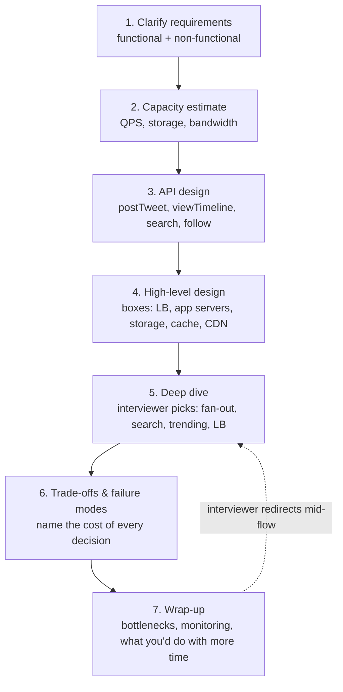

Mnemonic for the 7 steps — **"Careful Cats Always Hunt Down Tasty Whiskers"** → Clarify, Capacity, API, High-level, Deep-dive, Trade-offs, Wrap-up.

Time-box for a 45-min interview: Clarify (5 min) → Capacity (5 min) → API (3 min) → High-level (10 min) → Deep dive (15 min) → Trade-offs/failure (5 min) → Wrap-up (2 min).

**How to identify this topic in an interview:** phrases like *"design Twitter/X"*, *"design a news feed"*, *"design Instagram/Facebook timeline"*, *"design a system where celebrities post to millions of followers"*, or *"design a system with a very skewed follower graph"* are all the same problem in disguise — fan-out + timeline generation is the core.

**Section cheat-sheet:**
- State the mental model out loud in your first 30 seconds — it signals seniority.
- Read:write ratio (~1000:1) is your license to over-invest in caching and precomputation.
- Always name the celebrity/hot-key problem before the interviewer asks — it's the "gotcha" they're waiting for.
- Time-box yourself; don't let API design eat your deep-dive time.
- If the interviewer doesn't pick a deep-dive area, default to fan-out (timeline generation) — it's the richest topic.

---

## 3. Requirements Clarification

### Functional Requirements

| # | Requirement | Notes |
|---|---|---|
| 1 | Post tweet | Text (≤280 chars), image, video (≤140s), or combination |
| 2 | Delete tweet | Soft-delete in practice — see reliability below |
| 3 | Like / unlike tweet | High write-amplification on celebrity tweets |
| 4 | Reply to tweet | Threaded; itself a tweet with a parent pointer |
| 5 | Retweet / undo-retweet | Re-post reference, not a content copy |
| 6 | Follow / unfollow | Mutates the social graph |
| 7 | View home timeline | Followed accounts' tweets, ranked |
| 8 | View user timeline | Just one user's own tweets |
| 9 | Search tweets | Keyword, hashtag, username |
| 10 | Trending topics | Top-K hashtags, local + global |
| 11 | Receive notifications | Only for high-intent events (mention/reply/like-on-your-tweet/new-follower) — see §7.9, not a full timeline fan-out |
| 12 | Block / report a user | Blocked accounts must be filtered from timeline, search, and notifications — see §7.11 |

### Non-Functional Requirements

Mnemonic: **"All Little Squirrels Race Cars"** → **A**vailability, **L**atency, **S**calability, **R**eliability, **C**onsistency.

| Property | Requirement | Why |
|---|---|---|
| Availability | High (favor availability over consistency for reads) | Time-sensitive info (outages, breaking news) — an unavailable feed is worse than a stale one |
| Latency | Tweet fan-out: near real-time (seconds). Timeline render: sub-second from cache. Trends: can lag minutes. | Different SLAs per feature — don't over-promise uniformly |
| Scalability | Read-heavy, ~1000:1 read:write | Scale read path (cache, replicas, CDN) far more aggressively than write path |
| Reliability | Tweets are never deleted (soft-delete only), no data loss | Durable, replicated storage; delete = tombstone flag, not physical removal |
| Consistency | Eventual, with a **locality gradient**: instant for the actor, near-instant regionally, eventually consistent globally | A like registers instantly for the liker, propagates to nearby regions fast, and reaches global counters/timelines with lag — classic AP system (CAP) |

**How to identify this topic in an interview:** if the interviewer says *"it's okay if a like count is slightly stale but the tweet must never be lost"* — they're telling you it's an **AP system** (available + partition-tolerant, eventually consistent), not CP. Say that phrase back to them.

**Section cheat-sheet:**
- Lead with functional requirements the interviewer actually cares about — trim edge cases (undo-retweet, dislike) to one line.
- State the 1000:1 read:write ratio explicitly — it drives every later decision.
- Call out that "reliability" here means **never delete**, which forces soft-deletes and impacts storage growth estimates.
- Frame consistency as a **gradient** (self → region → world), not binary — this is a strong signal of seniority.
- Availability > strict consistency for the feed; strong consistency only where money/identity is involved (ads billing, auth) — out of scope but worth a one-liner.

---

## 4. Capacity Estimation — Worked Example

State assumptions loudly, then chain the math. Numbers are illustrative but internally consistent — that consistency is what interviewers grade.

```text
ASSUMPTIONS
  Registered users              = 500M
  DAU                            = 200M
  % of DAU who tweet/day         = 20%        →  40M tweets/day
  Avg followers/user (fan-out)   = 200         (celebrities handled separately — see §7.2)
  Read : Write ratio (impressions:tweets) = 1000 : 1
  Peak traffic factor            = 3x average (daytime skew)
  Avg tweet metadata size        = 400 bytes  (id+user_id+text+timestamp+flags)
  % tweets with media            = 20%
  Avg media size (blended img/video) = 1 MB
  Replication factor             = 3x
  Data retention                 = forever (never deleted)

STEP 1 — WRITE QPS
  40,000,000 tweets/day / 86,400 s        = 463 QPS avg
  463 QPS * 3 (peak factor)               = ~1,400 QPS peak

STEP 2 — READ QPS  (impressions across all timelines)
  463 QPS * 1000 (read:write ratio)       = 463,000 QPS avg
  463,000 * 3                             = ~1.4M QPS peak
  → ~99% served from Redis timeline cache / CDN, not origin DB

STEP 3 — FAN-OUT WRITE QPS  (the real bottleneck, not step 1)
  40M tweets/day * 200 avg followers      = 8B fan-out writes/day
  8,000,000,000 / 86,400                  = ~92,600 QPS avg
  92,600 * 3                              = ~278,000 QPS peak
  → fan-out multiplies raw write QPS by ~200x. THIS is what you scale for.

STEP 4 — STORAGE (tweet metadata, text only)
  40M tweets/day * 400 bytes              = 16 GB/day
  16 GB * 365                              = ~5.8 TB/year
  Over 10 years (never deleted)           = ~58 TB raw
  * replication factor 3                  = ~175 TB metadata footprint

STEP 5 — STORAGE (media, Blobstore)
  40M * 20% * 1 MB                        = 8 TB/day
  8 TB * 365                               = ~2.9 PB/year
  Over 10 years                           = ~29 PB raw
  * ~1.4x (erasure coding, not full 3x)   = ~40 PB effective

STEP 6 — SHARD COUNT (metadata store, e.g. Manhattan/Cassandra-style)
  Target shard size ~500 GB (operational sweet spot)
  175 TB / 500 GB                         = ~350 shards (round up → 400 w/ headroom)
  Media lives in object/blob storage — sharded by blob-id hash, ~unbounded horizontal scale, no fixed count.

STEP 7 — TIMELINE CACHE SIZE (Redis, precomputed home timelines)
  Materialize last 800 tweet IDs/user (real Twitter number)
  200M DAU * 800 ids * 8 bytes             = 1.28 TB
  + ~20% Redis object/skiplist overhead    = ~1.5 TB cluster RAM (ID lists only)

STEP 8 — BANDWIDTH
  Write path (text), peak: 1,400 QPS * 400B         = ~560 KB/s   (negligible)
  Media ingestion, peak: (40M*0.2/86400)*3 * 1MB    = ~278 MB/s  (~2.2 Gbps)
  Read bandwidth: dominated by CDN egress for media, not origin servers
```

### Numbers Worth Memorizing

| Metric | Value |
|---|---|
| Read : Write ratio | ~1000 : 1 |
| Tweet size (text + metadata) | ~400 bytes |
| Tweet character limit | 280 chars |
| Default video clip limit | 140 s |
| Fan-out multiplier (avg follower count) | ~200x write amplification |
| Home timeline cache depth | ~800 tweet IDs/user (Redis) |
| Search index latency (new tweet → searchable) | ~15 s (2019, Twitter eng blog) |
| Search response time | ~100 ms over ~1 trillion records |
| Peak traffic factor | ~3x average (daytime skew) |
| Celebrity fan-out threshold (rule of thumb) | ~10K followers — switch to pull model above this |
| Manhattan shard granularity (rule of thumb) | ~500 GB/shard |

**Section cheat-sheet:**
- Always compute **fan-out QPS separately from write QPS** — it's 100–200x larger and is the number that actually drives your architecture.
- Storage estimate must account for "never delete" — multiply by retention years, not just "current data."
- Cache size for timelines is bounded by (**DAU × cached-depth × id-size**), not total tweet volume — that's why it's tractable.
- Bandwidth: text is negligible, media dominates — this justifies routing media through CDN/blob store, not the DB.
- Round numbers up and say so out loud ("~350 shards, I'll provision 400 for headroom") — interviewers want to see margin-of-safety thinking, not false precision.

---

## 5. High-Level Design

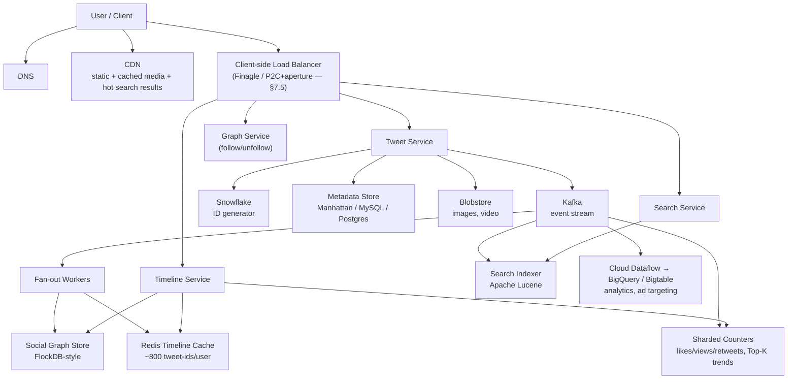

**Component walkthrough (in request order):**
1. **DNS** resolves to the nearest edge / load balancer.
2. **CDN** serves static assets and hot/cached search or media content before hitting origin.
3. **Load balancer** (client-side at Twitter's scale — §7.5) routes to the right microservice.
4. **Tweet Service** — handles `postTweet`, `likeTweet`, `replyTweet`, `retweet`: generates a Snowflake ID, writes text/metadata to the metadata store, media to Blobstore, and emits an event to Kafka.
5. **Fan-out workers** consume the Kafka event, read the author's follower list from the graph store, and push the tweet ID into each follower's Redis timeline (except celebrities — see hybrid fan-out).
6. **Timeline Service** answers `viewHome_timeline`/`viewUser_timeline` by reading the precomputed Redis list, hydrating tweet objects, merging in celebrity/ad/recommended content, and ranking.
7. **Search Service** answers `searchTweet` from a real-time Lucene index (last ~7 days, in RAM) or the full historical index (batch-built, 100x larger).
8. **Sharded counters** aggregate likes/views/retweets per tweet and per hashtag, feeding both timeline ranking and Top-K trending computation.

### API Design (condensed)

| API | Method | Key params |
|---|---|---|
| `/postTweet` | POST | `user_id, tweet_type, content, media_field, list_of_followers, post_time, hashtags` |
| `/likeTweet` / `/dislikeTweet` | POST | `user_id, tweet_id, tweeted_user_id, user_location` |
| `/replyTweet` | POST | `user_id, tweet_id, reply_type, reply_length, list_of_followers` |
| `/retweet` / `/undoRetweet` | POST | `user_id, tweet_id, retweet_user_id, list_of_followers` |
| `/searchTweet` | GET | `search_term, max_result, exclude, sort_order, next_token` |
| `/viewHome_timeline` / `/viewUser_timeline` | GET | `user_id, tweets_count, max_result, next_token, list_of_followers` |
| `/followAccount` / `/unfollowAccount` | POST | `account_id, followed_account_id` |

Note: `list_of_followers` is filled server-side by the front-end/API-gateway layer (a fan-out to another internal service), not supplied by the client.

**Section cheat-sheet:**
- Draw the diagram top-down: client → edge (DNS/CDN/LB) → services → async pipeline (Kafka) → storage. Interviewers follow this left-to-right/top-down flow naturally.
- Separate services by **read pattern**, not just by feature: Tweet (write-heavy), Timeline (read-heavy, cache-backed), Search (index-backed), Graph (relationship-backed).
- Kafka is the backbone that decouples the synchronous write path from every asynchronous consumer (fan-out, search indexing, analytics, counters) — say this explicitly.
- Don't over-specify APIs; give 2–3 fully, then table the rest.
- Mention that `postTweet` returns fast (ack after metadata + media persisted) — fan-out happens **after** the response, never blocking it.

### Data Model / Schema

Six entities cover the whole system. Mnemonic: **"Ugly Turtles Follow Little Rats Merrily"** → **U**ser, **T**weet, **F**ollow-edge, **L**ike, **R**etweet, **M**edia.

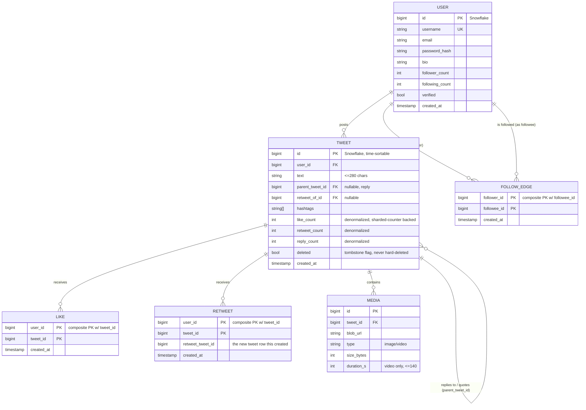

**Storage-engine mapping** (which physical store owns each entity — ties back to §5's polyglot boxes):

| Entity | Store | Why |
|---|---|---|
| USER, TWEET (metadata) | Manhattan / sharded relational | High QPS KV access by ID, needs durability |
| FOLLOW_EDGE | FlockDB-style sharded MySQL (graph-shaped) | Optimized for follower/followee list + existence-check queries, not general graph traversal — see §7.8 |
| LIKE, RETWEET | Sharded KV, existence-check indexed by `(user_id, tweet_id)` | Very high write volume; count is denormalized onto TWEET via sharded counters (§7.4), not computed by `COUNT(*)` |
| MEDIA (blob bytes) | Blobstore + CDN | Large binary objects, cheap cold storage, edge-cached for reads — see §7.7 |

#### 🆕 Retweet vs Quote Tweet — Data Modeling

A retweet and a quote tweet are **the same TWEET row shape** — no seventh entity needed. The only difference is which columns get filled in:

| | Simple retweet | Quote tweet |
|---|---|---|
| New TWEET row created? | Yes (a thin new row) | Yes |
| `text` | Empty/null — no added content | Non-empty — the quoting user's own commentary |
| `retweet_of_id` | Set → points at the original tweet | Set → points at the original tweet |
| Renders as | "user_A retweeted" + embedded original | "user_A: [new text]" + embedded original |
| RETWEET table row | Yes — needed for undo + existence-check ("did I already retweet this?") | Optional — the new TWEET row with `text` + `retweet_of_id` set is often record enough on its own |

Mnemonic: **empty `text` = plain retweet, non-empty `text` = quote tweet.** Same foreign key (`retweet_of_id`), one column decides which UI it renders as. Nothing else in the schema branches on it.

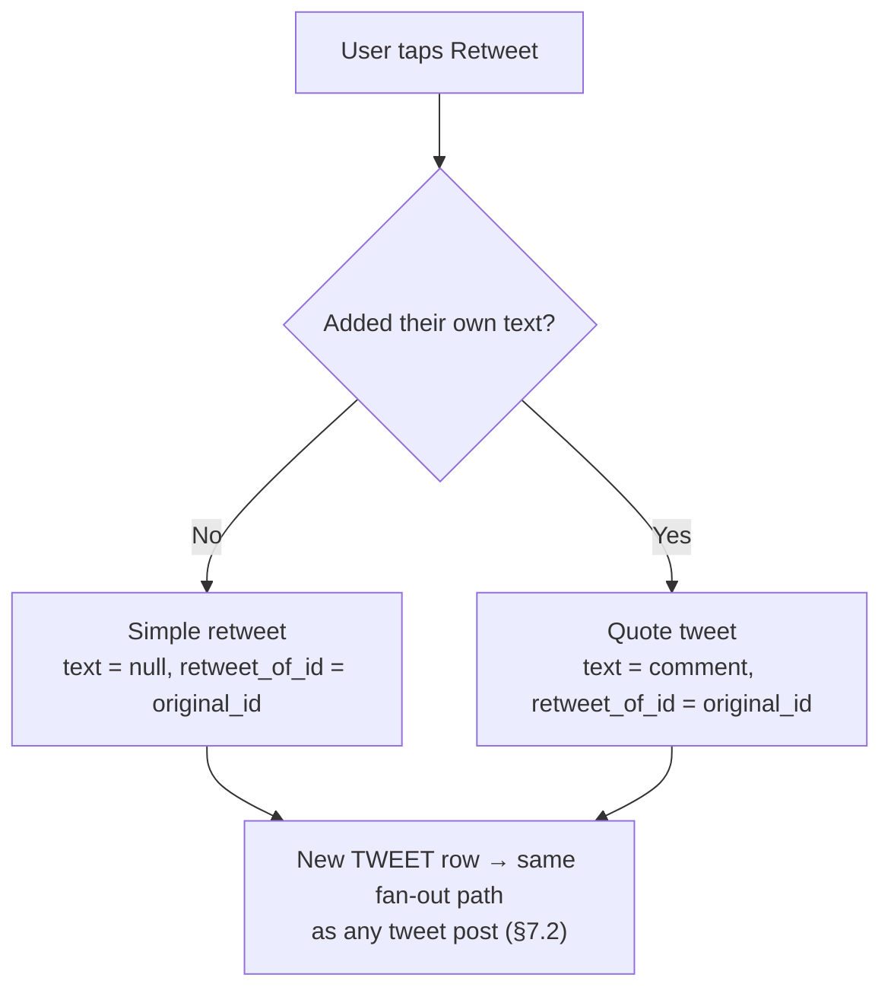

**Worked example:** a tweet gets retweeted 50K times and quote-tweeted 5K times. That's 55K new TWEET rows at ~400 bytes each (§4) — about 22 MB, trivial. The trap: each quote tweet fans out **independently**, exactly like a brand-new tweet. A quote tweet from a celebrity account re-triggers the full celebrity-pool path from §7.2 — it is not a lightweight "retweet event," it's a new tweet that happens to embed another one.

**Section cheat-sheet:**
- `like_count`/`retweet_count`/`reply_count` on TWEET are **denormalized counters**, not live aggregates — they're fed by the sharded-counter pipeline (§7.4), never a `COUNT(*)` over LIKE rows at read time.
- FOLLOW_EDGE needs to be queried in **both directions** (followers of X, followees of X) — plan for a forward and a backward index, not one table scanned two ways.
- `deleted` is a flag, never a `DROP ROW` — consistent with the "never delete" reliability requirement from §3.
- Existence checks ("did I already like this tweet?") need `(user_id, tweet_id)` as an indexed/composite key — this is the classic idempotency-check pattern reused in §7.6 and §7.9.
- 🆕 Quote tweets aren't a separate entity — a TWEET row with `text` populated and `retweet_of_id` set is a quote tweet; the same row with `text` empty is a plain retweet. Both re-enter fan-out as a normal new tweet, celebrity-threshold included.

---

## 6. Architecture Evolution — From Naive to Distributed Hybrid

Interviewers remember whoever can narrate *why* the final design looks the way it does. Don't present the hybrid fan-out architecture as a given — build up to it and name what breaks at each step. Three stages get you there.

### Stage 1 — Naive: single relational DB, pull-only timeline

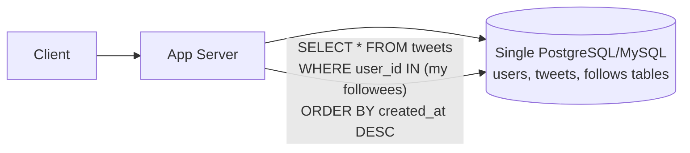

Everything lives in one box. `postTweet` is one `INSERT`. Reading a timeline is one fan-in query: join your follow list against the tweets table, sort by time, return page 1.

**What breaks:** at 200 followees average and a 1000:1 read:write ratio, every home-timeline view re-runs an expensive multi-way lookup against a single database. Read QPS (~463K avg from §4) hits one primary. The DB becomes the bottleneck long before write volume is a problem — **reads, not writes, kill Stage 1.**

### Stage 2 — Add fan-out-on-write + Redis timeline cache

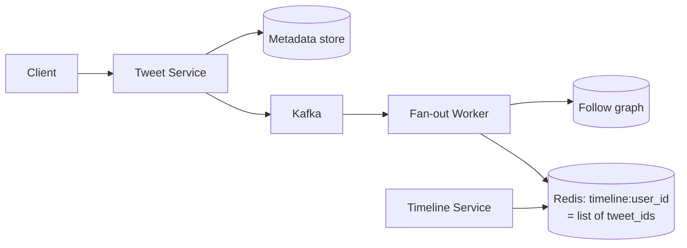

Move the join from read time to write time: on every tweet, push the tweet ID into every follower's precomputed Redis list. Reads become an O(1) list fetch — no more fan-in joins. This is what makes the 1000:1 ratio affordable at all.

**What breaks:** a normal user with 200 followers costs 200 Redis writes — fine. A celebrity with 80M followers turns **one tweet into 80M synchronous writes**, blowing out fan-out worker queues, delaying every other user's timeline update behind the backlog, and hammering Redis with a write storm on a single event. **The celebrity is the adversary from §1 — Stage 2 has no answer for her.**

### Stage 3 — Hybrid fan-out + decoupled services (the final design)

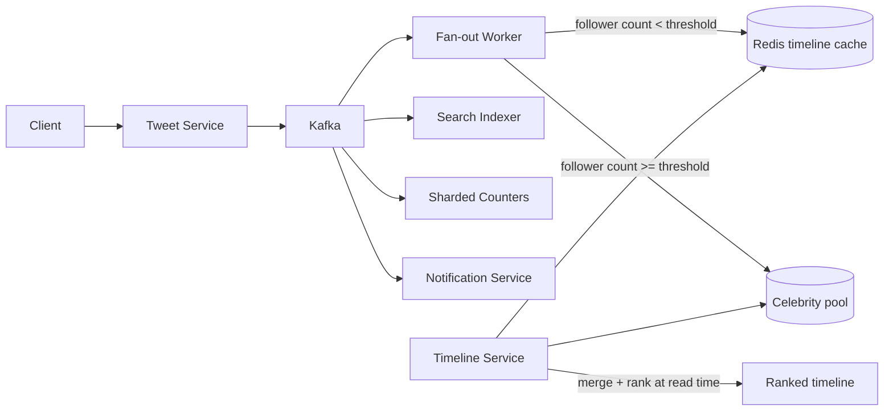

Split the write path by follower count (§7.2's threshold flowchart) so the celebrity never triggers a synchronous fan-out storm — her tweets sit in a small pool, merged in at read time only for the followers actually asking. At the same time, pull search, trending, and notifications off the critical write path entirely (each consumes the same Kafka event independently) so a slow search indexer can never block a tweet post or a timeline read.

**What this buys:** write cost is now bounded (typical case: O(followers), capped case: O(1) for celebrities), read cost stays O(1) for everyone, and every side feature (search, trends, notifications) fails independently instead of taking the core post/read path down with it. This is exactly the §5 High-Level Design diagram — you've now justified every box in it.

**Section cheat-sheet:**
- Narrate this unprompted in the first two minutes of the deep-dive: "naively you'd do X, that breaks at Y scale because Z, so you add W" — this is worth more signal than reciting the final architecture cold.
- Each stage is forced by a **named, numeric bottleneck** (read QPS on one DB → celebrity write storm → cross-feature coupling), not vague "it wouldn't scale."
- The pattern generalizes: naive-single-store → precompute/cache the hot path → special-case the outlier → decouple the side features. Reuse this shape for Instagram, Facebook Newsfeed, TikTok For-You.

---

## 7. Deep Dives

### 7.1 Tweet Ingestion

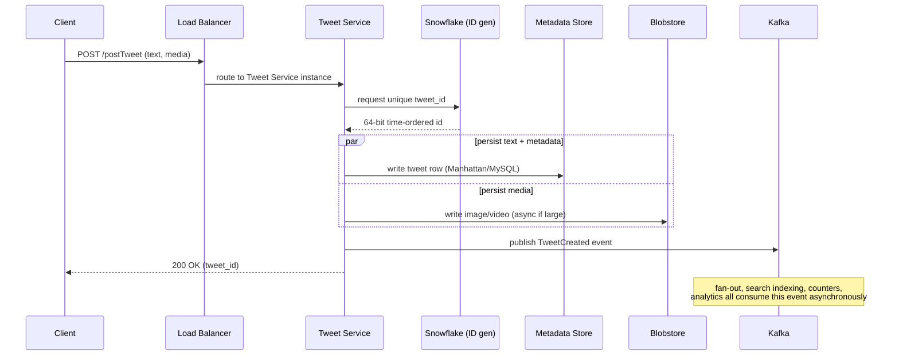

Key point: **Snowflake IDs are time-sortable by construction** (timestamp bits + worker bits + sequence bits), so tweets can be ordered by ID alone — no secondary "order by timestamp" index needed on the hot path.

**Cheat-sheet:**
- Ack the client as soon as durable storage + ID assignment succeed — everything else is async.
- Text/metadata and media are written to *different* stores in parallel, not serially.
- Kafka publish is the fan-out point for every downstream consumer — one write, many readers.
- Snowflake gives free time-ordering; don't reinvent a sequence table.
- If media write is slow (large video), return a placeholder and mark the tweet "processing" — don't block the whole request.

---

### 7.2 Timeline / Feed Generation — The Core Problem

#### Disambiguation: Fan-out-on-Write vs Fan-out-on-Read vs Hybrid

| | Fan-out-on-Write (push) | Fan-out-on-Read (pull) | Hybrid |
|---|---|---|---|
| **When work happens** | At post time | At read time | Both — split by follower count |
| **Write cost** | High (1 write → N timeline inserts) | Low (1 write, done) | Medium |
| **Read cost** | Low (timeline pre-materialized) | High (merge N followees at read time) | Low for most users |
| **Celebrity problem** | Catastrophic (100M-follower tweet = 100M writes) | None (celebrity tweet fetched on demand) | Solved — celebrities excluded from push |
| **Staleness** | Timeline always fresh once fan-out completes | Always fresh (computed live) | Fresh |
| **Best for** | Users with few/typical followers (99.99% of accounts) | Users who follow celebrities/high fan-out accounts | Real-world systems at scale |

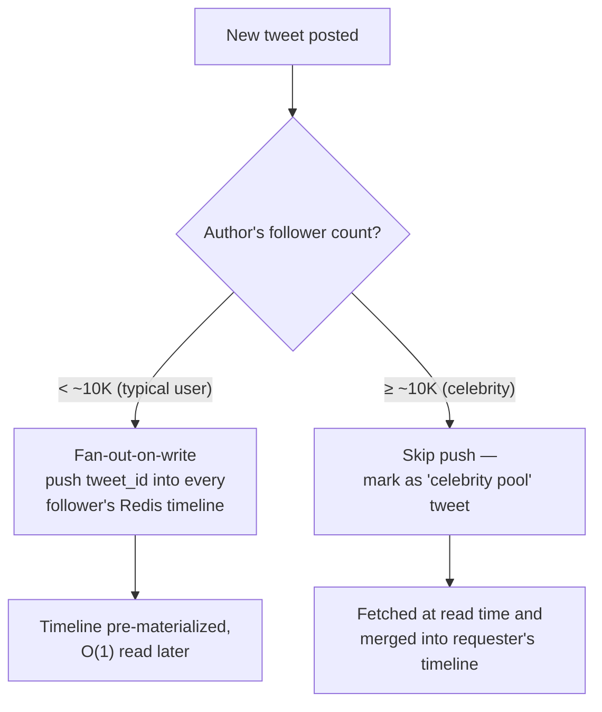

**Mnemonic:** 3 P's — **P**ush (write), **P**ull (read), **P**lus-hybrid.

#### Sequence: Normal tweet (push / fan-out-on-write)

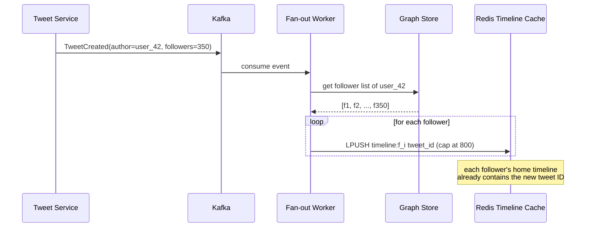

#### Sequence: Celebrity tweet (the hot-key problem)

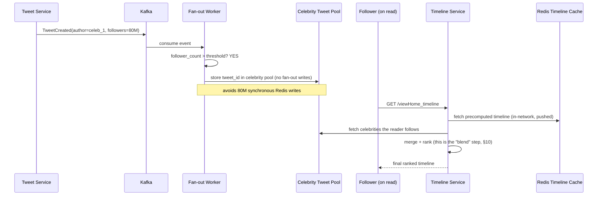

This merge-at-read-time step for celebrity content is exactly what real Twitter's **Home Mixer / blender** pipeline does — see §10.

#### Timeline cache lifecycle

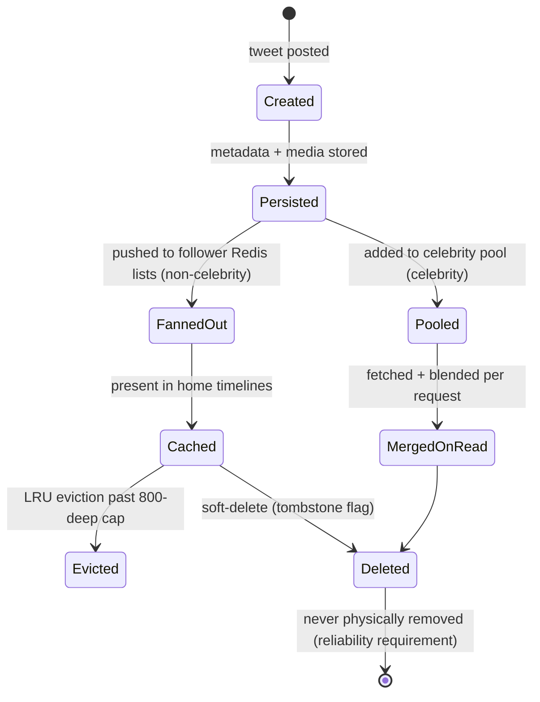

#### Cache hit ratio

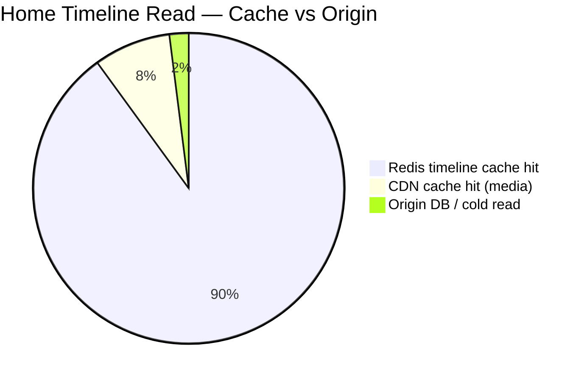

At 1.4M peak read QPS, a 90%+ cache hit ratio is what keeps origin metadata stores from melting — this single number is why the whole Redis timeline cache subsystem exists.

#### Disambiguation: Push vs Pull Timeline (same axis as above, reframed)

| | Push model | Pull model |
|---|---|---|
| Storage cost | Higher (duplicated tweet_id per follower) | Lower (single copy, computed on demand) |
| Compute cost | Front-loaded (at write time) | Back-loaded (at read time, every time) |
| Predictability | Read latency very predictable (O(1) cache read) | Read latency variable (depends on followee count) |
| Failure mode | Fan-out backlog if workers fall behind → stale timelines | Read-time fan-in slow/expensive if too many followees |

#### Disambiguation: Consistency vs Availability in Social Feeds

| Scenario | Choice | Reasoning |
|---|---|---|
| Like/reply feedback to the actor | Strong-ish, low-latency (same-region) | User expects instant confirmation on their own action |
| Like count visible to other regions | Eventual | A few seconds of staleness on a counter is invisible/acceptable |
| Timeline delivery during partition | Availability > Consistency (AP) | Show a possibly-stale timeline rather than an error page |
| Tweet durability | Consistency of the write (must not lose it) once acked | Reliability requirement — never lose a tweet post-ack |

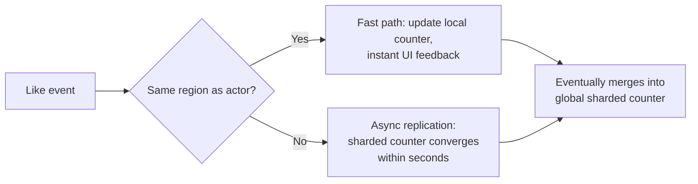

**Section cheat-sheet:**
- Default answer for "how do you build the timeline": **hybrid fan-out** — say this before the interviewer has to ask about celebrities.
- Threshold for "celebrity" is a tunable (~10K followers is a reasonable number to quote) — the exact number matters less than showing you know it's tunable and based on follower-count distribution, not a magic constant.
- Redis timeline cache caps at a fixed depth (~800) — this bounds memory *and* means very old tweets naturally age out of the fast path (fine, since home timelines rarely scroll back that far).
- Cache hit ratio (~90%+) is the number that justifies the entire cache investment — always quote it.
- Consistency in this system is a **gradient by proximity and by data type** (self > region > global; write-durability > counter-accuracy) — don't answer "CP or AP" as a single blanket choice.
- Always mention that fan-out workers can fall behind (queue backlog) under load — that's a named failure mode, not a hidden one (see §9).

---

### 7.3 Search

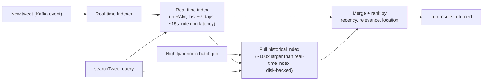

Twitter uses **Apache Lucene** with an **inverted index** (term → list of tweet IDs). Two-tier design:
- **Real-time index**: in-memory, covers the last ~7 days (what most user searches want), ~15s from tweet post to searchable.
- **Full index**: built via batch processing, ~100x larger, covers the entire history (Twitter never deletes) — used for academic/historical search, higher latency acceptable.

**Section cheat-sheet:**
- Two-tier index (hot in-RAM + cold batch-built) is the standard pattern for "search over a never-shrinking, mostly-recent-biased dataset."
- Indexing latency (~15s) is a tunable trade-off against indexing throughput — mention it as a number, not just a concept.
- Ranking factors: recency, relevance (term frequency), location — same signals used in timeline ranking, reuse the mental model.
- Full-text search this large is itself a distributed-search problem (partition by term or by document) — point to it but don't rabbit-hole unless asked.
- 100ms response over ~1 trillion records only works because of the inverted index + in-memory hot tier — say why, not just what.

---

### 7.4 Trending Topics & the Celebrity/Heavy-Hitter Problem

**Problem:** millions of simultaneous increments (likes, views, retweets, hashtag mentions) against a small number of hot keys (a viral tweet, a trending hashtag) — a single counter becomes a write bottleneck and single point of failure.

**Solution: sharded counters.** Split one logical counter into N physical shards (different machines); increments are distributed across shards; reads sum across shards (with periodic pre-aggregation so reads don't fan out to N every time).

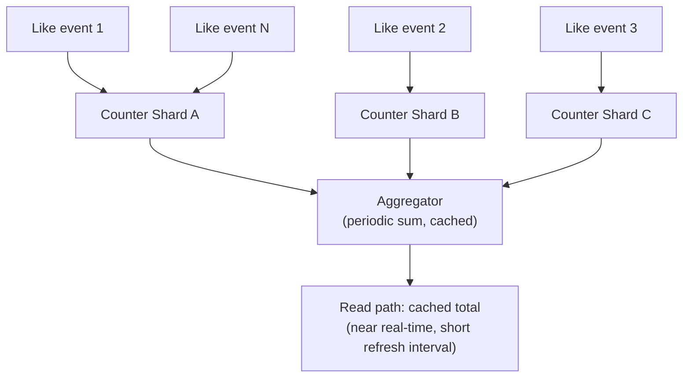

**Top-K trending** (hashtags/keywords, local + global) is the same sharded-counter idea applied over a sliding time window, typically implemented with a **count-min sketch (approximate frequency) + a min-heap of size K**, refreshed per window:

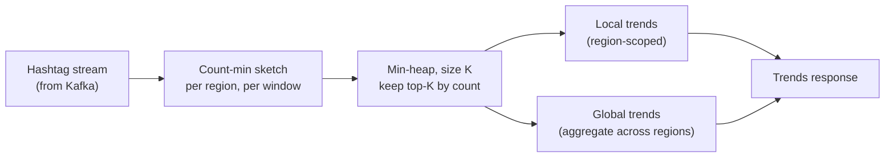

Sliding window mechanics: as the window moves, hashtags drop out of the top-K as fresher ones overtake them (e.g. `#life` → `#art` → `#food` → `#science` rotating out over time) — this is why trends feel "live."

#### 🆕 Choosing the aggregation window

| Window size | Pro | Con | Use for |
|---|---|---|---|
| 1 minute | Feels instantly "live" | Noisy — one bot burst can fake a trend | Breaking-news spike detection, abuse alerts |
| 5–15 minutes | Balances freshness and stability | Still misses slow-building trends | Default "Trending now" panel — the common answer |
| 1 hour+ | Smooths out noise, cheap to recompute | Feels stale, misses fast-moving news | Daily/weekly trend digests, analytics |

If-X-then-Y recall: **if asked "how fresh should trends be" → say "short window (1–5 min) for the live panel, plus a minimum-count floor so 10 bot accounts can't fake a trend, and a longer window only for stability reporting."** Naming the bot-floor unprompted is the detail that separates this answer from a generic one.

**Section cheat-sheet:**
- Name the problem explicitly: **"heavy hitter" / "hot key" problem** — a single celebrity tweet or viral hashtag can create a hotspot that a naive single-counter design cannot survive.
- Sharded counters trade a small amount of read-side aggregation complexity for massive write-side scalability — that's the trade-off to state.
- Shards can be placed near users (CDN-like locality) to reduce latency on the write side too, not just reads.
- Near-real-time ≠ real-time: counters refresh on a short interval because waiting for all shards to report in synchronously would defeat the purpose.
- Top-K trending is a sliding-window streaming problem — count-min sketch + heap is the standard toolkit; mention exact-count alternatives (sharded counters + periodic full aggregation) as a more expensive but exact fallback.

---

### 7.5 Client-Side Load Balancing

**Why not a normal (centralized) load balancer?** At Twitter's scale (hundreds of microservices, thousands of instances each), a dedicated LB tier becomes: an extra network hop (latency), a bandwidth chokepoint, and a single point of failure. Twitter's monolith-to-microservices evolution (Ruby on Rails + sharded MySQL → many independently-deployed services) made this pain concrete — one service's deploy could break another's, and hardware cost ballooned.

**Solution: client-side load balancing.** Every service instance embeds its own load balancer; it looks up healthy instances of the callee via a service registry and picks one itself. No central LB — Service A load-balances its own calls to Service B; Service B does the same calling C and D.

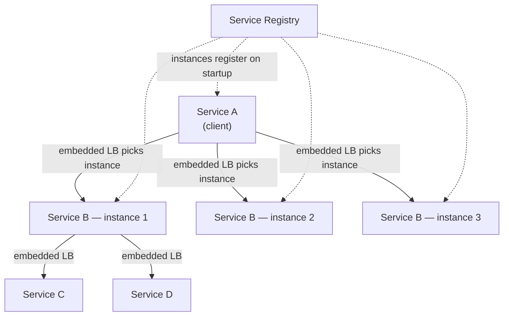

Twitter's implementation: **Finagle** (async, protocol-agnostic RPC framework) with **deterministic aperture** load balancing. Two things must be balanced fairly: **requests** (OSI layer 7) and **sessions** (OSI layer 5 — the underlying connections).

**Request distribution — Power of Two Choices (P2C):** for each request, randomly pick 2 candidate instances, send to whichever has less load. Provably close to optimal, cheap to compute (O(1), no global state), exponentially better than pure random selection.

**Session distribution — evolution of 3 solutions:**

| Approach | Scalable | Fair | Cost-effective |
|---|---|---|---|
| Mesh topology (every client ↔ every server) | ✖ | ✔ | ✖ |
| Random aperture (random subset of servers per client) | ✔ | ✖ | ✔ |
| Deterministic aperture — discrete ring | ✔ | weak | ✔ |
| Deterministic aperture — continuous ring | ✔ | ✔ | ✔ |

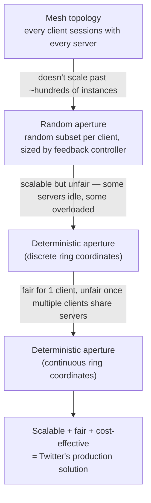

**Deterministic aperture (continuous ring), how it actually works:**
- Clients and servers all sit on one shared ring — picture a clock face with every instance placed at some angle.
- Each client claims a contiguous arc of that ring: a start point plus a width. Width scales with how many concurrent requests the client is sending; a feedback controller grows or shrinks it over time.
- Arcs from different clients can overlap the same server. That's expected, not a bug.
- Inside its own arc, a client runs P2C — pick 2 instances, send to whichever has less load — to choose who serves each session.
- Net effect: scaling a service up or down barely disturbs existing arcs, and no central coordinator is needed to keep things fair.

**Section cheat-sheet:**
- Lead with **why**: centralized LB = extra hop + bandwidth bottleneck + SPOF at Twitter's service-mesh scale — this justifies the whole detour.
- Two axes must both be fair: **requests** (P2C solves this cleanly) and **sessions** (the harder problem — 3-solution evolution).
- Tell the story as an evolution (mesh → random aperture → discrete ring → continuous ring) — it shows you understand *why* the final design looks the way it does, not just what it is.
- P2C's key insight: comparing 2 random choices beats random-single-choice by an exponential factor, at O(1) cost — a classic load-balancing theory result worth quoting.
- Continuous ring aperture is the production answer: scalable, fair, minimal coordination, minimal disruption on membership changes.
- Name it: Twitter's framework is **Finagle**; the balancing algorithm is **deterministic aperture**. Interviewers like precise names.

---

### 7.6 Caching Layers & Cache Invalidation

Two distinct caches, easy to conflate — keep them separate in your head:

| Layer | What it holds | Key | Invalidation |
|---|---|---|---|
| **Timeline cache** (Redis, §7.2) | List of tweet **IDs** per user, capped ~800 | `timeline:{user_id}` | Append-only (LPUSH); trimmed by cap, not explicitly invalidated |
| **Object cache** (Pelikan/memcached-style) | Hydrated tweet **content** (text, counts, media refs) | `tweet:{tweet_id}` | Must be explicitly busted on delete/edit |

The timeline cache is a list of pointers — it's cheap to leave stale IDs in it (a deleted tweet ID just resolves to nothing at hydration time). The **object cache is where staleness actually bites**: it holds the content itself, so a delete must propagate or the tweet keeps rendering after "deletion."

**Delete-invalidation flow:**

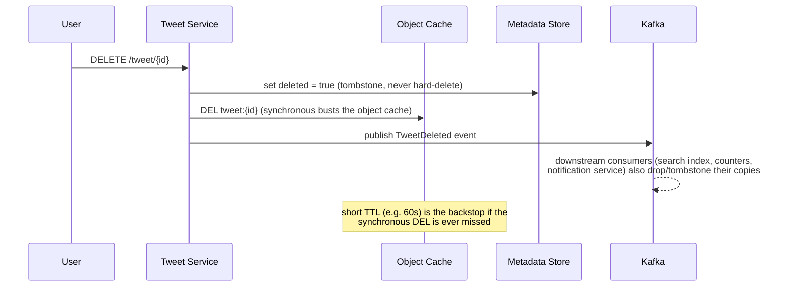

Note: Twitter doesn't support editing tweet text (only delete) — this sidesteps a whole class of "stale edited content" bugs; if your interviewer's variant *does* allow edits, treat it exactly like a delete-then-recreate for cache purposes (bust the object cache, republish a new indexable event, keep the same tweet_id).

**Race condition: concurrent likes on a naive (non-atomic) counter**

```mermaid
sequenceDiagram
    participant A as Request A (like)
    participant B as Request B (like)
    participant C as Naive counter (read-modify-write)

    A->>C: read count = 100
    B->>C: read count = 100
    A->>A: compute 100 + 1 = 101
    B->>B: compute 100 + 1 = 101
    A->>C: write count = 101
    B->>C: write count = 101
    Note over C: Lost update — should be 102, stuck at 101.<br/>Classic read-modify-write race under concurrency.
```

**Fix:** never read-modify-write a shared counter. Use an atomic `INCR` (Redis `INCR`, or an atomic increment op on the metadata store) so each like is a single indivisible operation — no read step to race on. This is the same idempotency/atomicity principle sharded counters (§7.4) are built on.

**Section cheat-sheet:**
- Name the two caches separately — interviewers sometimes ask "how do you invalidate the cache?" expecting you to first ask "which one?"
- Object cache invalidation on delete must be **synchronous** (or near it); timeline-cache staleness is self-healing by design (dead IDs just don't hydrate).
- Any "count" (likes, retweets, views) must be mutated via atomic increment, never read-then-write — this is a top interview trap.
- TTL is a backstop, not the primary invalidation mechanism — always pair explicit busting with a short TTL, never rely on TTL alone for user-visible deletes.

---

### 7.7 Media Storage & CDN Offload

```mermaid
flowchart LR
    C["Client"] -->|"1. request presigned upload URL"| TS["Tweet Service"]
    TS -->|"2. presigned URL"| C
    C -->|"3. upload bytes directly<br/>(bypasses app servers)"| BLOB[("Blobstore")]
    BLOB -->|"4. async event"| TC["Transcoding pipeline<br/>(multi-resolution, thumbnail)"]
    TC --> BLOB
    BLOB -.->|"origin pull on first request"| CDN["CDN edge PoPs"]
    R["Reader"] --> CDN
    CDN -.->|"cache miss only"| BLOB
```

Large media never transits the app server: the client uploads straight to Blobstore via a **presigned URL** (short-lived, scoped to one object), and reads are served from CDN edge nodes, falling back to origin only on a cache miss. Video gets transcoded into multiple bitrates/resolutions asynchronously (adaptive streaming), never blocking the tweet post itself — the tweet can go live with a "processing" placeholder.

**Worked example — why CDN offload isn't optional:** from §4, peak read QPS is ~1.4M, and ~20% of impressions include media → ~280,000 media-read QPS at peak. At ~1MB average:
```text
If served entirely from origin Blobstore:
  280,000 QPS * 1 MB = 280 GB/s  (~2.2 Tbps)   ← impossible from a single origin tier

With a 95% CDN cache hit ratio:
  Origin only serves the 5% miss traffic:
  280,000 * 0.05 = 14,000 QPS * 1 MB = 14 GB/s (~112 Gbps)
  → 20x less origin load, AND served from edges near the reader, not backhauled globally
```

**Section cheat-sheet:**
- Presigned direct-to-blob upload is the standard pattern for "how do you handle large file uploads without choking your app servers."
- CDN hit ratio (~95%+) does for media reads what the Redis timeline cache does for timeline reads — quote a number, don't just say "we use a CDN."
- Transcoding is async and off the critical path — the tweet posts immediately, media catches up.
- Video adaptive bitrate exists because mobile network conditions vary — don't ship one fixed resolution.

---

### 7.8 Follow-Graph Storage — Trade-offs

| | Relational adjacency table | Graph DB (Neo4j-style) | FlockDB-style (Twitter's real choice) |
|---|---|---|---|
| Model | `(follower_id, followee_id)` rows, indexed both ways | Native nodes + edges, multi-hop traversal | Sharded MySQL tables, one per direction, **not** a general graph engine |
| Best at | Simple lookups if data is small | Deep traversals ("friends of friends", shortest path) | Exactly Twitter's actual query set: list followers, list followees, existence check, counts |
| Weak at | Doesn't shard cleanly at billions of edges | Traversal power is wasted cost — Twitter doesn't need multi-hop queries for its core features | No native graph algorithms (that's fine, unused) |

**Why FlockDB over a "real" graph database:** Twitter's actual access patterns are shallow — "who follows X," "who does X follow," "does A follow B" — never deep traversals. Paying for a general graph engine's traversal machinery buys nothing here, so Twitter built a purpose-shaped sharded store: a **forward edge table** (follower → followees, for "who do I follow") and a **backward edge table** (followee → followers, for fan-out reads) — the same edge, written twice, read once per direction. Cheaper to shard and operate than a graph DB, at the cost of maintaining two consistent copies.

**Worked numeric example — graph storage size:**
```text
500M users * 200 avg follows/user        = 100B directed edges
Each edge row (follower_id 8B + followee_id 8B + timestamp 8B) = 24 bytes
100,000,000,000 * 24 bytes               = 2.4 TB raw (one direction)
* 2 (forward + backward index)            = 4.8 TB raw
* replication factor 3                    = ~14.4 TB total
```
Tiny compared to media (~40 PB) or even tweet metadata (~175 TB) — the follow graph is cheap to store; the expensive part is the **fan-out read/write pattern** against it (§7.2), not the bytes at rest.

**Section cheat-sheet:**
- Don't default to "I'd use a graph database" — justify it against the actual query patterns; Twitter's own answer is "no, a sharded relational-shaped store is cheaper and sufficient."
- Name the forward/backward double-index pattern explicitly — it's the mechanism, not just "FlockDB does it."
- The follow graph is small in bytes; it's a **query-pattern** problem (fan-out), not a storage-volume problem — contrast this with media, which is the opposite.

---

### 7.9 Notification Delivery

Critical distinction: a push notification is **not** the same as a timeline fan-out. If every tweet from someone you follow triggered a push, you'd recreate the celebrity fan-out storm at the notification layer, worse (push gateways are slower and rate-limited by Apple/Google). Only **high-intent events** notify: mentions, replies, likes/retweets *on your own tweet*, new followers, DMs.

```mermaid
flowchart TD
    EV["Event (Kafka): like / reply / mention / follow"] --> NS["Notification Service"]
    NS --> DEDUP["Batch/dedup window<br/>(e.g. 5 min: '12 people liked your tweet')"]
    DEDUP --> STORE[("Notification Store<br/>(bell icon / history)")]
    DEDUP --> PUSH["Push Gateway<br/>(APNs / FCM)"]
    DEDUP --> WS["WebSocket / long-poll<br/>(in-app real-time badge)"]
```

**Worked numeric example — why batching matters:** 40M tweets/day, say 10 likes/tweet average → 400M like events/day. Pushing one notification per like would be 400M pushes/day (~4,600/s avg, spiky on viral tweets). Batching likes into a 5-minute aggregation window per tweet ("X and 11 others liked your tweet") collapses that to roughly one notification per tweet per active window — a 10–50x reduction in push volume, and it reads better to the user too (nobody wants 400 separate pings).

**Section cheat-sheet:**
- Say explicitly: "notifications are not timeline fan-out" — this heads off the interviewer assuming you'll reuse the celebrity-fan-out machinery here (you shouldn't; the fan-out set for a mention/reply is small by construction).
- Batching/dedup windows exist for both cost (push volume) and UX (nobody wants 400 pings) — mention both reasons.
- APNs/FCM are third-party rate-limited gateways — the Notification Service must respect their throttles, which is itself a mitigation for hot content.

---

### 7.10 Rate Limiting & Spam / Bot Detection

```mermaid
flowchart TD
    REQ["Incoming write request<br/>(post/follow/like)"] --> RL{"Under rate limit?<br/>(token bucket per user+action)"}
    RL -->|"No"| R429["429 Too Many Requests"]
    RL -->|"Yes"| SPAM{"Spam/bot score high?<br/>(velocity, duplicate content,<br/>account age)"}
    SPAM -->|"High"| SOFT["Soft-block: CAPTCHA<br/>or manual review queue"]
    SPAM -->|"Low"| ALLOW["Allow — process normally"]
```

**Rate limiting mechanics:** a token bucket per `(user_id, action_type)`, implemented as a Redis counter with a TTL window — `INCR ratelimit:tweet:{user_id}` on each post, `EXPIRE` sets the window, reject once the count exceeds the bucket size within the window.

**Worked numeric example:** bucket size 300 tweets per 3-hour window (Twitter's real historical limit):
```text
300 tokens / 10,800 seconds  ≈ 0.0278 tokens/sec  ≈ 1 tweet sustainable per ~36 seconds
Key: ratelimit:tweet:user_123  → INCR, EXPIRE 10800 on first increment
Reject when count > 300 within the current window
```

**Spam/bot heuristics** (layered, cheap-to-expensive): velocity checks (many follows/unfollows or posts in a short burst), duplicate-content detection (simhash/minhash near-duplicate text across accounts), new-account + high-velocity combo scoring, and offline graph analysis to catch bot rings (many accounts all following/retweeting the same target within a tight time window — this one runs as a batch job, not on the synchronous request path).

**Section cheat-sheet:**
- Rate limiting is a **hot-key-shaped problem too** — a single Redis key per user under a viral trend can itself become a hotspot; shard the rate-limit key if one user's actions spike heavily (rare, but name it).
- Layer cheap checks (token bucket) before expensive ones (bot-ring graph analysis) — don't run a heavy classifier on every request.
- Bot-ring detection is inherently offline/batch (needs a window of graph data), unlike rate limiting which is synchronous — don't conflate the two time-scales.

---

### 7.11 Security Considerations

- **AuthN/AuthZ:** OAuth2-style signed tokens on every request; TLS everywhere between edge and origin. Private accounts and block-lists must be enforced at **every** read path — timeline, search, notifications, profile — not just the primary feed. A common interview trap: forgetting that a precomputed/cached timeline can leak a blocked or private account's tweets unless fan-out workers (or the read-time blend step) filter them out.
- **Input handling:** sanitize tweet text server-side before render (stored-XSS risk if client-side rendering is trusted alone); validate media by content-sniffing, not just file extension.
- **Upload safety:** presigned, short-lived, scoped upload URLs (§7.7) prevent hot-linking or writing arbitrary objects into Blobstore.
- **DDoS:** CDN/edge network absorbs volumetric attacks before they reach origin services; client-side LB (§7.5) and circuit breakers contain the blast radius of any single overloaded backend.
- **Retention vs. privacy tension:** "never delete" (§3's reliability requirement) collides with "right to be forgotten" (GDPR/CCPA). Name this explicitly rather than glossing over it: real systems carve out a hard-delete exception path for regulatory requests, separate from the default soft-delete/tombstone flow used everywhere else.
- **Content moderation** (one-liner, usually out of scope): ML classifiers + human review queues hang off the same Kafka event stream as everything else — async, non-blocking to the post path.

**Section cheat-sheet:**
- Blocked/private-account filtering at every read path is the single highest-value security detail to volunteer — it's easy to design a cache-heavy system that accidentally leaks blocked content.
- Treat "never delete" vs. privacy law as a named tension with a named resolution (hard-delete exception path), not a contradiction you didn't notice.
- Security in a system-design interview is graded on breadth of awareness, not depth — one sentence each on authn, authz, input validation, DDoS, and data retention beats a deep dive on any single one.

---

## 8. Key Design Decisions & Trade-offs

| Decision | Alternative rejected | Trade-off accepted |
|---|---|---|
| Hybrid fan-out (push for most, pull for celebrities) | Pure push or pure pull | Extra complexity (two code paths, a merge/blend step) in exchange for surviving the celebrity hot-key problem |
| Async fan-out via Kafka | Synchronous fan-out on the write path | Slight fan-out lag (near-real-time, not instant) in exchange for a write path that never blocks on follower count |
| Precomputed Redis timelines, capped depth (~800) | Compute every timeline on every read | Extra memory (~1.5TB+ cluster-wide) in exchange for O(1) predictable read latency |
| Sharded counters | Single counter per tweet/hashtag | Read-side aggregation complexity in exchange for surviving heavy-hitter write bursts |
| Polyglot storage (Manhattan + MySQL + Blobstore + FlockDB + Lucene) | One database for everything | Operational complexity (many systems to run) in exchange for each workload getting the right tool |
| Client-side load balancing (Finagle) | Centralized LB tier | More logic embedded in every service in exchange for no SPOF, no extra hop, no bandwidth chokepoint |
| Soft-delete / tombstones | Physical delete | Storage never shrinks in exchange for meeting the "never lose data" reliability requirement |
| Eventual consistency for counters/timelines | Strong consistency everywhere | Occasional stale counts/timelines in exchange for availability during partitions and much lower write latency |
| FlockDB-style sharded relational graph store | General-purpose graph database (Neo4j-style) | Give up native multi-hop traversal in exchange for cheap, shardable storage matched to Twitter's actual shallow query patterns (§7.8) |
| Presigned direct-to-blob media upload | Media routed through app servers | Extra client-side complexity (two-step upload) in exchange for app servers never becoming a bandwidth chokepoint for large video |
| Batched/deduped notifications | Push on every individual event | Slight delay before a notification appears in exchange for avoiding a second celebrity-scale fan-out storm at the push-gateway layer |
| Atomic counter increments (no read-modify-write) | Read-then-write counters | Slightly less flexible update logic in exchange for eliminating an entire class of lost-update races under concurrency (§7.6) |

**Section cheat-sheet:**
- Every "we chose X" answer must come with "instead of Y, because Z" — interviewers grade the trade-off, not the choice.
- The recurring theme: **push cost to the write path, keep the read path cheap and predictable** — say this as the unifying principle.
- Complexity is not free — polyglot storage and hybrid fan-out both cost engineering/operational overhead; acknowledge it rather than presenting the design as free lunch.
- If asked "what would you do differently with more time/budget," a good answer: tighter celebrity-threshold tuning via real follower-count percentiles, ML-based timeline ranking instead of pure recency.

---

## 9. Bottlenecks, Failure Modes & Mitigations

| Bottleneck / Failure | Symptom | Mitigation |
|---|---|---|
| Celebrity tweet fan-out | Millions of synchronous writes, worker queue backlog, delayed timelines | Hybrid fan-out — skip push for high-follower accounts, merge at read time |
| Hot counter (viral tweet likes/views) | Single counter becomes write hotspot, latency spike, possible node overload | Sharded counters, periodic aggregation, region-local shards |
| Fan-out worker backlog | Followers see stale timelines during traffic spikes | Autoscale workers, backpressure on Kafka consumer lag, priority queue (interactive vs bulk) |
| Redis timeline cache node failure | Timeline reads fall back to slow cold path, latency spike, thundering herd on origin | Redis replication (primary/replica), consistent hashing for even redistribution, request coalescing on cache miss |
| Metadata store (Manhattan/MySQL) overload | Write/read latency spikes on tweet post or profile fetch | Horizontal sharding, read replicas, connection pooling, circuit breakers |
| Search index staleness | New tweets not searchable for tens of seconds | Acceptable by design (~15s SLA); real-time RAM tier bounds the gap |
| Load balancer / service mesh partial failure | One bad instance drags down callers | P2C naturally routes away from slow instances (load-aware, not round-robin); circuit breakers + health checks evict dead instances from the registry |
| Cross-region consistency lag | Like/reply count looks different in different regions momentarily | Documented as expected behavior (eventual consistency); fast path for the acting user's own region |
| Data loss risk on write | Tweet acked but not durably persisted | Replication factor 3+ before ack; write-ahead log / durable queue before Kafka publish acknowledgment |
| CDN/media store outage | Broken images/videos in timeline | Multiple CDN providers or origin fallback; graceful degrade to text-only rendering |
| Viral tweet triggers notification storm | Push gateway (APNs/FCM) throttled, delayed pings | Batch/dedup notifications into a short aggregation window (§7.9) instead of one push per event |
| Rate-limit key itself becomes hot (one account under sudden load) | Single Redis key for the limiter becomes a hotspot | Shard the rate-limit key alongside the sharded-counter pattern if one user's traffic spikes heavily |
| Stale object-cache entry after delete | Deleted tweet still renders for some readers | Synchronous cache-bust on delete + short TTL backstop (§7.6) |

**Section cheat-sheet:**
- Always pair a bottleneck with its *specific* mitigation — "add more servers" is not an answer, "shard the counter" is.
- The celebrity fan-out and hot-counter problems are the two the interviewer is most likely probing for — have both ready without prompting.
- P2C load balancing is itself a failure-mitigation mechanism (routes around slow/degraded instances) — connect this back to §7.5 if asked about resilience.
- Distinguish **data-loss** failure modes (must never happen — replication + durable ack) from **staleness** failure modes (acceptable, bounded, documented).
- Mention monitoring/observability as the detection layer that makes all these mitigations actionable (see §10 — Zipkin, Zookeeper, alerting).

---

## 10. Real-World References — How Twitter Actually Built This

| System | Purpose | Notes |
|---|---|---|
| **Snowflake** | Distributed unique ID generation | 64-bit, time-sortable IDs; no coordination needed between generators |
| **Manhattan** | Distributed key-value store for tweets, accounts, DMs | Replaced Cassandra in 2014 (Cassandra couldn't fully meet Twitter's needs); uses **RocksDB** as the per-node storage engine; multiple cluster types tuned per workload (small/read-only vs huge read/write clusters at millions of QPS) |
| **Blobstore** | Media storage (images, video, binary objects) | Built ~2012; in-memory buffer checkpointed to durable storage periodically |
| **MySQL / PostgreSQL** | Strong-consistency needs — ads exchange, ad campaign management | Sharded via **Gizzard** framework (built on MySQL, ~2012) for partitioning + replication |
| **FlockDB** | Social graph storage (followers/following) | Not a general graph database — a MySQL-backed **sharded edge store** (forward + backward tables) purpose-built for Twitter's shallow query set (followers, followees, existence checks), not multi-hop traversal (§7.8). Comparable in role to **Facebook's TAO** (a graph-aware caching/storage layer sitting in front of MySQL) |
| **Apache Kafka** | Real-time event backbone | ~400 billion events/day processed; feeds fan-out, indexing, counters, analytics |
| **Cloud Dataflow / BigQuery / Bigtable** | Dedup, aggregation, analytics, ad targeting | Kafka topics converted to Cloud Pub/Sub topics via an event processor for cloud-side processing |
| **Apache Lucene** | Search indexing | Inverted index; real-time tier (~15s indexing latency, RAM) + full historical index (~100x larger, batch-built); ~100ms responses over ~1 trillion records |
| **Pelikan (Twemcache → Nighthawk → Pelikan)** | Distributed caching | Multi-tenant cache; reduced per-object metadata overhead from ~56 bytes to ~38 bytes; includes **Segcache** backend, highly memory-efficient for small objects (median cached object ~200–300 bytes) — metadata overhead matters a lot at this scale |
| **Redis-backed timeline cache** | Precomputed home timelines | Caches recent tweet IDs (rule-of-thumb ~800/user) per user for O(1) timeline reads — the concrete implementation of "fan-out-on-write" |
| **Zookeeper** | Service registry, distributed locking, leader election, config source-of-truth | Stores Manhattan cluster topology, service registry data |
| **Zipkin** | Distributed tracing | Samples a subset of requests, attaches lightweight trace IDs, aggregates via Scribe into key-value storage — keeps tracing overhead low at billions of requests/day scale |
| **Finagle + deterministic aperture** | Client-side RPC load balancing | See §7.5 — P2C for requests, continuous-ring aperture for sessions |
| **Home Mixer / "blender" (2023 open-sourced recommendation algorithm)** | Merges multiple timeline candidate sources into the final ranked feed | Combines in-network (pushed/fanned-out) tweets, out-of-network recommended tweets (pulled), and ads into one blended, ranked timeline — this is the production realization of the "merge at read time" step in the hybrid fan-out sequence diagram (§7.2) |
| **Google Cloud migration ("partly cloudy" strategy)** | Move ad-hoc and cold-storage Hadoop clusters to BigQuery/GCS, keep real-time/production Hadoop on-prem | Presto used as the distributed SQL engine across on-prem + cloud data |
| **APNs / FCM** | Third-party push notification gateways (iOS/Android) | Rate-limited by Apple/Google, not Twitter — a real, external reason the Notification Service (§7.9) must batch/dedup rather than push on every event |
| GDPR / CCPA "right to be forgotten" | Regulatory hard-delete requirement | Named tension against "never delete" (§3, §7.11): resolved with an explicit hard-delete exception path, separate from the default soft-delete/tombstone flow |

**Section cheat-sheet:**
- Naming 2–3 of these systems by name (Snowflake, Manhattan, Redis timeline cache) in a live interview signals real depth — don't just describe generic "a key-value store."
- Facebook's TAO is a great one-line comparison point for FlockDB/graph storage if the interviewer has FB/Meta background — same problem (social graph at scale), different name.
- Pelikan/Segcache's metadata-overhead detail (56B → 38B per object) is a great "beyond the obvious" fact — shows you know caching cost isn't just about the value, it's the per-object overhead at billions of objects.
- The 2023 Home Mixer/blender detail directly answers "what happens after fan-out and pull are both done" — ties §7.2's hybrid diagram to a real production system.
- If asked "why not just use Cassandra," you have a real historical answer: Twitter tried it (~2010), hit limitations, built Manhattan instead (2014) — a genuine build-vs-adopt case study.

---

## 11. Interview Strategy Cheat-Sheet

- **Open with the mental model** ("fan-out problem, not storage problem") — costs 10 seconds, buys you credibility immediately.
- **Quote the 1000:1 read:write ratio** early — it's your justification for every caching/precomputation decision that follows.
- **Volunteer the celebrity problem** before being asked — naming your own edge case is stronger than being caught by it.
- **Always give the hybrid answer** for fan-out — pure push or pure pull is a "junior" answer; hybrid + threshold + read-time merge is the "senior" answer.
- **Attach a number to every claim** — QPS, cache depth, shard count, latency budget. Vague claims read as unpracticed.
- **Name real systems** (Manhattan, Kafka, Redis, Lucene, Finagle) instead of generic "a database"/"a cache" — costs nothing, signals depth.
- **State trade-offs unprompted** — "we chose X over Y because Z" should appear after almost every design choice.
- **Reserve 5 minutes for failure modes** even if not asked — bottlenecks + mitigations is one of the highest-signal parts of the interview.

---

## Golden Rules

1. It's a **fan-out** problem — the write is cheap, the distribution is expensive.
2. **Hybrid fan-out always wins** in interviews: push for typical users, pull/merge-at-read for celebrities.
3. **Never fan out synchronously** on the write path — always via an async queue (Kafka).
4. **Cache timelines, not just tweets** — precompute the list of tweet IDs, hydrate content on read.
5. Read-heavy (1000:1) means: **optimize the read path aggressively**, accept extra write-side cost.
6. **Snowflake IDs are time-ordered for free** — don't build a separate ordering index.
7. **One size does not fit all storage** — separate metadata (KV/SQL), blobs (object store), graph (graph DB), search (inverted index).
8. **Sharded counters** are the answer to any "millions of increments on one hot key" question.
9. **Consistency is a gradient** (self → region → global), not a single binary CP/AP switch.
10. At Twitter's service-mesh scale, **client-side load balancing beats centralized LB** — no SPOF, no extra hop.
11. Twitter **never deletes** — reliability requirement means soft-delete/tombstone, and storage estimates must assume infinite retention.
12. Always **name the trade-off** out loud — it's free credibility.
13. **Narrate the evolution, don't recite the answer** — naive single-DB pull → fan-out-on-write → hybrid fan-out is the story that earns senior-level credit (§6).
14. **A push notification is not a timeline fan-out** — only high-intent events (mentions, replies, likes on your tweet) notify; batch/dedup them, or you recreate the celebrity storm at the push-gateway layer.
15. **Never read-modify-write a shared counter** — atomic increments only, or concurrent likes silently lose updates.
16. **Filter blocked/private accounts at every read path**, including cached/precomputed timelines — the most commonly forgotten security detail in this design.

---

## Master Cheat Sheet

```mermaid
flowchart TD
    START["Design Twitter"] --> MM["Mental model:<br/>fan-out problem, 1000:1 read:write"]
    MM --> REQ["Requirements:<br/>post/like/reply/retweet/follow/search/timeline<br/>+ availability, latency, scalability, reliability, consistency"]
    REQ --> CAP["Capacity:<br/>~1.4K write QPS peak, ~1.4M read QPS peak,<br/>~278K fan-out QPS peak, ~175TB metadata,<br/>~40PB media, ~1.5TB Redis timeline cache"]
    CAP --> EVO["Architecture evolution:<br/>naive single-DB pull → fan-out-on-write<br/>→ hybrid fan-out + decoupled services"]
    EVO --> HLD["High-level design + data model:<br/>LB → Tweet/Timeline/Search/Graph services<br/>→ Kafka → fan-out/index/counters/analytics"]
    HLD --> DD["Deep dive (pick per interviewer):<br/>ingestion · hybrid fan-out · search · trends · client LB ·<br/>caching/invalidation · media/CDN · graph storage ·<br/>notifications · rate limiting · security"]
    DD --> TO["Trade-offs:<br/>write cost ↔ read cost, complexity ↔ resilience,<br/>consistency ↔ availability"]
    TO --> FAIL["Failure modes:<br/>celebrity hot-key, counter hot-key,<br/>fan-out backlog, cache node loss, notification storm"]
    FAIL --> REAL["Real systems:<br/>Snowflake, Manhattan, Redis, Kafka,<br/>FlockDB, Lucene, Finagle, Home Mixer, APNs/FCM"]
    REAL --> DONE["Wrap-up:<br/>bottlenecks named, mitigations given,<br/>trade-offs stated, numbers memorized"]
```

| Topic | One-line answer |
|---|---|
| Architecture evolution | Naive single-DB pull-timeline → fan-out-on-write + Redis cache → hybrid fan-out + decoupled search/trends/notifications (§6) |
| Feed generation | Hybrid fan-out: push for typical users, pull + merge-at-read for celebrities |
| Celebrity problem | Threshold-based skip of synchronous push; fetch + blend at read time |
| Data model | 6 entities: User, Tweet, Follow-edge, Like, Retweet, Media — counts on Tweet are denormalized, fed by sharded counters |
| 🆕 Retweet vs quote tweet | Same TWEET row shape: `text` empty = plain retweet, `text` populated = quote tweet; both point at the original via `retweet_of_id` and both re-enter fan-out (celebrity threshold included) as a normal new tweet |
| Hot counter problem | Sharded counters, periodic aggregation, region-local placement; concurrent likes need atomic INCR, never read-modify-write |
| Trending topics | Sliding-window count-min sketch + top-K heap over sharded counters |
| Search | Two-tier Lucene inverted index: real-time RAM tier (~15s) + full batch-built historical index |
| Timeline cache | Redis, ~800 tweet IDs/user, O(1) read, ~90%+ hit ratio |
| Object cache & invalidation | Separate from timeline cache; delete must synchronously bust `tweet:{id}`, TTL is only the backstop |
| Media & CDN | Presigned direct-to-blob upload; ~95% CDN hit ratio turns ~280K QPS/1MB origin load into ~14K QPS at origin |
| Follow-graph storage | FlockDB-style sharded MySQL (forward + backward edge tables), not a general graph DB — matched to shallow query patterns |
| Notifications | Only high-intent events (mention/reply/like-on-your-tweet) push; batched/deduped — never full-fan-out like a timeline |
| Rate limiting & spam | Token bucket per user+action (Redis INCR+TTL) layered under velocity/duplicate-content/bot-ring heuristics |
| Security | AuthN/TLS everywhere, block/private filtering at every read path, signed upload URLs, named never-delete-vs-GDPR tension |
| Storage | Polyglot: Manhattan (KV), MySQL/Postgres (strong consistency), Blobstore (media), FlockDB (graph) |
| Consistency model | Eventual, gradient by proximity (self > region > global) |
| Load balancing | Client-side (Finagle): P2C for requests, deterministic continuous-ring aperture for sessions |
| IDs | Snowflake — 64-bit, distributed, time-sortable |
| Never forget | Name the trade-off. Name the number. Name the real system. Narrate the evolution. |
