# Newsfeed System Design — FAANG Interview Guide

## Mental Model

A newsfeed is **not a query, it's a pre-assembled magazine**. You don't scan every friend's posts live and sort them when you open Instagram — that's too slow at scale. Instead, think of the system as a **publishing pipeline**: when someone posts, the system decides *now* (write-time) or *later* (read-time) whose mailbox that post lands in, then a **ranking editor** decides the order before it's handed to you.

Two axes drive every decision in this chapter:

1. **When do we do the fan-out work?** — write-time (push) vs read-time (pull) vs hybrid.
2. **How do we order the result?** — chronological vs relevance-ranked.

Everything else (caching, CDN, notification, storage schema) exists to make those two decisions cheap at billions-of-users scale.

**Analogy:** fan-out-on-write is a newspaper delivery service — the paper is printed and dropped at every subscriber's door the moment it's published (fast to read, expensive to print/deliver for a paper with 50M subscribers). Fan-out-on-read is a newsstand — nothing is delivered, you walk up and someone assembles a bundle from all the day's papers for you on the spot (cheap to publish, slow/expensive per read). Hybrid: most authors get home delivery; a few high-volume "celebrity" publishers stay at the newsstand and get merged in only when you actually ask.

---

## Interview Playbook

Run this checklist top to bottom in every newsfeed / timeline / feed-ranking interview. It's the same skeleton whether the prompt is "Design Facebook Newsfeed," "Design Twitter Timeline," or "Design Instagram Feed."

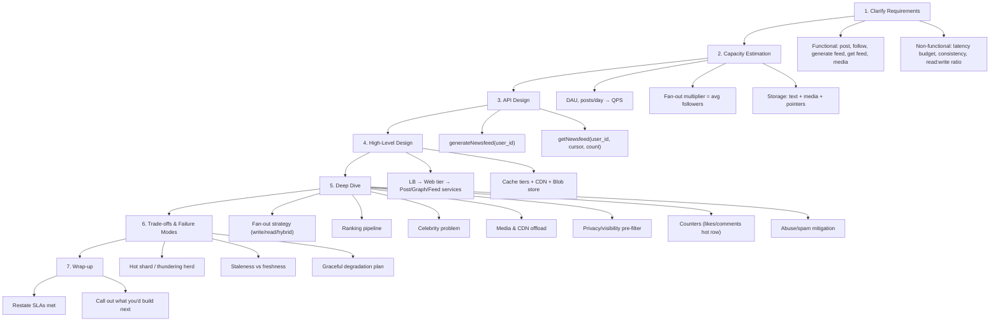

**How to identify this topic in an interview** — the prompt will say one of:
- "Design Facebook/Twitter/Instagram/LinkedIn newsfeed (or timeline, or home page)."
- "Design a system that shows a personalized, ranked list of updates from people/things you follow."
- "How would you handle a celebrity with 50M followers posting?" (a giveaway this is a feed-fan-out question in disguise)
- "Design a notification/activity feed" (same core pattern, smaller ranking surface).

Treat it as a **fan-out + ranking + cache** problem, not a plain CRUD/DB problem — that's the signal the interviewer is grading on.

---

## Requirements Clarification

### Functional Requirements

| # | Requirement | Notes |
|---|---|---|
| 1 | **Create a post** | text, image, video; author = user/page/group |
| 2 | **Generate a newsfeed** | aggregate posts from friends/follows/pages, rank them |
| 3 | **Fetch a newsfeed** | paginated, most-relevant/most-recent first |
| 4 | **Follow/friend graph** | asymmetric (follow) or symmetric (friend) relationships |
| 5 | **Like/comment on a post** | engagement actions, each needs a fast counter + a paginated list |
| 6 | (Stretch) **Notifications** | notify followers a new post/story landed |
| 7 | (Stretch) **Media attachments** | images/video with thumbnails |
| 8 | (Stretch) **Privacy controls** | public/friends-only/custom-list visibility, block/report |

Always ask the interviewer: *symmetric (Facebook friend) or asymmetric (Twitter/Instagram follow)? Ranked or chronological? Is media in scope?* — the answer reshapes the fan-out math (symmetric graphs are usually smaller and bounded; asymmetric graphs have unbounded follower counts → celebrity problem is much bigger).

### Non-Functional Requirements

| Requirement | Target | Why it matters |
|---|---|---|
| **Scalability** | Billions of users, 100M+ DAU | Horizontal scaling of every tier |
| **Availability** | Favor **A** over **C** (PACELC: partitioned → A/C tradeoff; else → latency/consistency tradeoff) | A stale feed is fine; a down feed is not |
| **Low latency** | P99 feed read < 200ms (interview target; source text says ≤2s as an outer bound) | Feed is the first thing rendered on app open |
| **Fault tolerance** | Survive node/rack/AZ failure | Replication + redundant services |
| **Eventual consistency acceptable** | New post visible to followers within seconds, not necessarily instantly | Enables async fan-out |

**Cheat sheet — Requirements section (say these out loud):**
- State the functional scope explicitly and get the interviewer to confirm (post/follow/feed/media/notify).
- Call out **read-heavy** workload immediately — feed reads >> post writes, this justifies caching/CDN investment.
- Invoke PACELC: under partition, choose Availability; feed can be eventually consistent.
- Pin a latency SLO (P99 < 200ms) before designing — it decides whether ranking runs online or pre-computed.
- Ask: symmetric or asymmetric graph? Ranked or chronological? — both change the fan-out story.

---

## Capacity Estimation (Worked Example)

Assumptions (stated up front, like a real interview): **1B total users, 500M DAU**, each user has **~300 friends/follows** (avg fan-out multiplier), opens the app **10x/day**.

```text
STEP 1 — Read QPS
  500M DAU × 10 opens/day = 5B feed-reads/day
  5,000,000,000 / 86,400s ≈ 58K requests/sec (read QPS)

STEP 2 — Write QPS (posts) — assume 20% of DAU post once/day
  500M × 0.2 = 100M posts/day
  100,000,000 / 86,400s ≈ 1,160 posts/sec (avg write QPS)
  Peak (3x avg, diurnal spike) ≈ 3,500 posts/sec

STEP 3 — Fan-out multiplier
  fan-out writes/sec = write QPS × avg followers
  avg case:  1,160 × 300 ≈ 348K fan-out writes/sec
  peak case: 3,500 × 300 ≈ 1.05M fan-out writes/sec
  celebrity case: ONE post × 50M followers = 50M fan-out writes for a single post

STEP 4 — Storage per post
  text:        50 KB
  media (blended, 1/5 video@2MB + 4/5 image@200KB): 0.4MB×0.2 + 0.2MB×0.8 = 0.24MB avg
  → ~290KB per post if it has media, 50KB if text-only

STEP 5 — Feed cache storage (pointers only, not full post)
  Precompute top 200 posts/user, store as <post_id, user_id> tuples (~16 bytes each)
  200 × 16B = 3.2KB per user timeline
  500M users × 3.2KB ≈ 1.6 TB total for ALL feed pointer tables
  (Cheap! Because fan-out duplicates pointers, not the post content itself.)

STEP 6 — Raw content storage
  Text:  200 posts × 500M users × 50KB  = 5 PB
  Media: 200 posts × 500M users × 112MB(blended per-user) = 56 PB
  (This is per-user precomputed feed content, matching source estimate.)

STEP 7 — Shard count (cache tier)
  Assume 50GB usable RAM per cache node for pointer tables
  1.6TB / 50GB ≈ 32 shards minimum
  Add replication factor 3 → ~96 nodes total

STEP 8 — Server count (compute tier)
  Rule of thumb: 1 server ≈ 8,000 RPS
  500M DAU-equivalent load / 8,000 RPS ≈ 62,500 servers (web + service tier, before replication)

STEP 9 — Bandwidth
  Assume feed response payload (JSON of pointers+metadata, media served via CDN separately) ≈ 50KB
  58,000 req/s × 50KB ≈ 2.9 GB/s ≈ ~23 Gbps sustained read bandwidth
  → must be split across regions/edge PoPs, single DC can't absorb this
```

**Takeaway to say in the interview:** fan-out multiplies *writes* by follower count, not storage — because you fan out lightweight `<post_id, user_id>` pointers, not full post objects. This is *the* key insight that makes fan-out-on-write feasible at scale, and *why* it breaks for celebrities (multiplier becomes millions instead of hundreds).

### Numbers Worth Memorizing

| Metric | Value |
|---|---|
| Server capacity | ~8,000 RPS/server (rule of thumb) |
| Read : write ratio | ~100:1 to 1000:1 (feed reads dominate) |
| Avg fan-out multiplier | ~200–500 (avg friends/followers) |
| Celebrity threshold (industry practice) | ~10K–1M followers → switch to pull path |
| Precomputed feed depth | Top 100–500 posts per user |
| Feed pointer size | ~16 bytes (`post_id` + `user_id`/rank) |
| Target cache hit ratio | ≥ 90% for feed/post caches |
| Feed latency SLO | P99 < 200ms (interview target) |
| Post latency SLO | < 2s outer bound (per source requirement) |
| Replication factor | 3x (standard for fault tolerance) |

---

## API Design

```text
generateNewsfeed(user_id) -> void
    - internal-only, offline/async
    - resolves friends/follows, aggregates candidate posts, ranks, writes to feed cache

getNewsfeed(user_id, cursor, count) -> List<Post>
    - client-facing, paginated (cursor-based, NOT offset-based — offset breaks under inserts)
    - reads precomputed feed cache; falls back to on-demand generation for inactive users

createPost(user_id, text, media[], visibility) -> post_id
    - writes to post DB + post cache, uploads media to blob store, triggers fan-out
    - visibility = public | friends-only | custom_list — feeds the privacy filter (see below)

followUser(follower_id, followee_id) -> void
unfollowUser(follower_id, followee_id) -> void
    - mutates Graph DB + invalidates follower/following list in graph cache

likePost(user_id, post_id) -> void
unlikePost(user_id, post_id) -> void
    - atomic counter increment/decrement (never read-modify-write, see Counters deep dive)

addComment(user_id, post_id, text) -> comment_id
getComments(post_id, cursor, count) -> List<Comment>
    - same cursor-pagination rule as getNewsfeed
```

**Cheat sheet — API design:**
- Separate the **write path** (`createPost`) from the **read path** (`getNewsfeed`) — different scaling and consistency needs.
- `generateNewsfeed` is internal/async, never called synchronously by a client.
- Use cursor-based pagination (opaque token, e.g. encoded rank+timestamp), not page/offset.
- Keep the get-feed payload lightweight — post bodies/media hydrated from cache/CDN, not embedded per request.
- `likePost`/`unlikePost` are the highest-QPS, highest-contention endpoints in the whole API — they must be atomic increments, never "read count, add one, write count" (see the Counters deep dive for why).
- `createPost` takes a `visibility` field explicitly — it's the input that the privacy filter and the fan-out audience resolution both depend on.

---

## Architecture Evolution — From Naive to Production

**Why this matters:** never present the final architecture as if it fell from the sky. Interviewers reward candidates who can narrate *what broke* at each stage and *why* the next component was the minimal fix. Think of it like a staged build-out of a physical newspaper business — you start with a single printing press people walk up to, and only add a delivery fleet, then a night-shift editor, then a distribution warehouse, once each prior stage visibly buckles.

### Stage 1 — Naive: pull-based feed, single DB

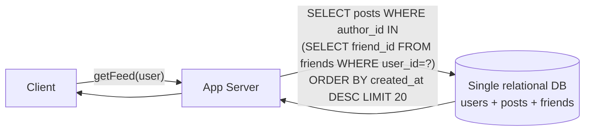

Every feed load re-scans all of a user's friends' posts, fresh, at read time. Fine for a demo with 100 users.

**What breaks:** at 500M DAU × 10 opens/day (≈58K read QPS from our capacity estimate), this becomes 58K large fan-in JOIN queries *per second* hitting one database. A single DB — even heavily indexed — cannot serve that; P99 latency blows past the 200ms SLO, and the DB becomes a single point of failure for every feed load on the planet.

### Stage 2 — Add fan-out-on-write + a feed cache

```mermaid
graph LR
    Author -->|createPost| PostSvc[Post Service] --> PostDB[(Post DB)]
    PostSvc --> Queue[Fan-out Queue]
    Queue --> FGW[Feed-gen Worker]
    FGW -->|"push <post_id,author_id>\nto EVERY follower"| FeedCache[(Feed Cache\nper-user pointer list)]
    Reader -->|getFeed - O(1) lookup| FeedCache --> Reader
```

Move the expensive work from read-time to write-time: the moment a post is created, push a lightweight pointer into every follower's precomputed feed. Reads become a single cache lookup — fast, cheap, and horizontally scalable.

**What breaks:** two new problems appear that didn't exist in Stage 1 (Stage 1 was too slow to even notice them). (1) **Celebrity storm** — one post from a 50M-follower account now means 50M synchronous-feeling writes fanning out from a single event. (2) **Wasted work** — a large fraction of DAU-inactive users still get pushed to on every post from people they follow, for feeds they may never open. (3) The feed is still strictly chronological — "my feed is full of noise" starts showing up in user complaints.

### Stage 3 — Add hybrid fan-out (celebrity threshold) + a ranking service

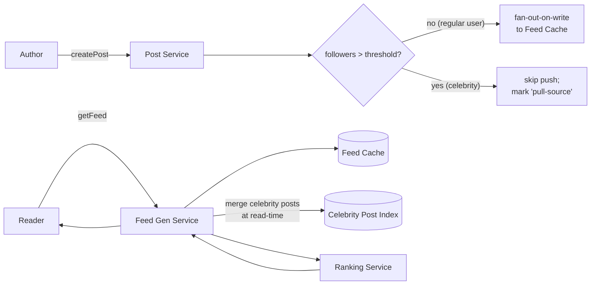

Branch on follower count at post time: regular authors still get pushed (Stage 2 behavior); accounts above a threshold are excluded from push and merged in live at read time instead. Layer a ranking funnel on top of the merged candidate set so order reflects relevance, not just recency.

**What breaks / what's left:** this is functionally complete for fan-out + ranking, but media is still assumed to flow inline through the app tier (no dedicated blob/CDN pipeline yet — bandwidth would crush origin servers, per the ~56PB media estimate), there's no dedicated notification/push-awareness layer, and there's no explicit privacy/visibility filter guarding the candidate set. Stage 4 is exactly the **full High-Level Design diagram in the next section** — it adds the Blob Store + CDN pipeline, the Notification Service, and the Graph/Post caches, and (as covered in the Privacy deep dive below) an audience/visibility check that runs before candidates ever reach the ranking service.

**Cheat sheet — architecture evolution:**
- Narrate it as 3 short stages, each ending in "...and then X broke, so we added Y." Don't jump straight to the final diagram — that's what separates a senior narrative from a memorized diagram.
- Stage 1 → Stage 2 fixes *read latency*. Stage 2 → Stage 3 fixes *the celebrity write storm and feed quality*. Stage 3 → final HLD fixes *bandwidth and audience safety*. Each transition has one clear trigger.
- If the interviewer stops you after Stage 2, that's fine — you've already demonstrated the core insight (push work to write-time) without over-building.

---

## High-Level Design

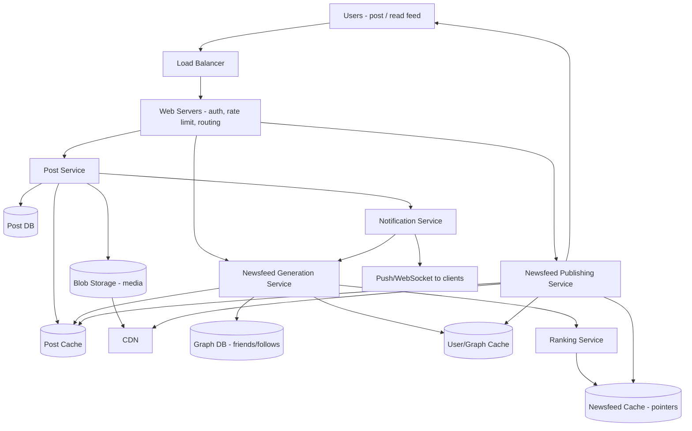

**Component responsibilities (say these crisply):**
- **Load balancer** — spreads client traffic across web tier.
- **Web servers** — authn, rate limiting, request routing; no business logic.
- **Post service** — writes posts to DB/cache, uploads media to blob storage, kicks off notification/fan-out.
- **Notification service** — tells the feed-generation service (and end users, via push) that a new post exists.
- **Newsfeed generation service** — resolves the social graph, gathers candidate posts, calls ranking, writes `<post_id, user_id>` into the feed cache.
- **Newsfeed publishing service** — hydrates pointers into full post objects (from post cache/CDN) and serves the assembled feed to the client.
- **Ranking service** — scores candidates; can be a separate ML-serving tier (GPU/TPU) since it's the most compute-heavy piece.

### Storage Schema

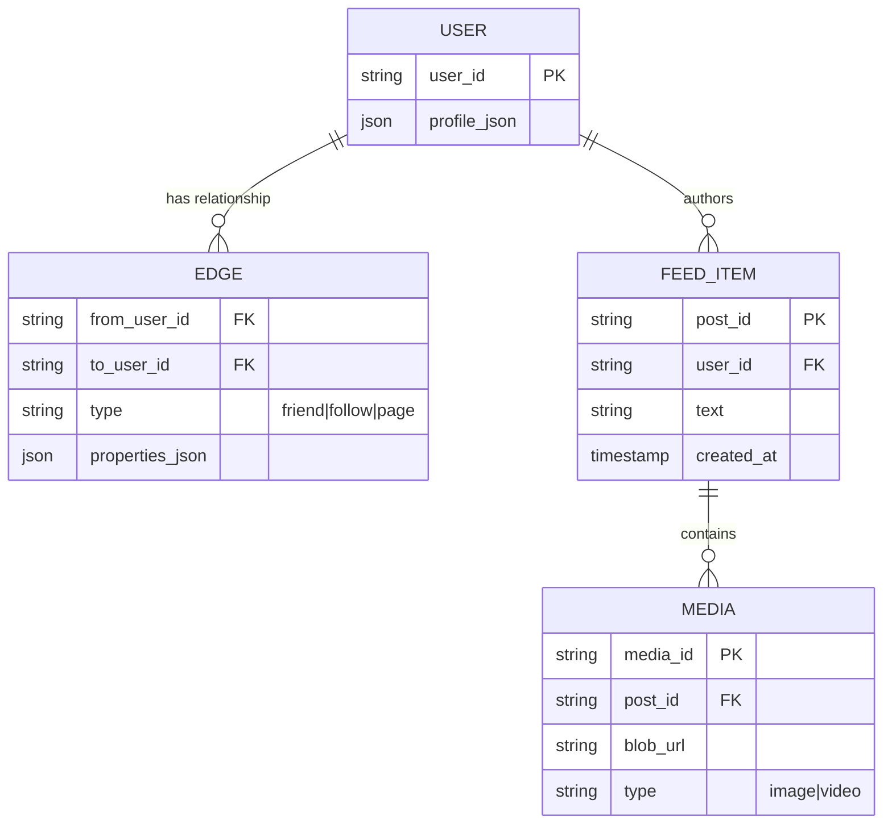

- **Graph DB** for `User`/`Edge` — modeled as a property graph (vertices = users, edges = relationships), often implemented relationally with JSON columns for flexible properties (this is exactly what Facebook's **TAO** does in production — see references below).
- **Feed_item** = posts; **Media** = attachments, pointer to blob storage/CDN URL, not the bytes themselves.

**Cheat sheet — high-level design:**
- Two pipelines: **generation** (async, write-side) and **publishing** (sync, read-side) — always separate these in your diagram.
- Post service and feed service are decoupled through the post cache/DB and notification service, not a direct call chain.
- Graph relationships live in a purpose-built graph store, not the same table as post content.
- Media never touches the hot path — blob storage + CDN carry the bytes; the feed cache carries only references.

### Sharding Strategy

| Store | Shard key | Why | Known hot-spot |
|---|---|---|---|
| Post DB | `post_id` hash (consistent hashing) | Even write distribution; a prolific author's posts spread across many shards | A single viral post's likes/comments still concentrate reads on one shard (see Counters deep dive) |
| Graph DB | `user_id` (edges keyed from the vertex) | Co-locates a user's own follow/follower list for fast traversal | Celebrity vertex — 50M follower edges read from one shard whenever anyone checks "does X follow Y" |
| Feed cache | `user_id` (consistent hashing) | Each user's precomputed feed lives on one shard, matches read pattern | An unusually chatty user (many app opens) creates a warm-but-not-hot key — rarely an issue |

**Worked example:** 500M users, aim for ~500K users per shard → **1,000 shards** for the Graph DB. Consistent hashing (with virtual nodes) keeps this rebalance-friendly as DAU grows. But sharding by `user_id` doesn't help a celebrity vertex — 50M follower-edge reads all land on the *one* shard holding that vertex no matter how many shards you have. Fix: replicate hot vertices across multiple read replicas (not more shards) and cache the follower/following list aggressively in the graph cache — this is the same hot-shard mitigation already listed in the Bottlenecks table below.

---

## Deep Dive: Fan-out Strategies

### Disambiguation: Fan-out-on-Write vs Fan-out-on-Read vs Hybrid

| | Fan-out-on-Write (push) | Fan-out-on-Read (pull) | Hybrid |
|---|---|---|---|
| **When work happens** | At post-time | At read-time | Mostly post-time, read-time for a few |
| **Read latency** | Very low (precomputed) | High (assemble on the fly) | Low for most users |
| **Write cost** | High (∝ follower count) | Low (single write) | Moderate |
| **Celebrity problem** | Severe (millions of fan-out writes per post) | None (no fan-out) | Mitigated (celebrities excluded from push) |
| **Inactive-user waste** | Wasted work for users who never log in | No wasted work | Skip push for long-inactive users |
| **Used by** | Twitter (regular users), Instagram, Facebook (mostly) | Rarely used alone at scale | Twitter, Facebook, Instagram (all in practice) |

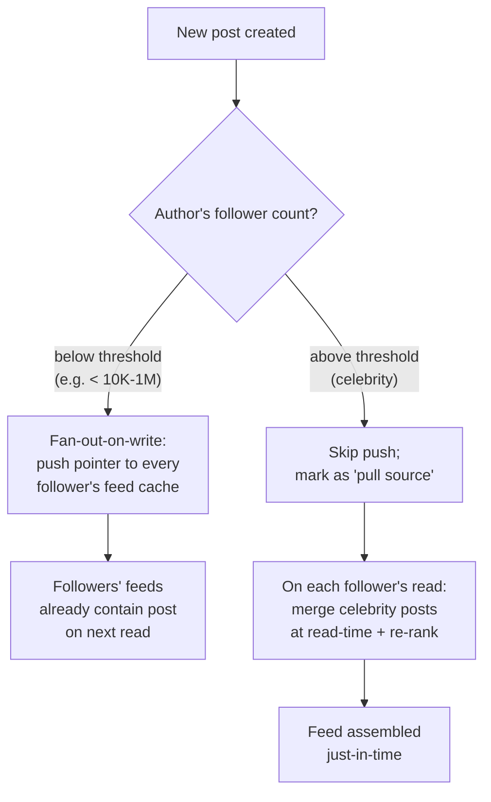

### Disambiguation: Pull vs Push Feed *Delivery* (client-facing axis — distinct from write/read fan-out above)

This is a second, often-confused axis: **how does the client learn about new content**, independent of where fan-out compute happens.

| | Pull (client polls) | Push (server notifies) |
|---|---|---|
| Mechanism | Client calls `getNewsfeed` on app open / pull-to-refresh | Server pushes via WebSocket/APNs/FCM, client shows "new posts" banner |
| Freshness | Only as fresh as last poll | Near real-time |
| Server load | Predictable, client-driven | Spiky, needs connection management (long-poll/WebSocket fleet) |
| Typical use | Feed body fetch | "N new posts" banner, notification badges |

Most production systems use **both**: push a lightweight "new content available" signal, but the client still **pulls** the actual feed body via `getNewsfeed`.

### Disambiguation: Ranked vs Chronological Feed (orthogonal axis — ordering, not fan-out)

| | Chronological | Ranked (relevance) |
|---|---|---|
| Order | Strict `created_at desc` | ML-predicted relevance score desc |
| Compute cost | ~0 (just sort by time) | High (feature extraction + model inference per candidate) |
| User complaint it solves | "Where's my friend's post, why don't I see it" | "My feed is full of noise, I miss what I care about" |
| Real-world | Twitter default until ~2016, Instagram brought back a chronological "Following" tab in 2022 | Facebook (since ~2011 EdgeRank+), Instagram main feed, LinkedIn, modern Twitter "For You" |

**These three axes are independent** — you can have fan-out-on-write + chronological (simple Twitter clone), or fan-out-on-read + ranked (compute-heavy on-demand assembly). State this explicitly in the interview; conflating "push vs pull" with "ranked vs chronological" is one of the most common candidate mistakes.

### Sequence: Normal Post → Fan-out → Read

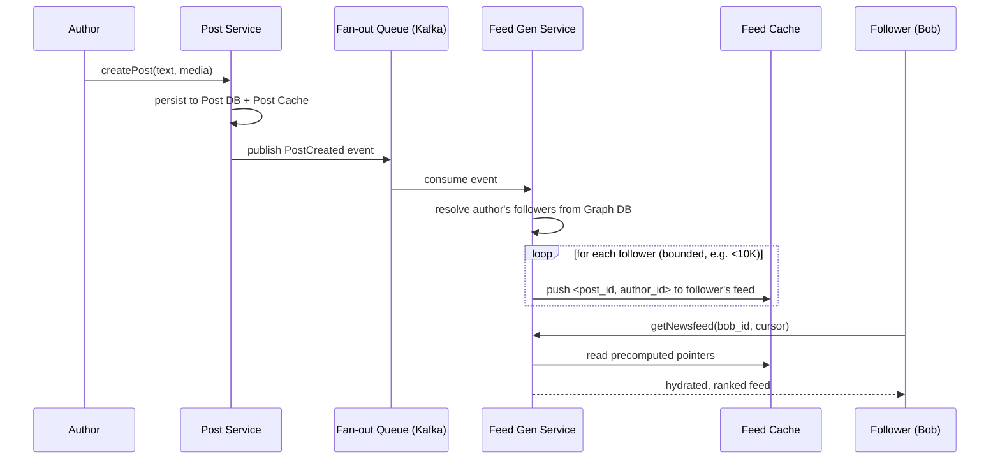

### Sequence: Celebrity Post — The Hot User Problem

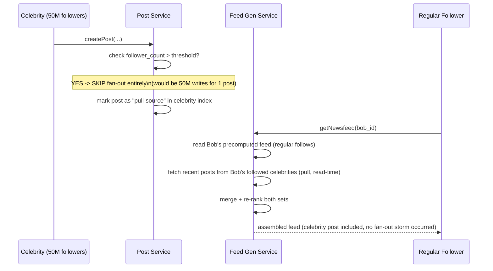

**Why this matters:** without the celebrity exception, one post from a 50M-follower account triggers 50M fan-out writes — a thundering herd on the feed-cache write path, queue backlog, and potential cache-tier overload. This is the single most commonly probed edge case in newsfeed interviews (historically a real problem Twitter hit publicly).

### Sequence: Fan-out Worker Crash & Retry (failure/idempotency path)

A regular (non-celebrity) post's fan-out job can still fail partway through — a worker OOMs, gets redeployed, or the pod is rescheduled mid-loop. Message queues guarantee **at-least-once** delivery, so the same event gets redelivered. The fan-out write must tolerate being replayed.

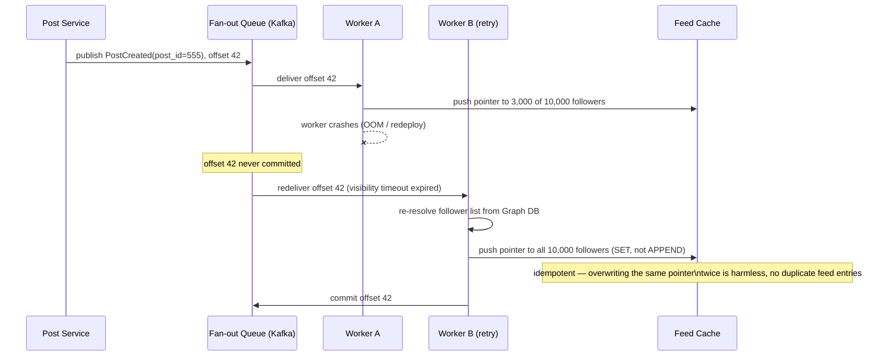

**Why this matters:** the fix isn't "make the worker never crash" — it's **making the write idempotent** (`SET <post_id> at position X`, not `APPEND to list`) so a safe retry is always available. This is a standard idempotency pattern any at-least-once queue consumer needs, not unique to newsfeed — but interviewers specifically probe it here because fan-out touches thousands of downstream keys per event, so a non-idempotent retry would create visible duplicate posts in feeds.

**Cheat sheet — fan-out deep dive:**
- Default answer: **hybrid**. Push for everyone, except accounts above a follower-count threshold — pull those at read-time.
- Explicitly name the threshold-based branch (`if followers > N: skip push`) — interviewers want to see you handle the edge case, not just the happy path.
- Mention Kafka (or similar) as the async fan-out queue so post-service writes aren't blocked on fan-out completion.
- Call out that fan-out duplicates *pointers*, not post bodies — this is why it's tractable at all.
- State the two orthogonal axes explicitly (fan-out placement vs delivery push/pull vs ordering) to preempt confusion.
- Fan-out writes must be **idempotent** (`SET`, not `APPEND`) — at-least-once queue delivery means a crashed worker's retry will replay the same event.

---

## Deep Dive: Privacy & Visibility

**Mental model:** visibility is a *gate*, not a ranking signal — a post either can or cannot be shown to a given viewer, and that check must run **before** anything else touches the candidate (before ranking scores it, before it's even considered "fanned out" to that follower). Never let a low relevance score be the reason a private post doesn't appear — it should never have entered the candidate pool.

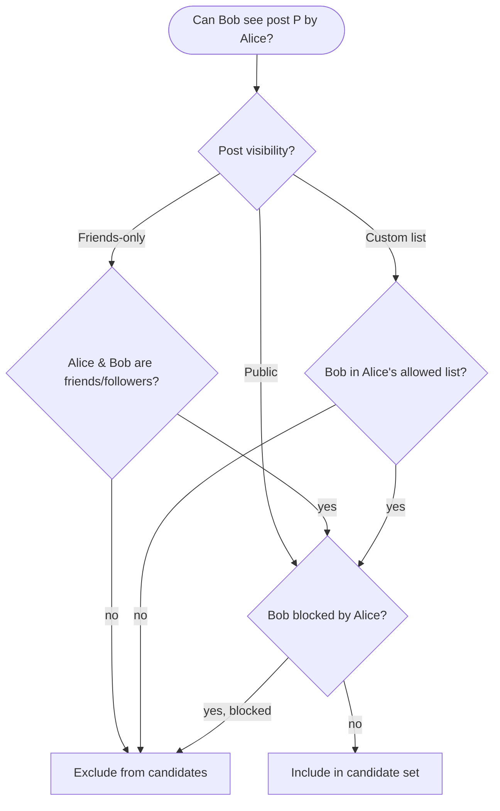

**Where the check lives, per fan-out mode:**
- **Fan-out-on-write:** audience is resolved *once*, at post time, from the visibility rule + current friend/follow/block list — that's the whole point, the pointer only ever gets pushed to eligible followers. The gap: if Alice later blocks Bob, or they un-friend, Bob's feed cache may still hold a stale pointer to Alice's post until the next invalidation sweep (same eventual-consistency trade-off as post deletion, described in the Feed Caching section).
- **Fan-out-on-read (celebrity path):** cheaper to get right — the visibility/block check runs live, on every read, so it's never stale. This is actually a nice side benefit of the celebrity pull-path: no privacy invalidation lag for the accounts that skip push.
- **Ranking pipeline:** the visibility/block filter is exactly the "Integrity/quality filter" stage already listed in the ranking funnel (stage 2) — privacy is one more reason a candidate gets dropped before it reaches the expensive ML scoring stage.

**Cheat sheet — privacy & visibility:**
- State it as a **pre-filter, not a ranking signal** — this line alone signals security maturity to the interviewer.
- Fan-out-on-write audiences can go stale after an unfriend/block; fan-out-on-read never does, because it checks live. Mention this trade-off explicitly.
- Reuse the ranking funnel's existing "integrity filter" stage as the place privacy lives — don't invent a brand-new pipeline stage for it.

---

## Deep Dive: Ranking Service

### Mental Model

Ranking = a funnel: **millions of possible candidate posts → hundreds retrieved → dozens scored precisely → top N shown**. Never score everything with your most expensive model; narrow first, refine later — same principle as search engines.

```mermaid
flowchart LR
    Graph[Graph DB: who you follow] --> Candidates[Candidate generation:\nrecent posts from follows\n+ engagement-heavy posts]
    Candidates --> Filter[Integrity filter:\nremove spam/clickbait/\nmisinfo/already-seen]
    Filter --> Feature[Feature extraction:\naffinity, recency, post type,\npast engagement]
    Feature --> Score[ML scoring:\npredict P(like), P(comment),\nP(share), P(hide)]
    Score --> Blend[Value model:\nweighted blend of predictions\ninto single relevance score]
    Blend --> TopN[Select + order top N]
```

### Classic Model: EdgeRank (Facebook, ~2010)

```text
EdgeRank(edge) = Σ  Affinity(u, e)  ×  Weight(e)  ×  TimeDecay(e)

Affinity   — how close you are to the poster (interactions history)
Weight     — importance of the action type (comment > share > like)
TimeDecay  — freshness; older posts score lower
```

Facebook has since replaced EdgeRank's simple linear formula with a multi-stage ML pipeline evaluating **thousands of features per candidate** (per Facebook's own public statements), but EdgeRank is still the right *first answer* in an interview because it's simple, explainable, and structurally correct (affinity × weight × decay is still the conceptual backbone of most ranking systems).

### Modern Ranking Signals — Memory Hook: **"CARDS"**

| Letter | Signal | Example |
|---|---|---|
| **C** | Content type | video vs photo vs text — different base engagement rates |
| **A** | Affinity | how often you interact with this author |
| **R** | Recency | time decay — newer generally ranks higher |
| **D** | Directness/Depth of past interaction | comments/DMs > passive views |
| **S** | Signals (predicted engagement) | P(like), P(comment), P(share), P(hide/report) from ML models |

### Ranking Pipeline Stages (say this to sound senior)

1. **Candidate generation** — pull recent posts from follow graph + some "you might like" injected candidates (in-network + out-of-network, à la modern Twitter).
2. **Integrity/quality filter** — drop spam, duplicate, already-seen, policy-violating content *before* expensive scoring.
3. **Feature extraction** — batch-compute features (often precomputed "nearline" via stream processing, e.g. Kafka + Samza/Flink).
4. **Model scoring** — GBDT or neural net predicts multiple engagement probabilities; heavy compute, often GPU/TPU-backed.
5. **Value model / blending** — combine multiple predicted probabilities into one score using a weighted formula tuned by the product team (e.g. weight comments higher than likes).
6. **Final assembly** — interleave with ads/injected content, apply diversity rules (don't show 5 posts from same author in a row), paginate.

**Cheat sheet — ranking deep dive:**
- Lead with EdgeRank (simple, structural, correct starting point), then say "in production this becomes a multi-stage ML funnel."
- Always mention the **funnel shape**: cheap candidate generation → expensive precise scoring only on a shrunk set.
- Name the compute tier explicitly: ranking is GPU/TPU-backed, separate fleet from web/app servers.
- Mention feature computation is often **nearline** (streaming, precomputed) not fully online, to hit latency SLOs.
- State the ranking service writes its output into the **feed cache**, decoupling ranking latency from read latency.

---

## Deep Dive: Media Storage & CDN

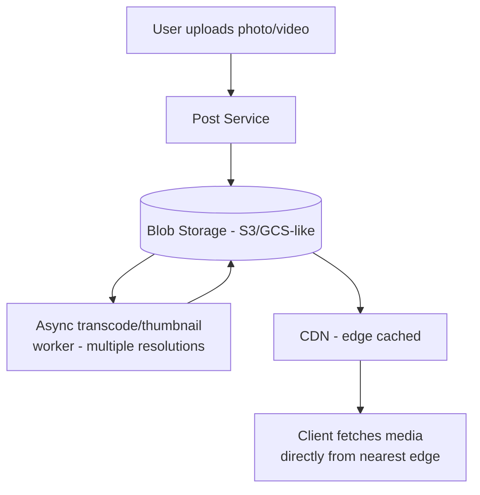

- Feed cache/DB stores only a **URL/pointer** to media, never raw bytes — keeps the hot path (feed read) lightweight.
- Pre-generate multiple resolutions (thumbnail, mobile, full) at upload time — don't transcode on every read.
- CDN absorbs the overwhelming majority of media bandwidth (per earlier estimate, 56PB of media dwarfs the 5PB of text) — this is precisely why offloading media to CDN is non-negotiable at this scale, not an optimization.
- Cache-Control headers + long TTLs for immutable media (content-addressed URLs); invalidation is rarely needed since media is append-only per post.

**Cheat sheet — media/CDN:**
- Never let media bytes flow through your app servers on the read path — CDN direct-serves.
- Pre-compute thumbnails asynchronously at upload time, not lazily per request.
- Justify CDN with the numbers: media storage (tens of PB) vastly exceeds text storage — bandwidth would crush origin servers without edge caching.
- Content-addressed/immutable URLs → simple, aggressive CDN caching, no invalidation headaches.

---

## Deep Dive: Notification Service

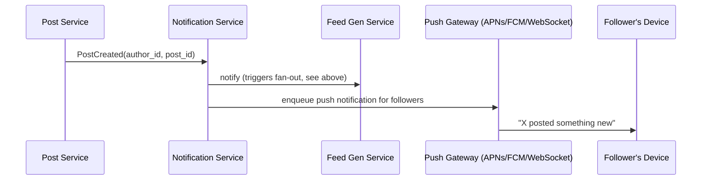

- Decoupled from the feed-gen critical path via a message queue — a notification-service outage shouldn't block post creation or feed reads.
- Push is for *awareness* ("new post" badge); the actual feed body is still fetched via `getNewsfeed` (pull) — reinforces the push/pull disambiguation above.
- Batches/throttles notifications for very active authors so followers aren't spammed.

**Cheat sheet — notification service:**
- It's a fan-out trigger *and* a push-badge sender — two jobs, keep them logically separate even if same service.
- Always async via queue — never a synchronous call blocking post creation.
- Rate-limit/batch per follower to avoid notification storms from prolific posters.

---

## Deep Dive: Likes, Comments & Counters (Hot-Post Problem)

**Mental model:** a like/comment counter on a viral post is the same "hot key" problem as a celebrity's fan-out, just on the *read/write-a-single-row* axis instead of the *fan-out-to-many-rows* axis. One popular post becomes one incredibly hot database row.

### Data model addition

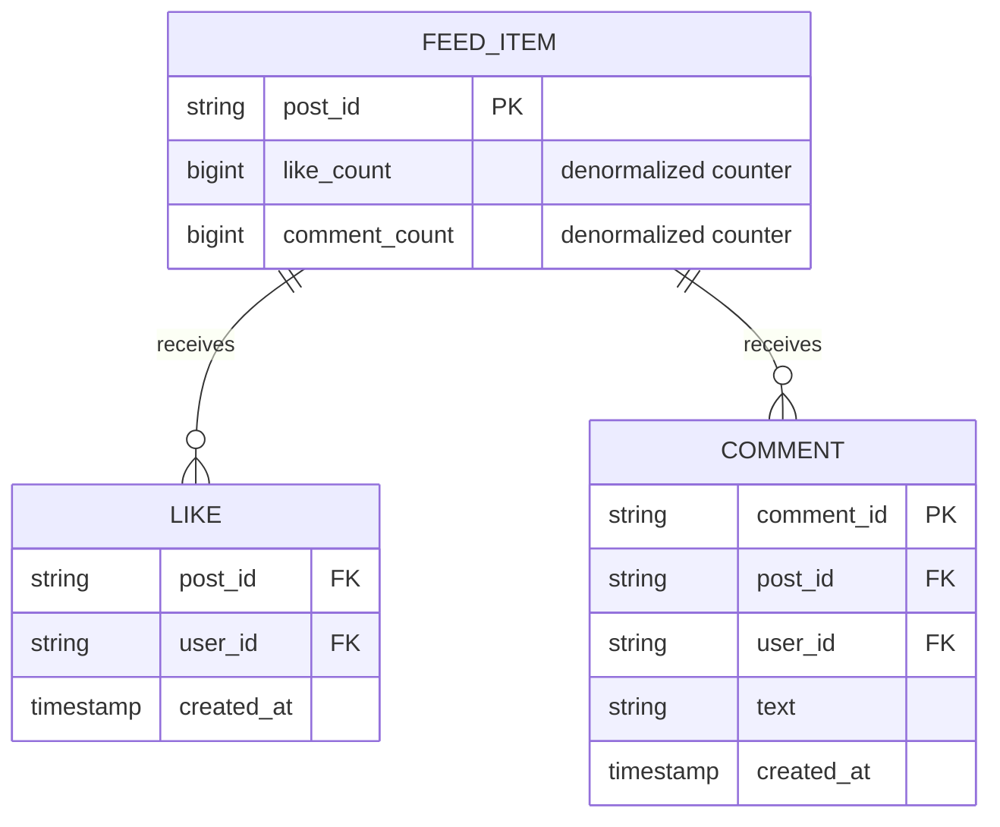

`like_count`/`comment_count` are **denormalized counters** on the post row — you never `COUNT(*) FROM likes WHERE post_id=?` on the read path, that's an unbounded scan on a viral post with millions of rows.

### Sequence: the lost-update race condition, and the fix

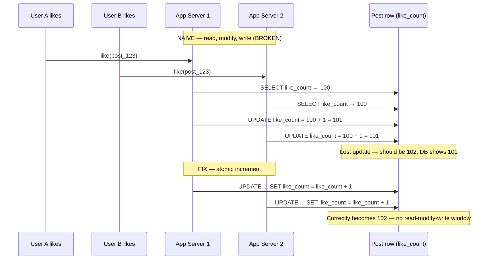

**Worked example — why atomic increment alone still isn't enough for a viral post:** a post goes viral and collects **1M likes in the first hour**: 1,000,000 / 3,600s ≈ **278 likes/sec sustained**, but the first 5 minutes after a celebrity share can carry a third of that volume: 1,000,000 × 0.3 / 300s ≈ **1,000 likes/sec on one single row**, even with atomic increments, that's still one row being hammered by 1,000 writes/sec — a hot key at the database layer.

**Production fix — write-behind aggregation:** increment an in-memory counter shard (e.g. Redis `INCR`, which is single-threaded and atomic) on every like, and **asynchronously batch-flush** the accumulated delta to the durable Post DB every 1–5 seconds instead of writing to the DB on every single like. For extremely hot posts, go further and shard the counter itself (e.g. `like_count:post_123:{0..9}`, sum across shards on read) to spread the increments across multiple keys.

**Display-side trick:** beyond a threshold (e.g. 10K), stop showing an exact number and show an approximation ("10K+ likes", "1.2M likes") — Instagram's 2019 experiment hiding exact like counts is a real-world instance of treating the *display* of a counter as a separate, looser-consistency concern from the *counting* itself.

**Cheat sheet — likes/comments/counters:**
- Counters are **denormalized columns**, never a live `COUNT(*)` — that's the single most common naive-design mistake here.
- Naive read-modify-write **loses updates** under concurrency — always use an atomic increment (`INCR`, or `count = count + 1` in SQL).
- A viral post is a hot key even with atomic increments — the fix is write-behind batching (in-memory accumulate, periodic flush) and/or sharded counters, not "just add more DB replicas."
- Approximate/rounded display counts for very large numbers are a legitimate consistency relaxation, not a bug — mention this, it signals product-and-systems thinking together.

---

## Deep Dive: Feed Caching Strategy

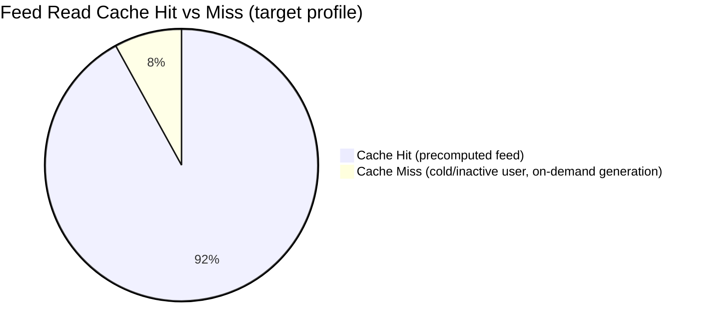

Cache tiers, cheapest/hottest to coldest:
1. **CDN edge cache** — media + very popular/public post content.
2. **Feed cache (Redis/Memcached)** — `<post_id, user_id>` pointers, precomputed top N per user, short TTL + background refresh.
3. **Post cache** — full post objects keyed by `post_id`, high fan-in (many feeds reference same popular post) → very high hit rate, good candidate for LRU.
4. **User/graph cache** — follower/following lists, refreshed on graph mutation.
5. **Origin (DB)** — Post DB + Graph DB, touched only on cache miss.

**Feed item lifecycle:**

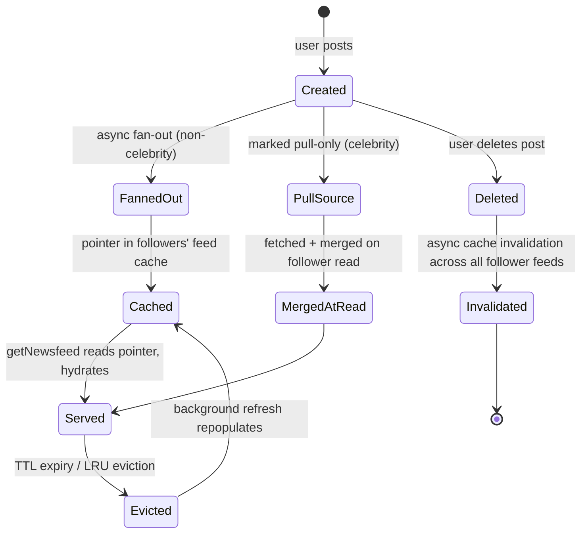

**Cheat sheet — caching:**
- Cache **pointers**, not full objects, in the per-user feed cache — keeps it cheap even with massive fan-out.
- Post cache has extreme read fan-in (same viral post read by millions) — perfect LRU/hot-key candidate, consider dedicated hot-key replication.
- Deletion/edit requires async invalidation across every follower's feed — plan for eventual consistency here (a deleted post may briefly still appear).
- Background refresh (not just lazy-on-miss) keeps precomputed feeds warm for active users.

---

## Deep Dive: Security & Abuse

**Mental model:** every write endpoint (`createPost`, `likePost`, `addComment`, `followUser`) is also an attack surface — spam, bot farms, and fake-engagement rings all abuse the exact same fast paths this design just optimized. Ranking already has an "integrity filter" stage (see Ranking deep dive); abuse detection is what feeds that filter its signals.

### Signals — Memory Hook: **"SPAM"**

| Letter | Signal | Example |
|---|---|---|
| **S** | Similarity/duplication | Same text/image hash posted hundreds of times → content-hash dedup, flag as spam |
| **P** | Pace (velocity anomalies) | One account liking 500 posts/minute, or posting every few seconds → rate limiting + anomaly detection |
| **A** | Age & trust of account | Brand-new accounts with no history get down-weighted engagement and stricter rate limits |
| **M** | Mutual reports/graph clustering | A cluster of accounts that only ever like/follow each other (bot ring) → coordinated-inauthentic-behavior detection |

### Where mitigations sit

- **Rate limiting** — token-bucket per user on `createPost`/`likePost`/`addComment`/`followUser`, enforced at the web tier before hitting any service (cheapest place to reject abuse).
- **Fake-engagement discounting** — the ranking service's affinity/signal features should *discount* likes/comments from low-trust or bot-flagged accounts rather than count every like at face value — otherwise a bot ring can force low-quality content to the top of everyone's feed.
- **Report/block pipeline** — a user report doesn't have to remove content immediately; it can feed the same "integrity filter" stage in the ranking funnel as a soft down-rank, with human review for high-report-velocity content (this is also why the privacy deep dive treats blocks as a pre-filter, not a ranking discount — blocks are absolute, reports are a graded signal).
- **Shadow-limiting** — for confirmed spam accounts, quietly stop fanning their posts out (or drop their weight to near-zero in ranking) rather than an abrupt visible ban — reduces retaliation/ban-evasion incentive.

**Cheat sheet — security & abuse:**
- Volunteer this section briefly even if not asked — "the same endpoints that make this system fast are the ones spam/bots target, so rate limiting and fake-engagement discounting sit at the write path and inside the ranking signals" is a strong closing line.
- Use the **SPAM** mnemonic (Similarity, Pace, Age/trust, Mutual clustering) to name concrete detection signals instead of a vague "we'd detect spam."
- Tie it back to existing pieces of the design: rate limiting at the web tier, discounting inside ranking features, reports feeding the integrity filter — don't invent a whole new subsystem.

---

## Key Design Decisions & Trade-offs

| Decision | Option chosen | Trade-off accepted |
|---|---|---|
| Fan-out strategy | Hybrid (write for most, read for celebrities) | Extra branching logic, but avoids write storms |
| Consistency | Eventual (PACELC → EL, favor low latency) | Followers may see a post a few seconds late |
| Feed cache content | Pointers, not full posts | Extra hop to hydrate, but massive storage savings |
| Ranking compute | Nearline features + offline/async model scoring | Slight staleness in features vs pure real-time scoring |
| Pagination | Cursor-based | Slightly more complex than offset, but correct under concurrent inserts |
| Media storage | Blob + CDN, never inline | Extra upload/transcode step, but read path stays fast |
| Graph storage | Dedicated graph DB (property-graph model) | Extra system to operate, but graph traversal is native and fast |
| Counters | Denormalized + write-behind aggregation | Displayed count can lag true count by a few seconds on viral posts |
| Privacy check | Pre-filter before ranking/candidate generation | One more gate on the hot path, but never leaks private content by omission from ranking alone |
| Sharding | Post DB by `post_id`, Graph DB by `user_id` | Different keys per store, but each matches that store's dominant access pattern |

---

## Bottlenecks, Failure Modes & Mitigations

| Failure mode | Cause | Mitigation |
|---|---|---|
| **Thundering herd / hot key** | Celebrity post, viral post fan-out or read | Hybrid fan-out; request coalescing; dedicated hot-key cache replication |
| **Fan-out queue backlog** | Kafka consumer lag under peak write load | Auto-scale consumers; partition by user_id; backpressure on producer |
| **Cache stampede** | Mass simultaneous expiry of popular keys | Jittered TTLs; stale-while-revalidate; background refresh before expiry |
| **Hot shard in graph DB** | Mega-follow-count accounts concentrate reads | Consistent hashing; dedicated replicas for high-fan-in vertices |
| **Ranking service overload** | Spiky load, expensive ML inference | Degrade to simpler/cheaper model or chronological fallback under load |
| **Stale/duplicate feed after delete/edit** | Async invalidation lag across fanned-out copies | Accept short staleness window; tombstone markers; client-side filter of tombstoned IDs |
| **Cross-region replication lag** | Multi-region active-active writes | Accept eventual consistency; route users to nearest region; conflict resolution via last-write-wins or vector clocks |
| **Single point of failure in web tier** | Load balancer or web server outage | Redundant LB (active-active), stateless web servers, health-check based failover |
| **Hot row for like/comment counter** | Viral post gets 1,000+ likes/sec on one row | Atomic increment + write-behind batching to an in-memory shard, flush to DB periodically; shard the counter itself if still hot |
| **Fake engagement / bot ring** | Coordinated accounts inflating likes/comments | Rate limiting at write path; down-weight low-trust accounts' signals in ranking; graph-clustering detection |
| **Stale privacy check after unfriend/block** | Fan-out-on-write audience resolved before the unfriend/block happened | Read-time re-check as a safety net for high-sensitivity content; async invalidation sweep on block events |

**Graceful degradation ladder (say this — interviewers love it):** ranking service down → fall back to chronological order → feed cache down → serve last-known-good cached copy → all else down → serve "recent posts from close friends" static fallback rather than an error page.

---

## Real-World References

### Facebook — TAO + Feed Ranking
- **TAO** (public engineering paper): a graph-aware caching/storage layer sitting in front of MySQL, purpose-built for the social graph — exactly the "graph DB as property-graph-over-relational-schema" pattern in this chapter's design. Optimized for read-heavy, eventually-consistent access at massive fan-in (same object read by millions).
- **Feed ranking**: started as **EdgeRank** (affinity × weight × decay, ~2010), evolved into a multi-stage ML system evaluating thousands of features per candidate per Facebook's own engineering statements, combining multiple ranking passes (retrieval → contextual filtering → ML scoring → integrity filters → final blending).

### Instagram — Hybrid Fan-out + Cassandra
- Feed store historically built on **Cassandra**, sharded by user, storing feed pointers per user's timeline — a direct real-world instance of "feed cache stores pointers, hydrate from post store on read."
- Uses **hybrid fan-out**: regular accounts get push (write-time) fan-out; very high-follower accounts are excluded and merged at read-time — the celebrity-problem mitigation described above is not hypothetical, it's production practice.
- Switched from chronological to ranked feed in 2016 (affinity/interest/timeliness signals); reintroduced an optional chronological "Following" tab in 2022 in response to user feedback — a real example of the ranked-vs-chronological trade-off being revisited after shipping.

### LinkedIn — Feed Mixer + Nearline Features
- Publicly described **"Feed Mixer"** architecture: aggregates candidates from multiple verticals (connections' updates, articles, job posts, ads) before a unified ranking pass — a real instance of the "candidate generation from multiple sources, then blend" funnel described above.
- Uses **Kafka**-based activity streams and nearline stream processing (e.g. Samza) to precompute features asynchronously rather than fully online — matching the "nearline feature extraction" stage in the ranking pipeline.

### Twitter — Fan-out Service + Hybrid + Open-sourced Ranking
- Historically hit the celebrity fan-out problem publicly (a single very-high-follower account posting caused fan-out/cache write storms) — the textbook motivating example for hybrid fan-out.
- Production timeline service used **Redis**-backed timeline caches with an async fan-out service; storage layer built on internally-developed wide-column/distributed stores.
- In 2023 open-sourced its recommendation algorithm: two-stage **candidate generation** (in-network + out-of-network sources, roughly balanced) feeding a **heavy ranker** (neural net) that scores on the order of ~1,000+ candidates predicting multiple engagement probabilities (favorite, reply, retweet, dwell time, etc.) before final heuristic filtering and feed mixing with ads — a real, public example of the exact funnel/scoring pipeline in this chapter's ranking deep dive.

**Cheat sheet — real-world references (drop 1-2 of these to sound credible, don't recite all):**
- "Facebook's TAO is essentially this graph-DB-over-relational-schema pattern in production."
- "This hybrid fan-out mirrors what Instagram and Twitter do for celebrity accounts."
- "LinkedIn's Feed Mixer is a real instance of the multi-source candidate generation funnel."
- "Twitter's open-sourced algorithm shows this exact candidate-gen → heavy-ranker → blend pipeline."

---

## Golden Rules

1. **Fan out pointers, never payloads.** The whole design is tractable because `<post_id, user_id>` is 16 bytes, not a full post.
2. **Read-heavy means cache-everything.** Feed reads outnumber writes by 100-1000x — every design choice should optimize the read path first.
3. **Celebrities break averages.** Never design fan-out assuming "average follower count" — always design for the tail (design explicitly for the max case, then special-case it).
4. **Rank in a funnel, not a flood.** Cheap candidate generation, then expensive scoring only on the shrunk set — never run your heaviest model over every possible post.
5. **Decouple generation from publishing.** Async write-side pipeline, synchronous read-side service — conflating them kills your latency SLO.
6. **Eventual consistency is a feature, not a bug, here.** A newsfeed a few seconds stale is invisible to the user; a newsfeed that's down is not.
7. **Degrade gracefully, in a defined order.** Ranking down → chronological. Feed cache down → last-known-good. Never surface a hard error where a slightly-worse feed would do.
8. **Privacy is a pre-filter, never a ranking discount.** A private post scoring low is still a leak risk if it was ever in the candidate pool — gate visibility before scoring, not through it.
9. **Idempotent writes make retries free.** Fan-out and counter updates must tolerate at-least-once delivery — `SET`/atomic-`INCR`, never "read, then write."

---

## Interview Strategy Cheat Sheet

- **Open with the mental model** (publishing pipeline: fan-out decision + ranking editor) — signals you see the two core axes immediately.
- **Get requirements confirmed fast**: symmetric/asymmetric graph, ranked/chronological, latency SLO, media in scope — then move on, don't linger.
- **Do capacity estimation with the fan-out multiplier explicitly** — this is the number interviewers watch for; most candidates forget to multiply write QPS by follower count.
- **Draw the two pipelines separately**: generation (async) and publishing (sync) — conflating them is the #1 tell of a shallow answer.
- **Bring up the celebrity problem unprompted** — if the interviewer doesn't ask, volunteer it around the fan-out discussion; it's the single most-tested edge case in this problem family.
- **Justify caching/CDN with the numbers you computed** (media dwarfs text storage) rather than asserting "we'll use a CDN" as a platitude.
- **Name real systems** (TAO, Cassandra, Kafka, Redis) briefly to demonstrate grounded knowledge, but don't turn it into a trivia recitation.
- **Narrate the architecture evolution** (naive pull → fan-out-on-write → hybrid + ranking) before landing on the final diagram — this is the artifact interviewers remember most.
- **Volunteer privacy and abuse** even if not asked — one line each ("visibility is a pre-filter before ranking"; "rate limiting and fake-engagement discounting guard the write path") shows production maturity beyond the happy path.
- **Close with graceful degradation** — shows production maturity beyond "happy path" design.

---

## Master Cheat Sheet

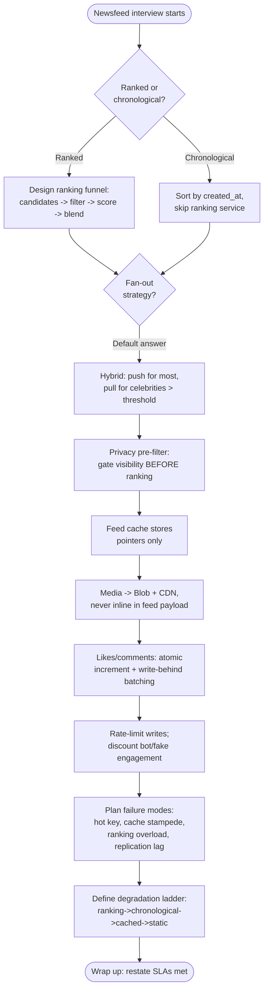

| Topic | One-line answer |
|---|---|
| Fan-out | Hybrid — push pointers for most users, pull at read-time for celebrities |
| Ranking | Funnel: cheap candidate gen → ML scoring on shrunk set → blended value model |
| Storage | Graph DB for relationships, Post DB/cache for content, Blob+CDN for media |
| Sharding | Post DB by `post_id`, Graph DB by `user_id`, feed cache by `user_id` |
| Cache | Store pointers not payloads; multiple tiers (CDN, feed, post, graph) |
| Consistency | Eventually consistent, favor availability (PACELC) |
| Celebrity problem | Threshold-based skip of push fan-out, merge at read-time |
| Privacy | Pre-filter before ranking; write-time audience can go stale, read-time never does |
| Counters | Denormalized + atomic increment; write-behind batching for viral hot rows |
| Abuse/security | Rate limit writes; discount fake engagement in ranking; **SPAM** signals (Similarity, Pace, Age/trust, Mutual clustering) |
| Architecture evolution | Naive pull/single-DB → fan-out-on-write + feed cache → hybrid fan-out + ranking → full HLD (media/CDN/notifications) |
| Bottleneck to always mention | Thundering herd from fan-out or cache stampede on hot content |
| Degradation order | Ranking → chronological → last-known-good cache → static fallback |
| Numbers to have ready | 8K RPS/server, fan-out multiplier ~300, ~90%+ cache hit target, P99 <200ms, viral post ~1K likes/sec on one row |
