# Design Instagram — FAANG Interview Guide

> **Enhancement notes:** this pass added (1) a resumable/chunked-upload subsection for
> large video files, which the original upload pipeline glossed over; (2) an explicit
> cache-tier sequence diagram for the normal-user feed read (the "O(1) read" claim in
> Section 8 meant "cache hit," which wasn't shown); (3) comment API endpoints, since
> `COMMENT` exists in the data model and counters deep dive but was missing from the API
> list; (4) a short discovery/explore-feed note distinguishing it from search; and (5) a
> line tying the v3 architecture evolution explicitly back to celebrity special-casing.
> Everything new is marked with 🆕. The mental model, capacity math, fan-out deep dive,
> sharding, ID scheme, counters, ranking funnel, and privacy sections were already strong
> and are left untouched.

A photo/video-sharing social network: users post media, follow other users, and see a
ranked/chronological feed of what the people they follow posted. The whole design boils
down to one tension that shows up in almost every question the interviewer will ask:
**writes are cheap and rare, reads are massive and constant, and the feed has to feel
instant regardless of how many people you follow or how many followers you have.**

---

## 1. Mental Model

Think of Instagram as **three systems duct-taped together**, each with a completely
different access pattern:

| Sub-system | Shape of the problem | Right analogy |
|---|---|---|
| **Media store** | Write-once, read-many, huge blobs, needs to be fast and cheap at exabyte scale | A library that never lets you edit a book, only add new ones — optimized purely for "hand me this book fast" |
| **Social graph** | Small records, insane read fan-out, needs to answer "who follows whom" in microseconds | An address book so big it lives in RAM across thousands of machines |
| **Feed / timeline** | A per-user pre-baked or on-the-fly list of post IDs | A newspaper that's either printed the night before and dropped on your porch (push), or assembled at the newsstand the moment you ask for it (pull) |

The entire "detailed design" lesson of this chapter is really just one question dressed
up three ways: **do we do the expensive work at write time (push/fan-out-on-write), at
read time (pull/fan-out-on-read), or split by user popularity (hybrid)?** Master that
trade-off and the rest of the system (storage, CDN, counters, search, notifications) is
just "apply standard building blocks to a read-heavy workload."

**Golden mental shortcut:** Instagram is a **read-heavy fan-out problem wrapped around a
blob store**. Everything else — SQL vs NoSQL, cache tiers, CDN placement — exists to serve
that fan-out cheaply.

---

## 2. Interview Playbook

Say this out loud, in this order. Don't jump to "we'll use Cassandra" before you've
earned it with requirements and math.

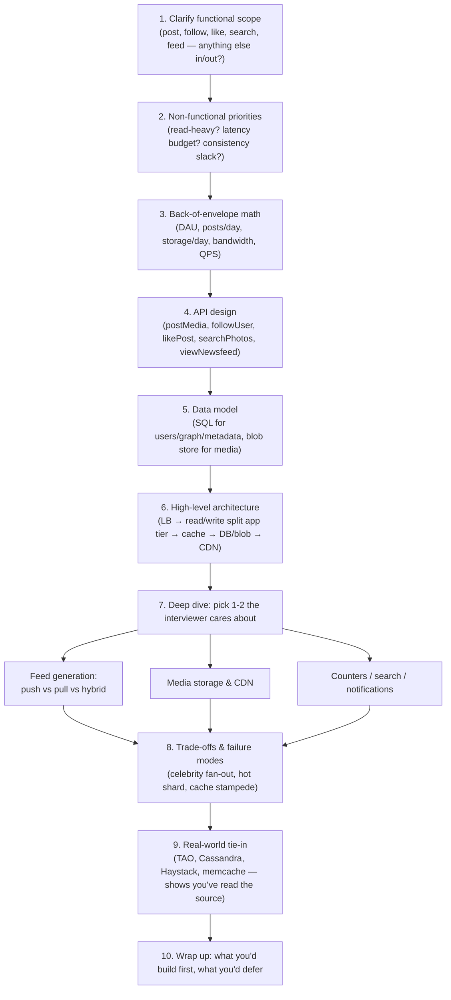
```mermaid
flowchart TD
    A["1. Clarify functional scope<br/>(post, follow, like, search, feed — anything else in/out?)"] --> B["2. Non-functional priorities<br/>(read-heavy? latency budget? consistency slack?)"]
    B --> C["3. Back-of-envelope math<br/>(DAU, posts/day, storage/day, bandwidth, QPS)"]
    C --> D["4. API design<br/>(postMedia, followUser, likePost, searchPhotos, viewNewsfeed)"]
    D --> E["5. Data model<br/>(SQL for users/graph/metadata, blob store for media)"]
    E --> F["6. High-level architecture<br/>(LB → read/write split app tier → cache → DB/blob → CDN)"]
    F --> G["7. Deep dive: pick 1-2 the interviewer cares about"]
    G --> G1["Feed generation:<br/>push vs pull vs hybrid"]
    G --> G2["Media storage & CDN"]
    G --> G3["Counters / search / notifications"]
    G1 --> H["8. Trade-offs & failure modes<br/>(celebrity fan-out, hot shard, cache stampede)"]
    G2 --> H
    G3 --> H
    H --> I["9. Real-world tie-in<br/>(TAO, Cassandra, Haystack, memcache — shows you've read the source)"]
    I --> J["10. Wrap up: what you'd build first, what you'd defer"]
```

**Cheat-sheet**
- Never open with "I'll use Cassandra" — open with functional scope, always.
- Spend real time on the fan-out trade-off; it's the signature deep-dive of this problem, interviewers will steer you there even if you don't.
- Explicitly call out the *read:write ratio* (~100:1 here) early — it justifies every downstream decision (cache, CDN, replicas).
- If time is short, pick ONE deep dive and go deep rather than skimming five.

---

## 3. Requirements Clarification

### Functional Requirements

| # | Requirement | Notes |
|---|---|---|
| 1 | Post photos and videos | With caption (≤2,200 chars) and hashtags (≤30) |
| 2 | Follow / unfollow users | Unidirectional relationship (A follows B ≠ B follows A) |
| 3 | Like / dislike posts | High write-QPS on a tiny record — a counter problem in disguise |
| 4 | Search photos/videos | By caption keyword, hashtag, or location |
| 5 | Generate news feed | Chronological (or ranked) posts from people the user follows, plus suggested/promoted content |

Out of scope unless asked: direct messages, Stories (bonus — covered briefly below since
the source material introduces it), Reels/ML ranking internals, ads auction.

### Non-Functional Requirements

| Requirement | What it means here | Design implication |
|---|---|---|
| **Scalability** | Handle 1B+ users, millions of concurrent requests | Horizontal sharding of app tier, DB, blob store |
| **Low latency** | Feed generation must feel instant | Pre-compute (push) where possible, cache aggressively |
| **High availability** | Feed and browsing must survive node/AZ failures | Replication, no single point of failure, graceful degradation |
| **Durability** | Uploaded media must never be lost | Replicated blob storage, backups, checksums |
| **Relaxed consistency** | OK if a post takes a while to reach a follower in a distant region | Eventual consistency across regions is acceptable — buys you availability + latency |
| **Reliability** | Tolerate hardware/software failures | Redundancy, health checks, automated failover |

> **Interview signal:** if the interviewer says "it's fine if my friend's post shows up a
> few seconds late for someone across the world," they just told you **eventual
> consistency is acceptable** — that's your license to use async replication, queued
> fan-out, and CDN edge caches without apologizing for staleness.

**Cheat-sheet**
- This is a **read-heavy, availability-over-consistency, durability-critical** system — say those three words explicitly.
- Durability (media) and consistency (feed visibility) are *different knobs* — don't conflate them. Media must never be lost; feed staleness is fine.
- Functional scope is deliberately small (5 features) — resist scope creep unless the interviewer asks for DMs/Stories/ranking.

---

## 4. Capacity Estimation (Worked Example)

### Reusable formula chain

```
DAU, posts/day, avg object size
        │
        ▼
Storage/day = (photos/day × avg photo size) + (videos/day × avg video size)
        │
        ▼
Storage/year = Storage/day × 365          (→ tells you sharding/replication needs)
        │
        ▼
Incoming bandwidth = Storage/day ÷ 86,400 sec
        │
        ▼
Outgoing bandwidth = Incoming bandwidth × (read:write ratio)
        │
        ▼
Servers needed = (DAU × requests/user/day) ÷ (requests/server/sec × 86,400)
```

State the *method* out loud — interviewers will change an input (e.g., "what if video
were the default format?") and expect you to redo the chain, not recite a memorized
number.

### Worked numbers (the assumptions this chapter uses)

- 1B total users, **500M DAU**
- 60M photos/day @ 3 MB max, 35M videos/day @ 150 MB max
- 20 requests/user/day (any type)
- Read:write ratio ≈ **100:1**
- A typical app server handles 100 req/sec

```
Storage/day  = 60M × 3MB + 35M × 150MB
             = 180 TB      + 5,250 TB
             = 5,430 TB/day

Storage/year = 5,430 TB × 365 ≈ 1,981,950 TB ≈ 1.98 PB/year

Incoming BW  = 5,430 TB ÷ 86,400 sec ≈ 62.84 GB/s ≈ 502.8 Gbps

Outgoing BW  = 502.8 Gbps × 100  ≈ 50.28 Tbps      ← this is why CDN is not optional

Servers      = (500M × 20) ÷ (100 req/s × 86,400 s/day)
             = 10,000,000,000 ÷ 8,640,000
             ≈ 1,157 servers
```

**Follow-up numbers an interviewer likes to hear you derive on the spot:**

```
Fan-out write cost (naive push-to-everyone model):
  95M posts/day × avg 200 followers/user ≈ 19B feed-insert ops/day
                                          ≈ 220,000 writes/sec sustained (not counting spikes)

Celebrity worst case (pure push):
  1 post × 100M followers, even at 0.1 ms/write ≈ 10,000 sec ≈ 2.8 hours to fan out ONE post
  → this single number is the entire justification for the hybrid fan-out model.
```

### Numbers worth memorizing

| Reference point | Value |
|---|---|
| RAM random access | ~100 ns |
| Redis/Memcached GET (same rack) | ~0.5–1 ms |
| SSD random read | ~100 µs – 1 ms |
| Cassandra write (quorum, same DC) | ~1–5 ms |
| PostgreSQL indexed read | ~1–5 ms |
| Same-datacenter round trip | ~0.5–1 ms |
| Cross-region round trip | ~50–150 ms |
| CDN edge hit | ~10–30 ms (vs. 100+ ms to origin) |
| "Good" cache hit rate for a hot feed cache | 90%+ |
| Healthy read:write ratio for a social feed | 100:1 to 1000:1 |

**Cheat-sheet**
- Always derive storage → bandwidth → servers in that order; each feeds the next.
- The single most interview-impressive number you can produce here is the **celebrity
  fan-out cost** — it's the mathematical proof for why hybrid fan-out exists, not just an
  opinion.
- State assumptions out loud before computing (avg followers, photo:video split, read:write ratio) — that's what "worked example" means to an interviewer.

---

## 5. API Design

REST, all calls implicitly carry `userID` for the acting user.

```
POST /postMedia(userID, media_type, list_of_hashtags, caption)
POST /followUser(userID, target_userID)
POST /unfollowUser(userID, target_userID)
POST /likePost(userID, target_userID, post_id)
POST /dislikePost(userID, target_userID, post_id)
POST /addComment(userID, post_id, text)              🆕
GET  /getComments(userID, post_id, generate_timeline)  🆕
GET  /searchPhotos(userID, keyword)
GET  /viewNewsfeed(userID, generate_timeline)
```

🆕 `addComment`/`getComments` were the one gap between the API and the data model —
`COMMENT` already exists in the ER diagram (Section 6) and the counters deep dive
(Section 13) covers comment-count hotspots, but no endpoint had been listed. Comments
paginate with the same cursor pattern as the feed.

| Param | Meaning |
|---|---|
| `media_type` | photo or video |
| `list_of_hashtags` | max 30 per post |
| `caption` | max 2,200 chars |
| `text` | comment body |
| `keyword` | username, hashtag, or place — ranked by reach (likes + views) |
| `generate_timeline` | timestamp marker — feed/comments only return items unseen since last call (cursor-based pagination, not offset-based) |

**Interview tip:** `generate_timeline` is a disguised **cursor/pagination token**. Say
that explicitly — offset-based pagination ("give me posts 100-120") breaks under
concurrent inserts; cursor-based ("give me everything after this opaque token") doesn't.

---

## 6. High-Level Design

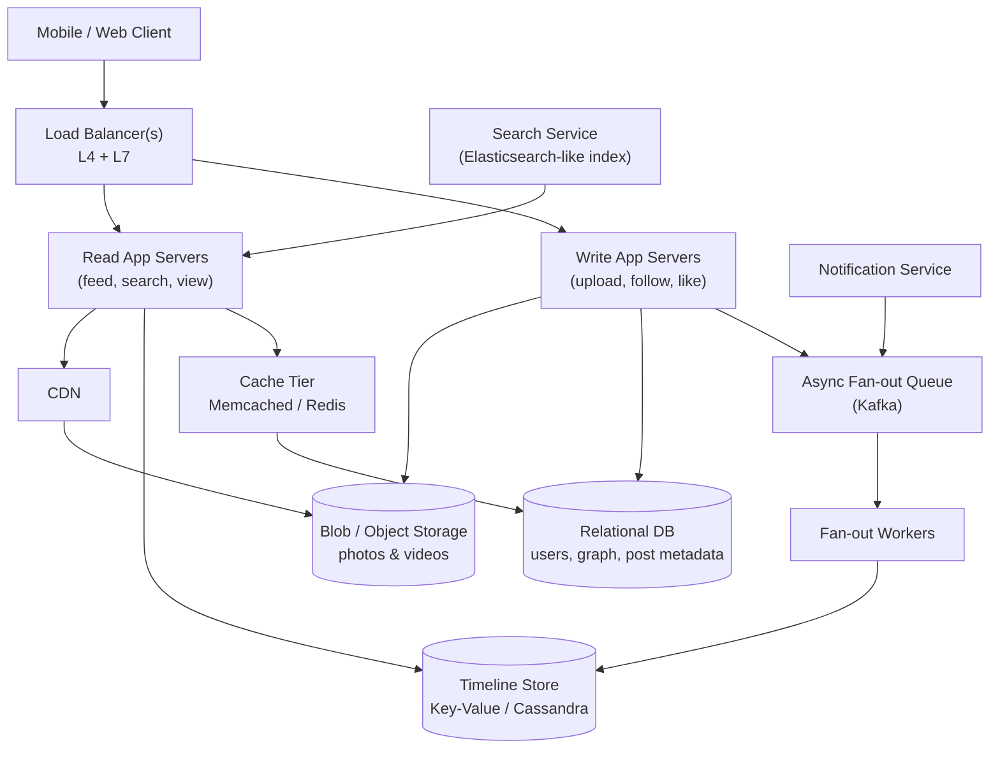
```mermaid
graph TD
    Client["Mobile / Web Client"] --> LB["Load Balancer(s)<br/>L4 + L7"]
    LB --> WriteAPI["Write App Servers<br/>(upload, follow, like)"]
    LB --> ReadAPI["Read App Servers<br/>(feed, search, view)"]

    WriteAPI --> Queue["Async Fan-out Queue<br/>(Kafka)"]
    WriteAPI --> SQLdb[("Relational DB<br/>users, graph, post metadata")]
    WriteAPI --> Blob[("Blob / Object Storage<br/>photos & videos")]

    Queue --> FanoutWorkers["Fan-out Workers"]
    FanoutWorkers --> FeedStore[("Timeline Store<br/>Key-Value / Cassandra")]

    ReadAPI --> Cache["Cache Tier<br/>Memcached / Redis"]
    Cache --> SQLdb
    ReadAPI --> FeedStore
    ReadAPI --> CDN["CDN"]
    CDN --> Blob

    SearchAPI["Search Service<br/>(Elasticsearch-like index)"] --> ReadAPI
    NotifSvc["Notification Service"] --> Queue
```

**Component roles**
- **Load balancer** — L7 routing, splits by verb/path so read and write tiers scale independently (this system is ~100:1 read-skewed — never scale them together).
- **Write path** — inserts metadata row, uploads blob, pushes an event onto a queue for async fan-out. Never do fan-out synchronously in the request path.
- **Read path** — hits cache first, falls back to feed store / DB, media always served via CDN, never proxied through app servers.
- **Fan-out workers** — consume the queue, write post references into followers' timeline rows. This is where push vs. pull vs. hybrid logic lives (deep dive below).
- **Cache** — absorbs the 100:1 read skew; without it every feed view is N DB reads (N = number of people followed).
- **CDN** — absorbs the ~50 Tbps outgoing bandwidth bill; without it, egress from origin blob storage alone would be the bottleneck.

### Data model / storage schema

| Table | Key columns | Notes |
|---|---|---|
| **Users** | userID, name, email, bio, location, created_at, last_login | ~222 bytes/row |
| **Followers** | followerID, followeeID | Unidirectional edge; ~8 bytes/row but *billions* of rows |
| **Photos** | photoID, userID (FK), location, caption, created_at | ~394 bytes/row, actual bytes live in blob store, this row is just metadata |
| **Videos** | videoID, userID (FK), location, caption, created_at | Same shape as Photos |

```
Example scale (from the worked estimate):
  500M users            → 111,000 MB metadata
  250 followers/user avg → 2,000 MB per 250M edges sampled
  60M photos             → 23,640 MB metadata (photos themselves live in blob store)
  35M videos              → 13,790 MB metadata
```

### Entity relationships & sharding keys

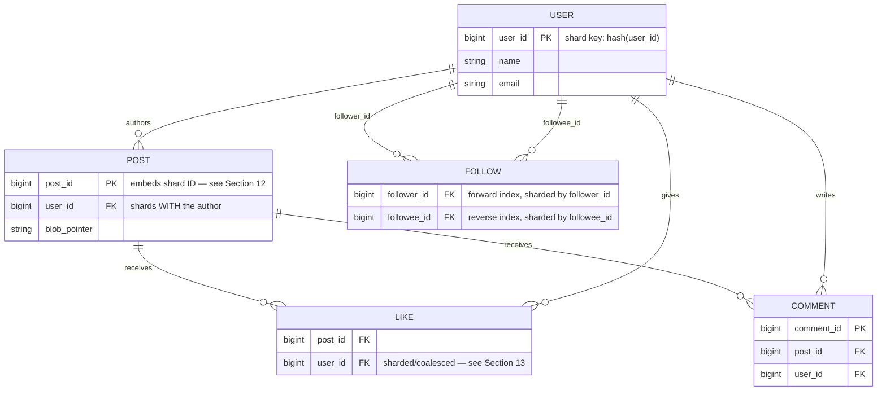
```mermaid
erDiagram
    USER ||--o{ POST : "authors"
    USER ||--o{ FOLLOW : "follower_id"
    USER ||--o{ FOLLOW : "followee_id"
    POST ||--o{ LIKE : "receives"
    POST ||--o{ COMMENT : "receives"
    USER ||--o{ LIKE : "gives"
    USER ||--o{ COMMENT : "writes"

    USER {
        bigint user_id PK "shard key: hash(user_id)"
        string name
        string email
    }
    FOLLOW {
        bigint follower_id FK "forward index, sharded by follower_id"
        bigint followee_id FK "reverse index, sharded by followee_id"
    }
    POST {
        bigint post_id PK "embeds shard ID — see Section 12"
        bigint user_id FK "shards WITH the author"
        string blob_pointer
    }
    LIKE {
        bigint post_id FK
        bigint user_id FK "sharded/coalesced — see Section 13"
    }
    COMMENT {
        bigint comment_id PK
        bigint post_id FK
        bigint user_id FK
    }
```

Read this as: `Post`, `Like`, and `Comment` shard *with* their parent (a post's shard =
its author's shard) so "get this post's comments" stays a single-shard read. `Follow`
needs **two** indexes on different shard keys — forward (by `follower_id`, answers "who do
I follow") and reverse (by `followee_id`, answers "who follows me") — because both
directions are hot and neither can be derived cheaply from the other at scale.

**Where do the actual bytes live?** Never in the relational DB. Photos/videos go to blob
storage (object store); the SQL row only holds a pointer (URL/key) + searchable metadata.

### Disambiguation: SQL vs. NoSQL for this system

| | Relational (Postgres/MySQL) | NoSQL (Cassandra/DynamoDB) |
|---|---|---|
| **Used for** | Users, Followers, post metadata | Timeline/feed store, counters |
| **Why** | Data is genuinely relational — foreign keys (userID → posts), need ordering + joins ("give me this user's followers") | Feed rows are simple, wide, append-heavy, sharded by userID; no joins needed, needs to absorb massive write fan-out |
| **Consistency** | Strong (ACID) where it matters — account data, follow edges | Eventually consistent, tunable (quorum reads/writes) — acceptable per NFRs |
| **Instagram reality** | PostgreSQL, sharded by userID range | Cassandra for feed/timeline generation |

**Memory hook:** *"Relational for who-you-are and who-you-follow, wide-column for
what-you-see."* If it needs a join or a foreign key, it's SQL. If it's "give me the last
N items for this key, fast, forever," it's a wide-column/KV store.

**Cheat-sheet**
- Media bytes never sit in the DB — DB holds pointers + metadata only.
- Read/write app tiers split at the load-balancer layer, not just logically — scale them independently given the 100:1 skew.
- Say "Postgres for graph/metadata, Cassandra for feed" out loud — it mirrors Instagram's actual stack and signals real-world awareness.

---

## 7. Architecture Evolution: Why Each Layer Exists

Interviewers often want to see *why* a component exists, not just that it exists.
Narrating three progressively-scaled versions of this system — and naming what breaks at
each stage — is a stronger signal than jumping straight to the final diagram.

### v1: Monolith + single DB (the MVP)

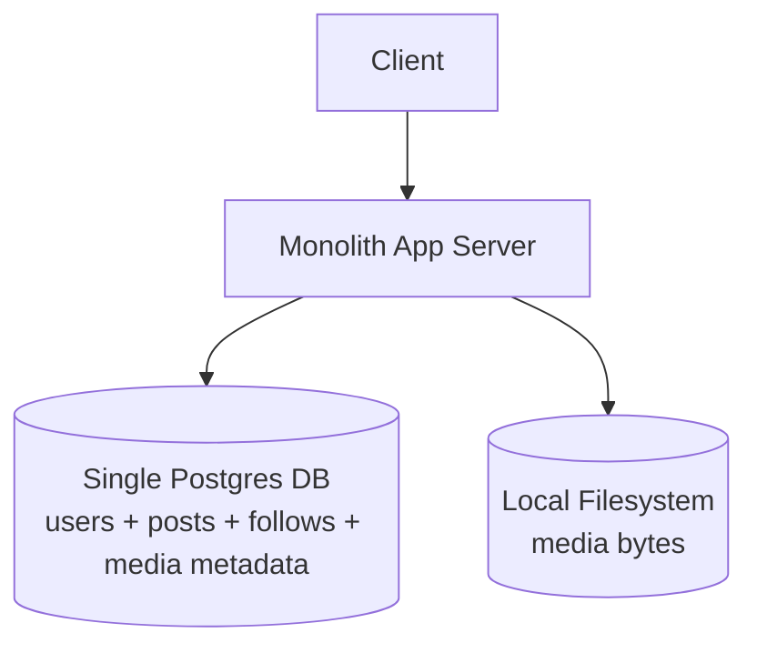
```mermaid
graph TD
    Client1["Client"] --> App1["Monolith App Server"]
    App1 --> DB1[("Single Postgres DB<br/>users + posts + follows + media metadata")]
    App1 --> FS1[("Local Filesystem<br/>media bytes")]
```

Fine for a few thousand users. **What breaks first:** every feed read re-joins the same
table the writes hit (read/write contention on one node); media bytes bloat the DB's disk
and backup size; one node is a single point of failure.

### v2: Add cache + CDN + read replicas

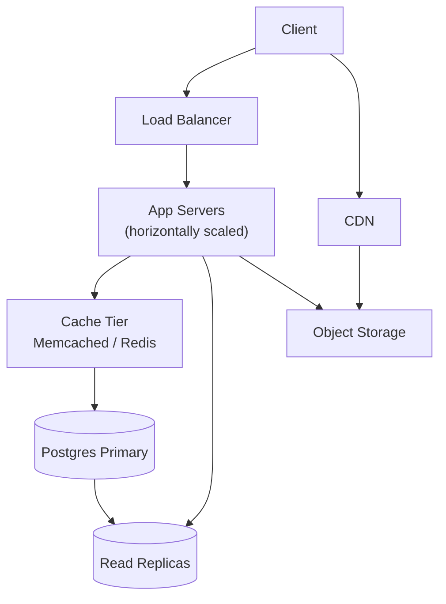
```mermaid
graph TD
    Client2["Client"] --> LB2["Load Balancer"]
    LB2 --> App2["App Servers<br/>(horizontally scaled)"]
    App2 --> Cache2["Cache Tier<br/>Memcached / Redis"]
    Cache2 --> DBP2[("Postgres Primary")]
    DBP2 --> DBR2[("Read Replicas")]
    App2 --> DBR2
    App2 --> Blob2["Object Storage"]
    CDN2["CDN"] --> Blob2
    Client2 --> CDN2
```

Cache absorbs the read skew, CDN absorbs media egress, replicas spread read load. **What
breaks next:** fan-out for a celebrity's post is still synchronous in the write path — one
post still means millions of writes before the request can return (recall the 2.8-hour
number from Section 4) — and a single write-master DB, even with read replicas, cannot
hold billions of users and edges.

### v3: Add sharding + async fan-out + a dedicated graph store

This is the architecture already shown in Section 6, now labeled by *why* each new piece
exists: **sharding** fixes "one DB can't hold everyone," the **async fan-out queue** fixes
"fan-out blocks the write path," and a **dedicated graph-aware store** (TAO-style, Section
10) fixes "the follow graph is too hot and too relational-shaped for a generic sharded
table." 🆕 One more piece lives inside that fan-out queue and is easy to gloss over: the
**fan-out workers apply the hybrid push/pull split from Section 8** — a 100M-follower
account gets special-cased to skip the queue entirely (pull instead), so one celebrity
post can never clog the same workers handling everyone else's normal-sized fan-out.

**Interview signal:** narrating this evolution — and naming the breaking point at each
stage — shows you'd build incrementally in a real job, not just recite an end-state
architecture from memory.

**Cheat-sheet**
- Never present the final architecture as a given — earn each layer by naming what it fixes.
- v1→v2 is "read-heavy problems" (cache, CDN, replicas); v2→v3 is "write/graph-shape problems" (sharding, async fan-out, graph store) — two different classes of pain.

---

## 8. Deep Dive: Feed Generation & Fan-out

This is *the* signature deep-dive for this chapter. Three approaches, in increasing
sophistication:

### 8.1 Pull (fan-out-on-read)

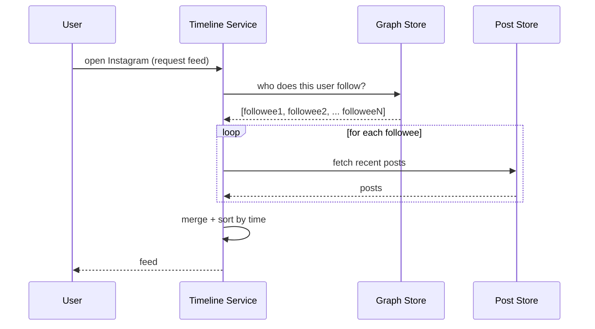
```mermaid
sequenceDiagram
    participant U as User
    participant TS as Timeline Service
    participant G as Graph Store
    participant P as Post Store

    U->>TS: open Instagram (request feed)
    TS->>G: who does this user follow?
    G-->>TS: [followee1, followee2, ... followeeN]
    loop for each followee
        TS->>P: fetch recent posts
        P-->>TS: posts
    end
    TS->>TS: merge + sort by time
    TS-->>U: feed
```

- **Pro:** No wasted write work — you only pay when someone actually opens the app.
- **Con:** Read latency scales with *number of people followed* (fan-in) — slow for
  active social users, and it re-does this merge on every single feed open even if
  nothing changed.

#### 🆕 Feed read with the cache tier (the piece the diagrams above skip)

Section 8.2/8.3 call the push-model read "O(1) — just fetch the pre-computed list." That
line is doing double duty: it means "cache hit," not "always instant." The pre-built
timeline still lives in the Cassandra timeline store; the cache in front of it is what
makes the read actually cheap. Making that explicit:

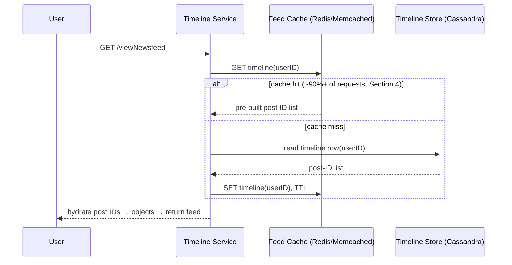
```mermaid
sequenceDiagram
    participant U as User
    participant TS as Timeline Service
    participant Cache as Feed Cache (Redis/Memcached)
    participant FS as Timeline Store (Cassandra)

    U->>TS: GET /viewNewsfeed
    TS->>Cache: GET timeline(userID)
    alt cache hit (~90%+ of requests, Section 4)
        Cache-->>TS: pre-built post-ID list
    else cache miss
        TS->>FS: read timeline row(userID)
        FS-->>TS: post-ID list
        TS->>Cache: SET timeline(userID), TTL
    end
    TS-->>U: hydrate post IDs → objects → return feed
```

Same cache-aside pattern as everywhere else in this design — the only thing that changes
per feed model is *what* got written into the cached list at write time (nothing, for
pure pull; every follower's row, for push; a mix, for hybrid).

### 8.2 Push (fan-out-on-write)

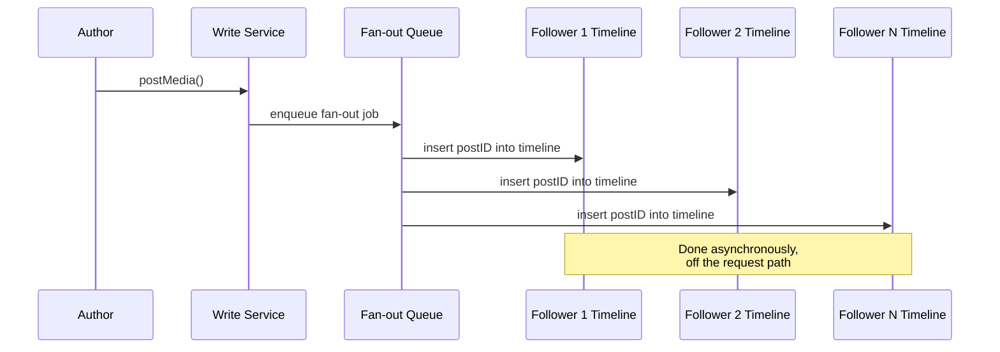
```mermaid
sequenceDiagram
    participant A as Author
    participant W as Write Service
    participant Q as Fan-out Queue
    participant F1 as Follower 1 Timeline
    participant F2 as Follower 2 Timeline
    participant Fn as Follower N Timeline

    A->>W: postMedia()
    W->>Q: enqueue fan-out job
    Q->>F1: insert postID into timeline
    Q->>F2: insert postID into timeline
    Q->>Fn: insert postID into timeline
    Note over F1,Fn: Done asynchronously,<br/>off the request path
```

- **Pro:** Feed read is now `O(1)` — just fetch the pre-computed list. This is why push
  crushes read latency.
- **Con:** Write cost scales with **follower count**. A celebrity with 100M followers
  turns *one post* into 100M writes (recall the 2.8-hour worked-example number above) —
  this is the whole reason push alone doesn't scale.

### 8.3 Hybrid (what actually gets built)

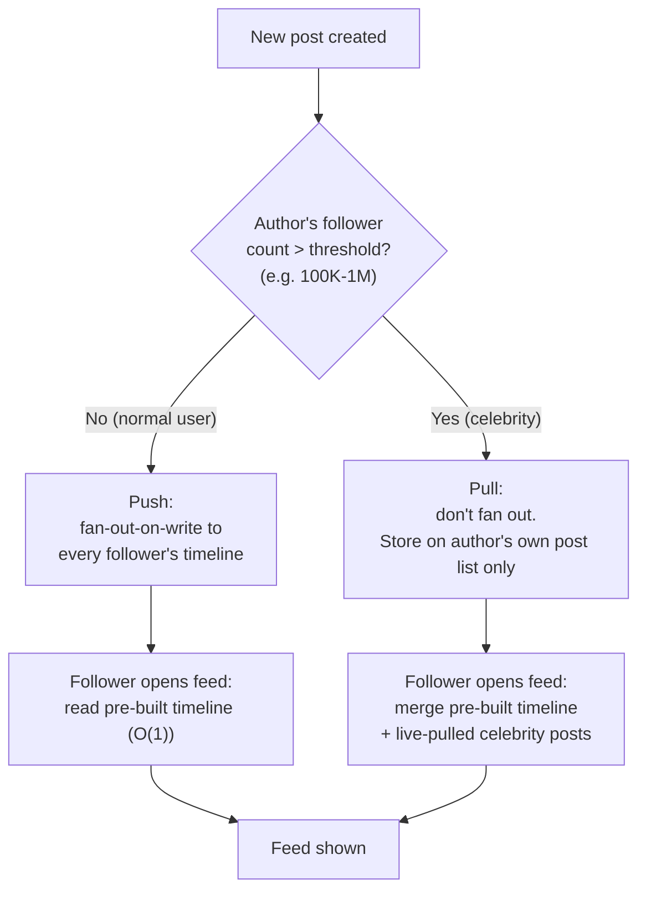
```mermaid
flowchart TD
    Post["New post created"] --> Check{"Author's follower<br/>count > threshold?<br/>(e.g. 100K-1M)"}
    Check -- "No (normal user)" --> Push["Push:<br/>fan-out-on-write to<br/>every follower's timeline"]
    Check -- "Yes (celebrity)" --> Pull["Pull:<br/>don't fan out.<br/>Store on author's own post list only"]
    Push --> Read["Follower opens feed:<br/>read pre-built timeline (O(1))"]
    Pull --> Merge["Follower opens feed:<br/>merge pre-built timeline<br/>+ live-pulled celebrity posts"]
    Read --> Feed["Feed shown"]
    Merge --> Feed
```

A single threshold is the simplified version. The production-grade decision tree has
more than one break-point, because "push everything instantly" and "push nothing" aren't
the only two options:

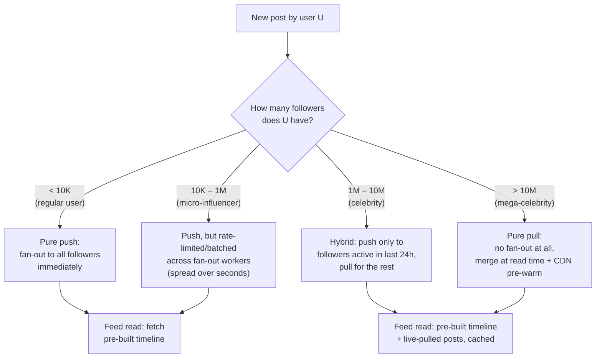
```mermaid
flowchart TD
    NewPost["New post by user U"] --> F{"How many followers<br/>does U have?"}
    F -- "< 10K<br/>(regular user)" --> T1["Pure push:<br/>fan-out to all followers<br/>immediately"]
    F -- "10K – 1M<br/>(micro-influencer)" --> T2["Push, but rate-limited/batched<br/>across fan-out workers<br/>(spread over seconds)"]
    F -- "1M – 10M<br/>(celebrity)" --> T3["Hybrid: push only to<br/>followers active in last 24h,<br/>pull for the rest"]
    F -- "> 10M<br/>(mega-celebrity)" --> T4["Pure pull:<br/>no fan-out at all,<br/>merge at read time + CDN pre-warm"]
    T1 --> Done["Feed read: fetch<br/>pre-built timeline"]
    T2 --> Done
    T3 --> Merge2["Feed read: pre-built timeline<br/>+ live-pulled posts, cached"]
    T4 --> Merge2
```

The exact bucket boundaries are tunable — what matters in an interview is showing the
*shape* of the trade-off (write cost grows with followers, so spend less write effort as
follower count grows), not memorizing "the" numbers.

| Approach | Write cost | Read cost | Best for |
|---|---|---|---|
| **Pull** | O(1) — nothing to do at write time | O(followees) — expensive, redone every read | Users who post rarely / have few followers |
| **Push** | O(followers) — can be huge | O(1) — just fetch the list | Normal users (hundreds–low thousands of followers) |
| **Hybrid** | O(followers) for normal users, O(1) for celebrities | O(1) + a small merge step for celebrity accounts followed | Production systems at Instagram/Twitter/Facebook scale |

**Memory hook:** *"Push what's small, pull what's huge."* A follower list is the
multiplier — when the multiplier is small (normal user), pay the cost once at write time;
when the multiplier is enormous (celebrity), don't multiply at all — merge at read time
instead.

**Where the timeline itself is stored:** a key-value store keyed by `userID`, value =
ordered list of post references (not full posts). If the list grows past the KV store's
per-value limit (a few MB), overflow the older entries into a blob and store a pointer —
same "pointer, not payload" pattern as the media table.

### 8.4 The celebrity read problem: thundering herd

Fan-out (above) is a **write-side** cost. There's a separate **read-side** cost for
pull/hybrid celebrity posts: the moment a mega-celebrity posts, potentially millions of
followers open the app in the same few seconds, and *every one of them* triggers "fetch
this celebrity's latest posts" against the post store — the same query, repeated
simultaneously at massive volume. Without protection this is a self-inflicted DDoS on
your own Post Store.

```mermaid
sequenceDiagram
    participant U1 as Follower 1
    participant U2 as Follower 2
    participant Un as Follower N (thousands, concurrent)
    participant TS as Timeline Service
    participant Cache as Cache (celebrity posts)
    participant PS as Post Store

    Note over U1,Un: Celebrity just posted.<br/>Thousands open the app in the same second.
    U1->>TS: get feed
    U2->>TS: get feed
    Un->>TS: get feed
    TS->>Cache: GET recent_posts(celebrity_id)
    Cache-->>TS: MISS (first request only)
    TS->>PS: fetch recent posts<br/>(single in-flight request; others coalesce/wait)
    PS-->>TS: posts
    TS->>Cache: SET recent_posts(celebrity_id), TTL + jitter
    Note over TS,Cache: All other concurrent requests<br/>served from cache — Post Store sees ONE query, not N
    TS-->>U1: feed (pre-built timeline + celebrity posts)
    TS-->>U2: feed (cache hit)
    TS-->>Un: feed (cache hit)
```

**The fix is two mechanisms working together, not one:**
1. **Request coalescing** — the first cache miss triggers exactly one fetch to the Post
   Store; every other concurrent request for the same key waits on that in-flight fetch
   instead of issuing its own (same pattern as Memcache's *leases*, Section 22).
2. **Cache-aside with a warm TTL** — once populated, thousands of reads per second are
   absorbed by the cache tier, not the DB.

**Interview signal:** this is a distinct failure mode from the write-side celebrity
fan-out cost (Section 4/8.2) — naming *both* the write-side cost (millions of fan-out
writes) and this read-side cost (thundering herd on cache miss) shows you understand the
celebrity problem has two separate failure surfaces, not one.

**Cheat-sheet**
- Never present push OR pull as "the" answer — the interview signal is recognizing *both
  fail at the extremes* and hybrid is the synthesis.
- Quantify it: "a celebrity post would mean N million synchronous writes" is worth more
  than saying "push doesn't scale for celebrities."
- Fan-out must be **asynchronous** (queue-based) even for normal users — never do it in
  the request path of `postMedia`.
- The threshold that splits "normal" from "celebrity" is itself a tuning knob — a few
  hundred thousand to a million followers is the usual line.
- The celebrity problem has **two** failure surfaces: write-side fan-out cost (8.2) and
  read-side thundering herd on cache miss (8.4) — solve both.

---

## 9. Deep Dive: Photo/Video Storage & CDN

**Problem:** billions of small-to-medium immutable blobs, at ~5.4 PB/day incoming and
~50 Tbps outgoing — a naive filesystem-per-photo approach dies on metadata overhead
(one inode + directory lookup per photo = multiple disk seeks just to find the bytes).

**Pattern used in the real world (Facebook's Haystack):**
- Pack many photos into large physical files ("needles" inside a "haystack"); keep only
  an in-memory index of `photo_id → (file, offset, size)`.
- This turns "read a photo" into **one disk seek** instead of three-plus (directory
  lookup → inode → data block).
- Old/cold photos can be moved to cheaper, denser storage tiers; hot photos stay on
  fast tiers.

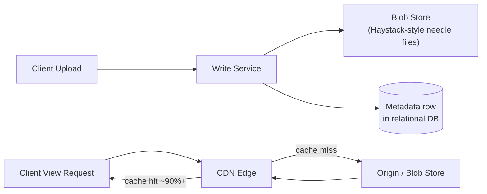
```mermaid
graph LR
    Upload["Client Upload"] --> WriteSvc["Write Service"]
    WriteSvc --> Haystack["Blob Store<br/>(Haystack-style needle files)"]
    WriteSvc --> Meta[("Metadata row<br/>in relational DB")]

    Viewer["Client View Request"] --> CDN["CDN Edge"]
    CDN -- "cache hit ~90%+" --> Viewer
    CDN -- "cache miss" --> Origin["Origin / Blob Store"]
    Origin --> CDN
```

### The full upload pipeline, end to end

Naming the components in Section 8 (Haystack, CDN) is necessary but not sufficient — an
interviewer will often want the whole request traced from tap-to-post:

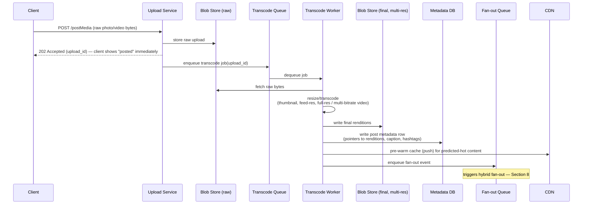
```mermaid
sequenceDiagram
    participant C as Client
    participant U as Upload Service
    participant B as Blob Store (raw)
    participant Q as Transcode Queue
    participant W as Transcode Worker
    participant BF as Blob Store (final, multi-res)
    participant DB as Metadata DB
    participant FQ as Fan-out Queue
    participant CDN as CDN

    C->>U: POST /postMedia (raw photo/video bytes)
    U->>B: store raw upload
    U-->>C: 202 Accepted (upload_id) — client shows "posted" immediately
    U->>Q: enqueue transcode job(upload_id)
    Q->>W: dequeue job
    W->>B: fetch raw bytes
    W->>W: resize/transcode<br/>(thumbnail, feed-res, full-res / multi-bitrate video)
    W->>BF: write final renditions
    W->>DB: write post metadata row<br/>(pointers to renditions, caption, hashtags)
    W->>CDN: pre-warm cache (push) for predicted-hot content
    W->>FQ: enqueue fan-out event
    Note over FQ: triggers hybrid fan-out — Section 8
```

The client gets an immediate acknowledgement while the expensive work — transcoding,
generating multiple renditions, writing metadata, and triggering fan-out — happens off
the request path. This is the exact same "never block on the expensive part" principle
as async fan-out, applied one layer earlier in the pipeline.

- **CDN strategy:** push (pre-populate on upload) for predictably-hot content like a
  celebrity's new post; pull (populate lazily on first miss) for the long tail.
  Instagram/Meta use a hybrid here too, same shape as the feed fan-out decision.
- **Lazy loading on the client:** only fetch media as the user scrolls into view — saves
  bandwidth and keeps perceived latency low (this is explicitly called out in the source
  material as a latency lever, not just a UX nicety).
- **Compression:** transcode uploads into multiple resolutions/bitrates at write time so
  the read path never serves more bytes than the client viewport needs — this alone is a
  major lever on that 50 Tbps outbound number. Illustrative renditions: photos get a
  150×150 thumbnail (grid view), a 640×640 feed-res copy, and a 1080×1080 full-res copy
  (zoom/profile); videos get transcoded into an adaptive-bitrate ladder (e.g. 240p/480p/
  720p/1080p), same idea as YouTube/Netflix — the player picks whichever rendition fits
  the viewer's current bandwidth instead of always pulling the biggest file.

### 🆕 Chunked / resumable upload for large media

The pipeline diagram above shows `C->>U: POST /postMedia (raw photo/video bytes)` as one
step — fine for a 3 MB photo, risky for a 150 MB video on a flaky mobile connection. If
that single request drops at 95% uploaded, a non-chunked client re-uploads all 150 MB
from scratch. The standard fix: split the file client-side and upload it in pieces that
can be retried independently.

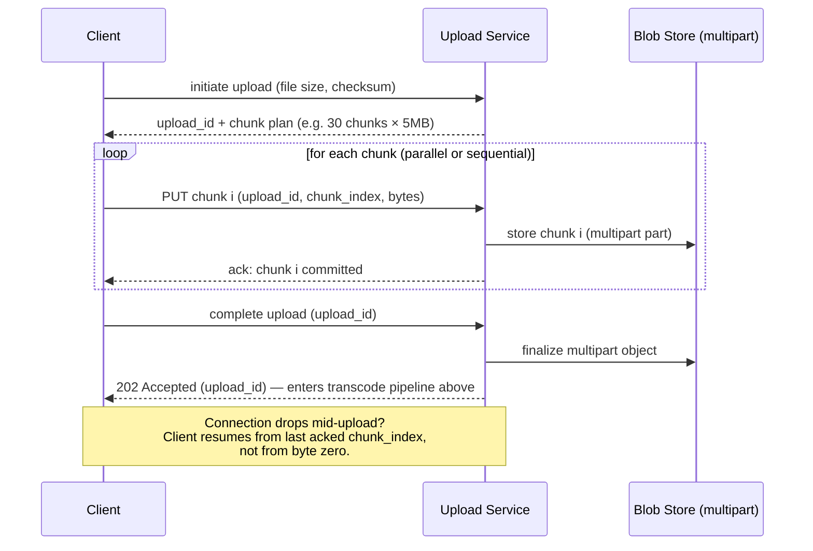
```mermaid
sequenceDiagram
    participant C as Client
    participant U as Upload Service
    participant B as Blob Store (multipart)

    C->>U: initiate upload (file size, checksum)
    U-->>C: upload_id + chunk plan (e.g. 30 chunks × 5MB)
    loop for each chunk (parallel or sequential)
        C->>U: PUT chunk i (upload_id, chunk_index, bytes)
        U->>B: store chunk i (multipart part)
        U-->>C: ack: chunk i committed
    end
    C->>U: complete upload (upload_id)
    U->>B: finalize multipart object
    U-->>C: 202 Accepted (upload_id) — enters transcode pipeline above
    Note over C,U: Connection drops mid-upload?<br/>Client resumes from last acked chunk_index,<br/>not from byte zero.
```

**Illustrative numbers:** a 150 MB video at 5 MB/chunk = 30 chunks. Without chunking, a
dropped connection at chunk 29 of 30 costs a full 150 MB re-upload; with chunking, it
costs one 5 MB retry. Chunk size is a trade-off: smaller chunks resume more cheaply but
add per-chunk request overhead; 4–8 MB is a common middle ground. This is the same idea
as S3 multipart upload or the `tus.io` resumable-upload protocol — name-drop either if
asked "how do you handle a large file upload reliably."

**Cheat-sheet**
- Say "metadata in SQL, bytes in blob store, blob store optimized to minimize disk seeks per read" — that's the whole Haystack insight in one sentence.
- CDN exists because of the *read:write ratio*, not because "CDNs are good practice" — tie it back to the 502.8 Gbps in / 50.28 Tbps out numbers.
- Multiple resolutions generated at upload time, not at read time — never transcode on the read path.
- Large files upload in resumable chunks, not one shot — a dropped connection should cost one chunk, not the whole file.

---

## 10. Deep Dive: Follow Graph

- **Shape:** a directed graph, edge = "A follows B." Not symmetric (Instagram, unlike
  Facebook friends, is a follow model like Twitter).
- **Access pattern:** "who does X follow" (fan-out source) and "who follows X" (fan-out
  target) — both need to be fast, both are read-dominant, and both are needed constantly
  by the fan-out workers above.
- **Real-world implementation — Meta's TAO:** a graph-aware caching/storage layer sitting
  in front of sharded MySQL. Models data as **objects** (nodes: users, posts) and
  **associations** (edges: follows, likes) with typed, time-ordered edge lists. TAO is
  read-optimized, eventually consistent across regions, and this is precisely the
  eventual-consistency slack the NFRs asked for.
- **Sharding:** graph edges are sharded by the *originating* user ID so "who does X
  follow" is a single-shard lookup; a secondary reverse index shards by target for
  "who follows X."

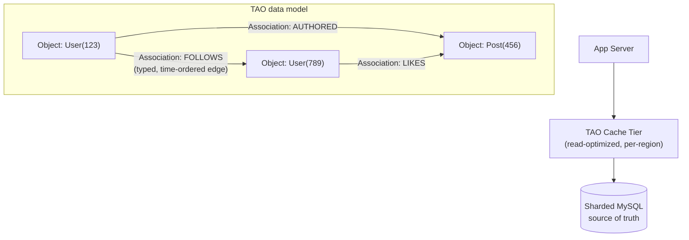
```mermaid
graph TD
    subgraph "TAO data model"
        U1["Object: User(123)"]
        P1["Object: Post(456)"]
        U2["Object: User(789)"]
        U1 -- "Association: FOLLOWS<br/>(typed, time-ordered edge)" --> U2
        U1 -- "Association: AUTHORED" --> P1
        U2 -- "Association: LIKES" --> P1
    end
    App["App Server"] --> TAOCache["TAO Cache Tier<br/>(read-optimized, per-region)"]
    TAOCache --> TAODB[("Sharded MySQL<br/>source of truth")]
```

Objects (nodes) and associations (typed, time-ordered edges) are cached read-optimized,
per-region, in front of sharded MySQL as the durable source of truth — writes go through
to MySQL, reads are served from the regional TAO cache, and cross-region cache
propagation is asynchronous (the eventual-consistency slack the NFRs granted).

**Private accounts and blocking** live on this same graph: a `FOLLOW` association should
carry a `state` (`pending` / `accepted`) so a private account's follow request doesn't
count for fan-out or feed until approved, and a `BLOCKS` association is checked at feed
and search read time (Sections 8, 14, 19) rather than by trying to retroactively undo a
fan-out that already happened.

**Cheat-sheet**
- Follow graph = directed, asymmetric, needs both forward and reverse indexes.
- Name-drop TAO if this becomes a deep-dive focus — it's the concrete, real answer to "how do you store a social graph at this scale," and it directly reflects the eventual-consistency NFR.
- Private-account approval and blocking are graph-edge concerns, not separate subsystems — model them as association state, not a bolt-on feature.

---

## 11. Deep Dive: Database Sharding & Resharding

Instagram's real-world write-up (2012 Engineering blog) is the canonical answer here:
Postgres sharded by `user_id`, with the shard ID embedded directly in every generated ID
(full scheme in Section 12).

### Shard key: user_id vs. post_id

| Shard key | Good for | Bad for |
|---|---|---|
| **user_id** (Instagram's real choice) | "get all of user X's posts/follows" is a single-shard lookup — no scatter-gather | A viral user's posts, likes, and comments all land on *one* shard — a hot shard, mitigated by the caching + hybrid fan-out already covered |
| **post_id** | Spreads a single celebrity post's like/comment write traffic across shards | "get all posts by user X" now requires a scatter-gather across every shard |

**Memory hook:** shard by the entity whose data you read *together* most often. Here
that's "all of this user's stuff," so `user_id` wins — even though it creates the hot-shard
risk that Sections 8 and 13 exist to mitigate.

### Resharding without downtime

Growth eventually means splitting shards. Two standard approaches:

| Approach | How it works | Data moved when adding 1 node (of N) |
|---|---|---|
| **Directory-based lookup service** | A shard map (userID → physical shard) that can be updated arbitrarily; adds one lookup hop per request | Whatever the operator chooses to move — flexible, but the directory service itself becomes a dependency |
| **Consistent hashing** | Shards placed on a hash ring; a node addition only takes over the ring-slice nearest to it | ≈ 1/N of keys move |

**Concrete example:** 4,096 logical shards spread across 32 physical DB nodes (128
logical shards/node). Adding node #33 with consistent hashing moves only ~1/33 ≈ 3% of
the data. Naive `hash(user_id) % 32` → `% 33` re-sharding would remap nearly 97% of keys
— which is exactly why "just change the mod" is the wrong answer in an interview.

**Cheat-sheet**
- State the shard key AND name its hot-shard downside — "sharded by user_id, which means a viral user's data all lands on one shard, which is why we also cache and hybrid-fan-out" is a complete answer.
- Consistent hashing minimizes data movement on resize; naive modulo hashing does not — this is a classic interview trap question.

---

## 12. Deep Dive: Unique ID Generation

Every post, comment, and like needs a globally unique, ideally time-sortable ID — and
with data sharded across thousands of nodes, a single auto-increment column is a
non-starter (single point of contention, doesn't tell you which shard owns the row).

### Instagram's real 2012 scheme (Snowflake-style, 64-bit ID)

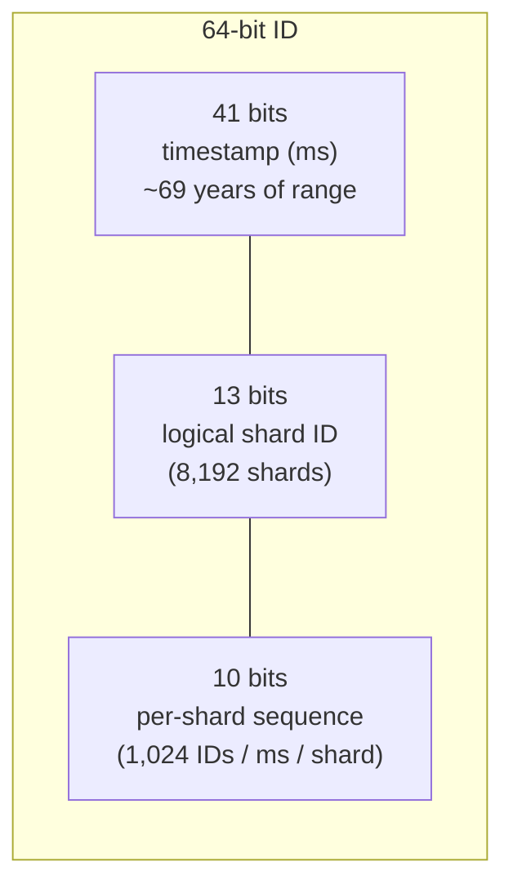
```mermaid
graph LR
    subgraph "64-bit ID"
        A["41 bits<br/>timestamp (ms)<br/>~69 years of range"] --- B["13 bits<br/>logical shard ID<br/>(8,192 shards)"] --- C["10 bits<br/>per-shard sequence<br/>(1,024 IDs / ms / shard)"]
    end
```

- **41 bits timestamp** — milliseconds since a custom epoch (e.g. Instagram's launch
  date). 2^41 ms ≈ 69 years before overflow — a non-issue within any planning horizon.
- **13 bits shard ID** — 2^13 = **8,192** possible logical shards, embedded directly in
  the ID.
- **10 bits sequence** — 2^10 = **1,024** IDs per millisecond per shard, reset every ms.

**Worked math:**
```
Max throughput per shard = 1,024 IDs/ms × 1,000 ms/s = 1,024,000 IDs/sec/shard
Theoretical system-wide ceiling = 1,024,000 × 8,192 shards ≈ 8.39 billion IDs/sec

Actual need (from Section 4): 95M posts/day ÷ 86,400 s ≈ 1,100 posts/sec average
→ enormous headroom; the design goal is "never bottleneck," not "use the full range."
```

**Interview signal:** say out loud — "the ID itself tells you which shard the row lives
on, so routing a read by ID never needs a separate directory-lookup service." That one
sentence is the entire point of embedding the shard ID.

### Disambiguation: ID generation schemes

| Scheme | Time-sortable? | Shard-aware? | Central coordination? | Downside |
|---|---|---|---|---|
| DB auto-increment | Yes | No | Yes — single sequence | Bottleneck + SPOF; doesn't survive sharding |
| Random UUID | No | No | No | Not sortable; needs a secondary index just to find which shard owns a row |
| **Snowflake / Instagram (timestamp + shard + sequence)** | Yes | Yes | No — each shard generates independently | Needs clock-skew handling (NTP, or stall-if-clock-moved-backward) |

**Cheat-sheet**
- This is a near-guaranteed follow-up to "how do you shard the DB" — have the 41/13/10 split memorized cold.
- The whole point isn't the bit-widths, it's "the ID embeds enough information to route without a lookup."

---

## 13. Deep Dive: Likes & Comments Counters

A "like" is a 1-bit signal, but at Instagram's scale a viral post gets liked thousands of
times per second — a naive `UPDATE posts SET likes = likes + 1` serializes on a single
row and becomes the hottest of hotspots.

**Techniques (in increasing sophistication):**
1. **Write coalescing / batching** — buffer increments in memory (or a queue) and flush
   aggregated deltas periodically instead of one DB write per like.
2. **Sharded counters** — split one counter into N sub-counters (e.g., hashed by
   requester ID), write to a random shard, sum all shards on read. Trades a hot row for
   N warm rows.
2b. **In-memory counter service** (Redis `INCR`) as the write-absorbing layer in front of
    the DB, with periodic async persistence.
3. **Approximate counts** for UI display ("1.2M likes") — exact counts aren't needed for
   the number shown to users, so eventual/approximate consistency is an explicit,
   acceptable simplification here.

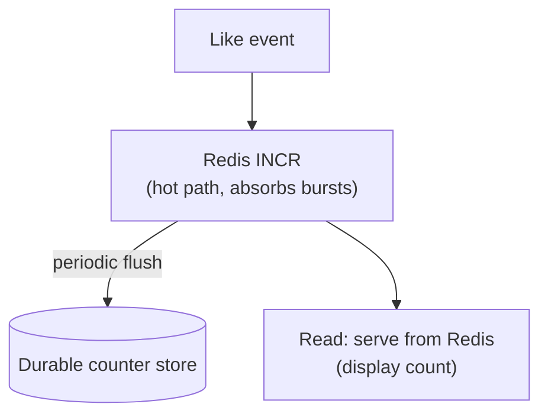
```mermaid
graph TD
    Like["Like event"] --> Cache["Redis INCR<br/>(hot path, absorbs bursts)"]
    Cache -- "periodic flush" --> DB[("Durable counter store")]
    Cache --> Read["Read: serve from Redis<br/>(display count)"]
```

### Disambiguation: cache-aside vs. write-through vs. write-behind

| | Cache-aside | Write-through | Write-behind (used here) |
|---|---|---|---|
| **Write path** | App writes DB directly; cache is invalidated, left stale until next read | App writes cache *and* DB synchronously, together | App writes cache only; DB is flushed asynchronously later |
| **Read path** | Miss → read DB, populate cache | Cache always warm/consistent with DB | Cache always warm; DB may lag by the flush interval |
| **Best for** | Read-heavy, staleness-tolerant data — the timeline/feed cache, post metadata | Data where cache and DB must never disagree | Extremely hot, approximate counters — likes/comments |
| **Why not the others for likes** | Still serializes on the DB row for every like — doesn't fix the hot-row problem | Same problem, just synchronous on both sides — worse latency, same hot row | Absorbs the burst in memory; the DB only sees periodic batched deltas |

**Memory hook:** *feed reads* want cache-aside (read-mostly, staleness is fine); *like
counters* want write-behind (write-mostly, staleness is fine); write-through earns its
keep only when neither can be stale — rare in this system.

**Cheat-sheet**
- Diagnose this as a **hot-key/hot-row problem**, not a "we need a bigger DB" problem.
- Sharded counters + async flush is the standard answer; exact real-time accuracy is explicitly *not* required for a like count.
- If asked "cache-aside or write-through for the timeline cache" — cache-aside, because feed staleness is an accepted NFR and write-through buys consistency this system doesn't need.

---

## 14. Deep Dive: Search

- Search is by **keyword (caption), hashtag, or location** — this is full-text /
  faceted search, not a primary-key lookup, so it doesn't belong in the relational store.
- Real-world pattern: build an inverted index (Elasticsearch, or Meta's internal
  Unicorn search infra) — `hashtag → [post_ids]`, `location → [post_ids]`, ranked by
  reach (likes + views), refreshed near-real-time off the write path (async indexing
  pipeline, not synchronous with `postMedia`).
- Results are paginated with **infinite scroll / lazy loading**, not "load all matches" —
  same lazy-loading principle as the media read path.
- **Privacy filtering:** private accounts and blocked relationships must never leak
  through search. Either bake a `visibility` flag (public / private / blocked-list) into
  the index and filter at query time, or simply never index a private account's posts for
  public search — only serve them through the normal follow-based feed path. See Section
  19 for the full privacy/blocking treatment.
- **🆕 Discovery / Explore, vs. search:** search is pull-based and query-driven — the user
  types a keyword. Explore/discovery is the opposite: no query, the system pushes content
  it predicts you'll engage with from accounts you don't follow. Mechanically it's not a
  new subsystem — it reuses the same candidate-generation → ranking funnel as the main
  feed (Section 18), just swapping the candidate source from "posts by people you follow"
  to "posts similar users engaged with." Worth naming if asked "how do users find new
  content," but don't build it as a separate architecture from scratch.

**Cheat-sheet**
- Search index is a separate system fed asynchronously from writes — never query the primary DB with a `LIKE '%keyword%'` at this scale.
- Ranking by reach means search is really "search + a lightweight ranking function," foreshadowing full feed ranking (Section 18).
- Privacy checks belong in the query/filter path, not as an afterthought — a private post leaking through search is a real production bug class.
- Search = query-driven pull; Explore/discovery = query-less push, same ranking funnel, different candidate source.

---

## 15. Deep Dive: Notifications

- A like/comment/follow is itself a fan-out event — same shape as feed fan-out, reuse
  the queue.
- Push notifications go through a dedicated notification service that: dedups/batches
  ("Alice and 12 others liked your photo"), respects user preferences, and fans out
  over APNs/FCM.
- This should **never** be synchronous with the write path — a like write must complete
  even if the push-notification provider is down. Decouple with a queue and let the
  notification service be an independent, best-effort consumer.

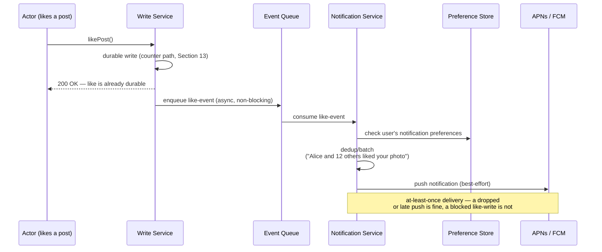
```mermaid
sequenceDiagram
    participant A as Actor (likes a post)
    participant W as Write Service
    participant Q as Event Queue
    participant NS as Notification Service
    participant Pref as Preference Store
    participant APNs as APNs / FCM

    A->>W: likePost()
    W->>W: durable write (counter path, Section 13)
    W-->>A: 200 OK — like is already durable
    W->>Q: enqueue like-event (async, non-blocking)
    Q->>NS: consume like-event
    NS->>Pref: check user's notification preferences
    NS->>NS: dedup/batch<br/>("Alice and 12 others liked your photo")
    NS->>APNs: push notification (best-effort)
    Note over NS,APNs: at-least-once delivery — a dropped<br/>or late push is fine, a blocked like-write is not
```

**Cheat-sheet**
- Notifications are a downstream consumer of the same event stream as fan-out — don't design a second, separate pipeline from scratch.
- Best-effort, at-least-once delivery is fine here — a duplicate or slightly-late notification is a non-issue; a blocked like-write is.
- The write path returns success the moment the like is durable — the notification is decoupled entirely, never gating the response.

---

## 16. Deep Dive: Rate Limiting

An API layer serving 1B+ users needs protection from abusive clients — scrapers,
credential-stuffing bots, runaway retry loops — not just from legitimate load. This is a
small, frequently-forgotten checkbox item in this interview.

**Where enforced:** at the API gateway / L7 load balancer, before a request reaches the
app tier — keyed per-user (authenticated) and per-IP (unauthenticated), since a bad actor
controls their IP more easily than their account.

### Disambiguation: rate-limiting algorithms

| Algorithm | How it works | Pro | Con |
|---|---|---|---|
| Fixed window counter | Count requests in a wall-clock window (e.g. per minute), reset at the boundary | Cheap — one `INCR` + TTL in Redis | Bursts at window edges — up to 2× the limit right at a boundary |
| Sliding window | Track a rolling window of timestamps/weighted counts | Smooths the edge-burst problem | More state/computation per check |
| **Token bucket** (typical choice) | Bucket refills at a fixed rate; each request consumes a token; empty bucket → reject | Allows short legitimate bursts while capping sustained rate | Slightly more per-key state than fixed window |

**Concrete numbers:** reads ~600 req/min/user (~10 req/sec); writes (post/like/follow)
~60 req/min/user (writes are rarer and more expensive to fan out); unauthenticated/per-IP
limits much stricter (e.g. 20 req/min) to blunt scraping. Over the limit → **HTTP 429**
with a `Retry-After` header, never a silent drop.

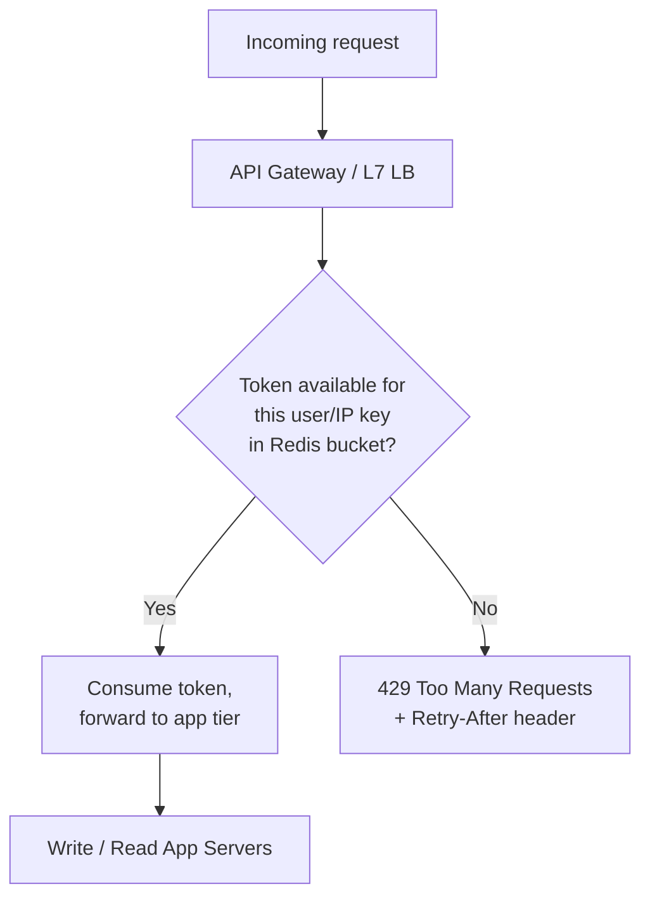
```mermaid
flowchart TD
    Req["Incoming request"] --> GW["API Gateway / L7 LB"]
    GW --> Check{"Token available for<br/>this user/IP key<br/>in Redis bucket?"}
    Check -- "Yes" --> Consume["Consume token,<br/>forward to app tier"]
    Check -- "No" --> Reject["429 Too Many Requests<br/>+ Retry-After header"]
    Consume --> App["Write / Read App Servers"]
```

**Reuse, don't reinvent:** the storage primitive is the same Redis `INCR`-with-TTL
pattern already used for the like-counter hot path (Section 13) — one building block,
two use cases.

**Cheat-sheet**
- If asked "how do you stop one client from hammering your API" — token bucket in Redis at the gateway, per-user and per-IP, is the one-sentence answer.
- Don't rate-limit deep in the app tier — enforce it at the edge so abusive traffic never reaches (and threatens) the DB.

---

## 17. Deep Dive: Stories (bonus — ephemeral content)

The source material introduces this as an add-on feature: a story is visible for exactly
24 hours, then must disappear.

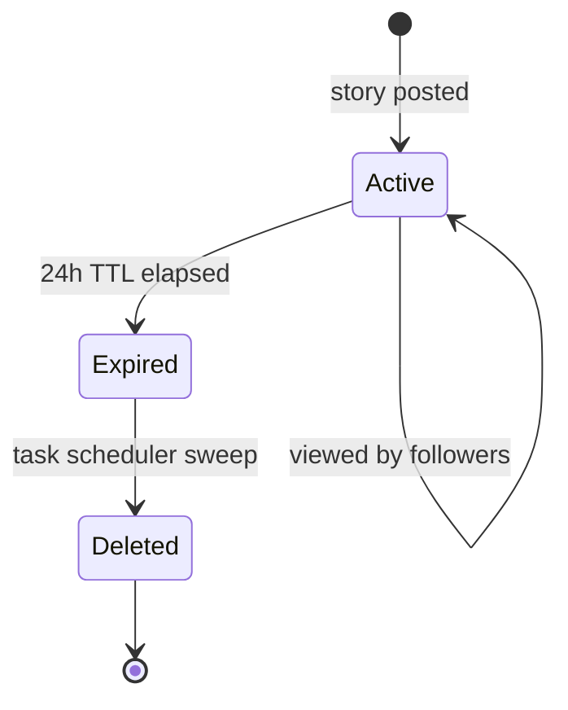
```mermaid
stateDiagram-v2
    [*] --> Active: story posted
    Active --> Active: viewed by followers
    Active --> Expired: 24h TTL elapsed
    Expired --> Deleted: task scheduler sweep
    Deleted --> [*]
```

- Implementation: store a `duration`/`expires_at` field alongside the story row; a
  **task scheduler** periodically sweeps and deletes rows past their TTL (or, better,
  set a native TTL on the storage engine — e.g., Cassandra's per-row TTL — so expiry is
  free instead of a batch job).
- This is a good example of choosing the storage feature (native TTL) over inventing a
  cron job to do the same thing.

**Cheat-sheet**
- If the interviewer asks for Stories: "ephemeral" = TTL problem, not a new architecture — reuse the timeline store, add expiry.
- Prefer native TTL support in the storage engine over a custom scheduled-deletion job.

---

## 18. Deep Dive: Feed Ranking Pipeline

Section 8's hybrid fan-out answers "how do I get a candidate set of posts efficiently."
It does **not** answer "in what order do I show them" — that's ranking, and "we run it
through an ML model" is not a complete interview answer.

### The original formula: EdgeRank

Instagram/Facebook's original ranking signal, spelled out in components (worth naming
explicitly, not just as a buzzword):

```
EdgeRank score = Σ (Affinity(u, e) × Weight(e) × Decay(e))   over each candidate edge e
```

- **Affinity** — how much does the viewer historically interact with *this* content's
  author (past likes, comments, DMs, profile visits)?
- **Weight** — the interaction type's importance (a comment > a like > a passive view).
- **Decay** — recency; score falls off as the post ages (exponential/inverse time decay).

### The modern multi-stage pipeline (what actually runs today)

```mermaid
flowchart LR
    Sources["Candidate generation:<br/>push timeline + recommended<br/>+ ads<br/>(hundreds–1,000s of candidates)"] --> Light["Stage 1: light ranking<br/>(cheap model, e.g. logistic regression)<br/>prunes to ~100-150"]
    Light --> Heavy["Stage 2: heavy ranking<br/>(neural net, rich features)<br/>scores the survivors"]
    Heavy --> Filter["Stage 3: filtering<br/>dedup seen posts, diversity rules,<br/>ad insertion, privacy/blocklist"]
    Filter --> Final["Final ordered feed<br/>(~20-50 posts shown)"]
```

1. **Candidate generation** — gather a few hundred to ~1,000 candidates: posts from
   followees (the push timeline from Section 8), plus recommended posts from accounts you
   don't follow but are predicted to engage with, plus ad candidates.
2. **Light-weight first-pass ranking** — a cheap model scores *all* candidates and prunes
   to ~100-150 — this stage exists purely so the next, expensive stage doesn't have to run
   on 1,000 items.
3. **Heavy ranking** — a neural network scores the smaller survivor set with rich
   features (user/post embeddings, recent interaction history) — affordable only because
   the candidate set has already been pruned.
4. **Filtering / business logic** — remove already-seen posts, enforce diversity (don't
   show 5 posts from the same author back to back), insert ads at fixed slots, and apply
   privacy/blocklist rules (Section 19).

**Interview signal:** ranking is a layer *on top of* the candidate set hybrid fan-out
already produces — it doesn't replace fan-out, and naming the funnel shape
(candidates → light rank → heavy rank → filter) is what separates "I know it's ML" from
"I understand why it's structured as a funnel" (cost per item goes up at each stage, so
the item count must go down).

**Cheat-sheet**
- Don't say "ML model" and stop — name the funnel: candidate generation → light ranking → heavy ranking → filtering.
- EdgeRank's three components (affinity × weight × decay) are worth reciting cold if pushed on "what came before ML ranking."
- If time is short, mention this last — it's a natural extension of fan-out, not the core of the system.

---

## 19. Deep Dive: Privacy & Blocking

Two rules that touch nearly every other subsystem in this design, so they deserve to be
named once, explicitly, rather than assumed:

- **Private accounts:** a follow isn't just an edge existing or not — model it with
  **state** (`pending` → `accepted`) on the `FOLLOW` association (Section 10). Only
  `accepted` edges count for fan-out (Section 8) and appear in "who follows me" reverse
  lookups.
- **Blocking:** a `BLOCKS` association must be checked at **read time** — feed
  (ranking/filtering stage, Section 18), search (query-time filter, Section 14), and
  notifications (suppress, don't notify a blocker of a blocked user's activity). It is
  *not* enforced by trying to retroactively strip already-fanned-out rows — that's slow to
  reverse and the block can be undone later anyway.
- **Where the block-list lives:** same fast, hot, per-user read path as the follow graph
  — the graph-aware cache tier (TAO-style, Section 10), not a separate lookup system.

**Memory hook:** *privacy is enforced at the filter, not at the fan-out.* Trying to
prevent a blocked post from ever being fanned out is brittle (blocks change); filtering it
out at every read path (feed, search, notifications) is robust and reuses infrastructure
you already built.

**Cheat-sheet**
- If asked "how do blocked users not see each other's content" — filter at read time in ranking/search/notifications, don't chase every fan-out write.
- Private-account follow requests are graph-edge state, not a new subsystem.

---

## 20. Key Design Decisions & Trade-offs

| Decision | Chosen approach | Trade-off accepted |
|---|---|---|
| Feed generation | Hybrid push/pull by follower-count threshold | More complex than either pure approach, but avoids both failure modes |
| Metadata storage | Relational (Postgres), sharded by userID | Gains joins/consistency for graph+metadata; loses easy cross-shard queries |
| Feed/timeline storage | Wide-column / KV (Cassandra) | Gains write-scalability and simple per-user lookups; loses ad-hoc query flexibility |
| Media storage | Blob store (Haystack-style), not filesystem | Extra engineering upfront; wins massively on read I/O at scale |
| Consistency | Eventual, cross-region | Faster, more available; a post can lag briefly for a distant follower |
| Delivery of media | CDN (push for predictable-hot, pull for long tail) | Infra cost of CDN footprint; wins on latency + origin bandwidth |
| Counters | Sharded + async-flushed, approximate for display | Not perfectly real-time; avoids hot-row contention |
| Search index | Separate async-updated inverted index | Search results can lag writes by seconds; avoids hammering primary DB |
| Sharding key | Shard by `user_id` | Simplifies "get user's data" queries; a viral user can still create a hot shard, mitigated by caching + hybrid fan-out |
| Unique IDs | Snowflake-style (timestamp + shard + sequence), no central coordinator | IDs a few bytes larger than a naive auto-increment int; wins shard-routability and no write contention |
| Feed ranking | Multi-stage (candidate gen → light rank → heavy rank → filter) instead of pure chronological | More ML/infra complexity; wins substantially on relevance/engagement |
| Rate limiting | Token bucket per user/IP at the API gateway | Small added latency/infra cost; protects the whole system from abusive clients |

**Cheat-sheet**
- Every row above is "we gave up X to get Y" — always state the X. An answer without a
  named trade-off reads as incomplete to an interviewer.
- If asked "what would you change for a smaller scale?" — collapse hybrid fan-out to pure
  push (fine below a few million users) and merge SQL+NoSQL into one Postgres instance.

---

## 21. Bottlenecks & Failure Modes

| Failure mode | Why it happens | Mitigation |
|---|---|---|
| **Celebrity fan-out storm** | One post → millions of synchronous writes | Hybrid fan-out; async queue with backpressure; rate-limit fan-out workers |
| **Hot shard / hot row** | Viral post's likes/comments concentrate on one key | Sharded counters, write coalescing, cache-aside for the hot post's metadata |
| **Cache stampede** | Popular key expires, thousands of requests miss simultaneously and hammer DB | Request coalescing (single in-flight fetch per key), jittered TTLs, stale-while-revalidate |
| **Thundering herd on DB after cache-tier outage** | Whole cache tier drops, all reads fall to DB at once | Circuit breaker + graceful degradation (serve stale/cached feed, shed load) rather than let DB fall over |
| **Blob store metadata overhead** | Naive filesystem: one inode/dir entry per photo, multiple seeks per read | Haystack-style packed storage, in-memory index |
| **Cross-region replication lag** | Async replication for availability | Explicitly acceptable per NFRs — surface this as a deliberate trade-off, not a bug |
| **Fan-out queue backlog during traffic spike** | Burst of celebrity posts overwhelms fan-out workers | Autoscale workers, prioritize/rate-limit by follower tier, degrade to "compute the celebrity's feed contribution via pull" temporarily |
| **Single point of failure at LB/app tier** | Any layer without redundancy | Multiple LB nodes (active-active), stateless app servers behind them, health-check based failover |
| **Resharding a live system** | Growth requires adding/splitting shards | Consistent hashing (only ~1/N keys move) or a directory-based shard-map service, migrated with dual-write during cutover |
| **Abusive client / scraping** | Unbounded API calls from a bad actor or bot | Token-bucket rate limiting at the gateway, per-user and per-IP (Section 16) |
| **Privacy leak via search/feed** | Blocked/private content surfacing to the wrong viewer | Enforce block/privacy checks in the ranking filter stage and the search query path (Sections 18, 19), not just at write time |

**Cheat-sheet**
- Cache failure must never become system failure — fail open to the DB with load-shedding, not a hard outage.
- Every "storm" failure mode in this system traces back to fan-out — that's the throughline to keep coming back to.
- State explicitly: replication lag is an accepted trade-off here (per NFRs), not a defect to "fix."

---

## 22. Real-World References (How Meta Actually Built This)

- **TAO (The Associations and Objects)** — Meta's graph-aware caching/storage layer for
  the social graph (users, posts, likes, follows) sitting in front of sharded MySQL.
  Optimized for reads, eventually consistent across regions, exactly the graph store
  this design needs for the follow relationship.
- **Cassandra** — originally built at Facebook (inbox search), a wide-column store used
  by Instagram for feed/timeline storage: one wide row per user holding an ordered list
  of post references, cheap to append to, cheap to read as a slice.
- **Haystack** — Facebook's photo storage system: pack many photos per physical file,
  keep only a slim in-memory index, cutting per-photo reads to ~1 disk seek. The direct
  answer to "how do you store billions of small blobs cheaply."
- **Memcache / "Scaling Memcache at Facebook"** — the caching tier pattern this design
  leans on; notable techniques include *leases* (to prevent thundering herd on a
  regenerating key) and *mcrouter* (a proxy layer for routing/sharding cache traffic).
- **Sharding & ID generation at Instagram** (Instagram Engineering blog, 2012) —
  Instagram sharded PostgreSQL by user ID and generated IDs with an embedded timestamp +
  shard ID + per-shard sequence (Snowflake-like), so an ID alone tells you which shard
  holds the row — no lookup table needed. Full worked scheme (41/13/10 bit split) in
  Section 12; resharding trade-offs in Section 11.
- **Feed ranking evolution** — Instagram/Facebook moved from strict reverse-chronological
  to an ML-ranked feed (originally "EdgeRank": affinity × weight × time-decay; later
  multi-stage ML — candidate retrieval, lightweight first-pass ranking, then a heavy
  neural ranker on the survivors). Full funnel breakdown in Section 18.
- **Instagram's original stack** — Django + PostgreSQL (sharded) + Memcached + Redis +
  Cassandra, running on AWS before deeper integration into Meta's infrastructure
  (Haystack/blob storage, TAO) post-acquisition.

**Cheat-sheet**
- These names are your "I've done my homework" signal — drop 2-3 of them naturally
  during the deep dive, don't recite the whole list.
- If asked "how would this differ if Instagram were built today at Meta," the honest
  answer is: swap the bespoke Postgres sharding + Cassandra combo for TAO (graph) +
  Haystack/Everstore (blobs) + a dedicated feed-ranking ML pipeline — same shape, more
  mature building blocks.

---

## 23. Golden Rules

- **Never do fan-out synchronously in the write request path** — queue it, always.
- **Push what's small (normal users' follower lists), pull what's huge (celebrities').**
- **Metadata in SQL, bytes in blob storage** — a database row should never hold megabytes.
- **Cache failure must never mean system failure** — fail open, shed load, serve stale.
- **A "like" is a hot-key problem, not a schema problem** — shard the counter, don't just add read replicas.
- **Consistency is a knob, not a constant** — durability for media is non-negotiable; consistency for feed visibility is negotiable, and negotiating it is what buys you availability and latency.
- **Every design decision has a name-able cost** — if you can't say what you gave up, you haven't finished the answer.
- **An ID should tell you where the row lives** — embed the shard in the ID, skip the directory-lookup hop.
- **Rate-limit at the edge, not deep in the stack** — a token bucket at the gateway is cheaper than an app server or DB falling over.
- **Ranking sits on top of the candidate set fan-out already produces** — it's a layer, not a replacement.
- **Privacy/blocking is enforced at read time (filtering), not by chasing down every fanned-out write.**

---

## 24. Interview Strategy Cheat-Sheet

- **How to recognize this is the expected topic:** "design Instagram/Twitter feed,"
  "design a system where users follow each other and see a timeline," "how would you
  show a user relevant, up-to-date content from people they follow at scale" — all of
  these are the same underlying fan-out problem.
- **Opening move:** functional scope (5 features) → NFRs (read-heavy, eventual
  consistency OK, durability critical) → back-of-envelope math, in that order, before
  any component name is said out loud.
- **The deep dive that will almost always get asked:** push vs. pull vs. hybrid feed
  generation. Prepare the celebrity-fan-out-cost number cold; it's the single strongest
  moment in this interview.
- **Second most likely deep dive:** media storage at scale (why not just a filesystem) —
  have the Haystack "one disk seek per read" answer ready.
- **If pushed on ranking:** acknowledge that a real feed isn't purely chronological —
  name EdgeRank/ML ranking as the natural next layer, but don't let it hijack the
  core system-design answer unless explicitly asked to go there.
- **If time runs short:** it is better to fully nail the fan-out deep-dive than to
  shallowly cover feed + storage + search + notifications + counters. Depth on one
  wins over breadth on five.
- **Close strong:** state what you'd build first (pure push + Postgres, ship it), and
  what you'd add as the system grows (hybrid fan-out, CDN, sharded counters, search
  index, ranking) — shows you can sequence an actual roadmap, not just describe an
  end-state architecture.

---

## Master Cheat Sheet

**Requirements:** post/follow/like/search/feed; read-heavy; low feed latency; high
availability; durable media; eventually consistent across regions; fault-tolerant.

**Capacity chain:** storage/day → storage/year → incoming BW → outgoing BW (× read:write
ratio) → server count. Worked numbers: 5,430 TB/day, ~1.98 PB/year, 502.8 Gbps in,
50.28 Tbps out, ~1,157 servers, ~220K fan-out writes/sec sustained, celebrity post =
~2.8 hrs to push serially (the number that sells hybrid fan-out).

**Fan-out models:** Pull = O(1) write / O(followees) read. Push = O(followers) write /
O(1) read. Hybrid = push for normal users, pull for celebrities, merged at read time.
*Mnemonic: push what's small, pull what's huge.*

**Storage split:** SQL (Postgres) for users/graph/metadata — needs joins & consistency.
Wide-column (Cassandra) for feed/timeline — needs append-heavy write scale. Blob store
(Haystack-style) for media bytes — needs one-seek reads at exabyte scale. *Mnemonic:
relational for who-you-are, wide-column for what-you-see, blob for the bytes themselves.*

**Hot-key defense:** sharded counters + async flush + approximate display counts for
likes/comments; cache-aside + jittered TTL + request coalescing for cache stampedes;
circuit breaker + fail-open for cache-tier outages.

**CDN:** exists because of the 100:1+ read:write ratio; push pre-populates predictable
hot content, pull populates the long tail lazily; always paired with multi-resolution
transcoding at upload time.

**Real-world anchors:** TAO (graph store), Cassandra (feed store), Haystack (photo
blob store), Memcache/mcrouter (cache tier + leases), Instagram's 2012 sharded-Postgres
+ Snowflake-like ID scheme, EdgeRank → ML feed ranking evolution.

**IDs & sharding:** shard by `user_id` (locality for "get user's data"; hot-shard risk on
a viral user, mitigated by caching/hybrid fan-out). IDs = 41-bit timestamp + 13-bit shard
(8,192 shards) + 10-bit sequence (1,024/ms/shard) — ID alone routes to the right shard,
no directory lookup. Resharding: consistent hashing moves ~1/N keys; naive modulo remaps
almost everything.

**Ranking funnel:** candidate generation (100s-1000s) → light rank (~100-150) → heavy
neural rank → filter (dedup/diversity/ads/privacy) → final feed. EdgeRank = affinity ×
weight × decay, the formula that predates the ML funnel.

**Rate limiting:** token bucket per user/IP at the API gateway; ~600 req/min/user reads,
~60 req/min/user writes, stricter per-IP; over limit → 429 + Retry-After.

**Privacy:** private-follow = pending/accepted state on the FOLLOW edge; blocking is
enforced at read time (feed filter stage, search query, notifications) — never by
chasing down already-fanned-out writes.

**Golden rules:** async fan-out always; push-small/pull-huge; metadata≠bytes;
cache failure ≠ system failure; hot counters get sharded, not just replicated;
consistency is negotiable, durability is not; an ID should tell you where the row lives;
rate-limit at the edge; ranking is a layer on fan-out, not a replacement; privacy is
enforced at read time; name every trade-off.
