# Designing a URL Shortener (TinyURL / bit.ly) — FAANG Interview Guide

## 1. Mental Model

A URL shortener is **a giant key-value store with two hot paths**: `write(long_url) -> short_key` and `read(short_key) -> long_url`. Nothing else about it is hard. Everything interesting in the interview comes from three sub-problems:

1. **How do you mint a short, unique, unpredictable key** without a single point of contention? (ID generation)
2. **How do you turn that key into something typeable** (6-7 characters, no lookalikes)? (Encoding)
3. **How do you serve 100:1 read:write traffic** without your DB melting? (Caching + redirect path)

Think of it as **"a phonebook where 99% of people only ever look up a number, and the number never changes."** That single sentence explains almost every design decision: NoSQL over SQL, heavy caching, replica-heavy reads, and why write-path cleverness (collisions, distributed IDs) matters far more than read-path cleverness (it's just a key lookup).

**Interview signal**: this is a "systems fundamentals" problem, not a "hard distributed systems" problem like a search engine or chat system. Interviewers use it to check if you *reflexively* reach for back-of-envelope math, encoding trade-offs, and read-heavy caching patterns — not to check if you can design consensus protocols.

---

## 2. Interview Playbook (repeatable checklist)

Run this sequence every time, regardless of which system you're asked to design — TinyURL is the cleanest example to internalize it on.

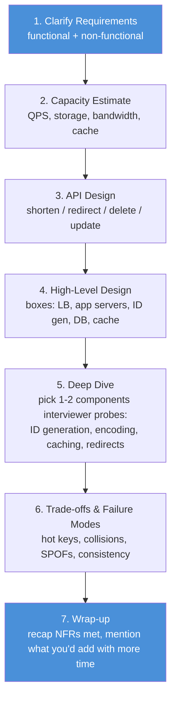

**Why this order matters**: capacity estimates (step 2) *determine* your design decisions in step 4-5 — e.g., a 100:1 read:write ratio is what justifies "cache aggressively, don't over-engineer writes." Skipping straight to "I'll use Snowflake IDs" without earning it via requirements/estimation reads as memorized-answer, not reasoning.

---

## 3. Requirements Clarification

### Functional requirements
| # | Requirement | Notes |
|---|---|---|
| 1 | **Shorten**: given a long URL, return a unique short URL | Core write path |
| 2 | **Redirect**: given a short URL, redirect to the original | Core read path (HTTP 3xx) |
| 3 | **Custom alias**: user can pick their own short key | Needs uniqueness check against same keyspace |
| 4 | **Delete**: owner can delete a short link | Needs auth/ownership |
| 5 | **Update**: owner can change the target long URL | Same key, new value |
| 6 | **Expiry**: default TTL (e.g. 5 years), user can override | Enables key reclamation |

### Non-functional requirements
| Requirement | Why it matters here |
|---|---|
| **Availability** | Every dead redirect is a broken link somewhere on the internet — prioritize availability over strict consistency (AP over CP) |
| **Scalability** | Must scale horizontally as shortening/redirection volume grows |
| **Low latency** | Redirect must feel instant — it's on the critical path of someone else's product |
| **Readability** | Keys must be typeable, shareable, unambiguous (no visual lookalikes) |
| **Unpredictability** | Keys must not be sequentially guessable (enumeration = scraping private links / abuse) |

### How to identify this topic in an interview
Trigger phrases: *"design a link shortener," "design bit.ly/TinyURL," "design a pastebin/link-in-bio service"* — anything that reduces to **short unique key → stored value, overwhelmingly read-heavy**. Same skeleton reused for: **paste services, coupon-code generators, unique-ID/idempotency-key services, QR-code redirect services**.

### Section cheat-sheet
- Read:write ratio is the single most important number you'll extract — it justifies caching, NoSQL, replica topology.
- Say "AP over CP" once and mean it — a stale redirect (rare) is fine, an unavailable redirect is not.
- Always ask: do custom aliases exist? Do links expire? Is analytics required? These change the design materially.
- Unpredictability is a *security* NFR, not a readability one — don't conflate them.
- State assumptions out loud (DAU, growth rate, ratio) before estimating — interviewers grade the process, not the final number.

---

## 4. Capacity Estimation (worked example)

**Assumptions** (state these explicitly — they're the interview's actual test):
- 200M new URL shortenings / month
- Shorten : Redirect ratio = **1 : 100**
- 100M DAU
- Each stored record ≈ 500 bytes
- Default expiry: 5 years

### Formula chain

```text
1. WRITE QPS
   200M / month ÷ 2,628,288 sec/month (30.42 days avg)  =  ~76 writes/sec

2. READ QPS (redirects)
   76 writes/sec × 100 (ratio)                           =  ~7,600 reads/sec  (7.6K QPS)

3. STORAGE GROWTH OVER N YEARS
   200M/month × 12 months/year × 5 years                 =  12 Billion records
   12B × 500 bytes                                        =  ~6 TB total (5-yr horizon)
   → per year: 12B/5 = 2.4B records/year ≈ 1.2 TB/year    (use this to plan shard growth)

4. BANDWIDTH
   Ingress (shortens): 76/s × 500B × 8 bits               =  ~304 Kbps
   Egress  (redirects): 7,600/s × 500B × 8 bits            =  ~30.4 Mbps

5. CACHE SIZE (80/20 rule: 20% of keys drive 80% of reads)
   Redirects/day = 7,600/s × 86,400s                      =  ~0.66 Billion/day
   Cache only the hot 20%: 0.2 × 0.66B × 500B              =  ~66 GB  → fits in RAM on a handful of nodes

6. APPLICATION SERVERS (rule of thumb: DAU / 8000 per server)
   100M DAU / 8,000                                       =  ~12,500 servers   (before LB/autoscaling nuance)

7. SHARD COUNT (example: 100 GB/shard capacity target)
   6 TB total ÷ 100 GB/shard                              =  ~60 shards (grows ~12 shards/year at 1.2TB/yr)
```

### Summary table

| Metric | Value |
|---|---|
| New URLs | 76 / sec |
| Redirects | 7.6 K / sec |
| Ingress bandwidth | 304 Kbps |
| Egress bandwidth | 30.4 Mbps |
| Storage (5 yrs) | 6 TB (~1.2 TB/yr) |
| Cache size (hot 20%) | 66 GB |
| App servers | ~12,500 |
| Shards (@100GB each) | ~60 |

### The formula chain is a machine, not a memorized answer — rerun it live if the interviewer changes an input

This is the actual skill being graded: can you replug new numbers into the same six formulas without re-deriving them from scratch? Try it — interviewer says *"actually assume 500M shortens/month, ratio grows to 200:1, and DAU hits 300M":*

```text
1. WRITE QPS        500M / 2,628,288                        ≈ 190 writes/sec
2. READ QPS         190 × 200                                ≈ 38,000 reads/sec (38K QPS)
3. STORAGE (5 yr)   500M × 12 × 5 = 30B records × 500B       ≈ 15 TB total (3 TB/yr)
4. EGRESS BW        38,000/s × 500B × 8 bits                 ≈ 152 Mbps
5. CACHE (hot 20%)  38,000/s × 86,400s = 3.28B reads/day
                    0.2 × 3.28B × 500B                        ≈ 328 GB (needs a small Redis/Memcached cluster, not one box)
6. SHARDS (@100GB)  15 TB ÷ 100 GB                            ≈ 150 shards
```

Notice what changed and what didn't: the *formulas* are identical, only the inputs moved. That's the whole point of doing capacity estimation as a labeled chain instead of a single scribbled number — it's redoable under pressure. This is also your cue in the interview: if the interviewer says "what if it 10x'd," don't panic — just replug.

### Section cheat-sheet
- Always convert "per month" to "per second" via **2,628,288 sec/month** (30.42-day average) — memorize this constant.
- 100:1 read:write ratio is the number that justifies *everything downstream*: cache, replicas, NoSQL choice.
- 80/20 rule turns "cache everything" into "cache 20%, cover 80% of traffic" — use it to size RAM, not disk.
- Bandwidth numbers are almost always tiny for this system (Kbps/Mbps) — say so; don't over-provision network.
- Round aggressively (76 → "~100 writes/sec") — precision theater wastes interview time.
- **Mnemonic — "W.R.S.B.C.S."**: **W**rite QPS → **R**ead QPS → **S**torage → **B**andwidth → **C**ache → **S**hards. Six dominoes, each one feeds the next; never skip a domino even under time pressure.

---

## 5. Architecture Evolution: From a Single Box to a Distributed System

Interviewers remember candidates who show *why* each piece of complexity got added — not candidates who draw the final 9-box diagram from memory on minute one. Walk through the naive version first, break it on purpose, then fix exactly the thing that broke. Four stages, each one line of "what broke."

### 5.1 v1 — The whiteboard-napkin version (single server, in-memory map)

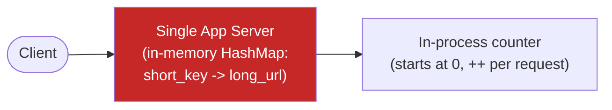

Works fine in a live-coding sandbox. **What breaks in production**: the map lives in RAM on one box — a restart erases every link ever created, there's no durability, no horizontal scale, and the counter produces sequential IDs (`1, 2, 3…`) that anyone can enumerate to scrape every private link on the service.

### 5.2 v2 — Add durability, encoding, and a cache (still single-writer)

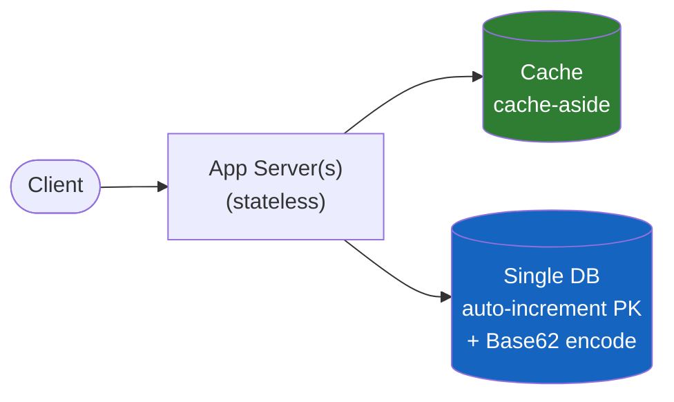

Links now survive a restart, and Base62-encoding the numeric PK gives typeable 6-7 char keys instead of raw integers (§10). A cache-aside layer absorbs the read-heavy 100:1 traffic (§4) so most redirects never touch the DB. **What breaks next**: every write still funnels through **one DB's auto-increment column** — it's still a single point of contention and failure, IDs are still sequential/predictable (the encoding hides it a little, but `encode(n)` and `encode(n+1)` are trivially related), and one DB node can't hold 6 TB+ or serve 7.6K+ reads/sec alone once traffic grows past a single box's ceiling.

### 5.3 v3 — Distribute ID generation, shard and replicate the DB

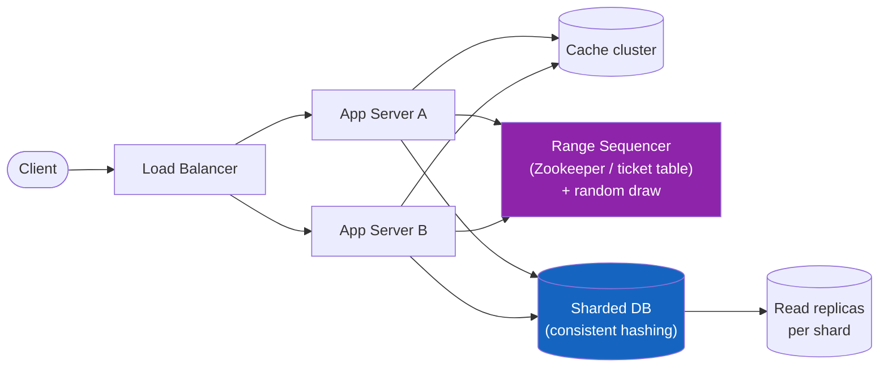

Now any app server can mint IDs without contending with every other server — each grabs its own block/range from the sequencer (§9) and randomizes within it to kill predictability. The DB is sharded (consistent hashing, §15) so no single node has to hold the whole dataset, and read replicas absorb the 100:1 read skew. **What breaks next**: this now handles steady-state load, but a single viral link can still overwhelm one shard/cache-node's capacity, and every click is still computing analytics inline on the redirect's critical path — slowing down the one call that must be fast.

### 5.4 v4 — Final production shape: CDN + async analytics off the hot path

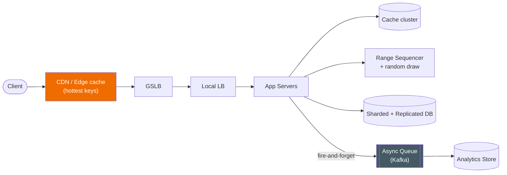

This is the diagram in §6 — the CDN edge layer catches viral spikes before they ever reach an origin server (§12.4), and click analytics is pushed onto an async queue so the redirect response returns the instant the cache/DB lookup completes, never blocked by a side-effect (§13).

### Section cheat-sheet
- **Narrate the breakage, not just the box** — "v1's counter is a SPOF *and* predictable, so v2 adds a DB; v2's single DB can't take the write/storage volume, so v3 shards and distributes ID generation" is the sentence that turns a diagram into a story.
- Four stages is the sweet spot: fewer looks unearned, more wastes interview time — v1 naive, v2 durable+encoded+cached, v3 distributed+sharded, v4 CDN+async-analytics.
- Each stage should fix **exactly one class of problem** introduced by the previous stage — resist the urge to add everything at once, that's what makes the evolution legible.
- **Mnemonic — "Nobody Designs Systems Cold"**: **N**aive (single box) → **D**urable (DB+cache+encoding) → **S**caled (distributed IDs + shards) → **C**omplete (CDN + async analytics). First letters spell the drilling order.
- If asked "why not just start at v4," the honest answer is: you *can* skip straight there in a real system, but walking the evolution in an interview proves you understand *why* each piece exists, not just that it should.

---

## 6. High-Level Design

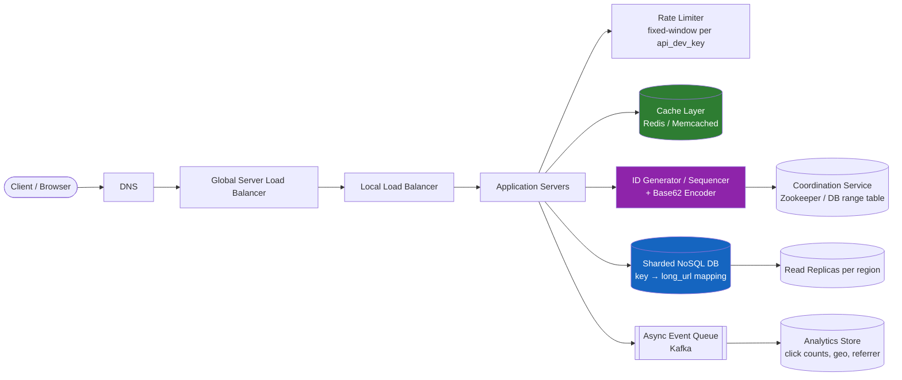

**Component roles** (one line each):
- **GSLB**: routes users to the nearest healthy data center (redirects are latency-sensitive and globally distributed).
- **Local LB**: distributes within a DC across app server fleet.
- **App servers**: stateless; validate requests, orchestrate cache → DB lookups, call the ID generator on writes.
- **Rate limiter**: fixed-window counter keyed by `api_dev_key`, protects against abuse/enumeration.
- **ID generator**: produces a globally-unique numeric ID (candidates discussed in §9), then base62/58-encodes it.
- **Cache**: Redis/Memcached, DC-local, serves the hot 20% of redirects to avoid DB round trips.
- **DB**: sharded NoSQL, replicated per-region, stores `{short_key, long_url, owner, expiry, created_at}`.
- **Async queue + analytics store**: click events pushed off the hot redirect path so analytics never adds redirect latency.

### Section cheat-sheet
- Draw client → LB → app → (cache, DB, ID-gen) → replicas as your default skeleton; customize per problem.
- Put the ID generator as its **own box** — interviewers want to see you didn't just say "auto-increment column."
- Cache sits *beside* the DB in the diagram, not "in front of everything" — app servers decide cache-vs-DB.
- Async analytics queue signals you understand "don't block the hot path for side-effects" — a repeatable pattern (also used in payments, notifications).
- Mention GSLB explicitly — it's a one-word way to show you know redirects are latency- and geo-sensitive.

---

## 7. API Design

```text
shortenURL(api_dev_key, original_url, custom_alias=None, expiry_date=None) -> short_url | error
redirectURL(api_dev_key, url_key)                                          -> 3xx to long_url | 404
deleteURL(api_dev_key, url_key)                                            -> "URL Removed" | error
updateURL(api_dev_key, url_key, new_long_url)                              -> success | error
getURLAnalytics(api_dev_key, url_key, date_range=None)                     -> {click_count, top_referrers, geo_breakdown, device_breakdown} | error
```

| Param | Purpose |
|---|---|
| `api_dev_key` | Identifies caller for rate-limiting/quota/auth — never trust client-supplied identity otherwise |
| `original_url` | The long URL to shorten |
| `custom_alias` | Optional user-chosen key — must be checked for collision before commit |
| `expiry_date` | Optional override of the default TTL |
| `url_key` | The short key (path segment) used for lookup |
| `date_range` | Optional window filter for analytics queries — defaults to "all time" |

### Section cheat-sheet
- Every mutating call carries `api_dev_key` — this is your rate-limiting and abuse-tracking hook, call it out early.
- `custom_alias` is optional on the *same* endpoint as auto-generated shortening — don't design a separate API, just branch internally.
- Delete/update require ownership checks — flag this as an auth dependency you're assuming exists (don't design full auth unless asked).
- Redirect is a GET returning an HTTP redirect status, not a JSON payload — worth saying explicitly, it trips people up.
- Idempotency: shortening the *same* long URL twice can validly produce two different short keys (unless you dedupe, which is a trade-off worth mentioning — see §17).
- `getURLAnalytics` reads from the **analytics store**, never the hot redirect path's cache/DB (§13) — mentioning this distinction unprompted shows you separate the read-heavy redirect path from the reporting path.

---

## 8. Data Model / Schema

Two tables carry the entire system; a third is optional and lives in a completely separate store.

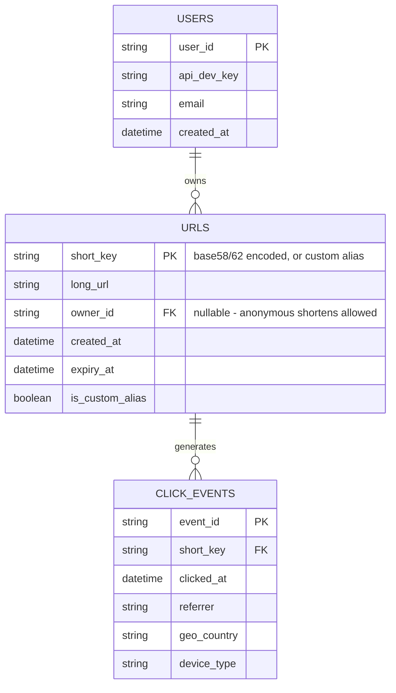

| Table | Storage | Key indexes | Notes |
|---|---|---|---|
| `URLS` | Sharded NoSQL (§15) | **Unique index on `short_key`** (the source of truth for collision detection, §11); secondary index on `owner_id` for "list my links" | This is the table on the hot redirect path — keep it narrow (§4's 500-byte/record assumption is basically this row) |
| `USERS` | Small relational or KV table, rarely sharded | PK on `user_id`, lookup on `api_dev_key` | Tiny compared to `URLS` — not a capacity-estimation concern |
| `CLICK_EVENTS` | Append-only, high-volume, separate analytics store (columnar/OLAP) | Partitioned by `short_key` + time bucket | Never joined synchronously with `URLS` — populated asynchronously off the queue (§13), read only by `getURLAnalytics` |

### Section cheat-sheet
- **`short_key` is the one column every other design decision revolves around** — its uniqueness constraint (§11), its length (§10.4), its cache key (§12.1) are all the same string.
- Keep `URLS` schema-thin — every extra byte multiplies by the 12B-record estimate (§4). Don't add speculative columns "just in case."
- `owner_id` is nullable — anonymous shortening is a legitimate flow (no login wall on a link shortener), but `deleteURL`/`updateURL` require it to be non-null and matching the caller.
- `CLICK_EVENTS` deliberately lives in a **different storage system** than `URLS` — different access pattern (append-heavy, time-range queries) and different scale profile than "look up one row by key."
- Drawing the ER diagram unprompted (most candidates skip this and describe fields verbally) is a small, cheap way to look organized under time pressure.

---

## 9. Deep Dive: ID Generation Strategies

This is the component interviewers drill into hardest. There are four real approaches — know all four, their failure modes, and when each is the "right" answer.

### 9.1 The four approaches

**Counter-based (single source of truth)**
A single DB auto-increment column or a single in-memory counter hands out `1, 2, 3, …`. Simple, guarantees uniqueness and monotonicity.
- ❌ Single point of failure and a write bottleneck at scale.
- ❌ Sequential IDs are *predictable* — violates the unpredictability NFR (someone can enumerate `id+1` and scrape every link ever created).

**Hash-based (MD5/SHA-256 truncation)**
Hash `long_url (+ salt/timestamp)`, take the first 6-8 characters of the hex/base62 digest as the key.
- ✅ No coordination needed — any server computes it independently.
- ❌ **Collisions**: two different URLs can truncate to the same prefix. Must detect (DB lookup) and resolve — append a counter suffix, re-salt and re-hash, or extend the truncation length until a free slot is found.
- ❌ Same URL always maps to the same hash unless salted — that's a dedup *feature* if wanted, a predictability *bug* if not.

**Range-based / ticket servers (Zookeeper or a range-allocation DB table)**
A coordination service (Zookeeper, or a simple DB row with atomic "give me the next 1000 IDs" semantics) hands each app server a **block/range** of IDs (e.g., server A gets `[1M, 2M)`, server B gets `[2M, 3M)`). Each server then assigns from its local range in memory, no coordination needed per-request.
- ✅ No per-request contention; coordination cost amortized over a whole block.
- ✅ This is Flickr's classic "ticket server" pattern in production (two MySQL ticket servers, one incrementing by 2 on evens, the other on odds, for redundancy).
- ❌ If a server crashes mid-range, the unused remainder of its block is **wasted** (acceptable — the keyspace is enormous, see §10.4).
- ❌ Still need to *randomize* assignment within/across ranges to avoid predictability (don't hand them out in visible sequential order to end users).

**Distributed ID generation (Twitter Snowflake style)**
No central coordinator at request time. Each ID is built from independent, locally-known pieces packed into 64 bits:

```
| 1 bit unused | 41 bits timestamp (ms) | 10 bits machine/worker ID | 12 bits sequence number |
```
- ✅ Fully decentralized, roughly time-sortable, no shared state, scales linearly with machines.
- ✅ Real-world proven at massive scale (Twitter, and variants at Instagram/Discord).
- ❌ Requires clock sync (NTP) — clock skew/rollback can produce duplicate or out-of-order IDs; needs a "wait it out" or "refuse to generate" guard.
- ❌ Machine ID assignment itself needs *some* coordination (via Zookeeper or config) at startup, just not per-request.

### 9.2 Decision flowchart

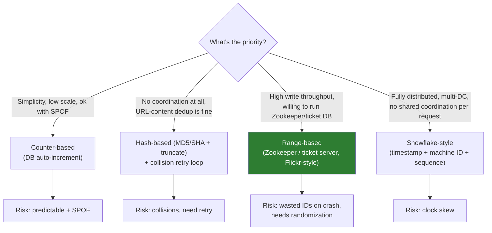

**This chapter's design** uses **range-based** (a sequencer building block that hands out 64-bit numeric IDs in ranges) **+ random selection within the available pool** to defeat predictability — effectively range-based with a Snowflake-flavored unpredictability patch.

### 9.3 Disambiguation: Counter-based vs Hash-based ID generation

| | Counter-based | Hash-based |
|---|---|---|
| Uniqueness guarantee | Structural (monotonic counter) | Probabilistic (collision possible, must check) |
| Coordination needed | Yes (single writer or ranges) | No (stateless computation) |
| Predictability | High (sequential) — bad for security | Low, unless URL-derived and un-salted |
| Collision handling | None needed | Required: retry/re-salt/extend length |
| Dedup of identical URLs | No (new ID every time) | Natural (same input → same hash) unless salted |
| Best fit | Controlled internal systems, low write volume | Stateless multi-region writers, content-addressable keys |

### 9.4 Race condition: two app servers requesting a range at the same instant

Range-based generation moves contention from "every write" to "once per block" — but the block hand-out itself is still a shared resource two servers can hit simultaneously at startup or when a block runs out. The sequencer must resolve this atomically, not with a check-then-act read/write.

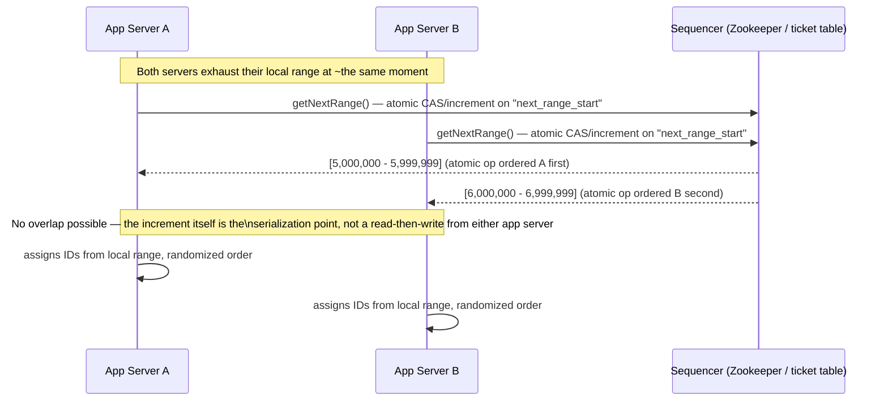

**The lesson is identical to the custom-alias race (§11): never let two callers "check, then act" against shared state — make the shared resource's own atomic primitive (Zookeeper's atomic counter node, or a DB `UPDATE ... RETURNING` / `FETCH_ADD`) the sole arbiter.** If server A crashes after receiving `[5.0M, 6.0M)` but before using more than a few IDs, that range's remainder is simply lost — acceptable, given the keyspace math in §10.4.

### 9.5 Retry/failure path: hash-based collision resolution

If you pick hash-based generation, you must show the retry loop — this is the single most common thing candidates forget to mention:

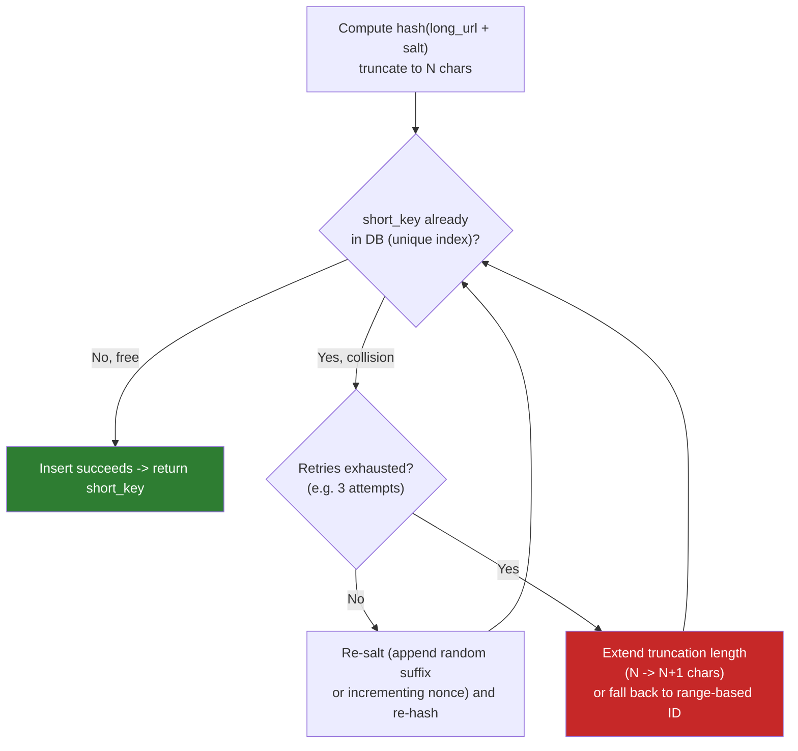

This is the same "bounded retry, then escalate" shape you'd use for any optimistic-write collision (also shows up in username registration, idempotency-key generation) — naming the pattern by its general shape, not just this one use, signals reusable judgment.

### Section cheat-sheet
- Name all four strategies even if you only deep-dive one — breadth signals you're not reciting a single memorized answer.
- Always pair "hash-based" with "and here's my collision-resolution loop" — mentioning hashing without collision handling is an instant red flag to interviewers.
- Range-based (ticket server) is the industry-proven middle ground — cite Flickr by name, it's a well-known real example.
- Snowflake is the answer when asked "what if we have thousands of writers across multiple data centers with zero coordination" — know the 41/10/12 bit layout.
- Whatever strategy you pick, explicitly patch in **unpredictability** (random draw from the available range, or a salt) — the source design calls this out as a deliberate final step, don't skip it.
- **Atomic-op-as-arbiter is the recurring fix for every race in this system** — custom alias (§11 unique index), range allocation (§9.4 atomic increment), both replace "check then act" with "let the shared resource's own atomicity decide."

---

## 10. Deep Dive: Encoding (Base62 / Base58 vs Base64 vs UUID)

### 10.1 Why encode at all
The ID generator produces a *numeric* ID (base-10). We need a short, URL-safe, human-typeable *string*. Encoding to a higher base packs more information per character — fewer characters for the same numeric range.

### 10.2 Why not plain Base64
Base64 uses `A-Z a-z 0-9 + /` (64 symbols). Two problems:
- `+` and `/` are **not URL-safe** without percent-encoding (they collide with query-string/path syntax).
- Visually ambiguous characters cause typos when humans read/type/dictate the link: `0` vs `O`, `1` vs `I` vs `l`.

**Base58** (Bitcoin-style alphabet) fixes both: drop `0 O I l` and `+ /`, leaving 58 symbols, all URL-safe and visually distinct. **Base62** is the other common industry choice: keep all of `A-Z a-z 0-9` (62 symbols, URL-safe) but *accept* the lookalike risk — simpler alphabet, marginally denser encoding, still no need for percent-encoding.

### 10.3 Encode/decode (pseudocode, base-N generic — works for 58 or 62)

```python
ALPHABET = "123456789ABCDEFGHJKLMNPQRSTUVWXYZabcdefghijkmnopqrstuvwxyz"  # base58, 58 chars
BASE = len(ALPHABET)

def encode(num: int) -> str:
    if num == 0:
        return ALPHABET[0]
    chars = []
    while num > 0:
        num, rem = divmod(num, BASE)
        chars.append(ALPHABET[rem])
    return "".join(reversed(chars))   # most-recent remainder goes leftmost

def decode(short_key: str) -> int:
    num = 0
    for ch in short_key:
        num = num * BASE + ALPHABET.index(ch)
    return num
```

Worked example from the source material: ID `2468135791013` → repeated `% 58` gives remainders `[1,6,48,20,41,4,6,17]` (most-recent-first) → mapped through the alphabet → `27qMi57J`. Decoding reverses it: `sum(char_value × 58^position)` = `2468135791013`. ✅ matches.

**Second worked example — a small Base62 number you can trace by hand.** Alphabet `"0123456789ABCDEFGHIJKLMNOPQRSTUVWXYZabcdefghijklmnopqrstuvwxyz"` (index 0 = `'0'`, index 10 = `'A'`, index 13 = `'D'`, …). Encode `12345`:

```text
Step 1:  12345 ÷ 62 = 199 remainder 7    -> alphabet[7]  = '7'
Step 2:    199 ÷ 62 =   3 remainder 13   -> alphabet[13] = 'D'
Step 3:      3 ÷ 62 =   0 remainder 3    -> alphabet[3]  = '3'
Remainders collected in order computed: [7, 13, 3] -> reverse -> [3, 13, 7] -> "3D7"
```

So `encode(12345) = "3D7"`. Decode it back with `num = num × 62 + alphabet.index(ch)`:

```text
'3' -> num = 0×62 + 3   = 3
'D' -> num = 3×62 + 13  = 186 + 13 = 199
'7' -> num = 199×62 + 7 = 12338 + 7 = 12345   ✅ matches the original
```

Three characters encoded a number up to 62³ − 1 = 238,327 — this is exactly why the key-space math below scales so fast per extra character.

### 10.4 Key-space math

```text
Base62^6  = 62^6  ≈ 56.8 Billion combinations
Base62^7  = 62^7  ≈ 3.5 Trillion combinations
Base58^6  = 58^6  ≈ 38.1 Billion combinations
Base58^7  = 58^7  ≈ 2.2 Trillion combinations
```

Against our 12B-record / 5-year estimate (§4), **6-character base62 (56.8B) already covers the workload with 4-5x headroom**; 7 characters gives multi-decade runway even at 10x growth. This is why 6-7 char short codes are the industry norm (bit.ly, TinyURL-style services).

**From the source design specifically**: a 64-bit numeric ID, when base-58 encoded, needs at most **11 characters** (`64 / log2(58) ≈ 64/5.85 ≈ 11`), and the sequencer is seeded to start at 10 digits (1 Billion) to *guarantee* a minimum of 6 output characters. Sequencer lifetime at 2.4B IDs/year: **`(2^64 - 10^9) / 2.4B ≈ 7.68 billion years`** — i.e., the keyspace is never the bottleneck, generation *rate* and *coordination* are.

### 10.5 Disambiguation: Base62 vs Base58 vs UUID

| | Base62 | Base58 | UUID (v4) |
|---|---|---|---|
| Alphabet size | 62 | 58 (drops `0 O I l + /`) | N/A — 128-bit random |
| Typical output length | 6-7 chars | 6-7 chars | 36 chars (with dashes) |
| Visual ambiguity | Possible (`0`/`O`, `1`/`l`) | Eliminated by design | N/A, never shown to humans |
| Needs a numeric ID source first? | Yes (encodes an int) | Yes (encodes an int) | No — self-generating, no coordinator |
| Coordination to avoid collision | Depends on ID source | Depends on ID source | None (128-bit space, collision astronomically unlikely) |
| Best fit | General-purpose short links | Human-facing links (support tickets, printed/verbal links) | Internal-only identifiers (DB PKs, idempotency keys) — never a "tiny" URL |

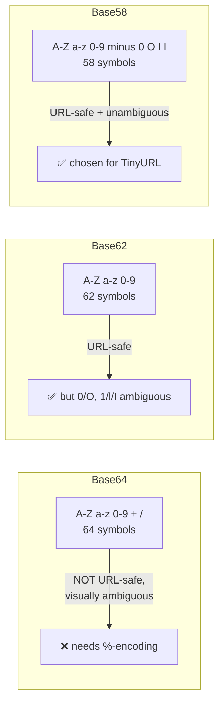

### Section cheat-sheet
- Base58 vs Base62 is a **readability vs density** trade-off, not a correctness one — either works, pick one and justify with "no lookalikes" (58) or "simpler alphabet" (62).
- UUIDs solve *uniqueness without coordination* but fail the "tiny" requirement outright — good answer to "why not just use a UUID," bad answer if you don't also mention the length problem.
- Always connect keyspace math back to your capacity estimate from §4 — "6 chars gives us 56B slots, we need 12B, we're fine" is the sentence that shows real reasoning.
- Memorize the identity: **bits per digit = log2(base)** → digits needed = total_bits / bits_per_digit. This single formula answers "why 6-7 characters" for any base.
- Encoding is *deterministic and reversible* — it is not where collisions come from (that's the ID generator's job, §9); don't conflate "hash collision" with "encoding collision," they're different failure modes.

---

## 11. Deep Dive: Custom Alias Handling (and the race condition)

Custom aliases add a **check-then-act** race: two users can request the same alias concurrently, both pass the "is it available?" check, and both try to insert.

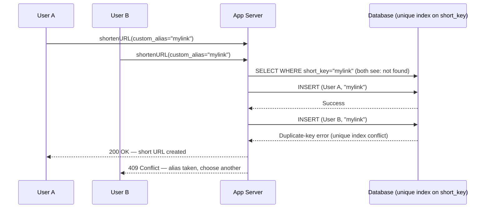

**The fix is not "check more carefully" — it's letting the DB be the source of truth.** Put a **unique index/constraint on `short_key`**, do the availability check for a fast user-facing "probably free" response, but let the **insert's uniqueness constraint be the real arbiter** (this is exactly why the source design calls out MongoDB's duplicate-key error as a *feature*, not an edge case to work around).

### Section cheat-sheet
- Custom alias = check-then-act = classic TOCTOU race — always draw or describe this explicitly, interviewers listen for it.
- Resolve with a **DB-level unique constraint**, not application-level locking — locking doesn't scale across sharded/replicated writes.
- Cap custom alias length (source design: 11 chars max, matching the encoder's own output ceiling) so custom and generated keys share one keyspace/lookup path.
- On conflict, return a clear 409-style error — don't silently auto-suffix the alias, that surprises users who explicitly chose a name.
- Reserve a small blocklist (slurs, brand names, `admin`, `api`, etc.) — worth a one-line mention, shows product awareness.

---

## 12. Deep Dive: Caching & the Redirect Path

### 12.1 Cache-aside pattern

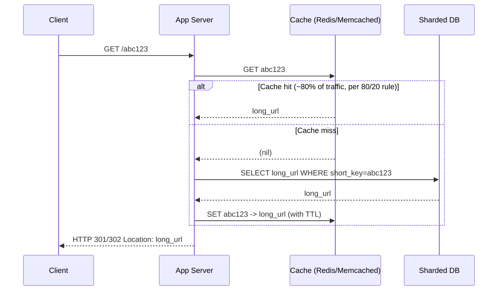

### 12.2 Cache hit/miss split (80/20 rule applied)

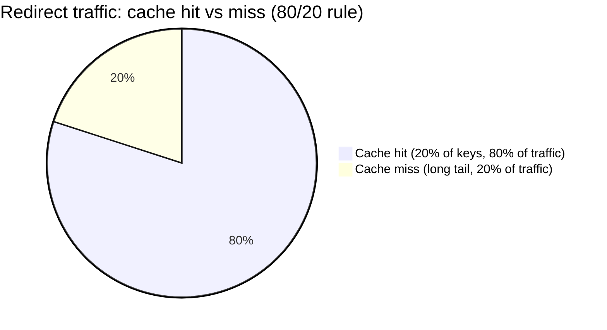

This is *why* 66 GB of cache (§4) can absorb 80% of 7.6K QPS — you don't cache 6 TB, you cache the hot slice.

### 12.3 301 vs 302 — the trade-off interviewers love to probe

| | 301 (Moved Permanently) | 302 (Found / Temporary) |
|---|---|---|
| Browser caching | **Caches the redirect** — repeat visits skip your server entirely | Not cached — **every** click hits your server |
| Server load | Lower (browser bypasses you after first hit) | Higher (guaranteed hit every time) |
| Click analytics | **Broken/undercounted** — cached hits never reach you | **Accurate** — you see every single click |
| SEO link-equity | Passes full "authority" to target (matters for public marketing links) | Signals "temporary," less SEO weight passed |
| Editability | Risky to repoint later (some browsers cache indefinitely) | Safe to repoint — nothing is cached |
| Typical real-world choice | TinyURL-style "just redirect" services, performance-first | Analytics-driven shorteners (bit.ly-style) that sell click data as a product |

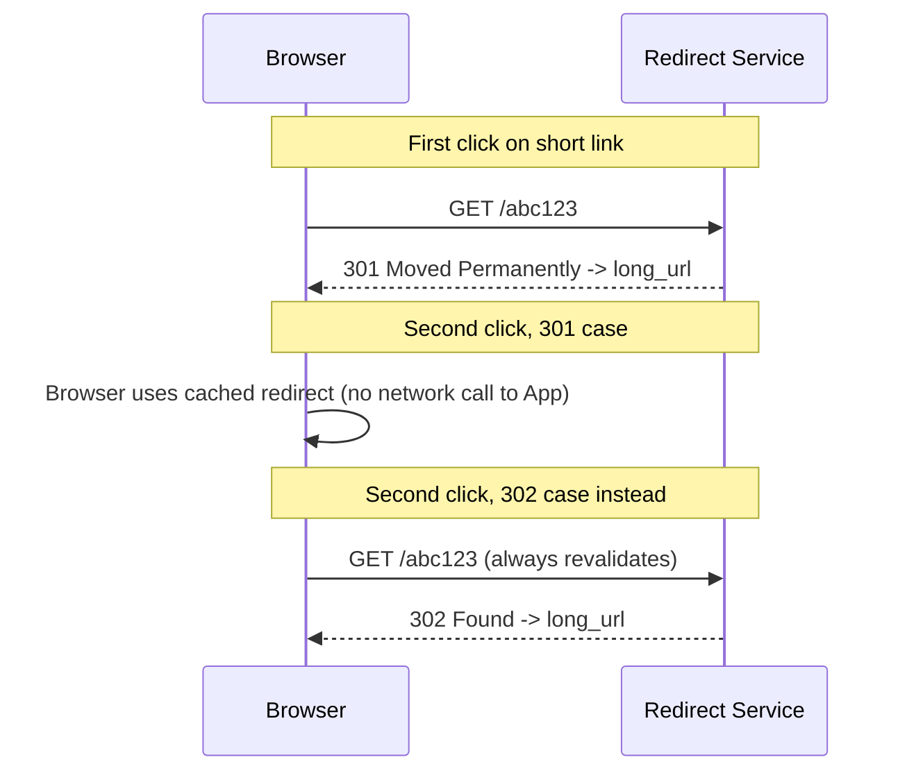

**Takeaway to say out loud**: "If click analytics matters, use 302 despite the extra server load — that's the whole point of the redirect. If it's a pure link-shortening utility with no analytics ambitions, 301 saves you traffic." This single trade-off is a favorite interview probe because it has no universally "correct" answer — pick one, justify it against the stated requirements.

### 12.4 CDN layer for viral hot keys
A single link can go viral (shared by a celebrity account) and spike far past what one cache node/shard can serve. Put a **CDN edge cache** (or edge-compute redirect function) in front for the *hottest of the hot* keys — this decouples "redirect serving" from your origin entirely for the extreme tail, the same pattern used for static asset delivery.

### Section cheat-sheet
- Cache-aside (lazy load + TTL) is the default pattern here — reads populate cache on miss, no separate cache-warming pipeline needed for a system this simple.
- Redis vs Memcached: source design picks Memcached for "simple, horizontally scalable, minimal data-structure needs" — Redis is the answer once you need TTL-with-eviction-policy nuance, persistence, or richer structures (e.g., sorted sets for click leaderboards).
- 301 vs 302 is a **requirements-driven** trade-off, not a "correct answer" trade-off — always tie your pick back to whether analytics was a stated requirement.
- Mention **cache stampede** protection (jittered TTLs, request coalescing/locking on miss) if pushed on "what happens when a hot key's cache entry expires."
- CDN/edge-caching answers the "what if one link goes viral" bottleneck question — a strong, cheap addition to mention proactively.

---

## 13. Deep Dive: Analytics (click tracking)

Requirement rarely stated explicitly, but almost always asked as a follow-up: *"marketing wants to know how many times a link was clicked, from where."*

**Design principle: never block the redirect on analytics.** The redirect response goes out immediately; a click event (`short_key, timestamp, referrer, geo, user-agent`) is pushed onto an **async queue (Kafka/SQS)** and consumed by a separate pipeline into an analytics store (columnar/OLAP — e.g., a time-series or data-warehouse table), completely decoupled from the redirect's latency budget.

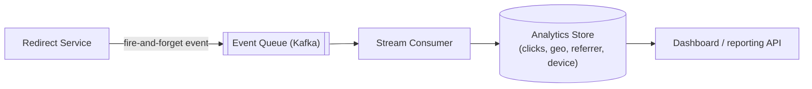

### Section cheat-sheet
- Analytics is a **side-effect**, never a blocking dependency of the redirect — say this explicitly, it's a recurring pattern (same as order-confirmation emails, notification fan-out).
- Async queue absorbs bursty click traffic without back-pressuring the redirect path.
- If asked to size it: click events are much smaller and higher-volume than URL records — expect a *separate* storage/scaling conversation, don't conflate it with the main DB's 6 TB estimate.
- A 302-vs-301 choice (§12.3) directly gates analytics accuracy — connect these two sections if asked about either.
- Real-time dashboards are a "nice to have, would need a streaming aggregation layer (e.g., windowed counts)" — flag as an extension, don't over-build it live.

---

## 14. URL Lifecycle & Expiration

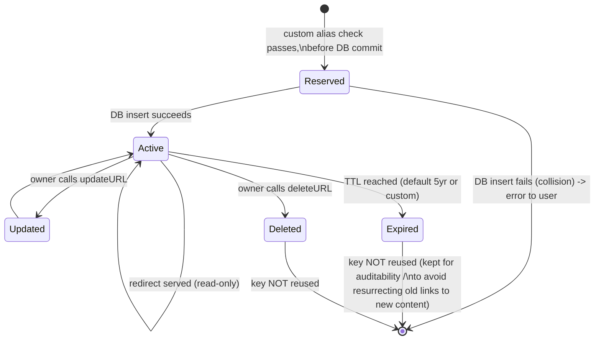

**Why expired/deleted keys are never reused** (a common interview quiz-point from this exact chapter): reusing a key means an old, possibly still-shared/bookmarked/indexed short link could suddenly point to unrelated new content — a correctness and trust violation, not just a technical inconvenience. The keyspace (§10.4) is so large this cost is essentially free to avoid.

### 14.1 Lazy vs. active expiry — you need both, not one

| | Lazy expiry | Active expiry |
|---|---|---|
| **When it runs** | At read time — check `expiry_at < now()` on the cache/DB hit before returning the redirect | On a schedule — a background reaper job scans for `expiry_at < now()` and tombstones rows |
| **Cost model** | Zero cost until someone actually clicks an expired link — most expired links are never clicked again, so most expiry checks never happen | Ongoing background cost (a scan/query) regardless of whether anyone would ever hit the expired key |
| **Storage impact** | None by itself — a dead row sits in the DB/cache forever if nobody reads it | Reclaims storage and index space proactively — matters once you're at the multi-TB scale from §4 |
| **Failure mode if skipped** | An expired link keeps "working" (serving a stale redirect) until someone clicks it | Storage grows unbounded — dead rows never get cleaned, DB/cache slowly fills with garbage |

**Use both, cheaply**: lazy-check on every read (it's one extra field comparison, effectively free) so a clicked-but-expired link never serves a stale redirect — return a "this link has expired" page (410 Gone) instead. Layer active expiry as a low-priority background sweep (nightly batch, low QPS) purely to reclaim storage/index space; it never needs to be real-time because the lazy check already guards correctness. This is the same pattern as session-token expiry or soft-deleted rows in any CRUD system — lazy check for correctness, active sweep for housekeeping.

### Section cheat-sheet
- Model expiry/deletion as **soft-delete / tombstone**, not row removal — you still need to return a clear "this link has expired" page instead of a generic 404 (410 Gone is the more precise status code — the resource *used to* exist).
- Never recycle a retired key — cite the trust/correctness reason, not just "we have enough keyspace" (both matter, but trust is the stronger argument).
- A background reaper job (scan for `expiry_date < now`) does async cleanup — doesn't need to be synchronous or urgent given the AP-leaning availability stance.
- "Deleted" and "Expired" can share one tombstone mechanism — don't design two separate systems for what's the same terminal state.
- **Mnemonic — "check when clicked, sweep when idle"**: lazy expiry protects correctness on the read path for free; active expiry is separately-scheduled janitorial work that protects storage, not correctness.
- State machine framing is a fast way to answer "what happens to a link over its life" cleanly under interview time pressure.

---

## 15. Deep Dive: Sharding Strategy

The DB from §6/§8 doesn't fit on one node once you cross a few hundred GB (§4 estimated 6 TB at 5 years) — you need a shard key and a rule for which shard a given key lives on.

### 15.1 Choosing the shard key

| Candidate shard key | Problem |
|---|---|
| `short_key` alphabetically (range partitioning: A-F on shard 1, G-M on shard 2, …) | **Hotspotting** — Base62/58 output isn't uniform in practice once real traffic patterns emerge (viral links cluster), and sequential-ish generation schemes can bunch new writes onto one shard |
| `owner_id` | A single power-user account (a marketing team posting thousands of campaign links) creates a hot shard; also doesn't help the redirect path, which only ever has `short_key`, never `owner_id` |
| **`hash(short_key)` via consistent hashing** ✅ | Spreads both storage *and* read traffic near-uniformly across shards regardless of key content; this is the standard answer |

### 15.2 Consistent hashing, one paragraph

Hash each shard onto points on a ring (typically with virtual nodes per physical shard, to smooth out load further); hash each `short_key` onto the same ring; the key belongs to the first shard clockwise from its position. Adding or removing a shard only reshuffles the keys between that shard and its immediate neighbors on the ring — not the whole dataset — which is exactly what makes resharding survivable at 60+ shards (§4) without a full data migration.

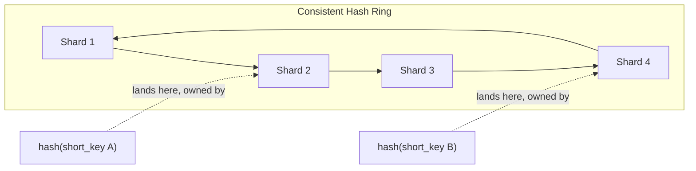

### 15.3 SQL vs NoSQL for this workload — the actual reasoning, not just the label

| | SQL (RDBMS) | NoSQL (wide-column / document) |
|---|---|---|
| Relationships needed | None — `URLS` has no joins on the hot path | Matches naturally — one row per key |
| Horizontal scaling | Requires manual sharding middleware or a NewSQL layer | Native partitioning built into the engine (Mongo, Cassandra, DynamoDB) |
| Schema flexibility | Rigid — a migration for every new column | Flexible — adding `is_custom_alias` or a new analytics field later doesn't need a locking `ALTER TABLE` across 12B rows |
| Consistency model | Strong by default | Tunable — pick eventual for redirects (AP, §3), strong for the rare "just wrote it, immediately reading it back" case |
| Verdict for this system | Workable, but fighting the grain | Better default fit — no relational structure to lose, and partitioning is a first-class feature, not a bolt-on |

### Section cheat-sheet
- **`hash(short_key)` + consistent hashing is the one sentence that answers "how do you shard this"** — say it before the interviewer has to ask.
- Virtual nodes (multiple ring positions per physical shard) are the detail that shows you've actually implemented consistent hashing before, not just heard the name.
- Resharding cost is *local* (ring neighbors only) with consistent hashing vs. *global* (rehash everything) with naive `hash(key) % N` — this contrast is a favorite follow-up.
- SQL vs NoSQL: the real argument is "no relational structure to lose" + "native partitioning," not a vague "NoSQL scales better" — always attach the reason.
- Don't shard by `owner_id` or alphabetically — know both wrong answers and *why* they're wrong, that's more convincing than only knowing the right one.

---

## 16. Security Considerations

Three distinct threats, three distinct mitigations — don't blur them into one "add security" hand-wave.

### 16.1 Malicious URL / phishing scanning

A URL shortener is an attractive phishing vector precisely *because* it hides the destination — `bit.ly/x7z9Q` gives a victim no visual cue they're about to land on a credential-harvesting page. Mitigation: check `original_url` against a threat-intel blocklist (Google Safe Browsing API, PhishTank, or an internal blocklist) **synchronously at shorten time** (reject/flag obviously malicious submissions before a key is even issued) and **asynchronously on a recurring basis** (a previously-clean site can turn malicious after the short link is already circulating — re-scan periodically, not just once).

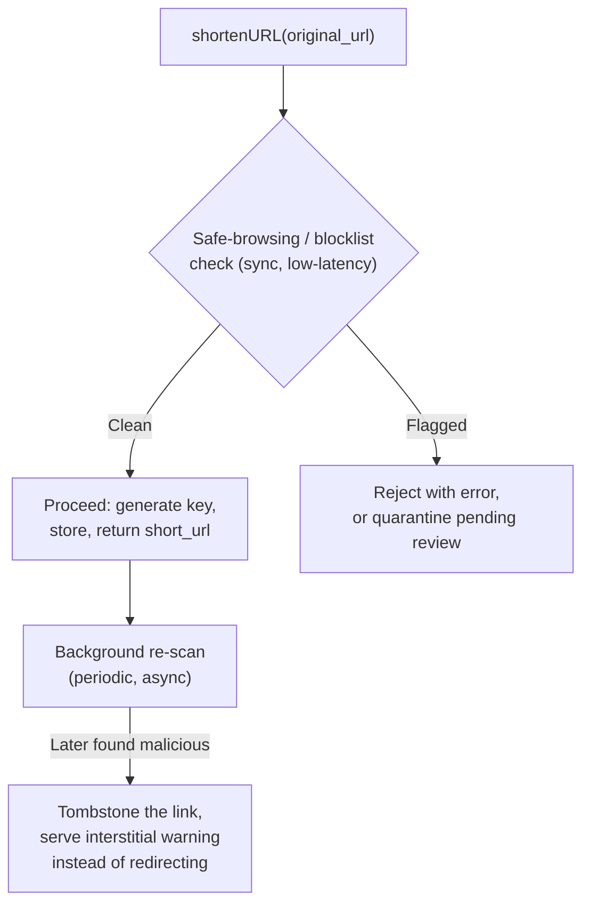

### 16.2 Rate limiting abuse

Beyond the fixed-window `api_dev_key` limiter already in the high-level design (§6): anonymous/unauthenticated shortening (no login wall, per §8's nullable `owner_id`) needs its **own** stricter per-IP limit, since `api_dev_key` alone doesn't stop a script rotating keys. A CAPTCHA challenge after N shortens/hour from one IP is the standard escalation before an outright block.

### 16.3 Enumeration attacks on short codes

If keys are sequential or otherwise guessable (the exact failure mode of pure counter-based generation, §9.1), an attacker can walk `id, id+1, id+2, …` and scrape every private/unlisted link on the service — a direct confidentiality breach, not just a nuisance. This is *why* §9's random-draw-within-range patch and Snowflake's non-sequential-feeling output both matter: it's not cosmetic, it's the actual defense. Pair it with rate limiting on the redirect endpoint itself (not just the shorten endpoint) so even a slow, distributed enumeration attempt gets throttled.

### Section cheat-sheet
- **Mnemonic — "S.R.E." for shortener security**: **S**can (malicious URLs), **R**ate-limit (abuse, both keyed and anonymous), **E**numeration-proof (unpredictable keys). Three letters, three threats, don't let the interviewer catch you only knowing one.
- Sync scan at creation + async re-scan later — a link can go bad *after* it's already been shared, one-time scanning isn't enough.
- Unpredictability (§9) isn't just a UX nicety, it's literally the mitigation for enumeration attacks — tie these two sections together if asked about either.
- Anonymous shortening needs its own per-IP rate limit distinct from the per-`api_dev_key` limit — don't assume one limiter covers both authenticated and anonymous abuse.
- Security is a cheap, high-value thing to raise unprompted — most candidates never mention phishing scanning at all, so it stands out.

---

## 17. Key Design Decisions & Trade-offs

| Decision | Choice made | Alternative | Why |
|---|---|---|---|
| DB type | NoSQL (MongoDB-style) | RDBMS | No relational structure needed between records; horizontal scaling is native to NoSQL; read-heavy workload favors leader-follower replication |
| ID generation | Range-based sequencer + random draw | Counter / Hash / Snowflake | Balances no-per-request-coordination with defeating predictability (see §9) |
| Encoding | Base58 | Base62 / Base64 / UUID | Readability (no lookalikes) beats marginal density gains; UUID fails the "tiny" requirement |
| Redirect code | Context-dependent (301 vs 302) | — | Performance vs analytics-accuracy trade-off, pick per requirements (§12.3) |
| Cache | Memcached (or Redis) | No cache | 80/20 rule means a small hot cache absorbs most read QPS cheaply |
| Consistency | Eventual (AP) | Strong (CP) | A slightly-stale replica read is harmless; an unavailable redirect is a broken link on the internet |
| Dedup identical long URLs? | Not deduped (each shorten call gets a fresh key) | Dedupe via hash-based lookup | Simpler; allows same URL to have different owners/expiry/analytics per short link — worth raising as an explicit trade-off if asked |
| Custom alias conflict resolution | DB unique constraint is source of truth | App-level locking | Scales across shards/replicas; locking does not |
| Key reuse after expiry | Never reused | Reuse to save keyspace | Trust/correctness > marginal keyspace savings (keyspace is abundant anyway) |
| Sharding strategy | Consistent hashing on `hash(short_key)` | Alphabetical range / shard-by-`owner_id` | Uniform load distribution; resharding only touches ring neighbors, not the whole dataset (§15) |
| Expiry enforcement | Lazy check on read + active background reaper | Active-only, or lazy-only | Lazy protects correctness for free; active reclaims storage on its own schedule (§14.1) |
| Malicious-URL handling | Sync scan at shorten time + periodic async re-scan | No scanning | A shortener hides destinations, making it a phishing target; one-time scanning misses links that turn malicious later (§16.1) |

### Section cheat-sheet
- Every "choice made" row should be defensible with **one non-functional requirement**, not "because that's what the tutorial said."
- AP over CP is the single most reusable trade-off statement in this whole system — reuse it whenever consistency comes up.
- Dedup-vs-no-dedup is an underrated follow-up question — know that deduping trades storage savings for losing per-owner independent expiry/analytics/ownership.
- Always be ready to argue the *other side* of any trade-off row if the interviewer pushes — that's what signals seniority, not just picking "the right" answer.
- Keep this table mental, not memorized verbatim — rebuild it live by reasoning from requirements, that's the actual skill being tested.

---

## 18. Bottlenecks, Failure Modes & Mitigations

| Failure mode | Symptom | Mitigation |
|---|---|---|
| **Hot key / viral link** | One short_key gets disproportionate traffic, overloads one cache node/shard | Consistent hashing to spread load; CDN edge caching for extreme tail; replicate hot key across multiple cache nodes |
| **ID-generator SPOF** | Single counter/coordinator down → no new shorten requests | Range-based pre-allocation (each app server holds a local block, survives short coordinator outages); multiple coordinator replicas |
| **Cache stampede** | Popular key's TTL expires, thundering herd of requests all miss simultaneously and hit DB | Jittered TTLs; mutex/lock-on-miss so only one request repopulates cache; serve slightly-stale while revalidating |
| **DB write contention on custom alias** | Many concurrent inserts racing for named slots | Unique index as source of truth (§11), not app-level checks |
| **Uneven shard load** | Some shards (e.g. alphabetically-adjacent keys) get more traffic | Consistent hashing on the encoded key, not sequential ranges, avoids "shard hotspotting" |
| **Clock skew (Snowflake-style IDs only)** | Duplicate/out-of-order IDs if a node's clock jumps backward | NTP discipline; refuse to generate IDs during detected clock rollback; wait it out |
| **Analytics backpressure** | Click-event queue backs up during traffic spikes | Fully async, queue absorbs bursts; drop/sample events under extreme load rather than block redirects |
| **Region/DC outage** | Users in one region can't shorten/redirect | GSLB reroutes to healthy region; async cross-region replication keeps other regions servable |
| **Data loss disaster** | Storage node/DC failure loses recent, un-replicated writes | Frequent backups (e.g., twice-daily to S3-style storage); worst case bounded — at ~76 writes/sec, a half-day gap is only ~1-2M records, quantify this in the interview to show you can bound blast radius |
| **Enumeration/scraping attack** | Attacker walks `id, id+1, id+2, …` to harvest private links | Randomized draw within a range (§9), never expose raw sequential IDs; rate-limit the redirect endpoint itself, not just the shorten endpoint (§16.3) |
| **Phishing link circulating** | A shortened link points to (or later turns into) a credential-harvesting page | Sync scan at creation + periodic async re-scan against a threat-intel blocklist; tombstone and show an interstitial warning if later flagged (§16.1) |

### Section cheat-sheet
- For every bottleneck, name **both** the symptom and a concrete mitigation — vague "we'd add more caching" answers score worse than specific mechanisms (jittered TTL, consistent hashing, lock-on-miss).
- Quantify worst-case blast radius when discussing data loss (e.g., "twice-daily backups bound our loss to ~half a day's writes, which at our estimated rate is ~1-2M records") — this is exactly what the source material does and it reads as senior-level risk framing.
- Hot-key handling is the most commonly asked live follow-up in this problem — have consistent hashing + CDN edge caching ready without prompting.
- Always separate "coordination SPOF" (ID generator) from "data SPOF" (DB) — they have different mitigations (ranges/replicas vs sharding/replication).
- If time allows, mention **graceful degradation**: serving a stale cached redirect is almost always better than a hard failure for this system.

---

## 19. Real-World References

- **Flickr's Ticket Server**: two MySQL instances configured with `auto_increment_increment` of 2 — one generating even IDs, one odd — used purely as distributed, replicated *ID dispensers*. This is the direct real-world ancestor of the "range-based sequencer" pattern in §9.
- **Twitter Snowflake**: open-sourced distributed ID generator, 64-bit IDs = 41-bit timestamp + 10-bit worker ID + 12-bit sequence. Chosen because Twitter needed IDs generated by thousands of independent machines with **zero per-ID coordination** and rough time-ordering (so IDs sort close to chronological order — useful for tweet IDs, not strictly required for short-URL keys but often reused for that purpose anyway).
- **bit.ly-style analytics-driven shorteners**: prioritize 302-style redirects and rich click analytics (referrer, device, geo) as a core product feature, not an afterthought — the redirect *is* the product surface they monetize via analytics/marketing dashboards.
- **Base58 origin**: popularized by Bitcoin (wallet addresses) specifically to prevent human transcription errors — the same rationale this chapter applies to short URLs (people read these out loud, retype them from print, etc.).
- **DynamoDB / Cassandra-style wide-column stores**: commonly cited alternatives to MongoDB for this exact workload — same rationale (schemaless, horizontally partitionable, tunable consistency, replica-heavy reads); know at least one alternative by name beyond MongoDB.
- **CDN-fronted redirects**: services expecting viral spikes (marketing campaign links, social-media bio links) often put a CDN or edge-compute layer (e.g., edge functions) directly in front of the redirect endpoint, bypassing origin app servers entirely for cached hot keys.
- **Google Safe Browsing / PhishTank**: industry-standard threat-intel feeds real shorteners check submitted URLs against, both at creation time and on a recurring re-scan — the direct real-world backing for §16.1's scanning design.
- **Zookeeper**: the canonical coordination service for distributed systems generally (leader election, config, distributed locks) — its use here as a range/ticket dispenser (§9) is one narrow application of a much more general tool, worth knowing the broader context of if pushed.

### Section cheat-sheet
- Name at least one real system (Flickr ticket server or Twitter Snowflake) unprompted when discussing ID generation — it converts a "textbook answer" into "I've studied how this is actually solved."
- Know Snowflake's exact bit layout (41/10/12) — it's a common flashcard-style follow-up question.
- Bring up bit.ly's analytics-first product angle specifically when justifying a 302 choice — ties the trade-off to a real business model, not an abstract preference.
- Base58's Bitcoin origin is a good one-liner that shows breadth without derailing into blockchain tangents.
- Mention DynamoDB/Cassandra as MongoDB alternatives if the interviewer pushes on "why not X instead" — have the reasoning (partitioning + replication model), not just the name.
- Google Safe Browsing is the one-word answer to "how would you actually implement malicious-URL scanning" — don't invent a bespoke ML classifier live, cite the existing industry API.

---

## 20. Numbers Worth Memorizing

| Quantity | Value |
|---|---|
| Seconds per month (avg) | 2,628,288 (30.42 days) |
| Read:Write ratio (typical assumption) | 100:1 |
| Bytes per URL record (assumption) | 500 bytes |
| DAU → servers heuristic | DAU / 8,000 |
| Cache-worthy traffic share (80/20 rule) | top 20% of keys → 80% of reads |
| Base62^6 keyspace | ~56.8 Billion |
| Base62^7 keyspace | ~3.5 Trillion |
| Base58^6 keyspace | ~38.1 Billion |
| Bits per base-N digit | log2(N) — e.g. log2(58) ≈ 5.85, log2(62) ≈ 5.95, log2(10) ≈ 3.32 |
| Snowflake ID layout | 41 bits time + 10 bits machine + 12 bits sequence (64 bits total) |
| Typical short-key length | 6-7 characters |
| UUID length | 36 characters (with hyphens), 128 bits |
| Base62^3 keyspace (hand-traced example, §10.3) | 62³ = 238,327 |
| Architecture evolution stages | 4: naive single-box → durable+cached → distributed+sharded → CDN+async-analytics (§5) |
| Lazy vs active expiry | Lazy = check on read (free, correctness); Active = scheduled reaper (cost, storage reclaim) (§14.1) |
| Security triad | Scan (phishing) / Rate-limit (abuse) / Enumeration-proof (unpredictable keys) (§16) |

---

## 21. Memory Hooks (Mnemonics)

- **ID generation strategies — "C.H.R.S."**: **C**ounter (simple, SPOF) → **H**ash (stateless, collision-prone) → **R**ange (Flickr ticket-server, amortized coordination) → **S**nowflake (fully distributed, clock-sensitive). Say them in *increasing distribution* order.
- **Base58's four dropped characters — "OIl0"**: capital **O**, capital **I**, lowercase **l**, digit **0** — the classic look-alike quartet (plus `+` and `/` dropped for URL-safety, giving 58 = 64 − 6).
- **301 vs 302 — "1 sticks, 2 ticks"**: 301 **sticks** in the browser cache (permanent, skip server next time); 302 **ticks** the counter every time (temporary, always revisits server) — maps directly to "analytics needs 302."
- **80/20 caching rule — "small cache, big win"**: cache the fifth, catch the four-fifths (20% of keys → 80% of traffic).
- **Never reuse a dead key — "graves aren't recycled"**: expired/deleted short keys stay retired forever — trust over thrift.
- **Architecture evolution — "Nobody Designs Systems Cold"**: **N**aive single-box → **D**urable (DB+cache+encoding) → **S**caled (distributed IDs + shards) → **C**omplete (CDN + async analytics). Walk it in that order every time (§5).
- **Capacity estimation chain — "W.R.S.B.C.S."**: **W**rite QPS → **R**ead QPS → **S**torage → **B**andwidth → **C**ache → **S**hards — six dominoes, replug new inputs and re-tip them in order (§4).
- **Shortener security — "S.R.E."**: **S**can for phishing, **R**ate-limit abuse, **E**numeration-proof your keys (§16).
- **Expiry — "check when clicked, sweep when idle"**: lazy read-time check is free correctness insurance; the active reaper is separately-scheduled housekeeping (§14.1).

---

## 22. Golden Rules

1. **Estimate before you design.** Your read:write ratio and storage numbers should visibly *drive* your architecture choices, not decorate them after the fact.
2. **Reads dominate — optimize the redirect path ruthlessly**, and don't over-engineer the write path beyond "unique, unpredictable, fast enough."
3. **Coordination is the enemy of scale.** Every ID-generation strategy above is really a spectrum of "how much do we coordinate, and when" — know where on that spectrum you're choosing to sit and why.
4. **Encoding and ID generation are different problems.** Encoding is deterministic/reversible math (no collisions); uniqueness/collisions are entirely the ID generator's responsibility. Never blur the two in an answer.
5. **AP over CP, always justify with "a broken redirect is worse than a stale one."**
6. **Never let a side-effect (analytics, notifications) sit on the latency-critical path.** Async queue, always.
7. **Never resurrect a dead key.** Trust and correctness beat marginal keyspace savings — and the keyspace was never actually scarce.
8. **Every trade-off row needs a "because of NFR X"** — if you can't tie a decision back to a stated requirement, it's decoration, not design.

---

## 23. Interview Strategy Cheat-Sheet

- **Opening move**: restate functional + non-functional requirements back to the interviewer in ~30 seconds, confirm read:write ratio assumption before estimating.
- **Estimation move**: walk the formula chain out loud (§4) — interviewers grade the reasoning trail, not the final digit.
- **High-level design move**: draw boxes left-to-right (client → LB → app → cache/DB/ID-gen), narrate one sentence per box.
- **Deep-dive move**: let the interviewer pick which component to go deep on (ID generation, encoding, caching) — but have all of §9-§13 ready regardless.
- **Trade-off move**: proactively raise 301-vs-302 and dedup-vs-no-dedup even if not asked — these are the two "there's no single right answer" moments that showcase judgment.
- **Failure-mode move**: hot key + cache stampede + ID-generator SPOF are the three most commonly probed failure scenarios — rehearse mitigations cold.
- **Evolution move**: if asked "how would you build this incrementally," walk the four stages in §5 — naive box, then durable+cached, then distributed+sharded, then CDN+async — narrating what broke at each step, not just the final diagram.
- **Security move**: raise malicious-URL scanning and enumeration-proofing unprompted (§16) — almost no candidate mentions phishing scanning, so it's a cheap differentiator.
- **Closing move**: recap which NFRs your design satisfies and how (§17-18 tables), name one thing you'd add with more time (e.g., real-time analytics dashboard, CDN edge layer).

---

## 24. Master Cheat Sheet

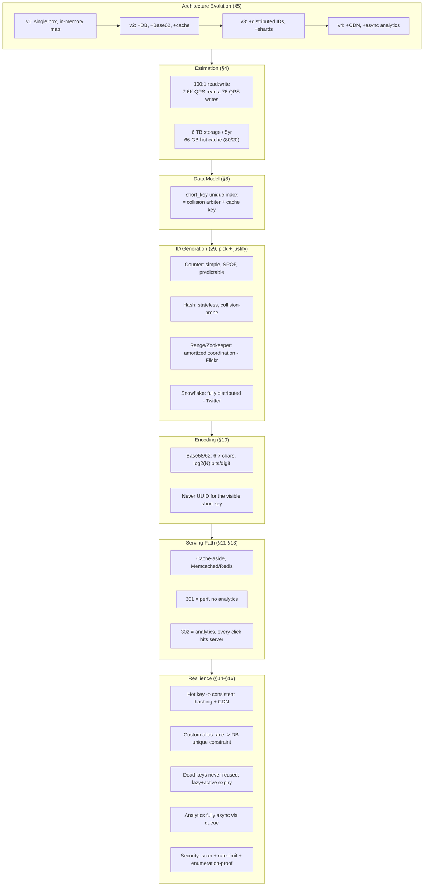

**One paragraph to say if asked to summarize in 60 seconds**: *"This is a read-heavy key-value system — ~100 redirects for every shorten. Starting from a naive single-box in-memory map, I'd evolve it in stages: add a persistent DB with Base62 encoding and a basic cache, then distribute ID generation and shard the DB, then add a CDN and async analytics. I'd generate globally-unique numeric IDs with a range-based sequencer (Flickr-style ticket server) to avoid write-path coordination, randomize assignment within ranges to keep keys unpredictable, base58-encode to ~6-7 characters for readability, cache the hot 20% of keys (Memcached/Redis) to absorb 80% of read traffic, and pick 301 vs 302 redirects based on whether click analytics is a requirement. I'd shard the DB with consistent hashing to avoid hotspotting, push analytics onto an async queue so it never touches redirect latency, scan submitted URLs against a threat-intel blocklist to catch phishing, and never reuse expired keys to protect user trust."*
