# Design a Web Crawler — The Story (narrative edition)

> **What this file is.** The reference file, `35-Web-Crawler-FAANG-Guide.md`, is the one to recite from — requirements, the frontier data model, every trade-off table, the master cheat sheet. This file is a second way in: the same material as one continuous story, told in plain language. Engineers at a company keep hitting a wall, patch it, and the patch itself creates the next wall — until we land on the exact same design the reference file documents. The company, **ClearPath Search** (a small vertical search startup, crawler nicknamed **Scout**), is fictional. But every wall it hits, and every fix it reaches for, is something a real, named system or paper actually does: the **Mercator** crawler paper (Heydon & Najork, DEC/Compaq, 1999), **robots.txt** (proposed informally by Martijn Koster in 1994, formalized as **RFC 9309** in 2022), **Googlebot**'s crawl-budget behavior, **Common Crawl**'s published dataset size, Google's own **SimHash** near-duplicate paper (Manku, Jain, Das Sarma, WWW 2007), Bloom filters (Burton Howard Bloom, 1970), and consistent hashing (Karger et al., 1997, the idea behind Akamai and later Amazon's Dynamo). I'll say clearly, every time, whether something is a documented fact or just a reasonable guess — guesses get an `[illustrative]` tag.

**The trigger phrases** for this whole topic: *"design a web crawler,"* *"design the crawling layer for a search engine,"* or *"design a service that discovers and archives millions of URLs without getting itself banned."* Keep one sentence in your head as you read: **a crawler is graph traversal at planet scale, over a graph that keeps generating new nodes while you walk it, under an etiquette contract you didn't write.** Everything below is just this one idea, getting harder in small, honest steps.

---

## Chapter 1 — The script that fell into the calendar

It's 2013. ClearPath is two engineers and an idea: a vertical search engine for recipe blogs. Scout, their crawler, is a single Python script. It starts at a seed URL, fetches the page, pulls out every link on it, and immediately follows the *first* new link it finds — recursively, depth-first, one thread, no bookkeeping. Average round-trip per fetch is about 60ms `[illustrative — a standard planning number, not this one page's actual measurement]`, which is roughly the same "typical HTTP fetch" figure used across most crawler capacity math.

Scout's very first real seed is a farmers-market blog with an events page: `/events?date=2024-01-01`. That page links to "next day" — `/events?date=2024-01-02` — which links to the next, forever. Depth-first, Scout follows it. Five hours later, at 60ms/fetch, Scout has done roughly `18,000s / 0.06s ≈ 300,000` fetches — and every single one of them is a calendar page from that one blog. Zero progress on the other 4,999,999 seed URLs sitting untouched in a list somewhere. Scout isn't crawling the web; it's reading one infinite ledger forever.

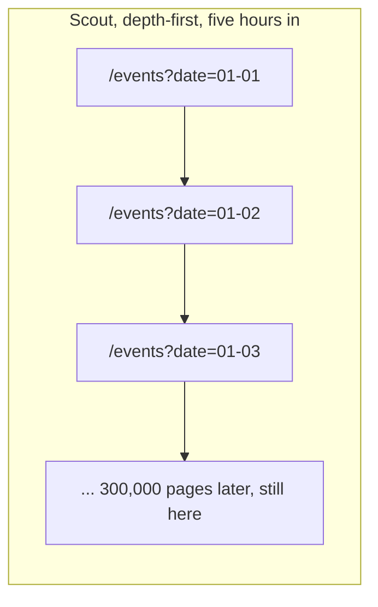

The obvious question: *even without the calendar trap, was this ever going to finish?* No. Say ClearPath eventually wants a serious slice of the web — the same planning-scale number the reference guide uses, 5 billion pages. At 60ms/fetch, one single thread needs `5,000,000,000 × 0.06s ≈ 300,000,000 seconds ≈ 9.5 years`. A trap just makes an already-hopeless plan visible on day one instead of year nine.

**The fix, and the first analogy for this whole story:** think of the web as a **library where every book cites other books**, and reading it depth-first means you follow the *first* citation you see, into the book it cites, into the book *that* one cites — with no way back to the shelf you started on. The fix is to **read shelf by shelf instead**: look at everything on the current shelf before pulling the next cited book. That's breadth-first traversal — canvass every neighbor before going deeper into any one of them — and it's coming in Chapter 2.

**How I'd say this in an interview:** "A naive depth-first crawler has two separate problems that look like one: it's mathematically too slow to cover the web on a single thread, and depth-first order means one cyclic or infinite page — like a calendar with a 'next day' link — can swallow the entire crawler before it ever reaches page two of anywhere else."

---

## Chapter 2 — The block-by-block canvass

The fix: switch from depth-first recursion to a **shared queue, walked breadth-first, drained by many workers at once.** Every worker pulls the next URL off the front of the queue, fetches it, and pushes any brand-new links onto the *back* — so every domain gets a turn before any one domain gets a second turn. This is the traversal order every serious web-scale crawler uses, for exactly the reason Chapter 1 just proved: breadth-first spreads the damage from a bad page; depth-first concentrates it.

ClearPath sets a real target: crawl **50 million** recipe pages within **3 days**. Single-worker time at 60ms/fetch: `50,000,000 × 0.06s = 3,000,000s ≈ 34.7 days` — over 11x too slow. Servers needed for the 3-day target: `34.7 days / 3 days ≈ 12 workers`. ClearPath spins up 12 worker processes pulling from one shared BFS queue. The math checks out; the crawl finishes on schedule.

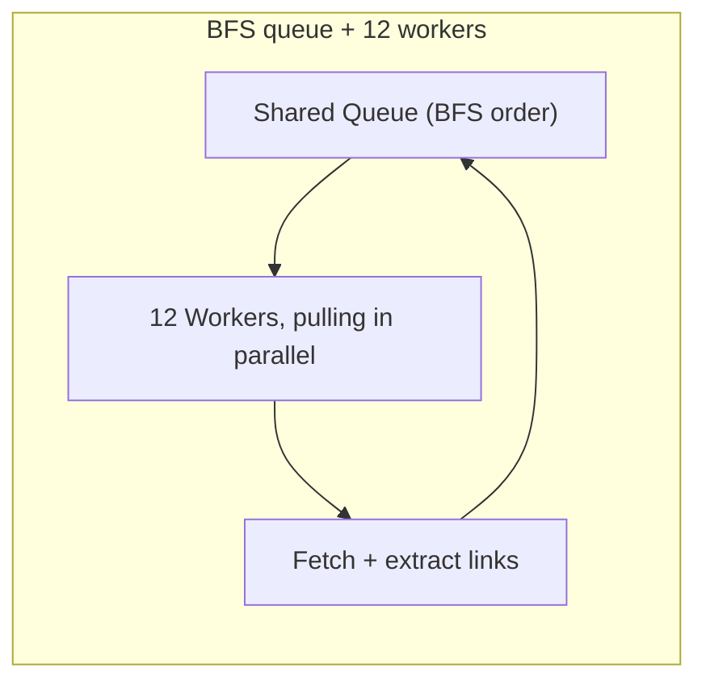

**New problem, visible by day two:** nobody added dedup. A recipe page linked from three different category pages gets enqueued three times and fetched three times. Worse, ClearPath's food blogs love session-tracking query strings — `recipe/123?ref=email` and `recipe/123?ref=twitter` are the *same* page, byte for byte, under two different URLs. Concrete cost: with an average of 20 outlinks per page, 50M pages generates `50,000,000 × 20 = 1,000,000,000` raw URL sightings before anything is deduped — a **20x amplification** over the actual number of unique pages. Storage and bandwidth are being spent 20 times over on work that should happen once.

**How I'd say this in an interview:** "BFS plus a worker pool solves the *time* problem — it's just dividing the single-worker number by however many workers you run. But a shared queue with no dedup means the same page gets refetched every time a new link to it turns up, and that amplification factor — outlinks per page — is exactly why URL dedup isn't an optional nice-to-have, it's load-bearing from day one."

---

## Chapter 3 — The bouncer with a fingerprint scanner

The fix: before enqueuing a URL, or storing content, check it against a checksum store first. Two separate checks, because two different things repeat: a **URL checksum** catches "we've seen this exact address before," and a **content checksum** catches "different address, byte-identical page" — exactly the `?ref=email` vs. `?ref=twitter` case from Chapter 2.

**The analogy for the rest of this story:** think of dedup as a **bouncer checking IDs at a door.** The URL checksum is checking the name on the list; the content checksum is checking the actual fingerprint underneath — so even someone who shows up with a fake name (a new query string) gets caught if their fingerprint matches someone already inside.

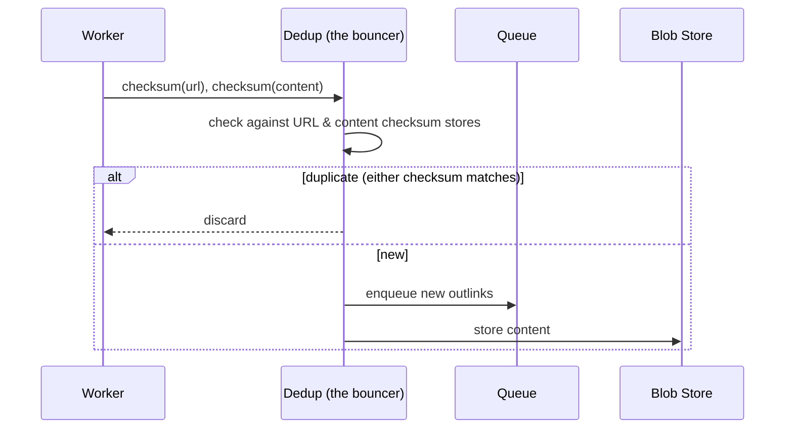

This works immediately — the 20x amplification collapses back down to roughly 50M unique fetches. But as the checksum store grows toward hundreds of millions of entries, a new cost shows up: checking "have I seen this URL" now means a real lookup against a store that no longer fits comfortably in memory, on the hot path of *every single fetch*. The standard trick — the same one Mercator-style crawlers and most large-scale "seen URL" tests actually use — is a **Bloom filter** as a cheap first pass: a small bit array that can say "definitely never seen" in one memory access, falling back to the real on-disk store only on a "maybe seen" hit. Sized for 1 billion URLs at a 1% false-positive rate, the math (`m ≈ n × 9.6 bits` for that error rate) works out to about **1.2 GB of memory** `[illustrative — the formula is real, the exact sizing choice here is a stand-in]` — versus gigabytes of random disk lookups otherwise.

**New problem:** the bouncer's fingerprint scanner is *exact* — one changed byte produces a completely different checksum, by design (that's what makes MD5/SHA-1 useful as exact-match tools). But food blogs syndicate: the same recipe reposted on a partner site with a different photo, a different byline, and a different ad banner is a *different* set of bytes, even though a human would call it the same page. ClearPath finds this is common — roughly **30% of the crawled recipe corpus** turns out to be syndicated near-duplicates that exact checksums never catch `[illustrative — a plausible share for a syndication-heavy niche, not a measured figure]`.

**How I'd say this in an interview:** "Dedup needs two checksums, not one — URL-level for repeated addresses, content-level for the same bytes at different addresses. At real scale, checking a checksum store on every fetch is itself expensive, so a Bloom filter as a fast probabilistic pre-filter is the standard move. But exact checksums are blind to near-duplicates by design — a one-byte change produces a totally different hash — and that's a separate problem."

---

## Chapter 4 — The article that looks familiar

The fix: a second dedup pass that tolerates *small* differences instead of demanding an exact match. **SimHash** — a real, documented technique from Google's own 2007 WWW paper (Manku, Jain, Das Sarma, *"Detecting Near-Duplicates for Web Crawling"*) — builds a compact fingerprint (commonly 64 bits) out of a document's shingled features, such that *similar* documents produce fingerprints that differ in only a *few* bits, while an exact hash would've scattered them randomly.

Worked example, straight from the same shape of numbers the paper and the reference guide both use: two fingerprints are treated as near-duplicates if they differ in **≤3 bits out of 64**. A recipe reposted on a partner site — same steps, different byline and ad slot — lands at Hamming distance **2**: near-duplicate, discard or merge. An original post that quotes one paragraph from another recipe lands at distance **24+**: not a duplicate, keep it.

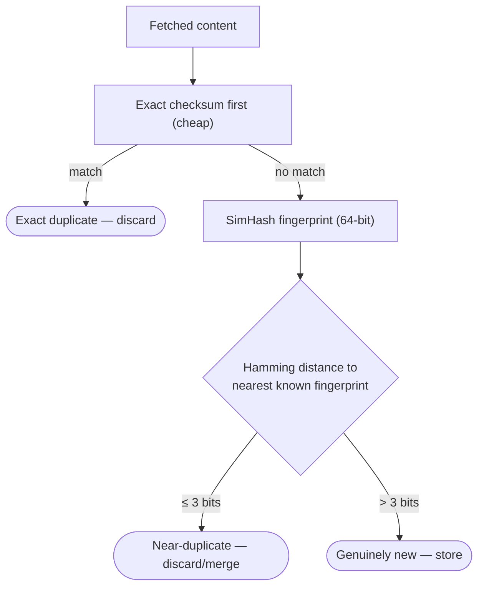

Exact checksum runs first (cheap, catches most repeats); SimHash runs second, only on what survives, because comparing fuzzy fingerprints costs more than an equality check. Dedup is now solid on both fronts. But dedup only decides *whether* to keep content — it says nothing about *how politely* Scout is allowed to go get it. And one specific food-blog network, running on cheap shared hosting, has an average time-to-first-byte of **3 seconds**. Scout's 12 workers, with no per-host throttle, are hitting it at roughly **100 requests/sec** combined. Within **40 minutes**, that host's admin blocks ClearPath's entire IP range `[illustrative — a believable outcome, not a documented incident]`.

**How I'd say this in an interview:** "Exact checksums and SimHash are two tiers of the same idea, run in sequence — cheap exact match first, fuzzy fingerprint match second for the remainder. That closes dedup. It doesn't touch the completely separate problem of *how hard* you're allowed to hit any one host, and that's the very next wall."

---

## Chapter 5 — The mail carrier who wouldn't stop knocking

The fix: politeness has two layers, and ClearPath needs both. First, a **published rulebook** — `robots.txt` — that every host can set to say "don't touch this path." This isn't a ClearPath invention; it's a web-wide convention Martijn Koster proposed informally in 1994, obeyed voluntarily by crawlers for decades, and finally formalized as an official IETF standard, **RFC 9309**, in 2022. Second, an **adaptive throttle** Scout enforces on itself regardless of what the rulebook says, because `robots.txt` can permit a path and still not want it hit 100 times a second.

**The analogy:** think of Scout as a **delivery driver visiting a street full of shops.** `robots.txt` is the sign taped to each shop's door — "deliveries welcome," "staff entrance, keep out," or a posted delivery window (`Crawl-delay`). The throttle is the driver's own rule of thumb — one drop-off every couple of seconds at any single shop, slower still if that shop's staff visibly can't keep up — regardless of what the sign says, because a sign saying "welcome" doesn't mean "welcome to be flooded."

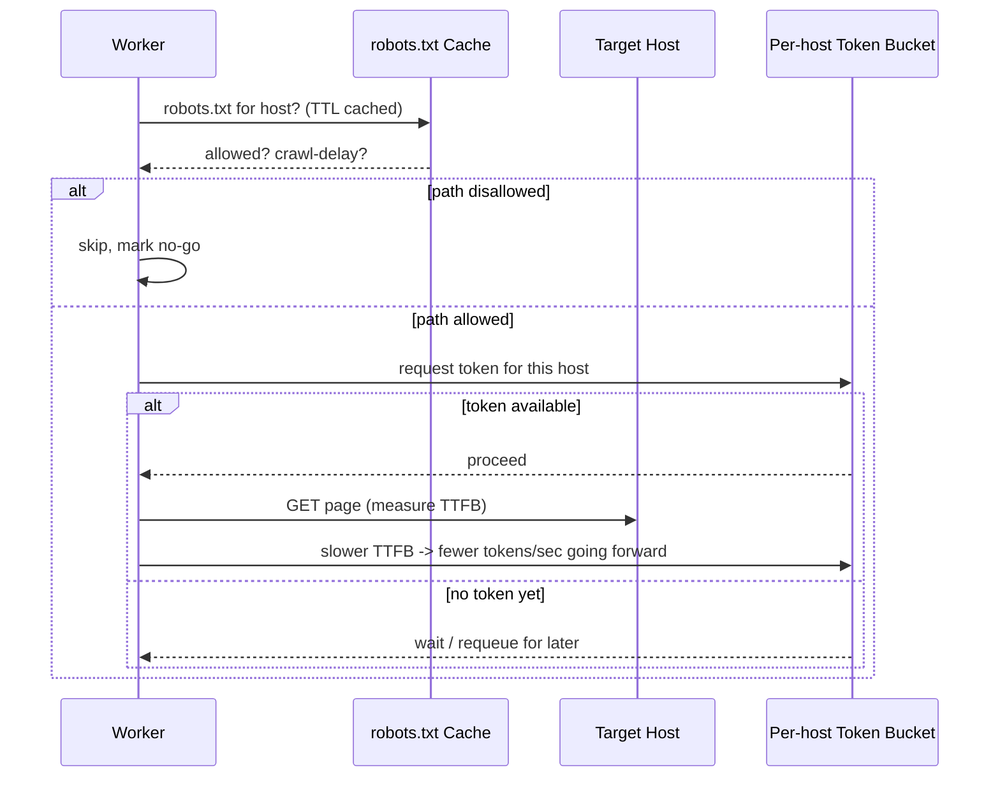

ClearPath sets one request per host every 2 seconds by default, adapting slower for hosts with high TTFB — in the same spirit as Google's own historically-reported practice of roughly one request per second per host. The IP ban from Chapter 4 stops recurring.

**New problem:** robots.txt and the throttle only govern *how* Scout is allowed to visit a page — they say nothing about *whether that page is a trap.* Chapter 1's infinite calendar page was never disallowed by anyone's robots.txt — it's a perfectly legal, perfectly polite, perfectly infinite hallway. Politeness alone was never going to save Scout from it.

**How I'd say this in an interview:** "Politeness is two layers — the published rulebook, robots.txt, and a self-imposed adaptive throttle on top of it, because being *allowed* to fetch something fast doesn't mean you *should*. But robots.txt is a floor, not a shield — it stops disallowed pages, it does nothing against an allowed page that happens to be infinite, and that's a genuinely different problem."

---

## Chapter 6 — The hallway that keeps growing new doors

The trap from Chapter 1 wasn't a one-off. Once ClearPath starts looking, it finds the same shape everywhere, in five recognizable flavors — a mnemonic worth reciting unprompted in an interview: **Q-I-C-D-C** — **Q**uery-param traps (`?id=1,2,3...`), **I**nternal redirect loops (`/a → /b → /a`), **C**alendar pages, **D**ynamic-content generators (`?seed=N` for any N), and **C**yclic directories (`/first/second/first/second/...`).

The single most damaging one turns out not to be malicious at all: **faceted navigation.** One recipe-aggregator partner site lets visitors filter by cuisine × diet × cook-time × ingredient, all as combinable query parameters — a real, widely-observed pattern in e-commerce and content sites alike. One category page can generate an effectively unbounded number of valid-looking, mostly-duplicate URLs, all differing only by which filters are toggled.

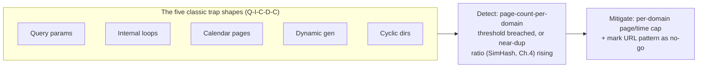

The fix: a **per-domain cap** — say, 50,000 pages per domain per day, tuned per host — plus watching two statistical signals per domain: page-count growth rate, and the near-duplicate ratio Chapter 4's SimHash already computes. When either crosses a threshold, Scout stops crawling that domain further and flags it for review — the same circuit-breaker shape used everywhere else in distributed systems.

**New problem:** all of this — dedup, robots.txt, throttling, trap caps — lives behind *one* shared queue and *one* database tracking every known URL. As ClearPath scales from 12 workers to 200 to keep pace with a growing seed list, that one database becomes the bottleneck. Benchmarked, a single database box sustains roughly **2,500 writes/sec** before falling behind `[illustrative — a stand-in "one box has a ceiling" number]`. Two hundred workers, each discovering new URLs constantly, need combined throughput closer to **10,000 writes/sec**. The queue that was supposed to coordinate everyone is now the thing everyone's waiting on.

**How I'd say this in an interview:** "Traps fall into a handful of recognizable shapes, and the fix is the same for all of them — a per-domain resource cap plus statistical detection, not hand-written rules for every pattern you've personally seen. But none of that touches the frontier's own scaling limit — one queue and one database is still one machine's ceiling, same disease as Chapter 1's single thread, just one layer up."

---

## Chapter 7 — The one sorting desk that everyone lines up at

The fix: stop routing every worker through one shared queue and database. Split the frontier itself into **N independent shards**, and route each hostname to a shard by hashing it — the exact same partitioning key Chapter 6 already uses for per-domain caps, now doing double duty for placement. ClearPath picks **20 shards**, each backed by its own queue and database, each handling roughly `10,000 / 20 = 500` writes/sec — comfortably under any one box's ceiling.

**The analogy:** think of the frontier as a **postal system with sorting-office branches**, one branch per shard, arranged around a circular route. Every hostname gets mapped to a spot on that circle by hashing its name; the branch whose spot comes next clockwise owns it. This is **consistent hashing** — the real, documented mechanism behind Akamai's original content-routing (Karger et al., 1997) and later Amazon's Dynamo (2007) — just applied here to *which frontier shard owns a hostname* instead of *which cache node owns a key*.

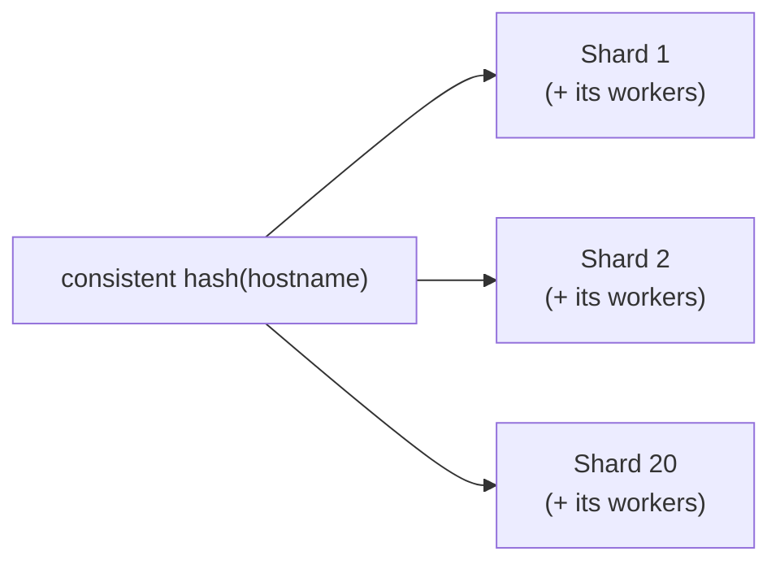

Add a 21st shard later, and only the small slice of hostnames that now fall nearest it move — not a full reshuffle of everything, the same property that made this trick worth adopting for cache sharding in the first place. Contention on any single database disappears; each shard is its own small, healthy queue.

**New problem:** hashing hostnames to shards assumes hostnames are roughly even in size. They aren't. One recipe-aggregator mega-site — 5 million pages on its own — hashes to a single shard, and that shard alone now handles more traffic than three ordinary shards combined. Domain-level partitioning, which made politeness simple (Chapter 5's per-host throttle needs exactly one owner per host), just created a hot spot.

**How I'd say this in an interview:** "Sharding the frontier by hostname — consistent-hashed, same key as domain-level worker assignment — turns one overloaded database into twenty healthy ones, and adding a shard later only moves a small slice of hostnames instead of reshuffling everything. But hashing assumes even load per hostname, and the web has mega-sites that break that assumption immediately."

---

## Chapter 8 — The warehouse that got too big for one team

Domain-level partitioning is still the right *default* — it's what keeps politeness simple, since one worker (or worker group) owning a whole domain means the per-host throttle from Chapter 5 has exactly one place to live. The fix for the mega-site problem isn't to abandon domain-level partitioning everywhere; it's to **sub-shard just the mega-domains** — split that one 5-million-page aggregator across, say, 8 workers by URL-path range within the domain, while every ordinary domain stays on one worker as before.

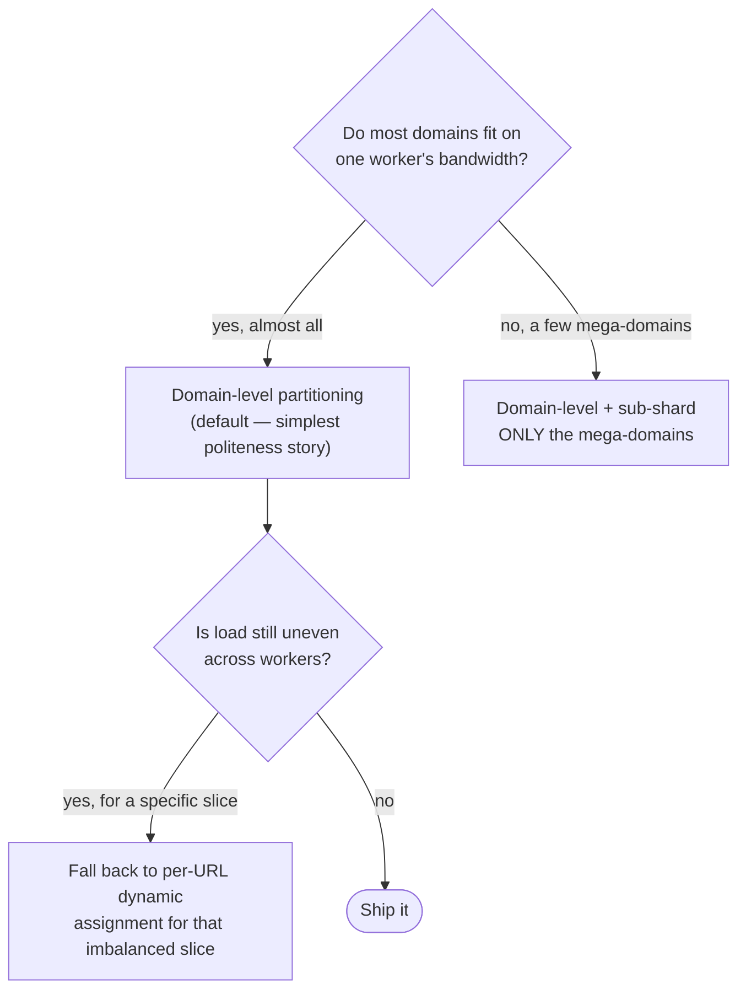

For the rare cases where even sub-sharding leaves load lumpy — say, a burst of URLs that don't map cleanly to any domain boundary — ClearPath falls back to **dynamic per-URL assignment**: any free worker takes any queued URL from a shared pool, at the cost of losing the tidy "one worker owns this whole domain" locality that made politeness simple. It's used sparingly, only where the other two strategies visibly fail.

**New problem:** ClearPath now runs roughly 300 workers across 20 shards, several of them sub-sharded. Every one of those workers resolves DNS before every fetch. Most of the web's traffic clusters on a relatively small set of popular hostnames, and 300 workers independently asking a public DNS resolver for the same handful of names, over and over, starts looking — from the resolver's point of view — indistinguishable from an attack. ClearPath's outbound DNS queries get rate-limited by their upstream provider, and cold lookups that used to take 20-200ms start queueing behind the throttle.

**How I'd say this in an interview:** "Partitioning strategy — who owns this URL — and priority — what order do they get crawled in — are two separate axes candidates often blur together. Domain-level is the right default because it keeps politeness simple; sub-shard only the mega-domains that actually break the assumption, and reach for fully dynamic assignment only as a last resort, because it gives up the locality that made per-host rate-limiting easy in the first place."

---

## Chapter 9 — The phone book you keep re-dialing

A cold DNS lookup costs 20-200ms; a cached one costs under 1ms — a 100-1000x difference. A public or ISP resolver has no way to tell "300 well-behaved crawler workers" from "a botnet hammering the same names" — it just sees volume, and it throttles accordingly. That's exactly the wall Chapter 8 ended on.

The fix: **run your own resolver cache**, the same move any large-scale crawl operation makes once DNS volume gets real. **The analogy, reusing DNS's own name for itself:** it's like keeping your own well-worn phone book on your desk instead of calling directory assistance for a number you looked up ten minutes ago — you still call directory assistance once, but never twice for the same name within its listed validity window.

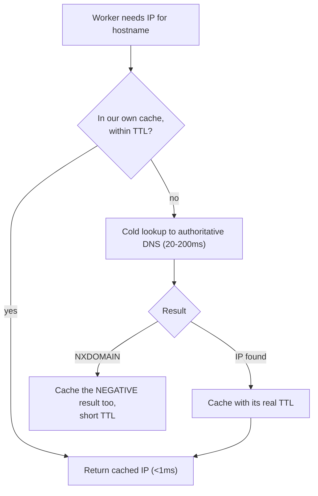

Two disciplines matter as much as the cache itself. **Respect the published TTL exactly** — caching past it risks serving a stale IP after a host migrates; caching under it throws away the speedup. And **cache negative results too** — a hostname that just returned `NXDOMAIN` (a dead link, often produced by the very trap patterns from Chapter 6) will get asked for again by the next worker that meets the same broken URL pattern, and a short negative-cache TTL stops that from hammering authoritative nameservers for a name that was never going to resolve.

Worked number, once the cache is warm: at a **95% cache-hit rate**, amortized DNS latency per fetch is roughly `0.95 × 0.5ms + 0.05 × 100ms ≈ 5.5ms` — small next to a typical 50-100ms HTTP fetch, which is exactly why a *healthy* cache makes DNS a footnote. It becomes a real bottleneck again the moment the hit rate drops — an undersized cache, too-aggressive TTL policy, or a fresh batch of never-seen domains from a new seed list.

**New problem:** DNS, dedup, traps, and politeness are all solid now. But every one of those fixes assumed a URL is worth visiting *once*. Pages change. A news-style recipe roundup updates daily; a static "About us" page never changes again. Right now, ClearPath recrawls everything on the same fixed monthly schedule — wasting a full re-fetch on pages that never changed, while pages that change daily go stale for weeks.

**How I'd say this in an interview:** "DNS at crawl scale isn't plumbing you can wave away — a public resolver rate-limits high-volume clients like an attacker, so you run your own cache, respect the TTL exactly, and cache negative results too so trap-generated dead links don't hammer authoritative servers. Once the cache is warm it's a rounding error next to the HTTP fetch itself; it only bites again if the hit rate drops."

---

## Chapter 10 — The book that never changes vs. the one that changes daily

Every URL in ClearPath's store has two independent knobs: **priority** (how important is this page) and **recrawl frequency** (how often should we check it again). A daily-updated recipe roundup and a static "About us" page are wildly different on both axes.

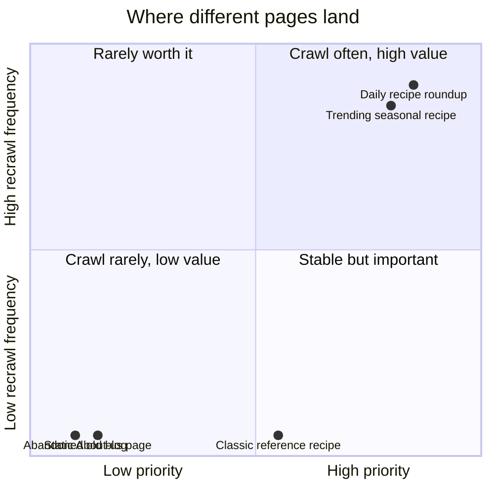

The fix has two independent levers, and both matter. First, make the **recrawl interval adaptive**, not fixed: track how often a URL's *content checksum* (Chapter 3) actually changes across visits. A page that's changed on every one of its last 10 checks gets a shorter interval; a page that hasn't changed in 40 checks gets stretched out. Second, make each *individual* recheck cheap using **conditional GET**: send `If-Modified-Since` or `If-None-Match` (using a stored `ETag`) instead of blindly re-downloading. A `304 Not Modified` response costs one round-trip and zero bandwidth; only a real `200 OK` triggers a full re-fetch, re-extract, and re-dedup.

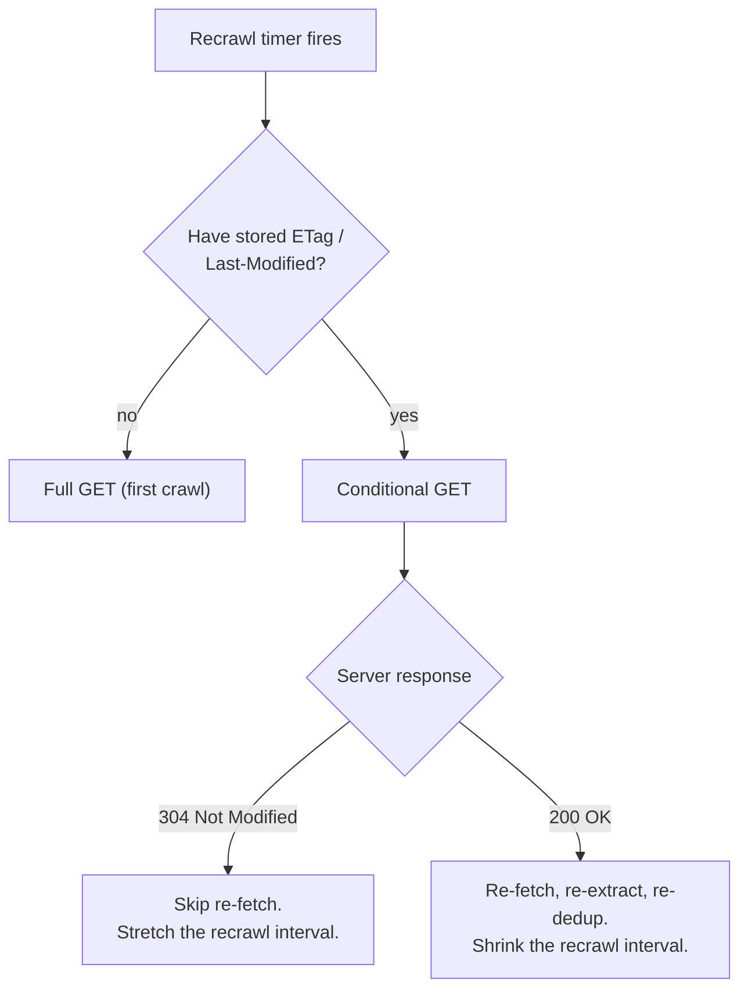

This is the pairing that makes running the adaptive loop *continuously* affordable instead of only on a fixed monthly sweep — the interval decides *whether* to check soon, conditional GET decides *how expensive* checking actually is.

**New problem:** now that recrawls are frequent and adaptive, a worker is holding many more URLs "in flight" at once than before. One afternoon, a worker process crashes mid-fetch — no error logged anywhere, it just stops. The URL it was holding was never marked done, never marked failed. As far as the frontier knows, that URL is simply gone, permanently stuck in a "someone's working on it" state that no one is actually working on anymore.

**How I'd say this in an interview:** "Freshness has two separate knobs — how often you check, and how expensive each check is — and you want both adaptive: stretch the interval on pages that never change, and use conditional GET so a due-for-check page that *hasn't* changed costs one round-trip, not a full re-download. That's what makes running this continuously cheap enough to actually do."

---

## Chapter 11 — The claim ticket that expires

The fix: the frontier never hands a URL to a worker as a permanent claim — it hands out a **lease**, a time-boxed reservation with a TTL. **The analogy:** it's a **claim ticket at a dry cleaner.** You hand over your shirt, get a ticket with a pickup window, and if you never come back within that window, the shirt goes back on the rack for someone else to claim — the shop doesn't wait for you forever, and it doesn't lose the shirt either.

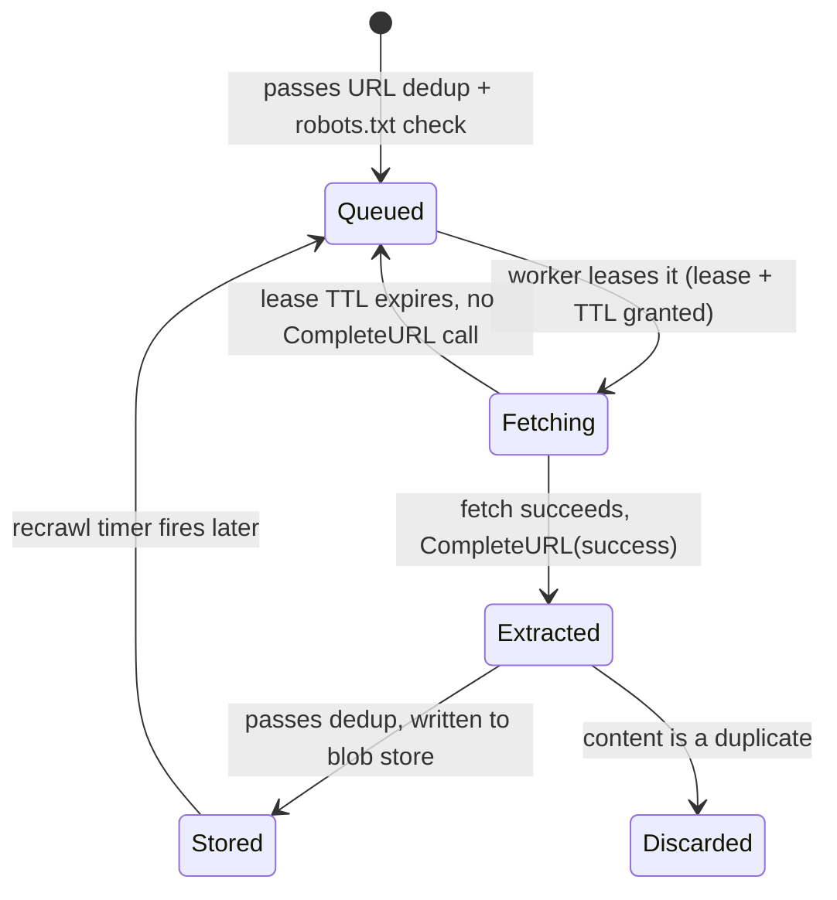

Concretely, this is a small internal API, not a public one — nobody outside ClearPath calls this crawler, so the "API" here is the contract between the frontier and the worker pool: `LeaseNextURL(worker_id)` hands out the highest-priority available URL plus a lease; `CompleteURL(lease_id, outcome, new_links[])` reports success or failure and, on success, atomically enqueues every newly-discovered link through the same URL-dedup path from Chapter 3; `RenewLease(lease_id)` lets a slow-but-alive fetch extend its window instead of getting reclaimed mid-flight.

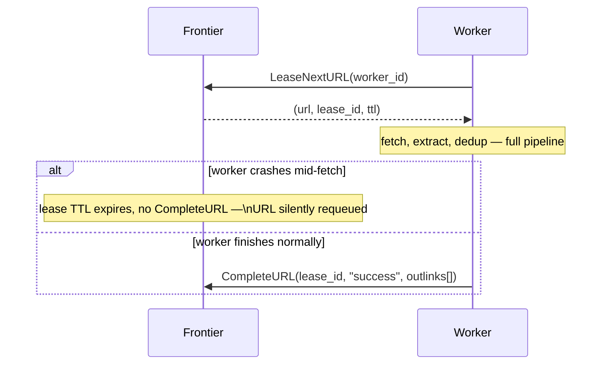

A crashed worker no longer strands a URL forever — the lease just expires and the next free worker picks it up. A bounded retry count (say, 5 attempts) stops a permanently-broken URL from being retried into infinity, same discipline Chapter 6 already applies to trap domains.

One last piece, worth naming even though it's not a technical fix: politeness on paper (`robots.txt`) was never the whole compliance story. ClearPath's checklist by this point: send a descriptive `User-Agent` with a contact URL, so a site owner who wants to complain can reach a human instead of just banning an IP range; honor page-level `<meta name="robots" content="noindex">` or `X-Robots-Tag`, a *per-page* signal that lives in the response itself, separate from the host-level `robots.txt`; and treat an unreachable `robots.txt` (timeouts, 5xx) as **disallow-all until it resolves**, never as allow-all — the cost of skipping a host briefly is far lower than the cost of an unpoliced crawl.

**How I'd say this in an interview:** "A lease is a lock with a timeout, not a permanent claim — the frontier hands one out when a worker dequeues a URL, and a crash just means the lease expires and someone else picks it up, the same way a claim ticket protects a dry cleaner from a customer who never comes back. And robots.txt compliance is table stakes, not the whole story — identifying your bot, honoring page-level noindex tags, and defaulting to disallow when robots.txt itself is unreachable are the rest of it."

---

## Where the story actually lands

```mermaid
flowchart LR
    A["Ch1: DFS, single thread\n(trap + too slow)"] -->|"fixes: order+parallelism\nbreaks: duplicate work"| B["Ch2: BFS + workers"]
    B -->|"fixes: no repeats\nbreaks: checksum store slow, near-dups"| C["Ch3+4: checksum dedup + Bloom filter + SimHash"]
    C -->|"fixes: dedup\nbreaks: one host gets hammered"| D["Ch5: robots.txt + token bucket"]
    D -->|"fixes: host abuse\nbreaks: legal-but-infinite pages"| E["Ch6: trap classification + caps"]
    E -->|"fixes: bounded traps\nbreaks: one frontier DB is a ceiling"| F["Ch7: sharded frontier (consistent hash)"]
    F -->|"fixes: contention\nbreaks: mega-domain hot spot"| G["Ch8: sub-shard + dynamic fallback"]
    G -->|"fixes: load balance\nbreaks: DNS volume throttled"| H["Ch9: self-hosted DNS cache"]
    H -->|"fixes: DNS cost\nbreaks: fixed recrawl wastes/staleness"| I["Ch10: adaptive recrawl + conditional GET"]
    I -->|"fixes: freshness cheaply\nbreaks: crashed worker strands URL"| J["Ch11: lease + CompleteURL"]
```

```mermaid
erDiagram
    URL {
        string url_id PK
        int priority
        int recrawl_frequency_hours
        string status "queued|fetching|stored|discarded"
    }
    URL_CHECKSUM { string checksum PK }
    CONTENT_CHECKSUM { string checksum PK }
    CONTENT { string blob_ref PK, string etag, datetime last_modified }
    ROBOTS_CACHE { string hostname PK, text disallow_rules, int crawl_delay_sec }
    URL ||--o{ URL_CHECKSUM : "hashes to"
    URL ||--o| CONTENT : "resolves to"
    CONTENT ||--|| CONTENT_CHECKSUM : "hashes to"
    URL }o--|| ROBOTS_CACHE : "governed by"
```

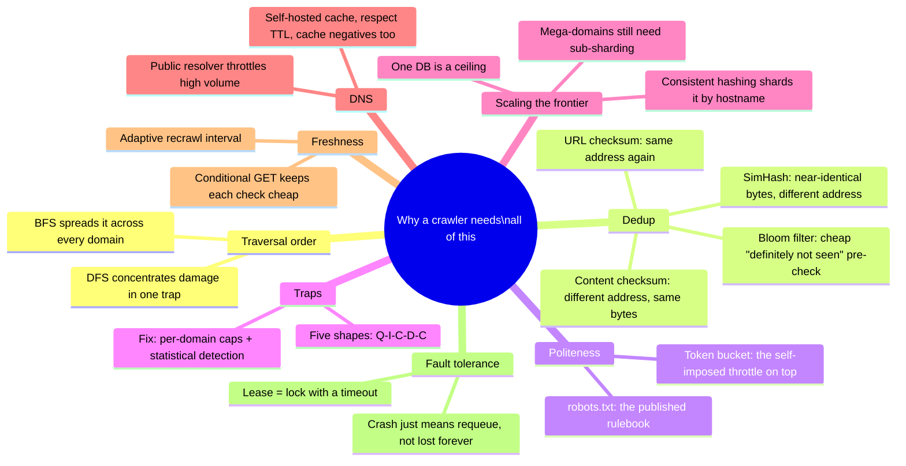

Every real production crawler sits somewhere on this chain. The skill isn't reciting all eleven chapters — it's knowing where the stated requirements say to stop. A one-domain scraper might reasonably stop around Chapter 5. A web-scale search crawler has to reach Chapter 7 through 11. If nobody's mentioned billions of pages or multiple workers, walking all the way to consistent hashing unprompted reads as padding, not depth.

---

## Grill me — adversarial follow-ups

**Q1: "Why not just add more threads to the single-threaded script instead of building a whole queue-based system?"**
More threads only buys headroom up to whatever the frontier's coordination logic can handle — and a single in-process script has no shared, durable state at all, so any two threads can still both grab the same URL. The queue isn't an optimization on top of the single-thread script, it's a completely different coordination model that a thread pool inside one process can't fake.

**Q2: "Doesn't sharding the frontier by hostname just move Chapter 1's single point of failure down to 20 smaller ones?"**
Yes, and that's a fair callout — each shard is now its own smaller point of contention rather than one giant one, which is strictly better but not "solved." The actual fix for any one shard's database dying is the same durability story any sharded system needs — replication per shard — which this design doesn't dwell on because the reference guide's own trade-off table treats checksum-store backup as a periodic-checkpoint problem, not full replication.

**Q3: "How do you detect a crawler trap without hand-written URL-pattern rules for every case you've personally seen?"**
Track statistical signals per domain instead of patterns: page-count growth rate, near-duplicate content ratio from SimHash, and URL length or parameter-count creeping upward across successive crawls. Trip a circuit breaker — stop crawling that domain further — when any signal crosses a threshold; it's the same shape as any circuit breaker anywhere else in distributed systems, and it generalizes to trap shapes nobody's seen yet.

**Q4: "Two workers could lease the same URL at the same time under a race — how do you avoid double-processing?"**
The lease mechanism makes double-leasing rare, not impossible, so the real backstop is that content-checksum dedup already makes duplicate work merely wasteful rather than incorrect — a second worker fetching the same URL just gets discarded at the dedup step. Leases are an efficiency fix, not a correctness fix; correctness comes from idempotent, dedup-checked writes.

**Q5: "Why bother with a Bloom filter if you still need the real checksum store behind it?"**
Because the Bloom filter's whole job is answering "definitely not seen" instantly, for the vast majority of lookups, without ever touching disk — it only defers to the real store on the rarer "maybe seen" case. It doesn't replace the checksum store; it protects it from being hit on every single fetch.

**Q6: "If robots.txt already lets a site set a Crawl-delay, why does the crawler need its own separate throttle on top?"**
Because a published Crawl-delay is a floor set by the site owner, and it says nothing about how that specific host is behaving *right now* — a host having a bad day can get overwhelmed even by traffic that respects its published delay. The self-imposed, TTFB-adaptive throttle can only ever be *more* conservative than the published delay, never less, precisely because the site's own number might not reflect today's reality.

**Q7: "Why treat an unreachable robots.txt as disallow-all instead of just skipping the check and crawling anyway?"**
Because the failure mode of guessing wrong runs in only one dangerous direction — crawling a host that actually wanted to disallow you is a real cost (bans, complaints, occasionally legal exposure), while skipping a host briefly until its robots.txt comes back is nearly free. When the two failure directions aren't symmetric, you default toward the cheap mistake, not the expensive one.

**Q8: "SimHash has a threshold, not an equality check — how do you pick where to draw the line?"**
You tune it against labeled examples of things you do and don't want treated as duplicates — the guide's own worked numbers use distance ≤3 out of 64 bits as a starting point, catching byline/ad-banner-only reposts while letting genuinely original articles that merely quote a paragraph through. It's a threshold you validate empirically per corpus, not a universal constant.

**Q9: "Given this whole story, if someone just says 'design a web crawler' cold, where do you actually start?"**
Ask the two questions that decide almost everything downstream: is this one domain or web-scale, and is the deliverable just crawl-and-store, or does it drift into indexing and ranking. Scope those out loud first, then walk forward only as far as the stated scale demands — BFS and basic dedup are close to a given the moment it's more than a handful of pages, but sharded frontiers, SimHash, and adaptive recrawl are things you earn by naming a specific scale or freshness requirement, not defaults you bolt on for their own sake.

---

## Cheat sheet — one line per stop on the story

- **Naive DFS crawler**: depth-first + single-threaded means one infinite page (a calendar, a redirect loop) can swallow the whole crawler, and it's mathematically too slow for web scale regardless.
- **BFS + worker pool**: canvass every neighbor before going deeper into any one — spreads a trap's damage instead of concentrating it, and divides single-worker time by however many workers you run.
- **URL + content checksum dedup**: two different repeats need two different checksums — same address again, versus different address with byte-identical content.
- **Bloom filter**: a cheap probabilistic "definitely not seen" pre-check in front of the real checksum store, so most lookups never touch disk.
- **SimHash**: catches near-duplicates exact checksums are blind to, by comparing Hamming distance between compact fingerprints instead of demanding bit-for-bit equality.
- **robots.txt + token bucket**: the published rulebook plus a self-imposed adaptive throttle on top — obeying the sign on the door doesn't mean you stop watching how the shop is actually coping.
- **Crawler trap defense**: five recognizable shapes (Q-I-C-D-C), detected by statistical signals (growth rate, near-dup ratio) rather than hand-written patterns, capped per domain.
- **Sharded frontier (consistent hashing)**: one queue+DB is a ceiling; shard by hostname, same key as domain-level worker assignment, so adding a shard only moves a small slice later.
- **Sub-sharding mega-domains**: domain-level partitioning stays the default for politeness's sake; only the rare huge domain gets split further, and dynamic per-URL assignment is the last resort.
- **Self-hosted DNS cache**: a public resolver throttles high-volume clients like an attacker; run your own cache, respect the TTL exactly, and cache negative (`NXDOMAIN`) results too.
- **Adaptive recrawl + conditional GET**: stretch the interval on pages that never change, shrink it on pages that always do, and use `If-Modified-Since`/`ETag` so a due check costs one round-trip when nothing changed.
- **Lease-based frontier**: a lease is a lock with a timeout, not a permanent claim — a crashed worker just means the URL's lease expires and someone else picks it up.
- **Legal/ethical floor**: identify your bot in the `User-Agent`, honor page-level `noindex`/`X-Robots-Tag` on top of host-level robots.txt, and default to disallow-all when robots.txt itself is unreachable.
- **The meta-lesson**: every fix in this story buys one property (order, parallelism, correctness, politeness, boundedness, horizontal scale, load balance, cheap DNS, freshness, or fault tolerance) by spending something else — say the trade in the same sentence you propose the fix.
