# Design a Web Crawler — FAANG Interview Guide

## 1. Mental Model

A web crawler is **graph traversal at planet scale, under an etiquette contract you didn't write.**

Picture a library where new books keep appearing on the shelves as you read (new links get discovered mid-crawl), some rooms are wired to loop back into themselves forever (crawler traps), and every shelf belongs to a different owner who will throw you out if you grab books too fast (politeness). Your job: read every book once, write down what's in it, and never get thrown out or trapped in a loop.

- **The graph**: pages are nodes, hyperlinks are edges. It's not just huge — it's unbounded, self-modifying while you traverse it, and contains adversarial regions that generate infinite nodes on demand.
- **The traversal**: BFS, not DFS — breadth across domains, not depth into one, because depth-first is exactly how you fall into an infinite calendar page or a cyclic redirect.
- **The contract**: every host you touch is someone else's production server. `robots.txt` is the published rulebook; politeness (rate-limiting per host, backing off on slow TTFB) is the unwritten rest of it. Violate it and you get IP-banned, or at scale, become a de facto DDoS.
- **The output isn't the crawl — it's the store.** A crawler's job ends at "content safely in blob storage, deduped, with metadata." Indexing, ranking, and search are the *next* system — don't let the interview wander into ranking algorithms.

Three concerns layered on top of a queue: **what to crawl next** (scheduling/priority), **how to avoid doing it twice** (dedup), and **how to avoid doing it forever** (trap detection + politeness). Everything else — DNS, HTTP fetch, storage — is plumbing you already know from other building blocks.

## 2. Interview Playbook

Talk through the topic in this order. Don't jump to crawler traps before you've earned the high-level design.

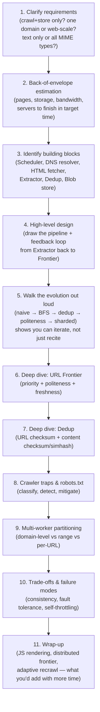

**How to identify this topic in an interview**: the prompt says "design a web crawler," "design the crawling layer for a search engine," "design a service that discovers and archives millions of URLs," or a system needs to "systematically visit and rate-limit access to external hosts." Any variant of "we must not overload the sites we're fetching from" is your cue to bring up politeness and `robots.txt` even if the interviewer didn't ask.

## 3. Requirements Clarification

### Functional
- **Crawling**: traverse the WWW starting from a pool of seed URLs, following extracted links.
- **Storing**: persist fetched content (and metadata) in a blob store, ready for downstream indexing.
- **Scheduling**: recrawl periodically to keep the store fresh; support both default recrawl cadence and ad-hoc/admin-triggered recrawls.

### Non-functional
| Requirement | What it means here |
|---|---|
| **Scalability** | Distributed, multithreaded — must fetch hundreds of millions to billions of documents; horizontal scale-out of every component. |
| **Extensibility** | Pluggable protocols (HTTP today, FTP tomorrow) and pluggable content types (text now, image/video later) without redesigning the pipeline. |
| **Consistency** | Multiple concurrent workers must agree on what's already been crawled/stored — no double-processing the same URL or document. |
| **Performance** | Self-throttling per domain (time-boxed or count-boxed), high URLs/sec throughput, adapt to slow hosts instead of timing out repeatedly. |

**Explicitly out of scope** (say this out loud — it shows scoping discipline): indexing, ranking/PageRank, query serving, search UI, and crawling behind authentication/paywalls. This chapter stops at "content is stored and dedup'd."

## 4. Capacity Estimation

### Formula chain (reusable for any crawl-scale estimate)

```
Total storage        = num_pages × (avg_content_size + avg_metadata_size)
Single-worker time   = num_pages × avg_fetch_latency
Servers needed       = single_worker_time / target_completion_time
Total bandwidth       = total_storage / target_completion_time (in seconds)
Per-server bandwidth = total_bandwidth / servers_needed
Frontier pressure     = num_pages × avg_outlinks_per_page   (raw discovered URLs
                         BEFORE dedup — this is why URL dedup is load-bearing,
                         not optional)
```

### Worked example

Assumptions (state these out loud as assumptions, not facts): 5 billion web pages, text content ≈ 2070 KB/page, metadata ≈ 500 B/page, target = crawl the whole set in **1 day**, average HTTP round-trip ≈ 60 ms.

```
Total storage  = 5B × (2070 KB + 500 B) ≈ 10.35 PB

Single-worker traversal time = 5B × 60ms = 0.3B seconds ≈ 9.5 years

Servers needed for 1-day completion:
  days for 1 server = 9.5 years × 365 ≈ 3,468 days
  → need ≈ 3,468 servers (1 worker/server) running in parallel for 1 day

Total bandwidth  = 10.35 PB / 86,400 sec ≈ 120 GB/sec ≈ 960 Gb/sec
Per-server bandwidth = 960 Gb/sec / 3,468 ≈ 277 Mb/sec per server

Frontier pressure (say avg 50 outlinks/page):
  5B × 50 = 250B raw URL sightings before dedup → converge to ~5B unique
  after URL-level dedup. This 50x amplification is *why* the URL frontier
  needs a dedicated checksum store, not an afterthought.
```

**Reality check** (say this if you used the course's numbers — interviewers respect calibration): 2070 KB of *text* per page is high; real-world average HTML+text is closer to tens of KB, with the multi-MB figure only true if you count embedded images/video. State your assumption, then redo the chain if the interviewer changes an input — that's the actual skill being tested, not the memorized final number.

### Numbers worth memorizing

| Quantity | Typical value | Why it matters |
|---|---|---|
| Avg HTTP fetch round-trip | 50–100 ms | Drives single-worker throughput; justifies horizontal scale-out |
| DNS lookup (cold) | 20–200 ms | Why the DNS resolver needs its own cache |
| DNS lookup (cached) | <1 ms | 100–1000x speedup — cache within TTL, not longer |
| Politeness delay per host | 1 request per few sec (adaptive; historically ~1/sec for Google) | Prevents your crawler from DDoS-ing a small site |
| Checksum compute (MD5/SHA-1) | GB/s on commodity CPU | Dedup checksum cost is negligible vs. network fetch cost |
| Blob store throughput | ~500 req/sec per blob (course figure) | Sizes how many blobs you shard content across |
| Common Crawl monthly dataset | ~3–5B pages, ~250 TB/month | Sanity-check for "is 5B pages/day realistic" — no, that's roughly a *month* of Common Crawl's entire output |
| Visible web size (rough order) | Low tens of billions of indexed pages (Google) | Your "5B pages" assumption is a fraction of the real web — say so |

## 5. High-Level Design

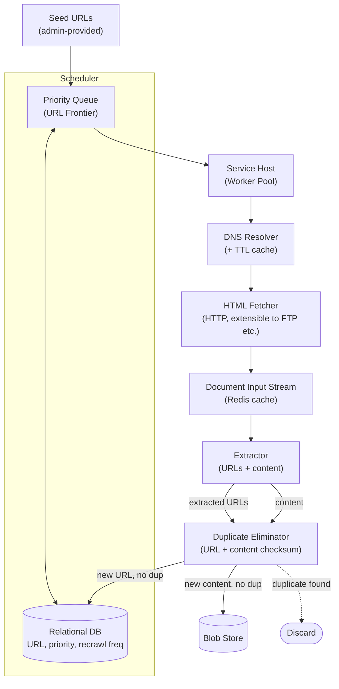

**Components at a glance**:

| Component | Job |
|---|---|
| **Scheduler** (priority queue + relational DB) | Holds every known URL with its priority and recrawl frequency; feeds the frontier. |
| **DNS resolver** | Hostname → IP, with a TTL-bounded cache (DNS lookups are slow; don't repeat them). |
| **HTML fetcher** | Opens the connection, speaks the protocol (HTTP today), downloads bytes. |
| **Service host / worker** | The brain: dequeues from the frontier, drives DNS → fetch → extract → dedup → store for one URL, then loops. |
| **Extractor** | Pulls URLs and content out of the fetched document. |
| **Duplicate eliminator** | Checksums URLs and content against existing checksum stores; discards dupes. |
| **Blob store** | Durable, large-object storage for crawled content. |

## 6. Design Evolution: From Naive to Production

This is the narrative to actually speak out loud in an interview — start simple, hit a wall, fix it, repeat. It's more memorable than reciting the final architecture cold, and it's literally what the whiteboard portion of the interview rewards.

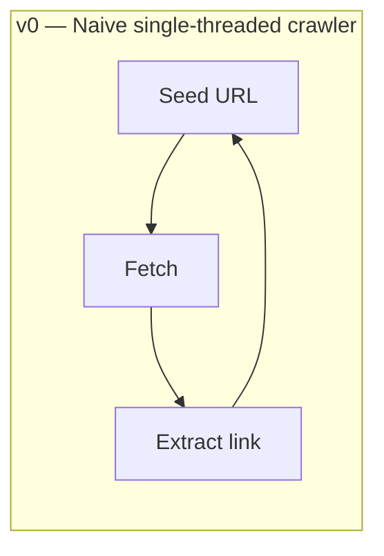
**v0 problem**: depth-first, single-threaded, no dedup. Falls into the first cyclic-redirect or calendar trap it meets and never returns; would take 9.5 years to cover 5B pages (§4).

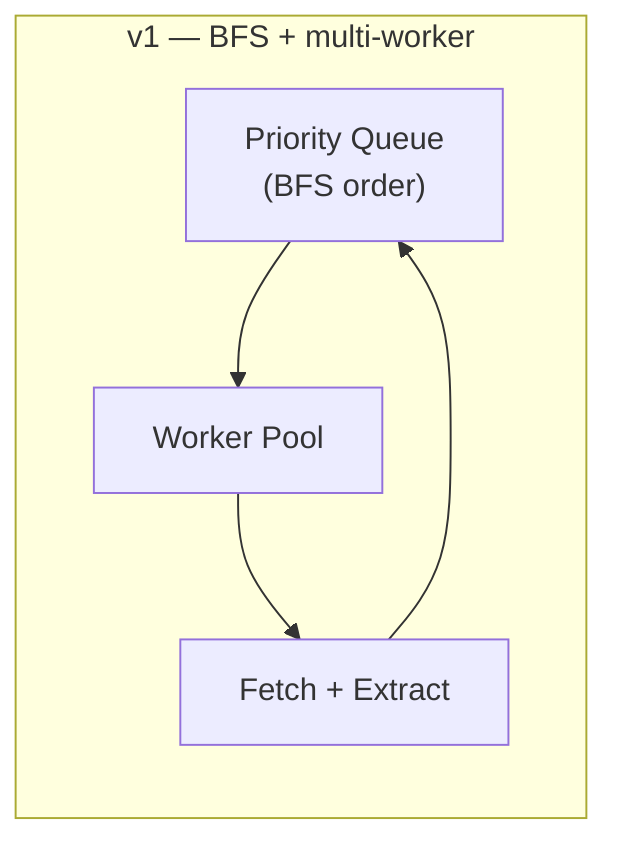
**v1 fix**: BFS queue instead of following the first link recursively; N workers pull from the shared queue in parallel → solves the *time* problem (§4's 3,468-server math).
**v1 problem**: the same URL (or the same content under two URLs) gets enqueued repeatedly — no dedup — wasting fetches and storage.

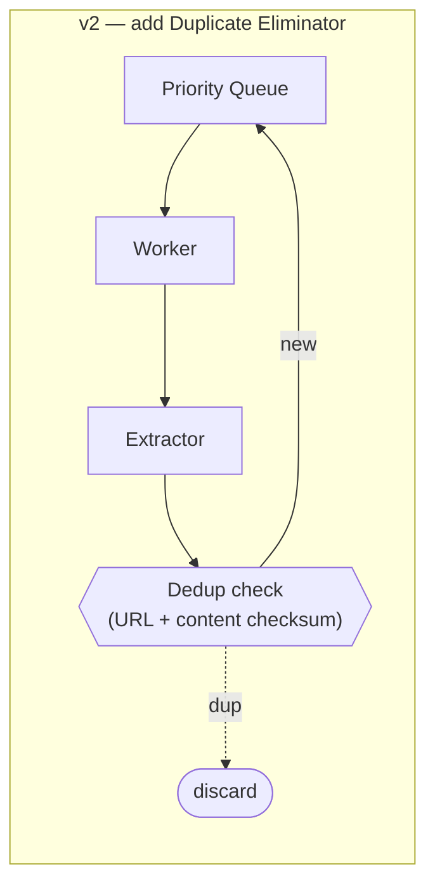
**v2 fix**: checksum URLs and content before re-enqueuing/storing (§9) → solves the *duplicate work* problem.
**v2 problem**: nothing stops the crawler hammering one slow or adversarial domain — no politeness, no trap defense. A single misbehaving site can starve every worker.

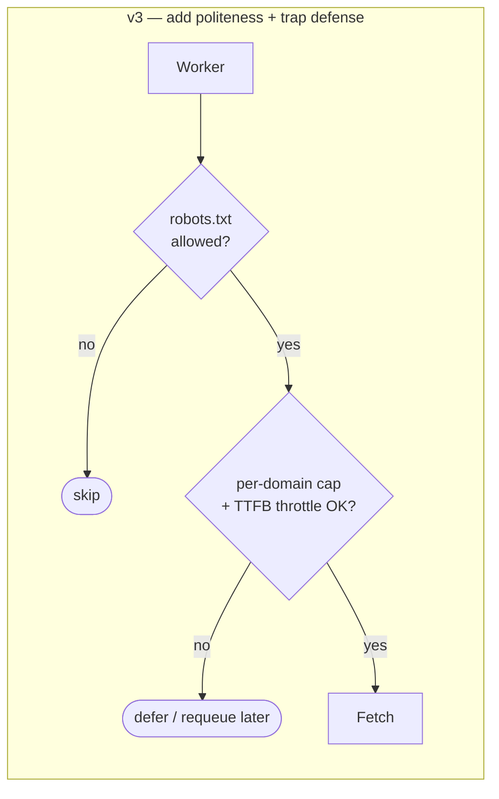
**v3 fix**: `robots.txt` compliance + per-domain page/time caps + TTFB-adaptive delay (§10) → solves the *politeness / trap* problem.
**v3 problem**: a single frontier (one priority queue + one DB) is now the bottleneck — every worker contends on it, and it's a single point of failure at web scale.

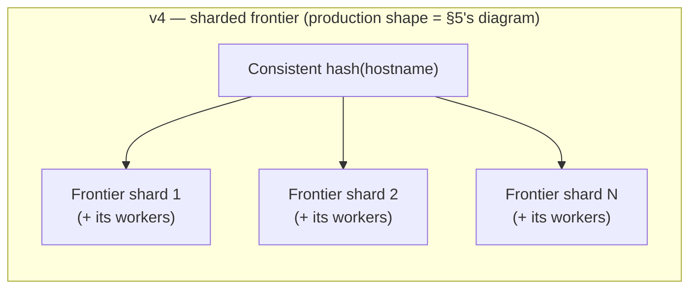
**v4 fix**: shard the frontier itself by consistent-hashing the hostname, same partitioning key as domain-level worker assignment (§11) → one domain's queue never blocks another domain's throughput, and shards can be added/removed without a full reshuffle. **This is the design in §5.**

## 7. Disambiguation: BFS vs. DFS Traversal

| | BFS (chosen) | DFS |
|---|---|---|
| Order | Explore all neighbors before going deeper | Follow one path as deep as possible first |
| Behavior on a trap | Trap contributes a bounded slice of the frontier; other domains still get crawled | Can consume the entire worker on one infinite path before ever backtracking |
| Frontier shape | Wide, shallow — natural fit for a shared priority queue | Narrow, deep — needs a call-stack-like structure, awkward to distribute |
| Domain coverage | Even — every seed domain makes progress each round | Uneven — first-explored domain can dominate |

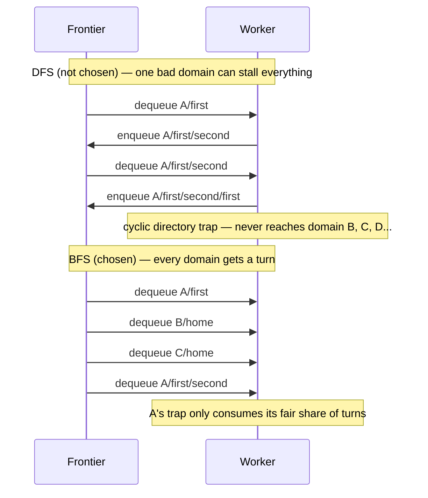

**Memory hook**: *BFS spreads the damage; DFS concentrates it.* Any traversal question in this design comes back to that one sentence.

## 8. Deep Dive: URL Frontier (Scheduler)

The frontier is two things wearing one name: a **priority queue** (what to crawl *next*) and a **relational store** (what's known about *every* URL ever seen, including ones not currently queued).

- **Inputs**: admin-seeded URLs + runtime admin-added URLs + the extractor's continuously-discovered URLs.
- **Priority** and **recrawl frequency** are the two knobs per URL.

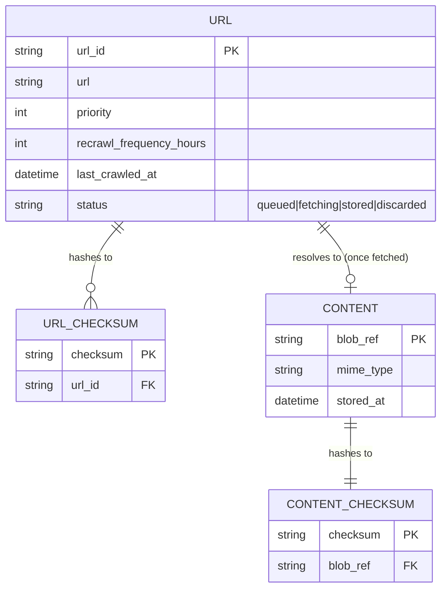

Concrete example of the priority/frequency knob in action:

```mermaid
quadrantChart
    title Where different URL types land
    x-axis Low priority --> High priority
    y-axis Low recrawl frequency --> High recrawl frequency
    quadrant-1 Crawl often, high value
    quadrant-2 Rarely worth it (uncommon)
    quadrant-3 Crawl rarely, low value
    quadrant-4 Stable but important
    News homepage: [0.9, 0.9]
    Sports live-score page: [0.85, 0.95]
    Static "About us" page: [0.2, 0.05]
    Government filing (static): [0.6, 0.05]
    Abandoned personal blog: [0.1, 0.05]
```

Every URL falls on this map: **news homepage** → high priority, hourly recrawl; **government filing** → moderate priority (authoritative source) but recrawled rarely because it never changes; **abandoned blog** → low priority, low frequency, but still worth one visit for coverage.

### URL Lifecycle

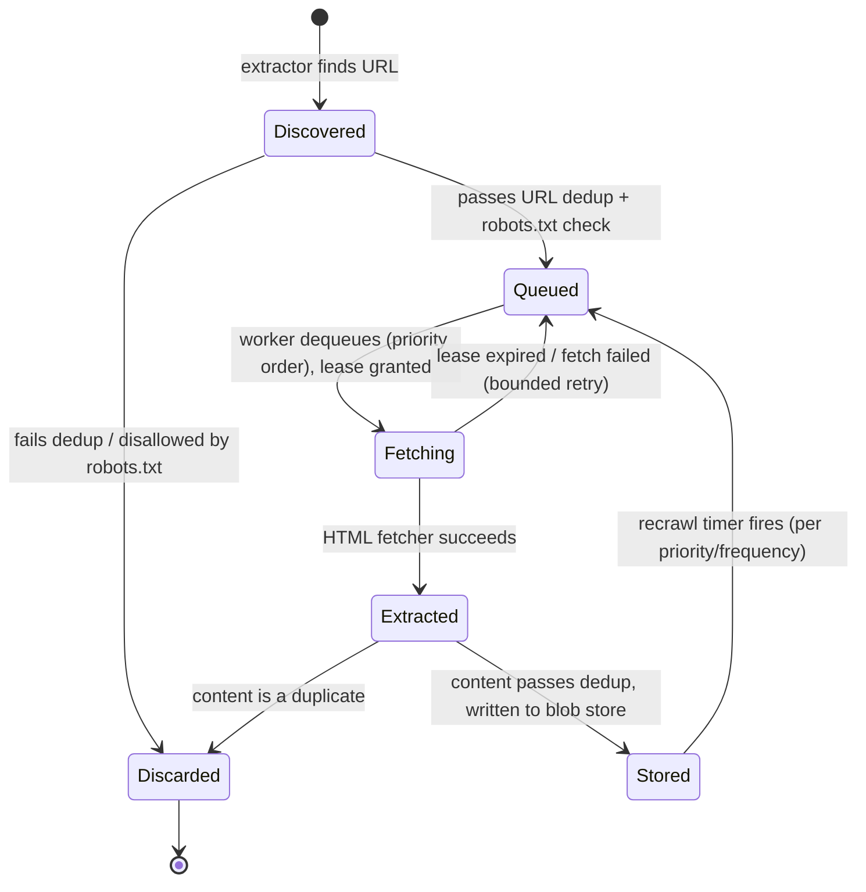

**BFS, not DFS**: dequeue breadth-first (§7) so no single domain can monopolize a worker indefinitely.

## 9. Deep Dive: Duplicate Elimination

Two independent dedup passes, because two different things repeat on the web:

| | URL-level dedup | Content-level dedup |
|---|---|---|
| Checksums | The *canonicalized* URL string | The *fetched content* bytes |
| Catches | "Same address, seen before" | "Different address, identical page" |
| Concrete example | `example.com/page` vs. `example.com/page/` (canonicalize trailing slash) | `example.com/page?sessionid=abc123` and `example.com/page?sessionid=xyz789` — different URL every request, identical content — a session-ID "soft trap" that only content checksum catches |
| Fails to catch | Near-duplicates (same article, different ad banner) | Same as URL-dedup's blind spot — exact checksums miss near-duplicates too |
| Escalation if interviewer pushes | Canonicalization rules (strip tracking params, normalize case/slashes) | SimHash/MinHash for fuzzy/near-duplicate matching |

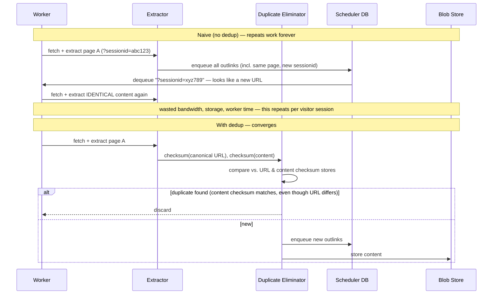

**One-byte-changed content still checksums differently** — expected and fine; exact checksums (MD5/SHA-1) only catch *exact* duplicates, by design.

## 10. Deep Dive: Politeness, robots.txt & Rate Limiting

Politeness has two layers: a **published rulebook** (`robots.txt`) the crawler must fetch and obey, and an **adaptive throttle** the crawler enforces on itself regardless of what the rulebook says.

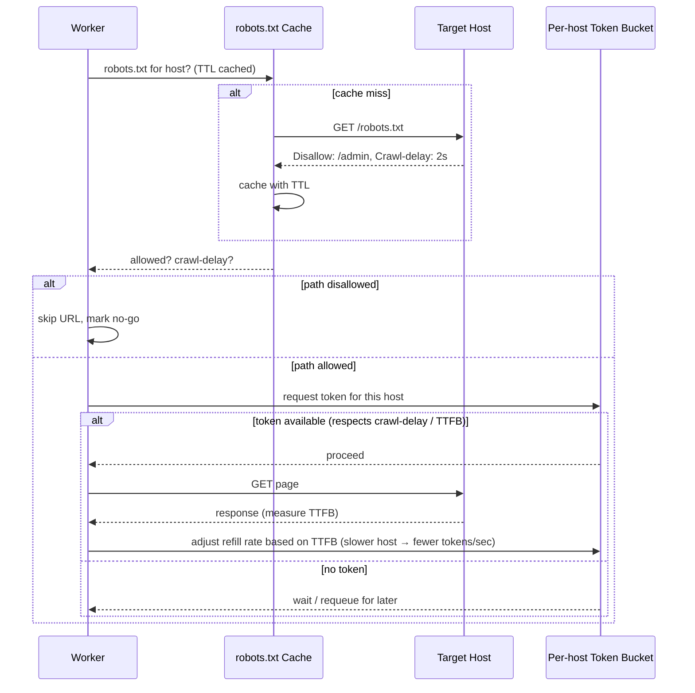

This is the same **token-bucket rate limiter** pattern as the [Rate Limiter chapter](../24.%20Design%20a%20Rate%20Limiter/) — just keyed **per destination host** instead of per API client. The crawler is a rate limiter's client here, not its owner.

- `robots.txt` is fetched once per host, cached within a TTL, and re-checked periodically (sites update their rules).
- **Crawl-delay** (if published) sets a floor; the crawler's own TTFB-adaptive logic can be *more* conservative than the published delay, never less.
- `robots.txt` stops you from touching *disallowed* pages. It does **not** stop you from wandering into an *allowed* infinite calendar page — that's the trap defense in §12, a separate mechanism.

## 11. Multi-Worker Partitioning

| Strategy | How it works | Best for | Watch out for |
|---|---|---|---|
| **Domain-level** | Hash hostname → worker; that worker owns the whole domain | Reverse URL indexing, avoiding redundant same-domain crawls, natural fit with per-host politeness | Hot domains (huge sites) overload one worker — needs sub-sharding |
| **Range division** | Hash a URL range → worker | Even distribution when URLs are roughly uniform | A "hot range" (e.g., a trap generating URLs in one range) still concentrates load |
| **Per-URL (dynamic)** | Any free worker takes any queued URL; newly found URLs go back into the shared queue | Best load balancing under uneven page sizes/latencies | Needs a shared, contention-tolerant queue; loses the "one worker per domain" locality that simplifies politeness |

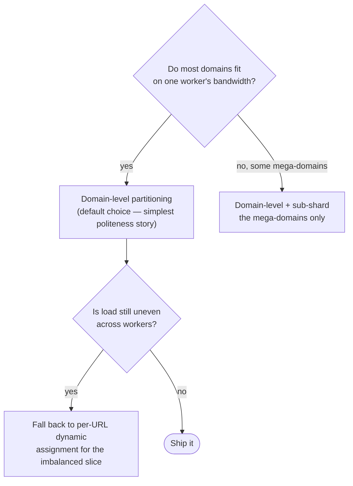

**Disambiguation — the thing candidates blur together**: partitioning strategy (*which worker gets this URL*) is orthogonal to **priority** (*which URL gets crawled first within that worker's slice*). You need both axes: domain-level partitioning solves politeness/locality; the priority queue within each partition solves freshness/importance ordering.

## 12. Crawler Traps

A crawler trap is any URL structure that causes **indefinite resource exhaustion** — the crawler equivalent of an infinite loop.

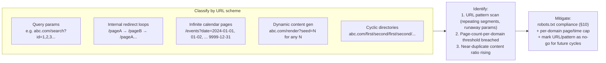

**Mnemonic** for the five classic trap shapes: **Q-I-C-D-C** — *Query params, Internal loops, Calendar pages, Dynamic gen, Cyclic dirs*. If you can name all five unprompted, you've signaled you've actually thought about adversarial inputs, not just the happy path.

Real anecdote worth citing: e-commerce "faceted navigation" (filter by color × size × brand × price-range, all as combinable query params) is one of the most common *unintentional* real-world crawler traps — it can generate literally billions of valid-looking, mostly-duplicate URLs from one product category page. This is exactly the §9 session-ID pattern generalized: different URL, same or near-identical content.

## 13. Design Decisions & Trade-offs

| Decision | Choice made | Trade-off accepted |
|---|---|---|
| Traversal order | BFS | Breadth safety over depth-first efficiency on well-structured sites; BFS needs more frontier memory in flight |
| Dedup granularity | URL checksum *and* content checksum (two stores) | Extra storage + compute per page vs. catching both duplicate-address and duplicate-content cases |
| Partitioning | Domain-level (default) | Simplifies politeness/locality; risks hot-domain imbalance, needs manual sub-sharding for mega-sites |
| DNS resolution | Custom resolver + TTL cache | Fast repeat lookups vs. staleness risk if you cache past the TTL |
| Content cache (DIS) | Redis | Fast shared access across pipeline stages vs. another moving part / cache-invalidation surface |
| Consistency mechanism | Checksum comparison + periodic checkpoint to S3/offline disk | Enough consistency for dedup correctness; not full ACID — acceptable because crawl data is append-mostly and idempotent to reprocess |
| Extensibility axis | Modular HTML fetcher (protocol) + modular extractor (MIME type) | Clean plug points vs. more abstraction layers than a single-protocol crawler would need |
| Politeness enforcement | Per-host token bucket, TTFB-adaptive | Slower crawl of struggling hosts vs. simplicity of a fixed global rate |

## 14. Bottlenecks & Failure Modes

| Failure mode | Cause | Mitigation |
|---|---|---|
| **Crawler trap resource exhaustion** | Adversarial or poorly-structured site generates unbounded URLs | Per-domain page/time caps, URL pattern filters, "no-go" marking (§12) |
| **Slow/unresponsive host** | High TTFB, timeouts | TTFB-adaptive throttling; bounded retries; don't let one slow host stall a worker pool |
| **Hot domain overload** | Domain-level partitioning sends a mega-site to one worker | Sub-shard within a domain, or fall back to per-URL dynamic assignment (§11's decision tree) |
| **Duplicate storage bloat** | Dedup skipped or checksum store lost | Two-stage checksum dedup (§9); periodic backup of checksum stores, same as content |
| **Stale content** | Recrawl frequency too low for a fast-changing page | Priority + recrawl-frequency tuning per URL class (§8's quadrant) |
| **Worker crash mid-fetch** | Any process failure | URL held with a lease/timeout in the frontier (§8's lifecycle); requeue on lease expiry |
| **DNS cache staleness** | Cached IP past a host's actual DNS change, but within your TTL | Respect TTL strictly; never over-cache past it |
| **Frontier as single point of contention** | One shared queue+DB under web-scale write load | Shard the frontier by hostname, same as worker partitioning (§6's v3→v4 evolution) |

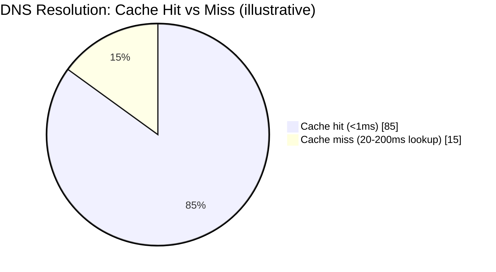
*A crawler re-visiting frontier domains repeatedly should see a high cache-hit rate — if it doesn't, the TTL policy or cache size is wrong.*

## 15. Common Interview Follow-Up Questions

**Q: How do you make the URL frontier itself horizontally scalable, not just the worker pool?**
Shard the frontier by consistent-hashing the hostname → frontier shard, the same key used for domain-level worker partitioning, so a shard and its owning workers co-locate. Adding/removing a shard uses consistent hashing to minimize reshuffling — this is exactly §6's v3→v4 step.

**Q: How would you crawl JavaScript-rendered single-page apps?**
Add a headless-browser rendering path (e.g., headless Chromium) as an alternate fetch mode, selected when a raw-HTML fetch yields near-empty text (a cheap heuristic). It's orders of magnitude more expensive per page (seconds vs. milliseconds), so gate it — don't render everything by default.

**Q: How do you decide crawl priority beyond a manually assigned number?**
Blend signals: inbound link count (PageRank-like authority), historical change frequency, sitemap.xml hints, and content-type freshness requirements (news vs. static). Feed the blended score into the priority queue key — this is what §8's quadrant chart is approximating by hand.

**Q: How do you detect a crawler trap without hand-written URL-pattern rules?**
Track statistical signals per domain: page-count growth rate, near-duplicate content ratio (via SimHash), and URL length/parameter-count creeping upward over successive crawls. Trip a circuit breaker — stop crawling that domain further — when any signal crosses a threshold, the same shape as a circuit breaker anywhere else in distributed systems.

**Q: Two workers could end up fetching the same URL concurrently — how do you avoid the race?**
Content-checksum dedup after the fact makes duplicate work merely wasteful, not incorrect (idempotent). For efficiency, hand out a short lease per URL when dequeued (§8's lifecycle) so it isn't dequeued twice while in flight; lease expiry (worker crash) requeues it.

**Q: How do you keep content fresh without recrawling everything constantly?**
Adaptive recrawl frequency: track how often a URL's content checksum actually *changes* between recrawls. Pages that rarely change get their interval stretched; pages that always change get it shortened. This decouples crawl budget from a fixed wall-clock schedule.

**Q: What happens when a worker crashes mid-fetch?**
The frontier's lease (§8) expires without a completion signal, and the URL is requeued automatically. A bounded retry count prevents infinite requeue on a URL that's permanently broken (dead host, malformed page).

**Q: How is this different from crawling content behind a login or paywall?**
Flag it as out of scope rather than solving it live — it changes the trust model entirely (you're now crawling *with* credentials), raising authorization and data-handling questions this design deliberately doesn't address (§3).

## 16. Real-World References

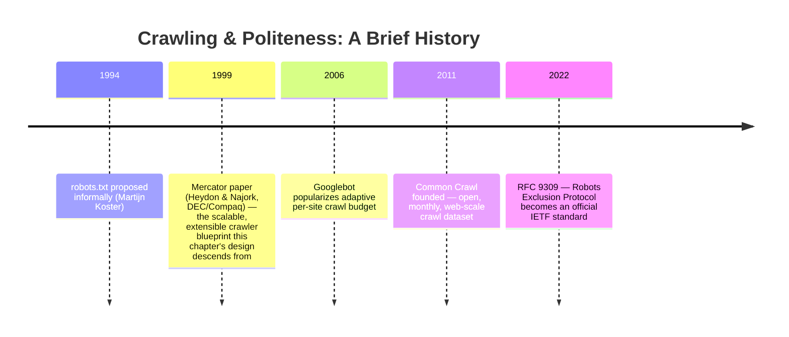

| System | Notable detail |
|---|---|
| **Mercator** (Compaq/DEC, Heydon & Najork, 1999) | The foundational scalable/extensible crawler paper — per-host politeness queues, pluggable protocol modules. This chapter's design is a direct descendant. |
| **Googlebot** | Renders JavaScript via headless Chromium; allocates a **crawl budget** per site based on health/size/authority signals; strictly obeys `robots.txt` and `Crawl-delay`/sitemap hints. |
| **Apache Nutch** | Open-source, Hadoop/MapReduce-based large-scale crawler — fetch/parse/dedup as batch jobs over HDFS. |
| **Heritrix** (Internet Archive) | Open-source archival crawler behind the Wayback Machine; configurable scope and politeness rules, BDB-backed frontier. |
| **Common Crawl** | Non-profit, publishes an open ~3–5 billion page, ~250 TB dataset *monthly* on AWS — a good sanity-check scale reference ("we want 5B pages/day" is ~30x Common Crawl's monthly throughput; say so if asked to defend the number). |
| **Scrapy / StormCrawler** | Smaller-scale (single-org) and streaming (Storm/Kafka-based) crawler frameworks — useful if the interviewer narrows scope to "crawl one site family," not the whole web. |
| **RFC 9309** (2022) | The Robots Exclusion Protocol became an official IETF standard, formalizing what had been informal convention since 1994. |

## Golden Rules

- **Politeness beats throughput.** A faster crawler that gets IP-banned crawls nothing. Rate-limit per host before optimizing per-worker speed.
- **`robots.txt` is a floor, not a shield.** It stops disallowed pages; it does nothing against accidental infinite URL spaces — that's the crawler's own job.
- **BFS spreads the damage; DFS concentrates it.** Always traverse breadth-first on an unbounded, possibly-adversarial graph.
- **Dedup twice: URL and content.** Same address seen again, and different address with identical content, are different bugs needing different checksums.
- **Decouple discovery from freshness.** Crawling a new URL and recrawling a known one are the same mechanism running at different frequencies — don't build two pipelines.
- **Store once, process many.** The blob store is the handoff to indexing/ranking — never make the crawler re-fetch data another stage could just read.
- **Shard the frontier the same way you shard the workers.** One partitioning key (hostname) should drive both, or politeness and load-balancing fight each other.

## Master Cheat Sheet

**Components**: Scheduler (priority queue + DB) → DNS resolver (cached) → HTML fetcher → Extractor → Duplicate eliminator (URL + content checksum) → Blob store. Loop: extractor's new URLs feed back into the scheduler.

**Evolution story**: naive DFS single-thread → BFS + multi-worker (fixes time) → dedup (fixes wasted work) → politeness + trap caps (fixes host abuse) → sharded frontier by hostname (fixes contention).

**Formula chain**: `storage = pages × (content + metadata)` · `single-worker time = pages × fetch latency` · `servers = single-worker time / target time` · `bandwidth = storage / target time (sec)`.

**Worked numbers** (5B pages, 2070KB/page, 60ms fetch, 1-day target): 10.35 PB storage → 9.5 years single-worker → 3,468 servers → 960 Gb/sec total, ≈277 Mb/sec/server.

**Crawler trap mnemonic**: Q-I-C-D-C — Query params, Internal loops, Calendar pages, Dynamic gen, Cyclic dirs. Real-world #1 cause: faceted e-commerce navigation.

**Dedup split**: URL checksum catches same-address-again; content checksum catches different-address-same-content (session IDs, mirrors) — need both.

**Partitioning strategies**: Domain-level (politeness-friendly, default) · Range division (even but hot-range risk) · Per-URL dynamic (best balance, needs shared queue) — pick via §11's decision tree.

**Politeness**: per-host token bucket + TTFB-adaptive refill, same primitive as the Rate Limiter chapter, keyed by destination host instead of client.

**Non-functional hooks**: Scalability → horizontal add/remove + consistent hashing on hostname (frontier *and* workers). Extensibility → modular fetcher (protocol) + modular extractor (MIME). Consistency → checksum dedup + periodic S3 checkpoint. Performance → self-throttle by TTFB, blob store ~500 req/s.

**Standards to name-drop**: Robots Exclusion Protocol / RFC 9309 (2022), Mercator (1999) as the architectural ancestor.

**Scope discipline**: crawler = crawl + dedup + store. Indexing/ranking/search and authenticated crawling are the next system — don't drift into them uninvited.
