# Design WhatsApp — The Story (narrative edition)

> **What this file is.** The reference file, `36-WhatsApp-FAANG-Guide.md`, is the one to recite from — requirements, capacity math, the architecture-evolution stages, all seven deep dives, every cheat sheet. This file is a second way in: the same material as one continuous story, told in plain language. Engineers at a company keep hitting a wall, patch it, and the patch itself creates the next wall — until we land on the exact same design the reference file documents. The company, **Wisp** (a small chat app), is fictional. But every wall it hits, and every fix it reaches for, is something a real, named system actually does: WhatsApp's own documented history running on **Erlang/OTP and FreeBSD**, tuned per **Robert Graham's "C10M" talk**, using **Mnesia** as the offline mailbox, adopting the **Signal Protocol** (X3DH + Double Ratchet) for end-to-end encryption in 2016, and shipping **multi-device** support in 2021. I'll say clearly, every time, whether something is a documented fact or just a reasonable stand-in number, with an inline `[illustrative]` tag.

**The one sentence to hold onto:** designing a real-time chat platform is not a database problem, it's a *"where is this person right now, and how do I get one message to them, in order, without losing it"* problem — everything else (Erlang, Redis, Kafka, Signal Protocol) exists only to answer that one question, cheaply, billions of times a second.

**The trigger phrases** for this whole topic: *"design WhatsApp / Messenger / a real-time chat app,"* *"support millions of concurrent connections,"* *"messages should show up instantly,"* *"support offline users,"* *"delivery and read receipts."* Keep this in your head as you read: **presence (is the recipient attached to a server right now), routing (which server, exactly), and a mailbox (if not, hold it until they are)** — three ideas, and every chapter below is just one of those three ideas getting harder in a small, honest step.

---

## Chapter 1 — The mailbox you had to walk to check every three seconds

It's 2014. Wisp is a two-person startup with about 5,000 users. The app works the simplest way anyone would build it on a whiteboard: every client sends `GET /messages` every 3 seconds and asks "anything new for me?" At 5,000 users that's roughly `5,000 / 3 ≈ 1,667` requests/sec — trivial for one server.

Wisp gets picked up by a tech blog. Registered users climb to 200,000. The polling load climbs with it: `200,000 / 3 ≈ 66,667` requests/sec, almost all of which answer "no." The single app server, benchmarked at a comfortable **~10,000 requests/sec** `[illustrative — a stand-in for "one modest box's ceiling"]`, is now asked for **6.6× its capacity**. Requests start queuing, then timing out — and this is *before* counting a second, separate problem: even when the server has zero load, a message sent one second after someone's last poll still has to wait up to **3 seconds** before their next poll picks it up. "Real-time chat" that's reliably 1–3 seconds late doesn't feel real-time at all.

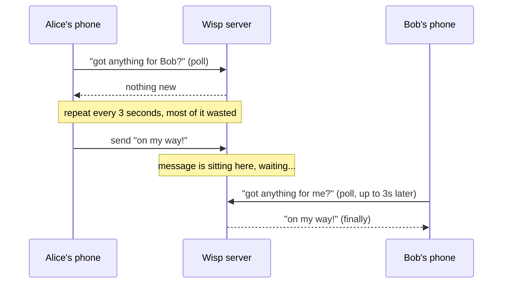

The obvious next question: *why not just poll more often, like every 500ms?* Because that doesn't fix anything — it multiplies the wasted-request problem by 6× while only shaving the delay down, not removing it. Polling has a dial with exactly two settings, both bad: poll rarely and be slow, or poll often and drown the server in "no" answers.

**The fix, and the analogy for the rest of this story:** stop making the client walk over and check the mailbox every few seconds — instead, open one **phone line and just leave it connected**. This is a **WebSocket**: one persistent, full-duplex TCP connection, opened once, that the server can write to *whenever it wants*, with no re-asking. Call this the **Open Line** for the rest of this story — every later idea that's some flavor of "keep a connection alive and know who's on it" is a variation on this same phone line.

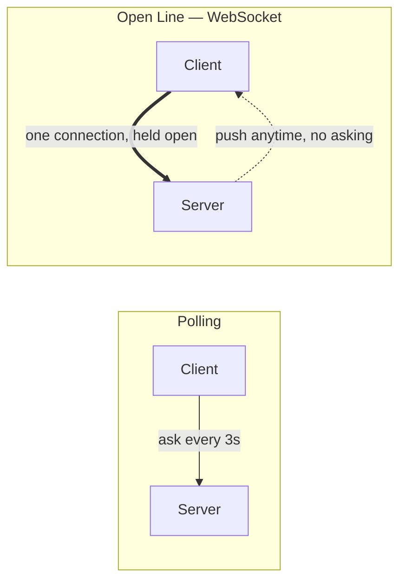

**New problem, immediately:** the Open Line removes the polling waste and the 3-second lag. But now the server has to hold every single one of those connections open, all the time, on one box — and "hold a connection open" is not free. Wisp is about to find out exactly how not-free it is.

**How I'd say this in an interview:** "Polling wastes most of its requests answering 'no,' and it bakes in latency by design — the client only finds out about a new message on its next scheduled ask. A persistent connection like a WebSocket removes both problems at once: the server pushes the moment it has something, and there's no repeated handshake overhead. The catch is that now the server has to hold a lot of open sockets, which is a completely different scaling problem than serving stateless HTTP requests."

---

## Chapter 2 — The receptionist standing in every room at once

Wisp's naive WebSocket server spins up **one OS thread per connection** — the obvious first implementation. Each thread costs roughly **1–2 MB of stack memory** `[illustrative]` plus a slot in the kernel's scheduler. Wisp's growth pushes concurrent connections toward 60,000 (30% of the 200,000 registered users holding a socket at once — already a meaningfully large slice). But the server falls over long before that: at around **9,500 concurrent connections**, CPU usage flatlines at 100% and actual message throughput *drops*, even though the box is objectively lightly loaded in terms of real work. Almost all of that CPU time is going to the kernel switching between thousands of mostly-idle threads, not to sending or receiving a single byte of chat.

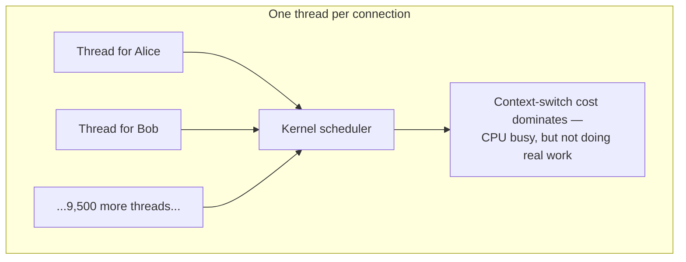

The obvious question: *can't we just add more RAM and more threads?* Only a little — the problem isn't running out of memory, it's that kernel scheduling overhead grows faster than linear as thread count grows. Past a certain point, the CPU spends nearly all its time deciding whose turn it is, not doing anyone's turn. This is the classic **C10K wall** every networked system hits with this model, and Wisp just walked straight into it.

**The fix:** stop giving every connection its own OS thread that just sits there waiting. Use **event-driven I/O** (`epoll`/`kqueue`) so one thread can watch tens of thousands of sockets at once and only wake up for the ones that actually have data — and make each connection's own state as cheap as possible. This is exactly what WhatsApp's real backend does: it runs on **Erlang/OTP**, where a connection is a lightweight Erlang *process* costing a few **kilobytes**, not a megabytes-heavy OS thread, all multiplexed by the BEAM VM's scheduler onto a handful of real kernel threads — and the whole stack sits on a **FreeBSD kernel tuned along the lines of Robert Graham's "C10M: Defending the Internet at Scale" talk**: file-descriptor limits raised far past OS defaults, packet handling pushed toward userspace, the TCP stack tuned for many idle-mostly, long-lived sockets instead of many short-lived ones.

**The analogy:** instead of stationing a full-time receptionist inside every single hotel room just in case the guest needs something (the thread-per-connection model), put **one receptionist at a desk watching a board of little lights, one per room** — and they only walk over to the room whose light just blinked. One person, thousands of rooms, almost no wasted motion. Call this the **Light-Board Desk**.

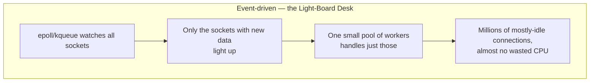

With this rework, Wisp's box comfortably holds **hundreds of thousands** of connections, and the same tuning ideas — pushed to their real historical extreme — are exactly how WhatsApp's actual servers held **1–2 million concurrent connections per physical box** (2012-era FreeBSD + Erlang, publicly documented, and a large part of why WhatsApp famously ran on a tiny engineering team relative to its user count: ~50 engineers serving 900M+ users circa 2015).

**New problem:** even a beautifully tuned box has a ceiling — call it 1 million connections. Wisp keeps growing: registered users hit 20 million, and at a 30% concurrency ratio that's **6 million** connections needed at once, six times what one box, however well-tuned, can hold. One box was never going to be the final answer — it just bought a lot of headroom before the *next* wall, which is horizontal scale.

**How I'd say this in an interview:** "The naive one-thread-per-connection model hits a wall around 10K connections purely from kernel scheduling overhead — it's an OS problem, not a database or algorithm problem. The fix is event-driven I/O with cheap per-connection state, which is exactly why WhatsApp built on Erlang's lightweight-process model over a tuned FreeBSD kernel and got orders of magnitude more connections per box before ever needing to scale horizontally."

---

## Chapter 3 — Six front desks that don't talk to each other

Wisp puts six of these C10M-tuned boxes behind a load balancer, each holding up to a million sockets — comfortably covering the 6 million concurrent connections its 20 million users now need. It works... for about a week. Then support tickets start piling up: messages between certain pairs of users just never arrive. The pattern, once someone digs in: **Alice is connected to WS-3. Bob is connected to WS-5.** Alice sends Bob a message. WS-3 has absolutely no idea Bob's socket even exists, let alone that it's sitting on WS-5. Wisp measures it: with six servers spreading connections roughly evenly, **~83% of any two random users land on different servers** — meaning the overwhelming majority of 1:1 messages are silently vanishing the instant sender and recipient aren't on the same box.

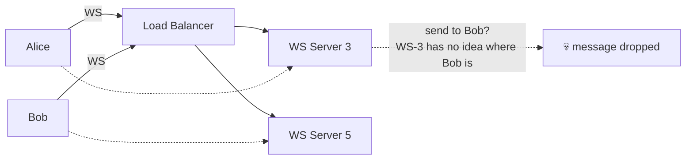

The obvious question: *doesn't the load balancer already know where everyone is?* No — the load balancer's only job is deciding where a *new* connection goes. It has no memory of where existing connections already live, and it's not built to answer "which server is user X's socket on right now" on every single message send.

**The fix:** stand up a shared **front desk register** — a fast key-value store (Redis, in the real system: WhatsApp calls this the "WebSocket Manager") that every WS server writes to the instant a socket opens: `user_id → (server_id, port)`. Now *any* server can ask "which room is Bob checked into" and get an answer in under a millisecond, instead of guessing. Call this the **Front Desk** for the rest of this story — it's the single idea "presence and routing" boils down to.

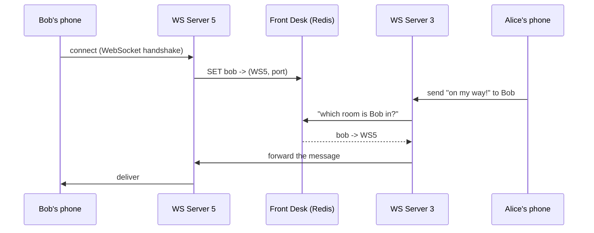

**New problem:** the Front Desk fixes cross-server routing beautifully — as long as it's one Redis box. But Wisp's user base is still climbing, past 50 million now, and one Redis instance holding every single user's entry starts to strain under both the sheer number of entries and the write rate from constant connects/disconnects. The Front Desk itself now needs to be split across multiple machines — and Wisp is about to make the exact same naive mistake with *that* split that it just fixed for connection routing.

**How I'd say this in an interview:** "Scaling the connection tier horizontally creates a routing problem that didn't exist with one server — server A has no way to know server B is holding a given user's socket. The fix is a shared, fast presence directory, `user_id → server:port`, that every server writes to on connect. The load balancer doesn't need sticky sessions at all, because this directory — not the load balancer — is the actual source of truth for 'where is this user.'"

---

## Chapter 4 — The circle of front desks

Wisp splits the Front Desk across 8 Redis shards, the obvious way: `shard = hash(user_id) % 8`. It works, right up until traffic keeps growing and a 9th shard gets added for headroom. The moment `% 8` becomes `% 9`, almost every `hash(user_id) % N` result changes — worked number: going from 8 shards to 9 remaps roughly **7 out of every 9 entries, about 78%** of the entire directory. Every WS server's understanding of "which shard holds Bob" is now wrong until it re-resolves, and the migration itself has to physically copy nearly 80% of the directory to new homes just to add one box's worth of capacity.

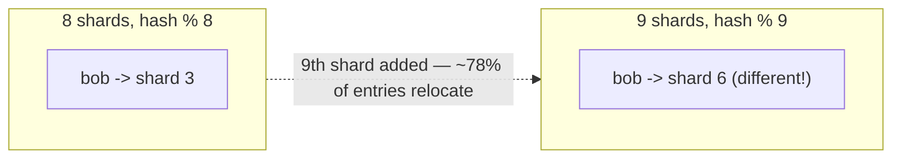

The obvious question: *can we add or remove a shard without reshuffling almost everything?* Yes — this is the same fix that made adding a WS server *not* require rewriting every routing rule in the connection tier, just applied one layer down. It's **consistent hashing**.

**The fix:** place the shards *and* the keys on a **ring** instead of a flat `% N` bucket list. Each shard claims a spot on the ring (by hashing its own ID); each user's entry lands somewhere on the ring too (by hashing the user ID); a key belongs to **whichever shard's spot comes next, going clockwise**. Extend the Front Desk analogy: imagine **ten front desks arranged in a circle**, each one only responsible for guests whose room number falls in the stretch between it and the next desk clockwise. Add an 11th desk, and it only steals the narrow stretch nearest to where it's inserted — nobody else's guests move.

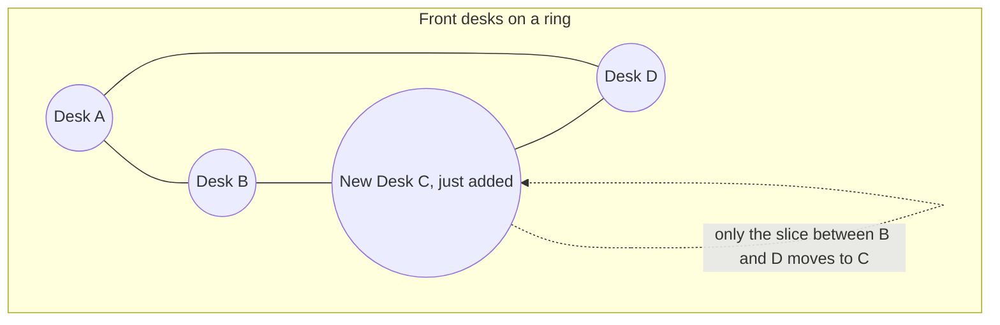

Redo the math on the ring version: adding a 9th (or here, an 11th) desk only moves the slice of keys that now fall in its one small stretch — roughly `1/N` of the directory, not 78%. Same goal, a fraction of the disruption — and this is exactly the standard, real-world fix for sharding a presence directory or a message store as it grows across thousands of nodes.

**New problem:** consistent hashing answers *which shard currently owns Bob's entry*. It says nothing about the case where the Front Desk has **no entry for Bob at all** — because his phone is off and his socket isn't open on *any* server. That's not a routing failure to fix, it's a completely different situation the Front Desk was never designed to answer: what do you do with a message for someone who simply isn't there right now?

**How I'd say this in an interview:** "Naive `hash % N` sharding reshuffles almost the entire keyspace every time you add or remove a node — consistent hashing bounds that to just the one neighboring shard's slice, which is why it's the standard answer for sharding a presence directory or a partitioned message store, not just for caches. But it only solves placement — it doesn't solve what to do when the answer to 'where is this user' is simply nowhere."

---

## Chapter 5 — The mailbox that never sleeps

Wisp's mobile app, like every real mobile OS, closes the socket when the screen's been off for a while, to save battery — a real, well-known behavior on both iOS and Android. Wisp instruments this and finds something uncomfortable: at any given moment, roughly **22%** of outgoing messages `[illustrative]` are addressed to a recipient whose socket simply isn't open anywhere. Right now, under the Chapter 3 design, the Front Desk lookup for those returns nothing — and the message is just... dropped. Roughly one in five messages sent on Wisp are quietly vanishing.

The obvious question: *what should happen to a message when the recipient genuinely isn't reachable?* It has to be held somewhere durable until they are — which means Wisp needs a real mailbox, not just a routing table.

**The fix:** a durable, **per-conversation, FIFO** store that a message gets written to *before* the sender is told "sent" — modeled on what WhatsApp's real system does with **Mnesia** (Erlang's own built-in distributed database): the message sits there, in order, until the recipient reconnects and drains it, and it's held for up to **30 days** if delivery never happens, after which it's dropped (WhatsApp's real, documented retention window — this is a transient buffer, not a permanent archive; delivered messages are deleted almost immediately). Reuse the mailbox analogy directly: this is a literal **Mailbox** — the post office holds your letter until you're home to check it. A push notification (APNs/FCM) is just a **knock at the door** telling you mail arrived; it is *not* the delivery mechanism itself, and if the knock never lands (push service having a bad day), the letter is still safely sitting in the box regardless.

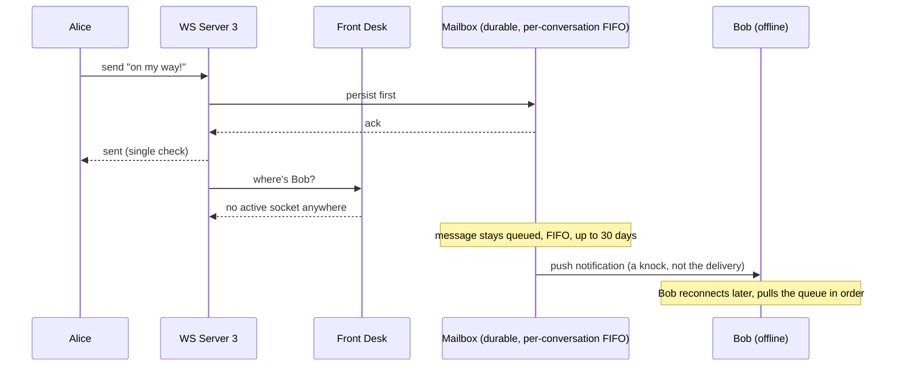

**New problem:** the Mailbox correctly handles a *single* missing recipient. But group chats don't have a single recipient at all — a group message needs to reach every member, and "who's in this group" is a completely different shape of data than "is this one user's socket open," living nowhere near the Front Desk or the Mailbox. Before that, though, Wisp trips over a subtler bug in the Mailbox itself: what happens when the *same* message shows up twice, or two messages show up in the wrong order?

**How I'd say this in an interview:** "A push notification is a doorbell, not the mailbox — durability has to happen the instant the message is persisted, before any delivery attempt, so a push failure is never a data-loss event. The real mailbox is a durable, per-conversation FIFO queue, held only for a bounded window, because an indefinitely-offline account isn't a durability guarantee to keep forever."

---

## Chapter 6 — The one letter that arrived twice, and the one that arrived backwards

Two bugs show up in the same week. First: Alice sends "on my way!" — the app doesn't get an ack within 2 seconds because of a network blip, so it **automatically retries**, resending the exact same message. Bob's phone ends up with "on my way!" twice in his chat. Second, separately: two events for the same order — "payment confirmed" and "order placed" — arrive at a downstream consumer **out of order**, because they happened to take different code paths under load, and nothing was enforcing that they land in send order.

The obvious question: *how do we know a message really only counts once, and how do we guarantee it shows up in the order it was actually sent?* Two separate fixes, for two separate bugs.

**Fix one — dedup:** the **client**, not the server, generates the message's unique ID (a UUID) the moment the user hits send. If the client never got an ack and retries, it resends with the *same* ID — the server recognizes that ID has already been persisted and just re-acks without storing a duplicate. This gives **at-least-once delivery with client-side dedup**, which *feels* like exactly-once to the user even though true exactly-once delivery over an unreliable network isn't actually achievable without exactly this kind of idempotency token — say that plainly if asked, rather than pretending exactly-once is free.

**Fix two — ordering:** enforce strict order **per conversation only**, never globally. Give every conversation its own private, always-increasing sequence counter — like a numbered-ticket dispenser at a deli counter. Every conversation gets its own dispenser; Wisp does **not** need one giant dispenser for the entire app, which would just be a single global bottleneck nobody actually asked for.

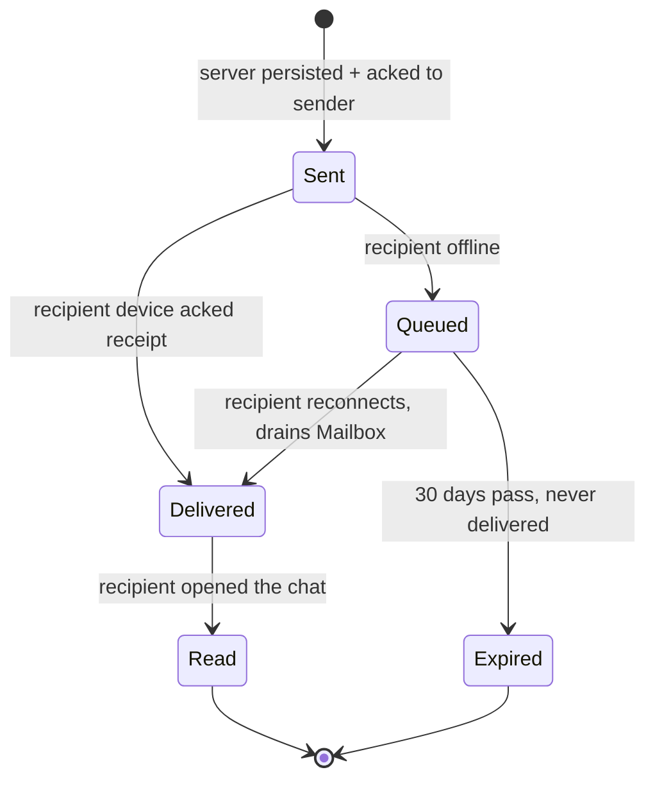

Extend the Mailbox metaphor to the three tick states, because it maps cleanly: **Sent** = the letter is dropped in the mailbox and stamped (server has it, durably); **Delivered** = the postal worker actually handed it over at the door; **Read** = the recipient opened the envelope. Users can turn off the *Read* receipt (the blue tick) as a privacy setting — but Sent and Delivered are never optional, because they're part of the durability guarantee, not a social feature.

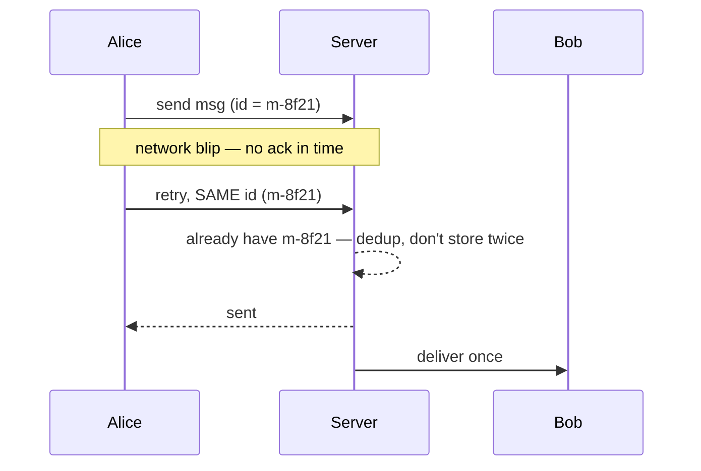

**This is also the moment to name the trade-off out loud:** Wisp's design deliberately picks **consistency over availability** for message ordering — a brief socket reconnect is a perfectly fine, invisible blip; delivering message #47 before message #46 is not. That one sentence, said early, answers half the "what if X server goes down" follow-ups before they're even asked.

**New problem:** dedup and per-conversation ordering are both solid now. But none of this — the Front Desk, the Mailbox, the sequence counters — has a concept of "a group" at all. A group message has no single receiver to look up.

**How I'd say this in an interview:** "Client-generated message IDs are what make retries idempotent — the server dedups on the ID instead of trusting the network to never double-deliver, and that's the honest, real answer to 'how do you prevent duplicates,' because true exactly-once without an idempotency token isn't achievable. Ordering only ever needs to be per-conversation — a global sequencer across the whole app would be a bottleneck nobody's actually asking for."

---

## Chapter 7 — Two hundred letters, one trip to the print shop

Wisp's biggest group, "FamilyReunion," has **180 members**. Someone sends a message to the group, and under the current 1:1-shaped pipeline, the naive approach is to look up all 180 members' presence and write 180 individual mailbox entries **synchronously**, before telling the sender "sent." Worked number: a normal 1:1 send takes about **15ms**. Doing that same lookup-plus-write 180 times inline, one after another, before acking, pushes a single group send's latency past **900ms** `[illustrative]` — the sender's own checkmark is now hostage to 180 other people's delivery status.

The obvious question: *how do we avoid making every group send this expensive and this synchronous?* Move the fan-out **off** the sender's critical path entirely, and treat group membership as a separate, deliberately-a-bit-stale dataset — because "who's currently in this group" doesn't need millisecond freshness the way "is this socket open right now" does.

**The fix:** a group becomes a **topic** in a durable log (Kafka, in the real system) with one publish per group message; a separate **Group Message Handler** consumes that topic and does the 180 individual 1:1 deliveries asynchronously, reusing the exact same Front Desk + Mailbox path per member. Group membership itself lives in a **MySQL cluster, cached in Redis** — deliberately a *different*, slower-to-update store than the Front Desk, because a member removed 3 seconds ago still getting one extra message is a non-event, unlike a stale presence entry. Extend a familiar analogy: this is a **newsletter** — one article is written once; a separate print room makes 180 individual copies and drops each into its own recipient's Mailbox, on its own schedule, without making the writer stand at the print shop waiting.

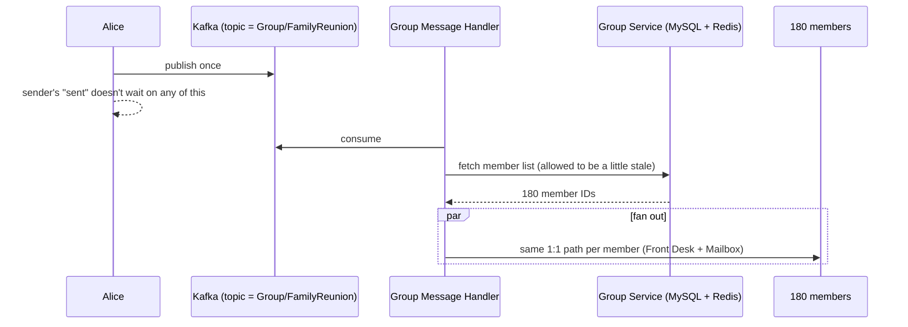

**New problem, immediately obvious once you say the cost out loud:** fan-out-on-write costs `O(group size)` per message. If group size were unbounded — say a "celebrity broadcast" account with 500,000 followers — every single post would trigger half a million individual deliveries. That's not a bug to optimize away; it's a different feature entirely.

**The fix within the fix:** **cap group size.** WhatsApp really did exactly this — capping groups at **256 members** early on and raising the cap over time only as infrastructure improved. The lesson isn't "make unbounded fan-out fast," it's "bound the audience so the cost stays a small, known multiple, not an unpredictable one." Broadcast-scale audiences (celebrity followers, Twitter-style feeds) are a genuinely different problem — fan-out-on-*read* — that a bounded group chat was never trying to solve.

**Carrying forward:** none of this pipeline — Kafka topic, group handler, per-member Mailbox writes — has touched anything but small text messages yet. Someone is about to send a 5MB video into this exact pipe.

**How I'd say this in an interview:** "Groups don't fit the 1:1 model because membership lives in a colder, separate store than presence — I'd draw group fan-out as its own diagram, not bolted onto the 1:1 sequence. Fan-out-on-write with a capped group size is the right call for a bounded chat; fan-out-on-read is the right call for unbounded broadcast audiences, and conflating the two is the most common structural mistake here."

---

## Chapter 8 — The 5MB video that clogged the tiny mail slot

A user forwards a 5MB birthday video into a group chat. It goes through the exact same Kafka-topic-plus-Mailbox pipeline built for 100-byte text messages. Wisp's Mailbox cluster was sized and provisioned for tiny, transient chat metadata — at the company's current scale, roughly **20% of messages carry media** `[illustrative, mirrors the real guide's estimate]` at an average size that, unlike text, is measured in hundreds of kilobytes, not bytes. The disk that was budgeted to comfortably hold weeks of tiny text messages fills up in **hours** once even a modest fraction of sends are video and photo attachments — and the same tiny, latency-sensitive pipe that's supposed to deliver text messages in milliseconds is now stuck behind giant binary blobs.

The obvious question: *why does a video have to go through the same pipe as a one-line text message at all?* It doesn't need to — the two have completely different size and latency profiles, and forcing them through one path means the big one drags down the small one.

**The fix:** split media off entirely. The client compresses and prepares the file **on-device**, uploads it to a separate **Asset Service**, which hashes the content — if that exact hash **already exists** in blob storage, skip the upload completely and just hand back the existing file's ID. Only a small **ID + key** reference, never the actual bytes, ever touches the real chat pipeline; the bytes themselves live in blob storage, served through a **CDN**. Analogy: a **photocopier with a barcode scanner in front of a filing cabinet** — before making a new copy, scan the barcode; if that exact page is already filed, just hand out the existing file number instead of copying it again.

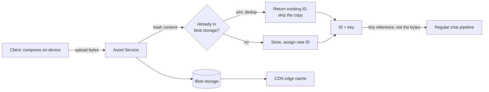

Concretely, one meme forwarded across chats 2 million times in a day gets stored **once** — every later forward just resolves the same asset ID, and the CDN serves it from an edge cache close to whoever's downloading it, instead of Wisp's own tiny message pipe carrying the same bytes over and over.

**New problem, and it isn't a performance one this time:** now that Wisp routes and stores everything — the message text, the media ID+key references, all of it — in plain, readable form, someone in an all-hands asks the obvious, uncomfortable question: *can a Wisp employee read anyone's messages if they wanted to?* Right now, the honest answer is yes. Nothing in the design so far stops it.

**How I'd say this in an interview:** "Media has a completely different bandwidth and storage profile than text — I'd size them separately in any estimate — so it gets its own asset service, blob store, and CDN, off the latency-critical messaging hot path entirely. Content-hash dedup means a viral file gets stored once no matter how many times it's forwarded."

---

## Chapter 9 — The locked box only the recipient can open

The trigger is exactly the kind of incident that motivates this in real life: an on-call engineer, debugging a delivery bug through an internal admin panel, ends up looking at the actual plaintext of a user's private conversation `[illustrative for Wisp — but this is precisely the class of scenario WhatsApp's real, completed 2016 rollout of end-to-end encryption across the entire app was built to make structurally impossible, not just against-policy]`. Legal and users both ask the same question in different words: how do we make "not even Wisp can read your messages" actually, provably true — not a policy promise, an architectural fact?

The obvious question: *doesn't Wisp already use TLS — isn't that encryption?* Yes, but that only protects the wire between the client and Wisp's own servers — Wisp itself, at the other end of that TLS connection, still sees plaintext. That's **transport encryption**. What's needed is encryption the server itself can never undo.

**The fix:** encrypt on the sender's device, before the message ever leaves the phone, with a key that only the recipient's device can derive — the real, documented **Signal Protocol**, which WhatsApp adopted and completed rolling out across the app by 2016. Two pieces: **X3DH** for the initial key agreement between two people, and the **Double Ratchet**, which derives a brand-new key for every single message, so that even if one message's key were somehow compromised, it exposes neither past nor future messages. The server's role shrinks to: route and store an opaque ciphertext blob it is architecturally unable to read.

**Extend the analogy:** the message is now a **locked box**, shipped by a courier (the server) who can carry it, store it, hand it to the right address — but who was never given a key that opens it. This is also the moment to point out: this new locked-box channel retroactively covers a gap from Chapter 8 — the media ID+key reference was traveling as plain text until now; once the *message* channel itself is E2E encrypted, that reference rides inside the same locked box too.

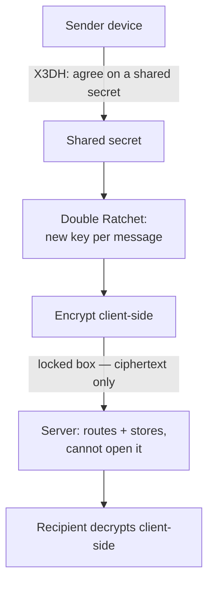

| | Transport encryption | End-to-end encryption |
|---|---|---|
| Protects | The wire, client ↔ server | The content, sender all the way to receiver |
| Can the server read it | Yes, in principle | No — never, by construction |
| Mechanism here | TLS / Noise Protocol | Signal Protocol (X3DH + Double Ratchet) |

**New problem:** X3DH, described plainly, sounds like a live handshake — both people's devices doing math together, right now. But Bob's phone is off for the night exactly when Alice sends her very first message to him, ever. You cannot shake hands with someone who isn't in the room.

**How I'd say this in an interview:** "Transport encryption protects the wire; end-to-end encryption protects the content from the operator itself, which is the actual promise 'not even WhatsApp can read your messages' requires. It's Signal Protocol client-side — X3DH for the handshake, Double Ratchet so a single compromised key doesn't expose the whole conversation's history. The very next question is always 'how does that handshake work if one side is offline,' because it usually is."

---

## Chapter 10 — The spare key left at the front desk

Bob's phone is off overnight — call it 6 hours. Alice, on the other side of the world, messages him for the first time at 2am his time. Textbook X3DH needs both parties to do live math together. Bob, obviously, cannot.

The obvious question: *how do you start an encrypted session with someone who isn't there to shake hands?* The trick is that Bob's device does its half of the prep **ahead of time**, while it was last online, and leaves the results somewhere Alice can fetch them from directly — no live participation from Bob required at the moment Alice actually sends.

**The fix:** each of Bob's devices, while online, uploads a **prekey bundle** to a key-directory service: one long-lived **identity key**, one medium-lived **signed prekey** (rotated on a schedule), and a batch of, say, **100 one-time prekeys**, each meant to be consumed exactly once and then quietly replenished. When Alice sends her first message, she fetches Bob's bundle **from the server, not from Bob**, runs X3DH unilaterally right then using it, derives a shared secret, and starts the Double Ratchet — all without Bob needing to be reachable at all. Extend the Front Desk analogy directly: this is Bob **leaving a spare key in a lockbox at the front desk** before he leaves for the night — a friend can retrieve it and let themselves in later, and the front desk hands out the spare key but never keeps a copy it could use itself.

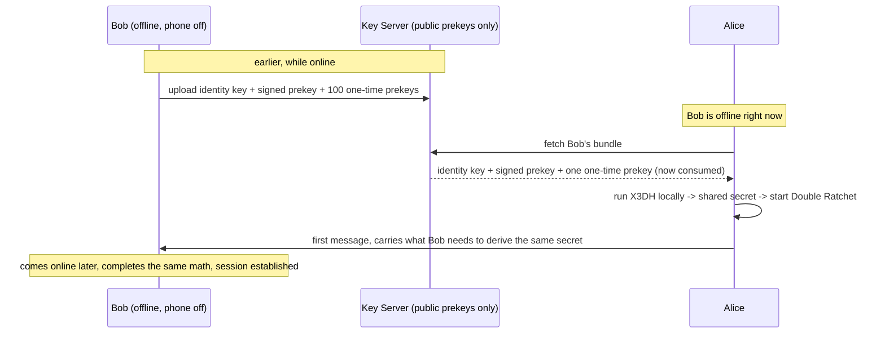

The key server never hands out anything private — only public keys — so this offline handshake works without the server ever being able to see plaintext or forge a session on Bob's behalf.

**New problem, an honest gap, not a hidden one:** what if Bob is genuinely offline for **three weeks**, backpacking with his phone off, and 100 different new senders each consume one of his one-time prekeys in that window? Once the batch runs dry, new senders fall back to using just the signed prekey — a slightly weaker forward-secrecy guarantee for that one session — until Bob reconnects and tops the stock back up. This is a small, real, worth-naming-out-loud gap in an otherwise offline-safe design, not something to sweep under the rug if an interviewer pushes on "what if the recipient's offline for weeks."

**Carrying forward:** Wisp ships "use Wisp on your laptop too." Bob now has a phone **and** a laptop — and the entire X3DH/prekey model above was built around one identity key per *person*, not per person-with-multiple-devices.

**How I'd say this in an interview:** "Async handshakes need pre-published key material — prekey bundles are uploaded before they're ever needed, so a sender can start a session unilaterally with someone who's genuinely offline. The one real, honest gap is one-time prekeys running out during a long offline stretch, which just falls back to a slightly weaker guarantee until the device reconnects — worth naming yourself before the interviewer finds it."

---

## Chapter 11 — Three locks, three keys, one letter

Bob links a laptop and a tablet alongside his phone — three devices now. WhatsApp's real, deliberate design choice since **2021** is that there is no single "master" device anymore: **each linked device generates and holds its own Signal identity key.** That means when Alice sends Bob one message, her phone has to separately encrypt the **same** plaintext **three times** — once per device's public key — and deliver three distinct ciphertext blobs, one to each device.

Worked number, tying straight back to Chapter 7's group math: if FamilyReunion's 180 members average **1.6 linked devices each** `[illustrative]`, one group message no longer means 180 individual encrypt-and-deliver operations — it means roughly `180 × 1.6 ≈ 288`.

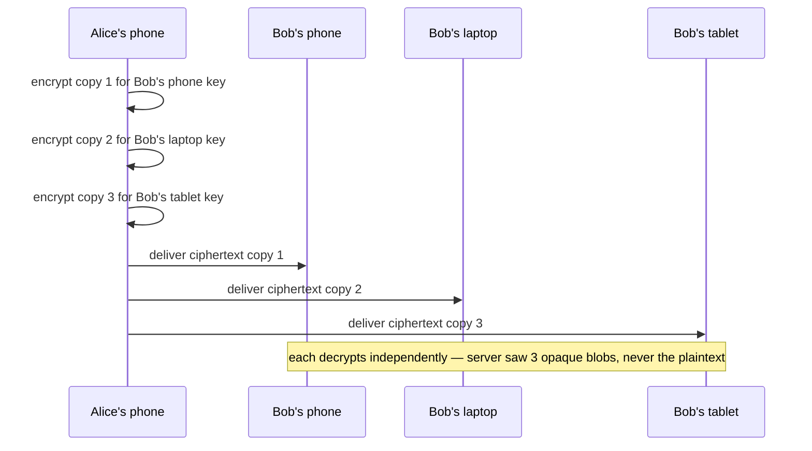

The obvious question: *can we avoid this multiplication somehow?* Not without breaking the "no single master key" property that makes multi-device secure in the first place — if one device's key could decrypt for all of a person's devices, compromising that one device would compromise every device. So this isn't engineered away; it's accepted, named plainly: **fan-out cost now scales with devices-per-user, not just users-per-group**, and that's the honest price of the security property Wisp just bought.

**New problem, on a completely different axis:** three devices connecting and disconnecting independently — laptop lid closes, phone locks, tablet goes to sleep — makes the Front Desk churn constantly, which it actually handles fine (that's exactly the lookup it was built for). What it was **never** built for is the feature request that comes in right after: users want to *see* a green "online" dot and a "last seen" time for their contacts. That's a completely different audience and a completely different problem from "which server is Bob's socket on."

**How I'd say this in an interview:** "Multi-device means the server can no longer treat a recipient as one endpoint — a sender encrypts the same message once per linked device, because each device has its own identity key by design, not as an oversight. That's a real, permanent fan-out cost, and the honest answer to 'can we avoid it' is no, not without giving up the property that makes multi-device secure."

---

## Chapter 12 — The neon sign versus the private register

Wisp ships a green "online" dot. The naive first version reuses the Front Desk's connect/disconnect events directly — every time anyone's socket opens or closes, broadcast it to **all** of that user's contacts, unconditionally. Worked number: Wisp has 5 million concurrently connected users, each with roughly **200 contacts** on average, each toggling online/offline a handful of times a day from normal app use — that's on the order of **billions of presence broadcast events per day** `[illustrative, mirroring the real shape of this problem at WhatsApp's actual global scale]`, and the overwhelming majority of them are wasted, because most of those 200 contacts don't have that specific chat screen open at the moment the dot flips.

The obvious question: *why is this a new problem — didn't we already solve presence back in Chapter 3?* Because that was a different problem wearing the same name. The Chapter 3 Front Desk answers "where is Bob's socket" for **one sender, at send time** — a single private read. This feature needs to **push** Bob's status to **every currently-interested contact, every time it changes** — a fan-out, not a lookup, and one that needs to respect a privacy setting Bob might have turned on.

**The fix:** separate the two ideas cleanly by name — **routing presence** (the internal Front Desk lookup, unchanged since Chapter 3) versus **social presence** (the outward-facing green dot and last-seen time, a fan-out gated by who's actually watching and by privacy). Fan live updates out only to contacts who are **actively subscribed** — meaning they currently have that specific chat open — via a per-user pub/sub channel; everyone else just pulls a one-time "last seen" value on demand instead of getting pushed a live stream they're not looking at. Extend the Front Desk / hotel analogy one more time: routing presence is the **private register only staff can query**; social presence is a **neon "vacancy" sign**, except Wisp's version only lights up for the specific people standing right outside it (subscribers), and Bob can choose to switch his sign off entirely for everyone — with the fair, symmetric rule that if he hides his own last-seen, he loses the ability to see anyone else's too.

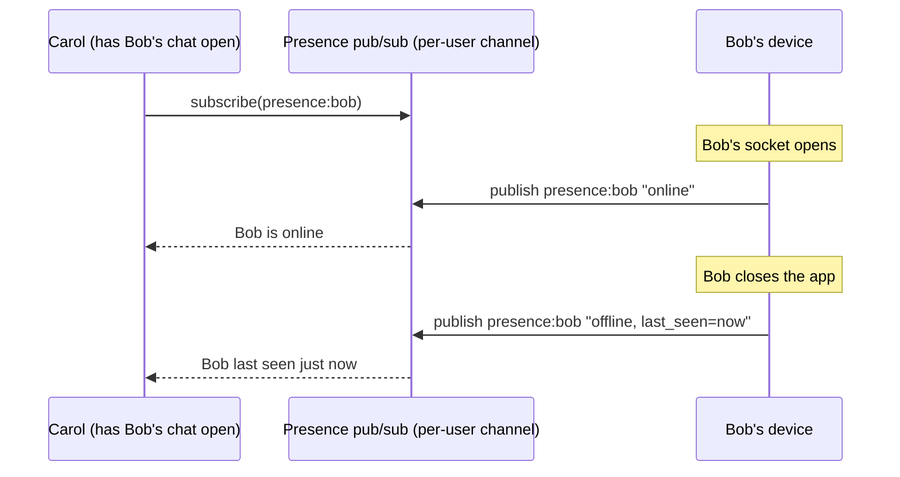

**New, adjacent problem:** a regional network outage causes thousands of devices to reconnect all at once, and flaky connections retry every couple of seconds — each retry flips a subscriber's status online→offline→online in a tight loop. Contacts see a strobing, flickering status instead of one stable state.

**The fix for that:** debounce and batch rapid flaps — hold a status change briefly before publishing it, so a connection that recovers within a couple of seconds never gets announced as having dropped at all. This closes the loop on presence for now.

**How I'd say this in an interview:** "Routing presence and social presence are genuinely different problems wearing the same word — one is a single-reader internal lookup, the other is a privacy-gated fan-out to subscribed contacts, and I'd design them as two separate systems, not one. The fix for the fan-out cost is only pushing to people who currently have that chat open, and the fix for reconnect storms is debouncing rapid flaps so contacts see one stable status instead of a flicker."

---

## Where the story actually lands

Different pieces of this final design deliberately sit at **different** points on the latency-vs-consistency spectrum — this is the single most senior observation available here: there's no one uniform consistency policy, there's a *per-subsystem* choice.

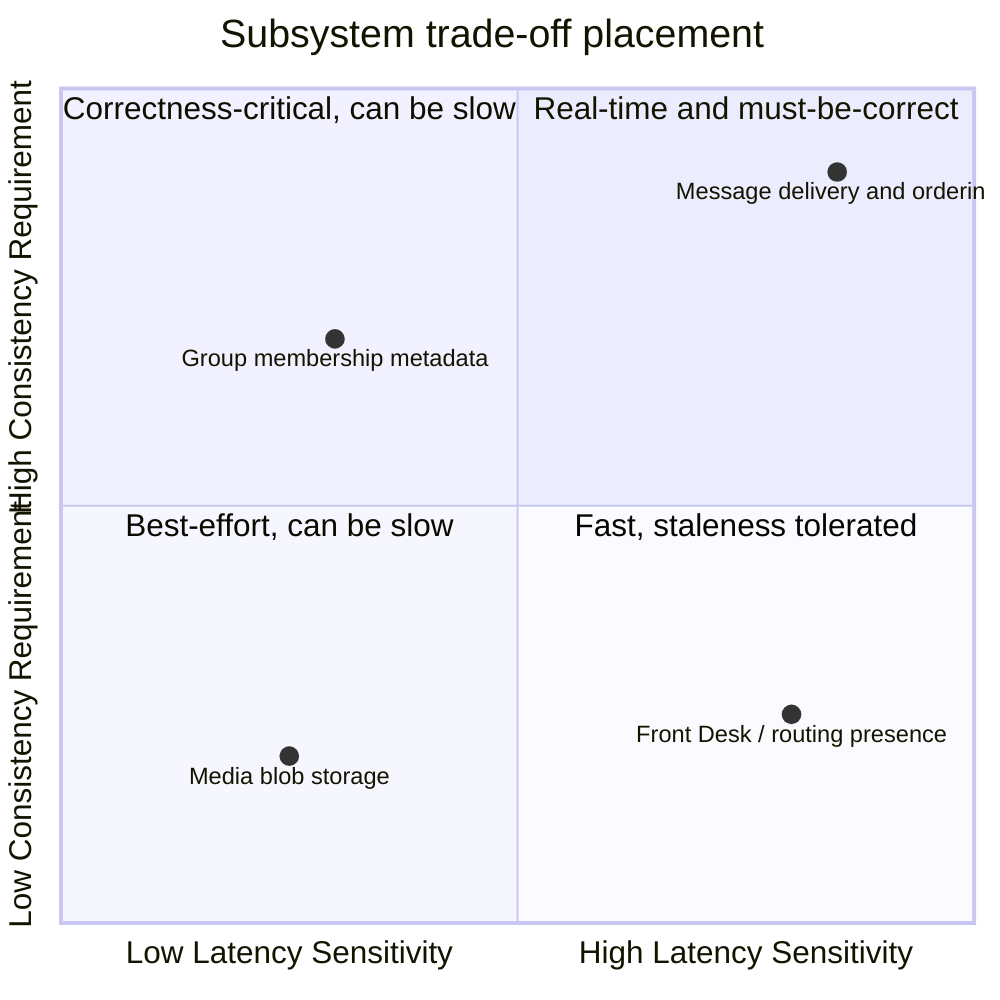

Every real chat system you'd design in an interview sits *somewhere* on this twelve-chapter chain, and the skill isn't reciting all twelve — it's stopping where the stated requirements actually say to stop. A simple internal tool might reasonably stop around Chapter 5. Anything billed as "secure messaging" has to reach Chapter 9 and 10. Anything with groups and multiple devices has to reach 11. Walking all the way to Chapter 12 unprompted, when nobody's asked about presence, reads as padding, not depth.

---

## Grill me — adversarial follow-ups

**Q1: "Why not just make the naive single server bigger — more RAM, more threads — instead of doing all this WebSocket-manager and C10M work?"**
Because thread-per-connection overhead isn't linear — past a few thousand threads, the kernel spends most of its time context-switching, not doing real work, so adding hardware buys you less and less. The fix has to change the *model* (event-driven I/O, cheap per-connection state), not just the box size, and even after that fix, one box still has a hard ceiling that eventually forces horizontal scale anyway.

**Q2: "You said 2 billion users but really mean far fewer concurrent connections — walk me through that distinction."**
Total registered users and concurrent open sockets are very different numbers — most people aren't online at the same instant across every timezone. You take DAU, multiply by a realistic concurrency ratio (roughly 25–35%), and *that's* the number you divide by connections-per-server, not raw user count. Skipping this step is the single most common sizing mistake in this whole design.

**Q3: "Doesn't the Front Desk (presence directory) becoming unavailable take down the entire chat system?"**
It would break routing between servers, yes — the mitigation is running it as a replicated cluster and, if it's genuinely unreachable, defaulting to "assume the recipient is offline, queue it in the Mailbox" rather than failing the send outright. The message is never lost either way, because durability lives in the Mailbox, not the directory.

**Q4: "If message ordering is only guaranteed per-conversation, what stops two conversations' events from interleaving badly in a way that matters?"**
Nothing needs to stop it, because nothing in the actual requirement ever needed cross-conversation ordering — Alice and Bob's chat and Alice and Carol's chat have no causal relationship to each other. A global ordering guarantee would be solving a problem nobody asked about, at the cost of a single, needless bottleneck.

**Q5: "Why cap group size instead of just making fan-out-on-write cheaper?"**
Because fan-out-on-write's cost is fundamentally `O(group size)` — there's no clever trick that makes writing to 500,000 mailboxes as cheap as writing to 5. The honest fix is bounding the audience, not chasing an unbounded-but-fast version of a feature that's supposed to be a small group chat; unbounded broadcast is a genuinely different feature (fan-out-on-read) with different guarantees.

**Q6: "If messages are end-to-end encrypted, how would you ever add spam detection or full-text search?"**
Both have to work without ever reading plaintext, because the server architecturally cannot. Spam detection falls back to metadata and behavioral signals — send rate, fan-out shape, report counts — never content. Search either happens entirely client-side, on the device that holds the decrypted messages, or it doesn't happen server-side at all; there's no way around that constraint without breaking the "not even Wisp can read it" guarantee.

**Q7: "One-time prekeys can run out — isn't that a real security hole?"**
It's a real, honest gap, not a hole that's being hidden — a new sender in that window falls back to just the signed prekey, which is a slightly weaker forward-secrecy guarantee for that one session, not a broken one. It self-heals the moment the device reconnects and replenishes its batch, and it's worth naming yourself before an interviewer digs for it.

**Q8: "Is chat backup — iCloud or Google Drive — end-to-end encrypted the same way live messages are?"**
Not by default — this is a real, documented nuance: users have to separately opt into encrypted backups, otherwise the backup itself sits under a weaker guarantee than the live message path. It's a good example of how an E2E guarantee on one path doesn't automatically extend to every adjacent feature, and worth raising proactively if asked "is everything always end-to-end encrypted."

**Q9: "Multi-device multiplies encryption work by devices-per-user — why not just let one device hold the master key and forward to the others?"**
Because that reintroduces exactly the single point of compromise multi-device was designed to avoid — if one device's key could decrypt for every linked device, compromising that one device compromises all of them. The fan-out cost is the accepted price of each device genuinely being independent, not an oversight to optimize away.

**Q10: "Given this whole story, if someone just says 'design WhatsApp' cold, where do you actually start?"**
Say the frame first: this is presence, routing, and a mailbox — not a CRUD app — and I'll prioritize consistency over availability for message order, because losing order is worse than a brief reconnect. Then size the connection tier from concurrency, not total users, and build the architecture up in stages out loud, naming the specific bottleneck that forces each new piece, rather than presenting the final seven-box diagram cold from minute one.

---

## Cheat sheet — one line per stop on the story

- **Polling**: wastes most requests answering "no" and bakes in latency by design — the fix is a persistent Open Line (WebSocket), pushed to, not asked of.
- **One thread per connection**: kernel context-switch overhead dominates past ~10K connections — the fix is event-driven I/O with cheap per-connection state (WhatsApp's real Erlang-on-tuned-FreeBSD answer, the C10M problem).
- **Horizontal scale-out**: creates a cross-server routing problem the moment sender and recipient land on different boxes — the fix is a shared Front Desk directory, `user_id → server:port`, no sticky sessions needed.
- **Sharding the Front Desk itself**: naive `hash % N` reshuffles almost everything on node add/remove — consistent hashing bounds that to one ring neighbor's slice.
- **Offline recipient**: a push notification is a doorbell, not the delivery — the real fix is a durable, per-conversation FIFO Mailbox, held for a bounded window (30 days), not forever.
- **Duplicates and out-of-order delivery**: client-generated message IDs make retries idempotent (dedup, not true exactly-once); ordering only ever needs to be per-conversation, never global.
- **Groups**: membership lives in a colder, separate store than presence — fan-out-on-write via a topic-per-group, off the sender's critical path, with a hard cap on group size to bound the cost.
- **Media**: a completely different bandwidth/storage profile than text — split off into its own asset service + blob store + CDN, with content-hash dedup so a viral file is stored once.
- **Server reading everything**: transport encryption (TLS) protects the wire; only true end-to-end encryption (Signal Protocol: X3DH + Double Ratchet) makes the server architecturally blind to content.
- **Offline key exchange**: prekey bundles are uploaded ahead of time so a sender can start a session unilaterally — the one honest gap is one-time prekeys running out on a long-offline device.
- **Multi-device**: each linked device has its own identity key by design, so a sender encrypts the same message once per device — fan-out cost scales with devices-per-user, and that's accepted, not optimized away.
- **Presence, the second kind**: routing presence (an internal, single-reader lookup) and social presence (a privacy-gated fan-out to subscribed contacts) are different problems wearing the same word — design them as two systems, and debounce reconnect flaps so contacts see one stable status.
- **The meta-lesson**: every fix in this story buys one property — real-time push, connection density, cross-server routing, cheap resharding, offline durability, dedup/order, bounded group cost, hot-path isolation, content-blindness, offline handshakes, per-device security, or privacy-gated presence — by spending something else; say the trade in the same sentence as the fix.
