# Design WhatsApp — FAANG Interview Guide

> **Enhancement notes:** this pass added material the original guide didn't
> cover, without touching the sections that already worked.
> - New Deep Dive 7 — **presence & online/last-seen fan-out**, distinguishing
>   "which server is this socket on" (routing presence, already covered) from
>   "should Bob's contacts see him online" (social presence, was missing).
> - New **key-management subsection** inside the E2E deep dive — prekey
>   bundles, so a sender can start a Signal session with a recipient who is
>   currently offline (the guide had X3DH/Double Ratchet but not this).
> - New **protocol comparison table** — WebSocket vs long polling vs MQTT —
>   since MQTT is a common "why not just..." follow-up for mobile chat apps.
> - New **delivery-decision flowchart** (online vs push-fallback vs
>   store-and-forward) making explicit the branching logic the existing
>   sequence diagram already implied.
> - Left the capacity estimation, architecture-evolution narrative, sharding,
>   group fan-out, media pipeline, and cheat sheets as-is — they were already
>   concrete, numbers-driven, and clear.
> - All new headings are marked with 🆕; everything else is untouched or only
>   lightly reworded for clarity.

## Mental model

WhatsApp is **not a database problem, it's a connection-management problem.**
The hard part isn't storing 100B messages/day — a distributed log handles
that fine. The hard part is holding **hundreds of millions of persistent,
stateful TCP connections open simultaneously** and knowing, at any instant,
which of thousands of servers each of your contacts is attached to. Everything
in the design — Erlang, FreeBSD kernel tuning, the WebSocket-manager/Redis
layer, fan-out strategy for groups — exists to answer one question cheaply
and correctly, billions of times a second: **"where is this user right now,
and how do I get one message to them with in-order, exactly-once-feeling
delivery?"**

Think of it as **presence + routing + a mailbox**, not "a chat CRUD app":
- **Presence** — is the recipient attached to a server right now?
- **Routing** — which of N servers, which port/socket?
- **Mailbox** — if not present, hold the message durably until they are.

The second-order theme is **encryption changes where logic can live**. Because
message bodies are end-to-end encrypted (Signal Protocol), the server is
architecturally blind to content — it can route and store opaque ciphertext
blobs, but it can never do content-based feature work (spam scanning,
translation, search-on-server) without breaking the security model. This
constraint shapes almost every "why not just..." question an interviewer will
ask.

## How to identify this in an interview

You're looking at a WhatsApp-shaped problem when the prompt uses any of:
- "Design WhatsApp / Messenger / Slack / Telegram / a real-time chat app"
- "Support millions of concurrent connections"
- "Users should see messages instantly" / "real-time" / "low latency delivery"
- "Support offline users" / "messages queued until they come back online"
- "One-on-one and group conversations"
- "Delivery/read receipts" or "message ordering guarantees"

If the prompt instead emphasizes **fan-out to millions of followers** with no
expectation of a persistent two-way session (e.g., "design Twitter"), that's
a feed/broadcast problem, not a connection-management problem — different
center of gravity, even though "fan-out" shows up in both.

## Interview playbook

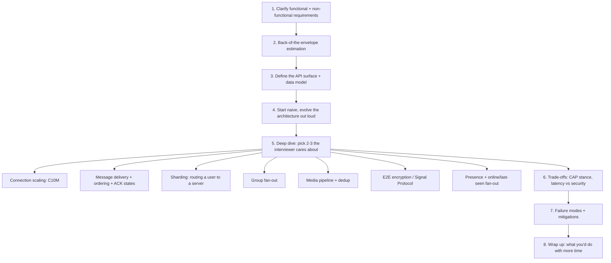

**How to use this in the room:** narrate the top row first in one breath —
"I'll clarify requirements, size the system, sketch APIs and data model,
walk through the design evolution, then pick two or three deep dives." That
sentence alone signals seniority. Interviewers steer you into whichever
deep-dive branch matches their team (infra people go for C10M/sharding,
messaging-platform people go for ordering/delivery guarantees, security
people go for E2E).

## Requirements clarification

### Functional requirements
| Requirement | Detail |
|---|---|
| 1:1 messaging | Text, delivered in order, with delivery acknowledgment |
| Group messaging | Many-to-many, bounded group size |
| Media sharing | Images, video, audio, documents |
| Offline delivery | Messages persist until the recipient comes online, then flush |
| Delivery status | Sent → Delivered → Read (single/double/blue tick) |
| Push notification | Wake a backgrounded/killed app when a message arrives |

**Explicitly out of scope unless asked:** voice/video calls (different
transport — RTP/WebRTC, not this chat pipeline), payments, status/stories,
channels/broadcast lists. Say this out loud — it shows you scoped the
problem instead of accidentally designing five systems.

### Non-functional requirements
| Requirement | What it actually means | How it constrains the design |
|---|---|---|
| Low latency | Message should feel "live" (<200ms sender→receiver same region) | Persistent connections, not polling; geo-local WS servers |
| Ordering / consistency | Messages arrive in the order sent, same history on all devices | FIFO queue per conversation, sequencer / causal IDs |
| High availability | Chat must almost never be "down" | Redundant WS servers, stateless-where-possible, fast reconnect |
| Security | E2E encryption — not even WhatsApp can read message content | Signal Protocol on the client; server stores ciphertext only |
| Durability | A message, once "sent," must not be lost | Persist before ACK-to-sender; replicate the store |

**The one line that separates senior candidates:** *"Availability can be
compromised in favor of consistency here"* — i.e., WhatsApp explicitly
trades off the "A" in CAP. Losing a socket for 2 seconds and reconnecting is
fine; delivering message #47 before message #46 is not. Say this early, it
frames every later trade-off discussion.

## Capacity estimation, worked

### The formula chain
```
Messages/day → avg QPS → peak QPS (× peak factor)
Messages/day × avg size → daily ingest → retention window → total storage
DAU × concurrency ratio → concurrent connections → ÷ connections/server → WS server count
Media share of messages × avg media size → media bandwidth (dominates text bandwidth)
```

### Text messages (numbers from the source lesson, sanity-checked)
- **100 billion messages/day**, ~100 bytes/message average (text + minimal metadata)
- Daily ingest: `100B × 100B = 10 TB/day`
- Average QPS: `100,000,000,000 / 86,400 ≈ 1.16M messages/sec` — this is the
  number to say out loud, not "100 billion/day," because QPS is what sizes
  servers.
- **Peak QPS**: traffic is not flat — New Year's Eve / regional evening peaks
  routinely run **3–5×** average. Budget for **~4–6M msgs/sec at peak**.
- Retention: WhatsApp holds undelivered messages for **30 days**, then drops
  them → `10 TB/day × 30 = 300 TB` of *transient* buffer for offline mailboxes
  (not a growing archive — delivered messages are deleted from the server
  almost immediately, which is why 300 TB is small compared to a service that
  keeps history server-side).
- Bandwidth (text only): `10 TB / 86,400s ≈ 926 Mb/s` in, and roughly the
  same out (every message fans out to at least one receiver).

### Media — the source explicitly skips this; don't skip it in an interview
- Assume **~15–20% of messages carry media** (images/voice notes/video), avg
  **~200 KB** after client-side compression.
- `100B × 0.18 ≈ 18B media sends/day × 200KB ≈ 3.6 PB/day` ingest.
- Bandwidth: `3.6 PB / 86,400s ≈ 41.6 GB/s ≈ 333 Gbps` — **this dwarfs the
  926 Mb/s text number by ~350×.** Say this explicitly: *media, not text, is
  the real bandwidth and storage problem*, which is exactly why WhatsApp
  routes media through a separate **asset service + blob store + CDN + hash
  dedup**, never through the WebSocket/message-service hot path.

### Connections and server count — the subtlety interviewers listen for
The source lesson naively divides **total registered users** by connections
per server (`2B / 10M = 200`). A senior candidate calls this out:

> "2 billion is *total users*, not *concurrent connections*. I need DAU ×
> concurrency ratio, not total user count."

Rework:
- DAU ≈ 2B (WhatsApp's actual DAU is close to its user base).
- At any instant, maybe **25–35% of DAU hold an open socket** (people aren't
  online all at once across every timezone) → **500–700M concurrent
  connections** at global peak.
- WhatsApp's real, famous number: **~1–2 million concurrent connections per
  physical server**, achieved via aggressive FreeBSD/Erlang tuning (the
  "C10M problem" — see Deep Dive below). Using a conservative **1M/server**:
  `600M / 1M ≈ 600 servers` for the connection tier alone, globally
  distributed, plus N× redundancy per region (2–3×) for failover →
  **~1,200–1,800 boxes** is a defensible ballpark. (WhatsApp historically ran
  far fewer *total* servers than this back-of-envelope suggests, purely
  because of how extreme their per-box efficiency was — worth mentioning as
  the point of the whole case study.)

**Rerun the chain when the interviewer changes an input** — that's the
actual skill being tested, not the memorized 200-servers answer.

### Numbers worth memorizing
| Quantity | Value |
|---|---|
| RAM random access | ~100 ns |
| Redis GET (same DC) | ~0.5–1 ms |
| SSD random read | ~100 μs–1 ms |
| Same-datacenter RTT | ~0.5–1 ms |
| Cross-region RTT (e.g., US↔EU) | ~50–150 ms |
| TCP handshake (1 RTT) + TLS 1.3 (1 RTT, 0-RTT resumable) | adds 1–2 RTT before first byte |
| WebSocket handshake | 1 HTTP upgrade round trip, then persistent |
| "Good" file descriptor limit per box, tuned | millions (default OS limit is ~1024–4096) |
| WhatsApp historical peak connections/server | ~1–2 million (2012-era FreeBSD, Erlang) |
| Typical push-notification wake latency (APNs/FCM) | tens of ms to low seconds |

## API design

```
sendMessage(sender_id, receiver_id, type, text?, media_object?, document?)   → POST /messages
getMessage(user_id)                                                          → GET  /messages  (pull unread on reconnect)
uploadFile(file_type, file)                                                  → POST /v1/media   (max 16MB media / 100MB document)
downloadFile(user_id, file, file_id)                                         → GET  /v1/media/{file_id}
```

**Details worth stating out loud, not just listing:**
- `sender_id`/`receiver_id` are phone numbers in WhatsApp's real system — but
  the *message ID* should be **client-generated** (UUID), not server-assigned.
  Client-generated IDs are what make retries idempotent: if the client
  doesn't get an ACK and resends, the server can dedup on message ID instead
  of creating a duplicate.
- `uploadFile` returns an **ID**, not the bytes — the ID (plus decryption key,
  sent separately over the encrypted message channel) is what's forwarded to
  the receiver. This is the hook to mention **content-addressed storage /
  hash-based dedup**: hash the ciphertext, if it already exists in blob
  storage, skip the upload and just hand back the existing ID.

## Data model

Draw this before the architecture diagram — it grounds every later
discussion about sharding and consistency in something concrete.

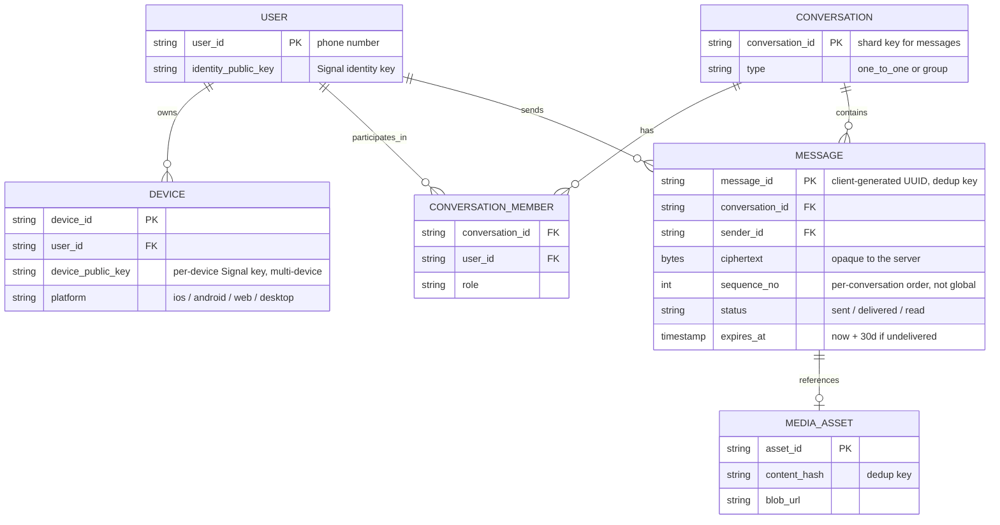

**Two decisions worth naming explicitly:**
- **Shard key is `conversation_id`, not `user_id`** — a conversation's
  messages must stay ordered and colocated; sharding by sender would scatter
  one conversation's messages across shards and make ordering expensive.
- **`ciphertext` is opaque bytes, not a text column** — the schema itself is
  a reminder that the server never gets a plaintext `body` field. If an
  interviewer asks "how would you add full-text search," the schema is your
  evidence for why that has to happen client-side or not at all.

## Architecture evolution: from a whiteboard sketch to WhatsApp scale

**This is the narrative that makes the design memorable** — every component
exists because a specific, nameable bottleneck forced it. Don't present the
final architecture cold; build it up.

### Stage 1 — Naive: it "works" for a demo

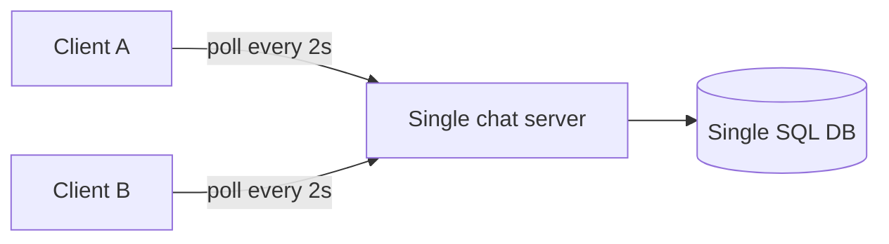

**Breaks at:** more than a few thousand users. Polling wastes connections
and adds up to 2s of fake latency per message; one server and one DB are
both a capacity ceiling *and* a single point of failure.

### Stage 2 — Persistent connections + horizontal scale-out

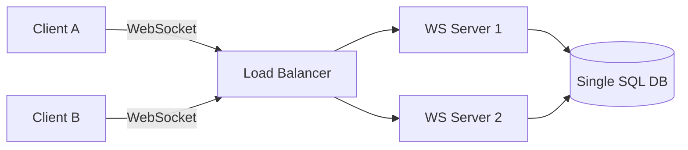

**Fixes:** push instead of poll (real-time, no wasted round trips); many WS
servers instead of one (horizontal capacity).
**New bottleneck:** if Client A is on WS1 and Client B is on WS2, **WS1 has
no way to know which server holds B's socket.** Scaling out the connection
tier created a routing problem that didn't exist with one server.

### Stage 3 — A presence directory, and a real mailbox

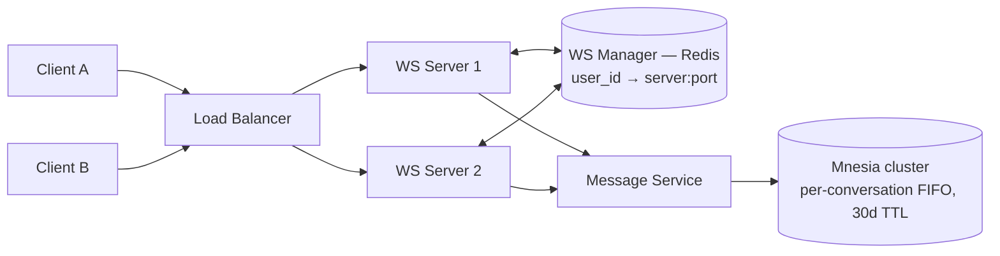

**Fixes:** Redis-backed directory answers "which server is user X on" in
under a millisecond; a real durable, ordered, per-conversation mailbox
replaces the single SQL box, handling offline delivery and the 300 TB/month
buffer correctly.
**New bottleneck:** this whole path only tracks *individual* users. A
group message has no single "receiver" to look up — group membership lives
in a completely different shape of data (who's in Group/X), and looking that
up per message on the hot path doesn't fit this model.

### Stage 4 — Group fan-out joins the picture

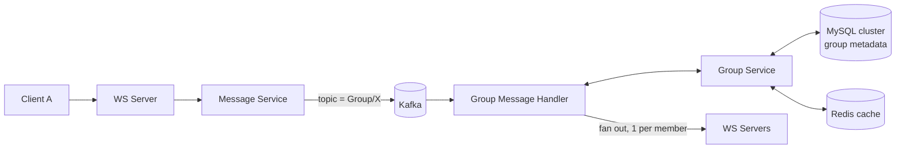

**Fixes:** group = Kafka topic, members = consumers; group membership lives
in MySQL (rarely changes, replicated geographically, cached in Redis) —
deliberately a *different* consistency model than presence, because "who's
in this group" tolerates staleness that "is this socket open right now"
does not.
**New bottleneck:** none of this path has touched media yet. If someone
sends a 5MB video through the same message-service/Mnesia path, it would
multiply that tier's bandwidth by ~350× (see capacity estimation) and — since
Mnesia messages are meant to be small, transient, and quickly deleted —
would badly abuse a store built for chat metadata, not binary blobs.

### Stage 5 — Media splits off, encryption locks the server out of content

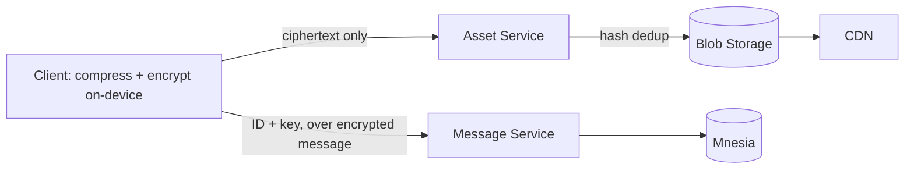

**Fixes:** media bytes never touch the messaging hot path — only a small
ID+key reference does. Client-side encryption (Signal Protocol) means the
server routes and stores **ciphertext it cannot read**, satisfying "not even
WhatsApp can see message content."

**This stage 5, combined with everything from stages 2–4, is exactly the
final architecture in "High-level design" below** — every box in that
diagram is traceable to a specific bottleneck above. That traceability is
what makes the design defensible under follow-up questions instead of a
memorized picture.

## High-level design (final architecture)

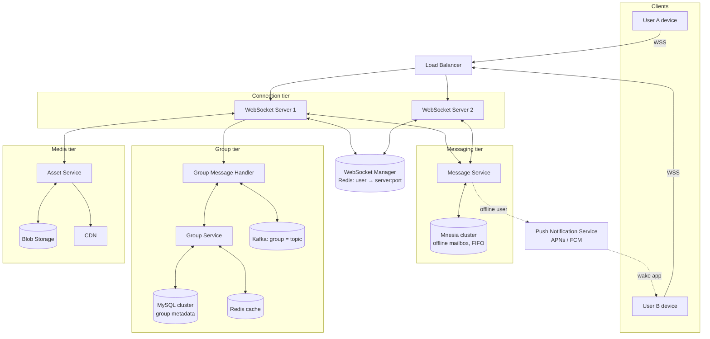

**Component cheat-sheet** (say what each one does in one clause):
- **WebSocket server** — holds the live socket, does almost no business logic, purely IO
- **WebSocket manager (Redis)** — the *presence directory*: `user_id → (server_id, port)`
- **Message service (Mnesia)** — durable FIFO mailbox for offline recipients; deletes on delivery
- **Group service (MySQL + Redis)** — group membership/metadata, replicated geographically
- **Group message handler + Kafka** — fan-out engine for many-to-many delivery
- **Asset service + blob + CDN** — media only, off the hot path, dedup by content hash
- **Push notification service** — wakes backgrounded apps via APNs/FCM when the socket is closed

## Where each subsystem sits on the trade-off map

Different pieces of this design deliberately pick *different* points on the
latency-vs-consistency spectrum. This is the single most senior thing you
can point out — that WhatsApp doesn't apply one uniform consistency model
everywhere, it picks per-subsystem.

```mermaid
quadrantChart
    title Subsystem trade-off placement
    x-axis Low Latency Sensitivity --> High Latency Sensitivity
    y-axis Low Consistency Requirement --> High Consistency Requirement
    quadrant-1 Real-time and must-be-correct
    quadrant-2 Correctness-critical, can be slow
    quadrant-3 Best-effort, can be slow
    quadrant-4 Fast, staleness tolerated
    Message delivery and ordering: [0.85, 0.9]
    Presence directory (WS manager): [0.8, 0.25]
    Group membership metadata: [0.3, 0.7]
    Media blob storage: [0.25, 0.2]
```

- **Message ordering** is top-right: must be fast *and* must be correct —
  hence a per-conversation FIFO with a real durability guarantee.
- **Presence lookups** are fast but tolerate staleness — a WS manager entry
  that's 2 seconds stale after a reconnect is a non-event; that's why it's a
  cache-friendly Redis directory, not a strongly consistent store.
- **Group metadata** can be slow-ish (a new member shows up in a few seconds,
  not milliseconds) but must eventually be correct — MySQL + geographic
  replicas fits.
- **Media** tolerates both slowness and staleness — hence CDN caching and
  async delivery are fine.

## Deep dives

Pick 2–3 based on interviewer signal. Below are seven — know all of them,
lead with whichever the interviewer's team would care about.

### 1. Connection scaling — the C10M problem

**Why this is the centerpiece of the whole design.** Handling 10M+ concurrent
connections on one box is not a database or algorithm problem — it's an OS
and runtime problem. The naive path (1 OS thread per connection, blocking IO)
falls over at a few thousand connections from context-switch overhead and
memory per thread stack.

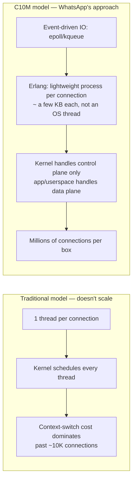

#### 🆕 Protocol choice: WebSocket vs long polling vs MQTT

An interviewer who wants to check you're not just naming "WebSocket" by
reflex will ask "why not long polling, why not MQTT?" — both are real
choices other chat systems made (Facebook Messenger ran MQTT for years on
mobile; long polling is what Stage 1 of this guide's evolution used before
it broke).

| | Long polling | WebSocket | MQTT (over TCP or WS) |
|---|---|---|---|
| Connection model | Client re-opens an HTTP request after every response | One persistent full-duplex socket | One persistent socket, pub/sub topics layered on top |
| Server push | Simulated — server holds the request open, replies, client re-asks | Native — server writes to the socket anytime | Native, plus topic-based fan-out and QoS levels (0/1/2) |
| Per-message overhead | A full HTTP request/response cycle each time | Just a frame on an already-open socket | Just a frame; slightly more than raw WS due to topic/QoS header |
| Battery/mobile cost | High — repeated radio wake-ups on a lossy network | Lower — one socket held open, occasional keep-alives | Lowest of the three — designed for constrained, flaky, battery-limited devices |
| Delivery semantics built in | None — app decides | None — app decides | QoS 1 ("at least once") and QoS 2 ("exactly once" via handshake) are part of the protocol |
| Why WhatsApp doesn't need it | — | This is the choice made (Stage 2 of the evolution) | Gives you QoS and topics for free, but WhatsApp already owns a custom message service + Mnesia mailbox that does the same job with more control over per-conversation ordering |

**If asked "why not MQTT" specifically:** MQTT's QoS levels are attractive
because they look like they solve delivery guarantees for free — but
WhatsApp still needs a custom durable per-conversation mailbox for the
30-day offline window and per-chat ordering, so adopting MQTT would mean
running its broker *in addition to*, not instead of, the message service —
extra moving parts for guarantees you're building anyway.

**How a connection actually gets established and registered:**

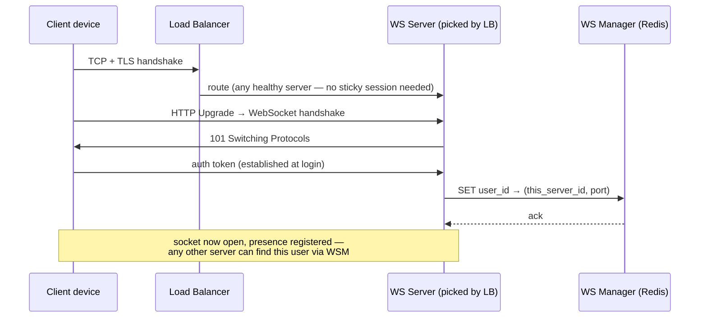

**The load balancer doesn't need sticky sessions** because the WS manager
(not the LB) is the source of truth for "which server is user X on" —
this is why reconnecting to a *different* server after a crash costs one
registration write, not a migration.

**Connection lifecycle**, worth drawing when asked about reconnect behavior:

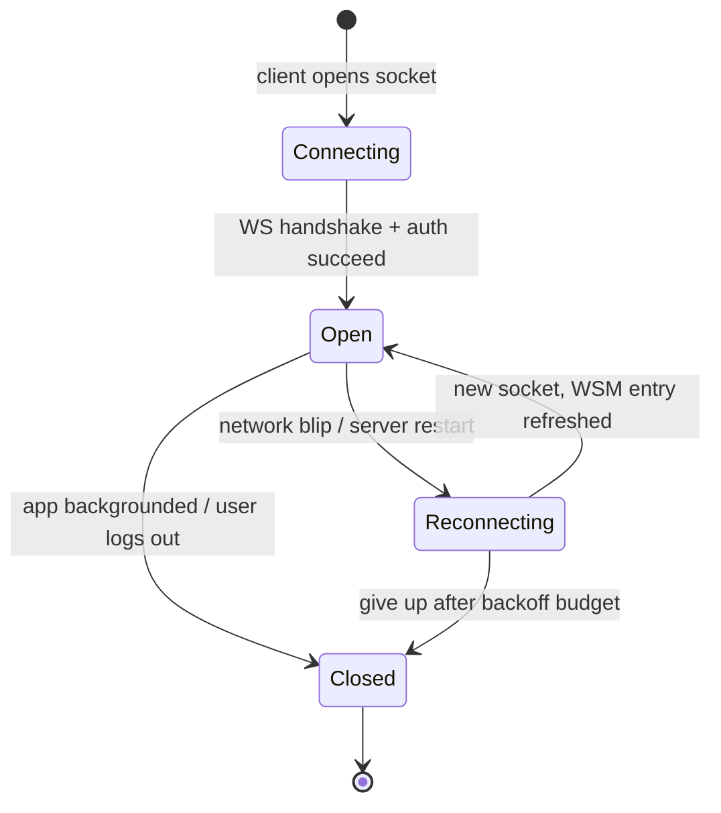

**Naive vs correct reconnect after a server crash** — a classic "what could
go wrong" follow-up:

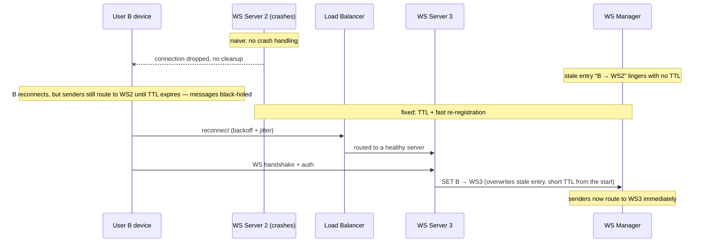

**Real-world specifics to cite:**
- WhatsApp's backend is built on **Erlang/OTP**, running on **FreeBSD**, not
  because of hype but because Erlang's actor model gives you a process per
  connection that costs kilobytes, not megabytes, and the BEAM scheduler
  multiplexes millions of these onto a handful of OS threads.
  "Let it crash" + supervision trees means one bad connection's process
  crashing doesn't take down the server — a supervisor just restarts it.
- Kernel tuning follows the ideas from **Robert Graham's "C10M: Defending the
  Internet at Scale"** talk: raise file-descriptor limits far past OS
  defaults, move packet handling toward userspace, avoid per-packet kernel
  crossings, tune the TCP stack for many idle-mostly long-lived sockets
  rather than many short-lived ones.
- Result WhatsApp actually achieved (2012-era, publicly documented): on the
  order of **1–2 million connections per physical server**, letting the
  entire connection tier for hundreds of millions of users run on a
  surprisingly small server fleet with a famously tiny engineering team.

**Interview payoff:** if asked "how do you scale to a billion connections,"
the wrong answer is "add more servers." The right answer is "first squeeze
orders of magnitude more out of each server via the runtime/OS, *then* scale
horizontally with sharding by user ID hash across the connection tier."

### 2. Message delivery, ordering, and ACK states

**Concrete walkthrough** (use named actors — it's far easier to reason about
out loud than "User A" and "User B"): *Alice is in Mumbai, connected to
`ws-bom-07`. She sends "Running late 🙏" to Bob in Berlin. Bob's phone screen
is off and its socket has been closed by the OS to save battery.*

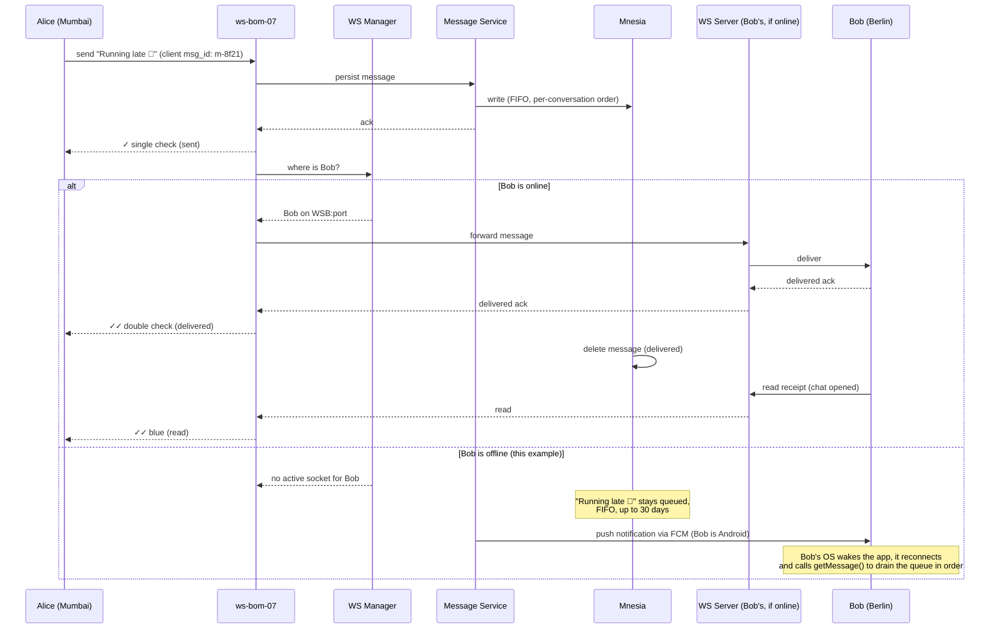

#### 🆕 Delivery decision flowchart: online vs push vs store-and-forward

The sequence diagram above shows one path branching on Bob's state. Here's
that same decision pulled out as explicit logic — this is the shape to draw
if an interviewer asks "how does the system *decide* what to do with a
message":

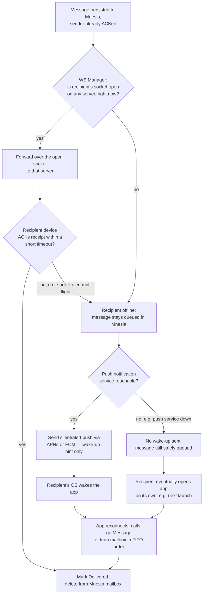

**The one-sentence version:** *online → direct socket forward; offline →
push is only a doorbell, Mnesia is the actual mailbox.* A push failure is
never a durability failure — the message was already safe the moment it was
persisted, before any delivery attempt was made.

**The tick states are a state machine, worth drawing separately when asked
about delivery guarantees:**

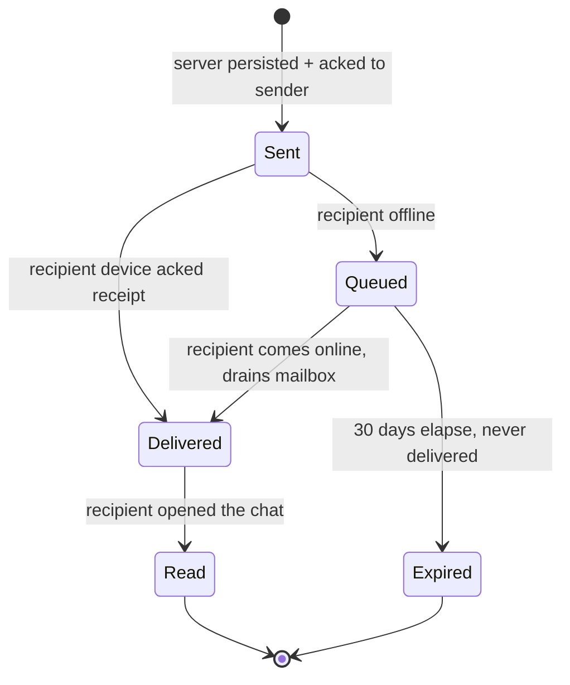

**Privacy nuance worth a one-liner:** users can disable **read receipts**
(the blue ticks) — this only suppresses the Read transition being reported
back to the sender; Sent and Delivered are not optional, since they're part
of the durability guarantee, not a social feature.

**Delivery guarantee to name precisely:** WhatsApp gives **at-least-once**
delivery with **client-side dedup** (via the client-generated message ID,
`m-8f21` above), which *feels* like exactly-once to the user. True
exactly-once delivery across an unreliable network is famously impossible to
guarantee without some form of idempotency token — say this if asked "how do
you guarantee no duplicate messages."

**Ordering:** FIFO is enforced **per conversation**, not globally — a
sequencer or causally-ordered ID (Lamport-style) per chat, not a global
monotonic counter across all of WhatsApp, which would be a needless
single point of contention.

### 3. Sharding — routing one user among thousands of servers

This is the deep dive that answers "OK, but concretely, how does a message
service or WS manager know *which shard* holds Alice's data, out of
thousands of nodes, without a giant lookup table that itself becomes a
bottleneck?"

**Naive approach and why it breaks:**
```
shard = hash(user_id) % N   // N = number of servers
```
This looks fine until N changes (a server is added or removed for capacity
or after a failure) — **almost every key remaps to a different shard**,
because `% N` changes for nearly all `hash(user_id)` values when `N` changes.
That means a massive, unnecessary data/connection migration for a single
node join.

**Consistent hashing fixes this** — nodes and keys are placed on a ring;
a key belongs to the first node clockwise from its hash position. Adding or
removing one node only reshuffles the keys between it and its immediate
neighbor, not the whole ring.

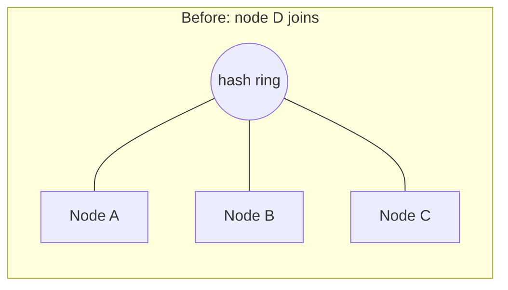

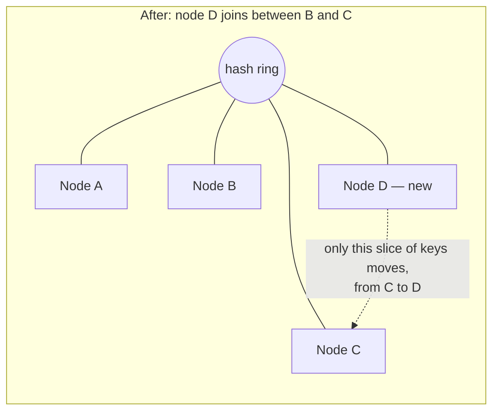

**Mnemonic:** *the ring elects neighbors, not everyone* — a node join/leave
only disturbs its immediate clockwise neighbor's range, never the full
keyspace. This is why consistent hashing (with virtual nodes for even load
distribution) is the standard answer for sharding the WS manager's presence
directory and Mnesia's message partitions, not naive `hash % N`.

**Confused pair — sharding key choice:**

| | Shard by `user_id` | Shard by `conversation_id` |
|---|---|---|
| Good for | Presence/connection routing (WS manager) | Message storage (Mnesia) |
| Why | Each user has exactly one presence entry to look up fast | A conversation's messages must stay ordered and colocated on one shard |
| Wrong choice would cause | Splitting a conversation's messages across shards → expensive cross-shard ordering | Splitting a user's presence data unnecessarily |

### 4. Group message fan-out

Groups don't fit the 1:1 model because the WS layer only tracks *individual*
online users, not group membership — group membership lives in a separate,
much colder, MySQL-backed store.

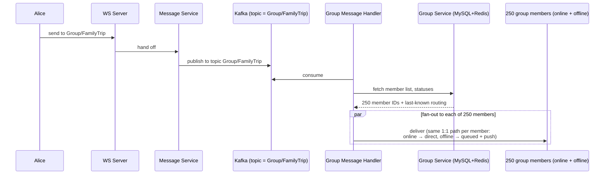

**Concrete cost example:** a 250-person "FamilyTrip" group, one 1KB message
sent. Fan-out-on-write means the group message handler performs **250
individual deliveries** for that single send — 250× the work of a 1:1
message. This is exactly why the cost has to be *bounded*, not optimized
away: cap group size rather than trying to make unbounded fan-out cheap.

**Fan-out-on-write vs fan-out-on-read** — the confused pair every
interviewer expects you to name:

| | Fan-out-on-write (push) | Fan-out-on-read (pull) |
|---|---|---|
| When work happens | At send time, for every member | At read time, per requesting client |
| Write cost | O(group size) per message | O(1) per message |
| Read cost | O(1), pre-delivered | O(group size) or O(messages since last read) |
| Good for | Small/medium groups (WhatsApp's model) | Huge fan-out (celebrity broadcast, Twitter-style) |
| WhatsApp's choice | **Fan-out-on-write**, and *caps group size* (started at 256, raised over time as infrastructure improved) specifically to bound this cost | — |

**Mnemonic:** *write fans, read scans* — push work at write time when
audiences are small and bounded; defer to read time when audiences are
unbounded (celebrity/broadcast scale). This is the same reasoning behind
Twitter's hybrid fan-out for celebrity accounts.

### 5. Media pipeline

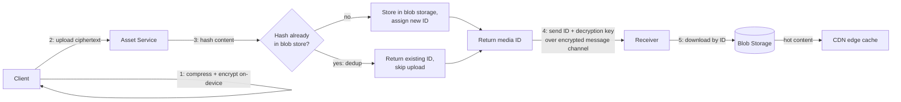

**Concrete example:** a meme gets forwarded 2 million times across various
chats in a day. Without dedup, that's 2 million uploads of the same bytes.
With content-hash dedup, it's **stored once**; every forward after the first
just resolves the same `asset_id` and the CDN serves the hot object from an
edge cache close to each downloader.

**Key point:** the media *bytes* never touch the WebSocket/message-service
hot path — only a small **ID + key** reference does, which is why media
doesn't blow up the latency-sensitive messaging tier even though it's ~350×
the bandwidth of text (see capacity estimation above).

### 6. End-to-end encryption (Signal Protocol) and multi-device

```mermaid
flowchart TD
    A[Sender device] -->|X3DH key agreement,<br/>one-time at first contact| KX[Shared secret established]
    KX --> DR[Double Ratchet:<br/>new key derived per message]
    DR --> ENC[Message encrypted client-side]
    ENC -->|ciphertext only| SRV[Server: routes + stores opaque blob]
    SRV --> DEC[Recipient decrypts client-side]
```

#### 🆕 Key management: how X3DH works when the recipient is offline

The flowchart above says "X3DH key agreement" as if both parties are online
to shake hands — they usually aren't. Bob might be asleep with his phone off
when Alice messages him for the first time. The trick is that Bob
pre-publishes his key material to the server *before* he needs it, so Alice
can establish a session unilaterally:

- **At registration/reconnect, each of Bob's devices uploads a "prekey
  bundle"** to a key-directory service: one long-lived **identity key**, one
  medium-lived **signed prekey** (rotated periodically), and a batch of
  **one-time prekeys** (each consumed once, then the client tops up the
  batch).
- **Alice, sending the first message, fetches Bob's bundle from the server**
  — not from Bob directly — and runs X3DH locally to derive a shared secret,
  then immediately starts the Double Ratchet for that shared secret.
- **The server's role here is a key-value directory it cannot exploit**: it
  hands out public keys, never private ones, so it can enable an offline
  handshake without ever seeing plaintext or being able to forge a session.

```mermaid
sequenceDiagram
    participant B as Bob (offline, phone off)
    participant KS as Key Server (public prekeys only)
    participant A as Alice

    Note over B,KS: earlier, while online
    B->>KS: upload identity key + signed prekey + 100 one-time prekeys

    Note over A: later, Bob is offline
    A->>KS: fetch Bob's prekey bundle
    KS-->>A: identity key + signed prekey + one one-time prekey<br/>(consumed, won't be handed out again)
    A->>A: run X3DH locally → shared secret → start Double Ratchet
    A->>B: first message, carries Alice's ephemeral key<br/>so Bob can derive the same secret once he's back online
    Note over B: Bob comes online, downloads the message,<br/>completes the same X3DH math, session established
```

**One-time prekeys running out is a real operational number worth naming:**
if a device is offline long enough to burn through its uploaded batch, new
senders fall back to using just the signed prekey (weaker forward-secrecy
guarantee for that one session) until the device reconnects and replenishes
its one-time prekey stock — a small, honest gap in an otherwise offline-safe
design, worth mentioning if pushed on "what if the recipient is offline for
weeks."

**Key-change detection:** because the identity key is long-lived, WhatsApp
shows a "security code changed" notice when it changes (new phone, reinstall)
and offers an out-of-band **safety number** comparison — this is the
user-facing seam that turns "trust the key server" into "verify independently
if you're paranoid."

**Two distinct encryption layers — a classic confused pair:**

| | Transport encryption | End-to-end encryption |
|---|---|---|
| What it protects | Client ↔ server link | Sender's plaintext all the way to receiver |
| Who can read content | Server *can*, in principle | Server *cannot*, ever — only the two clients |
| WhatsApp's mechanism | TLS / Noise Protocol handshake | Signal Protocol (X3DH + Double Ratchet) |
| Purpose | Stop network eavesdroppers | Stop *everyone*, including the operator, from reading content |

**Multi-device changes the fan-out math.** Since 2021, WhatsApp lets a user
link multiple devices (phone, web, desktop), each holding its **own** Signal
identity key. A sender must encrypt the same plaintext separately per
recipient *device*, not per recipient user:

```mermaid
sequenceDiagram
    participant A as Alice's phone
    participant B1 as Bob's phone
    participant B2 as Bob's laptop (linked device)
    participant B3 as Bob's tablet (linked device)

    Note over A: Alice sends one message to Bob,<br/>who has 3 linked devices
    A->>A: encrypt copy 1 for Bob's phone key
    A->>A: encrypt copy 2 for Bob's laptop key
    A->>A: encrypt copy 3 for Bob's tablet key
    A->>B1: deliver ciphertext copy 1
    A->>B2: deliver ciphertext copy 2
    A->>B3: deliver ciphertext copy 3
    Note over B1,B3: each device decrypts independently —<br/>server only ever saw 3 opaque blobs
```

**Why this matters architecturally, not just for the security checkbox:**
because content is opaque to the server, **the server cannot do any
content-based processing** — no spam classifiers on message text, no
server-side search, no server-generated link previews without the client
doing that work locally first. If an interviewer asks "how would you add
spam detection," the correct answer acknowledges this constraint: metadata
and behavioral signals (rate, fan-out pattern, reports) only — never content,
without breaking the trust model.

**The latency/security trade-off from the source material, made concrete:**
encrypting/decrypting media on-device (especially larger files) costs real
CPU time on the client before the first byte can even be sent — and with
multi-device, that cost multiplies by the number of linked devices. This is
a genuine, named trade-off: WhatsApp accepts a latency (and battery) tax for
a security guarantee. Say this pairing explicitly if asked to justify E2E
encryption's cost.

### 🆕 7. Presence — online/last-seen, and why it's a *different* problem than routing

Everything earlier that used the word "presence" (the WS manager,
`user_id → server:port`) is **routing presence** — an internal lookup no
user ever sees directly. **Social presence** — the green dot, "online," or
"last seen 2:14 PM" that Bob's contacts see in their chat list — is a
separate feature built on top of it, and conflating the two is a common
interview stumble.

The difference matters because the *audience* is completely different:
- Routing presence is looked up by **one sender at send time** — a single
  read of "where is Bob."
- Social presence must be **pushed to every contact who currently has Bob's
  chat open or contact list visible** — a fan-out, every time Bob's status
  changes.

**Concrete numbers:** an average user has on the order of **150–250
contacts/group-mates**. If every connect/disconnect broadcast presence to
*all* of them unconditionally, 700M concurrent users each toggling status a
few times a day would generate **tens of billions of presence events/day**
just from connects — most of them wasted, because most contacts don't have
that chat screen open at that instant. The fix is to fan out only to
**active subscribers**: contacts who currently have the conversation open
subscribe to that user's presence channel; everyone else pulls a one-time
"last seen" value on demand instead of getting pushed live updates.

```mermaid
sequenceDiagram
    participant B as Bob's device
    participant WS as WS Server (Bob's)
    participant PUB as Presence Pub/Sub (per-user channel)
    participant WSc as WS Server (Carol's, has Bob's chat open)
    participant Carol as Carol's device

    Note over Carol: Carol opens her chat with Bob →<br/>subscribes to Bob's presence channel
    Carol->>WSc: subscribe(presence:bob)
    WSc->>PUB: SUBSCRIBE presence:bob

    Note over B: Bob's socket opens (comes online)
    B->>WS: connect
    WS->>PUB: PUBLISH presence:bob "online"
    PUB-->>WSc: online
    WSc-->>Carol: Bob is online

    Note over B: Bob closes the app (goes offline)
    B--xWS: disconnect
    WS->>PUB: PUBLISH presence:bob "offline, last_seen=now"
    PUB-->>WSc: offline + timestamp
    WSc-->>Carol: Bob last seen just now
```

**Privacy is a first-class design constraint here, not an afterthought:**
WhatsApp lets users hide "last seen" (and, symmetrically, hides others' last
seen from anyone who hides their own) and mutes typing indicators per chat.
That means the presence service needs a **visibility check per (viewer,
subject) pair** before publishing, not just a raw broadcast — a small but
real piece of business logic sitting in front of what would otherwise be a
pure pub/sub fan-out.

**Batching, worth mentioning if asked about a thundering herd:** a
region-wide reconnect storm (e.g., after an outage) would otherwise cause a
burst of presence-changed events all at once; WhatsApp debounces/batches
rapid online→offline→online flaps (e.g., a flaky connection reconnecting
every few seconds) so contacts see one stable status instead of a flicker of
events.

**Mnemonic:** *routing presence answers "where," social presence answers
"is anyone allowed to know."* One is an internal lookup table; the other is
a subscription feed gated by a privacy setting.

## Key design decisions and trade-offs

| Decision | Alternative considered | Why this choice |
|---|---|---|
| WebSocket, not HTTP polling | Short/long polling | Persistent connection avoids repeated handshake+header overhead per message; server can push without the client asking |
| Prioritize consistency over availability (CAP) | Prioritize availability | Message order correctness matters more than 100% uptime during a partition — users tolerate a brief reconnect, not scrambled chat history |
| Consistent hashing for sharding | Naive `hash(key) % N` | Adding/removing a node only reshuffles one neighbor's slice of keys, not the whole ring |
| Fan-out-on-write for groups, with a group-size cap | Uncapped groups + fan-out-on-read | Bounds worst-case fan-out cost; broadcast-scale audiences are explicitly out of scope for "a group chat" |
| Separate asset service/blob/CDN for media | Route media through message service | Keeps the latency-critical text path lightweight; media has utterly different size/bandwidth profile |
| Client-generated message IDs | Server-assigned IDs | Enables idempotent retries and dedup without a round trip first |
| Erlang/OTP + FreeBSD, tuned kernel | Generic thread-per-connection stack (e.g., naive Java servlet model) | Orders-of-magnitude more connections per box; "let it crash" fault isolation per connection |
| E2E encryption (Signal Protocol) | Server-side/at-rest encryption only | Server literally cannot leak plaintext even if breached; matches the "not even WhatsApp" requirement |
| 30-day message expiry for undelivered mail | Indefinite retention | Bounds server storage; assumes indefinitely-offline accounts are abandoned, not a durability guarantee to keep forever |

## Bottlenecks and failure modes

| Failure | Impact | Mitigation |
|---|---|---|
| A WebSocket server crashes | All sockets on it drop | Client auto-reconnects via LB to a healthy server; WS manager entry has a short TTL so stale routing self-heals (see naive-vs-fixed sequence above) |
| WS manager (Redis) becomes unavailable | Can't route between servers — messages can't find the recipient's socket | Redis cluster with replicas; degrade to "assume offline, queue in Mnesia" rather than failing the send |
| Mnesia node failure | Risk of losing queued offline messages | Primary-secondary replication; message isn't ACKed to sender until persisted |
| Hot group / celebrity-scale broadcast | Fan-out-on-write cost explodes for one group | Cap group size; for anything broadcast-shaped, that's a different feature (channels/status), not "a group" |
| Viral media item | Storage + bandwidth spike on one blob | Content-hash dedup (store once) + CDN edge caching absorbs repeat reads |
| Thundering herd on reconnect (e.g., after a regional outage) | Every client reconnects + drains its offline queue at once | Backoff + jitter on client reconnect; rate-limit `getMessage()` drains per connection |
| Push notification service down | Offline users don't know a message is waiting | Not on the durability path — message is still safely queued in Mnesia; push is a convenience wake-up, not the delivery guarantee itself |
| Clock skew across data centers | Breaks naive global message ordering | Don't rely on wall-clock timestamps for ordering — use a per-conversation sequencer / causal ID |
| Hot shard (one node joining/leaving under naive hashing) | Massive unnecessary rebalance | Consistent hashing with virtual nodes bounds the blast radius to one ring neighbor |

## Real-world references

- **Erlang/OTP + Mnesia**: WhatsApp's backend, famously run by a tiny
  engineering team (~50 engineers serving 900M+ users circa 2015), leaned on
  Erlang's process-per-connection model and "let it crash" supervision.
  Mnesia (Erlang's own distributed database) served as the message queue
  store precisely because it's built into the same runtime — no separate
  network hop to a message broker for the hot path.
- **FreeBSD + C10M tuning**: publicly discussed as inspired by Robert
  Graham's C10M talk — moving from a control-plane-only kernel model to
  handling data-plane work (packet/connection handling) in userspace,
  achieving millions of connections per box.
- **Signal Protocol**: WhatsApp adopted Open Whisper Systems' Signal Protocol
  for E2E encryption, completing the rollout in 2016 (X3DH key agreement +
  Double Ratchet for forward secrecy — compromising one message's key
  doesn't expose past or future messages).
- **Noise Protocol Framework**: used for the *transport*-layer handshake
  (client↔server), distinct from and in addition to Signal's E2E layer on
  message content.
- **Kafka for group fan-out**: treating a group as a topic and members as
  consumers is the same pattern used broadly in industry (e.g., Slack's
  message fan-out, various pub/sub chat backends) whenever "one write, many
  readers" needs a durable, ordered buffer between producer and fan-out
  workers.
- **Multi-device (WhatsApp, 2021+)**: originally one phone was the source of
  truth and linked devices (web/desktop) mirrored through it. Multi-device
  support means each linked device has its **own** Signal identity keys, so
  a sender must encrypt the *same* message separately per recipient device —
  fan-out cost now scales with devices-per-user, not just users (see the
  sequence diagram in Deep Dive 6).
- **CDN + hash dedup for media**: the same idea appears in every large media
  system (YouTube, Instagram) — never re-store or re-transcode bytes you can
  prove are identical to something you already have.
- **Chat backup nuance**: WhatsApp's iCloud/Google Drive chat backups are, by
  default, **not** end-to-end encrypted the same way live messages are
  (users must separately opt into encrypted backups) — a good example of how
  an E2E guarantee on the live path doesn't automatically extend to every
  adjacent feature, and worth raising if an interviewer probes "is
  everything always E2E encrypted?"

## Golden rules

- **Concurrent connections, not total users, sizes the connection tier** —
  always convert DAU into a concurrency estimate before dividing by
  per-server capacity.
- **Text is cheap, media is the real bandwidth/storage problem** — size them
  separately, media will dominate by 2–3 orders of magnitude.
- **Presence is a lookup problem, not a database problem** — a fast,
  ephemeral key-value directory (Redis), not a relational table, is the
  right shape for "which server is this user on right now."
- **Different subsystems deserve different consistency models** — presence
  can be stale for a second, message order cannot; don't apply one
  consistency policy uniformly across the whole system.
- **Ordering only needs to be per-conversation, never global** — a global
  sequencer is a needless bottleneck for a feature nobody asked for.
- **At-least-once + idempotent client IDs beats chasing true exactly-once** —
  exactly-once delivery over an unreliable network is not achievable without
  an idempotency token; stop trying to invent around that.
- **E2E encryption means the server is deliberately blind to content** — any
  feature request that needs to "read the message" (spam filters, search,
  previews) must move to the client or work off metadata only.
- **Bound unbounded fan-out with a cap, don't try to make unbounded fast** —
  capping group size is a simpler and more honest fix than over-engineering
  fan-out-on-read for a feature that's supposed to be a small group chat.
- **Consistent hashing bounds the blast radius of scaling events** — a node
  join/leave should reshuffle one ring neighbor's keys, never the whole
  keyspace.
- **The connection tier's efficiency is a runtime/OS problem before it's a
  "how many servers" problem** — squeeze the box (event-driven IO, cheap
  per-connection state) before you multiply the fleet.
- **🆕 Routing presence and social presence are different problems** — one
  is an internal single-reader lookup (WS manager), the other is a
  privacy-gated fan-out to subscribed contacts. Don't design them as the
  same system.
- **🆕 Async E2E handshakes need pre-published key material** — X3DH only
  works with an offline recipient because prekey bundles were uploaded to
  the server ahead of time; the server hands out public keys it can't
  exploit, never private ones.

## Interview strategy cheat-sheet

- Open by naming the CAP stance out loud: *"I'll prioritize consistency over
  availability — losing message order is worse than a brief reconnect."*
  This one sentence answers half the trade-off questions before they're asked.
- **Build up the architecture in stages out loud** (naive → WS manager →
  durable mailbox → group fan-out → media split-off), naming the bottleneck
  that forces each new box. This is more convincing than presenting the
  final diagram from the first minute.
- When asked to estimate servers, catch the DAU-vs-concurrent-connections
  trap yourself before the interviewer has to point it out.
- If steered toward "how would you add feature X" (search, spam detection,
  link previews), immediately flag whether X needs to read message content —
  if so, name the E2E-encryption conflict and propose a client-side or
  metadata-only alternative.
- Draw the group fan-out as a **separate diagram** from 1:1 — conflating them
  is the most common structural mistake candidates make, since group
  membership genuinely lives in a different store (MySQL) than presence
  (Redis).
- If asked "how do you shard this," go straight to consistent hashing and
  explain *why* naive `hash % N` fails on node join/leave — don't just name
  the technique, show you know the failure mode it fixes.
- If asked "why not just use a normal message queue like SQS/RabbitMQ for
  everything," answer with the latency/ordering angle: those are great
  general-purpose queues, but WhatsApp needs sub-100ms delivery to an
  *already-connected* socket most of the time — the durable queue (Mnesia) is
  specifically the *offline* fallback path, not the primary path.
- Keep media entirely separate from the messaging deep dive unless asked —
  conflating "how do messages get ordered" with "how do images get
  compressed and CDN'd" wastes shared time on two mostly-independent
  subsystems.

## Master cheat sheet

**Formulas**
```
avg QPS = messages/day ÷ 86,400
peak QPS ≈ avg QPS × 3–5
daily storage = messages/day × avg message size
retention storage = daily storage × retention days
concurrent connections ≈ DAU × concurrency ratio (≈ 0.25–0.35)
servers needed = concurrent connections ÷ connections-per-server
media bandwidth = (messages/day × media share × avg media size) ÷ 86,400
```

**Numbers**
- 100B messages/day → ~1.16M msgs/sec avg, ~4–6M msgs/sec peak
- 10 TB/day text ingest → 300 TB for a 30-day offline-mailbox buffer
- ~3.6 PB/day media ingest → ~333 Gbps — media, not text, dominates
- ~1–2M concurrent connections/server achievable (WhatsApp's historical C10M result)
- 926 Mb/s text bandwidth each way; media is ~350× that

**Architecture evolution, one line each**
1. Poll + single server/DB → doesn't scale, SPOF
2. WebSocket + horizontal WS servers → who's-on-which-server problem
3. + WS manager (Redis) + Mnesia mailbox → group fan-out doesn't fit
4. + Kafka + group service (MySQL/Redis) → media would blow up this path
5. + Asset service/blob/CDN + client-side E2E encryption → final architecture

**Confused pairs**
- Transport encryption (TLS/Noise) protects the wire; E2E encryption (Signal) protects content from the server itself
- Fan-out-on-write (push, bounded groups) vs fan-out-on-read (pull, unbounded/broadcast)
- At-least-once + client dedup (WhatsApp's real guarantee) vs true exactly-once (not achievable over an unreliable network without an idempotency token)
- Sent (server persisted) vs Delivered (device acked) vs Read (chat opened) — three distinct ACKs, not one
- Shard by `user_id` (presence/routing) vs shard by `conversation_id` (message storage/ordering)
- Consistent hashing (bounded reshuffle) vs naive `hash % N` (reshuffles almost everything on node join/leave)
- Routing presence (WS manager: which server) vs social presence (online/last-seen shown to contacts, privacy-gated pub/sub)
- WebSocket (raw persistent socket) vs MQTT (persistent socket + built-in topics/QoS) — WhatsApp's custom message service + Mnesia already provides the durability MQTT's QoS would give you

**Golden rules, one more time**
- Size connections from concurrency, not total users.
- Media dominates bandwidth — separate it from text in every estimate.
- Presence is a fast ephemeral lookup, not a relational query.
- Different subsystems earn different consistency models — don't flatten them into one policy.
- Order per-conversation, never globally.
- Cap unbounded fan-out rather than engineering around it.
- Consistent hashing bounds the blast radius of scaling events.
- E2E encryption means the server can't read content — design every new feature around that constraint, not against it.
