# Design Typeahead Suggestion — The Story (narrative edition)

> **What this file is.** The reference file, `37-Typeahead-Suggestion-FAANG-Guide.md`, is the one to recite from — requirements, API shapes, every trade-off table, the master cheat sheet. This file is a second way in: the same material as one continuous story, told in plain language. Engineers at a company keep hitting a wall, patch it, and the patch itself creates the next wall — until we land on the exact same design the reference file documents. The company, **Ferret** (a search-engine startup), is fictional. But every wall it hits, and every fix it reaches for, is something a real, documented system actually does: trie data structures (the standard structure behind production typeahead, including Google Search's autocomplete), radix/Patricia trees, Elasticsearch's FST-backed completion suggester, Redis sorted sets, Kafka, HDFS, Cassandra, MongoDB, and ZooKeeper. I'll say clearly, every time, whether something is a documented fact or just a reasonable stand-in number, tagged `[illustrative]`.

**The trigger phrases** for this topic: *"design autocomplete for a search box,"* *"suggest completions as the user types,"* or *"sub-200ms prefix search over billions of strings."* Keep one sentence in your head as you read: **you cannot afford to touch a disk-backed database on every keystroke, so the entire design is just the consequence of pre-computing everything a keystroke might ask for, ahead of time, in RAM.** Everything below is that one idea, getting harder in small, honest steps.

---

## Chapter 1 — The full-table scan that couldn't keep up with typing

It's 2016. Ferret is a two-year-old search-engine startup — nowhere near Google-sized, but real: a crawler, an index, a results page, and now a product manager who wants "a search box that suggests things as you type, like Google's." The team wires up the simplest thing that could work: every keystroke fires a request straight at the app server, which runs one query against the same Postgres table search already uses:

```sql
SELECT title, popularity FROM documents
WHERE title LIKE 'univ%'
ORDER BY popularity DESC LIMIT 10;
```

At launch, with 900,000 indexed titles, this runs in about **9ms**. Nobody notices. It ships.

Two years later Ferret has grown to 40 million indexed titles `[illustrative — growth assumption for this story]` and gets a nice traffic bump from a tech blog. Peak concurrent typists push roughly **4,000 keystroke-requests/sec** at that same endpoint. A common prefix like `"the"` now matches over a million candidate rows, and ranking a million disk-resident rows by popularity — for every one of those 4,000 requests, every second — means Postgres is doing disk seeks (~1–10ms each, a well-documented cost of disk access) far faster than a disk can actually deliver them. p50 latency on the endpoint climbs from 9ms to **380ms**; p99 hits **2.1 seconds**. The connection pool, sized for search traffic and not this, saturates in under a minute — and now typeahead is stealing connections from real search, taking the whole product down over a feature that was supposed to be a nice-to-have.

**The obvious next question:** can we just add an index, or more Postgres replicas? No — a B-tree index narrows down *which* rows start with `"the"`, but it can't change the fact that `"the"` alone legitimately matches a million rows, and ranking any large candidate set by popularity on every keystroke, at disk latency, is a race no amount of replicas wins. The query isn't slow because Postgres is misconfigured — it's slow because a general-purpose disk-backed table was never the right structure for "give me the top completions of this exact prefix, fast."

**The fix, and the analogy for the rest of this story:** replace "scan a table and rank it live" with a **trie** — a tree where each step down spends one more letter of the prefix, and by the time you've walked down to the end of what's typed, everything below that point is already exactly the right candidate set. Picture a **hallway of labeled doors**: door "U", behind it door "N", behind that door "I" — walk the hallway spelling out what's typed, and the room behind the last door only ever contains things that start with that prefix. No scanning, just walking. This is a real, standard structure — production typeahead, including Google Search's autocomplete, is documented to work this way — and it turns the lookup into **O(prefix length)** instead of a scan over millions of rows.

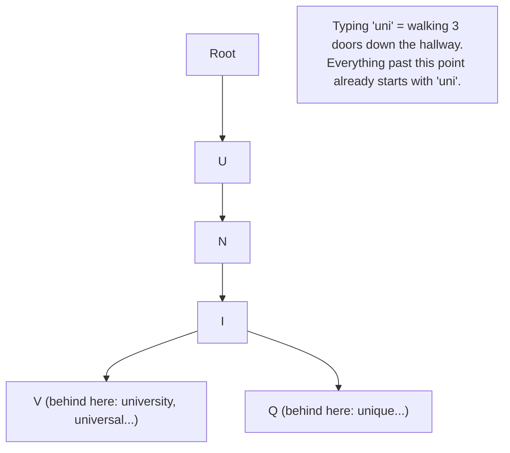

**New problem, day one of the fix:** the trie lives entirely in one application server's RAM, built once at boot from a snapshot file. It works beautifully — lookups drop to **under 1ms**. But six weeks later, a routine deploy restarts that server. Rebuilding the trie from its snapshot takes **40 minutes**; for those 40 minutes the search box has zero suggestions, and any query volume that arrived while it was down is simply gone — there was nowhere durable for it to land.

**How I'd say this in an interview:** "A prefix lookup against a disk-backed table isn't a tuning problem, it's a wrong-data-structure problem. A trie turns prefix lookup into walking a tree one character at a time, O(prefix length), fully in RAM. But a trie living in one process's memory is fragile — it's gone the second that process restarts, and that's the very next thing to fix."

---

## Chapter 2 — The trie that remembers nothing after a crash

The fix: stop treating "answer this keystroke" and "remember this query happened" as the same job. Split them into two paths that run on completely different clocks. A lightweight **Suggestion Service** holds the trie in RAM and only ever answers reads. Separately, every submitted query gets appended to a durable, disk-backed, append-only log — HDFS, in Ferret's case, a real, documented store built exactly for huge unstructured write volume. Call this the **Back Office**: it doesn't need to be fast, it just needs to never lose anything, and it works on its own schedule, not the user's.

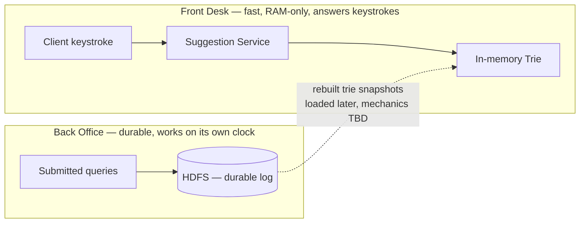

Now a crash of the read-serving box loses nothing that matters — the trie itself is disposable and rebuildable, because the actual frequency data lives durably in the Back Office. This is a legitimately good architecture, and it holds up for a long while.

**New problem:** it holds up until Ferret's scale genuinely stops fitting on one machine. Using the same kind of Google-scale assumptions the reference guide's own capacity math walks through — billions of queries a day, ~2 billion unique queries needing to be tracked, which works out to roughly **21.9 TB/year** of raw query data — one machine's RAM was never going to hold a trie built from a corpus that size. And on the read side, a single Suggestion Service instance handling on the order of **8,000 QPS** is nowhere close to a peak demand in the hundreds of thousands of requests per second — the reference guide's own worked math lands on a floor of roughly **76 servers** just for that read tier, before redundancy. One trie. One machine. Not enough of either.

**How I'd say this in an interview:** "Splitting the fast read path from the durable write path fixes 'a crash loses everything' — reads become disposable and rebuildable from durable data. But it doesn't fix scale: at real traffic volumes, one machine's RAM can't hold the whole corpus, and one instance can't absorb the read QPS. That's a sharding problem, not a durability problem, and it's the next one to solve."

---

## Chapter 3 — One machine was never going to hold the whole vocabulary

The fix: stop pretending one trie can do this alone. Split the trie into **N independent shards**, each on its own machine, and put a load balancer in front of a fleet of Suggestion Service instances that each know how to reach the right shard. The first, obvious way to split it: alphabetically — shard 1 owns everything starting `A`–`M`, shard 2 owns `N`–`Z`.

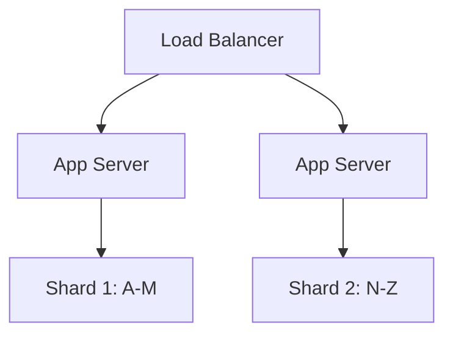

This immediately buys headroom — no single machine holds the whole corpus, no single instance eats all the QPS. But it breaks the moment someone looks at *how* traffic actually splits across those two shards.

> **Aside — should Ferret even build this?** A senior interviewer will often ask this directly: "would you build a custom sharded trie, or reach for something off the shelf?" Two real, documented alternatives exist: **Redis sorted sets** (`ZADD` to score terms by frequency, `ZRANGEBYLEX` to simulate a prefix range scan) need almost no custom code, since the ops team already runs Redis. **Elasticsearch's completion suggester** is a purpose-built structure — an FST (finite state transducer), a real, documented data structure — that already handles fuzzy matching and weighting. The honest answer: most products, Ferret included at this size, should reach for one of those first. You build a custom sharded trie only once you're at a scale where off-the-shelf ranking flexibility genuinely becomes the bottleneck — which is exactly the scale this story is about to reach.
>
> ```mermaid
> quadrantChart
>     title Build vs buy: operational cost vs ranking control
>     x-axis "Low operational cost" --> "High operational cost"
>     y-axis "Low ranking flexibility" --> "High ranking flexibility"
>     quadrant-1 "Full control, high cost"
>     quadrant-2 "Overkill for the need"
>     quadrant-3 "Simple, limited"
>     quadrant-4 "Balanced"
>     "Redis Sorted Set": [0.25, 0.3]
>     "Elasticsearch Completion Suggester": [0.55, 0.55]
>     "Ferret's Custom Trie": [0.85, 0.9]
> ```

**How I'd say this in an interview:** "Sharding the trie is the same move you'd make with any dataset that's outgrown one box — split it, put a fleet in front of it. But I'd name the alternatives first: Redis sorted sets or Elasticsearch's completion suggester solve this for most products with far less custom code. A hand-rolled sharded trie is worth its cost only once you're at a scale where ranking control genuinely matters more than operational simplicity."

---

## Chapter 4 — The alphabet was never a fair way to split the work

Real number: English words starting with `S` or `C` vastly outnumber words starting with `X` or `Z` — plausibly over **100x more common** `[illustrative — exact ratio depends on the corpus, but the direction is a well-known property of English]`. Ferret's `A`–`M` / `N`–`Z` split isn't remotely 50/50: shard 1 ends up holding roughly **68%** of both the data and the query traffic, while shard 2 idles. Under peak load, shard 1's CPU sits pinned at 95% while shard 2 sits at 30% — one shard is effectively still the bottleneck the sharding was supposed to remove.

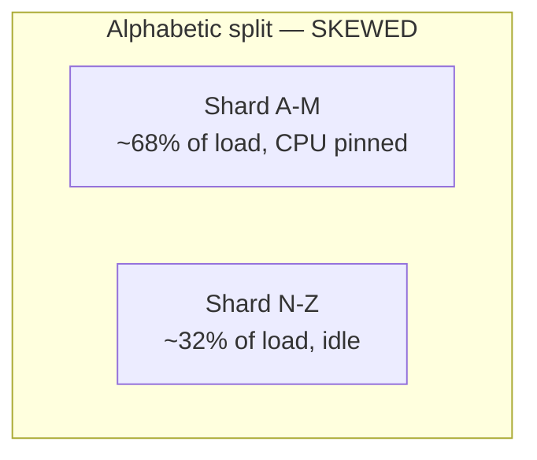

**The obvious next question:** can we redraw the boundary lines to be fairer? That's fragile — English isn't static, and any fixed boundary you hand-tune today drifts wrong as the corpus grows. The real fix is to stop partitioning by something humans assigned (the alphabet) and partition by something computed and evenly distributed instead: **hash the prefix, and use the hash to pick a shard.** This is the same, real technique used to fix hot keys in any sharded cache — a hash spreads load close to evenly regardless of what the underlying data actually looks like.

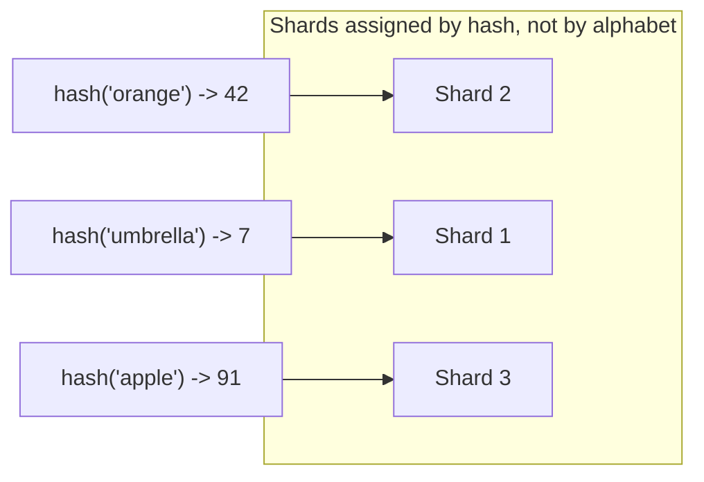

Each shard also gets a **primary + secondary replica** — the same durability pattern every stateful sharded service needs, so one machine's disk failing doesn't erase that slice of the corpus. A small `prefix → shard` routing table lives in every app server's memory, cheap enough to never itself be a bottleneck.

**New problem:** fair sharding fixes *which machine* owns a prefix. It says nothing about *how expensive* answering a query is once it lands there. A prefix like `"a"` still has millions of descendants in its subtree, and finding the top-10 out of millions, live, on every request, is its own expensive problem — regardless of which shard it landed on.

**How I'd say this in an interview:** "Alphabetic partitioning is provably skewed — English isn't uniform, so ranges built on it aren't either. Hashing the prefix spreads load by math instead of by accident, which is the standard fix for hot shards in any sharded system. But that only answers *where* a prefix lives — it doesn't make answering the query itself any cheaper, and for a short, popular prefix, that's still a real cost."

---

## Chapter 5 — The letter that makes every lookup expensive

Naive approach inside one shard: walk the Hallway of Doors down to the node for the typed prefix, then depth-first-search the entire subtree below it to find the top-10 by frequency. For a prefix like `"a"`, that subtree might hold **2 million descendant words** `[illustrative — order-of-magnitude stand-in for "a very common short prefix"]`. Doing a full scan of 2 million nodes, on every single keystroke that happens to end in `"a"`, blows the latency budget even with a perfectly-sharded, all-RAM trie.

**The obvious next question:** do we need to search the subtree at request time at all, if the data barely changes between requests? No — and that's the actual production trick: **precompute and cache the top-K completions at every internal node, bottom-up, at build time.** Extend the Hallway of Doors analogy: **pin a note on every door**, listing the best rooms behind it, written the night before by someone who already walked the whole hallway once. A visitor at that door in the morning just reads the note — they never walk the hallway themselves.

Worked example, building the top-2 note for the `"SAN"` door from its children's already-written notes:

```
SANDWICH subtree's note:  [SANDWICH:30]
SANDBOX  subtree's note:  [SANDBOX:22]
SANTA    subtree's note:  [SANTA:18]

Merge (like the merge step of merge sort — each note is already sorted):
  candidates = [SANDWICH:30, SANDBOX:22, SANTA:18]
  top-2      = [SANDWICH:30, SANDBOX:22]   <- pinned on the "SAN" door itself

Cost: O(K x number of children at this door), NOT O(everything behind it).
```

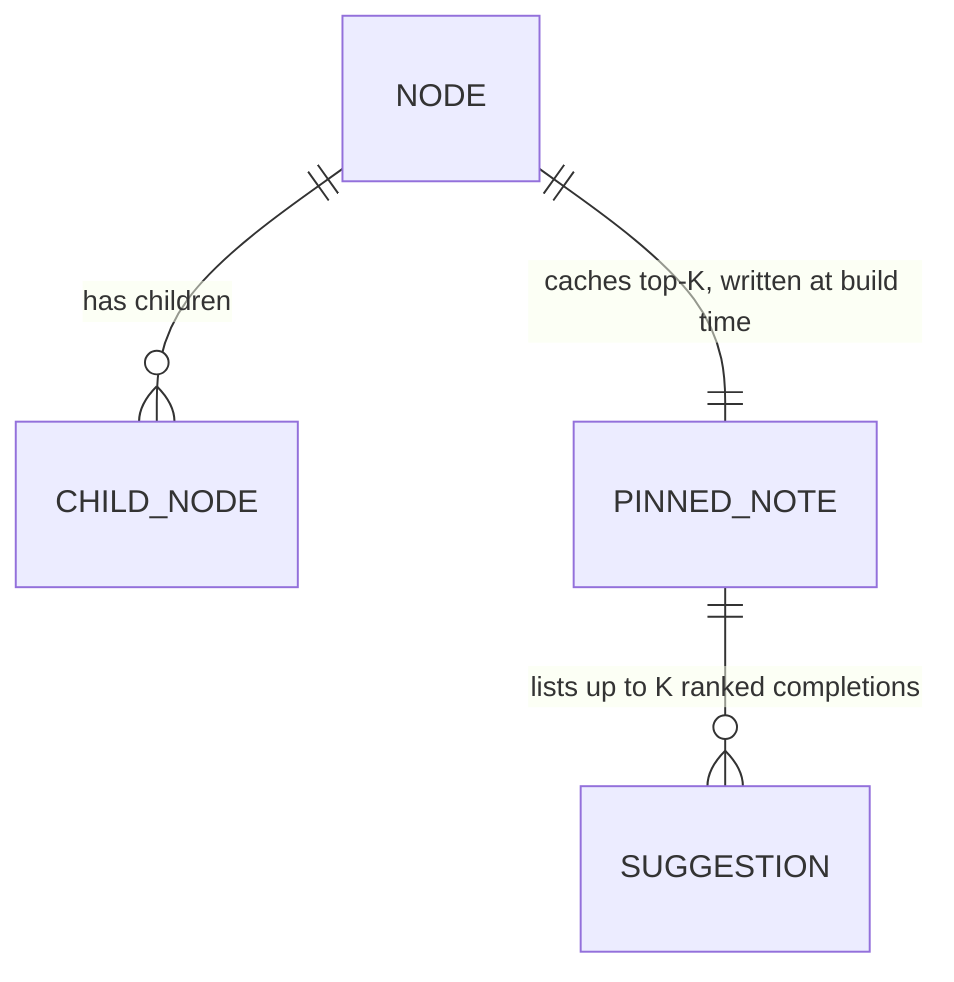

A related space trick, same hallway: a plain trie wastes doors on single-child chains (`U`→`N`→`I` when nothing ever branches). Collapse those into one door with a multi-letter label — a **radix or Patricia trie** — call it an **express corridor**: same information, fewer doors to walk through, so even the O(prefix length) walk gets shorter. This is what production typeahead systems actually use over a plain trie.

Now `getSuggestions("san")` is: walk 3 doors, read the pinned note → **O(prefix length + K)**, full stop, regardless of whether `"san"` has 4 descendants or 4 million. The ranking work happened once, at build time, and every future read just reuses it for free.

**New problem:** the notes are pinned at *build* time. Frequencies keep changing as new queries come in — so who actually walks the hallway overnight to rewrite the notes, and how do they do it without a visitor mid-read seeing a half-rewritten note?

**How I'd say this in an interview:** "The naive version re-derives the top-K by scanning a subtree on every request — fine for a rare prefix, catastrophic for a common one. The fix is precomputing top-K at every node, bottom-up, with a k-way merge of each child's already-sorted list — that's O(K times branching factor) at build time, and O(prefix length plus K) forever after at read time. It's the single highest-leverage optimization in this whole design."

---

## Chapter 6 — Who rewrites the notes, and how, without lying to a reader mid-sentence

The tempting shortcut: have the Suggestion Service mutate the live trie directly the moment a new query comes in — bump a counter, maybe rewrite a pinned note. Two honest ways this goes wrong: lock the structure during the update and every concurrent reader stalls, killing the whole point of an in-RAM trie; or don't lock it, and a reader can catch the tree **mid-mutation** — descending into a node whose pinned note is half old, half new, an inconsistent answer nobody actually asked for.

**The fix:** never mutate the live trie on the read path, at all. Do it entirely offline, in a separate pipeline, on a separate clock, and only ever hand the live service a **finished, complete replacement** — never a structure being edited while someone reads it.

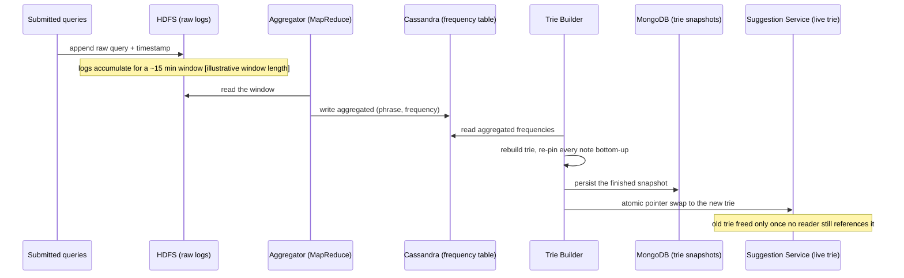

Each storage choice here is a real, documented fit for its job: HDFS for huge append-only write volume, Cassandra as a wide-column store for the aggregated frequency table, MongoDB (or any blob store) for a snapshot that's loaded as one whole object rather than queried field-by-field, and ZooKeeper for "which snapshot is currently active" coordination. The swap itself is the same trick used for config reloads and for **Lucene/Elasticsearch segment merges** — new segments get built, old ones are never edited in place, only replaced.

A reader never sees a half-rewritten note, because the note-rewriting happens on a separate, discarded copy of the hallway, and the Suggestion Service only ever gets pointed at a hallway that's already 100% finished:

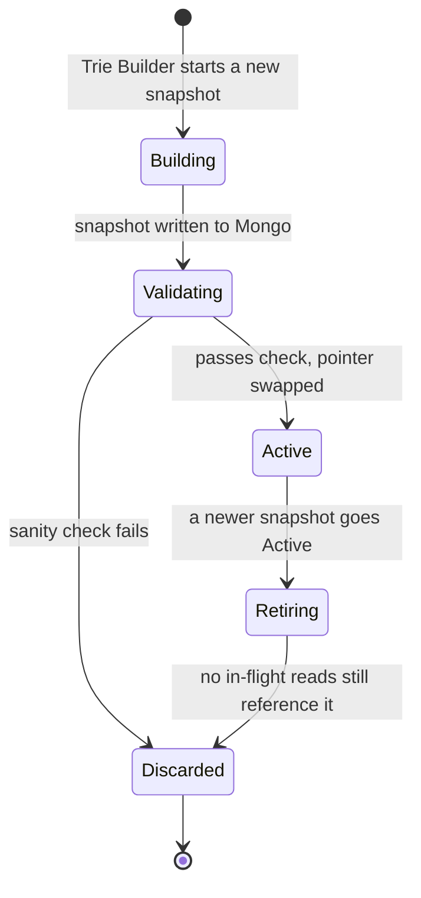

**New problem:** this whole pipeline runs on a **~15-minute window** `[illustrative — matches the reference guide's own batch-window assumption]`. Fine for "university" slowly climbing in popularity over days. Genuinely wrong for a term that needs to appear in seconds, not a quarter of an hour.

**How I'd say this in an interview:** "The rule is: never mutate a structure a live reader might be walking. Build the replacement fully, offline, then swap a pointer atomically — the exact same idea as a Lucene segment merge or a blue-green deploy. The `Retiring` state is the detail people forget: you can't free the old trie's memory the instant the new one goes live, because in-flight reads might still be on it."

---

## Chapter 7 — Fifteen minutes is forever when something goes viral

Concrete scenario: a major event breaks and a search term nobody had typed before jumps from near-zero to being typed **40,000 times in the first three minutes** `[illustrative]`. Ferret's batch pipeline is still on its 15-minute clock. For those first several minutes, typing the first few letters of that term returns nothing useful — the trie is telling the truth about 15 minutes ago, and 15 minutes ago this term didn't exist yet.

**The obvious next question:** do we just shrink the batch window to 30 seconds? That would mean rebuilding and re-swapping the *entire* corpus's trie every 30 seconds — real CPU and I/O cost, for the sake of a tiny fraction of terms that are actually spiking. The fix is smaller and more targeted: run a **second, much lighter pipeline**, on a Kafka topic (a real, documented streaming system), that does nothing but watch for spikes over a short sliding window and writes hits into a tiny **overlay cache** — a **sticky note stuck next to the directory board**, checked alongside the main hallway on every request, never replacing it.

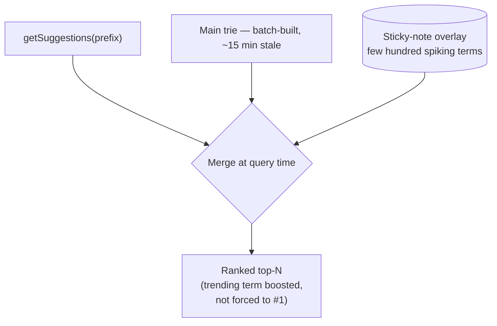

The overlay stays small on purpose — a few hundred to low thousands of terms `[illustrative]`, not millions — so checking it on every request is cheap, and it never *replaces* the batch trie. If the stream processor breaks entirely, the failure mode is "we lose the breaking-news boost," never "suggestions disappear."

A related, separate problem hides in the opposite direction: a prefix with genuinely only 2 historical matches. Padding the response to 10 with low-relevance junk is worse than honestly returning 2 — the rule is a minimum relevance floor, below which a candidate gets dropped, not padded in. If a prefix has zero trie hits at all, the answer is an empty list with a normal 200, not an error and not a slow full-text fallback.

**How I'd say this in an interview:** "The batch trie and the trending overlay solve two different timescales — minutes-to-hours corpus-wide freshness, versus seconds-scale spikes for a tiny number of terms. They merge at query time, and the overlay is purely additive, so a bug in it degrades gracefully instead of taking anything down. Separately: a thin prefix should return fewer results, never padded ones — that's a relevance rule, not a bug."

---

## Chapter 8 — Asking the same expensive question a million times over

Even with a perfectly sharded, perfectly cached-at-build-time trie, one more waste shows up under real traffic: the *same* short, common prefixes — `"a"`, `"the"`, `"how to"` — get asked by nearly every user, over and over, and every single one of those repeat asks still does a real network hop to a trie shard to get an answer that hasn't changed since the last person asked it thirty seconds ago.

**The fix:** stack cache layers in front of the trie shard, each one existing purely to avoid paying for the layer below it — call it the **Front-Desk Chain**: a visitor first asks whoever's standing right next to them, then the building's front desk, then the branch office, and only as an absolute last resort walks all the way to the actual hallway of doors.

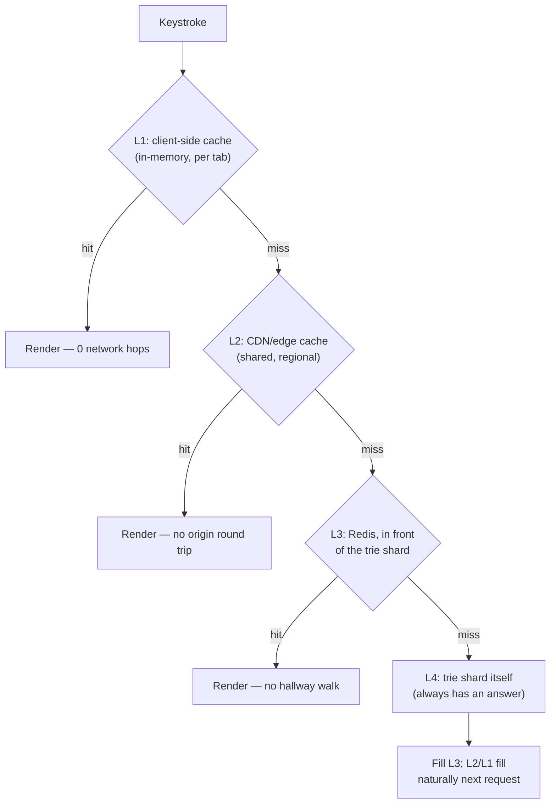

Hit rate drops sharply as prefixes get longer: `"a"` is asked by almost everyone; a 25-character prefix is asked by almost no one `[illustrative — direction is obvious, exact numbers vary by product]`. So the layers are worth it exactly where they pay off — short, common prefixes — and long-tail prefixes are fine missing all the way down to the trie shard, because L4's cost is O(prefix length + K) regardless of how rare the prefix is.

**The rule that's easy to miss:** every cache layer's TTL has to be shorter than or equal to the batch rebuild window from Chapter 6. Otherwise a cache can serve an answer *staler than the trie itself already is*, which defeats the entire point of bounding staleness in the first place.

**How I'd say this in an interview:** "Four cache layers — client, edge, Redis, trie — each one shields the layer under it, and each one matters most for short, common prefixes where hit rate is highest. The one rule that's genuinely easy to get wrong: cache TTL has to stay under your rebuild cadence, or you can end up serving something staler than the source of truth."

---

## Chapter 9 — The most frequent answer isn't always the right one

Ferret's ranking, so far, is purely "highest raw frequency wins" — the number pinned on each door's note. Real complaint from a beta user: they search `"piz"` constantly meaning `"pizza dough recipe"` — they're a home baker — but Ferret always shows `"pizza hut"` first, because globally that's what most people mean by `"piz"`. A second, separate complaint: a term that was genuinely popular back in 2019 still outranks this week's actually-trending term, because raw counts never decay. A third: some suggestions surfaced actively offensive completions, because "frequent" said nothing about "acceptable."

**The fix:** ranking becomes a pipeline, not a single number — the same real, documented shape Google's autocomplete is described as using: global frequency blended with recency decay, personal history, a policy filter, and a diversity check, in that order.

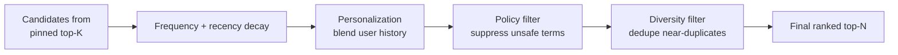

Worked example for the personalization blend — a weighted mix, evaluated only when a user's history exists:

```
final_score = (0.7 x normalized_global_frequency) + (0.3 x normalized_personal_affinity)
  [illustrative weights — shift toward 0.5/0.5 for a user with a long, confident history]

Prefix "piz", for a home baker with real history:
  "pizza hut"          global=0.90  personal=0.05  -> 0.7(0.90)+0.3(0.05) = 0.645
  "pizza dough recipe" global=0.20  personal=0.95  -> 0.7(0.20)+0.3(0.95) = 0.425

  Ranked: "pizza hut" still first — personalization nudges the order,
  it doesn't flip an overwhelmingly popular global result on its head.
```

Recency decay (halving raw counts every N days, say) solves the stale-2019-term problem as a side effect, and also caps the 64-bit frequency counters from growing unbounded forever. Policy filtering just runs as a hard block before anything reaches the client, independent of frequency. This is also the natural point to mention the real-world personalization/geo layer: pushing the hottest global prefixes to edge nodes near the user, and blending in a per-user history service before the list leaves the region — the layer most candidates never reach in 45 minutes, and naming it unprompted is a genuine depth signal.

**New problem:** all of this — pinned notes, decay, personalization, policy — only ever matches what someone typed *exactly*. The trie has never once been asked what to do about a typo.

**How I'd say this in an interview:** "Raw frequency is a reasonable v1, but real ranking is a pipeline: decay so old popularity ages out, a personalization blend that nudges rather than overrides, a hard policy filter, and a diversity pass. Google's autocomplete is documented to work this way — it's never just 'sort by count' at that scale."

---

## Chapter 10 — The word the trie has never seen spelled that way

A user types `"unversity"` — one letter short of `"university"`. The Hallway of Doors has no door literally labeled `unver...`, so the exact-prefix walk finds nothing at all, even though the intended word is sitting right there in the trie under a door one letter different.

**The obvious next question:** do we just also index every likely misspelling? That doesn't scale — the space of possible typos per word is large, and pre-indexing them bloats every note on every door for a benefit that only helps some fraction of users, some of the time. The real fix is to widen the search itself, only when the exact walk fails: walk **nearby doors** — anything within a small edit distance (usually ≤2) of what was actually typed — using a **Levenshtein automaton walked over the trie**, a real, documented technique that's what Lucene and Elasticsearch's own fuzzy suggester actually use in production.

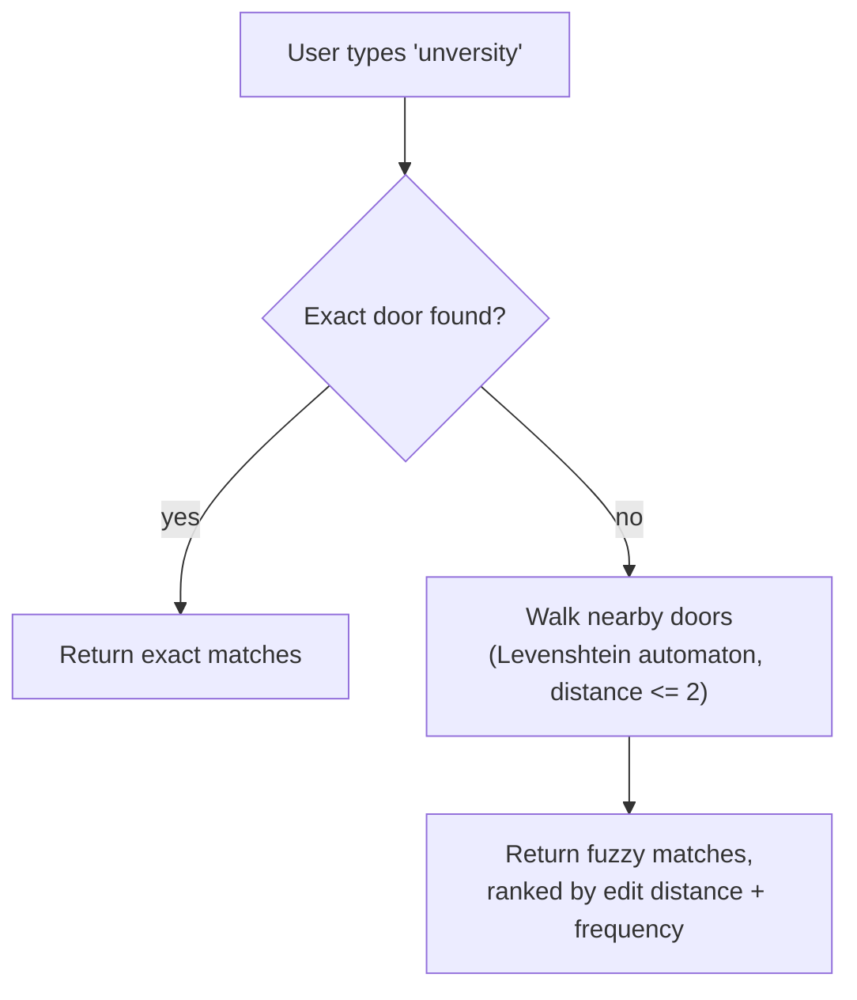

Cheaper, less complete alternatives exist and are worth naming even if the automaton is the production answer: computing edit distance against candidate branches directly at query time (simple, but expensive if done naively); a **BK-tree**, a separate structure pre-built purely for fast "within distance K" lookups; and a client-side keyboard-adjacency correction (cheapest of all, catches the single most common typo class — hitting the key right next to the intended one — before the request even leaves the browser).

**New problem:** fixing what the *server* does with an imperfect prefix doesn't touch a completely different bug that shows up purely on the client, in the browser, with no typo involved at all.

**How I'd say this in an interview:** "A plain trie only matches exact prefixes, so a typo returns nothing. The production answer is a Levenshtein automaton walked over the trie — exactly what Lucene and Elasticsearch's fuzzy suggester do — but I'd only design that live if pushed; naming it correctly as the standard technique is usually enough."

---

## Chapter 11 — The answer that shows up late and wins anyway

A fast typist types `"un"` then, half a second later, `"univ"`. Two requests go out, back to back. `"un"` is a huge, expensive prefix (it has to check millions of descendants before the pinned note trims it down); `"univ"` is small and returns almost instantly. Real number: the `"univ"` response comes back in **40ms**; the `"un"` response — despite being sent *earlier* — is still working its way back and lands **210ms** later. If the client just renders whatever arrives last, the stale, huge `"un"` result list overwrites the correct, already-rendered `"univ"` list, and the user watches their screen visibly go backwards.

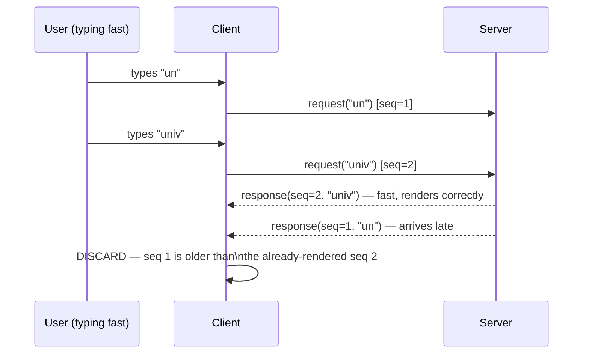

**The fix:** tag every outgoing request with an increasing sequence number, and on the client, discard any response whose sequence number is lower than the most recent one already rendered — a **Late Letter Discard**: if a letter shows up after a newer one already got read out loud, you just don't read the old one. Pair this with a **debounce** (wait roughly one human inter-keystroke interval — about 160ms, a commonly cited average — before firing a request at all) so a fast typist who already knows what they want doesn't fire eight requests for an eight-letter word in the first place. Pre-warming the connection the instant the search box is focused, and caching a re-typed or backspaced-into prefix locally for free, round out the client-side list.

**How I'd say this in an interview:** "Debouncing cuts request volume, but it doesn't fix out-of-order network delivery — a slow response for an earlier, bigger prefix can still land after a fast response for a later, smaller one. The fix is a sequence number on every request and response, and the client throws away anything older than what it's already rendered."

---

## Where the story actually lands

```mermaid
flowchart LR
    A["Ch1: full-table scan\n(disk-bound, breaks at scale)"] -->|"fixes: fast lookup\nbreaks: one process, gone on crash"| B["Ch2: hot/cold split"]
    B -->|"fixes: durability\nbreaks: one trie can't hold it all"| C["Ch3: shard the trie"]
    C -->|"fixes: scale\nbreaks: alphabet is skewed"| D["Ch4: hash-based sharding"]
    D -->|"fixes: fair load\nbreaks: popular prefix = expensive read"| E["Ch5: pinned top-K per node"]
    E -->|"fixes: cheap reads\nbreaks: who rewrites notes safely?"| F["Ch6: offline pipeline + hot-swap"]
    F -->|"fixes: safe updates\nbreaks: 15 min too slow for viral terms"| G["Ch7: trending overlay"]
    G -->|"fixes: freshness\nbreaks: same hot prefixes hammered repeatedly"| H["Ch8: cache layer stack"]
    H -->|"fixes: repeat-ask cost\nbreaks: raw frequency is bad ranking"| I["Ch9: ranking pipeline"]
    I -->|"fixes: relevance\nbreaks: typos find nothing"| J["Ch10: fuzzy matching"]
    J -->|"fixes: typo tolerance\nbreaks: stale responses win the race"| K["Ch11: sequence numbers"]
```

```mermaid
mindmap
  root((Why typeahead needs\nall of this))
    Read speed
      DB scan is disk-bound
      trie = O(prefix length), all RAM
    Durability
      one process's RAM = gone on crash
      split hot path from durable log
    Scale
      one machine can't hold the corpus
      shard, and shard fairly (hash, not alphabet)
    Read cost
      popular prefix = huge subtree
      precompute top-K at every node
    Safe updates
      never mutate what a reader is walking
      build offline, swap the pointer atomically
    Freshness
      batch window is minutes, viral is seconds
      small streaming overlay, merged, never replacing
    Repeat cost
      same common prefixes asked constantly
      layer caches, TTL under rebuild cadence
    Relevance
      raw frequency ignores the actual person
      decay + personalization + policy + diversity
    Typos
      exact-prefix match finds nothing
      Levenshtein automaton over the trie
    Client timing
      slow early response can overwrite a fast later one
      sequence numbers, discard the stale one
```

Every real typeahead system sits somewhere on this chain. A small product might reasonably stop around Chapter 5 or 6 — trie, sharded, safely rebuilt offline. A search engine at Ferret's eventual scale needs the trending overlay, the cache stack, and real ranking too. Walking all eleven chapters unprompted when nobody asked about freshness or typos reads as padding, not depth — stop where the stated requirements say to stop.

---

## Grill me — adversarial follow-ups

**Q1: "Why not just throw a bigger, faster database at Chapter 1 instead of building a trie?"**
Because the problem isn't disk speed, it's the shape of the query — ranking a huge, unbounded candidate set by popularity on every keystroke is expensive no matter how fast the disk is. A trie changes the actual complexity of the operation to O(prefix length); a faster database just delays when the same wall gets hit.

**Q2: "Isn't 'shard the trie' just Chapter 1's single-point-of-failure problem, smaller?"**
Yes, and that's exactly why replication has to come with sharding, not after it as an afterthought — each shard still needs a primary and a secondary, or you've just built sixty small versions of the original crash risk instead of one big one.

**Q3: "Why hash the prefix instead of, say, hashing the whole query string?"**
Because the routing decision has to happen before you know the full query — you're routing on what's been typed *so far*, which is the prefix. Hashing the full string would tell you nothing useful about which shard owns a partial prefix mid-keystroke.

**Q4: "Walk me through what happens if the Trie Builder crashes halfway through rebuilding a snapshot."**
Nothing user-facing happens — the live trie is untouched, because the builder was only ever writing to a separate, not-yet-active snapshot. The next scheduled build just tries again; the cost is one extra window of staleness, not an outage.

**Q5: "If the trending overlay is checked on every single request, doesn't that overlay become the new bottleneck?"**
No, because it's deliberately tiny — a few hundred to low thousands of terms, not millions — so checking it is closer to a cheap in-memory set lookup than a real query. It's cheap precisely because it isn't trying to be complete, only trying to catch spikes.

**Q6: "Doesn't caching short, common prefixes aggressively just mean long, rare prefixes always feel slow?"**
They're not slow in an absolute sense — a cache miss still only costs a trie descent of O(prefix length + K), which is cheap regardless of how rare the prefix is. It's "slower than a cache hit," not "slow" in any way a user would notice.

**Q7: "Personalization sounds like it could make results worse for a new user with no history — how do you handle that?"**
The blend weight is exactly the lever — a user with thin or no history gets a personalization weight near zero and rides almost entirely on global frequency, and the weight only shifts toward personal as real history accumulates. It's a dial, never an on/off switch.

**Q8: "Why not just always run the fuzzy/Levenshtein path — wouldn't that also catch typos on the very first try?"**
Because it's strictly more expensive than an exact-prefix walk, and the overwhelming majority of keystrokes aren't typos — paying that cost on every request to catch the rare case is a bad trade. Running it only after an exact match fails keeps the common case cheap and only pays extra when it's actually needed.

**Q9: "If a cache layer's TTL is longer than the rebuild window, what actually goes wrong, concretely?"**
Concretely: the trie itself gets rebuilt with fresher data, but a cache entry set before that rebuild keeps serving the *older* answer past the point where the trie already knows better — so a user can get an answer that's staler than the system's own source of truth, which defeats the entire reason a staleness bound exists.

**Q10: "Given everything here, if someone just says 'design autocomplete' cold, where do you start?"**
Name the one constraint that explains the whole design in one line — you can't touch a disk-backed database on every keystroke — then go: trie in RAM for reads, offline pipeline for writes, sharded and hash-partitioned once scale demands it, and treat ranking, trending, fuzzy matching, and caching as depth you add only as far as the interviewer's follow-ups actually point.

---

## Cheat sheet — one line per stop on the story

- **Full-table scan per keystroke**: disk-bound and never fast enough at real scale — the reason a trie exists at all.
- **Trie in RAM (Hallway of Doors)**: walk one door per character; the candidate set is already correct by the time you've walked the whole prefix — O(prefix length).
- **Hot/cold split**: reads come from disposable, rebuildable RAM; writes land durably in an offline log — a crash of the read side loses nothing that matters.
- **Sharding**: one machine can't hold the corpus or the QPS — split the trie across many, behind a fleet of stateless app servers.
- **Hash-based partitioning**: alphabetic ranges are provably skewed; hashing the prefix spreads load by math instead of by accident — same fix as hot keys in any sharded cache.
- **Pinned top-K per node**: precompute and cache the top-K completions at every node, bottom-up, via a k-way merge of each child's list — turns an O(subtree) read into O(K).
- **Radix/Patricia compression**: collapse single-child chains into one multi-letter "express corridor" door — same information, shallower walk.
- **Offline pipeline + atomic hot-swap**: never mutate a trie a reader might be walking; build the replacement fully, then swap a pointer — same trick as a Lucene segment merge.
- **Trending overlay**: a small, fast, streaming sticky-note board merged at query time on top of the slower batch trie — additive only, never a replacement.
- **Don't pad the long tail**: a prefix with 2 honest matches should return 2 — forcing 10 with junk is worse than showing fewer, correct results.
- **Cache layer stack**: client → edge/CDN → Redis → trie, each shielding the next; TTL must stay under the rebuild cadence or you can serve something staler than the source of truth.
- **Ranking pipeline**: frequency + recency decay + personalization blend + policy filter + diversity — never raw count alone; personalization is a weight, not a switch.
- **Fuzzy matching**: exact-prefix trie finds nothing on a typo; the production fix is a Levenshtein automaton walked over the trie, same as Lucene/Elasticsearch's fuzzy suggester.
- **Client sequence numbers**: debounce cuts request volume, but out-of-order network delivery still needs a sequence number so a late, stale response can be discarded instead of overwriting a newer one.
- **Build vs buy**: Redis sorted sets or Elasticsearch's completion suggester first — a custom sharded trie earns its cost only once scale genuinely demands the extra ranking control.
- **The meta-lesson**: every fix buys one property (speed, durability, scale, fairness, cheap reads, safe updates, freshness, cheap repeats, relevance, typo tolerance, or correct ordering) by spending effort somewhere new — say the trade in the same breath as the fix.
