# Design Typeahead Suggestion — FAANG Interview Guide

## Mental model

Typeahead is a **read-heavy, latency-obsessed, eventually-consistent** system. Two systems
duct-taped together with an SLA between them:

1. **The hot path** (online, synchronous): user keystroke → prefix → ranked list of ≤10
   completions, budget ~100–200ms, served entirely from RAM.
2. **The cold path** (offline, asynchronous): billions of raw search logs → aggregated
   frequencies → rebuilt/merged index, running on a completely different clock (minutes to
   hours), never allowed to block the hot path.

Everything falls out of one constraint: **you cannot afford to touch a disk-backed database on
every keystroke.** A user typing "university" fires ~10 requests in a couple of seconds. If each
hit a SQL `LIKE 'univ%'` query, you'd need unreasonable capacity for a feature that doesn't even
speed up search — it just reduces typing. The architecture is the consequence of taking that one
sentence seriously: pre-computed in-memory prefix index, offline aggregation, cache-in-front-of-cache.

**The one picture to remember forever:**

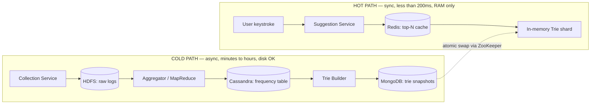

**Memory hook:** *"Rank once at write time, read is just a pointer chase."* Every deep-dive
decision in this guide — compression, per-node top-K caching, offline rebuilds, hot-swaps —
exists to make that one sentence true.

---

## Table of contents
[Interview Playbook](#interview-playbook) · [Requirements](#requirements-clarification) ·
[Capacity Estimation](#capacity-estimation-worked) · [Design Evolution](#design-evolution-from-naive-to-production) ·
[Trie Deep Dive](#deep-dive-the-trie) · [Partitioning](#deep-dive-partitioning-the-trie) ·
[Build vs Buy](#real-world-implementation-choices-build-vs-buy) · [Offline Pipeline](#deep-dive-the-offline-update-pipeline) ·
[Snapshot Lifecycle](#trie-snapshot-lifecycle) · [Ranking](#ranking-its-not-just-raw-frequency) ·
[Fuzzy Matching](#extension-fuzzy-matching--typo-tolerance) · [Evaluation](#evaluation-against-non-functional-requirements) ·
[Client-Side](#client-side-optimizations) · [Failure Modes](#failure-modes--failover) ·
[Security](#security--abuse-considerations) · [Monitoring](#monitoring--metrics) ·
[Numbers](#numbers-worth-memorizing) · [Golden Rules](#golden-rules) · [Cheat Sheet](#master-cheat-sheet)

---

## Interview playbook

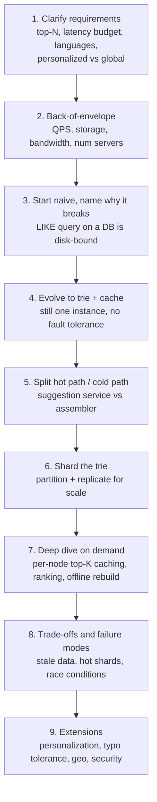

**What the interviewer is actually grading at each step:**
- Step 3: do you know *why* a DB fails here (no efficient prefix scan, disk latency) and reach
  for a trie unprompted, instead of being led there?
- Step 6: do you spot that naive alphabetic partitioning is skewed (far more words start with
  "S" than "X") before they hint at it?
- Step 7: do you separate "update the index" from "serve a request" as two services with
  different consistency/latency requirements, instead of one service doing both?

---

## Requirements clarification

### Functional
- Given a prefix, return the **top N (typically 5–10)** most relevant/frequent completions.
- Ingest new search queries and let them influence future rankings (the "trending" signal).
- (Common follow-up) Support **personalized** suggestions layered on top of global ones.

### Non-functional
| Requirement | Target | Why this number |
|---|---|---|
| Latency | < 100–200 ms end-to-end | Average human inter-keystroke interval is ~160ms. Faster is wasted work; much slower and the suggestion arrives after the user typed the next letter anyway — stale and annoying. |
| Availability | High, degrade gracefully | Losing typeahead ≠ losing search. Fail open (show nothing) rather than fail the whole search box. |
| Scalability | Horizontal, to billions of queries/day | Query volume grows faster than any single machine's RAM/CPU. |
| Consistency | Eventual | A trending term appearing 15 minutes late is a non-issue. Never trade latency for freshness here. |

**Say this out loud in the interview:** *"This is a system where I'll choose availability and
latency over strong consistency — a stale suggestion is a non-event, a slow one is a broken
product."* One sentence, and it signals you understand the CAP trade-off without being prompted.

---

## Capacity estimation, worked

Formula chain: **daily queries → unique queries → storage/day → storage/year**, and separately
**daily queries → characters/day → chars/sec → bandwidth**, and **peak QPS → servers**.

```
Given (Google-scale assumptions):
  Total queries/day        = 3.5 billion
  Unique queries/day       = 2 billion   (need persisting; duplicates just bump a counter)
  Avg query length         = 15 characters
  Storage per character    = 2 bytes (UTF-16-ish assumption)
  Single server capacity   = 8,000 QPS

Storage:
  2B queries x 15 chars x 2 bytes            = 60 GB / day
  60 GB/day x 365                             = 21.9 TB / year
  -> trivially fits in RAM across a modest cluster; the real cost is index-structure
     overhead (trie node pointers), not raw string bytes.

Bandwidth IN (one request per keystroke):
  3.5B queries/day x 15 chars                 = 52.5B chars/day
  52.5B / 86,400 sec                          ~= 0.607M chars/sec
  0.607M x 2 bytes x 8 bits                   ~= 9.7 Mb/sec incoming

Bandwidth OUT (top 10 suggestions per keystroke, each ~query-length):
  9.7 Mb/sec x 15 (length factor) x 10 (top-N) ~= 1.46 Gb/sec outgoing
  -> outgoing is ~150x incoming. You are NOT bandwidth-bound on what the user types,
     you're bandwidth-bound on what you echo back.

Servers (application tier only, ignoring cache/DB tier):
  607,000 QPS / 8,000 QPS per server          ~= 76 servers
  -> a floor. Add N+2 redundancy, geo-replication, and cache/DB tier and the real
     number is several multiples of 76.
```

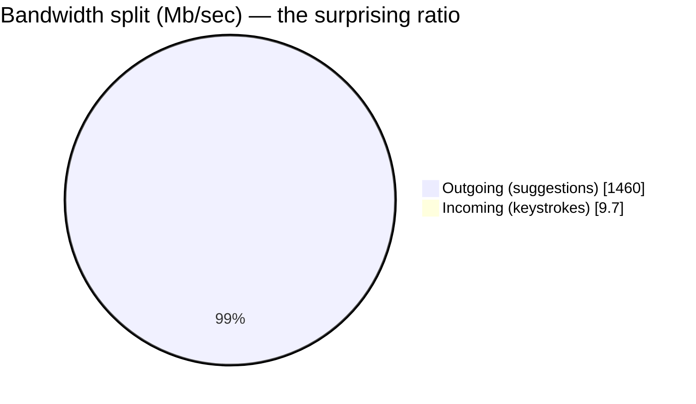

**Redo-the-chain test:** halve top-N (10→5) and outgoing bandwidth halves. Double average query
length and both storage and bandwidth double. Practice re-deriving the chain live, not
re-reciting the final numbers — interviewers change one input and watch what you do next.

---

## Design evolution: from naive to production

This is the most important section to internalize — it's the actual narrative arc of a live
interview. Each stage is "good enough to say out loud," each caption is the forcing function
that justifies the next stage. **Never jump straight to the final architecture — walk it.**

### Stage 0 — the naive (and wrong) first answer

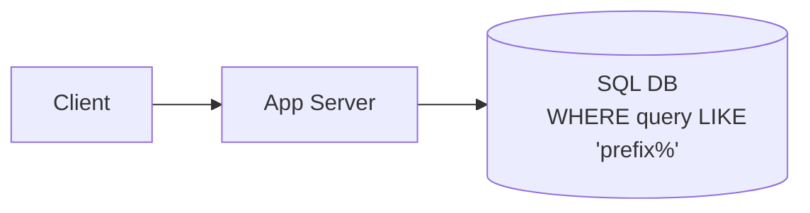

**Why it breaks:** `LIKE` with a leading-fixed, trailing-wildcard pattern still means scanning
rows the B-tree index can't shortcut past for large fan-out prefixes, at disk latency
(~1–10ms per seek), under a load of 600K+ QPS. It blows the 200ms budget by 10–100x and falls
over long before that. This is table stakes to say out loud — it's the fastest way to signal you
understand *why* the rest of the design exists.

### Stage 1 — put a trie in RAM

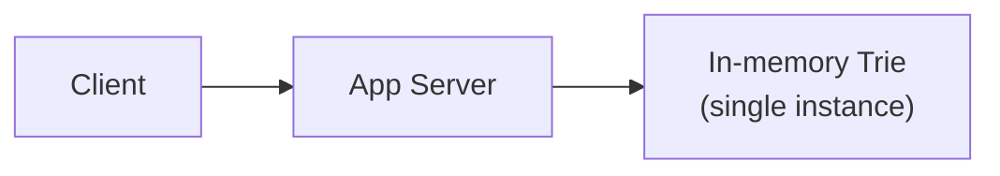

**Why it breaks:** Reads are now fast (O(prefix length), no disk) — but: single point of
failure, the trie is lost on crash/restart, and the same process that's serving live traffic
would also have to ingest every new query, which means either locking (kills latency) or an
inconsistent read while it mutates (kills correctness). One machine's RAM also can't hold a
Google-scale corpus.

### Stage 2 — split the hot path from the cold path

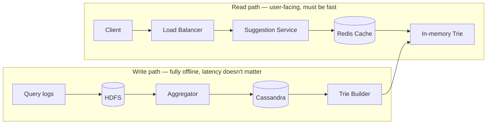

**API surface introduced at this stage:**

| API | Params | Returns | Notes |
|---|---|---|---|
| `getSuggestions(prefix)` | `prefix: string` | ranked list of ≤N completions | Called on every keystroke; must hit cache/RAM only, never DB |
| `addToDatabase(query)` | `query: string` | ack | Called by the assembler once a query crosses a frequency threshold; never called synchronously from the read path |

**Why it (eventually) breaks:** this is a legitimately good architecture for a mid-size
product. It breaks only at Google-scale QPS/data volume: one trie instance still can't hold the
whole corpus in one machine's memory, and one Suggestion Service instance can't absorb 600K+
QPS alone.

### Stage 3 — shard and replicate

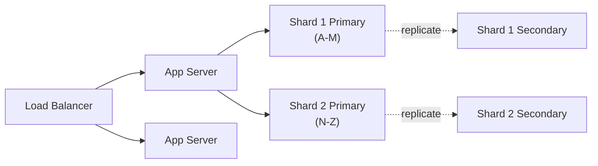

**Why it (eventually) breaks:** now horizontally scalable and fault-tolerant per shard — this
is "production-grade" per the source chapter. The next problems are *distribution* problems:
naive alphabetic ranges are traffic-skewed (see [Partitioning](#deep-dive-partitioning-the-trie)),
and users on the other side of the planet still pay cross-region RTT.

### Stage 4 — go global, add personalization

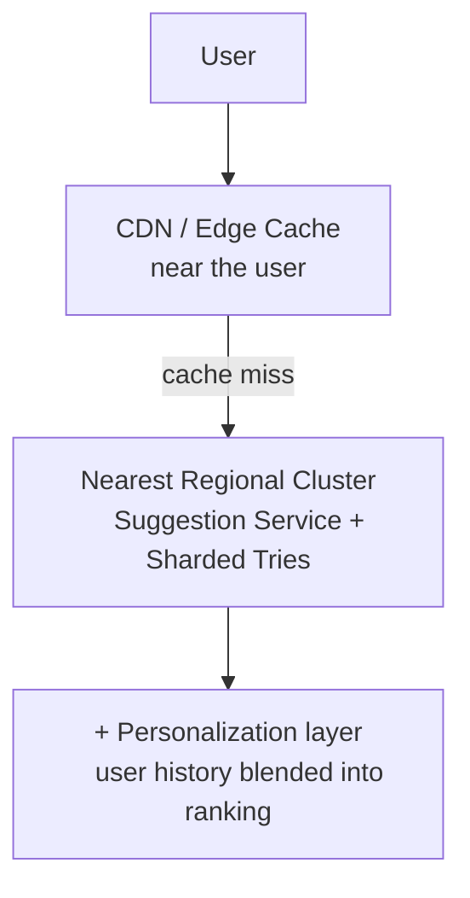

**This is the layer most candidates never reach in 45 minutes — naming it unprompted is a
strong signal of depth.** Push the hottest global prefixes to edge/CDN nodes (even into an
ISP's edge, per the source material), and blend a per-user history service into the final
ranked list before it leaves the region.

---

## Deep dive: the trie

### Basic structure
Each node holds one character; a path from root to a marked node spells a stored phrase. Given
the strings `UNITED`, `UNIQUE`, `UNIVERSAL`, `UNIVERSITY`:

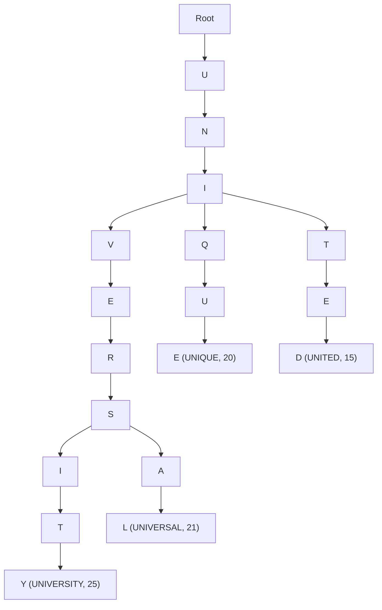

If the user types `UNIV`, descend to node `V` and everything below it is a candidate:
`UNIVERSAL`, `UNIVERSITY`. This is the whole trick: prefix search becomes tree descent,
O(prefix length), instead of a scan over the dataset.

### Compression: radix tree / Patricia trie
A plain trie wastes nodes on single-child chains. Collapse them into one node with a
multi-character label — a **radix tree** — to cut depth and therefore traversal time:

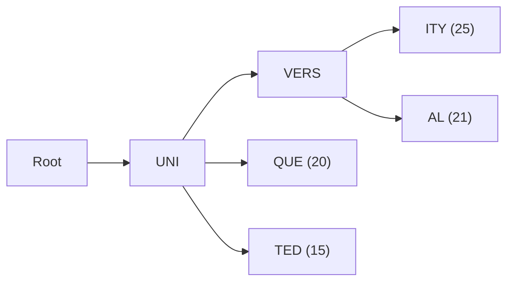

**Disambiguation — don't mix these up in an interview:**

| | Structure | Solves | Space |
|---|---|---|---|
| Trie | One char per node | Prefix matching | O(total chars) nodes |
| Radix / Patricia trie | Multi-char label per node, chains collapsed | Same as trie, denser — what production typeahead actually uses | Fewer nodes, same info |
| Suffix tree | Every *suffix* indexed, not just prefixes | Substring ("contains"), a different problem entirely | Larger |

### The real optimization: cache top-K at every node, not just leaves

Naive approach: descend to the prefix node, then DFS the entire subtree to find the top-10 by
frequency. That's O(subtree size) per request — terrible for a popular short prefix like `a`
with millions of descendants.

**Production technique:** precompute and cache the top-K completions **at every internal
node**, bottom-up, at build time — a k-way merge of each child's already-sorted top-K list.

**Worked example**, building top-2 at the `UNI` node from its three children's already-computed
top lists:

```
VERS subtree's cached top-2:   [UNIVERSITY:25, UNIVERSAL:21]
QUE  subtree's cached top-1:   [UNIQUE:20]
TED  subtree's cached top-1:   [UNITED:15]

Merge (like the merge step of merge sort — each input list is already sorted):
  candidates = [UNIVERSITY:25, UNIVERSAL:21, UNIQUE:20, UNITED:15]
  take top-2  = [UNIVERSITY:25, UNIVERSAL:21]   <- cached AT the UNI node itself

Cost of this merge: O(K x number of children), NOT O(size of entire subtree).
```

Now `getSuggestions("uni")` is: descend 3 nodes + read a pre-built list of 2 → **O(prefix
length + K)**, full stop. The ranking work was paid once, at trie-build time, amortized across
every future read. This is the single most-tested trie optimization in this chapter — have the
merge example ready to draw.

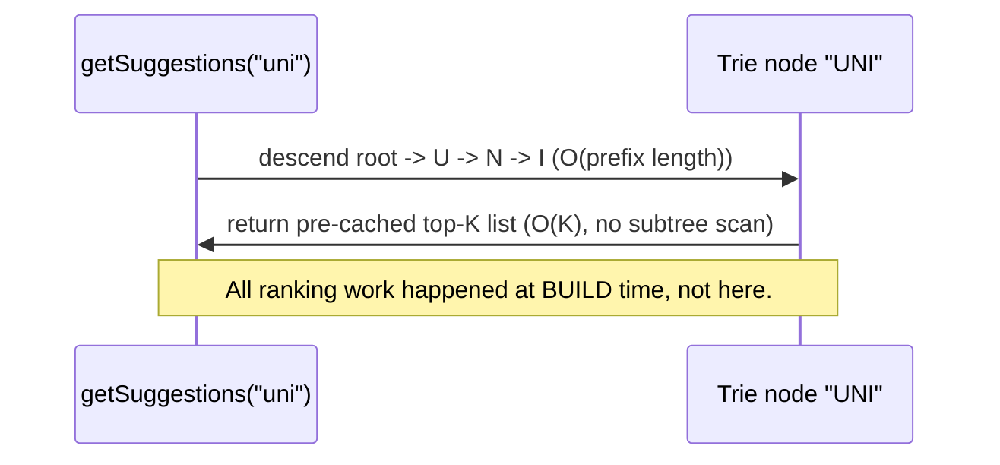

### Counter overflow
Frequencies grow unbounded over years.
1. Use a 64-bit counter — defers the problem essentially forever at realistic QPS.
2. **Decay/normalize periodically** (e.g., halve all counts every N days) — strictly better than
   just widening the int, because it also ages out stale trends: a term that was popular in
   2020 shouldn't out-rank this week's trending term purely on lifetime count.

---

## Deep dive: partitioning the trie

### Naive: alphabetic range partitioning
"A–M" on shard 1, "N–Z" on shard 2 — simple, but **provably skewed**: far more English words
start with "S" or "C" than "X" or "Z". One shard becomes a hot spot while another idles.

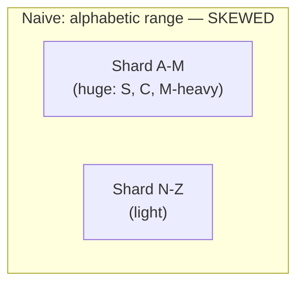

### Better: hash-based / consistent hashing on the prefix
Distribute by a hash of the prefix (or a traffic-weighted custom key) so shard boundaries track
**actual load, not alphabetical accident** — the same consistent-hashing move used to fix hot
keys in any sharded cache.

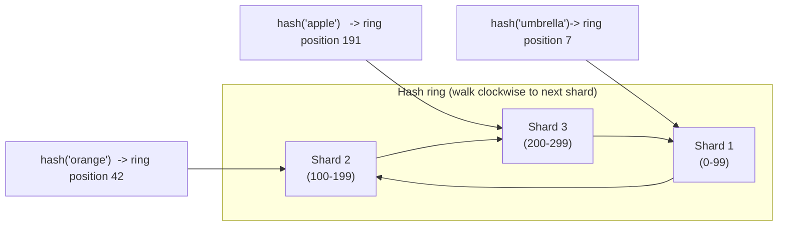

Each shard still gets a **primary + secondary replica** for durability and read fan-out — same
pattern as any other sharded stateful service. Virtual nodes (many ring positions per physical
shard) smooth out residual skew further, exactly as in consistent-hashing-based caches.

**Routing:** a lightweight `prefix → shard` mapping lives in every app server's memory or in
ZooKeeper/etcd — small enough that it's never itself a bottleneck.

**Watch out for:** very short prefixes (`a`, `th`) can still fan out across many shards' worth
of candidates even with good hashing — sharding strategy should be revisited as the corpus
grows, not fixed once and forgotten.

---

## Real-world implementation choices: build vs buy

Interviewers love asking "would you build this from scratch?" — know the alternatives and their
trade-offs, not just the custom-trie path this chapter builds.

| Approach | How it works | Strengths | Weaknesses |
|---|---|---|---|
| **Custom trie service** (this chapter) | Hand-rolled trie/radix tree, sharded, offline-rebuilt | Full control over ranking, per-node top-K caching, memory layout | Highest build/ops cost — you own index-building, sharding, replication |
| **Redis sorted sets** (`ZADD` + `ZRANGEBYLEX`) | Store terms as members scored by frequency; lexicographic range query simulates prefix match | Minimal code — Redis already gives you the data structure and the ops team already runs Redis | Ranking logic is limited to what sorted-set operations express; harder to blend personalization/decay without app-side logic |
| **Elasticsearch "completion suggester"** | Purpose-built FST (finite state transducer)-backed structure for prefix completion | Battle-tested, supports fuzzy matching and weighting out of the box, minimal custom code | Another distributed system to run and tune; less control over the exact ranking internals than a custom trie |

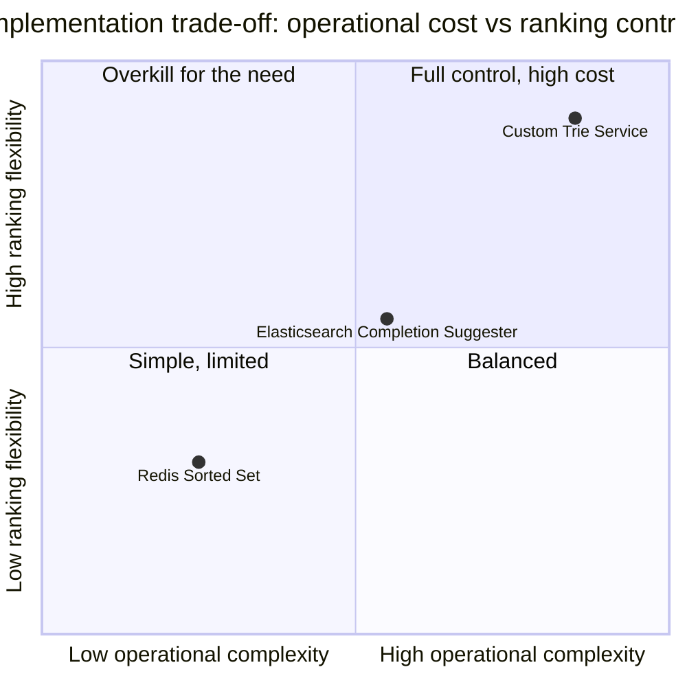

**The honest interview answer:** most real products (small-to-mid scale) should reach for
Redis sorted sets or Elasticsearch first — rung 5 of "already-installed dependency solves it"
beats hand-rolling a trie. You build the **custom sharded trie** only once you're at a scale
where off-the-shelf ranking flexibility or per-shard control genuinely becomes the bottleneck
(i.e., Google/Amazon scale — which is exactly the scale this chapter's numbers assume). Naming
this trade-off unprompted is a strong signal.

---

## Deep dive: the offline update pipeline

Core insight: **never update the trie synchronously on the read path.** Real-time mutation
under millions of concurrent readers means either locking (kills latency) or unsynchronized
mutation (kills correctness). So: batch it.

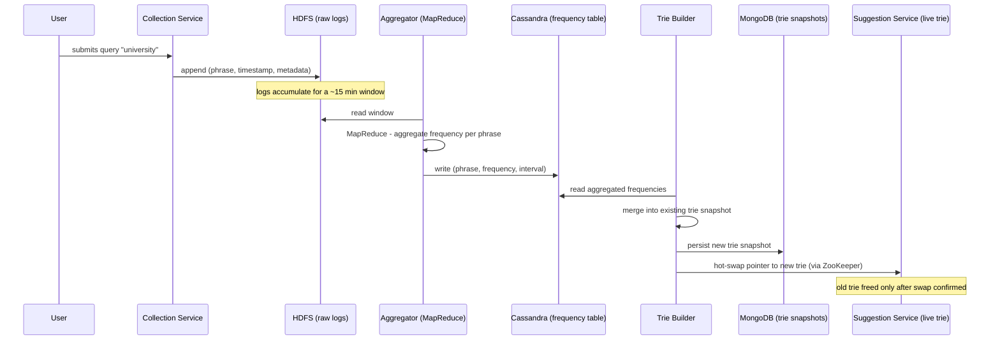

### Why each storage choice
| Stage | Store | Why this one |
|---|---|---|
| Raw logs | HDFS | Huge, append-only, unstructured write volume — built for exactly this |
| Aggregated frequency | Cassandra | Wide-column, high write throughput, tabular (phrase → frequency per interval) |
| Trie snapshot | MongoDB (or any doc/blob store) | Durability across restarts; loaded as "one whole blob," not queried field-by-field |
| Shard/snapshot coordination | ZooKeeper | Distributed coordination for "which snapshot is current," leader election for builder jobs |

### Hot-swap, not in-place mutation
Two safe patterns, both avoiding "mutate a structure a live reader is traversing":
1. **Blue-green trie**: build a full replacement offline, then swap the pointer atomically once ready.
2. **Primary/secondary roles**: update the secondary while primary serves traffic, flip roles
   once verified current, then update the now-idle former primary.

Readers only ever see a fully-built, immutable snapshot — never a half-updated tree. This is the
exact same trick used for config reloads, feature-flag rollouts, and Lucene/Elasticsearch
segment merges (new segments are built, old ones are never mutated in place).

**Update cadence trade-off:** shorter batch windows (5 min) → fresher trends, more rebuild
overhead. Longer windows (hourly) → cheaper, staler. State the trade-off and pick a number —
there's no universally correct answer.

---

## Trie snapshot lifecycle

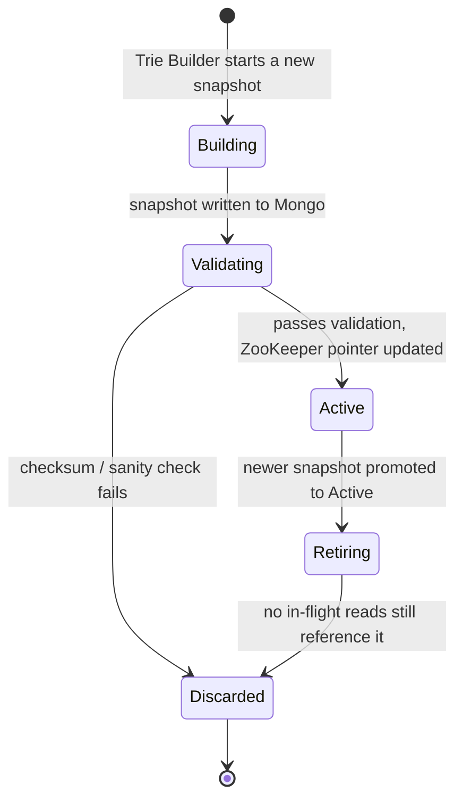

The **Retiring** state is easy to skip in a first pass and is worth naming explicitly: you
can't free the old trie's memory the instant a new one goes Active, because in-flight requests
may still be reading from it. Reference-count or grace-period it out.

---

## Ranking: it's not just raw frequency

Naive "most frequent wins" produces bad UX in ways an interviewer will probe:
- **Personalization**: a user's own history should outrank global popularity for their own
  session — personalized results take precedence over generic ones.
- **Recency/decay**: a term trending *this week* should beat a term popular for years but gone
  cold. Exponential decay on frequency counts handles this without unbounded counters.
- **Context**: prior words in the same search session, user's language/locale, geography.
- **Diversity**: don't return 10 near-duplicate completions of the single most common phrase.
- **Policy filtering**: certain suggestion categories (self-harm, hate speech, doxxing) must be
  suppressed regardless of frequency.

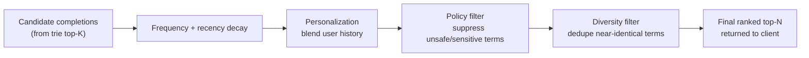

**Real-world analogue:** Google's autocomplete blends global query frequency, personal search
history, trending/spiking detection, and an explicit policy layer — ranking in production
typeahead is never "just sort by count," it's a pipeline.

---

## Extension: fuzzy matching / typo tolerance

A very common follow-up: *"what if the user typos the prefix?"* A plain trie only matches exact
prefixes — `"unversity"` won't find `UNIVERSITY`.

**Approaches, cheapest to most involved:**

| Approach | Idea | Cost |
|---|---|---|
| Edit-distance threshold at query time | Compute Levenshtein distance between typed prefix and candidate branches within distance ≤2 | Simple but can be expensive to do naively at trie-traversal time |
| BK-tree / metric tree of known terms | Pre-index terms by pairwise edit distance for fast "within distance K" lookups | Extra structure to build and maintain alongside the trie |
| Levenshtein automaton over the trie | Walk the trie while simultaneously tracking valid edit-distance states — used by Lucene/Elasticsearch's fuzzy suggester | Most efficient at scale; more complex to implement correctly |
| Client-side keyboard-adjacency correction | Cheap heuristic: treat adjacent-key substitutions as likely typos before hitting the server | Doesn't need server changes, catches the most common typo class |

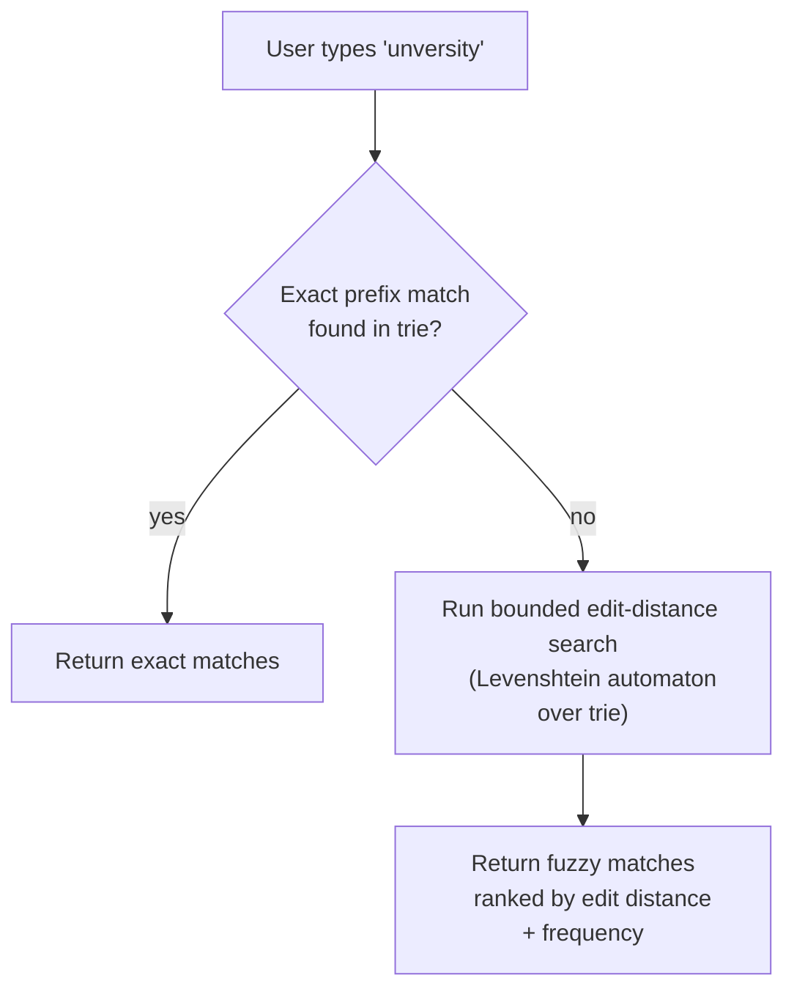

**Interview framing:** don't over-build this unless asked — mention it as a named extension
with the Levenshtein-automaton-over-a-trie answer ready, rather than trying to design it from
scratch live.

---

## Evaluation against non-functional requirements

| Requirement | How the design satisfies it |
|---|---|
| **Low latency** | Compressed trie (shallow depth) + top-K cached per node (O(1)-ish read) + Redis cache in front of the trie + offline updates (never on critical path) + geo-distributed servers |
| **Fault tolerance** | Primary/secondary trie replicas per shard; NoSQL (Cassandra/Mongo) replication; one shard/replica failing doesn't take down the whole prefix space |
| **Scalability** | Stateless application/suggestion-service tier scales horizontally behind the LB; shard count grows with data volume; add shards without touching read-path code |

---

## Client-side optimizations

- **Debounce**: fire a request only after a brief pause (~160ms) rather than on every
  keystroke — cuts request volume for fast typists who already know what they want.
- **Pre-warm the connection**: open the WebSocket/HTTP connection the moment the search box is
  focused, before the first character — removes connection-setup latency from the critical path.
- **Local client-side cache**: re-typing or backspacing into a previously-seen prefix should be
  free.
- **Edge caching**: push the hottest global prefixes to CDN/edge nodes so common prefixes
  ("a", "the", "how to") never round-trip to origin.
- **Request cancellation / sequencing**: discard stale out-of-order responses — otherwise a
  slow response for a short prefix can overwrite a faster response for a longer one.

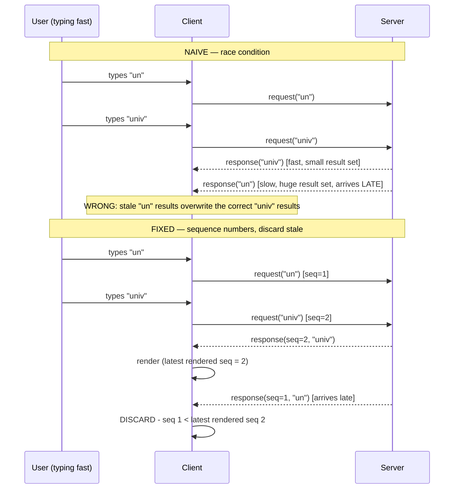

---

## Failure modes & failover

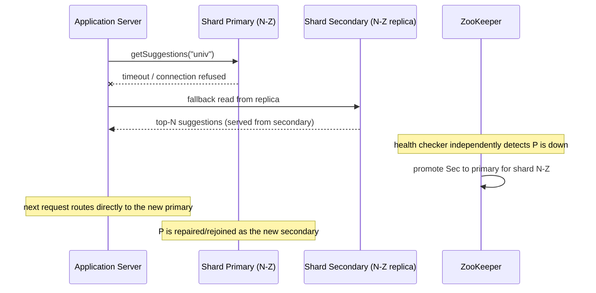

**Other failure modes worth naming:**
- **Cache stampede on Redis eviction**: a hot prefix's cache entry expiring under heavy load can
  send a burst of requests straight to the trie shard simultaneously — mitigate with
  request coalescing or staggered TTLs.
- **Trie-builder job failure mid-aggregation**: the old snapshot stays Active (see
  [lifecycle](#trie-snapshot-lifecycle)) — a failed build is a non-event for users, just a
  stale-by-one-window index, which is an acceptable trade per the eventual-consistency SLA.
- **Skewed shard under a viral trending query**: a single prefix suddenly dominating traffic
  (breaking news) can overload one shard even with good baseline hashing — needs either
  per-hot-key replication or a dedicated "trending" cache tier in front of the sharded trie.

---

## Security & abuse considerations

- **Suggestion poisoning**: a botnet issuing the same junk query millions of times can force it
  into the trending list. Mitigate with rate-limiting per user/IP *before* a query counts toward
  frequency aggregation, and anomaly detection on sudden frequency spikes from a narrow IP range.
- **PII / sensitive-data leakage**: never suggest completions derived from a query containing
  personal data typed by a *different* user (e.g., someone else's SSN typo'd into the search
  box) — global suggestions must be built from de-identified/aggregated logs, never raw
  per-user strings surfaced to other users.
- **Query injection**: the prefix is user input reaching a trie traversal and, downstream, log
  storage — sanitize/bound length before it touches any code path, same as any other
  user-supplied string at a trust boundary.
- **Scraping the suggestion API**: `getSuggestions` is a cheap way to enumerate what's popular;
  rate-limit per client to prevent competitors from mining trend data wholesale.

---

## Monitoring & metrics

Metrics an interviewer expects you to name when asked "how do you know this is working":

| Metric | What it tells you |
|---|---|
| p50 / p99 latency of `getSuggestions` | Is the hot path actually hitting its 100–200ms budget under real load? |
| Cache hit ratio (Redis) | Low hit ratio means either poor cache sizing or too many unique low-traffic prefixes — a capacity/TTL tuning signal |
| Suggestion click-through rate (CTR) | Product-level signal that ranking is actually useful, not just fast |
| Trie-rebuild job duration / staleness | How far behind "now" the live index is — ties directly to the freshness/cost trade-off from the update-cadence discussion |
| Per-shard QPS variance | Detects skew before it becomes an outage — the direct feedback loop for the partitioning scheme |

---

## Numbers worth memorizing

| Quantity | Value | Where it's used |
|---|---|---|
| Avg human inter-keystroke interval | ~160 ms | Sets both the server latency SLA floor and the client debounce delay |
| Target end-to-end latency | 100–200 ms | Suggestion staleness/responsiveness balance |
| Trie descent cost | O(prefix length) | Why tries beat DB scans |
| Top-K read cost (with cached top-K per node) | O(K), not O(subtree size) | The single biggest trie optimization |
| RAM access | ~100 ns | Why the whole hot path must avoid disk |
| SSD/DB query | ~1–10 ms (or worse under load) | Why a DB-backed prefix scan blows the latency budget by 10–100x |
| Same-datacenter RTT | ~0.5–1 ms | Negligible vs. DB query — reinforces "the bottleneck is disk, not network" |
| Outgoing : incoming bandwidth ratio (worked example) | ~150 : 1 | You're bandwidth-bound on suggestions returned, not keystrokes received |

---

## Golden rules

- **Never put the write path on the read path's critical section.** Index updates are batch/
  offline; suggestions are always served from an already-built, immutable snapshot.
- **RAM, not disk, for anything on the keystroke-to-response path.** If a request can touch a
  disk-backed database synchronously, the design is wrong.
- **Rank at write time, not read time.** Precompute top-K per node so a read is a descent plus a
  pointer read, never a subtree scan.
- **Stale is fine, slow is not.** Eventual consistency, hard latency ceiling — say this
  explicitly and defend it.
- **Fail open.** If the suggestion service is down, the search box still works — it just shows
  no suggestions. Never let typeahead availability gate core search availability.
- **Partition by load, not by alphabet.** Naive range partitioning on the first letter looks
  simple and is provably skewed — call this out before the interviewer has to.
- **Reach for the off-the-shelf structure (Redis sorted sets, Elasticsearch) before hand-rolling
  a trie service** — build the custom version only once scale genuinely demands the extra control.

---

## How to identify this topic in an interview

- "Design autocomplete for a search bar / IDE / command palette."
- "Design a system that suggests the next word/phrase as a user types."
- "How would you support prefix search over billions of strings with sub-200ms latency?"
- Any variant of "design Google Search" followed up with "what about the search-box
  suggestions?"
- A question emphasizing "as the user types" + "real-time" + "top-N ranked" points to
  trie + offline-aggregation, as opposed to a general search/ranking system (which would point
  toward inverted indexes and relevance scoring instead).

---

## Master cheat sheet

**One-liners:**
- Typeahead = trie in RAM (hot path) + log→MapReduce→trie rebuild (cold path), joined only by a
  scheduled atomic swap.
- Why not a DB: prefix scans are disk-bound; a trie makes prefix lookup O(prefix length) in RAM.
- Compress the trie (radix/Patricia) to cut traversal depth; cache top-K *per node* to cut
  ranking cost from O(subtree) to O(K).
- Partition by actual load (consistent hashing / traffic-weighted), not alphabet range —
  alphabetic ranges are provably skewed.
- Update offline, swap atomically (blue-green trie or primary/secondary role flip) — readers
  never see a half-built tree; old snapshots retire only after in-flight reads drain.
- Ranking = frequency + recency decay + personalization + policy filter + diversity, not raw
  count alone.
- Fuzzy matching = Levenshtein automaton walked over the trie (production answer); don't design
  it from scratch live unless asked to go deep.
- Client-side: debounce ~160ms, pre-warm connections, cache locally, discard stale/out-of-order
  responses by sequence number.
- Build vs buy: Redis sorted sets or Elasticsearch completion suggester first; custom sharded
  trie only at Google/Amazon-scale ranking-control needs.
- Fail open: no suggestions is an acceptable degraded state; a slow search box is not.

**Formula chain:**
```
storage/day   = unique_queries x avg_len x bytes_per_char
bandwidth_in  = (total_queries x avg_len) / seconds_per_day x bytes_per_char x 8
bandwidth_out = bandwidth_in x top_N x (length_ratio suggestion:query)
servers       = peak_QPS / QPS_per_server   (then add redundancy + cache/DB tier)
```

**Numbers:** 160ms keystroke interval · <200ms SLA · O(prefix length) trie descent · O(K) ranked
read with precomputed top-K · ~100ns RAM vs ~1-10ms DB · ~150:1 outgoing:incoming bandwidth.
